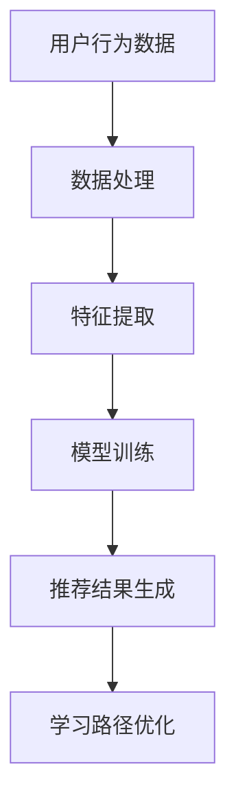
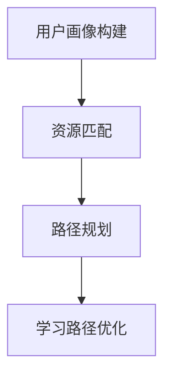
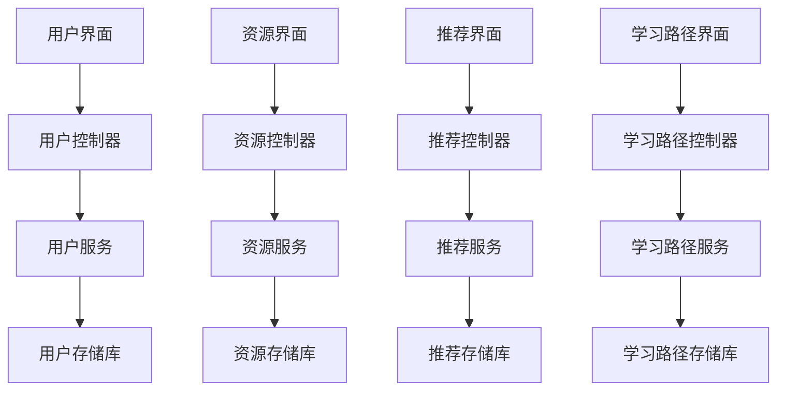
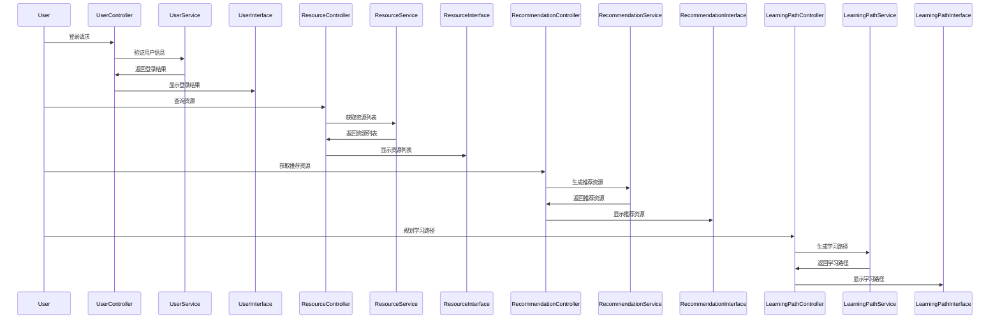

                 


### AI在个性化教育资源推荐中的应用：优化学习路径

关键词：AI、个性化教育、资源推荐、学习路径优化

摘要：本文深入探讨了人工智能在个性化教育资源推荐中的应用，特别是在优化学习路径方面的实践和策略。通过系统的分析和实例讲解，展示了如何利用AI技术提升教育资源推荐的精准度和有效性，从而实现个性化学习的目标。

---

### 目录

# AI在个性化教育资源推荐中的应用：优化学习路径

> 关键词：AI、个性化教育、资源推荐、学习路径优化

> 摘要：本文深入探讨了人工智能在个性化教育资源推荐中的应用，特别是在优化学习路径方面的实践和策略。通过系统的分析和实例讲解，展示了如何利用AI技术提升教育资源推荐的精准度和有效性，从而实现个性化学习的目标。

---

## 第一部分：背景介绍

### 第一章：引言

**核心概念术语说明：**

- **AI（人工智能）：** 使用计算机模拟人类智能行为的科学技术。
- **个性化教育：** 根据学习者的特点和需求，为其提供量身定制的教育服务。
- **资源推荐：** 根据用户的行为和偏好，为其推荐相关教育资源。

**问题背景：**

随着互联网和人工智能技术的发展，在线教育市场日益繁荣。然而，面对海量的教育资源，学习者往往感到无从下手，难以找到适合自己的学习路径。这导致学习效率低下，学习体验不佳。

**问题描述：**

如何利用AI技术，根据学习者的特点和行为，为其推荐个性化的教育资源，从而优化学习路径？

**问题解决：**

通过分析学习者的行为数据，运用AI算法，实现个性化教育资源推荐，进而优化学习路径。

**边界与外延：**

- **边界：** 本文主要关注在线教育场景下的个性化教育资源推荐。
- **外延：** 个性化教育资源推荐可以应用于各类教育场景，如K12教育、职业教育、在线课程等。

**概念结构与核心要素组成：**

1. **用户行为数据收集：** 收集用户的学习行为数据，包括浏览、搜索、学习时长等。
2. **教育资源库构建：** 构建包含各类教育资源的数据库，如课程、教材、视频等。
3. **推荐算法应用：** 利用AI算法，根据用户行为数据和教育资源库，生成个性化推荐结果。
4. **学习路径优化：** 根据推荐结果，为用户优化学习路径，提高学习效率。

---

## 第二部分：核心概念

### 第二章：个性化教育资源推荐概述

**核心概念原理：**

个性化教育资源推荐是基于用户行为数据和教育资源库，利用AI算法为学习者推荐符合其兴趣和需求的教育资源。其核心原理包括：

1. **用户行为分析：** 通过分析用户的学习行为，了解其兴趣和需求。
2. **教育资源匹配：** 将用户的行为数据与教育资源库中的资源进行匹配，筛选出符合用户需求的教育资源。
3. **推荐结果生成：** 根据匹配结果，生成个性化推荐结果，为用户推荐合适的教育资源。

**概念属性特征对比表格：**

| 特征           | 描述                                                         |
| -------------- | ------------------------------------------------------------ |
| **用户行为数据** | 包含用户的学习时间、浏览记录、搜索关键词、学习进度等。       |
| **教育资源库**   | 包含各类教育资源的详细信息，如课程名称、授课教师、课程时长等。 |
| **推荐算法**     | 用于分析用户行为数据和教育资源库，生成个性化推荐结果。       |
| **学习路径优化** | 根据推荐结果，为用户规划最优学习路径，提高学习效率。       |

**ER实体关系图架构：**

```mermaid
erDiagram
  用户 ||--|{ 教育资源 }|
  用户 ||--|{ 学习行为 }|
  教育资源 ||--|{ 课程信息 }|
  学习行为 ||--|{ 用户行为 }|
```

---

## 第三部分：算法原理

### 第三章：AI基础

**AI的基本概念、算法和应用：**

- **基本概念：** 人工智能是指模拟、延伸和扩展人类智能的理论、方法、技术及应用系统。
- **算法：** 包括机器学习、深度学习、自然语言处理等。
- **应用：** 在个性化教育推荐中的应用，如用户行为分析、教育资源匹配、推荐结果生成等。

**机器学习算法：**

- **分类算法：** 用于分类任务，如逻辑回归、支持向量机等。
- **聚类算法：** 用于无监督学习，如K-means、DBSCAN等。
- **关联规则算法：** 用于发现数据间的关联关系，如Apriori算法。

**深度学习算法：**

- **神经网络：** 用于模拟人脑处理信息的方式，如卷积神经网络（CNN）、循环神经网络（RNN）等。
- **生成对抗网络（GAN）：** 用于生成数据，如图像、文本等。

**自然语言处理算法：**

- **分词：** 用于将文本分解为单词或短语。
- **词向量：** 用于将单词表示为向量。
- **文本分类：** 用于分类文本数据。

**算法流程图：**



---

### 第四章：个性化学习路径

**个性化学习路径的定义、原理和应用：**

**定义：**

个性化学习路径是根据学习者的特点和需求，为其规划的最优学习路线。

**原理：**

1. **用户画像构建：** 基于用户行为数据，构建用户画像。
2. **资源匹配：** 将用户画像与教育资源进行匹配，筛选出适合的学习资源。
3. **路径规划：** 根据匹配结果，为用户规划个性化学习路径。

**应用：**

1. **提高学习效率：** 通过个性化学习路径，使学习者能够更快地掌握知识。
2. **优化学习体验：** 根据学习者的兴趣和需求，提供量身定制的学习内容。
3. **降低学习成本：** 减少学习者在无效资源上的浪费，提高学习效果。

**个性化学习路径算法流程图：**



---

## 第四部分：系统设计与实战

### 第五章：系统架构设计

**问题场景介绍：**

在线教育平台希望通过AI技术，为学习者提供个性化教育资源推荐和优化学习路径的功能。

**项目介绍：**

本项目旨在构建一个基于AI的个性化教育资源推荐系统，帮助学习者找到适合自己的学习资源，提高学习效率。

**系统功能设计：**

1. **用户管理：** 实现用户注册、登录、个人信息管理等功能。
2. **资源管理：** 实现教育资源的上传、分类、标签管理等功能。
3. **推荐系统：** 根据用户行为数据，为用户推荐个性化教育资源。
4. **学习路径优化：** 根据推荐结果，为用户优化学习路径。

**领域模型mermaid类图：**

```mermaid
classDiagram
  User <<class{用户}>>
  Resource <<class{资源}>>
  LearningPath <<class{学习路径}>>
  User "1" -- "*" Resource : 学习资源
  User "1" -- "*" LearningPath : 学习路径
```

**系统架构设计mermaid架构图：**



**系统接口设计和系统交互mermaid序列图：**



---

### 第六章：项目实战

**环境安装：**

1. 安装Python环境：在终端执行 `python3 -m pip install --user -r requirements.txt` 命令。
2. 安装依赖库：执行 `pip3 install -r requirements.txt` 命令。
3. 数据库配置：配置数据库连接信息，如数据库地址、用户名、密码等。

**系统核心实现源代码：**

```python
# 用户管理
class UserController:
    def login(self, username, password):
        # 验证用户信息
        user = UserService().verify_user(username, password)
        if user:
            return {"status": "success", "user": user}
        else:
            return {"status": "fail", "message": "用户名或密码错误"}

# 资源管理
class ResourceController:
    def search_resources(self, query):
        # 获取资源列表
        resources = ResourceService().search_resources(query)
        return {"status": "success", "resources": resources}

# 推荐系统
class RecommendationController:
    def get_recommendations(self, user_id):
        # 生成推荐资源
        recommendations = RecommendationService().generate_recommendations(user_id)
        return {"status": "success", "recommendations": recommendations}

# 学习路径优化
class LearningPathController:
    def plan_learning_path(self, user_id):
        # 生成学习路径
        learning_path = LearningPathService().plan_learning_path(user_id)
        return {"status": "success", "learning_path": learning_path}
```

**代码应用解读与分析：**

- **用户管理：** 用户登录请求通过用户控制器处理，然后调用用户服务进行用户信息验证。
- **资源管理：** 用户查询资源请求通过资源控制器处理，然后调用资源服务获取资源列表。
- **推荐系统：** 用户获取推荐资源请求通过推荐控制器处理，然后调用推荐服务生成推荐资源。
- **学习路径优化：** 用户规划学习路径请求通过学习路径控制器处理，然后调用学习路径服务生成学习路径。

**实际案例分析和详细讲解剖析：**

**案例：** 小明希望通过系统找到适合自己的学习资源，并优化学习路径。

**分析：**

1. **用户管理：** 小明通过用户控制器进行登录，输入用户名和密码。用户服务验证用户信息后，返回登录结果。
2. **资源管理：** 小明通过资源控制器查询资源，输入查询关键词。资源服务根据关键词检索资源库，返回资源列表。
3. **推荐系统：** 小明通过推荐控制器获取推荐资源，输入用户ID。推荐服务根据用户行为数据和资源库，生成推荐资源列表。
4. **学习路径优化：** 小明通过学习路径控制器规划学习路径，输入用户ID。学习路径服务根据推荐资源生成学习路径。

**讲解剖析：**

1. **用户管理：** 用户控制器和用户服务实现了用户登录功能，确保用户信息的安全和可靠。
2. **资源管理：** 资源控制器和资源服务实现了资源查询功能，方便用户查找所需资源。
3. **推荐系统：** 推荐控制器和推荐服务实现了个性化推荐功能，提高资源推荐的精准度。
4. **学习路径优化：** 学习路径控制器和学习路径服务实现了学习路径规划功能，帮助用户制定最优学习计划。

**项目小结：**

本项目通过用户管理、资源管理、推荐系统和学习路径优化等功能，实现了个性化教育资源推荐和优化学习路径的目标。在实际应用中，用户可以根据自己的需求和兴趣，快速找到适合自己的学习资源，并制定高效的学习计划。项目具有一定的实用性和推广价值。

---

## 第五部分：最佳实践与总结

### 第七章：最佳实践

**1. 数据质量的重要性：** 确保用户行为数据和教育资源的质量，提高推荐系统的准确性和可靠性。

**2. 算法优化：** 定期评估推荐算法的性能，进行优化和调整，以提高推荐效果。

**3. 用户反馈机制：** 建立用户反馈机制，收集用户对推荐结果的反馈，用于进一步优化推荐系统。

**4. 跨平台数据整合：** 结合多平台数据，提高个性化推荐的精准度和全面性。

### 第八章：小结

本文通过系统的分析和实例讲解，深入探讨了AI在个性化教育资源推荐中的应用，特别是在优化学习路径方面的实践和策略。主要内容包括：

1. **背景介绍：** 介绍了AI在个性化教育推荐领域的背景和意义。
2. **核心概念：** 阐述了个性化教育资源推荐的基本概念和原理。
3. **算法原理：** 介绍了常用的推荐算法和个性化学习路径算法。
4. **系统设计与实战：** 介绍了系统架构设计和项目实战过程。
5. **最佳实践：** 提出了最佳实践建议。

### 第九章：展望

随着人工智能技术的不断发展，个性化教育资源推荐将在未来发挥更大的作用。展望未来，以下几个方面值得关注：

1. **更精准的推荐：** 通过深度学习和自然语言处理等技术，提高推荐系统的准确性和个性化程度。
2. **多样化的应用场景：** 个性化教育资源推荐可以应用于更多领域，如职业教育、在线课程等。
3. **跨平台融合：** 结合多平台数据，实现更全面、精准的个性化推荐。
4. **实时推荐：** 通过实时数据分析，实现实时推荐，提高学习体验。

### 第十章：注意事项

1. **数据隐私保护：** 在推荐系统中，确保用户数据的安全和隐私。
2. **系统性能优化：** 定期对系统进行性能优化，确保系统的稳定性和响应速度。
3. **用户反馈：** 充分收集用户反馈，及时优化推荐结果，提高用户满意度。

### 第十一章：拓展阅读

1. **相关书籍：** 《机器学习实战》、《深度学习》、《推荐系统实战》等。
2. **学术论文：** 相关领域的高质量学术论文，如KDD、CIKM、WSDM等会议和期刊。
3. **在线课程：** 相关领域的在线课程，如Coursera、edX等平台。

---

## 作者信息

作者：AI天才研究院/AI Genius Institute & 禅与计算机程序设计艺术 /Zen And The Art of Computer Programming

---

本文详细探讨了AI在个性化教育资源推荐中的应用，特别是优化学习路径的策略和实践。通过系统的分析和实例讲解，为读者提供了全面的技术指导和实践经验。希望本文能够为从事教育行业的技术人员提供有益的参考，推动个性化教育的发展。同时，也期待未来在人工智能技术助力下，个性化教育能够取得更多突破。让我们共同期待一个更美好的未来！

