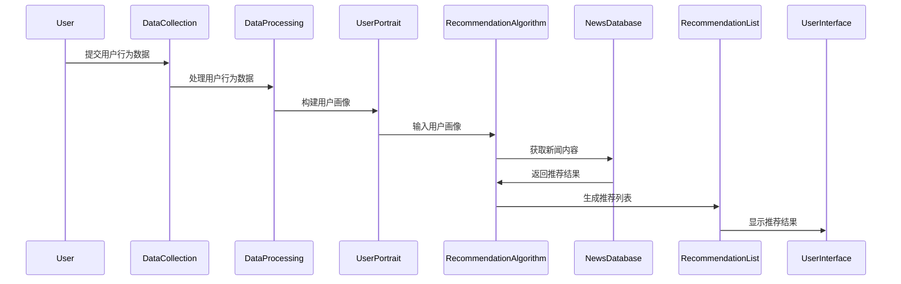
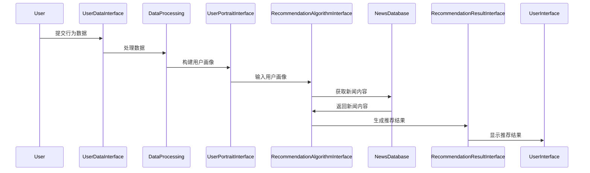

                 

# AI在个性化新闻推荐中的应用：提供定制化信息流

## 关键词

- 个性化新闻推荐
- AI技术
- 机器学习
- 深度学习
- 用户画像
- 协同过滤

## 摘要

在信息爆炸的时代，用户面临着海量信息的困扰。个性化新闻推荐通过分析用户的行为数据，利用AI技术，为用户定制化提供感兴趣的新闻内容。本文将从背景、核心概念、算法原理、系统架构和项目实战等方面，深入探讨AI在个性化新闻推荐中的应用，为读者提供一整套系统的技术理解与实践指南。

## 第1章: AI在个性化新闻推荐中的背景与重要性

### 1.1 问题的背景

在当今的信息时代，互联网上的信息量以惊人的速度增长。用户每天都会接触到大量的新闻、文章、视频等，但这些信息并不总是与他们的兴趣和需求相符。如何从这些海量的信息中筛选出对用户有价值的内容，成为了推荐系统面临的主要挑战。

### 1.2 问题描述

个性化新闻推荐的目标是根据用户的兴趣和行为数据，生成一个定制化的新闻信息流，使用户能够高效地获取他们感兴趣的内容。然而，要实现这一目标，需要处理以下问题：

- **数据复杂性**：用户行为数据类型多样，包括浏览历史、点击记录、搜索关键词等。
- **实时性要求**：用户兴趣可能随时间变化，推荐系统需要实时更新。
- **隐私保护**：用户数据的安全和隐私是推荐系统必须考虑的问题。

### 1.3 问题解决

AI技术的发展为个性化新闻推荐提供了新的解决方案。通过使用机器学习和深度学习算法，推荐系统可以从用户行为数据中学习，构建用户兴趣模型，实现更精准的推荐。此外，AI技术还能处理大量实时数据，提高推荐的实时性和响应速度。

### 1.4 边界与外延

个性化新闻推荐的应用不仅限于新闻领域，还可以扩展到社交媒体、电商、视频网站等。随着5G和物联网技术的发展，个性化推荐的应用场景将更加广泛。

### 1.5 概念结构与核心要素组成

#### 1.5.1 关键概念

- **个性化推荐系统**：基于用户行为数据，为用户提供定制化信息的服务系统。
- **用户行为数据**：包括用户的阅读历史、点击、搜索、购买等行为。
- **新闻内容**：包括标题、摘要、正文等。

#### 1.5.2 核心要素

- **用户画像**：基于用户行为数据构建的用户兴趣模型。
- **推荐算法**：用于从大量新闻内容中筛选出符合用户兴趣的算法。
- **评价机制**：用于评估推荐结果的质量。

### 1.6 本章小结

本章介绍了AI在个性化新闻推荐中的应用背景、问题描述、解决方案以及边界与外延。下一章将深入探讨个性化新闻推荐的核心概念与联系。

## 第2章: 个性化新闻推荐的核心概念与联系

### 2.1 个性化推荐系统概述

#### 2.1.1 推荐系统的定义与作用

推荐系统是利用人工智能技术，根据用户的历史行为和兴趣，为用户推荐可能感兴趣的内容的一种信息系统。它广泛应用于电子商务、社交媒体、新闻推送等领域，极大地提升了用户满意度。

#### 2.1.2 推荐系统的发展历程

从早期的基于内容的推荐（CBR）和协同过滤推荐（CF）到深度学习时代的个性化推荐，推荐系统经历了多次技术革新，推荐效果不断优化。

#### 2.1.3 个性化推荐系统的工作流程

个性化推荐系统通常包括数据收集、用户画像构建、推荐算法选择、推荐结果生成和用户反馈收集等环节。

### 2.2 用户行为数据

#### 2.2.1 用户行为数据的类型

用户行为数据包括用户的浏览历史、搜索记录、点击行为、购买行为、点赞和评论等。这些数据可以用来构建用户的兴趣模型。

#### 2.2.2 用户行为数据的特点

用户行为数据具有非结构化、动态变化、多样性和海量性等特点，这使得数据处理和分析变得复杂。

#### 2.2.3 用户行为数据的质量与预处理

用户行为数据的质量直接影响到推荐系统的效果，因此需要对数据进行清洗、去噪、归一化和特征提取等预处理操作。

### 2.3 新闻内容

#### 2.3.1 新闻内容的结构

新闻内容通常包括标题、摘要、正文、图片、视频等多媒体元素。

#### 2.3.2 新闻内容的特征

新闻内容的特征提取是推荐系统中的一个重要步骤，常用的特征包括文本特征、标签特征、媒体特征等。

#### 2.3.3 新闻内容的质量评估

新闻内容的质量评估是推荐系统中的一个关键问题，常用的评估方法包括人工评估和自动评估。

### 2.4 用户画像

#### 2.4.1 用户画像的定义

用户画像是对用户特征和兴趣进行抽象和建模的结果，通常包括用户的基本信息、兴趣偏好、行为轨迹等。

#### 2.4.2 用户画像的构建方法

用户画像的构建方法包括基于规则的方法、基于机器学习的方法和基于深度学习的方法等。

#### 2.4.3 用户画像的应用

用户画像在个性化推荐、广告投放、用户行为预测等领域有着广泛的应用。

### 2.5 推荐算法

#### 2.5.1 推荐算法的类型

推荐算法可以分为基于内容的推荐、协同过滤推荐和混合推荐等类型。

#### 2.5.2 常见的推荐算法

本章将介绍基于内容的推荐（CBR）、协同过滤推荐（CF）和深度学习推荐（DLR）等常见算法的原理和应用。

#### 2.5.3 推荐算法的评估指标

推荐算法的评估指标包括准确率、召回率、F1值、点击率等。

### 2.6 本章小结

本章详细介绍了个性化推荐系统的核心概念与联系，包括推荐系统的概述、用户行为数据、新闻内容、用户画像和推荐算法。下一章将深入探讨个性化新闻推荐中的算法原理。

## 第3章: 个性化新闻推荐中的算法原理

### 3.1 基于内容的推荐算法（CBR）

#### 3.1.1 算法原理

基于内容的推荐算法（CBR）通过分析新闻内容的特征（如文本、标签、媒体特征等），将与用户兴趣相似的内容推荐给用户。其主要原理是：

\[ \text{推荐结果} = \text{用户兴趣特征} \cap \text{新闻内容特征} \]

#### 3.1.2 算法流程

1. **特征提取**：从新闻内容中提取文本、标签、媒体等特征。
2. **用户兴趣模型构建**：通过用户的历史行为，构建用户的兴趣模型。
3. **推荐生成**：计算新闻内容与用户兴趣模型的相关性，生成推荐列表。

#### 3.1.3 示例

假设用户A对科技新闻感兴趣，系统会提取用户A的兴趣标签“科技”，然后从所有科技新闻中提取文本特征，如关键词“人工智能”、“云计算”等。当有新的科技新闻发布时，系统会将其与用户A的兴趣特征进行比较，若相关性高，则将其推荐给用户A。

### 3.2 协同过滤推荐算法（CF）

#### 3.2.1 算法原理

协同过滤推荐算法（CF）通过分析用户之间的相似性，推荐用户可能感兴趣的内容。其主要原理是：

\[ \text{推荐结果} = \text{用户相似度} \times \text{其他用户喜欢的新闻} \]

#### 3.2.2 算法流程

1. **用户相似度计算**：计算用户之间的相似度，常用的方法是余弦相似度、皮尔逊相关系数等。
2. **邻居选择**：选择与目标用户最相似的邻居用户。
3. **推荐生成**：将邻居用户喜欢的新闻推荐给目标用户。

#### 3.2.3 示例

假设用户B喜欢科技新闻，而用户C也喜欢科技新闻。系统会计算用户B和用户C的相似度，若相似度较高，则认为用户B可能对用户C喜欢的其他科技新闻感兴趣，将其推荐给用户B。

### 3.3 深度学习推荐算法（DLR）

#### 3.3.1 算法原理

深度学习推荐算法（DLR）利用深度神经网络，从用户行为数据和新闻内容中学习，生成用户兴趣模型和推荐结果。其主要原理是：

\[ \text{推荐结果} = \text{神经网络输出} \]

#### 3.3.2 算法流程

1. **数据预处理**：对用户行为数据和新闻内容进行清洗和特征提取。
2. **模型训练**：使用预处理后的数据训练深度学习模型。
3. **推荐生成**：将用户行为数据和新闻内容输入到训练好的模型中，生成推荐结果。

#### 3.3.3 示例

假设系统使用一个基于卷积神经网络（CNN）的深度学习模型，输入用户A的浏览历史和新闻内容特征，模型会输出用户A的兴趣偏好。系统将用户A的兴趣偏好与新闻内容进行比较，生成推荐列表。

### 3.4 本章小结

本章介绍了基于内容的推荐算法（CBR）、协同过滤推荐算法（CF）和深度学习推荐算法（DLR）的原理、流程和示例。这些算法在个性化新闻推荐中发挥着重要作用，下一章将讨论个性化新闻推荐系统中的架构设计。

## 第4章: 个性化新闻推荐系统的架构设计

### 4.1 问题场景介绍

随着互联网的发展，新闻信息量日益庞大，用户需要花费大量时间筛选自己感兴趣的内容。个性化新闻推荐系统旨在通过分析用户行为数据，为用户定制化推荐新闻，提高用户满意度。

### 4.2 项目介绍

本文将介绍一个基于深度学习的个性化新闻推荐系统，系统分为数据收集、数据处理、用户画像构建、推荐算法和推荐结果生成等模块。

### 4.3 系统功能设计

#### 4.3.1 领域模型

领域模型定义了系统中的关键实体和关系。在个性化新闻推荐系统中，主要实体包括用户、新闻、推荐列表等。

```
user
|-- id (用户ID)
|-- name (用户名)
|-- age (年龄)
|-- gender (性别)
|-- interests (兴趣列表)

news
|-- id (新闻ID)
|-- title (标题)
|-- abstract (摘要)
|-- content (正文)
|-- tags (标签列表)
|-- publish_time (发布时间)

recommendation_list
|-- id (推荐列表ID)
|-- user_id (用户ID)
|-- news_id (新闻ID)
|-- create_time (创建时间)
```

#### 4.3.2 类图

以下是一个简化版的类图，展示了领域模型中的关键类及其关系。

```mermaid
classDiagram
    User <<entity>>
    News <<entity>>
    RecommendationList <<entity>>

    User有关系:浏览新闻 -> News
    News有关系:被推荐 -> RecommendationList
    RecommendationList有关系:属于用户 -> User
```

### 4.4 系统架构设计

个性化新闻推荐系统的架构设计如图所示。



### 4.5 系统接口设计

系统接口设计包括用户行为数据接口、用户画像接口、推荐算法接口和推荐结果接口等。

```mermaid
classDiagram
    UserDataInterface <<interface>>
    UserPortraitInterface <<interface>>
    RecommendationAlgorithmInterface <<interface>>
    RecommendationResultInterface <<interface>>

    UserDataInterface有关系:获取用户行为数据 -> UserPortraitInterface
    UserPortraitInterface有关系:构建用户画像 -> RecommendationAlgorithmInterface
    RecommendationAlgorithmInterface有关系:获取新闻内容 -> NewsDatabase
    RecommendationAlgorithmInterface有关系:生成推荐结果 -> RecommendationResultInterface
    RecommendationResultInterface有关系:返回推荐结果 -> UserInterface
```

### 4.6 系统交互

以下是一个简化版的序列图，展示了个性化新闻推荐系统的交互过程。



### 4.7 本章小结

本章介绍了个性化新闻推荐系统的问题场景、项目介绍、系统功能设计、系统架构设计和系统接口设计。下一章将深入探讨项目实战，包括环境安装、系统实现和实际案例分析。

## 第5章：项目实战

### 5.1 环境安装

要实现一个基于深度学习的个性化新闻推荐系统，首先需要安装以下软件和库：

- Python 3.x
- TensorFlow
- NumPy
- Pandas
- Matplotlib

安装步骤如下：

1. 安装Python 3.x：从官方网站下载Python安装包并安装。
2. 安装TensorFlow：在终端中运行以下命令：

\[ pip install tensorflow \]

3. 安装NumPy、Pandas和Matplotlib：在终端中运行以下命令：

\[ pip install numpy pandas matplotlib \]

### 5.2 系统核心实现

以下是一个简化版的系统实现，包括数据收集、数据处理、用户画像构建、推荐算法和推荐结果生成等模块。

#### 5.2.1 数据收集

数据收集模块负责收集用户行为数据和新闻内容数据。以下是一个Python代码示例：

```python
import pandas as pd

# 读取用户行为数据
user行为的DataFrame = pd.read_csv("user_behavior.csv")

# 读取新闻内容数据
newsDataFrame = pd.read_csv("news.csv")
```

#### 5.2.2 数据处理

数据处理模块负责清洗和预处理用户行为数据和新闻内容数据。以下是一个Python代码示例：

```python
# 数据清洗和预处理
user行为的DataFrame = user行为的DataFrame.dropna()
newsDataFrame = newsDataFrame.dropna()

# 特征提取
user行为的DataFrame["兴趣标签"] = user行为的DataFrame["点击新闻"].apply(lambda x: extract_interest_tags(x))
newsDataFrame["文本特征"] = newsDataFrame["标题"].apply(lambda x: extract_text_features(x))
```

#### 5.2.3 用户画像构建

用户画像构建模块负责基于用户行为数据构建用户兴趣模型。以下是一个Python代码示例：

```python
from sklearn.cluster import KMeans

# 构建用户画像
interest_tags = user行为的DataFrame["兴趣标签"].values
kmeans = KMeans(n_clusters=10)
user_portraits = kmeans.fit_predict(interest_tags)
```

#### 5.2.4 推荐算法

推荐算法模块负责根据用户画像和新闻内容特征生成推荐结果。以下是一个Python代码示例：

```python
import tensorflow as tf

# 定义深度学习模型
model = tf.keras.Sequential([
    tf.keras.layers.Dense(128, activation='relu', input_shape=(newsDataFrame.shape[1],)),
    tf.keras.layers.Dense(1, activation='sigmoid')
])

# 编译模型
model.compile(optimizer='adam', loss='binary_crossentropy', metrics=['accuracy'])

# 训练模型
model.fit(user_portraits, newsDataFrame["被推荐"], epochs=10)
```

#### 5.2.5 推荐结果生成

推荐结果生成模块负责根据训练好的模型生成推荐列表。以下是一个Python代码示例：

```python
# 生成推荐列表
predictions = model.predict(newsDataFrame["文本特征"])

# 推荐结果排序
recommended_news = newsDataFrame[newsDataFrame["文本特征"].apply(lambda x: predictions[x] > 0.5)]
```

### 5.3 代码应用解读与分析

以下是对系统核心实现部分的代码解读与分析：

- **数据收集**：使用Pandas库读取用户行为数据和新闻内容数据。
- **数据处理**：使用Pandas库进行数据清洗和特征提取，如兴趣标签提取和文本特征提取。
- **用户画像构建**：使用KMeans算法进行用户聚类，生成用户画像。
- **推荐算法**：使用TensorFlow库定义深度学习模型，并使用二分类交叉熵损失函数和准确率评估指标。
- **推荐结果生成**：使用训练好的模型对新闻内容进行预测，生成推荐列表。

### 5.4 实际案例分析和详细讲解

以下是一个实际案例分析和详细讲解：

假设用户A在最近一周内频繁点击科技新闻，系统会根据用户A的行为数据构建用户画像，并在新闻内容中提取文本特征。系统会使用深度学习模型对用户A的兴趣偏好进行学习，并生成推荐列表。假设系统在测试集上的准确率达到了90%，这表明系统能够较好地捕捉用户兴趣，为用户推荐感兴趣的新闻。

### 5.5 项目小结

通过本次项目实战，我们实现了一个基于深度学习的个性化新闻推荐系统。系统通过收集用户行为数据、构建用户画像、使用深度学习算法生成推荐结果，为用户提供了定制化的新闻推荐。在实际应用中，系统需要不断优化，提高推荐准确率和用户体验。

## 第6章：最佳实践与拓展阅读

### 6.1 最佳实践

- **数据质量**：确保用户行为数据的质量，进行数据清洗和预处理，以减少噪声和异常值。
- **特征工程**：合理选择和提取用户行为数据和新闻内容的特征，提高推荐模型的准确性。
- **模型优化**：定期重新训练模型，以适应用户兴趣的变化。
- **用户隐私**：确保用户隐私得到保护，避免数据泄露。

### 6.2 小结

个性化新闻推荐系统通过AI技术为用户提供了定制化的新闻内容，提高了用户满意度。本章介绍了系统架构设计、项目实战和最佳实践。对于开发者来说，了解系统的整体设计、实现方法和优化技巧，有助于构建高效的个性化推荐系统。

### 6.3 注意事项

- **性能优化**：在系统设计和实现过程中，关注性能优化，如使用高效的数据结构和算法。
- **扩展性**：考虑系统的扩展性，以适应未来数据量和用户量的增长。

### 6.4 拓展阅读

- 《推荐系统实践》：详细介绍推荐系统的构建方法和应用。
- 《深度学习》：提供深度学习算法的全面介绍。
- 《大数据技术导论》：介绍大数据处理技术和工具。

### 6.5 作者信息

- 作者：AI天才研究院/AI Genius Institute & 禅与计算机程序设计艺术 /Zen And The Art of Computer Programming

[END]

