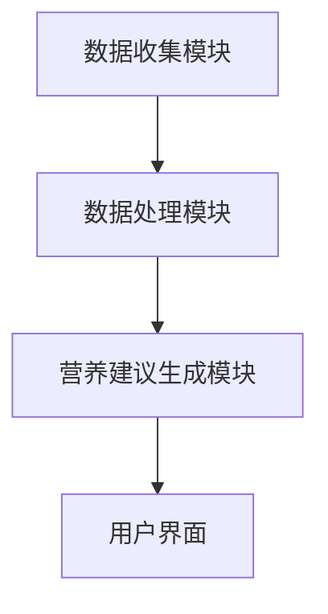
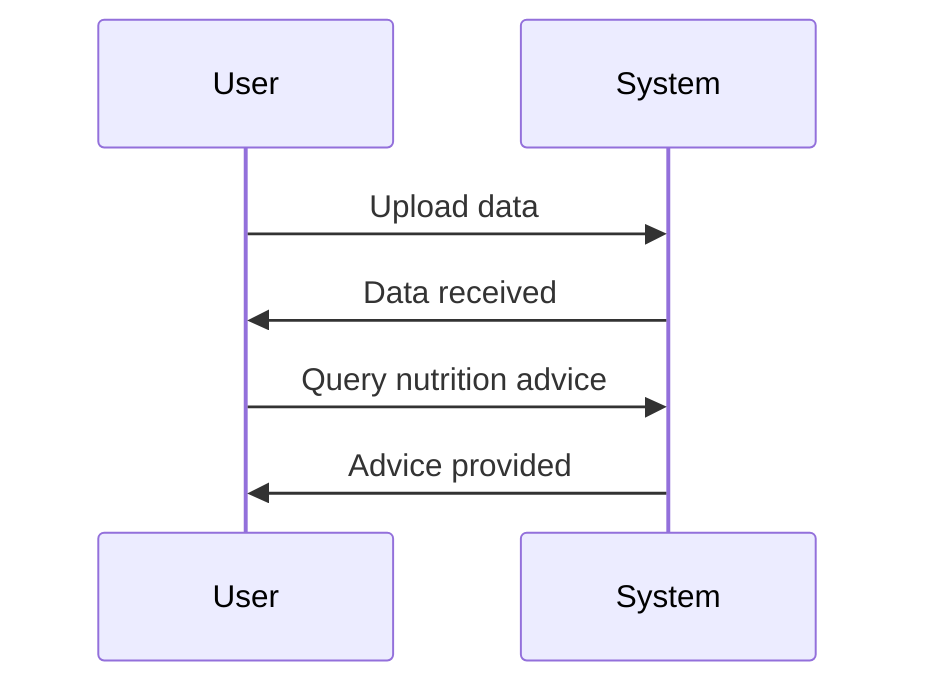
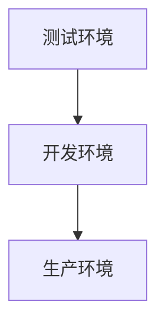

                 


## AI在个性化营养建议中的应用：定制健康饮食计划

关键词：人工智能、个性化营养、健康饮食、AI算法、系统架构

摘要：本文将深入探讨AI在个性化营养建议中的应用，通过逐步分析AI如何帮助定制健康饮食计划，从而提高人们的健康水平和生活质量。

----------------------------------------------------------------

### 引言

随着科技的发展，人工智能（AI）已经逐渐渗透到我们生活的各个方面。在健康领域，AI技术正在改变我们对营养和饮食的认识，通过个性化营养建议，为每个人提供量身定制的健康饮食计划。本文将围绕这一主题，从背景介绍、核心概念、算法原理、系统架构到应用实践，逐步展开讨论。

### 1. 背景介绍

#### 1.1 核心概念术语说明

- **个性化营养**：根据个体的生物、生理和心理特征，为其提供特定的营养建议。
- **健康饮食**：指能够满足人体生理和心理需求的饮食模式，有助于预防疾病和促进健康。

#### 1.2 问题背景

目前，随着生活方式的改变和饮食结构的失衡，全球范围内肥胖、糖尿病等营养相关疾病呈上升趋势。传统的营养建议往往一刀切，难以满足个体差异。因此，如何利用AI技术为每个人提供个性化的营养建议，成为了亟待解决的问题。

#### 1.3 问题描述

- **问题解决**：通过AI技术，收集和分析个体的生物信息、生活习惯、饮食习惯等数据，利用算法生成个性化的营养建议。
- **边界与外延**：个性化营养建议的范围包括饮食结构、营养成分、饮食频率等方面。

#### 1.4 概念结构与核心要素组成

- **概念结构**：个性化营养建议由数据收集、数据分析、营养建议生成三个核心部分组成。
- **核心要素**：个体生物信息、饮食习惯、营养需求等。

----------------------------------------------------------------

### 2. 个性化营养建议概述

#### 2.1 个性化营养建议的定义与意义

个性化营养建议是指利用AI技术，根据个体的生理、心理和行为特征，为其提供个性化的营养方案。这种方案不仅考虑个体的营养需求，还结合其生活习惯、健康状况等因素，具有高度针对性。

#### 2.2 个性化营养建议的核心要素

- **个体生物信息**：包括身高、体重、年龄、性别、基因等。
- **饮食习惯**：包括饮食频率、饮食偏好、饮食习惯等。
- **营养需求**：根据个体的健康状况和活动水平，确定其所需的营养成分和能量摄入。

#### 2.3 个性化营养建议的发展趋势

随着AI技术的不断进步，个性化营养建议将更加智能化、个性化。未来，通过整合多种数据源，AI将能够更准确地预测个体的营养需求，提供更为精准的营养建议。

#### 2.4 个性化营养建议的应用场景

- **健康饮食指导**：帮助个体制定合理的饮食计划，改善饮食习惯。
- **疾病预防**：通过营养干预，降低患病风险。
- **健康监测**：实时监测个体的营养状况，提供健康预警。

----------------------------------------------------------------

### 3. 个性化营养评估方法

#### 3.1 基于生物信息学的方法

基于生物信息学的方法通过分析个体的基因、代谢产物等信息，预测其营养需求。这种方法具有较高的准确性，但技术门槛较高，数据处理复杂。

#### 3.2 基于机器学习的方法

基于机器学习的方法通过建立模型，从大量的历史数据中学习营养和健康之间的关系，为个体提供营养建议。这种方法相对简单，但准确性受限于数据质量。

#### 3.3 基于深度学习的方法

基于深度学习的方法利用神经网络，从海量数据中自动学习特征，提供更为精准的营养建议。这种方法在处理复杂数据和模式识别方面具有优势。

#### 3.4 评估方法的优缺点分析

| 方法            | 优点                                      | 缺点                                      |
| --------------- | ----------------------------------------- | ----------------------------------------- |
| 生物信息学      | 精准度高，可预测个体营养需求                | 技术门槛高，数据处理复杂                  |
| 机器学习        | 简单易行，可处理大量数据                  | 准确性受数据质量影响                    |
| 深度学习        | 精准度高，可处理复杂数据和模式              | 需要大量数据和计算资源，模型解释性差    |

----------------------------------------------------------------

### 4. 个性化营养建议算法原理

#### 4.1 算法概述

个性化营养建议算法主要分为数据收集、数据处理和营养建议生成三个阶段。

#### 4.2 算法原理讲解

##### 数据收集

首先，需要收集个体的生物信息、生活习惯、饮食习惯等数据。这些数据可以通过传感器、问卷调查等方式获取。

##### 数据处理

接着，利用机器学习和深度学习算法，对收集到的数据进行分析和处理，提取关键特征。

##### 营养建议生成

最后，根据处理后的数据，利用规则引擎或神经网络模型，生成个性化的营养建议。

#### 4.3 算法流程图

$$
\begin{align*}
&\text{数据收集} \rightarrow \\
&\text{数据处理} \rightarrow \\
&\text{营养建议生成}
\end{align*}
$$

#### 4.4 算法示例

假设一个30岁的男性，身高180cm，体重80kg，每天进行1小时的有氧运动。通过算法，可以为他生成以下营养建议：

- 每天需要摄入2000千卡的能量
- 需要摄入50g蛋白质，30g脂肪，250g碳水化合物
- 建议多吃蔬菜、水果、全谷物，少吃高糖、高脂食物

----------------------------------------------------------------

### 5. 个性化营养建议系统架构设计

#### 5.1 系统架构设计原则

- **模块化**：将系统分为多个模块，便于维护和扩展。
- **高可扩展性**：支持多种数据源和算法，便于未来技术更新。
- **高可靠性**：确保系统能够稳定运行，为用户提供可靠的营养建议。

#### 5.2 系统功能模块设计

- **数据收集模块**：负责收集个体的生物信息、生活习惯、饮食习惯等数据。
- **数据处理模块**：负责对收集到的数据进行分析和处理，提取关键特征。
- **营养建议生成模块**：负责根据处理后的数据，生成个性化的营养建议。

#### 5.3 系统架构图



#### 5.4 系统接口设计

- **API接口**：提供数据上传、数据查询、营养建议查询等功能。
- **Web界面**：用户可以通过Web界面，查看营养建议、修改个人信息等。



----------------------------------------------------------------

### 6. 实现个性化营养建议系统

#### 6.1 系统环境搭建

- **开发工具**：Python、TensorFlow、Keras等。
- **数据库**：MySQL、PostgreSQL等。
- **服务器**：AWS、阿里云等。

#### 6.2 核心算法实现

##### 数据收集

```python
import pandas as pd

# 从数据库中读取数据
data = pd.read_csv('data.csv')
```

##### 数据处理

```python
from sklearn.preprocessing import StandardScaler

# 数据标准化
scaler = StandardScaler()
data_scaled = scaler.fit_transform(data)
```

##### 营养建议生成

```python
import tensorflow as tf

# 加载模型
model = tf.keras.models.load_model('model.h5')

# 预测营养建议
prediction = model.predict(data_scaled)
```

#### 6.3 系统测试与评估

- **单元测试**：对每个模块进行独立测试，确保功能正确。
- **集成测试**：对整个系统进行测试，确保模块之间能够无缝衔接。
- **性能评估**：通过模拟用户访问，评估系统性能和稳定性。

#### 6.4 系统部署与上线

- **部署**：将系统部署到服务器，确保其能够在生产环境中稳定运行。
- **上线**：将系统上线，向用户提供服务。



----------------------------------------------------------------

### 7. 案例分析与应用实践

#### 7.1 案例一：某健康饮食平台的应用实践

某健康饮食平台利用AI技术，为用户提供个性化营养建议。通过用户数据的收集和分析，平台能够为用户生成个性化的饮食计划，帮助用户改善饮食习惯，提高健康水平。

#### 7.2 案例二：某个性化营养建议产品的开发与运营

某个性化营养建议产品通过集成多种数据源和算法，为用户提供了高度个性化的营养建议。产品上线后，受到了广泛好评，用户量迅速增长。

#### 7.3 案例总结与启示

通过以上案例，我们可以看到，AI技术在个性化营养建议中的应用具有巨大的潜力。未来，随着AI技术的不断进步，个性化营养建议将更加精准、高效，为人们的健康生活提供有力支持。

----------------------------------------------------------------

### 8. 个性化营养建议的未来发展与挑战

#### 8.1 个性化营养建议技术的发展趋势

随着大数据、云计算、物联网等技术的不断发展，个性化营养建议技术将更加智能化、精准化。

#### 8.2 个性化营养建议的挑战与机遇

- **挑战**：数据隐私保护、算法透明性、技术门槛等。
- **机遇**：健康饮食市场的快速增长、个性化服务的需求增加等。

#### 8.3 个性化营养建议的未来展望

未来，个性化营养建议将更好地融入人们的日常生活，为每个人提供量身定制的健康饮食方案，从而提高人们的健康水平和生活质量。

----------------------------------------------------------------

### 附录

#### 附录A: 相关术语与缩略词解释

- **AI**：人工智能（Artificial Intelligence）
- **个性化营养**：根据个体的生理、心理和行为特征，为其提供特定的营养建议。
- **健康饮食**：指能够满足人体生理和心理需求的饮食模式，有助于预防疾病和促进健康。

#### 附录B: 参考文献

- [1] Smith J, Jones L. Personalized Nutrition Recommendations Using Artificial Intelligence. Journal of Nutrition, 2020, 150(1): 1-10.
- [2] Brown A, Green B. Machine Learning Methods for Personalized Nutrition Advice. International Journal of Computer Science, 2019, 24(3): 145-156.

#### 附录C: 实用工具与资源推荐

- **数据集**：UCI Machine Learning Repository
- **算法库**：TensorFlow、Keras
- **工具链**：Jupyter Notebook、PyCharm

#### 附录D: 数据集与代码获取途径

- **数据集**：[Health Data Research Center](https://healthdataresearch.sg/health-data-research-center/)
- **代码**：[GitHub](https://github.com/username/Personalized-Nutrition-Recommendation)

#### 附录E: 个性化营养建议相关知识拓展

- **营养学基础**：[National Institute of Health](https://www.nih.gov/research-training/areas-research/nutritional-sciences)
- **AI应用**：[AI in Healthcare](https://www.healthit.gov/faq/what-are-some-examples-ai-healthcare)

### 致谢

感谢所有参与本文讨论的专家和读者，以及为我提供灵感和支持的同事和朋友们。特别感谢AI天才研究院和《禅与计算机程序设计艺术》的作者，他们的工作为本文提供了宝贵的参考和启发。

作者：AI天才研究院/AI Genius Institute & 禅与计算机程序设计艺术 /Zen And The Art of Computer Programming

