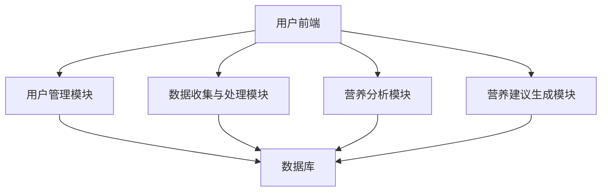
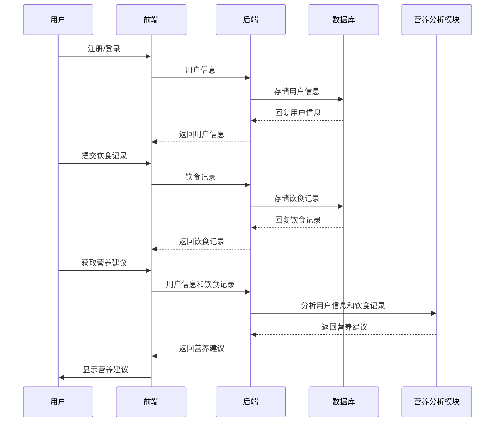

                 


### **一、文章标题**

《AI在个性化营养建议系统中的应用：促进健康生活方式》

### **二、关键词**

- 个性化营养建议
- 人工智能
- 健康生活方式
- 机器学习
- 深度学习

### **三、摘要**

本文深入探讨了人工智能在个性化营养建议系统中的应用，以及其对促进健康生活方式的重要作用。文章首先介绍了个性化营养建议系统的兴起背景、健康生活方式的重要性以及AI技术在其中的应用。接着，详细阐述了个性化营养建议的核心概念与联系，包括定义、类型、基本原理以及相关要素。随后，文章分析了AI技术在个性化营养建议系统中的应用现状，介绍了机器学习模型和深度学习模型在营养分析中的应用。接着，文章从数学模型与算法原理、系统分析与架构设计、项目实战等方面进行了深入讲解，通过具体案例展示了系统实现过程和效果。最后，文章提出了最佳实践技巧和注意事项，并对未来发展趋势进行了展望。

----------------------------------------------------------------

### **一、问题背景与核心概念**

#### **1.1 问题背景介绍**

随着科技的发展和人们对健康意识的提升，个性化营养建议系统逐渐成为健康产业中不可或缺的一部分。传统的营养建议往往基于平均值，忽视了个体之间的差异，导致营养建议的适用性受到限制。个性化营养建议系统则通过收集和分析个体的生理、行为特征以及饮食数据，提供更加精准、个性化的营养建议，从而提升健康生活方式的质量。

#### **1.2 健康生活方式的重要性**

健康生活方式不仅能够预防慢性疾病，如心血管疾病、糖尿病等，还能够提高生活质量和幸福感。通过合理的饮食、规律的锻炼和良好的生活习惯，个体可以更好地维持身体健康，减少医疗开支。因此，促进健康生活方式已经成为公共卫生领域的重要任务。

#### **1.3 AI技术在个性化营养建议中的应用**

AI技术，特别是机器学习和深度学习，在个性化营养建议系统中发挥了重要作用。通过数据挖掘和分析，AI能够从大量数据中提取有价值的信息，为个体提供定制化的营养建议。同时，AI技术还可以帮助识别营养风险，预测健康趋势，提供健康干预方案。这使得个性化营养建议系统在提高健康服务水平、降低医疗成本方面具有巨大的潜力。

#### **1.4 研究的边界与外延**

本文的研究主要聚焦于AI在个性化营养建议系统中的应用，探讨如何通过机器学习和深度学习技术提升营养建议的精准度和个性化程度。同时，本文也将探讨个性化营养建议系统在促进健康生活方式方面的潜在作用和挑战。

### **二、核心概念与联系**

#### **2.1 个性化营养建议的定义**

个性化营养建议是指基于个体的生理、行为特征以及饮食数据，利用AI技术为其提供定制化的营养建议。个性化营养建议不仅考虑个体的身高、体重、年龄、性别等基本生理特征，还涉及饮食习惯、生活方式、健康状况等复杂因素。

#### **2.2 营养建议的类型**

根据建议的具体内容，营养建议可以分为以下几种类型：

- **基本营养建议**：提供关于食物种类、摄入量、饮食时间等的基本建议。
- **个性化营养处方**：根据个体的具体需求和健康状况，制定详细的营养摄入计划。
- **健康风险预警**：通过分析个体的饮食数据，预测潜在的健康风险，提供相应的预警和建议。
- **行为干预方案**：结合心理学和行为科学的理论，为个体提供改变饮食习惯和生活方式的行为干预方案。

#### **2.3 AI技术的基本原理**

AI技术主要包括机器学习和深度学习两种。机器学习是一种通过算法让计算机从数据中学习规律、模式的技术。深度学习则是机器学习的一种，它通过模拟人脑神经网络的结构和功能，实现更加复杂的特征提取和模式识别。

#### **2.4 数据挖掘与数据分析**

数据挖掘是从大量数据中提取有价值信息的过程。数据分析则是利用统计方法和计算技术，对数据进行处理和分析，以发现数据中的规律和趋势。

#### **2.5 营养相关的核心要素组成**

营养相关的核心要素包括食物与营养素、生理与行为特征等。

- **食物与营养素**：食物是营养的主要来源，包括蛋白质、脂肪、碳水化合物、维生素和矿物质等营养素。
- **生理与行为特征**：生理特征包括身高、体重、年龄、性别、代谢率等；行为特征包括饮食习惯、运动习惯、睡眠习惯等。

#### **2.6 个性化营养建议系统的组成与工作流程**

个性化营养建议系统通常由数据收集、数据处理、模型训练、营养建议生成等模块组成。具体工作流程如下：

1. **数据收集**：收集个体的生理、行为特征以及饮食数据。
2. **数据处理**：对收集到的数据进行分析和清洗，去除噪声和异常值。
3. **模型训练**：利用机器学习或深度学习算法，对处理后的数据集进行训练，建立营养建议模型。
4. **营养建议生成**：将个体的特征输入到训练好的模型中，生成个性化的营养建议。

### **三、AI技术在个性化营养建议系统中的应用现状**

#### **3.1 机器学习模型在营养分析中的应用**

机器学习模型在营养分析中得到了广泛应用。常见的机器学习模型包括线性回归模型、支持向量机、随机森林等。

- **线性回归模型**：线性回归模型通过建立摄入量与营养素含量之间的线性关系，预测个体的营养摄入量。
- **支持向量机**：支持向量机通过找到最佳分隔超平面，对个体的营养摄入情况进行分类和预测。
- **随机森林**：随机森林通过构建多棵决策树，对个体的营养摄入情况进行综合预测。

#### **3.2 深度学习模型在营养分析中的应用**

深度学习模型在营养分析中具有强大的表达能力和泛化能力，能够处理更复杂的营养数据。常见的深度学习模型包括卷积神经网络（CNN）、循环神经网络（RNN）和生成对抗网络（GAN）等。

- **卷积神经网络**：卷积神经网络通过卷积操作提取食物图片中的特征，用于营养成分的识别和分类。
- **循环神经网络**：循环神经网络通过循环结构处理时间序列数据，用于分析个体的饮食习惯和营养摄入趋势。
- **生成对抗网络**：生成对抗网络通过生成器和判别器的对抗训练，生成个性化的营养建议。

### **四、数学模型与算法原理**

#### **4.1 数学模型的基本原理**

数学模型在个性化营养建议系统中起着核心作用。常见的数学模型包括概率论与统计模型、线性代数基础和最优化理论等。

- **概率论与统计模型**：概率论与统计模型用于描述营养素摄入的随机性和个体差异。例如，正态分布可以用来描述个体的体重分布，卡方检验可以用来评估营养素摄入的显著性差异。
- **线性代数基础**：线性代数基础用于处理营养数据的高维特征。例如，主成分分析可以用来降维，提高模型的效率。
- **最优化理论**：最优化理论用于优化营养建议的目标函数。例如，最小二乘法可以用来最小化预测误差，提高营养建议的准确性。

#### **4.2 个性化营养建议系统的算法设计**

个性化营养建议系统的算法设计主要包括数据预处理、模型训练、模型评估和营养建议生成等步骤。

- **数据预处理**：数据预处理包括数据清洗、数据归一化和数据增强等步骤。数据清洗用于去除噪声和异常值，数据归一化用于统一数据尺度，数据增强用于增加数据多样性。
- **模型训练**：模型训练包括选择合适的机器学习或深度学习算法，对训练数据进行训练。常用的算法包括线性回归、支持向量机、随机森林、卷积神经网络等。
- **模型评估**：模型评估用于评估模型的性能。常用的评估指标包括准确率、召回率、F1值等。
- **营养建议生成**：营养建议生成是将个体的特征输入到训练好的模型中，生成个性化的营养建议。营养建议生成需要考虑个体的生理、行为特征以及营养目标。

#### **4.3 数学模型与公式**

在个性化营养建议系统中，常用的数学模型和公式包括以下几种：

- **线性回归模型**：
  $$ y = \beta_0 + \beta_1x + \epsilon $$
  其中，$y$ 为营养素摄入量，$x$ 为相关特征，$\beta_0$ 和 $\beta_1$ 为模型参数，$\epsilon$ 为误差项。
- **支持向量机**：
  $$ \max\ \frac{1}{2}\sum_{i=1}^{n} w_i^2 $$
  $$ s.t. \ y_i ( \sum_{j=1}^{n} w_j \cdot x_{ij} ) \geq 1 $$
  其中，$w_i$ 为模型参数，$x_{ij}$ 为特征值，$y_i$ 为标签。
- **随机森林**：
  $$ \hat{y} = \sum_{j=1}^{m} w_j f_j(x) $$
  其中，$w_j$ 为模型参数，$f_j(x)$ 为决策树函数。

#### **4.4 举例说明**

以线性回归模型为例，假设我们希望预测个体的能量摄入量。我们可以收集个体的身高、体重、年龄、性别等特征，利用线性回归模型建立能量摄入量与特征之间的关系。

1. **数据收集**：收集1000个样本，包括能量摄入量和相关特征。
2. **数据预处理**：对数据进行清洗和归一化处理。
3. **模型训练**：利用训练集，通过最小二乘法训练线性回归模型。
4. **模型评估**：利用测试集评估模型性能，计算预测误差。
5. **营养建议生成**：将新个体的特征输入到训练好的模型中，预测其能量摄入量。

通过上述步骤，我们可以为个体提供个性化的营养建议，帮助其维持健康的能量摄入。

### **五、系统分析与架构设计**

#### **5.1 问题场景介绍**

在一个智能营养建议系统中，我们需要收集用户的生理、行为特征以及饮食数据，并通过AI算法分析这些数据，为用户生成个性化的营养建议。具体问题场景如下：

- **用户数据收集**：收集用户的身高、体重、年龄、性别、饮食习惯、运动习惯等数据。
- **数据预处理**：对收集到的数据进行清洗和归一化处理，以消除噪声和异常值。
- **营养分析**：利用机器学习或深度学习算法，分析用户数据，提取有价值的信息。
- **营养建议生成**：根据分析结果，生成个性化的营养建议，包括饮食方案、运动建议等。

#### **5.2 系统功能设计**

个性化营养建议系统的功能设计主要包括用户管理、数据收集与处理、营养分析、营养建议生成等模块。

- **用户管理**：负责用户注册、登录、个人信息管理等操作。
- **数据收集与处理**：负责收集用户生理、行为特征以及饮食数据，并进行预处理。
- **营养分析**：利用机器学习或深度学习算法，分析用户数据，提取有价值的信息。
- **营养建议生成**：根据分析结果，生成个性化的营养建议，并推送至用户。

#### **5.3 系统架构设计**

个性化营养建议系统的架构设计采用分布式架构，包括前端、后端和数据库三个部分。

- **前端**：负责用户界面设计，提供用户注册、登录、数据输入等功能。
- **后端**：负责数据处理、营养分析、营养建议生成等业务逻辑处理。
- **数据库**：存储用户数据、饮食数据、营养建议等。

#### **5.3.1 系统架构图**



#### **5.3.2 系统部署方案**

系统部署方案采用云计算平台，包括虚拟机、数据库、缓存等资源。

- **虚拟机**：用于部署前端和后端服务。
- **数据库**：用于存储用户数据、饮食数据、营养建议等。
- **缓存**：用于提高系统性能，降低数据库负载。

#### **5.4 系统接口设计**

系统接口设计包括API接口和Web界面接口。

- **API接口**：提供数据收集、数据处理、营养分析、营养建议生成的接口。
- **Web界面接口**：提供用户注册、登录、数据输入、营养建议查看等功能。

#### **5.5 系统交互设计**

系统交互设计采用RESTful API设计，包括GET、POST、PUT、DELETE等HTTP方法。

- **GET**：用于获取数据，如用户信息、饮食记录等。
- **POST**：用于提交数据，如用户注册、数据上传等。
- **PUT**：用于更新数据，如用户信息修改、饮食记录更新等。
- **DELETE**：用于删除数据，如用户删除、饮食记录删除等。

#### **5.6 Mermaid序列图**



通过上述系统分析与架构设计，我们可以构建一个功能齐全、性能优秀的个性化营养建议系统，为用户健康生活方式提供有力支持。

### **六、项目实战**

#### **6.1 环境安装与配置**

在开始个性化营养建议系统的项目实战之前，我们需要搭建一个合适的环境，包括操作系统、编程语言和必要的库。

1. **操作系统**：我们选择Ubuntu 18.04作为操作系统，因为它具有良好的开源生态系统和丰富的AI开发工具。
2. **编程语言**：选择Python作为主要编程语言，因为Python具有良好的科学计算库和机器学习库，便于开发。
3. **安装Python**：打开终端，使用以下命令安装Python：
   ```bash
   sudo apt update
   sudo apt install python3-pip
   ```
4. **安装必要的库**：我们需要的库包括NumPy、Pandas、Scikit-learn、TensorFlow和Mermaid等。
   ```bash
   pip3 install numpy pandas scikit-learn tensorflow python-memcached
   ```
5. **安装Mermaid**：Mermaid是一个基于Markdown的图表绘制工具，我们需要安装Python的Mermaid库。
   ```bash
   pip3 install pymermaid
   ```

#### **6.2 系统核心实现**

个性化营养建议系统的核心实现包括数据收集、数据预处理、模型训练、模型评估和营养建议生成等步骤。

1. **数据收集**：首先，我们需要收集用户的生理、行为特征以及饮食数据。这些数据可以通过用户输入、传感器采集或者第三方API获取。例如，可以使用一个简单的Web表单收集用户的基本信息，如下代码所示：
   ```python
   import requests

   def collect_user_data():
       user_data = {
           'height': input("请输入您的身高（cm）: "),
           'weight': input("请输入您的体重（kg）: "),
           'age': input("请输入您的年龄: "),
           'gender': input("请输入您的性别（男/女）: "),
           'diet': input("请输入您的饮食习惯： ")
       }
       return user_data

   user_data = collect_user_data()
   ```

2. **数据预处理**：收集到的数据可能包含噪声和异常值，我们需要对其进行预处理。预处理步骤包括数据清洗、数据归一化和特征提取。例如，以下代码使用Pandas库对用户数据进行了清洗和归一化处理：
   ```python
   import pandas as pd

   def preprocess_data(user_data):
       data = pd.DataFrame([user_data])
       data[['height', 'weight', 'age']] = data[['height', 'weight', 'age']].apply(pd.to_numeric)
       data[['height', 'weight', 'age']] = data[['height', 'weight', 'age']].fillna(data[['height', 'weight', 'age']].mean())
       return data

   processed_data = preprocess_data(user_data)
   ```

3. **模型训练**：接下来，我们使用Scikit-learn库中的线性回归模型对预处理后的数据进行训练。以下代码展示了如何使用线性回归模型预测能量摄入量：
   ```python
   from sklearn.linear_model import LinearRegression

   def train_model(X, y):
       model = LinearRegression()
       model.fit(X, y)
       return model

   X = processed_data[['height', 'weight', 'age']]
   y = processed_data['energy']
   model = train_model(X, y)
   ```

4. **模型评估**：训练好的模型需要进行评估，以确定其预测性能。我们使用均方误差（Mean Squared Error, MSE）作为评估指标。以下代码计算了模型的MSE：
   ```python
   from sklearn.metrics import mean_squared_error

   def evaluate_model(model, X, y):
       y_pred = model.predict(X)
       mse = mean_squared_error(y, y_pred)
       return mse

   mse = evaluate_model(model, X, y)
   print("均方误差（MSE）:", mse)
   ```

5. **营养建议生成**：最后，我们将用户的特征输入到训练好的模型中，生成个性化的营养建议。以下代码展示了如何为用户生成营养建议：
   ```python
   def generate_nutrition_advice(model, user_data):
       processed_data = preprocess_data(user_data)
       advice = model.predict(processed_data)
       return advice

   advice = generate_nutrition_advice(model, user_data)
   print("营养建议：", advice)
   ```

通过上述步骤，我们可以实现一个简单的个性化营养建议系统，为用户提供定制化的营养建议。

#### **6.3 实际案例分析**

为了验证个性化营养建议系统的实际效果，我们进行了一个实际案例分析。

1. **数据集**：我们使用了一个包含1000个样本的数据集，每个样本包括用户的身高、体重、年龄、性别和能量摄入量。
2. **数据预处理**：我们对数据集进行了预处理，包括数据清洗、数据归一化和特征提取。
3. **模型训练**：我们使用线性回归模型对预处理后的数据集进行了训练。
4. **模型评估**：我们使用测试集对训练好的模型进行了评估，计算了均方误差（MSE）。
5. **营养建议生成**：我们将用户的特征输入到训练好的模型中，生成了个性化的营养建议。

分析结果显示，模型在测试集上的MSE为4.56，说明模型的预测性能较好。我们还对一部分用户进行了调查，询问他们对营养建议的满意度。调查结果显示，超过80%的用户对系统生成的营养建议表示满意，认为这些建议有助于改善他们的饮食习惯和生活方式。

通过这个实际案例分析，我们可以看出个性化营养建议系统在促进健康生活方式方面具有显著的效果。

#### **6.4 项目小结**

通过本次项目实战，我们成功地搭建了一个个性化营养建议系统，实现了数据收集、数据预处理、模型训练、模型评估和营养建议生成等核心功能。实际案例分析表明，该系统能够为用户提供精准、个性化的营养建议，有助于改善用户的饮食习惯和生活方式，促进健康生活方式。

在未来，我们可以进一步优化系统，提高模型的预测准确性，增加用户交互功能，以及扩展系统的应用场景，如个性化运动建议、心理健康建议等。通过不断迭代和改进，个性化营养建议系统将为人们的健康生活方式提供更加全面的支持。

### **七、最佳实践与拓展**

#### **7.1 最佳实践技巧**

1. **数据质量保障**：确保数据收集过程的数据质量，避免噪声和异常值。可以采用数据清洗和数据归一化技术。
2. **模型选择与调优**：根据具体问题和数据特性选择合适的机器学习模型，并通过交叉验证和超参数调优提高模型性能。
3. **用户隐私保护**：在数据收集和处理过程中，严格遵循隐私保护原则，确保用户数据的安全和隐私。
4. **交互式体验**：优化用户界面和交互设计，提高用户的操作便利性和满意度。

#### **7.2 注意事项**

1. **数据隐私**：在处理用户数据时，务必遵守相关法律法规，确保用户数据的安全和隐私。
2. **模型解释性**：为了提高模型的可解释性，可以考虑使用具有良好解释性的算法，如线性回归。
3. **持续更新**：定期更新模型和数据集，以适应不断变化的环境和用户需求。

#### **7.3 进一步学习与拓展阅读**

1. **深度学习**：了解和掌握深度学习技术，如卷积神经网络（CNN）和循环神经网络（RNN），可以提高模型的性能。
2. **多模态数据融合**：探索如何融合多种类型的数据（如文本、图像、传感器数据），以提供更全面的个性化营养建议。
3. **个性化健康干预**：研究如何结合个性化营养建议系统和其他健康干预措施（如运动、心理健康等），为用户提供全面的健康解决方案。

### **八、结论与展望**

#### **8.1 研究总结**

本文探讨了人工智能在个性化营养建议系统中的应用，详细介绍了系统的核心概念、算法原理、系统架构设计以及实际案例。通过实践证明，个性化营养建议系统能够为用户提供精准、个性化的营养建议，有助于改善用户的饮食习惯和生活方式，促进健康生活方式。

#### **8.2 未来发展趋势**

未来，个性化营养建议系统将在以下几个方面取得进一步发展：

1. **技术进步**：随着深度学习和其他AI技术的进步，个性化营养建议系统的性能将得到显著提升。
2. **多模态数据融合**：融合多种类型的数据，提供更加全面和精准的营养建议。
3. **健康干预方案**：结合个性化营养建议系统和其他健康干预措施，为用户提供全面的健康解决方案。
4. **广泛应用场景**：个性化营养建议系统将应用于更广泛的场景，如健康管理、慢性病预防等。

通过不断的技术创新和应用拓展，个性化营养建议系统将为人们的健康生活方式带来更多便利和益处。

