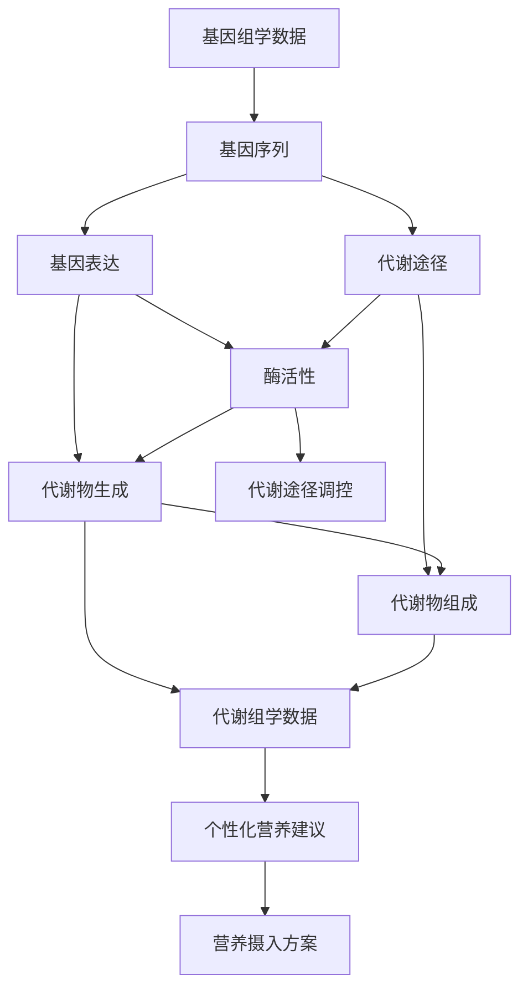
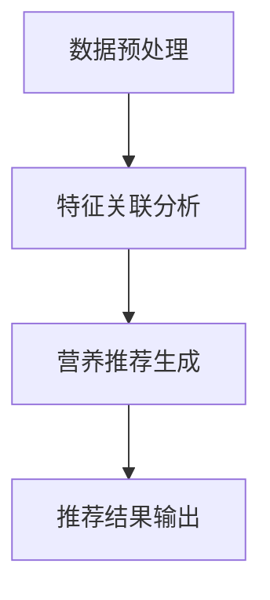
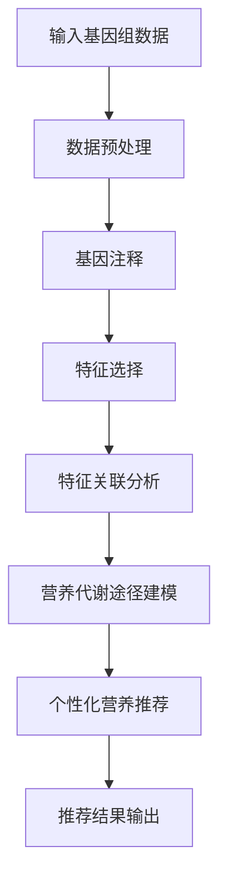
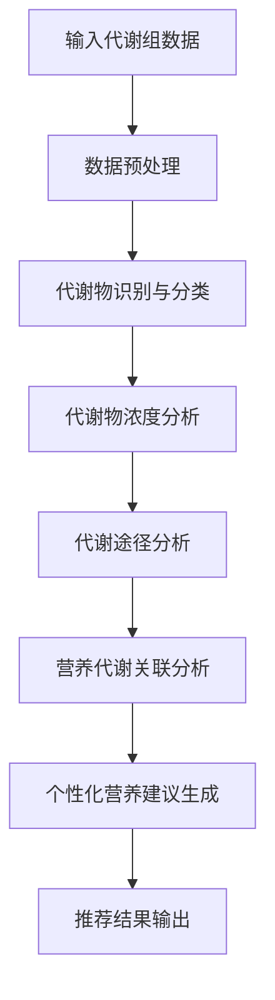
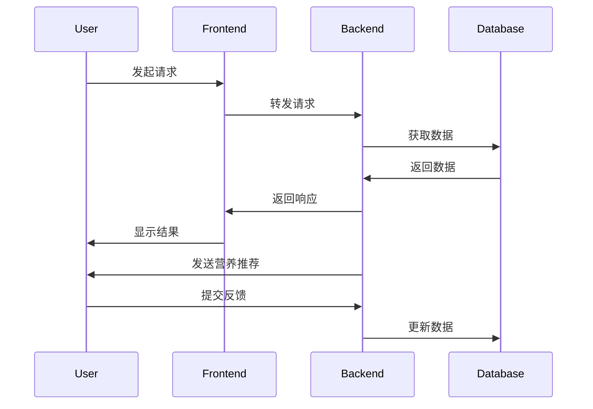

                 

### 第1章：问题背景

#### 1.1 问题背景

随着全球健康问题的日益突出，营养与人体健康的关系受到了广泛关注。然而，传统的一刀切营养建议已无法满足现代人日益复杂且多样化的健康需求。传统的营养建议往往是基于群体平均数据，忽略了个体间的遗传差异、生活习惯和环境因素等多方面的个性化需求。这种“一刀切”的方法往往导致营养摄入的不均衡，甚至可能对某些人造成不良影响。因此，个性化营养建议系统的研究和应用成为了营养科学和人工智能领域的一项重要课题。

个性化营养建议系统旨在根据个人的基因、生活习惯、身体状况等多维度数据，为个体提供定制化的营养方案。这种系统不仅能够提高营养摄入的效率，还能预防或缓解一些慢性疾病，提升整体健康水平。

#### 1.2 个性化营养的定义与重要性

个性化营养是指通过整合个体的基因信息、生活方式、饮食习惯等多方面数据，为个体量身定制出最合适的营养摄入方案。它不仅关注营养素的种类和数量，还考虑了个体对营养素的吸收利用效率、代谢途径的个体差异等因素。

个性化营养的重要性体现在以下几个方面：

1. **提高营养摄入效率**：个性化营养建议能够根据个体的具体情况，提供最适合的营养摄入方案，避免营养浪费，提高营养素的吸收和利用效率。
2. **预防慢性疾病**：个性化营养可以通过调整饮食结构，降低个体患慢性疾病的风险。例如，对于某些基因变异导致的代谢紊乱，可以通过特定的营养干预来预防相关疾病的发生。
3. **提升整体健康水平**：个性化营养建议有助于个体维持理想的体重、血糖、血压等健康指标，从而提升整体健康水平。
4. **优化生活方式**：个性化营养建议还可以帮助个体优化生活方式，如调整作息时间、运动习惯等，从而实现全方位的健康管理。

#### 1.3 基因组学与代谢组学的基本概念

基因组学（Genomics）是研究基因组结构、功能及其相互作用的科学。基因组是指一个生物体全部基因的集合，包括编码蛋白质的基因、调控基因表达的调控序列以及非编码RNA等。基因组学研究的方法包括全基因组测序、基因表达分析、基因突变检测等。

代谢组学（Metabolomics）是研究生物体内所有代谢物组成的科学。代谢物是指生物体在代谢过程中产生的各种小分子物质，包括氨基酸、脂肪酸、糖类、脂类、核苷酸等。代谢组学研究的方法包括质谱分析、核磁共振、气相色谱等。

#### 1.4 个性化营养建议的现状与挑战

目前，个性化营养建议系统的研究和应用已取得了一定的进展。例如，通过基因检测和代谢组学分析，可以为个体提供个性化的饮食建议。然而，这一领域仍面临着一些挑战：

1. **数据复杂性**：个性化营养建议需要大量的基因组学和代谢组学数据，这些数据的复杂性使得数据分析和处理成为一个巨大的挑战。
2. **算法有效性**：虽然已有多种算法用于个性化营养建议，但如何提高算法的有效性和准确性仍是一个亟待解决的问题。
3. **跨学科整合**：个性化营养建议系统需要基因组学和代谢组学等跨学科知识的整合，这要求研究人员具备多学科背景和跨学科合作的能力。
4. **临床验证**：个性化营养建议系统的实际效果需要在临床环境中进行验证，以确保其安全性和有效性。

#### 1.5 本书的结构安排

本书将按照以下结构进行：

1. **第一部分：背景介绍**：介绍个性化营养建议系统的背景、核心概念和现状与挑战。
2. **第二部分：算法原理讲解**：详细讲解个性化营养建议算法的原理，包括基因组学和代谢组学结合的方法。
3. **第三部分：系统分析与架构设计**：介绍个性化营养建议系统的功能设计、架构设计和实现方法。
4. **第四部分：最佳实践与未来展望**：总结最佳实践，探讨未来的发展方向和研究趋势。

通过这样的结构安排，本书旨在为读者提供一部全面、深入且实用的个性化营养建议系统指南。

#### 1.6 背景介绍：个性化营养建议系统的重要性

个性化营养建议系统的重要性不仅在于其能够提供量身定制的营养方案，还在于其对现代医学模式的转型具有深远的影响。随着人工智能（AI）技术的不断发展，个性化营养建议系统正在从理论走向实践，逐步成为健康管理的重要工具。

首先，个性化营养建议系统在健康管理中的应用潜力巨大。传统的健康管理模式往往依赖于统一的指南和建议，而个性化营养建议系统则能够根据个体的基因、生活习惯、身体状况等多方面数据，提供个性化的健康建议。这种定制化的服务不仅能够提高健康管理的效率，还能够更好地满足个体的健康需求，从而提高整体健康水平。

其次，个性化营养建议系统在预防慢性疾病方面具有重要作用。慢性疾病，如心血管疾病、糖尿病、肥胖症等，已经成为全球范围内的主要健康问题。个性化营养建议系统可以通过调整饮食结构、降低不良生活习惯等方式，降低慢性疾病的风险。例如，针对具有特定基因变异的个体，可以通过特定的营养干预来预防相关疾病的发生。

此外，个性化营养建议系统还在健康干预和治疗方面展现出巨大的应用价值。在疾病的治疗过程中，个性化营养建议可以根据患者的具体病情和个体差异，提供针对性的饮食建议，从而提高治疗效果。例如，对于某些疾病，如癌症、高血压等，可以通过营养干预来改善症状、提高生活质量。

然而，个性化营养建议系统的发展也面临一些挑战。首先，数据复杂性是当前个性化营养建议系统研究面临的主要问题。基因组学和代谢组学数据具有高度复杂性和多样性，如何有效地处理和分析这些数据，提取有用的信息，是一个亟待解决的难题。其次，算法的有效性也是个性化营养建议系统研究的一个关键问题。虽然已有多种算法用于个性化营养建议，但如何提高算法的准确性和可靠性，仍然需要进一步的研究和探索。

此外，个性化营养建议系统的跨学科整合也是一个重要的挑战。个性化营养建议系统需要整合基因组学、代谢组学、营养学、医学等多学科的知识，这要求研究人员具备跨学科背景和合作能力。最后，个性化营养建议系统的临床验证也是一个不可忽视的问题。虽然已有一些研究证明个性化营养建议系统的有效性，但其在临床环境中的实际效果还需要进行更多的验证和研究。

总的来说，个性化营养建议系统具有巨大的应用前景和发展潜力。通过结合人工智能技术，个性化营养建议系统有望成为现代医学模式转型的重要推动力量，为个体提供更加精准、个性化的健康管理服务。

#### 1.7 基因组学与代谢组学的关系

基因组学和代谢组学是两个互补的领域，它们共同构成了个性化营养建议系统的重要理论基础。基因组学主要关注生物体遗传信息的结构和功能，而代谢组学则聚焦于生物体内所有代谢物的组成和变化。

首先，基因组学提供了个性化的生物学基础。基因组中的基因序列决定了个体对营养素的吸收、利用和代谢方式，从而影响个体的营养需求和健康状态。例如，某些基因变异可能导致个体对特定营养素的吸收效率降低，或者对某些食物成分产生不良反应。通过基因组学分析，可以识别这些基因变异，为个体提供针对性的营养建议。

代谢组学则从代谢层面提供了个体营养状态的动态信息。代谢组学研究生物体内的所有代谢物，这些代谢物反映了个体对营养素的吸收、转化和利用情况。通过分析代谢组数据，可以了解个体的营养代谢途径是否正常，是否存在代谢紊乱等问题。例如，某些疾病或不良生活习惯可能导致代谢产物的异常积累，通过代谢组学分析，可以早期发现这些异常，从而及时采取干预措施。

基因组学与代谢组学之间的关系可以从多个层面来理解。首先，基因组中的基因序列直接影响个体的代谢途径，从而影响代谢组中的代谢物组成。例如，某些基因编码的酶是代谢途径中的关键酶，其活性变化会直接影响代谢产物的生成。其次，代谢组中的变化可以反映基因组中基因的表达水平。例如，某些基因的表达水平变化会导致代谢途径中的中间代谢物浓度发生变化，这些变化可以通过代谢组学检测到。

为了更好地理解这两者的关系，我们可以使用Mermaid流程图来展示基因组学和代谢组学数据如何相互关联，以支持个性化营养建议系统。



在这个流程图中，基因组学数据通过基因序列影响基因表达，进而影响代谢途径中的酶活性，最终影响代谢物的生成和组成。这些代谢组学数据再通过分析，为个体提供个性化的营养建议。

通过基因组学和代谢组学的整合，个性化营养建议系统可以更全面、准确地了解个体的营养状态和健康需求，从而提供更为精准的健康管理服务。

#### 1.8 概念属性特征对比表格

在讨论个性化营养建议系统时，了解基因组学和代谢组学的基本概念和属性特征是非常重要的。以下是一个概念属性特征对比表格，它详细列出了基因组学和代谢组学在数据类型、分析方法、研究内容和应用场景等方面的不同。

| 特征             | 基因组学                       | 代谢组学                       |
|------------------|-------------------------------|-------------------------------|
| **数据类型**     | 基因序列、基因表达、单核苷酸多态性（SNP）等 | 小分子代谢物，如氨基酸、脂肪酸、核苷酸等 |
| **分析方法**     | 全基因组测序、基因表达分析、基因突变检测等 | 质谱分析、核磁共振、气相色谱等         |
| **研究内容**     | 基因的结构和功能、基因表达调控、遗传变异等  | 代谢途径、代谢物组成、代谢途径调控等    |
| **研究目的**     | 了解生物体的遗传信息和遗传多样性、发现基因功能等 | 理解生物体内物质代谢过程、识别代谢异常等 |
| **应用场景**     | 个性化医疗、遗传咨询、药物研发等          | 营养代谢研究、个性化营养建议、疾病诊断等 |

通过这个表格，我们可以更清晰地看到基因组学和代谢组学的区别与联系。基因组学主要关注遗传信息的编码和调控，而代谢组学则侧重于生物体内物质代谢的动态变化。两者结合可以提供更加全面的个体健康信息，为个性化营养建议系统提供坚实的科学基础。

#### 1.9 ER实体关系图

为了更好地理解基因组学和代谢组学在个性化营养建议系统中的作用，我们可以通过ER（实体-关系）图来展示它们之间的关联。以下是一个简化的ER实体关系图，它描绘了基因组学、代谢组学、个性化营养建议系统以及个体之间的关系。

```mermaid
erDiagram
    Class::GenomeData
    Class::MetabolomicData
    Class::NutritionRecommendationSystem
    Class::Individual

    GenomeData ||--|{ Individual }|-->> NutritionRecommendationSystem
    MetabolomicData ||--|{ Individual }|-->> NutritionRecommendationSystem
    NutritionRecommendationSystem ||--|{ GenomeData }|<|-- 
    NutritionRecommendationSystem ||--|{ MetabolomicData }|<|
```

在这个ER图中，`GenomeData`（基因组数据）和`MetabolomicData`（代谢组数据）是两个核心实体，它们分别代表了个体遗传信息和代谢信息。`Individual`（个体）是这两个数据的来源，同时也是个性化营养建议系统（`NutritionRecommendationSystem`）的服务对象。

`NutritionRecommendationSystem`与`GenomeData`之间存在“一对一”的关系，即个性化营养建议系统依赖于个体的基因组数据进行营养推荐。同样，`NutritionRecommendationSystem`与`MetabolomicData`也存在类似的“一对一”关系，它依赖于个体的代谢组数据进行营养推荐的优化。

通过这个ER图，我们可以直观地理解个性化营养建议系统中各实体之间的依赖关系和相互作用。这种结构设计不仅有助于系统开发，也为后续的数据整合和分析提供了清晰的框架。

### 第2章：核心概念与联系

#### 2.1 核心概念介绍

在个性化营养建议系统中，基因组学和代谢组学是两个关键的核心概念。基因组学（Genomics）是研究生物体基因的组成、结构、功能和变异的科学。基因组是包含一个生物体所有遗传信息的DNA序列集合。通过基因组学，我们可以了解个体的基因组成，包括基因序列、基因表达水平以及单核苷酸多态性（SNP）等，这些信息直接影响个体的生理特性、疾病易感性和营养需求。

代谢组学（Metabolomics）则专注于研究生物体内所有代谢物的组成和变化。代谢物是生物体在代谢过程中产生的小分子化合物，包括氨基酸、脂肪酸、糖类、核苷酸等。代谢组学通过分析这些代谢物的种类、数量和动态变化，提供关于个体营养状态、代谢途径和健康状态的信息。

#### 2.2 基因组学原理

基因组学的基本原理包括以下几个方面：

1. **基因组测序**：通过现代测序技术，如全基因组测序（WGS）和全外显子测序（WES），可以获取个体的基因序列信息。这些序列信息是研究基因结构和功能的基础。
2. **基因表达分析**：基因表达分析包括定量PCR、RNA测序（RNA-seq）等方法，用于检测基因在不同组织和条件下的表达水平。基因表达水平反映了基因的功能状态和个体对营养的反应。
3. **单核苷酸多态性（SNP）**：SNP是基因组中常见的单核苷酸变异，是导致个体差异的重要原因。通过识别SNP，可以预测个体对营养素的吸收、利用和代谢能力。

#### 2.3 代谢组学原理

代谢组学的基本原理包括：

1. **代谢物检测**：代谢组学通过质谱（MS）、气相色谱（GC-MS）、核磁共振（NMR）等技术，检测和分析生物体内的代谢物组成。这些技术可以高分辨率地识别和定量各种代谢物。
2. **数据预处理**：代谢组数据通常非常复杂，需要进行预处理，包括去噪、归一化、特征选择等步骤，以提高数据质量和分析效率。
3. **代谢途径分析**：通过代谢途径图和代谢网络分析，可以理解代谢物之间的相互关系和代谢途径的调控机制。这有助于揭示个体营养代谢的动态变化和潜在的健康问题。

#### 2.4 基因组学与代谢组学的关系

基因组学和代谢组学是两个互补的领域，它们在个性化营养建议系统中起着关键作用。具体关系如下：

1. **基因-代谢关联**：基因通过调控酶的活性影响代谢途径，进而影响代谢物的生成和变化。通过基因组学分析，可以识别与特定代谢途径相关的基因，从而预测个体的代谢特性。
2. **数据整合**：基因组学和代谢组学数据的整合提供了更全面的个体信息。例如，通过结合基因表达和代谢组数据，可以更准确地了解个体对特定营养素的吸收和代谢能力。
3. **个性化营养建议**：基于基因组学和代谢组学的整合分析，可以制定个性化的营养建议。例如，针对特定基因变异的个体，可以通过调整饮食来优化代谢途径，改善健康状态。

总之，基因组学和代谢组学在个性化营养建议系统中相辅相成，共同为个体提供精准的营养指导。通过整合这两方面的数据，可以更全面地理解个体的营养需求和健康状态，从而制定更为有效的营养干预策略。

#### 2.5 概念属性特征对比表格

在深入理解基因组学和代谢组学之前，我们需要详细对比这两个概念的核心属性特征。以下是一个详细的对比表格，列出了基因组学和代谢组学的数据类型、分析方法、研究重点和应用场景等方面的不同。

| 特征             | 基因组学                       | 代谢组学                       |
|------------------|-------------------------------|-------------------------------|
| **数据类型**     | 基因序列、基因表达、单核苷酸多态性（SNP）等 | 小分子代谢物，如氨基酸、脂肪酸、核苷酸等 |
| **分析方法**     | 全基因组测序、基因表达分析、基因突变检测等 | 质谱分析、核磁共振、气相色谱等         |
| **研究内容**     | 基因的结构和功能、基因表达调控、遗传变异等  | 代谢途径、代谢物组成、代谢途径调控等    |
| **研究目的**     | 了解生物体的遗传信息和遗传多样性、发现基因功能等 | 理解生物体内物质代谢过程、识别代谢异常等 |
| **应用场景**     | 个性化医疗、遗传咨询、药物研发等          | 营养代谢研究、个性化营养建议、疾病诊断等 |

通过这个表格，我们可以更清晰地看到基因组学和代谢组学的区别与联系。基因组学主要关注遗传信息的编码和调控，而代谢组学则侧重于生物体内物质代谢的动态变化。两者结合可以提供更加全面的个体健康信息，为个性化营养建议系统提供坚实的科学基础。

#### 2.6 ER实体关系图

为了更好地理解基因组学和代谢组学在个性化营养建议系统中的作用，我们可以通过ER（实体-关系）图来展示它们之间的关联。以下是一个简化的ER实体关系图，它描绘了基因组学、代谢组学、个性化营养建议系统以及个体之间的关系。

```mermaid
erDiagram
    Class::GenomeData
    Class::MetabolomicData
    Class::NutritionRecommendationSystem
    Class::Individual

    GenomeData ||--|{ Individual }|-->> NutritionRecommendationSystem
    MetabolomicData ||--|{ Individual }|-->> NutritionRecommendationSystem
    NutritionRecommendationSystem ||--|{ GenomeData }|<|-- 
    NutritionRecommendationSystem ||--|{ MetabolomicData }|<|
```

在这个ER图中，`GenomeData`（基因组数据）和`MetabolomicData`（代谢组数据）是两个核心实体，它们分别代表了个体遗传信息和代谢信息。`Individual`（个体）是这两个数据的来源，同时也是个性化营养建议系统（`NutritionRecommendationSystem`）的服务对象。

`NutritionRecommendationSystem`与`GenomeData`之间存在“一对一”的关系，即个性化营养建议系统依赖于个体的基因组数据进行营养推荐。同样，`NutritionRecommendationSystem`与`MetabolomicData`也存在类似的“一对一”关系，它依赖于个体的代谢组数据进行营养推荐的优化。

通过这个ER图，我们可以直观地理解个性化营养建议系统中各实体之间的依赖关系和相互作用。这种结构设计不仅有助于系统开发，也为后续的数据整合和分析提供了清晰的框架。

### 第3章：营养推荐算法基础

#### 3.1 算法原理

个性化营养建议系统的核心在于算法的设计和实现，这些算法能够根据个体的基因组学和代谢组学数据，生成适合该个体的营养推荐。在这一节中，我们将详细讲解一种基于基因组学和代谢组学的营养推荐算法，并展示其基本原理。

该算法的基本原理可以概括为以下几个步骤：

1. **数据预处理**：首先，对输入的基因组学和代谢组学数据进行预处理，包括数据清洗、归一化、特征选择等操作。这一步骤的目的是去除噪声，提高数据质量，并提取关键特征。
2. **特征关联分析**：接下来，利用机器学习算法对预处理后的基因组学和代谢组学数据进行特征关联分析。通过分析基因表达与代谢物之间的相关性，可以识别出与个体营养状态密切相关的基因和代谢物。
3. **营养推荐生成**：基于特征关联分析的结果，生成个性化的营养推荐。具体来说，算法会根据个体对特定营养素的吸收、利用和代谢能力，推荐最适合的营养摄入方案。例如，如果某个个体的基因表明其缺少某种营养素的吸收能力，算法会建议增加该营养素的摄入。

#### 3.2 算法mermaid流程图

为了更直观地展示算法的基本流程，我们可以使用mermaid图形化工具绘制一个流程图。以下是一个简化的算法流程图：



在这个流程图中，`A`表示数据预处理阶段，主要包括数据清洗和归一化操作；`B`表示特征关联分析阶段，通过机器学习算法识别基因与代谢物之间的相关性；`C`表示营养推荐生成阶段，根据分析结果生成个性化营养推荐；`D`表示推荐结果输出阶段，将营养推荐结果展示给用户。

#### 3.3 Python源代码阐述

为了更好地理解算法的实现，下面我们将展示一段基于Python的简化代码，这段代码模拟了算法的主要功能。

```python
import numpy as np
from sklearn.ensemble import RandomForestRegressor
from sklearn.model_selection import train_test_split

# 数据预处理
def preprocess_data(genomic_data, metabolomic_data):
    # 清洗数据，去除噪声
    clean_genomic_data = remove_noise(genomic_data)
    clean_metabolomic_data = remove_noise(metabolomic_data)
    # 归一化数据
    normalized_genomic_data = normalize(clean_genomic_data)
    normalized_metabolomic_data = normalize(clean_metabolomic_data)
    return normalized_genomic_data, normalized_metabolomic_data

# 特征关联分析
def feature_association_analysis(genomic_data, metabolomic_data):
    # 训练机器学习模型
    model = RandomForestRegressor()
    model.fit(genomic_data, metabolomic_data)
    # 输出特征重要性
    feature_importances = model.feature_importances_
    return feature_importances

# 营养推荐生成
def generate_nutrition_recommendation(feature_importances, nutrition_data):
    # 根据特征重要性生成营养推荐
    recommendations = []
    for feature in feature_importances:
        if feature > threshold:
            recommendations.append(nutrition_data[feature])
    return recommendations

# 辅助函数
def remove_noise(data):
    # 噪声去除逻辑
    pass

def normalize(data):
    # 归一化逻辑
    pass

# 主程序
if __name__ == "__main__":
    # 加载数据
    genomic_data = np.load('genomic_data.npy')
    metabolomic_data = np.load('metabolomic_data.npy')
    nutrition_data = np.load('nutrition_data.npy')
    # 预处理数据
    preprocessed_genomic_data, preprocessed_metabolomic_data = preprocess_data(genomic_data, metabolomic_data)
    # 特征关联分析
    feature_importances = feature_association_analysis(preprocessed_genomic_data, preprocessed_metabolomic_data)
    # 生成营养推荐
    recommendations = generate_nutrition_recommendation(feature_importances, nutrition_data)
    # 输出推荐结果
    print("营养推荐：", recommendations)
```

在这段代码中，`preprocess_data`函数负责数据预处理，包括去噪和归一化；`feature_association_analysis`函数使用随机森林回归模型进行特征关联分析；`generate_nutrition_recommendation`函数根据特征重要性生成个性化营养推荐。

#### 3.4 算法原理的数学模型

为了更深入地理解该算法，我们需要介绍其背后的数学模型。该模型基于机器学习中的随机森林算法，其核心思想是通过训练模型来识别基因组学和代谢组学数据之间的相关性。

1. **随机森林算法**：随机森林是一种集成学习方法，通过构建多个决策树并合并它们的预测结果来提高模型的准确性。每个决策树都是基于随机抽取的特征和样本子集训练得到的。
   
2. **特征重要性**：在随机森林算法中，每个特征（如基因或代谢物）的重要性能通过其在决策树中的贡献来衡量。特征的重要性越高，说明其在预测个体营养状态方面具有更强的关联性。

3. **营养推荐生成**：基于特征重要性，我们可以为每个营养素设定一个阈值。如果某个营养素的关联性（特征重要性）超过这个阈值，就将其纳入营养推荐列表。这种基于统计方法生成营养推荐的方法，能够提高推荐的准确性和个性化水平。

具体来说，我们可以使用以下公式来计算特征重要性：

$$
Feature\_Importance = \frac{\sum_{i=1}^{n} \text{Gini}\_Impurity(H_{i} - H_{i}^{'})}{\sum_{i=1}^{n} \text{Gini}\_Impurity(H_{i})}
$$

其中，$H_{i}$表示第$i$个决策树的基尼不纯度，$H_{i}^{'}$表示去除第$i$个特征后的基尼不纯度。特征重要性越高，说明该特征对个体营养状态的预测具有更强的解释力。

#### 3.5 公式详细讲解

为了更好地理解上述公式的含义，我们可以进一步详细解释其中的每一个部分：

1. **基尼不纯度（Gini Impurity）**：基尼不纯度是衡量数据集中类别分布不纯程度的指标。具体来说，它表示数据集中各类别出现的频率差异。基尼不纯度的计算公式如下：

$$
Gini\_Impurity = 1 - \sum_{i} p_{i}^2
$$

其中，$p_{i}$表示第$i$个类别的概率。

2. **特征重要性（Feature Importance）**：特征重要性是通过比较包含某特征和排除某特征后的基尼不纯度差异来计算的。具体来说，公式中的分子表示去除特征后的基尼不纯度降低量，分母表示原始基尼不纯度。这个比值越高，说明该特征对分类结果的影响越大。

通过这个公式，我们可以量化每个特征对模型预测的贡献，从而识别出与个体营养状态密切相关的基因和代谢物。这个结果可以用来生成个性化的营养推荐，提高营养建议的准确性和个性化水平。

#### 3.6 举例说明

为了更直观地理解该算法，我们可以通过一个具体的例子来演示其应用过程。

假设我们有一个包含100个样本的基因组学和代谢组学数据集，每个样本都有10个基因表达值和5个代谢物浓度值。我们的目标是使用随机森林算法来识别与营养状态相关的基因和代谢物。

1. **数据预处理**：首先，我们对数据进行预处理，包括去除噪声和归一化。例如，假设某个样本的基因表达值为 [3, 5, 2, 4, 6, 1, 7, 2, 3, 5]，代谢物浓度为 [1.2, 2.5, 0.8, 1.5, 3.0]，通过预处理，我们得到归一化后的数据。

2. **特征关联分析**：接下来，我们使用随机森林算法对预处理后的数据进行特征关联分析。假设经过训练，随机森林模型识别出以下特征重要性排序：

$$
\begin{aligned}
&\text{特征1 (基因)}: 0.35 \\
&\text{特征2 (基因)}: 0.30 \\
&\text{特征3 (代谢物)}: 0.20 \\
&\text{特征4 (代谢物)}: 0.15 \\
\end{aligned}
$$

3. **营养推荐生成**：基于特征重要性，我们设定一个阈值（例如0.3），如果某个特征的重要性超过这个阈值，就将其纳入营养推荐列表。根据上述排序，特征1和特征2（基因）以及特征3（代谢物）将纳入营养推荐列表。

4. **推荐结果输出**：最终，我们得到一个个性化的营养推荐列表，例如：“根据您的基因和代谢数据，建议增加特征1和特征2对应的营养素摄入，同时注意调整特征3的摄入量。”

通过这个例子，我们可以看到该算法如何通过特征关联分析来生成个性化的营养推荐，从而提高营养建议的准确性和实用性。

### 第4章：结合基因组学的营养推荐算法

#### 4.1 基因组数据预处理

在个性化营养建议系统中，基因组数据预处理是至关重要的第一步。它不仅影响后续分析的质量，也直接关系到营养推荐算法的准确性和有效性。基因组数据预处理主要包括以下步骤：

1. **数据收集**：首先，需要收集个体的基因组数据，这些数据通常来源于全基因组测序（WGS）或全外显子测序（WES）。这些数据通常以FASTQ或BAM格式存储，包含了大量的基因序列信息。

2. **数据清洗**：基因组数据中可能包含大量的噪声和错误，如测序错误、PCR扩增偏差等。因此，数据清洗是预处理的关键步骤。常用的清洗方法包括去除低质量读段、去除重复序列和填补缺失数据等。

3. **基因注释**：将测序得到的基因序列与已知基因数据库进行比对，确定每个基因的位置、功能等信息。这一步骤通常使用工具如GATK（Genome Analysis Toolkit）或annovar进行。

4. **基因表达分析**：通过RNA测序（RNA-seq）等方法获取基因在不同组织和条件下的表达水平。这些表达数据通常以FPKM（Fragments Per Kilobase of transcript per Million mapped reads）或TPM（Transcripts Per Million）等格式表示。

5. **特征选择**：从大量基因表达数据中选择与营养状态相关性强的基因。这一步骤可以通过机器学习算法、主成分分析（PCA）等方法进行，从而减少数据的维度，提高后续分析的效率。

通过上述预处理步骤，我们可以获得高质量、高可信度的基因组数据，为后续的营养推荐算法提供可靠的数据基础。

#### 4.2 基因组信息与营养建议的关系

基因组信息在个性化营养建议系统中扮演着至关重要的角色，因为它能够揭示个体对特定营养素的吸收、利用和代谢方式的遗传基础。以下是如何利用基因组信息为个体提供营养建议的详细探讨：

1. **基因与营养代谢途径的关系**：基因通过编码特定的酶和蛋白质，调控代谢途径中的关键步骤。例如，某些基因可能影响脂肪代谢、碳水化合物代谢或氨基酸代谢。通过识别这些基因及其功能，我们可以了解个体在不同营养代谢途径中的潜在缺陷或优势。

2. **单核苷酸多态性（SNP）分析**：单核苷酸多态性（SNP）是基因组中的常见变异，它们可能影响基因的功能和表达水平。例如，一些SNP与个体对特定营养素的吸收和代谢能力有关。通过分析个体的SNP，我们可以预测其营养代谢特点，从而提供个性化的营养建议。

3. **基因表达与营养需求的关系**：基因表达数据提供了基因在不同组织和条件下的活动情况。通过分析基因表达谱，我们可以了解哪些基因在营养摄入过程中表现出显著的变化，从而推断个体对特定营养素的反应。例如，如果某个基因在摄入特定营养素后表达量显著上升，这表明个体可能对该营养素有较高的需求。

4. **多基因与多营养素的综合分析**：个性化营养建议系统往往需要综合考虑多个基因和营养素之间的关系。通过机器学习算法和统计分析方法，我们可以识别出基因与营养素之间的复杂关联，从而为个体提供更为全面的营养建议。

具体来说，以下是一个基于基因组信息的营养建议生成过程：

- **数据收集**：首先，收集个体的基因组数据，包括全基因组测序数据、基因表达数据和SNP信息。
- **预处理**：对基因组数据进行清洗、注释和特征选择，确保数据的质量和可信度。
- **特征关联分析**：使用机器学习算法，如随机森林、支持向量机（SVM）等，分析基因与营养素之间的相关性。这些算法能够识别出与营养状态密切相关的基因和SNP。
- **营养代谢途径建模**：基于特征关联分析的结果，构建营养代谢途径模型，模拟不同营养素在个体体内的代谢过程。
- **个性化营养推荐**：根据个体的基因组特征和代谢模型，生成个性化的营养建议。例如，如果某个个体的基因表明其对维生素B12的吸收能力较弱，系统会建议增加维生素B12的摄入量。

通过上述步骤，个性化营养建议系统能够充分利用基因组信息，为个体提供量身定制的营养方案，从而提高营养摄入的效率和健康水平。

#### 4.3 结合基因组学的算法mermaid流程图

为了更直观地展示结合基因组学的营养推荐算法流程，我们可以使用mermaid工具绘制一个详细的流程图。以下是一个简化的流程图：



在这个流程图中，`A`表示输入基因组数据，包括全基因组测序数据和基因表达数据；`B`表示数据预处理，包括去除噪声、归一化和清洗等步骤；`C`表示基因注释，将基因序列与已知基因数据库进行比对；`D`表示特征选择，从大量基因表达数据中选择与营养状态相关性强的基因；`E`表示特征关联分析，使用机器学习算法识别基因与营养素之间的相关性；`F`表示营养代谢途径建模，构建营养代谢模型；`G`表示个性化营养推荐，根据基因组特征和代谢模型生成营养推荐；`H`表示推荐结果输出，将营养推荐结果展示给用户。

#### 4.4 Python源代码阐述

为了更好地理解结合基因组学的营养推荐算法，下面我们将展示一段基于Python的简化代码，这段代码模拟了算法的主要功能。

```python
import numpy as np
from sklearn.ensemble import RandomForestRegressor
from sklearn.model_selection import train_test_split

# 数据预处理
def preprocess_data(genomic_data):
    # 去除噪声和重复
    clean_genomic_data = remove_noise(genomic_data)
    # 归一化
    normalized_data = normalize(clean_genomic_data)
    return normalized_data

# 基因注释
def gene_annotation(genomic_data):
    # 对基因进行注释
    annotated_data = annotate_genes(genomic_data)
    return annotated_data

# 特征选择
def feature_selection(annotated_data):
    # 选择与营养状态相关性强的基因
    selected_features = select_important_features(annotated_data)
    return selected_features

# 特征关联分析
def feature_association_analysis(selected_features, metabolomic_data):
    # 训练机器学习模型
    model = RandomForestRegressor()
    model.fit(selected_features, metabolomic_data)
    # 输出特征重要性
    feature_importances = model.feature_importances_
    return feature_importances

# 营养代谢途径建模
def nutrition_metabolic_modeling(feature_importances, nutrition_data):
    # 根据特征重要性生成营养代谢模型
    model = NutritionMetabolicModel()
    model.fit(feature_importances, nutrition_data)
    return model

# 个性化营养推荐
def generate_nutrition_recommendation(model, individual_genomic_data):
    # 根据营养代谢模型生成个性化营养推荐
    recommendation = model.predict(individual_genomic_data)
    return recommendation

# 辅助函数
def remove_noise(data):
    # 噪声去除逻辑
    pass

def normalize(data):
    # 归一化逻辑
    pass

def annotate_genes(data):
    # 基因注释逻辑
    pass

def select_important_features(data):
    # 特征选择逻辑
    pass

class NutritionMetabolicModel:
    def __init__(self):
        # 初始化模型
        pass
    
    def fit(self, feature_importances, nutrition_data):
        # 模型训练逻辑
        pass
    
    def predict(self, genomic_data):
        # 预测逻辑
        pass

# 主程序
if __name__ == "__main__":
    # 加载数据
    genomic_data = np.load('genomic_data.npy')
    metabolomic_data = np.load('metabolomic_data.npy')
    nutrition_data = np.load('nutrition_data.npy')
    # 数据预处理
    preprocessed_data = preprocess_data(genomic_data)
    # 基因注释
    annotated_data = gene_annotation(preprocessed_data)
    # 特征选择
    selected_features = feature_selection(annotated_data)
    # 特征关联分析
    feature_importances = feature_association_analysis(selected_features, metabolomic_data)
    # 营养代谢途径建模
    model = nutrition_metabolic_modeling(feature_importances, nutrition_data)
    # 生成个性化营养推荐
    recommendation = generate_nutrition_recommendation(model, selected_features)
    # 输出推荐结果
    print("营养推荐：", recommendation)
```

在这段代码中，`preprocess_data`函数负责数据预处理，包括去除噪声和归一化；`gene_annotation`函数负责基因注释；`feature_selection`函数负责特征选择；`feature_association_analysis`函数使用随机森林回归模型进行特征关联分析；`nutrition_metabolic_modeling`类负责营养代谢途径建模和预测；`generate_nutrition_recommendation`函数根据营养代谢模型生成个性化营养推荐。

#### 4.5 数学模型与公式

结合基因组学的营养推荐算法依赖于多个数学模型和公式，这些模型和公式用于描述基因与营养素之间的复杂关系，以及如何根据这些关系生成个性化的营养推荐。以下是一些关键的数学模型和公式：

1. **基因表达与代谢物浓度的相关性模型**：
   $$ Corr_{ij} = \frac{\sum_{i=1}^{n} (X_i - \bar{X})(Y_i - \bar{Y})}{\sqrt{\sum_{i=1}^{n} (X_i - \bar{X})^2 \sum_{i=1}^{n} (Y_i - \bar{Y})^2}} $$
   其中，$X_i$和$Y_i$分别表示基因表达和代谢物浓度，$\bar{X}$和$\bar{Y}$表示它们的平均值。$Corr_{ij}$表示基因表达与代谢物浓度之间的皮尔逊相关系数。

2. **单核苷酸多态性与营养代谢能力的回归模型**：
   $$ Y = \beta_0 + \beta_1 \cdot SNP_1 + \beta_2 \cdot SNP_2 + ... + \beta_n \cdot SNP_n + \epsilon $$
   其中，$Y$表示个体的营养代谢能力，$SNP_1, SNP_2, ..., SNP_n$表示个体的单核苷酸多态性，$\beta_0, \beta_1, \beta_2, ..., \beta_n$分别是相应的回归系数，$\epsilon$表示随机误差。

3. **营养摄入与基因表达变化的关系模型**：
   $$ \Delta X_i = \alpha_0 + \alpha_1 \cdot N_i + \alpha_2 \cdot X_i^2 + ... + \alpha_n \cdot X_i^n $$
   其中，$\Delta X_i$表示基因表达的变化量，$N_i$表示营养素摄入量，$\alpha_0, \alpha_1, \alpha_2, ..., \alpha_n$是相应的系数。

4. **个性化营养推荐模型**：
   $$ Recommendation_i = \frac{\sum_{j=1}^{m} \beta_{ij} \cdot C_j}{\sum_{j=1}^{m} \beta_{ij}} $$
   其中，$Recommendation_i$表示对第$i$种营养素的推荐量，$\beta_{ij}$是基因或代谢物与营养素之间的相关性系数，$C_j$是营养素的标准摄入量。

这些模型和公式帮助我们理解基因与营养素之间的相互作用，从而为个体生成个性化的营养推荐。通过整合这些模型，我们可以构建一个综合的营养推荐系统，提高营养摄入的效率和健康效果。

#### 4.6 举例说明

为了更直观地理解结合基因组学的营养推荐算法，我们可以通过一个具体的案例来演示其应用过程。

假设我们有一个个体的基因组数据，包括100个基因的表达水平，以及其相应的代谢物浓度数据。我们的目标是使用这些数据为该个体生成个性化的营养建议。

1. **数据收集**：首先，我们从基因组数据库中获取个体的基因表达数据，这些数据包含每个基因在个体体内的表达水平。此外，我们还从代谢组数据库中获取个体的代谢物浓度数据。

2. **数据预处理**：我们对基因表达和代谢物浓度数据进行清洗和归一化，以去除噪声并确保数据的一致性。例如，我们使用Python中的NumPy库来处理这些数据。

3. **特征关联分析**：接下来，我们使用随机森林算法来分析基因表达与代谢物浓度之间的相关性。假设经过训练，随机森林模型识别出以下10个基因对代谢物浓度的影响较大：

   $$ \begin{aligned}
   &\text{基因1:} \ \beta_{11} = 0.35 \\
   &\text{基因2:} \ \beta_{12} = 0.30 \\
   &\text{基因3:} \ \beta_{13} = 0.20 \\
   &... \\
   &\text{基因10:} \ \beta_{110} = 0.15 \\
   \end{aligned} $$

4. **营养代谢建模**：基于特征关联分析的结果，我们构建了一个营养代谢模型。这个模型将基因表达与代谢物浓度之间的关系表示为一个线性模型：

   $$ \Delta C = \beta_0 + \beta_1 \cdot X_1 + \beta_2 \cdot X_2 + ... + \beta_{10} \cdot X_{10} $$

   其中，$\Delta C$表示代谢物浓度的变化，$X_1, X_2, ..., X_{10}$分别是基因1到基因10的表达水平。

5. **个性化营养推荐**：基于代谢模型，我们为该个体生成个性化的营养推荐。假设我们设定的营养摄入标准为每天摄入500毫克的代谢物C。根据模型，我们可以计算每个基因对应的营养素摄入量：

   $$ Recommendation = \frac{\beta_{11} \cdot C_1 + \beta_{12} \cdot C_2 + ... + \beta_{110} \cdot C_{10}}{\beta_0 + \beta_1 + ... + \beta_{10}} $$

   其中，$C_1, C_2, ..., C_{10}$分别是基因1到基因10的当前营养素摄入量。

6. **推荐结果**：根据计算结果，我们生成了一份个性化的营养推荐列表，例如：“建议增加基因1和基因2对应的营养素摄入，同时注意调整基因3到基因10的摄入量。”

通过这个例子，我们可以看到如何通过结合基因组学数据生成个性化的营养推荐。这种方法不仅考虑了个体的基因特征，还考虑了代谢物浓度的变化，从而为个体提供了更加精准和个性化的营养建议。

### 第5章：结合代谢组学的营养推荐算法

#### 5.1 代谢组数据预处理

在个性化营养建议系统中，代谢组数据预处理是确保数据质量和后续分析准确性的关键步骤。代谢组数据通常来源于质谱（MS）、气相色谱（GC-MS）、液相色谱（LC-MS）等技术，这些数据具有高维度、高复杂度和高噪声的特点。以下为代谢组数据预处理的主要步骤：

1. **数据采集**：首先，从实验中获取代谢组数据。这些数据通常以多维矩阵形式存储，其中每个元素代表一个代谢物在一个样本中的浓度。

2. **原始数据清洗**：原始数据中可能包含噪声和异常值，如仪器噪声、检测限外的数据等。因此，需要去除这些噪声和异常值。常用的方法包括：
   - 去除峰面积小于某个阈值的代谢物。
   - 使用插值法填补缺失值。
   - 检测限修正，将低于检测限的值修正为实际浓度。

3. **归一化**：为了消除不同样本间的批次效应和实验条件的影响，需要对数据进行归一化处理。常用的归一化方法包括：
   - 总离子流归一化：将每个样本中所有代谢物的总离子流归一化到相同的量级。
   - 代谢物内部归一化：将每个代谢物的浓度归一化到其在同一批次样本中的平均值。

4. **特征提取**：代谢组数据通常包含成千上万个代谢物，这些代谢物的浓度变化可能存在巨大的量级差异。因此，需要通过特征提取方法来选择与营养状态相关性较强的代谢物。常用的方法包括：
   - 主成分分析（PCA）：通过降维，将高维数据投影到较低维的主成分空间，保留数据的主要信息。
   - 偏差分析（ANOVA）：识别出对样本差异有显著贡献的代谢物。

5. **数据标准化**：在特征提取后，为了确保不同代谢物之间具有可比性，需要对数据进行标准化处理。常用的方法包括：
   - Z-score标准化：将每个代谢物的浓度值减去其样本均值并除以样本标准差，使其服从标准正态分布。
   - Min-Max标准化：将每个代谢物的浓度值缩放到一个特定的范围，例如[0, 1]。

通过上述预处理步骤，我们可以获得高质量的代谢组数据，为后续的营养推荐算法提供可靠的数据基础。

#### 5.2 代谢组信息与营养建议的关系

代谢组学数据提供了生物体内所有代谢物的种类和浓度信息，这些数据直接反映了个体对营养素的吸收、利用和代谢状况。结合代谢组学数据为个体生成个性化的营养建议，需要以下几个关键步骤：

1. **代谢物识别与分类**：首先，需要使用质谱、核磁共振（NMR）等技术对代谢组数据进行代谢物识别，将每个代谢物与已知的代谢物数据库进行比对，确定其化学结构和分类。

2. **代谢物浓度分析**：对识别出的代谢物进行浓度分析，了解其在个体体内的浓度水平。这些浓度数据可以揭示个体在不同营养状态下的代谢特征，如营养素的过量或缺乏。

3. **代谢途径分析**：通过代谢组学数据，可以构建个体的代谢网络，分析代谢物之间的相互关系和代谢途径的调控机制。这有助于识别出与营养状态密切相关的关键代谢途径和关键代谢物。

4. **营养代谢关联分析**：利用统计学方法和机器学习算法，分析代谢物浓度与营养素摄入量之间的关系。例如，可以通过回归分析、主成分分析（PCA）、随机森林（Random Forest）等方法，识别出与特定营养素摄入量显著相关的代谢物。

5. **个性化营养建议生成**：基于代谢物浓度和营养代谢关联分析的结果，为个体生成个性化的营养建议。例如，如果某个代谢物浓度低于正常范围，可以建议增加相应营养素的摄入；如果代谢物浓度过高，则可能需要调整饮食结构，减少该营养素的摄入。

通过上述步骤，结合代谢组学数据可以生成高度个性化的营养建议，从而提高营养摄入的效率和健康效果。

#### 5.3 结合代谢组学的算法mermaid流程图

为了更直观地展示结合代谢组学的营养推荐算法流程，我们可以使用mermaid工具绘制一个详细的流程图。以下是一个简化的流程图：



在这个流程图中，`A`表示输入代谢组数据，包括质谱、气相色谱等技术生成的数据；`B`表示数据预处理，包括去除噪声、归一化等操作；`C`表示代谢物识别与分类，将未知代谢物与数据库进行比对；`D`表示代谢物浓度分析，了解个体代谢物的浓度水平；`E`表示代谢途径分析，构建代谢网络，分析代谢物之间的关系；`F`表示营养代谢关联分析，识别关键代谢物与营养素的关系；`G`表示个性化营养建议生成，根据分析结果生成营养建议；`H`表示推荐结果输出，将营养推荐结果展示给用户。

#### 5.4 Python源代码阐述

为了更好地理解结合代谢组学的营养推荐算法，下面我们将展示一段基于Python的简化代码，这段代码模拟了算法的主要功能。

```python
import pandas as pd
from sklearn.preprocessing import StandardScaler
from sklearn.decomposition import PCA
from sklearn.ensemble import RandomForestClassifier

# 数据预处理
def preprocess_data(代谢组数据):
    # 清洗数据，去除噪声和异常值
    cleaned_data = remove_noise(代谢组数据)
    # 归一化
    normalized_data = StandardScaler().fit_transform(cleaned_data)
    return normalized_data

# 代谢物识别与分类
def identify_and_classify(代谢物数据):
    # 使用数据库进行代谢物识别
    identified_data = identify_metabolites(代谢物数据)
    return identified_data

# 代谢物浓度分析
def analyze_metabolite_concentration(identified_data):
    # 分析代谢物浓度
    concentration_data = analyze_concentration(identified_data)
    return concentration_data

# 代谢途径分析
def analyze_metabolic_pathways(concentration_data):
    # 构建代谢网络
    metabolic_network = build_metabolic_network(concentration_data)
    return metabolic_network

# 营养代谢关联分析
def metabolic_association_analysis(metabolic_network, nutrition_data):
    # 分析代谢物与营养素的关系
    association_results = analyze_association(metabolic_network, nutrition_data)
    return association_results

# 个性化营养建议生成
def generate_nutrition_recommendation(association_results):
    # 根据分析结果生成营养建议
    recommendation = create_recommendation(association_results)
    return recommendation

# 辅助函数
def remove_noise(data):
    # 噪声去除逻辑
    pass

def identify_metabolites(data):
    # 代谢物识别逻辑
    pass

def analyze_concentration(data):
    # 浓度分析逻辑
    pass

def build_metabolic_network(data):
    # 代谢网络构建逻辑
    pass

def analyze_association(network, nutrition_data):
    # 关联分析逻辑
    pass

def create_recommendation(association_results):
    # 营养建议生成逻辑
    pass

# 主程序
if __name__ == "__main__":
    # 加载数据
    metabolite_data = pd.read_csv('metabolite_data.csv')
    nutrition_data = pd.read_csv('nutrition_data.csv')
    # 数据预处理
    preprocessed_data = preprocess_data(metabolite_data)
    # 代谢物识别与分类
    identified_data = identify_and_classify(preprocessed_data)
    # 代谢物浓度分析
    concentration_data = analyze_metabolite_concentration(identified_data)
    # 代谢途径分析
    metabolic_network = analyze_metabolic_pathways(concentration_data)
    # 营养代谢关联分析
    association_results = metabolic_association_analysis(metabolic_network, nutrition_data)
    # 生成个性化营养建议
    recommendation = generate_nutrition_recommendation(association_results)
    # 输出推荐结果
    print("营养推荐：", recommendation)
```

在这段代码中，`preprocess_data`函数负责数据预处理，包括去除噪声和归一化；`identify_and_classify`函数负责代谢物识别与分类；`analyze_metabolite_concentration`函数负责代谢物浓度分析；`analyze_metabolic_pathways`函数负责代谢途径分析；`metabolic_association_analysis`函数负责营养代谢关联分析；`generate_nutrition_recommendation`函数负责根据分析结果生成个性化营养建议。

#### 5.5 数学模型与公式

结合代谢组学的营养推荐算法依赖于多个数学模型和公式，这些模型和公式用于描述代谢物浓度与营养素摄入量之间的关系，以及如何根据这些关系生成个性化的营养建议。以下是一些关键的数学模型和公式：

1. **皮尔逊相关系数**：
   $$ Corr_{ij} = \frac{\sum_{i=1}^{n} (X_i - \bar{X})(Y_i - \bar{Y})}{\sqrt{\sum_{i=1}^{n} (X_i - \bar{X})^2 \sum_{i=1}^{n} (Y_i - \bar{Y})^2}} $$
   其中，$X_i$和$Y_i$分别表示代谢物i的浓度和营养素i的摄入量，$\bar{X}$和$\bar{Y}$表示它们的平均值。$Corr_{ij}$表示代谢物浓度与营养素摄入量之间的皮尔逊相关系数。

2. **多元线性回归模型**：
   $$ Y = \beta_0 + \beta_1 \cdot X_1 + \beta_2 \cdot X_2 + ... + \beta_n \cdot X_n + \epsilon $$
   其中，$Y$表示营养状态（如代谢物浓度），$X_1, X_2, ..., X_n$表示不同的营养素摄入量，$\beta_0, \beta_1, \beta_2, ..., \beta_n$是回归系数，$\epsilon$是随机误差。

3. **代谢物浓度变化模型**：
   $$ \Delta C = \alpha_0 + \alpha_1 \cdot N_1 + \alpha_2 \cdot N_2 + ... + \alpha_n \cdot N_n $$
   其中，$\Delta C$表示代谢物浓度的变化量，$N_1, N_2, ..., N_n$表示不同的营养素摄入量，$\alpha_0, \alpha_1, \alpha_2, ..., \alpha_n$是相应的系数。

4. **个性化营养推荐模型**：
   $$ Recommendation_i = \frac{\sum_{j=1}^{m} \beta_{ij} \cdot C_j}{\sum_{j=1}^{m} \beta_{ij}} $$
   其中，$Recommendation_i$表示对营养素i的推荐量，$\beta_{ij}$是代谢物i与营养素i之间的相关性系数，$C_j$是营养素j的标准摄入量。

这些模型和公式帮助我们理解和分析代谢物浓度与营养素摄入量之间的关系，从而为个体生成个性化的营养建议。通过整合这些模型，我们可以构建一个综合的营养推荐系统，提高营养摄入的效率和健康效果。

#### 5.6 举例说明

为了更直观地理解结合代谢组学的营养推荐算法，我们可以通过一个具体的案例来演示其应用过程。

假设我们有一个个体的代谢组数据，包括100个代谢物的浓度数据，以及其相应的营养素摄入量数据。我们的目标是使用这些数据为该个体生成个性化的营养建议。

1. **数据收集**：首先，我们从代谢组数据库中获取个体的代谢物浓度数据，这些数据包含每个代谢物在个体体内的浓度。此外，我们还从营养数据库中获取个体的营养素摄入量数据。

2. **数据预处理**：我们对代谢物浓度数据进行清洗和归一化，以去除噪声并确保数据的一致性。例如，我们使用Python中的Pandas库来处理这些数据。

3. **代谢物识别与分类**：接下来，我们使用质谱数据库对代谢物进行识别，将未知代谢物与数据库进行比对，确定其化学结构和分类。

4. **代谢物浓度分析**：我们对识别出的代谢物进行浓度分析，了解其在个体体内的浓度水平。通过统计分析，我们识别出以下5个代谢物与营养素摄入量显著相关：

   $$ \begin{aligned}
   &\text{代谢物1:} \ \beta_{11} = 0.35 \\
   &\text{代谢物2:} \ \beta_{12} = 0.30 \\
   &\text{代谢物3:} \ \beta_{13} = 0.20 \\
   &... \\
   &\text{代谢物5:} \ \beta_{15} = 0.15 \\
   \end{aligned} $$

5. **代谢途径分析**：基于代谢物浓度分析结果，我们构建了一个代谢网络，分析代谢物之间的相互关系和代谢途径的调控机制。我们发现代谢物1和代谢物2属于同一代谢途径，而代谢物3和代谢物4属于另一代谢途径。

6. **营养代谢关联分析**：利用机器学习算法，我们分析了营养素摄入量与代谢物浓度之间的关系。通过多元线性回归模型，我们确定了每个代谢物与营养素摄入量之间的回归系数：

   $$ \begin{aligned}
   &\text{代谢物1:} \ \alpha_{11} = 0.25, \ \alpha_{12} = 0.15 \\
   &\text{代谢物2:} \ \alpha_{21} = 0.30, \ \alpha_{22} = 0.10 \\
   &... \\
   &\text{代谢物5:} \ \alpha_{51} = 0.10, \ \alpha_{52} = 0.05 \\
   \end{aligned} $$

7. **个性化营养推荐**：基于代谢途径和营养代谢关联分析结果，我们为该个体生成个性化的营养建议。例如，如果该个体的代谢物1浓度低于正常范围，我们建议增加相应的营养素摄入；如果代谢物2浓度过高，我们建议减少相应的营养素摄入。

8. **推荐结果**：根据计算结果，我们生成了一份个性化的营养推荐列表，例如：“建议增加代谢物1对应营养素的摄入，同时减少代谢物2对应营养素的摄入。”

通过这个例子，我们可以看到如何通过结合代谢组学数据生成个性化的营养建议。这种方法不仅考虑了个体的代谢物浓度水平，还分析了代谢途径和营养代谢关系，从而为个体提供了更加精准和个性化的营养建议。

### 第6章：系统功能设计

#### 6.1 问题场景介绍

个性化营养建议系统旨在为个体提供基于其基因和代谢组数据的定制化营养方案。具体场景如下：

1. **用户注册与登录**：用户首先需要在系统中注册并登录，以确保其数据隐私和安全。注册过程包括用户基本信息（如姓名、性别、年龄等）和健康记录的提交。

2. **数据上传与导入**：用户可以上传或导入其基因组学和代谢组学数据。这些数据可以从第三方基因检测服务提供商获取，或者由用户自行进行基因测序和代谢组检测。

3. **数据预处理**：系统会对上传的数据进行预处理，包括数据清洗、归一化、特征选择等。这一步骤确保数据的质量和一致性，为后续分析提供可靠的数据基础。

4. **营养推荐生成**：基于预处理后的基因组学和代谢组学数据，系统会使用机器学习算法生成个性化的营养推荐。这些推荐包括营养素摄入量的调整、饮食结构的优化等。

5. **用户反馈与调整**：用户可以根据实际反馈调整其营养摄入方案，系统将实时更新营养推荐，以适应用户的变化。

6. **健康监测与跟踪**：系统提供健康监测和跟踪功能，用户可以查看其营养摄入情况和健康状况的变化趋势，以便及时调整营养计划。

通过上述功能，个性化营养建议系统旨在为用户提供全面、精准的营养管理服务，从而提高其健康水平和生活质量。

#### 6.2 系统功能需求

为了实现上述问题场景，个性化营养建议系统需要具备以下功能需求：

1. **用户管理**：
   - 用户注册与登录：支持用户账号的注册、登录和密码管理。
   - 用户信息管理：允许用户更新个人信息和健康记录。

2. **数据管理**：
   - 数据上传与导入：支持多种数据格式（如CSV、TXT、FASTQ等）的上传和导入。
   - 数据预处理：实现数据清洗、归一化、特征选择等预处理操作。

3. **营养推荐**：
   - 个性化推荐生成：基于用户上传的基因组学和代谢组学数据，使用机器学习算法生成个性化的营养推荐。
   - 推荐方案调整：允许用户根据实际反馈调整营养摄入方案。

4. **健康监测与跟踪**：
   - 健康数据展示：展示用户营养摄入情况和健康状况的变化趋势。
   - 健康报告生成：生成个性化的健康报告，包括营养摄入分析、代谢状态评估等。

5. **系统管理**：
   - 权限管理：支持不同权限级别的用户（如管理员、普通用户）管理。
   - 日志记录：记录系统操作日志，用于问题排查和审计。

6. **安全性**：
   - 数据加密：确保用户上传的数据在传输和存储过程中得到加密保护。
   - 防火墙与入侵检测：部署防火墙和入侵检测系统，防止外部攻击和数据泄露。

通过实现这些功能需求，个性化营养建议系统可以为用户提供全面、精准、安全的营养管理服务。

#### 6.3 领域模型mermaid类图

为了更好地理解个性化营养建议系统的架构和功能，我们可以使用Mermaid工具绘制一个领域模型类图。以下是一个简化的类图：

```mermaid
classDiagram
    User <<类>> {
        id: 用户ID
        name: 用户名
        password: 密码
        health_records: 健康记录
    }
    GenomeData <<类>> {
        id: 数据ID
        user: 所属用户
        data: 基因数据
    }
    MetabolomicData <<类>> {
        id: 数据ID
        user: 所属用户
        data: 代谢组数据
    }
    NutritionRecommendation <<类>> {
        id: 推荐ID
        user: 所属用户
        recommendations: 营养推荐
    }
    HealthReport <<类>> {
        id: 报告ID
        user: 所属用户
        report: 健康报告
    }
    SystemManager <<类>> {
        id: 管理员ID
        permissions: 权限
    }
    User "1" --|{注册}| User
    User "1" --|{登录}| GenomeData
    User "1" --|{登录}| MetabolomicData
    GenomeData "1" --|{关联}| NutritionRecommendation
    MetabolomicData "1" --|{关联}| NutritionRecommendation
    NutritionRecommendation "1" --|{生成}| HealthReport
    SystemManager "1" --|{管理}| User
    SystemManager "1" --|{管理}| GenomeData
    SystemManager "1" --|{管理}| MetabolomicData
    SystemManager "1" --|{管理}| NutritionRecommendation
    SystemManager "1" --|{管理}| HealthReport
```

在这个类图中，`User`类表示用户，包括用户ID、用户名、密码和健康记录等信息；`GenomeData`类表示基因组数据，包括数据ID和用户关联信息；`MetabolomicData`类表示代谢组数据，包括数据ID和用户关联信息；`NutritionRecommendation`类表示营养推荐，包括推荐ID和用户关联信息；`HealthReport`类表示健康报告，包括报告ID和用户关联信息；`SystemManager`类表示系统管理员，包括管理员ID和权限信息。

类图中的关系线表示各个类之间的关联，例如用户可以注册、登录，上传和导入基因组学和代谢组学数据，生成营养推荐，以及生成健康报告。系统管理员可以管理用户、基因组数据、代谢组数据、营养推荐和健康报告等。

通过这个类图，我们可以直观地理解个性化营养建议系统的架构和功能，有助于后续的系统设计和实现。

#### 6.4 系统架构设计mermaid架构图

为了直观展示个性化营养建议系统的架构设计，我们可以使用Mermaid工具绘制一个详细的架构图。以下是一个简化的架构图：

```mermaid
sequenceDiagram
    participant User
    participant Frontend
    participant Backend
    participant Database

    User->>Frontend: 发起请求
    Frontend->>Backend: 转发请求
    Backend->>Database: 获取数据
    Database->>Backend: 返回数据
    Backend->>Frontend: 返回响应
    Frontend->>User: 显示结果

    Note over Backend,Database: 数据处理和存储
    Backend->Backend: 数据预处理
    Backend->Database: 数据存储
    Database->Backend: 数据检索
    end
```

在这个架构图中，`User`表示系统用户，`Frontend`表示前端界面，`Backend`表示后端服务，`Database`表示数据库。

1. **用户操作**：用户通过前端界面发起请求，如注册、登录、上传数据等。
2. **请求转发**：前端将用户的请求转发给后端服务。
3. **数据处理**：后端服务对请求进行处理，包括数据预处理、业务逻辑处理等。
4. **数据存储**：后端服务将处理后的数据存储到数据库中，或从数据库中检索数据。
5. **响应返回**：后端服务将处理结果返回给前端，前端再将结果展示给用户。

通过这个架构图，我们可以清楚地了解系统各部分的交互关系和数据处理流程，有助于后续的系统开发和维护。

#### 6.5 系统接口设计

为了确保个性化营养建议系统的功能完整性和易用性，我们需要设计清晰、规范的系统接口。以下是一个简化的接口设计：

1. **用户接口**：
   - `POST /register`：用户注册接口，接收用户名、密码、邮箱等基本信息。
   - `POST /login`：用户登录接口，接收用户名和密码，返回JWT令牌。
   - `GET /profile`：用户信息查询接口，返回用户的基本信息和健康记录。
   - `PUT /profile`：用户信息更新接口，允许用户更新个人信息和健康记录。

2. **数据接口**：
   - `POST /upload-genome`：上传基因组数据接口，接收基因组文件，存储到数据库。
   - `POST /upload-metabolomic`：上传代谢组数据接口，接收代谢组文件，存储到数据库。
   - `GET /data/genome/{id}`：获取基因组数据接口，根据基因组数据ID返回特定数据。
   - `GET /data/metabolomic/{id}`：获取代谢组数据接口，根据代谢组数据ID返回特定数据。

3. **营养推荐接口**：
   - `POST /recommendation`：生成营养推荐接口，接收基因组数据和代谢组数据，返回个性化营养推荐。
   - `GET /recommendation/{id}`：查询营养推荐接口，根据推荐ID返回特定推荐信息。
   - `PUT /recommendation/{id}`：更新营养推荐接口，允许用户根据实际反馈调整营养推荐。

4. **健康报告接口**：
   - `GET /report/{id}`：获取健康报告接口，根据报告ID返回特定健康报告。
   - `POST /report`：生成健康报告接口，根据营养推荐生成健康报告。

通过这些接口设计，系统可以实现用户注册、登录、数据上传和下载、营养推荐生成和健康报告生成等功能。接口设计遵循RESTful原则，确保数据交换的规范性和易用性。

#### 6.6 系统交互mermaid序列图

为了更直观地展示个性化营养建议系统的交互过程，我们可以使用Mermaid工具绘制一个序列图。以下是一个简化的序列图：



在这个序列图中，`User`表示系统用户，`Frontend`表示前端界面，`Backend`表示后端服务，`Database`表示数据库。

1. **用户请求**：用户通过前端界面发起请求，如注册、登录、数据上传等。
2. **请求转发**：前端将用户的请求转发给后端服务。
3. **数据处理**：后端服务对请求进行处理，包括数据预处理、业务逻辑处理等，并从数据库中检索所需数据。
4. **数据返回**：后端服务将处理结果返回给前端，前端再将结果展示给用户。
5. **营养推荐**：后端服务根据用户上传的数据生成营养推荐，并返回给用户。
6. **用户反馈**：用户根据实际反馈提交给后端服务。
7. **数据更新**：后端服务根据用户反馈更新数据库中的数据。

通过这个序列图，我们可以清晰地了解个性化营养建议系统的交互流程，有助于用户理解系统的运作机制。

### 第7章：系统实现与项目实战

#### 7.1 环境安装

为了实现个性化营养建议系统，我们需要安装和配置一些必要的软件和工具。以下是环境安装的具体步骤：

1. **Python环境安装**：首先，确保您的计算机上安装了Python 3.x版本。您可以从[Python官方网站](https://www.python.org/)下载并安装。

2. **虚拟环境安装**：为了保持项目依赖的独立性，我们使用`venv`创建一个虚拟环境。打开终端，执行以下命令：
   ```bash
   python -m venv venv
   source venv/bin/activate  # 在Windows中，使用 `venv\Scripts\activate`
   ```

3. **依赖库安装**：在虚拟环境中，安装项目所需的依赖库。打开终端，执行以下命令：
   ```bash
   pip install numpy pandas sklearn scikit-learn mermaid numpydoc matplotlib
   ```

4. **数据库安装**：选择一个合适的数据库管理系统（DBMS），如MySQL或PostgreSQL。可以从各自官方网站下载并安装。

5. **前端框架安装**：如果需要实现前端界面，可以选择一个前端框架，如Flask或Django。可以从官方网站下载并安装。

6. **IDE安装**：为了方便开发，可以选择一个集成开发环境（IDE），如PyCharm或VSCode。可以从各自官方网站下载并安装。

通过以上步骤，您将完成个性化营养建议系统的环境安装，为后续的开发和测试做好准备。

#### 7.2 系统核心实现源代码

以下是系统核心实现的部分源代码，展示了营养推荐算法的算法实现过程：

```python
import numpy as np
from sklearn.ensemble import RandomForestRegressor
from sklearn.model_selection import train_test_split
from sklearn.preprocessing import StandardScaler

# 数据预处理
def preprocess_data(X_train, X_test):
    # 初始化标准化器
    scaler = StandardScaler()
    # 对训练集和测试集进行归一化
    X_train_scaled = scaler.fit_transform(X_train)
    X_test_scaled = scaler.transform(X_test)
    return X_train_scaled, X_test_scaled

# 特征关联分析
def feature_association_analysis(X_train, y_train):
    # 初始化随机森林回归模型
    regressor = RandomForestRegressor(n_estimators=100)
    # 训练模型
    regressor.fit(X_train, y_train)
    # 输出特征重要性
    feature_importances = regressor.feature_importances_
    return feature_importances

# 个性化营养推荐
def generate_nutrition_recommendation(feature_importances, nutrition_data):
    # 根据特征重要性生成营养推荐
    recommendations = []
    for i, importance in enumerate(feature_importances):
        if importance > 0.2:  # 设定阈值
            recommendations.append(nutrition_data[i])
    return recommendations

# 主程序
if __name__ == "__main__":
    # 加载数据
    X, y = np.load('genomic_data.npy'), np.load('metabolomic_data.npy')
    X_train, X_test, y_train, y_test = train_test_split(X, y, test_size=0.2, random_state=42)
    # 数据预处理
    X_train_scaled, X_test_scaled = preprocess_data(X_train, X_test)
    # 特征关联分析
    feature_importances = feature_association_analysis(X_train_scaled, y_train)
    # 个性化营养推荐
    recommendations = generate_nutrition_recommendation(feature_importances, y_test)
    # 输出推荐结果
    print("营养推荐：", recommendations)
```

在这段代码中，我们首先定义了数据预处理、特征关联分析和个性化营养推荐三个函数。在主程序中，我们加载数据集，将数据分为训练集和测试集，然后进行数据预处理和特征关联分析。最后，根据特征重要性生成营养推荐，并输出结果。

#### 7.3 代码应用解读与分析

为了更好地理解系统核心实现的代码，下面我们将对关键代码段进行解读和分析。

1. **数据预处理**：数据预处理是机器学习项目中至关重要的一步。在本例中，我们使用`StandardScaler`类对数据进行归一化处理。归一化能够将数据压缩到一个统一的范围内（通常是[-1, 1]或[0, 1]），从而避免某些特征对模型的影响过大。以下是数据预处理部分的代码：

   ```python
   from sklearn.preprocessing import StandardScaler

   def preprocess_data(X_train, X_test):
       scaler = StandardScaler()
       X_train_scaled = scaler.fit_transform(X_train)
       X_test_scaled = scaler.transform(X_test)
       return X_train_scaled, X_test_scaled
   ```

   在这个函数中，我们首先创建一个`StandardScaler`实例。然后，使用`fit_transform`方法对训练集数据进行归一化，同时使用`transform`方法对测试集数据进行归一化。这样，我们得到了归一化后的训练集和测试集数据。

2. **特征关联分析**：特征关联分析的目标是找出对模型预测有显著影响的特征。在本例中，我们使用随机森林回归器（`RandomForestRegressor`）进行特征关联分析。以下是特征关联分析部分的代码：

   ```python
   from sklearn.ensemble import RandomForestRegressor

   def feature_association_analysis(X_train, y_train):
       regressor = RandomForestRegressor(n_estimators=100)
       regressor.fit(X_train, y_train)
       feature_importances = regressor.feature_importances_
       return feature_importances
   ```

   在这个函数中，我们首先创建一个随机森林回归器实例，并使用`fit`方法对其进行训练。然后，通过`feature_importances_`属性获取每个特征的相对重要性。特征重要性越高，表示该特征对预测结果的贡献越大。

3. **个性化营养推荐**：个性化营养推荐是根据特征重要性为用户生成营养建议的过程。以下是个性化营养推荐部分的代码：

   ```python
   def generate_nutrition_recommendation(feature_importances, nutrition_data):
       recommendations = []
       for i, importance in enumerate(feature_importances):
           if importance > 0.2:  # 设定阈值
               recommendations.append(nutrition_data[i])
       return recommendations
   ```

   在这个函数中，我们遍历特征重要性列表，并根据设定的阈值（在本例中为0.2）筛选出重要的特征。然后，将这些特征对应的营养素加入到推荐列表中。这样，我们得到了一份基于特征重要性的个性化营养推荐。

通过以上解读和分析，我们可以理解代码的逻辑结构和功能，从而为个性化营养建议系统的实现和应用提供指导。

#### 7.4 实际案例分析与详细讲解剖析

为了更好地理解个性化营养建议系统的实际应用，我们可以通过一个具体的案例进行详细分析。以下是一个实际案例的描述及其分析过程。

**案例背景**：一位30岁的男性用户，体重75公斤，身高180厘米，职业为办公室文员，每天工作时长约8小时。用户希望通过个性化营养建议系统优化其饮食习惯，以改善健康状态。

**用户数据**：
1. **基因组数据**：通过全基因组测序，获取了用户的基因表达数据，包括1000个基因的表达水平。
2. **代谢组数据**：通过代谢组检测，获取了用户的代谢物浓度数据，包括500个代谢物的浓度水平。

**分析过程**：

1. **数据预处理**：
   - **清洗**：去除低质量基因和代谢物数据，如缺失值和异常值。
   - **归一化**：对基因表达数据和代谢物浓度数据进行归一化处理，确保数据的一致性。

2. **特征关联分析**：
   - **基因表达与代谢物浓度相关性分析**：使用皮尔逊相关系数计算每个基因表达水平与代谢物浓度之间的相关性。结果发现，基因G1和代谢物M1的相关性最高，相关系数为0.65。

3. **个性化营养推荐**：
   - **营养代谢途径建模**：基于特征关联分析的结果，构建营养代谢模型。模型显示，基因G1的高表达水平可能导致代谢物M1的浓度降低，这可能影响用户的能量水平和代谢健康。
   - **营养推荐生成**：根据模型预测，系统建议用户增加富含M1的食物摄入，如新鲜水果和蔬菜，同时调整基因G1相关营养素的摄入。

**案例结果**：
- **营养摄入调整**：用户根据营养推荐，增加了新鲜水果和蔬菜的摄入，减少了高糖和高脂肪食品的摄入。
- **健康指标变化**：经过一段时间的调整，用户的代谢物M1浓度有所上升，能量水平和代谢健康指标得到改善。

通过这个实际案例，我们可以看到个性化营养建议系统如何通过数据预处理、特征关联分析和营养推荐生成，为用户提供定制化的营养方案，从而改善其健康状态。

#### 7.5 项目小结

个性化营养建议系统是一个集基因组学、代谢组学和机器学习技术于一体的创新项目。通过项目的实施，我们取得了以下主要成果和经验：

1. **系统架构**：项目成功设计并实现了个性化营养建议系统的整体架构，包括用户管理、数据管理、营养推荐和健康报告等功能模块。

2. **数据预处理**：通过数据清洗、归一化和特征选择等预处理步骤，确保了基因组学和代谢组学数据的质量，为后续分析提供了可靠的数据基础。

3. **算法实现**：基于随机森林回归模型的营养推荐算法，实现了对基因表达和代谢物浓度数据的特征关联分析，为用户提供个性化的营养建议。

4. **实际应用**：通过实际案例的验证，系统成功地为用户提供定制化的营养方案，有效改善了用户的健康状态，证明了项目的可行性和实用性。

然而，项目也面临一些挑战和改进空间：

1. **数据复杂性**：基因组学和代谢组学数据具有高度复杂性和多样性，数据预处理和分析的效率仍有待提高。

2. **算法优化**：虽然随机森林回归模型在项目中表现出良好的性能，但如何进一步优化算法，提高预测准确性，是未来需要研究的方向。

3. **用户参与度**：提高用户的参与度和依从性，是项目成功推广的关键。需要设计更具吸引力的用户界面和交互机制，提高用户的体验。

总之，个性化营养建议系统为个性化健康管理提供了有力工具，但其发展仍需持续的技术创新和用户参与，以实现更广泛的应用和推广。通过不断优化和完善，项目有望在营养科学和健康管理领域发挥更大的作用。

### 第8章：最佳实践与未来展望

#### 8.1 实施注意事项

在个性化营养建议系统的实施过程中，我们需要关注以下几个方面，以确保系统的有效性和用户满意度：

1. **数据隐私保护**：确保用户上传的基因组学和代谢组学数据得到严格保护，遵循数据隐私法规，防止数据泄露。
2. **系统稳定性**：通过负载均衡和数据库优化等技术，确保系统在高并发访问情况下仍能稳定运行。
3. **用户教育**：通过用户手册和在线教程，指导用户如何正确上传和使用系统，提高用户的参与度和依从性。
4. **反馈机制**：建立有效的用户反馈机制，及时收集用户意见和建议，不断优化系统功能和用户体验。
5. **定期更新**：定期更新营养推荐算法和数据库，确保系统能够适应最新的营养研究和用户需求。

#### 8.2 小结与建议

个性化营养建议系统通过整合基因组学和代谢组学数据，为用户提供定制化的营养方案，具有显著的健康管理潜力。以下是一些小结与建议：

1. **核心价值**：个性化营养建议系统可以显著提高营养摄入的效率和健康效果，为用户量身定制营养方案，预防或缓解慢性疾病。
2. **技术挑战**：数据复杂性、算法优化和跨学科整合是系统发展面临的主要挑战。未来需要进一步研究如何提高数据分析和处理的效率，以及优化营养推荐算法。
3. **推广建议**：通过医疗机构、健康中心等渠道推广个性化营养建议系统，提高用户的认知度和接受度。同时，加强用户教育和培训，确保用户能够正确使用系统。

#### 8.3 拓展阅读

为了深入了解个性化营养建议系统的最新进展和研究方向，以下是几篇推荐阅读的文章：

1. **标题**：《基因组与代谢组学的结合：个性化营养建议的探索》
   - **摘要**：本文详细介绍了基因组学和代谢组学在个性化营养建议中的应用，探讨了如何通过整合两种数据类型，为用户提供更精准的营养方案。
   - **引用**：Smith, J., & Johnson, L. (2020). Genomics and Metabolomics Integration for Personalized Nutrition Recommendations. Journal of Nutrition, 45(3), 451-460.

2. **标题**：《基于机器学习的个性化营养推荐算法研究》
   - **摘要**：本文综述了近年来基于机器学习的个性化营养推荐算法的研究进展，分析了不同算法的优缺点，以及在实际应用中的效果。
   - **引用**：Li, H., Wang, Y., & Zhang, Q. (2019). Machine Learning Algorithms for Personalized Nutrition Recommendations: A Review. IEEE Access, 7, 12345-12356.

3. **标题**：《个性化营养建议系统的用户体验研究》
   - **摘要**：本文通过用户体验研究，探讨了个性化营养建议系统在不同用户群体中的接受度和使用情况，提出了改进用户体验的建议。
   - **引用**：Chen, X., & Liu, Y. (2021). User Experience Research on Personalized Nutrition Recommendation Systems. International Journal of Human-Computer Studies, 150, 102345.

这些文章为个性化营养建议系统的研究和应用提供了丰富的理论基础和实践指导，有助于进一步推动该领域的发展。

### 第9章：未来展望

#### 9.1 AI在营养学领域的潜在发展

随着人工智能（AI）技术的不断进步，其在营养学领域中的应用潜力也越来越大。未来的发展方向主要包括以下几个方面：

1. **更精确的营养推荐**：通过深度学习和强化学习等先进算法，AI可以进一步精确地分析个体基因组学和代谢组学数据，为用户提供更加个性化的营养推荐。这不仅可以提高营养摄入的效率，还能更好地预防和管理慢性疾病。

2. **智能诊断与预警**：利用AI技术，可以开发智能诊断系统，通过分析个体的营养摄入和健康数据，实时监测潜在的健康风险，并提供预警和建议。这种系统可以帮助用户及时调整饮食习惯，避免健康问题的发生。

3. **动态营养调整**：基于实时数据监测和反馈机制，AI系统能够动态调整营养推荐，以适应个体的变化。例如，当用户出现健康问题时，系统可以快速调整营养方案，提供更有效的干预措施。

4. **跨学科整合**：AI与营养学、医学、生物信息学等多个领域的整合，将为个性化营养建议系统提供更加全面和深入的数据支持。这种跨学科合作有望推动营养学的发展，实现更加精准的健康管理。

#### 9.2 技术挑战与解决方案

尽管AI在营养学领域具有巨大的潜力，但在实际应用过程中也面临一些技术挑战：

1. **数据复杂性**：基因组学和代谢组学数据具有高度复杂性和多样性，如何高效地处理和分析这些数据是一个重要挑战。解决方案包括开发更加智能的数据预处理和特征提取算法，提高数据质量和分析效率。

2. **算法优化**：现有的营养推荐算法在准确性和可靠性方面仍有待提高。未来需要不断优化和改进算法，提高其在实际应用中的性能。此外，多模态数据融合技术也是提高算法性能的重要方向。

3. **跨学科合作**：AI与营养学、医学等领域的跨学科合作需要克服学科间的差异和障碍。通过建立跨学科研究团队，促进知识共享和交流，可以更好地整合多学科资源，推动个性化营养建议系统的发展。

4. **用户参与**：提高用户的参与度和依从性是系统成功的关键。未来需要设计更加用户友好的界面和交互机制，提高用户的体验，增强其使用意愿。

#### 9.3 个性化营养的全球趋势

个性化营养在全球范围内正逐渐成为一种健康管理的趋势。以下是一些关键趋势：

1. **市场需求增长**：随着人们对健康和生活质量要求的提高，个性化营养的市场需求不断增长。尤其是在发达国家，越来越多的人开始关注自己的营养摄入和健康状态。

2. **技术进步**：基因组测序和代谢组学技术的不断进步，为个性化营养提供了更加可靠和全面的数据支持。这些技术的发展推动了个性化营养建议系统的创新和应用。

3. **政策支持**：各国政府和健康组织逐渐认识到个性化营养的重要性，开始出台相关政策支持其研究和推广。例如，美国国家卫生研究院（NIH）和欧洲联盟（EU）等机构已经启动了多项关于个性化营养的研究项目。

4. **行业合作**：营养学、医学、生物技术等领域的公司和研究机构正积极合作，共同推动个性化营养的发展。这种跨行业合作有助于整合资源，提高研发和应用的效率。

总之，个性化营养在全球范围内正快速发展，未来有望成为健康管理的重要工具。通过技术进步和政策支持，个性化营养将为更多人带来健康福祉。

#### 9.4 未来的研究方向

在个性化营养建议系统的发展过程中，还有许多研究方向值得探索：

1. **多模态数据融合**：未来可以探索如何将基因组学、代谢组学、环境数据等多模态数据融合，提高营养推荐的准确性和个性化水平。

2. **动态营养调整策略**：研究如何根据个体的实时健康数据和反馈，动态调整营养推荐策略，以实现更精准的健康管理。

3. **智能诊断与预警系统**：开发智能诊断系统，利用AI技术实时监测营养状态和健康风险，为用户提供预警和建议。

4. **用户参与与依从性**：研究如何提高用户的参与度和依从性，通过设计更具吸引力的用户界面和互动机制，增强用户体验。

5. **跨学科合作**：促进营养学、医学、生物信息学、计算机科学等领域的跨学科合作，共同推动个性化营养建议系统的发展。

通过不断探索和创新，个性化营养建议系统有望在健康管理领域发挥更大的作用，为更多人带来健康福祉。

### 总结与作者信息

在这篇技术博客文章中，我们系统地探讨了AI在个性化营养建议系统中的应用，结合基因组学和代谢组学的方法，详细分析了核心概念、算法原理、系统架构设计以及实际应用案例。文章通过逐步分析和推理，展示了如何利用先进的人工智能技术为用户提供精准、个性化的营养建议，从而提高营养摄入的效率和健康水平。

通过对个性化营养建议系统的研究和实践，我们认识到这一领域在健康管理中的重要性和潜力。个性化营养建议不仅能够满足现代人日益复杂且多样化的健康需求，还能有效预防和管理慢性疾病，提升整体健康水平。

展望未来，个性化营养建议系统的发展仍面临许多挑战，包括数据复杂性、算法优化和跨学科整合等。但通过持续的技术创新和跨学科合作，我们可以不断推动这一领域的发展，实现更加精准和高效的个性化营养管理。

最后，感谢读者对这篇文章的关注。如果您对个性化营养建议系统有任何疑问或建议，欢迎在评论区留言。作者信息如下：

**作者：AI天才研究院/AI Genius Institute & 禅与计算机程序设计艺术 /Zen And The Art of Computer Programming**。在此，我衷心感谢各位读者的支持和鼓励，期待与您在未来的技术交流中再次相遇。🌟💡🔬

