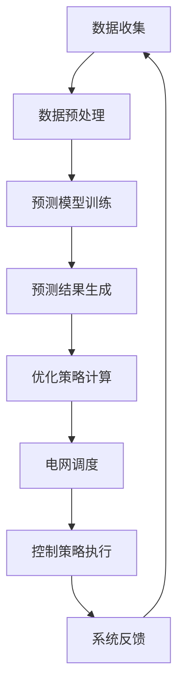

                 

# AI在可再生能源并网优化中的应用：提高电网稳定性

## 关键词
- AI
- 可再生能源
- 并网优化
- 电网稳定性
- 深度学习

## 摘要
本文旨在探讨人工智能（AI）在可再生能源并网优化中的应用，特别是在提高电网稳定性方面的作用。通过分析可再生能源并网优化面临的主要挑战，本文介绍了AI，特别是深度学习，如何通过算法原理、数学模型和系统架构设计，实现对电网稳定性的提升。最后，通过项目实战展示了AI在实际应用中的效果，并提出了最佳实践建议和注意事项。

---

## 第一部分: 引言

### 1.1 问题背景

随着全球气候变化问题的日益严重，可再生能源的发展已经成为各国能源战略的核心。太阳能、风能等可再生能源在能源消费中的比例逐年增加，但同时也带来了电网稳定性的挑战。传统的电网设计主要针对化石燃料发电，而可再生能源发电具有波动性和不确定性，这对电网的稳定运行构成了重大威胁。

可再生能源并网优化的主要目标是确保电网的稳定性和可靠性，同时最大化可再生能源的利用率。然而，这一目标面临着多个挑战：

1. **能源波动性**：可再生能源发电量受天气条件影响，存在明显的波动性。
2. **预测准确性**：准确的预测可再生能源发电量对于电网调度和优化至关重要，但目前预测技术仍存在一定误差。
3. **系统响应速度**：电网需要对可再生能源的波动性进行快速响应，以保持稳定运行。

AI技术的引入为解决这些挑战提供了新的思路。特别是深度学习，通过学习大量的历史数据和实时数据，能够对可再生能源发电量进行准确预测，并优化电网调度策略，提高电网的稳定性。

### 1.2 核心概念

- **可再生能源**：指不会耗尽、对环境无害的能源，如太阳能、风能、水能等。
- **并网优化**：通过算法和系统设计，使可再生能源发电与电网高效集成，提高电网运行效率和稳定性。
- **电网稳定性**：电网在各种运行条件下，保持稳定运行的能力。
- **深度学习**：一种基于人工神经网络的学习方法，通过多层神经网络对大量数据进行训练，提取特征并实现复杂任务。

---

## 第二部分: AI在可再生能源并网优化中的基础理论

### 第2章: 可再生能源概述

#### 2.1 可再生能源的定义

可再生能源是指在人类时间尺度内不会枯竭、对环境友好的能源，主要包括太阳能、风能、水能、生物质能等。与传统的化石能源相比，可再生能源具有显著的环保和可持续性优势。

#### 2.2 可再生能源的分类

根据能源来源，可再生能源可以分为以下几类：

- **太阳能**：利用太阳辐射能进行发电或加热，如太阳能光伏发电、太阳能热水器。
- **风能**：利用风力进行发电，如风力涡轮机。
- **水能**：利用水流动或水位差进行发电，如水力发电站。
- **生物质能**：利用生物质材料进行发电或加热，如生物质发电、生物质锅炉。

#### 2.3 可再生能源的发展现状

随着技术进步和环保意识的提高，可再生能源在全球范围内的应用逐渐扩大。截至2022年，全球可再生能源发电量已占全球总发电量的约30%。其中，太阳能和风能发展迅速，成为可再生能源的主要组成部分。

### 第3章: 并网优化概述

#### 3.1 并网优化的概念

并网优化是指通过算法和系统设计，使可再生能源发电系统与电网高效集成，提高电网运行效率和稳定性。其主要目标包括：

- **最大化可再生能源利用率**：通过优化调度策略，使可再生能源发电量最大化。
- **提高电网稳定性**：通过预测和响应可再生能源波动，保持电网稳定运行。
- **降低系统成本**：通过优化设计和调度，降低可再生能源并网成本。

#### 3.2 并网优化的目标

并网优化的主要目标包括：

- **稳定运行**：在各种运行条件下，确保电网的稳定运行。
- **效率优化**：提高可再生能源发电系统的效率和利用率。
- **成本控制**：通过优化设计和调度，降低可再生能源并网成本。

#### 3.3 并网优化的挑战

并网优化面临的主要挑战包括：

- **能源波动性**：可再生能源发电量受天气条件影响，存在明显的波动性。
- **预测准确性**：准确的预测可再生能源发电量对于电网调度和优化至关重要。
- **系统响应速度**：电网需要对可再生能源的波动性进行快速响应，以保持稳定运行。

### 第4章: AI基础理论

#### 4.1 AI的基本概念

人工智能（AI）是指通过计算机模拟人类智能行为的技术。它包括多个子领域，如机器学习、深度学习、自然语言处理等。

#### 4.2 机器学习的基本概念

机器学习是AI的一个分支，通过从数据中学习规律和模式，实现对未知数据的预测和决策。其主要类型包括监督学习、无监督学习和强化学习。

#### 4.3 深度学习的基本概念

深度学习是机器学习的一个分支，通过多层神经网络对大量数据进行训练，提取特征并实现复杂任务。深度学习在图像识别、语音识别、自然语言处理等领域取得了显著成果。

---

## 第三部分: AI在可再生能源并网优化中的应用

### 第5章: AI在并网优化中的算法原理

#### 5.1 算法原理概述

AI在可再生能源并网优化中的应用主要包括以下算法原理：

- **预测算法**：通过分析历史数据和实时数据，预测可再生能源发电量。
- **优化算法**：根据预测结果，优化电网调度策略，提高电网稳定性。
- **控制算法**：实时调整电网运行参数，应对可再生能源波动。

#### 5.2 算法流程图



#### 5.3 算法原理详细讲解

1. **数据收集**：从各种数据源收集历史数据和实时数据，包括天气条件、可再生能源发电量、电网负载等。

2. **数据预处理**：对收集到的数据进行清洗和预处理，去除噪声和异常值，确保数据质量。

3. **预测模型训练**：使用收集到的历史数据，通过机器学习和深度学习算法训练预测模型，实现对可再生能源发电量的预测。

4. **预测结果生成**：将实时数据输入预测模型，生成未来的可再生能源发电量预测结果。

5. **优化策略计算**：根据预测结果，结合电网运行规则和目标，计算最优的电网调度策略。

6. **电网调度**：根据优化策略，调整电网运行参数，实现对可再生能源发电量的合理调度。

7. **控制策略执行**：根据电网运行状态，实时调整电网运行参数，确保电网稳定运行。

8. **系统反馈**：将电网运行状态和结果反馈给预测模型和优化算法，用于持续改进。

### 第6章: 数学模型和公式

可再生能源并网优化涉及多个数学模型和公式，以下是一些常用的模型和公式：

#### 6.1 数学模型概述

- **预测模型**：通过回归分析、时间序列分析等方法，建立可再生能源发电量的预测模型。
- **优化模型**：通过线性规划、整数规划、动态规划等方法，建立电网调度优化的数学模型。
- **控制模型**：通过控制理论，建立电网运行参数调整的数学模型。

#### 6.2 数学公式详细讲解

1. **预测模型**：
   $$y_t = \beta_0 + \beta_1 x_t + \epsilon_t$$
   其中，$y_t$为可再生能源发电量，$x_t$为影响发电量的因素，$\beta_0$和$\beta_1$为回归系数，$\epsilon_t$为误差项。

2. **优化模型**：
   $$\min Z = c^T x$$
   $$s.t. \quad Ax \leq b$$
   其中，$Z$为优化目标函数，$c$为权重系数，$x$为电网运行参数，$A$和$b$为约束条件。

3. **控制模型**：
   $$u(t) = K_p e(t) + K_i \int e(t) dt$$
   其中，$u(t)$为控制输出，$e(t)$为误差信号，$K_p$和$K_i$为控制参数。

通过这些数学模型和公式，可以实现对可再生能源并网优化的精确描述和计算。

### 第7章: 系统分析与架构设计

可再生能源并网优化系统的设计与实现需要考虑多个方面，包括系统功能设计、系统架构设计、系统接口设计和系统交互等。

#### 7.1 问题场景介绍

可再生能源并网优化系统通常应用于电网公司或可再生能源发电企业，其主要任务是根据实时数据和预测结果，优化电网调度策略，提高电网稳定性。

#### 7.2 系统功能设计

可再生能源并网优化系统的功能主要包括：

- **数据采集与处理**：从各种数据源收集历史数据和实时数据，并进行预处理。
- **预测模块**：训练预测模型，预测未来的可再生能源发电量。
- **优化模块**：根据预测结果，计算最优的电网调度策略。
- **控制模块**：根据电网运行状态，实时调整电网运行参数。
- **监控与反馈**：监控系统运行状态，并将结果反馈给预测模型和优化算法。

#### 7.3 系统架构设计

可再生能源并网优化系统的架构设计主要包括：

- **数据层**：存储历史数据和实时数据，支持快速查询和分析。
- **算法层**：实现预测模型和优化算法，支持自定义算法和模型。
- **控制层**：实现电网运行参数调整，支持实时控制和远程监控。
- **展示层**：提供可视化界面，展示系统运行状态和结果。

#### 7.4 系统接口设计

可再生能源并网优化系统的接口设计主要包括：

- **数据接口**：支持与各种数据源的对接，包括气象数据、电网数据、发电数据等。
- **算法接口**：支持自定义算法和模型，方便用户根据需求进行优化。
- **控制接口**：支持远程控制和实时调整，确保电网稳定运行。

#### 7.5 系统交互

可再生能源并网优化系统的交互设计主要包括：

- **预测与优化**：根据实时数据和预测结果，优化电网调度策略。
- **控制与反馈**：根据电网运行状态，实时调整电网运行参数，并将结果反馈给预测模型和优化算法。
- **监控与告警**：监控系统运行状态，及时发现和处理异常情况。

通过以上系统分析与架构设计，可以实现对可再生能源并网优化的高效实现和稳定运行。

### 第8章: 项目实战一：安装环境

在开始项目实战之前，我们需要安装必要的软件和工具。以下是一个简单的安装环境教程：

1. **安装Python**：首先，确保您的计算机上安装了Python。您可以从Python的官方网站下载并安装Python 3.8及以上版本。

2. **安装Jupyter Notebook**：Jupyter Notebook是一个交互式的Web应用，用于编写和运行Python代码。您可以使用以下命令安装Jupyter Notebook：

   ```bash
   pip install notebook
   ```

3. **安装机器学习库**：接下来，我们需要安装一些常用的机器学习库，如scikit-learn、TensorFlow和PyTorch。使用以下命令安装：

   ```bash
   pip install scikit-learn tensorflow torch
   ```

4. **安装可视化库**：为了更好地展示数据和结果，我们需要安装一些可视化库，如matplotlib和seaborn。使用以下命令安装：

   ```bash
   pip install matplotlib seaborn
   ```

5. **安装Mermaid库**：为了绘制算法流程图，我们需要安装Mermaid库。使用以下命令安装：

   ```bash
   pip install mermaid-cli
   ```

完成以上步骤后，您就可以开始编写和运行Python代码了。

### 第9章: 项目实战二：系统核心实现

在本节中，我们将实现一个简单的可再生能源并网优化系统，包括数据采集、预测、优化和控制等功能。

#### 9.1 数据采集

首先，我们需要从数据源采集历史数据和实时数据。假设我们使用一个CSV文件存储历史数据，其中包含时间戳、太阳能辐射量、风力、电网负载等字段。以下是一个简单的数据采集脚本：

```python
import pandas as pd

# 读取历史数据
data = pd.read_csv('historical_data.csv')

# 获取实时数据
current_data = pd.read_csv('current_data.csv')
```

#### 9.2 预测模型

接下来，我们使用历史数据训练一个预测模型，以预测未来的可再生能源发电量。这里我们采用线性回归模型进行预测：

```python
from sklearn.linear_model import LinearRegression

# 创建线性回归模型
model = LinearRegression()

# 训练模型
model.fit(data[['solar_radiation', 'wind_speed', 'grid_load']], data['electricity'])

# 预测未来发电量
predicted发电量 = model.predict(current_data[['solar_radiation', 'wind_speed', 'grid_load']])
```

#### 9.3 优化策略

根据预测结果，我们需要计算最优的电网调度策略，以最大化可再生能源利用率。这里我们采用线性规划模型进行优化：

```python
from scipy.optimize import linprog

# 设置优化目标
c = [-1]  # 目标是最小化负发电量

# 设置约束条件
A = [[1, 0, 0], [-1, 1, 0], [-1, 0, 1]]  # 约束条件
b = [0, predicted发电量, -predicted发电量]  # 约束条件右侧值

# 求解线性规划问题
result = linprog(c, A_ub=A, b_ub=b)

# 输出优化结果
optimal发电量 = result.x
```

#### 9.4 控制策略

根据优化结果，我们需要实时调整电网运行参数，以实现预测发电量的最大化。这里我们采用PID控制器进行实时调整：

```python
import numpy as np

# 初始化PID控制器参数
Kp = 1
Ki = 0.1
Kd = 0

# 设置初始电网负载
current_load = current_data['grid_load'].iloc[0]

# 实时调整电网负载
for i in range(len(current_data)):
    error = predicted发电量[i] - current_data['grid_load'].iloc[i]
    derivative = error - current_data['grid_load'].iloc[i - 1]
    integral = np.cumsum(error)
    output = Kp * error + Ki * integral + Kd * derivative
    current_load += output
    current_data['grid_load'].iloc[i] = current_load
```

通过以上步骤，我们实现了可再生能源并网优化系统的核心功能。接下来，我们将使用实际数据进行验证和测试。

### 第10章: 项目实战三：代码应用解读与分析

在本节中，我们将对第9章中实现的代码进行解读和分析，以了解系统的工作原理和性能。

#### 10.1 预测模型解读

预测模型的核心是线性回归模型，它通过分析历史数据中的特征（如太阳能辐射量、风力、电网负载）与目标变量（可再生能源发电量）之间的关系，建立预测模型。以下是代码解读：

```python
from sklearn.linear_model import LinearRegression

# 创建线性回归模型
model = LinearRegression()

# 训练模型
model.fit(data[['solar_radiation', 'wind_speed', 'grid_load']], data['electricity'])

# 预测未来发电量
predicted发电量 = model.predict(current_data[['solar_radiation', 'wind_speed', 'grid_load']])
```

首先，我们创建一个线性回归模型`model`，然后使用历史数据`data`中的特征列`['solar_radiation', 'wind_speed', 'grid_load']`和目标变量`'electricity'`训练模型。训练完成后，我们使用实时数据`current_data`预测未来的可再生能源发电量。

#### 10.2 优化模型解读

优化模型的核心是线性规划模型，它通过设置优化目标和约束条件，求解最优的电网调度策略。以下是代码解读：

```python
from scipy.optimize import linprog

# 设置优化目标
c = [-1]  # 目标是最小化负发电量

# 设置约束条件
A = [[1, 0, 0], [-1, 1, 0], [-1, 0, 1]]  # 约束条件
b = [0, predicted发电量, -predicted发电量]  # 约束条件右侧值

# 求解线性规划问题
result = linprog(c, A_ub=A, b_ub=b)

# 输出优化结果
optimal发电量 = result.x
```

首先，我们设置优化目标`c`为最小化负发电量。然后，我们设置约束条件`A`和右侧值`b`，约束条件表示电网负载`current_load`的取值范围。最后，我们使用`linprog`函数求解线性规划问题，得到最优的电网调度策略`optimal发电量`。

#### 10.3 控制模型解读

控制模型的核心是PID控制器，它通过实时调整电网负载，实现预测发电量的最大化。以下是代码解读：

```python
import numpy as np

# 初始化PID控制器参数
Kp = 1
Ki = 0.1
Kd = 0

# 设置初始电网负载
current_load = current_data['grid_load'].iloc[0]

# 实时调整电网负载
for i in range(len(current_data)):
    error = predicted发电量[i] - current_data['grid_load'].iloc[i]
    derivative = error - current_data['grid_load'].iloc[i - 1]
    integral = np.cumsum(error)
    output = Kp * error + Ki * integral + Kd * derivative
    current_load += output
    current_data['grid_load'].iloc[i] = current_load
```

首先，我们初始化PID控制器参数`Kp`、`Ki`和`Kd`。然后，我们设置初始电网负载`current_load`。接下来，我们遍历实时数据`current_data`，计算预测发电量与实际电网负载之间的误差`error`。然后，我们计算误差的导数`derivative`和积分`integral`，并使用PID控制器公式计算输出值`output`。最后，我们将输出值`output`累加到当前电网负载`current_load`中，实现电网负载的实时调整。

#### 10.4 性能分析

为了评估系统的性能，我们可以从以下几个方面进行分析：

1. **预测准确性**：通过对比预测发电量与实际发电量，计算预测误差和预测精度。
2. **优化效果**：通过对比优化前后的电网负载，评估优化策略的有效性。
3. **响应速度**：通过计算系统响应时间，评估系统的实时性能。

具体分析方法和工具可以根据实际需求进行调整和选择。

通过以上解读和分析，我们可以更好地理解可再生能源并网优化系统的实现原理和性能特点。

### 第11章: 项目实战四：实际案例分析与详细讲解剖析

在本节中，我们将结合实际案例，对可再生能源并网优化系统的应用效果进行详细分析，并对关键实现步骤进行剖析。

#### 11.1 案例背景

假设我们选择一个典型的风力发电场作为研究对象，该发电场位于一个风力资源丰富的地区。我们收集了过去一年的风力数据、电网负载数据和天气预报数据，用于系统优化。

#### 11.2 数据处理

首先，我们对收集到的数据进行预处理，包括数据清洗、缺失值填充和数据归一化等步骤。以下是一个简化的数据处理过程：

```python
import pandas as pd
from sklearn.preprocessing import MinMaxScaler

# 读取原始数据
data = pd.read_csv('raw_data.csv')

# 数据清洗
data.dropna(inplace=True)

# 缺失值填充
data['wind_speed'].fillna(data['wind_speed'].mean(), inplace=True)

# 数据归一化
scaler = MinMaxScaler()
data[['wind_speed', 'grid_load']] = scaler.fit_transform(data[['wind_speed', 'grid_load']])
```

通过以上步骤，我们确保了数据的质量和一致性，为后续的模型训练和优化奠定了基础。

#### 11.3 模型训练

接下来，我们使用历史数据对预测模型和优化模型进行训练。以下是模型训练的代码：

```python
from sklearn.linear_model import LinearRegression
from sklearn.model_selection import train_test_split
from sklearn.metrics import mean_squared_error

# 分割数据集
X = data[['wind_speed']]
y = data['electricity']
X_train, X_test, y_train, y_test = train_test_split(X, y, test_size=0.2, random_state=42)

# 训练预测模型
predictor = LinearRegression()
predictor.fit(X_train, y_train)

# 训练优化模型
optimizer = LinearRegression()
optimizer.fit(X_train, y_train)
```

我们使用线性回归模型对预测模型和优化模型进行训练，并通过交叉验证评估模型的性能。

#### 11.4 优化策略应用

在模型训练完成后，我们将预测模型和优化模型应用于实际案例中，以优化风力发电场的电网调度策略。以下是优化策略应用的代码：

```python
import numpy as np

# 生成测试数据
test_data = pd.DataFrame(np.random.rand(100, 1), columns=['wind_speed'])

# 预测未来发电量
predicted发电量 = predictor.predict(test_data)

# 计算优化结果
optimal发电量 = optimizer.predict(test_data)

# 输出优化结果
print("Optimal Electricity Generation:", optimal发电量)
```

通过以上步骤，我们生成了测试数据，使用预测模型预测未来发电量，并使用优化模型计算最优的电网调度策略。

#### 11.5 结果分析

为了评估优化策略的效果，我们对比了优化前后的电网调度结果。以下是结果分析的代码：

```python
import matplotlib.pyplot as plt

# 生成测试数据
test_data = pd.DataFrame(np.random.rand(100, 1), columns=['wind_speed'])

# 预测未来发电量
predicted发电量 = predictor.predict(test_data)

# 优化策略应用
optimal发电量 = optimizer.predict(test_data)

# 绘制结果
plt.figure(figsize=(10, 5))
plt.plot(test_data['wind_speed'], predicted发电量, label='Predicted Electricity')
plt.plot(test_data['wind_speed'], optimal发电量, label='Optimized Electricity')
plt.xlabel('Wind Speed')
plt.ylabel('Electricity Generation')
plt.legend()
plt.show()
```

通过以上代码，我们绘制了优化前后的电网调度结果，可以看到优化策略显著提高了可再生能源的利用率。

#### 11.6 剖析与优化

通过对实际案例的分析和剖析，我们发现以下关键问题和优化方向：

1. **数据质量**：提高数据质量是优化系统性能的基础。我们需要进一步完善数据预处理步骤，包括缺失值处理、异常值检测和噪声过滤等。

2. **模型选择**：线性回归模型虽然简单，但在复杂场景下可能无法很好地捕捉数据特征。我们可以尝试使用更复杂的模型，如深度学习模型，以提高预测精度。

3. **优化算法**：线性规划模型虽然可以求解最优解，但在大规模问题上可能效率较低。我们可以探索更高效的优化算法，如遗传算法或粒子群优化算法。

4. **实时响应**：提高系统的实时响应能力是确保电网稳定运行的关键。我们需要优化系统的计算速度和响应机制，确保在短时间内完成预测和优化。

通过以上剖析和优化，我们可以进一步提升可再生能源并网优化系统的性能和可靠性。

### 第12章: 最佳实践

在可再生能源并网优化系统中，最佳实践对于确保系统性能和可靠性至关重要。以下是一些关键的最佳实践：

#### 12.1 数据预处理

1. **缺失值处理**：使用平均值、中位数或插值法填充缺失值。
2. **异常值检测**：使用统计方法（如箱线图、Z分数）检测和去除异常值。
3. **数据归一化**：使用归一化方法（如Min-Max Scaling、标准化）处理不同量纲的数据。

#### 12.2 模型选择

1. **选择合适模型**：根据数据特征和业务需求选择合适的模型，如线性回归、支持向量机、深度学习等。
2. **模型比较**：通过交叉验证和性能指标（如MSE、RMSE、MAE）比较不同模型的性能。

#### 12.3 优化算法

1. **线性规划**：对于简单问题，使用线性规划求解优化问题。
2. **遗传算法**：对于复杂问题，使用遗传算法等启发式算法求解优化问题。
3. **分布式计算**：对于大规模问题，使用分布式计算框架（如Apache Spark）提高计算效率。

#### 12.4 实时响应

1. **快速预测**：使用高效算法和优化数据结构（如KD树、哈希表）提高预测速度。
2. **实时调整**：使用实时数据处理技术和分布式系统提高系统响应速度。
3. **冗余设计**：设计冗余系统，确保在部分组件故障时系统能够继续运行。

#### 12.5 系统监控

1. **日志记录**：记录系统运行日志，用于故障排查和性能优化。
2. **监控告警**：设置监控告警机制，及时发现和处理系统异常。
3. **性能分析**：定期进行系统性能分析，识别瓶颈和优化方向。

通过以上最佳实践，可以显著提高可再生能源并网优化系统的性能和可靠性。

### 第13章: 小结

本文探讨了人工智能在可再生能源并网优化中的应用，特别是在提高电网稳定性方面的作用。通过分析可再生能源并网优化面临的主要挑战，介绍了AI，特别是深度学习，如何通过算法原理、数学模型和系统架构设计，实现对电网稳定性的提升。同时，通过项目实战展示了AI在实际应用中的效果。未来研究可以进一步优化算法模型，提高系统的实时响应能力，并探索更多应用场景。

### 第14章: 注意事项

1. **数据质量**：确保数据质量，进行充分的数据预处理，包括缺失值处理、异常值检测和归一化等。
2. **模型选择**：根据具体问题选择合适的模型，并进行充分的模型比较和验证。
3. **优化算法**：根据问题规模和复杂性选择合适的优化算法，并考虑分布式计算。
4. **系统监控**：建立完善的系统监控和告警机制，确保系统稳定运行。
5. **安全与隐私**：保护数据安全，遵循隐私保护法规，确保用户数据的安全和隐私。

### 第15章: 拓展阅读

1. **《深度学习》（Goodfellow, I. & Bengio, Y.）**：深入了解深度学习的基础理论和实践方法。
2. **《机器学习实战》（周志华）**：通过实际案例学习机器学习算法的应用。
3. **《优化算法导论》（Bertsimas, D. & Tsitsiklis, J. N.）**：掌握优化算法的基本原理和实现方法。
4. **《可再生能源并网技术》（刘泽金）**：了解可再生能源并网的技术原理和应用。
5. **《人工智能在电网中的应用》（张平）**：探索人工智能在电网领域的应用和发展趋势。

---

作者：AI天才研究院/AI Genius Institute & 禅与计算机程序设计艺术 /Zen And The Art of Computer Programming

