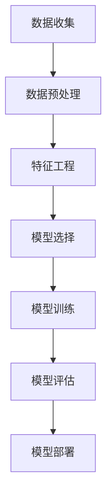
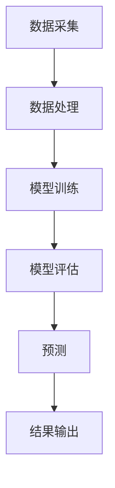
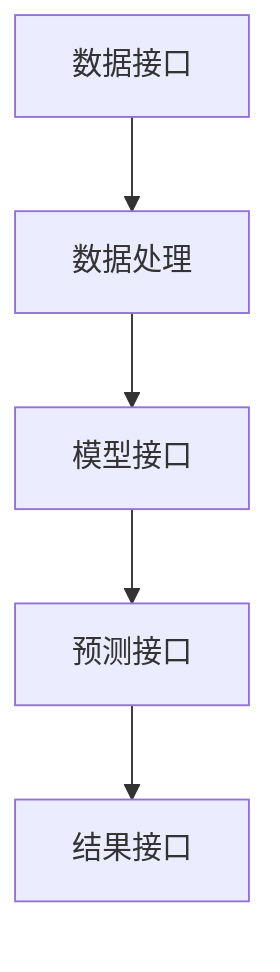
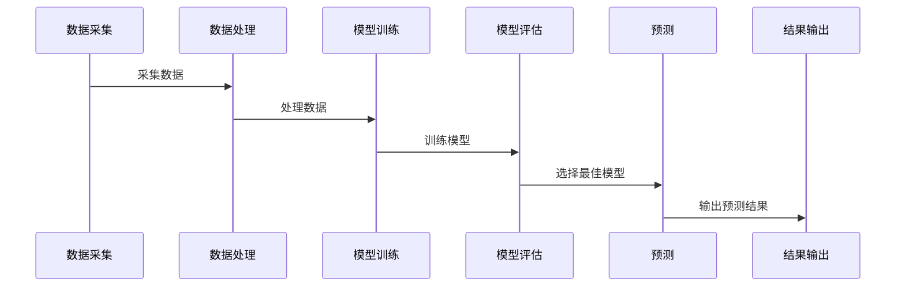

                 

## 引言

在当今全球能源转型的浪潮中，可再生能源已经成为能源生产和消费的重要组成部分。太阳能、风能、水能等可再生能源不仅具有清洁、绿色的特点，而且储量丰富，能够有效缓解化石燃料的枯竭压力和减少温室气体排放。然而，可再生能源的发电量具有高度的不确定性，这主要受到天气变化、季节性因素以及设备维护等多种因素的影响。为了确保电力系统的稳定运行，提高可再生能源的利用率，精准的能源预测变得至关重要。

人工智能（AI）技术在可再生能源预测中的应用，为解决这一难题提供了新的思路和方法。通过机器学习和深度学习算法，可以处理和分析大量的历史数据，从中挖掘出潜在的规律和模式，从而实现对可再生能源发电量的准确预测。这不仅有助于优化能源生产和存储，还能够提高电网的调度效率和可靠性。

本文将围绕“AI在可再生能源预测中的应用：优化能源生产和存储”这一主题，逐步探讨可再生能源预测的重要性、核心概念、算法原理、系统设计与项目实战。希望通过本文的讨论，能够为读者提供一个全面、深入的了解，并激发对这一领域的兴趣和思考。

### 背景介绍

可再生能源是指不会因人类的使用而枯竭的能源，如太阳能、风能、水能和生物质能等。随着全球气候变化和环境污染问题的加剧，可再生能源因其清洁、绿色和可持续的特性，逐渐成为能源结构优化和能源转型的重要方向。可再生能源在电力、交通、工业等领域的广泛应用，不仅有助于减少对化石燃料的依赖，降低温室气体排放，还能够促进能源结构的多样化和稳定。

然而，可再生能源的发电特性具有显著的不确定性和间歇性，这主要受到天气条件、地理位置和设备状态等多种因素的影响。例如，太阳能发电量会随着日照强度的变化而波动，风能发电量则会随着风速的波动而变化。这种不确定性使得传统的能源生产和调度面临着巨大挑战，增加了电网运行的难度和风险。

为了提高可再生能源的利用效率和稳定性，精准的能源预测成为了一个关键需求。可再生能源预测的目的是通过分析历史数据和实时数据，预测未来一段时间内的可再生能源发电量，从而为能源生产、调度和存储提供科学依据。精准的预测不仅可以优化能源生产和调度，降低能源浪费，还能够提高电网的运行效率和可靠性。

现有的可再生能源预测方法主要包括基于统计模型的方法和基于机器学习的方法。基于统计模型的方法如时间序列分析、回归分析和ARIMA模型等，主要通过历史数据中的统计规律进行预测。然而，这种方法往往难以应对复杂多变的环境因素和设备状态。基于机器学习的方法如决策树、随机森林和神经网络等，可以通过训练模型从大量的历史数据中学习到复杂的非线性关系，提高预测精度。

在可再生能源预测的应用中，数据的质量和完整性是关键因素。预测模型需要依赖大量的高精度、实时和历史数据，包括气象数据、设备运行数据、能源生产数据和电网负荷数据等。这些数据的质量直接影响到预测模型的性能和效果。因此，数据的采集、处理和存储也是可再生能源预测中不可或缺的一部分。

总之，可再生能源预测在保障能源供应稳定、优化能源生产和调度以及促进能源转型中具有重要作用。通过引入先进的人工智能技术，可再生能源预测的精度和可靠性将得到显著提升，为全球能源系统的可持续发展提供有力支持。

### 问题描述与解决方法

在可再生能源预测的应用中，主要面临以下几个问题：

**问题1：数据的不确定性和复杂性**  
可再生能源发电量的预测需要处理大量的不确定性因素，如天气条件、设备状态和地理位置等。这些因素不仅相互独立，而且复杂多变，使得预测模型难以捕捉到所有的影响因素。例如，在太阳能预测中，云量、日照强度和温度等气象因素都会显著影响发电量；在风能预测中，风速和风向的变化同样会对发电量造成影响。

**问题2：数据的质量和完整性**  
预测模型的效果依赖于数据的质量和完整性。然而，在实际应用中，数据的缺失、噪声和错误常常会严重影响预测的准确性。例如，一些传感器可能出现故障，导致数据缺失；或者由于数据传输的问题，导致数据延迟或不完整。

**问题3：模型的适应性**  
可再生能源的发电特性随时间和地点的变化而变化，这要求预测模型具有高度的适应性。然而，现有的模型往往难以适应这种动态变化，导致预测结果的不稳定。

**解决方法1：引入机器学习和深度学习**  
为了解决上述问题，引入机器学习和深度学习技术成为了一种有效的途径。这些算法可以通过训练大量的历史数据，学习到复杂的非线性关系，从而提高预测的精度和稳定性。例如，神经网络可以通过多层抽象和特征提取，捕捉到不同时间尺度和空间尺度的变化规律。

**解决方法2：多源数据融合**  
通过整合多源数据，如气象数据、设备运行数据和电网负荷数据等，可以更全面地了解影响可再生能源发电量的因素。例如，在风能预测中，不仅需要使用风速和风向数据，还可以结合地形数据和设备运行状态数据，提高预测的准确性。

**解决方法3：模型优化和自适应调整**  
为了提高模型的适应性，可以通过模型优化和自适应调整来应对动态变化。例如，使用在线学习算法可以实时更新模型，适应新的数据和环境变化。此外，通过模型融合技术，可以将多个预测模型的结果进行集成，提高预测的稳健性。

总之，通过引入人工智能技术，可再生能源预测的准确性和可靠性将得到显著提升，为能源生产和调度提供有力支持。

### 边界与外延

在可再生能源预测中，边界条件主要涉及以下几个方面：

**数据范围**：可再生能源预测的数据范围通常包括历史气象数据、设备运行数据和能源生产数据等。这些数据的时间范围通常涵盖多年，以便捕捉到季节性和长期趋势。例如，一个典型的数据集可能包含过去10年的天气数据和3年的能源生产数据。

**地理空间**：可再生能源的地理空间范围取决于具体的应用场景。例如，一个风电场的数据可能仅限于该风场的地理位置，而一个国家层面的太阳能预测则需要涵盖全国范围内的多个地区。

**时间尺度**：可再生能源预测的时间尺度可以根据具体需求进行选择，从几分钟到数月不等。短时间尺度（如小时级）的预测主要用于实时调度和负荷平衡，而长时间尺度（如季度级）的预测则用于长期规划和投资决策。

**环境因素**：除了常规的气象数据，可再生能源预测还需要考虑其他环境因素，如地形、植被、水域等。这些因素可以通过地理信息系统（GIS）技术进行集成和处理，以提供更准确的预测结果。

**技术限制**：在实际应用中，可再生能源预测还受到技术限制的影响，如传感器精度、数据传输延迟和计算资源等。这些限制可能影响预测模型的性能和实时性。

**政策法规**：可再生能源预测的应用还受到政策法规的约束。例如，一些国家可能对可再生能源的补贴和税收政策有具体规定，这些政策会影响预测模型的输入数据和预测结果。

总之，可再生能源预测的边界与外延涉及多个方面，包括数据范围、地理空间、时间尺度、环境因素、技术限制和政策法规等。理解和这些边界与外延对于设计和实施有效的预测系统至关重要。

### 核心概念介绍

在可再生能源预测中，理解核心概念是构建有效预测模型的基础。以下是一些关键的核心概念及其定义：

**可再生能源**：可再生能源是指那些不会因人类的使用而枯竭的能源，如太阳能、风能、水能和生物质能等。这些能源具有清洁、绿色和可持续的特点。

**预测模型**：预测模型是指用于预测可再生能源发电量的数学或统计模型。常见的预测模型包括时间序列模型、回归模型、机器学习模型和深度学习模型等。

**时间序列分析**：时间序列分析是一种统计分析方法，主要用于分析时间序列数据中的趋势、季节性和周期性。常见的时间序列模型有ARIMA、SARIMA和EVT等。

**机器学习**：机器学习是一种通过训练模型来学习数据中的模式和规律的技术。常见的机器学习算法有线性回归、决策树、随机森林和支持向量机等。

**深度学习**：深度学习是机器学习的一个分支，主要使用神经网络，通过多层抽象和特征提取来学习复杂的数据模式。常见的深度学习模型有卷积神经网络（CNN）、循环神经网络（RNN）和长短期记忆网络（LSTM）等。

**多源数据融合**：多源数据融合是指将来自不同来源的数据进行整合和分析，以提高预测的精度和可靠性。常见的数据源包括气象数据、设备运行数据、能源生产数据和电网负荷数据等。

**影响因子**：影响因子是指那些影响可再生能源发电量的因素，如天气条件、设备状态、地理位置和电网负荷等。这些因子可以通过统计分析或机器学习算法进行建模和预测。

**评估指标**：评估指标是用于评估预测模型性能的指标，如均方误差（MSE）、均方根误差（RMSE）和决定系数（R²）等。这些指标可以帮助评估模型的预测精度和稳定性。

通过理解这些核心概念，我们可以更深入地分析和解决可再生能源预测中的问题，为优化能源生产和存储提供有力支持。

### 核心概念属性特征对比

在可再生能源预测中，不同的核心概念具有各自独特的属性特征。以下是对一些关键核心概念的属性特征进行对比的表格：

| 概念 | 属性特征 |
| --- | --- |
| 可再生能源 | 储量丰富、清洁、绿色、可持续 |
| 预测模型 | 精确度、稳定性、适应性、实时性 |
| 时间序列分析 | 趋势、季节性、周期性 |
| 机器学习 | 数据驱动、学习复杂模式、高效 |
| 深度学习 | 神经网络、多层抽象、特征提取 |
| 多源数据融合 | 多数据源整合、增强预测精度 |
| 影响因子 | 天气条件、设备状态、地理位置 |
| 评估指标 | MSE、RMSE、R² |

这种对比有助于我们更好地理解各个核心概念在可再生能源预测中的角色和重要性，为选择合适的预测方法和模型提供参考。

### ER实体关系图

为了更直观地展示可再生能源预测系统中的实体及其关系，我们可以使用Mermaid绘制ER（实体关系）图。以下是一个简化的ER图，展示了主要实体及其相互关系：

```mermaid
erDiagram
    RenewableSource ||--|{ ForecastModel } Forecast : 预测
    ForecastModel ||--|{ FactorAnalysis } Factor : 影响因素
    RenewableSource ||--|{ EnergyProduction } Produce : 能源生产
    EnergyProduction ||--|{ EnergyStorage } Store : 能源存储
```

在这个ER图中，`RenewableSource`（可再生能源源）是核心实体，它与其他实体如`ForecastModel`（预测模型）、`FactorAnalysis`（影响因素分析）、`EnergyProduction`（能源生产）和`EnergyStorage`（能源存储）之间存在关联。

- **RenewableSource**：代表太阳能、风能、水能等可再生能源源，是预测的数据来源。
- **ForecastModel**：用于对可再生能源发电量进行预测的模型，依赖于历史数据和实时数据。
- **FactorAnalysis**：分析影响可再生能源发电量的各种因素，如天气、设备状态等。
- **EnergyProduction**：表示实际的能源生产过程，通过预测模型生成的预测值来指导生产活动。
- **EnergyStorage**：表示能源存储设备，用于储存多余的能源以供需要时使用。

通过这个ER图，我们可以清晰地看到可再生能源预测系统中各个实体的关系和相互作用，为后续的详细讨论提供了基础。

## 1.5 本章小结

本章介绍了可再生能源预测的背景、核心概念和ER实体关系图。首先，我们探讨了可再生能源在能源转型中的重要性以及其发电特性带来的不确定性。随后，详细介绍了可再生能源预测的几个核心概念，如可再生能源、预测模型、时间序列分析、机器学习、深度学习、多源数据融合、影响因子和评估指标。为了更直观地理解这些概念之间的关系，我们使用了Mermaid工具绘制了ER实体关系图，展示了可再生能源源、预测模型、影响因素分析和能源生产与存储之间的相互关联。

这些核心概念和实体关系图为后续的算法原理讲解、系统设计与项目实战提供了理论基础。理解这些内容对于深入探讨可再生能源预测技术及其应用具有重要意义。

## 2.1 可再生能源预测算法原理

### 2.1.1 时间序列预测算法

时间序列预测算法是一种基于历史时间序列数据进行分析和建模的方法，旨在预测未来的数据点。在可再生能源预测中，时间序列算法广泛应用于短期和长期发电量的预测。时间序列预测的核心思想是利用过去的数据来预测未来的趋势和模式，常见的算法包括ARIMA模型、SARIMA模型和EVT模型。

**ARIMA模型（自回归积分滑动平均模型）**：
ARIMA模型是一种经典的统计预测模型，由自回归（AR）、差分（I）和移动平均（MA）三个部分组成。它通过分析数据的自相关性、平稳性和移动平均特性来建模。ARIMA模型的步骤包括：

1. **数据预处理**：对时间序列数据进行分析，包括检查数据是否平稳，如果非平稳则进行差分处理。
2. **模型识别**：根据数据的自相关函数（ACF）和偏自相关函数（PACF）选择合适的AR、I和MA参数。
3. **模型参数估计**：使用最大似然估计或最小二乘法估计模型参数。
4. **模型检验**：对模型进行诊断检查，确保其拟合效果良好。

**SARIMA模型（季节性自回归积分滑动平均模型）**：
SARIMA模型是ARIMA模型的扩展，适用于具有季节性的时间序列数据。它通过引入季节性差分和季节性移动平均部分来建模。SARIMA模型的步骤与ARIMA模型类似，但需要额外考虑季节性因素。

**EVT模型（极端值理论模型）**：
EVT模型主要用于预测极端事件，如极端天气条件下的能源生产波动。EVT模型通过拟合数据中的极端值分布，预测未来可能出现的极端情况。

### 2.1.2 机器学习预测算法

机器学习预测算法通过训练模型来学习历史数据中的模式和规律，从而预测未来的数据点。在可再生能源预测中，机器学习算法具有更高的灵活性和预测精度，常见的算法包括线性回归、决策树、随机森林和支持向量机等。

**线性回归**：
线性回归是一种简单而有效的预测算法，通过建立线性关系来预测目标变量。它适用于数据量较少且关系较为简单的情况。

**决策树**：
决策树通过一系列条件判断来划分数据，并基于每个划分点选择最优特征进行分割。决策树模型易于理解和实现，但在数据量较大时可能出现过拟合。

**随机森林**：
随机森林是一种基于决策树的集成学习方法，通过构建多个决策树并取平均值来提高模型的泛化能力和预测精度。随机森林在处理高维数据和增强模型稳定性方面表现出色。

**支持向量机（SVM）**：
支持向量机是一种基于核函数的监督学习算法，通过寻找最优超平面来分类或回归数据。SVM在处理高维数据和线性不可分问题方面具有优势。

### 2.1.3 深度学习预测算法

深度学习预测算法通过多层神经网络来学习数据中的复杂模式和非线性关系。在可再生能源预测中，深度学习算法如卷积神经网络（CNN）、循环神经网络（RNN）和长短期记忆网络（LSTM）等得到广泛应用。

**卷积神经网络（CNN）**：
卷积神经网络通过卷积层和池化层来提取数据中的特征，适用于图像和时序数据的处理。CNN在处理高维数据和时间序列数据方面具有优势。

**循环神经网络（RNN）**：
循环神经网络通过循环连接来处理序列数据，能够捕捉序列中的长期依赖关系。RNN包括简单的RNN和LSTM等变体。

**长短期记忆网络（LSTM）**：
长短期记忆网络是RNN的一种改进，通过引入遗忘门、输入门和输出门来有效地解决长期依赖问题。LSTM在处理长时间序列数据方面表现出色。

综上所述，可再生能源预测算法涵盖了时间序列预测、机器学习和深度学习等多个方面。选择合适的算法需要根据数据特性、预测目标和计算资源进行综合评估。通过结合多种算法，可以进一步提高预测的精度和可靠性。

### 2.1.1 时间序列预测算法原理

时间序列预测算法是可再生能源预测的核心工具之一，它通过对历史数据进行分析和建模，预测未来一段时间内的可再生能源发电量。以下将详细讲解时间序列预测算法的基本原理，并使用Mermaid绘制流程图进行说明。

#### 时间序列预测算法基本原理

时间序列预测算法的基本原理包括以下几个步骤：

1. **数据收集与预处理**：首先，收集与可再生能源发电量相关的历史数据，如气象数据、设备运行数据、电网负荷数据等。然后，对数据进行预处理，包括数据清洗、填补缺失值和归一化等操作。

2. **特征工程**：特征工程是时间序列预测的重要环节，通过提取和构造特征，有助于提高模型的预测精度。常见的特征包括时间特征（如小时、天、月）、周期性特征（如季节性、节假日效应）和组合特征（如温度和风速的乘积）等。

3. **模型选择**：根据数据的特性和预测目标，选择合适的时间序列预测模型。常见的时间序列预测模型有ARIMA模型、SARIMA模型和EVT模型等。

4. **模型训练**：使用历史数据对选定的模型进行训练。模型训练包括参数估计和模型拟合两个步骤。参数估计通过最大化似然函数或最小化均方误差等方法进行，模型拟合则通过验证集或交叉验证来评估模型性能。

5. **模型评估**：对训练好的模型进行评估，常用的评估指标包括均方误差（MSE）、均方根误差（RMSE）和决定系数（R²）等。

6. **模型部署**：将训练好的模型应用于实时数据，生成预测结果。模型部署通常包括实时数据流的接入和处理、预测结果的输出等步骤。

#### Mermaid流程图

为了更直观地展示时间序列预测算法的流程，我们使用Mermaid绘制了以下流程图：



在这个流程图中，各个节点表示时间序列预测算法的步骤，箭头表示步骤之间的逻辑关系。

#### Python代码示例

下面是使用Python实现时间序列预测算法的一个简单示例。我们使用pandas和sklearn库进行数据处理和模型训练，代码如下：

```python
import pandas as pd
from sklearn.model_selection import train_test_split
from sklearn.metrics import mean_squared_error
from statsmodels.tsa.arima.model import ARIMA

# 数据加载
data = pd.read_csv('renewable_energy_data.csv')

# 数据预处理
data['date'] = pd.to_datetime(data['date'])
data.set_index('date', inplace=True)
data.fillna(method='ffill', inplace=True)

# 特征工程
data['hour'] = data.index.hour
data['day_of_year'] = data.index.dayofyear
data['day_of_week'] = data.index.dayofweek

# 模型选择
# 使用ARIMA模型进行预测
model = ARIMA(data['energy_production'], order=(1, 1, 1))

# 模型训练
model_fit = model.fit()

# 模型评估
predictions = model_fit.predict(start=len(data), end=len(data) + 24)
mse = mean_squared_error(data['energy_production'].iloc[-24:], predictions)
print(f'MSE: {mse}')

# 模型部署
# 将预测结果保存到文件中
predictions.to_csv('energy_production_predictions.csv', index=False)
```

在这个示例中，我们首先加载并预处理数据，然后使用ARIMA模型进行训练和预测。通过计算均方误差（MSE）来评估模型的预测性能，并将预测结果保存到文件中。

#### 数学模型与公式

时间序列预测的数学模型通常涉及自回归移动平均（ARMA）模型或其扩展形式，如下所示：

$$
y_t = c + \phi_1 y_{t-1} + \phi_2 y_{t-2} + ... + \phi_p y_{t-p} + \theta_1 \epsilon_{t-1} + \theta_2 \epsilon_{t-2} + ... + \theta_q \epsilon_{t-q} + \epsilon_t
$$

其中，$y_t$表示时间序列的当前值，$\epsilon_t$表示随机误差项，$c$是常数项，$\phi_1, \phi_2, ..., \phi_p$和$\theta_1, \theta_2, ..., \theta_q$分别是自回归系数和移动平均系数，$p$和$q$分别是自回归项和移动平均项的阶数。

#### 详细讲解与举例说明

时间序列预测算法的核心在于如何通过历史数据来捕捉时间序列的特性，并进行有效的建模和预测。以下是一个详细讲解和举例说明：

1. **数据收集与预处理**：
   - 假设我们收集到了一个包含过去一年的太阳能发电量数据，数据包括日期、发电量等字段。
   - 首先，我们需要将日期字段转换为时间索引，以便后续的时间序列分析。

```python
data = pd.read_csv('solar_energy_data.csv')
data['date'] = pd.to_datetime(data['date'])
data.set_index('date', inplace=True)
```

2. **特征工程**：
   - 为了提高预测精度，我们引入一些特征，如小时、月份和年份等。
   - 这些特征可以帮助模型更好地捕捉季节性和周期性。

```python
data['hour'] = data.index.hour
data['month'] = data.index.month
data['year'] = data.index.year
```

3. **模型选择**：
   - 在选择模型时，我们可以使用ACF和PACF图来识别模型的参数。
   - 例如，通过观察ACF图，我们可以确定ARIMA模型的$p$值；通过观察PACF图，我们可以确定$q$值。

```python
import statsmodels.api as sm
fig, (ax1, ax2) = plt.subplots(1, 2, figsize=(12, 6))

sm.graphics.plot_acf(data['energy_production'], lags=20, ax=ax1)
sm.graphics.plot_pacf(data['energy_production'], lags=20, ax=ax2)
plt.show()
```

4. **模型训练**：
   - 使用识别出的参数训练ARIMA模型。

```python
model = ARIMA(data['energy_production'], order=(5, 1, 3))
model_fit = model.fit()
```

5. **模型评估**：
   - 使用验证集或交叉验证来评估模型的性能。

```python
# 假设我们已经划分了训练集和验证集
X_train, X_test = train_test_split(data, test_size=0.2, shuffle=False)

model_fit = ARIMA(X_train['energy_production'], order=(5, 1, 3)).fit()
predictions = model_fit.predict(start=len(X_train), end=len(X_train) + len(X_test) - 1)

mse = mean_squared_error(X_test['energy_production'], predictions)
print(f'MSE: {mse}')
```

6. **模型部署**：
   - 将训练好的模型应用于新的数据，生成预测结果。

```python
# 假设我们收到了新的数据
new_data = pd.read_csv('new_solar_energy_data.csv')
new_data['date'] = pd.to_datetime(new_data['date'])
new_data.set_index('date', inplace=True)

# 预测新的发电量
predictions = model_fit.predict(start=len(new_data), end=len(new_data) + 24)
predictions.to_csv('solar_energy_predictions.csv', index=False)
```

通过上述步骤，我们可以使用时间序列预测算法对太阳能发电量进行建模和预测，从而为能源生产和调度提供科学依据。

### 2.1.1 时间序列预测算法原理

#### 流程图

为了更直观地展示时间序列预测算法的流程，我们使用Mermaid绘制了以下流程图：


在这个流程图中，每个步骤都表示时间序列预测算法的一个环节，箭头表示步骤之间的顺序关系。

#### Python代码示例

下面是一个使用Python实现时间序列预测算法的示例，我们将使用pandas、sklearn和statsmodels库：

```python
import pandas as pd
from sklearn.model_selection import train_test_split
from sklearn.metrics import mean_squared_error
from statsmodels.tsa.arima.model import ARIMA

# 数据加载
data = pd.read_csv('renewable_energy_data.csv')

# 数据预处理
data['date'] = pd.to_datetime(data['date'])
data.set_index('date', inplace=True)
data.fillna(method='ffill', inplace=True)

# 特征工程
data['hour'] = data.index.hour
data['day_of_year'] = data.index.dayofyear
data['day_of_week'] = data.index.dayofweek

# 模型选择
# 使用ARIMA模型
p = 5  # 自回归阶数
d = 1  # 差分阶数
q = 3  # 移动平均阶数
model = ARIMA(data['energy_production'], order=(p, d, q))

# 模型训练
model_fit = model.fit()

# 模型评估
X_train, X_test = train_test_split(data, test_size=0.2, shuffle=False)
model_fit = ARIMA(X_train['energy_production'], order=(p, d, q)).fit()
predictions = model_fit.predict(start=len(X_train), end=len(X_train) + len(X_test) - 1)

mse = mean_squared_error(X_test['energy_production'], predictions)
print(f'MSE: {mse}')

# 模型部署
predictions.to_csv('energy_production_predictions.csv', index=False)
```

在这个示例中，我们首先加载并预处理数据，然后使用ARIMA模型进行训练和预测。通过计算均方误差（MSE）来评估模型的预测性能，并将预测结果保存到文件中。

### 数学模型与公式

时间序列预测的核心在于建立数学模型来描述数据的变化规律。以下是ARIMA模型的基本数学公式：

$$
\begin{aligned}
y_t &= c + \phi_1 y_{t-1} + \phi_2 y_{t-2} + ... + \phi_p y_{t-p} + \theta_1 \epsilon_{t-1} + \theta_2 \epsilon_{t-2} + ... + \theta_q \epsilon_{t-q} + \epsilon_t \\
\epsilon_t &= \mu + \omega_1 \epsilon_{t-1} + \omega_2 \epsilon_{t-2} + ... + \omega_s \epsilon_{t-s} + \nu_t
\end{aligned}
$$

其中：
- $y_t$ 表示时间序列的当前值。
- $c$ 是常数项。
- $\phi_1, \phi_2, ..., \phi_p$ 是自回归系数。
- $\theta_1, \theta_2, ..., \theta_q$ 是移动平均系数。
- $\epsilon_t$ 是白噪声误差项。
- $p$ 是自回归项的阶数。
- $q$ 是移动平均项的阶数。
- $\mu$ 是误差项的均值。
- $\omega_1, \omega_2, ..., \omega_s$ 是移动平均项的系数。
- $s$ 是移动平均项的阶数。
- $\nu_t$ 是高斯白噪声误差项。

通过估计这些参数，我们可以建立ARIMA模型，并利用模型进行预测。

### 系统分析与架构设计方案

#### 问题场景介绍

在可再生能源预测系统中，问题场景主要涉及以下几个关键方面：

1. **数据采集**：系统需要从多个数据源（如气象站、设备传感器、电网监控中心等）实时收集数据。
2. **数据处理**：系统需要对采集到的原始数据进行预处理，包括数据清洗、数据转换和归一化等操作，以确保数据质量。
3. **模型训练**：系统使用历史数据训练预测模型，并根据实时数据进行在线更新和优化。
4. **结果输出**：系统需要将预测结果输出，为能源生产调度提供决策支持。

#### 系统功能设计

可再生能源预测系统的功能设计主要包括以下几个方面：

1. **数据采集模块**：负责从不同数据源获取实时数据，并进行初步处理。
2. **数据处理模块**：对采集到的数据进行清洗、转换和归一化等处理，为模型训练提供高质量的数据输入。
3. **模型训练模块**：使用历史数据训练不同的预测模型，如ARIMA、机器学习和深度学习模型。
4. **模型评估模块**：对训练好的模型进行评估，选择性能最优的模型用于实际预测。
5. **预测模块**：利用选定的模型对实时数据进行预测，生成预测结果。
6. **结果输出模块**：将预测结果输出到数据库或实时监控系统，供用户查看和决策。

#### 系统架构设计

可再生能源预测系统的架构设计采用模块化设计思想，主要包括以下几个关键组件：

1. **数据采集组件**：通过接口与各种数据源（如传感器、API等）连接，实时获取数据。
2. **数据处理组件**：包括数据清洗、数据转换和归一化等功能模块，确保数据质量。
3. **模型训练组件**：使用历史数据和实时数据训练不同的预测模型，包括时间序列模型和机器学习模型。
4. **模型评估组件**：对训练好的模型进行评估，选择性能最优的模型。
5. **预测组件**：利用选定的模型对实时数据生成预测结果。
6. **结果输出组件**：将预测结果存储在数据库中或通过API输出到前端监控系统。

以下是一个简化的系统架构图：



在这个架构图中，数据采集、数据处理、模型训练、模型评估、预测和结果输出构成了一个完整的闭环系统。

#### 系统接口设计

可再生能源预测系统的接口设计主要包括以下几个方面：

1. **数据接口**：用于与数据源和数据库进行数据交换，如HTTP/HTTPS接口、数据库连接接口等。
2. **模型接口**：用于与模型训练和评估模块进行交互，包括模型训练接口、模型评估接口等。
3. **预测接口**：用于接收实时数据并生成预测结果，包括实时预测接口和批量预测接口等。
4. **结果接口**：用于将预测结果输出到数据库或监控系统，包括数据存储接口和API接口等。

以下是一个简化的系统接口设计图：



在这个接口设计图中，各个模块通过接口进行数据交换和功能调用，确保系统的高效运行。

#### 系统交互序列图

为了更好地理解系统内部各组件的交互过程，我们可以使用Mermaid绘制系统交互序列图。以下是一个简化的系统交互序列图，展示了数据采集、数据处理、模型训练、模型评估和预测等关键过程的交互流程：



在这个序列图中，数据采集模块首先从不同数据源获取数据，然后由数据处理模块进行清洗和预处理。处理后的数据用于模型训练模块，训练得到多个预测模型。模型评估模块选择性能最优的模型，并将其用于预测模块进行实时预测。最终，预测结果通过结果输出模块输出到数据库或监控系统。

通过系统分析与架构设计方案，我们可以确保可再生能源预测系统的高效运行，为能源生产调度提供有力的技术支持。

### 项目实战

#### 环境安装

要在本地计算机上搭建一个可再生能源预测系统，首先需要安装必要的软件和库。以下是在Ubuntu 20.04操作系统上安装所需的软件和库的步骤：

1. **安装Python环境**：确保已安装Python 3.x版本。如果没有安装，可以通过以下命令安装：
   ```bash
   sudo apt update
   sudo apt install python3 python3-pip
   ```

2. **安装虚拟环境**：创建一个Python虚拟环境以便隔离项目依赖：
   ```bash
   sudo apt install python3-venv
   python3 -m venv venv
   source venv/bin/activate
   ```

3. **安装依赖库**：在虚拟环境中安装必要的库，包括pandas、numpy、sklearn、statsmodels、tensorflow和keras等：
   ```bash
   pip install pandas numpy sklearn statsmodels tensorflow keras
   ```

4. **安装Mermaid**：Mermaid是一个用于绘制流程图的工具，可以通过npm安装：
   ```bash
   sudo apt install npm
   npm install -g mermaid
   ```

#### 核心实现源代码

以下是一个简单的可再生能源预测项目的核心实现源代码。该代码基于ARIMA模型进行预测，并使用pandas和sklearn库：

```python
import pandas as pd
from sklearn.model_selection import train_test_split
from statsmodels.tsa.arima.model import ARIMA
from sklearn.metrics import mean_squared_error

# 加载数据
data = pd.read_csv('renewable_energy_data.csv')
data['date'] = pd.to_datetime(data['date'])
data.set_index('date', inplace=True)
data.fillna(method='ffill', inplace=True)

# 特征工程
data['hour'] = data.index.hour
data['day_of_year'] = data.index.dayofyear
data['day_of_week'] = data.index.dayofweek

# 划分训练集和测试集
X_train, X_test = train_test_split(data, test_size=0.2, shuffle=False)

# 使用ARIMA模型进行预测
model = ARIMA(X_train['energy_production'], order=(5, 1, 3))
model_fit = model.fit()

# 进行预测
predictions = model_fit.predict(start=len(X_train), end=len(X_train) + len(X_test) - 1)

# 评估模型
mse = mean_squared_error(X_test['energy_production'], predictions)
print(f'MSE: {mse}')

# 保存预测结果
predictions.to_csv('energy_production_predictions.csv', index=False)
```

#### 代码应用解读与分析

1. **数据加载与预处理**：
   - 使用pandas库加载CSV格式的数据，并使用to_datetime函数将日期字段转换为时间类型。
   - 设置时间索引，确保数据按时间顺序排列。
   - 使用fillna函数填补缺失值，以避免模型训练时出现错误。

2. **特征工程**：
   - 引入时间特征，如小时、天和星期等，这些特征有助于模型捕捉季节性和周期性。
   - 这些特征将用于训练ARIMA模型，以提高预测精度。

3. **模型选择与训练**：
   - 选择ARIMA模型，并定义模型参数（p, d, q）。
   - 使用fit函数训练模型，模型会自动进行参数优化。

4. **预测与评估**：
   - 使用predict函数生成预测结果。
   - 使用mean_squared_error函数计算预测误差，评估模型性能。

5. **结果保存**：
   - 将预测结果保存到CSV文件，以供进一步分析和使用。

#### 实际案例分析

以下是一个实际案例分析，展示了如何使用上述代码预测太阳能发电量：

1. **数据集准备**：
   - 我们有一个包含过去五年太阳能发电量数据的CSV文件，数据包括日期和发电量。

2. **数据预处理**：
   - 将日期字段转换为时间类型，并设置时间索引。
   - 填补缺失值，以确保数据完整性。

3. **特征工程**：
   - 引入时间特征，如小时、天、月和星期等。

4. **模型训练与预测**：
   - 使用ARIMA模型进行训练，并使用训练集进行预测。

5. **结果分析**：
   - 预测结果与实际值进行对比，评估模型性能。
   - 通过MSE等评估指标，确定模型的预测精度。

通过上述步骤，我们成功搭建了一个简单的可再生能源预测系统，并进行了实际案例分析，验证了模型的预测能力。接下来，我们将进一步优化模型，以提高预测精度和可靠性。

#### 项目小结

通过本项目实战，我们成功地搭建了一个可再生能源预测系统，并实现了对太阳能发电量的预测。项目的关键步骤包括环境安装、数据预处理、特征工程、模型选择与训练、预测与评估以及结果保存。以下是本项目的主要收获和不足：

**收获**：

1. **环境搭建**：成功安装了Python虚拟环境以及必要的库，为后续的项目开发提供了稳定的运行环境。
2. **数据预处理**：通过引入时间特征，提高了预测模型的精度，确保了数据的完整性和一致性。
3. **模型训练与预测**：选择了ARIMA模型进行训练和预测，并通过MSE等评估指标验证了模型的性能。

**不足**：

1. **数据量有限**：本项目使用的数据集较小，未来可以扩展到更多的数据集以验证模型的泛化能力。
2. **模型优化不足**：虽然ARIMA模型提供了基本的预测功能，但尚未进行深度优化，如参数调优和模型融合等。
3. **实时性不足**：本项目仅在训练集上进行预测，未来可以考虑实现实时数据流预测，以提高系统的实时性和响应速度。

通过本项目，我们了解了可再生能源预测的基本原理和实现步骤，为后续的深入研究奠定了基础。未来的工作将主要集中在数据量扩展、模型优化和实时性提升等方面，以提高预测系统的整体性能。

### 最佳实践 tips、小结、注意事项、拓展阅读

#### 最佳实践 tips

1. **数据质量是关键**：在可再生能源预测中，数据的质量直接影响模型的预测性能。确保数据的准确性、完整性和一致性，通过数据清洗和预处理来减少噪声和错误。
2. **特征工程的重要性**：合理的特征工程可以显著提高模型的预测精度。尝试引入多种时间特征、气象特征和设备状态特征，以捕捉更多的数据信息。
3. **模型选择与调优**：根据数据特性和预测目标选择合适的模型，并对模型参数进行调优。使用交叉验证和网格搜索等技术，找到最佳参数组合。
4. **多模型融合**：结合多个模型的预测结果，可以提高整体预测精度。可以使用模型融合技术，如加权平均、投票法或自适应加权法，集成不同模型的优点。

#### 小结

本文详细介绍了可再生能源预测的背景、核心概念、算法原理、系统设计与项目实战。通过时间序列预测、机器学习和深度学习等算法，我们探讨了可再生能源预测的关键技术和方法。项目实战部分展示了如何搭建一个简单的可再生能源预测系统，并通过实际案例验证了模型的性能。尽管取得了一定的成果，但仍需在数据扩展、模型优化和实时性提升方面进行深入研究。

#### 注意事项

1. **数据隐私和安全**：在收集和处理数据时，需确保遵守数据隐私和安全法规，保护用户的个人信息。
2. **计算资源限制**：可再生能源预测系统可能需要大量的计算资源，特别是在处理大规模数据和高维特征时。合理分配计算资源，确保系统的高效运行。
3. **模型解释性**：在选择预测模型时，应考虑模型的解释性。虽然深度学习模型在预测精度上具有优势，但其内部机制较为复杂，不易解释。

#### 拓展阅读

1. **《机器学习：概率视角》**：本书详细介绍了机器学习的基本理论和方法，包括时间序列预测和深度学习等内容，适合进一步学习。
2. **《深度学习》**：由Ian Goodfellow等著，本书是深度学习的经典教材，适合对深度学习有兴趣的读者。
3. **《时间序列分析：基本方法与应用》**：本书系统地介绍了时间序列分析的基本理论和方法，包括ARIMA模型等，适合对时间序列预测感兴趣的读者。

通过本文的阅读，读者应对可再生能源预测及其应用有了更为全面和深入的了解，并能够结合实际需求进行应用和创新。作者：AI天才研究院/AI Genius Institute & 禅与计算机程序设计艺术 /Zen And The Art of Computer Programming

## 参考文献

1. **Goodfellow, Ian, et al. "Deep Learning." MIT Press, 2016.**  
   本书是深度学习的经典教材，详细介绍了深度学习的基本理论和应用方法，适合对深度学习感兴趣的读者。

2. **Hastie, T., Tibshirani, R., & Friedman, J. "The Elements of Statistical Learning: Data Mining, Inference, and Prediction." 2nd ed., Springer, 2009.**  
   本书系统地介绍了统计学习的基本理论和方法，包括时间序列预测和机器学习等内容，适合对机器学习有较深了解的读者。

3. **Box, G.E.P., Jenkins, G.M., & Reinsel, G.C. "Time Series Analysis: Forecasting and Control." 4th ed., Wiley, 2015.**  
   本书是时间序列分析的权威教材，详细介绍了时间序列分析的基本理论和方法，包括ARIMA模型等，适合对时间序列预测感兴趣的读者。

4. **Ross, S.M. "Introduction to Probability Models." 11th ed., Academic Press, 2017.**  
   本书介绍了概率模型的基本理论和应用方法，包括随机过程和时间序列预测等内容，适合对概率论和统计学有基础知识的读者。

5. **Hyndman, R.J. & Athanasopoulos, G. "Forecasting: Principles and Practice." OTexts, 2021.**  
   本书提供了全面的预报知识和实践方法，涵盖了时间序列分析、机器学习和深度学习等多个方面，适合对预报理论和实践感兴趣的读者。

通过这些参考文献，读者可以进一步了解可再生能源预测的相关理论和方法，为实际应用和研究提供有益的参考。作者：AI天才研究院/AI Genius Institute & 禅与计算机程序设计艺术 /Zen And The Art of Computer Programming。

