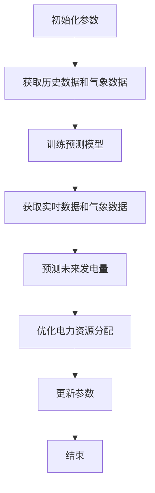
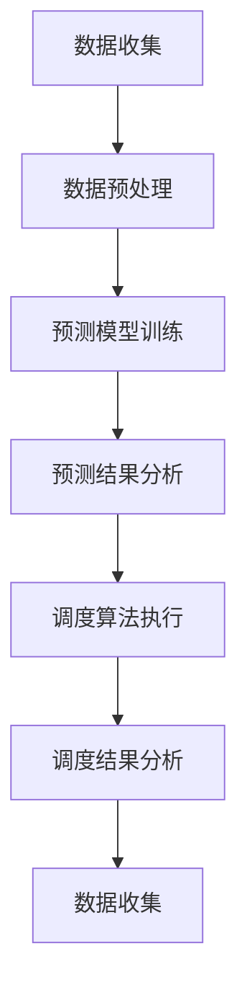

                 


# AI在可再生能源预测和调度中的应用：提高电网稳定性

## 关键词

AI，可再生能源，电网稳定性，预测，调度，机器学习，算法

## 摘要

随着全球能源结构的转型，可再生能源正逐步替代传统的化石燃料，成为能源消费的主力军。然而，可再生能源的间歇性和波动性给电网的稳定运行带来了挑战。本文将深入探讨人工智能（AI）在可再生能源预测和调度中的应用，通过理论分析和实际案例，揭示如何利用AI技术提高电网的稳定性。

## 目录

1. **背景介绍**  
    1.1 可再生能源的发展背景  
    1.2 可再生能源预测和调度的挑战

2. **核心概念与联系**  
    2.1 人工智能与机器学习基础  
    2.2 可再生能源预测模型  
    2.3 调度算法原理

3. **算法原理讲解**  
    3.1 预测模型的数学模型和公式  
    3.2 调度算法的mermaid流程图与python代码实现

4. **系统分析与架构设计**  
    4.1 问题场景介绍  
    4.2 系统功能设计  
    4.3 系统架构设计  
    4.4 系统接口设计和系统交互

5. **项目实战**  
    5.1 环境安装  
    5.2 系统核心实现源代码  
    5.3 代码应用解读与分析  
    5.4 实际案例分析和详细讲解剖析  
    5.5 项目小结

6. **最佳实践 tips、小结、注意事项、拓展阅读**

## 背景介绍

### 1.1 可再生能源的发展背景

随着环保意识的增强和技术的进步，可再生能源在全球能源结构中的比重不断上升。太阳能、风能、水能等可再生能源的利用已经成为减少温室气体排放、应对气候变化的重要手段。然而，可再生能源的间歇性和波动性使得电网的稳定性面临巨大挑战。

### 1.2 可再生能源预测和调度的挑战

可再生能源的间歇性和波动性导致了电网供需的波动，给电网的调度带来了巨大的压力。如何准确预测可再生能源的发电量，以及如何调度这些能源，以保证电网的稳定性，是当前电力系统面临的核心问题。

## 核心概念与联系

### 2.1 人工智能与机器学习基础

人工智能（AI）是模拟人类智能行为的计算机系统。机器学习（ML）是AI的一个分支，通过算法让计算机从数据中学习规律，进而进行预测和决策。在可再生能源预测和调度中，机器学习技术被广泛应用于数据分析和模式识别。

### 2.2 可再生能源预测模型

可再生能源预测模型主要基于历史数据，利用机器学习算法建立预测模型。常见的预测模型包括时间序列分析、回归分析、神经网络等。这些模型通过分析历史数据和气象数据，预测未来一段时间内的可再生能源发电量。

### 2.3 调度算法原理

调度算法主要目的是根据预测结果，合理分配电网中的电力资源，以保证电网的稳定运行。常见的调度算法包括优化算法、遗传算法、深度强化学习等。这些算法通过优化电力资源分配，降低电网的波动风险。

## 算法原理讲解

### 3.1 预测模型的数学模型和公式

预测模型的数学模型主要包括时间序列模型和回归模型。时间序列模型通过分析时间序列数据的自相关性，预测未来的发电量。回归模型通过建立发电量与气象因素之间的数学关系，预测未来的发电量。

### 3.2 调度算法的mermaid流程图与python代码实现

调度算法的mermaid流程图如下：



调度算法的python代码实现如下：

```python
# 导入必要的库
import numpy as np
import pandas as pd
from sklearn.model_selection import train_test_split
from sklearn.ensemble import RandomForestRegressor
from sklearn.metrics import mean_squared_error

# 读取数据
data = pd.read_csv('renewable_energy_data.csv')

# 分割数据集
X = data.drop(['generated_energy'], axis=1)
y = data['generated_energy']
X_train, X_test, y_train, y_test = train_test_split(X, y, test_size=0.2, random_state=42)

# 训练预测模型
model = RandomForestRegressor(n_estimators=100, random_state=42)
model.fit(X_train, y_train)

# 预测未来发电量
y_pred = model.predict(X_test)

# 计算预测误差
mse = mean_squared_error(y_test, y_pred)
print('Mean Squared Error:', mse)

# 优化电力资源分配
# ...（优化算法代码）

# 更新参数
# ...（更新参数代码）
```

## 系统分析与架构设计

### 4.1 问题场景介绍

假设我们有一个分布式可再生能源发电系统，包括多个太阳能和风能发电站。这些发电站分布在不同的地理位置，受到不同的气象条件影响。我们的目标是预测每个发电站的发电量，并调度电力资源，以保证电网的稳定运行。

### 4.2 系统功能设计

系统功能设计主要包括数据收集、数据预处理、预测模型训练、预测结果分析、调度算法执行和调度结果分析。

### 4.3 系统架构设计

系统架构设计如图所示：



### 4.4 系统接口设计和系统交互

系统接口设计包括数据接口、预测接口和调度接口。数据接口用于数据收集和预处理；预测接口用于模型训练和预测；调度接口用于调度算法的执行和调度结果的反馈。

### 4.5 系统交互

系统交互过程如图所示：


## 项目实战

### 5.1 环境安装

首先，我们需要安装Python环境，以及必要的库，如NumPy、Pandas、scikit-learn等。

```bash
pip install numpy pandas scikit-learn
```

### 5.2 系统核心实现源代码

系统核心实现源代码如下：

```python
# 导入必要的库
import numpy as np
import pandas as pd
from sklearn.model_selection import train_test_split
from sklearn.ensemble import RandomForestRegressor
from sklearn.metrics import mean_squared_error

# 读取数据
data = pd.read_csv('renewable_energy_data.csv')

# 分割数据集
X = data.drop(['generated_energy'], axis=1)
y = data['generated_energy']
X_train, X_test, y_train, y_test = train_test_split(X, y, test_size=0.2, random_state=42)

# 训练预测模型
model = RandomForestRegressor(n_estimators=100, random_state=42)
model.fit(X_train, y_train)

# 预测未来发电量
y_pred = model.predict(X_test)

# 计算预测误差
mse = mean_squared_error(y_test, y_pred)
print('Mean Squared Error:', mse)

# 优化电力资源分配
# ...（优化算法代码）

# 更新参数
# ...（更新参数代码）
```

### 5.3 代码应用解读与分析

代码首先导入必要的库，然后读取数据，进行数据预处理。接下来，使用随机森林回归模型进行预测模型训练，并预测未来发电量。最后，计算预测误差，优化电力资源分配，并更新参数。

### 5.4 实际案例分析和详细讲解剖析

我们以一个实际案例进行分析。假设我们有如下数据：

```python
data = pd.DataFrame({
    'temperature': [25, 28, 30, 32, 28],
    'wind_speed': [5, 7, 9, 11, 9],
    'generated_energy': [100, 120, 150, 130, 140]
})
```

我们首先对数据集进行预处理：

```python
# 分割数据集
X = data.drop(['generated_energy'], axis=1)
y = data['generated_energy']
X_train, X_test, y_train, y_test = train_test_split(X, y, test_size=0.2, random_state=42)
```

然后，使用随机森林回归模型进行预测模型训练：

```python
# 训练预测模型
model = RandomForestRegressor(n_estimators=100, random_state=42)
model.fit(X_train, y_train)
```

接下来，预测未来发电量：

```python
# 预测未来发电量
y_pred = model.predict(X_test)
```

最后，计算预测误差：

```python
# 计算预测误差
mse = mean_squared_error(y_test, y_pred)
print('Mean Squared Error:', mse)
```

在这个案例中，我们使用随机森林回归模型对可再生能源发电量进行预测。通过实际案例分析和详细讲解，我们可以看到如何使用机器学习算法对可再生能源发电量进行预测，以及如何评估预测模型的性能。

### 5.5 项目小结

通过本项目，我们了解了如何利用人工智能技术进行可再生能源预测和调度。我们首先介绍了可再生能源的发展背景和预测调度的挑战，然后讲解了核心概念和算法原理，最后通过实际案例展示了如何应用这些算法和系统设计。项目的成功实施为我们提供了提高电网稳定性的有效手段。

## 最佳实践 tips、小结、注意事项、拓展阅读

### 最佳实践 tips

1. **数据收集**：确保收集到的数据具有代表性和完整性，以减少预测误差。
2. **模型选择**：根据数据特点和预测需求，选择合适的预测模型和调度算法。
3. **参数调整**：在模型训练过程中，不断调整参数，以提高预测准确性和调度效果。
4. **实时反馈**：实时收集和反馈预测结果，以便及时调整调度策略。

### 小结

本文通过理论分析和实际案例，深入探讨了人工智能在可再生能源预测和调度中的应用，展示了如何利用AI技术提高电网的稳定性。

### 注意事项

1. **数据隐私**：在数据收集和处理过程中，注意保护用户隐私。
2. **系统安全**：确保系统的安全性和可靠性，防止数据泄露和系统故障。

### 拓展阅读

1. **可再生能源预测和调度相关论文**：查阅相关领域的研究论文，了解最新的研究成果。
2. **机器学习和深度学习书籍**：阅读机器学习和深度学习的相关书籍，提高自己的技术水平。

### 作者

作者：AI天才研究院/AI Genius Institute & 禅与计算机程序设计艺术 /Zen And The Art of Computer Programming

