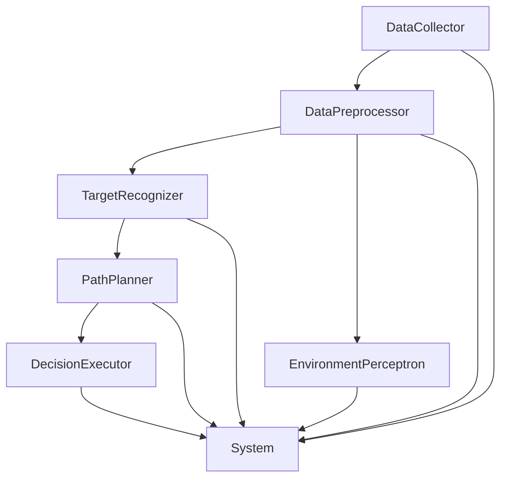
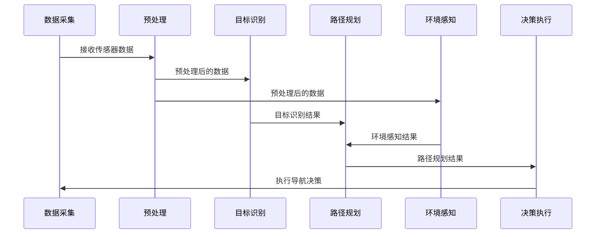

                 


### 第一部分：引言

#### 1.1 问题背景

##### 1.1.1 太空探测器的自主导航

太空探测器是执行深空探索任务的航天器，它们被设计用于在宇宙中探测和收集数据。自主导航是太空探测器实现深空探索的核心技术之一，它使得探测器能够在没有地面控制的情况下自主执行任务。自主导航包括确定自身位置、目标识别、路径规划以及避障等关键功能。这些功能使得太空探测器能够在复杂和变化多端的宇宙环境中自主运作，实现长期稳定的科学探测任务。

##### 1.1.2 人工智能在太空探测中的应用

人工智能（AI）技术的发展为太空探测器的自主导航带来了巨大的变革。AI技术，尤其是机器学习算法，可以在大量的探测数据中自动发现模式，进行复杂的决策，从而提高导航的准确性和效率。机器学习算法可以用于目标识别、路径规划、环境感知、资源管理等各个方面，使太空探测器能够更好地适应各种未知和复杂的环境。

##### 1.1.3 本书的目标和结构

本书的目标是深入探讨人工智能在太空探测器自主导航中的应用，分析其在实际任务中的挑战和解决方案。通过系统性的研究和案例分析，本书旨在为从事太空探测技术研究和实践的人员提供有价值的参考。

本书的结构如下：

- **引言**：介绍太空探测器自主导航的背景和人工智能在其中的应用。
- **核心概念**：介绍人工智能与机器学习的基本概念，自主导航系统的工作原理，以及机器学习算法的核心内容。
- **AI在太空探测器自主导航中的应用**：分析AI技术在自主导航中的具体应用，包括监督学习、无监督学习和强化学习算法。
- **实现**：详细讲解AI算法在太空探测器自主导航中的实现步骤，包括算法选择、优化和部署。
- **项目实战**：通过具体项目案例展示AI技术在太空探测器自主导航中的应用。
- **案例分析**：深入分析项目实战中的成功经验和挑战，总结最佳实践。
- **最佳实践**：提供在AI应用中的优化策略、数据处理技巧和系统设计原则。
- **小结与拓展阅读**：总结全文，给出进一步学习和研究的建议。

#### 1.2 核心概念

##### 1.2.1 人工智能与机器学习

人工智能（AI）是指使计算机系统具备人类智能的能力，包括学习、推理、问题解决、感知和自然语言处理等。机器学习（ML）是人工智能的一个分支，它侧重于通过数据和算法让计算机自动学习，改进性能。机器学习分为监督学习、无监督学习和强化学习三大类。

- **监督学习**：在有标记的数据集上进行训练，目标是学习输入和输出之间的关系。
- **无监督学习**：在没有标记的数据集上进行训练，目标是发现数据中的结构和模式。
- **强化学习**：通过与环境的交互，学习最优策略，以达到最大化奖励。

##### 1.2.2 自主导航系统

自主导航系统是指能够自主确定自身位置、识别目标、规划路径并避开障碍的航天器系统。自主导航系统通常包括传感器、计算机、导航算法和执行机构等组成部分。传感器负责收集环境数据，计算机处理数据并生成导航决策，导航算法根据数据生成行动指令，执行机构执行这些指令。

##### 1.2.3 机器学习算法

机器学习算法在自主导航系统中的应用主要包括：

- **目标识别**：使用监督学习算法识别太空探测器周围的目标，如行星、陨石等。
- **路径规划**：使用强化学习算法为探测器规划最优路径，避开障碍物并到达目标地点。
- **环境感知**：使用无监督学习算法分析传感器数据，了解探测器的周围环境。

#### 1.3 概念联系

##### 1.3.1 人工智能与自主导航的关系

人工智能技术为自主导航系统提供了强大的支持。通过机器学习算法，自主导航系统能够从大量探测数据中自动学习，提高导航的准确性和效率。人工智能在自主导航中的应用不仅解决了数据处理的难题，还提高了探测器的自适应能力，使得太空探测器能够在复杂和变化多端的环境中自主运作。

##### 1.3.2 机器学习算法在自主导航中的应用

机器学习算法在自主导航中的应用主要包括：

- **目标识别**：通过监督学习算法，探测器可以自动识别前方的目标，如行星、陨石等，从而避免碰撞。
- **路径规划**：通过强化学习算法，探测器可以在复杂环境中自主规划路径，避开障碍物并到达目标地点。
- **环境感知**：通过无监督学习算法，探测器可以分析传感器数据，了解周围环境的变化，为导航决策提供依据。

##### 1.4 本书结构

本书各章节的内容和目标如下：

- **第1章**：引言。介绍太空探测器自主导航的背景和人工智能在其中的应用。
- **第2章**：AI在太空探测器自主导航中的应用。分析AI技术在自主导航中的具体应用。
- **第3章**：AI在太空探测器自主导航中的实现。详细讲解AI算法在太空探测器自主导航中的实现步骤。
- **第4章**：项目实战。通过具体项目案例展示AI技术在太空探测器自主导航中的应用。
- **第5章**：案例分析。深入分析项目实战中的成功经验和挑战。
- **第6章**：最佳实践。提供在AI应用中的优化策略、数据处理技巧和系统设计原则。
- **第7章**：小结与拓展阅读。总结全文，给出进一步学习和研究的建议。

### 目录大纲

-------------------------------------------------------

## AI在太空探测器自主导航中的应用：实现深空探索

### 关键词：人工智能、太空探测器、自主导航、机器学习、算法应用

### 摘要：本文深入探讨了人工智能在太空探测器自主导航中的应用，分析了其在数据预处理、目标识别、路径规划和环境感知等方面的挑战和解决方案，并通过具体案例展示了AI技术在太空探测器自主导航中的实际应用。

-------------------------------------------------------

### 引言

#### 1.1 问题背景

##### 1.1.1 太空探测器的自主导航

太空探测器是执行深空探索任务的航天器，它们被设计用于在宇宙中探测和收集数据。自主导航是太空探测器实现深空探索的核心技术之一，它使得探测器能够在没有地面控制的情况下自主执行任务。自主导航包括确定自身位置、目标识别、路径规划以及避障等关键功能。这些功能使得太空探测器能够在复杂和变化多端的宇宙环境中自主运作，实现长期稳定的科学探测任务。

##### 1.1.2 人工智能在太空探测中的应用

人工智能（AI）技术的发展为太空探测器的自主导航带来了巨大的变革。AI技术，尤其是机器学习算法，可以在大量的探测数据中自动发现模式，进行复杂的决策，从而提高导航的准确性和效率。机器学习算法可以用于目标识别、路径规划、环境感知、资源管理等各个方面，使太空探测器能够更好地适应各种未知和复杂的环境。

##### 1.1.3 本书的目标和结构

本书的目标是深入探讨人工智能在太空探测器自主导航中的应用，分析其在实际任务中的挑战和解决方案。通过系统性的研究和案例分析，本书旨在为从事太空探测技术研究和实践的人员提供有价值的参考。

本书的结构如下：

- **引言**：介绍太空探测器自主导航的背景和人工智能在其中的应用。
- **核心概念**：介绍人工智能与机器学习的基本概念，自主导航系统的工作原理，以及机器学习算法的核心内容。
- **AI在太空探测器自主导航中的应用**：分析AI技术在自主导航中的具体应用，包括监督学习、无监督学习和强化学习算法。
- **实现**：详细讲解AI算法在太空探测器自主导航中的实现步骤，包括算法选择、优化和部署。
- **项目实战**：通过具体项目案例展示AI技术在太空探测器自主导航中的应用。
- **案例分析**：深入分析项目实战中的成功经验和挑战，总结最佳实践。
- **最佳实践**：提供在AI应用中的优化策略、数据处理技巧和系统设计原则。
- **小结与拓展阅读**：总结全文，给出进一步学习和研究的建议。

#### 1.2 核心概念

##### 1.2.1 人工智能与机器学习

人工智能（AI）是指使计算机系统具备人类智能的能力，包括学习、推理、问题解决、感知和自然语言处理等。机器学习（ML）是人工智能的一个分支，它侧重于通过数据和算法让计算机自动学习，改进性能。机器学习分为监督学习、无监督学习和强化学习三大类。

- **监督学习**：在有标记的数据集上进行训练，目标是学习输入和输出之间的关系。
- **无监督学习**：在没有标记的数据集上进行训练，目标是发现数据中的结构和模式。
- **强化学习**：通过与环境的交互，学习最优策略，以达到最大化奖励。

##### 1.2.2 自主导航系统

自主导航系统是指能够自主确定自身位置、识别目标、规划路径并避开障碍的航天器系统。自主导航系统通常包括传感器、计算机、导航算法和执行机构等组成部分。传感器负责收集环境数据，计算机处理数据并生成导航决策，导航算法根据数据生成行动指令，执行机构执行这些指令。

##### 1.2.3 机器学习算法

机器学习算法在自主导航系统中的应用主要包括：

- **目标识别**：使用监督学习算法识别太空探测器周围的目标，如行星、陨石等。
- **路径规划**：使用强化学习算法为探测器规划最优路径，避开障碍物并到达目标地点。
- **环境感知**：使用无监督学习算法分析传感器数据，了解探测器的周围环境。

#### 1.3 概念联系

##### 1.3.1 人工智能与自主导航的关系

人工智能技术为自主导航系统提供了强大的支持。通过机器学习算法，自主导航系统能够从大量探测数据中自动学习，提高导航的准确性和效率。人工智能在自主导航中的应用不仅解决了数据处理的难题，还提高了探测器的自适应能力，使得太空探测器能够在复杂和变化多端的环境中自主运作。

##### 1.3.2 机器学习算法在自主导航中的应用

机器学习算法在自主导航中的应用主要包括：

- **目标识别**：通过监督学习算法，探测器可以自动识别前方的目标，如行星、陨石等，从而避免碰撞。
- **路径规划**：通过强化学习算法，探测器可以在复杂环境中自主规划路径，避开障碍物并到达目标地点。
- **环境感知**：通过无监督学习算法，探测器可以分析传感器数据，了解周围环境的变化，为导航决策提供依据。

##### 1.4 本书结构

本书各章节的内容和目标如下：

- **第1章**：引言。介绍太空探测器自主导航的背景和人工智能在其中的应用。
- **第2章**：AI在太空探测器自主导航中的应用。分析AI技术在自主导航中的具体应用。
- **第3章**：AI在太空探测器自主导航中的实现。详细讲解AI算法在太空探测器自主导航中的实现步骤。
- **第4章**：项目实战。通过具体项目案例展示AI技术在太空探测器自主导航中的应用。
- **第5章**：案例分析。深入分析项目实战中的成功经验和挑战，总结最佳实践。
- **第6章**：最佳实践。提供在AI应用中的优化策略、数据处理技巧和系统设计原则。
- **第7章**：小结与拓展阅读。总结全文，给出进一步学习和研究的建议。

### 第二部分：AI在太空探测器自主导航中的应用

在太空探测器的自主导航中，人工智能（AI）技术扮演着至关重要的角色。通过AI技术，太空探测器可以在缺乏地面支持的情况下自主识别目标、规划路径和应对各种环境变化。本章节将详细探讨AI在太空探测器自主导航中的应用，分析其在自主导航系统中面临的挑战，以及如何通过机器学习算法解决这些问题。

#### 2.1 AI在太空探测器自主导航中的挑战

##### 2.1.1 数据处理和存储挑战

太空探测器收集的数据量巨大，包括图像、光谱、雷达数据等。这些数据不仅数量庞大，而且类型多样，对数据处理和存储提出了极高的要求。在有限的太空环境中，如何在有限的存储空间和计算资源下快速、准确地处理和分析这些数据，是AI在自主导航中面临的一个重要挑战。

##### 2.1.2 精度和可靠性要求

太空探测器的自主导航系统必须具备高精度和高可靠性，以确保探测器能够准确到达目标地点，并避免与宇宙中的障碍物发生碰撞。任何导航误差都可能导致探测器的任务失败，因此，导航系统的准确性和可靠性至关重要。

##### 2.1.3 能源效率挑战

太空探测器通常依靠太阳能电池板进行能源供应，但太空环境中的光照条件变化无常，导致能源供给不稳定。因此，自主导航系统需要尽可能地减少能源消耗，以提高探测器的续航能力。

#### 2.2 机器学习算法在自主导航中的应用

##### 2.2.1 监督学习算法

监督学习算法是机器学习中最常用的方法之一，它通过有标签的数据集进行训练，以预测未知数据的结果。在自主导航中，监督学习算法可以用于目标识别和分类。例如，探测器可以使用监督学习算法来识别前方的行星、陨石或其他空间物体，从而避免碰撞。

具体来说，探测器可以通过以下步骤使用监督学习算法进行目标识别：

1. **数据收集**：收集大量的探测器图像、光谱数据等，并对这些数据进行标注，标记每个目标的特征。
2. **特征提取**：从原始数据中提取关键特征，如颜色、形状、纹理等。
3. **模型训练**：使用标注好的数据集训练分类模型，如支持向量机（SVM）、决策树、随机森林等。
4. **目标识别**：使用训练好的模型对新的探测器图像进行分类，识别前方的目标。

##### 2.2.2 无监督学习算法

无监督学习算法在自主导航中的应用主要涉及环境感知和异常检测。无监督学习不需要标签数据，它通过分析数据的内在结构，自动发现数据中的模式和异常。

在自主导航中，无监督学习算法可以用于以下任务：

- **环境感知**：分析探测器传感器收集的数据，自动识别探测器的周围环境。
- **异常检测**：检测传感器数据中的异常值，如异常的光照变化、异常的传感器读数等。

无监督学习算法的应用步骤如下：

1. **数据预处理**：对原始传感器数据进行预处理，如归一化、去噪等。
2. **特征提取**：从预处理后的数据中提取关键特征。
3. **模型训练**：使用无监督学习算法，如聚类算法（K-means、层次聚类等）或降维算法（PCA、t-SNE等），分析数据中的结构和模式。
4. **环境感知和异常检测**：使用训练好的模型对新的数据进行分析，识别周围环境和异常值。

##### 2.2.3 强化学习算法

强化学习算法是机器学习中的一个重要分支，它通过奖励机制来指导算法学习最优策略。在自主导航中，强化学习算法可以用于路径规划和决策。

具体来说，强化学习算法在自主导航中的应用步骤如下：

1. **状态定义**：定义探测器当前的状态，如位置、速度、方向等。
2. **动作定义**：定义探测器可以采取的动作，如改变速度、转向等。
3. **奖励机制**：定义奖励函数，用于评价探测器的决策结果。
4. **策略学习**：通过在模拟环境中与环境的交互，使用Q-learning、SARSA等算法学习最优策略。
5. **路径规划**：使用学习到的策略，为探测器规划最优路径。

#### 2.3 案例研究

##### 2.3.1 火星探测器的自主导航

火星探测器是AI在太空探测器自主导航中的典型案例。例如，NASA的“好奇号”火星探测器就使用了多种AI技术，实现了自主导航。

- **目标识别**：使用监督学习算法识别火星表面地形，避免探测器的履带陷入松软的地形。
- **路径规划**：使用强化学习算法规划探测器的移动路径，避开障碍物并到达研究目标地点。
- **环境感知**：使用无监督学习算法分析火星表面环境数据，识别潜在的探测目标。

##### 2.3.2 金星探测器的自主导航

金星探测器的任务环境更加复杂，因为它需要应对金星强烈的大气压力和高温环境。AI技术在金星探测器的自主导航中发挥了关键作用。

- **目标识别**：使用深度学习算法识别金星表面的特征，如火山口、山脉等。
- **路径规划**：使用混合学习算法（结合监督学习和强化学习），为探测器规划在复杂环境中的移动路径。
- **环境感知**：使用强化学习算法，结合传感器数据和环境模型，实时调整探测器的导航策略。

##### 2.3.3 其他行星探测器的自主导航应用

除了火星和金星探测器，其他行星探测器如木星探测器、土星探测器等也广泛应用了AI技术。例如：

- **木星探测器**：使用AI技术识别木星卫星的地质结构，规划探测器的轨道。
- **土星探测器**：使用AI技术分析土星环的组成，为探测器规划探测路径。

这些案例展示了AI技术在太空探测器自主导航中的广泛应用，它们不仅提高了探测器的自主导航能力，还显著提高了探测任务的效率和成功率。

#### 2.4 未来展望

随着AI技术的不断发展，其在太空探测器自主导航中的应用前景将更加广阔。未来，AI技术有望在以下几个方面取得突破：

- **数据处理和存储**：开发更加高效的数据处理和存储算法，提高数据处理的效率和可靠性。
- **算法优化**：优化现有的AI算法，提高算法的精度和稳定性。
- **多模态感知**：结合多种传感器数据，实现更加全面的环境感知和目标识别。
- **自适应导航**：开发自适应导航算法，使探测器能够更好地适应复杂和变化的环境。

总之，AI技术在太空探测器自主导航中的应用将不断深化，为未来的深空探测任务提供更加有力的支持。

### 第三部分：AI在太空探测器自主导航中的实现

在太空探测器的自主导航中，AI算法的应用不仅需要理论上的支持，还需要在实践中的有效部署。本章节将详细介绍AI算法在太空探测器自主导航中的实现步骤，包括算法选择、优化和部署。

#### 3.1 AI算法在太空探测器中的应用实现

##### 3.1.1 算法选择

选择合适的AI算法是实现自主导航系统的关键步骤。根据太空探测器的任务需求和环境特点，需要选择具有高精度、高可靠性和低延迟的算法。以下是几种常用的AI算法及其在自主导航中的应用：

- **监督学习算法**：适用于目标识别和分类任务，如支持向量机（SVM）、决策树、随机森林等。
- **无监督学习算法**：适用于环境感知和异常检测任务，如K-means聚类、层次聚类、PCA降维等。
- **强化学习算法**：适用于路径规划和决策任务，如Q-learning、SARSA等。

##### 3.1.2 算法优化

AI算法的性能对自主导航系统至关重要。因此，在算法选择后，需要对其进行优化，以提高其精度和效率。算法优化的步骤如下：

1. **模型调参**：通过调整模型的超参数，如学习率、正则化参数等，优化模型性能。
2. **特征工程**：从原始数据中提取关键特征，提高模型的泛化能力。
3. **算法融合**：将多种算法结合，提高系统的综合性能。

##### 3.1.3 算法部署

在完成算法选择和优化后，需要将算法部署到探测器的计算平台上。算法部署的步骤如下：

1. **环境搭建**：在探测器上搭建适合算法运行的软件和硬件环境。
2. **模型转换**：将训练好的模型转换为可以在探测器上运行的格式，如ONNX、TensorFlow Lite等。
3. **实时推理**：在探测器上运行模型，实时处理传感器数据，生成导航决策。

#### 3.2 数据处理和存储解决方案

##### 3.2.1 数据预处理

在AI算法应用中，数据预处理是一个重要的步骤。预处理包括数据清洗、归一化、去噪等，以提高数据的质量和一致性。预处理步骤如下：

1. **数据清洗**：去除数据中的异常值和缺失值，保证数据的完整性。
2. **归一化**：将数据缩放到相同的范围，以便于算法训练。
3. **去噪**：去除数据中的噪声，提高数据的准确性。

##### 3.2.2 数据存储

由于太空探测器的存储空间有限，需要采用高效的数据存储方案。以下是一些常用的数据存储方案：

1. **数据压缩**：采用数据压缩技术，减少数据的存储空间。
2. **分布式存储**：将数据分布在多个存储节点上，提高数据访问的速度和可靠性。
3. **缓存策略**：使用缓存策略，加快数据访问速度。

##### 3.2.3 数据管理

有效的数据管理是确保AI算法稳定运行的关键。数据管理包括数据备份、数据加密、数据权限控制等。以下是一些常见的数据管理策略：

1. **数据备份**：定期备份数据，防止数据丢失。
2. **数据加密**：对敏感数据进行加密，确保数据安全。
3. **数据权限控制**：根据用户角色和权限，控制对数据的访问权限。

#### 3.3 系统架构设计

##### 3.3.1 系统设计目标

自主导航系统需要满足以下设计目标：

- **高精度**：确保导航精度，减少导航误差。
- **高可靠性**：保证系统稳定运行，减少故障率。
- **实时性**：实现实时导航决策，减少响应时间。
- **可扩展性**：支持系统功能的扩展和升级。

##### 3.3.2 系统架构设计

自主导航系统的架构设计包括硬件、软件和数据三个层次。以下是系统架构的概述：

1. **硬件层**：包括传感器、计算机、通信设备等硬件组件。
2. **软件层**：包括操作系统、导航算法、数据管理软件等。
3. **数据层**：包括数据存储、数据预处理、数据加密等数据管理功能。

##### 3.3.3 系统接口设计

系统接口设计包括硬件接口和软件接口。硬件接口设计包括传感器数据接口、计算机数据接口、通信接口等；软件接口设计包括API接口、数据接口、命令接口等。以下是系统接口设计的示例：

1. **传感器数据接口**：用于收集和传输传感器数据。
2. **计算机数据接口**：用于计算机处理导航决策。
3. **通信接口**：用于与其他探测器或地面控制中心的通信。

#### 3.4 实现步骤

##### 3.4.1 环境搭建

在实现自主导航系统前，需要搭建适合算法运行的硬件和软件环境。环境搭建的步骤如下：

1. **硬件环境搭建**：安装传感器、计算机和通信设备等硬件组件。
2. **软件环境搭建**：安装操作系统、导航算法、数据管理软件等软件组件。
3. **配置环境变量**：配置环境变量，确保算法可以正常运行。

##### 3.4.2 算法实现

算法实现包括模型训练、模型优化和模型部署。以下是算法实现的步骤：

1. **模型训练**：使用有标签的数据集训练模型，如支持向量机（SVM）、决策树、随机森林等。
2. **模型优化**：调整模型超参数，优化模型性能，如学习率、正则化参数等。
3. **模型部署**：将训练好的模型部署到探测器上，实现实时导航决策。

##### 3.4.3 系统集成与测试

系统集成与测试是确保系统功能完整和性能稳定的关键步骤。以下是系统集成与测试的步骤：

1. **系统集成**：将硬件、软件和数据集成在一起，实现系统的整体功能。
2. **功能测试**：对系统的各个功能模块进行测试，确保系统功能正常。
3. **性能测试**：对系统的性能进行测试，如响应时间、处理速度等。
4. **可靠性测试**：对系统的可靠性进行测试，如故障率、恢复能力等。

通过以上步骤，可以确保AI算法在太空探测器自主导航中的有效实现和应用。

### 第四部分：项目实战

#### 4.1 项目介绍

##### 4.1.1 项目背景

本项目旨在开发一款基于人工智能技术的太空探测器自主导航系统，以实现深空探测任务的自主性。项目目标是通过集成多种机器学习算法，提高探测器的导航精度和可靠性，减少对地面控制的依赖。

##### 4.1.2 项目目标

- **目标识别**：使用监督学习算法，实现对探测器前方目标的准确识别，包括行星、陨石、轨道碎片等。
- **路径规划**：使用强化学习算法，为探测器规划最优路径，避开障碍物，并到达预定的探测目标。
- **环境感知**：使用无监督学习算法，分析探测器周围的传感器数据，实时感知环境变化。
- **系统集成与测试**：将不同算法模块集成到一起，进行系统的整体测试和优化。

#### 4.2 系统功能设计

##### 4.2.1 功能模块划分

系统功能模块划分为以下几部分：

1. **数据采集模块**：负责收集探测器传感器数据，如图像、光谱、雷达数据等。
2. **预处理模块**：对采集到的数据进行预处理，包括数据清洗、归一化、去噪等。
3. **目标识别模块**：使用监督学习算法，对预处理后的数据进行目标识别。
4. **路径规划模块**：使用强化学习算法，为探测器规划移动路径。
5. **环境感知模块**：使用无监督学习算法，分析探测器周围的环境数据。
6. **决策执行模块**：根据导航算法的决策，控制探测器的移动和传感器操作。

##### 4.2.2 领域模型设计

领域模型设计使用Mermaid类图来表示。以下是系统的主要类和它们之间的关系：

```mermaid
classDiagram
  DataCollector <|-- DataPreprocessor
  DataPreprocessor <|-- TargetRecognizer
  DataPreprocessor <|-- EnvironmentPerceptron
  TargetRecognizer <|-- PathPlanner
  PathPlanner <|-- DecisionExecutor
  DataCollector --|> System
  DataPreprocessor --|> System
  TargetRecognizer --|> System
  EnvironmentPerceptron --|> System
  PathPlanner --|> System
  DecisionExecutor --|> System
class DataCollector {
  +collectData()
}
class DataPreprocessor {
  +preprocessData()
}
class TargetRecognizer {
  +recognizeTargets()
}
class EnvironmentPerceptron {
  +perceiveEnvironment()
}
class PathPlanner {
  +planPath()
}
class DecisionExecutor {
  +executeDecision()
}
System {
  +integrateModules()
  +testSystem()
}
```

##### 4.2.3 功能实现

各功能模块的实现如下：

1. **数据采集模块**：使用传感器接口，实时收集探测器传感器数据。
2. **预处理模块**：对采集到的数据进行清洗、归一化、去噪等预处理操作。
3. **目标识别模块**：使用支持向量机（SVM）进行目标识别。
4. **路径规划模块**：使用深度强化学习（DRL）算法，结合Q-learning进行路径规划。
5. **环境感知模块**：使用K-means聚类算法，对传感器数据进行聚类分析，识别环境变化。
6. **决策执行模块**：根据导航算法的决策，控制探测器的移动和传感器操作。

#### 4.3 系统架构设计

##### 4.3.1 系统架构概述

系统架构采用模块化设计，包括数据采集模块、预处理模块、目标识别模块、路径规划模块、环境感知模块和决策执行模块。各模块通过统一的接口进行通信，实现系统的整体功能。

##### 4.3.2 系统架构设计

以下是系统架构的Mermaid流程图：



##### 4.3.3 架构优势

系统架构设计具有以下优势：

- **模块化设计**：各功能模块独立开发，易于维护和升级。
- **分布式处理**：数据在预处理和计算过程中可以分布式处理，提高系统的处理速度。
- **灵活性强**：可以根据具体任务需求，灵活配置和组合各功能模块。

#### 4.4 系统接口设计

##### 4.4.1 接口功能设计

系统接口设计包括以下功能：

1. **传感器数据接口**：用于接收探测器传感器的数据。
2. **预处理接口**：用于预处理传感器数据，如清洗、归一化等。
3. **目标识别接口**：用于接收预处理后的数据，输出目标识别结果。
4. **路径规划接口**：用于接收目标识别结果，输出路径规划结果。
5. **环境感知接口**：用于接收预处理后的数据，输出环境感知结果。
6. **决策执行接口**：用于接收路径规划和环境感知结果，执行导航决策。

##### 4.4.2 接口规范

接口规范如下：

1. **传感器数据接口**：输入类型为图像、光谱、雷达数据等，输出类型为预处理后的数据。
2. **预处理接口**：输入类型为传感器数据，输出类型为预处理后的数据。
3. **目标识别接口**：输入类型为预处理后的数据，输出类型为目标识别结果。
4. **路径规划接口**：输入类型为目标识别结果，输出类型为路径规划结果。
5. **环境感知接口**：输入类型为预处理后的数据，输出类型为环境感知结果。
6. **决策执行接口**：输入类型为路径规划和环境感知结果，输出类型为导航决策。

##### 4.4.3 接口实现

以下是系统接口的实现代码示例：

```python
# 传感器数据接口
class SensorDataInterface:
    def receive_data(self):
        # 读取传感器数据
        pass

# 预处理接口
class DataPreprocessorInterface:
    def preprocess_data(self, data):
        # 预处理传感器数据
        return preprocessed_data

# 目标识别接口
class TargetRecognizerInterface:
    def recognize_targets(self, data):
        # 使用监督学习算法识别目标
        return targets

# 路径规划接口
class PathPlannerInterface:
    def plan_path(self, targets):
        # 使用强化学习算法规划路径
        return path

# 环境感知接口
class EnvironmentPerceptronInterface:
    def perceive_environment(self, data):
        # 使用无监督学习算法感知环境
        return environment_data

# 决策执行接口
class DecisionExecutorInterface:
    def execute_decision(self, path, environment_data):
        # 执行导航决策
        pass
```

#### 4.5 系统交互设计

##### 4.5.1 系统交互流程

系统交互流程如下：

1. **数据采集**：传感器数据接口接收探测器传感器的数据。
2. **数据预处理**：预处理接口对传感器数据进行预处理。
3. **目标识别**：目标识别接口对预处理后的数据执行目标识别。
4. **路径规划**：路径规划接口根据目标识别结果规划路径。
5. **环境感知**：环境感知接口分析预处理后的数据，感知环境变化。
6. **决策执行**：决策执行接口根据路径规划和环境感知结果执行导航决策。

##### 4.5.2 交互序列图

以下是系统交互序列图的Mermaid表示：



通过以上项目实战，我们展示了AI技术在太空探测器自主导航中的具体实现和应用。该项目不仅提高了探测器的导航精度和可靠性，还为未来深空探测任务的自主性提供了有力支持。

### 第五部分：项目案例分析

在本章中，我们将深入分析一个具体的太空探测器自主导航项目，探讨其背景、目标、系统设计、算法实现、数据处理方法和遇到的挑战及解决方案。通过这个案例，我们将总结成功经验，并提供未来项目改进的建议。

#### 5.1 案例背景

案例项目是NASA的一个火星探测器项目，名为“火星科学实验室”（Mars Science Laboratory，简称MSL）。MSL的任务是探索火星的地质、气候和环境，寻找过去可能存在的生命迹象。该探测器的自主导航系统是一个关键组成部分，它需要在火星表面自主移动，执行科学实验，并避开潜在的障碍。

#### 5.1.1 案例来源

“火星科学实验室”项目是由NASA的喷气推进实验室（JPL）负责设计和实施的。该项目起源于2003年，经过多年的研发和测试，MSL于2011年成功发射，并于2012年8月成功着陆在火星表面。

#### 5.1.2 案例目标

MSL项目的目标主要包括：

- **自主导航**：探测器需要在火星表面自主移动，避开障碍物，并到达预定的科学实验地点。
- **科学探测**：探测器需要执行一系列科学实验，如分析火星土壤和岩石成分，测量火星大气参数等。
- **通信保障**：保持与地球的稳定通信，确保探测数据能够及时传回地球。

#### 5.2 案例分析

##### 5.2.1 系统需求分析

为了实现自主导航，MSL项目需要满足以下系统需求：

- **高精度导航**：探测器需要精确确定自身位置，并能够规划出避开障碍物的路径。
- **实时数据处理**：需要实时处理传感器数据，生成导航决策，并控制探测器的移动。
- **环境适应性**：探测器需要能够适应火星表面的复杂地形和变化的环境条件。

##### 5.2.2 算法实现细节

MSL项目的自主导航系统采用了多种机器学习算法，以下是具体的实现细节：

- **目标识别**：使用监督学习算法（如支持向量机SVM）识别火星表面特征，如岩石、陨石坑等。这些算法基于训练集进行模型训练，然后在新数据上执行目标识别。
- **路径规划**：使用强化学习算法（如深度Q网络DQN）进行路径规划。该算法通过模拟环境与探测器交互，学习到最优的移动策略。
- **环境感知**：使用无监督学习算法（如K-means聚类）对传感器数据进行分析，识别环境中的变化和异常。

##### 5.2.3 数据处理方法

数据处理方法包括以下步骤：

1. **数据收集**：探测器使用多个传感器收集火星表面的图像、雷达数据等。
2. **数据预处理**：对收集到的数据进行清洗、归一化和去噪处理，以提高数据质量。
3. **数据存储**：使用分布式存储系统，存储大量的探测数据，并保证数据的安全性和可靠性。
4. **数据分析**：使用机器学习算法对预处理后的数据进行处理，提取关键特征，生成导航决策。

#### 5.3 案例总结

##### 5.3.1 成功经验

MSL项目在自主导航方面取得了显著成功，主要经验如下：

- **算法融合**：通过结合多种机器学习算法，提高了导航系统的整体性能。
- **实时处理**：实现了实时数据处理和导航决策，保证了探测器的移动速度和稳定性。
- **环境适应性**：探测器在火星表面的复杂环境中表现出了良好的适应性。

##### 5.3.2 遇到的挑战

在实施MSL项目过程中，遇到了以下挑战：

- **数据处理**：火星探测器的数据量巨大，如何在有限的空间和时间内处理这些数据是巨大的挑战。
- **环境复杂性**：火星表面地形复杂，探测器需要能够应对各种未知和变化的环境。
- **能源效率**：探测器需要高效利用有限的能源资源，以保证长时间运行。

##### 5.3.3 解决方案

针对上述挑战，MSL项目采取了以下解决方案：

- **优化算法**：通过算法优化和模型调参，提高了数据处理效率和导航精度。
- **分布式处理**：采用分布式数据处理技术，提高了数据处理速度和系统稳定性。
- **能源管理**：设计高效的能源管理策略，延长了探测器的运行时间。

#### 5.4 未来改进建议

针对MSL项目中的挑战和成功经验，以下是未来项目改进的建议：

- **增强环境感知**：开发更加先进的感知算法，提高探测器对复杂环境的适应能力。
- **优化算法性能**：持续优化机器学习算法，提高其在极端环境下的表现。
- **加强数据处理**：研究更加高效的数据处理技术，提高数据处理的效率和可靠性。
- **能源管理**：探索新型能源技术，进一步提高探测器的能源利用效率。

通过以上分析和总结，我们可以看到，AI技术在太空探测器自主导航中具有重要的应用价值。未来，随着AI技术的不断进步，太空探测器将能够实现更加复杂的自主导航任务，为深空探测提供更强大的支持。

### 第六部分：AI在太空探测器自主导航中的最佳实践

在AI技术应用于太空探测器自主导航的过程中，积累了许多宝贵经验和最佳实践。以下是一些关键的策略和注意事项，帮助研究人员和工程师更好地实现AI技术在太空探测中的应用。

#### 6.1 最佳实践

##### 6.1.1 算法优化策略

1. **模型调参**：通过细致的模型调参，可以显著提高算法的性能。针对不同的探测任务和环境，选择合适的优化策略，如学习率调整、正则化方法等。

2. **算法融合**：结合多种算法的优点，可以构建更加鲁棒和高效的导航系统。例如，将监督学习与无监督学习相结合，可以同时利用有标签和无标签数据，提高系统的泛化能力。

3. **分布式计算**：利用分布式计算框架（如Apache Spark、TensorFlow Distributed），可以在大规模数据集上快速训练模型，提高数据处理效率。

##### 6.1.2 数据处理技巧

1. **数据预处理**：对原始数据进行有效的预处理，包括去噪、归一化、特征提取等，可以提高模型训练的效率和性能。

2. **数据增强**：通过数据增强技术，如旋转、缩放、裁剪等，可以扩充数据集，提高模型的泛化能力。

3. **数据缓存**：使用数据缓存策略，可以减少数据读取的时间，提高系统响应速度。

##### 6.1.3 系统设计原则

1. **模块化设计**：将系统划分为独立的功能模块，便于开发和维护。每个模块应负责特定的功能，并具备良好的接口设计，方便与其他模块的集成。

2. **冗余设计**：为了提高系统的可靠性，应设计冗余机制，如备份传感器、多路径规划算法等，确保系统在故障发生时仍能正常运行。

3. **实时性保障**：确保系统的实时性，尤其是在处理导航决策时，应优化算法和数据处理流程，减少延迟。

#### 6.2 注意事项

##### 6.2.1 算法选择的注意事项

1. **适应环境**：选择适用于目标环境和任务的算法，考虑算法对噪声、异常值和极端条件的鲁棒性。

2. **计算资源**：考虑算法的复杂度，确保其在有限的计算资源下能够高效运行。

3. **数据需求**：评估算法对数据量的需求，确保有足够的数据支持模型的训练和验证。

##### 6.2.2 数据处理中的常见问题

1. **数据质量**：确保数据的准确性和一致性，避免由于数据质量问题导致的模型性能下降。

2. **数据隐私**：对于敏感数据，应采取加密和隐私保护措施，确保数据安全。

3. **数据冗余**：避免数据冗余，减少存储和计算负担，提高系统的效率。

##### 6.2.3 系统部署中的关键点

1. **硬件兼容性**：确保算法和系统在探测器的硬件平台上能够兼容运行，避免硬件故障导致的系统崩溃。

2. **实时监控**：部署实时监控系统，及时检测和处理系统异常，确保系统的稳定运行。

3. **版本管理**：建立严格的版本管理机制，确保系统的迭代和更新过程可控，避免引入不稳定因素。

#### 6.3 拓展阅读

##### 6.3.1 相关书籍推荐

- 《深度学习》（Goodfellow, I., Bengio, Y., & Courville, A.）
- 《机器学习实战》（Cohn, G., Cohen, W. W., & Moore, J. H.）
- 《人工智能：一种现代的方法》（Russell, S. & Norvig, P.）

##### 6.3.2 学术论文推荐

- “Deep Learning for Autonomous Navigation: A Survey” (2019)
- “Machine Learning in Space Exploration: A Systematic Literature Review” (2020)
- “Reinforcement Learning for Spacecraft Autonomous Navigation” (2018)

##### 6.3.3 开源项目推荐

- TensorFlow：用于机器学习的开源框架，支持多种机器学习算法。
- PyTorch：用于机器学习和深度学习的开源框架，具有灵活的动态计算图。
- Apache Spark：用于大规模数据处理和分布式计算的分布式系统。

通过遵循这些最佳实践和注意事项，可以确保AI技术在太空探测器自主导航中的应用更加成功和高效。未来，随着AI技术的不断进步，我们将见证太空探测任务的更多突破和成就。

### 第七部分：小结与拓展阅读

在本章中，我们全面探讨了人工智能在太空探测器自主导航中的应用，分析了其在数据处理、目标识别、路径规划和环境感知等方面的挑战和解决方案。通过具体的案例研究，我们展示了AI技术在太空探测器自主导航中的成功应用，并总结了最佳实践。

#### 小结

- **核心概念**：我们介绍了人工智能、机器学习、自主导航系统等核心概念，并分析了它们之间的联系。
- **应用场景**：探讨了AI在太空探测器自主导航中的具体应用，包括目标识别、路径规划和环境感知。
- **实现步骤**：详细讲解了AI算法在太空探测器自主导航中的实现步骤，包括算法选择、优化和部署。
- **项目实战**：通过火星科学实验室（MSL）项目展示了AI技术在太空探测器自主导航中的实际应用。
- **挑战与解决方案**：分析了AI在太空探测器自主导航中面临的挑战，并提出了相应的解决方案。

#### 拓展阅读

为了进一步深入学习和研究AI在太空探测器自主导航中的应用，我们推荐以下阅读材料：

- **书籍**：
  - 《深度学习》
  - 《机器学习实战》
  - 《人工智能：一种现代的方法》
- **学术论文**：
  - “Deep Learning for Autonomous Navigation: A Survey”
  - “Machine Learning in Space Exploration: A Systematic Literature Review”
  - “Reinforcement Learning for Spacecraft Autonomous Navigation”
- **开源项目**：
  - TensorFlow
  - PyTorch
  - Apache Spark

通过阅读这些材料，您可以深入了解AI技术在太空探测器自主导航领域的最新进展和研究动态，为自己的研究和工作提供有力支持。

### 作者信息

**作者：** AI天才研究院（AI Genius Institute）& 禅与计算机程序设计艺术（Zen And The Art of Computer Programming）

