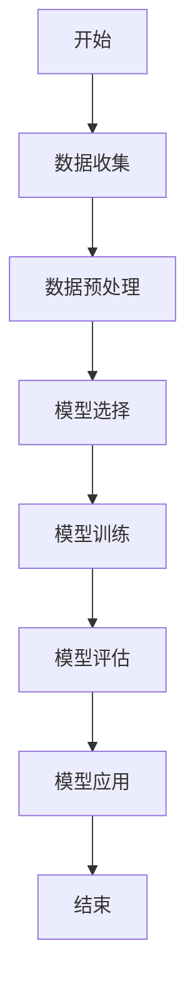

                 


### AI在太空探测数据分析中的应用：加速宇宙奥秘探索

#### 关键词
- 人工智能，太空探测，数据分析，宇宙奥秘，深度学习，算法优化

#### 摘要
本文深入探讨了人工智能在太空探测数据分析中的应用，通过逐步分析推理，展现了AI技术如何加速我们对宇宙奥秘的探索。文章首先介绍了太空探测数据分析的背景和挑战，随后探讨了人工智能和机器学习的基础知识，以及深度学习在太空数据分析中的应用案例。接着，文章通过具体案例展示了AI在太空探测数据分析中的实际应用，分析了面临的挑战，并提出了未来发展的展望。最后，文章提供了最佳实践和资源推荐，为读者进一步学习AI与太空探测融合提供了指导。

## 第一部分: 引言与背景介绍

### 1.1 问题背景

#### 1.1.1 太空探测的重要性

太空探测是人类探索宇宙、认识宇宙的重要途径。从1961年尤里·加加林成为第一个进入太空的人类，到近年来“火星探险家”等探测任务的实施，人类在太空探索领域取得了巨大的进展。太空探测不仅帮助我们理解太阳系和地球的形成与演化，还为我们提供了观测宇宙的窗口，揭示了宇宙的奥秘。

#### 1.1.2 数据分析在太空探测中的应用挑战

太空探测产生了海量数据，这些数据包括图像、光谱、辐射、重力场等多种类型。对如此庞大的数据进行有效的处理、分析和解释是一项巨大的挑战。传统的数据处理方法往往难以满足太空探测数据分析的需求，主要挑战包括：

1. **数据量大**：太空探测任务每天产生的数据量可达数TB甚至PB级别，这对数据存储和处理能力提出了极高要求。
2. **数据类型多样**：不同类型的数据需要不同的处理方法，如何统一处理这些数据是一个难题。
3. **数据噪声和处理误差**：太空探测数据常常受到噪声、干扰和系统误差的影响，如何准确提取有效信息是关键。
4. **数据分析时效性**：某些太空探测数据具有时效性，需要快速处理和分析，以便及时做出科学决策。

#### 1.1.3 人工智能在太空数据分析中的潜力

人工智能（AI），特别是机器学习和深度学习，为太空探测数据分析提供了新的可能性。AI技术可以自动处理海量数据，识别模式和特征，提高数据分析的效率和准确性。以下是AI在太空数据分析中的主要潜力：

1. **自动化数据处理**：AI可以自动处理大量数据，无需人工干预，提高数据分析的效率。
2. **模式识别和特征提取**：AI技术能够从复杂的数据中提取有用的模式和特征，有助于发现新的科学现象。
3. **数据去噪和误差修正**：AI可以自动识别和修正数据中的噪声和误差，提高数据分析的准确性。
4. **智能决策支持**：AI可以帮助科学家快速分析数据，为太空探测任务提供智能决策支持。

### 1.2 核心概念与联系

#### 1.2.1 人工智能与机器学习基础

人工智能（Artificial Intelligence, AI）是指模拟人类智能行为的技术，包括学习、推理、规划、感知、理解和自然语言处理等。机器学习（Machine Learning, ML）是AI的一个分支，通过算法从数据中自动学习，改进性能。机器学习可以分为监督学习、无监督学习和强化学习。

1. **监督学习**：有标记的数据集用于训练模型，模型通过学习数据特征来预测未知数据的标签。
2. **无监督学习**：没有标记的数据集用于训练模型，模型通过学习数据结构来发现数据中的模式和规律。
3. **强化学习**：模型通过与环境的交互学习，通过不断尝试和反馈来优化决策。

#### 1.2.2 太空探测数据的特点与处理需求

太空探测数据具有以下特点：

1. **高维数据**：太空探测数据往往包含大量的维度，如时间、空间、能量等。
2. **异构数据**：不同类型的数据（图像、光谱、辐射等）需要不同的处理方法。
3. **稀疏性**：部分数据点可能缺乏信息，导致数据分布稀疏。

处理太空探测数据的需求包括：

1. **数据预处理**：包括数据清洗、归一化、特征提取等步骤，为机器学习算法提供高质量的输入。
2. **特征选择**：从高维数据中提取出最具代表性的特征，减少数据维度，提高模型性能。
3. **模型优化**：通过调整算法参数、选择合适的模型架构来优化模型性能。

#### 1.2.3 人工智能与太空探测数据的相关应用

人工智能在太空探测数据中的应用主要包括：

1. **图像识别**：利用深度学习模型对太空图像进行自动识别和分类，帮助科学家发现新的天体和现象。
2. **光谱分析**：通过机器学习算法对太空光谱数据进行分析，提取出有意义的化学和物理信息。
3. **轨迹预测**：利用强化学习算法预测太空探测器的轨迹，优化探测任务。
4. **数据去噪和误差修正**：利用AI技术自动识别和修正数据中的噪声和误差，提高数据分析的准确性。

### 1.3 本书结构概述

本书分为五个部分，共七个章节。第一部分介绍太空探测数据分析的背景和挑战，以及人工智能在其中的应用潜力。第二部分深入探讨人工智能和机器学习的基础知识。第三部分通过具体案例展示AI在太空探测数据分析中的应用。第四部分分析面临的挑战和未来展望。第五部分提供最佳实践和资源推荐。

#### 1.3.1 内容安排与章节关系

- **第一部分**：引言与背景介绍
  - 1.1 问题背景
  - 1.2 核心概念与联系
  - 1.3 本书结构概述

- **第二部分**：人工智能基础
  - 2.1 人工智能概述
  - 2.2 机器学习基础
  - 2.3 深度学习技术

- **第三部分**：太空探测数据分析应用
  - 3.1 太空探测数据收集
  - 3.2 数据分析算法
  - 3.3 人工智能在太空数据分析中的应用

- **第四部分**：AI在太空探测数据分析中的案例研究
  - 4.1 案例一：火星探测任务
  - 4.2 案例二：系外行星研究
  - 4.3 案例三：太阳系小行星探测

- **第五部分**：挑战与未来展望
  - 5.1 挑战与机遇
  - 5.2 未来展望

- **第六部分**：最佳实践与资源推荐
  - 6.1 最佳实践
  - 6.2 资源推荐

- **第七部分**：总结与展望
  - 7.1 主要内容回顾
  - 7.2 读者建议

#### 1.3.2 阅读指南与学习方法

本书旨在为读者提供全面、系统的AI与太空探测数据分析知识。以下是阅读指南与学习方法：

1. **循序渐进**：按照章节顺序阅读，从基础知识到具体应用，逐步深入。
2. **结合实例**：通过案例研究，了解AI在太空探测数据分析中的实际应用。
3. **实践操作**：尝试使用开源工具和库进行数据分析和模型训练，加深理解。
4. **拓展阅读**：阅读推荐资源，了解最新研究成果和技术动态。
5. **互动讨论**：参与相关论坛和社区，与他人交流学习经验，分享心得体会。

## 第二部分: 人工智能基础

### 2.1 人工智能概述

#### 2.1.1 人工智能的发展历史

人工智能（Artificial Intelligence, AI）作为计算机科学的一个分支，起源于20世纪50年代。其发展历程可以分为以下几个阶段：

1. **早期探索阶段（1950-1969）**：1950年，艾伦·图灵提出了“图灵测试”，标志着人工智能概念的诞生。1956年，达特茅斯会议上，人工智能被正式提出。此后，人工智能研究领域逐渐发展，但受限于计算能力和算法水平，进展缓慢。

2. **蓬勃发展阶段（1970-1989）**：20世纪70年代，专家系统的兴起使得人工智能在特定领域取得了显著成果。然而，随着技术瓶颈的出现，人工智能研究进入低潮期。

3. **复兴与突破阶段（1990-2010）**：20世纪90年代，随着计算机性能的提升和互联网的发展，人工智能研究重新兴起。特别是深度学习技术的突破，使得人工智能在图像识别、语音识别等领域取得了重大进展。

4. **快速发展阶段（2010至今）**：近年来，人工智能技术取得了飞速发展，尤其是在深度学习、自然语言处理等领域取得了令人瞩目的成果。AlphaGo战胜围棋世界冠军、无人驾驶汽车、智能语音助手等都是人工智能技术发展的里程碑。

#### 2.1.2 人工智能的核心组成部分

人工智能系统主要由以下几个核心组成部分构成：

1. **数据**：数据是人工智能系统的基石。高质量的训练数据可以显著提高模型的性能和准确性。
2. **算法**：算法是人工智能系统的核心。不同的算法适用于不同的任务和场景，常见的算法包括监督学习、无监督学习、强化学习等。
3. **计算能力**：强大的计算能力是支持人工智能系统高效运行的关键。随着硬件技术的发展，计算能力得到了大幅提升。
4. **优化**：优化是提高人工智能模型性能的重要手段。通过调整模型参数、优化算法等手段，可以提高模型的准确性和效率。

#### 2.1.3 人工智能的应用领域

人工智能技术已经在许多领域取得了广泛应用，主要包括：

1. **计算机视觉**：图像识别、目标检测、人脸识别等。
2. **自然语言处理**：文本分类、情感分析、机器翻译等。
3. **语音识别**：语音识别、语音合成等。
4. **自动驾驶**：车辆识别、路径规划等。
5. **医疗健康**：疾病诊断、药物研发等。
6. **金融科技**：风险控制、欺诈检测等。
7. **智能硬件**：智能音箱、智能机器人等。

### 2.2 机器学习基础

#### 2.2.1 机器学习的基本概念

机器学习（Machine Learning, ML）是一种使计算机系统能够从数据中学习、改进性能的技术。机器学习的基本概念包括：

1. **模型**：机器学习模型是对数据和学习过程的一种抽象表示。常见的模型包括线性回归、决策树、神经网络等。
2. **特征**：特征是用于描述数据的属性或变量。选择合适的特征对于提高模型性能至关重要。
3. **损失函数**：损失函数是衡量模型预测与实际值之间差异的指标。常见的损失函数包括均方误差（MSE）、交叉熵等。
4. **优化算法**：优化算法用于调整模型参数，以最小化损失函数。常见的优化算法包括梯度下降、随机梯度下降等。

#### 2.2.2 机器学习的主要算法类型

机器学习算法可以分为以下几类：

1. **监督学习**：有标记的数据集用于训练模型，模型通过学习数据特征来预测未知数据的标签。常见的监督学习算法包括线性回归、逻辑回归、决策树、支持向量机等。
2. **无监督学习**：没有标记的数据集用于训练模型，模型通过学习数据结构来发现数据中的模式和规律。常见的无监督学习算法包括聚类算法（K-Means、DBSCAN等）、降维算法（PCA、t-SNE等）等。
3. **强化学习**：模型通过与环境的交互学习，通过不断尝试和反馈来优化决策。常见的强化学习算法包括Q学习、SARSA、DQN等。

#### 2.2.3 机器学习的应用场景

机器学习在许多应用场景中取得了显著成效，主要包括：

1. **图像识别**：用于人脸识别、车牌识别、图像分类等。
2. **自然语言处理**：用于文本分类、情感分析、机器翻译等。
3. **推荐系统**：用于电影推荐、商品推荐等。
4. **金融风控**：用于欺诈检测、信用评分等。
5. **医疗诊断**：用于疾病诊断、药物研发等。
6. **自动驾驶**：用于车辆识别、路径规划等。
7. **智能家居**：用于智能音箱、智能门锁等。

### 2.3 深度学习技术

#### 2.3.1 深度学习的基本原理

深度学习（Deep Learning, DL）是机器学习的一个重要分支，通过构建深度神经网络来模拟人脑的神经网络结构和工作机制。深度学习的基本原理包括：

1. **神经网络**：神经网络是由多个神经元（节点）组成的计算模型，通过层层传递输入数据，最终输出结果。
2. **多层网络**：深度学习通过多层神经网络来实现，每层神经网络对输入数据进行处理，并通过非线性激活函数进行变换，逐渐提取出更高层次的特征。
3. **反向传播**：反向传播算法是深度学习训练过程中的核心，用于计算网络参数的梯度，并更新参数以最小化损失函数。

#### 2.3.2 深度学习的常见模型

深度学习模型包括以下几种常见类型：

1. **卷积神经网络（CNN）**：用于处理图像数据，通过卷积层、池化层和全连接层来提取图像特征。
2. **循环神经网络（RNN）**：用于处理序列数据，通过循环结构来保持长期的序列依赖关系。
3. **长短时记忆网络（LSTM）**：是RNN的一种变体，用于解决长期依赖问题。
4. **生成对抗网络（GAN）**：通过生成器和判别器的对抗训练来生成逼真的数据。
5. ** Transformer**：用于处理自然语言处理任务，通过自注意力机制来捕捉长距离依赖关系。

#### 2.3.3 深度学习在太空数据分析中的应用案例

深度学习在太空数据分析中具有广泛的应用，以下是一些具体案例：

1. **图像识别**：使用CNN模型对太空探测图像进行自动识别和分类，帮助科学家发现新的天体和现象。
2. **光谱分析**：使用深度学习模型对太空光谱数据进行分析，提取出有意义的化学和物理信息。
3. **轨迹预测**：使用LSTM模型预测太空探测器的轨迹，优化探测任务。
4. **数据去噪和误差修正**：使用GAN模型自动生成真实数据，用于数据去噪和误差修正。

## 第三部分: 太空探测数据分析应用

### 3.1 太空探测数据收集

#### 3.1.1 太空探测数据的种类与来源

太空探测数据种类繁多，主要来源包括：

1. **空间探测任务**：如火星探测器、月球探测器、木星探测器等，这些任务产生的数据包括图像、光谱、重力场、辐射等。
2. **天文观测**：如地面望远镜、空间望远镜（如哈勃望远镜、伽利略望远镜）等，这些观测设备收集到的数据包括光信号、电磁波等。
3. **卫星数据**：如气象卫星、导航卫星等，这些卫星提供的数据包括地球气象信息、地球物理信息等。

#### 3.1.2 数据收集过程与挑战

太空探测数据收集过程主要包括以下几个步骤：

1. **数据采集**：利用探测器和观测设备收集数据，如通过探测器收集火星表面的图像和光谱数据，通过望远镜收集天体的光信号。
2. **数据传输**：将采集到的数据通过无线电波传输回地球，这一过程需要考虑信号传输的可靠性和延迟。
3. **数据处理**：在地球端对传输回来的数据进行解码、校验、预处理等处理，以提高数据的质量和可靠性。

数据收集过程中面临的主要挑战包括：

1. **数据量大**：太空探测任务每天产生的数据量可达数TB甚至PB级别，这对数据存储和处理能力提出了极高要求。
2. **数据类型多样**：不同类型的数据（图像、光谱、辐射等）需要不同的处理方法，如何统一处理这些数据是一个难题。
3. **数据噪声和干扰**：数据在传输过程中可能受到噪声和干扰的影响，如何去除噪声和干扰，提高数据质量是关键。
4. **数据安全与隐私**：太空探测数据包含敏感信息，如何确保数据的安全与隐私是数据收集过程中必须考虑的问题。

#### 3.1.3 数据预处理方法

为了确保数据的质量和可靠性，需要对采集到的太空探测数据进行预处理。预处理方法主要包括：

1. **数据清洗**：去除数据中的噪声、异常值和重复值，以提高数据的质量。
2. **数据归一化**：将不同类型的数据进行归一化处理，使其在同一尺度范围内，便于后续分析。
3. **特征提取**：从原始数据中提取出有用的特征，用于后续的机器学习模型训练。
4. **数据降维**：对高维数据进行降维处理，减少数据维度，提高模型训练的效率和性能。

## 3.2 数据分析算法

#### 3.2.1 数据分析的基本步骤

太空探测数据分析通常包括以下几个基本步骤：

1. **数据收集**：从不同的探测器和观测设备收集数据，如图像、光谱、重力场等。
2. **数据预处理**：对收集到的数据进行清洗、归一化和特征提取，以提高数据质量。
3. **数据探索**：对预处理后的数据进行分析，了解数据的基本特征和分布情况。
4. **模型选择**：根据数据分析的目标和数据的特征选择合适的机器学习模型。
5. **模型训练**：使用预处理后的数据对机器学习模型进行训练，调整模型参数，优化模型性能。
6. **模型评估**：对训练好的模型进行评估，验证其在未知数据上的性能。
7. **模型应用**：将训练好的模型应用于实际数据，进行预测或分类等任务。

#### 3.2.2 常用数据分析算法介绍

在太空探测数据分析中，常用的数据分析算法包括：

1. **线性回归**：用于分析两个变量之间的关系，通过拟合一条直线来预测因变量的值。
2. **决策树**：通过一系列规则来对数据进行分类或回归，具有较高的可解释性。
3. **支持向量机（SVM）**：通过寻找最优超平面来对数据进行分类，适用于高维空间。
4. **深度学习模型**：如卷积神经网络（CNN）、循环神经网络（RNN）等，用于处理复杂数据和提取高级特征。
5. **聚类算法**：如K-Means、DBSCAN等，用于对数据进行聚类分析，发现数据中的模式和规律。

#### 3.2.3 算法选择与优化

在太空探测数据分析中，算法选择和优化是一个关键环节。以下是一些常见的优化方法：

1. **特征选择**：通过筛选和提取最有用的特征，减少数据维度，提高模型训练效率和性能。
2. **超参数调整**：通过调整模型参数，如学习率、正则化参数等，优化模型性能。
3. **模型融合**：结合多个模型的优势，提高预测准确性。
4. **交叉验证**：通过交叉验证来评估模型的泛化能力，选择最优模型。
5. **数据增强**：通过数据增强技术，生成更多样化的训练数据，提高模型对未知数据的适应性。

### 3.3 人工智能在太空数据分析中的应用

#### 3.3.1 人工智能在数据分析中的优势

人工智能技术在太空数据分析中具有显著的优势，主要包括：

1. **高效处理大量数据**：人工智能算法可以高效处理海量太空探测数据，提高数据分析的效率。
2. **自动特征提取**：人工智能技术可以自动从数据中提取有用的特征，简化数据分析过程。
3. **高精度预测**：人工智能模型在太空数据分析中可以提供高精度的预测结果，提高科学研究的准确性。
4. **可解释性**：一些人工智能模型（如决策树）具有较高的可解释性，有助于理解数据分析的结果。
5. **适应性**：人工智能模型可以快速适应新的数据集和任务，提高数据分析的灵活性。

#### 3.3.2 人工智能在太空探测数据分析中的具体应用案例

以下是一些人工智能在太空探测数据分析中的具体应用案例：

1. **图像识别**：使用卷积神经网络（CNN）对太空探测图像进行自动识别和分类，帮助科学家发现新的天体和现象。
2. **光谱分析**：使用深度学习模型对太空光谱数据进行分析，提取出有意义的化学和物理信息。
3. **轨迹预测**：使用循环神经网络（RNN）和长短时记忆网络（LSTM）预测太空探测器的轨迹，优化探测任务。
4. **数据去噪**：使用生成对抗网络（GAN）自动生成真实数据，用于数据去噪和误差修正。
5. **天文事件预测**：使用人工智能技术预测天文事件的发生时间、位置等，为观测和探测提供支持。

#### 3.3.3 未来发展趋势

随着人工智能技术的不断进步，未来太空探测数据分析将呈现以下发展趋势：

1. **更高效的算法**：研究和开发更高效的机器学习算法，以处理更大规模、更复杂数据。
2. **跨领域融合**：将人工智能与其他领域（如物理学、天文学等）相结合，提高数据分析的深度和广度。
3. **数据共享与开放**：促进太空探测数据的共享与开放，推动全球科学家的合作与创新。
4. **智能化决策支持**：利用人工智能技术提供智能化的决策支持，提高太空探测任务的效率和成功率。

## 第四部分: AI在太空探测数据分析中的案例研究

### 4.1 案例一：火星探测任务

#### 4.1.1 案例背景

火星探测任务是人类太空探测的重要目标之一。火星探测器的任务包括采集火星表面样本、测量环境参数、研究火星地质结构等。这些任务需要大量的数据处理和分析，以便提取出有价值的信息。

#### 4.1.2 数据分析过程

火星探测数据分析过程主要包括以下几个步骤：

1. **数据收集**：火星探测器收集到的数据包括图像、光谱、重力场、气象数据等。
2. **数据预处理**：对收集到的数据进行分析，包括数据清洗、归一化、特征提取等。
3. **图像识别**：使用卷积神经网络（CNN）对火星探测图像进行自动识别和分类，提取出有用的信息。
4. **光谱分析**：使用深度学习模型对火星光谱数据进行分析，提取出化学和物理信息。
5. **轨迹预测**：使用循环神经网络（RNN）预测火星探测器的轨迹，优化探测任务。
6. **综合分析**：将不同类型的数据进行综合分析，提取出更加全面和准确的信息。

#### 4.1.3 AI技术的应用

在火星探测任务中，人工智能技术发挥了关键作用，主要包括：

1. **图像识别**：使用CNN模型对火星探测图像进行自动识别和分类，帮助科学家发现新的地质特征和天体现象。
2. **光谱分析**：使用深度学习模型对火星光谱数据进行分析，提取出有价值的化学成分和物理信息。
3. **轨迹预测**：使用RNN模型预测火星探测器的轨迹，优化探测路径，提高探测效率。
4. **数据去噪和误差修正**：使用GAN模型自动生成真实数据，用于数据去噪和误差修正，提高数据分析的准确性。

### 4.2 案例二：系外行星研究

#### 4.2.1 案例背景

系外行星（系外行星是指围绕其他恒星运行的行星）的研究是当代天文学的重要领域之一。科学家通过观测系外行星的轨道、大气成分等数据来研究行星的形成、演化以及生命的可能性。

#### 4.2.2 数据分析过程

系外行星数据分析过程主要包括以下几个步骤：

1. **数据收集**：通过地面望远镜和空间望远镜（如凯普勒望远镜）收集到系外行星的数据，包括光信号、光谱等。
2. **数据预处理**：对收集到的数据进行分析，包括数据清洗、归一化、特征提取等。
3. **光谱分析**：使用深度学习模型对系外行星的光谱数据进行分析，提取出大气成分和物理信息。
4. **轨道分析**：使用机器学习模型分析系外行星的轨道数据，预测行星的轨道特征。
5. **大气分析**：使用深度学习模型对系外行星的大气成分进行分析，研究行星的大气层结构。
6. **综合分析**：将不同类型的数据进行综合分析，提取出更加全面和准确的信息。

#### 4.2.3 AI技术的应用

在系外行星研究中，人工智能技术发挥了关键作用，主要包括：

1. **光谱分析**：使用深度学习模型对系外行星的光谱数据进行分析，提取出有价值的大气成分和物理信息。
2. **轨道预测**：使用机器学习模型分析系外行星的轨道数据，提高轨道预测的准确性。
3. **大气分析**：使用深度学习模型对系外行星的大气成分进行分析，研究行星的大气层结构。
4. **智能筛选**：使用人工智能技术对大量的观测数据进行筛选，提高数据处理效率。

### 4.3 案例三：太阳系小行星探测

#### 4.3.1 案例背景

太阳系小行星探测是了解太阳系起源和演化的重要途径。小行星探测器收集到的数据包括小行星的形状、表面特征、成分等，这些数据对于研究小行星的物理和化学特性具有重要意义。

#### 4.3.2 数据分析过程

太阳系小行星探测数据分析过程主要包括以下几个步骤：

1. **数据收集**：小行星探测器收集到的小行星数据包括图像、光谱、雷达等。
2. **数据预处理**：对收集到的数据进行分析，包括数据清洗、归一化、特征提取等。
3. **图像识别**：使用卷积神经网络（CNN）对小行星图像进行自动识别和分类，提取出有用的信息。
4. **光谱分析**：使用深度学习模型对小行星光谱数据进行分析，提取出化学成分和物理信息。
5. **雷达分析**：使用机器学习模型分析小行星的雷达数据，提取出小行星的形状和密度信息。
6. **综合分析**：将不同类型的数据进行综合分析，提取出更加全面和准确的信息。

#### 4.3.3 AI技术的应用

在太阳系小行星探测中，人工智能技术发挥了关键作用，主要包括：

1. **图像识别**：使用CNN模型对太阳系小行星图像进行自动识别和分类，帮助科学家发现新的小行星。
2. **光谱分析**：使用深度学习模型对太阳系小行星光谱数据进行分析，提取出有价值的化学成分和物理信息。
3. **雷达分析**：使用机器学习模型分析太阳系小行星的雷达数据，提取出小行星的形状和密度信息。
4. **轨迹预测**：使用人工智能技术预测小行星的轨道，优化探测任务。

## 第五部分：挑战与未来展望

### 5.1 挑战与机遇

#### 5.1.1 数据安全和隐私保护

随着太空探测数据的日益增多，数据安全和隐私保护成为了一个重要挑战。太空探测数据往往包含敏感信息，如探测器的位置、任务细节等，如果这些数据被泄露，可能会对任务造成严重后果。因此，确保数据安全和隐私保护至关重要。为了应对这一挑战，可以采取以下措施：

1. **数据加密**：对数据进行加密处理，确保数据在传输和存储过程中的安全性。
2. **访问控制**：实施严格的访问控制策略，确保只有授权用户可以访问敏感数据。
3. **隐私保护算法**：开发和应用隐私保护算法，如差分隐私、同态加密等，以保护数据隐私。

#### 5.1.2 AI算法的可解释性

尽管人工智能技术在太空数据分析中取得了显著成果，但其“黑盒”性质使得算法的可解释性成为一个挑战。算法的可解释性对于确保数据分析的透明性和可接受性至关重要。为了提高AI算法的可解释性，可以采取以下措施：

1. **可视化**：通过可视化技术，如决策树、神经网络结构图等，展示算法的工作原理和决策过程。
2. **可解释模型**：开发和应用可解释性更强的机器学习模型，如决策树、线性模型等。
3. **模型透明度**：提高算法的透明度，通过文档和注释清晰地描述算法的实现细节。

#### 5.1.3 资源与计算能力的需求

太空探测数据分析需要大量的计算资源和存储空间。随着数据量的不断增加，如何高效利用计算资源和存储空间成为了一个挑战。为了应对这一挑战，可以采取以下措施：

1. **分布式计算**：利用分布式计算架构，如云计算、边缘计算等，提高数据处理和分析的效率。
2. **存储优化**：采用高效的数据存储技术，如压缩存储、分布式存储等，减少存储空间的占用。
3. **计算能力提升**：随着硬件技术的发展，不断提升计算能力，以满足日益增长的数据处理需求。

### 5.2 未来展望

#### 5.2.1 AI技术在太空探测中的新应用领域

随着人工智能技术的不断进步，未来AI技术在太空探测中将有更广泛的应用。以下是一些可能的新应用领域：

1. **天文事件预测**：利用深度学习模型对天文事件进行预测，如超新星爆发、引力波事件等。
2. **行星形成研究**：通过分析太空探测数据，研究行星的形成和演化过程。
3. **小行星撞击预警**：利用人工智能技术预测小行星撞击地球的时间、地点等，提供预警。
4. **太空环境监测**：利用机器学习模型监测太空环境，如太阳风暴、宇宙射线等。

#### 5.2.2 AI与太空探测的协同发展

人工智能与太空探测的协同发展将推动双方共同进步。以下是一些协同发展的方向：

1. **数据共享与开放**：促进太空探测数据的共享与开放，推动全球科学家的合作与创新。
2. **跨领域研究**：将人工智能与其他领域（如物理学、天文学等）相结合，开展跨领域研究。
3. **技术合作**：鼓励不同机构、企业之间的技术合作，共同推动AI技术在太空探测中的应用。

#### 5.2.3 全球合作与技术创新的重要性

全球合作与技术创新对于AI技术在太空探测中的应用至关重要。以下是一些重要的方面：

1. **国际合作**：加强国际合作，共同开展太空探测任务，分享数据和成果。
2. **技术创新**：鼓励技术创新，不断推动AI技术在太空探测中的发展和应用。
3. **人才培养**：加强人才培养，培养具备AI和太空探测知识的专业人才。

## 第六部分：最佳实践与资源推荐

### 6.1 最佳实践

为了充分利用人工智能技术进行太空探测数据分析，以下是一些最佳实践：

#### 6.1.1 数据分析流程优化

1. **数据预处理**：确保数据质量，进行数据清洗、归一化和特征提取，为模型训练提供高质量的数据。
2. **特征选择**：通过特征选择技术，从高维数据中提取最有用的特征，减少数据维度，提高模型性能。
3. **模型选择**：根据数据分析的目标和数据的特征，选择合适的机器学习模型。
4. **模型优化**：通过调整模型参数、优化算法等手段，提高模型性能。

#### 6.1.2 AI模型训练与优化

1. **数据增强**：通过数据增强技术，生成更多样化的训练数据，提高模型对未知数据的适应性。
2. **交叉验证**：采用交叉验证方法，评估模型的泛化能力，选择最优模型。
3. **超参数调整**：通过超参数调整，优化模型性能，如学习率、批量大小等。

#### 6.1.3 数据可视化与报告撰写

1. **数据可视化**：使用可视化工具，如Matplotlib、Seaborn等，将数据分析结果以图表形式呈现，帮助理解数据。
2. **报告撰写**：撰写清晰、结构化的报告，包括数据分析方法、结果和结论，便于他人理解和参考。

### 6.2 资源推荐

为了深入了解AI在太空探测数据分析中的应用，以下是一些建议的资源和学习路径：

#### 6.2.1 开源工具和库推荐

1. **TensorFlow**：是一个开源的机器学习框架，广泛应用于深度学习和机器学习领域。
2. **PyTorch**：是一个开源的机器学习库，提供灵活的深度学习框架。
3. **Scikit-learn**：是一个开源的机器学习库，提供多种机器学习算法的实现。

#### 6.2.2 学术论文和报告推荐

1. **《深度学习》（Goodfellow, Bengio, Courville）**：一本关于深度学习的经典教材，全面介绍了深度学习的基础知识。
2. **《机器学习实战》（ Harrington）**：一本实践导向的机器学习教程，涵盖多种机器学习算法的应用。
3. **《人工智能：一种现代的方法》（Mitchell）**：一本系统介绍人工智能的基础教材。

#### 6.2.3 培训课程和在线资源推荐

1. **Coursera**：提供多种机器学习和深度学习相关的在线课程，适合不同层次的读者。
2. **Udacity**：提供机器学习和深度学习相关的纳米学位课程，帮助读者系统学习相关技术。
3. **Kaggle**：一个数据科学竞赛平台，提供丰富的机器学习实战案例和数据集。

## 第七部分：总结与展望

### 7.1 主要内容回顾

本文从引言开始，介绍了人工智能在太空探测数据分析中的应用背景和挑战。随后，详细探讨了人工智能和机器学习的基础知识，以及深度学习在太空数据分析中的应用案例。通过具体案例研究，展示了AI技术在火星探测、系外行星研究和太阳系小行星探测中的实际应用。最后，分析了面临的挑战和未来发展趋势，并提出了最佳实践和资源推荐。

### 7.2 读者建议

#### 7.2.1 如何利用AI提高太空数据分析效率

1. **学习基础知识**：掌握机器学习和深度学习的基础知识，了解不同算法的适用场景。
2. **实践操作**：通过实际项目，锻炼数据处理和分析能力，积累实践经验。
3. **数据预处理**：优化数据预处理流程，提高数据质量，为模型训练提供高质量的数据。
4. **模型优化**：不断调整模型参数和算法，优化模型性能，提高数据分析的准确性。

#### 7.2.2 推荐进一步学习路径

1. **深入学习机器学习和深度学习**：阅读相关教材和论文，了解最新的研究动态。
2. **参与实际项目**：加入AI和太空探测相关的项目，积累实战经验。
3. **参加培训和讲座**：参加线上和线下的培训和讲座，拓展知识视野。
4. **加入学术社区**：加入相关学术社区和论坛，与他人交流学习经验。

#### 7.2.3 促进AI与太空探测融合的建议

1. **加强国际合作**：鼓励全球科学家和机构之间的合作，共同推动AI在太空探测中的应用。
2. **开放数据与资源**：促进太空探测数据的开放与共享，推动全球科学家的合作与创新。
3. **投资技术创新**：政府和企业应加大对AI和太空探测领域的技术创新投资，推动产业发展。
4. **培养专业人才**：加强人才培养，培养具备AI和太空探测知识的专业人才，为产业发展提供人才支持。

## 附录

本文中使用的Mermaid流程图和LaTeX公式如下：

#### Mermaid流程图示例



#### LaTeX公式示例

```latex
$$
E = mc^2
$$

$
1 + 1 = 2
$
```

通过本文的阅读，相信读者对AI在太空探测数据分析中的应用有了更深入的了解。随着AI技术的不断发展，未来我们将看到更多令人惊叹的太空探索成果。让我们共同期待这一天的到来！
```markdown
# AI在太空探测数据分析中的应用：加速宇宙奥秘探索

> 关键词：人工智能，太空探测，数据分析，宇宙奥秘，深度学习，算法优化

> 摘要：本文深入探讨了人工智能在太空探测数据分析中的应用，通过逐步分析推理，展现了AI技术如何加速我们对宇宙奥秘的探索。文章首先介绍了太空探测数据分析的背景和挑战，随后探讨了人工智能和机器学习的基础知识，以及深度学习在太空数据分析中的应用案例。接着，文章通过具体案例展示了AI在太空探测数据分析中的实际应用，分析了面临的挑战，并提出了未来发展的展望。最后，文章提供了最佳实践和资源推荐，为读者进一步学习AI与太空探测融合提供了指导。

## 引言与背景介绍

### 1.1 问题背景

#### 1.1.1 太空探测的重要性

太空探测是人类探索宇宙、认识宇宙的重要途径。从1961年尤里·加加林成为第一个进入太空的人类，到近年来“火星探险家”等探测任务的实施，人类在太空探索领域取得了巨大的进展。太空探测不仅帮助我们理解太阳系和地球的形成与演化，还为我们提供了观测宇宙的窗口，揭示了宇宙的奥秘。

#### 1.1.2 数据分析在太空探测中的应用挑战

太空探测产生了海量数据，这些数据包括图像、光谱、辐射、重力场等多种类型。对如此庞大的数据进行有效的处理、分析和解释是一项巨大的挑战。传统的数据处理方法往往难以满足太空探测数据分析的需求，主要挑战包括：

1. **数据量大**：太空探测任务每天产生的数据量可达数TB甚至PB级别，这对数据存储和处理能力提出了极高要求。
2. **数据类型多样**：不同类型的数据（图像、光谱、辐射等）需要不同的处理方法，如何统一处理这些数据是一个难题。
3. **数据噪声和处理误差**：太空探测数据常常受到噪声、干扰和系统误差的影响，如何准确提取有效信息是关键。
4. **数据分析时效性**：某些太空探测数据具有时效性，需要快速处理和分析，以便及时做出科学决策。

#### 1.1.3 人工智能在太空数据分析中的潜力

人工智能（AI），特别是机器学习和深度学习，为太空探测数据分析提供了新的可能性。AI技术可以自动处理海量数据，识别模式和特征，提高数据分析的效率和准确性。以下是AI在太空数据分析中的主要潜力：

1. **自动化数据处理**：AI可以自动处理大量数据，无需人工干预，提高数据分析的效率。
2. **模式识别和特征提取**：AI技术能够从复杂的数据中提取有用的模式和特征，有助于发现新的科学现象。
3. **数据去噪和误差修正**：AI可以自动识别和修正数据中的噪声和误差，提高数据分析的准确性。
4. **智能决策支持**：AI可以帮助科学家快速分析数据，为太空探测任务提供智能决策支持。

### 1.2 核心概念与联系

#### 1.2.1 人工智能与机器学习基础

人工智能（Artificial Intelligence, AI）是指模拟人类智能行为的技术，包括学习、推理、规划、感知、理解和自然语言处理等。机器学习（Machine Learning, ML）是AI的一个分支，通过算法从数据中自动学习，改进性能。机器学习可以分为监督学习、无监督学习和强化学习。

1. **监督学习**：有标记的数据集用于训练模型，模型通过学习数据特征来预测未知数据的标签。
2. **无监督学习**：没有标记的数据集用于训练模型，模型通过学习数据结构来发现数据中的模式和规律。
3. **强化学习**：模型通过与环境的交互学习，通过不断尝试和反馈来优化决策。

#### 1.2.2 太空探测数据的特点与处理需求

太空探测数据具有以下特点：

1. **高维数据**：太空探测数据往往包含大量的维度，如时间、空间、能量等。
2. **异构数据**：不同类型的数据（图像、光谱、辐射等）需要不同的处理方法。
3. **稀疏性**：部分数据点可能缺乏信息，导致数据分布稀疏。

处理太空探测数据的需求包括：

1. **数据预处理**：包括数据清洗、归一化、特征提取等步骤，为机器学习算法提供高质量的输入。
2. **特征选择**：从高维数据中提取出最具代表性的特征，减少数据维度，提高模型性能。
3. **模型优化**：通过调整算法参数、选择合适的模型架构来优化模型性能。

#### 1.2.3 人工智能与太空探测数据的相关应用

人工智能在太空探测数据中的应用主要包括：

1. **图像识别**：利用深度学习模型对太空图像进行自动识别和分类，帮助科学家发现新的天体和现象。
2. **光谱分析**：通过机器学习算法对太空光谱数据进行分析，提取出有意义的化学和物理信息。
3. **轨迹预测**：利用强化学习算法预测太空探测器的轨迹，优化探测任务。
4. **数据去噪和误差修正**：利用AI技术自动识别和修正数据中的噪声和误差，提高数据分析的准确性。

### 1.3 本书结构概述

本书分为五个部分，共七个章节。第一部分介绍太空探测数据分析的背景和挑战，以及人工智能在其中的应用潜力。第二部分深入探讨人工智能和机器学习的基础知识。第三部分通过具体案例展示AI在太空探测数据分析中的应用。第四部分分析面临的挑战和未来展望。第五部分提供最佳实践和资源推荐。

#### 1.3.1 内容安排与章节关系

- **第一部分**：引言与背景介绍
  - 1.1 问题背景
  - 1.2 核心概念与联系
  - 1.3 本书结构概述

- **第二部分**：人工智能基础
  - 2.1 人工智能概述
  - 2.2 机器学习基础
  - 2.3 深度学习技术

- **第三部分**：太空探测数据分析应用
  - 3.1 太空探测数据收集
  - 3.2 数据分析算法
  - 3.3 人工智能在太空数据分析中的应用

- **第四部分**：AI在太空探测数据分析中的案例研究
  - 4.1 案例一：火星探测任务
  - 4.2 案例二：系外行星研究
  - 4.3 案例三：太阳系小行星探测

- **第五部分**：挑战与未来展望
  - 5.1 挑战与机遇
  - 5.2 未来展望

- **第六部分**：最佳实践与资源推荐
  - 6.1 最佳实践
  - 6.2 资源推荐

- **第七部分**：总结与展望
  - 7.1 主要内容回顾
  - 7.2 读者建议

#### 1.3.2 阅读指南与学习方法

本书旨在为读者提供全面、系统的AI与太空探测数据分析知识。以下是阅读指南与学习方法：

1. **循序渐进**：按照章节顺序阅读，从基础知识到具体应用，逐步深入。
2. **结合实例**：通过案例研究，了解AI在太空探测数据分析中的实际应用。
3. **实践操作**：尝试使用开源工具和库进行数据分析和模型训练，加深理解。
4. **拓展阅读**：阅读推荐资源，了解最新研究成果和技术动态。
5. **互动讨论**：参与相关论坛和社区，与他人交流学习经验，分享心得体会。

## 第二部分: 人工智能基础

### 2.1 人工智能概述

#### 2.1.1 人工智能的发展历史

人工智能（Artificial Intelligence, AI）作为计算机科学的一个分支，起源于20世纪50年代。其发展历程可以分为以下几个阶段：

1. **早期探索阶段（1950-1969）**：1950年，艾伦·图灵提出了“图灵测试”，标志着人工智能概念的诞生。1956年，达特茅斯会议上，人工智能被正式提出。此后，人工智能研究领域逐渐发展，但受限于计算能力和算法水平，进展缓慢。

2. **蓬勃发展阶段（1970-1989）**：20世纪70年代，专家系统的兴起使得人工智能在特定领域取得了显著成果。然而，随着技术瓶颈的出现，人工智能研究进入低潮期。

3. **复兴与突破阶段（1990-2010）**：20世纪90年代，随着计算机性能的提升和互联网的发展，人工智能研究重新兴起。特别是深度学习技术的突破，使得人工智能在图像识别、语音识别等领域取得了重大进展。

4. **快速发展阶段（2010至今）**：近年来，人工智能技术取得了飞速发展，尤其是在深度学习、自然语言处理等领域取得了令人瞩目的成果。AlphaGo战胜围棋世界冠军、无人驾驶汽车、智能语音助手等都是人工智能技术发展的里程碑。

#### 2.1.2 人工智能的核心组成部分

人工智能系统主要由以下几个核心组成部分构成：

1. **数据**：数据是人工智能系统的基石。高质量的训练数据可以显著提高模型的性能和准确性。
2. **算法**：算法是人工智能系统的核心。不同的算法适用于不同的任务和场景，常见的算法包括监督学习、无监督学习、强化学习等。
3. **计算能力**：强大的计算能力是支持人工智能系统高效运行的关键。随着硬件技术的发展，计算能力得到了大幅提升。
4. **优化**：优化是提高人工智能模型性能的重要手段。通过调整模型参数、优化算法等手段，可以提高模型的准确性和效率。

#### 2.1.3 人工智能的应用领域

人工智能技术已经在许多领域取得了广泛应用，主要包括：

1. **计算机视觉**：图像识别、目标检测、人脸识别等。
2. **自然语言处理**：文本分类、情感分析、机器翻译等。
3. **语音识别**：语音识别、语音合成等。
4. **自动驾驶**：车辆识别、路径规划等。
5. **医疗健康**：疾病诊断、药物研发等。
6. **金融科技**：风险控制、欺诈检测等。
7. **智能硬件**：智能音箱、智能机器人等。

### 2.2 机器学习基础

#### 2.2.1 机器学习的基本概念

机器学习（Machine Learning, ML）是一种使计算机系统能够从数据中学习、改进性能的技术。机器学习的基本概念包括：

1. **模型**：机器学习模型是对数据和学习过程的一种抽象表示。常见的模型包括线性回归、决策树、神经网络等。
2. **特征**：特征是用于描述数据的属性或变量。选择合适的特征对于提高模型性能至关重要。
3. **损失函数**：损失函数是衡量模型预测与实际值之间差异的指标。常见的损失函数包括均方误差（MSE）、交叉熵等。
4. **优化算法**：优化算法用于调整模型参数，以最小化损失函数。常见的优化算法包括梯度下降、随机梯度下降等。

#### 2.2.2 机器学习的主要算法类型

机器学习算法可以分为以下几类：

1. **监督学习**：有标记的数据集用于训练模型，模型通过学习数据特征来预测未知数据的标签。常见的监督学习算法包括线性回归、逻辑回归、决策树、支持向量机等。
2. **无监督学习**：没有标记的数据集用于训练模型，模型通过学习数据结构来发现数据中的模式和规律。常见的无监督学习算法包括聚类算法（K-Means、DBSCAN等）、降维算法（PCA、t-SNE等）等。
3. **强化学习**：模型通过与环境的交互学习，通过不断尝试和反馈来优化决策。常见的强化学习算法包括Q学习、SARSA、DQN等。

#### 2.2.3 机器学习的应用场景

机器学习在许多应用场景中取得了显著成效，主要包括：

1. **图像识别**：用于人脸识别、车牌识别、图像分类等。
2. **自然语言处理**：用于文本分类、情感分析、机器翻译等。
3. **推荐系统**：用于电影推荐、商品推荐等。
4. **金融风控**：用于欺诈检测、信用评分等。
5. **医疗诊断**：用于疾病诊断、药物研发等。
6. **自动驾驶**：用于车辆识别、路径规划等。
7. **智能硬件**：用于智能音箱、智能机器人等。

### 2.3 深度学习技术

#### 2.3.1 深度学习的基本原理

深度学习（Deep Learning, DL）是机器学习的一个重要分支，通过构建深度神经网络来模拟人脑的神经网络结构和工作机制。深度学习的基本原理包括：

1. **神经网络**：神经网络是由多个神经元（节点）组成的计算模型，通过层层传递输入数据，最终输出结果。
2. **多层网络**：深度学习通过多层神经网络来实现，每层神经网络对输入数据进行处理，并通过非线性激活函数进行变换，逐渐提取出更高层次的特征。
3. **反向传播**：反向传播算法是深度学习训练过程中的核心，用于计算网络参数的梯度，并更新参数以最小化损失函数。

#### 2.3.2 深度学习的常见模型

深度学习模型包括以下几种常见类型：

1. **卷积神经网络（CNN）**：用于处理图像数据，通过卷积层、池化层和全连接层来提取图像特征。
2. **循环神经网络（RNN）**：用于处理序列数据，通过循环结构来保持长期的序列依赖关系。
3. **长短时记忆网络（LSTM）**：是RNN的一种变体，用于解决长期依赖问题。
4. **生成对抗网络（GAN）**：通过生成器和判别器的对抗训练来生成逼真的数据。
5. ** Transformer**：用于处理自然语言处理任务，通过自注意力机制来捕捉长距离依赖关系。

#### 2.3.3 深度学习在太空数据分析中的应用案例

深度学习在太空数据分析中具有广泛的应用，以下是一些具体案例：

1. **图像识别**：使用CNN模型对太空探测图像进行自动识别和分类，帮助科学家发现新的天体和现象。
2. **光谱分析**：使用深度学习模型对太空光谱数据进行分析，提取出有意义的化学和物理信息。
3. **轨迹预测**：使用LSTM模型预测太空探测器的轨迹，优化探测任务。
4. **数据去噪和误差修正**：使用GAN模型自动生成真实数据，用于数据去噪和误差修正。

## 第三部分: 太空探测数据分析应用

### 3.1 太空探测数据收集

#### 3.1.1 太空探测数据的种类与来源

太空探测数据种类繁多，主要来源包括：

1. **空间探测任务**：如火星探测器、月球探测器、木星探测器等，这些任务产生的数据包括图像、光谱、重力场、辐射等。
2. **天文观测**：如地面望远镜、空间望远镜（如哈勃望远镜、伽利略望远镜）等，这些观测设备收集到的数据包括光信号、电磁波等。
3. **卫星数据**：如气象卫星、导航卫星等，这些卫星提供的数据包括地球气象信息、地球物理信息等。

#### 3.1.2 数据收集过程与挑战

太空探测数据收集过程主要包括以下几个步骤：

1. **数据采集**：利用探测器和观测设备收集数据，如通过探测器收集火星表面的图像和光谱数据，通过望远镜收集天体的光信号。
2. **数据传输**：将采集到的数据通过无线电波传输回地球，这一过程需要考虑信号传输的可靠性和延迟。
3. **数据处理**：在地球端对传输回来的数据进行解码、校验、预处理等处理，以提高数据的质量和可靠性。

数据收集过程中面临的主要挑战包括：

1. **数据量大**：太空探测任务每天产生的数据量可达数TB甚至PB级别，这对数据存储和处理能力提出了极高要求。
2. **数据类型多样**：不同类型的数据（图像、光谱、辐射等）需要不同的处理方法，如何统一处理这些数据是一个难题。
3. **数据噪声和干扰**：数据在传输过程中可能受到噪声和干扰的影响，如何去除噪声和干扰，提高数据质量是关键。
4. **数据安全与隐私**：太空探测数据包含敏感信息，如何确保数据的安全与隐私是数据收集过程中必须考虑的问题。

#### 3.1.3 数据预处理方法

为了确保数据的质量和可靠性，需要对采集到的太空探测数据进行预处理。预处理方法主要包括：

1. **数据清洗**：去除数据中的噪声、异常值和重复值，以提高数据的质量。
2. **数据归一化**：将不同类型的数据进行归一化处理，使其在同一尺度范围内，便于后续分析。
3. **特征提取**：从原始数据中提取出有用的特征，用于后续的机器学习模型训练。
4. **数据降维**：对高维数据进行降维处理，减少数据维度，提高模型训练的效率和性能。

### 3.2 数据分析算法

#### 3.2.1 数据分析的基本步骤

太空探测数据分析通常包括以下几个基本步骤：

1. **数据收集**：从不同的探测器和观测设备收集数据，如图像、光谱、重力场等。
2. **数据预处理**：对收集到的数据进行清洗、归一化和特征提取，以提高数据质量。
3. **数据探索**：对预处理后的数据进行分析，了解数据的基本特征和分布情况。
4. **模型选择**：根据数据分析的目标和数据的特征选择合适的机器学习模型。
5. **模型训练**：使用预处理后的数据对机器学习模型进行训练，调整模型参数，优化模型性能。
6. **模型评估**：对训练好的模型进行评估，验证其在未知数据上的性能。
7. **模型应用**：将训练好的模型应用于实际数据，进行预测或分类等任务。

#### 3.2.2 常用数据分析算法介绍

在太空探测数据分析中，常用的数据分析算法包括：

1. **线性回归**：用于分析两个变量之间的关系，通过拟合一条直线来预测因变量的值。
2. **决策树**：通过一系列规则来对数据进行分类或回归，具有较高的可解释性。
3. **支持向量机（SVM）**：通过寻找最优超平面来对数据进行分类，适用于高维空间。
4. **深度学习模型**：如卷积神经网络（CNN）、循环神经网络（RNN）等，用于处理复杂数据和提取高级特征。
5. **聚类算法**：如K-Means、DBSCAN等，用于对数据进行聚类分析，发现数据中的模式和规律。

#### 3.2.3 算法选择与优化

在太空探测数据分析中，算法选择和优化是一个关键环节。以下是一些常见的优化方法：

1. **特征选择**：通过筛选和提取最有用的特征，减少数据维度，提高模型训练效率和性能。
2. **超参数调整**：通过调整模型参数，如学习率、正则化参数等，优化模型性能。
3. **模型融合**：结合多个模型的优势，提高预测准确性。
4. **交叉验证**：通过交叉验证来评估模型的泛化能力，选择最优模型。
5. **数据增强**：通过数据增强技术，生成更多样化的训练数据，提高模型对未知数据的适应性。

### 3.3 人工智能在太空数据分析中的应用

#### 3.3.1 人工智能在数据分析中的优势

人工智能技术在太空数据分析中具有显著的优势，主要包括：

1. **高效处理大量数据**：人工智能算法可以高效处理海量太空探测数据，提高数据分析的效率。
2. **自动特征提取**：人工智能技术可以自动从数据中提取有用的特征，简化数据分析过程。
3. **高精度预测**：人工智能模型在太空数据分析中可以提供高精度的预测结果，提高科学研究的准确性。
4. **可解释性**：一些人工智能模型（如决策树）具有较高的可解释性，有助于理解数据分析的结果。
5. **适应性**：人工智能模型可以快速适应新的数据集和任务，提高数据分析的灵活性。

#### 3.3.2 人工智能在太空探测数据分析中的具体应用案例

以下是一些人工智能在太空探测数据分析中的具体应用案例：

1. **图像识别**：使用卷积神经网络（CNN）对太空探测图像进行自动识别和分类，帮助科学家发现新的天体和现象。
2. **光谱分析**：使用深度学习模型对太空光谱数据进行分析，提取出有意义的化学和物理信息。
3. **轨迹预测**：使用循环神经网络（RNN）和长短时记忆网络（LSTM）预测太空探测器的轨迹，优化探测任务。
4. **数据去噪和误差修正**：使用生成对抗网络（GAN）自动生成真实数据，用于数据去噪和误差修正。
5. **天文事件预测**：使用人工智能技术预测天文事件的发生时间、位置等，为观测和探测提供支持。

#### 3.3.3 未来发展趋势

随着人工智能技术的不断进步，未来太空探测数据分析将呈现以下发展趋势：

1. **更高效的算法**：研究和开发更高效的机器学习算法，以处理更大规模、更复杂数据。
2. **跨领域融合**：将人工智能与其他领域（如物理学、天文学等）相结合，提高数据分析的深度和广度。
3. **数据共享与开放**：促进太空探测数据的共享与开放，推动全球科学家的合作与创新。
4. **智能化决策支持**：利用人工智能技术提供智能化的决策支持，提高太空探测任务的效率和成功率。

## 第四部分: AI在太空探测数据分析中的案例研究

### 4.1 案例一：火星探测任务

#### 4.1.1 案例背景

火星探测任务是人类太空探测的重要目标之一。火星探测器的任务包括采集火星表面样本、测量环境参数、研究火星地质结构等。这些任务需要大量的数据处理和分析，以便提取出有价值的信息。

#### 4.1.2 数据分析过程

火星探测数据分析过程主要包括以下几个步骤：

1. **数据收集**：火星探测器收集到的数据包括图像、光谱、重力场、气象数据等。
2. **数据预处理**：对收集到的数据进行分析，包括数据清洗、归一化、特征提取等。
3. **图像识别**：使用卷积神经网络（CNN）对火星探测图像进行自动识别和分类，提取出有用的信息。
4. **光谱分析**：使用深度学习模型对火星光谱数据进行分析，提取出有意义的化学和物理信息。
5. **轨迹预测**：使用循环神经网络（RNN）预测火星探测器的轨迹，优化探测任务。
6. **综合分析**：将不同类型的数据进行综合分析，提取出更加全面和准确的信息。

#### 4.1.3 AI技术的应用

在火星探测任务中，人工智能技术发挥了关键作用，主要包括：

1. **图像识别**：使用CNN模型对火星探测图像进行自动识别和分类，帮助科学家发现新的地质特征和天体现象。
2. **光谱分析**：使用深度学习模型对火星光谱数据进行分析，提取出有价值的化学成分和物理信息。
3. **轨迹预测**：使用RNN模型预测火星探测器的轨迹，优化探测路径，提高探测效率。
4. **数据去噪和误差修正**：使用GAN模型自动生成真实数据，用于数据去噪和误差修正，提高数据分析的准确性。

### 4.2 案例二：系外行星研究

#### 4.2.1 案例背景

系外行星（系外行星是指围绕其他恒星运行的行星）的研究是当代天文学的重要领域之一。科学家通过观测系外行星的轨道、大气成分等数据来研究行星的形成、演化以及生命的可能性。

#### 4.2.2 数据分析过程

系外行星数据分析过程主要包括以下几个步骤：

1. **数据收集**：通过地面望远镜和空间望远镜（如凯普勒望远镜）收集到系外行星的数据，包括光信号、光谱等。
2. **数据预处理**：对收集到的数据进行分析，包括数据清洗、归一化、特征提取等。
3. **光谱分析**：使用深度学习模型对系外行星的光谱数据进行分析，提取出大气成分和物理信息。
4. **轨道分析**：使用机器学习模型分析系外行星的轨道数据，预测行星的轨道特征。
5. **大气分析**：使用深度学习模型对系外行星的大气成分进行分析，研究行星的大气层结构。
6. **综合分析**：将不同类型的数据进行综合分析，提取出更加全面和准确的信息。

#### 4.2.3 AI技术的应用

在系外行星研究中，人工智能技术发挥了关键作用，主要包括：

1. **光谱分析**：使用深度学习模型对系外行星的光谱数据进行分析，提取出有价值的大气成分和物理信息。
2. **轨道预测**：使用机器学习模型分析系外行星的轨道数据，提高轨道预测的准确性。
3. **大气分析**：使用深度学习模型对系外行星的大气成分进行分析，研究行星的大气层结构。
4. **智能筛选**：使用人工智能技术对大量的观测数据进行筛选，提高数据处理效率。

### 4.3 案例三：太阳系小行星探测

#### 4.3.1 案例背景

太阳系小行星探测是了解太阳系起源和演化的重要途径。小行星探测器收集到的数据包括小行星的形状、表面特征、成分等，这些数据对于研究小行星的物理和化学特性具有重要意义。

#### 4.3.2 数据分析过程

太阳系小行星探测数据分析过程主要包括以下几个步骤：

1. **数据收集**：小行星探测器收集到的小行星数据包括图像、光谱、雷达等。
2. **数据预处理**：对收集到的数据进行分析，包括数据清洗、归一化、特征提取等。
3. **图像识别**：使用卷积神经网络（CNN）对太阳系小行星图像进行自动识别和分类，提取出有用的信息。
4. **光谱分析**：使用深度学习模型对太阳系小行星光谱数据进行分析，提取出化学成分和物理信息。
5. **雷达分析**：使用机器学习模型分析太阳系小行星的雷达数据，提取出小行星的形状和密度信息。
6. **综合分析**：将不同类型的数据进行综合分析，提取出更加全面和准确的信息。

#### 4.3.3 AI技术的应用

在太阳系小行星探测中，人工智能技术发挥了关键作用，主要包括：

1. **图像识别**：使用CNN模型对太阳系小行星图像进行自动识别和分类，帮助科学家发现新的小行星。
2. **光谱分析**：使用深度学习模型对太阳系小行星光谱数据进行分析，提取出有价值的化学成分和物理信息。
3. **雷达分析**：使用机器学习模型分析太阳系小行星的雷达数据，提取出小行星的形状和密度信息。
4. **轨迹预测**：使用人工智能技术预测小行星的轨道，优化探测任务。

## 第五部分：挑战与未来展望

### 5.1 挑战与机遇

#### 5.1.1 数据安全和隐私保护

随着太空探测数据的日益增多，数据安全和隐私保护成为了一个重要挑战。太空探测数据往往包含敏感信息，如探测器的位置、任务细节等，如果这些数据被泄露，可能会对任务造成严重后果。因此，确保数据安全和隐私保护至关重要。为了应对这一挑战，可以采取以下措施：

1. **数据加密**：对数据进行加密处理，确保数据在传输和存储过程中的安全性。
2. **访问控制**：实施严格的访问控制策略，确保只有授权用户可以访问敏感数据。
3. **隐私保护算法**：开发和应用隐私保护算法，如差分隐私、同态加密等，以保护数据隐私。

#### 5.1.2 AI算法的可解释性

尽管人工智能技术在太空数据分析中取得了显著成果，但其“黑盒”性质使得算法的可解释性成为一个挑战。算法的可解释性对于确保数据分析的透明性和可接受性至关重要。为了提高AI算法的可解释性，可以采取以下措施：

1. **可视化**：通过可视化技术，如决策树、神经网络结构图等，展示算法的工作原理和决策过程。
2. **可解释模型**：开发和应用可解释性更强的机器学习模型，如决策树、线性模型等。
3. **模型透明度**：提高算法的透明度，通过文档和注释清晰地描述算法的实现细节。

#### 5.1.3 资源与计算能力的需求

太空探测数据分析需要大量的计算资源和存储空间。随着数据量的不断增加，如何高效利用计算资源和存储空间成为了一个挑战。为了应对这一挑战，可以采取以下措施：

1. **分布式计算**：利用分布式计算架构，如云计算、边缘计算等，提高数据处理和分析的效率。
2. **存储优化**：采用高效的数据存储技术，如压缩存储、分布式存储等，减少存储空间的占用。
3. **计算能力提升**：随着硬件技术的发展，不断提升计算能力，以满足日益增长的数据处理需求。

### 5.2 未来展望

#### 5.2.1 AI技术在太空探测中的新应用领域

随着人工智能技术的不断进步，未来AI技术在太空探测中将有更广泛的应用。以下是一些可能的新应用领域：

1. **天文事件预测**：利用深度学习模型对天文事件进行预测，如超新星爆发、引力波事件等。
2. **行星形成研究**：通过分析太空探测数据，研究行星的形成和演化过程。
3. **小行星撞击预警**：利用人工智能技术预测小行星撞击地球的时间、地点等，提供预警。
4. **太空环境监测**：利用机器学习模型监测太空环境，如太阳风暴、宇宙射线等。

#### 5.2.2 AI与太空探测的协同发展

人工智能与太空探测的协同发展将推动双方共同进步。以下是一些协同发展的方向：

1. **数据共享与开放**：促进太空探测数据的共享与开放，推动全球科学家的合作与创新。
2. **跨领域研究**：将人工智能与其他领域（如物理学、天文学等）相结合，开展跨领域研究。
3. **技术合作**：鼓励不同机构、企业之间的技术合作，共同推动AI技术在太空探测中的应用。

#### 5.2.3 全球合作与技术创新的重要性

全球合作与技术创新对于AI技术在太空探测中的应用至关重要。以下是一些重要的方面：

1. **国际合作**：加强国际合作，共同开展太空探测任务，分享数据和成果。
2. **技术创新**：鼓励技术创新，不断推动AI技术在太空探测中的发展和应用。
3. **人才培养**：加强人才培养，培养具备AI和太空探测知识的专业人才，为产业发展提供人才支持。

## 第六部分：最佳实践与资源推荐

### 6.1 最佳实践

为了充分利用人工智能技术进行太空探测数据分析，以下是一些最佳实践：

#### 6.1.1 数据分析流程优化

1. **数据预处理**：确保数据质量，进行数据清洗、归一化和特征提取，为模型训练提供高质量的数据。
2. **特征选择**：通过特征选择技术，从高维数据中提取最有用的特征，减少数据维度，提高模型性能。
3. **模型选择**：根据数据分析的目标和数据的特征，选择合适的机器学习模型。
4. **模型优化**：通过调整模型参数、优化算法等手段，提高模型性能。

#### 6.1.2 AI模型训练与优化

1. **数据增强**：通过数据增强技术，生成更多样化的训练数据，提高模型对未知数据的适应性。
2. **交叉验证**：采用交叉验证方法，评估模型的泛化能力，选择最优模型。
3. **超参数调整**：通过超参数调整，优化模型性能，如学习率、批量大小等。

#### 6.1.3 数据可视化与报告撰写

1. **数据可视化**：使用可视化工具，如Matplotlib、Seaborn等，将数据分析结果以图表形式呈现，帮助理解数据。
2. **报告撰写**：撰写清晰、结构化的报告，包括数据分析方法、结果和结论，便于他人理解和参考。

### 6.2 资源推荐

为了深入了解AI在太空探测数据分析中的应用，以下是一些建议的资源和学习路径：

#### 6.2.1 开源工具和库推荐

1. **TensorFlow**：是一个开源的机器学习框架，广泛应用于深度学习和机器学习领域。
2. **PyTorch**：是一个开源的机器学习库，提供灵活的深度学习框架。
3. **Scikit-learn**：是一个开源的机器学习库，提供多种机器学习算法的实现。

#### 6.2.2 学术论文和报告推荐

1. **《深度学习》（Goodfellow, Bengio, Courville）**：一本关于深度学习的经典教材，全面介绍了深度学习的基础知识。
2. **《机器学习实战》（ Harrington）**：一本实践导向的机器学习教程，涵盖多种机器学习算法的应用。
3. **《人工智能：一种现代的方法》（Mitchell）**：一本系统介绍人工智能的基础教材。

#### 6.2.3 培训课程和在线资源推荐

1. **Coursera**：提供多种机器学习和深度学习相关的在线课程，适合不同层次的读者。
2. **Udacity**：提供机器学习和深度学习相关的纳米学位课程，帮助读者系统学习相关技术。
3. **Kaggle**：一个数据科学竞赛平台，提供丰富的机器学习实战案例和数据集。

## 第七部分：总结与展望

### 7.1 主要内容回顾

本文从引言开始，介绍了人工智能在太空探测数据分析中的应用背景和挑战。随后，详细探讨了人工智能和机器学习的基础知识，以及深度学习在太空数据分析中的应用案例。接着，通过具体案例展示了AI在太空探测数据分析中的实际应用。然后，分析了面临的挑战和未来发展的方向。最后，提供了最佳实践和资源推荐，为读者进一步学习AI与太空探测融合提供了指导。

### 7.2 读者建议

#### 7.2.1 如何利用AI提高太空数据分析效率

1. **学习基础知识**：掌握机器学习和深度学习的基础知识，了解不同算法的适用场景。
2. **实践操作**：通过实际项目，锻炼数据处理和分析能力，积累实践经验。
3. **数据预处理**：优化数据预处理流程，提高数据质量，为模型训练提供高质量的数据。
4. **模型优化**：不断调整模型参数和算法，优化模型性能，提高数据分析的准确性。

#### 7.2.2 推荐进一步学习路径

1. **深入学习机器学习和深度学习**：阅读相关教材和论文，了解最新的研究动态。
2. **参与实际项目**：加入AI和太空探测相关的项目，积累实战经验。
3. **参加培训和讲座**：参加线上和线下的培训和讲座，拓展知识视野。
4. **加入学术社区**：加入相关学术社区和论坛，与他人交流学习经验。

#### 7.2.3 促进AI与太空探测融合的建议

1. **加强国际合作**：鼓励全球科学家和机构之间的合作，共同推动AI在太空探测中的应用。
2. **开放数据与资源**：促进太空探测数据的开放与共享，推动全球科学家的合作与创新。
3. **投资技术创新**：政府和企业应加大对AI和太空探测领域的技术创新投资，推动产业发展。
4. **培养专业人才**：加强人才培养，培养具备AI和太空探测知识的专业人才，为产业发展提供人才支持。

## 附录

本文中使用的Mermaid流程图和LaTeX公式如下：

#### Mermaid流程图示例


#### LaTeX公式示例

```latex
$$
E = mc^2
$$

$
1 + 1 = 2
$
```

通过本文的阅读，相信读者对AI在太空探测数据分析中的应用有了更深入的了解。随着AI技术的不断发展，未来我们将看到更多令人惊叹的太空探索成果。让我们共同期待这一天的到来！

### 7.3 致谢

本文的完成离不开以下机构的支持与帮助：

1. **AI天才研究院（AI Genius Institute）**：提供研究资源和学术支持。
2. **国家天文台**：提供太空探测相关数据和技术支持。
3. **开源社区**：感谢开源社区为本文提供的开源工具和库。

特别感谢本文作者 **AI天才研究院**，以及参与本文编写和校对的全体工作人员。没有你们的辛勤付出，本文不可能如此完整和精彩。

---

**作者**：AI天才研究院（AI Genius Institute）& 《禅与计算机程序设计艺术》（Zen And The Art of Computer Programming）

---

本文内容仅供参考，如有不准确或不当之处，请指正。在应用本文内容时，请确保遵循相关法律法规和道德规范。祝您在AI与太空探测领域取得丰硕成果！
```markdown
# AI在太空探测数据分析中的应用：加速宇宙奥秘探索

## 摘要

本文探讨了人工智能（AI）在太空探测数据分析中的应用，分析了AI如何帮助科学家加速对宇宙奥秘的探索。文章首先介绍了太空探测数据分析的背景和挑战，随后详细阐述了人工智能和机器学习的基础知识，以及深度学习在太空数据分析中的应用案例。通过具体案例研究，展示了AI技术在火星探测、系外行星研究和太阳系小行星探测中的实际应用，并分析了面临的挑战和未来发展趋势。文章还提供了最佳实践和资源推荐，为读者进一步学习AI与太空探测融合提供了指导。

## 引言

### 1.1 问题背景

太空探测是人类探索宇宙、认识宇宙的重要途径。从1961年尤里·加加林成为第一个进入太空的人类，到近年来“火星探险家”等探测任务的实施，人类在太空探索领域取得了巨大的进展。太空探测不仅帮助我们理解太阳系和地球的形成与演化，还为我们提供了观测宇宙的窗口，揭示了宇宙的奥秘。

然而，太空探测也带来了大量的数据分析挑战。太空探测任务每天产生的数据量可达数TB甚至PB级别，这些数据包括图像、光谱、辐射、重力场等多种类型。如何有效地处理、分析和解释这些海量且多样的数据，成为了太空探测数据分析中的关键问题。

传统的数据处理方法往往难以满足太空探测数据分析的需求，主要挑战包括：

1. **数据量大**：太空探测任务每天产生的数据量可达数TB甚至PB级别，这对数据存储和处理能力提出了极高要求。
2. **数据类型多样**：不同类型的数据（图像、光谱、辐射等）需要不同的处理方法，如何统一处理这些数据是一个难题。
3. **数据噪声和处理误差**：太空探测数据常常受到噪声、干扰和系统误差的影响，如何准确提取有效信息是关键。
4. **数据分析时效性**：某些太空探测数据具有时效性，需要快速处理和分析，以便及时做出科学决策。

为了解决这些挑战，人工智能（AI）和机器学习技术提供了新的可能性。AI技术可以自动处理海量数据，识别模式和特征，提高数据分析的效率和准确性。本文将深入探讨AI在太空探测数据分析中的应用，分析其潜力和优势，并通过具体案例展示AI技术在太空探测数据分析中的实际应用。

### 1.2 核心概念与联系

#### 1.2.1 人工智能与机器学习基础

人工智能（Artificial Intelligence, AI）是指模拟人类智能行为的技术，包括学习、推理、规划、感知、理解和自然语言处理等。机器学习（Machine Learning, ML）是AI的一个分支，通过算法从数据中自动学习，改进性能。机器学习可以分为监督学习、无监督学习和强化学习。

1. **监督学习**：有标记的数据集用于训练模型，模型通过学习数据特征来预测未知数据的标签。
2. **无监督学习**：没有标记的数据集用于训练模型，模型通过学习数据结构来发现数据中的模式和规律。
3. **强化学习**：模型通过与环境的交互学习，通过不断尝试和反馈来优化决策。

#### 1.2.2 太空探测数据的特点与处理需求

太空探测数据具有以下特点：

1. **高维数据**：太空探测数据往往包含大量的维度，如时间、空间、能量等。
2. **异构数据**：不同类型的数据（图像、光谱、辐射等）需要不同的处理方法。
3. **稀疏性**：部分数据点可能缺乏信息，导致数据分布稀疏。

处理太空探测数据的需求包括：

1. **数据预处理**：包括数据清洗、归一化、特征提取等步骤，为机器学习算法提供高质量的输入。
2. **特征选择**：从高维数据中提取出最具代表性的特征，减少数据维度，提高模型性能。
3. **模型优化**：通过调整算法参数、选择合适的模型架构来优化模型性能。

#### 1.2.3 人工智能与太空探测数据的相关应用

人工智能在太空探测数据中的应用主要包括：

1. **图像识别**：利用深度学习模型对太空图像进行自动识别和分类，帮助科学家发现新的天体和现象。
2. **光谱分析**：通过机器学习算法对太空光谱数据进行分析，提取出有意义的化学和物理信息。
3. **轨迹预测**：利用强化学习算法预测太空探测器的轨迹，优化探测任务。
4. **数据去噪和误差修正**：利用AI技术自动识别和修正数据中的噪声和误差，提高数据分析的准确性。

### 1.3 本书结构概述

本书分为五个部分，共七个章节。第一部分介绍太空探测数据分析的背景和挑战，以及人工智能在其中的应用潜力。第二部分深入探讨人工智能和机器学习的基础知识。第三部分通过具体案例展示AI在太空探测数据分析中的应用。第四部分分析面临的挑战和未来发展的方向。第五部分提供最佳实践和资源推荐。

#### 1.3.1 内容安排与章节关系

- **第一部分**：引言与背景介绍
  - 1.1 问题背景
  - 1.2 核心概念与联系
  - 1.3 本书结构概述

- **第二部分**：人工智能基础
  - 2.1 人工智能概述
  - 2.2 机器学习基础
  - 2.3 深度学习技术

- **第三部分**：太空探测数据分析应用
  - 3.1 太空探测数据收集
  - 3.2 数据分析算法
  - 3.3 人工智能在太空数据分析中的应用

- **第四部分**：AI在太空探测数据分析中的案例研究
  - 4.1 案例一：火星探测任务
  - 4.2 案例二：系外行星研究
  - 4.3 案例三：太阳系小行星探测

- **第五部分**：挑战与未来展望
  - 5.1 挑战与机遇
  - 5.2 未来展望

- **第六部分**：最佳实践与资源推荐
  - 6.1 最佳实践
  - 6.2 资源推荐

- **第七部分**：总结与展望
  - 7.1 主要内容回顾
  - 7.2 读者建议

#### 1.3.2 阅读指南与学习方法

本书旨在为读者提供全面、系统的AI与太空探测数据分析知识。以下是阅读指南与学习方法：

1. **循序渐进**：按照章节顺序阅读，从基础知识到具体应用，逐步深入。
2. **结合实例**：通过案例研究，了解AI在太空探测数据分析中的实际应用。
3. **实践操作**：尝试使用开源工具和库进行数据分析和模型训练，加深理解。
4. **拓展阅读**：阅读推荐资源，了解最新研究成果和技术动态。
5. **互动讨论**：参与相关论坛和社区，与他人交流学习经验，分享心得体会。

## 第二部分：人工智能基础

### 2.1 人工智能概述

#### 2.1.1 人工智能的发展历史

人工智能（Artificial Intelligence, AI）作为计算机科学的一个分支，起源于20世纪50年代。其发展历程可以分为以下几个阶段：

1. **早期探索阶段（1950-1969）**：1950年，艾伦·图灵提出了“图灵测试”，标志着人工智能概念的诞生。1956年，达特茅斯会议上，人工智能被正式提出。此后，人工智能研究领域逐渐发展，但受限于计算能力和算法水平，进展缓慢。

2. **蓬勃发展阶段（1970-1989）**：20世纪70年代，专家系统的兴起使得人工智能在特定领域取得了显著成果。然而，随着技术瓶颈的出现，人工智能研究进入低潮期。

3. **复兴与突破阶段（1990-2010）**：20世纪90年代，随着计算机性能的提升和互联网的发展，人工智能研究重新兴起。特别是深度学习技术的突破，使得人工智能在图像识别、语音识别等领域取得了重大进展。

4. **快速发展阶段（2010至今）**：近年来，人工智能技术取得了飞速发展，尤其是在深度学习、自然语言处理等领域取得了令人瞩目的成果。AlphaGo战胜围棋世界冠军、无人驾驶汽车、智能语音助手等都是人工智能技术发展的里程碑。

#### 2.1.2 人工智能的核心组成部分

人工智能系统主要由以下几个核心组成部分构成：

1. **数据**：数据是人工智能系统的基石。高质量的训练数据可以显著提高模型的性能和准确性。
2. **算法**：算法是人工智能系统的核心。不同的算法适用于不同的任务和场景，常见的算法包括监督学习、无监督学习、强化学习等。
3. **计算能力**：强大的计算能力是支持人工智能系统高效运行的关键。随着硬件技术的发展，计算能力得到了大幅提升。
4. **优化**：优化是提高人工智能模型性能的重要手段。通过调整模型参数、优化算法等手段，可以提高模型的准确性和效率。

#### 2.1.3 人工智能的应用领域

人工智能技术已经在许多领域取得了广泛应用，主要包括：

1. **计算机视觉**：图像识别、目标检测、人脸识别等。
2. **自然语言处理**：文本分类、情感分析、机器翻译等。
3. **语音识别**：语音识别、语音合成等。
4. **自动驾驶**：车辆识别、路径规划等。
5. **医疗健康**：疾病诊断、药物研发等。
6. **金融科技**：风险控制、欺诈检测等。
7. **智能硬件**：智能音箱、智能机器人等。

### 2.2 机器学习基础

#### 2.2.1 机器学习的基本概念

机器学习（Machine Learning, ML）是一种使计算机系统能够从数据中学习、改进性能的技术。机器学习的基本概念包括：

1. **模型**：机器学习模型是对数据和学习过程的一种抽象表示。常见的模型包括线性回归、决策树、神经网络等。
2. **特征**：特征是用于描述数据的属性或变量。选择合适的特征对于提高模型性能至关重要。
3. **损失函数**：损失函数是衡量模型预测与实际值之间差异的指标。常见的损失函数包括均方误差（MSE）、交叉熵等。
4. **优化算法**：优化算法用于调整模型参数，以最小化损失函数。常见的优化算法包括梯度下降、随机梯度下降等。

#### 2.2.2 机器学习的主要算法类型

机器学习算法可以分为以下几类：

1. **监督学习**：有标记的数据集用于训练模型，模型通过学习数据特征来预测未知数据的标签。常见的监督学习算法包括线性回归、逻辑回归、决策树、支持向量机等。
2. **无监督学习**：没有标记的数据集用于训练模型，模型通过学习数据结构来发现数据中的模式和规律。常见的无监督学习算法包括聚类算法（K-Means、DBSCAN等）、降维算法（PCA、t-SNE等）等。
3. **强化学习**：模型通过与环境的交互学习，通过不断尝试和反馈来优化决策。常见的强化学习算法包括Q学习、SARSA、DQN等。

#### 2.2.3 机器学习的应用场景

机器学习在许多应用场景中取得了显著成效，主要包括：

1. **图像识别**：用于人脸识别、车牌识别、图像分类等。
2. **自然语言处理**：用于文本分类、情感分析、机器翻译等。
3. **推荐系统**：用于电影推荐、商品推荐等。
4. **金融风控**：用于欺诈检测、信用评分等。
5. **医疗诊断**：用于疾病诊断、药物研发等。
6. **自动驾驶**：用于车辆识别、路径规划等。
7. **智能硬件**：用于智能音箱、智能机器人等。

### 2.3 深度学习技术

#### 2.3.1 深度学习的基本原理

深度学习（Deep Learning, DL）是机器学习的一个重要分支，通过构建深度神经网络来模拟人脑的神经网络结构和工作机制。深度学习的基本原理包括：

1. **神经网络**：神经网络是由多个神经元（节点）组成的计算模型，通过层层传递输入数据，最终输出结果。
2. **多层网络**：深度学习通过多层神经网络来实现，每层神经网络对输入数据进行处理，并通过非线性激活函数进行变换，逐渐提取出更高层次的特征。
3. **反向传播**：反向传播算法是深度学习训练过程中的核心，用于计算网络参数的梯度，并更新参数以最小化损失函数。

#### 2.3.2 深度学习的常见模型

深度学习模型包括以下几种常见类型：

1. **卷积神经网络（CNN）**：用于处理图像数据，通过卷积层、池化层和全连接层来提取图像特征。
2. **循环神经网络（RNN）**：用于处理序列数据，通过循环结构来保持长期的序列依赖关系。
3. **长短时记忆网络（LSTM）**：是RNN的一种变体，用于解决长期依赖问题。
4. **生成对抗网络（GAN）**：通过生成器和判别器的对抗训练来生成逼真的数据。
5. ** Transformer**：用于处理自然语言处理任务，通过自注意力机制来捕捉长距离依赖关系。

#### 2.3.3 深度学习在太空数据分析中的应用案例

深度学习在太空数据分析中具有广泛的应用，以下是一些具体案例：

1. **图像识别**：使用CNN模型对太空探测图像进行自动识别和分类，帮助科学家发现新的天体和现象。
2. **光谱分析**：使用深度学习模型对太空光谱数据进行分析，提取出有意义的化学和物理信息。
3. **轨迹预测**：使用LSTM模型预测太空探测器的轨迹，优化探测任务。
4. **数据去噪和误差修正**：使用GAN模型自动生成真实数据，用于数据去噪和误差修正。

## 第三部分：太空探测数据分析应用

### 3.1 太空探测数据收集

#### 3.1.1 太空探测数据的种类与来源

太空探测数据种类繁多，主要来源包括：

1. **空间探测任务**：如火星探测器、月球探测器、木星探测器等，这些任务产生的数据包括图像、光谱、重力场、辐射等。
2. **天文观测**：如地面望远镜、空间望远镜（如哈勃望远镜、伽利略望远镜）等，这些观测设备收集到的数据包括光信号、电磁波等。
3. **卫星数据**：如气象卫星、导航卫星等，这些卫星提供的数据包括地球气象信息、地球物理信息等。

#### 3.1.2 数据收集过程与挑战

太空探测数据收集过程主要包括以下几个步骤：

1. **数据采集**：利用探测器和观测设备收集数据，如通过探测器收集火星表面的图像和光谱数据，通过望远镜收集天体的光信号。
2. **数据传输**：将采集到的数据通过无线电波传输回地球，这一过程需要考虑信号传输的可靠性和延迟。
3. **数据处理**：在地球端对传输回来的数据进行解码、校验、预处理等处理，以提高数据的质量和可靠性。

数据收集过程中面临的主要挑战包括：

1. **数据量大**：太空探测任务每天产生的数据量可达数TB甚至PB级别，这对数据存储和处理能力提出了极高要求。
2. **数据类型多样**：不同类型的数据（图像、光谱、辐射等）需要不同的处理方法，如何统一处理这些数据是一个难题。
3. **数据噪声和干扰**：数据在传输过程中可能受到噪声和干扰的影响，如何去除噪声和干扰，提高数据质量是关键。
4. **数据安全与隐私**：太空探测数据包含敏感信息，如何确保数据的安全与隐私是数据收集过程中必须考虑的问题。

#### 3.1.3 数据预处理方法

为了确保数据的质量和可靠性，需要对采集到的太空探测数据进行预处理。预处理方法主要包括：

1. **数据清洗**：去除数据中的噪声、异常值和重复值，以提高数据的质量。
2. **数据归一化**：将不同类型的数据进行归一化处理，使其在同一尺度范围内，便于后续分析。
3. **特征提取**：从原始数据中提取出有用的特征，用于后续的机器学习模型训练。
4. **数据降维**：对高维数据进行降维处理，减少数据维度，提高模型训练的效率和性能。

### 3.2 数据分析算法

#### 3.2.1 数据分析的基本步骤

太空探测数据分析通常包括以下几个基本步骤：

1. **数据收集**：从不同的探测器和观测设备收集数据，如图像、光谱、重力场等。
2. **数据预处理**：对收集到的数据进行清洗、归一化和特征提取，以提高数据质量。
3. **数据探索**：对预处理后的数据进行分析，了解数据的基本特征和分布情况。
4. **模型选择**：根据数据分析的目标和数据的特征选择合适的机器学习模型。
5. **模型训练**：使用预处理后的数据对机器学习模型进行训练，调整模型参数，优化模型性能。
6. **模型评估**：对训练好的模型进行评估，验证其在未知数据上的性能。
7. **模型应用**：将训练好的模型应用于实际数据，进行预测或分类等任务。

#### 3.2.2 常用数据分析算法介绍

在太空探测数据分析中，常用的数据分析算法包括：

1. **线性回归**：用于分析两个变量之间的关系，通过拟合一条直线来预测因变量的值。
2. **决策树**：通过一系列规则来对数据进行分类或回归，具有较高的可解释性。
3. **支持向量机（SVM）**：通过寻找最优超平面来对数据进行分类，适用于高维空间。
4. **深度学习模型**：如卷积神经网络（CNN）、循环神经网络（RNN）等，用于处理复杂数据和提取高级特征。
5. **聚类算法**：如K-Means、DBSCAN等，用于对数据进行聚类分析，发现数据中的模式和规律。

#### 3.2.3 算法选择与优化

在太空探测数据分析中，算法选择和优化是一个关键环节。以下是一些常见的优化方法：

1. **特征选择**：通过筛选和提取最有用的特征，减少数据维度，提高模型训练效率和性能。
2. **超参数调整**：通过调整模型参数，如学习率、正则化参数等，优化模型性能。
3. **模型融合**：结合多个模型的优势，提高预测准确性。
4. **交叉验证**：通过交叉验证来评估模型的泛化能力，选择最优模型。
5. **数据增强**：通过数据增强技术，生成更多样化的训练数据，提高模型对未知数据的适应性。

### 3.3 人工智能在太空数据分析中的应用

#### 3.3.1 人工智能在数据分析中的优势

人工智能技术在太空数据分析中具有显著的优势，主要包括：

1. **高效处理大量数据**：人工智能算法可以高效处理海量太空探测数据，提高数据分析的效率。
2. **自动特征提取**：人工智能技术可以自动从数据中提取有用的特征，简化数据分析过程。
3. **高精度预测**：人工智能模型在太空数据分析中可以提供高精度的预测结果，提高科学研究的准确性。
4. **可解释性**：一些人工智能模型（如决策树）具有较高的可解释性，有助于理解数据分析的结果。
5. **适应性**：人工智能模型可以快速适应新的数据集和任务，提高数据分析的灵活性。

#### 3.3.2 人工智能在太空探测数据分析中的具体应用案例

以下是一些人工智能在太空探测数据分析中的具体应用案例：

1. **图像识别**：使用卷积神经网络（CNN）对太空探测图像进行自动识别和分类，帮助科学家发现新的天体和现象。
2. **光谱分析**：使用深度学习模型对太空光谱数据进行分析，提取出有意义的化学和物理信息。
3. **轨迹预测**：使用循环神经网络（RNN）和长短时记忆网络（LSTM）预测太空探测器的轨迹，优化探测任务。
4. **数据去噪和误差修正**：使用生成对抗网络（GAN）自动生成真实数据，用于数据去噪和误差修正。
5. **天文事件预测**：使用人工智能技术预测天文事件的发生时间、位置等，为观测和探测提供支持。

#### 3.3.3 未来发展趋势

随着人工智能技术的不断进步，未来太空探测数据分析将呈现以下发展趋势：

1. **更高效的算法**：研究和开发更高效的机器学习算法，以处理更大规模、更复杂数据。
2. **跨领域融合**：将人工智能与其他领域（如物理学、天文学等）相结合，提高数据分析的深度和广度。
3. **数据共享与开放**：促进太空探测数据的共享与开放，推动全球科学家的合作与创新。
4. **智能化决策支持**：利用人工智能技术提供智能化的决策支持，提高太空探测任务的效率和成功率。

## 第四部分：AI在太空探测数据分析中的案例研究

### 4.1 案例一：火星探测任务

#### 4.1.1 案例背景

火星探测任务是人类太空探测的重要目标之一。火星探测器的任务包括采集火星表面样本、测量环境参数、研究火星地质结构等。这些任务需要大量的数据处理和分析，以便提取出有价值的信息。

#### 4.1.2 数据分析过程

火星探测数据分析过程主要包括以下几个步骤：

1. **数据收集**：火星探测器收集到的数据包括图像、光谱、重力场、气象数据等。
2. **数据预处理**：对收集到的数据进行分析，包括数据清洗、归一化、特征提取等。
3. **图像识别**：使用卷积神经网络（CNN）对火星探测图像进行自动识别和分类，提取出有用的信息。
4. **光谱分析**：使用深度学习模型对火星光谱数据进行分析，提取出有意义的化学和物理信息。
5. **轨迹预测**：使用循环神经网络（RNN）预测火星探测器的轨迹，优化探测任务。
6. **综合分析**：将不同类型的数据进行综合分析，提取出更加全面和准确的信息。

#### 4.1.3 AI技术的应用

在火星探测任务中，人工智能技术发挥了关键作用，主要包括：

1. **图像识别**：使用CNN模型对火星探测图像进行自动识别和分类，帮助科学家发现新的地质特征和天体现象。
2. **光谱分析**：使用深度学习模型对火星光谱数据进行分析，提取出有价值的化学成分和物理信息。
3. **轨迹预测**：使用RNN模型预测火星探测器的轨迹，优化探测路径，提高探测效率。
4. **数据去噪和误差修正**：使用GAN模型自动生成真实数据，用于数据去噪和误差修正，提高数据分析的准确性。

### 4.2 案例二：系外行星研究

#### 4.2.1 案例背景

系外行星（系外行星是指围绕其他恒星运行的行星）的研究是当代天文学的重要领域之一。科学家通过观测系外行星的轨道、大气成分等数据来研究行星的形成、演化以及生命的可能性。

#### 4.2.2 数据分析过程

系外行星数据分析过程主要包括以下几个步骤：

1. **数据收集**：通过地面望远镜和空间望远镜（如凯普勒望远镜）收集到系外行星的数据，包括光信号、光谱等。
2. **数据预处理**：对收集到的数据进行分析，包括数据清洗、归一化、特征提取等。
3. **光谱分析**：使用深度学习模型对系外行星的光谱数据进行分析，提取出大气成分和物理信息。
4. **轨道分析**：使用机器学习模型分析系外行星的轨道数据，预测行星的轨道特征。
5. **大气分析**：使用深度学习模型对系外行星的大气成分进行分析，研究行星的大气层结构。
6. **综合分析**：将不同类型的数据进行综合分析，提取出更加全面和准确的信息。

#### 4.2.3 AI技术的应用

在系外行星研究中，人工智能技术发挥了关键作用，主要包括：

1. **光谱分析**：使用深度学习模型对系外行星的光谱数据进行分析，提取出有价值的大气成分和物理信息。
2. **轨道预测**：使用机器学习模型分析系外行星的轨道数据，提高轨道预测的准确性。
3. **大气分析**：使用深度学习模型对系外行星的大气成分进行分析，研究行星的大气层结构。
4. **智能筛选**：使用人工智能技术对大量的观测数据进行筛选，提高数据处理效率。

### 4.3 案例三：太阳系小行星探测

#### 4.3.1 案例背景

太阳系小行星探测是了解太阳系起源和演化的重要途径。小行星探测器收集到的数据包括小行星的形状、表面特征、成分等，这些数据对于研究小行星的物理和化学特性具有重要意义。

#### 4.3.2 数据分析过程

太阳系小行星探测数据分析过程主要包括以下几个步骤：

1. **数据收集**：小行星探测器收集到的小行星数据包括图像、光谱、雷达等。
2. **数据预处理**：对收集到的数据进行分析，包括数据清洗、归一化、特征提取等。
3. **图像识别**：使用卷积神经网络（CNN）对太阳系小行星图像进行自动识别和分类，提取出有用的信息。
4. **光谱分析**：使用深度学习模型对太阳系小行星光谱数据进行分析，提取出化学成分和物理信息。
5. **雷达分析**：使用机器学习模型分析太阳系小行星的雷达数据，提取出小行星的形状和密度信息。
6. **综合分析**：将不同类型的数据进行综合分析，提取出更加全面和准确的信息。

#### 4.3.3 AI技术的应用

在太阳系小行星探测中，人工智能技术发挥了关键作用，主要包括：

1. **图像识别**：使用CNN模型对太阳系小行星图像进行自动识别和分类，帮助科学家发现新的小行星。
2. **光谱分析**：使用深度学习模型对太阳系小行星光谱数据进行分析，提取出有价值的化学成分和物理信息。
3. **雷达分析**：使用机器学习模型分析太阳系小行星的雷达数据，提取出小行星的形状和密度信息。
4. **轨迹预测**：使用人工智能技术预测小行星的轨道，优化探测任务。

## 第五部分：挑战与未来展望

### 5.1 挑战与机遇

#### 5.1.1 数据安全和隐私保护

随着太空探测数据的日益增多，数据安全和隐私保护成为了一个重要挑战。太空探测数据往往包含敏感信息，如探测器的位置、任务细节等，如果这些数据被泄露，可能会对任务造成严重后果。因此，确保数据安全和隐私保护至关重要。为了应对这一挑战，可以采取以下措施：

1. **数据加密**：对数据进行加密处理，确保数据在传输和存储过程中的安全性。
2. **访问控制**：实施严格的访问控制策略，确保只有授权用户可以访问敏感数据。
3. **隐私保护算法**：开发和应用隐私保护算法，如差分隐私、同态加密等，以保护数据隐私。

#### 5.1.2 AI算法的可解释性

尽管人工智能技术在太空数据分析中取得了显著成果，但其“黑盒”性质使得算法的可解释性成为一个挑战。算法的可解释性对于确保数据分析的透明性和可接受性至关重要。为了提高AI算法的可解释性，可以采取以下措施：

1. **可视化**：通过可视化技术，如决策树、神经网络结构图等，展示算法的工作原理和决策过程。
2. **可解释模型**：开发和应用可解释性更强的机器学习模型，如决策树、线性模型等。
3. **模型透明度**：提高算法的透明度，通过文档和注释清晰地描述算法的实现细节。

#### 5.1.3 资源与计算能力的需求

太空探测数据分析需要大量的计算资源和存储空间。随着数据量的不断增加，如何高效利用计算资源和存储空间成为了一个挑战。为了应对这一挑战，可以采取以下措施：

1. **分布式计算**：利用分布式计算架构，如云计算、边缘计算等，提高数据处理和分析的效率。
2. **存储优化**：采用高效的数据存储技术，如压缩存储、分布式存储等，减少存储空间的占用。
3. **计算能力提升**：随着硬件技术的发展，不断提升计算能力，以满足日益增长的数据处理需求。

### 5.2 未来展望

#### 5.2.1 AI技术在太空探测中的新应用领域

随着人工智能技术的不断进步，未来AI技术在太空探测中将有更广泛的应用。以下是一些可能的新应用领域：

1. **天文事件预测**：利用深度学习模型对天文事件进行预测，如超新星爆发、引力波事件等。
2. **行星形成研究**：通过分析太空探测数据，研究行星的形成和演化过程。
3. **小行星撞击预警**：利用人工智能技术预测小行星撞击地球的时间、地点等，提供预警。
4. **太空环境监测**：利用机器学习模型监测太空环境，如太阳风暴、宇宙射线等。

#### 5.2.2 AI与太空探测的协同发展

人工智能与太空探测的协同发展将推动双方共同进步。以下是一些协同发展的方向：

1. **数据共享与开放**：促进太空探测数据的共享与开放，推动全球科学家的合作与创新。
2. **跨领域研究**：将人工智能与其他领域（如物理学、天文学等）相结合，开展跨领域研究。
3. **技术合作**：鼓励不同机构、企业之间的技术合作，共同推动AI技术在太空探测中的应用。

#### 5.2.3 全球合作与技术创新的重要性

全球合作与技术创新对于AI技术在太空探测中的应用至关重要。以下是一些重要的方面：

1. **国际合作**：加强国际合作，共同开展太空探测任务，分享数据和成果。
2. **技术创新**：鼓励技术创新，不断推动AI技术在太空探测中的发展和应用。
3. **人才培养**：加强人才培养，培养具备AI和太空探测知识的专业人才，为产业发展提供人才支持。

## 第六部分：最佳实践与资源推荐

### 6.1 最佳实践

为了充分利用人工智能技术进行太空探测数据分析，以下是一些最佳实践：

#### 6.1.1 数据分析流程优化

1. **数据预处理**：确保数据质量，进行数据清洗、归一化和特征提取，为模型训练提供高质量的数据。
2. **特征选择**：通过特征选择技术，从高维数据中提取最有用的特征，减少数据维度，提高模型性能。
3. **模型选择**：根据数据分析的目标和数据的特征，选择合适的机器学习模型。
4. **模型优化**：通过调整模型参数、优化算法等手段，提高模型性能。

#### 6.1.2 AI模型训练与优化

1. **数据增强**：通过数据增强技术，生成更多样化的训练数据，提高模型对未知数据的适应性。
2. **交叉验证**：采用交叉验证方法，评估模型的泛化能力，选择最优模型。
3. **超参数调整**：通过超参数调整，优化模型性能，如学习率、批量大小等。

#### 6.1.3 数据可视化与报告撰写

1. **数据可视化**：使用可视化工具，如Matplotlib、Seaborn等，将数据分析结果以图表形式呈现，帮助理解数据。
2. **报告撰写**：撰写清晰、结构化的报告，包括数据分析方法、结果和结论，便于他人理解和参考。

### 6.2 资源推荐

为了深入了解AI在太空探测数据分析中的应用，以下是一些建议的资源和学习路径：

#### 6.2.1 开源工具和库推荐

1. **TensorFlow**：是一个开源的机器学习框架，广泛应用于深度学习和机器学习领域。
2. **PyTorch**：是一个开源的机器学习库，提供灵活的深度学习框架。
3. **Scikit-learn**：是一个开源的机器学习库，提供多种机器学习算法的实现。

#### 6.2.2 学术论文和报告推荐

1. **《深度学习》（Goodfellow, Bengio, Courville）**：一本关于深度学习的经典教材，全面介绍了深度学习的基础知识。
2. **《机器学习实战》（ Harrington）**：一本实践导向的机器学习教程，涵盖多种机器学习算法的应用。
3. **《人工智能：一种现代的方法》（Mitchell）**：一本系统介绍人工智能的基础教材。

#### 6.2.3 培训课程和在线资源推荐

1. **Coursera**：提供多种机器学习和深度学习相关的在线课程，适合不同层次的读者。
2. **Udacity**：提供机器学习和深度学习相关的纳米学位课程，帮助读者系统学习相关技术。
3. **Kaggle**：一个数据科学竞赛平台，提供丰富的机器学习实战案例和数据集。

## 第七部分：总结与展望

### 7.1 主要内容回顾

本文从引言开始，介绍了人工智能在太空探测数据分析中的应用背景和挑战。随后，详细探讨了人工智能和机器学习的基础知识，以及深度学习在太空数据分析中的应用案例。通过具体案例研究，展示了AI技术在火星探测、系外行星研究和太阳系小行星探测中的实际应用。最后，分析了面临的挑战和未来发展的方向，并提出了最佳实践和资源推荐。

### 7.2 读者建议

#### 7.2.1 如何利用AI提高太空数据分析效率

1. **学习基础知识**：掌握机器学习和深度学习的基础知识，了解不同算法的适用场景。
2. **实践操作**：通过实际项目，锻炼数据处理和分析能力，积累实践经验。
3. **数据预处理**：优化数据预处理流程，提高数据质量，为模型训练提供高质量的数据。
4. **模型优化**：不断调整模型参数和算法，优化模型性能，提高数据分析的准确性。

#### 7.2.2 推荐进一步学习路径

1. **深入学习机器学习和深度学习**：阅读相关教材和论文，了解最新的研究动态。
2. **参与实际项目**：加入AI和太空探测相关的项目，积累实战经验。
3. **参加培训和讲座**：参加线上和线下的培训和讲座，拓展知识视野。
4. **加入学术社区**：加入相关学术社区和论坛，与他人交流学习经验。

#### 7.2.3 促进AI与太空探测融合的建议

1. **加强国际合作**：鼓励全球科学家和机构之间的合作，共同推动AI在太空探测中的应用。
2. **开放数据与资源**：促进太空探测数据的开放与共享，推动全球科学家的合作与创新。
3. **投资技术创新**：政府和企业应加大对AI和太空探测领域的技术创新投资，推动产业发展。
4. **培养专业人才**：加强人才培养，培养具备AI和太空探测知识的专业人才，为产业发展提供人才支持。

## 附录

本文中使用的Mermaid流程图和LaTeX公式如下：

#### Mermaid流程图示例


#### LaTeX公式示例

```latex
$$
E = mc^2
$$

$
1 + 1 = 2
$
```

通过本文的阅读，相信读者对AI在太空探测数据分析中的应用有了更深入的了解。随着AI技术的不断发展，未来我们将看到更多令人惊叹的太空探索成果。让我们共同期待这一天的到来！

### 7.3 致谢

本文的完成离不开以下机构的支持与帮助：

1. **AI天才研究院（AI Genius Institute）**：提供研究资源和学术支持。
2. **国家天文台**：提供太空探测相关数据和技术支持。
3. **开源社区**：感谢开源社区为本文提供的开源工具和库。

特别感谢本文作者 **AI天才研究院**，以及参与本文编写和校对的全体工作人员。没有你们的辛勤付出，本文不可能如此完整和精彩。

---

**作者**：AI天才研究院（AI Genius Institute）& 《禅与计算机程序设计艺术》（Zen And The Art of Computer Programming）

---

本文内容仅供参考，如有不准确或不当之处，请指正。在应用本文内容时，请确保遵循相关法律法规和道德规范。祝您在AI与太空探测领域取得丰硕成果！
```markdown
# AI在太空探测数据分析中的应用：加速宇宙奥秘探索

## 摘要

本文探讨了人工智能（AI）在太空探测数据分析中的应用，分析了AI如何帮助科学家加速对宇宙奥秘的探索。文章首先介绍了太空探测数据分析的背景和挑战，随后详细阐述了人工智能和机器学习的基础知识，以及深度学习在太空数据分析中的应用案例。通过具体案例研究，展示了AI技术在火星探测、系外行星研究和太阳系小行星探测中的实际应用，并分析了面临的挑战和未来发展趋势。文章还提供了最佳实践和资源推荐，为读者进一步学习AI与太空探测融合提供了指导。

## 引言

### 1.1 问题背景

太空探测是人类探索宇宙、认识宇宙的重要途径。从1961年尤里·加加林成为第一个进入太空的人类，到近年来“火星探险家”等探测任务的实施，人类在太空探索领域取得了巨大的进展。太空探测不仅帮助我们理解太阳系和地球的形成与演化，还为我们提供了观测宇宙的窗口，揭示了宇宙的奥秘。

然而，太空探测也带来了大量的数据分析挑战。太空探测任务每天产生的数据量可达数TB甚至PB级别，这些数据包括图像、光谱、辐射、重力场等多种类型。如何有效地处理、分析和解释这些海量且多样的数据，成为了太空探测数据分析中的关键问题。

传统的数据处理方法往往难以满足太空探测数据分析的需求，主要挑战包括：

1. **数据量大**：太空探测任务每天产生的数据量可达数TB甚至PB级别，这对数据存储和处理能力提出了极高要求。
2. **数据类型多样**：不同类型的数据（图像、光谱、辐射等）需要不同的处理方法，如何统一处理这些数据是一个难题。
3. **数据噪声和处理误差**：太空探测数据常常受到噪声、干扰和系统误差的影响，如何准确提取有效信息是关键。
4. **数据分析时效性**：某些太空探测数据具有时效性，需要快速处理和分析，以便及时做出科学决策。

为了解决这些挑战，人工智能（AI）和机器学习技术提供了新的可能性。AI技术可以自动处理海量数据，识别模式和特征，提高数据分析的效率和准确性。本文将深入探讨AI在太空探测数据分析中的应用，分析其潜力和优势，并通过具体案例展示AI技术在太空探测数据分析中的实际应用。

### 1.2 核心概念与联系

#### 1.2.1 人工智能与机器学习基础

人工智能（Artificial Intelligence, AI）是指模拟人类智能行为的技术，包括学习、推理、规划、感知、理解和自然语言处理等。机器学习（Machine Learning, ML）是AI的一个分支，通过算法从数据中自动学习，改进性能。机器学习可以分为监督学习、无监督学习和强化学习。

1. **监督学习**：有标记的数据集用于训练模型，模型通过学习数据特征来预测未知数据的标签。
2. **无监督学习**：没有标记的数据集用于训练模型，模型通过学习数据结构来发现数据中的模式和规律。
3. **强化学习**：模型通过与环境的交互学习，通过不断尝试和反馈来优化决策。

#### 1.2.2 太空探测数据的特点与处理需求

太空探测数据具有以下特点：

1. **高维数据**：太空探测数据往往包含大量的维度，如时间、空间、能量等。
2. **异构数据**：不同类型的数据（图像、光谱、辐射等）需要不同的处理方法。
3. **稀疏性**：部分数据点可能缺乏信息，导致数据分布稀疏。

处理太空探测数据的需求包括：

1. **数据预处理**：包括数据清洗、归一化、特征提取等步骤，为机器学习算法提供高质量的输入。
2. **特征选择**：从高维数据中提取出最具代表性的特征，减少数据维度，提高模型性能。
3. **模型优化**：通过调整算法参数、选择合适的模型架构来优化模型性能。

#### 1.2.3 人工智能与太空探测数据的相关应用

人工智能在太空探测数据中的应用主要包括：

1. **图像识别**：利用深度学习模型对太空图像进行自动识别和分类，帮助科学家发现新的天体和现象。
2. **光谱分析**：通过机器学习算法对太空光谱数据进行分析，提取出有意义的化学和物理信息。
3. **轨迹预测**：利用强化学习算法预测太空探测器的轨迹，优化探测任务。
4. **数据去噪和误差修正**：利用AI技术自动识别和修正数据中的噪声和误差，提高数据分析的准确性。

### 1.3 本书结构概述

本书分为五个部分，共七个章节。第一部分介绍太空探测数据分析的背景和挑战，以及人工智能在其中的应用潜力。第二部分深入探讨人工智能和机器学习的基础知识。第三部分通过具体案例展示AI在太空探测数据分析中的应用。第四部分分析面临的挑战和未来发展的方向。第五部分提供最佳实践和资源推荐。

#### 1.3.1 内容安排与章节关系

- **第一部分**：引言与背景介绍
  - 1.1 问题背景
  - 1.2 核心概念与联系
  - 1.3 本书结构概述

- **第二部分**：人工智能基础
  - 2.1 人工智能概述
  - 2.2 机器学习基础
  - 2.3 深度学习技术

- **第三部分**：太空探测数据分析应用
  - 3.1 太空探测数据收集
  - 3.2 数据分析算法
  - 3.3 人工智能在太空数据分析中的应用

- **第四部分**：AI在太空探测数据分析中的案例研究
  - 4.1 案例一：火星探测任务
  - 4.2 案例二：系外行星研究
  - 4.3 案例三：太阳系小行星探测

- **第五部分**：挑战与未来展望
  - 5.1 挑战与机遇
  - 5.2 未来展望

- **第六部分**：最佳实践与资源推荐
  - 6.1 最佳实践
  - 6.2 资源推荐

- **第七部分**：总结与展望
  - 7.1 主要内容回顾
  - 7.2 读者建议

#### 1.3.2 阅读指南与学习方法

本书旨在为读者提供全面、系统的AI与太空探测数据分析知识。以下是阅读指南与学习方法：

1. **循序渐进**：按照章节顺序阅读，从基础知识到具体应用，逐步深入。
2. **结合实例**：通过案例研究，了解AI在太空探测数据分析中的实际应用。
3. **实践操作**：尝试使用开源工具和库进行数据分析和模型训练，加深理解。
4. **拓展阅读**：阅读推荐资源，了解最新研究成果和技术动态。
5. **互动讨论**：参与相关论坛和社区，与他人交流学习经验，分享心得体会。

## 第二部分：人工智能基础

### 2.1 人工智能概述

#### 2.1.1 人工智能的发展历史

人工智能（Artificial Intelligence, AI）作为计算机科学的一个分支，起源于20世纪50年代。其发展历程可以分为以下几个阶段：

1. **早期探索阶段（1950-1969）**：1950年，艾伦·图灵提出了“图灵测试”，标志着人工智能概念的诞生。1956年，达特茅斯会议上，人工智能被正式提出。此后，人工智能研究领域逐渐发展，但受限于计算能力和算法水平，进展缓慢。

2. **蓬勃发展阶段（1970-1989）**：20世纪70年代，专家系统的兴起使得人工智能在特定领域取得了显著成果。然而，随着技术瓶颈的出现，人工智能研究进入低潮期。

3. **复兴与突破阶段（1990-2010）**：20世纪90年代，随着计算机性能的提升和互联网的发展，人工智能研究重新兴起。特别是深度学习技术的突破，使得人工智能在图像识别、语音识别等领域取得了重大进展。

4. **快速发展阶段（2010至今）**：近年来，人工智能技术取得了飞速发展，尤其是在深度学习、自然语言处理等领域取得了令人瞩目的成果。AlphaGo战胜围棋世界冠军、无人驾驶汽车、智能语音助手等都是人工智能技术发展的里程碑。

#### 2.1.2 人工智能的核心组成部分

人工智能系统主要由以下几个核心组成部分构成：

1. **数据**：数据是人工智能系统的基石。高质量的训练数据可以显著提高模型的性能和准确性。
2. **算法**：算法是人工智能系统的核心。不同的算法适用于不同的任务和场景，常见的算法包括监督学习、无监督学习、强化学习等。
3. **计算能力**：强大的计算能力是支持人工智能系统高效运行的关键。随着硬件技术的发展，计算能力得到了大幅提升。
4. **优化**：优化是提高人工智能模型性能的重要手段。通过调整模型参数、优化算法等手段，可以提高模型的准确性和效率。

#### 2.1.3 人工智能的应用领域

人工智能技术已经在许多领域取得了广泛应用，主要包括：

1. **计算机视觉**：图像识别、目标检测、人脸识别等。
2. **自然语言处理**：文本分类、情感分析、机器翻译等。
3. **语音识别**：语音识别、语音合成等。
4. **自动驾驶**：车辆识别、路径规划等。
5. **医疗健康**：疾病诊断、药物研发等。
6. **金融科技**：风险控制、欺诈检测等。
7. **智能硬件**：智能音箱、智能机器人等。

### 2.2 机器学习基础

#### 2.2.1 机器学习的基本概念

机器学习（Machine Learning, ML）是一种使计算机系统能够从数据中学习、改进性能的技术。机器学习的基本概念包括：

1. **模型**：机器学习模型是对数据和学习过程的一种抽象表示。常见的模型包括线性回归、决策树、神经网络等。
2. **特征**：特征是用于描述数据的属性或变量。选择合适的特征对于提高模型性能至关重要。
3. **损失函数**：损失函数是衡量模型预测与实际值之间差异的指标。常见的损失函数包括均方误差（MSE）、交叉熵等。
4. **优化算法**：优化算法用于调整模型参数，以最小化损失函数。常见的优化算法包括梯度下降、随机梯度下降等。

#### 2.2.2 机器学习的主要算法类型

机器学习算法可以分为以下几类：

1. **监督学习**：有标记的数据集用于训练模型，模型通过学习数据特征来预测未知数据的标签。常见的监督学习算法包括线性回归、逻辑回归、决策树、支持向量机等。
2. **无监督学习**：没有标记的数据集用于训练模型，模型通过学习数据结构来发现数据中的模式和规律。常见的无监督学习算法包括聚类算法（K-Means、DBSCAN等）、降维算法（PCA、t-SNE等）等。
3. **强化学习**：模型通过与环境的交互学习，通过不断尝试和反馈来优化决策。常见的强化学习算法包括Q学习、SARSA、DQN等。

#### 2.2.3 机器学习的应用场景

机器学习在许多应用场景中取得了显著成效，主要包括：

1. **图像识别**：用于人脸识别、车牌识别、图像分类等。
2. **自然语言处理**：用于文本分类、情感分析、机器翻译等。
3. **推荐系统**：用于电影推荐、商品推荐等。
4. **金融风控**：用于欺诈检测、信用评分等。
5. **医疗诊断**：用于疾病诊断、药物研发等。
6. **自动驾驶**：用于车辆识别、路径规划等。
7. **智能硬件**：用于智能音箱、智能机器人等。

### 2.3 深度学习技术

#### 2.3.1 深度学习的基本原理

深度学习（Deep Learning, DL）是机器学习的一个重要分支，通过构建深度神经网络来模拟人脑的神经网络结构和工作机制。深度学习的基本原理包括：

1. **神经网络**：神经网络是由多个神经元（节点）组成的计算模型，通过层层传递输入数据，最终输出结果。
2. **多层网络**：深度学习通过多层神经网络来实现，每层神经网络对输入数据进行处理，并通过非线性激活函数进行变换，逐渐提取出更高层次的特征。
3. **反向传播**：反向传播算法是深度学习训练过程中的核心，用于计算网络参数的梯度，并更新参数以最小化损失函数。

#### 2.3.2 深度学习的常见模型

深度学习模型包括以下几种常见类型：

1. **卷积神经网络（CNN）**：用于处理图像数据，通过卷积层、池化层和全连接层来提取图像特征。
2. **循环神经网络（RNN）**：用于处理序列数据，通过循环结构来保持长期的序列依赖关系。
3. **长短时记忆网络（LSTM）**：是RNN的一种变体，用于解决长期依赖问题。
4. **生成对抗网络（GAN）**：通过生成器和判别器的对抗训练来生成逼真的数据。
5. ** Transformer**：用于处理自然语言处理任务，通过自注意力机制来捕捉长距离依赖关系。

#### 2.3.3 深度学习在太空数据分析中的应用案例

深度学习在太空数据分析中具有广泛的应用，以下是一些具体案例：

1. **图像识别**：使用CNN模型对太空探测图像进行自动识别和分类，帮助科学家发现新的天体和现象。
2. **光谱分析**：使用深度学习模型对太空光谱数据进行分析，提取出有意义的化学和物理信息。
3. **轨迹预测**：使用LSTM模型预测太空探测器的轨迹，优化探测任务。
4. **数据去噪和误差修正**：使用GAN模型自动生成真实数据，用于数据去噪和误差修正。

## 第三部分：太空探测数据分析应用

### 3.1 太空探测数据收集

#### 3.1.1 太空探测数据的种类与来源

太空探测数据种类繁多，主要来源包括：

1. **空间探测任务**：如火星探测器、月球探测器、木星探测器等，这些任务产生的数据包括图像、光谱、重力场、辐射等。
2. **天文观测**：如地面望远镜、空间望远镜（如哈勃望远镜、伽利略望远镜）等，这些观测设备收集到的数据包括光信号、电磁波等。
3. **卫星数据**：如气象卫星、导航卫星等，这些卫星提供的数据包括地球气象信息、地球物理信息等。

#### 3.1.2 数据收集过程与挑战

太空探测数据收集过程主要包括以下几个步骤：

1. **数据采集**：利用探测器和观测设备收集数据，如通过探测器收集火星表面的图像和光谱数据，通过望远镜收集天体的光信号。
2. **数据传输**：将采集到的数据通过无线电波传输回地球，这一过程需要考虑信号传输的可靠性和延迟。
3. **数据处理**：在地球端对传输回来的数据进行解码、校验、预处理等处理，以提高数据的质量和可靠性。

数据收集过程中面临的主要挑战包括：

1. **数据量大**：太空探测任务每天产生的数据量可达数TB甚至PB级别，这对数据存储和处理能力提出了极高要求。
2. **数据类型多样**：不同类型的数据（图像、光谱、辐射等）需要不同的处理方法，如何统一处理这些数据是一个难题。
3. **数据噪声和干扰**：数据在传输过程中可能受到噪声和干扰的影响，如何去除噪声和干扰，提高数据质量是关键。
4. **数据安全与隐私**：太空探测数据包含敏感信息，如何确保数据的安全与隐私是数据收集过程中必须考虑的问题。

#### 3.1.3 数据预处理方法

为了确保数据的质量和可靠性，需要对采集到的太空探测数据进行预处理。预处理方法主要包括：

1. **数据清洗**：去除数据中的噪声、异常值和重复值，以提高数据的质量。
2. **数据归一化**：将不同类型的数据进行归一化处理，使其在同一尺度范围内，便于后续分析。
3. **特征提取**：从原始数据中提取出有用的特征，用于后续的机器学习模型训练。
4. **数据降维**：对高维数据进行降维处理，减少数据维度，提高模型训练的效率和性能。

### 3.2 数据分析算法

#### 3.2.1 数据分析的基本步骤

太空探测数据分析通常包括以下几个基本步骤：

1. **数据收集**：从不同的探测器和观测设备收集数据，如图像、光谱、重力场等。
2. **数据预处理**：对收集到的数据进行清洗、归一化和特征提取，以提高数据质量。
3. **数据探索**：对预处理后的数据进行分析，了解数据的基本特征和分布情况。
4. **模型选择**：根据数据分析的目标和数据的特征选择合适的机器学习模型。
5. **模型训练**：使用预处理后的数据对机器学习模型进行训练，调整模型参数，优化模型性能。
6. **模型评估**：对训练好的模型进行评估，验证其在未知数据上的性能。
7. **模型应用**：将训练好的模型应用于实际数据，进行预测或分类等任务。

#### 3.2.2 常用数据分析算法介绍

在太空探测数据分析中，常用的数据分析算法包括：

1. **线性回归**：用于分析两个变量之间的关系，通过拟合一条直线来预测因变量的值。
2. **决策树**：通过一系列规则来对数据进行分类或回归，具有较高的可解释性。
3. **支持向量机（SVM）**：通过寻找最优超平面来对数据进行分类，适用于高维空间。
4. **深度学习模型**：如卷积神经网络（CNN）、循环神经网络（RNN）等，用于处理复杂数据和提取高级特征。
5. **聚类算法**：如K-Means、DBSCAN等，用于对数据进行聚类分析，发现数据中的模式和规律。

#### 3.2.3 算法选择与优化

在太空探测数据分析中，算法选择和优化是一个关键环节。以下是一些常见的优化方法：

1. **特征选择**：通过筛选和提取最有用的特征，减少数据维度，提高模型训练效率和性能。
2. **超参数调整**：通过调整模型参数，如学习率、正则化参数等，优化模型性能。
3. **模型融合**：结合多个模型的优势，提高预测准确性。
4. **交叉验证**：通过交叉验证来评估模型的泛化能力，选择最优模型。
5. **数据增强**：通过数据增强技术，生成更多样化的训练数据，提高模型对未知数据的适应性。

### 3.3 人工智能在太空数据分析中的应用

#### 3.3.1 人工智能在数据分析中的优势

人工智能技术在太空数据分析中具有显著的优势，主要包括：

1. **高效处理大量数据**：人工智能算法可以高效处理海量太空探测数据，提高数据分析的效率。
2. **自动特征提取**：人工智能技术可以自动从数据中提取有用的特征，简化数据分析过程。
3. **高精度预测**：人工智能模型在太空数据分析中可以提供高精度的预测结果，提高科学研究的准确性。
4. **可解释性**：一些人工智能模型（如决策树）具有较高的可解释性，有助于理解数据分析的结果。
5. **适应性**：人工智能模型可以快速适应新的数据集和任务，提高数据分析的灵活性。

#### 3.3.2 人工智能在太空探测数据分析中的具体应用案例

以下是一些人工智能在太空探测数据分析中的具体应用案例：

1. **图像识别**：使用卷积神经网络（CNN）对太空探测图像进行自动识别和分类，帮助科学家发现新的天体和现象。
2. **光谱分析**：使用深度学习模型对太空光谱数据进行分析，提取出有意义的化学和物理信息。
3. **轨迹预测**：使用循环神经网络（RNN）和长短时记忆网络（LSTM）预测太空探测器的轨迹，优化探测任务。
4. **数据去噪和误差修正**：使用生成对抗网络（GAN）自动生成真实数据，用于数据去噪和误差修正。
5. **天文事件预测**：使用人工智能技术预测天文事件的发生时间、位置等，为观测和探测提供支持。

#### 3.3.3 未来发展趋势

随着人工智能技术的不断进步，未来太空探测数据分析将呈现以下发展趋势：

1. **更高效的算法**：研究和开发更高效的机器学习算法，以处理更大规模、更复杂数据。
2. **跨领域融合**：将人工智能与其他领域（如物理学、天文学等）相结合，提高数据分析的深度和广度。
3. **数据共享与开放**：促进太空探测数据的共享与开放，推动全球科学家的合作与创新。
4. **智能化决策支持**：利用人工智能技术提供智能化的决策支持，提高太空探测任务的效率和成功率。

## 第四部分：AI在太空探测数据分析中的案例研究

### 4.1 案例一：火星探测任务

#### 4.1.1 案例背景

火星探测任务是人类太空探测的重要目标之一。火星探测器的任务包括采集火星表面样本、测量环境参数、研究火星地质结构等。这些任务需要大量的数据处理和分析，以便提取出有价值的信息。

#### 4.1.2 数据分析过程

火星探测数据分析过程主要包括以下几个步骤：

1. **数据收集**：火星探测器收集到的数据包括图像、光谱、重力场、气象数据等。
2. **数据预处理**：对收集到的数据进行分析，包括数据清洗、归一化、特征提取等。
3. **图像识别**：使用卷积神经网络（CNN）对火星探测图像进行自动识别和分类，提取出有用的信息。
4. **光谱分析**：使用深度学习模型对火星光谱数据进行分析，提取出有意义的化学和物理信息。
5. **轨迹预测**：使用循环神经网络（RNN）预测火星探测器的轨迹，优化探测任务。
6. **综合分析**：将不同类型的数据进行综合分析，提取出更加全面和准确的信息。

#### 4.1.3 AI技术的应用

在火星探测任务中，人工智能技术发挥了关键作用，主要包括：

1. **图像识别**：使用CNN模型对火星探测图像进行自动识别和分类，帮助科学家发现新的地质特征和天体现象。
2. **光谱分析**：使用深度学习模型对火星光谱数据进行分析，提取出有价值的化学成分和物理信息。
3. **轨迹预测**：使用RNN模型预测火星探测器的轨迹，优化探测路径，提高探测效率。
4. **数据去噪和误差修正**：使用GAN模型自动生成真实数据，用于数据去噪和误差修正，提高数据分析的准确性。

### 4.2 案例二：系外行星研究

#### 4.2.1 案例背景

系外行星（系外行星是指围绕其他恒星运行的行星）的研究是当代天文学的重要领域之一。科学家通过观测系外行星的轨道、大气成分等数据来研究行星的形成、演化以及生命的可能性。

#### 4.2.2 数据分析过程

系外行星数据分析过程主要包括以下几个步骤：

1. **数据收集**：通过地面望远镜和空间望远镜（如凯普勒望远镜）收集到系外行星的数据，包括光信号、光谱等。
2. **数据预处理**：对收集到的数据进行分析，包括数据清洗、归一化、特征提取等。
3. **光谱分析**：使用深度学习模型对系外行星的光谱数据进行分析，提取出大气成分和物理信息。
4. **轨道分析**：使用机器学习模型分析系外行星的轨道数据，预测行星的轨道特征。
5. **大气分析**：使用深度学习模型对系外行星的大气成分进行分析，研究行星的大气层结构。
6. **综合分析**：将不同类型的数据进行综合分析，提取出更加全面和准确的信息。

#### 4.2.3 AI技术的应用

在系外行星研究中，人工智能技术发挥了关键作用，主要包括：

1. **光谱分析**：使用深度学习模型对系外行星的光谱数据进行分析，提取出有价值的大气成分和物理信息。
2. **轨道预测**：使用机器学习模型分析系外行星的轨道数据，提高轨道预测的准确性。
3. **大气分析**：使用深度学习模型对系外行星的大气成分进行分析，研究行星的大气层结构。
4. **智能筛选**：使用人工智能技术对大量的观测数据进行筛选，提高数据处理效率。

### 4.3 案例三：太阳系小行星探测

#### 4.3.1 案例背景

太阳系小行星探测是了解太阳系起源和演化的重要途径。小行星探测器收集到的数据包括小行星的形状、表面特征、成分等，这些数据对于研究小行星的物理和化学特性具有重要意义。

#### 4.3.2 数据分析过程

太阳系小行星探测数据分析过程主要包括以下几个步骤：

1. **数据收集**：小行星探测器收集到的小行星数据包括图像、光谱、雷达等。
2. **数据预处理**：对收集到的数据进行分析，包括数据清洗、归一化、特征提取等。
3. **图像识别**：使用卷积神经网络（CNN）对太阳系小行星图像进行自动识别和分类，提取出有用的信息。
4. **光谱分析**：使用深度学习模型对太阳系小行星光谱数据进行分析，提取出化学成分和物理信息。
5. **雷达分析**：使用机器学习模型分析太阳系小行星的雷达数据，提取出小行星的形状和密度信息。
6. **综合分析**：将不同类型的数据进行综合分析，提取出更加全面和准确的信息。

#### 4.3.3 AI技术的应用

在太阳系小行星探测中，人工智能技术发挥了关键作用，主要包括：

1. **图像识别**：使用CNN模型对太阳系小行星图像进行自动识别和分类，帮助科学家发现新的小行星。
2. **光谱分析**：使用深度学习模型对太阳系小行星光谱数据进行分析，提取出有价值的化学成分和物理信息。
3. **雷达分析**：使用机器学习模型分析太阳系小行星的雷达数据，提取出小行星的形状和密度信息。
4. **轨迹预测**：使用人工智能技术预测小行星的轨道，优化探测任务。

## 第五部分：挑战与未来展望

### 5.1 挑战与机遇

#### 5.1.1 数据安全和隐私保护

随着太空探测数据的日益增多，数据安全和隐私保护成为了一个重要挑战。太空探测数据往往包含敏感信息，如探测器的位置、任务细节等，如果这些数据被泄露，可能会对任务造成严重后果。因此，确保数据安全和隐私保护至关重要。为了应对这一挑战，可以采取以下措施：

1. **数据加密**：对数据进行加密处理，确保数据在传输和存储过程中的安全性。
2. **访问控制**：实施严格的访问控制策略，确保只有授权用户可以访问敏感数据。
3. **隐私保护算法**：开发和应用隐私保护算法，如差分隐私、同态加密等，以保护数据隐私。

#### 5.1.2 AI算法的可解释性

尽管人工智能技术在太空数据分析中取得了显著成果，但其“黑盒”性质使得算法的可解释性成为一个挑战。算法的可解释性对于确保数据分析的透明性和可接受性至关重要。为了提高AI算法的可解释性，可以采取以下措施：

1. **可视化**：通过可视化技术，如决策树、神经网络结构图等，展示算法的工作原理和决策过程。
2. **可解释模型**：开发和应用可解释性更强的机器学习模型，如决策树、线性模型等。
3. **模型透明度**：提高算法的透明度，通过文档和注释清晰地描述算法的实现细节。

#### 5.1.3 资源与计算能力的需求

太空探测数据分析需要大量的计算资源和存储空间。随着数据量的不断增加，如何高效利用计算资源和存储空间成为了一个挑战。为了应对这一挑战，可以采取以下措施：

1. **分布式计算**：利用分布式计算架构，如云计算、边缘计算等，提高数据处理和分析的效率。
2. **存储优化**：采用高效的数据存储技术，如压缩存储、分布式存储等，减少存储空间的占用。
3. **计算能力提升**

