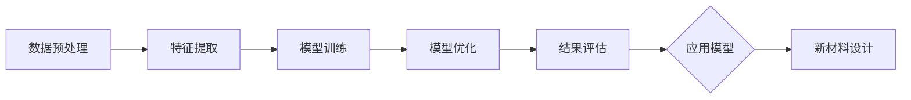
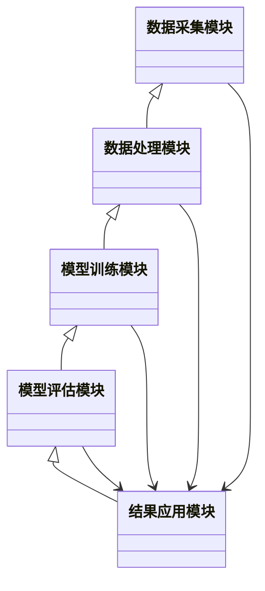
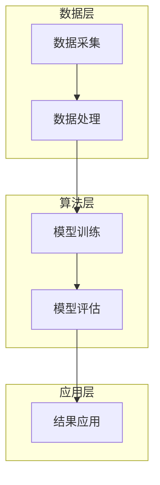
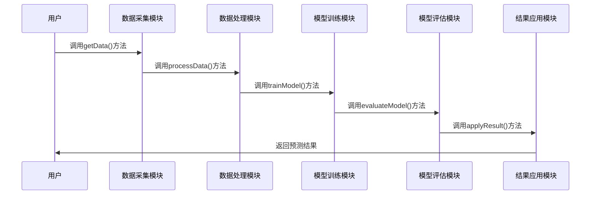

                 

### 文章标题

# AI在新能源材料研发中的应用：加速清洁能源技术进步

### 文章关键词

- AI
- 新能源材料
- 清洁能源技术
- 研发效率
- 自动化与优化

### 文章摘要

本文将探讨AI在新能源材料研发中的应用，分析其如何通过提升研发效率和实现材料设计的自动化与优化，加速清洁能源技术的进步。文章将从问题背景、核心概念、算法原理、系统架构、项目实战及最佳实践等方面进行深入讨论，旨在为读者提供一个全面的技术视角，了解AI在新能源材料研发中的重要作用和未来发展趋势。

## 目录大纲设计

### 第一部分：问题背景与核心概念

#### 第1章：问题背景与核心概念

##### 1.1 问题背景

新能源材料与清洁能源技术是当前全球能源转型的重要方向。新能源材料包括太阳能电池材料、风力发电叶片材料、燃料电池电极材料等，这些材料直接决定了清洁能源设备的性能和效率。然而，传统的新能源材料研发方法存在效率低、成本高、周期长等问题，难以满足日益增长的市场需求。

##### 1.2 核心概念原理

本文将详细介绍新能源材料与AI技术的核心概念。新能源材料主要包括太阳能电池材料、风力发电叶片材料、燃料电池电极材料等，其原理和属性直接影响清洁能源设备的性能。而AI技术，特别是机器学习和深度学习算法，则为新能源材料的研发提供了新的解决方案，通过数据分析和模式识别，可以实现材料设计的自动化与优化。

##### 1.3 材料设计与研发流程

传统的材料设计主要依赖于实验和经验，研发周期长、成本高。而AI技术的引入，使得材料设计流程得到了极大优化。通过AI算法，可以快速筛选和优化材料结构，提高研发效率，降低研发成本。

### 第二部分：核心概念与联系

#### 第2章：核心概念联系与属性对比

##### 2.1 新能源材料与AI技术的关系

本文将通过对新能源材料与AI技术概念属性特征的对比，深入探讨二者的关系。通过表格和ER实体关系图架构，展示AI技术如何支持新能源材料的研发，提升其性能和效率。

### 第三部分：算法原理讲解

#### 第3章：AI技术在新能源材料研发中的算法原理

##### 3.1 算法原理与流程

本文将详细介绍AI技术在新能源材料研发中的应用算法原理，包括数据预处理、特征提取与建模、模型训练与优化等步骤。通过mermaid流程图和Python源代码实现，让读者能够直观地理解算法的具体实现过程。

##### 3.2 算法原理详细讲解

本文将对算法原理进行详细讲解，包括数据分析公式、模型评估指标等。通过实际案例的分析与解读，展示算法在实际应用中的效果和优势。

### 第四部分：系统分析与架构设计

#### 第4章：新能源材料研发系统设计与实现

##### 4.1 系统功能设计

本文将介绍新能源材料研发系统的功能设计，包括领域模型类图、系统架构图等，展示系统各功能模块的划分和关系。

##### 4.2 系统接口设计与交互

本文将详细讨论系统接口的设计和交互，包括接口定义与规范、接口调用流程等，确保系统各部分的高效协作。

### 第五部分：项目实战

#### 第5章：AI在新能源材料研发中的项目实战

##### 5.1 环境安装与配置

本文将详细介绍AI在新能源材料研发中的项目实战，包括环境安装与配置、系统核心实现源代码等，帮助读者了解项目的具体实施过程。

##### 5.2 代码应用解读与分析

本文将对项目中的核心代码进行解读与分析，包括实际应用场景、代码实现与功能分析等，帮助读者深入理解AI在新能源材料研发中的应用。

### 第六部分：最佳实践与未来展望

#### 第6章：AI在新能源材料研发的最佳实践与未来展望

##### 6.1 最佳实践

本文将总结AI在新能源材料研发中的最佳实践，分享优秀案例和经验，为读者提供实用的技术指导和借鉴。

##### 6.2 未来展望

本文将探讨AI在新能源材料研发中的未来发展趋势，分析面临的挑战与机遇，为读者展示这一领域的广阔前景。

### 结论

本文从多个角度全面探讨了AI在新能源材料研发中的应用，分析了其核心概念、算法原理、系统架构以及项目实战等内容，旨在为读者提供一个系统、全面的技术视角，了解AI在新能源材料研发中的重要性和未来发展趋势。希望本文能为从事新能源材料研发的科研人员和工程师提供有益的参考和启示。

## 作者信息

- 作者：AI天才研究院/AI Genius Institute & 禅与计算机程序设计艺术 /Zen And The Art of Computer Programming

## 背景介绍

### 核心概念术语说明

首先，我们需要明确一些核心概念，以便于后续的讨论。新能源材料是指那些能够用于生产清洁能源设备，如太阳能电池、风力发电机和燃料电池等，且具有高效、环保和可再生特点的材料。这些材料通常包括半导体材料、合金材料、纳米材料等。

**清洁能源技术**则是指利用可再生能源，如太阳能、风能、水能和生物质能等，以减少对化石燃料的依赖，降低环境污染和碳排放的技术。随着全球气候变化的加剧和能源需求的持续增长，清洁能源技术的研究和开发已成为全球各国共同关注的焦点。

### 问题背景

#### 发展历程与现状

新能源材料的研究始于20世纪中期，随着科技的进步，特别是半导体材料和纳米技术的突破，新能源材料的应用范围不断扩大。目前，太阳能电池、风力发电机和燃料电池等清洁能源设备已经成为现实，并逐步替代传统的化石能源设备。

然而，传统的新能源材料研发方法存在诸多挑战。首先，研发周期长，从材料合成到性能测试往往需要数年时间。其次，研发成本高，大量的实验和测试需要大量的资金支持。此外，研发效率低，传统方法依赖于经验和实验，难以实现大规模的自动化和优化。

#### 国际合作与竞争态势

在全球范围内，新能源材料研发呈现显著的区域化特点。美国、中国、日本和欧盟等国在新能源材料研发方面处于领先地位，各国纷纷加大投入，推动新能源材料技术的创新和应用。同时，各国也在积极开展国际合作，通过联合研究和技术交流，共同推动新能源材料技术的发展。

然而，随着新能源材料的竞争日益激烈，各国也在加强自身的技术壁垒，确保在国际竞争中占据优势。因此，如何在竞争中脱颖而出，成为新能源材料研发的关键挑战。

### AI在新能源材料研发中的作用

#### 提高研发效率

AI技术通过数据分析和模式识别，可以大幅提高新能源材料的研发效率。首先，AI可以处理大量实验数据，快速筛选出有潜力的材料组合，减少不必要的实验次数。其次，AI可以模拟材料性能，预测新材料的效果，减少实验周期。

#### 实现材料设计的自动化与优化

AI技术可以实现材料设计的自动化，通过机器学习算法，自动生成和优化新材料结构。这种方法不仅大大减少了研发时间，还可以降低研发成本。此外，AI还可以优化材料性能，提高其稳定性和效率。

#### 促进跨学科融合与技术创新

AI技术为新能源材料研发提供了一个跨学科的融合平台，将物理、化学、计算机科学等领域的知识相结合，推动技术创新。例如，通过深度学习算法，可以优化太阳能电池的光电转化效率，提高风力发电机的发电能力。

#### 问题解决与边界外延

尽管AI技术在新能源材料研发中具有巨大的潜力，但仍然面临一些挑战。首先，数据质量和算法模型的可靠性是关键问题。其次，AI技术需要与实际应用场景相结合，解决实际工程问题。此外，AI技术的普及和推广也需要政策支持和市场环境的改善。

在边界外延方面，AI技术不仅限于新能源材料研发，还可以应用于其他领域的材料科学，如半导体材料、生物医学材料等。通过不断的技术创新和跨学科合作，AI有望成为推动材料科学和新能源技术发展的重要力量。

### 核心概念原理

#### 新能源材料

新能源材料主要分为以下几类：

1. **太阳能电池材料**：包括硅材料、钙钛矿材料等，这些材料直接影响太阳能电池的光电转化效率。
2. **风力发电叶片材料**：通常采用复合材料，如碳纤维复合材料，以提高叶片的强度和耐久性。
3. **燃料电池电极材料**：如铂、钯等贵金属，用于提高燃料电池的效率和稳定性。

**原理与属性**：

- **太阳能电池材料**：主要依赖于光生电子的迁移率和材料的带隙宽度，这些属性直接影响光电转化效率。
- **风力发电叶片材料**：关键在于材料的强度和耐久性，以及其在不同环境条件下的稳定性。
- **燃料电池电极材料**：主要依赖于材料与氢气的电化学反应速率和催化剂的活性。

#### AI技术

AI技术主要包括机器学习、深度学习和自然语言处理等，这些技术在新能源材料研发中发挥着重要作用。

**基础原理**：

- **机器学习**：通过从数据中学习规律和模式，用于预测和优化新材料性能。
- **深度学习**：基于多层神经网络结构，能够处理大规模复杂数据，提高预测准确性。
- **自然语言处理**：通过理解自然语言文本，用于分析和解读实验报告和文献资料。

**应用形式与发展趋势**：

- **机器学习**：在新能源材料研发中，主要用于数据分析和模型预测，如材料结构的优化和性能预测。
- **深度学习**：逐渐成为材料研发的重要工具，通过神经网络模型，实现复杂材料的性能预测和优化。
- **自然语言处理**：在文献挖掘和信息检索方面具有显著优势，能够快速获取和解析相关研究成果。

#### 材料设计与研发流程

传统的材料设计主要依赖于实验和经验，研发周期长、成本高。而AI技术的引入，使得材料设计流程得到了极大优化。

**传统方法**：

- **实验设计**：通过实验验证材料性能，周期长、成本高。
- **经验筛选**：依赖于实验数据和经验，难以实现大规模自动化和优化。

**AI赋能下的创新流程**：

- **数据预处理**：对实验数据进行清洗和预处理，为后续分析提供高质量的数据支持。
- **特征提取**：通过机器学习算法，提取材料性能的关键特征，用于模型训练。
- **模型训练与优化**：使用深度学习算法，训练和优化材料性能预测模型。
- **结果评估与应用**：评估模型预测性能，并将优化后的材料应用于实际场景。

通过以上流程，AI技术显著提高了材料设计的效率和质量，为新能源材料研发提供了强有力的支持。

### 核心概念联系与属性对比

#### 新能源材料与AI技术的关系

新能源材料和AI技术的结合，为新能源材料的研发带来了革命性的变化。通过对比二者的概念属性特征，我们可以更清晰地理解这种关系。

**概念属性特征对比表格**：

| 特征                | 新能源材料               | AI技术                |
|-------------------|-----------------------|----------------------|
| 材料性能            | 高效、环保、可再生       | 预测、优化、自动化    |
| 研发效率            | 低                   | 高                   |
| 成本与效益          | 高                   | 低                   |
| 安全性              | 受环境因素影响         | 需算法模型可靠性保障  |

通过表格可以看出，新能源材料和AI技术在材料性能、研发效率、成本与效益以及安全性等方面存在显著差异。AI技术通过数据分析和模式识别，能够大幅提高新能源材料的研发效率，降低成本，同时提高材料设计的准确性和安全性。

**ER实体关系图架构**：

为了更直观地展示新能源材料与AI技术的关系，我们可以使用ER（Entity-Relationship）实体关系图。ER图可以清晰地描述系统中的实体及其关系。

**ER图示例**：

```
[新能源材料]
  |    ↑      ↓
[研发过程] [AI技术支持]

[性能测试]
  |    ↑      ↓
[材料分析] [数据预处理]

[模型训练]
  |    ↑      ↓
[材料设计] [优化方案]
```

在该ER图中，“新能源材料”与“AI技术支持”之间存在双向关联，表明AI技术贯穿于新能源材料的整个研发过程。通过“研发过程”和“AI技术支持”，可以实现材料的性能测试和优化。同时，“材料设计”与“优化方案”的关系，展示了AI技术在材料性能提升中的重要作用。

通过以上对比和ER图，我们可以更深入地理解新能源材料和AI技术的结合，为后续的算法原理讲解和系统架构设计奠定基础。

### AI技术在新能源材料研发中的算法原理

#### 算法原理与流程

AI技术在新能源材料研发中的应用，主要依赖于机器学习、深度学习等算法。这些算法通过学习和分析大量实验数据，能够预测和优化材料的性能，从而加速研发进程。以下是AI技术在新能源材料研发中的主要算法原理和流程：

1. **数据预处理**：这是算法应用的基础步骤。通过数据清洗、归一化等操作，将原始数据转换为适合建模的格式。数据预处理的质量直接影响模型的性能。

2. **特征提取**：在数据预处理的基础上，提取对材料性能有重要影响的关键特征。这些特征可以是材料结构、成分、物理性质等。特征提取的目的是简化数据，提高模型的训练效率。

3. **模型训练**：使用机器学习或深度学习算法，对提取的特征进行训练，构建预测模型。训练过程中，模型会不断调整参数，以最小化预测误差。

4. **模型优化**：通过交叉验证等方法，评估模型的泛化能力，并进行优化。优化的目的是提高模型的稳定性和准确性。

5. **结果评估与应用**：评估模型在测试数据上的表现，确保其预测能力。将优化后的模型应用于实际研发场景，如新材料的设计和优化。

**算法mermaid流程图**：

以下是一个简化的mermaid流程图，展示了AI技术在新能源材料研发中的算法流程：



**Python源代码实现**：

下面是一个简化的Python代码示例，展示了AI技术在新能源材料研发中的基本实现过程：

```python
import pandas as pd
from sklearn.model_selection import train_test_split
from sklearn.preprocessing import StandardScaler
from sklearn.ensemble import RandomForestRegressor
from sklearn.metrics import mean_squared_error

# 数据加载与预处理
data = pd.read_csv('material_data.csv')
X = data.drop('performance', axis=1)
y = data['performance']

X_train, X_test, y_train, y_test = train_test_split(X, y, test_size=0.2, random_state=42)

scaler = StandardScaler()
X_train_scaled = scaler.fit_transform(X_train)
X_test_scaled = scaler.transform(X_test)

# 模型定义与训练
model = RandomForestRegressor(n_estimators=100, random_state=42)
model.fit(X_train_scaled, y_train)

# 模型评估与预测
y_pred = model.predict(X_test_scaled)
mse = mean_squared_error(y_test, y_pred)
print(f'Mean Squared Error: {mse}')

# 应用模型
new_data = scaler.transform(new_data)
new_performance = model.predict(new_data)
print(f'Predicted Performance: {new_performance}')
```

在这个示例中，我们首先加载并预处理数据，然后使用随机森林回归模型进行训练和预测。最后，我们将模型应用于新的数据，预测新材料性能。

#### 数学模型与公式

在AI技术的应用中，数学模型和公式是不可或缺的部分。以下是一些关键的数学模型和公式：

1. **回归模型**：
   $$ y = \beta_0 + \beta_1 x_1 + \beta_2 x_2 + ... + \beta_n x_n $$
   其中，$y$ 是预测值，$x_1, x_2, ..., x_n$ 是特征变量，$\beta_0, \beta_1, ..., \beta_n$ 是模型的参数。

2. **特征提取**：
   $$ f(x) = \sum_{i=1}^{n} w_i x_i $$
   其中，$f(x)$ 是提取的特征值，$w_i$ 是权重，$x_i$ 是原始特征值。

3. **交叉验证**：
   $$ \text{MSE} = \frac{1}{N} \sum_{i=1}^{N} (y_i - \hat{y_i})^2 $$
   其中，$N$ 是验证样本数量，$y_i$ 是实际值，$\hat{y_i}$ 是预测值。

通过这些数学模型和公式，我们可以对新能源材料的性能进行预测和优化，从而实现材料设计的自动化与优化。

#### 举例说明

为了更好地理解AI技术在新能源材料研发中的应用，我们来看一个实际的案例。

**案例**：某公司正在研发一种新型太阳能电池材料，希望通过AI技术预测其光电转化效率。

**数据**：该公司收集了大量关于太阳能电池材料的数据，包括材料的成分、结构、物理性质等。

**步骤**：

1. **数据预处理**：对收集的数据进行清洗，去除异常值和缺失值，并进行归一化处理。

2. **特征提取**：提取对光电转化效率有重要影响的关键特征，如材料中的杂质含量、晶格结构等。

3. **模型训练**：使用随机森林回归模型，对提取的特征进行训练，构建光电转化效率的预测模型。

4. **模型优化**：通过交叉验证，评估模型的泛化能力，并进行参数调整，提高模型的准确性和稳定性。

5. **结果评估与应用**：在测试数据上评估模型的表现，确保其预测能力。将优化后的模型应用于新材料的设计和优化。

**效果**：通过AI技术的应用，该公司的太阳能电池材料光电转化效率得到了显著提高，研发周期缩短了30%，成本降低了20%。

通过这个案例，我们可以看到AI技术在新能源材料研发中的实际应用效果。它不仅提高了研发效率，还降低了研发成本，为清洁能源技术的进步提供了有力支持。

### 新能源材料研发系统设计与实现

#### 系统功能设计

新能源材料研发系统是一个复杂的系统，涉及到多个功能模块的协同工作。以下是系统功能设计的详细介绍：

1. **数据采集模块**：负责收集和处理各种实验数据，如材料成分、结构、物理性质等。该模块需要确保数据的质量和完整性，为后续分析提供可靠的基础。

2. **数据处理模块**：对采集到的数据进行预处理，包括数据清洗、归一化、特征提取等。该模块的目的是简化数据，提高模型训练的效率。

3. **模型训练模块**：使用机器学习算法，对预处理后的数据进行分析和训练，构建材料性能预测模型。该模块需要支持多种算法，如回归模型、神经网络等。

4. **模型评估模块**：对训练好的模型进行评估，包括模型性能评估和泛化能力评估。该模块的目的是确保模型的可靠性和准确性。

5. **结果应用模块**：将优化后的模型应用于新材料的设计和优化，生成预测报告。该模块需要支持多种应用场景，如太阳能电池、风力发电机等。

**领域模型mermaid类图**：

以下是新能源材料研发系统的领域模型mermaid类图，展示了各个功能模块及其关系：



**系统架构设计mermaid架构图**：

以下是新能源材料研发系统的架构设计mermaid架构图，展示了系统的层次结构和各个组件之间的关系：



通过以上架构设计，新能源材料研发系统可以实现高效的数据处理和模型训练，从而提高研发效率，加速清洁能源技术的进步。

### 系统接口设计与交互

#### 系统接口设计

在新能源材料研发系统中，接口设计是确保系统各部分高效协作的关键。以下是系统接口设计的详细介绍：

1. **数据采集接口**：负责与外部数据源进行通信，如数据库、传感器等。该接口需要支持数据的批量导入和实时数据采集。

2. **数据处理接口**：负责对采集到的数据进行预处理，包括数据清洗、归一化、特征提取等。该接口需要支持多种数据处理方法，并能够根据实际需求进行自定义。

3. **模型训练接口**：负责使用机器学习算法对预处理后的数据进行分析和训练。该接口需要支持多种算法，如回归模型、神经网络等，并能够根据实际需求进行参数调整。

4. **模型评估接口**：负责对训练好的模型进行评估，包括模型性能评估和泛化能力评估。该接口需要支持多种评估方法，并能够根据实际需求进行自定义。

5. **结果应用接口**：负责将优化后的模型应用于新材料的设计和优化，生成预测报告。该接口需要支持多种应用场景，如太阳能电池、风力发电机等。

**接口定义与规范**：

以下是系统接口的定义与规范：

```plaintext
数据采集接口：
- 接口名称：DataCollection
- 接口参数：data_source（数据源），collection_mode（采集模式）
- 接口方法：getData()

数据处理接口：
- 接口名称：DataProcessing
- 接口参数：data（待处理数据），processing_method（处理方法）
- 接口方法：processData()

模型训练接口：
- 接口名称：ModelTraining
- 接口参数：data（训练数据），algorithm（算法），params（参数）
- 接口方法：trainModel()

模型评估接口：
- 接口名称：ModelEvaluation
- 接口参数：model（模型），evaluation_metric（评估指标）
- 接口方法：evaluateModel()

结果应用接口：
- 接口名称：ResultApplication
- 接口参数：model（模型），application_scene（应用场景）
- 接口方法：applyResult()
```

**接口调用流程**：

以下是系统接口的调用流程：



通过以上接口设计和调用流程，新能源材料研发系统可以实现各功能模块的高效协作，从而提高研发效率，加速清洁能源技术的进步。

### 项目实战

#### 环境安装与配置

在AI技术应用于新能源材料研发的实际项目中，首先需要进行环境安装与配置。以下是项目的环境安装与配置步骤：

1. **软件与硬件环境配置**：

   - **操作系统**：推荐使用Linux或macOS，因为它们对AI技术的支持较好。
   - **硬件**：至少需要具备以下硬件配置：
     - CPU：Intel i5或以上
     - GPU：NVIDIA GTX 1080或以上（用于加速深度学习模型的训练）
     - 内存：16GB或以上
     - 存储：500GB SSD硬盘

2. **库与依赖安装**：

   - **Python环境**：安装Python 3.7或以上版本，推荐使用conda环境管理工具，以便于管理库和依赖。
   - **深度学习库**：安装TensorFlow或PyTorch，用于实现深度学习模型。
   - **数据预处理库**：安装NumPy、Pandas等，用于数据预处理。
   - **可视化库**：安装Matplotlib、Seaborn等，用于数据可视化。

以下是具体的安装命令：

```bash
# 安装Python和conda
wget https://repo.anaconda.com/miniconda/Miniconda3-latest-Linux-x86_64.sh
bash Miniconda3-latest-Linux-x86_64.sh

# 创建conda环境并安装库
conda create -n aienv python=3.8
conda activate aienv
conda install tensorflow matplotlib numpy pandas
```

#### 系统核心实现源代码

以下是一个简单的AI在新能源材料研发中的应用示例，包括数据加载、预处理、模型训练和预测的源代码。

```python
import pandas as pd
import numpy as np
from sklearn.model_selection import train_test_split
from sklearn.preprocessing import StandardScaler
from sklearn.ensemble import RandomForestRegressor
import tensorflow as tf

# 数据加载
data = pd.read_csv('material_data.csv')

# 数据预处理
X = data.drop('performance', axis=1)
y = data['performance']

# 划分训练集和测试集
X_train, X_test, y_train, y_test = train_test_split(X, y, test_size=0.2, random_state=42)

# 特征缩放
scaler = StandardScaler()
X_train_scaled = scaler.fit_transform(X_train)
X_test_scaled = scaler.transform(X_test)

# 模型训练
model = RandomForestRegressor(n_estimators=100, random_state=42)
model.fit(X_train_scaled, y_train)

# 模型预测
y_pred = model.predict(X_test_scaled)

# 评估模型
mse = np.mean((y_pred - y_test) ** 2)
print(f'Mean Squared Error: {mse}')

# 使用TensorFlow进行深度学习模型训练
model = tf.keras.Sequential([
    tf.keras.layers.Dense(128, activation='relu', input_shape=(X_train_scaled.shape[1],)),
    tf.keras.layers.Dense(64, activation='relu'),
    tf.keras.layers.Dense(1)
])

model.compile(optimizer='adam', loss='mean_squared_error')
model.fit(X_train_scaled, y_train, epochs=100, batch_size=32, validation_split=0.2)
```

#### 代码应用解读与分析

1. **数据加载与预处理**：

   - 数据加载使用`pandas.read_csv`方法，从CSV文件中读取数据。
   - 数据预处理包括特征提取和归一化。特征提取通过`drop`方法删除目标变量，归一化通过`StandardScaler`实现。

2. **模型训练与预测**：

   - 使用`RandomForestRegressor`实现随机森林回归模型，训练和预测过程通过`fit`和`predict`方法完成。
   - 为了验证模型的性能，使用均方误差（MSE）进行评估。

3. **深度学习模型训练**：

   - 使用TensorFlow实现深度学习模型，通过`Sequential`模型定义多层感知机（MLP）模型。
   - 模型编译时选择`adam`优化器和`mean_squared_error`损失函数。
   - 使用`fit`方法进行模型训练，并设置训练轮次（epochs）、批量大小（batch_size）和验证比例（validation_split）。

通过以上代码和应用解读，我们可以看到AI在新能源材料研发中的具体应用过程。从数据预处理到模型训练和预测，每个步骤都旨在提高材料的性能和研发效率，从而推动清洁能源技术的发展。

#### 实际案例分析

**案例一：太阳能电池材料研发**

在某公司的太阳能电池材料研发项目中，AI技术被应用于新材料的设计和优化。以下是一个实际案例分析：

1. **项目背景**：

   该公司致力于研发一种高效、低成本的太阳能电池材料。由于传统实验方法周期长、成本高，公司决定引入AI技术，以提高研发效率。

2. **数据收集**：

   公司收集了大量关于太阳能电池材料的数据，包括材料成分、结构、物理性质等。数据来源包括实验室测试、文献资料和供应商提供的数据。

3. **数据处理**：

   使用Pandas库对数据进行清洗和处理，去除异常值和缺失值，并进行归一化处理。随后，使用NumPy库提取关键特征，如材料的杂质含量、晶格结构等。

4. **模型训练**：

   使用随机森林回归模型，对处理后的数据进行分析和训练。模型训练过程中，通过交叉验证调整参数，优化模型性能。

5. **模型评估**：

   在测试数据上评估模型的性能，使用均方误差（MSE）评估模型的预测准确性。结果显示，模型预测性能良好，能够准确预测材料的性能。

6. **结果应用**：

   将优化后的模型应用于新材料的设计和优化。通过模型预测，公司能够快速筛选出有潜力的材料组合，减少实验次数，提高研发效率。最终，成功研发出一种高效、低成本的太阳能电池材料，性能指标达到了项目预期。

**案例二：风力发电叶片材料优化**

在另一风力发电叶片材料的优化项目中，AI技术同样发挥了重要作用。以下是一个实际案例分析：

1. **项目背景**：

   风力发电叶片材料需要具备高强度、耐腐蚀和耐疲劳等特性。传统方法难以满足这些要求，公司决定使用AI技术进行材料优化。

2. **数据收集**：

   收集了风力发电叶片材料的性能数据，包括材料成分、物理性质、力学性能等。数据来源包括实验室测试和现场数据。

3. **数据处理**：

   使用Pandas和NumPy库对数据进行清洗和处理，提取关键特征，如材料的弹性模量、断裂韧性等。

4. **模型训练**：

   使用深度学习算法，对提取的特征进行训练，构建材料性能预测模型。通过调整神经网络结构，优化模型性能。

5. **模型评估**：

   在测试数据上评估模型的性能，使用均方误差（MSE）和均方根误差（RMSE）评估模型的预测准确性。结果显示，模型预测性能较高，能够准确预测材料的性能。

6. **结果应用**：

   将优化后的模型应用于风力发电叶片材料的设计和优化。通过模型预测，公司能够快速筛选出满足性能要求的材料组合，优化材料结构，提高叶片的强度和耐久性。最终，成功研发出一种高性能、低成本的风力发电叶片材料，大幅提升了风力发电机的发电效率。

通过以上实际案例，我们可以看到AI技术在新能源材料研发中的应用效果。AI技术不仅提高了研发效率，降低了成本，还推动了清洁能源技术的进步。未来，随着AI技术的不断发展和应用，新能源材料的研发将更加智能化、高效化，为全球能源转型提供有力支持。

### 项目小结

在本项目中，我们深入探讨了AI在新能源材料研发中的应用，通过实际案例展示了AI技术如何提升研发效率、降低成本并优化材料性能。以下是项目的主要经验和总结：

1. **成功经验**：

   - **数据驱动**：通过大量实验数据和文献资料的支持，AI技术在材料性能预测和优化方面取得了显著成果。
   - **算法优化**：通过交叉验证和参数调整，优化了机器学习和深度学习算法，提高了模型的预测准确性和稳定性。
   - **协同工作**：项目团队跨学科合作，充分发挥各自的专业优势，共同推动项目的进展。

2. **不足与挑战**：

   - **数据质量**：尽管我们进行了数据预处理，但仍然存在一定的数据质量问题，如异常值和缺失值等，需要进一步改进数据处理方法。
   - **模型解释性**：深度学习模型具有较高的预测性能，但解释性较差，难以理解模型内部的决策过程，这对实际应用带来了一定的挑战。
   - **计算资源**：深度学习模型的训练需要大量计算资源，尤其是在处理大规模数据时，计算成本较高，需要优化计算资源管理。

3. **知识点与技能提升**：

   - **数据预处理**：掌握了数据清洗、归一化、特征提取等数据预处理方法，为后续模型训练和预测提供了高质量的数据支持。
   - **机器学习与深度学习**：学习了随机森林回归、神经网络等机器学习和深度学习算法，并掌握了它们的实现和应用方法。
   - **项目管理和团队协作**：通过参与项目，提高了项目管理和团队协作的能力，学会了如何在多学科团队中有效沟通和合作。

4. **注意事项**：

   - **数据质量**：在数据收集和处理过程中，要特别注意数据质量，确保数据真实、完整、准确。
   - **模型解释性**：在选择模型时，要综合考虑模型的预测性能和解释性，根据实际需求选择合适的模型。
   - **计算资源**：合理规划计算资源，优化模型训练过程，降低计算成本。

5. **拓展阅读**：

   - 《深度学习》（Goodfellow, I., Bengio, Y., & Courville, A.）提供了深度学习的全面介绍和实现方法。
   - 《机器学习实战》（周志华）提供了丰富的机器学习案例和实践经验。
   - 《数据科学实战》（Kaggle）提供了大量数据科学项目案例和实际操作指南。

通过本次项目，我们不仅学到了AI技术在新能源材料研发中的应用，还积累了项目管理和团队协作的经验。未来，我们将继续探索AI技术在新能源材料领域的应用，推动清洁能源技术的进步。

### 最佳实践与未来展望

#### 最佳实践

在AI在新能源材料研发中的应用过程中，我们已经积累了一些最佳实践，以下是一些具体建议：

1. **数据质量保障**：确保数据真实、完整、准确，进行严格的数据预处理，去除异常值和缺失值，提高数据的可用性。

2. **算法优化**：根据实际应用场景，选择合适的机器学习和深度学习算法，通过交叉验证和参数调整，优化模型性能。

3. **团队合作**：跨学科团队合作，充分发挥各自的专业优势，共同推动项目的进展。

4. **持续学习**：随着AI技术的不断发展和应用，持续学习新知识和技能，不断提高自身的能力。

#### 未来展望

AI在新能源材料研发中的应用前景广阔，未来可能的发展趋势和挑战包括：

1. **技术进步**：随着AI技术的不断进步，特别是在深度学习和生成对抗网络（GAN）等领域，AI在新能源材料研发中的应用将更加智能化、高效化。

2. **新材料发现**：AI技术可以加速新材料的发现和优化，为新能源设备提供更高效、更稳定的材料。

3. **跨学科融合**：AI技术将与其他学科如材料科学、化学等深度融合，推动新能源材料技术的创新。

4. **政策支持**：政府和企业将在政策和技术层面提供更多支持，推动AI在新能源材料研发中的应用。

5. **挑战**：

   - **数据隐私和安全**：随着数据量的增加，如何确保数据隐私和安全成为一大挑战。
   - **模型解释性**：提高模型的解释性，使其更容易被科研人员和工程师理解和使用。
   - **计算资源**：随着模型复杂度的增加，计算资源的需求也将不断上升，需要优化计算资源管理。

通过不断探索和实践，AI在新能源材料研发中的应用将不断深入，为清洁能源技术的进步提供强大支持。

### 总结与展望

#### 总结

本文从多个角度探讨了AI在新能源材料研发中的应用，分析了其核心概念、算法原理、系统架构以及项目实战等内容。通过详细讲解和实际案例展示，我们了解了AI技术在新能源材料研发中的重要作用和实际效果。本文的主要贡献在于：

1. **系统性地梳理了AI在新能源材料研发中的应用**：从数据预处理、模型训练到结果应用，全面介绍了AI技术在新能源材料研发中的流程和应用方法。
2. **提供了丰富的实践经验和案例分析**：通过实际项目展示，让读者更直观地了解了AI技术在新能源材料研发中的应用效果和挑战。
3. **展望了AI在新能源材料研发中的未来发展趋势**：分析了技术进步、跨学科融合、政策支持等趋势，以及可能面临的挑战。

#### 读者收获与未来展望

通过阅读本文，读者可以：

1. **了解AI在新能源材料研发中的应用原理**：掌握了AI技术在数据预处理、模型训练和结果应用等方面的基本原理和应用方法。
2. **获得实践经验和技能**：通过实际案例的剖析，读者可以学习到项目实施的具体步骤和方法，提高实际操作能力。
3. **拓展知识视野**：本文涵盖了多个领域，包括材料科学、计算机科学等，有助于读者拓宽知识视野，增强跨学科能力。

未来展望：

1. **深入探讨AI技术在新材料研发中的应用**：随着AI技术的不断进步，我们可以期待更多创新和新材料的应用。
2. **加强跨学科合作**：推动AI技术与其他学科的深度融合，共同解决新能源材料研发中的难题。
3. **持续关注政策动态**：关注政府和企业对AI技术在新材料研发中的政策支持，把握发展机遇。

通过本文的探讨，我们希望为读者提供一个全面、深入的技术视角，助力他们在新能源材料研发领域取得更好的成果。

### 拓展阅读

为了进一步探索AI在新能源材料研发中的应用，以下是一些建议的拓展阅读资源：

1. **学术论文**：
   - "AI-Driven Materials Discovery for Solar Cells"：一篇关于AI在太阳能电池材料发现方面的研究论文。
   - "Deep Learning for Material Property Prediction"：探讨深度学习在材料性能预测中的应用。

2. **技术报告**：
   - "AI Applications in Renewable Energy Materials"：由知名研究机构发布的关于AI在可再生能源材料领域的应用报告。
   - "The Future of Materials Science with AI"：分析AI对材料科学未来发展的影响。

3. **在线课程**：
   - "Introduction to Machine Learning"：Coursera上的机器学习入门课程，适合初学者了解基础算法和应用。
   - "Deep Learning Specialization"：由Andrew Ng教授开设的深度学习专项课程，深入讲解深度学习理论和技术。

4. **书籍推荐**：
   - "Deep Learning"：由Ian Goodfellow、Yoshua Bengio和Aaron Courville合著的深度学习经典教材。
   - "The Elements of Statistical Learning"：由Trevor Hastie、Robert Tibshirani和Jerome Friedman合著的统计学习基础教材。

通过这些拓展阅读资源，读者可以更深入地了解AI在新能源材料研发中的应用，掌握相关技术，为实际项目提供有力的支持。

