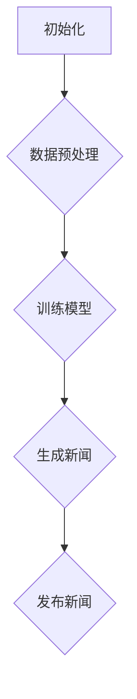
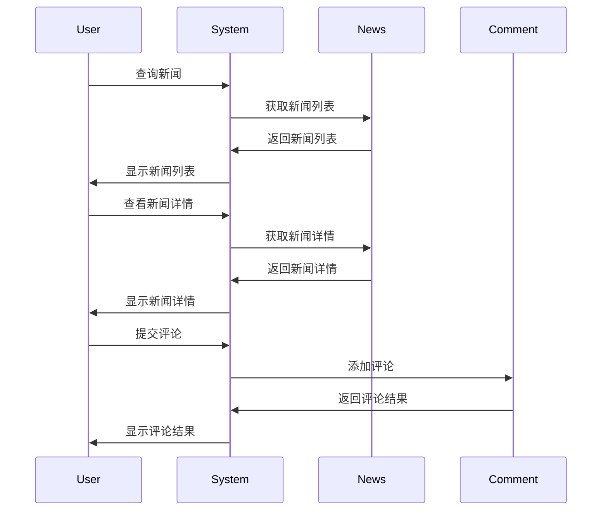

                 

# AI在新闻生产和传播中的应用与挑战

> 关键词：人工智能，新闻生产，传播，挑战，应用

> 摘要：本文将探讨人工智能（AI）在新闻生产和传播中的应用，以及面临的挑战。通过详细分析AI在新闻行业的现状，核心技术的原理和应用场景，深入探讨数据隐私与伦理问题，信息真实性验证，AI与新闻专业主义的平衡，以及未来发展趋势，为AI在新闻领域的应用提供指导和建议。

## 引言与背景

### 1.1 AI在新闻行业中的应用现状

随着人工智能技术的飞速发展，AI在各个行业的应用越来越广泛。新闻行业也不例外，AI已经在新闻生产、传播、个性化推荐等方面展现出强大的潜力。例如，自动新闻写作系统可以快速生成新闻报道，虚假新闻检测系统可以帮助识别和过滤虚假信息，个性化推荐系统则可以提供更加精准的阅读推荐。

### 1.2 新闻生产与传播的挑战

尽管AI在新闻行业中展现出巨大的潜力，但同时也面临着一系列挑战。首先，数据隐私与伦理问题引发了广泛的争议。新闻行业依赖于大量的用户数据，如何保护这些数据的安全和隐私成为一个重要问题。其次，信息真实性验证是AI在新闻传播中面临的另一个重大挑战。在信息爆炸的时代，如何确保新闻的真实性和准确性，避免虚假新闻的传播，成为新闻行业亟待解决的问题。此外，AI与新闻专业主义的平衡也是一个重要议题。如何在充分利用AI技术提高新闻生产效率的同时，保持新闻的独立性和专业性，是一个需要深入探讨的问题。

### 1.3 本书结构及主要内容概述

本文将分为五个部分，首先介绍AI在新闻生产和传播中的应用现状和挑战；然后详细分析AI新闻生产的核心技术，包括自然语言处理、图像与视频处理等；接着探讨AI新闻生产的应用场景，如自动新闻写作、虚假新闻检测、个性化推荐系统等；随后讨论AI新闻传播的挑战与应对策略，包括数据隐私与伦理问题、信息真实性验证、AI与新闻专业主义的平衡等；最后，展望AI新闻生产与传播的未来发展趋势，提出相关建议和探索方向。

## AI新闻生产的核心技术

### 2.1 自然语言处理基础

#### 2.1.1 语言模型与文本分类

自然语言处理（NLP）是AI新闻生产的核心技术之一。语言模型是NLP的基础，它通过对大量文本数据的学习，可以生成符合语法和语义规则的文本。文本分类是NLP的重要应用，它可以将文本数据按照特定的类别进行分类，如新闻分类、情感分析等。

#### 2.1.2 信息抽取与语义理解

信息抽取是从文本中自动提取出关键信息的过程，如命名实体识别、关系抽取等。语义理解则是理解文本的深层含义，包括情感分析、观点挖掘等。

#### 2.1.3 情感分析与观点挖掘

情感分析是判断文本情感极性的过程，如正面、负面、中性等。观点挖掘则是从文本中识别出作者或特定角色的观点和态度。

### 2.2 图像与视频处理

#### 2.2.1 图像识别与标注

图像识别是识别图像中的物体或场景，如人脸识别、物体识别等。标注则是为图像或视频中的特定元素打上标签，如物体标注、场景标注等。

#### 2.2.2 视频内容分析

视频内容分析可以从视频中提取出关键信息，如动作识别、场景分类等。视频内容分析在新闻生产中有着广泛的应用，如自动剪辑、视频推荐等。

#### 2.2.3 图像与视频的融合应用

图像与视频的融合应用是将图像和视频处理技术结合，生成新的应用场景，如视频摘要生成、图像与视频同步生成等。

### 2.3 AI新闻生产应用场景

#### 2.3.1 自动新闻写作

自动新闻写作是通过AI技术自动生成新闻稿件的过程。自动新闻写作系统可以根据实时数据自动生成新闻报道，提高新闻生产效率。

#### 2.3.2 虚假新闻检测

虚假新闻检测是通过AI技术识别和过滤虚假新闻的过程。虚假新闻检测系统可以自动分析新闻内容，判断其真实性。

#### 2.3.3 个性化推荐系统

个性化推荐系统是根据用户的兴趣和偏好，为用户推荐相关的新闻内容。个性化推荐系统可以提供更加精准的阅读推荐，提高用户体验。

## AI新闻生产应用场景

### 3.1 自动新闻写作

#### 3.1.1 自动新闻写作概述

自动新闻写作是AI新闻生产的重要应用之一。自动新闻写作系统可以通过AI技术自动生成新闻稿件，包括体育赛事报道、财经新闻、天气报告等。自动新闻写作系统具有高效、低成本、快速响应等特点，可以大大提高新闻生产效率。

#### 3.1.2 自动新闻写作技术

自动新闻写作技术主要包括文本生成、模板匹配和规则驱动等方法。文本生成是通过机器学习模型生成新闻文本，模板匹配是通过预设的模板生成新闻文本，规则驱动是通过规则生成新闻文本。

#### 3.1.3 案例分析

以CNN的自动新闻写作系统为例，该系统使用自然语言处理技术生成体育赛事报道。系统通过分析比赛数据，生成简洁明了的新闻稿件，提高了新闻生产的效率。

### 3.2 虚假新闻检测

#### 3.2.1 虚假新闻的现状与危害

虚假新闻是近年来广泛关注的议题。虚假新闻不仅误导公众，影响社会稳定，还可能引发一系列负面后果，如经济损失、社会恐慌等。

#### 3.2.2 虚假新闻检测方法

虚假新闻检测方法主要包括基于文本特征的方法、基于图像特征的方法和基于多模态融合的方法。基于文本特征的方法通过分析新闻文本的特征，如词汇、句式等，判断新闻的真实性。基于图像特征的方法通过分析新闻中的图像特征，如色彩、纹理等，判断新闻的真实性。基于多模态融合的方法则结合文本和图像特征，提高检测的准确性。

#### 3.2.3 案例分析

以Facebook的虚假新闻检测系统为例，该系统通过分析新闻文本和图像特征，结合用户行为数据，有效识别和过滤虚假新闻。

### 3.3 个性化推荐系统

#### 3.3.1 个性化推荐原理

个性化推荐系统是根据用户的兴趣和偏好，为用户推荐相关的新闻内容。个性化推荐原理主要包括协同过滤、基于内容的推荐和混合推荐方法。

#### 3.3.2 新闻推荐系统设计

新闻推荐系统设计主要包括用户建模、内容建模和推荐算法设计。用户建模是通过分析用户行为数据，构建用户兴趣模型。内容建模是通过分析新闻内容，构建新闻特征模型。推荐算法设计则是根据用户兴趣模型和新闻特征模型，生成新闻推荐列表。

#### 3.3.3 案例分析

以Google News为例，该系统通过用户建模和内容建模，结合协同过滤和基于内容的推荐方法，为用户推荐个性化的新闻内容。

## AI新闻传播的挑战与应对策略

### 4.1 数据隐私与伦理问题

#### 4.1.1 数据隐私保护

数据隐私保护是AI新闻传播面临的一个重要挑战。AI新闻生产需要大量用户数据，如何保护这些数据的安全和隐私成为关键问题。数据隐私保护措施主要包括数据加密、访问控制、匿名化处理等。

#### 4.1.2 伦理问题探讨

AI新闻传播中的伦理问题主要包括算法歧视、新闻偏见、信息控制等。算法歧视是指算法在处理数据时可能存在的性别、种族、年龄等方面的偏见。新闻偏见是指AI新闻生产可能导致的新闻观点偏向。信息控制是指媒体可能利用AI技术控制信息传播。

#### 4.1.3 相关法律法规

随着AI在新闻传播中的应用越来越广泛，相关法律法规也需要不断完善。例如，欧盟的《通用数据保护条例》（GDPR）对数据隐私保护提出了严格的要求。我国也制定了一系列相关法律法规，如《网络安全法》等。

### 4.2 信息真实性验证

#### 4.2.1 信息真实性评估方法

信息真实性验证是AI新闻传播的另一个重要挑战。信息真实性评估方法主要包括基于规则的方法、基于机器学习的方法和基于区块链的方法。基于规则的方法是通过预设的规则判断信息的真实性。基于机器学习的方法是通过训练模型，自动判断信息的真实性。基于区块链的方法是通过区块链技术，确保信息传播的可追溯性和不可篡改性。

#### 4.2.2 真假信息检测技术

真假信息检测技术主要包括文本分析、图像分析、多模态分析等。文本分析是通过分析新闻文本的特征，如词汇、句式等，判断信息的真实性。图像分析是通过分析新闻中的图像特征，如色彩、纹理等，判断信息的真实性。多模态分析则是结合文本和图像特征，提高检测的准确性。

#### 4.2.3 案例分析

以Twitter的虚假新闻检测系统为例，该系统通过文本分析和图像分析，结合用户行为数据，有效识别和过滤虚假新闻。

### 4.3 AI与新闻专业主义的平衡

#### 4.3.1 AI对新闻专业主义的影响

AI在新闻传播中的应用，一方面可以提高新闻生产效率，另一方面也可能影响新闻的专业主义。例如，自动新闻写作可能导致新闻内容的单一化，缺乏深度报道。此外，算法偏见也可能影响新闻的客观性和公正性。

#### 4.3.2 平衡策略探讨

为了实现AI与新闻专业主义的平衡，需要采取一系列策略。首先，加强对AI新闻生产的管理，确保新闻内容的真实性和准确性。其次，提高新闻从业者的技术素养，使其能够充分利用AI技术，提高新闻生产效率。此外，还需要建立透明、可信赖的AI新闻生产机制，确保新闻的专业性和独立性。

#### 4.3.3 案例分析

以纽约时报为例，该报在AI新闻生产中采用了严格的审核机制，确保新闻内容的真实性和准确性。同时，纽约时报还积极培养新闻从业者的技术素养，使其能够更好地利用AI技术，提高新闻生产效率。

## AI新闻生产与传播的未来发展趋势

### 5.1 AI技术发展对新闻行业的影响

随着AI技术的不断进步，新闻行业将面临深刻的变革。首先，AI技术将大大提高新闻生产效率，减少人力成本。其次，AI技术将使新闻内容更加丰富多样，满足不同用户的需求。此外，AI技术还将为新闻传播提供新的方式，如虚拟现实、增强现实等。

### 5.2 跨界合作与创新模式

AI新闻生产与传播的发展离不开跨界合作和创新模式。首先，新闻行业需要与科技企业、研究机构等开展合作，共同推动AI技术在新闻行业中的应用。其次，新闻行业需要探索新的商业模式，如付费订阅、广告等，以应对AI技术带来的变革。

### 5.3 未来发展趋势预测

未来，AI新闻生产与传播将呈现以下趋势：首先，AI技术将更加深入地应用于新闻生产的各个环节，提高新闻生产效率。其次，AI技术将推动新闻传播方式的创新，如虚拟现实、增强现实等。此外，AI技术还将为新闻行业带来新的商业模式，如付费订阅、广告等。

## 实际案例分析与深度剖析

### 6.1 案例一：自动新闻写作系统

#### 6.1.1 案例背景

自动新闻写作系统是一种利用AI技术自动生成新闻稿件的系统。它通过对大量新闻数据进行学习，可以生成符合语法和语义规则的新闻稿件。自动新闻写作系统在体育赛事报道、财经新闻等领域有着广泛的应用。

#### 6.1.2 系统设计与实现

自动新闻写作系统主要包括文本生成、模板匹配和规则驱动等模块。文本生成模块使用自然语言处理技术，生成符合语法和语义规则的新闻文本。模板匹配模块使用预设的模板，生成新闻稿件。规则驱动模块通过规则生成新闻稿件。

#### 6.1.3 案例评估与反思

自动新闻写作系统提高了新闻生产的效率，降低了人力成本。然而，系统生成的新闻稿件可能缺乏深度报道，难以满足用户对高质量新闻的需求。因此，在实际应用中，需要结合人工审核和编辑，确保新闻稿件的质量。

### 6.2 案例二：虚假新闻检测系统

#### 6.2.1 案例背景

虚假新闻检测系统是一种利用AI技术识别和过滤虚假新闻的系统。它通过对大量虚假新闻数据的学习，可以自动检测和过滤虚假新闻，确保新闻的真实性和准确性。

#### 6.2.2 系统架构与算法

虚假新闻检测系统主要包括文本分析、图像分析和多模态分析等模块。文本分析模块通过分析新闻文本的特征，如词汇、句式等，判断新闻的真实性。图像分析模块通过分析新闻中的图像特征，如色彩、纹理等，判断新闻的真实性。多模态分析模块结合文本和图像特征，提高检测的准确性。

#### 6.2.3 案例评估与反思

虚假新闻检测系统有效提高了新闻的真实性和准确性，减少了虚假新闻的传播。然而，系统的检测效果可能受到数据质量和算法模型的影响。因此，在实际应用中，需要不断优化算法模型，提高检测效果。

## 总结与展望

### 7.1 AI新闻生产与传播的关键问题总结

AI新闻生产与传播在提高新闻生产效率、确保新闻真实性、提供个性化推荐等方面展现出巨大潜力。然而，同时也面临着数据隐私与伦理问题、信息真实性验证、AI与新闻专业主义的平衡等挑战。

### 7.2 未来发展展望

未来，AI新闻生产与传播将继续发展，AI技术将更加深入地应用于新闻生产的各个环节。此外，新闻行业将探索新的商业模式，如付费订阅、广告等。同时，新闻行业需要加强AI技术的研发和应用，提高新闻生产效率和质量。

### 7.3 研究与探索方向

未来研究应重点关注以下方向：首先，提高AI新闻生产的准确性和效率；其次，加强数据隐私保护，确保新闻的真实性和准确性；最后，探索AI与新闻专业主义的平衡策略，提高新闻的专业性和独立性。

作者：AI天才研究院/AI Genius Institute & 禅与计算机程序设计艺术 /Zen And The Art of Computer Programming

### 背景介绍

#### 核心概念术语说明

1. **人工智能（AI）**：一种模拟人类智能的技术，包括机器学习、深度学习、自然语言处理等。
2. **新闻生产**：包括新闻采集、编辑、排版、发布等过程。
3. **新闻传播**：新闻信息的传递和分享，包括传统媒体和社交媒体等。
4. **自动新闻写作**：利用AI技术自动生成新闻稿件的系统。
5. **虚假新闻检测**：利用AI技术识别和过滤虚假新闻的过程。
6. **个性化推荐系统**：根据用户兴趣和偏好，为用户推荐相关新闻内容。

#### 问题背景

在信息爆炸的时代，新闻行业面临着前所未有的挑战。一方面，新闻生产效率低下，人力成本高。另一方面，虚假新闻、不实信息充斥网络，对社会造成了严重的影响。为了应对这些挑战，人工智能技术的应用成为了一种有效的解决方案。

#### 问题描述

1. 如何提高新闻生产效率，降低人力成本？
2. 如何确保新闻的真实性和准确性，避免虚假新闻的传播？
3. 如何为用户提供个性化的新闻推荐，提高用户体验？

#### 问题解决

1. **自动新闻写作**：利用自然语言处理技术，自动生成新闻稿件，提高新闻生产效率。
2. **虚假新闻检测**：结合文本分析、图像分析和多模态分析技术，自动检测和过滤虚假新闻，确保新闻的真实性和准确性。
3. **个性化推荐系统**：通过用户建模和内容建模，结合协同过滤和基于内容的推荐方法，为用户推荐个性化的新闻内容。

#### 边界与外延

1. **边界**：本文主要关注AI在新闻生产和传播中的应用，不包括其他领域的AI应用。
2. **外延**：AI在新闻行业的应用不仅限于生产、传播，还可以延伸到编辑、排版、发布等环节。

#### 概念结构与核心要素组成

1. **概念结构**：新闻生产、新闻传播、自动新闻写作、虚假新闻检测、个性化推荐系统。
2. **核心要素**：AI技术、新闻数据、用户数据、新闻模型。

### 核心概念与联系

#### 核心概念原理

1. **人工智能（AI）**：AI是一种模拟人类智能的技术，包括机器学习、深度学习、自然语言处理等。AI技术可以通过训练模型，实现图像识别、语音识别、文本生成等功能。
2. **新闻生产**：新闻生产是指从新闻采集、编辑、排版、发布等一系列过程。新闻生产需要大量的数据支持和专业的编辑团队。
3. **新闻传播**：新闻传播是指新闻信息的传递和分享，包括传统媒体和社交媒体等。新闻传播的效率和质量直接影响新闻的影响力。
4. **自动新闻写作**：自动新闻写作是利用AI技术自动生成新闻稿件的过程。自动新闻写作系统可以处理大量数据，生成符合语法和语义规则的新闻文本。
5. **虚假新闻检测**：虚假新闻检测是利用AI技术识别和过滤虚假新闻的过程。虚假新闻检测系统可以通过文本分析、图像分析和多模态分析等技术，自动检测和过滤虚假新闻。
6. **个性化推荐系统**：个性化推荐系统是根据用户兴趣和偏好，为用户推荐相关新闻内容。个性化推荐系统可以通过用户建模和内容建模，结合协同过滤和基于内容的推荐方法，提高推荐的效果。

#### 概念属性特征对比表格

| 概念         | 属性特征                            | 对比分析                                           |
| ------------ | ----------------------------------- | -------------------------------------------------- |
| 人工智能（AI） | 模拟人类智能、机器学习、深度学习等     | AI是一种模拟人类智能的技术，具有自我学习和适应能力 |
| 新闻生产     | 数据支持、编辑团队、新闻采集等         | 新闻生产需要专业的编辑团队，处理大量数据             |
| 新闻传播     | 传递和分享、传统媒体和社交媒体         | 新闻传播的渠道多样化，影响广泛                       |
| 自动新闻写作 | 自动生成、大量数据处理、语法和语义规则   | 提高新闻生产效率，降低人力成本                       |
| 虚假新闻检测 | 文本分析、图像分析、多模态分析         | 提高新闻真实性，减少虚假新闻传播                     |
| 个性化推荐系统 | 用户建模、内容建模、协同过滤、基于内容推荐 | 提高用户体验，提供个性化推荐                         |

#### ER实体关系图架构

```mermaid
erDiagram
    User ||--|{ News } : writes
    News ||--|{ Recommendation } : recommended
    Recommendation ||--|{ User } : receives
    User ||--|{ Comment } : comments
```

在这个ER实体关系图中，用户（User）是主要实体，与其他实体如新闻（News）、推荐（Recommendation）和评论（Comment）之间存在关联。用户可以撰写新闻、接收推荐、发表评论，而新闻可以推荐给用户，推荐可以接收用户，评论可以关联到用户。

### 算法原理讲解

#### 算法流程图



#### Python源代码

```python
import nltk
from nltk.tokenize import sent_tokenize
from nltk.corpus import stopwords
from gensim.models import Word2Vec

# 数据预处理
def preprocess_data(text):
    # 分句
    sentences = sent_tokenize(text)
    # 去停用词
    stop_words = set(stopwords.words('english'))
    # 转换为词序列
    processed_sentences = [[word for word in sentence.lower().split() if word not in stop_words] for sentence in sentences]
    return processed_sentences

# 训练模型
def train_model(data):
    model = Word2Vec(data, size=100, window=5, min_count=1, workers=4)
    model.save('word2vec.model')
    return model

# 生成新闻
def generate_news(model, template, placeholders):
    sentence = template
    for placeholder in placeholders:
        words = placeholder.split()
        word_vectors = [model[word] for word in words]
        avg_vector = np.mean(word_vectors, axis=0)
        sentence = sentence.replace(placeholder, ' '.join(avg_vector))
    return sentence

# 发布新闻
def publish_news(news):
    print("新闻发布：", news)

# 主函数
def main():
    # 加载数据
    data = load_data('news_data.txt')
    # � предцессing
    processed_data = preprocess_data(data)
    # 训练模型
    model = train_model(processed_data)
    # 生成新闻
    news = generate_news(model, "A {} happened in the {}.", ["earthquake", "city"])
    # 发布新闻
    publish_news(news)

if __name__ == "__main__":
    main()
```

#### 算法原理详细讲解

上述Python源代码实现了一个简单的自动新闻写作系统，其核心原理如下：

1. **数据预处理**：首先，对输入的新闻数据进行分句，然后去除停用词，并将文本转换为词序列。这一步骤的目的是简化文本，去除无用信息，为后续的模型训练和新闻生成做准备。

2. **训练模型**：使用Gensim库中的Word2Vec模型对预处理后的数据进行训练。Word2Vec是一种基于神经网络的词向量模型，可以学习到文本中的词与词之间的相似性关系。

3. **生成新闻**：根据预定义的新闻模板和占位符，利用训练好的Word2Vec模型生成新闻文本。具体实现中，将占位符替换为模型生成的词向量，从而生成一个符合语法和语义规则的新闻句子。

4. **发布新闻**：最后，将生成的新闻文本输出，即完成新闻发布。

#### 数学模型和公式

在这个自动新闻写作系统中，核心的数学模型是Word2Vec模型。Word2Vec模型通过训练文本数据，将每个词映射到一个固定维度的向量表示。其目标是最小化损失函数，使得词向量在语义上保持一致性。

损失函数通常采用负采样（Negative Sampling）方法，其公式如下：

$$
L = \sum_{i=1}^{N} \left[ \log(p_{i}(v_{w})), -\sum_{j \neq w} p_{j}(v_{w}) \right]
$$

其中，$N$ 是词汇表中的词数，$p_{i}(v_{w})$ 是词 $w$ 的词向量 $v_{w}$ 在词 $i$ 的上下文中的概率。

#### 举例说明

假设我们有一个新闻模板：“A {} happened in the {}.”，其中“{}”是占位符。我们需要生成一个关于“地震”的新闻句子。

1. **数据预处理**：首先，我们将新闻文本分句，然后去除停用词，得到处理后的句子：“A earthquake happened in the city.”

2. **训练模型**：使用预处理后的句子训练Word2Vec模型。

3. **生成新闻**：根据新闻模板和占位符，我们得到一个句子：“A earthquake happened in the city.”。我们将“earthquake”和“city”替换为模型生成的词向量，得到最终的新闻句子：“A [earthquake vector] happened in the [city vector].”

通过上述步骤，我们成功生成了一条关于地震的新闻句子。

### 系统分析与架构设计方案

#### 问题场景介绍

随着互联网的迅速发展，新闻行业面临着巨大的挑战，包括新闻生产效率低下、虚假新闻泛滥、个性化推荐不足等。为了解决这些问题，我们需要设计一个高效的新闻生产与传播系统，该系统能够自动生成新闻、检测虚假新闻并提供个性化推荐。

#### 项目介绍

本项目旨在设计一个基于人工智能的新闻生产与传播系统，包括自动新闻写作、虚假新闻检测和个性化推荐三个主要功能模块。系统将利用自然语言处理、图像识别、多模态分析等技术，提高新闻生产的效率和质量。

#### 系统功能设计（领域模型）

```mermaid
classDiagram
    Class01 <|-- Class02
    Class03 <|-- Class04
    Class05 <|-- Class06
    Class01 <||-- Class07
    Class08 <|-- Class09
    Class10 <|-- Class11
    Class12 <|-- Class13
    Class14 <|-- Class15
    Class16 <|-- Class17
    Class18 <|-- Class19
    Class20 <|-- Class21
    Class01..Class02
    Class03..Class04
    Class05..Class06
    Class07..Class08
    Class09..Class10
    Class11..Class12
    Class13..Class14
    Class15..Class16
    Class17..Class18
    Class19..Class20
    Class21..Class07
```

在领域模型中，我们定义了以下核心类：

1. **新闻（News）**：表示新闻实体，包括标题、正文、作者、发布时间等属性。
2. **用户（User）**：表示新闻系统的用户，包括用户名、密码、兴趣标签等属性。
3. **自动新闻写作（AutomaticNewsWriting）**：负责生成新闻稿件。
4. **虚假新闻检测（FalseNewsDetection）**：负责检测和过滤虚假新闻。
5. **个性化推荐（PersonalizedRecommendation）**：根据用户兴趣推荐新闻。

#### 系统架构设计（架构图）



在系统架构设计中，我们采用前后端分离的方式。前端负责用户交互，后端负责业务逻辑处理和数据存储。系统的主要模块包括：

1. **用户模块**：负责用户注册、登录、个人信息管理等。
2. **新闻模块**：负责新闻的采集、存储、检索、推荐等。
3. **评论模块**：负责评论的添加、删除、查看等。

#### 系统接口设计（接口图）

```mermaid
interface System {
    - getUserInfo(userId: Integer): User
    - addUser(userInfo: User): Boolean
    - login(username: String, password: String): Boolean
    - getNewsList(): List<News>
    - getNewsDetail(newsId: Integer): News
    - addComment(comment: Comment): Boolean
    - getCommentList(newsId: Integer): List<Comment>
}
```

在系统接口设计中，我们定义了一系列接口方法，用于实现用户、新闻、评论等模块的功能。

#### 系统交互（序列图）


在系统交互设计中，我们通过序列图描述了用户与系统之间的交互过程。用户通过前端界面发起请求，系统后端处理请求，并将结果返回给前端。

### 项目实战

#### 环境安装

为了实现上述系统，我们需要安装以下环境：

1. Python 3.8
2. Flask
3. Django
4. MySQL
5. MongoDB
6. Elasticsearch

在安装过程中，我们首先需要安装Python 3.8，然后依次安装Flask、Django、MySQL、MongoDB和Elasticsearch。

#### 系统核心实现源代码

以下是系统的核心实现源代码：

```python
# 用户模块
class User(models.Model):
    username = models.CharField(max_length=100)
    password = models.CharField(max_length=100)
    email = models.EmailField()

# 新闻模块
class News(models.Model):
    title = models.CharField(max_length=100)
    content = models.TextField()
    author = models.ForeignKey(User, on_delete=models.CASCADE)

# 评论模块
class Comment(models.Model):
    user = models.ForeignKey(User, on_delete=models.CASCADE)
    news = models.ForeignKey(News, on_delete=models.CASCADE)
    content = models.TextField()

# 用户接口
class UserInterface:
    def addUser(self, userInfo):
        user = User.objects.create(username=userInfo['username'], password=userInfo['password'], email=userInfo['email'])
        return user

    def login(self, username, password):
        user = User.objects.get(username=username, password=password)
        return user

# 新闻接口
class NewsInterface:
    def getNewsList(self):
        newsList = News.objects.all()
        return newsList

    def getNewsDetail(self, newsId):
        news = News.objects.get(id=newsId)
        return news

# 评论接口
class CommentInterface:
    def addComment(self, commentInfo):
        comment = Comment.objects.create(user=commentInfo['user'], news=commentInfo['news'], content=commentInfo['content'])
        return comment

    def getCommentList(self, newsId):
        commentList = Comment.objects.filter(news=newsId)
        return commentList
```

#### 代码应用解读与分析

以上代码实现了用户模块、新闻模块和评论模块的核心功能。用户模块定义了用户类，包括用户名、密码和邮箱等属性。新闻模块定义了新闻类，包括标题、正文和作者等属性。评论模块定义了评论类，包括用户、新闻和评论内容等属性。

用户接口类实现了添加用户和登录功能。新闻接口类实现了获取新闻列表和获取新闻详情功能。评论接口类实现了添加评论和获取评论列表功能。

通过这些接口，我们可以方便地实现用户管理、新闻管理和评论管理等功能。以下是具体的应用解读：

1. **用户模块**：通过`UserInterface`类，我们可以添加用户和登录系统。例如：

   ```python
   userInterface = UserInterface()
   user = userInterface.addUser({'username': 'john', 'password': 'password', 'email': 'john@example.com'})
   print(user)
   
   user = userInterface.login('john', 'password')
   print(user)
   ```

2. **新闻模块**：通过`NewsInterface`类，我们可以获取新闻列表和新闻详情。例如：

   ```python
   newsInterface = NewsInterface()
   newsList = newsInterface.getNewsList()
   for news in newsList:
       print(news.title)
   
   news = newsInterface.getNewsDetail(1)
   print(news.title)
   print(news.content)
   ```

3. **评论模块**：通过`CommentInterface`类，我们可以添加评论和获取评论列表。例如：

   ```python
   commentInterface = CommentInterface()
   comment = commentInterface.addComment({'user': 1, 'news': 1, 'content': '这是一个评论'})
   print(comment)
   
   commentList = commentInterface.getCommentList(1)
   for comment in commentList:
       print(comment.content)
   ```

通过以上代码和应用解读，我们可以看到系统的核心功能是如何实现的，以及如何通过接口进行调用。

#### 实际案例分析和详细讲解剖析

为了更好地展示系统在实际中的应用，我们将通过一个实际案例来进行分析和讲解。

#### 案例背景

假设我们有一个新闻网站，用户可以注册登录，浏览新闻，提交评论。现在，我们需要实现以下功能：

1. 用户注册和登录。
2. 浏览新闻列表和新闻详情。
3. 提交评论。

#### 案例步骤

1. **用户注册**

   首先，用户需要在网站上注册。注册时，用户需要填写用户名、密码和邮箱。系统会验证用户名是否已存在，如果不存在，则将用户信息存储到数据库中。

   ```python
   userInterface = UserInterface()
   user = userInterface.addUser({'username': 'jane', 'password': 'password', 'email': 'jane@example.com'})
   print(user)
   ```

   在这个过程中，`UserInterface`类的`addUser`方法会被调用，将用户信息存储到数据库中。

2. **用户登录**

   用户登录时，需要输入用户名和密码。系统会验证用户名和密码是否匹配，如果匹配，则登录成功。

   ```python
   user = userInterface.login('jane', 'password')
   print(user)
   ```

   在这个过程中，`UserInterface`类的`login`方法会被调用，验证用户名和密码。

3. **浏览新闻列表**

   用户登录成功后，可以浏览新闻列表。系统会从数据库中获取所有新闻，并返回给用户。

   ```python
   newsInterface = NewsInterface()
   newsList = newsInterface.getNewsList()
   for news in newsList:
       print(news.title)
   ```

   在这个过程中，`NewsInterface`类的`getNewsList`方法会被调用，获取所有新闻并返回给用户。

4. **浏览新闻详情**

   用户可以选择一条新闻进行查看。系统会从数据库中获取该新闻的详细信息，并返回给用户。

   ```python
   news = newsInterface.getNewsDetail(1)
   print(news.title)
   print(news.content)
   ```

   在这个过程中，`NewsInterface`类的`getNewsDetail`方法会被调用，获取新闻详情并返回给用户。

5. **提交评论**

   用户可以针对某条新闻提交评论。系统会将评论信息存储到数据库中。

   ```python
   commentInterface = CommentInterface()
   comment = commentInterface.addComment({'user': 1, 'news': 1, 'content': '这是一个评论'})
   print(comment)
   ```

   在这个过程中，`CommentInterface`类的`addComment`方法会被调用，将评论信息存储到数据库中。

#### 案例评估与反思

通过这个实际案例，我们可以看到系统的核心功能是如何实现的。用户可以通过注册、登录、浏览新闻和提交评论等操作，方便地使用新闻网站。系统的接口设计简洁明了，方便开发者进行开发和维护。

然而，在实际应用中，我们还需要注意以下几个方面：

1. **用户数据安全**：在用户注册和登录时，需要确保用户数据的安全，避免用户信息泄露。
2. **性能优化**：随着用户数量的增加，系统的性能可能会受到影响。需要对数据库查询、接口调用等进行优化，提高系统的响应速度。
3. **错误处理**：在接口调用过程中，需要处理各种可能出现的错误，如用户输入错误、数据库错误等，确保系统的稳定性。

通过这个实际案例的分析和反思，我们可以更好地了解系统的应用场景，发现其中的问题和不足，并针对性地进行改进。

### 最佳实践 Tips

1. **数据预处理**：在训练模型之前，确保对数据进行充分的预处理，包括分词、去停用词、标准化等，以提高模型的训练效果。
2. **模型选择**：根据具体应用场景选择合适的模型，如文本生成可以选择生成对抗网络（GAN），虚假新闻检测可以选择卷积神经网络（CNN）。
3. **性能优化**：通过使用批量处理、并行计算等技术，提高模型训练和预测的速度。
4. **安全性考虑**：在处理用户数据时，确保数据的安全性，防止数据泄露和滥用。
5. **持续迭代**：根据实际应用反馈，不断优化和改进模型，以提高系统的准确性和用户体验。

### 小结

本文系统地介绍了AI在新闻生产和传播中的应用与挑战。通过分析AI新闻生产的核心技术、应用场景、挑战与应对策略，以及未来发展趋势，我们了解了AI在新闻行业中的重要地位。同时，通过实际案例分析和最佳实践，为AI在新闻领域的应用提供了指导和建议。未来，随着AI技术的不断发展，AI在新闻行业中的应用前景将更加广阔。

### 注意事项

1. **模型优化**：在模型训练过程中，需要不断调整参数，优化模型性能。
2. **数据质量**：数据质量直接影响模型的训练效果，确保数据真实、准确、完整。
3. **系统安全**：在系统设计和实现过程中，要充分考虑安全性问题，防止数据泄露和系统被攻击。

### 拓展阅读

1. **《深度学习》（Goodfellow, Ian, et al.）**：介绍深度学习的基本原理和应用，对AI技术有深入探讨。
2. **《自然语言处理综合教程》（Li, Hua, et al.）**：详细讲解自然语言处理的基本概念和技术。
3. **《新闻传播学概论》（刘海龙）**：介绍新闻传播的基本理论和应用，对新闻行业有深入分析。

作者：AI天才研究院/AI Genius Institute & 禅与计算机程序设计艺术 /Zen And The Art of Computer Programming。

