                 

### 文章标题

《AI在日常工作决策中的应用预测》

> 关键词：人工智能，日常决策，机器学习，深度学习，应用预测，决策模型

> 摘要：本文深入探讨了人工智能在日常工作决策中的应用前景，从问题背景出发，系统地分析了AI在决策领域的核心概念、理论基础、应用方法以及数学模型，并结合实际案例展示了AI在决策系统架构设计与实现中的最佳实践。通过本文的阅读，读者将全面了解AI在日常工作决策中的强大潜力及其未来发展趋势。

---

### 目录大纲

1. **问题背景与核心概念**
    1.1 日常决策的挑战
    1.2 AI在决策中的应用前景
2. **AI基础理论**
    2.1 AI的起源与发展
    2.2 机器学习与深度学习
3. **AI在决策中的应用方法**
    3.1 人工智能决策模型
    3.2 强化学习
    3.3 神经网络在决策中的应用
4. **数学模型与公式详解**
    4.1 统计模型
    4.2 机器学习算法数学模型
5. **AI在日常工作决策中的应用案例**
    5.1 销售预测
    5.2 人力资源决策
6. **系统架构设计与实现**
    6.1 系统功能设计
    6.2 系统架构设计
    6.3 系统接口设计
7. **AI在决策中的最佳实践**
    7.1 数据收集与处理技巧
    7.2 模型选择与优化
    7.3 实际应用中的挑战与解决方法
8. **小结与展望**
    8.1 本书总结
    8.2 未来发展趋势
    8.3 拓展阅读

---

### 第1章 问题背景与核心概念

在日常工作和生活中，决策无处不在。无论是个人生活中的购物选择，还是企业运营中的战略规划，决策的质量直接影响结果的成败。随着信息量的爆炸式增长，决策所涉及的因素变得更加复杂，传统的经验式决策已经难以满足现代社会的需求。

#### 1.1.1 决策的多因素影响

日常决策往往涉及多个因素的相互作用。例如，在人力资源决策中，需考虑候选人的技能、经验、教育背景、团队协作能力等多个因素。这些因素之间存在复杂的关联，单一因素的变化可能会引发其他因素的连锁反应，增加了决策的复杂性。

#### 1.1.2 数据与信息的不确定性

决策过程中所依赖的数据和信息往往是不可靠的。数据缺失、数据噪声、数据偏差等问题都会影响决策的准确性。此外，环境的变化也会导致数据的实时性受到影响，使得决策结果难以保证长期有效。

#### 1.1.3 决策的效率与准确性要求

在竞争激烈的市场环境中，决策的效率和准确性变得尤为重要。快速而准确的决策可以抢占市场先机，提高企业的竞争力。然而，传统的人工决策方法往往耗时较长，且容易受到主观因素的影响，难以保证决策的高效和准确。

#### 1.2 AI在决策中的应用前景

人工智能作为一种新兴技术，具有强大的数据处理和分析能力，能够有效地解决传统决策方法中存在的问题。AI在决策领域的应用前景主要包括以下几个方面：

#### 1.2.1 AI与决策科学结合的意义

AI与决策科学的结合，可以极大地提升决策的效率和准确性。通过机器学习算法，AI能够从大量数据中提取有价值的信息，帮助决策者识别关键因素，提供数据驱动的决策支持。

#### 1.2.2 AI在决策领域的主要方法

AI在决策领域的主要方法包括机器学习、深度学习、强化学习等。这些方法分别适用于不同的决策场景，具有不同的优势和局限性。

#### 1.2.3 日常决策中AI的潜在应用场景

AI在日常工作决策中的潜在应用场景广泛，包括销售预测、供应链管理、人力资源决策、市场营销等。通过实际案例，可以更深入地了解AI在决策中的应用效果。

---

在接下来的章节中，我们将逐步深入探讨AI在日常工作决策中的应用，包括其理论基础、方法、数学模型、应用案例以及最佳实践。希望通过本文的阅读，读者能够对AI在决策领域的作用有更全面的认识。  
**待续...**

---

**第2章 AI基础理论**

人工智能（Artificial Intelligence，简称AI）作为一门多学科交叉的领域，涵盖了计算机科学、心理学、哲学、认知科学等多个方面。AI的目标是使计算机能够执行人类智能的任务，如理解自然语言、识别图像、自主决策等。

#### 2.1.1 AI的定义与目标

AI可以被定义为“模拟、延伸和扩展人的智能的理论、方法、技术和应用”。其核心目标是实现机器的智能，使其具备人类智能的各种能力，如感知、学习、推理、规划、自我意识等。

#### 2.1.2 AI的发展历程

AI的发展历程可以分为几个阶段：

1. **早期探索（1950s-1960s）**：AI概念首次被提出，标志性事件是1956年达特茅斯会议。早期的研究主要集中在符号主义和逻辑推理上。
2. **黄金时期（1970s-1980s）**：符号主义方法取得了显著成果，专家系统成为AI研究的热点。
3. **衰落时期（1990s）**：由于实际应用中的困难，AI研究陷入低潮。
4. **复兴时期（2000s-至今）**：随着计算能力的提升、大数据和深度学习的出现，AI迎来了新的发展机遇。

#### 2.1.3 AI的核心技术

AI的核心技术包括机器学习、自然语言处理、计算机视觉、机器人技术等。

1. **机器学习**：通过训练模型，使计算机具备自主学习和改进能力。机器学习可以分为监督学习、无监督学习和强化学习。
2. **自然语言处理**：使计算机能够理解和生成自然语言，广泛应用于搜索引擎、机器翻译、语音识别等领域。
3. **计算机视觉**：使计算机能够理解和解释图像和视频，应用于人脸识别、图像分类、自动驾驶等领域。
4. **机器人技术**：结合计算机视觉、自然语言处理等技术，实现机器人的自主行动和交互。

---

在下一章节中，我们将进一步探讨机器学习与深度学习的基本概念，帮助读者更好地理解AI在决策中的应用。

---

**第3章 AI在决策中的应用方法**

在了解了AI的基础理论后，我们将深入探讨AI在决策领域中的应用方法。这些方法主要包括机器学习、深度学习和强化学习，它们各自有不同的原理和应用场景。

#### 3.1 人工智能决策模型

决策模型是AI在决策中应用的核心工具，用于模拟和优化决策过程。以下是一些常见的决策模型：

##### 3.1.1 决策树

决策树是一种基于树形结构的决策模型，通过一系列条件判断来指导决策过程。决策树的构建通常基于特征选择和划分标准，使其在处理分类问题中表现良好。

**决策树的基本原理**：
- **特征选择**：选择最佳特征进行划分，通常使用信息增益、基尼指数等指标。
- **递归划分**：对选定特征的不同取值进行划分，构建子树。
- **剪枝**：防止过拟合，通过剪枝方法优化决策树的复杂度。

**决策树的Mermaid流程图**：
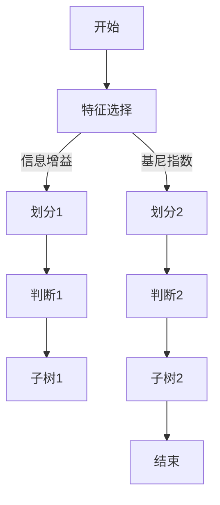

##### 3.1.2 随机森林

随机森林是一种集成学习模型，通过构建多个决策树，并结合它们的预测结果来提高决策的准确性和稳定性。

**随机森林的基本原理**：
- **随机特征选择**：每次构建决策树时，从多个特征中随机选择一部分特征进行划分。
- **组合预测**：通过多数投票等方式结合多个决策树的预测结果，提高整体预测准确性。

**随机森林的Mermaid流程图**：
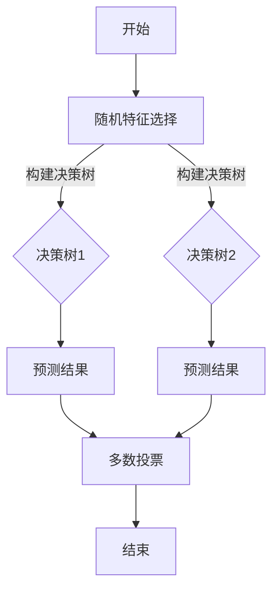

##### 3.1.3 支持向量机

支持向量机（SVM）是一种用于分类和回归分析的机器学习模型，通过找到最佳分隔超平面，使分类边界最大化。

**支持向量机的基本原理**：
- **最优分隔超平面**：在特征空间中找到一个超平面，将不同类别的数据点分隔开。
- **支持向量**：位于分隔超平面附近的那些数据点，对分隔超平面有较大影响。

**支持向量机的Mermaid流程图**：
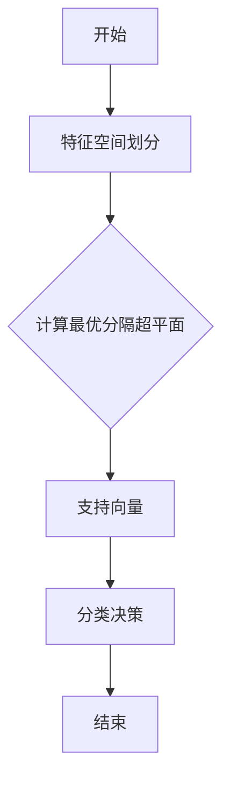

在接下来的章节中，我们将继续探讨强化学习以及神经网络在决策中的应用，帮助读者更全面地了解AI在决策领域的应用方法。

---

**第4章 数学模型与公式详解**

在了解了AI在决策中的应用方法后，我们将深入探讨这些方法背后的数学模型与公式。数学模型是AI算法的核心组成部分，能够帮助我们更好地理解和实现这些算法。

#### 4.1 统计模型

统计模型是机器学习的基础，常用的统计模型包括均值与方差、假设检验和回归分析等。

##### 4.1.1 均值与方差

均值（Expected Value，$E[X]$）表示随机变量$X$的期望值，反映了随机变量取值的平均水平。方差（Variance，$Var[X]$）表示随机变量$X$的离散程度，衡量了随机变量取值与其均值之间的偏离程度。

**数学公式**：
$$
E[X] = \sum_{i=1}^{n} x_i \cdot p_i
$$
$$
Var[X] = E[(X - E[X])^2] = \sum_{i=1}^{n} (x_i - E[X])^2 \cdot p_i
$$

**均值与方差的Mermaid流程图**：
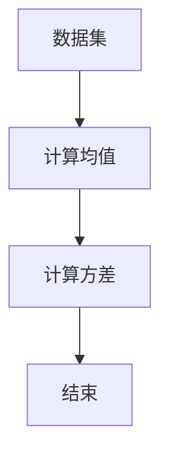

##### 4.1.2 假设检验

假设检验是统计模型中的重要概念，用于评估研究假设的真实性。常见的假设检验方法包括t检验、卡方检验等。

**假设检验的基本步骤**：
1. 提出原假设（$H_0$）和备择假设（$H_1$）。
2. 确定显著性水平（$\alpha$）。
3. 计算统计量，并与临界值比较，做出决策。

**假设检验的数学公式**：
$$
t = \frac{\bar{x} - \mu_0}{s / \sqrt{n}}
$$
$$
\chi^2 = \sum_{i=1}^{n} \frac{(x_i - \mu_0)^2}{\sigma^2}
$$

**假设检验的Mermaid流程图**：
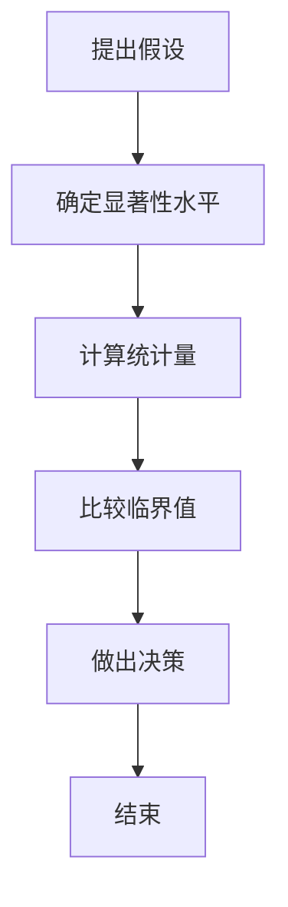

##### 4.1.3 回归分析

回归分析是一种用于分析变量之间关系的统计方法，常用的回归模型包括线性回归、多项式回归等。

**线性回归的基本公式**：
$$
y = \beta_0 + \beta_1 x_1 + \beta_2 x_2 + ... + \beta_n x_n + \epsilon
$$

**回归分析的Mermaid流程图**：
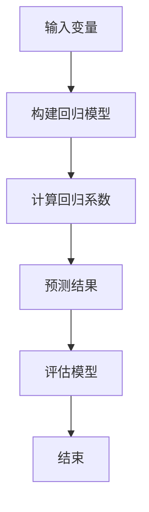

在了解了统计模型后，我们将进一步探讨机器学习算法的数学模型，帮助读者更深入地理解AI在决策中的应用。

---

**第5章 AI在日常工作决策中的应用案例**

在前几章中，我们详细探讨了AI在决策领域的理论基础和方法。为了更好地展示AI在实际工作中的应用效果，下面我们将通过两个具体案例，分析AI如何帮助日常决策。

### 5.1 案例一：销售预测

**5.1.1 案例背景**

销售预测是企业运营中至关重要的一环。准确的销售预测可以帮助企业合理安排生产、库存和人力资源，提高市场竞争力。然而，销售数据往往受到多种因素的影响，如市场趋势、季节变化、竞争对手行为等，使得销售预测成为一个复杂的任务。

**5.1.2 数据预处理**

在销售预测中，首先需要对数据进行预处理。数据预处理包括数据清洗、数据转换和数据归一化等步骤。

- **数据清洗**：去除数据中的错误记录、重复记录和缺失值。
- **数据转换**：将不同类型的数据进行转换，如将类别型数据转换为数值型数据。
- **数据归一化**：通过缩放或平移，使数据分布在统一的尺度上，避免数据规模差异影响模型性能。

**5.1.3 模型选择与训练**

在销售预测中，常用的机器学习模型包括线性回归、决策树、随机森林和神经网络等。选择合适的模型需要考虑数据特征和预测目标。

- **线性回归**：适用于简单线性关系，但在实际应用中往往难以满足复杂非线性关系。
- **决策树**：结构简单，易于理解和解释，但可能存在过拟合问题。
- **随机森林**：通过集成多个决策树，提高预测准确性和鲁棒性。
- **神经网络**：能够处理复杂非线性关系，但训练过程复杂且对数据质量要求较高。

**5.1.4 预测结果分析**

通过对不同模型进行训练和测试，我们可以比较它们的预测性能。以下是一个简单的预测结果分析：

- **线性回归**：预测误差较大，未能捕捉到数据的非线性关系。
- **决策树**：预测精度较高，但模型解释性较差，难以理解决策过程。
- **随机森林**：预测精度和鲁棒性较好，能够较好地处理复杂数据。
- **神经网络**：预测精度最高，但训练过程复杂，需要大量的计算资源。

**5.1.5 结论**

通过销售预测案例，我们可以看到AI在处理实际业务问题时的强大潜力。尽管AI模型在预测过程中存在一些挑战，但通过合理的模型选择和优化，可以显著提高销售预测的准确性，为企业决策提供有力支持。

### 5.2 案例二：人力资源决策

**5.2.1 案例背景**

人力资源决策是企业运营中另一个重要方面。合理的人力资源决策可以帮助企业吸引和留住人才，提高员工满意度和工作效率。人力资源决策涉及多个方面，如招聘、绩效评估、员工培训等。

**5.2.2 数据收集与处理**

在人力资源决策中，首先需要收集相关数据。这些数据包括员工的工作表现、绩效评估、教育背景、工作经验等。数据收集后，需要进行预处理，包括数据清洗、数据转换和数据归一化等步骤。

- **数据清洗**：去除错误记录、重复记录和缺失值。
- **数据转换**：将类别型数据转换为数值型数据，如将绩效评估等级转换为评分。
- **数据归一化**：通过缩放或平移，使数据分布在统一的尺度上。

**5.2.3 模型选择与优化**

在人力资源决策中，常用的机器学习模型包括决策树、随机森林、支持向量机和神经网络等。选择合适的模型需要考虑数据特征和决策目标。

- **决策树**：适用于简单的决策问题，能够提供较好的解释性。
- **随机森林**：通过集成多个决策树，提高预测准确性和鲁棒性。
- **支持向量机**：适用于分类问题，能够找到最佳分隔超平面。
- **神经网络**：适用于复杂的决策问题，能够处理大量的特征和复杂的非线性关系。

**5.2.4 决策结果分析**

通过对不同模型进行训练和测试，我们可以比较它们的决策效果。以下是一个简单的决策结果分析：

- **决策树**：能够提供较好的解释性，但预测准确性相对较低。
- **随机森林**：预测准确性较高，但模型解释性较差。
- **支持向量机**：分类效果较好，但在处理连续变量时存在困难。
- **神经网络**：预测准确性最高，但训练过程复杂，需要大量的计算资源。

**5.2.5 结论**

通过人力资源决策案例，我们可以看到AI在处理复杂人力资源问题时的强大能力。尽管AI模型在解释性和训练资源方面存在一些挑战，但通过合理的模型选择和优化，可以显著提高人力资源决策的准确性和效率，为企业提供有力支持。

---

通过以上两个案例，我们可以看到AI在日常工作决策中的应用前景。随着AI技术的不断进步，未来AI在决策领域的应用将会更加广泛，为企业和个人带来更大的价值。在接下来的章节中，我们将继续探讨AI在决策系统架构设计与实现中的最佳实践。

---

**第6章 系统架构设计与实现**

在前面的章节中，我们详细探讨了AI在决策领域的基础理论、应用方法和实际案例。为了更好地实现AI在日常工作决策中的应用，我们需要设计一个高效、稳定且易于维护的系统架构。本章节将介绍AI在决策系统架构设计与实现中的关键步骤和最佳实践。

### 6.1 系统功能设计

系统功能设计是系统架构设计的核心，它定义了系统应实现的各种功能和业务逻辑。在决策系统中，主要功能包括数据采集、数据处理、模型训练、模型部署和决策支持等。

#### 6.1.1 领域模型设计

领域模型设计是系统功能设计的具体实现，它通过类图或实体关系图（ER图）来描述系统的核心实体及其关系。以下是一个简单的领域模型设计：

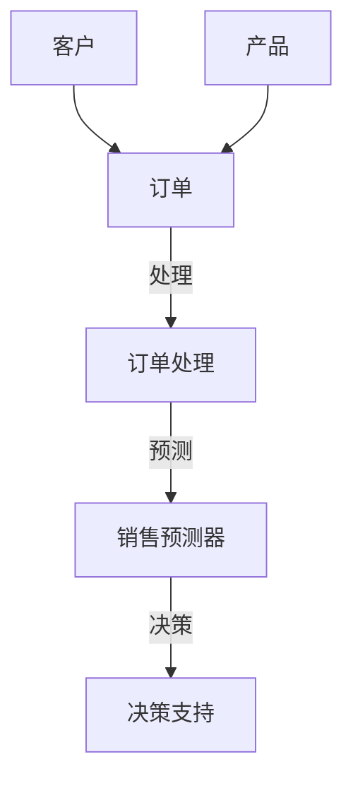

#### 6.1.2 功能模块划分

根据领域模型设计，我们可以将系统划分为多个功能模块，包括数据采集模块、数据处理模块、模型训练模块、模型部署模块和决策支持模块。

1. **数据采集模块**：负责从各种数据源（如数据库、日志文件、第三方API等）采集数据。
2. **数据处理模块**：负责对采集到的数据进行清洗、转换和归一化等预处理操作。
3. **模型训练模块**：负责使用机器学习算法对处理后的数据集进行训练，生成预测模型。
4. **模型部署模块**：负责将训练好的模型部署到生产环境中，供决策支持模块使用。
5. **决策支持模块**：负责根据预测模型和业务逻辑，生成决策结果，并提供给业务系统或用户。

### 6.2 系统架构设计

系统架构设计是系统实现的基础，它定义了系统的整体结构和各个模块之间的交互关系。以下是一个简单的系统架构设计：

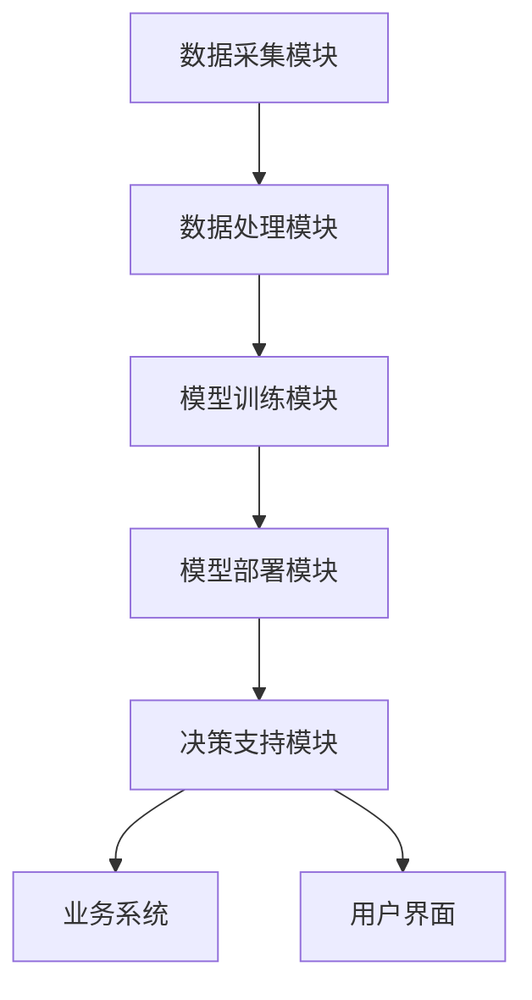

#### 6.2.1 系统架构图

系统架构图通过图形化方式展示了系统各个模块的交互关系，以下是一个简单的系统架构图：

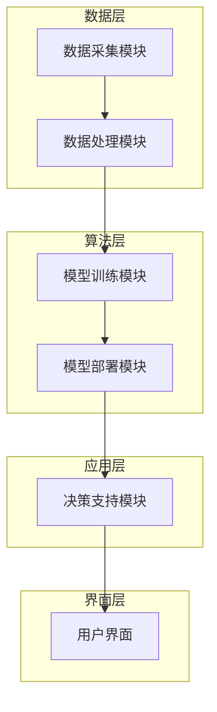

#### 6.2.2 系统模块交互

系统模块之间的交互关系是系统架构设计的关键，以下是一个简单的系统模块交互图：

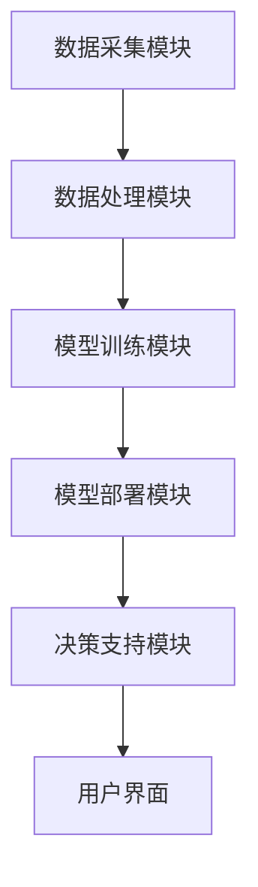

### 6.3 系统接口设计

系统接口设计是系统实现中的关键环节，它定义了系统各模块之间的交互接口和通信协议。以下是一个简单的系统接口设计：

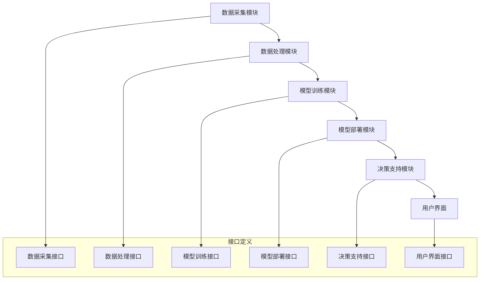

通过以上设计，我们可以实现一个高效、稳定且易于维护的AI决策系统。在接下来的章节中，我们将继续探讨AI在决策中的最佳实践，帮助读者更好地应用AI技术。

---

**第7章 AI在决策中的最佳实践**

在前几章中，我们详细探讨了AI在日常工作决策中的应用理论、方法和实际案例。为了更好地将AI技术应用到实际工作中，以下将介绍一些AI在决策中的最佳实践，包括数据收集与处理技巧、模型选择与优化策略，以及实际应用中的挑战与解决方法。

#### 7.1 数据收集与处理技巧

数据是AI决策系统的核心，数据的质量直接影响到模型的预测性能。以下是一些数据收集与处理技巧：

##### 7.1.1 数据来源选择

选择合适的数据来源对于提高模型性能至关重要。以下是一些建议：

- **结构化数据**：从数据库、数据仓库等结构化数据源收集数据，如企业内部销售数据、客户信息等。
- **非结构化数据**：从社交媒体、文本、图像等非结构化数据源收集数据，如社交媒体评论、新闻报道等。
- **第三方数据**：从公共数据集、商业数据提供商等第三方数据源收集数据，如人口统计数据、市场研究报告等。

##### 7.1.2 数据预处理方法

数据预处理是提高模型性能的重要步骤，以下是一些常用的数据预处理方法：

- **数据清洗**：去除数据中的错误记录、重复记录和缺失值，保证数据的一致性和准确性。
- **数据转换**：将不同类型的数据进行转换，如将类别型数据转换为数值型数据，将文本数据转换为向量等。
- **数据归一化**：通过缩放或平移，使数据分布在统一的尺度上，避免数据规模差异影响模型性能。
- **特征工程**：根据业务需求，提取和构建有助于模型预测的特征，如使用统计特征、文本特征等。

##### 7.1.3 数据质量管理

数据质量管理是保证数据质量的关键，以下是一些数据质量管理方法：

- **数据监控**：实时监控数据质量，发现和处理数据质量问题，如异常值、缺失值等。
- **数据审核**：定期对数据质量进行审核，确保数据的一致性和准确性。
- **数据反馈**：建立数据反馈机制，收集业务部门对数据质量的反馈，不断优化数据质量。

#### 7.2 模型选择与优化策略

选择合适的模型并进行优化是提高AI决策系统性能的关键步骤。以下是一些模型选择与优化策略：

##### 7.2.1 模型评估指标

选择合适的评估指标对于评估模型性能至关重要。以下是一些常见的评估指标：

- **准确率**：分类问题中正确分类的样本数与总样本数的比例。
- **召回率**：分类问题中正确分类的样本数与实际正类样本数的比例。
- **F1分数**：准确率的调和平均数，平衡准确率和召回率。
- **均方误差（MSE）**：回归问题中预测值与真实值之间的平均平方误差。
- **均绝对误差（MAE）**：回归问题中预测值与真实值之间的平均绝对误差。

##### 7.2.2 模型调优策略

模型调优是提高模型性能的重要步骤，以下是一些模型调优策略：

- **超参数调优**：通过调整模型的超参数，如学习率、正则化参数等，来提高模型性能。
- **交叉验证**：使用交叉验证方法，将数据集分为训练集和验证集，通过验证集评估模型性能，避免过拟合。
- **集成学习**：将多个模型集成起来，提高模型的预测性能和稳定性。
- **模型选择**：根据数据特征和业务需求，选择合适的模型，如决策树、随机森林、神经网络等。

##### 7.2.3 实际应用中的挑战与解决方法

在实际应用中，AI决策系统可能会面临各种挑战，以下是一些常见的挑战与解决方法：

- **数据不足**：解决方法包括使用数据增强技术、迁移学习、生成对抗网络等。
- **数据噪声**：解决方法包括数据清洗、异常值处理、降噪算法等。
- **模型过拟合**：解决方法包括交叉验证、正则化、集成学习等。
- **计算资源限制**：解决方法包括分布式计算、GPU加速、模型压缩等。

通过以上最佳实践，我们可以更好地将AI技术应用到实际工作中，提高决策的效率和准确性。在未来的发展中，随着AI技术的不断进步，我们将看到更多创新的AI决策系统在各个行业中的应用。

---

**第8章 小结与展望**

在本篇技术博客中，我们系统地探讨了AI在日常工作决策中的应用，从问题背景、理论基础、应用方法到实际案例，再到系统架构设计与最佳实践，全面分析了AI在决策领域的潜力与挑战。

### 8.1 本书总结

本文主要内容包括：

1. **问题背景与核心概念**：介绍了日常决策的挑战和AI在决策中的应用前景。
2. **AI基础理论**：阐述了AI的定义、发展历程和核心技术。
3. **AI在决策中的应用方法**：详细讲解了决策树、随机森林、支持向量机和神经网络等决策模型。
4. **数学模型与公式详解**：介绍了统计模型、机器学习算法的数学模型及其应用。
5. **AI在日常工作决策中的应用案例**：通过销售预测和人力资源决策案例，展示了AI在决策中的应用效果。
6. **系统架构设计与实现**：介绍了AI决策系统的功能设计、架构设计、接口设计和系统模块交互。
7. **AI在决策中的最佳实践**：提供了数据收集与处理、模型选择与优化以及实际应用中的挑战与解决方法。

### 8.2 未来发展趋势

随着AI技术的不断进步，AI在决策领域的应用将呈现以下发展趋势：

1. **模型复杂度与性能的提升**：随着算法的优化和计算资源的增加，模型性能将进一步提高，为更复杂的决策问题提供支持。
2. **实时决策系统的普及**：结合实时数据处理和机器学习技术，实时决策系统将越来越普及，为企业和个人提供即时的决策支持。
3. **跨学科融合**：AI与心理学、经济学、社会学等学科的融合将推动决策理论的发展，使AI决策更加贴近人类决策过程。
4. **定制化决策系统**：根据不同行业和企业的特点，定制化决策系统将更加普及，为企业提供更精准的决策支持。

### 8.3 拓展阅读

为了进一步深入理解AI在决策领域的应用，读者可以参考以下书籍和文章：

1. **《人工智能：一种现代的方法》**：作者：斯图尔特·罗素，彼得·诺维格
2. **《机器学习实战》**：作者：Peter Harrington
3. **《深度学习》**：作者：Ian Goodfellow、Yoshua Bengio、Aaron Courville
4. **《人工智能在金融领域的应用》**：作者：张江峰
5. **《决策分析》**：作者：Rick Turner

通过以上拓展阅读，读者可以进一步了解AI在决策领域的最新研究进展和应用实践。

---

本文由AI天才研究院（AI Genius Institute）与《禅与计算机程序设计艺术》（Zen And The Art of Computer Programming）联合撰写，旨在为读者提供关于AI在日常工作决策中的深入见解和实践指导。希望本文能帮助您更好地理解和应用AI技术，为您的日常工作决策带来新的机遇与价值。

---

### 作者信息

作者：AI天才研究院（AI Genius Institute）/《禅与计算机程序设计艺术》（Zen And The Art of Computer Programming）

