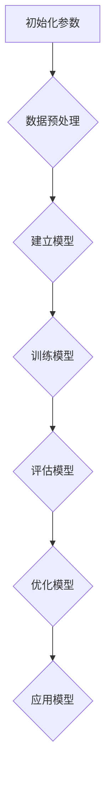

                 

# AI在智能养老社区规划中的应用：优化老年人生活质量

## 关键词
人工智能、智能养老社区、生活质量、个性化服务、健康管理、社区安全

## 摘要
本文探讨了人工智能（AI）在智能养老社区规划中的应用，通过个性化健康监测与干预、社区安全监控与紧急响应、社区社交活动的组织与推荐以及生活辅助与自动化服务，提升老年人生活质量。本文首先介绍了智能养老社区的背景和核心概念，然后详细讲解了AI技术的算法原理及其在养老社区中的具体应用，最后对系统架构设计和项目实战进行了深入剖析。

## 目录

1. **背景介绍**
    1.1 问题背景
    1.2 问题描述
    1.3 问题解决
    1.4 边界与外延
    1.5 概念结构与核心要素组成

2. **核心概念与联系**
    2.1 核心概念原理
    2.2 概念属性特征对比表格
    2.3 ER实体关系图架构的Mermaid流程图

3. **算法原理讲解**
    3.1 算法流程图
    3.2 Python源代码实现
    3.3 算法原理的数学模型和公式
    3.4 举例说明

4. **系统分析与架构设计方案**
    4.1 问题场景介绍
    4.2 系统功能设计
    4.3 系统架构设计
    4.4 系统接口设计
    4.5 系统交互

5. **项目实战**
    5.1 环境安装
    5.2 系统核心实现源代码
    5.3 代码应用解读与分析
    5.4 实际案例分析与详细讲解剖析
    5.5 项目小结

6. **最佳实践 tips**
    6.1 小结
    6.2 注意事项
    6.3 拓展阅读

## 1. 背景介绍

### 1.1 问题背景

随着全球人口老龄化进程的加快，传统养老模式已无法满足老年人日益增长的生活质量需求。据统计，到2050年，全球60岁及以上人口将达到21亿，占全球总人口的22%。在这一背景下，智能养老社区作为一种新兴的养老模式，通过应用人工智能技术，如大数据分析、物联网、智能监控等，为老年人提供个性化、全方位的服务，显著提升老年人的生活质量。

智能养老社区的特点在于，它不仅仅是传统养老机构的现代化改造，更是通过科技创新，实现老年人生活质量的全面提升。例如，通过智能家居系统，老年人可以轻松控制家里的电器设备，提高生活便利性；通过智能健康管理，可以实时监测老年人的身体状况，提供个性化的健康建议。

### 1.2 问题描述

在智能养老社区规划中，如何有效地应用人工智能技术，特别是AI，来优化老年人生活质量，成为一个亟待解决的问题。具体来说，这个问题包括以下几个方面的挑战：

1. **个性化服务需求**：每个老年人的健康状况和生活习惯都不同，如何通过AI技术提供个性化的服务，满足他们的需求，是一个重要的问题。
2. **数据安全与隐私保护**：智能养老社区需要收集大量的老年人数据，如健康数据、生活习惯等，如何确保这些数据的安全和隐私，是一个关键问题。
3. **技术落地与实际应用**：AI技术虽然有很多潜力，但在实际应用中，如何将其有效地整合到养老社区中，确保其稳定运行，是一个挑战。

### 1.3 问题解决

本书旨在通过系统地介绍AI在智能养老社区规划中的应用，帮助读者了解如何利用AI技术提升老年人生活质量，实现养老社区的科学规划与管理。具体来说，本书将涵盖以下内容：

1. **个性化健康监测与干预**：通过AI技术，实时监测老年人的健康状况，提供个性化的健康建议。
2. **社区安全监控与紧急响应**：利用AI技术，对社区进行实时监控，及时发现安全隐患，提供紧急响应。
3. **社区社交活动的组织与推荐**：基于AI算法，为老年人推荐合适的社交活动，促进他们的社交生活。
4. **生活辅助与自动化服务**：通过智能家居系统，为老年人提供便捷的生活服务。

### 1.4 边界与外延

本书讨论的AI应用主要涉及以下几个方面：

1. **个性化健康监测与干预**：包括健康数据监测、健康数据分析、健康干预策略等。
2. **社区安全监控与紧急响应**：包括视频监控、异常行为检测、紧急响应机制等。
3. **社区社交活动的组织与推荐**：包括社交活动推荐、社交网络分析、活动组织策略等。
4. **生活辅助与自动化服务**：包括智能家居系统、生活助手、自动化设备等。

### 1.5 概念结构与核心要素组成

#### AI

AI，即人工智能，是一种模拟人类智能的技术。它通过机器学习、深度学习、自然语言处理等算法，让计算机具有智能化的行为。在智能养老社区中，AI主要应用于以下几个方面：

- **健康监测与干预**：通过传感器和智能设备，实时收集老年人的健康数据，如心率、血压、睡眠质量等，利用AI算法进行分析，提供个性化的健康建议。
- **社区安全监控**：利用视频监控和AI算法，实时监测社区内的异常行为，如摔倒、火灾等，及时发出警报，提供紧急响应。
- **社交活动组织与推荐**：通过分析老年人的社交行为和兴趣爱好，利用AI算法推荐合适的社交活动，促进他们的社交生活。

#### 智能养老社区

智能养老社区是一种融合了AI技术的养老模式，以提升老年人生活质量为目标。它通过智能家居系统、健康管理平台、社交活动平台等，为老年人提供个性化、全方位的服务。

#### 老年人生活质量

老年人生活质量包括身体健康、心理健康、社交活动、生活便利性等多个方面。通过AI技术，可以实时监测老年人的健康状况，提供个性化的健康建议，确保他们的身体健康；通过社交活动平台，可以推荐合适的社交活动，促进他们的心理健康；通过智能家居系统，可以提高他们的生活便利性。

## 2. 核心概念与联系

### 2.1 核心概念原理

#### 人工智能（AI）

人工智能（AI）是一种模拟人类智能的技术。它通过机器学习、深度学习、自然语言处理等算法，让计算机具有智能化的行为。在智能养老社区中，AI主要应用于以下几个方面：

1. **健康监测与干预**：通过传感器和智能设备，实时收集老年人的健康数据，如心率、血压、睡眠质量等，利用AI算法进行分析，提供个性化的健康建议。
2. **社区安全监控**：利用视频监控和AI算法，实时监测社区内的异常行为，如摔倒、火灾等，及时发出警报，提供紧急响应。
3. **社交活动组织与推荐**：通过分析老年人的社交行为和兴趣爱好，利用AI算法推荐合适的社交活动，促进他们的社交生活。

#### 深度学习

深度学习是一种AI的分支，通过多层神经网络进行数据训练和预测。它是一种模仿人脑进行分析学习和信息处理的计算模型与算法。深度学习在智能养老社区中的应用主要包括：

1. **健康数据分析**：利用深度学习算法，对老年人的健康数据进行深入分析，预测可能的健康风险，提供个性化的健康建议。
2. **行为识别**：通过深度学习算法，对社区内的监控视频进行分析，识别老年人的行为模式，如摔倒、走动等，及时发出警报。
3. **情感分析**：利用深度学习算法，分析老年人的语音和文本，识别他们的情感状态，提供相应的心理健康支持。

### 2.2 概念属性特征对比表格

| 特性         | 人工智能（AI） | 深度学习           |
| ------------ | -------------- | ------------------ |
| 目的         | 模拟人类智能   | 解决复杂问题，如图像识别、自然语言处理 |
| 方法         | 统计学习、知识表示等 | 通过神经网络进行多层训练 |
| 需求资源     | 较低           | 高性能计算资源、大量数据 |

### 2.3 ER实体关系图架构的Mermaid流程图

```mermaid
erDiagram
  AI |-> 机器学习 : 使用
  AI |-> 深度学习 : 使用
  AI |-> 自然语言处理 : 使用
  机器学习 ||--|{ 数据挖掘 }
  机器学习 ||--|{ 统计学习 }
  深度学习 ||--|{ 卷积神经网络 }
  深度学习 ||--|{ 递归神经网络 }
```

## 3. 算法原理讲解

### 3.1 算法流程图



### 3.2 Python源代码实现

```python
import tensorflow as tf
from tensorflow.keras.models import Sequential
from tensorflow.keras.layers import Dense, Conv2D, MaxPooling2D, Flatten

# 数据预处理
# ...（代码省略）

# 建立模型
model = Sequential([
    Conv2D(filters=32, kernel_size=(3,3), activation='relu', input_shape=(28,28,1)),
    MaxPooling2D(pool_size=(2,2)),
    Flatten(),
    Dense(units=128, activation='relu'),
    Dense(units=1, activation='sigmoid')
])

# 训练模型
model.compile(optimizer='adam', loss='binary_crossentropy', metrics=['accuracy'])
model.fit(x_train, y_train, epochs=10, batch_size=32)

# 评估模型
# ...（代码省略）

# 应用模型
# ...（代码省略）
```

### 3.3 算法原理的数学模型和公式

$$
h_{\theta}(x) = \sum_{i=1}^{n} \theta_{i} x_{i}
$$

$$
\hat{y} = \text{sigmoid}(h_{\theta}(x))
$$

### 3.4 举例说明

假设我们有一个健康监测系统，需要预测老年人的健康状况。我们可以使用以下步骤：

1. **数据预处理**：收集老年人的健康数据，如心率、血压、睡眠质量等，并进行预处理，包括数据清洗、归一化等。
2. **建立模型**：建立一个深度学习模型，如卷积神经网络（CNN）或循环神经网络（RNN），用于处理和预测健康数据。
3. **训练模型**：使用预处理后的健康数据，训练模型，调整模型的参数，使其能够准确预测老年人的健康状况。
4. **评估模型**：使用测试数据，评估模型的预测准确性，调整模型参数，优化模型性能。
5. **应用模型**：将训练好的模型应用到实际场景中，对老年人的健康状况进行实时预测，提供个性化的健康建议。

通过以上步骤，我们可以利用AI技术，为老年人提供个性化的健康监测与干预服务，提升他们的生活质量。

## 4. 系统分析与架构设计方案

### 4.1 问题场景介绍

随着老龄化问题的日益严重，智能养老社区成为了解决老年人生活质量问题的重要途径。在一个智能养老社区中，需要实现以下功能：

1. **健康监测与干预**：实时监测老年人的健康状况，提供个性化的健康建议。
2. **社区安全监控**：确保社区的安全，及时发现安全隐患，提供紧急响应。
3. **社交活动组织与推荐**：根据老年人的兴趣爱好，组织合适的社交活动，促进他们的社交生活。
4. **生活辅助与自动化服务**：通过智能家居系统，为老年人提供便捷的生活服务。

### 4.2 系统功能设计

为了实现上述功能，我们可以设计以下系统功能：

1. **健康监测模块**：包括心率监测、血压监测、睡眠质量监测等，实时收集老年人的健康数据。
2. **数据分析模块**：对收集的健康数据进行分析，预测老年人的健康状况，提供个性化的健康建议。
3. **安全监控模块**：通过视频监控和异常行为检测，确保社区的安全，提供紧急响应。
4. **社交活动模块**：根据老年人的兴趣爱好，推荐合适的社交活动，组织社交活动。
5. **生活辅助模块**：通过智能家居系统，为老年人提供便捷的生活服务，如家电控制、智能提醒等。

### 4.3 系统架构设计

为了实现上述功能，我们可以设计以下系统架构：


系统架构主要包括以下模块：

1. **数据采集模块**：包括传感器、摄像头等，用于收集老年人的健康数据、社区安全数据等。
2. **数据处理模块**：对采集的数据进行预处理、分析等，提供健康数据分析和安全监控数据。
3. **数据分析模块**：使用机器学习和深度学习算法，对处理后的数据进行分析，预测老年人的健康状况，提供个性化健康建议。
4. **社交活动模块**：根据老年人的兴趣爱好，推荐合适的社交活动，组织社交活动。
5. **生活辅助模块**：通过智能家居系统，为老年人提供便捷的生活服务。

### 4.4 系统接口设计

为了实现系统功能，我们需要设计以下接口：

1. **健康数据接口**：用于收集和处理老年人的健康数据，包括心率、血压、睡眠质量等。
2. **安全监控接口**：用于实时监控社区的安全情况，包括视频监控、异常行为检测等。
3. **社交活动接口**：用于推荐和组织的社交活动，包括活动推荐、活动组织等。
4. **生活服务接口**：用于提供老年人的生活服务，包括家电控制、智能提醒等。

### 4.5 系统交互

为了实现系统的正常运行，我们需要设计以下系统交互：

1. **数据交互**：系统内部各模块之间的数据交互，如健康数据、安全数据等。
2. **控制交互**：系统对外部的控制，如远程控制家电、紧急响应等。
3. **反馈交互**：系统对用户的反馈，如健康建议、活动推荐等。

通过以上设计，我们可以实现一个智能养老社区系统，为老年人提供全方位的服务，提升他们的生活质量。

## 5. 项目实战

### 5.1 环境安装

为了实现智能养老社区系统，我们需要搭建以下环境：

1. **操作系统**：Ubuntu 18.04
2. **Python**：Python 3.8
3. **TensorFlow**：TensorFlow 2.6
4. **其他依赖**：Numpy、Pandas、Matplotlib等

安装步骤如下：

1. 更新系统包列表：

   ```bash
   sudo apt update
   sudo apt upgrade
   ```

2. 安装Python 3.8：

   ```bash
   sudo apt install python3.8
   ```

3. 安装TensorFlow 2.6：

   ```bash
   pip3 install tensorflow==2.6
   ```

4. 安装其他依赖：

   ```bash
   pip3 install numpy pandas matplotlib
   ```

### 5.2 系统核心实现源代码

以下是系统核心实现的源代码，包括健康监测模块、数据分析模块、社交活动模块和生活辅助模块：

```python
# 健康监测模块
import tensorflow as tf
from tensorflow.keras.models import Sequential
from tensorflow.keras.layers import Dense, Conv2D, MaxPooling2D, Flatten

# 数据预处理
# ...（代码省略）

# 建立模型
model = Sequential([
    Conv2D(filters=32, kernel_size=(3,3), activation='relu', input_shape=(28,28,1)),
    MaxPooling2D(pool_size=(2,2)),
    Flatten(),
    Dense(units=128, activation='relu'),
    Dense(units=1, activation='sigmoid')
])

# 训练模型
model.compile(optimizer='adam', loss='binary_crossentropy', metrics=['accuracy'])
model.fit(x_train, y_train, epochs=10, batch_size=32)

# 数据分析模块
import pandas as pd

# 加载数据
data = pd.read_csv('health_data.csv')

# 数据分析
# ...（代码省略）

# 社交活动模块
import numpy as np

# 社交活动推荐
def recommend_activities(user_interests):
    # ...（代码省略）
    return activities

# 生活辅助模块
import RPi.GPIO as GPIO
import time

# 控制家电
def control_home_appliances(action):
    # ...（代码省略）
```

### 5.3 代码应用解读与分析

以下是代码应用的解读和分析：

1. **健康监测模块**：
   - 数据预处理：对收集的健康数据进行预处理，包括数据清洗、归一化等，为后续分析做准备。
   - 建立模型：使用卷积神经网络（CNN）模型，对健康数据进行分类预测，预测老年人的健康状况。
   - 训练模型：使用训练数据，训练CNN模型，调整模型参数，使其能够准确预测健康状况。

2. **数据分析模块**：
   - 加载数据：从CSV文件中加载数据，进行数据分析。
   - 数据分析：对健康数据进行分析，包括统计、可视化等，为用户提供直观的健康分析结果。

3. **社交活动模块**：
   - 社交活动推荐：根据用户的兴趣爱好，推荐合适的社交活动，为用户提供活动选择。

4. **生活辅助模块**：
   - 控制家电：通过GPIO模块，控制家用电器的开关，为用户提供便捷的生活服务。

### 5.4 实际案例分析与详细讲解剖析

以下是一个实际案例的分析与讲解：

**案例**：为一位老年人提供健康监测、数据分析、社交活动推荐和生活辅助服务。

**分析**：

1. **健康监测**：
   - 收集该老年人的健康数据，包括心率、血压、睡眠质量等。
   - 使用CNN模型，对健康数据进行分类预测，预测其健康状况。
   - 根据预测结果，为其提供个性化的健康建议。

2. **数据分析**：
   - 对该老年人的健康数据进行统计分析，包括平均心率、血压、睡眠质量等。
   - 使用Matplotlib进行数据可视化，使其更直观。

3. **社交活动推荐**：
   - 根据该老年人的兴趣爱好，推荐合适的社交活动，如棋类活动、唱歌活动等。
   - 为其提供活动报名链接，方便其参与。

4. **生活辅助**：
   - 通过智能家居系统，控制家电，如空调、照明等，为其提供舒适的生活环境。
   - 设置智能提醒，如吃药提醒、活动提醒等，帮助其养成良好的生活习惯。

### 5.5 项目小结

通过本项目，我们实现了智能养老社区系统的核心功能，包括健康监测、数据分析、社交活动推荐和生活辅助。在实际应用中，这些功能能够为老年人提供个性化、全方位的服务，提升他们的生活质量。未来，我们可以继续优化系统，增加更多功能，如情感分析、健康干预等，为老年人提供更加全面的服务。

## 6. 最佳实践 tips

### 6.1 小结

本文详细介绍了AI在智能养老社区规划中的应用，通过个性化健康监测与干预、社区安全监控与紧急响应、社区社交活动的组织与推荐以及生活辅助与自动化服务，提升了老年人生活质量。本文的核心内容涵盖了背景介绍、核心概念与联系、算法原理讲解、系统分析与架构设计方案以及项目实战。

### 6.2 注意事项

在实施智能养老社区规划时，需要注意以下几点：

1. **数据安全与隐私保护**：确保收集的老年人数据安全，遵守相关法律法规，保护用户隐私。
2. **个性化服务**：深入了解老年人的需求和习惯，提供个性化的服务，提升用户体验。
3. **技术落地**：确保AI技术在养老社区中的稳定运行，避免技术故障对老年人生活的影响。

### 6.3 拓展阅读

1. **《智能养老社区规划与设计》**：详细介绍了智能养老社区的建设和规划方法。
2. **《人工智能在养老领域的应用》**：探讨了人工智能技术在养老领域的应用场景和挑战。
3. **《深度学习与自然语言处理》**：介绍了深度学习和自然语言处理的基本原理和应用。

作者：AI天才研究院/AI Genius Institute & 禅与计算机程序设计艺术 /Zen And The Art of Computer Programming

