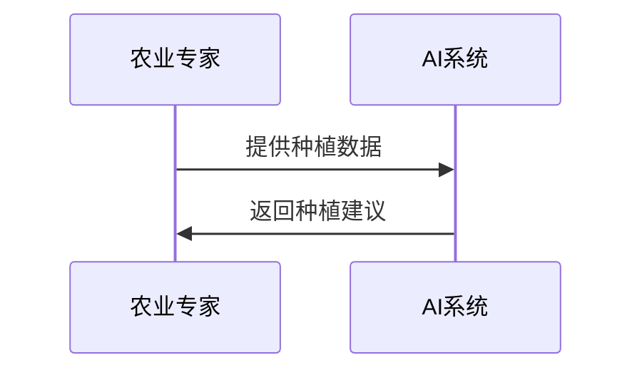
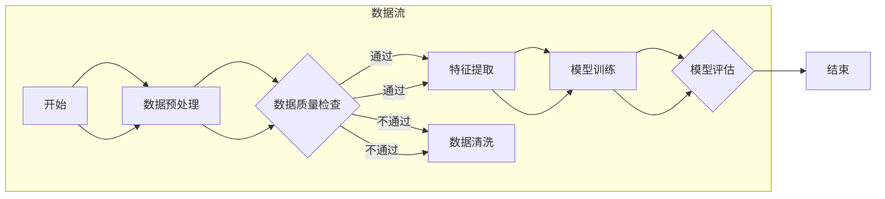
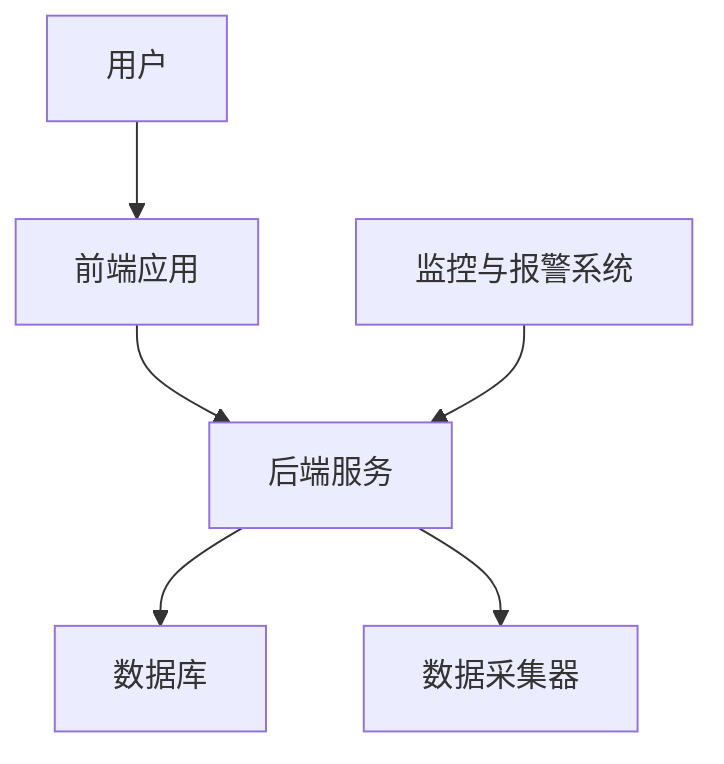
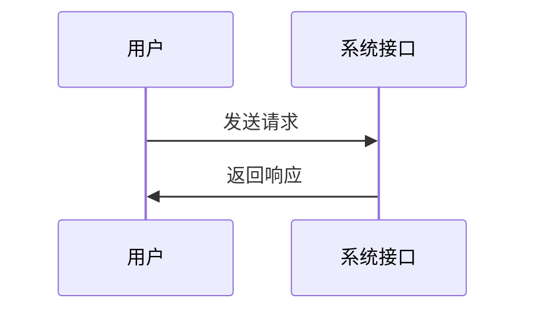

                 

### 《AI在智能农业中的角色：从种植决策到收获优化》

> 关键词：AI、智能农业、种植决策、收获优化、气象数据、土壤数据、植物生长监测、收获时间、效率、伦理问题

> 摘要：随着全球人口的不断增长，传统农业面临巨大的挑战，需要提高产量和资源利用效率。人工智能（AI）在这一背景下发挥着重要作用，通过数据分析和预测，从种植决策到收获优化，为智能农业提供了全新的解决方案。本文将深入探讨AI在智能农业中的应用，分析其核心概念、原理、方法以及面临的挑战，为未来智能农业的发展提供有益的参考。

### 第一部分：问题背景与概述

#### 第1章：智能农业的发展与现状

##### 1.1.1 智能农业的起源与历史背景

智能农业的概念最早起源于20世纪80年代，随着信息技术和自动化技术的发展，农业领域开始探索如何利用高科技手段提高农业生产效率和产品质量。在过去的几十年里，智能农业经历了从初步探索到快速发展，再到如今逐步成熟的过程。

早期，智能农业主要集中在机械化和自动化领域，如自动灌溉系统、无人机喷洒农药等。随着物联网、大数据、云计算、人工智能等新兴技术的应用，智能农业开始向更加智能化、精细化的方向发展。现在，智能农业已经成为全球农业发展的热点领域，各国纷纷投入大量资源进行研究和实践。

##### 1.1.2 智能农业的当前发展状况

智能农业的发展主要表现在以下几个方面：

1. **精准农业**：通过卫星遥感、无人机等设备，实现对农田土壤、作物生长状况的实时监测，提供精准的种植、灌溉、施肥等管理建议。

2. **智能灌溉**：利用传感器和智能控制系统，根据土壤水分和气象条件，实现精准灌溉，提高水资源利用效率。

3. **智能种植**：利用人工智能算法，对作物生长过程进行预测和优化，提高产量和产品质量。

4. **智能收获**：利用机器人、无人机等设备，实现高效、精准的作物收获，降低劳动成本。

5. **农业经济管理**：通过大数据分析和人工智能预测，优化农业生产和销售策略，提高经济效益。

##### 1.1.3 智能农业的主要挑战与机遇

智能农业在发展过程中面临着一些挑战，如技术成本高、数据安全、农民接受度低等。然而，随着技术的进步和政策的支持，智能农业也迎来了广阔的发展机遇。例如，我国政府高度重视智能农业的发展，出台了一系列政策措施，鼓励农业企业、科研机构和技术供应商积极参与智能农业的研究和推广。

#### 第2章：AI在农业中的应用概述

##### 2.1.1 AI技术在农业中的潜力

AI技术在农业中的应用具有巨大的潜力，主要体现在以下几个方面：

1. **数据处理和分析**：农业数据量大且复杂，AI技术可以高效地处理和分析这些数据，提供准确的种植、灌溉、施肥等建议。

2. **预测和优化**：通过机器学习算法，AI可以预测作物生长趋势，优化农业生产过程，提高产量和产品质量。

3. **自动化和机器人化**：AI技术可以推动农业机械化和自动化的发展，降低劳动成本，提高生产效率。

4. **经济管理**：通过大数据分析和预测，AI可以帮助农业生产者制定科学的种植和销售策略，提高经济效益。

##### 2.1.2 AI技术在不同农业领域的应用实例

AI技术在农业领域的应用非常广泛，以下列举几个典型的应用实例：

1. **精准农业**：利用卫星遥感、无人机等设备，监测农田土壤、作物生长状况，提供精准的种植、灌溉、施肥等建议。

2. **智能灌溉**：通过传感器和智能控制系统，根据土壤水分和气象条件，实现精准灌溉，提高水资源利用效率。

3. **智能种植**：利用人工智能算法，对作物生长过程进行预测和优化，提高产量和产品质量。

4. **智能收获**：利用机器人、无人机等设备，实现高效、精准的作物收获，降低劳动成本。

5. **农业经济管理**：通过大数据分析和人工智能预测，优化农业生产和销售策略，提高经济效益。

##### 2.1.3 AI技术的挑战与限制

尽管AI技术在农业领域具有巨大潜力，但在实际应用过程中仍面临一些挑战和限制：

1. **技术成本**：AI技术需要大量硬件设备和软件支持，成本较高，对于一些小规模农业生产者来说，可能难以承受。

2. **数据安全**：农业数据涉及农民的种植计划、产量等敏感信息，数据安全风险较大。

3. **农民接受度**：部分农民对新技术的接受度较低，需要加强培训和宣传，提高农民的接受度。

4. **技术稳定性**：AI技术在农业环境下的稳定性仍需提高，以避免因技术故障导致农业生产受损。

### 第二部分：AI在种植决策中的应用

#### 第3章：气象数据与种植策略

##### 3.1.1 气象数据的重要性

气象数据对于农业生产具有重要意义，它直接影响作物的生长、发育和产量。通过收集和分析气象数据，农业生产者可以更好地了解气候变化对作物的影响，从而制定合理的种植策略。

气象数据包括温度、湿度、降水量、风速、光照等参数。这些数据可以通过气象站、卫星遥感、无人机等设备进行收集。

##### 3.1.2 利用AI进行气象数据分析和预测

AI技术可以高效地处理和分析大量气象数据，通过机器学习算法，实现对气象数据的预测和分析。以下是一些常见的AI技术应用：

1. **气象数据预测**：利用时间序列预测模型，如ARIMA、LSTM等，对气象数据进行预测。

2. **气象灾害预警**：通过异常检测算法，如孤立森林、隔离森林等，对气象数据进行异常检测，实现对气象灾害的预警。

3. **气候适应性分析**：利用多模型融合技术，如贝叶斯模型融合、深度学习等，对气象数据进行融合和分析，评估不同气候条件下的作物适应性。

##### 3.1.3 气象数据驱动的种植决策

基于AI的气象数据分析结果，农业生产者可以制定合理的种植策略，包括：

1. **种植时机**：根据气象预测结果，选择最佳种植时机，避免因气象条件不适宜导致作物生长受阻。

2. **灌溉管理**：根据气象数据，合理调整灌溉时间、灌溉量和灌溉方式，提高水资源利用效率。

3. **病虫害防治**：根据气象预测结果，提前预防病虫害的发生，减少农药使用量。

#### 第4章：土壤数据与种植策略

##### 4.1.1 土壤数据的基本概念

土壤数据是农业生产的重要基础数据，它反映了土壤的物理、化学和生物特性。土壤数据包括土壤类型、土壤肥力、土壤水分、土壤温度等参数。

土壤数据可以通过土壤采样、传感器监测、无人机遥感等方式进行收集。

##### 4.1.2 土壤数据监测技术

土壤数据监测技术主要包括以下几种：

1. **土壤采样**：通过人工或机械设备，从农田中采集土壤样本，进行实验室分析。

2. **土壤传感器**：利用各种类型的传感器，如电导率传感器、pH传感器、土壤水分传感器等，实时监测土壤参数。

3. **无人机遥感**：利用无人机搭载的高分辨率成像设备，获取农田土壤图像，进行图像分析。

##### 4.1.3 土壤数据驱动的种植决策

基于土壤数据的分析结果，农业生产者可以制定以下种植策略：

1. **施肥管理**：根据土壤肥力数据，合理调整施肥量、施肥时间和施肥方式，提高肥料利用效率。

2. **灌溉管理**：根据土壤水分数据，合理调整灌溉时间、灌溉量和灌溉方式，提高水资源利用效率。

3. **土壤改良**：根据土壤数据，采取适当的土壤改良措施，如增施有机肥、改良土壤结构等，提高土壤肥力和土壤质量。

#### 第5章：植物生长监测与预测

##### 5.1.1 植物生长监测技术

植物生长监测技术主要包括以下几种：

1. **植物表型监测**：通过植物表型监测设备，如植物表型成像系统、植物生长分析仪器等，实时监测植物的生长状况。

2. **植物生理监测**：通过植物生理监测设备，如光合作用仪、气体分析仪等，监测植物的生理指标，如光合速率、呼吸速率、水分含量等。

3. **植物遥感监测**：利用遥感技术，如卫星遥感、无人机遥感等，获取农田植物的光谱信息，进行植物生长状态分析。

##### 5.1.2 植物生长预测模型

植物生长预测模型主要包括以下几种：

1. **基于统计学的模型**：如线性回归、多元回归、时间序列分析等，通过历史数据建立预测模型。

2. **基于机器学习的模型**：如决策树、随机森林、支持向量机等，通过训练数据集，学习植物生长规律，实现预测。

3. **基于深度学习的模型**：如卷积神经网络、循环神经网络等，通过大规模数据训练，实现对植物生长的精准预测。

##### 5.1.3 生长监测数据驱动的种植决策

基于植物生长监测数据，农业生产者可以制定以下种植策略：

1. **生长调控**：根据植物生长数据，调整种植密度、种植方式等，实现植物生长的最佳状态。

2. **病虫害防治**：根据植物生长数据，预测病虫害发生的可能性，提前采取防治措施。

3. **灌溉管理**：根据植物生长数据，合理调整灌溉时间、灌溉量和灌溉方式，满足植物生长需求。

### 第三部分：AI在农业收获优化中的应用

#### 第6章：收获时间优化

##### 6.1.1 收获时间优化的重要性

收获时间是农业生产中的重要环节，直接影响到作物的产量和品质。通过优化收获时间，可以最大限度地提高作物产量和经济效益。

收获时间优化的关键因素包括作物的生长状况、气象条件、市场需求等。

##### 6.1.2 利用AI进行收获时间预测

AI技术可以高效地分析大量历史数据和实时数据，实现对收获时间的预测。以下是一些常见的AI技术应用：

1. **时间序列预测**：利用时间序列预测模型，如ARIMA、LSTM等，对收获时间进行预测。

2. **回归模型**：利用回归模型，如线性回归、多项式回归等，分析作物生长状况和气象条件对收获时间的影响。

3. **多因素预测**：结合多种数据源，如气象数据、作物生长数据、市场价格等，进行多因素预测。

##### 6.1.3 收获时间优化策略

基于AI的收获时间预测结果，农业生产者可以制定以下收获时间优化策略：

1. **提前收获**：根据预测结果，提前收获作物，避免因晚收导致产量和品质下降。

2. **错峰收获**：根据预测结果，合理安排不同作物的收获时间，避免市场供应过剩，提高市场价格。

3. **实时调整**：根据实时监测数据，及时调整收获时间，确保作物在最佳状态时收获。

#### 第7章：收获效率优化

##### 7.1.1 收获效率优化的方法

收获效率优化是提高农业生产效益的重要途径。以下是一些常见的收获效率优化方法：

1. **机械化收获**：利用机械设备，如联合收割机、摘果机等，实现快速、高效地收获。

2. **智能化收获**：利用智能设备，如无人机、机器人等，实现自动化、精准地收获。

3. **精细化管理**：根据作物生长状况和气象条件，制定科学的收获计划，实现精细化管理。

##### 7.1.2 收获效率优化的AI应用实例

AI技术在收获效率优化中的应用非常广泛，以下列举几个典型的应用实例：

1. **无人机收获**：利用无人机搭载的摄像头和传感器，实现农田的实时监测，根据作物成熟度和生长状况，制定最优收获计划。

2. **机器人收获**：利用机器人技术，实现自动化、智能化地收获，降低劳动成本，提高收获效率。

3. **数据驱动的收获策略**：利用AI技术，分析大量历史数据和实时数据，制定科学的收获策略，提高收获效率。

##### 7.1.3 收获效率优化的挑战与解决方案

收获效率优化面临一些挑战，如设备稳定性、数据准确性等。以下是一些常见的挑战和解决方案：

1. **设备稳定性**：提高设备的可靠性，通过定期维护和保养，确保设备正常运行。

2. **数据准确性**：提高数据采集和处理技术，通过多源数据融合，提高数据准确性。

3. **技术培训**：加强农民的技术培训，提高他们对AI技术的理解和应用能力。

### 第四部分：案例分析与研究

#### 第8章：AI在智能农业中的成功案例

##### 8.1.1 案例一：智能灌溉系统

智能灌溉系统通过传感器和智能控制技术，实现对农田灌溉的实时监测和智能控制，提高水资源利用效率。该系统在多个地区得到了成功应用，取得了显著的节水效果。

##### 8.1.2 案例二：精准种植技术

精准种植技术利用遥感技术、地理信息系统等，对农田进行精确管理和种植。该技术在多个作物种植中取得了良好的效果，提高了产量和品质。

##### 8.1.3 案例三：智能收获系统

智能收获系统利用机器人、无人机等设备，实现自动化、高效地收获。该系统在水果、蔬菜等作物收获中得到了广泛应用，提高了收获效率。

### 第五部分：未来展望

#### 第9章：AI在智能农业中的未来趋势

##### 9.1.1 未来技术展望

随着人工智能技术的不断发展，智能农业将迎来新的发展机遇。未来，AI技术在智能农业中的应用将更加深入和广泛，包括：

1. **精准农业**：通过更先进的遥感技术和智能监测设备，实现农田的全面监测和精准管理。

2. **智能化设备**：研发更加智能化的农业机械设备，提高农业生产效率。

3. **区块链技术**：利用区块链技术，实现农业生产和销售环节的信息透明化和数据安全。

##### 9.1.2 智能农业面临的挑战与机遇

智能农业在发展过程中将面临一系列挑战，如技术成本、数据安全、农民接受度等。然而，随着技术的进步和政策的支持，智能农业也迎来了广阔的发展机遇。未来，智能农业将更加注重可持续发展，推动农业绿色转型。

##### 9.1.3 未来智能农业的发展方向

未来智能农业的发展方向包括：

1. **智能化种植**：利用AI技术，实现从种植到收获的全程智能化管理。

2. **智慧农业园区**：建设智慧农业园区，实现农业生产的全方位智能监测和管理。

3. **农业物联网**：构建农业物联网，实现农业生产环节的信息互联互通。

### 第六部分：智能农业的伦理与社会影响

#### 第10章：智能农业的伦理问题

##### 10.1.1 智能农业的伦理问题

智能农业在发展过程中，面临着一系列伦理问题，如数据隐私、农民权益等。如何确保智能农业的可持续发展，保障农民的权益，是未来智能农业发展的重要课题。

##### 10.1.2 智能农业对社会的潜在影响

智能农业将对社会产生深远的影响，包括：

1. **农业生产方式的变革**：智能农业将推动农业生产方式的变革，实现农业生产的全程智能化。

2. **农民就业结构的调整**：随着智能农业的发展，部分传统农业岗位将消失，农民的就业结构将发生重大变化。

3. **农业产业链的重构**：智能农业将推动农业产业链的重构，实现农业生产的全流程高效运行。

##### 10.1.3 智能农业的可持续发展策略

为了实现智能农业的可持续发展，需要采取以下策略：

1. **政策支持**：政府应加大对智能农业的政策支持力度，鼓励农业企业、科研机构和技术供应商积极参与智能农业的研究和推广。

2. **技术创新**：不断推动人工智能、物联网等技术在农业领域的应用，提高农业生产效率和产品质量。

3. **农民培训**：加强农民的技术培训，提高他们对智能农业技术的理解和应用能力。

### 总结

智能农业作为农业现代化的重要方向，正日益受到广泛关注。AI技术在智能农业中的应用，为农业生产带来了革命性的变化。从种植决策到收获优化，AI技术为农业生产提供了智能化、精细化的解决方案。然而，智能农业的发展仍面临一系列挑战，需要政策支持、技术创新和农民培训等多方面的努力。

未来，随着人工智能技术的不断进步，智能农业将迎来更加广阔的发展前景。在推动农业生产方式变革的同时，也需要关注智能农业的伦理问题和社会影响，确保智能农业的可持续发展。

通过本文的探讨，我们希望能够为读者提供一个全面、系统的智能农业概述，为智能农业的研究和应用提供有益的参考。

### 作者信息

**作者：AI天才研究院/AI Genius Institute & 禅与计算机程序设计艺术 /Zen And The Art of Computer Programming**

本文由AI天才研究院/AI Genius Institute与禅与计算机程序设计艺术/Zen And The Art of Computer Programming共同撰写，旨在深入探讨AI在智能农业中的应用，为智能农业的发展提供有益的思考和建议。

---

### 附录

#### 数学公式与图表

在本篇技术博客中，我们将使用LaTeX和Mermaid来展示数学公式和图表。以下是几个示例：

##### 段落内的LaTeX公式示例

$$
E = mc^2
$$

$1 < 2$

##### Mermaid图表示例

以下是一个Mermaid序列图示例：



#### 算法原理讲解

##### 算法流程图



##### Python源代码示例

```python
# 导入必要的库
import numpy as np
from sklearn.linear_model import LinearRegression

# 准备训练数据
X_train = np.array([[1], [2], [3], [4], [5]])
y_train = np.array([2, 4, 6, 8, 10])

# 创建线性回归模型
model = LinearRegression()

# 训练模型
model.fit(X_train, y_train)

# 预测结果
y_pred = model.predict(X_train)

# 打印预测结果
print("预测结果：", y_pred)
```

#### 系统架构设计

##### 系统架构图



#### 系统接口设计



通过附录部分，我们希望能够为读者提供更加直观和详细的技术讲解，帮助理解本文的核心概念和算法原理。同时，附录中的代码和图表也便于读者在实际应用中进行参考和复现。

