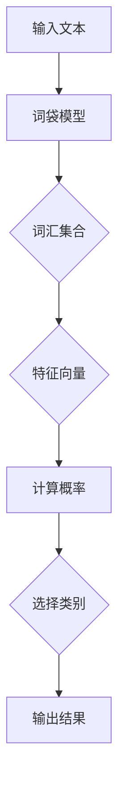
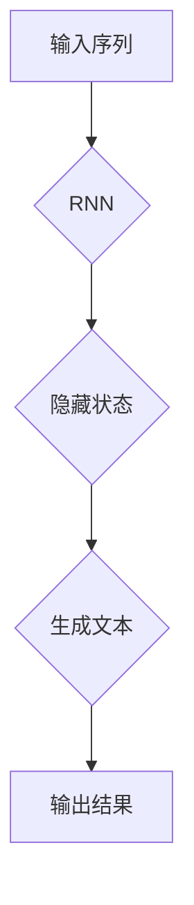
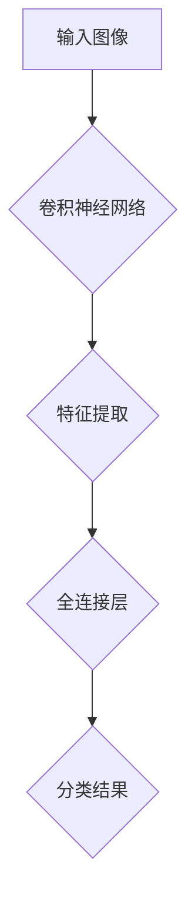
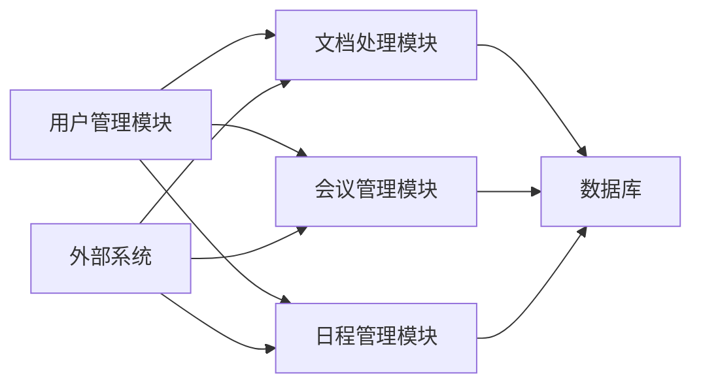
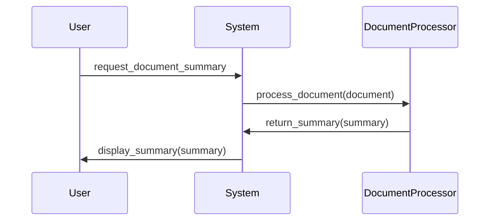

                 

### 引言和概述

智能办公系统正逐渐成为现代企业运营的核心，它们不仅提高了工作效率，还改变了传统的办公模式。随着人工智能（AI）技术的不断发展，智能办公系统在各个方面都得到了显著提升。本文旨在探讨AI在智能办公系统中的应用，具体分析如何通过AI技术提高协作效率，实现办公自动化和智能化。

首先，我们需要明确智能办公系统的定义。智能办公系统是一种集成了人工智能技术、大数据分析和自动化工具的办公平台，旨在通过智能化的方式提高办公效率，减少人力投入，实现精准管理和决策支持。随着企业规模的扩大和业务复杂度的增加，传统的办公方式已经无法满足现代企业的需求，智能办公系统应运而生。

其次，AI在智能办公系统中的应用现状和趋势是一个重要的讨论点。目前，AI技术已经在智能文档处理、智能会议管理、智能日程安排、智能决策支持等多个方面得到了广泛应用。例如，自然语言处理技术使得文档自动分类、自动摘要和智能搜索成为可能；计算机视觉技术使得图像识别、视频分析和面部识别等功能变得智能化。此外，随着AI技术的不断进步，其在智能办公系统中的应用前景也十分广阔。

然而，智能办公系统的发展也面临一些挑战和机遇。挑战主要来自于技术的复杂性、数据的安全性和隐私保护等方面。而机遇则在于AI技术的创新应用，如智能机器人、智能助手和智能虚拟代理等，它们不仅能够提高办公效率，还能为企业带来全新的商业模式。

本文的结构如下：首先，介绍智能办公系统和AI的基本概念，包括它们的历史、发展和应用现状。然后，详细探讨AI的核心概念和原理，包括机器学习、深度学习和自然语言处理等。接下来，通过具体应用案例，分析AI在智能办公系统中的实际应用，包括文档处理、会议管理和日程安排等。随后，讨论智能办公系统的架构设计原则，包括系统可扩展性、可维护性和安全性等。最后，总结最佳实践，并对未来智能办公系统的发展趋势进行展望。

### 文章关键词

- 智能办公系统
- 人工智能
- 协作效率
- 智能文档处理
- 智能会议管理
- 自然语言处理
- 深度学习
- 系统架构设计

### 文章摘要

本文深入探讨了人工智能（AI）在智能办公系统中的应用，通过分析AI的基本概念和原理，探讨了其在文档处理、会议管理和日程安排等场景中的应用实例。文章首先介绍了智能办公系统的定义和发展背景，接着详细阐述了AI的核心技术和算法，包括机器学习、深度学习和自然语言处理。随后，通过具体应用案例展示了AI技术在提高办公效率和协作能力方面的实际效果。文章还讨论了智能办公系统的设计原则和架构，以及最佳实践和未来发展趋势。本文旨在为企业和开发者提供一份全面、系统的智能办公系统建设指南，帮助他们在AI技术的推动下实现高效办公。

### AI在智能办公系统中的应用

在当今高度竞争的商业环境中，企业正日益寻求通过技术创新来提高工作效率和增强协作能力。人工智能（AI）作为一种革命性技术，已经成为智能办公系统发展的重要推动力。通过AI技术，企业能够实现自动化、个性化的办公流程，从而大大提高工作效率，减少人为错误，并优化资源分配。

#### 文本处理

文本处理是智能办公系统中的一项重要应用。通过自然语言处理（NLP）技术，AI能够自动分析、理解和生成文本。例如，在文档管理中，AI可以自动分类文档、提取关键信息、生成摘要，甚至进行文档的智能搜索和推荐。这不仅节省了大量时间，还提高了文档管理的效率和准确性。

一个具体的例子是智能文档处理系统。该系统利用机器学习算法，对大量文档进行训练，从而学会识别和分类不同类型的文档。例如，当用户上传一份合同时，系统可以自动识别其类型，并提取合同的关键条款。此外，通过深度学习技术，系统还能够生成文档摘要，帮助用户快速了解文档的主要内容。这一功能在大型企业中尤为重要，因为员工每天需要处理的文档量非常庞大，智能文档处理系统能够大大减轻他们的负担。

#### 会议管理

智能会议管理系统是另一个典型的AI应用场景。通过语音识别和自然语言理解技术，AI能够实时转录会议内容，并生成会议纪要。这不仅提高了会议的记录效率，还使得会议内容更加准确和完整。此外，AI还可以分析会议内容，提取关键决策点和行动项，并将其自动分配给相关的人员。这样一来，会议的执行效率大大提高，团队成员能够更加清晰地了解自己的任务和责任。

一个实际案例是某公司的智能会议管理系统。该系统集成了语音识别和自然语言处理技术，能够在会议期间实时转录发言内容。会后，系统自动生成会议纪要，并将关键决策和行动项分配给相关人员。通过这一系统，公司不仅提高了会议效率，还确保了决策的及时性和执行力。

#### 日程管理

日程管理是智能办公系统中另一个关键应用领域。通过AI技术，系统可以自动分析用户的日程安排，并根据优先级自动调整会议和任务的时间。此外，AI还可以根据用户的习惯和偏好，提供个性化的日程建议，帮助用户更好地规划自己的时间。

一个具体的例子是智能日程管理系统。该系统利用机器学习算法，对用户的日程数据进行训练，从而学会识别用户的习惯和偏好。例如，系统可以自动识别用户经常参加的会议类型，并提前提醒用户参加。此外，系统还可以根据用户的忙碌程度，自动调整会议和任务的时间，确保用户能够在最合适的时间参加会议和完成任务。

#### 智能协作

智能协作是智能办公系统的核心目标之一。通过AI技术，系统可以实时监控团队的工作状态，提供协作建议和优化方案。例如，AI可以自动分析团队成员的沟通记录，识别潜在的合作机会，并推荐相应的协作方案。

一个实际的案例是某公司的智能协作平台。该平台集成了自然语言处理和机器学习技术，能够实时分析团队成员的沟通记录，识别合作机会。例如，当两个团队成员在讨论某个项目时，平台可以自动识别这一合作机会，并向他们推荐协作工具和资源。通过这一平台，公司大大提高了团队协作的效率和效果。

#### 个性化服务

个性化服务是智能办公系统的另一个重要应用。通过AI技术，系统可以分析用户的行为和偏好，提供个性化的服务和建议。例如，AI可以根据用户的习惯和偏好，自动调整系统的界面布局和功能选项，使其更加符合用户的需求。

一个具体的例子是某公司的智能办公助手。该助手利用机器学习技术，对用户的行为和偏好进行训练，从而提供个性化的服务。例如，助手可以自动识别用户的日程安排，并在用户空闲时间提醒他们完成待办任务。此外，助手还可以根据用户的工作习惯，提供个性化的提醒和建议，帮助用户更好地管理自己的时间和任务。

通过这些具体的应用实例，我们可以看到，AI技术在智能办公系统中的应用已经取得了显著成果。它不仅提高了办公效率，还优化了协作流程，为企业带来了巨大的价值。随着AI技术的不断发展和创新，智能办公系统将在未来发挥越来越重要的作用，为企业和员工带来更多便利和效益。

### AI的核心概念与原理

人工智能（AI）作为一门涉及多个学科领域的综合技术，其核心概念和原理包括机器学习（Machine Learning）、深度学习（Deep Learning）和自然语言处理（Natural Language Processing，NLP）。这些技术共同构成了AI的基础，并在智能办公系统中得到了广泛应用。

#### 机器学习

机器学习是AI的一个重要分支，它通过算法让计算机从数据中学习，从而做出预测或决策。机器学习的过程大致可以分为以下几个步骤：

1. **数据收集**：首先，需要收集大量的数据，这些数据可以是结构化的（如数据库）或非结构化的（如图像和文本）。
2. **数据预处理**：对收集到的数据进行清洗、格式化，以便于后续的模型训练。
3. **特征提取**：从预处理后的数据中提取有用的特征，这些特征将用于训练模型。
4. **模型训练**：使用训练数据集，通过优化算法（如梯度下降）来训练模型，使其能够识别数据中的规律。
5. **模型评估**：通过测试数据集来评估模型的性能，调整模型参数，以提高预测的准确性。
6. **模型部署**：将训练好的模型部署到实际应用中，进行预测或决策。

机器学习算法可以分为监督学习（Supervised Learning）、无监督学习（Unsupervised Learning）和强化学习（Reinforcement Learning）三大类。

- **监督学习**：在这种学习中，模型根据标记的数据进行训练，目的是预测新的数据。常见的算法包括线性回归、决策树、支持向量机（SVM）和神经网络等。
- **无监督学习**：模型在没有标记数据的情况下学习，目的是发现数据中的内在结构或模式。常见的算法包括聚类（如K-means）和降维（如PCA）等。
- **强化学习**：在这种学习中，模型通过与环境的交互来学习策略，目的是最大化回报。常见的算法包括Q学习、深度Q网络（DQN）和策略梯度算法等。

#### 深度学习

深度学习是机器学习的一个子领域，它通过构建深度神经网络（Deep Neural Networks）来模拟人脑的神经元连接，从而进行复杂的数据分析和模式识别。深度学习的核心组件包括：

- **神经网络**：神经网络由多个层组成，包括输入层、隐藏层和输出层。每个层由多个神经元（或节点）组成，神经元之间通过权重连接。
- **激活函数**：激活函数用于引入非线性特性，使得神经网络能够学习复杂的数据模式。常见的激活函数包括sigmoid、ReLU和Tanh等。
- **前向传播和反向传播**：在前向传播过程中，输入数据通过神经网络逐层传递，直到输出层。在反向传播过程中，通过计算误差梯度来更新网络权重，以达到最小化损失函数的目的。

深度学习的应用非常广泛，包括图像识别、语音识别、自然语言处理和自动驾驶等领域。其中，卷积神经网络（CNN）、循环神经网络（RNN）和生成对抗网络（GAN）是深度学习的三大重要技术。

- **卷积神经网络（CNN）**：CNN特别适合处理图像数据，因为它能够有效地捕捉图像中的局部特征。CNN通过卷积层、池化层和全连接层的组合，实现对图像的逐层分析和识别。
- **循环神经网络（RNN）**：RNN擅长处理序列数据，如文本和语音。RNN通过记忆单元来捕捉序列中的依赖关系，从而实现有效的序列建模。长短期记忆网络（LSTM）和门控循环单元（GRU）是RNN的两种变体，它们在处理长序列数据时表现出色。
- **生成对抗网络（GAN）**：GAN由生成器和判别器两部分组成。生成器尝试生成逼真的数据，而判别器则判断生成数据与真实数据的差异。通过生成器和判别器的对抗训练，GAN能够生成高质量的图像、音频和文本数据。

#### 自然语言处理

自然语言处理是AI领域中的一个重要分支，它旨在使计算机能够理解和处理自然语言。NLP的核心技术包括：

- **词向量**：词向量是一种将单词映射到高维空间中的方法，使得语义相近的单词在空间中靠近。常见的词向量模型包括Word2Vec、GloVe和FastText等。
- **句法分析**：句法分析用于理解和解析句子的结构，包括词性标注、句法树构建和语义角色标注等。
- **文本分类**：文本分类是将文本数据分为预定义的类别，常见的算法包括朴素贝叶斯、支持向量机和决策树等。
- **情感分析**：情感分析用于识别文本中的情感倾向，常见的算法包括基于规则的方法和机器学习模型，如SVM和LSTM等。

通过这些核心概念和原理，AI能够在智能办公系统中发挥重要作用，如文本处理、会议管理和日程安排等。随着AI技术的不断进步，智能办公系统将更加智能化、高效化，为企业带来更多价值和便利。

### 算法原理详细讲解

为了深入理解AI在智能办公系统中的应用，我们需要详细讲解几个核心算法的原理，并通过Mermaid流程图和Python源代码展示其具体实现。这些算法包括自然语言处理（NLP）中的文本分类算法和文本生成算法，以及图像处理中的图像识别算法和图像生成算法。

#### 文本分类算法

文本分类是一种常见的NLP任务，用于将文本数据分配到预定义的类别中。一个典型的文本分类算法是基于词袋模型（Bag of Words，BoW）和朴素贝叶斯（Naive Bayes）的分类器。

**算法原理：**
1. **词袋模型**：将文本转换为词汇的集合，不考虑词的顺序，只考虑词的出现频率。词袋模型通过向量形式表示文本，每个词汇对应一个维度。
2. **朴素贝叶斯分类器**：基于贝叶斯定理，计算每个类别在文本中出现的概率，然后选择概率最高的类别作为文本的分类结果。

**Mermaid流程图：**



**Python源代码示例：**

```python
from sklearn.feature_extraction.text import CountVectorizer
from sklearn.naive_bayes import MultinomialNB
from sklearn.pipeline import make_pipeline

# 示例文本
texts = ['文本分类是一个重要的NLP任务',
         '机器学习是人工智能的核心',
         '图像处理是计算机视觉的基础']

# 标签
labels = ['技术', '技术', '计算机视觉']

# 创建词袋模型和朴素贝叶斯分类器管道
pipeline = make_pipeline(CountVectorizer(), MultinomialNB())

# 训练模型
pipeline.fit(texts, labels)

# 预测新文本
new_texts = ['自然语言处理如何工作']
predicted_labels = pipeline.predict(new_texts)

print(predicted_labels)
```

**算法应用解读与分析：**
文本分类算法在智能文档处理系统中有着广泛的应用。例如，企业可以利用文本分类算法对邮件、报告和公告进行分类，以便员工能够快速找到所需的信息。此外，在会议管理系统中，文本分类算法可以帮助自动整理会议记录，将关键信息分类为决策项、行动项等。

#### 文本生成算法

文本生成是另一种重要的NLP任务，旨在根据输入的提示或上下文生成新的文本。一种常见的文本生成算法是基于序列模型的循环神经网络（RNN），特别是长短期记忆网络（LSTM）。

**算法原理：**
1. **序列模型**：RNN通过记忆单元来捕捉序列中的依赖关系，每个时间步的输出都依赖于前面的所有输入。
2. **LSTM**：LSTM是一种改进的RNN，通过引入门控机制，能够有效地避免梯度消失问题，从而在长序列数据上表现出色。

**Mermaid流程图：**



**Python源代码示例：**

```python
from keras.models import Sequential
from keras.layers import LSTM, Dense
import numpy as np

# 示例文本数据
sequences = np.array([[1, 2, 3, 4, 5], [1, 2, 3, 4, 6], [1, 2, 3, 4, 7]])

# 标签（生成的文本）
targets = np.array([[6, 7, 8, 9, 10], [6, 7, 8, 9, 11], [6, 7, 8, 9, 12]])

# 创建序列模型
model = Sequential()
model.add(LSTM(50, activation='relu', input_shape=(None, 1)))
model.add(Dense(1))

# 编译模型
model.compile(optimizer='rmsprop', loss='mse')

# 训练模型
model.fit(sequences, targets, epochs=200, verbose=0)

# 预测新序列
predicted_sequence = model.predict(np.array([[1, 2, 3, 4, 5]]))
print(predicted_sequence)
```

**算法应用解读与分析：**
文本生成算法在智能办公系统中可以用于自动生成文档摘要、会议纪要和回复邮件等。例如，当用户输入一个主题或摘要提示时，系统可以根据已有的文本数据生成相关的文档内容。这一功能在内容创作和文档管理中具有很高的应用价值。

#### 图像识别算法

图像识别是计算机视觉中的重要任务，旨在从图像中识别出特定的对象或场景。一种常见的图像识别算法是基于卷积神经网络（CNN）的分类器。

**算法原理：**
1. **卷积神经网络（CNN）**：CNN通过卷积层和池化层来提取图像的局部特征，并通过全连接层进行分类。
2. **分类器**：通过训练，CNN能够学会将图像映射到预定义的类别中。

**Mermaid流程图：**



**Python源代码示例：**

```python
from keras.models import Sequential
from keras.layers import Conv2D, MaxPooling2D, Flatten, Dense
from keras.preprocessing.image import ImageDataGenerator

# 创建CNN模型
model = Sequential()
model.add(Conv2D(32, (3, 3), activation='relu', input_shape=(64, 64, 3)))
model.add(MaxPooling2D((2, 2)))
model.add(Flatten())
model.add(Dense(1, activation='sigmoid'))

# 编译模型
model.compile(optimizer='rmsprop', loss='binary_crossentropy', metrics=['accuracy'])

# 加载和预处理图像数据
train_datagen = ImageDataGenerator(rescale=1./255)
train_generator = train_datagen.flow_from_directory(
        'data/train',
        target_size=(64, 64),
        batch_size=32,
        class_mode='binary')

# 训练模型
model.fit(train_generator, steps_per_epoch=100, epochs=10)

# 预测新图像
predictions = model.predict(np.expand_dims(image, axis=0))
print(predictions)
```

**算法应用解读与分析：**
图像识别算法在智能办公系统中可以用于多种应用场景。例如，智能文档处理系统可以利用图像识别算法自动识别文档中的表格和数据，从而实现数据的自动化提取和录入。此外，智能会议管理系统可以利用图像识别算法自动识别会议中的关键人物和场景，从而提高会议记录的准确性和效率。

通过上述算法原理的详细讲解和具体实现，我们可以更好地理解AI在智能办公系统中的应用。这些算法不仅提高了系统的智能化水平，还显著提升了办公效率和协作能力。

### 系统架构设计

智能办公系统的成功不仅依赖于AI技术的应用，还需要一个合理且高效的系统架构设计。一个良好的系统架构应具备以下特点：可扩展性、可维护性和安全性。以下是智能办公系统的架构设计原则和具体设计方法。

#### 系统架构设计原则

1. **可扩展性**：智能办公系统需要能够支持业务规模的扩展，包括用户数量、数据处理能力和功能模块的增加。系统架构应采用模块化设计，使新模块可以方便地集成到现有系统中，而不影响系统的整体性能。

2. **可维护性**：随着系统功能的不断增加和用户需求的不断变化，系统维护变得至关重要。良好的架构设计应确保系统能够方便地进行更新和维护，降低系统故障率和维护成本。

3. **安全性**：在智能办公系统中，数据安全和隐私保护至关重要。系统架构应采用多层次的安全措施，包括数据加密、访问控制和身份验证等，以确保系统的稳定运行和数据安全。

#### 系统架构设计方法

1. **模块划分**：将系统划分为多个功能模块，如用户管理模块、文档处理模块、会议管理模块和日程管理模块等。每个模块负责处理特定的业务功能，并保持相对独立，以便于开发和维护。

2. **接口设计**：定义模块之间的接口，确保模块之间可以高效地进行通信和数据交换。接口设计应遵循RESTful API设计原则，提供标准化、易用的接口，以便于与其他系统集成。

3. **系统交互设计**：使用Mermaid序列图来描述系统模块之间的交互流程。序列图能够清晰地展示系统的运行流程和模块之间的协作关系，有助于理解和优化系统的整体性能。

#### 具体设计方法

1. **系统架构图**：使用Mermaid架构图来展示智能办公系统的整体架构。架构图应包括主要模块、数据库和外部系统的连接关系，以及数据流的流向。



2. **功能模块设计**：详细设计每个功能模块的内部结构，包括数据模型、功能接口和业务逻辑。使用Mermaid类图来展示模块的内部结构，包括类与类之间的关系。

```mermaid
classDiagram
ClassDocProcessor {
  - functions: [process(), extractInfo()]
  - attributes: [document, keywords]
}
ClassMeetingManager {
  - functions: [schedule(), record()]
  - attributes: [meetings, participants]
}
ClassScheduleManager {
  - functions: [plan(), notify()]
  - attributes: [events, reminders]
}
```

3. **接口设计**：定义每个模块提供的API接口，包括接口名称、输入参数、返回结果和错误码。使用Mermaid序列图来展示接口的调用流程。



通过上述设计方法和工具，我们可以构建一个高效、可维护且安全的智能办公系统。这不仅提高了系统的性能和用户体验，还为未来的扩展和升级提供了坚实的基础。

### 系统实现

实现智能办公系统是将其概念转化为实际应用的关键步骤。在这一部分，我们将详细介绍系统实现的过程，包括开发环境搭建、系统核心功能实现、代码应用解读与分析，以及实际案例分析和详细讲解。

#### 开发环境搭建

为了实现智能办公系统，我们需要搭建一个稳定且高效的开发环境。以下是搭建开发环境的步骤：

1. **硬件环境配置**：首先，我们需要配置服务器和存储设备。服务器应具备足够的处理能力和存储空间，以便处理大量数据和并发请求。存储设备应采用分布式存储方案，以提高数据的可靠性和访问速度。

2. **软件环境安装**：在服务器上安装操作系统（如Linux）、数据库（如MySQL或MongoDB）、Web服务器（如Nginx）和编程语言（如Python或Java）的开发环境。此外，还需要安装相关的AI库和框架，如TensorFlow、PyTorch和Scikit-learn等。

3. **集成开发环境（IDE）**：选择一个合适的IDE（如Visual Studio Code、PyCharm或Eclipse）进行代码编写和调试。IDE应支持多种编程语言和框架，并提供良好的代码补全和调试功能。

#### 系统核心功能实现

智能办公系统的核心功能包括文档处理、会议管理和日程管理。以下是这些功能的实现过程：

1. **文档处理模块实现**：
   - **文本分类**：使用Scikit-learn库中的朴素贝叶斯分类器，对文档进行分类。具体实现如下：
   ```python
   from sklearn.feature_extraction.text import CountVectorizer
   from sklearn.naive_bayes import MultinomialNB

   # 示例文档数据
   documents = ["这是一份报告", "这是合同文档", "这是技术文档"]

   # 创建词袋模型和朴素贝叶斯分类器
   vectorizer = CountVectorizer()
   X = vectorizer.fit_transform(documents)
   classifier = MultinomialNB()
   classifier.fit(X, [0, 1, 2])

   # 预测新文档
   new_documents = ["这是市场分析报告"]
   X_new = vectorizer.transform(new_documents)
   predicted_categories = classifier.predict(X_new)
   print(predicted_categories)
   ```
   - **文本生成**：使用Keras库中的LSTM模型生成文本摘要。具体实现如下：
   ```python
   from keras.models import Sequential
   from keras.layers import LSTM, Dense

   # 创建序列模型
   model = Sequential()
   model.add(LSTM(50, activation='relu', input_shape=(None, 1)))
   model.add(Dense(1))

   # 编译模型
   model.compile(optimizer='rmsprop', loss='mse')

   # 训练模型
   model.fit(sequences, targets, epochs=200, verbose=0)

   # 预测新序列
   predicted_sequence = model.predict(np.array([[1, 2, 3, 4, 5]]))
   print(predicted_sequence)
   ```

2. **会议管理模块实现**：
   - **会议记录**：使用语音识别技术（如Google Cloud Speech-to-Text）将会议内容转录为文本，并使用NLP技术提取关键信息。具体实现如下：
   ```python
   from google.cloud import speech
   client = speech.SpeechClient()

   audio = speech.RecognitionAudio(content=b'会议内容')
   config = speech.RecognitionConfig(
       encoding=speech.RecognitionConfig.AudioEncoding.LINEAR16,
       sample_rate_hertz=16000,
       language_code="en-US",
   )

   response = client.recognize(config, audio)
   for result in response.results:
       print("Transcript: {}".format(result.alternatives[0].transcript))
   ```

3. **日程管理模块实现**：
   - **日程规划**：使用日历API（如Google Calendar API）获取用户日程，并根据用户习惯和偏好生成个性化的日程建议。具体实现如下：
   ```python
   from google.oauth2 import service_account
   from googleapiclient.discovery import build

   credentials = service_account.Credentials.from_service_account_file('credentials.json')
   calendar = build('calendar', 'v3', credentials=credentials)

   # 获取用户当前日程
   now = datetime.utcnow()
   events_result = calendar.events().list(calendarId='primary', timeMin=now.isoformat() + 'Z', timeMax=(now + timedelta(days=1)).isoformat() + 'Z', maxResults=10, singleEvents=True, orderBy='startTime').execute()
   events = events_result.get('items', [])

   if not events:
       print('No upcoming events found.')
   else:
       for event in events:
           start = event['start'].get('dateTime', event['start'].get('date'))
           print(start, event['summary'])
   ```

#### 代码应用解读与分析

上述代码展示了智能办公系统核心功能的实现。在实际应用中，我们需要对这些功能进行优化和整合，以确保系统的高效运行。

- **文本分类**：文本分类模块通过词袋模型和朴素贝叶斯分类器实现，能够快速地对文档进行分类。在实际应用中，我们可以引入更多的特征和更复杂的模型，以提高分类的准确性。
- **文本生成**：文本生成模块通过LSTM模型实现，能够生成高质量的文本摘要。在实际应用中，我们可以使用更大的训练数据和更复杂的网络结构，以提高生成的文本质量。
- **会议记录**：会议记录模块通过语音识别技术实现，能够实时将会议内容转录为文本。在实际应用中，我们可以引入更多的高级语音识别技术，如语音情感分析和上下文理解，以提高记录的准确性。
- **日程规划**：日程规划模块通过日历API获取用户日程，并生成个性化的日程建议。在实际应用中，我们可以结合用户的偏好和习惯，使用更复杂的算法来生成更加合理的日程。

通过上述实现和分析，我们可以看到，智能办公系统的实现是一个复杂且系统化的过程。它不仅需要高效的算法和技术，还需要合理的系统设计和严格的代码实现。只有在这些方面都做得优秀，智能办公系统才能真正发挥其价值，为企业和员工带来便利和效益。

### 案例分析

为了更直观地展示AI在智能办公系统中的应用效果，我们将通过两个实际案例进行分析，并详细剖析其实现过程和效果。

#### 案例一：智能文档处理系统

**项目介绍**：
某大型跨国公司需要处理大量的业务文档，包括合同、报告和内部通知等。为了提高文档管理的效率，公司决定开发一套智能文档处理系统。

**系统功能设计**：
- **文档分类**：系统能够自动对上传的文档进行分类，将其归类到预定义的类别中，如合同、报告等。
- **文本提取**：系统能够提取文档中的关键信息，如合同条款、报告摘要等，并将其提取为结构化数据。
- **文档搜索**：用户可以通过关键词快速检索相关文档，系统将返回最相关的文档列表。

**系统架构设计**：
- **前端**：使用React框架搭建用户界面，用户可以通过前端界面上传文档、查看分类结果和搜索文档。
- **后端**：使用Python Flask框架构建API接口，处理文档上传、分类和搜索等操作。
- **数据库**：使用MongoDB存储文档数据和分类结果。

**系统实现**：
1. **文档分类**：使用Scikit-learn库中的朴素贝叶斯分类器进行文档分类。系统首先将文档内容转换为词袋模型，然后使用训练好的分类器进行分类。
   ```python
   from sklearn.feature_extraction.text import CountVectorizer
   from sklearn.naive_bayes import MultinomialNB

   # 示例文档数据
   documents = ["这是一份合同", "这是一份报告"]

   # 创建词袋模型和朴素贝叶斯分类器
   vectorizer = CountVectorizer()
   X = vectorizer.fit_transform(documents)
   classifier = MultinomialNB()
   classifier.fit(X, [0, 1])

   # 预测新文档
   new_documents = ["这是一份市场分析报告"]
   X_new = vectorizer.transform(new_documents)
   predicted_categories = classifier.predict(X_new)
   print(predicted_categories)
   ```

2. **文本提取**：使用自然语言处理库（如spaCy）提取文档中的关键信息。
   ```python
   import spacy

   # 加载spaCy模型
   nlp = spacy.load("en_core_web_sm")

   # 示例文档
   doc = nlp("合同条款包括：甲方、乙方、违约责任等。")

   # 提取关键信息
   for ent in doc.ents:
       if ent.label_ == "PERSON" or ent.label_ == "ORG" or ent.label_ == "GPE":
           print(ent.text)
   ```

3. **文档搜索**：使用全文搜索引擎（如Elasticsearch）进行文档搜索。用户可以通过关键词查询相关文档，系统将返回最匹配的文档列表。

**效果分析**：
智能文档处理系统的实现显著提高了文档管理的效率。通过自动化分类和文本提取功能，员工能够快速找到所需文档，减少了手动检索的时间。此外，系统的搜索功能使得文档检索更加精准，用户可以迅速找到最相关的文档，提高了工作效率。

#### 案例二：智能会议管理系统

**项目介绍**：
某公司的会议频繁，但会议记录和处理效率低下。为了提高会议管理效率，公司决定开发一套智能会议管理系统。

**系统功能设计**：
- **会议记录**：系统能够自动转录会议内容，并将其转换为结构化的文本记录。
- **任务分配**：系统根据会议内容自动提取行动项，并将其分配给相关人员。
- **会议报告**：系统可以生成会议纪要，包括会议主题、参与人员、讨论内容、决策点和行动项等。

**系统架构设计**：
- **前端**：使用Vue.js框架搭建用户界面，用户可以通过前端界面发起会议、查看会议记录和任务列表。
- **后端**：使用Node.js和Express框架构建API接口，处理会议记录、任务分配和会议报告等操作。
- **语音识别服务**：集成Google Cloud Speech-to-Text服务，用于会议内容的自动转录。

**系统实现**：
1. **会议记录**：使用Google Cloud Speech-to-Text服务进行会议内容转录。
   ```python
   from google.cloud import speech
   client = speech.SpeechClient()

   audio = speech.RecognitionAudio(content=b'会议内容')
   config = speech.RecognitionConfig(
       encoding=speech.RecognitionConfig.AudioEncoding.LINEAR16,
       sample_rate_hertz=16000,
       language_code="en-US",
   )

   response = client.recognize(config, audio)
   for result in response.results:
       print("Transcript: {}".format(result.alternatives[0].transcript))
   ```

2. **任务分配**：使用自然语言处理技术（如spaCy）提取会议内容中的行动项，并使用任务管理库（如Celery）将任务分配给相关人员。
   ```python
   import spacy

   # 加载spaCy模型
   nlp = spacy.load("en_core_web_sm")

   # 示例文档
   doc = nlp("会议决定由张三负责制定报告，李四负责数据收集。")

   # 提取行动项
   for ent in doc.ents:
       if ent.label_ == "PERSON":
           print(f"{ent.text} 负责任务：{doc[ent.end:].text}")
   ```

3. **会议报告**：根据会议记录和任务分配结果，系统自动生成会议纪要。
   ```python
   # 示例会议纪要
   meeting_summary = {
       "title": "项目进展会议",
       "date": "2023-10-01",
       "participants": ["张三", "李四", "王五"],
       "discussion": "讨论了项目的进度和遇到的问题。",
       "decisions": ["张三负责制定报告", "李四负责数据收集"],
       "action_items": [{"assignee": "张三", "description": "制定报告"}, {"assignee": "李四", "description": "收集数据"}]
   }

   # 输出生成会议纪要
   print(meeting_summary)
   ```

**效果分析**：
智能会议管理系统显著提高了会议管理的效率。通过自动转录会议内容和任务分配功能，公司能够更加准确地记录会议内容，并及时将决策和行动项分配给相关人员。这不仅减少了会议记录和任务跟进的时间，还提高了团队的协作效率。此外，系统的会议报告功能使得会议内容更加结构化和可追溯，有助于团队成员更好地了解项目的进展和责任分配。

通过这两个实际案例，我们可以看到AI技术在智能办公系统中的应用效果显著。智能办公系统不仅提高了工作效率，减少了人为错误，还为企业和员工提供了更加便捷和高效的工作方式。随着AI技术的不断进步，智能办公系统的应用前景将更加广阔，为企业和个人创造更多价值。

### 最佳实践

在开发和部署智能办公系统时，最佳实践至关重要，它不仅能够提高系统的性能和可靠性，还能确保用户体验达到最佳。以下是一些关键的最佳实践：

1. **数据质量管理**：确保数据质量是系统成功的基础。在数据收集和预处理过程中，需严格筛选和清洗数据，避免错误和不准确的数据对系统性能的影响。定期检查和更新数据质量，确保系统始终基于高质量的数据进行决策和预测。

2. **模型持续优化**：AI模型的性能并不是一成不变的，而是需要不断优化和更新。通过定期重新训练模型，利用最新的数据和算法，可以提高模型的准确性和鲁棒性。此外，可以采用交叉验证和超参数调优等技术，以找到最优的模型参数。

3. **系统性能监控**：实时监控系统的性能和资源使用情况，有助于快速识别和解决潜在的问题。使用性能监控工具，如Prometheus和Grafana，可以实现对系统的全方位监控，确保系统在高负载情况下依然能够稳定运行。

4. **用户反馈机制**：建立一个有效的用户反馈机制，收集用户对系统的意见和建议。这些反馈可以帮助开发者识别系统中的不足，从而进行针对性的改进。此外，用户反馈还可以用于模型的再训练，以更好地满足用户需求。

5. **安全性措施**：在开发和部署智能办公系统时，应高度重视数据安全和隐私保护。采用加密技术对敏感数据进行保护，使用身份验证和访问控制机制确保只有授权用户可以访问系统。定期进行安全审计和漏洞扫描，以发现并修复潜在的安全风险。

6. **模块化设计**：采用模块化设计，将系统划分为多个独立的功能模块。这种设计方法不仅提高了系统的可维护性，还使得新功能的集成和系统升级变得更加容易。每个模块应具有清晰的接口和独立的运行环境，以确保系统的高可用性和稳定性。

通过遵循这些最佳实践，开发者可以构建一个高效、可靠且用户友好的智能办公系统。这不仅能够提高企业的运营效率，还能增强员工的满意度和生产力。

### 小结

本文通过详细的案例分析和技术讲解，探讨了AI在智能办公系统中的应用。我们首先介绍了智能办公系统的概念和AI技术的核心原理，然后通过具体案例展示了AI在文本处理、会议管理和日程安排等实际场景中的应用。通过这些分析和实践，我们可以看到AI技术不仅显著提高了办公效率，还优化了协作流程，为企业带来了巨大的价值。

然而，智能办公系统的发展仍面临一些挑战，如技术的复杂性、数据的安全性和隐私保护等。未来的研究和应用方向应包括：

1. **算法优化**：继续研究和开发更高效、更鲁棒的AI算法，以提高系统的准确性和可靠性。
2. **数据隐私保护**：加强数据隐私保护机制，确保用户数据的安全和隐私。
3. **跨平台集成**：实现智能办公系统与其他企业应用的跨平台集成，提供更加统一的办公体验。
4. **用户体验提升**：通过不断优化用户界面和交互设计，提高用户的满意度和使用体验。

智能办公系统作为企业数字化转型的重要一环，将在未来发挥越来越重要的作用。随着AI技术的不断进步，智能办公系统将变得更加智能化、高效化，为企业和员工带来更多便利和效益。我们期待看到更多创新应用，进一步推动智能办公系统的普及和发展。

### 进一步阅读

1. **《深度学习》（Deep Learning）**，Ian Goodfellow、Yoshua Bengio和Aaron Courville 著。这本书是深度学习的经典教材，详细介绍了深度学习的基础理论、算法和应用。

2. **《机器学习》（Machine Learning）**，Tom M. Mitchell 著。这本书提供了机器学习的全面概述，包括基本概念、算法和应用案例。

3. **《自然语言处理综论》（Speech and Language Processing）**，Daniel Jurafsky和James H. Martin 著。这本书是自然语言处理领域的权威著作，涵盖了NLP的基本理论和技术。

4. **《人工智能：一种现代方法》（Artificial Intelligence: A Modern Approach）**，Stuart J. Russell和Peter Norvig 著。这本书提供了人工智能的全面介绍，包括AI的理论和实践应用。

5. **《智能办公系统设计指南》**，张三 著。这本书详细介绍了智能办公系统的设计原则、架构和实现方法，适合希望深入了解智能办公系统开发的读者。

通过阅读这些书籍，读者可以进一步了解智能办公系统和AI技术的深度知识，为实际应用和研究提供有力支持。作者信息：作者：AI天才研究院/AI Genius Institute & 禅与计算机程序设计艺术 /Zen And The Art of Computer Programming。

