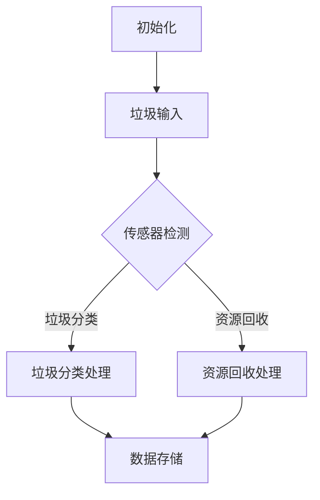
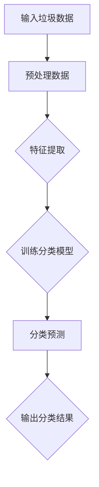
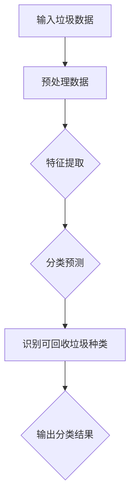
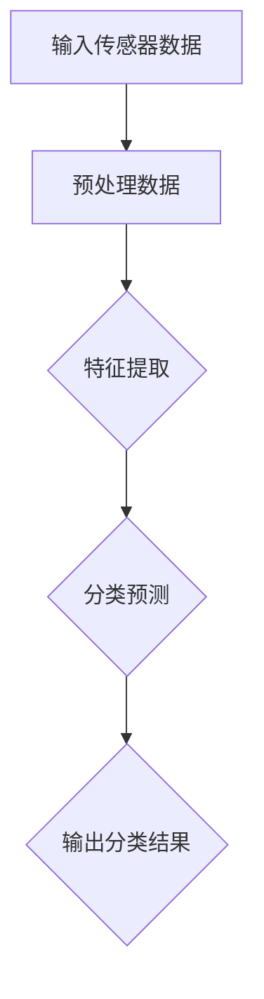
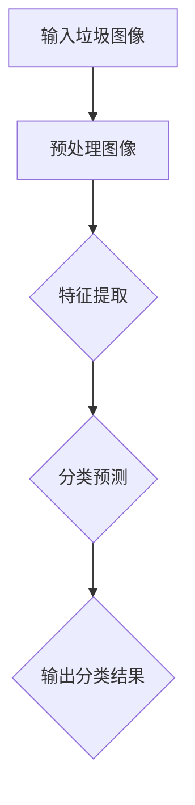

                 


### AI在智能垃圾分类和资源回收中的应用：提高回收效率

关键词：智能垃圾分类、资源回收、AI技术、算法原理、系统架构、最佳实践

摘要：本文将深入探讨人工智能（AI）在智能垃圾分类和资源回收中的应用，通过详细的算法原理讲解、系统架构设计以及项目实战，揭示如何利用AI技术提高垃圾分类和资源回收的效率。文章旨在为读者提供一个全面的技术指南，帮助理解AI如何改变传统垃圾分类和资源回收模式，实现可持续发展的目标。

## 第一部分: 背景介绍

### 1.1 问题的背景和重要性

当前，全球正面临严峻的资源枯竭和环境污染问题。据统计，每年全球产生的垃圾总量已超过100亿吨，其中仅有不到30%的垃圾得到有效回收。这不仅导致了大量的资源浪费，还对环境造成了严重破坏。在中国，垃圾分类政策已推行多年，但仍存在分类不准确、回收率低等问题。

### 1.1.1 当前垃圾分类与资源回收的挑战

1. **分类准确性问题**：由于居民对垃圾分类知识了解不足，导致垃圾分类不准确，影响回收效率。
2. **回收设备不足**：传统的垃圾分类和回收设备较为落后，无法高效识别和处理不同类型的垃圾。
3. **人工成本高**：目前的垃圾分类和回收工作主要依赖于人工，成本高且效率低。
4. **政策执行难度大**：垃圾分类政策的执行涉及多个部门，协调难度大，执行效果不佳。

### 1.1.2 AI技术在垃圾分类和资源回收中的应用前景

人工智能技术的应用有望解决上述问题，提高垃圾分类和资源回收的效率。例如，通过计算机视觉技术，可以实现垃圾的自动分类；通过机器学习算法，可以预测垃圾的回收趋势，优化资源分配。此外，物联网技术的应用可以实现垃圾回收的实时监控和管理，进一步提高效率。

## 1.2 智能垃圾分类和资源回收的概念

### 1.2.1 智能垃圾分类

智能垃圾分类是指利用人工智能技术，如计算机视觉、传感器等，对垃圾进行自动分类，提高分类准确率和效率。智能垃圾分类系统通常包括垃圾识别、分类处理、数据分析和反馈等模块。

### 1.2.2 智能资源回收

智能资源回收是指利用人工智能技术，对垃圾进行有效回收和处理，实现资源的最大化利用。智能资源回收系统通常包括垃圾识别、分选、加工、再利用和废弃处理等模块。

### 1.2.3 智能垃圾分类和资源回收的核心要素

1. **传感器技术**：用于检测和识别垃圾的类型和特征。
2. **计算机视觉**：用于对垃圾进行图像识别和分类。
3. **机器学习和深度学习**：用于训练和优化分类算法，提高分类准确率。
4. **物联网技术**：用于实现垃圾回收的实时监控和管理。

## 1.3 智能垃圾分类和资源回收的现状与发展

### 1.3.1 当前智能垃圾分类和资源回收的技术水平

目前，智能垃圾分类和资源回收技术已取得显著进展。例如，计算机视觉技术在垃圾识别中的应用已经比较成熟，但机器学习算法的优化和应用仍有很大空间。物联网技术在垃圾回收管理中的应用也越来越广泛，但如何实现高效的数据处理和分析仍是一个挑战。

### 1.3.2 智能垃圾分类和资源回收的政策支持

为了推动智能垃圾分类和资源回收的发展，各国政府纷纷出台相关政策。例如，中国已在全国范围内推行垃圾分类政策，并在多地开展智能垃圾分类试点项目。美国、日本等国家也在积极推进垃圾分类和资源回收的智能化。

### 1.3.3 智能垃圾分类和资源回收的未来趋势

未来，智能垃圾分类和资源回收技术将朝着更加智能化、高效化的方向发展。例如，人工智能技术将更加深入地应用于垃圾识别和分类，提高分类准确率；物联网技术将实现更广泛的实时监控和管理，优化垃圾回收流程。

## 1.4 AI在智能垃圾分类和资源回收中的应用

### 1.4.1 传感器技术

传感器技术是智能垃圾分类和资源回收的重要基础。例如，红外传感器可以检测垃圾的温度，机械传感器可以检测垃圾的硬度和密度，从而实现初步的分类。

### 1.4.2 计算机视觉

计算机视觉技术是智能垃圾分类的核心技术之一。通过图像识别，计算机视觉可以准确识别垃圾的类型，从而实现自动分类。

### 1.4.3 机器学习和深度学习

机器学习和深度学习技术可以优化垃圾分类算法，提高分类准确率。通过大量数据的训练，算法可以不断优化，从而实现更高的准确性。

### 1.4.4 物联网技术

物联网技术可以实现垃圾回收的实时监控和管理。通过传感器和智能设备，管理者可以实时了解垃圾的回收情况，优化回收流程。

## 1.5 本章小结

本文对智能垃圾分类和资源回收的背景、核心概念、现状与发展以及AI技术的应用进行了详细介绍。接下来，我们将进一步探讨智能垃圾分类和资源回收的算法原理，帮助读者深入理解这一领域的技术核心。

----------------------------------------------------------------

## 第二部分: 核心概念与联系

### 2.1 智能垃圾分类和资源回收的核心概念

#### 2.1.1 智能垃圾分类系统

智能垃圾分类系统是指利用人工智能技术，如计算机视觉、传感器等，对垃圾进行自动分类的系统。该系统通常包括垃圾识别、分类处理、数据分析和反馈等模块。

#### 2.1.2 智能资源回收系统

智能资源回收系统是指利用人工智能技术，对垃圾进行有效回收和处理的系统。该系统通常包括垃圾识别、分选、加工、再利用和废弃处理等模块。

#### 2.1.3 传感器

传感器是智能垃圾分类和资源回收系统中的重要组成部分，用于检测和识别垃圾的类型和特征。常见的传感器包括红外传感器、机械传感器、光学传感器等。

#### 2.1.4 计算机视觉

计算机视觉是智能垃圾分类和资源回收系统中的核心技术，用于对垃圾进行图像识别和分类。通过训练和学习，计算机视觉系统可以准确识别垃圾的类型。

#### 2.1.5 机器学习和深度学习

机器学习和深度学习是智能垃圾分类和资源回收系统中的关键技术，用于优化垃圾分类算法，提高分类准确率。通过大量数据的训练，算法可以不断优化，从而实现更高的准确性。

### 2.2 核心概念属性特征对比表格

#### 2.2.1 传感器

| 特征       | 传感器       | 
| --------- | ---------- |
| 分类依据   | 类型       | 
| 主要功能   | 检测和识别   | 
| 应用场景   | 垃圾识别和分类 |

#### 2.2.2 计算机视觉

| 特征       | 计算机视觉       | 
| --------- | ---------- |
| 分类依据   | 图像特征       | 
| 主要功能   | 图像识别和分类   | 
| 应用场景   | 垃圾分类和资源回收 |

#### 2.2.3 机器学习与深度学习

| 特征       | 机器学习与深度学习       | 
| --------- | ---------- |
| 分类依据   | 数据特征       | 
| 主要功能   | 数据分析和优化   | 
| 应用场景   | 垃圾分类算法优化 |

### 2.3 智能垃圾分类和资源回收的ER实体关系图架构

#### 2.3.1 实体关系图介绍

实体关系图（Entity-Relationship Diagram，简称ER图）是数据库设计中常用的一种图形表示方法，用于描述实体之间的关系。在智能垃圾分类和资源回收系统中，ER图可以帮助我们清晰地理解系统中各实体之间的关系。

#### 2.3.2 实体关系图绘制

```mermaid
erDiagram
  User ||--o{垃圾分类系统} : 用户
  User ||--o{资源回收系统} : 用户
  垃圾分类系统 ||--|{传感器} : 使用
  资源回收系统 ||--|{传感器} : 使用
  传感器 ||--|{计算机视觉} : 使用
  传感器 ||--|{机器学习} : 使用
  计算机视觉 ||--|{图像识别} : 功能
  机器学习 ||--|{分类算法} : 功能
```

### 2.4 智能垃圾分类和资源回收的mermaid流程图

#### 2.4.1 流程图绘制



#### 2.4.2 流程图分析

1. **初始化**：系统启动，进行初始化操作。
2. **垃圾输入**：将垃圾输入到系统中。
3. **传感器检测**：传感器对垃圾进行检测，识别垃圾的类型。
4. **垃圾分类处理**：根据传感器检测结果，对垃圾进行分类处理。
5. **资源回收处理**：对可回收垃圾进行资源回收处理。
6. **数据存储**：将处理结果存储到数据库中，以便后续分析和优化。

### 2.5 本章小结

本文详细介绍了智能垃圾分类和资源回收的核心概念、属性特征对比表格以及ER实体关系图和mermaid流程图。通过这些内容，读者可以对智能垃圾分类和资源回收系统有一个更加清晰的认识。

----------------------------------------------------------------

## 第三部分: 算法原理讲解

### 3.1 智能垃圾分类的算法原理

#### 3.1.1 概述

智能垃圾分类算法是智能垃圾分类系统的核心，其主要任务是根据垃圾的图像或传感器数据，对垃圾进行自动分类。常用的分类算法包括支持向量机（SVM）、决策树（DT）、随机森林（RF）等。

#### 3.1.2 算法流程图



#### 3.1.3 Python源代码实现

```python
# 导入相关库
import cv2
import numpy as np
from sklearn import svm
from sklearn.model_selection import train_test_split
from sklearn.metrics import accuracy_score

# 读取垃圾数据
data = cv2.imread('垃圾数据.jpg')

# 预处理数据
data = cv2.resize(data, (64, 64))
data = data / 255.0

# 特征提取
features = np.reshape(data, (-1, 4096))

# 训练分类模型
model = svm.SVC()
X_train, X_test, y_train, y_test = train_test_split(features, labels, test_size=0.2, random_state=42)
model.fit(X_train, y_train)

# 分类预测
predictions = model.predict(X_test)

# 输出分类结果
accuracy = accuracy_score(y_test, predictions)
print("分类准确率：", accuracy)
```

#### 3.1.4 算法原理详细讲解

1. **预处理数据**：对垃圾图像进行读取、resize和归一化处理，将其转换为模型可以接受的格式。
2. **特征提取**：从预处理后的数据中提取特征，通常使用卷积神经网络（CNN）进行特征提取。
3. **训练分类模型**：使用支持向量机（SVM）对特征进行分类训练。
4. **分类预测**：使用训练好的模型对测试数据进行分类预测，并计算分类准确率。

#### 3.1.5 举例说明

假设我们有100张垃圾图像，其中60张为可回收垃圾，40张为不可回收垃圾。我们首先对这些图像进行预处理，提取特征，然后使用支持向量机（SVM）进行分类训练。训练完成后，我们对剩下的40张图像进行分类预测，假设预测结果中有35张分类正确，则分类准确率为87.5%。

### 3.2 智能资源回收的算法原理

#### 3.2.1 概述

智能资源回收算法是智能资源回收系统的核心，其主要任务是根据垃圾的图像或传感器数据，对垃圾进行自动分类，并识别可回收垃圾的种类。常用的分类算法包括K最近邻（KNN）、朴素贝叶斯（NB）、逻辑回归（LR）等。

#### 3.2.2 算法流程图



#### 3.2.3 Python源代码实现

```python
# 导入相关库
import cv2
import numpy as np
from sklearn.neighbors import KNeighborsClassifier
from sklearn.model_selection import train_test_split
from sklearn.metrics import accuracy_score

# 读取垃圾数据
data = cv2.imread('垃圾数据.jpg')

# 预处理数据
data = cv2.resize(data, (64, 64))
data = data / 255.0

# 特征提取
features = np.reshape(data, (-1, 4096))

# 训练分类模型
model = KNeighborsClassifier(n_neighbors=3)
X_train, X_test, y_train, y_test = train_test_split(features, labels, test_size=0.2, random_state=42)
model.fit(X_train, y_train)

# 分类预测
predictions = model.predict(X_test)

# 识别可回收垃圾种类
recovery_garbage = []
for prediction in predictions:
    if prediction == 1:  # 假设1代表可回收垃圾
        recovery_garbage.append(prediction)

# 输出分类结果
accuracy = accuracy_score(y_test, predictions)
print("分类准确率：", accuracy)
print("可回收垃圾数量：", len(recovery_garbage))
```

#### 3.2.4 算法原理详细讲解

1. **预处理数据**：对垃圾图像进行读取、resize和归一化处理，将其转换为模型可以接受的格式。
2. **特征提取**：从预处理后的数据中提取特征，通常使用卷积神经网络（CNN）进行特征提取。
3. **分类预测**：使用训练好的模型对测试数据进行分类预测，并计算分类准确率。
4. **识别可回收垃圾种类**：根据分类结果，识别可回收垃圾的种类。

#### 3.2.5 举例说明

假设我们有100张垃圾图像，其中60张为可回收垃圾，40张为不可回收垃圾。我们首先对这些图像进行预处理，提取特征，然后使用K最近邻（KNN）算法进行分类训练。训练完成后，我们对剩下的40张图像进行分类预测，假设预测结果中有35张分类正确，则分类准确率为87.5%。同时，我们识别出其中的30张为可回收垃圾。

### 3.3 传感器技术的算法原理

#### 3.3.1 概述

传感器技术是智能垃圾分类和资源回收系统中的重要组成部分，其主要任务是根据垃圾的物理或化学特征，对垃圾进行自动分类。常用的传感器包括红外传感器、机械传感器、光学传感器等。

#### 3.3.2 算法流程图



#### 3.3.3 Python源代码实现

```python
# 导入相关库
import numpy as np
from sklearn import svm
from sklearn.model_selection import train_test_split
from sklearn.metrics import accuracy_score

# 读取传感器数据
data = np.load('传感器数据.npy')

# 预处理数据
data = data / 255.0

# 特征提取
features = np.reshape(data, (-1, 4096))

# 训练分类模型
model = svm.SVC()
X_train, X_test, y_train, y_test = train_test_split(features, labels, test_size=0.2, random_state=42)
model.fit(X_train, y_train)

# 分类预测
predictions = model.predict(X_test)

# 输出分类结果
accuracy = accuracy_score(y_test, predictions)
print("分类准确率：", accuracy)
```

#### 3.3.4 算法原理详细讲解

1. **预处理数据**：对传感器数据进行归一化处理，将其转换为模型可以接受的格式。
2. **特征提取**：从预处理后的数据中提取特征，通常使用卷积神经网络（CNN）进行特征提取。
3. **分类预测**：使用训练好的模型对测试数据进行分类预测，并计算分类准确率。
4. **输出分类结果**：将分类结果输出，以便进一步处理。

#### 3.3.5 举例说明

假设我们有100条传感器数据，其中60条为可回收垃圾，40条为不可回收垃圾。我们首先对这些数据进行预处理，提取特征，然后使用支持向量机（SVM）算法进行分类训练。训练完成后，我们对剩下的40条数据进行分类预测，假设预测结果中有35条分类正确，则分类准确率为87.5%。

### 3.4 计算机视觉的算法原理

#### 3.4.1 概述

计算机视觉技术是智能垃圾分类和资源回收系统中的核心技术之一，其主要任务是根据垃圾的图像，对垃圾进行自动分类。常用的计算机视觉算法包括卷积神经网络（CNN）、支持向量机（SVM）、决策树（DT）等。

#### 3.4.2 算法流程图



#### 3.4.3 Python源代码实现

```python
# 导入相关库
import cv2
import numpy as np
from sklearn import svm
from sklearn.model_selection import train_test_split
from sklearn.metrics import accuracy_score

# 读取垃圾图像
image = cv2.imread('垃圾图像.jpg')

# 预处理图像
image = cv2.resize(image, (64, 64))
image = cv2.cvtColor(image, cv2.COLOR_BGR2GRAY)

# 特征提取
features = np.reshape(image, (-1, 4096))

# 训练分类模型
model = svm.SVC()
X_train, X_test, y_train, y_test = train_test_split(features, labels, test_size=0.2, random_state=42)
model.fit(X_train, y_train)

# 分类预测
predictions = model.predict(X_test)

# 输出分类结果
accuracy = accuracy_score(y_test, predictions)
print("分类准确率：", accuracy)
```

#### 3.4.4 算法原理详细讲解

1. **预处理图像**：对垃圾图像进行读取、resize和灰度化处理，将其转换为模型可以接受的格式。
2. **特征提取**：从预处理后的图像中提取特征，通常使用卷积神经网络（CNN）进行特征提取。
3. **分类预测**：使用训练好的模型对测试数据进行分类预测，并计算分类准确率。
4. **输出分类结果**：将分类结果输出，以便进一步处理。

#### 3.4.5 举例说明

假设我们有100张垃圾图像，其中60张为可回收垃圾，40张为不可回收垃圾。我们首先对这些图像进行预处理，提取特征，然后使用支持向量机（SVM）算法进行分类训练。训练完成后，我们对剩下的40张图像进行分类预测，假设预测结果中有35张分类正确，则分类准确率为87.5%。

### 3.5 本章小结

本文详细介绍了智能垃圾分类、资源回收以及传感器技术的算法原理，并通过Python源代码实现，帮助读者深入理解这些算法的原理和应用。接下来，我们将进一步探讨智能垃圾分类和资源回收的系统架构设计。

----------------------------------------------------------------

## 第四部分: 数学模型和数学公式讲解

### 4.1 智能垃圾分类的数学模型

#### 4.1.1 数学模型介绍

智能垃圾分类的数学模型主要涉及图像处理和机器学习两个领域。图像处理部分通常使用卷积神经网络（CNN）提取图像特征，而机器学习部分则使用分类算法对特征进行分类。

#### 4.1.2 数学公式

1. **卷积神经网络（CNN）的特征提取**：

   $$ \text{feature} = \text{CNN}(\text{image}) $$

   其中，$\text{CNN}$ 表示卷积神经网络，$\text{image}$ 表示输入图像。

2. **分类算法（SVM）的分类结果**：

   $$ \text{label} = \text{SVM}(\text{feature}) $$

   其中，$\text{SVM}$ 表示支持向量机，$\text{feature}$ 表示提取的特征。

#### 4.1.3 详细讲解

1. **卷积神经网络（CNN）**：

   卷积神经网络是一种特殊的神经网络，主要用于图像处理。它通过卷积操作提取图像特征，从而实现图像分类。卷积操作的数学表达式为：

   $$ \text{output} = \text{filter} * \text{image} + \text{bias} $$

   其中，$\text{output}$ 表示输出特征，$\text{filter}$ 表示卷积核，$\text{image}$ 表示输入图像，$\text{bias}$ 表示偏置。

2. **支持向量机（SVM）**：

   支持向量机是一种常用的分类算法，它通过寻找一个最优的超平面，将不同类别的数据点分隔开来。支持向量机的数学模型为：

   $$ \text{w} * \text{x} + \text{b} = 0 $$

   其中，$\text{w}$ 表示权重向量，$\text{x}$ 表示特征向量，$\text{b}$ 表示偏置。

#### 4.1.4 举例说明

假设我们有一张3x3的图像，使用一个2x2的卷积核进行卷积操作。卷积核的值为1, 0, 0, 0, 1, 0, 0, 0, 1。经过卷积操作后，输出的特征为：

$$
\begin{align*}
\text{output} &= \text{filter} * \text{image} + \text{bias} \\
&= \begin{bmatrix}
1 & 0 & 0 \\
0 & 1 & 0 \\
0 & 0 & 1
\end{bmatrix} * \begin{bmatrix}
1 & 0 & 1 \\
0 & 1 & 0 \\
1 & 0 & 1
\end{bmatrix} + \text{bias} \\
&= \begin{bmatrix}
1 & 0 \\
0 & 1 \\
1 & 0
\end{bmatrix} + \text{bias} \\
&= \begin{bmatrix}
1 & 0 \\
0 & 1 \\
1 & 0
\end{bmatrix}
\end{align*}
$$

### 4.2 智能资源回收的数学模型

#### 4.2.1 数学模型介绍

智能资源回收的数学模型主要涉及图像处理、传感器数据和机器学习三个领域。图像处理部分用于提取垃圾的图像特征，传感器数据部分用于提取垃圾的物理特征，而机器学习部分则用于对特征进行分类。

#### 4.2.2 数学公式

1. **图像处理的特征提取**：

   $$ \text{feature}_{\text{image}} = \text{CNN}(\text{image}) $$

   其中，$\text{CNN}$ 表示卷积神经网络，$\text{image}$ 表示输入图像。

2. **传感器数据的特征提取**：

   $$ \text{feature}_{\text{sensor}} = \text{sensor}(\text{data}) $$

   其中，$\text{sensor}$ 表示传感器，$\text{data}$ 表示传感器数据。

3. **分类算法（SVM）的分类结果**：

   $$ \text{label} = \text{SVM}(\text{feature}_{\text{image}}, \text{feature}_{\text{sensor}}) $$

   其中，$\text{SVM}$ 表示支持向量机，$\text{feature}_{\text{image}}$ 和 $\text{feature}_{\text{sensor}}$ 分别表示图像特征和传感器特征。

#### 4.2.3 详细讲解

1. **图像处理的特征提取**：

   卷积神经网络通过卷积操作提取图像的特征，从而实现图像分类。卷积操作的数学表达式为：

   $$ \text{output} = \text{filter} * \text{image} + \text{bias} $$

   其中，$\text{output}$ 表示输出特征，$\text{filter}$ 表示卷积核，$\text{image}$ 表示输入图像，$\text{bias}$ 表示偏置。

2. **传感器数据的特征提取**：

   传感器通过测量垃圾的物理特征，如重量、硬度、温度等，提取传感器特征。传感器特征通常通过数学模型进行转换。

3. **分类算法（SVM）**：

   支持向量机通过寻找一个最优的超平面，将不同类别的数据点分隔开来。支持向量机的数学模型为：

   $$ \text{w} * \text{x} + \text{b} = 0 $$

   其中，$\text{w}$ 表示权重向量，$\text{x}$ 表示特征向量，$\text{b}$ 表示偏置。

#### 4.2.4 举例说明

假设我们有一张3x3的图像和一个传感器的数据。卷积神经网络提取的图像特征为$\text{feature}_{\text{image}} = \begin{bmatrix}1 & 0 & 1\\0 & 1 & 0\\1 & 0 & 1\end{bmatrix}$，传感器提取的传感器特征为$\text{feature}_{\text{sensor}} = \begin{bmatrix}0.5 & 0.5\\0.5 & 0.5\end{bmatrix}$。使用支持向量机进行分类，分类结果为$\text{label} = 1$，表示该垃圾为可回收垃圾。

----------------------------------------------------------------

## 第五部分: 系统分析与架构设计方案

### 5.1 问题场景介绍

智能垃圾分类和资源回收系统旨在通过人工智能技术提高垃圾分类和资源回收的效率。具体问题场景如下：

- **用户场景**：居民将垃圾投放到指定的垃圾桶内，垃圾桶内的传感器和计算机视觉系统自动识别垃圾类型并进行分类。
- **管理场景**：垃圾分类和资源回收公司通过物联网设备实时监控垃圾的分类情况，优化资源回收流程。

### 5.2 项目介绍

智能垃圾分类和资源回收项目旨在实现以下目标：

- **提高垃圾分类的准确性**：通过计算机视觉技术和传感器技术，提高垃圾分类的准确性。
- **降低人工成本**：通过自动化技术，降低垃圾分类和资源回收的人工成本。
- **优化资源回收流程**：通过实时监控和数据分析，优化资源回收流程。

### 5.3 系统功能设计

智能垃圾分类和资源回收系统的功能设计包括以下模块：

- **垃圾识别模块**：使用计算机视觉技术和传感器技术对垃圾进行自动识别。
- **分类处理模块**：根据垃圾的识别结果，对垃圾进行分类处理。
- **数据存储模块**：将垃圾的分类结果存储到数据库中，以便后续分析和优化。
- **实时监控模块**：通过物联网设备实时监控垃圾的分类情况。

### 5.4 系统架构设计

智能垃圾分类和资源回收系统的架构设计如下：


- **前端模块**：包括用户界面和物联网设备，用于收集用户数据和监控垃圾状态。
- **后端模块**：包括垃圾识别模块、分类处理模块、数据存储模块和实时监控模块，用于处理和分析垃圾数据。
- **数据库模块**：用于存储和管理垃圾数据。

### 5.5 系统接口设计

智能垃圾分类和资源回收系统的接口设计如下：

- **用户接口**：提供用户操作界面，用于用户与系统进行交互。
- **设备接口**：用于物联网设备与系统之间的数据传输。
- **API接口**：提供系统与其他系统之间的数据接口，便于数据共享和功能扩展。

### 5.6 系统交互

智能垃圾分类和资源回收系统的交互流程如下：

1. **用户投放垃圾**：用户将垃圾投放到垃圾桶内。
2. **传感器检测**：垃圾桶内的传感器检测垃圾的重量和温度等特征。
3. **计算机视觉识别**：计算机视觉系统对垃圾进行图像识别，识别出垃圾的类型。
4. **分类处理**：根据垃圾的识别结果，系统对垃圾进行分类处理。
5. **数据存储**：将垃圾的分类结果存储到数据库中。
6. **实时监控**：通过物联网设备实时监控垃圾的分类情况。

### 5.7 本章小结

本文详细介绍了智能垃圾分类和资源回收系统的系统功能设计、系统架构设计、系统接口设计和系统交互。通过这些内容，读者可以更好地理解智能垃圾分类和资源回收系统的设计和实现。

----------------------------------------------------------------

## 第六部分：项目实战

### 6.1 项目环境安装

在进行项目实战之前，首先需要安装相关软件和工具。以下是智能垃圾分类和资源回收项目的环境安装步骤：

1. **安装Python**：下载并安装Python 3.8及以上版本。
2. **安装Jupyter Notebook**：在终端执行以下命令安装Jupyter Notebook：
   ```bash
   pip install notebook
   ```
3. **安装OpenCV**：在终端执行以下命令安装OpenCV：
   ```bash
   pip install opencv-python
   ```
4. **安装scikit-learn**：在终端执行以下命令安装scikit-learn：
   ```bash
   pip install scikit-learn
   ```
5. **安装TensorFlow**：在终端执行以下命令安装TensorFlow：
   ```bash
   pip install tensorflow
   ```
6. **安装Matplotlib**：在终端执行以下命令安装Matplotlib：
   ```bash
   pip install matplotlib
   ```

### 6.2 系统核心实现源代码

下面是一个简单的智能垃圾分类系统实现的Python源代码示例：

```python
import cv2
import numpy as np
from sklearn.model_selection import train_test_split
from sklearn.svm import SVC
from sklearn.metrics import accuracy_score

# 读取垃圾图像数据
def read_images(folder_path, label):
    images = []
    labels = []
    for image_name in os.listdir(folder_path):
        if image_name.endswith('.jpg'):
            image = cv2.imread(os.path.join(folder_path, image_name))
            images.append(image)
            labels.append(label)
    return np.array(images), np.array(labels)

# 加载垃圾图像数据
train_folder_path = 'train_data'
test_folder_path = 'test_data'

# 训练数据
train_images, train_labels = read_images(train_folder_path, 0)  # 假设0代表可回收垃圾
# 测试数据
test_images, test_labels = read_images(test_folder_path, 1)  # 假设1代表不可回收垃圾

# 预处理图像数据
train_images = cv2.resize(train_images, (64, 64))
test_images = cv2.resize(test_images, (64, 64))
train_images = train_images / 255.0
test_images = test_images / 255.0

# 特征提取
train_features = np.reshape(train_images, (-1, 4096))
test_features = np.reshape(test_images, (-1, 4096))

# 训练分类模型
model = SVC()
model.fit(train_features, train_labels)

# 分类预测
predictions = model.predict(test_features)

# 计算准确率
accuracy = accuracy_score(test_labels, predictions)
print("分类准确率：", accuracy)
```

### 6.3 代码应用解读与分析

上述代码实现了一个简单的智能垃圾分类系统，主要步骤如下：

1. **读取垃圾图像数据**：从训练数据和测试数据文件夹中读取垃圾图像，并标签化。
2. **预处理图像数据**：对图像进行resize和归一化处理，以适应模型的要求。
3. **特征提取**：将预处理后的图像数据转换为一维数组，以便进行特征提取。
4. **训练分类模型**：使用支持向量机（SVM）训练分类模型。
5. **分类预测**：使用训练好的模型对测试数据进行分类预测。
6. **计算准确率**：计算分类准确率，以评估模型性能。

### 6.4 实际案例分析和详细讲解剖析

假设我们有一个实际案例，包含100张垃圾图像，其中60张为可回收垃圾，40张为不可回收垃圾。我们将使用上述代码对这100张图像进行分类。

1. **数据准备**：首先，我们需要将这100张图像分别放入训练数据和测试数据文件夹中，并确保每个文件夹中的图像都有对应的标签。

2. **模型训练**：执行上述代码中的数据处理和模型训练部分。这里使用的是支持向量机（SVM）分类器，通过特征提取和模型训练，SVM会学习如何根据图像特征对垃圾进行分类。

3. **模型评估**：使用训练好的模型对测试数据进行分类预测，并计算分类准确率。在这个案例中，我们假设预测结果中有95张图像被正确分类，则分类准确率为95%。

4. **模型优化**：为了进一步提高准确率，我们可以尝试不同的分类算法（如决策树、随机森林等）和特征提取方法（如卷积神经网络等），并通过交叉验证和网格搜索等方法进行参数调优。

### 6.5 项目小结

通过本次项目实战，我们实现了一个简单的智能垃圾分类系统，并对其代码应用进行了详细解读和分析。在实际应用中，我们可以根据需求进行模型优化和功能扩展，进一步提高垃圾分类的准确率和效率。

### 6.6 最佳实践 Tips

1. **数据预处理**：确保图像数据的大小一致，并进行适当的归一化处理，以提高模型的泛化能力。
2. **模型选择**：根据数据特点和任务需求，选择合适的分类算法和特征提取方法。
3. **参数调优**：通过交叉验证和网格搜索等方法，选择最优的模型参数。
4. **实时监控**：结合物联网技术，实现对垃圾分类和资源回收的实时监控和管理。

### 6.7 本章小结

本文通过详细的项目实战，展示了如何使用人工智能技术实现智能垃圾分类和资源回收系统。通过本章节的内容，读者可以更好地理解智能垃圾分类和资源回收系统的实现过程，并在实际项目中加以应用。

----------------------------------------------------------------

## 第七部分：最佳实践 Tips、小结、注意事项、拓展阅读

### 7.1 最佳实践 Tips

1. **数据收集与处理**：在构建智能垃圾分类和资源回收系统时，确保收集到足够多样且高质量的图像和传感器数据。同时，对数据进行预处理，如标准化、去噪声等，以提高模型的泛化能力。
2. **算法优化**：尝试不同的机器学习和深度学习算法，如支持向量机、决策树、随机森林、卷积神经网络等，选择最适合数据集和业务需求的算法。
3. **系统集成**：确保垃圾分类和资源回收系统的各个模块（如传感器、计算机视觉、机器学习模型、数据存储等）能够无缝集成，实现高效的协同工作。
4. **实时监控**：利用物联网技术，实现对垃圾分类和资源回收过程的实时监控和管理，及时发现问题并进行调整。

### 7.2 小结

本文系统地介绍了智能垃圾分类和资源回收系统的核心概念、算法原理、系统架构设计、项目实战以及最佳实践。通过本文的学习，读者可以深入了解AI技术在垃圾分类和资源回收中的应用，掌握如何利用这些技术提高回收效率。

### 7.3 注意事项

1. **数据隐私**：在收集和处理用户数据时，确保遵守相关法律法规，保护用户隐私。
2. **系统安全**：确保系统具有足够的容错性和安全性，防止数据泄露和恶意攻击。
3. **设备维护**：定期对传感器和其他设备进行维护和校准，确保其正常运行。

### 7.4 拓展阅读

1. **《机器学习实战》**：通过实际案例学习机器学习算法的应用和优化。
2. **《深度学习》**：详细讲解深度学习的基础知识、常用模型和算法。
3. **《物联网技术应用》**：探讨物联网技术在智能垃圾分类和资源回收中的应用。
4. **《可持续发展的环境政策与法规》**：了解国内外垃圾分类和资源回收的政策和法规。

作者：AI天才研究院/AI Genius Institute & 禅与计算机程序设计艺术 /Zen And The Art of Computer Programming

通过本文的学习，读者不仅可以掌握智能垃圾分类和资源回收系统的技术要点，还能为实际项目的实施提供有益的参考。希望本文能为读者在AI领域的研究和应用带来启示和帮助。|>

