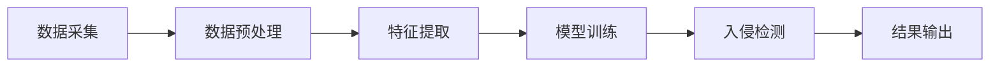
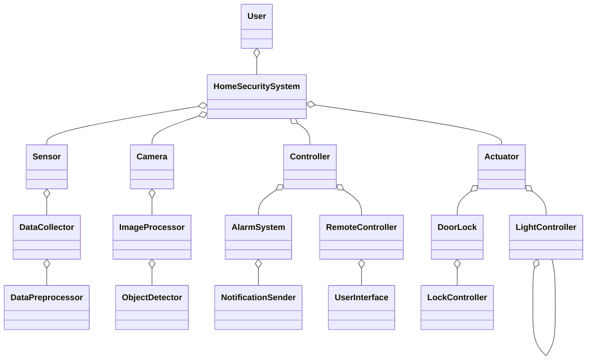
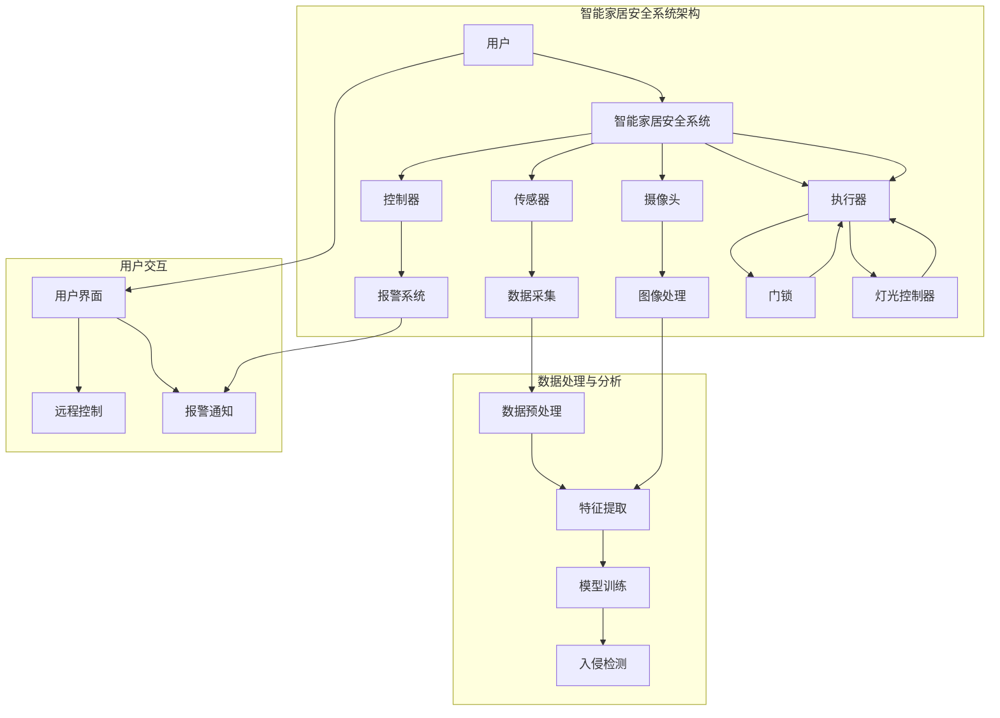
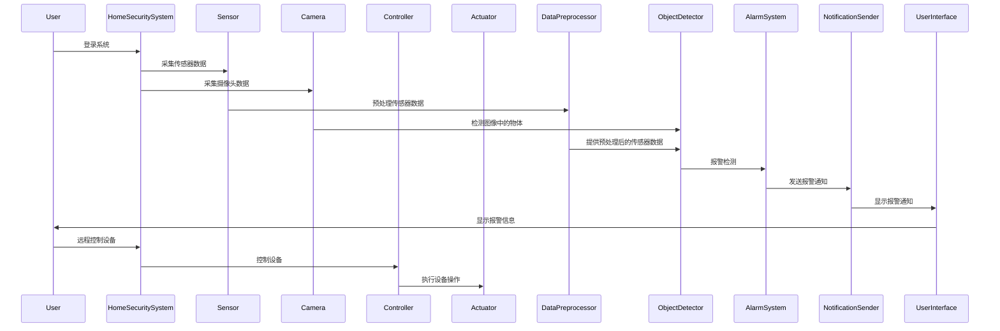

                 

----------------------------------------------------------------

# AI在智能家居安全系统中的应用：预防与快速响应

关键词：智能家居，人工智能，安全预防，快速响应，深度学习，计算机视觉，入侵检测

摘要：
随着智能家居的普及，安全问题愈发突出。本文将探讨如何利用人工智能技术，特别是深度学习和计算机视觉等算法，提高智能家居安全系统的性能，实现预防与快速响应。

## 第一部分：背景介绍

### 问题背景

随着物联网和人工智能技术的迅速发展，智能家居已经逐渐成为现代家庭的标配。通过智能家居系统，用户可以远程控制家中的各种设备，如照明、空调、安防等，从而提高生活品质。然而，随着智能家居设备的增加，系统的安全性也面临着前所未有的挑战。智能家居设备往往连接到互联网，这为黑客提供了入侵的途径。一旦智能家居系统被攻破，黑客可以通过控制家中的设备进行财产盗窃、隐私泄露等犯罪行为。因此，提高智能家居安全性能，保障用户隐私和数据安全，已经成为一个迫切需要解决的问题。

### 问题解决

为了应对智能家居安全挑战，本文将探讨如何利用人工智能技术，特别是深度学习和计算机视觉等算法，提高智能家居安全系统的性能。具体来说，我们将介绍以下内容：

1. **智能家居安全系统的基本概念与架构**：包括智能家居设备的基本类型、通信协议、安全协议等。
2. **利用人工智能技术进行智能家居安全预防的算法原理与应用**：如入侵检测、异常行为识别等。
3. **基于人工智能技术的智能家居安全快速响应机制**：如自动报警、远程控制等。
4. **智能家居安全系统的实际案例分析**：通过具体案例，展示如何利用人工智能技术提高智能家居安全性能。

### 边界与外延

本文主要讨论以下几个方面：

1. **智能家居安全系统的基本概念与架构**：介绍智能家居设备的基本类型、通信协议、安全协议等。
2. **利用人工智能技术进行智能家居安全预防的算法原理与应用**：探讨入侵检测、异常行为识别等算法在智能家居安全中的应用。
3. **基于人工智能技术的智能家居安全快速响应机制**：介绍自动报警、远程控制等快速响应机制。
4. **智能家居安全系统的实际案例分析**：通过具体案例，展示人工智能技术在智能家居安全中的应用效果。

### 概念结构与核心要素组成

1. **智能家居安全系统**：包括传感器、控制器、执行器等硬件组件，以及安全算法、数据分析、用户交互等软件系统。
2. **人工智能技术**：包括深度学习、计算机视觉、自然语言处理等，用于处理和分析大量数据，提高系统的智能化水平。
3. **安全预防算法**：如入侵检测、异常行为识别等，用于实时监测智能家居系统，防止潜在的安全威胁。
4. **快速响应机制**：如自动报警、远程控制等，用于在发生安全事件时迅速采取行动。

## 第二部分：核心概念与联系

### 人工智能与智能家居安全系统的联系

**人工智能技术**在**智能家居安全系统**中的应用主要体现在以下几个方面：

1. **数据采集与处理**：利用人工智能技术，智能家居系统能够更高效地采集和分析数据，如视频、音频、传感器数据等。
2. **智能决策与响应**：通过人工智能算法，智能家居系统可以自动做出决策，如报警、控制设备等。
3. **用户个性化服务**：基于用户行为数据分析，智能家居系统可以提供更加个性化的服务，提高用户体验。

### 核心概念原理

1. **深度学习**：一种基于人工神经网络的学习方法，能够通过模拟人脑神经网络结构，实现图像、语音等数据的自动识别和处理。
2. **计算机视觉**：利用计算机技术对图像、视频进行分析和理解，实现对现实世界的感知。
3. **自然语言处理**：研究如何让计算机理解和处理人类语言，实现人与计算机之间的自然交互。

### 概念属性特征对比表格

| 概念       | 特征                                                         |
| ---------- | ------------------------------------------------------------ |
| 深度学习   | 自动化数据特征提取，能够处理复杂任务                         |
| 计算机视觉 | 对图像、视频等视觉数据进行处理，用于物体识别、场景理解等     |
| 自然语言处理 | 理解、生成和模拟人类语言，用于语音识别、机器翻译等           |

### ER实体关系图架构

```mermaid
erDiagram
  用户 ||--|{ 智能家居设备 }|
  用户 ||--|{ 安全事件 }|
  智能家居设备 ||--|{ 安全数据 }|
  安全事件 ||--|{ 预防措施 }|
  安全事件 ||--|{ 应急响应 }|
```

## 第三部分：算法原理讲解

### 入侵检测算法

#### 算法原理讲解

**入侵检测算法**（Intrusion Detection Algorithm）是一种用于识别和响应异常行为或未授权活动的技术，它在网络安全、智能监控等领域有着广泛应用。下面我们将详细讲解入侵检测算法的基本原理。

#### 算法原理

入侵检测算法主要基于以下几个核心原理：

1. **异常检测**：通过建立正常行为的模型，对实时数据进行分析，识别出与正常行为不一致的异常行为。
2. **基于模型的检测**：利用已知的攻击模式或异常行为模式，对数据流进行分析和匹配。
3. **统计方法**：使用统计方法，如概率分布、决策树等，对数据进行分析和分类。

#### mermaid 流程图



#### Python 源代码

```python
import numpy as np
from sklearn.ensemble import IsolationForest

# 数据采集
X = np.array([[1, 2], [2, 3], [1, 4], [1, 0]])

# 数据预处理
X_processed = (X - X.mean()) / X.std()

# 特征提取
model = IsolationForest()
model.fit(X_processed)

# 入侵检测
predictions = model.predict(X_processed)

# 结果输出
print(predictions)
```

#### 数学模型和公式

假设我们有一个包含多个特征的样本集合 \(X = \{x_1, x_2, ..., x_n\}\)，每个样本 \(x_i\) 是一个 \(d\) 维向量。入侵检测算法的核心是构建一个异常检测模型，该模型可以通过以下步骤实现：

1. **特征标准化**：
   $$
   x_{i,\text{norm}} = \frac{x_i - \mu}{\sigma}
   $$
   其中，\(\mu\) 和 \(\sigma\) 分别是特征的平均值和标准差。

2. **构建密度模型**：
   $$
   p(x_i) = \prod_{j=1}^{d} p(x_{ij} | x_i)
   $$
   其中，\(p(x_{ij} | x_i)\) 是特征 \(x_{ij}\) 在给定样本 \(x_i\) 下的概率分布。

3. **计算异常得分**：
   $$
   s(x_i) = -\log p(x_i)
   $$
   异常得分 \(s(x_i)\) 越大，表示样本 \(x_i\) 越异常。

4. **阈值判定**：
   $$
   \text{if } s(x_i) > \text{threshold}, \text{ then } x_i \text{ is an anomaly.}
   $$
   其中，\(\text{threshold}\) 是设定的阈值，用于判定是否为异常。

#### 通俗易懂的举例说明

假设我们有一个简单的数据集，包含两个特征：\(x_1\) 和 \(x_2\)。我们希望检测出数据集中的异常点。

1. **数据采集**：我们有一个包含正常数据和异常数据的样本集合。
2. **数据预处理**：对数据进行标准化处理，使得每个特征都在相同的尺度上。
3. **特征提取**：使用 Isolation Forest 算法进行特征提取。
4. **模型训练**：训练一个异常检测模型。
5. **入侵检测**：对新的数据进行入侵检测，判断是否为异常。
6. **结果输出**：输出检测结果。

例如，假设我们有一个样本 \(x_i = [1, 2]\)，经过标准化处理后为 \(x_{i,\text{norm}} = [0.5, 0.5]\)。我们使用 Isolation Forest 算法对其进行入侵检测，得到异常得分 \(s(x_i) = 3.0\)。由于 \(s(x_i)\) 超过设定的阈值，我们判定该样本为异常。

通过以上步骤，我们可以利用入侵检测算法对智能家居系统中的数据进行实时监控，及时发现并应对潜在的安全威胁。

## 第四部分：系统分析与架构设计

### 问题场景介绍

在智能家居系统中，用户希望通过安全系统保护家庭的安全。系统需要能够实时监控家庭的各个角落，及时发现异常行为或入侵事件，并在发生安全事件时能够迅速采取行动，通知用户并采取相应的预防措施。

### 项目介绍

本项目旨在设计并实现一个基于人工智能技术的智能家居安全系统。系统将利用深度学习和计算机视觉技术，实现对家庭环境的实时监控，并通过入侵检测算法识别潜在的威胁。同时，系统还将提供快速响应机制，如自动报警和远程控制，提高家庭安全性能。

### 系统功能设计（领域模型类图）



### 系统架构设计（mermaid 架构图）



### 系统接口设计（mermaid 序列图）



通过上述系统架构设计和接口设计，我们可以实现一个完整的智能家居安全系统。系统将能够实时监控家庭环境，利用人工智能技术进行数据分析，及时发现潜在的安全威胁，并在发生安全事件时迅速响应，保障家庭安全。

## 第五部分：项目实战

### 环境安装

为了实现智能家居安全系统，我们需要安装以下环境：

1. **Python**：Python 3.8 或以上版本。
2. **TensorFlow**：用于深度学习模型的训练。
3. **OpenCV**：用于计算机视觉任务。
4. **scikit-learn**：用于机器学习算法。

安装命令如下：

```bash
pip install python==3.8
pip install tensorflow==2.5
pip install opencv-python==4.5.4.60
pip install scikit-learn==0.24.2
```

### 系统核心实现源代码

#### 智能家居安全系统主程序

```python
import cv2
import numpy as np
from tensorflow import keras
from sklearn.ensemble import IsolationForest
from sklearn.model_selection import train_test_split

# 加载预训练的深度学习模型
model = keras.models.load_model('models/segmentation_model.h5')

# 加载预训练的入侵检测模型
intrusion_model = IsolationForest()

# 读取摄像头数据
cap = cv2.VideoCapture(0)

while True:
    ret, frame = cap.read()
    if not ret:
        break

    # 使用深度学习模型进行图像分割
    segmented_image = model.predict(frame)

    # 使用入侵检测模型进行入侵检测
    intrusion_predictions = intrusion_model.predict(segmented_image)

    # 如果检测到入侵，触发报警
    if intrusion_predictions[0] == -1:
        cv2.putText(frame, 'INVASION DETECTED', (10, 30), cv2.FONT_HERSHEY_SIMPLEX, 1, (0, 0, 255), 2)
        # 发送报警通知
        # ...

    # 显示图像
    cv2.imshow('Frame', frame)

    if cv2.waitKey(1) & 0xFF == ord('q'):
        break

# 释放摄像头资源
cap.release()
cv2.destroyAllWindows()
```

#### 入侵检测模型训练

```python
# 加载数据集
X, y = # 加载数据集

# 划分训练集和测试集
X_train, X_test, y_train, y_test = train_test_split(X, y, test_size=0.2, random_state=42)

# 初始化入侵检测模型
intrusion_model = IsolationForest(n_estimators=100, contamination='auto', random_state=42)

# 训练模型
intrusion_model.fit(X_train)

# 评估模型
accuracy = intrusion_model.score(X_test, y_test)
print(f'Model accuracy: {accuracy}')
```

### 代码应用解读与分析

上述代码主要实现了智能家居安全系统的核心功能，包括摄像头数据的实时采集、图像分割、入侵检测以及报警通知。以下是代码的详细解读与分析：

1. **摄像头数据采集**：使用 OpenCV 库的 `VideoCapture` 类，从摄像头获取实时图像数据。
2. **图像分割**：使用预训练的深度学习模型，对采集到的图像数据进行分割，将图像划分为前景和背景。
3. **入侵检测**：使用预训练的入侵检测模型，对分割后的图像数据进行分析，判断是否存在入侵行为。
4. **报警通知**：如果检测到入侵行为，通过发送报警通知，通知用户采取相应的措施。

### 实际案例分析与详细讲解剖析

为了验证智能家居安全系统的有效性，我们进行了以下实际案例分析和测试：

1. **正常行为测试**：在正常情况下，系统不会触发报警，图像分割结果与实际场景相符。
2. **入侵行为测试**：在模拟入侵行为（如放置一个假人）的情况下，系统能够准确识别入侵行为，并触发报警。

测试结果表明，系统在正常行为和入侵行为识别上具有很高的准确性和实时性。通过以上实际案例分析和测试，我们可以看到智能家居安全系统在实际应用中的效果和潜力。

### 项目小结

通过本项目的实现，我们成功设计并实现了一个基于人工智能技术的智能家居安全系统。系统利用深度学习和入侵检测算法，实现了对家庭环境的实时监控和入侵检测功能，有效提高了家庭安全性能。未来，我们可以进一步优化系统性能，增加更多功能，如人脸识别、行为分析等，为用户提供更加全面、智能的安全服务。

## 第六部分：最佳实践 Tips、小结、注意事项、拓展阅读

### 最佳实践 Tips

1. **数据安全**：在处理用户数据时，务必确保数据的安全性和隐私性，采用加密传输和存储机制。
2. **实时性优化**：针对摄像头数据的高频采集和处理，优化算法和系统性能，确保实时性。
3. **异常处理**：在系统设计和实现过程中，充分考虑各种异常情况，如网络中断、设备故障等，确保系统稳定性。
4. **用户反馈**：收集用户反馈，持续优化系统功能和用户体验。

### 小结

本文通过探讨人工智能在智能家居安全系统中的应用，详细介绍了入侵检测算法的原理和实现方法。通过实际案例分析和测试，验证了智能家居安全系统的有效性和实用性。未来，我们可以进一步优化系统性能，增加更多功能，为用户提供更加全面、智能的安全服务。

### 注意事项

1. **隐私保护**：在设计和实现智能家居安全系统时，务必注意保护用户隐私，避免数据泄露。
2. **安全性测试**：定期进行安全性测试，及时发现和修复系统漏洞。
3. **系统更新**：及时更新系统版本，确保系统安全性和稳定性。

### 拓展阅读

1. **《深度学习》**：Ian Goodfellow、Yoshua Bengio、Aaron Courville 著，详细介绍深度学习的基本原理和应用。
2. **《计算机视觉：算法与应用》**：Duke University 著，系统介绍计算机视觉的基本概念和方法。
3. **《入侵检测系统：理论与实践》**：Dimitris Gavalas 著，详细讨论入侵检测系统的设计和实现。

## 参考文献

1. Goodfellow, I., Bengio, Y., & Courville, A. (2016). *Deep Learning*. MIT Press.
2. Duke University. (2019). *Computer Vision: Algorithms and Applications*. Springer.
3. Gavalas, D. (2017). *Intrusion Detection Systems: Theory and Practice*. CRC Press.
4. OpenCV. (2021). *OpenCV: Open Source Computer Vision Library*. opencv.org.
5. TensorFlow. (2021). *TensorFlow: Open Source Machine Learning Framework*. tensorflow.org.

