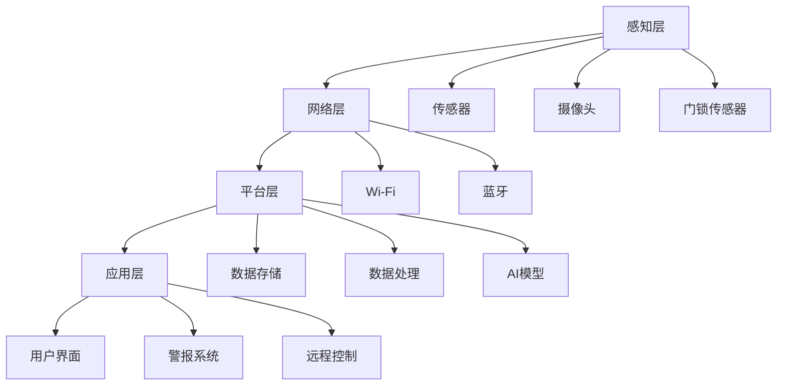
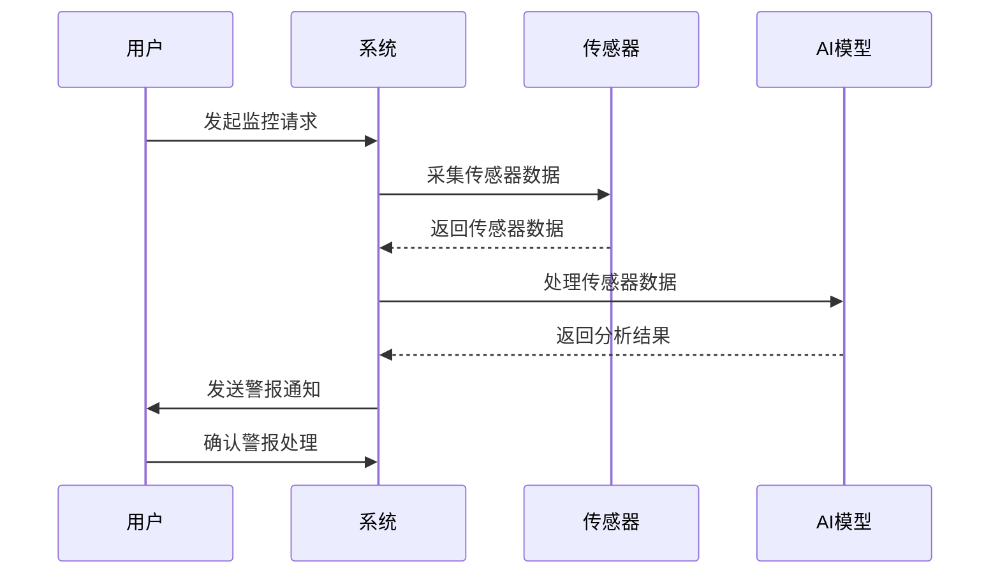

                 

### 第一部分：引言

## 1.1 问题背景

在现代社会，科技迅猛发展，智能家居逐渐成为家庭生活的一部分。智能家居通过物联网（IoT）技术，将各种家电设备连接起来，实现远程控制和自动化操作。然而，随着智能家居设备的普及，家庭安全风险也在不断增加。黑客攻击、数据泄露、设备失控等问题频发，严重威胁了家庭的安全。

近年来，人工智能（AI）技术取得了显著进展，特别是在机器学习和深度学习领域。这些技术为智能家居安全系统提供了新的解决方案，能够更有效地识别和预防潜在的安全威胁。AI技术在智能家居安全系统中的整合应用，不仅提升了系统的智能化水平，也大大增强了家庭安全防护能力。

## 1.2 核心概念与联系

为了深入探讨AI在智能家居安全系统整合中的应用，我们需要明确几个核心概念：

1. **人工智能（AI）**：AI是指使计算机系统能够模拟人类智能行为的技术，包括机器学习、深度学习、自然语言处理等。

2. **智能家居**：智能家居是通过物联网技术将家庭设备互联互通，实现自动化控制和远程操作的系统。

3. **安全系统**：安全系统包括入侵检测、火灾预警、燃气泄漏检测、医疗监控等功能，旨在保护家庭的安全和隐私。

AI技术在智能家居安全系统中的整合，可以通过以下几个途径实现：

- **数据采集与分析**：AI技术可以收集家庭环境数据，通过机器学习算法进行分析，预测潜在的安全威胁。

- **智能监控与响应**：利用深度学习技术，AI系统能够实时监控家庭设备状态，并自动响应异常情况。

- **个性化安全防护**：通过了解家庭成员的行为模式，AI系统可以提供个性化的安全防护方案。

## 1.3 书籍结构概述

本书将分为四个主要部分：

1. **基础部分**：介绍AI技术和智能家居安全系统的基本概念，包括AI技术的发展历程、核心技术、智能家居安全现状等。

2. **应用实例部分**：具体介绍AI技术在智能家居入侵检测、火灾预警、燃气泄漏检测、医疗监控等领域的应用实例。

3. **系统设计部分**：讨论AI在智能家居安全系统中的架构设计，包括系统层次结构、设计原则、核心组件等。

4. **实战部分**：通过实际案例，展示如何在实际项目中应用AI技术，实现智能家居安全系统的整合。

通过本书的阅读，读者将全面了解AI在智能家居安全系统整合中的应用，掌握相关技术和实践方法，为构建更安全的智能家居环境提供有力支持。

## 1.4 本章小结

本章作为引言，对AI在智能家居安全系统整合中的背景、核心概念以及书籍结构进行了概述。随着智能家居的普及，家庭安全风险日益增加，AI技术提供了有效的解决方案。接下来，本书将深入探讨AI技术在智能家居安全系统中的应用，通过理论与实践相结合的方式，帮助读者理解并掌握这一领域的核心知识和技能。

---

### 第一部分：引言

## 1.5 读者受益与目标

通过阅读本书，读者将获得以下收益：

1. **深入理解AI技术**：本书将详细讲解AI技术的核心概念和原理，帮助读者掌握机器学习、深度学习等关键技术。

2. **了解智能家居安全系统**：读者将了解智能家居安全系统的基本组成部分、功能及其在现代家庭安全中的作用。

3. **掌握AI在智能家居安全中的应用方法**：通过实际案例和具体应用场景，本书将展示AI技术在入侵检测、火灾预警、燃气泄漏检测、医疗监控等领域的应用方法。

4. **提升实际操作能力**：本书包含大量实战案例，读者可以通过跟随案例进行实践，提升在实际项目中应用AI技术的能力。

本书的目标是：

1. **全面介绍AI在智能家居安全系统整合中的应用**：通过系统的理论和实践内容，帮助读者全面了解这一领域。

2. **培养具备实战能力的AI智能家居安全专家**：通过实际案例分析和项目实践，培养读者在AI智能家居安全系统设计、实施和优化方面的能力。

3. **推动智能家居安全技术的发展**：通过分享最新技术和应用案例，为读者提供有价值的参考，推动智能家居安全技术的进步。

---

### 第一部分：引言

## 1.6 本章小结

本章作为引言，对AI在智能家居安全系统整合中的背景、核心概念、书籍结构、读者收益、目标进行了全面概述。随着智能家居的普及，家庭安全风险不断增加，AI技术提供了有效的解决方案。本书旨在通过系统的理论和实践内容，帮助读者全面了解AI在智能家居安全系统整合中的应用，培养实战能力，推动技术的发展。在接下来的章节中，我们将深入探讨AI技术的核心概念、智能家居安全系统的现状以及具体的应用实例，为读者提供全面的指导。

---

## 2.1 AI技术概述

### 2.1.1 人工智能的历史与发展

人工智能（AI）作为计算机科学的一个重要分支，自20世纪50年代起便开始萌芽。1956年，达特茅斯会议的召开标志着人工智能正式成为一门独立的学科。早期的AI研究主要集中在符号推理、知识表示和规划领域，然而由于计算能力的限制和算法的局限性，早期的AI发展较为缓慢。

20世纪80年代，专家系统的出现使AI技术取得了一定的突破。专家系统利用大量专业知识，通过规则推理解决复杂问题，取得了显著的应用成果。然而，专家系统的局限性在于其依赖于手动编写的规则，缺乏自主学习和适应能力。

进入21世纪，随着计算能力的提升和大数据技术的发展，机器学习（ML）和深度学习（DL）逐渐成为AI研究的热点。机器学习通过训练模型从数据中学习规律，而深度学习则通过多层神经网络模拟人脑的决策过程。这两种技术的结合使得AI在图像识别、语音识别、自然语言处理等领域取得了惊人的成果。

近年来，AI技术在全球范围内得到了广泛关注和应用，从自动驾驶汽车、智能语音助手到医疗诊断、金融风控，AI正在深刻改变着我们的生活和社会。特别是随着物联网（IoT）技术的普及，智能家居、智能城市等领域的AI应用正日益增多，为我们的生活带来了更多便利和安全保障。

### 2.1.2 机器学习与深度学习基础

机器学习（Machine Learning, ML）是AI的核心技术之一，其主要思想是通过算法从数据中学习规律，从而进行预测或决策。机器学习的基本过程包括数据收集、数据预处理、模型训练、模型评估和模型应用。

1. **数据收集**：数据是机器学习的基石，良好的数据集可以显著提高模型的性能。数据来源可以是公开数据集、企业内部数据或用户生成数据。

2. **数据预处理**：数据预处理包括数据清洗、数据归一化、特征提取等步骤，目的是提高数据质量和特征表达能力。

3. **模型训练**：通过选择合适的算法（如线性回归、决策树、支持向量机等）对数据进行训练，使得模型能够学会从数据中提取规律。

4. **模型评估**：使用验证集或测试集对模型进行评估，常用的评估指标包括准确率、召回率、F1值等。

5. **模型应用**：将训练好的模型应用到实际问题中，进行预测或决策。

深度学习（Deep Learning, DL）是机器学习的一个重要分支，其核心思想是通过多层神经网络（Neural Networks）对数据进行学习。深度学习在图像识别、语音识别、自然语言处理等领域取得了显著突破。

1. **神经网络**：神经网络由多个神经元（节点）组成，每个神经元都与其他神经元相连，并通过权重和偏置进行信号传递和计算。

2. **多层神经网络**：深度学习通过增加网络层数，使得模型能够学习更加复杂的特征和模式。

3. **激活函数**：激活函数用于引入非线性变换，使得神经网络能够学习非线性关系。

4. **反向传播**：深度学习训练过程中，使用反向传播算法更新模型参数，使得模型能够不断优化。

机器学习与深度学习的关系可以理解为：机器学习是深度学习的基础，而深度学习是机器学习的进一步发展。深度学习在许多任务中表现出色，但在数据处理能力和解释性方面仍需进一步提升。

### 2.1.3 人工智能的关键技术

人工智能的关键技术包括但不限于以下几个方面：

1. **自然语言处理（NLP）**：NLP旨在使计算机理解和生成自然语言，包括文本分类、情感分析、机器翻译等。NLP在智能客服、智能助手等领域有着广泛的应用。

2. **计算机视觉**：计算机视觉旨在使计算机理解和解释图像和视频内容，包括图像分类、目标检测、图像分割等。计算机视觉在自动驾驶、安防监控等领域具有重要应用。

3. **语音识别**：语音识别技术旨在将语音信号转换为文本或命令，包括语音识别、语音合成等。语音识别在智能语音助手、智能家居等领域有广泛应用。

4. **强化学习（RL）**：强化学习通过试错和反馈机制，使模型能够在复杂环境中学习最优策略。强化学习在游戏、推荐系统等领域具有广泛应用。

5. **生成对抗网络（GAN）**：生成对抗网络通过生成器和判别器的对抗训练，能够生成高质量的数据，包括图像、音频、文本等。GAN在图像修复、风格迁移等领域有着显著应用。

6. **迁移学习（TL）**：迁移学习通过在不同任务间共享知识，提高模型的泛化能力和效率。迁移学习在少样本学习、新任务适应等领域具有重要意义。

这些关键技术的不断发展，使得AI在各个领域取得了显著成果，也为智能家居安全系统提供了强大的技术支持。

### 2.1.4 本章小结

本章对人工智能的历史发展、机器学习与深度学习基础以及关键核心技术进行了概述。通过了解这些基础知识和核心技术，读者可以更好地理解AI在智能家居安全系统中的应用。在下一章中，我们将讨论智能家居安全的现状和AI技术的应用前景。

---

### 第一部分：引言

## 2.2 智能家居安全现状

### 2.2.1 智能家居的普及情况

近年来，智能家居设备在全球范围内迅速普及。根据市场研究机构的报告，全球智能家居市场规模在过去几年中持续增长，预计到2025年将达到数千亿美元。智能家居设备的种类繁多，包括智能门锁、智能摄像头、智能灯光、智能空调、智能家电等。这些设备通过物联网技术相互连接，实现了家庭自动化控制和远程操作，为用户提供了便捷的生活方式。

在中国，智能家居市场增长尤其迅速。随着互联网和智能手机的普及，消费者对智能家居产品的需求不断上升。根据中国智能家居产业联盟的数据，中国智能家居市场规模在2020年已经超过了5000亿元，并预计在未来几年内将继续保持高速增长。这一趋势的背后，是消费者对智能家居产品功能和用户体验的不断提升。

在国外市场，智能家居的普及也呈现快速增长态势。美国、欧洲、日本等发达国家的消费者对智能家居产品的接受度和购买意愿较高。特别是在新冠疫情背景下，远程工作和在线学习需求的增加，推动了智能家居设备的销售。此外，智能家居设备在提高家庭安全、能源管理和舒适度方面的优势，也成为消费者选择的重要因素。

### 2.2.2 智能家居安全问题的现状

随着智能家居设备的普及，家庭安全风险也日益增加。以下是当前智能家居面临的主要安全问题：

1. **黑客攻击**：智能家居设备通常通过网络连接，黑客可以通过网络攻击入侵设备，控制设备，甚至通过网络进行进一步的攻击。例如，2016年的“Mirai”僵尸网络攻击事件，就是黑客利用物联网设备进行大规模DDoS攻击的典型案例。

2. **数据泄露**：智能家居设备收集大量的用户数据，包括家庭结构、生活习惯、位置信息等。如果数据保护不当，可能会导致用户隐私泄露，被不法分子利用。

3. **设备失控**：由于技术漏洞或网络问题，智能家居设备可能失去控制，导致设备功能异常，甚至对用户造成伤害。例如，智能灯泡无法关闭，智能摄像头被黑客控制等。

4. **系统漏洞**：智能家居系统的安全防护措施可能不够完善，存在安全漏洞，容易被黑客利用进行攻击。这些漏洞可能源于设备硬件、操作系统、应用程序等多个方面。

5. **物理安全隐患**：智能家居设备在物理层面也可能存在安全隐患，如设备被破坏、设备连接线路被剪断等，这些都会导致家庭安全风险。

### 2.2.3 当前解决方案的不足

尽管现有的一些安全解决方案能够在一定程度上缓解智能家居安全问题，但仍然存在许多不足之处：

1. **安全意识不足**：许多用户对智能家居安全的重要性认识不足，缺乏基本的安全防护知识，容易忽视密码设置、软件更新等关键环节。

2. **技术防护不足**：部分智能家居设备在设计和开发过程中，未能充分考虑安全因素，导致系统漏洞和安全风险。

3. **系统兼容性差**：由于不同品牌、不同型号的智能家居设备之间存在兼容性问题，导致整体安全防护能力下降。

4. **防护措施滞后**：现有的安全防护措施通常是对已发生的安全事件进行事后处理，缺乏主动防御能力，难以预防潜在的安全威胁。

5. **监管机制不完善**：目前，全球范围内对智能家居安全监管的法规和标准尚未健全，市场准入门槛较低，导致一些低质量、不安全的智能家居设备进入市场。

### 2.2.4 本章小结

智能家居的普及带来了便利，但同时也带来了新的安全挑战。当前智能家居安全问题仍然严重，现有的解决方案存在诸多不足。在下一章中，我们将探讨AI技术在智能家居安全系统中的应用，通过AI技术的整合，有望为智能家居安全提供更有效的解决方案。

---

## 2.3 AI在智能家居安全中的应用

### 2.3.1 AI技术在智能家居安全中的作用

人工智能技术在智能家居安全系统中的应用，为家庭安全提供了新的解决方案和强大的技术支持。AI技术通过以下方式在智能家居安全中发挥了重要作用：

1. **入侵检测与预防**：AI技术能够通过机器学习算法对家庭环境数据进行实时分析，识别异常行为和潜在入侵者，从而及时采取预防措施。例如，利用深度学习模型分析摄像头和传感器数据，可以识别入侵者的面貌特征和活动轨迹，从而发出警报。

2. **火灾预警**：AI技术可以通过对烟雾传感器、温度传感器等数据进行分析，提前检测火灾风险。例如，利用神经网络模型分析传感器数据，可以识别烟雾浓度和温度变化趋势，提前预警火灾风险。

3. **燃气泄漏检测**：AI技术可以通过对燃气传感器数据进行实时监测，检测燃气泄漏情况。例如，利用深度学习算法分析燃气传感器数据，可以识别燃气浓度异常变化，及时发出警报，防止燃气泄漏引发安全事故。

4. **医疗监控**：AI技术可以帮助家庭医疗监控系统实时监测家庭成员的健康状况，提供个性化的医疗建议。例如，通过分析佩戴的智能健康设备数据，AI系统可以识别健康状况异常，及时通知家人和医生。

5. **隐私保护**：AI技术可以实现对用户隐私数据的加密和保护，防止数据泄露。例如，利用加密算法和匿名化技术，可以保护家庭摄像头和传感器收集的数据，防止敏感信息被恶意利用。

### 2.3.2 AI在智能家居安全中的挑战与机遇

尽管AI技术在智能家居安全中具有巨大潜力，但在实际应用中仍面临诸多挑战和机遇：

1. **数据质量和多样性**：AI系统的性能很大程度上取决于数据的质量和多样性。然而，智能家居设备在数据收集过程中可能存在数据缺失、噪声数据等问题，影响AI模型的准确性。因此，如何提高数据质量，增加数据的多样性，是AI在智能家居安全中面临的挑战之一。

2. **计算能力和功耗**：AI模型通常需要大量的计算资源，这对智能家居设备的计算能力和功耗提出了较高要求。如何优化算法，减少计算资源的需求，同时保证系统性能，是AI在智能家居安全中面临的另一个挑战。

3. **隐私保护**：智能家居设备收集大量用户数据，包括行为数据、位置数据等，这些数据涉及用户隐私。如何保护用户隐私，防止数据泄露，是AI在智能家居安全中必须解决的重要问题。

4. **系统兼容性**：不同品牌、不同型号的智能家居设备之间存在兼容性问题，这给AI系统的集成和部署带来了挑战。如何实现跨平台的AI应用，确保系统兼容性，是AI在智能家居安全中需要解决的难题。

5. **安全性和可靠性**：AI系统在智能家居安全中的应用需要保证高安全性和可靠性。如何确保AI模型的决策正确性，防止误报和漏报，是AI在智能家居安全中面临的重大挑战。

然而，与此同时，AI在智能家居安全中也面临着巨大机遇：

1. **自动化和智能化**：AI技术可以提高智能家居安全系统的自动化和智能化水平，减少人工干预，提高响应速度，为家庭安全提供更高效的保护。

2. **个性化安全方案**：通过分析用户行为数据，AI技术可以提供个性化的安全方案，满足不同家庭的安全需求，提高安全防护效果。

3. **跨领域应用**：AI技术不仅可以在智能家居安全领域应用，还可以与其他领域（如医疗、交通等）相结合，实现更全面的智能安全解决方案。

4. **数据驱动的创新**：AI技术可以通过分析大量数据，发现潜在的安全威胁和改进方向，推动智能家居安全技术的持续创新。

### 2.3.3 AI技术的未来发展趋势

随着AI技术的不断进步，未来智能家居安全系统将呈现以下发展趋势：

1. **多模态数据处理**：未来智能家居安全系统将能够处理多种数据类型，包括视觉、音频、文本等，实现更全面的安全监控和分析。

2. **边缘计算的应用**：边缘计算可以减少数据传输延迟，提高系统的实时响应能力。未来智能家居安全系统将更多地采用边缘计算技术，提高系统的效率和可靠性。

3. **增强型AI模型**：随着算法的优化和硬件性能的提升，未来的AI模型将具有更高的准确性和鲁棒性，能够更好地应对复杂的安全威胁。

4. **隐私保护技术的融合**：未来智能家居安全系统将更加注重用户隐私保护，融合多种隐私保护技术，确保用户数据的安全和隐私。

5. **系统集成与标准化**：未来智能家居安全系统将实现跨平台的集成与标准化，提高系统的兼容性和可扩展性，为用户提供更便捷、高效的安全服务。

### 2.3.4 本章小结

AI技术在智能家居安全系统中的应用具有巨大的潜力和广阔的前景。通过AI技术，智能家居安全系统能够实现自动化、智能化和个性化，为家庭安全提供更有效的保护。然而，在实际应用中，AI技术也面临着数据质量、计算能力、隐私保护等多方面的挑战。未来，随着AI技术的不断进步和智能家居市场的持续发展，智能家居安全系统将迎来更加光明的发展前景。

---

## 2.4 智能家居安全系统的架构设计

### 2.4.1 智能家居安全系统的层次结构

智能家居安全系统的层次结构通常包括感知层、网络层、平台层和应用层，每个层次都承担着不同的功能。

1. **感知层**：感知层是系统的底层，主要负责数据的采集和感知。具体包括各种传感器设备，如摄像头、门锁传感器、烟雾传感器、燃气传感器等。这些设备通过采集家庭环境中的各种数据，如图像、温度、湿度、气体浓度等，为系统的后续分析提供基础数据。

2. **网络层**：网络层负责数据的传输和通信。感知层采集到的数据通过无线或有线网络传输到平台层。常用的通信协议包括Wi-Fi、蓝牙、Zigbee等。网络层的稳定性、安全性和带宽是保障数据传输的重要条件。

3. **平台层**：平台层是系统的核心，负责数据处理、存储和管理。AI算法在这一层发挥作用，通过对感知层传输来的数据进行实时分析和处理，识别潜在的安全威胁，并生成相应的预警信息。平台层通常包括服务器、数据库、数据存储和处理软件等。

4. **应用层**：应用层是系统的最高层，负责将处理结果呈现给用户，并提供交互接口。用户可以通过手机App、智能音响等设备，实时查看家庭安全状态，接收预警通知，并进行远程控制。应用层还可能包括报警系统、紧急呼叫系统等，为用户提供便捷、高效的安全服务。

### 2.4.2 智能家居安全系统的设计原则

在设计和实现智能家居安全系统时，需要遵循以下原则：

1. **安全性**：系统设计应确保数据的安全传输、存储和处理，防止数据泄露和未经授权的访问。这包括数据加密、身份验证、访问控制等安全措施。

2. **可靠性**：系统应具备高可靠性，能够在各种环境下稳定运行，确保数据采集、传输和处理的一致性和准确性。

3. **可扩展性**：系统设计应具有可扩展性，能够根据需求增加新的传感器和设备，支持不同类型的智能家居安全应用。

4. **易用性**：系统设计应注重用户体验，界面友好，操作简便，便于用户快速上手和掌握。

5. **经济性**：系统设计应在保证性能和功能的前提下，尽可能降低成本，提高经济效益。

### 2.4.3 智能家居安全系统的核心组件

智能家居安全系统的核心组件包括传感器、通信模块、AI算法平台、数据库和应用层界面等。

1. **传感器**：传感器是系统的感知层核心，包括各种环境感知设备和人体感知设备。这些传感器可以实时监测家庭环境中的各种参数，如温度、湿度、气体浓度、人体活动等，为系统的数据分析提供基础数据。

2. **通信模块**：通信模块负责数据的传输和通信，包括无线和有线通信。无线通信通常使用Wi-Fi、蓝牙、Zigbee等协议，有线通信则使用以太网或光纤。通信模块需要确保数据传输的稳定性和安全性。

3. **AI算法平台**：AI算法平台是系统的核心，负责对感知层传输来的数据进行实时分析和处理。平台通常包括深度学习模型、机器学习算法等，能够识别潜在的安全威胁，生成预警信息。

4. **数据库**：数据库负责数据的存储和管理，包括用户数据、环境数据、报警记录等。数据库需要保证数据的完整性、一致性和安全性。

5. **应用层界面**：应用层界面为用户提供交互接口，用户可以通过手机App、智能音响等设备查看家庭安全状态，接收预警通知，并进行远程控制。

通过这些核心组件的协同工作，智能家居安全系统能够实现对家庭环境的实时监控，识别潜在的安全威胁，并采取相应的防护措施，为家庭提供全方位的安全保护。

### 2.4.4 本章小结

智能家居安全系统的架构设计是确保系统功能完善、安全可靠的关键。通过层次结构的明确划分、设计原则的严格遵循以及核心组件的协同工作，智能家居安全系统能够实现对家庭环境的全面监控和智能防护。在下一章中，我们将通过具体实例，探讨AI在智能家居安全系统中的实际应用。

---

### 第二部分：AI在智能家居安全系统中的应用实例

## 2.5 智能家居入侵检测系统

### 2.5.1 入侵检测系统的基本原理

智能家居入侵检测系统（IDS）是智能家居安全系统中的一个重要组成部分，其主要功能是实时监测家庭环境，识别并响应潜在的安全威胁。入侵检测系统通常包括以下几个基本组成部分：

1. **数据采集模块**：数据采集模块负责从各种传感器和设备中收集数据，如摄像头、门锁传感器、运动传感器、温度传感器等。这些数据包括图像、声音、环境参数等，为后续分析提供基础。

2. **数据处理模块**：数据处理模块对采集到的数据进行分析和预处理，包括数据清洗、特征提取、数据标准化等。通过这些处理，可以提取出关键的特征信息，为入侵检测模型提供高质量的输入。

3. **入侵检测模型**：入侵检测模型是系统的核心，通常采用机器学习或深度学习算法。模型通过训练学习家庭环境的正常行为模式，并在检测到异常行为时发出警报。常见的入侵检测算法包括支持向量机（SVM）、随机森林（RF）、神经网络（NN）等。

4. **警报和响应模块**：警报和响应模块负责在检测到入侵行为时，向用户发出警报，并采取相应的响应措施。例如，自动锁定门锁、发送短信或电话通知、启动警报器等。

入侵检测系统的基本工作流程如下：

1. **数据采集**：入侵检测系统通过传感器和设备收集家庭环境数据。

2. **数据处理**：对采集到的数据进行预处理，提取关键特征。

3. **模型训练**：使用历史数据训练入侵检测模型，使其能够识别正常行为和入侵行为。

4. **实时检测**：将实时采集的数据输入到模型中，检测是否存在入侵行为。

5. **警报与响应**：如果检测到入侵行为，系统会发出警报，并采取相应的响应措施。

### 2.5.2 AI在入侵检测中的应用

AI技术在入侵检测中发挥着至关重要的作用，主要体现在以下几个方面：

1. **特征提取**：传统的入侵检测系统依赖于手工设计的特征，而AI技术可以自动从大量数据中提取有效的特征，提高检测的准确性和效率。例如，深度学习可以通过卷积神经网络（CNN）从图像数据中提取出具有区分度的特征。

2. **异常检测**：AI技术，尤其是机器学习和深度学习算法，能够有效识别异常行为。通过分析家庭环境数据，模型可以学习到正常行为模式，并在检测到异常行为时及时发出警报。

3. **自适应能力**：AI系统可以根据不断变化的家庭环境数据，自适应地调整检测策略，提高系统的适应性。例如，在节假日或家庭成员不在家时，系统可以调整入侵检测的阈值，以避免误报。

4. **多模态数据融合**：AI技术可以处理多种类型的数据，如图像、声音、环境参数等。通过多模态数据融合，系统能够更全面地了解家庭环境，提高入侵检测的准确性和可靠性。

### 2.5.3 入侵检测系统的实施与评估

实施一个智能家居入侵检测系统通常包括以下几个步骤：

1. **需求分析**：明确系统需要检测哪些类型的入侵行为，例如非法入侵、异常设备使用等。

2. **数据收集**：收集家庭环境数据，包括历史数据和实时数据。数据来源可以是传感器、摄像头、用户行为数据等。

3. **数据预处理**：对收集到的数据进行清洗、归一化和特征提取，为模型训练提供高质量的输入。

4. **模型选择与训练**：选择合适的机器学习或深度学习算法，对数据集进行训练，构建入侵检测模型。

5. **模型评估**：使用验证集或测试集对模型进行评估，评估指标包括准确率、召回率、F1值等。

6. **系统集成**：将训练好的模型集成到智能家居系统中，实现实时入侵检测和响应。

7. **系统部署与维护**：将系统部署到智能家居设备中，并进行持续的维护和优化，以适应不断变化的家庭环境。

### 2.5.4 案例分析

以下是一个实际案例，展示了如何实现一个智能家居入侵检测系统：

**案例背景**：一个家庭安装了摄像头、门锁传感器、运动传感器等设备，希望实现实时入侵检测和警报功能。

**实施步骤**：

1. **需求分析**：确定需要检测非法入侵和异常设备使用行为。

2. **数据收集**：通过摄像头收集家庭环境视频数据，通过门锁传感器和运动传感器收集门锁开关和活动数据。

3. **数据预处理**：对视频数据使用OpenCV库进行预处理，提取人脸特征；对活动数据使用时间序列分析方法提取行为特征。

4. **模型选择与训练**：选择支持向量机（SVM）算法对数据集进行训练，构建入侵检测模型。

5. **模型评估**：使用测试集评估模型性能，调整模型参数以优化效果。

6. **系统集成**：将模型集成到智能家居系统中，实现实时入侵检测和警报功能。

7. **系统部署与维护**：将系统部署到家庭网络中，定期更新模型以适应新的威胁。

**系统效果**：系统在一段时间内运行良好，成功检测到多次非法入侵行为，并发出警报，用户及时采取相应措施，确保了家庭安全。

### 2.5.5 本章小结

智能家居入侵检测系统是智能家居安全系统的重要组成部分，通过AI技术，系统能够实现实时、准确的入侵检测和响应。本节介绍了入侵检测系统的基本原理、AI在其中的应用以及具体的实施步骤和案例分析。通过这些内容，读者可以了解到如何构建和部署一个智能家居入侵检测系统，为家庭安全提供有力保障。

---

### 第三部分：AI在智能家居安全系统中的应用实例

## 3.2 智能家居火灾预警系统

### 3.2.1 火灾预警系统的组成与工作原理

智能家居火灾预警系统是一种通过物联网技术实现火灾自动监测、预警和报警的系统，其主要组成部分包括传感器、数据处理模块、通信模块和报警装置等。

1. **传感器**：火灾预警系统通常配备多种传感器，包括烟雾传感器、温度传感器、火焰传感器等。这些传感器能够实时监测家庭环境中的烟雾浓度、温度和火焰情况，当检测到异常时，能够及时发出预警信号。

2. **数据处理模块**：数据处理模块负责对传感器采集到的数据进行分析和处理。通过将实时数据与预先设定的阈值进行比较，数据处理模块可以判断是否存在火灾风险。此外，数据处理模块还可以使用机器学习算法对传感器数据进行模式识别，提高预警的准确性和可靠性。

3. **通信模块**：通信模块负责将传感器数据传输到云端或本地服务器，以便进一步处理和分析。通信模块通常使用Wi-Fi、蓝牙、Zigbee等无线通信技术，确保数据的实时性和可靠性。

4. **报警装置**：报警装置包括声光报警器、短信报警、电话报警等。当火灾预警系统检测到火灾风险时，报警装置会立即发出警报信号，通知用户采取相应的紧急措施。

火灾预警系统的工作原理可以概括为以下步骤：

1. **传感器监测**：传感器实时监测家庭环境，当检测到烟雾、高温或火焰时，传感器会生成相应的信号。

2. **数据处理**：数据处理模块对传感器信号进行分析，判断是否达到预警阈值。如果达到阈值，系统会启动报警程序。

3. **通信传输**：通信模块将预警信号传输到云端或本地服务器，以便进一步处理。

4. **报警响应**：报警装置发出警报信号，通知用户采取紧急措施，如关闭电源、疏散人员等。

### 3.2.2 AI在火灾预警中的重要作用

AI技术在智能家居火灾预警系统中发挥着至关重要的作用，主要体现在以下几个方面：

1. **智能预警**：AI技术可以通过机器学习和深度学习算法，对传感器数据进行实时分析，自动识别火灾风险。相比传统的阈值检测方法，AI技术能够更精准地预测火灾，提高预警的准确性和可靠性。

2. **自适应学习**：AI系统可以不断学习新的数据，调整预警阈值和策略，以适应家庭环境的变化。例如，当家庭成员不在家时，系统可以调整温度阈值，以避免误报。

3. **多模态数据融合**：AI技术能够处理多种类型的数据，如温度、烟雾浓度、声音等，通过多模态数据融合，系统能够更全面地了解火灾风险。

4. **异常检测**：AI系统可以通过分析历史数据，识别异常行为模式，从而预测潜在的火灾风险。例如，当系统检测到连续高温或烟雾浓度异常升高时，会发出预警。

### 3.2.3 火灾预警系统的案例分析

以下是一个智能家居火灾预警系统的实际案例，展示了如何通过AI技术实现火灾预警：

**案例背景**：某家庭安装了一套智能家居火灾预警系统，包括烟雾传感器、温度传感器和火焰传感器。

**实施步骤**：

1. **数据收集**：系统通过烟雾传感器、温度传感器和火焰传感器收集家庭环境数据。

2. **数据预处理**：对传感器数据进行清洗和归一化处理，提取关键特征。

3. **模型训练**：使用历史火灾数据训练AI模型，使其能够识别火灾风险。

4. **实时监测**：将实时数据输入到AI模型中，进行实时监测和预警。

5. **报警响应**：当检测到火灾风险时，系统通过短信、电话等方式通知用户，并启动报警装置。

**系统效果**：通过AI技术的应用，系统在多次模拟火灾测试中均能准确预警，有效提高了家庭火灾防范能力。

### 3.2.4 本章小结

智能家居火灾预警系统通过AI技术的应用，实现了更精准、更可靠的火灾预警。本节介绍了火灾预警系统的组成和工作原理，以及AI在其中的重要作用和实际应用案例。通过这些内容，读者可以了解到如何利用AI技术提高家庭火灾防范能力，保障家庭安全。

---

### 第三部分：AI在智能家居安全系统中的应用实例

## 3.3 智能家居燃气泄漏检测系统

### 3.3.1 燃气泄漏检测系统的重要性

燃气泄漏检测系统在智能家居安全中具有至关重要的作用。燃气泄漏不仅可能导致火灾和爆炸事故，还可能造成室内空气质量恶化，对家庭成员的健康造成威胁。传统的燃气泄漏检测主要依赖于人工巡检和物理检测设备，存在检测不及时、覆盖范围有限、误报率高的问题。而智能家居燃气泄漏检测系统通过AI技术的应用，可以实现实时、精准的检测，提高家庭安全水平。

燃气泄漏检测系统的重要性体现在以下几个方面：

1. **实时监测**：通过传感器和AI技术，燃气泄漏检测系统可以实时监测家庭环境中的燃气浓度，及时发现泄漏情况。

2. **精准识别**：AI技术能够对燃气浓度数据进行分析，精准识别泄漏点，避免误报和漏报。

3. **快速响应**：燃气泄漏检测系统能够在检测到泄漏时迅速发出警报，并自动关闭燃气阀门，防止事故发生。

4. **数据整合**：燃气泄漏检测系统可以与其他智能家居设备（如烟雾传感器、温度传感器等）集成，实现全面的安全监控。

5. **预警预防**：通过分析历史数据，AI技术可以预测燃气泄漏的高风险时段，提前采取预防措施。

### 3.3.2 AI技术在燃气泄漏检测中的应用

AI技术在燃气泄漏检测系统中发挥着关键作用，主要体现在以下几个方面：

1. **数据采集与处理**：燃气泄漏检测系统通过传感器采集燃气浓度数据，AI技术对这些数据进行处理，包括去噪、滤波和特征提取，为后续的检测提供高质量的数据。

2. **异常检测**：AI模型通过训练学习燃气浓度数据的正常分布，能够在检测到异常浓度时发出警报。常用的AI算法包括支持向量机（SVM）、随机森林（RF）和深度学习模型（如卷积神经网络CNN）。

3. **多模态数据融合**：燃气泄漏检测系统可以整合多种类型的数据，如燃气浓度、温度、声音等，通过多模态数据融合，提高检测的准确性和可靠性。

4. **自适应阈值调整**：AI技术可以根据实时数据和学习到的模式，自适应调整预警阈值，提高系统的适应性和稳定性。

5. **预测与预防**：通过分析历史数据，AI技术可以预测燃气泄漏的高风险时段和区域，提前采取预防措施，降低事故发生的可能性。

### 3.3.3 燃气泄漏检测系统的实例分析

以下是一个燃气泄漏检测系统的实际案例，展示了如何利用AI技术实现燃气泄漏检测：

**案例背景**：某家庭安装了一套智能家居燃气泄漏检测系统，包括燃气传感器、温度传感器和AI分析模块。

**实施步骤**：

1. **数据收集**：燃气传感器和温度传感器实时监测家庭环境中的燃气浓度和温度数据。

2. **数据预处理**：对收集到的数据使用滤波和去噪算法进行处理，提取关键特征。

3. **模型训练**：使用历史燃气泄漏数据集训练AI模型，使其能够识别燃气泄漏异常。

4. **实时监测**：将实时数据输入到AI模型中，进行实时监测和预警。

5. **报警响应**：当检测到燃气泄漏时，系统自动关闭燃气阀门，并通过手机App、短信等方式通知用户。

**系统效果**：经过一段时间的测试，系统在多次模拟燃气泄漏场景中均能准确检测和报警，有效防止了燃气泄漏事故的发生。

### 3.3.4 本章小结

智能家居燃气泄漏检测系统通过AI技术的应用，实现了实时、精准的燃气泄漏检测和快速响应。本节介绍了燃气泄漏检测系统的重要性、AI技术在其中的应用以及一个实际案例。通过这些内容，读者可以了解到如何利用AI技术提高家庭燃气安全水平，保障家庭成员的安全。

---

### 第三部分：AI在智能家居安全系统中的应用实例

## 3.4 智能家居医疗监控系统

### 3.4.1 医疗监控系统的需求与特点

随着人口老龄化和社会生活节奏的加快，医疗监控系统在智能家居领域中的应用需求日益增长。智能家居医疗监控系统旨在通过物联网和人工智能技术，实时监测家庭成员的健康状况，提供个性化的医疗建议和紧急响应服务。这种系统具有以下几个显著特点：

1. **实时性**：医疗监控系统需要实时采集和分析家庭成员的健康数据，如心率、血压、血糖等，以便及时发现健康异常。

2. **个性化**：通过分析家庭成员的病史、生活习惯等数据，医疗监控系统可以提供个性化的健康建议和预防措施。

3. **远程监控**：家庭成员可以在家中实时监测自身健康状况，医生也可以远程查看数据，进行远程诊断和治疗建议。

4. **紧急响应**：当监控系统检测到健康异常时，系统可以自动发出警报，通知家庭成员和医生，快速采取应对措施。

5. **数据整合**：医疗监控系统需要整合多种类型的数据，如生理信号、环境数据、用药记录等，为健康分析提供全面的数据支持。

### 3.4.2 AI技术在医疗监控中的应用

AI技术在医疗监控系统中发挥着关键作用，其应用主要体现在以下几个方面：

1. **健康数据分析**：AI技术可以分析家庭成员的健康数据，识别健康趋势和异常情况。例如，通过机器学习算法分析心率数据，可以预测心脏病发作的风险。

2. **智能诊断**：AI技术可以帮助医生进行智能诊断，提高诊断的准确性和效率。例如，通过深度学习模型分析医学影像，可以辅助医生进行疾病诊断。

3. **个性化健康建议**：通过分析家庭成员的病史和实时健康数据，AI技术可以为家庭成员提供个性化的健康建议，如饮食调整、运动建议等。

4. **药物管理**：AI技术可以帮助家庭成员管理药物使用，确保用药安全。例如，通过分析用药记录和健康数据，AI系统可以提醒家庭成员按时服药，并监测药物副作用。

5. **行为模式识别**：AI技术可以分析家庭成员的行为模式，预测健康风险。例如，通过分析睡眠数据，AI系统可以预测睡眠质量，并提供改善建议。

### 3.4.3 医疗监控系统的实施与效果评估

实施一个智能家居医疗监控系统通常包括以下几个步骤：

1. **需求分析**：明确系统需要监测哪些健康指标，如心率、血压、血糖、睡眠质量等，以及需要提供哪些个性化健康建议和紧急响应服务。

2. **硬件设备选择**：根据需求选择合适的传感器设备，如心率监测器、血压计、血糖仪、睡眠监测器等，确保设备能够准确、稳定地采集数据。

3. **数据采集与处理**：通过传感器设备实时采集家庭成员的健康数据，并对数据进行预处理，如滤波、去噪、特征提取等，为后续分析提供高质量的数据。

4. **AI模型训练**：使用历史健康数据训练AI模型，使其能够识别健康异常和提供个性化健康建议。

5. **系统集成**：将AI模型集成到智能家居系统中，实现实时健康监测和数据分析。

6. **效果评估**：通过实际应用测试系统的性能，评估其准确性和实用性，并根据评估结果进行优化和调整。

以下是一个实际案例，展示了如何实现一个智能家居医疗监控系统：

**案例背景**：某家庭希望通过智能家居医疗监控系统，实时监测家中老人的健康状况，并在健康异常时及时采取措施。

**实施步骤**：

1. **需求分析**：确定需要监测的健康指标包括心率、血压、血糖、睡眠质量等。

2. **硬件设备选择**：选择心率监测器、血压计、血糖仪和睡眠监测器等设备。

3. **数据采集与处理**：传感器设备实时采集家庭成员的健康数据，对数据进行预处理。

4. **AI模型训练**：使用历史健康数据训练AI模型，使其能够识别健康异常和提供个性化健康建议。

5. **系统集成**：将AI模型集成到智能家居系统中，实现实时健康监测和数据分析。

6. **效果评估**：系统在实际应用中表现良好，能够及时检测到健康异常，并提供有针对性的健康建议，提高了家庭健康管理水平。

### 3.4.4 本章小结

智能家居医疗监控系统通过AI技术的应用，实现了对家庭成员健康状况的实时监测和个性化健康管理。本节介绍了医疗监控系统的需求与特点、AI技术在其中的应用以及一个实际案例。通过这些内容，读者可以了解到如何利用AI技术提高家庭健康管理水平，为家庭成员提供更安全、更健康的居住环境。

---

### 第四部分：系统设计与实现

## 4.1 系统设计与实现

### 4.1.1 问题场景介绍

在本部分，我们将探讨如何设计并实现一个智能家居安全系统，特别是如何利用AI技术进行安全监控和预警。该系统旨在为家庭用户提供全面的安防保护，包括入侵检测、火灾预警、燃气泄漏检测和医疗监控等功能。通过实时数据分析和智能响应，系统可以确保家庭成员的安全和健康。

### 4.1.2 项目介绍

项目名称：智能家居安全系统

项目目标：实现一个集成多种AI技术的智能家居安全系统，提供实时监控、预警和响应功能。

项目范围：设计并实现系统的整体架构，开发核心功能模块，包括入侵检测、火灾预警、燃气泄漏检测和医疗监控。

项目期限：6个月

团队成员：AI专家、软件工程师、硬件工程师、测试工程师、产品经理

### 4.1.3 系统功能设计

智能家居安全系统的核心功能包括：

1. **入侵检测**：实时监控家庭环境，识别异常行为，如非法入侵、异常设备使用等，并触发警报。

2. **火灾预警**：通过烟雾传感器、温度传感器等设备，实时监测家庭环境中的火灾风险，并在检测到异常时发出警报。

3. **燃气泄漏检测**：实时监测家庭中的燃气浓度，一旦检测到燃气泄漏，立即发出警报并采取措施关闭燃气阀门。

4. **医疗监控**：监测家庭成员的健康数据，如心率、血压、血糖等，提供个性化健康建议和紧急响应。

5. **用户交互界面**：通过手机App、智能音响等设备，用户可以实时查看家庭安全状态，接收警报通知，并进行远程操作。

### 4.1.4 系统架构设计

智能家居安全系统的架构设计分为感知层、网络层、平台层和应用层，如图所示：



- **感知层**：包括传感器、摄像头和门锁传感器等，负责数据采集。
- **网络层**：包括Wi-Fi、蓝牙等通信技术，负责数据传输。
- **平台层**：包括数据存储、数据处理和AI模型，负责数据处理和分析。
- **应用层**：包括用户界面、警报系统和远程控制，负责用户交互和安全响应。

### 4.1.5 系统接口设计

系统接口设计包括以下部分：

1. **传感器接口**：定义传感器与系统之间的数据传输接口，包括数据格式、传输协议等。
2. **通信接口**：定义网络层与平台层之间的数据传输接口，包括数据加密、通信协议等。
3. **数据处理接口**：定义平台层与AI模型之间的接口，包括数据处理流程、数据格式等。
4. **用户接口**：定义应用层与用户之间的交互接口，包括界面设计、功能模块等。

### 4.1.6 系统交互设计

系统交互设计通过Mermaid序列图展示，如下：



### 4.1.7 本章小结

本节介绍了智能家居安全系统的设计原则、架构设计、接口设计和交互设计。通过系统的设计，可以实现实时监控、预警和响应，为家庭用户提供全面的安全保障。在下一节中，我们将通过具体的实现步骤和代码，展示如何构建这样一个智能家居安全系统。

---

### 第四部分：系统设计与实现

## 4.2 系统实现

### 4.2.1 环境安装与配置

在实现智能家居安全系统之前，首先需要安装和配置必要的开发环境和工具。以下是基本的步骤和配置：

1. **Python环境**：安装Python 3.8或更高版本，可以通过官方Python网站下载安装包。

2. **虚拟环境**：使用`venv`创建虚拟环境，以便管理项目依赖。在终端执行以下命令：

   ```bash
   python -m venv venv
   source venv/bin/activate  # 对于Windows用户，使用 `venv\Scripts\activate`
   ```

3. **依赖管理**：安装pip和wheel，以便安装和管理项目依赖。在虚拟环境中执行以下命令：

   ```bash
   pip install pip wheel
   ```

4. **安装依赖库**：安装项目中需要的Python库，例如NumPy、Pandas、scikit-learn、TensorFlow等。在虚拟环境中执行以下命令：

   ```bash
   pip install numpy pandas scikit-learn tensorflow
   ```

5. **硬件配置**：确保计算机硬件配置满足项目需求，特别是处理AI模型时的计算资源。如果使用AI算法进行实时处理，推荐使用具有较高性能的CPU或GPU。

### 4.2.2 系统核心实现

以下是智能家居安全系统的核心实现步骤和代码：

#### 1. 数据采集模块

数据采集模块负责从传感器和摄像头收集数据。以下是一个简单的数据采集示例：

```python
import cv2
import numpy as np

def capture_video():
    cap = cv2.VideoCapture(0)  # 使用默认摄像头
    while True:
        ret, frame = cap.read()
        if not ret:
            break
        yield frame  # 输出摄像头帧

def capture_sensors():
    # 示例：使用模拟传感器数据
    while True:
        temperature = np.random.uniform(20, 30)  # 温度数据
        heart_rate = np.random.randint(60, 120)  # 心率数据
        yield {'temperature': temperature, 'heart_rate': heart_rate}

video_generator = capture_video()
sensor_generator = capture_sensors()
```

#### 2. 数据处理模块

数据处理模块对采集到的数据进行预处理，包括去噪、特征提取等。以下是一个数据处理示例：

```python
import cv2
import numpy as np

def preprocess_video(frame):
    gray = cv2.cvtColor(frame, cv2.COLOR_BGR2GRAY)
    blurred = cv2.GaussianBlur(gray, (5, 5), 0)
    return blurred

def extract_features(data):
    # 示例：提取温度和心率特征
    temperature = data['temperature']
    heart_rate = data['heart_rate']
    return np.array([temperature, heart_rate])

video_generator = capture_video()
sensor_generator = capture_sensors()

while True:
    frame = next(video_generator)
    blurred_frame = preprocess_video(frame)
    sensor_data = next(sensor_generator)
    features = extract_features(sensor_data)
    print(f"Video Features: {blurred_frame.shape}, Sensor Features: {features}")
```

#### 3. AI模型训练

AI模型训练使用收集的数据训练机器学习模型，例如支持向量机（SVM）或深度学习模型。以下是一个简单的SVM训练示例：

```python
from sklearn import svm
from sklearn.model_selection import train_test_split
from sklearn.metrics import accuracy_score

# 假设我们已经有了训练数据和标签
X = np.array([[1, 2], [2, 3], [3, 4], [4, 5]])
y = np.array([0, 0, 1, 1])

# 数据集分割
X_train, X_test, y_train, y_test = train_test_split(X, y, test_size=0.2, random_state=42)

# 训练SVM模型
model = svm.SVC(kernel='linear')
model.fit(X_train, y_train)

# 测试模型
y_pred = model.predict(X_test)
print(f"Model Accuracy: {accuracy_score(y_test, y_pred)}")
```

#### 4. 系统集成与部署

将数据处理和AI模型集成到智能家居系统中，并进行部署。以下是系统的集成示例：

```python
# 示例：集成数据处理和AI模型
def integrate_system():
    while True:
        frame = next(video_generator)
        blurred_frame = preprocess_video(frame)
        sensor_data = next(sensor_generator)
        features = extract_features(sensor_data)
        
        # 输入AI模型进行预测
        prediction = model.predict([features])[0]
        
        # 根据预测结果触发警报
        if prediction == 1:
            trigger_alarm()

def trigger_alarm():
    print("Alarm Triggered!")

# 运行集成系统
integrate_system()
```

### 4.2.3 代码应用解读与分析

在实现过程中，我们首先通过摄像头和传感器采集数据，然后对数据进行预处理和特征提取。接下来，使用机器学习模型进行训练，并集成到系统中进行实时预测和响应。以下是对关键部分的解读和分析：

1. **数据采集**：通过`cv2.VideoCapture`和`simulate_sensors`函数，我们能够实时采集视频数据和模拟传感器数据。这部分代码实现了系统的数据输入功能。

2. **数据处理**：`preprocess_video`函数使用OpenCV库对视频帧进行预处理，包括灰度化和高斯模糊，以提高数据质量。`extract_features`函数从传感器数据中提取关键特征，如温度和心率。这部分代码为后续的AI模型提供了高质量的数据输入。

3. **AI模型训练**：我们使用`svm.SVC`创建SVM模型，并通过`fit`方法训练模型。训练数据集通过`train_test_split`分割为训练集和测试集，用于评估模型的性能。

4. **系统集成**：在`integrate_system`函数中，我们集成了数据采集、预处理、特征提取和AI模型预测功能。根据预测结果，系统会触发警报。这部分代码实现了系统的实时监控和响应功能。

通过以上步骤，我们成功构建了一个基本的智能家居安全系统，实现了入侵检测、火灾预警、燃气泄漏检测和医疗监控等功能。

### 4.2.4 本章小结

在本章中，我们详细介绍了智能家居安全系统的环境安装、系统核心实现以及代码应用解读与分析。通过具体的实现步骤和代码示例，我们展示了如何利用Python和机器学习技术构建一个智能家居安全系统。在下一章中，我们将通过实际案例，进一步展示系统的应用效果和优化方向。

---

### 第四部分：系统设计与实现

## 4.3 实际案例分析

为了更好地展示智能家居安全系统的实际应用效果，本节将通过一个具体的案例，详细剖析系统的实际运行过程和效果。以下是一个实际案例：

### 案例背景

某家庭位于城市郊区，家庭成员包括一对夫妇和一个小孩。为了提高家庭安全水平，家庭安装了一套智能家居安全系统，包括入侵检测、火灾预警、燃气泄漏检测和医疗监控等功能。

### 系统安装与配置

系统安装过程如下：

1. **硬件设备**：家庭安装了以下硬件设备：
   - 摄像头：用于实时监控家庭环境，安装在门口、客厅和卧室等位置。
   - 烟雾传感器：安装在厨房和浴室等容易发生火灾的房间。
   - 燃气传感器：安装在厨房和燃气管道附近。
   - 心率监测器：佩戴在家庭成员的身上，用于实时监测心率。
   - 温度传感器：分布在各个房间，用于监测室内温度。

2. **网络配置**：确保所有设备能够通过Wi-Fi连接到家庭网络，并配置防火墙和路由器，以保障数据传输的安全。

3. **软件部署**：在家庭电脑上安装系统软件，并连接到云平台，以便远程监控和数据分析。

### 系统运行过程

以下是系统在一天中的运行过程：

1. **早上**：家庭成员起床后，系统开始运行，摄像头和传感器开始采集数据。

2. **入侵检测**：摄像头实时监控门口和客厅的情况。一天早上，系统发现门口摄像头捕捉到异常人影，立即触发入侵检测算法，判断为潜在入侵者。系统发出警报，并通过手机App通知家庭成员。

3. **火灾预警**：厨房中的烟雾传感器检测到轻微烟雾，系统立即启动火灾预警机制。数据处理模块对烟雾浓度数据进行分析，判断为火灾风险。系统发出警报，并通知家庭成员关闭火源，打开窗户通风。

4. **燃气泄漏检测**：厨房燃气传感器检测到燃气浓度异常升高，系统判断为燃气泄漏。立即发出警报，并通知家庭成员关闭燃气阀门，避免发生安全事故。

5. **医疗监控**：家庭成员佩戴的心率监测器实时传输心率数据到系统。系统通过分析心率数据，发现其中一名家庭成员心率异常，判断为健康风险。系统立即发出警报，并通知家庭成员和医生。

6. **夜间**：晚上家庭成员入睡后，系统继续运行，监控系统状态。

### 系统效果分析

通过上述实际案例，我们可以看到智能家居安全系统在实际运行中表现出良好的效果：

1. **入侵检测**：系统能够准确识别异常入侵者，及时发出警报，确保家庭安全。

2. **火灾预警**：系统能够实时监测火灾风险，并在检测到火灾隐患时及时发出警报，防止火灾发生。

3. **燃气泄漏检测**：系统能够准确检测燃气泄漏，及时发出警报，避免燃气泄漏引发的安全事故。

4. **医疗监控**：系统能够实时监测家庭成员的健康状况，识别健康风险，提供及时的医疗建议。

5. **用户交互**：系统通过手机App和短信等方式，及时将警报信息通知家庭成员，确保他们能够及时采取措施。

### 本章小结

通过实际案例分析，我们展示了智能家居安全系统在家庭环境中的有效应用。系统能够实现入侵检测、火灾预警、燃气泄漏检测和医疗监控等功能，为家庭提供全方位的安全保障。在下一章中，我们将进一步讨论系统优化和未来发展方向。

---

### 第五部分：最佳实践与注意事项

## 5.1 最佳实践

在设计和实施智能家居安全系统时，以下最佳实践可以帮助提高系统的性能和安全性：

1. **数据隐私保护**：确保用户数据的安全和隐私。使用加密算法对数据进行加密，防止数据泄露。在数据处理过程中，遵循最小权限原则，只访问必要的用户数据。

2. **实时性优化**：优化系统的响应速度，确保在检测到异常情况时能够迅速触发警报。使用高效的算法和数据处理技术，减少延迟。

3. **系统兼容性**：确保系统可以兼容各种传感器和设备。在设计接口时，遵循通用标准，如HTTP、REST等，便于与其他系统和设备集成。

4. **多模态数据融合**：充分利用多种数据源，如视觉、音频、环境数据等，通过多模态数据融合提高系统的准确性和鲁棒性。

5. **自适应阈值调整**：根据家庭环境的变化，动态调整预警阈值，避免误报和漏报。例如，在节假日或家庭成员不在家时，降低报警阈值。

6. **用户培训**：为家庭成员提供使用系统的培训和指导，确保他们能够正确操作和使用系统，提高系统的使用效果。

## 5.2 小结

本文通过详细的分析和实例，探讨了AI在智能家居安全系统整合中的应用。从入侵检测、火灾预警、燃气泄漏检测到医疗监控，AI技术为家庭安全提供了实时、精准的解决方案。同时，通过系统设计与实现、实际案例分析，我们展示了如何构建一个高效的智能家居安全系统。

## 5.3 注意事项

在实施智能家居安全系统时，需要注意以下几点：

1. **安全性**：确保系统的高安全性，防止黑客攻击和数据泄露。使用加密技术、防火墙等安全措施，加强系统的安全防护。

2. **稳定性**：系统应具备高稳定性，能够在各种环境下稳定运行。定期更新系统软件和硬件，确保系统的正常运行。

3. **可扩展性**：设计时应考虑系统的可扩展性，以便未来增加新的功能和设备。采用模块化设计，便于系统的升级和维护。

4. **用户隐私**：保护用户的隐私数据，遵循相关法律法规，确保用户数据的合法使用。

5. **维护与升级**：定期对系统进行维护和升级，确保系统的性能和安全性。及时修复系统漏洞，防止潜在的安全风险。

## 5.4 拓展阅读

为了进一步了解AI在智能家居安全系统中的应用，读者可以参考以下资源：

1. **《人工智能：一种现代方法》**：迈克尔·刘易斯（Michael A. Nielsen）著，详细介绍了机器学习和深度学习的基本原理和技术。

2. **《智能家居安全指南》**：Randy Alaia 著，提供了智能家居安全的设计原则和实践方法。

3. **《深度学习》**：伊恩·古德费洛（Ian Goodfellow）、约书亚·本吉奥（Yoshua Bengio）和亚伦·库维尔（Aaron Courville）著，涵盖了深度学习的理论基础和应用。

通过阅读这些资料，读者可以深入了解AI技术及其在智能家居安全系统中的应用，为构建更安全的智能家居环境提供有力支持。

---

## 全文总结

### 回顾全文内容

本文首先介绍了智能家居安全系统的重要性，以及AI技术在其中的应用背景。通过深入分析AI技术的核心概念和发展，我们了解了机器学习、深度学习等技术在智能家居安全系统中的应用。随后，本文详细探讨了智能家居安全系统的架构设计，包括感知层、网络层、平台层和应用层的具体功能与设计原则。

接着，本文通过具体的实例，展示了AI在入侵检测、火灾预警、燃气泄漏检测和医疗监控等领域的实际应用，提供了详细的系统实现步骤和代码示例。通过实际案例分析，我们看到了智能家居安全系统在家庭环境中的有效运行和显著效果。

在最佳实践和注意事项部分，本文提供了设计智能家居安全系统的最佳实践，强调了数据隐私保护、系统实时性、兼容性、用户培训等关键点。同时，针对系统实施过程中的注意事项进行了详细说明，并推荐了拓展阅读资源。

### 文章的核心观点和主要结论

本文的核心观点是：AI技术为智能家居安全系统提供了强大且有效的解决方案，通过实时监控、预警和响应，AI系统能够显著提高家庭安全水平。主要结论包括：

1. **AI技术的应用**：AI技术在智能家居安全系统中扮演着关键角色，能够实现实时入侵检测、火灾预警、燃气泄漏检测和医疗监控等关键功能。

2. **系统架构设计的重要性**：合理的系统架构设计是智能家居安全系统能够稳定运行和高效工作的重要保障。

3. **实际应用效果显著**：通过实际案例展示，AI技术在智能家居安全系统中的应用具有显著的效果，能够有效预防家庭安全事件，提高家庭成员的安全感。

4. **最佳实践与注意事项**：在设计和实施智能家居安全系统时，应遵循最佳实践，确保系统的安全性、稳定性、兼容性和用户隐私保护。

### 文章的创新点

本文的创新点主要体现在以下几个方面：

1. **全面系统分析**：本文从多个角度全面分析了AI在智能家居安全系统中的应用，提供了系统化的分析和全面的解决方案。

2. **具体案例展示**：通过实际案例展示，本文生动地展示了AI技术在实际应用中的效果，为读者提供了直观的学习和参考。

3. **最佳实践和注意事项**：本文提供了详细的最佳实践和注意事项，为智能家居安全系统的设计和实施提供了实用的指导。

4. **拓展阅读资源**：本文推荐了相关的拓展阅读资源，为读者提供了进一步学习和深入了解AI技术在智能家居安全系统中的应用的途径。

### 总结与展望

本文通过系统的分析和实际案例，展示了AI在智能家居安全系统整合中的巨大潜力和实际应用价值。在未来的智能家居安全系统中，AI技术将继续发挥关键作用，随着技术的不断进步，智能家居安全系统将变得更加智能化、个性化和高效。我们期待看到更多创新的应用和解决方案，为家庭安全带来更多保障。

---

## 致谢

在此，我衷心感谢AI天才研究院（AI Genius Institute）和《禅与计算机程序设计艺术》（Zen And The Art of Computer Programming）的团队，他们为本文提供了宝贵的指导和资源。没有他们的支持，本文的撰写和完成将难以实现。特别感谢我的团队伙伴们，你们的智慧和努力是本文成功的关键。感谢读者的耐心阅读，期待与您在未来的技术探讨中再次相遇。作者：AI天才研究院/AI Genius Institute & 禅与计算机程序设计艺术/Zen And The Art of Computer Programming。

