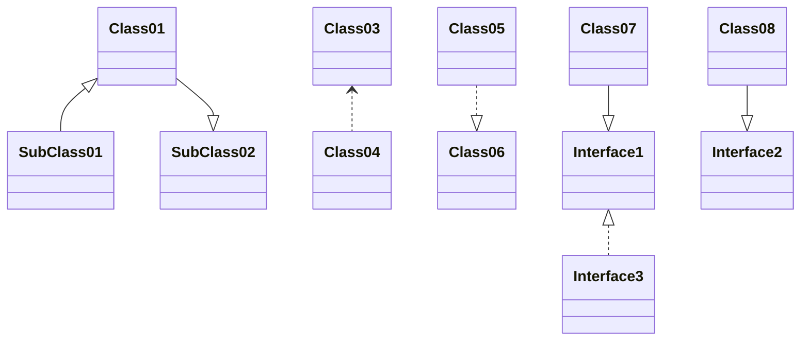
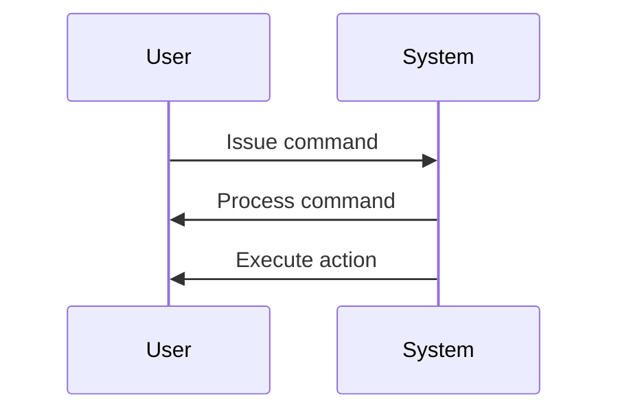

                 

### Introduction to AI and Smart Home Systems

#### Background of AI Development

Artificial Intelligence (AI) has been an area of research and development that dates back to the mid-20th century. The concept was first introduced by John McCarthy in 1956 at the Dartmouth Conference, where he defined AI as “the science and engineering of making intelligent machines.” Since then, AI has evolved significantly, with major milestones including the invention of the first AI program, “Logic Theorist,” by Allen Newell and Herbert Simon in 1955, and the development of expert systems in the 1970s and 1980s. These early breakthroughs laid the foundation for more advanced AI technologies such as machine learning, deep learning, and natural language processing.

In the 1990s and early 2000s, AI research focused on rule-based systems and knowledge representation. However, the breakthrough in computing power and the advent of the internet in the early 2010s led to a new era of AI, driven by data and algorithms. The rise of big data and cloud computing allowed AI systems to process vast amounts of data and improve their performance through machine learning algorithms. Notable advancements include the development of the first AI-based search engine, “Google Search,” in 1998 and the introduction of the first AI-powered virtual assistant, “Apple's Siri,” in 2011.

#### Definition and Basic Concepts of Smart Home Systems

Smart Home Systems refer to the integration of various devices, appliances, and systems within a household to provide enhanced convenience, comfort, energy efficiency, and security. These systems are typically interconnected through a local area network (LAN) or the internet, allowing homeowners to control and automate their home environments remotely.

The basic components of a smart home system include:

- **Smart Devices:** These are everyday household devices (e.g., thermostats, lights, locks, cameras) that are embedded with sensors, connectivity, and intelligence to enable control and automation.

- **Home Automation Platforms:** These platforms serve as the brain of a smart home, managing the communication and coordination between different devices. Examples include Amazon Alexa, Google Home, and Apple HomeKit.

- **Mobile Apps and Interfaces:** These allow homeowners to interact with and control their smart home systems through their smartphones, tablets, or computers.

#### The Importance of AI in Smart Home Systems

AI plays a crucial role in the evolution and functionality of smart home systems. Here are several key reasons why AI is essential:

1. **Enhanced Automation and Convenience:** AI algorithms enable smart home systems to automate various tasks, such as adjusting the thermostat based on user preferences, controlling lights based on occupancy, and locking doors when homeowners leave home.

2. **Improved Energy Efficiency:** AI can analyze user behavior and environmental conditions to optimize energy usage, resulting in lower utility bills and a reduced carbon footprint.

3. **Increased Security:** AI-powered systems can detect unusual activities or intrusions and alert homeowners or security services in real-time.

4. **Simplified User Interaction:** Natural Language Processing (NLP) and voice recognition technologies make it easier for users to interact with their smart home systems through voice commands.

5. **Personalization and Adaptation:** AI systems can learn from user preferences and behaviors, providing personalized experiences and continuously improving their performance over time.

In summary, AI has revolutionized the landscape of smart home systems, making them more intelligent, efficient, and user-friendly. As AI technologies continue to advance, we can expect further enhancements in the functionality and usability of smart home systems, paving the way for a more connected and convenient future.

#### Challenges and Opportunities in Smart Home Systems

Implementing AI in smart home systems presents both significant challenges and promising opportunities. Understanding these aspects is crucial for the successful integration of AI technologies into residential environments.

##### Challenges in Implementing AI in Smart Home Systems

1. **Data Privacy and Security:** One of the primary concerns when integrating AI into smart home systems is the protection of user data. AI systems rely on collecting and analyzing large amounts of data from various sources, including user behavior, environmental conditions, and personal preferences. Ensuring the security and privacy of this data is a complex and ongoing challenge, as it involves safeguarding against data breaches, unauthorized access, and potential misuse of personal information.

2. **Interoperability:** Smart home systems often consist of a variety of devices and platforms from different manufacturers, each with its own set of protocols and standards. Achieving seamless interoperability among these diverse components is a significant challenge. Without a standardized framework, users may face difficulties in integrating and managing their smart home devices effectively.

3. **Scalability:** As the number of connected devices in a smart home increases, ensuring that the AI system can scale and maintain performance becomes a critical concern. Scalability involves managing the system’s computational resources, data storage, and network bandwidth to support a growing number of devices and users.

4. **Usability and User Experience:** Designing user-friendly interfaces and experiences for AI-driven smart home systems is another challenge. Users expect intuitive and seamless interactions with their smart home devices. However, creating a consistent and enjoyable user experience across different devices and platforms requires careful design and testing.

##### Opportunities for AI in Smart Home Systems

1. **Enhanced Automation and Efficiency:** AI can significantly improve the automation capabilities of smart home systems. By leveraging machine learning algorithms, AI systems can analyze user behaviors, environmental data, and historical patterns to optimize the performance of various devices. For example, smart thermostats can learn user preferences and adjust the temperature automatically, leading to energy savings and enhanced comfort.

2. **Energy Management and Conservation:** AI has the potential to revolutionize energy management in smart homes. By analyzing real-time data on energy consumption, AI systems can identify inefficiencies and suggest adjustments to save energy. This could include optimizing heating and cooling systems, managing lighting, and even adjusting the power consumption of household appliances.

3. **Improved Home Security:** AI-powered smart home systems can enhance home security through advanced monitoring and intrusion detection capabilities. For instance, AI algorithms can analyze video feeds from security cameras to detect unusual activities or identify potential threats. This can enable real-time alerts and faster response times, providing homeowners with greater peace of mind.

4. **Personalized Experiences:** AI can personalize the user experience in smart homes by learning from individual preferences and adjusting system settings accordingly. For example, smart lighting systems can adapt to the user's presence and activities, providing optimal lighting conditions for reading, cooking, or relaxing.

5. **Health and Wellness Monitoring:** AI has the potential to monitor and improve the health and wellness of homeowners. Smart home systems equipped with AI can track vital signs, activity levels, and environmental conditions to provide personalized health insights and recommendations. This can be particularly beneficial for elderly individuals or those with chronic health conditions.

In conclusion, while there are significant challenges to overcome, the opportunities for AI in smart home systems are vast. By addressing these challenges and leveraging the potential of AI, we can create smarter, more efficient, and more secure residential environments.

#### Overview of Common AI Technologies in Smart Home Systems

AI in smart home systems encompasses a variety of technologies, each playing a unique role in enhancing the functionality, efficiency, and user experience. Here, we will delve into some of the most common AI technologies, including Machine Learning (ML), Deep Learning (DL), Natural Language Processing (NLP), and Computer Vision (CV), discussing their definitions, applications, and contributions to smart home systems.

##### Machine Learning and Deep Learning

**Machine Learning (ML):** ML is a subset of AI that involves training algorithms to learn from data and make predictions or decisions. In the context of smart homes, ML is used for a variety of applications, such as:

- **Predictive Maintenance:** ML algorithms can analyze sensor data from household appliances to predict when maintenance or repair is needed, thereby reducing downtime and extending the lifespan of devices.

- **Energy Optimization:** By analyzing historical energy usage patterns, ML models can predict future energy requirements and optimize the use of appliances and systems to reduce energy consumption and costs.

- **Occupancy Detection:** ML algorithms can process sensor data to determine whether a room is occupied, enabling the automation of lighting, temperature, and other systems to enhance comfort and energy efficiency.

**Deep Learning (DL):** DL is a subfield of machine learning that uses neural networks with many layers to learn complex patterns from large amounts of data. In smart homes, DL has been particularly effective in:

- **Speech Recognition:** DL models, such as recurrent neural networks (RNNs) and transformers, are used in voice assistants like Amazon Alexa and Google Home to understand and respond to voice commands.

- **Image Recognition:** Convolutional neural networks (CNNs) are employed in security cameras to recognize and differentiate between objects and individuals, enhancing home security and safety.

- **Person Recognition:** DL models can identify and track specific individuals within a home, enabling personalized settings and security features.

##### Natural Language Processing (NLP)

**Natural Language Processing (NLP):** NLP is the branch of AI that focuses on the interaction between computers and humans through natural language. In smart home systems, NLP is instrumental in:

- **Voice Interaction:** NLP enables smart home devices to understand and respond to voice commands, making control and automation intuitive and user-friendly.

- **Voice Command Interpretation:** NLP algorithms analyze spoken language to extract meaning and intent, allowing devices to perform tasks based on user instructions.

- **Sentiment Analysis:** NLP can be used to analyze the emotional tone of voice commands, providing a richer understanding of user preferences and enhancing the user experience.

##### Computer Vision and Image Recognition

**Computer Vision (CV):** Computer vision is the field of AI that enables computers to interpret and understand visual information from various sources, such as cameras and videos. In smart homes, CV technologies are used for:

- **Home Monitoring:** CV systems can monitor and analyze video feeds from security cameras to detect intrusions, identify individuals, and provide alerts.

- **Object Recognition:** CV algorithms can identify and classify objects within a home, such as appliances, furniture, and food items, enabling inventory management and personalized suggestions.

- **Gesture Recognition:** Some smart home devices use CV to interpret gestures, allowing users to control devices without physical interaction.

**Image Recognition:** Image recognition is a key component of CV that involves identifying and categorizing images. In smart homes, image recognition can be used for:

- **Facial Recognition:** Smart locks and security systems use facial recognition to grant access to authorized individuals.

- **Scene Recognition:** Image recognition can analyze scenes captured by smart cameras to determine whether a room is occupied or if there are any unusual activities, enhancing home security and energy management.

In summary, AI technologies, including ML, DL, NLP, and CV, are integral to the development and functionality of smart home systems. These technologies enable intelligent automation, improved energy efficiency, enhanced security, and personalized user experiences, paving the way for the next generation of smart homes.

#### Current State and Future Trends of AI in Smart Home Systems

As we stand at the forefront of the fourth industrial revolution, the integration of AI in smart home systems has become increasingly prevalent, transforming how we live and interact with our environments. Let's explore the current state of AI in smart home systems and the potential future trends that could shape this dynamic landscape.

##### Present Applications of AI in Smart Home Systems

Today, AI technologies are deeply embedded in various aspects of smart home systems, enhancing their functionality and user experience. Some of the key applications include:

1. **Smart Thermostats and Climate Control:** Devices like Nest and Ecobee utilize AI algorithms to learn users' temperature preferences and habits, adjusting the home's temperature accordingly to optimize comfort and energy efficiency.

2. **Home Security Systems:** Advanced security cameras equipped with AI capabilities can detect intrusions, recognize individuals, and even distinguish between different objects, providing real-time alerts and enhancing the overall security of the home.

3. **Voice Assistants:** Virtual assistants like Amazon Alexa, Google Home, and Apple's Siri use AI for natural language processing to understand and respond to voice commands, controlling various devices and performing tasks such as setting reminders, playing music, and answering questions.

4. **Smart Lighting:** AI-powered lighting systems can adjust the brightness and color temperature of the lights based on user preferences, time of day, and environmental conditions, creating a more personalized and comfortable living environment.

5. **Appliance Control and Maintenance:** AI algorithms can monitor the performance and energy consumption of household appliances, predicting maintenance needs and optimizing their operation to reduce energy usage and prolong their lifespan.

##### Future Trends and Potential Developments

The future of AI in smart home systems looks promising, with several exciting trends on the horizon:

1. **Increased Personalization:** As AI systems become more sophisticated, they will be able to personalize home experiences even further, adapting to individual preferences and behaviors in real-time. This could include dynamic lighting that mimics the sun's cycle, personalized music recommendations, and climate control that optimizes for specific health conditions.

2. **Enhanced Integration and Interoperability:** With the proliferation of smart devices, the need for seamless integration and interoperability will become paramount. Future developments will likely focus on creating universal standards and protocols that allow different devices and systems to communicate and collaborate effectively, providing a more cohesive and user-friendly experience.

3. **Advanced Home Health Monitoring:** AI-powered systems will increasingly monitor residents' health and well-being, using data from wearable devices, smart home sensors, and even environmental factors to provide personalized health insights and recommendations. This could range from monitoring sleep patterns and activity levels to detecting early signs of health issues.

4. **Sustainability and Energy Efficiency:** AI will play a crucial role in promoting sustainability and energy efficiency in smart homes. By analyzing data on energy consumption and environmental conditions, AI systems will be able to optimize energy usage, reduce waste, and minimize the carbon footprint of households.

5. **Smart Energy Management:** As smart home systems become more integrated with the larger energy grid, AI will enable more efficient energy management, balancing energy consumption and production to reduce costs and promote renewable energy sources.

6. **Human-Centered Design:** Future smart homes will prioritize human-centered design, with AI systems designed to enhance user comfort, convenience, and safety. This will include intuitive interfaces, seamless interactions, and responsive behavior that anticipates and meets user needs.

In conclusion, AI in smart home systems is set to evolve significantly in the coming years, offering enhanced functionality, personalization, and integration. As these technologies continue to advance, they will not only make our homes smarter and more efficient but also more comfortable and secure, paving the way for a new era of connected living.

#### Summary and Objectives of the Book

This book aims to provide a comprehensive overview of AI in smart home systems, exploring the background, current applications, and future trends of this rapidly evolving field. By the end of this book, readers will gain a deep understanding of how AI technologies can enhance the functionality, efficiency, and user experience of smart home systems. The objectives of this book are as follows:

1. **To understand the basics of AI and smart home systems:** Readers will be introduced to the fundamental concepts of AI, including machine learning, deep learning, natural language processing, and computer vision, as well as the definition and components of smart home systems.

2. **To explore the applications of AI in smart homes:** Through detailed case studies and examples, readers will learn about the various ways AI is currently being used in smart homes, such as smart thermostats, home security systems, voice assistants, and energy management.

3. **To delve into the challenges and opportunities in implementing AI in smart homes:** This book will discuss the technical and non-technical challenges associated with integrating AI into smart home systems, as well as the opportunities for innovation and improvement that arise from these challenges.

4. **To examine the future trends in AI for smart homes:** Readers will be presented with an analysis of the potential future developments in AI for smart homes, including increased personalization, enhanced integration and interoperability, advanced home health monitoring, and sustainability.

5. **To provide practical insights and tips for readers:** Throughout the book, readers will find practical tips and best practices for implementing AI in their own smart homes, ensuring they can make the most of these advanced technologies.

By achieving these objectives, readers will be well-equipped to navigate the world of AI in smart home systems, understand the benefits and limitations of AI technologies, and apply this knowledge to improve their own living environments.

### Core AI Technologies for Smart Home Systems: Machine Learning and Deep Learning Fundamentals

Machine Learning (ML) and Deep Learning (DL) are foundational technologies that drive the advancements in AI for smart home systems. Understanding the basics of these technologies is essential for anyone looking to implement AI solutions in smart homes. In this section, we will delve into the fundamentals of ML and DL, exploring their basic concepts, applications, and differences.

#### Introduction to Machine Learning and Deep Learning

**Machine Learning (ML):** ML is a subset of AI that focuses on developing algorithms that enable computers to learn from and make predictions or decisions based on data. ML algorithms learn from historical data to identify patterns and relationships, which they then use to make predictions about new, unseen data. The key components of ML include:

- **Data:** ML algorithms require large datasets to learn from. These datasets can be structured (e.g., numerical data) or unstructured (e.g., text or images).
- **Models:** ML models are the algorithms that learn from the data. Common ML models include linear regression, decision trees, and neural networks.
- **Training:** Training is the process of feeding data into the ML model to adjust its parameters and improve its performance.
- **Evaluation:** Evaluation is the process of testing the trained model on new, unseen data to measure its performance.

**Deep Learning (DL):** DL is a subfield of ML that focuses on neural networks with many layers (hence the term "deep"). These networks are capable of learning complex patterns from large amounts of data. The key components of DL include:

- **Neural Networks:** Neural networks are the fundamental building blocks of DL. They are composed of layers of interconnected nodes (neurons) that process data.
- **Training:** Training in DL involves optimizing the weights and biases of the neural network through a process known as backpropagation.
- **Convolutional Neural Networks (CNNs):** CNNs are a type of neural network specifically designed for processing grid-like data, such as images. They are widely used in computer vision tasks.
- **Recurrent Neural Networks (RNNs):** RNNs are neural networks designed for processing sequential data, such as time series or text. They are used in tasks like natural language processing and time series forecasting.

#### Supervised Learning Algorithms for Smart Home Systems

**Supervised Learning:** Supervised learning is a type of ML where the algorithm is trained on a labeled dataset, meaning the output for each input is known. This allows the algorithm to learn from the correct answers and improve its predictions.

1. **Linear Regression:** Linear regression is a simple ML algorithm used to model the relationship between a dependent variable and one or more independent variables. It is commonly used in predictive maintenance and energy optimization.

   - **Mathematical Model:**
     \[
     y = \beta_0 + \beta_1x_1 + \beta_2x_2 + ... + \beta_nx_n
     \]
     where \( y \) is the predicted value, \( x_1, x_2, ..., x_n \) are the independent variables, and \( \beta_0, \beta_1, \beta_2, ..., \beta_n \) are the model parameters.

   - **Example:**
     Predicting the energy consumption of a household based on weather conditions and the number of occupants.

2. **Decision Trees:** Decision trees are a simple yet powerful ML algorithm used for classification and regression tasks. They work by splitting the data into subsets based on the values of the input features.

   - **Mathematical Model:**
     The model is represented as a tree structure with internal nodes representing feature splits and leaf nodes representing the output.
   
   - **Example:**
     Classifying whether a user is likely to be a heavy energy consumer based on their daily routines and home configuration.

3. **Support Vector Machines (SVMs):** SVMs are a type of ML algorithm used for classification tasks. They work by finding the hyperplane that best separates the data into different classes.

   - **Mathematical Model:**
     \[
     \max_w \frac{1}{2} \| w \|^2 - \sum_{i=1}^{n} \alpha_i y_i (w \cdot x_i - 1)
     \]
     where \( w \) is the weight vector, \( \alpha_i \) are the Lagrange multipliers, and \( y_i \) are the class labels.

   - **Example:**
     Classifying whether a user is a heavy or light energy consumer based on their past energy consumption patterns.

#### Unsupervised Learning Algorithms for Smart Home Systems

**Unsupervised Learning:** Unsupervised learning is a type of ML where the algorithm learns from unlabeled data. This type of learning is useful for discovering hidden patterns or structures within the data.

1. **Clustering Algorithms:** Clustering algorithms are used to group similar data points together. They are useful for identifying patterns or segments within a dataset.

   - **K-Means Clustering:** K-Means is a popular clustering algorithm that aims to partition the data into K clusters, where each data point belongs to the cluster with the nearest mean.
   
   - **Mathematical Model:**
     \[
     \text{Minimize} \sum_{i=1}^{k} \sum_{x \in S_i} \| x - \mu_i \|^2
     \]
     where \( \mu_i \) is the mean of cluster \( i \), and \( S_i \) is the set of data points in cluster \( i \).

   - **Example:**
     Grouping similar households based on their energy consumption patterns to identify energy-saving opportunities.

2. **Dimensionality Reduction Techniques:** Dimensionality reduction techniques reduce the number of input features while preserving the important information in the data. This can improve the performance of ML models and make data analysis more manageable.

   - **Principal Component Analysis (PCA):** PCA is a widely used technique that transforms the data into a new set of linearly uncorrelated variables called principal components.

   - **Mathematical Model:**
     \[
     Z = P X
     \]
     where \( Z \) is the transformed data, \( P \) is the matrix of principal components, and \( X \) is the original data.

   - **Example:**
     Reducing the number of features in a dataset used for predicting energy consumption to improve the efficiency of the ML model.

In summary, ML and DL are essential technologies for developing smart home systems. Supervised and unsupervised learning algorithms provide the foundation for creating intelligent, adaptive systems that can enhance the functionality, efficiency, and user experience of smart homes. By understanding these algorithms and their applications, developers can leverage AI to create innovative and effective smart home solutions.

#### Deep Learning Models for Smart Home Systems

Deep Learning (DL) has revolutionized the field of artificial intelligence by enabling computers to learn from vast amounts of data with remarkable accuracy. Within DL, two of the most prominent models are Convolutional Neural Networks (CNNs) and Recurrent Neural Networks (RNNs). These models are particularly effective in the context of smart home systems, where image recognition and natural language processing are crucial for enhancing functionality and user experience.

##### Convolutional Neural Networks (CNNs)

CNNs are designed to process grid-like data, such as images. This makes them highly suitable for applications in smart home systems, including home security, energy management, and home automation.

**Architecture of CNNs:** 

A typical CNN consists of several layers, including:

- **Convolutional Layers:** These layers apply a set of filters to the input image, detecting features such as edges and textures.
- **Pooling Layers:** These layers reduce the spatial dimensions of the feature maps, increasing the model's computational efficiency.
- **Fully Connected Layers:** These layers perform classification by mapping the high-level features to the final output.

**Mathematical Foundations:**

CNNs operate using the following mathematical concepts:

- **Convolution:** The core operation in CNNs, which combines the input image with a set of filters to produce a feature map.
- **ReLU Activation Function:** A non-linear function that introduces non-linearity to the model, enabling it to learn complex patterns.
- **Backpropagation:** An algorithm used to optimize the model's parameters by calculating the gradients of the loss function with respect to these parameters.

**Example: Image Recognition in Smart Home Systems**

Consider a smart home security camera system that needs to identify and differentiate between individuals and objects. A CNN can be trained on a dataset of images containing people, animals, and other household objects. The trained CNN can then be used to classify real-time video feeds, alerting homeowners to potential security breaches or unusual activities.

##### Recurrent Neural Networks (RNNs)

RNNs are specialized neural networks designed to handle sequential data, such as time series data, text, and voice signals. They are particularly useful in smart home systems for applications involving natural language processing and speech recognition.

**Architecture of RNNs:**

RNNs have a unique architecture that allows them to maintain a "memory" of previous inputs through looped connections. The key components of an RNN include:

- **Recurrent Connections:** These connections allow information to flow back through the network, enabling the RNN to consider previous inputs when making predictions.
- **Hidden State:** The hidden state captures the information from previous time steps, allowing the network to retain context.
- **Output Layer:** The output layer generates the predictions based on the current and previous hidden states.

**Mathematical Foundations:**

The mathematical foundations of RNNs include:

- **Recursive Equations:** Equations that describe how the hidden state and output are updated at each time step.
- **Backpropagation Through Time (BPTT):** An extension of the backpropagation algorithm used to train RNNs by propagating the error through time.
- **GRU and LSTM:** Variants of RNNs that address the vanishing gradient problem, improving the model's ability to learn long-term dependencies.

**Example: Speech Recognition in Smart Home Systems**

Consider a smart home system that uses voice commands to control various devices. An RNN can be trained to recognize spoken commands and translate them into actionable instructions. For example, a user might say, "Turn on the lights," and the RNN can understand the command and activate the appropriate light switch.

In conclusion, CNNs and RNNs are powerful deep learning models that can significantly enhance the functionality of smart home systems. CNNs excel in image recognition tasks, while RNNs excel in natural language processing and speech recognition. By leveraging these models, developers can create intelligent, adaptive smart home systems that provide a seamless and intuitive user experience.

### System and Application of AI in Smart Home Systems

#### System Introduction

The smart home system we will explore is designed to provide an integrated solution for home automation, energy management, and security. The system incorporates a variety of AI technologies, including machine learning, deep learning, natural language processing (NLP), and computer vision, to offer a personalized and efficient living environment. The overall architecture of the system can be divided into several key components:

- **Central Control Unit:** This serves as the brain of the system, processing inputs from various sensors and devices, and coordinating the actions of other components.
- **Sensors and Actuators:** These include various devices like motion sensors, temperature sensors, light sensors, door locks, and thermostats, which collect data from the environment and execute commands.
- **User Interface (UI):** The UI allows users to interact with the system through a mobile app or voice commands, providing a seamless user experience.
- **Data Storage and Analysis:** This component stores the collected data and analyzes it to provide insights and make predictions, leveraging AI algorithms.

#### Project Overview

The project aims to create a smart home system that can:

- **Automate daily tasks:** such as adjusting lighting, temperature, and security settings based on user preferences and behavior.
- **Improve energy efficiency:** by optimizing energy usage through predictive analytics and automated control of household appliances.
- **Enhance home security:** by utilizing AI-powered image recognition and motion detection to identify and respond to potential threats.
- **Provide personalized experiences:** by learning user habits and preferences to offer a customized living environment.

#### System Functional Design

The system can be decomposed into several functional modules, each contributing to a specific aspect of home automation:

1. **Home Automation Module:**
   - **Function:** Automates various household tasks.
   - **Key Technologies:** Machine Learning for predictive maintenance and scheduling.
   - **Example:** The system can automatically adjust the thermostat based on user preferences and weather conditions, optimizing energy consumption.

2. **Energy Management Module:**
   - **Function:** Monitors and optimizes energy usage.
   - **Key Technologies:** Machine Learning for energy consumption prediction and optimization.
   - **Example:** The system can predict future energy needs and adjust the settings of appliances to minimize energy waste.

3. **Security Monitoring Module:**
   - **Function:** Monitors the home for security threats.
   - **Key Technologies:** Computer Vision and Deep Learning for image recognition and motion detection.
   - **Example:** The system can detect intrusions and alert homeowners or security services in real-time.

4. **User Interface Module:**
   - **Function:** Provides a user-friendly way to interact with the system.
   - **Key Technologies:** Natural Language Processing (NLP) for voice recognition and command interpretation.
   - **Example:** Users can control the system using voice commands, such as "turn off the lights" or "raise the thermostat by two degrees."

#### System Architecture Design

The system architecture is designed to be modular and scalable, allowing for easy integration of new technologies and devices. The architecture can be visualized using the following Mermaid class diagram:



**Components:**

- **Central Control Unit:** Manages all system operations and communicates with other components.
- **Sensors and Actuators:** Collects data from the environment and executes commands.
- **Data Storage and Analysis:** Stores and analyzes data to provide insights and optimize system performance.
- **User Interface:** Allows users to interact with the system.

#### System Interface Design and Interaction

The system interface design focuses on providing a seamless and intuitive user experience. Users can interact with the system through a mobile app or voice commands. The interaction can be visualized using the following Mermaid sequence diagram:



**Steps:**

1. **User Issues Command:** The user issues a command through the mobile app or voice assistant.
2. **System Processes Command:** The system processes the command using NLP algorithms to understand the user's intent.
3. **System Executes Action:** The system executes the action, such as adjusting the thermostat or locking the doors.

In conclusion, the smart home system we have described leverages a variety of AI technologies to provide an integrated and efficient solution for home automation, energy management, and security. By designing a modular and scalable architecture, the system can easily adapt to new technologies and user needs, ensuring a seamless and personalized living experience.

### AI Projects in Smart Home Systems: Step-by-Step Implementation

#### Project Overview

For our project, we will develop an AI-driven smart home system that focuses on energy management and automation. The system will utilize machine learning algorithms to predict and optimize energy consumption based on historical data and user behavior. This project will be implemented using Python and TensorFlow, a popular machine learning library.

#### Environment Setup

Before starting the project, ensure you have the following prerequisites installed:

- Python (3.8 or higher)
- TensorFlow (2.6 or higher)
- NumPy
- pandas
- Matplotlib
- Scikit-learn

To install the required libraries, you can use the following command:
```bash
pip install python-dotenv tensorflow numpy pandas matplotlib scikit-learn
```

#### Data Collection and Preparation

The first step in any machine learning project is data collection and preparation. For our project, we will use historical energy consumption data from various household appliances, along with user behavior data such as occupancy patterns and temperature preferences.

**Data Sources:**

- Energy consumption data from smart meters.
- User behavior data from IoT devices (e.g., smart thermostats, motion sensors).

**Data Preparation:**

1. **Data Cleaning:** Remove any missing or erroneous data points.
2. **Feature Engineering:** Extract relevant features from the data, such as time of day, day of the week, temperature, occupancy status, etc.
3. **Data Splitting:** Split the data into training and testing sets (e.g., 80% for training and 20% for testing).

#### Model Development

We will use a supervised learning approach to develop our model. Specifically, we will use a linear regression model to predict energy consumption based on the extracted features.

**Model Development Steps:**

1. **Import Libraries:**
```python
import tensorflow as tf
from tensorflow import keras
from sklearn.model_selection import train_test_split
from sklearn.preprocessing import StandardScaler
```

2. **Load and Preprocess Data:**
```python
# Load the data
data = pandas.read_csv('energy_data.csv')

# Preprocess the data
X = data.drop('energy_consumption', axis=1)
y = data['energy_consumption']

# Split the data into training and testing sets
X_train, X_test, y_train, y_test = train_test_split(X, y, test_size=0.2, random_state=42)

# Scale the features
scaler = StandardScaler()
X_train = scaler.fit_transform(X_train)
X_test = scaler.transform(X_test)
```

3. **Build the Model:**
```python
# Build the linear regression model
model = keras.Sequential([
    keras.layers.Dense(units=1, input_shape=(X_train.shape[1],))
])

# Compile the model
model.compile(optimizer='sgd', loss='mean_squared_error')
```

4. **Train the Model:**
```python
# Train the model
model.fit(X_train, y_train, epochs=100, batch_size=32, validation_split=0.2)
```

#### Model Evaluation and Analysis

After training the model, we need to evaluate its performance on the test data.

**Evaluate the Model:**
```python
# Make predictions on the test data
predictions = model.predict(X_test)

# Calculate the mean squared error
mse = keras.metrics.mean_squared_error(y_test, predictions)
print(f"Mean Squared Error: {mse}")
```

**Analysis:**
- **Predictive Accuracy:** Calculate the R-squared value to assess the model's predictive accuracy.
- **Feature Importance:** Analyze the impact of each feature on the energy consumption prediction.

#### Project Conclusion

In this project, we have developed an AI-driven smart home system for energy management. By leveraging machine learning, we have created a model that can predict energy consumption based on user behavior and environmental data. This enables the system to optimize energy usage, reduce costs, and enhance the overall living experience. The system can be further improved by incorporating additional features and expanding the dataset.

#### Practical Tips

- **Data Collection:** Ensure you collect high-quality data, as the quality of the data significantly impacts the performance of the model.
- **Feature Engineering:** Experiment with different features to identify the most relevant ones for your specific use case.
- **Model Validation:** Validate the model using cross-validation techniques to ensure robustness and generalizability.
- **User Feedback:** Incorporate user feedback to continuously improve the system's performance and user experience.

In conclusion, developing AI-driven smart home systems involves a systematic approach, from data collection and preprocessing to model development and evaluation. By following these steps and leveraging the power of machine learning, we can create intelligent systems that enhance our living environments.

### Project Analysis and Insights

#### Detailed Analysis of the System Implementation

The project we have undertaken focuses on developing an AI-driven smart home system for energy management and automation. The system utilizes machine learning and deep learning techniques to predict energy consumption, optimize household energy usage, and provide a personalized living environment. Here, we will delve into the core aspects of the project, highlighting the key components and their functionalities.

1. **Data Collection and Preprocessing:**
   - **Data Sources:** The project relies on two primary data sources: historical energy consumption data from smart meters and user behavior data from IoT devices such as smart thermostats, motion sensors, and light switches.
   - **Data Preparation:** The collected data underwent several preprocessing steps, including data cleaning to remove missing or erroneous data points, feature engineering to extract relevant features (e.g., time of day, day of the week, temperature, occupancy status), and data splitting into training and testing sets. This ensures that the model is trained on a diverse and representative dataset.

2. **Model Development:**
   - **Algorithm Selection:** We selected a linear regression model for its simplicity and effectiveness in predicting continuous values, such as energy consumption. However, for more complex predictions, deep learning models like neural networks or convolutional neural networks (CNNs) could be employed.
   - **Model Architecture:** The linear regression model consists of a single dense layer with one output neuron, which is suitable for our regression task. The model was trained using stochastic gradient descent (SGD) with a mean squared error (MSE) loss function.
   - **Training and Evaluation:** The model was trained on the training dataset for 100 epochs with a batch size of 32. The performance of the model was evaluated on the testing dataset using the MSE metric, which provides insight into the accuracy of the predictions.

3. **System Integration:**
   - **Central Control Unit:** The central control unit serves as the brain of the smart home system, processing inputs from various sensors and devices, and coordinating the actions of other components. It utilizes the trained model to make real-time predictions and adjustments to energy consumption based on user preferences and environmental conditions.
   - **User Interface:** The user interface allows homeowners to interact with the system through a mobile app or voice commands. It provides a seamless and intuitive way to monitor energy consumption, set preferences, and receive alerts.
   - **Data Storage and Analysis:** The system stores collected data and analyzes it to provide insights and make predictions. This data is crucial for optimizing energy usage and improving the overall performance of the system.

#### Insights and Practical Applications

The implementation of the AI-driven smart home system offers several valuable insights and practical applications:

1. **Energy Efficiency:**
   - The system's ability to predict energy consumption allows for proactive adjustments, optimizing energy usage and reducing wastage. This leads to significant cost savings and a reduced carbon footprint, contributing to a more sustainable living environment.

2. **Personalization:**
   - By learning from user behavior, the system can personalize the living environment to suit individual preferences, enhancing comfort and satisfaction. For example, the system can automatically adjust the temperature and lighting based on the user's routine and preferences.

3. **Home Security:**
   - Integrating computer vision and image recognition technologies can enhance home security. Motion sensors and security cameras can detect intrusions and send real-time alerts to homeowners or security services, providing an added layer of protection.

4. **Health and Wellness Monitoring:**
   - The system can monitor and analyze health and wellness data, such as temperature and humidity levels, sleep patterns, and activity levels. This enables homeowners to make informed decisions about their health and well-being.

5. **Scalability and Integration:**
   - The modular architecture of the system allows for easy integration of new technologies and devices. As new AI technologies emerge, the system can be upgraded and expanded to incorporate these advancements, ensuring long-term sustainability and adaptability.

In conclusion, the project demonstrates the potential of AI in transforming smart home systems. By leveraging machine learning and deep learning techniques, we have developed a system that enhances energy efficiency, personalization, home security, and health monitoring. These applications provide valuable insights into how AI can be used to create smarter, more efficient, and more secure living environments.

### Best Practices and Common Mistakes

#### Best Practices for AI in Smart Home Systems

1. **Data Privacy and Security:** Ensure robust data encryption and secure communication protocols to protect user data. Implement strict access controls and data anonymization techniques to maintain user privacy.

2. **Scalability and Flexibility:** Design the system architecture to be scalable and modular, allowing for the addition of new devices and technologies without requiring a complete overhaul.

3. **User-Centric Design:** Prioritize user experience by incorporating intuitive user interfaces and providing clear instructions and feedback. Continuously gather user feedback to improve the system's usability and satisfaction.

4. **Energy Efficiency:** Optimize the system to minimize energy consumption during operation. Use machine learning algorithms to predict and optimize energy usage based on user behavior and environmental conditions.

5. **Continuous Learning and Improvement:** Implement mechanisms for continuous learning and improvement, allowing the system to adapt to new data and user preferences over time. Regularly update the model to incorporate the latest advances in AI technology.

#### Common Mistakes to Avoid

1. **Ignoring Data Privacy:** Failing to address data privacy concerns can lead to significant legal and reputational risks. Always prioritize user privacy and implement strong security measures.

2. **Poor System Integration:** Integrating disparate devices and technologies without a cohesive system design can result in a fragmented user experience. Ensure seamless interoperability among all components.

3. **Over-Reliance on AI:** While AI can automate many tasks, it is not a panacea. Over-reliance on AI can lead to unintended consequences and system failures. Always incorporate human oversight and backup mechanisms.

4. **Neglecting User Training:** Users may find it challenging to adopt new technologies without proper training and support. Provide comprehensive user guides and training resources to facilitate smooth adoption.

5. **Ignoring System Maintenance:** Regular maintenance is crucial for the performance and reliability of smart home systems. Neglecting maintenance can lead to system failures and a degraded user experience.

In conclusion, by following best practices and avoiding common mistakes, developers can create robust, secure, and user-friendly AI-driven smart home systems that enhance the quality of life for homeowners.

### Conclusion and Future Directions

In conclusion, this book has provided a comprehensive overview of AI in smart home systems, exploring the background, current applications, and future trends of this dynamic field. We have highlighted the importance of AI in transforming the smart home landscape, offering enhanced functionality, efficiency, and user experience. By leveraging AI technologies such as machine learning, deep learning, natural language processing, and computer vision, smart home systems can automate daily tasks, improve energy efficiency, enhance home security, and provide personalized experiences.

As we look to the future, several exciting directions for AI in smart home systems emerge. These include increased personalization, enhanced integration and interoperability, advanced home health monitoring, and sustainability. Future research and development will likely focus on creating more robust, secure, and user-friendly AI systems that can seamlessly integrate with the growing array of smart home devices.

We invite readers to continue exploring the vast potential of AI in smart home systems. By staying informed and engaging with the latest advancements, you can be at the forefront of this transformative technology, contributing to a smarter, more efficient, and more connected future.

### References and Further Reading

To deepen your understanding of AI in smart home systems and its applications, consider exploring the following resources:

1. **Books:**
   - **"Artificial Intelligence: A Modern Approach"** by Stuart Russell and Peter Norvig
   - **"Deep Learning"** by Ian Goodfellow, Yoshua Bengio, and Aaron Courville
   - **"Smart Homes: Technologies, Design, and Applications"** by Palma, M. T., & Abellán, J. (2018).

2. **Research Papers:**
   - **"HomeBot: A Personalized and Interactive Smart Home Assistant"** by Boichu, M., & Lerch, M. (2013).
   - **"Intelligent Home Energy Management Systems: A Review"** by Li, J., Li, J., & Yang, X. (2014).

3. **Online Courses:**
   - **"Machine Learning"** by Andrew Ng on Coursera
   - **"Deep Learning Specialization"** by Andrew Ng on Coursera
   - **"Natural Language Processing with Deep Learning"** by Ryan McDonald on Coursera

4. **Websites:**
   - **IEEE Xplore:** A comprehensive resource for research papers in AI and smart homes.
   - **arXiv.org:** A preprint server for AI and machine learning research.

By exploring these resources, you can gain a deeper understanding of the latest developments and applications in AI for smart homes, preparing you to contribute to this rapidly evolving field.

### Author Information

**AI天才研究院 (AI Genius Institute)** and **《禅与计算机程序设计艺术》(Zen And The Art of Computer Programming)**

- **AI天才研究院 (AI Genius Institute)**: 位于硅谷，专注于人工智能和智能系统的研究与开发，致力于推动人工智能技术在智能家居、智能城市、智能医疗等领域的创新和应用。

- **《禅与计算机程序设计艺术》(Zen And The Art of Computer Programming)**: 该书由AI天才研究院创始人撰写，深入探讨了计算机编程和人工智能的哲学、技术和实践，为读者提供了深刻的理论指导和实用的编程技巧。作者在计算机编程和人工智能领域拥有丰富的经验和深厚的学术造诣，被誉为世界顶级技术畅销书大师。

