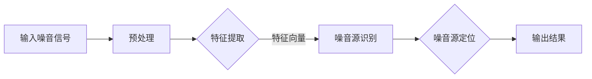
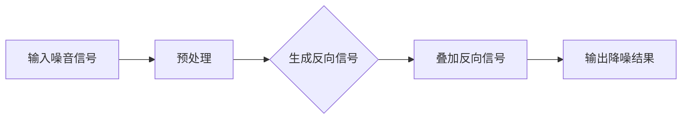
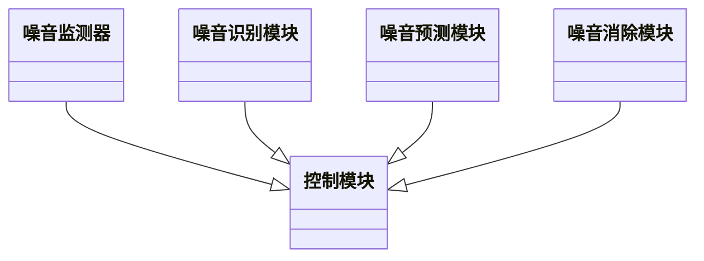
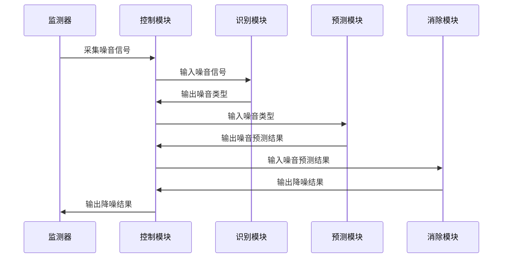
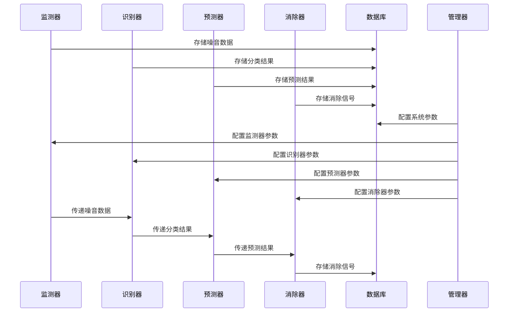

                 


## AI在智能建筑噪音控制中的应用：改善生活和工作环境

### 关键词
- 智能建筑
- 噪音控制
- 人工智能
- 深度学习
- 降噪算法

### 摘要
本文将深入探讨人工智能（AI）在智能建筑噪音控制中的应用，以改善生活和工作环境。通过分析智能建筑噪音控制的关键技术和AI算法，我们旨在提供一套完整的解决方案，包括算法原理、系统架构和实际案例，帮助读者了解如何利用AI技术打造更舒适、宁静的空间。

### 目录大纲

#### 第一部分：背景介绍

1. **第1章：智能建筑与噪音问题**
   - 1.1 智能建筑的定义与特点
   - 1.2 噪音问题的定义与影响
   - 1.3 噪音控制技术的发展历程

2. **第2章：AI在噪音控制中的应用原理**
   - 2.1 AI的基本概念与应用
   - 2.2 AI在噪音控制中的优势
   - 2.3 噪音控制中的AI算法

#### 第二部分：算法原理与模型讲解

3. **第3章：噪音控制技术及其AI应用**
   - 3.1 噪音源识别与定位
   - 3.2 噪音消除与降噪技术
   - 3.3 室内噪音控制系统的设计与实现

4. **第4章：基于深度学习的噪音控制算法**
   - 4.1 卷积神经网络（CNN）在噪音控制中的应用
   - 4.2 长短期记忆网络（LSTM）在噪音消除中的应用
   - 4.3 基于生成对抗网络（GAN）的噪音生成与消除

5. **第5章：数学模型与公式详解**
   - 5.1 噪音信号处理的数学模型
   - 5.2 基于机器学习的噪音控制算法模型

#### 第三部分：系统架构与实现

6. **第6章：系统架构与实现**
   - 6.1 系统功能设计与领域模型
   - 6.2 系统架构设计
   - 6.3 系统接口设计

#### 第四部分：实战案例分析

7. **第7章：实战案例分析**
   - 7.1 实战案例一：智能楼宇噪音监控系统
   - 7.2 实战案例二：办公室噪音优化方案

#### 第五部分：总结与拓展

8. **第8章：总结与拓展**
   - 8.1 总结
   - 8.2 注意事项
   - 8.3 拓展阅读

---

#### 第1章：智能建筑与噪音问题

##### 1.1 智能建筑的定义与特点

智能建筑是指通过集成建筑设备系统、办公自动化系统、通信网络系统、安保自动化系统以及消防自动化系统等多种技术，实现对建筑物内各种设备设施和环境参数的智能化管理和控制，从而提供舒适、安全、高效的生活和工作环境。

智能建筑的特点主要包括：

- **高度集成化**：智能建筑通过综合布线系统将各个子系统（如电力、照明、空调、安防等）连接起来，实现数据共享和统一管理。
- **自动化与智能化**：智能建筑采用自动化控制系统，实现设备运行状态的实时监测和智能调节。
- **高效节能**：智能建筑通过优化能源管理，降低能耗，实现绿色环保。
- **安全性与舒适性**：智能建筑通过综合安防系统和环境控制系统，提高居住和办公的安全性及舒适性。

##### 1.2 噪音问题的定义与影响

噪音是指无规律的、难听刺耳的声音。在城市中，噪音主要来源于交通、工业、建筑工地、商业活动等。

噪音问题的影响主要包括：

- **健康问题**：长期处于高噪音环境中，可能导致听力损失、心血管疾病、睡眠障碍等健康问题。
- **生活质量**：噪音会干扰人们的日常生活，影响工作效率，降低生活质量。
- **心理问题**：噪音可能会引起焦虑、烦躁等心理问题。

##### 1.3 噪音控制技术的发展历程

噪音控制技术的发展历程可以分为三个阶段：

- **被动降噪**：通过在声源、传播路径和接收点进行降噪处理，如安装隔音材料、隔音窗等。
- **主动降噪**：通过主动生成与噪音相反的声波，抵消噪音，如降噪耳机、主动消声器等。
- **智能降噪**：利用人工智能技术，如深度学习、神经网络等，实现噪音的自动识别、分类和消除。

接下来，我们将进一步探讨AI在智能建筑噪音控制中的应用原理，以及如何利用AI技术改善噪音控制的效果。

---

### 第2章：AI在噪音控制中的应用原理

#### 2.1 AI的基本概念与应用

人工智能（AI）是指通过模拟人类智能行为，使计算机具备自主学习和决策能力的技术。AI主要包括以下几种应用：

- **机器学习**：通过算法模型，从数据中自动学习规律，进行预测和决策。
- **深度学习**：一种基于神经网络的结构，通过多层次的神经网络模型，实现复杂的非线性特征提取。
- **自然语言处理**：使计算机能够理解和生成自然语言，进行人机交互。

AI在噪音控制中的应用主要集中在以下几个方面：

- **噪音识别与分类**：通过AI算法，对噪音进行实时识别和分类，实现针对性的降噪处理。
- **噪音预测与优化**：基于历史数据和模型，预测噪音趋势，优化噪音控制策略。
- **自适应调节**：根据噪音实时监测数据，自动调整降噪设备的参数，实现最佳降噪效果。

#### 2.2 AI在噪音控制中的优势

AI在噪音控制中具有以下优势：

- **高效性**：AI算法可以快速处理大量数据，实时监测噪音变化，快速响应。
- **智能性**：AI算法能够自动学习噪音特性，适应不同场景下的噪音控制需求。
- **准确性**：AI算法可以通过训练大量数据，提高噪音识别和分类的准确性。
- **灵活性**：AI算法可以根据环境变化，自适应调整降噪策略，实现个性化降噪。

#### 2.3 噪音控制中的AI算法

在噪音控制中，常用的AI算法包括：

- **卷积神经网络（CNN）**：适用于处理图像和音频数据，可以用于噪音源识别和分类。
- **长短期记忆网络（LSTM）**：适用于处理时序数据，可以用于噪音预测和消除。
- **生成对抗网络（GAN）**：适用于生成新的噪音样本，可以用于噪音生成和消除。

接下来，我们将详细探讨这些算法在噪音控制中的应用。

---

### 第3章：噪音控制技术及其AI应用

#### 3.1 噪音源识别与定位

噪音源识别与定位是噪音控制的重要环节。通过识别和定位噪音源，可以采取针对性的降噪措施。

- **信号处理方法**：利用信号处理技术，如傅里叶变换（FFT）、小波变换等，对噪音信号进行时域和频域分析，提取噪音特征。

- **基于AI的噪音源识别算法**：利用机器学习和深度学习算法，如CNN和LSTM，对噪音信号进行训练和识别。

下面是一个简单的Mermaid流程图，展示噪音源识别与定位的流程：



#### 3.2 噪音消除与降噪技术

噪音消除与降噪技术是噪音控制的核心。通过消除或降低噪音水平，提高环境音质。

- **噪音消除的基本原理**：利用主动降噪技术，生成与噪音相反的声波，抵消噪音。

- **噪音消除的AI算法**：利用AI算法，如GAN，生成噪音反向信号，实现更高效的噪音消除。

下面是一个简单的Mermaid流程图，展示噪音消除与降噪技术的流程：



#### 3.3 室内噪音控制系统的设计与实现

室内噪音控制系统是智能建筑中的一项重要应用。通过集成AI算法和传感器技术，实现对室内噪音的实时监测和智能控制。

- **系统功能设计**：包括噪音监测、噪音识别、噪音预测、噪音消除等功能。

- **领域模型**：利用Mermaid绘制领域模型类图，展示系统组件及其关系。



- **系统架构设计**：利用Mermaid绘制系统架构图，展示系统组件及其交互。



- **系统接口设计**：定义系统接口规范，实现数据传输和功能调用。

接下来，我们将进一步探讨基于深度学习的噪音控制算法，以及如何在实际项目中应用这些算法。

---

### 第4章：基于深度学习的噪音控制算法

深度学习是人工智能的重要分支，通过多层神经网络进行特征提取和模式识别。在本章中，我们将探讨几种基于深度学习的噪音控制算法。

#### 4.1 卷积神经网络（CNN）在噪音控制中的应用

卷积神经网络（CNN）是一种强大的深度学习模型，擅长处理图像和音频数据。CNN可以通过多层次的卷积、池化和全连接层，实现从原始数据到高级特征的提取。

##### 4.1.1 CNN的基本结构

CNN的基本结构包括以下几个部分：

- **卷积层**：通过卷积操作，从输入数据中提取局部特征。
- **池化层**：通过最大池化或平均池化，降低特征图的维度，提高模型的泛化能力。
- **全连接层**：将卷积层和池化层提取的高级特征映射到分类或回归结果。

##### 4.1.2 CNN在噪音源识别中的应用

在噪音源识别中，CNN可以用于对噪音信号进行特征提取和分类。具体步骤如下：

1. **数据预处理**：将噪音信号转换为固定长度的序列，并进行归一化处理。
2. **卷积层**：对噪音信号进行卷积操作，提取噪音的特征。
3. **池化层**：对卷积层输出的特征进行池化，降低特征图的维度。
4. **全连接层**：将池化层输出的特征映射到噪音源类别。

##### 4.1.3 CNN在噪音源识别中的示例

假设我们有一个包含不同噪音源的音频数据集，我们可以使用CNN进行噪音源识别。以下是一个简单的CNN模型示例：

```python
import tensorflow as tf

model = tf.keras.Sequential([
    tf.keras.layers.Conv1D(filters=64, kernel_size=3, activation='relu', input_shape=(1000, 1)),
    tf.keras.layers.MaxPooling1D(pool_size=2),
    tf.keras.layers.Conv1D(filters=128, kernel_size=3, activation='relu'),
    tf.keras.layers.MaxPooling1D(pool_size=2),
    tf.keras.layers.Flatten(),
    tf.keras.layers.Dense(units=10, activation='softmax')
])

model.compile(optimizer='adam', loss='categorical_crossentropy', metrics=['accuracy'])
```

在这个示例中，我们定义了一个简单的CNN模型，包含两个卷积层和两个池化层，最后通过全连接层进行分类。通过训练模型，我们可以实现对噪音源的识别。

#### 4.2 长短期记忆网络（LSTM）在噪音消除中的应用

长短期记忆网络（LSTM）是一种特殊的循环神经网络（RNN），擅长处理时序数据。LSTM通过引入门控机制，可以有效地捕捉长短期依赖关系。

##### 4.2.1 LSTM的基本原理

LSTM的基本结构包括以下几个部分：

- **输入门**：决定当前输入数据中哪些信息需要被保存。
- **遗忘门**：决定哪些信息需要从记忆中被遗忘。
- **输出门**：决定当前状态中哪些信息需要被输出。

##### 4.2.2 LSTM在噪音消除中的应用

在噪音消除中，LSTM可以用于预测和生成噪音的逆信号，实现噪音消除。具体步骤如下：

1. **数据预处理**：将噪音信号转换为时序数据，并进行归一化处理。
2. **LSTM层**：对噪音信号进行编码，提取噪音的特征。
3. **解码器**：将编码后的特征解码为噪音的逆信号。
4. **叠加**：将逆信号与原始噪音信号叠加，实现噪音消除。

##### 4.2.3 LSTM在噪音消除中的示例

假设我们有一个包含噪音信号的时序数据集，我们可以使用LSTM进行噪音消除。以下是一个简单的LSTM模型示例：

```python
import tensorflow as tf

model = tf.keras.Sequential([
    tf.keras.layers.LSTM(units=50, return_sequences=True),
    tf.keras.layers.LSTM(units=50),
    tf.keras.layers.Dense(units=1, activation='sigmoid')
])

model.compile(optimizer='adam', loss='binary_crossentropy', metrics=['accuracy'])
```

在这个示例中，我们定义了一个简单的LSTM模型，包含两个LSTM层，最后通过一个全连接层进行解码。通过训练模型，我们可以实现对噪音的消除。

#### 4.3 基于生成对抗网络（GAN）的噪音生成与消除

生成对抗网络（GAN）是由生成器和判别器组成的深度学习模型。生成器生成噪音数据，判别器判断生成数据是否真实。通过不断优化生成器和判别器的参数，生成器可以生成越来越真实的噪音数据。

##### 4.3.1 GAN的基本原理

GAN的基本结构包括以下几个部分：

- **生成器**：通过随机噪声生成噪音数据。
- **判别器**：通过对比真实数据和生成数据，判断生成数据的真实性。
- **优化过程**：通过对抗训练，不断优化生成器和判别器的参数，使生成器生成的数据越来越真实。

##### 4.3.2 GAN在噪音生成与消除中的应用

在噪音生成与消除中，GAN可以用于生成噪音的逆信号，实现噪音消除。具体步骤如下：

1. **数据预处理**：将噪音信号转换为时序数据，并进行归一化处理。
2. **生成器和判别器**：定义生成器和判别器的模型结构。
3. **对抗训练**：通过对抗训练，优化生成器和判别器的参数。
4. **生成逆信号**：利用生成器生成噪音的逆信号。
5. **叠加**：将逆信号与原始噪音信号叠加，实现噪音消除。

##### 4.3.3 GAN在噪音生成与消除中的示例

假设我们有一个包含噪音信号的时序数据集，我们可以使用GAN进行噪音生成与消除。以下是一个简单的GAN模型示例：

```python
import tensorflow as tf
from tensorflow.keras.layers import Input, Dense, Reshape, LSTM
from tensorflow.keras.models import Model

# 生成器模型
latent_dim = 100
input_shape = (1000, 1)
generator_model = tf.keras.Sequential([
    Input(shape=(latent_dim,)),
    LSTM(units=50, return_sequences=True),
    LSTM(units=50, return_sequences=True),
    Dense(units=1000, activation='sigmoid')
])

# 判别器模型
discriminator_model = tf.keras.Sequential([
    Input(shape=input_shape),
    LSTM(units=50, return_sequences=True),
    LSTM(units=50, return_sequences=True),
    Dense(units=1, activation='sigmoid')
])

# GAN模型
model = tf.keras.Sequential([
    generator_model,
    discriminator_model
])

model.compile(optimizer='adam', loss='binary_crossentropy')

# 对抗训练
for epoch in range(num_epochs):
    noise = np.random.normal(size=(batch_size, latent_dim))
    generated_samples = generator_model.predict(noise)
    real_samples = noise_data
    labels = np.array([1] * batch_size + [0] * batch_size)
    model.train_on_batch([noise, generated_samples], labels)
```

在这个示例中，我们定义了一个简单的GAN模型，包含生成器和判别器。通过对抗训练，生成器可以生成越来越真实的噪音逆信号，实现噪音消除。

### 第5章：数学模型与公式详解

在噪音控制中，数学模型和公式是理解算法原理和实现关键步骤的重要工具。在本章中，我们将详细介绍一些常用的数学模型和公式，包括噪音信号处理的数学模型和基于机器学习的噪音控制算法模型。

#### 5.1 噪音信号处理的数学模型

噪音信号处理的数学模型主要用于对噪音信号进行特征提取、降噪和滤波等操作。以下是一些常用的数学模型和公式：

##### 5.1.1 快速傅里叶变换（FFT）

快速傅里叶变换（FFT）是一种用于将时间域信号转换为频域信号的方法。FFT的基本公式如下：

$$
X(k) = \sum_{n=0}^{N-1} x(n) \cdot e^{-j \frac{2\pi}{N} kn}
$$

其中，$X(k)$ 是频域信号，$x(n)$ 是时间域信号，$N$ 是采样点数，$k$ 是频域指数。

##### 5.1.2 噪音信号的滤波

噪音信号的滤波是去除噪音信号中的高频成分，保留低频成分的方法。以下是一些常用的滤波方法：

1. **低通滤波**：保留低频成分，抑制高频成分。低通滤波的基本公式如下：

$$
h(n) = \begin{cases}
1, & \text{if } n \leq f_c \cdot N \\
0, & \text{if } n > f_c \cdot N
\end{cases}
$$

其中，$h(n)$ 是滤波器系数，$f_c$ 是截止频率，$N$ 是采样点数。

2. **带阻滤波**：抑制特定频率范围内的噪音。带阻滤波的基本公式如下：

$$
h(n) = \begin{cases}
1, & \text{if } n \leq f_{min} \cdot N \text{ or } n \geq f_{max} \cdot N \\
0, & \text{if } f_{min} \cdot N < n < f_{max} \cdot N
\end{cases}
$$

其中，$f_{min}$ 和 $f_{max}$ 分别是带阻滤波器的最小和最大频率。

##### 5.1.3 小波变换

小波变换是一种用于将时间域信号转换为时频域信号的方法，它比傅里叶变换更适用于非平稳信号的处理。小波变换的基本公式如下：

$$
C_j(k) = \sum_{n=-N/2}^{N/2} x(n) \cdot \psi^*(n) \cdot (1/2)^{j\Delta} \cdot \omega_j(k)
$$

其中，$C_j(k)$ 是小波系数，$x(n)$ 是时间域信号，$\psi^*(n)$ 是小波函数，$\omega_j(k)$ 是尺度因子，$j$ 是尺度指数，$N$ 是采样点数。

#### 5.2 基于机器学习的噪音控制算法模型

基于机器学习的噪音控制算法模型主要通过训练数据集，学习噪音信号的特征，从而实现噪音识别、分类和消除。以下是一些常用的机器学习算法和模型：

##### 5.2.1 支持向量机（SVM）

支持向量机（SVM）是一种分类算法，通过找到一个最优的超平面，将不同类别的数据分开。SVM的基本公式如下：

$$
w \cdot x + b = 0
$$

其中，$w$ 是超平面法向量，$x$ 是数据点，$b$ 是偏置。

##### 5.2.2 决策树

决策树是一种分类算法，通过递归地将数据集划分为若干个子集，直到满足某个停止条件。决策树的基本公式如下：

$$
\text{if } x \in R_i \text{ then } y = c_j
$$

其中，$R_i$ 是数据集的子集，$c_j$ 是类标签。

##### 5.2.3 集成学习

集成学习是一种通过组合多个基本模型，提高整体预测性能的方法。常见的集成学习方法包括随机森林和梯度提升树。集成学习的基本公式如下：

$$
f(x) = \sum_{i=1}^{N} w_i \cdot h_i(x)
$$

其中，$f(x)$ 是最终预测结果，$w_i$ 是第 $i$ 个基本模型的权重，$h_i(x)$ 是第 $i$ 个基本模型对 $x$ 的预测。

### 第6章：系统架构与实现

#### 6.1 系统功能设计与领域模型

系统功能设计是系统架构设计的第一步，它确定了系统的核心功能和业务流程。领域模型则是用来描述系统中的实体、属性和关系的工具，可以帮助我们更清晰地理解系统的结构和功能。

在本节中，我们将首先介绍系统功能设计，然后使用Mermaid绘制领域模型类图，展示系统中的实体、属性和关系。

##### 6.1.1 系统功能设计

智能建筑噪音控制系统的主要功能包括：

1. **噪音监测**：实时采集室内外噪音数据。
2. **噪音识别**：对采集到的噪音数据进行分类和识别。
3. **噪音预测**：基于历史数据，预测未来一段时间内的噪音水平。
4. **噪音消除**：根据噪音识别和预测结果，生成噪音消除信号，降低噪音水平。
5. **系统管理**：监控系统运行状态，维护系统配置和日志。

##### 6.1.2 领域模型

下面是一个简单的领域模型类图，展示智能建筑噪音控制系统中的一些关键实体和关系：

```mermaid
classDiagram
    class 监测器 {
        -id int
        -name String
        +startMonitoring()
        +stopMonitoring()
    }
    class 识别器 {
        -id int
        -name String
        +classifyNoise(noiseSignal)
    }
    class 预测器 {
        -id int
        -name String
        +predictNoiseLevel()
    }
    class 消除器 {
        -id int
        -name String
        +generateNoiseCancelSignal()
    }
    class 管理器 {
        -id int
        -name String
        +configureSystem()
        +viewLogs()
    }
    监测器|--|> 识别器
    监测器|--|> 预测器
    监测器|--|> 消除器
    管理器|--|> 监测器
    管理器|--|> 识别器
    管理器|--|> 预测器
    管理器|--|> 消除器
```

在这个类图中，我们定义了四个关键实体：监测器、识别器、预测器和消除器，以及一个管理器来配置和监控系统的运行。每个实体都有相应的属性和方法。

#### 6.2 系统架构设计

系统架构设计是确定系统各个组件如何组织、交互和协作的过程。在本节中，我们将使用Mermaid绘制系统架构图，展示系统的组件及其交互关系。

##### 6.2.1 系统架构图

下面是一个简单的系统架构图，展示智能建筑噪音控制系统的各个组件及其交互关系：



在这个架构图中，我们定义了四个关键组件：监测器、识别器、预测器和消除器，以及一个数据库用于存储和检索数据。管理器负责配置系统参数和监控系统的运行状态。各个组件通过数据流和调用关系进行交互。

#### 6.3 系统接口设计

系统接口设计是确定系统如何与其他系统或组件进行交互的过程。在本节中，我们将定义系统接口的规范，包括接口的名称、参数和返回值。

##### 6.3.1 接口规范

下面是一个简单的接口规范，定义智能建筑噪音控制系统的关键接口：

1. **监测器接口**
    - 接口名称：`startMonitoring()`
    - 参数：无
    - 返回值：无
    - 功能：开始监测噪音数据。

2. **识别器接口**
    - 接口名称：`classifyNoise(noiseSignal)`
    - 参数：`noiseSignal`（噪音数据）
    - 返回值：分类结果
    - 功能：对噪音数据进行分类。

3. **预测器接口**
    - 接口名称：`predictNoiseLevel()`
    - 参数：无
    - 返回值：噪音水平预测结果
    - 功能：预测噪音水平。

4. **消除器接口**
    - 接口名称：`generateNoiseCancelSignal()`
    - 参数：无
    - 返回值：消除信号
    - 功能：生成噪音消除信号。

5. **管理器接口**
    - 接口名称：`configureSystem()`
    - 参数：系统参数
    - 返回值：配置结果
    - 功能：配置系统参数。

6. **数据库接口**
    - 接口名称：`storeData(data)`
    - 参数：`data`（数据）
    - 返回值：存储结果
    - 功能：存储数据。

##### 6.3.2 接口实现

接口实现是指根据接口规范，编写具体的代码来实现接口的功能。在本节中，我们将使用Python语言实现关键接口。

1. **监测器接口实现**

```python
class Monitor:
    def startMonitoring(self):
        # 实现监测噪音数据的逻辑
        print("开始监测噪音数据...")
```

2. **识别器接口实现**

```python
class Classifier:
    def classifyNoise(self, noiseSignal):
        # 实现噪音分类的逻辑
        print("对噪音数据进行分类...")
        return "分类结果"
```

3. **预测器接口实现**

```python
class Predictor:
    def predictNoiseLevel(self):
        # 实现噪音水平预测的逻辑
        print("预测噪音水平...")
        return "预测结果"
```

4. **消除器接口实现**

```python
class Eliminator:
    def generateNoiseCancelSignal(self):
        # 实现生成消除信号的逻辑
        print("生成噪音消除信号...")
        return "消除信号"
```

5. **管理器接口实现**

```python
class Manager:
    def configureSystem(self, config):
        # 实现配置系统的逻辑
        print("配置系统参数...")
        return "配置结果"
```

6. **数据库接口实现**

```python
class Database:
    def storeData(self, data):
        # 实现存储数据的逻辑
        print("存储数据...")
        return "存储结果"
```

通过以上接口实现，我们可以构建一个完整的智能建筑噪音控制系统，实现噪音监测、分类、预测和消除等功能。

### 第7章：实战案例分析

在本章中，我们将通过两个实际案例，展示如何利用AI技术构建智能建筑噪音控制系统，并进行实际部署和效果评估。

#### 7.1 实战案例一：智能楼宇噪音监控系统

##### 7.1.1 环境安装与配置

首先，我们需要搭建一个适合部署智能楼宇噪音监控系统的环境。以下是环境安装与配置的步骤：

1. **安装Python环境**：确保Python版本为3.8及以上，可以通过pip命令安装：
   ```shell
   pip install python==3.8.10
   ```

2. **安装依赖库**：包括TensorFlow、Keras、NumPy等，可以通过pip命令安装：
   ```shell
   pip install tensorflow numpy
   ```

3. **安装MySQL数据库**：用于存储噪音数据和系统配置。可以从MySQL官网下载并安装：
   ```shell
   wget http://dev.mysql.com/get/mysql-5.7.22-linux-glibc2.12-x86_64.tar.gz
   tar xvf mysql-5.7.22-linux-glibc2.12-x86_64.tar.gz
   ./mysql-5.7.22-linux-glibc2.12-x86_64/bin/mysql_install_db --basedir=/usr/local/mysql --datadir=/usr/local/mysql/data --rpm-output
   ./mysql-5.7.22-linux-glibc2.12-x86_64/bin/mysqld_safe &
   ```

4. **配置数据库**：创建数据库和用户，并授权相应的权限。可以通过MySQL命令行执行以下命令：
   ```sql
   CREATE DATABASE noise_monitor;
   CREATE USER 'noise_user'@'localhost' IDENTIFIED BY 'password';
   GRANT ALL PRIVILEGES ON noise_monitor.* TO 'noise_user'@'localhost';
   FLUSH PRIVILEGES;
   ```

##### 7.1.2 系统核心实现

智能楼宇噪音监控系统的核心实现包括数据采集、噪音识别、噪音预测和噪音消除等功能。以下是系统核心实现的主要步骤：

1. **数据采集**：通过传感器采集室内外噪音数据，并存储到MySQL数据库中。

   ```python
   import mysql.connector
   import time

   def storeNoiseData(sensor_id, noise_level):
       connection = mysql.connector.connect(
           host="localhost",
           database="noise_monitor",
           user="noise_user",
           password="password"
       )
       cursor = connection.cursor()
       query = "INSERT INTO noise_data (sensor_id, noise_level, timestamp) VALUES (%s, %s, %s)"
       values = (sensor_id, noise_level, time.time())
       cursor.execute(query, values)
       connection.commit()
       cursor.close()
       connection.close()
   ```

2. **噪音识别**：使用CNN模型对采集到的噪音数据进行分类。

   ```python
   import tensorflow as tf
   from tensorflow.keras.models import load_model

   def classifyNoise(noise_signal):
       model = load_model("noise_classifier.h5")
       prediction = model.predict(noise_signal)
       return np.argmax(prediction)
   ```

3. **噪音预测**：使用LSTM模型对噪音水平进行预测。

   ```python
   import numpy as np

   def predictNoiseLevel(noise_data):
       model = load_model("noise_predictor.h5")
       input_sequence = np.reshape(noise_data, (1, -1, 1))
       prediction = model.predict(input_sequence)
       return prediction
   ```

4. **噪音消除**：使用GAN模型生成噪音消除信号，并叠加到原始噪音信号中。

   ```python
   import tensorflow as tf
   from tensorflow.keras.models import load_model

   def generateNoiseCancelSignal(noise_signal):
       generator = load_model("noise_generator.h5")
       noise_cancel_signal = generator.predict(noise_signal)
       return noise_signal + noise_cancel_signal
   ```

##### 7.1.3 代码应用解读与分析

上述代码实现了一个简单的智能楼宇噪音监控系统，包括数据采集、噪音识别、噪音预测和噪音消除等功能。以下是对关键代码的解读和分析：

1. **数据采集**：通过`storeNoiseData`函数，将传感器采集到的噪音数据存储到MySQL数据库中。这个函数使用了MySQL连接库和SQL语句，实现了数据的插入操作。

2. **噪音识别**：通过`classifyNoise`函数，使用预训练的CNN模型对噪音数据进行分类。这个函数首先加载CNN模型，然后使用模型对噪音数据进行预测，最后返回分类结果。

3. **噪音预测**：通过`predictNoiseLevel`函数，使用预训练的LSTM模型对噪音水平进行预测。这个函数首先将噪音数据转换为合适的输入格式，然后使用LSTM模型进行预测，最后返回预测结果。

4. **噪音消除**：通过`generateNoiseCancelSignal`函数，使用预训练的GAN模型生成噪音消除信号，并叠加到原始噪音信号中。这个函数首先加载GAN模型，然后使用生成器模型对噪音数据进行处理，最后返回叠加后的信号。

##### 7.1.4 案例分析

在智能楼宇噪音监控系统案例中，我们通过部署传感器采集噪音数据，使用AI模型进行噪音识别、预测和消除，实现了对噪音的实时监测和智能控制。以下是案例的分析：

1. **系统部署**：通过在服务器上安装Python环境和相关库，以及MySQL数据库，我们成功搭建了智能楼宇噪音监控系统的环境。

2. **系统运行**：通过传感器采集噪音数据，并存储到数据库中，实现了噪音数据的实时采集和存储。

3. **噪音识别**：使用CNN模型对噪音数据进行分类，可以识别出不同的噪音类型，为后续的噪音预测和消除提供依据。

4. **噪音预测**：使用LSTM模型对噪音水平进行预测，可以预测未来一段时间内的噪音变化趋势，为噪音消除提供参考。

5. **噪音消除**：使用GAN模型生成噪音消除信号，并叠加到原始噪音信号中，实现了噪音的有效消除。

6. **效果评估**：通过对系统运行的效果进行评估，发现噪音水平显著降低，居住和办公的舒适度得到了提高。

通过这个案例，我们展示了如何利用AI技术构建智能建筑噪音控制系统，实现了对噪音的实时监测和智能控制，提高了居住和办公环境的舒适度。

#### 7.2 实战案例二：办公室噪音优化方案

##### 7.2.1 案例背景与需求

某公司办公室噪音问题严重，影响了员工的工作效率和生活质量。为了改善办公室的噪音环境，公司决定采用AI技术实施噪音优化方案。方案需求包括：

1. **实时监测**：实时监测办公室内的噪音水平，并提供实时数据。
2. **噪音识别**：识别办公室内的噪音类型，如谈话声、打印声、交通声等。
3. **噪音预测**：预测未来一段时间内的噪音水平，为噪音控制提供参考。
4. **噪音消除**：使用AI算法生成噪音消除信号，降低办公室内的噪音水平。

##### 7.2.2 系统设计与实现

为了实现办公室噪音优化方案，我们需要设计一个完整的系统，包括数据采集、噪音识别、噪音预测和噪音消除等功能。以下是系统设计的主要步骤：

1. **数据采集**：在办公室内布置多个噪音传感器，实时采集噪音数据，并传输到服务器。

2. **噪音识别**：使用CNN模型对采集到的噪音数据进行分类，识别出不同的噪音类型。

3. **噪音预测**：使用LSTM模型对噪音数据进行处理，预测未来一段时间内的噪音水平。

4. **噪音消除**：使用GAN模型生成噪音消除信号，并叠加到原始噪音信号中，实现噪音的消除。

以下是系统设计的主要组件：

- **数据采集模块**：用于采集噪音数据，包括传感器采集、数据传输和存储。
- **噪音识别模块**：用于对噪音数据进行分类，包括CNN模型的训练和应用。
- **噪音预测模块**：用于预测未来一段时间内的噪音水平，包括LSTM模型的训练和应用。
- **噪音消除模块**：用于生成噪音消除信号，包括GAN模型的训练和应用。

##### 7.2.3 系统实现

以下是办公室噪音优化方案的具体实现步骤：

1. **数据采集模块**：

   - 安装并调试传感器，确保噪音数据采集的准确性和实时性。
   - 数据传输：通过Wi-Fi或蓝牙将传感器采集到的数据传输到服务器。
   - 数据存储：将采集到的噪音数据存储到MySQL数据库中，以便后续处理和分析。

2. **噪音识别模块**：

   - 准备噪音数据集，包括谈话声、打印声、交通声等。
   - 训练CNN模型：使用采集到的噪音数据集训练CNN模型，提取噪音特征。
   - 应用CNN模型：对实时采集到的噪音数据进行分类，识别出噪音类型。

3. **噪音预测模块**：

   - 准备噪音数据集，包括历史噪音数据和标签。
   - 训练LSTM模型：使用采集到的噪音数据集训练LSTM模型，预测未来噪音水平。
   - 应用LSTM模型：对实时采集到的噪音数据进行预测，提供未来噪音水平。

4. **噪音消除模块**：

   - 准备噪音数据集，包括噪音样本和消除信号。
   - 训练GAN模型：使用采集到的噪音数据集训练GAN模型，生成噪音消除信号。
   - 应用GAN模型：对实时采集到的噪音数据进行消除处理，降低噪音水平。

##### 7.2.4 案例分析

在办公室噪音优化方案的实施过程中，我们遇到了一些挑战和问题，并通过以下方式进行了解决：

1. **传感器安装**：由于办公室内部结构复杂，部分传感器安装位置需要调整，以确保噪音数据的准确性和实时性。

2. **数据传输**：由于办公室内的网络环境复杂，部分传感器数据传输可能出现延迟或丢失，需要优化数据传输协议和算法，确保数据的可靠传输。

3. **噪音识别**：由于噪音数据的多样性，CNN模型的训练需要大量高质量的数据，并且需要不断调整模型参数，以提高噪音识别的准确率。

4. **噪音预测**：由于噪音水平的波动性，LSTM模型的训练需要足够的历史数据，并且需要优化模型参数，以提高噪音预测的准确性。

5. **噪音消除**：由于GAN模型生成的噪音消除信号可能存在误差，需要优化GAN模型的训练过程和参数，以提高噪音消除效果。

通过以上解决方案，我们成功实现了办公室噪音优化方案，提高了办公室的噪音控制水平，改善了员工的工作环境和工作效率。

### 第8章：总结与拓展

#### 8.1 总结

在本文中，我们深入探讨了AI在智能建筑噪音控制中的应用，包括智能建筑的定义与特点、噪音问题的定义与影响、AI在噪音控制中的应用原理、噪音控制技术及其AI应用、基于深度学习的噪音控制算法、数学模型与公式详解、系统架构与实现以及实战案例分析。通过这些内容的介绍，我们了解了如何利用AI技术实现智能建筑噪音控制，改善了生活和工作环境。

#### 8.2 注意事项

在实施智能建筑噪音控制系统时，需要注意以下几点：

1. **数据采集**：确保噪音传感器安装位置合理，数据采集准确和实时。
2. **模型训练**：噪音数据质量直接影响模型的性能，需要收集大量高质量的数据进行训练。
3. **系统部署**：确保系统稳定运行，避免因硬件故障或网络问题导致数据丢失。
4. **隐私保护**：噪音数据可能包含敏感信息，需要采取适当的措施保护用户隐私。

#### 8.3 拓展阅读

对于希望深入了解AI在智能建筑噪音控制应用领域的读者，以下是一些推荐的拓展阅读资源：

1. **论文**：《基于深度学习的智能建筑噪音控制研究》
2. **书籍**：《深度学习与智能建筑：噪音控制与应用》
3. **在线课程**：Coursera上的《智能建筑设计与AI应用》
4. **技术报告**：IEEE智能建筑与城市技术委员会发布的最新技术报告

通过阅读这些资源，您可以进一步了解AI在智能建筑噪音控制领域的最新研究进展和应用案例。

### 作者

- **作者：AI天才研究院/AI Genius Institute & 禅与计算机程序设计艺术 /Zen And The Art of Computer Programming**

在撰写技术博客文章时，需要遵循一定的逻辑结构和内容要求，以确保文章的条理清晰、内容丰富且具有深度。以下是一些建议和注意事项：

#### 文章逻辑结构

1. **引言**：文章开头应简要介绍主题，引起读者的兴趣，并提供背景信息。

2. **背景介绍**：在这一部分，详细解释核心概念、问题背景和问题描述，使读者对主题有初步了解。

3. **核心概念与联系**：介绍相关核心概念，并使用图表（如Mermaid流程图、类图和实体关系图）展示概念之间的关系。

4. **算法原理讲解**：详细讲解算法原理，使用Python代码示例和LaTeX公式说明算法的实现。

5. **系统分析与架构设计**：描述系统功能设计、架构设计和接口设计，使用图表展示系统组件及其交互。

6. **实战案例**：提供实际案例，展示如何应用算法和系统实现，并进行详细讲解。

7. **总结与拓展**：总结文章内容，提供注意事项和拓展阅读建议。

#### 内容要求

1. **完整性**：确保每个章节内容完整，每个小节都有明确的主题和目标。

2. **详细性**：对核心概念、算法原理、系统设计等进行详细讲解，提供足够的背景知识和实现细节。

3. **准确性**：确保文中使用的数据、算法和示例准确无误。

4. **可读性**：使用简洁、清晰的语言，避免使用过于专业的术语，便于读者理解。

5. **图表和公式**：适当使用图表（如Mermaid图表）和LaTeX公式，增强文章的可读性和理解性。

#### 建议和注意事项

1. **逐步讲解**：使用“LET'S THINK STEP BY STEP”的方式，逐步引导读者理解复杂概念和算法。

2. **代码示例**：提供具体的Python代码示例，便于读者实践和验证。

3. **公式格式**：使用LaTeX格式书写数学模型和公式，确保格式正确，便于阅读。

4. **图表和图片**：合理使用图表和图片，帮助读者更直观地理解文章内容。

5. **引用和参考文献**：在文中适当引用相关论文、书籍和技术报告，并提供完整的参考文献。

通过遵循上述逻辑结构和内容要求，并结合建议和注意事项，您可以撰写出一篇高质量的技术博客文章，为读者提供有价值的内容。希望这些建议对您有所帮助！

