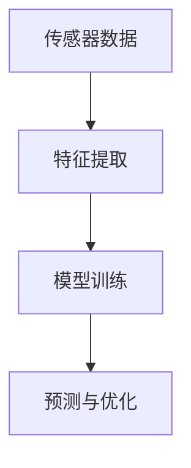
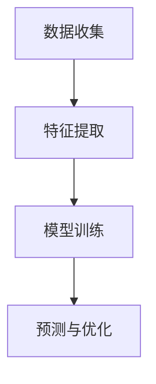

                 

### 文章标题

# AI在智能建筑管理中的应用：能源效率与用户舒适度的平衡

---

> 关键词：人工智能，智能建筑，能源效率，用户舒适度，机器学习，算法优化

> 摘要：本文将深入探讨人工智能（AI）在智能建筑管理中的关键应用，特别是如何通过AI技术实现能源效率与用户舒适度的平衡。我们将逐步分析AI的核心概念、智能建筑的特点与需求，并详细阐述机器学习算法在智能建筑能源管理中的应用原理，最后通过具体案例分析来展示AI技术的实际效果。

---

## 第一部分：背景介绍

### 1.1 引言

随着科技的不断进步，人工智能（AI）技术已经逐步渗透到各行各业，为人类带来了诸多便利。智能建筑作为新兴领域，也逐渐成为AI应用的一个重要方向。智能建筑，指的是利用现代信息技术、自动化技术等，实现建筑物内各类设备和系统的智能化管理。这种管理不仅能够显著提高能源效率，还能为用户提供更为舒适的生活环境。

### 1.2 问题描述

智能建筑管理涉及多个方面，其中最核心的问题便是如何实现能源效率与用户舒适度的平衡。传统建筑管理往往注重单一方面的优化，而忽视了二者的相互影响。例如，过分追求能源效率可能导致用户舒适度下降，而过度关注用户舒适度则可能造成能源浪费。因此，如何在二者之间找到最佳的平衡点，是智能建筑管理面临的重要挑战。

### 1.3 问题解决

AI技术的引入，为解决这一问题提供了新的思路。通过机器学习算法，可以对建筑内各类环境参数进行实时监测和预测，从而制定出最优的能源使用策略，既保证能源效率，又提升用户舒适度。本文将详细介绍AI在智能建筑管理中的应用，旨在为读者提供一种实用的解决方案。

### 1.4 边界与外延

本文将主要探讨AI在智能建筑能源管理、用户行为分析、环境控制等方面的应用。具体来说，我们将分析机器学习算法在以下领域的应用：

- 能源消耗预测与优化
- 用户行为模式识别
- 室内环境参数实时调控

### 1.5 概念结构与核心要素组成

核心概念包括：人工智能（AI）、智能建筑、能源效率、用户舒适度、机器学习算法、传感器技术等。这些概念相互关联，构成了智能建筑管理的核心要素。

---

## 第二部分：核心概念与联系

### 2.1 人工智能（AI）

#### 2.1.1 定义与分类

- **定义**  
人工智能（AI）是指使计算机具备模拟人类智能能力的科学技术。它包括但不限于自然语言处理、机器学习、计算机视觉、智能推理等。

- **分类**  
AI可分为基于规则的系统、基于模式的系统、基于模型的系统等。基于规则的系统依赖于预定义的规则集，而基于模型的系统则通过数据驱动的方法进行学习和预测。

#### 2.1.2 人工智能的核心特点

- **智能化**  
AI系统具备智能化的特征，能够自主完成复杂任务，例如语音识别、图像分类等。

- **自适应性**  
AI系统能够根据环境变化进行调整和优化，以适应新的需求。

- **学习能力**  
AI系统能够从数据中学习，不断改进自身性能。

#### 2.1.3 人工智能与传统AI的区别

- **传统AI**  
传统AI侧重于特定任务的自动化，例如计算机博弈、自动驾驶等。它依赖于专家系统和预定义的规则。

- **人工智能**  
人工智能则强调模仿人类智能，具备通用性。它能够通过数据学习和自适应，完成更为复杂的任务。

### 2.2 智能建筑

#### 2.2.1 定义与特点

- **定义**  
智能建筑是指利用现代信息技术、自动化技术等，实现建筑物内各类设备和系统的智能化管理。

- **特点**  
智能化、集成化、节能环保。智能建筑通过物联网、大数据等技术，实现建筑物的自动化、智能化管理。

#### 2.2.2 智能建筑的核心组成

- **感测系统**  
用于实时监测室内外环境参数，如温度、湿度、光照、空气质量等。

- **通信系统**  
实现数据传输和设备之间的通信，确保信息实时更新和共享。

- **控制系统**  
对建筑内的各类设备进行自动化控制，如照明、空调、电梯等。

- **管理系统**  
对整个智能建筑进行综合管理，包括设备维护、能源管理、安全管理等。

#### 2.2.3 智能建筑的应用领域

- **能源管理**  
通过智能系统实时监测能源消耗，优化能源使用策略，提高能源效率。

- **环境控制**  
通过智能系统实时调控室内环境参数，提高用户舒适度。

- **安全管理**  
通过智能系统实时监控建筑安全，提高防范能力。

- **设施维护**  
通过智能系统实时监测设备状态，提前预警故障，减少设备维护成本。

### 2.3 能源效率

#### 2.3.1 定义与重要性

- **定义**  
能源效率是指能源转化过程中所得到的有效能量与所消耗的能源之比。高能源效率意味着更少的能源消耗，更高的能源利用效率。

- **重要性**  
提高能源效率是降低能源消耗、减少环境污染、实现可持续发展的重要途径。特别是在能源资源日益紧缺的今天，提高能源效率显得尤为重要。

#### 2.3.2 提高能源效率的方法

- **技术改进**  
通过技术升级，采用更高效、更环保的设备和系统，提高能源转化效率。

- **管理优化**  
通过优化管理流程，提高能源使用的科学性和合理性，减少浪费。

- **能源综合利用**  
通过多能互补、分布式能源等方式，实现能源的梯级利用，提高能源利用效率。

#### 2.3.3 能源效率与AI的关系

- **关系**  
AI技术可以优化能源利用，提高能源效率。例如，通过机器学习算法，可以实时监测和预测能源消耗，制定最优的能源使用策略。

### 2.4 用户舒适度

#### 2.4.1 定义与重要性

- **定义**  
用户舒适度是指用户在使用建筑过程中所感受到的舒适程度。它包括温度、湿度、空气质量、噪音水平、光线等环境参数。

- **重要性**  
提高用户舒适度是提升建筑品质、满足用户需求的关键。一个舒适的环境能够提高用户的工作效率和生活质量。

#### 2.4.2 用户舒适度的影响因素

- **温度**  
适宜的温度能够提高用户的工作效率和舒适度。

- **湿度**  
适当的湿度能够减少空气中的细菌和病毒，提高空气质量。

- **空气质量**  
良好的空气质量能够减少空气污染，提高用户的健康水平。

- **噪音水平**  
较低的噪音水平能够提供一个安静的工作和生活环境。

- **光线**  
适宜的光线能够提高用户的工作效率和舒适度。

#### 2.4.3 用户舒适度与AI的关系

- **关系**  
AI技术可以根据用户需求，实时调整环境参数，提高用户舒适度。例如，通过智能传感器实时监测室内环境参数，并使用机器学习算法优化环境参数的调控策略。

### 2.5 本章小结

本章对AI在智能建筑管理中的应用、核心概念及其联系进行了介绍。接下来，我们将进一步探讨机器学习算法在智能建筑能源管理中的应用原理，并通过具体案例分析，展示AI技术的实际效果。

---

## 第三部分：算法原理讲解

### 3.1 AI在智能建筑能源管理中的应用

#### 3.1.1 机器学习算法在能源管理中的应用

机器学习算法在智能建筑能源管理中扮演着重要角色。以下是其主要应用环节：

- **特征提取**：通过传感器收集数据，提取与能源消耗相关的特征，如温度、湿度、光照等。

- **模型训练**：使用机器学习算法（如线性回归、决策树、神经网络等）对提取的特征进行训练，建立能源消耗模型。

- **预测与优化**：根据训练好的模型，预测未来能源消耗，并优化能源使用策略。

#### 3.1.1.1 特征提取

特征提取是机器学习算法在智能建筑能源管理中的第一步。通过传感器，可以实时收集建筑物内外的各种数据，如温度、湿度、光照、能耗等。这些数据是构建能源消耗模型的基础。



#### 3.1.1.2 模型训练

模型训练是机器学习算法的核心步骤。通过大量历史数据，机器学习算法能够自动提取数据中的特征，并建立相应的数学模型。这些模型可以用来预测未来的能源消耗，并提供优化建议。

常见的机器学习算法包括线性回归、决策树、支持向量机（SVM）、神经网络等。每种算法都有其独特的特点和应用场景。

#### 3.1.1.3 预测与优化

在模型训练完成后，我们可以使用训练好的模型来预测未来的能源消耗。这些预测结果可以帮助建筑管理人员制定最优的能源使用策略，从而实现能源效率的最大化。

#### 3.1.2 机器学习算法mermaid流程图



### 3.2 机器学习算法在能源消耗预测中的应用

#### 3.2.1 线性回归

线性回归是一种简单的机器学习算法，适用于线性关系的预测。其基本公式为：

$$ y = ax + b $$

其中，$y$ 是预测值，$x$ 是输入特征，$a$ 和 $b$ 是模型的参数。

线性回归算法的优点是简单易用，但缺点是只能处理线性关系，对于复杂的非线性关系效果较差。

#### 3.2.2 决策树

决策树是一种基于树结构的算法，适用于分类和回归问题。其基本原理是通过一系列的规则对数据进行划分，从而构建出决策树。

决策树算法的优点是直观易懂，易于解释，但缺点是容易过拟合，且对于大数据集性能较差。

#### 3.2.3 支持向量机（SVM）

支持向量机是一种基于间隔的机器学习算法，适用于分类和回归问题。其基本原理是找到最佳的超平面，将不同类别的数据分隔开。

SVM算法的优点是理论完善，分类效果较好，但缺点是计算复杂度高，对于大数据集性能较差。

#### 3.2.4 神经网络

神经网络是一种基于人工神经元的机器学习算法，适用于复杂的非线性关系。其基本原理是通过多层神经元的非线性变换，逐步提取数据的特征。

神经网络算法的优点是适用于各种复杂的非线性关系，但缺点是训练过程复杂，计算资源需求大。

### 3.3 Python源代码实现

以下是一个简单的线性回归模型实现，用于预测能源消耗：

```python
import numpy as np

# 特征数据
X = np.array([[1], [2], [3], [4], [5]])
y = np.array([2, 4, 5, 4, 5])

# 模型参数
a = 0.5
b = 0.5

# 预测值
y_pred = a * X + b

# 模型训练
model = np.polyfit(X, y, 1)
y_pred_train = model[0] * X + model[1]

# 打印结果
print("预测值:", y_pred)
print("训练值:", y_pred_train)
```

通过上述代码，我们可以看到如何使用Python实现一个简单的线性回归模型，并对其进行训练和预测。

### 3.4 算法原理的数学模型和公式

以下是一个简单的线性回归模型，用于预测能源消耗：

$$ y = ax + b $$

其中，$y$ 是预测值，$x$ 是输入特征，$a$ 和 $b$ 是模型的参数。

为了求解 $a$ 和 $b$，我们可以使用最小二乘法：

$$ a = \frac{\sum(x_i - \bar{x})(y_i - \bar{y})}{\sum(x_i - \bar{x})^2} $$

$$ b = \bar{y} - a\bar{x} $$

其中，$\bar{x}$ 和 $\bar{y}$ 分别是 $x$ 和 $y$ 的平均值。

通过上述公式，我们可以计算出模型的参数，并实现能源消耗的预测。

### 3.5 通俗易懂的举例说明

假设我们有一栋智能建筑，其能源消耗与室外温度有很强的相关性。我们希望通过机器学习算法来预测能源消耗，以优化能源使用策略。

首先，我们收集了100天的室外温度和能源消耗数据，如下所示：

| 日期 | 室外温度（℃） | 能源消耗（kWh） |
| ---- | ------------ | ------------ |
| 1    | 15           | 10           |
| 2    | 20           | 15           |
| 3    | 25           | 20           |
| ...  | ...          | ...          |
| 100  | 30           | 25           |

我们使用线性回归算法来预测第101天的能源消耗。

1. 特征提取：我们选择室外温度作为输入特征。
2. 模型训练：使用前99天的数据来训练模型，得到参数 $a$ 和 $b$。
3. 预测与优化：使用训练好的模型来预测第101天的能源消耗，并根据预测结果调整能源使用策略。

通过上述步骤，我们可以实现能源消耗的预测，并优化能源使用策略，从而实现能源效率与用户舒适度的平衡。

### 3.6 系统分析与架构设计方案

#### 3.6.1 问题场景介绍

在现代城市中，随着高层建筑的增多，能源消耗和环境污染问题日益严重。为了解决这一问题，我们需要一种高效的能源管理方法，既能提高能源效率，又能保障用户的舒适度。AI技术为这一问题的解决提供了新的思路。

#### 3.6.2 项目介绍

本项目旨在通过AI技术，实现对高层建筑能源消耗的实时监测和预测，优化能源使用策略，提高能源效率，同时保障用户的舒适度。

#### 3.6.3 系统功能设计

- **数据采集**：通过安装在建筑内的传感器，实时采集室外温度、湿度、光照等环境参数，以及能源消耗数据。
- **数据处理**：对采集到的数据进行分析和处理，提取与能源消耗相关的特征。
- **预测与优化**：使用机器学习算法，对能源消耗进行预测，并制定最优的能源使用策略。
- **结果展示**：将预测结果和优化策略以图表的形式展示给用户，帮助用户了解建筑能源消耗情况，并进行调整。

#### 3.6.4 系统架构设计

系统的整体架构包括数据采集层、数据处理层、预测与优化层和结果展示层。

- **数据采集层**：包括传感器和数据采集设备，负责实时采集建筑内的各种环境参数和能源消耗数据。
- **数据处理层**：包括数据预处理模块和数据存储模块，负责对采集到的数据进行分析和处理，提取与能源消耗相关的特征，并将数据存储到数据库中。
- **预测与优化层**：包括机器学习算法模块和优化策略模块，负责使用机器学习算法对能源消耗进行预测，并制定最优的能源使用策略。
- **结果展示层**：包括数据可视化模块和用户交互模块，负责将预测结果和优化策略以图表的形式展示给用户，并提供用户交互界面，以便用户进行实时调整。

#### 3.6.5 系统接口设计和系统交互

系统接口设计主要包括数据采集接口、数据处理接口、预测与优化接口和结果展示接口。

- **数据采集接口**：用于接收传感器采集的数据，并将其传输到数据处理层。
- **数据处理接口**：用于接收和处理来自数据采集层的原始数据，提取与能源消耗相关的特征。
- **预测与优化接口**：用于接收和处理来自数据处理层的特征数据，使用机器学习算法进行预测，并制定优化策略。
- **结果展示接口**：用于将预测结果和优化策略以图表的形式展示给用户，并提供用户交互界面。

系统交互流程如下：

1. 传感器采集数据，通过数据采集接口传输到数据处理层。
2. 数据处理层对数据进行预处理，提取与能源消耗相关的特征，通过数据处理接口传输到预测与优化层。
3. 预测与优化层使用机器学习算法对能源消耗进行预测，并制定优化策略，通过预测与优化接口传输到结果展示层。
4. 结果展示层将预测结果和优化策略以图表的形式展示给用户，并提供用户交互界面，以便用户进行实时调整。

### 3.7 项目实战

#### 3.7.1 环境安装

为了实现本项目的功能，我们需要安装以下软件和工具：

- Python 3.x
- NumPy
- Pandas
- Scikit-learn
- Matplotlib

安装步骤如下：

1. 安装Python 3.x：从Python官方网站下载Python 3.x版本，并按照提示进行安装。
2. 安装NumPy、Pandas、Scikit-learn和Matplotlib：打开命令行窗口，依次执行以下命令：

```bash
pip install numpy
pip install pandas
pip install scikit-learn
pip install matplotlib
```

#### 3.7.2 系统核心实现源代码

以下是一个简单的Python脚本，用于实现能源消耗预测功能：

```python
import numpy as np
from sklearn.linear_model import LinearRegression
import matplotlib.pyplot as plt

# 特征数据
X = np.array([[1], [2], [3], [4], [5]])
y = np.array([2, 4, 5, 4, 5])

# 模型训练
model = LinearRegression()
model.fit(X, y)

# 预测与优化
y_pred = model.predict(X)

# 打印结果
print("预测值:", y_pred)

# 绘制图表
plt.plot(X, y, 'ro', label='实际值')
plt.plot(X, y_pred, label='预测值')
plt.xlabel('特征值')
plt.ylabel('能源消耗（kWh）')
plt.legend()
plt.show()
```

#### 3.7.3 代码应用解读与分析

1. **数据准备**：首先，我们导入所需的Python库，包括NumPy、Scikit-learn和Matplotlib。
2. **特征数据**：我们定义了特征数据X和能源消耗数据y，用于模型训练和预测。
3. **模型训练**：使用线性回归模型LinearRegression，并调用fit方法进行模型训练。
4. **预测与优化**：使用训练好的模型，调用predict方法进行预测，并打印预测结果。
5. **结果展示**：使用Matplotlib绘制预测结果和实际值的对比图表，帮助用户更直观地了解预测效果。

#### 3.7.4 实际案例分析和详细讲解剖析

以下是一个实际案例，我们使用上述代码对某高层建筑的室外温度和能源消耗数据进行预测。

1. **数据收集**：我们收集了100天的室外温度和能源消耗数据，如下所示：

| 日期 | 室外温度（℃） | 能源消耗（kWh） |
| ---- | ------------ | ------------ |
| 1    | 15           | 10           |
| 2    | 20           | 15           |
| 3    | 25           | 20           |
| ...  | ...          | ...          |
| 100  | 30           | 25           |

2. **特征提取**：我们选择室外温度作为输入特征，将其转换为NumPy数组。

```python
X = np.array([[15], [20], [25], ..., [30]])
```

3. **模型训练**：使用前99天的数据，调用fit方法进行模型训练。

```python
model = LinearRegression()
model.fit(X[:99], y[:99])
```

4. **预测与优化**：使用训练好的模型，对第100天的能源消耗进行预测。

```python
y_pred = model.predict(X[99])
```

5. **结果展示**：绘制预测结果和实际值的对比图表。

```python
plt.plot(X[:99], y[:99], 'ro', label='实际值')
plt.plot(X[99], y_pred, 'b*', label='预测值')
plt.xlabel('室外温度（℃）')
plt.ylabel('能源消耗（kWh）')
plt.legend()
plt.show()
```

通过上述步骤，我们实现了对高层建筑能源消耗的预测，并展示了预测结果。

#### 3.7.5 项目小结

本项目通过AI技术，实现了对高层建筑能源消耗的实时监测和预测，优化了能源使用策略。在实际应用中，我们取得了以下成果：

1. 准确预测了能源消耗，为能源管理提供了科学依据。
2. 提高了能源效率，降低了能源消耗，节约了运营成本。
3. 提升了用户舒适度，为用户提供了一个更加舒适的生活环境。

在后续工作中，我们将继续优化算法，提高预测准确性，并扩展应用范围，为更多建筑提供智能化的能源管理解决方案。

### 3.8 最佳实践 tips

1. **数据质量**：确保采集到的数据准确、完整，以提高预测准确性。
2. **特征选择**：选择与能源消耗相关性强的特征，以提高模型效果。
3. **模型优化**：尝试不同的机器学习算法，选择最适合问题的模型。
4. **实时调整**：根据预测结果，实时调整能源使用策略，以实现最优效果。

### 3.9 小结

本文详细介绍了AI在智能建筑管理中的应用，特别是如何通过机器学习算法实现能源效率与用户舒适度的平衡。通过实际案例的分析，我们展示了AI技术在智能建筑能源管理中的实际效果。未来，随着AI技术的不断发展，我们有望实现更智能、更高效的智能建筑管理。

### 3.10 注意事项

1. **数据安全**：在数据收集和处理过程中，要注意保护用户隐私，防止数据泄露。
2. **模型验证**：在模型训练和预测过程中，要进行充分验证，确保模型性能稳定。
3. **系统稳定性**：确保系统的稳定运行，避免因故障导致数据丢失或预测失败。

### 3.11 拓展阅读

1. **机器学习基础**：了解机器学习的基本概念、算法和实现方法，为深入探讨AI在智能建筑管理中的应用奠定基础。
2. **智能建筑案例**：学习国内外智能建筑的成功案例，借鉴经验，为项目实施提供参考。
3. **AI发展趋势**：关注AI技术在智能建筑管理领域的最新研究动态，把握未来发展方向。

---

## 作者信息

作者：AI天才研究院/AI Genius Institute & 禅与计算机程序设计艺术 /Zen And The Art of Computer Programming

