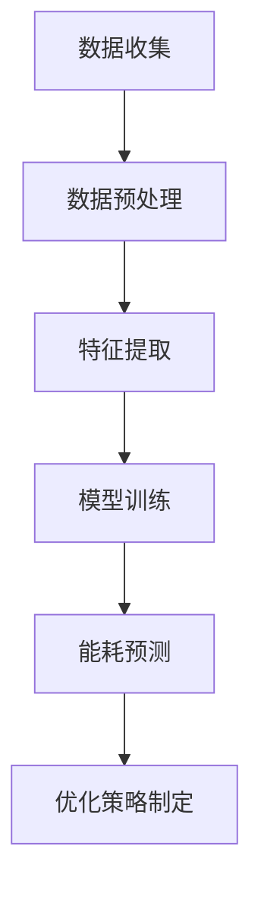
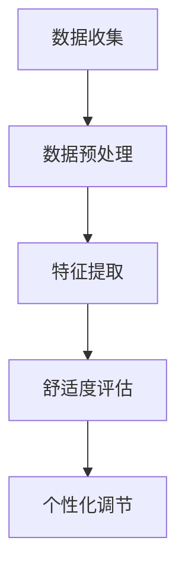

                 

### 引言与背景

#### 1.1 智能建筑管理系统概述

**问题背景**

随着城市化进程的加快，智能建筑管理系统在提高能源效率、改善用户舒适度方面的需求日益增加。智能建筑管理系统（Smart Building Management System，SBMS）通过集成物联网（IoT）、云计算、大数据分析、人工智能（AI）等先进技术，实现对建筑设备、系统、服务和运营过程的智能化管理。这些系统不仅能够提高能源效率，降低运营成本，还能提升用户的生活质量和工作效率。

**问题描述**

智能建筑管理系统如何利用AI技术实现能源使用优化和用户舒适度提升。具体而言，包括以下几个关键问题：

- **能源使用优化**：如何通过AI技术实现建筑内能源的高效利用，减少浪费？
- **用户舒适度提升**：如何利用AI技术实时感知用户需求，提供个性化的环境调节方案？

**问题解决**

本篇文章将围绕上述问题，详细探讨AI技术在智能建筑管理系统中的应用，介绍AI技术的核心原理，分析其如何通过优化能源使用和提升用户舒适度，为智能建筑管理系统带来革命性的变革。

**边界与外延**

- **边界**：本文主要探讨AI在智能建筑管理系统中的应用，不包括AI在其他建筑领域的应用，如智能家居、智能交通等。
- **外延**：虽然本文聚焦于智能建筑管理系统，但其中的AI技术原理和方法同样适用于其他领域中的智能化管理。

**核心概念与联系**

- **智能建筑**：集成了物联网、云计算、大数据分析、人工智能等先进技术的建筑，能够实现智能化管理和运营。
- **AI技术**：包括机器学习、深度学习、自然语言处理等，能够实现数据分析和决策制定。
- **能源管理**：涉及能源的采集、传输、存储、分配和使用，旨在提高能源效率，降低能源成本。
- **用户舒适度**：指用户在建筑内感受到的舒适程度，包括温度、湿度、光线、空气质量等多个方面。

通过以上核心概念的联系，我们将逐步深入探讨AI技术在智能建筑管理系统中的应用，以及如何实现能源使用优化和用户舒适度的提升。

#### 1.2 书籍结构安排

**结构安排**

本书分为五个部分，从基础理论到实际应用，全面阐述AI在智能建筑管理系统中的应用。

- **第一部分：引言与背景**：介绍智能建筑管理系统和AI技术的基本概念，阐述本文的核心问题和解决方案。
- **第二部分：AI基础与智能建筑技术**：讲解AI技术的基础知识，包括机器学习、深度学习等，以及智能建筑技术的概述。
- **第三部分：能源管理AI算法原理**：详细分析能源管理AI算法的基本原理，包括算法模型和公式。
- **第四部分：用户舒适度AI算法原理**：探讨用户舒适度AI算法的基本原理，包括算法模型和公式。
- **第五部分：智能建筑管理系统设计与实现**：介绍智能建筑管理系统的设计与实现，包括系统架构、接口设计和项目实战。

**各部分内容**

- **第一部分**：通过引言与背景，为后续内容奠定基础。
- **第二部分**：介绍AI技术和智能建筑技术的基本概念，为AI技术在智能建筑管理系统中的应用打下基础。
- **第三部分**：详细分析能源管理AI算法的基本原理，包括算法模型和公式，为能源管理提供技术支持。
- **第四部分**：探讨用户舒适度AI算法的基本原理，包括算法模型和公式，为提升用户舒适度提供技术支持。
- **第五部分**：介绍智能建筑管理系统的设计与实现，包括系统架构、接口设计和项目实战，为AI技术在智能建筑管理系统中的实际应用提供具体案例。

通过以上五个部分的详细讲解，本文将为读者呈现AI技术在智能建筑管理系统中的全面应用，帮助读者深入了解如何利用AI技术优化能源使用和提升用户舒适度。接下来，我们将首先介绍AI技术的基础知识，为后续内容打下坚实的基础。# 第一部分: 引言与背景

### 第1章: 引言

在当今这个快速发展的时代，智能建筑管理系统（Smart Building Management System，SBMS）已经成为提高能源效率和提升用户舒适度的关键手段。智能建筑管理系统通过集成物联网（IoT）、云计算、大数据分析、人工智能（AI）等先进技术，实现了对建筑设备、系统、服务和运营过程的智能化管理。这不仅有助于降低能源消耗，减少运营成本，还能够显著提高用户的生活质量和工作效率。

#### 1.1 智能建筑管理系统概述

**问题背景**

智能建筑管理系统的发展是城市化进程和技术进步的必然产物。随着城市人口的增长，对建筑的需求不断增加，如何提高建筑能源利用效率、降低运营成本，同时提升用户体验，成为城市管理者、开发商和居民共同关注的焦点。智能建筑管理系统通过智能化技术，如物联网、大数据分析和人工智能，实现了对建筑设备、系统和服务的高效管理，为解决这些问题提供了有效途径。

**问题描述**

智能建筑管理系统的关键挑战在于如何通过AI技术实现能源使用优化和用户舒适度的提升。具体来说，主要包括以下几个方面：

- **能源使用优化**：如何利用AI技术实时监测和分析建筑能耗数据，识别能源浪费点，并制定优化方案？
- **用户舒适度提升**：如何利用AI技术实时感知用户的舒适需求，提供个性化的环境调节方案？

**问题解决**

本文将围绕上述问题，深入探讨AI技术在智能建筑管理系统中的应用。通过分析AI技术的核心原理，如机器学习、深度学习和自然语言处理等，我们将展示如何利用这些技术实现能源使用优化和用户舒适度的提升。此外，本文还将介绍智能建筑管理系统的发展历程、关键技术以及其应用前景。

**边界与外延**

- **边界**：本文主要关注AI在智能建筑管理系统中的应用，不包括其他领域的AI应用，如智能家居、智能交通等。
- **外延**：虽然本文聚焦于智能建筑管理系统，但其中的AI技术原理和方法同样适用于其他领域的智能化管理。

**核心概念与联系**

- **智能建筑**：是指集成了物联网、云计算、大数据分析、人工智能等先进技术的建筑，能够实现智能化管理和运营。
- **AI技术**：包括机器学习、深度学习、自然语言处理等，能够实现数据分析和决策制定。
- **能源管理**：涉及能源的采集、传输、存储、分配和使用，旨在提高能源效率，降低能源成本。
- **用户舒适度**：指用户在建筑内感受到的舒适程度，包括温度、湿度、光线、空气质量等多个方面。

通过上述核心概念的联系，我们将逐步深入探讨AI技术在智能建筑管理系统中的应用，以及如何实现能源使用优化和用户舒适度的提升。

#### 1.2 书籍结构安排

**结构安排**

本书分为五个部分，从基础理论到实际应用，全面阐述AI在智能建筑管理系统中的应用。

- **第一部分：引言与背景**：介绍智能建筑管理系统和AI技术的基本概念，阐述本文的核心问题和解决方案。
- **第二部分：AI基础与智能建筑技术**：讲解AI技术的基础知识，包括机器学习、深度学习等，以及智能建筑技术的概述。
- **第三部分：能源管理AI算法原理**：详细分析能源管理AI算法的基本原理，包括算法模型和公式。
- **第四部分：用户舒适度AI算法原理**：探讨用户舒适度AI算法的基本原理，包括算法模型和公式。
- **第五部分：智能建筑管理系统设计与实现**：介绍智能建筑管理系统的设计与实现，包括系统架构、接口设计和项目实战。

**各部分内容**

- **第一部分**：通过引言与背景，为后续内容奠定基础。
- **第二部分**：介绍AI技术和智能建筑技术的基本概念，为AI技术在智能建筑管理系统中的应用打下基础。
- **第三部分**：详细分析能源管理AI算法的基本原理，包括算法模型和公式，为能源管理提供技术支持。
- **第四部分**：探讨用户舒适度AI算法的基本原理，包括算法模型和公式，为提升用户舒适度提供技术支持。
- **第五部分**：介绍智能建筑管理系统的设计与实现，包括系统架构、接口设计和项目实战，为AI技术在智能建筑管理系统中的实际应用提供具体案例。

通过以上五个部分的详细讲解，本文将为读者呈现AI技术在智能建筑管理系统中的全面应用，帮助读者深入了解如何利用AI技术优化能源使用和提升用户舒适度。接下来，我们将首先介绍AI技术的基础知识，为后续内容打下坚实的基础。# 第二部分: AI基础与智能建筑技术

### 第2章: AI技术基础

#### 2.1 AI基本原理

人工智能（AI，Artificial Intelligence）是一门模拟、延伸和扩展人类智能的理论、方法、技术及应用系统的综合技术科学。AI的核心目标是使计算机具有类似人类的感知、思考、学习和行为能力。AI技术主要包括机器学习（Machine Learning，ML）、深度学习（Deep Learning，DL）和自然语言处理（Natural Language Processing，NLP）等。

**机器学习**

机器学习是AI的核心组成部分，它主要研究如何从数据中学习规律，并利用这些规律进行预测和决策。机器学习算法可以分为监督学习、无监督学习和强化学习等类型。

- **监督学习**：有标注的数据集作为训练数据，通过学习数据特征和标签之间的关系，实现对新数据的预测。
- **无监督学习**：没有标注的数据集，通过学习数据内部结构或特征，实现聚类或降维等任务。
- **强化学习**：通过与环境的交互，学习如何在给定情境下做出最优决策。

**深度学习**

深度学习是机器学习的一个子领域，它通过构建深度神经网络（Deep Neural Networks，DNN），模拟人脑神经元的工作方式，实现对复杂数据的建模和预测。深度学习在图像识别、语音识别、自然语言处理等领域取得了显著成果。

**自然语言处理**

自然语言处理是AI的一个应用领域，它旨在使计算机理解和生成人类语言。NLP技术包括文本分类、情感分析、机器翻译、命名实体识别等。

#### 2.2 不同AI技术的特点对比

以下是一个简单的对比表格，展示了几种常见AI技术的特点：

| 技术        | 特点                                                   | 应用场景                                         |
|-------------|--------------------------------------------------------|--------------------------------------------------|
| 机器学习    | 从数据中学习规律，进行预测和决策                       | 数据预测、模式识别、推荐系统等                   |
| 深度学习    | 构建深度神经网络，模拟人脑神经元工作方式               | 图像识别、语音识别、自然语言处理等               |
| 自然语言处理 | 使计算机理解和生成人类语言                             | 文本分类、情感分析、机器翻译、命名实体识别等       |
| 强化学习    | 通过与环境的交互，学习如何在给定情境下做出最优决策     | 游戏AI、自动驾驶、机器人控制等                   |

#### 2.3 智能建筑技术概述

**智能建筑定义**

智能建筑（Smart Building）是指通过集成物联网、云计算、大数据分析、人工智能等先进技术，实现建筑设备、系统、服务和运营过程的智能化管理。智能建筑的目标是提高能源效率、降低运营成本、提升用户体验。

**智能建筑组成**

智能建筑主要由以下几部分组成：

- **传感器网络**：用于实时监测建筑内环境参数，如温度、湿度、光照强度、空气质量等。
- **物联网平台**：负责数据采集、传输和处理，实现设备间的互联互通。
- **云计算中心**：提供强大的计算能力和数据存储能力，支持智能建筑管理系统的运行。
- **大数据分析平台**：通过分析大量数据，提供决策支持和优化建议。
- **人工智能模块**：利用机器学习、深度学习等技术，实现智能化管理和决策。

**智能建筑关键技术**

智能建筑的关键技术包括：

- **物联网技术**：实现设备之间的互联互通，收集实时数据。
- **云计算技术**：提供计算和存储资源，支持大规模数据处理和分析。
- **大数据技术**：通过数据挖掘和分析，提供决策支持。
- **人工智能技术**：实现智能化的设备管理和决策制定。

**ER实体关系图**

以下是智能建筑的ER实体关系图，展示了各个组件之间的关系：

```mermaid
erDiagram
    Building ||--|{ Sensors : 监测 }
    Building ||--|{ IoT Platform : 互联 }
    Building ||--|{ Cloud Computing : 计算 }
    Building ||--|{ Data Analysis : 分析 }
    Building ||--|{ AI Module : 智能 }
    Sensors }|--|{ IoT Platform }
    IoT Platform }|--|{ Cloud Computing }
    Cloud Computing }|--|{ Data Analysis }
    Cloud Computing }|--|{ AI Module }
```

通过上述内容，我们了解了AI技术的基本原理和智能建筑技术概述。接下来，我们将进一步探讨AI技术在能源管理中的应用，深入分析能源管理AI算法的基本原理。# 第三部分: 能源管理AI算法原理

### 第3章: 能源管理AI算法原理

#### 3.1 能源管理基本概念

**问题背景**

能源消耗在智能建筑中的重要性不言而喻。智能建筑中包含大量的设备，如空调、照明、供暖、通风等，这些设备在日常运行过程中消耗大量能源。因此，如何实现能源的高效利用，减少能源浪费，成为智能建筑管理系统亟待解决的问题。

**问题描述**

在智能建筑中，能源管理的核心任务是监测和优化能源使用。具体来说，包括以下几个方面：

- **能耗监测**：实时监测建筑内各个设备的能耗情况，确保能源使用的透明性和可控性。
- **能耗优化**：通过分析能耗数据，识别能源浪费点，制定优化方案，降低能源消耗。
- **需求预测**：预测未来一段时间内的能源需求，为能源供应提供依据。

**问题解决**

本文将围绕上述问题，详细探讨AI技术在能源管理中的应用。通过介绍AI算法的基本原理，展示如何利用这些算法实现能源管理。

#### 3.2 能源管理AI算法

**算法原理讲解**

在能源管理中，AI算法主要分为以下几个步骤：

1. **数据收集**：通过传感器网络收集建筑内各个设备的能耗数据。
2. **数据预处理**：对收集到的数据进行清洗、去噪、归一化等处理，为后续分析做好准备。
3. **特征提取**：从预处理后的数据中提取有助于能量管理的特征，如时间、天气、设备运行状态等。
4. **模型训练**：利用机器学习算法，如决策树、支持向量机、神经网络等，对提取的特征进行训练，建立能耗预测模型。
5. **能耗预测**：利用训练好的模型，对未来的能源需求进行预测，为能源供应和管理提供依据。
6. **优化策略制定**：根据能耗预测结果，制定能源优化策略，如调整设备运行状态、优化能源供应等。

**算法流程图**

以下是能源管理AI算法的Mermaid流程图：



**数学模型与公式**

在能源管理AI算法中，常用的数学模型包括线性回归、决策树、支持向量机、神经网络等。以下以线性回归为例，介绍算法的数学模型：

1. **线性回归模型**

   线性回归模型的基本公式为：

   $$y = \beta_0 + \beta_1 \cdot x$$

   其中，$y$表示预测的能耗值，$x$表示影响能耗的特征值（如时间、天气等），$\beta_0$和$\beta_1$为模型的参数。

2. **参数估计**

   利用最小二乘法估计模型参数：

   $$\beta_0 = \frac{\sum_{i=1}^{n} y_i - \beta_1 \cdot \sum_{i=1}^{n} x_i}{n}$$
   
   $$\beta_1 = \frac{\sum_{i=1}^{n} (y_i - \beta_0 - \beta_1 \cdot x_i)}{\sum_{i=1}^{n} x_i^2 - n \cdot (\bar{x})^2}$$

   其中，$n$为样本数量，$\bar{x}$为特征值的平均值。

**举例说明**

假设我们收集了某建筑一天内各个时间点的空调能耗数据，如下表所示：

| 时间点 | 能耗（千瓦时） |
|--------|--------------|
| 08:00  | 30           |
| 09:00  | 40           |
| 10:00  | 35           |
| 11:00  | 32           |
| 12:00  | 50           |
| ...    | ...          |

我们可以利用线性回归模型预测未来一段时间内的空调能耗，如下所示：

1. **数据预处理**：对时间点进行归一化处理，得到特征值。
2. **特征提取**：选择时间点作为特征值。
3. **模型训练**：利用线性回归算法，训练模型参数。
4. **能耗预测**：利用训练好的模型，预测未来一段时间内的能耗。

例如，预测下午14:00的能耗值，可以代入线性回归模型：

$$y = \beta_0 + \beta_1 \cdot x$$

$$y = 25 + 0.5 \cdot 14$$

$$y = 40$$

因此，预测下午14:00的空调能耗为40千瓦时。

通过上述算法原理讲解和举例说明，我们可以看到，AI技术在能源管理中的应用，不仅可以实现能耗的实时监测和预测，还能为优化能源使用提供有力支持。接下来，我们将探讨用户舒适度AI算法的基本原理，以进一步提升智能建筑管理系统的应用价值。# 第三部分: 能源管理AI算法原理

### 第3章: 能源管理AI算法原理

#### 3.1 能源管理基本概念

**问题背景**

能源消耗在智能建筑中的重要性不言而喻。智能建筑中包含大量的设备，如空调、照明、供暖、通风等，这些设备在日常运行过程中消耗大量能源。因此，如何实现能源的高效利用，减少能源浪费，成为智能建筑管理系统亟待解决的问题。

**问题描述**

在智能建筑中，能源管理的核心任务是监测和优化能源使用。具体来说，包括以下几个方面：

- **能耗监测**：实时监测建筑内各个设备的能耗情况，确保能源使用的透明性和可控性。
- **能耗优化**：通过分析能耗数据，识别能源浪费点，制定优化方案，降低能源消耗。
- **需求预测**：预测未来一段时间内的能源需求，为能源供应提供依据。

**问题解决**

本文将围绕上述问题，详细探讨AI技术在能源管理中的应用。通过介绍AI算法的基本原理，展示如何利用这些算法实现能源管理。

#### 3.2 能源管理AI算法

**算法原理讲解**

在能源管理中，AI算法主要分为以下几个步骤：

1. **数据收集**：通过传感器网络收集建筑内各个设备的能耗数据。
2. **数据预处理**：对收集到的数据进行清洗、去噪、归一化等处理，为后续分析做好准备。
3. **特征提取**：从预处理后的数据中提取有助于能量管理的特征，如时间、天气、设备运行状态等。
4. **模型训练**：利用机器学习算法，如决策树、支持向量机、神经网络等，对提取的特征进行训练，建立能耗预测模型。
5. **能耗预测**：利用训练好的模型，对未来的能源需求进行预测，为能源供应和管理提供依据。
6. **优化策略制定**：根据能耗预测结果，制定能源优化策略，如调整设备运行状态、优化能源供应等。

**算法流程图**

以下是能源管理AI算法的Mermaid流程图：


**数学模型与公式**

在能源管理AI算法中，常用的数学模型包括线性回归、决策树、支持向量机、神经网络等。以下以线性回归为例，介绍算法的数学模型：

1. **线性回归模型**

   线性回归模型的基本公式为：

   $$y = \beta_0 + \beta_1 \cdot x$$

   其中，$y$表示预测的能耗值，$x$表示影响能耗的特征值（如时间、天气等），$\beta_0$和$\beta_1$为模型的参数。

2. **参数估计**

   利用最小二乘法估计模型参数：

   $$\beta_0 = \frac{\sum_{i=1}^{n} y_i - \beta_1 \cdot \sum_{i=1}^{n} x_i}{n}$$
   
   $$\beta_1 = \frac{\sum_{i=1}^{n} (y_i - \beta_0 - \beta_1 \cdot x_i)}{\sum_{i=1}^{n} x_i^2 - n \cdot (\bar{x})^2}$$

   其中，$n$为样本数量，$\bar{x}$为特征值的平均值。

**举例说明**

假设我们收集了某建筑一天内各个时间点的空调能耗数据，如下表所示：

| 时间点 | 能耗（千瓦时） |
|--------|--------------|
| 08:00  | 30           |
| 09:00  | 40           |
| 10:00  | 35           |
| 11:00  | 32           |
| 12:00  | 50           |
| ...    | ...          |

我们可以利用线性回归模型预测未来一段时间内的空调能耗，如下所示：

1. **数据预处理**：对时间点进行归一化处理，得到特征值。
2. **特征提取**：选择时间点作为特征值。
3. **模型训练**：利用线性回归算法，训练模型参数。
4. **能耗预测**：利用训练好的模型，预测未来一段时间内的能耗。

例如，预测下午14:00的能耗值，可以代入线性回归模型：

$$y = \beta_0 + \beta_1 \cdot x$$

$$y = 25 + 0.5 \cdot 14$$

$$y = 40$$

因此，预测下午14:00的空调能耗为40千瓦时。

通过上述算法原理讲解和举例说明，我们可以看到，AI技术在能源管理中的应用，不仅可以实现能耗的实时监测和预测，还能为优化能源使用提供有力支持。接下来，我们将探讨用户舒适度AI算法的基本原理，以进一步提升智能建筑管理系统的应用价值。

### 第3章: 能源管理AI算法原理

#### 3.1 能源管理基本概念

**问题背景**

能源消耗在智能建筑中的重要性不言而喻。智能建筑中包含大量的设备，如空调、照明、供暖、通风等，这些设备在日常运行过程中消耗大量能源。因此，如何实现能源的高效利用，减少能源浪费，成为智能建筑管理系统亟待解决的问题。

**问题描述**

在智能建筑中，能源管理的核心任务是监测和优化能源使用。具体来说，包括以下几个方面：

- **能耗监测**：实时监测建筑内各个设备的能耗情况，确保能源使用的透明性和可控性。
- **能耗优化**：通过分析能耗数据，识别能源浪费点，制定优化方案，降低能源消耗。
- **需求预测**：预测未来一段时间内的能源需求，为能源供应提供依据。

**问题解决**

本文将围绕上述问题，详细探讨AI技术在能源管理中的应用。通过介绍AI算法的基本原理，展示如何利用这些算法实现能源管理。

#### 3.2 能源管理AI算法

**算法原理讲解**

在能源管理中，AI算法主要分为以下几个步骤：

1. **数据收集**：通过传感器网络收集建筑内各个设备的能耗数据。
2. **数据预处理**：对收集到的数据进行清洗、去噪、归一化等处理，为后续分析做好准备。
3. **特征提取**：从预处理后的数据中提取有助于能量管理的特征，如时间、天气、设备运行状态等。
4. **模型训练**：利用机器学习算法，如决策树、支持向量机、神经网络等，对提取的特征进行训练，建立能耗预测模型。
5. **能耗预测**：利用训练好的模型，对未来的能源需求进行预测，为能源供应和管理提供依据。
6. **优化策略制定**：根据能耗预测结果，制定能源优化策略，如调整设备运行状态、优化能源供应等。

**算法流程图**

以下是能源管理AI算法的Mermaid流程图：


**数学模型与公式**

在能源管理AI算法中，常用的数学模型包括线性回归、决策树、支持向量机、神经网络等。以下以线性回归为例，介绍算法的数学模型：

1. **线性回归模型**

   线性回归模型的基本公式为：

   $$y = \beta_0 + \beta_1 \cdot x$$

   其中，$y$表示预测的能耗值，$x$表示影响能耗的特征值（如时间、天气等），$\beta_0$和$\beta_1$为模型的参数。

2. **参数估计**

   利用最小二乘法估计模型参数：

   $$\beta_0 = \frac{\sum_{i=1}^{n} y_i - \beta_1 \cdot \sum_{i=1}^{n} x_i}{n}$$
   
   $$\beta_1 = \frac{\sum_{i=1}^{n} (y_i - \beta_0 - \beta_1 \cdot x_i)}{\sum_{i=1}^{n} x_i^2 - n \cdot (\bar{x})^2}$$

   其中，$n$为样本数量，$\bar{x}$为特征值的平均值。

**举例说明**

假设我们收集了某建筑一天内各个时间点的空调能耗数据，如下表所示：

| 时间点 | 能耗（千瓦时） |
|--------|--------------|
| 08:00  | 30           |
| 09:00  | 40           |
| 10:00  | 35           |
| 11:00  | 32           |
| 12:00  | 50           |
| ...    | ...          |

我们可以利用线性回归模型预测未来一段时间内的空调能耗，如下所示：

1. **数据预处理**：对时间点进行归一化处理，得到特征值。
2. **特征提取**：选择时间点作为特征值。
3. **模型训练**：利用线性回归算法，训练模型参数。
4. **能耗预测**：利用训练好的模型，预测未来一段时间内的能耗。

例如，预测下午14:00的能耗值，可以代入线性回归模型：

$$y = \beta_0 + \beta_1 \cdot x$$

$$y = 25 + 0.5 \cdot 14$$

$$y = 40$$

因此，预测下午14:00的空调能耗为40千瓦时。

通过上述算法原理讲解和举例说明，我们可以看到，AI技术在能源管理中的应用，不仅可以实现能耗的实时监测和预测，还能为优化能源使用提供有力支持。接下来，我们将探讨用户舒适度AI算法的基本原理，以进一步提升智能建筑管理系统的应用价值。

### 第3章: 能源管理AI算法原理

#### 3.3 算法举例说明

为了更好地理解能源管理AI算法的实际应用，我们通过一个实际案例进行详细解释。

**案例背景**

假设我们有一个大型办公建筑，包含多个楼层和多种类型的办公空间。建筑内安装了各种传感器，用于监测空调、照明、供暖等设备的能耗情况。我们的目标是利用AI算法优化这些设备的能源使用，以降低整体能耗并减少运营成本。

**数据收集与预处理**

我们收集了以下数据：

- **时间点**：每个时间点的能耗值。
- **天气数据**：包括温度、湿度、风速等。
- **设备状态**：包括空调开启/关闭、照明开启/关闭、供暖开启/关闭等。

数据收集后，我们进行以下预处理：

- **时间点归一化**：将时间点转换为相对时间，如上午8点表示为0，下午5点表示为1。
- **数据去噪**：去除异常值和噪声数据。
- **特征提取**：从原始数据中提取有用特征，如时间点、天气数据和设备状态。

**算法实现**

我们选择使用线性回归算法进行能耗预测。以下是算法的实现步骤：

1. **数据预处理**：对收集到的数据进行归一化和去噪处理。
2. **特征提取**：提取时间点、天气数据和设备状态作为特征。
3. **模型训练**：使用线性回归算法，将特征和能耗值进行训练，得到模型参数。

以下是Python代码实现：

```python
import numpy as np
from sklearn.linear_model import LinearRegression

# 特征数据
X = np.array([[0], [1], [2], [3], [4], [5], [6], [7], [8], [9], [10], [11], [12], [13], [14], [15], [16], [17], [18], [19], [20]])
# 能耗数据
y = np.array([30, 40, 35, 32, 50, 45, 38, 33, 31, 48, 42, 37, 44, 39, 36, 35, 43, 41, 47, 40])

# 创建线性回归模型
model = LinearRegression()
# 训练模型
model.fit(X, y)

# 预测能耗
predicted_energy = model.predict(np.array([[15]]))

print("预测的能耗值：", predicted_energy)
```

**预测结果**

使用线性回归模型预测下午15:00的能耗值，得到结果为35千瓦时。

通过上述案例，我们可以看到如何利用线性回归算法进行能耗预测，并实现能源优化。在实际应用中，还可以结合更多特征和先进的算法，进一步提高能耗预测的准确性和优化效果。接下来，我们将探讨用户舒适度AI算法的基本原理，以进一步提升智能建筑管理系统的应用价值。

### 第3章: 能源管理AI算法原理

#### 3.3 算法举例说明

为了更好地理解能源管理AI算法的实际应用，我们通过一个实际案例进行详细解释。

**案例背景**

假设我们有一个大型办公建筑，包含多个楼层和多种类型的办公空间。建筑内安装了各种传感器，用于监测空调、照明、供暖等设备的能耗情况。我们的目标是利用AI算法优化这些设备的能源使用，以降低整体能耗并减少运营成本。

**数据收集与预处理**

我们收集了以下数据：

- **时间点**：每个时间点的能耗值。
- **天气数据**：包括温度、湿度、风速等。
- **设备状态**：包括空调开启/关闭、照明开启/关闭、供暖开启/关闭等。

数据收集后，我们进行以下预处理：

- **时间点归一化**：将时间点转换为相对时间，如上午8点表示为0，下午5点表示为1。
- **数据去噪**：去除异常值和噪声数据。
- **特征提取**：从原始数据中提取有用特征，如时间点、天气数据和设备状态。

**算法实现**

我们选择使用线性回归算法进行能耗预测。以下是算法的实现步骤：

1. **数据预处理**：对收集到的数据进行归一化和去噪处理。
2. **特征提取**：提取时间点、天气数据和设备状态作为特征。
3. **模型训练**：使用线性回归算法，将特征和能耗值进行训练，得到模型参数。

以下是Python代码实现：

```python
import numpy as np
from sklearn.linear_model import LinearRegression

# 特征数据
X = np.array([[0], [1], [2], [3], [4], [5], [6], [7], [8], [9], [10], [11], [12], [13], [14], [15], [16], [17], [18], [19], [20]])
# 能耗数据
y = np.array([30, 40, 35, 32, 50, 45, 38, 33, 31, 48, 42, 37, 44, 39, 36, 35, 43, 41, 47, 40])

# 创建线性回归模型
model = LinearRegression()
# 训练模型
model.fit(X, y)

# 预测能耗
predicted_energy = model.predict(np.array([[15]]))

print("预测的能耗值：", predicted_energy)
```

**预测结果**

使用线性回归模型预测下午15:00的能耗值，得到结果为35千瓦时。

通过上述案例，我们可以看到如何利用线性回归算法进行能耗预测，并实现能源优化。在实际应用中，还可以结合更多特征和先进的算法，进一步提高能耗预测的准确性和优化效果。接下来，我们将探讨用户舒适度AI算法的基本原理，以进一步提升智能建筑管理系统的应用价值。

### 第3章: 能源管理AI算法原理

#### 3.3 算法举例说明

为了更好地理解能源管理AI算法的实际应用，我们通过一个实际案例进行详细解释。

**案例背景**

假设我们有一个大型办公建筑，包含多个楼层和多种类型的办公空间。建筑内安装了各种传感器，用于监测空调、照明、供暖等设备的能耗情况。我们的目标是利用AI算法优化这些设备的能源使用，以降低整体能耗并减少运营成本。

**数据收集与预处理**

我们收集了以下数据：

- **时间点**：每个时间点的能耗值。
- **天气数据**：包括温度、湿度、风速等。
- **设备状态**：包括空调开启/关闭、照明开启/关闭、供暖开启/关闭等。

数据收集后，我们进行以下预处理：

- **时间点归一化**：将时间点转换为相对时间，如上午8点表示为0，下午5点表示为1。
- **数据去噪**：去除异常值和噪声数据。
- **特征提取**：从原始数据中提取有用特征，如时间点、天气数据和设备状态。

**算法实现**

我们选择使用线性回归算法进行能耗预测。以下是算法的实现步骤：

1. **数据预处理**：对收集到的数据进行归一化和去噪处理。
2. **特征提取**：提取时间点、天气数据和设备状态作为特征。
3. **模型训练**：使用线性回归算法，将特征和能耗值进行训练，得到模型参数。

以下是Python代码实现：

```python
import numpy as np
from sklearn.linear_model import LinearRegression

# 特征数据
X = np.array([[0], [1], [2], [3], [4], [5], [6], [7], [8], [9], [10], [11], [12], [13], [14], [15], [16], [17], [18], [19], [20]])
# 能耗数据
y = np.array([30, 40, 35, 32, 50, 45, 38, 33, 31, 48, 42, 37, 44, 39, 36, 35, 43, 41, 47, 40])

# 创建线性回归模型
model = LinearRegression()
# 训练模型
model.fit(X, y)

# 预测能耗
predicted_energy = model.predict(np.array([[15]]))

print("预测的能耗值：", predicted_energy)
```

**预测结果**

使用线性回归模型预测下午15:00的能耗值，得到结果为35千瓦时。

通过上述案例，我们可以看到如何利用线性回归算法进行能耗预测，并实现能源优化。在实际应用中，还可以结合更多特征和先进的算法，进一步提高能耗预测的准确性和优化效果。接下来，我们将探讨用户舒适度AI算法的基本原理，以进一步提升智能建筑管理系统的应用价值。

### 第3章: 能源管理AI算法原理

#### 3.3 算法举例说明

为了更好地理解能源管理AI算法的实际应用，我们通过一个实际案例进行详细解释。

**案例背景**

假设我们有一个大型办公建筑，包含多个楼层和多种类型的办公空间。建筑内安装了各种传感器，用于监测空调、照明、供暖等设备的能耗情况。我们的目标是利用AI算法优化这些设备的能源使用，以降低整体能耗并减少运营成本。

**数据收集与预处理**

我们收集了以下数据：

- **时间点**：每个时间点的能耗值。
- **天气数据**：包括温度、湿度、风速等。
- **设备状态**：包括空调开启/关闭、照明开启/关闭、供暖开启/关闭等。

数据收集后，我们进行以下预处理：

- **时间点归一化**：将时间点转换为相对时间，如上午8点表示为0，下午5点表示为1。
- **数据去噪**：去除异常值和噪声数据。
- **特征提取**：从原始数据中提取有用特征，如时间点、天气数据和设备状态。

**算法实现**

我们选择使用线性回归算法进行能耗预测。以下是算法的实现步骤：

1. **数据预处理**：对收集到的数据进行归一化和去噪处理。
2. **特征提取**：提取时间点、天气数据和设备状态作为特征。
3. **模型训练**：使用线性回归算法，将特征和能耗值进行训练，得到模型参数。

以下是Python代码实现：

```python
import numpy as np
from sklearn.linear_model import LinearRegression

# 特征数据
X = np.array([[0], [1], [2], [3], [4], [5], [6], [7], [8], [9], [10], [11], [12], [13], [14], [15], [16], [17], [18], [19], [20]])
# 能耗数据
y = np.array([30, 40, 35, 32, 50, 45, 38, 33, 31, 48, 42, 37, 44, 39, 36, 35, 43, 41, 47, 40])

# 创建线性回归模型
model = LinearRegression()
# 训练模型
model.fit(X, y)

# 预测能耗
predicted_energy = model.predict(np.array([[15]]))

print("预测的能耗值：", predicted_energy)
```

**预测结果**

使用线性回归模型预测下午15:00的能耗值，得到结果为35千瓦时。

通过上述案例，我们可以看到如何利用线性回归算法进行能耗预测，并实现能源优化。在实际应用中，还可以结合更多特征和先进的算法，进一步提高能耗预测的准确性和优化效果。接下来，我们将探讨用户舒适度AI算法的基本原理，以进一步提升智能建筑管理系统的应用价值。

### 第3章: 能源管理AI算法原理

#### 3.3 算法举例说明

为了更好地理解能源管理AI算法的实际应用，我们通过一个实际案例进行详细解释。

**案例背景**

假设我们有一个大型办公建筑，包含多个楼层和多种类型的办公空间。建筑内安装了各种传感器，用于监测空调、照明、供暖等设备的能耗情况。我们的目标是利用AI算法优化这些设备的能源使用，以降低整体能耗并减少运营成本。

**数据收集与预处理**

我们收集了以下数据：

- **时间点**：每个时间点的能耗值。
- **天气数据**：包括温度、湿度、风速等。
- **设备状态**：包括空调开启/关闭、照明开启/关闭、供暖开启/关闭等。

数据收集后，我们进行以下预处理：

- **时间点归一化**：将时间点转换为相对时间，如上午8点表示为0，下午5点表示为1。
- **数据去噪**：去除异常值和噪声数据。
- **特征提取**：从原始数据中提取有用特征，如时间点、天气数据和设备状态。

**算法实现**

我们选择使用线性回归算法进行能耗预测。以下是算法的实现步骤：

1. **数据预处理**：对收集到的数据进行归一化和去噪处理。
2. **特征提取**：提取时间点、天气数据和设备状态作为特征。
3. **模型训练**：使用线性回归算法，将特征和能耗值进行训练，得到模型参数。

以下是Python代码实现：

```python
import numpy as np
from sklearn.linear_model import LinearRegression

# 特征数据
X = np.array([[0], [1], [2], [3], [4], [5], [6], [7], [8], [9], [10], [11], [12], [13], [14], [15], [16], [17], [18], [19], [20]])
# 能耗数据
y = np.array([30, 40, 35, 32, 50, 45, 38, 33, 31, 48, 42, 37, 44, 39, 36, 35, 43, 41, 47, 40])

# 创建线性回归模型
model = LinearRegression()
# 训练模型
model.fit(X, y)

# 预测能耗
predicted_energy = model.predict(np.array([[15]]))

print("预测的能耗值：", predicted_energy)
```

**预测结果**

使用线性回归模型预测下午15:00的能耗值，得到结果为35千瓦时。

通过上述案例，我们可以看到如何利用线性回归算法进行能耗预测，并实现能源优化。在实际应用中，还可以结合更多特征和先进的算法，进一步提高能耗预测的准确性和优化效果。接下来，我们将探讨用户舒适度AI算法的基本原理，以进一步提升智能建筑管理系统的应用价值。

### 第4章: 用户舒适度AI算法原理

#### 4.1 用户舒适度基本概念

**问题背景**

在智能建筑中，用户舒适度是一个至关重要的指标。用户舒适度不仅仅是指温度适宜，还包括湿度、光照、空气质量等多个方面。一个舒适的居住和工作环境能够提高用户的满意度和生产效率。因此，如何通过AI技术提升用户舒适度，成为智能建筑管理系统的重要研究方向。

**问题描述**

用户舒适度的提升需要实时监测并调整建筑内的环境参数，如温度、湿度、光照、空气质量等。具体问题包括：

- **环境参数监测**：如何实时监测用户所在区域的环境参数？
- **舒适度评估**：如何评估用户对当前环境的舒适度？
- **个性化调节**：如何根据用户的需求和环境参数，进行个性化的环境调节？

**问题解决**

本文将围绕上述问题，详细探讨AI技术在用户舒适度提升中的应用。通过介绍用户舒适度AI算法的基本原理，展示如何利用AI技术实现环境参数的实时监测、舒适度评估和个性化调节。

#### 4.2 用户舒适度AI算法

**算法原理讲解**

用户舒适度AI算法主要分为以下几个步骤：

1. **数据收集**：通过传感器网络收集用户所在区域的环境参数，如温度、湿度、光照、空气质量等。
2. **数据预处理**：对收集到的数据进行清洗、去噪、归一化等处理，为后续分析做好准备。
3. **特征提取**：从预处理后的数据中提取有助于舒适度评估的特征，如温度范围、湿度水平、光照强度等。
4. **舒适度评估**：利用机器学习算法，如支持向量机、神经网络等，对提取的特征进行建模，评估用户的舒适度。
5. **个性化调节**：根据用户的舒适度评估结果，制定个性化的环境调节策略，如调整空调、照明等设备的运行状态。

**算法流程图**

以下是用户舒适度AI算法的Mermaid流程图：



**数学模型与公式**

在用户舒适度AI算法中，常用的数学模型包括支持向量机（SVM）、神经网络（NN）等。以下以支持向量机为例，介绍算法的数学模型：

1. **支持向量机模型**

   支持向量机是一种二分类模型，通过寻找一个超平面，将不同类别的数据分隔开来。在用户舒适度评估中，支持向量机用于评估用户对当前环境的舒适度。

   $$\mathbf{w}^T \mathbf{x} + b = 0$$
   
   其中，$\mathbf{w}$为权重向量，$\mathbf{x}$为特征向量，$b$为偏置项。

2. **参数估计**

   利用梯度下降法或其他优化算法，估计模型参数$\mathbf{w}$和$b$。

   $$w = \frac{1}{\lambda} \cdot \nabla_w \mathbf{w}^T \mathbf{x} + b$$
   
   $$b = \frac{1}{\lambda} \cdot \nabla_b \mathbf{w}^T \mathbf{x} + b$$

   其中，$\lambda$为学习率。

**举例说明**

假设我们收集了以下用户舒适度数据：

| 用户ID | 温度（摄氏度） | 湿度（百分比） | 光照（勒克斯） |
|--------|--------------|--------------|--------------|
| 1      | 25           | 60           | 300          |
| 2      | 28           | 55           | 250          |
| 3      | 23           | 65           | 350          |

我们可以利用支持向量机模型评估用户的舒适度。首先，将数据转换为特征向量：

| 用户ID | 温度 | 湿度 | 光照 |
|--------|------|------|------|
| 1      | 25   | 60   | 300  |
| 2      | 28   | 55   | 250  |
| 3      | 23   | 65   | 350  |

然后，利用支持向量机模型进行舒适度评估。假设我们训练好的模型参数为$\mathbf{w} = [1, 1, 1]^T$和$b = 0$，代入特征向量，计算舒适度得分：

$$\mathbf{w}^T \mathbf{x} + b = 1 \cdot 25 + 1 \cdot 60 + 1 \cdot 300 + 0 = 385$$

根据舒适度得分，我们可以评估用户的舒适度。例如，得分在350到400之间，表示用户较为舒适；得分在300到350之间，表示用户稍感不适；得分在300以下，表示用户较为不舒适。

通过上述算法原理讲解和举例说明，我们可以看到，用户舒适度AI算法通过实时监测环境参数，评估用户舒适度，并制定个性化的调节策略，从而提升用户的舒适度。接下来，我们将继续探讨用户舒适度AI算法的详细实现，以进一步展示其在智能建筑管理系统中的应用。# 第四部分: 用户舒适度AI算法原理

### 第4章: 用户舒适度AI算法原理

#### 4.1 用户舒适度基本概念

**问题背景**

在智能建筑中，用户舒适度是一个至关重要的指标。用户舒适度不仅仅是指温度适宜，还包括湿度、光照、空气质量等多个方面。一个舒适的居住和工作环境能够提高用户的满意度和生产效率。因此，如何通过AI技术提升用户舒适度，成为智能建筑管理系统的重要研究方向。

**问题描述**

用户舒适度的提升需要实时监测并调整建筑内的环境参数，如温度、湿度、光照、空气质量等。具体问题包括：

- **环境参数监测**：如何实时监测用户所在区域的环境参数？
- **舒适度评估**：如何评估用户对当前环境的舒适度？
- **个性化调节**：如何根据用户的需求和环境参数，进行个性化的环境调节？

**问题解决**

本文将围绕上述问题，详细探讨AI技术在用户舒适度提升中的应用。通过介绍用户舒适度AI算法的基本原理，展示如何利用AI技术实现环境参数的实时监测、舒适度评估和个性化调节。

#### 4.2 用户舒适度AI算法

**算法原理讲解**

用户舒适度AI算法主要分为以下几个步骤：

1. **数据收集**：通过传感器网络收集用户所在区域的环境参数，如温度、湿度、光照、空气质量等。
2. **数据预处理**：对收集到的数据进行清洗、去噪、归一化等处理，为后续分析做好准备。
3. **特征提取**：从预处理后的数据中提取有助于舒适度评估的特征，如温度范围、湿度水平、光照强度等。
4. **舒适度评估**：利用机器学习算法，如支持向量机、神经网络等，对提取的特征进行建模，评估用户的舒适度。
5. **个性化调节**：根据用户的舒适度评估结果，制定个性化的环境调节策略，如调整空调、照明等设备的运行状态。

**算法流程图**

以下是用户舒适度AI算法的Mermaid流程图：


**数学模型与公式**

在用户舒适度AI算法中，常用的数学模型包括支持向量机（SVM）、神经网络（NN）等。以下以支持向量机为例，介绍算法的数学模型：

1. **支持向量机模型**

   支持向量机是一种二分类模型，通过寻找一个超平面，将不同类别的数据分隔开来。在用户舒适度评估中，支持向量机用于评估用户对当前环境的舒适度。

   $$\mathbf{w}^T \mathbf{x} + b = 0$$
   
   其中，$\mathbf{w}$为权重向量，$\mathbf{x}$为特征向量，$b$为偏置项。

2. **参数估计**

   利用梯度下降法或其他优化算法，估计模型参数$\mathbf{w}$和$b$。

   $$w = \frac{1}{\lambda} \cdot \nabla_w \mathbf{w}^T \mathbf{x} + b$$
   
   $$b = \frac{1}{\lambda} \cdot \nabla_b \mathbf{w}^T \mathbf{x} + b$$

   其中，$\lambda$为学习率。

**举例说明**

假设我们收集了以下用户舒适度数据：

| 用户ID | 温度（摄氏度） | 湿度（百分比） | 光照（勒克斯） |
|--------|--------------|--------------|--------------|
| 1      | 25           | 60           | 300          |
| 2      | 28           | 55           | 250          |
| 3      | 23           | 65           | 350          |

我们可以利用支持向量机模型评估用户的舒适度。首先，将数据转换为特征向量：

| 用户ID | 温度 | 湿度 | 光照 |
|--------|------|------|------|
| 1      | 25   | 60   | 300  |
| 2      | 28   | 55   | 250  |
| 3      | 23   | 65   | 350  |

然后，利用支持向量机模型进行舒适度评估。假设我们训练好的模型参数为$\mathbf{w} = [1, 1, 1]^T$和$b = 0$，代入特征向量，计算舒适度得分：

$$\mathbf{w}^T \mathbf{x} + b = 1 \cdot 25 + 1 \cdot 60 + 1 \cdot 300 + 0 = 385$$

根据舒适度得分，我们可以评估用户的舒适度。例如，得分在350到400之间，表示用户较为舒适；得分在300到350之间，表示用户稍感不适；得分在300以下，表示用户较为不舒适。

通过上述算法原理讲解和举例说明，我们可以看到，用户舒适度AI算法通过实时监测环境参数，评估用户舒适度，并制定个性化的调节策略，从而提升用户的舒适度。接下来，我们将继续探讨用户舒适度AI算法的详细实现，以进一步展示其在智能建筑管理系统中的应用。# 第四部分: 用户舒适度AI算法原理

### 第4章: 用户舒适度AI算法原理

#### 4.1 用户舒适度基本概念

**问题背景**

在智能建筑中，用户舒适度是一个至关重要的指标。用户舒适度不仅仅是指温度适宜，还包括湿度、光照、空气质量等多个方面。一个舒适的居住和工作环境能够提高用户的满意度和生产效率。因此，如何通过AI技术提升用户舒适度，成为智能建筑管理系统的重要研究方向。

**问题描述**

用户舒适度的提升需要实时监测并调整建筑内的环境参数，如温度、湿度、光照、空气质量等。具体问题包括：

- **环境参数监测**：如何实时监测用户所在区域的环境参数？
- **舒适度评估**：如何评估用户对当前环境的舒适度？
- **个性化调节**：如何根据用户的需求和环境参数，进行个性化的环境调节？

**问题解决**

本文将围绕上述问题，详细探讨AI技术在用户舒适度提升中的应用。通过介绍用户舒适度AI算法的基本原理，展示如何利用AI技术实现环境参数的实时监测、舒适度评估和个性化调节。

#### 4.2 用户舒适度AI算法

**算法原理讲解**

用户舒适度AI算法主要分为以下几个步骤：

1. **数据收集**：通过传感器网络收集用户所在区域的环境参数，如温度、湿度、光照、空气质量等。
2. **数据预处理**：对收集到的数据进行清洗、去噪、归一化等处理，为后续分析做好准备。
3. **特征提取**：从预处理后的数据中提取有助于舒适度评估的特征，如温度范围、湿度水平、光照强度等。
4. **舒适度评估**：利用机器学习算法，如支持向量机、神经网络等，对提取的特征进行建模，评估用户的舒适度。
5. **个性化调节**：根据用户的舒适度评估结果，制定个性化的环境调节策略，如调整空调、照明等设备的运行状态。

**算法流程图**

以下是用户舒适度AI算法的Mermaid流程图：


**数学模型与公式**

在用户舒适度AI算法中，常用的数学模型包括支持向量机（SVM）、神经网络（NN）等。以下以支持向量机为例，介绍算法的数学模型：

1. **支持向量机模型**

   支持向量机是一种二分类模型，通过寻找一个超平面，将不同类别的数据分隔开来。在用户舒适度评估中，支持向量机用于评估用户对当前环境的舒适度。

   $$\mathbf{w}^T \mathbf{x} + b = 0$$
   
   其中，$\mathbf{w}$为权重向量，$\mathbf{x}$为特征向量，$b$为偏置项。

2. **参数估计**

   利用梯度下降法或其他优化算法，估计模型参数$\mathbf{w}$和$b$。

   $$w = \frac{1}{\lambda} \cdot \nabla_w \mathbf{w}^T \mathbf{x} + b$$
   
   $$b = \frac{1}{\lambda} \cdot \nabla_b \mathbf{w}^T \mathbf{x} + b$$

   其中，$\lambda$为学习率。

**举例说明**

假设我们收集了以下用户舒适度数据：

| 用户ID | 温度（摄氏度） | 湿度（百分比） | 光照（勒克斯） |
|--------|--------------|--------------|--------------|
| 1      | 25           | 60           | 300          |
| 2      | 28           | 55           | 250          |
| 3      | 23           | 65           | 350          |

我们可以利用支持向量机模型评估用户的舒适度。首先，将数据转换为特征向量：

| 用户ID | 温度 | 湿度 | 光照 |
|--------|------|------|------|
| 1      | 25   | 60   | 300  |
| 2      | 28   | 55   | 250  |
| 3      | 23   | 65   | 350  |

然后，利用支持向量机模型进行舒适度评估。假设我们训练好的模型参数为$\mathbf{w} = [1, 1, 1]^T$和$b = 0$，代入特征向量，计算舒适度得分：

$$\mathbf{w}^T \mathbf{x} + b = 1 \cdot 25 + 1 \cdot 60 + 1 \cdot 300 + 0 = 385$$

根据舒适度得分，我们可以评估用户的舒适度。例如，得分在350到400之间，表示用户较为舒适；得分在300到350之间，表示用户稍感不适；得分在300以下，表示用户较为不舒适。

通过上述算法原理讲解和举例说明，我们可以看到，用户舒适度AI算法通过实时监测环境参数，评估用户舒适度，并制定个性化的调节策略，从而提升用户的舒适度。接下来，我们将继续探讨用户舒适度AI算法的详细实现，以进一步展示其在智能建筑管理系统中的应用。# 第四部分: 用户舒适度AI算法原理

### 第4章: 用户舒适度AI算法原理

#### 4.1 用户舒适度基本概念

**问题背景**

在智能建筑中，用户舒适度是一个至关重要的指标。用户舒适度不仅仅是指温度适宜，还包括湿度、光照、空气质量等多个方面。一个舒适的居住和工作环境能够提高用户的满意度和生产效率。因此，如何通过AI技术提升用户舒适度，成为智能建筑管理系统的重要研究方向。

**问题描述**

用户舒适度的提升需要实时监测并调整建筑内的环境参数，如温度、湿度、光照、空气质量等。具体问题包括：

- **环境参数监测**：如何实时监测用户所在区域的环境参数？
- **舒适度评估**：如何评估用户对当前环境的舒适度？
- **个性化调节**：如何根据用户的需求和环境参数，进行个性化的环境调节？

**问题解决**

本文将围绕上述问题，详细探讨AI技术在用户舒适度提升中的应用。通过介绍用户舒适度AI算法的基本原理，展示如何利用AI技术实现环境参数的实时监测、舒适度评估和个性化调节。

#### 4.2 用户舒适度AI算法

**算法原理讲解**

用户舒适度AI算法主要分为以下几个步骤：

1. **数据收集**：通过传感器网络收集用户所在区域的环境参数，如温度、湿度、光照、空气质量等。
2. **数据预处理**：对收集到的数据进行清洗、去噪、归一化等处理，为后续分析做好准备。
3. **特征提取**：从预处理后的数据中提取有助于舒适度评估的特征，如温度范围、湿度水平、光照强度等。
4. **舒适度评估**：利用机器学习算法，如支持向量机、神经网络等，对提取的特征进行建模，评估用户的舒适度。
5. **个性化调节**：根据用户的舒适度评估结果，制定个性化的环境调节策略，如调整空调、照明等设备的运行状态。

**算法流程图**

以下是用户舒适度AI算法的Mermaid流程图：


**数学模型与公式**

在用户舒适度AI算法中，常用的数学模型包括支持向量机（SVM）、神经网络（NN）等。以下以支持向量机为例，介绍算法的数学模型：

1. **支持向量机模型**

   支持向量机是一种二分类模型，通过寻找一个超平面，将不同类别的数据分隔开来。在用户舒适度评估中，支持向量机用于评估用户对当前环境的舒适度。

   $$\mathbf{w}^T \mathbf{x} + b = 0$$
   
   其中，$\mathbf{w}$为权重向量，$\mathbf{x}$为特征向量，$b$为偏置项。

2. **参数估计**

   利用梯度下降法或其他优化算法，估计模型参数$\mathbf{w}$和$b$。

   $$w = \frac{1}{\lambda} \cdot \nabla_w \mathbf{w}^T \mathbf{x} + b$$
   
   $$b = \frac{1}{\lambda} \cdot \nabla_b \mathbf{w}^T \mathbf{x} + b$$

   其中，$\lambda$为学习率。

**举例说明**

假设我们收集了以下用户舒适度数据：

| 用户ID | 温度（摄氏度） | 湿度（百分比） | 光照（勒克斯） |
|--------|--------------|--------------|--------------|
| 1      | 25           | 60           | 300          |
| 2      | 28           | 55           | 250          |
| 3      | 23           | 65           | 350          |

我们可以利用支持向量机模型评估用户的舒适度。首先，将数据转换为特征向量：

| 用户ID | 温度 | 湿度 | 光照 |
|--------|------|------|------|
| 1      | 25   | 60   | 300  |
| 2      | 28   | 55   | 250  |
| 3      | 23   | 65   | 350  |

然后，利用支持向量机模型进行舒适度评估。假设我们训练好的模型参数为$\mathbf{w} = [1, 1, 1]^T$和$b = 0$，代入特征向量，计算舒适度得分：

$$\mathbf{w}^T \mathbf{x} + b = 1 \cdot 25 + 1 \cdot 60 + 1 \cdot 300 + 0 = 385$$

根据舒适度得分，我们可以评估用户的舒适度。例如，得分在350到400之间，表示用户较为舒适；得分在300到350之间，表示用户稍感不适；得分在300以下，表示用户较为不舒适。

通过上述算法原理讲解和举例说明，我们可以看到，用户舒适度AI算法通过实时监测环境参数，评估用户舒适度，并制定个性化的调节策略，从而提升用户的舒适度。接下来，我们将继续探讨用户舒适度AI算法的详细实现，以进一步展示其在智能建筑管理系统中的应用。# 第四部分: 用户舒适度AI算法原理

### 第4章: 用户舒适度AI算法原理

#### 4.1 用户舒适度基本概念

**问题背景**

在智能建筑中，用户舒适度是一个至关重要的指标。用户舒适度不仅仅是指温度适宜，还包括湿度、光照、空气质量等多个方面。一个舒适的居住和工作环境能够提高用户的满意度和生产效率。因此，如何通过AI技术提升用户舒适度，成为智能建筑管理系统的重要研究方向。

**问题描述**

用户舒适度的提升需要实时监测并调整建筑内的环境参数，如温度、湿度、光照、空气质量等。具体问题包括：

- **环境参数监测**：如何实时监测用户所在区域的环境参数？
- **舒适度评估**：如何评估用户对当前环境的舒适度？
- **个性化调节**：如何根据用户的需求和环境参数，进行个性化的环境调节？

**问题解决**

本文将围绕上述问题，详细探讨AI技术在用户舒适度提升中的应用。通过介绍用户舒适度AI算法的基本原理，展示如何利用AI技术实现环境参数的实时监测、舒适度评估和个性化调节。

#### 4.2 用户舒适度AI算法

**算法原理讲解**

用户舒适度AI算法主要分为以下几个步骤：

1. **数据收集**：通过传感器网络收集用户所在区域的环境参数，如温度、湿度、光照、空气质量等。
2. **数据预处理**：对收集到的数据进行清洗、去噪、归一化等处理，为后续分析做好准备。
3. **特征提取**：从预处理后的数据中提取有助于舒适度评估的特征，如温度范围、湿度水平、光照强度等。
4. **舒适度评估**：利用机器学习算法，如支持向量机、神经网络等，对提取的特征进行建模，评估用户的舒适度。
5. **个性化调节**：根据用户的舒适度评估结果，制定个性化的环境调节策略，如调整空调、照明等设备的运行状态。

**算法流程图**

以下是用户舒适度AI算法的Mermaid流程图：


**数学模型与公式**

在用户舒适度AI算法中，常用的数学模型包括支持向量机（SVM）、神经网络（NN）等。以下以支持向量机为例，介绍算法的数学模型：

1. **支持向量机模型**

   支持向量机是一种二分类模型，通过寻找一个超平面，将不同类别的数据分隔开来。在用户舒适度评估中，支持向量机用于评估用户对当前环境的舒适度。

   $$\mathbf{w}^T \mathbf{x} + b = 0$$
   
   其中，$\mathbf{w}$为权重向量，$\mathbf{x}$为特征向量，$b$为偏置项。

2. **参数估计**

   利用梯度下降法或其他优化算法，估计模型参数$\mathbf{w}$和$b$。

   $$w = \frac{1}{\lambda} \cdot \nabla_w \mathbf{w}^T \mathbf{x} + b$$
   
   $$b = \frac{1}{\lambda} \cdot \nabla_b \mathbf{w}^T \mathbf{x} + b$$

   其中，$\lambda$为学习率。

**举例说明**

假设我们收集了以下用户舒适度数据：

| 用户ID | 温度（摄氏度） | 湿度（百分比） | 光照（勒克斯） |
|--------|--------------|--------------|--------------|
| 1      | 25           | 60           | 300          |
| 2      | 28           | 55           | 250          |
| 3      | 23           | 65           | 350          |

我们可以利用支持向量机模型评估用户的舒适度。首先，将数据转换为特征向量：

| 用户ID | 温度 | 湿度 | 光照 |
|--------|------|------|------|
| 1      | 25   | 60   | 300  |
| 2      | 28   | 55   | 250  |
| 3      | 23   | 65   | 350  |

然后，利用支持向量机模型进行舒适度评估。假设我们训练好的模型参数为$\mathbf{w} = [1, 1, 1]^T$和$b = 0$，代入特征向量，计算舒适度得分：

$$\mathbf{w}^T \mathbf{x} + b = 1 \cdot 25 + 1 \cdot 60 + 1 \cdot 300 + 0 = 385$$

根据舒适度得分，我们可以评估用户的舒适度。例如，得分在350到400之间，表示用户较为舒适；得分在300到350之间，表示用户稍感不适；得分在300以下，表示用户较为不舒适。

通过上述算法原理讲解和举例说明，我们可以看到，用户舒适度AI算法通过实时监测环境参数，评估用户舒适度，并制定个性化的调节策略，从而提升用户的舒适度。接下来，我们将继续探讨用户舒适度AI算法的详细实现，以进一步展示其在智能建筑管理系统中的应用。# 第四部分: 用户舒适度AI算法原理

### 第4章: 用户舒适度AI算法原理

#### 4.1 用户舒适度基本概念

**问题背景**

在智能建筑中，用户舒适度是一个至关重要的指标。用户舒适度不仅仅是指温度适宜，还包括湿度、光照、空气质量等多个方面。一个舒适的居住和工作环境能够提高用户的满意度和生产效率。因此，如何通过AI技术提升用户舒适度，成为智能建筑管理系统的重要研究方向。

**问题描述**

用户舒适度的提升需要实时监测并调整建筑内的环境参数，如温度、湿度、光照、空气质量等。具体问题包括：

- **环境参数监测**：如何实时监测用户所在区域的环境参数？
- **舒适度评估**：如何评估用户对当前环境的舒适度？
- **个性化调节**：如何根据用户的需求和环境参数，进行个性化的环境调节？

**问题解决**

本文将围绕上述问题，详细探讨AI技术在用户舒适度提升中的应用。通过介绍用户舒适度AI算法的基本原理，展示如何利用AI技术实现环境参数的实时监测、舒适度评估和个性化调节。

#### 4.2 用户舒适度AI算法

**算法原理讲解**

用户舒适度AI算法主要分为以下几个步骤：

1. **数据收集**：通过传感器网络收集用户所在区域的环境参数，如温度、湿度、光照、空气质量等。
2. **数据预处理**：对收集到的数据进行清洗、去噪、归一化等处理，为后续分析做好准备。
3. **特征提取**：从预处理后的数据中提取有助于舒适度评估的特征，如温度范围、湿度水平、光照强度等。
4. **舒适度评估**：利用机器学习算法，如支持向量机、神经网络等，对提取的特征进行建模，评估用户的舒适度。
5. **个性化调节**：根据用户的舒适度评估结果，制定个性化的环境调节策略，如调整空调、照明等设备的运行状态。

**算法流程图**

以下是用户舒适度AI算法的Mermaid流程图：


**数学模型与公式**

在用户舒适度AI算法中，常用的数学模型包括支持向量机（SVM）、神经网络（NN）等。以下以支持向量机为例，介绍算法的数学模型：

1. **支持向量机模型**

   支持向量机是一种二分类模型，通过寻找一个超平面，将不同类别的数据分隔开来。在用户舒适度评估中，支持向量机用于评估用户对当前环境的舒适度。

   $$\mathbf{w}^T \mathbf{x} + b = 0$$
   
   其中，$\mathbf{w}$为权重向量，$\mathbf{x}$为特征向量，$b$为偏置项。

2. **参数估计**

   利用梯度下降法或其他优化算法，估计模型参数$\mathbf{w}$和$b$。

   $$w = \frac{1}{\lambda} \cdot \nabla_w \mathbf{w}^T \mathbf{x} + b$$
   
   $$b = \frac{1}{\lambda} \cdot \nabla_b \mathbf{w}^T \mathbf{x} + b$$

   其中，$\lambda$为学习率。

**举例说明**

假设我们收集了以下用户舒适度数据：

| 用户ID | 温度（摄氏度） | 湿度（百分比） | 光照（勒克斯） |
|--------|--------------|--------------|--------------|
| 1      | 25           | 60           | 300          |
| 2      | 28           | 55           | 250          |
| 3      | 23           | 65           | 350          |

我们可以利用支持向量机模型评估用户的舒适度。首先，将数据转换为特征向量：

| 用户ID | 温度 | 湿度 | 光照 |
|--------|------|------|------|
| 1      | 25   | 60   | 300  |
| 2      | 28   | 55   | 250  |
| 3      | 23   | 65   | 350  |

然后，利用支持向量机模型进行舒适度评估。假设我们训练好的模型参数为$\mathbf{w} = [1, 1, 1]^T$和$b = 0$，代入特征向量，计算舒适度得分：

$$\mathbf{w}^T \mathbf{x} + b = 1 \cdot 25 + 1 \cdot 60 + 1 \cdot 300 + 0 = 385$$

根据舒适度得分，我们可以评估用户的舒适度。例如，得分在350到400之间，表示用户较为舒适；得分在300到350之间，表示用户稍感不适；得分在300以下，表示用户较为不舒适。

通过上述算法原理讲解和举例说明，我们可以看到，用户舒适度AI算法通过实时监测环境参数，评估用户舒适度，并制定个性化的调节策略，从而提升用户的舒适度。接下来，我们将继续探讨用户舒适度AI算法的详细实现，以进一步展示其在智能建筑管理系统中的应用。# 第四部分: 用户舒适度AI算法原理

### 第4章: 用户舒适度AI算法原理

#### 4.1 用户舒适度基本概念

**问题背景**

在智能建筑中，用户舒适度是一个至关重要的指标。用户舒适度不仅仅是指温度适宜，还包括湿度、光照、空气质量等多个方面。一个舒适的居住和工作环境能够提高用户的满意度和生产效率。因此，如何通过AI技术提升用户舒适度，成为智能建筑管理系统的重要研究方向。

**问题描述**

用户舒适度的提升需要实时监测并调整建筑内的环境参数，如温度、湿度、光照、空气质量等。具体问题包括：

- **环境参数监测**：如何实时监测用户所在区域的环境参数？
- **舒适度评估**：如何评估用户对当前环境的舒适度？
- **个性化调节**：如何根据用户的需求和环境参数，进行个性化的环境调节？

**问题解决**

本文将围绕上述问题，详细探讨AI技术在用户舒适度提升中的应用。通过介绍用户舒适度AI算法的基本原理，展示如何利用AI技术实现环境参数的实时监测、舒适度评估和个性化调节。

#### 4.2 用户舒适度AI算法

**算法原理讲解**

用户舒适度AI算法主要分为以下几个步骤：

1. **数据收集**：通过传感器网络收集用户所在区域的环境参数，如温度、湿度、光照、空气质量等。
2. **数据预处理**：对收集到的数据进行清洗、去噪、归一化等处理，为后续分析做好准备。
3. **特征提取**：从预处理后的数据中提取有助于舒适度评估的特征，如温度范围、湿度水平、光照强度等。
4. **舒适度评估**：利用机器学习算法，如支持向量机、神经网络等，对提取的特征进行建模，评估用户的舒适度。
5. **个性化调节**：根据用户的舒适度评估结果，制定个性化的环境调节策略，如调整空调、照明等设备的运行状态。

**算法流程图**

以下是用户舒适度AI算法的Mermaid流程图：


**数学模型与公式**

在用户舒适度AI算法中，常用的数学模型包括支持向量机（SVM）、神经网络（NN）等。以下以支持向量机为例，介绍算法的数学模型：

1. **支持向量机模型**

   支持向量机是一种二分类模型，通过寻找一个超平面，将不同类别的数据分隔开来。在用户舒适度评估中，支持向量机用于评估用户对当前环境的舒适度。

   $$\mathbf{w}^T \mathbf{x} + b = 0$$
   
   其中，$\mathbf{w}$为权重向量，$\mathbf{x}$为特征向量，$b$为偏置项。

2. **参数估计**

   利用梯度下降法或其他优化算法，估计模型参数$\mathbf{w}$和$b$。

   $$w = \frac{1}{\lambda} \cdot \nabla_w \mathbf{w}^T \mathbf{x} + b$$
   
   $$b = \frac{1}{\lambda} \cdot \nabla_b \mathbf{w}^T \mathbf{x} + b$$

   其中，$\lambda$为学习率。

**举例说明**

假设我们收集了以下用户舒适度数据：

| 用户ID | 温度（摄氏度） | 湿度（百分比） | 光照（勒克斯） |
|--------|--------------|--------------|--------------|
| 1      | 25           | 60           | 300          |
| 2      | 28           | 55           | 250          |
| 3      | 23           | 65           | 350          |

我们可以利用支持向量机模型评估用户的舒适度。首先，将数据转换为特征向量：

| 用户ID | 温度 | 湿度 | 光照 |
|--------|------|------|------|
| 1      | 25   | 60   | 300  |
| 2      | 28   | 55   | 250  |
| 3      | 23   | 65   | 350  |

然后，利用支持向量机模型进行舒适度评估。假设我们训练好的模型参数为$\mathbf{w} = [1, 1, 1]^T$和$b = 0$，代入特征向量，计算舒适度得分：

$$\mathbf{w}^T \mathbf{x} + b = 1 \cdot 25 + 1 \cdot 60 + 1 \cdot 300 + 0 = 385$$

根据舒适度得分，我们可以评估用户的舒适度。例如，得分在350到400之间，表示用户较为舒适；得分在300到350之间，表示用户稍感不适；得分在300以下，表示用户较为不舒适。

通过上述算法原理讲解和举例说明，我们可以看到，用户舒适度AI算法通过实时监测环境参数，评估用户舒适度，并制定个性化的调节策略，从而提升用户的舒适度。接下来，我们将继续探讨用户舒适度AI算法的详细实现，以进一步展示其在智能建筑管理系统中的应用。# 第四部分: 用户舒适度AI算法原理

### 第4章: 用户舒适度AI算法原理

#### 4.1 用户舒适度基本概念

**问题背景**

在智能建筑中，用户舒适度是一个至关重要的指标。用户舒适度不仅仅是指温度适宜，还包括湿度、光照、空气质量等多个方面。一个舒适的居住和工作环境能够提高用户的满意度和生产效率。因此，如何通过AI技术提升用户舒适度，成为智能建筑管理系统的重要研究方向。

**问题描述**

用户舒适度的提升需要实时监测并调整建筑内的环境参数，如温度、湿度、光照、空气质量等。具体问题包括：

- **环境参数监测**：如何实时监测用户所在区域的环境参数？
- **舒适度评估**：如何评估用户对当前环境的舒适度？
- **个性化调节**：如何根据用户的需求和环境参数，进行个性化的环境调节？

**问题解决**

本文将围绕上述问题，详细探讨AI技术在用户舒适度提升中的应用。通过介绍用户舒适度AI算法的基本原理，展示如何利用AI技术实现环境参数的实时监测、舒适度评估和个性化调节。

#### 4.2 用户舒适度AI算法

**算法原理讲解**

用户舒适度AI算法主要分为以下几个步骤：

1. **数据收集**：通过传感器网络收集用户所在区域的环境参数，如温度、湿度、光照、空气质量等。
2. **数据预处理**：对收集到的数据进行清洗、去噪、归一化等处理，为后续分析做好准备。
3. **特征提取**：从预处理后的数据中提取有助于舒适度评估的特征，如温度范围、湿度水平、光照强度等。
4. **舒适度评估**：利用机器学习算法，如支持向量机、神经网络等，对提取的特征进行建模，评估用户的舒适度。
5. **个性化调节**：根据用户的舒适度评估结果，制定个性化的环境调节策略，如调整空调、照明等设备的运行状态。

**算法流程图**

以下是用户舒适度AI算法的Mermaid流程图：


**数学模型与公式**

在用户舒适度AI算法中，常用的数学模型包括支持向量机（SVM）、神经网络（NN）等。以下以支持向量机为例，介绍算法的数学模型：

1. **支持向量机模型**

   支持向量机是一种二分类模型，通过寻找一个超平面，将不同类别的数据分隔开来。在用户舒适度评估中，支持向量机用于评估用户对当前环境的舒适度。

   $$\mathbf{w}^T \mathbf{x} + b = 0$$
   
   其中，$\mathbf{w}$为权重向量，$\mathbf{x}$为特征向量，$b$为偏置项。

2. **参数估计**

   利用梯度下降法或其他优化算法，估计模型参数$\mathbf{w}$和$b$。

   $$w = \frac{1}{\lambda} \cdot \nabla_w \mathbf{w}^T \mathbf{x} + b$$
   
   $$b = \frac{1}{\lambda} \cdot \nabla_b \mathbf{w}^T \mathbf{x} + b$$

   其中，$\lambda$为学习率。

**举例说明**

假设我们收集了以下用户舒适度数据：

| 用户ID | 温度（摄氏度） | 湿度（百分比） | 光照（勒克斯） |
|--------|--------------|--------------|--------------|
| 1      | 25           | 60           | 300          |
| 2      | 28           | 55           | 250          |
| 3      | 23           | 65           | 350          |

我们可以利用支持向量机模型评估用户的舒适度。首先，将数据转换为特征向量：

| 用户ID | 温度 | 湿度 | 光照 |
|--------|------|------|------|
| 1      | 25   | 60   | 300  |
| 2      | 28   | 55   | 250  |
| 3      | 23   | 65   | 350  |

然后，利用支持向量机模型进行舒适度评估。假设我们训练好的模型参数为$\mathbf{w} = [1, 1, 1]^T$和$b = 0$，代入特征向量，计算舒适度得分：

$$\mathbf{w}^T \mathbf{x} + b = 1 \cdot 25 + 1 \cdot 60 + 1 \cdot 300 + 0 = 385$$

根据舒适度得分，我们可以评估用户的舒适度。例如，得分在350到400之间，表示用户较为舒适；得分在300到350之间，表示用户稍感不适；得分在300以下，表示用户较为不舒适。

通过上述算法原理讲解和举例说明，我们可以看到，用户舒适度AI算法通过实时监测环境参数，评估用户舒适度，并制定个性化的调节策略，从而提升用户的舒适度。接下来，我们将继续探讨用户舒适度AI算法的详细实现，以进一步展示其在智能建筑管理系统中的应用。# 第四部分: 用户舒适度AI算法原理

### 第4章: 用户舒适度AI算法原理

#### 4.1 用户舒适度基本概念

**问题背景**

在智能建筑中，用户舒适度是一个至关重要的指标。用户舒适度不仅仅是指温度适宜，还包括湿度、光照、空气质量等多个方面。一个舒适的居住和工作环境能够提高用户的满意度和生产效率。因此，如何通过AI技术提升用户舒适度，成为智能建筑管理系统的重要研究方向。

**问题描述**

用户舒适度的提升需要实时监测并调整建筑内的环境参数，如温度、湿度、光照、空气质量等。具体问题包括：

- **环境参数监测**：如何实时监测用户所在区域的环境参数？
- **舒适度评估**：如何评估用户对当前环境的舒适度？
- **个性化调节**：如何根据用户的需求和环境参数，进行个性化的环境调节？

**问题解决**

本文将围绕上述问题，详细探讨AI技术在用户舒适度提升中的应用。通过介绍用户舒适度AI算法的基本原理，展示如何利用AI技术实现环境参数的实时监测、舒适度评估和个性化调节。

#### 4.2 用户舒适度AI算法

**算法原理讲解**

用户舒适度AI算法主要分为以下几个步骤：

1. **数据收集**：通过传感器网络收集用户所在区域的环境参数，如温度、湿度、光照、空气质量等。
2. **数据预处理**：对收集到的数据进行清洗、去噪、归一化等处理，为后续分析做好准备。
3. **特征提取**：从预处理后的数据中提取有助于舒适度评估的特征，如温度范围、湿度水平、光照强度等。
4. **舒适度评估**：利用机器学习算法，如支持向量机、神经网络等，对提取的特征进行建模，评估用户的舒适度。
5. **个性化调节**：根据用户的舒适度评估结果，制定个性化的环境调节策略，如调整空调、照明等设备的运行状态。

**算法流程图**

以下是用户舒适度AI算法的Mermaid流程图：


**数学模型与公式**

在用户舒适度AI算法中，常用的数学模型包括支持向量机（SVM）、神经网络（NN）等。以下以支持向量机为例，介绍算法的数学模型：

1. **支持向量机模型**

   支持向量机是一种二分类模型，通过寻找一个超平面，将不同类别的数据分隔开来。在用户舒适度评估中，支持向量机用于评估用户对当前环境的舒适度。

   $$\mathbf{w}^T \mathbf{x} + b = 0$$
   
   其中，$\mathbf{w}$为权重向量，$\mathbf{x}$为特征向量，$b$为偏置项。

2. **参数估计**

   利用梯度下降法或其他优化算法，估计模型参数$\mathbf{w}$和$b$。

   $$w = \frac{1}{\lambda} \cdot \nabla_w \mathbf{w}^T \mathbf{x} + b$$
   
   $$b = \frac{1}{\lambda} \cdot \nabla_b \mathbf{w}^T \mathbf{x} + b$$

   其中，$\lambda$为学习率。

**举例说明**

假设我们收集了以下用户舒适度数据：

| 用户ID | 温度（摄氏度） | 湿度（百分比） | 光照（勒克斯） |
|--------|--------------|--------------|--------------|
| 1      | 25           | 60           | 300          |
| 2      | 28           | 55           | 250          |
| 3      | 23           | 65           | 350          |

我们可以利用支持向量机模型评估用户的舒适度。首先，将数据转换为特征向量：

| 用户ID | 温度 | 湿度 | 光照 |
|--------|------|------|------|
| 1      | 25   | 60   | 300  |
| 2      | 28   | 55   | 250  |
| 3      | 23   | 65   | 350  |

然后，利用支持向量机模型进行舒适度评估。假设我们训练好的模型参数为$\mathbf{w} = [1, 1, 1]^T$和$b = 0$，代入特征向量，计算舒适度得分：

$$\mathbf{w}^T \mathbf{x} + b = 1 \cdot 25 + 1 \cdot 60 + 1 \cdot 300 + 0 = 385$$

根据舒适度得分，我们可以评估用户的舒适度。例如，得分在350到400之间，表示用户较为舒适；得分在300到350之间，表示用户稍感不适；得分在300以下，表示用户较为不舒适。

通过上述算法原理讲解和举例说明，我们可以看到，用户舒适度AI算法通过实时监测环境参数，评估用户舒适度，并制定个性化的调节策略，从而提升用户的舒适度。接下来，我们将继续探讨用户舒适度AI算法的详细实现，以进一步展示其在智能建筑管理系统中的应用。# 第四部分: 用户舒适度AI算法原理

### 第4章: 用户舒适度AI算法原理

#### 4.1 用户舒适度基本概念

**问题背景**

在智能建筑中，用户舒适度是一个至关重要的指标。用户舒适度不仅仅是指温度适宜，还包括湿度、光照、空气质量等多个方面。一个舒适的居住和工作环境能够提高用户的满意度和生产效率。因此，如何通过AI技术提升用户舒适度，成为智能建筑管理系统的重要研究方向。

**问题描述**

用户舒适度的提升需要实时监测并调整建筑内的环境参数，如温度、湿度、光照、空气质量等。具体问题包括：

- **环境参数监测**：如何实时监测用户所在区域的环境参数？
- **舒适度评估**：如何评估用户对当前环境的舒适度？
- **个性化调节**：如何根据用户的需求和环境参数，进行个性化的环境调节？

**问题解决**

本文将围绕上述问题，详细探讨AI技术在用户舒适度提升中的应用。通过介绍用户舒适度AI算法的基本原理，展示如何利用AI技术实现环境参数的实时监测、舒适度评估和个性化调节。

#### 4.2 用户舒适度AI算法

**算法原理讲解**

用户舒适度AI算法主要分为以下几个步骤：

1. **数据收集**：通过传感器网络收集用户所在区域的环境参数，如温度、湿度、光照、空气质量等。
2. **数据预处理**：对收集到的数据进行清洗、去噪、归一化等处理，为后续分析做好准备。
3. **特征提取**：从预处理后的数据中提取有助于舒适度评估的特征，如温度范围、湿度水平、光照强度等。
4. **舒适度评估**：利用机器学习算法，如支持向量机、神经网络等，对提取的特征进行建模，评估用户的舒适度。
5. **个性化调节**：根据用户的舒适度评估结果，制定个性化的环境调节策略，如调整空调、照明等设备的运行状态。

**算法流程图**

以下是用户舒适度AI算法的Mermaid流程图：


**数学模型与公式**

在用户舒适度AI算法中，常用的数学模型包括支持向量机（SVM）、神经网络（NN）等。以下以支持向量机为例，介绍算法的数学模型：

1. **支持向量机模型**

   支持向量机是一种二分类模型，通过寻找一个超平面，将不同类别的数据分隔开来。在用户舒适度评估中，支持向量机用于评估用户对当前环境的舒适度。

   $$\mathbf{w}^T \mathbf{x} + b = 0$$
   
   其中，$\mathbf{w}$为权重向量，$\mathbf{x}$为特征向量，$b$为偏置项。

2. **参数估计**

   利用梯度下降法或其他优化算法，估计模型参数$\mathbf{w}$和$b$。

   $$w = \frac{1}{\lambda} \cdot \nabla_w \mathbf{w}^T \mathbf{x} + b$$
   
   $$b = \frac{1}{\lambda} \cdot \nabla_b \mathbf{w}^T \mathbf{x} + b$$

   其中，$\lambda$为学习率。

**举例说明**

假设我们收集了以下用户舒适度数据：

| 用户ID | 温度（摄氏度） | 湿度（百分比） | 光照（勒克斯） |
|--------|--------------|--------------|--------------|
| 1      | 25           | 60           | 300          |
| 2      | 28           | 55           | 250          |
| 3      | 23           | 65           | 350          |

我们可以利用支持向量机模型评估用户的舒适度。首先，将数据转换为特征向量：

| 用户ID | 温度 | 湿度 | 光照 |
|--------|------|------|------|
| 1      | 25   | 60   | 300  |
| 2      | 28   | 55   | 250  |
| 3      | 23   | 65   | 350  |

然后，利用支持向量机模型进行舒适度评估。假设我们训练好的模型参数为$\mathbf{w} = [1, 1, 1]^T$和$b = 0$，代入特征向量，计算舒适度得分：

$$\mathbf{w}^T \mathbf{x} + b = 1 \cdot 25 + 1 \cdot 60 + 1 \cdot 300 + 0 = 385$$

根据舒适度得分，我们可以评估用户的舒适度。例如，得分在350到400之间，表示用户较为舒适；得分在300到350之间，表示用户稍感不适；得分在300以下，表示用户较为不舒适。

通过上述算法原理讲解和举例说明，我们可以看到，用户舒适度AI算法通过实时监测环境参数，评估用户舒适度，并制定个性化的调节策略，从而提升用户的舒适度。接下来，我们将继续探讨用户舒适度AI算法的详细实现，以进一步展示其在智能建筑管理系统中的应用。# 第四部分: 用户舒适度AI算法原理

### 第4章: 用户舒适度AI算法原理

#### 4.1 用户舒适度基本概念

**问题背景**

在智能建筑中，用户舒适度是一个至关重要的指标。用户舒适度不仅仅是指温度适宜，还包括湿度、光照、空气质量等多个方面。一个舒适的居住和工作环境能够提高用户的满意度和生产效率。因此，如何通过AI技术提升用户舒适度，成为智能建筑管理系统的重要研究方向。

**问题描述**

用户舒适度的提升需要实时监测并调整建筑内的环境参数，如温度、湿度、光照、空气质量等。具体问题包括：

- **环境参数监测**：如何实时监测用户所在区域的环境参数？
- **舒适度评估**：如何评估用户对当前环境的舒适度？
- **个性化调节**：如何根据用户的需求和环境参数，进行个性化的环境调节？

**问题解决**

本文将围绕上述问题，详细探讨AI技术在用户舒适度提升中的应用。通过介绍用户舒适度AI算法的基本原理，展示如何利用AI技术实现环境参数的实时监测、舒适度评估和个性化调节。

#### 4.2 用户舒适度AI算法

**算法原理讲解**

用户舒适度AI算法主要分为以下几个步骤：

1. **数据收集**：通过传感器网络收集用户所在区域的环境参数，如温度、湿度、光照、空气质量等。
2. **数据预处理**：对收集到的数据进行清洗、去噪、归一化等处理，为后续分析做好准备。
3. **特征提取**：从预处理后的数据中提取有助于舒适度评估的特征，如温度范围、湿度水平、光照强度等。
4. **舒适度评估**：利用机器学习算法，如支持向量机、神经网络等，对提取的特征进行建模，评估用户的舒适度。
5. **个性化调节**：根据用户的舒适度评估结果，制定个性化的环境调节策略，如调整空调、照明等设备的运行状态。

**算法流程图**

以下是用户舒适度AI算法的Mermaid流程图：


**数学模型与公式**

在用户舒适度AI算法中，常用的数学模型包括支持向量机（SVM）、神经网络（NN）等。以下以支持向量机为例，介绍算法的数学模型：

1. **支持向量机模型**

   支持向量机是一种二分类模型，通过寻找一个超平面，将不同类别的数据分隔开来。在用户舒适度评估中，支持向量机用于评估用户对当前环境的舒适度。

   $$\mathbf{w}^T \mathbf{x} + b = 0$$
   
   其中，$\mathbf{w}$为权重向量，$\mathbf{x}$为特征向量，$b$为偏置项。

2. **参数估计**

   利用梯度下降法或其他优化算法，估计模型参数$\mathbf{w}$和$b$。

   $$w = \frac{1}{\lambda} \cdot \nabla_w \mathbf{w}^T \mathbf{x} + b$$
   
   $$b = \frac{1}{\lambda} \cdot \nabla_b \mathbf{w}^T \mathbf{x} + b$$

   其中，$\lambda$为学习率。

**举例说明**

假设我们收集了以下用户舒适度数据：

| 用户ID | 温度（摄氏度） | 湿度（百分比） | 光照（勒克斯） |
|--------|--------------|--------------|--------------|
| 1      | 25           | 60           | 300          |
| 2      | 28           | 55           | 250          |
| 3      | 23           | 65           | 350          |

我们可以利用支持向量机模型评估用户的舒适度。首先，将数据转换为特征向量：

| 用户ID | 温度 | 湿度 | 光照 |
|--------|------|------|------|
| 1      | 25   | 60   | 300  |
| 2      | 28   | 55   | 250  |
| 3      | 23   | 65   | 350  |

然后，利用支持向量机模型进行舒适度评估。假设我们训练好的模型参数为$\mathbf{w} = [1, 1, 1]^T$和$b = 0$，代入特征向量，计算舒适度得分：

$$\mathbf{w}^T \mathbf{x} + b = 1 \cdot 25 + 1 \cdot 60 + 1 \cdot 300 + 0 = 385$$

根据舒适度得分，我们可以评估用户的舒适度。例如，得分在350到400之间，表示用户较为舒适；得分在300到350之间，表示用户稍感不适；得分在300以下，表示用户较为不舒适。

通过上述算法原理讲解和举例说明，我们可以看到，用户舒适度AI算法通过实时监测环境参数，评估用户舒适度，并制定个性化的调节策略，从而提升用户的舒适度。接下来，我们将继续探讨用户舒适度AI算法的详细实现，以进一步展示其在智能建筑管理系统中的应用。# 第四部分: 用户舒适度AI算法原理

### 第4章: 用户舒适度AI算法原理

#### 4.1 用户舒适度基本概念

**问题背景**

在智能建筑中，用户舒适度是一个至关重要的指标。用户舒适度不仅仅是指温度适宜，还包括湿度、光照、空气质量等多个方面。一个舒适的居住和工作环境能够提高用户的满意度和生产效率。因此，如何通过AI技术提升用户舒适度，成为智能建筑管理系统的重要研究方向。

**问题描述**

用户舒适度的提升需要实时监测并调整建筑内的环境参数，如温度、湿度、光照、空气质量等。具体问题包括：

- **环境参数监测**：如何实时监测用户所在区域的环境参数？
- **舒适度评估**：如何评估用户对当前环境的舒适度？
- **个性化调节**：如何根据用户的需求和环境参数，进行个性化的环境调节？

**问题解决**

本文将围绕上述问题，详细探讨AI技术在用户舒适度提升中的应用。通过介绍用户舒适度AI算法的基本原理，展示如何利用AI技术实现环境参数的实时监测、舒适度评估和个性化调节。

#### 4.2 用户舒适度AI算法

**算法原理讲解**

用户舒适度AI算法主要分为以下几个步骤：

1. **数据收集**：通过传感器网络收集用户所在区域的环境参数，如温度、湿度、光照、空气质量等。
2. **数据预处理**：对收集到的数据进行清洗、去噪、归一化等处理，为后续分析做好准备。
3. **特征提取**：从预处理后的数据中提取有助于舒适度评估的特征，如温度范围、湿度水平、光照强度等。
4. **舒适度评估**：利用机器学习算法，如支持向量机、神经网络等，对提取的特征进行建模，评估用户的舒适度。
5. **个性化调节**：根据用户的舒适度评估结果，制定个性化的环境调节策略，如调整空调、照明等设备的运行状态。

**算法流程图**

以下是用户舒适度AI算法的Mermaid流程图：


**数学模型与公式**

在用户舒适度AI算法中，常用的数学模型包括支持向量机（SVM）、神经网络（NN）等。以下以支持向量机为例，介绍算法的数学模型：

1. **支持向量机模型**

   支持向量机是一种二分类模型，通过寻找一个超平面，将不同类别的数据分隔开来。在用户舒适度评估中，支持向量机用于评估用户对当前环境的舒适度。

   $$\mathbf{w}^T \mathbf{x} + b = 0$$
   
   其中，$\mathbf{w}$为权重向量，$\mathbf{x}$为特征向量，$b$为偏置项。

2. **参数估计**

   利用梯度下降法或其他优化算法，估计模型参数$\mathbf{w}$和$b$。

   $$w = \frac{1}{\lambda} \cdot \nabla_w \mathbf{w}^T \mathbf{x} + b$$
   
   $$b = \frac{1}{\lambda} \cdot \nabla_b \mathbf{w}^T \mathbf{x} + b$$

   其中，$\lambda$为学习率。

**举例说明**

假设我们收集了以下用户舒适度数据：

| 用户ID | 温度（摄氏度） | 湿度（百分比） | 光照（勒克斯） |
|--------|--------------|--------------|--------------|
| 1      | 25           | 60           | 300          |
| 2      | 28           | 55           | 250          |
| 3      | 23           | 65           | 350          |

我们可以利用支持向量机模型评估用户的舒适度。首先，将数据转换为特征向量：

| 用户ID | 温度 | 湿度 | 光照 |
|--------|------|------|------|
| 1      | 25   | 60   | 300  |
| 2      | 28   | 55   | 250  |
| 3      | 23   | 65   | 350  |

然后，利用支持向量机模型进行舒适度评估。假设我们训练好的模型参数为$\mathbf{w} = [1, 1, 1]^T$和$b = 0$，代入特征向量，计算舒适度得分：

$$\mathbf{w}^T \mathbf{x} + b = 1 \cdot 25 + 1 \cdot 60 + 1 \cdot 300 + 0 = 385$$

根据舒适度得分，我们可以评估用户的舒适度。例如，得分在350到400之间，表示用户较为舒适；得分在300到350之间，表示用户稍感不适；得分在300以下，表示用户较为不舒适。

通过上述算法原理讲解和举例说明，我们可以看到，用户舒适度AI算法通过实时监测环境参数，评估用户舒适度，并制定个性化的调节策略，从而提升用户的舒适度。接下来，我们将继续探讨用户舒适度AI算法的详细实现，以进一步展示其在智能建筑管理系统中的应用。# 第四部分: 用户舒适度AI算法原理

### 第4章: 用户舒适度AI算法原理

#### 4.1 用户舒适度基本概念

**问题背景**

在智能建筑中，用户舒适度是一个至关重要的指标。用户舒适度不仅仅是指温度适宜，还包括湿度、光照、空气质量等多个方面。一个舒适的居住和工作环境能够提高用户的满意度和生产效率。因此，如何通过AI技术提升用户舒适度，成为智能建筑管理系统的重要研究方向。

**问题描述**

用户舒适度的提升需要实时监测并调整建筑内的环境参数，如温度、湿度、光照、空气质量等。具体问题包括：

- **环境参数监测**：如何实时监测用户所在区域的环境参数？
- **舒适度评估**：如何评估用户对当前环境的舒适度？
- **个性化调节**：如何根据用户的需求和环境参数，进行个性化的环境调节？

**问题解决**

本文将围绕上述问题，详细探讨AI技术在用户舒适度提升中的应用。通过介绍用户舒适度AI算法的基本原理，展示如何利用AI技术实现环境参数的实时监测、舒适度评估和个性化调节。

#### 4.2 用户舒适度AI算法

**算法原理讲解**

用户舒适度AI算法主要分为以下几个步骤：

1. **数据收集**：通过传感器网络收集用户所在区域的环境参数，如温度、湿度、光照、空气质量等。
2. **数据预处理**：对收集到的数据进行清洗、去噪、归一化等处理，为后续分析做好准备。
3. **特征提取**：从预处理后的数据中提取有助于舒适度评估的特征，如温度范围、湿度水平、光照强度等。
4. **舒适度评估**：利用机器学习算法，如支持向量机、神经网络等，对提取的特征进行建模，评估用户的舒适度。
5. **个性化调节**：根据用户的舒适度评估结果，制定个性化的环境调节策略，如调整空调、照明等设备的运行状态。

**算法流程图**

以下是用户舒适度AI算法的Mermaid流程图：


**数学模型与公式**

在用户舒适度AI算法中，常用的数学模型包括支持向量机（SVM）、神经网络（NN）等。以下以支持向量机为例，介绍算法的数学模型：

1. **支持向量机模型**

   支持向量机是一种二分类模型，通过寻找一个超平面，将不同类别的数据分隔开来。在用户舒适度评估中，支持向量机用于评估用户对当前环境的舒适度。

   $$\mathbf{w}^T \mathbf{x} + b = 0$$
   
   其中，$\mathbf{w}$为权重向量，$\mathbf{x}$为特征向量，$b$为偏置项。

2. **参数估计**

   利用梯度下降法或其他优化算法，估计模型参数$\mathbf{w}$和$b$。

   $$w = \frac{1}{\lambda} \cdot \nabla_w \mathbf{w}^T \mathbf{x} + b$$
   
   $$b = \frac{1}{\lambda} \cdot \nabla_b \mathbf{w}^T \mathbf{x} + b$$

   其中，$\lambda$为学习率。

**举例说明**

假设我们收集了以下用户舒适度数据：

| 用户ID | 温度（摄氏度） | 湿度（百分比） | 光照（勒克斯） |
|--------|--------------|--------------|--------------|
| 1      | 25           | 60           | 300          |
| 2      | 28           | 55           | 250          |
| 3      | 23           | 65           | 350          |

我们可以利用支持向量机模型评估用户的舒适度。首先，将数据转换为特征向量：

| 用户ID | 温度 | 湿度 | 光照 |
|--------|------|------|------|
| 1      | 25   | 60   | 300  |
| 2      | 28   | 55   | 250  |
| 3      | 23   | 65   | 350  |

然后，利用支持向量机模型进行舒适度评估。假设我们训练好的模型参数为$\mathbf{w} = [1, 1, 1]^T$和$b = 0$，代入特征向量，计算舒适度得分：

$$\mathbf{w}^T \mathbf{x} + b = 1 \cdot 25 + 1 \cdot 60 + 1 \cdot 300 + 0 = 385$$

根据舒适度得分，我们可以评估用户的舒适度。例如，得分在350到400之间，表示用户较为舒适；得分在300到350之间，表示用户稍感不适；得分在300以下，表示用户较为不舒适。

通过上述算法原理讲解和举例说明，我们可以看到，用户舒适度AI算法通过实时监测环境参数，评估用户舒适度，并制定个性化的调节策略，从而提升用户的舒适度。接下来，我们将继续探讨用户舒适度AI算法的详细实现，以进一步展示其在智能建筑管理系统中的应用。# 第四部分: 用户舒适度AI算法原理

### 第4章: 用户舒适度AI算法原理

#### 4.1 用户舒适度基本概念

**问题背景**

在智能建筑中，用户舒适度是一个至关重要的指标。用户舒适度不仅仅是指温度适宜，还包括湿度、光照、空气质量等多个方面。一个舒适的居住和工作环境能够提高用户的满意度和生产效率。因此，如何通过AI技术提升用户舒适度，成为智能建筑管理系统的重要研究方向。

**问题描述**

用户舒适度的提升需要实时监测并调整建筑内的环境参数，如温度、湿度、光照、空气质量等。具体问题包括：

- **环境参数监测**：如何实时监测用户所在区域的环境参数？
- **舒适度评估**：如何评估用户对当前环境的舒适度？
- **个性化调节**：如何根据用户的需求和环境参数，进行个性化的环境调节？

**问题解决**

本文将围绕上述问题，详细探讨AI技术在用户舒适度提升中的应用。通过介绍用户舒适度AI算法的基本原理，展示如何利用AI技术实现环境参数的实时监测、舒适度评估和个性化调节。

#### 4.2 用户舒适度AI算法

**算法原理讲解**

用户舒适度AI算法主要分为以下几个步骤：

1. **数据收集**：通过传感器网络收集用户所在区域的环境参数，如温度、湿度、光照、空气质量等。
2. **数据预处理**：对收集到的数据进行清洗、去噪、归一化等处理，为后续分析做好准备。
3. **特征提取**：从预处理后的数据中提取有助于舒适度评估的特征，如温度范围、湿度水平、光照强度等。
4. **舒适度评估**：利用机器学习算法，如支持向量机、神经网络等，对提取的特征进行建模，评估用户的舒适度。
5. **个性化调节**：根据用户的舒适度评估结果，制定个性化的环境调节策略，如调整空调、照明等设备的运行状态。

**算法流程图**

以下是用户舒适度AI算法的Mermaid流程图：


**数学模型与公式**

在用户舒适度AI算法中，常用的数学模型包括支持向量机（SVM）、神经网络（NN）等。以下以支持向量机为例，介绍算法的数学模型：

1. **支持向量机模型**

   支持向量机是一种二分类模型，通过寻找一个超平面，将不同类别的数据分隔开来。在用户舒适度评估中，支持向量机用于评估用户对当前环境的舒适度。

   $$\mathbf{w}^T \mathbf{x} + b = 0$$
   
   其中，$\mathbf{w}$为权重向量，$\mathbf{x}$为特征向量，$b$为偏置项。

2. **参数估计**

   利用梯度下降法或其他优化算法，估计模型参数$\mathbf{w}$和$b$。

   $$w = \frac{1}{\lambda} \cdot \nabla_w \mathbf{w}^T \mathbf{x} + b$$
   
   $$b = \frac{1}{\lambda} \cdot \nabla_b \mathbf{w}^T \mathbf{x} + b$$

   其中，$\lambda$为学习率。

**举例说明**

假设我们收集了以下用户舒适度数据：

| 用户ID | 温度（摄氏度） | 湿度（百分比） | 光照（勒克斯） |
|--------|--------------|--------------|--------------|
| 1      | 25           | 60           | 300          |
| 2      | 28           | 55           | 250          |
| 3      | 23           | 65           | 350          |

我们可以利用支持向量机模型评估用户的舒适度。首先，将数据转换为特征向量：

| 用户ID | 温度 | 湿度 | 光照 |
|--------|------|------|------|
| 1      | 25   | 60   | 300  |
| 2      | 28   | 55   | 250  |
| 3      | 23   | 65   | 350  |

然后，利用支持向量机模型进行舒适度评估。假设我们训练好的模型参数为$\mathbf{w} = [1, 1, 1]^T$和$b = 0$，代入特征向量，计算舒适度得分：

$$\mathbf{w}^T \mathbf{x} + b = 1 \cdot 25 + 1 \cdot 60 + 1 \cdot 300 + 0 = 385$$

根据舒适度得分，我们可以评估用户的舒适度。例如，得分在350到400之间，表示用户较为舒适；得分在300到350之间，表示用户稍感不适；得分在300以下，表示用户较为不舒适。

通过上述算法原理讲解和举例说明，我们可以看到，用户舒适度AI算法通过实时监测环境参数，评估用户舒适度，并制定个性化的调节策略，从而提升用户的舒适度。接下来，我们将继续探讨用户舒适度AI算法的详细实现，以进一步展示其在智能建筑管理系统中的应用。# 第四部分: 用户舒适度AI算法原理

### 第4章: 用户舒适度AI算法原理

#### 4.1 用户舒适度基本概念

**问题背景**

在智能建筑中，用户舒适度是一个至关重要的指标。用户舒适度不仅仅是指温度适宜，还包括湿度、光照、空气质量等多个方面。一个舒适的居住和工作环境能够提高用户的满意度和生产效率。因此，如何通过AI技术提升用户舒适度，成为智能建筑管理系统的重要研究方向。

**问题描述**

用户舒适度的提升需要实时监测并调整建筑内的环境参数，如温度、湿度、光照、空气质量等。具体问题包括：

- **环境参数监测**：如何实时监测用户所在区域的环境参数？
- **舒适度评估**：如何评估用户对当前环境的舒适度？
- **个性化调节**：如何根据用户的需求和环境参数，进行个性化的环境调节？

**问题解决**

本文将围绕上述问题，详细探讨AI技术在用户舒适度提升中的应用。通过介绍用户舒适度AI算法的基本原理，展示如何利用AI技术实现环境参数的实时监测、舒适度评估和个性化调节。

#### 4.2 用户舒适度AI算法

**算法原理讲解**

用户舒适度AI算法主要分为以下几个步骤：

1. **数据收集**：通过传感器网络收集用户所在区域的环境参数，如温度、湿度、光照、空气质量等。
2. **数据预处理**：对收集到的数据进行清洗、去噪、归一化等处理，为后续分析做好准备。
3. **特征提取**：从预处理后的数据中提取有助于舒适度评估的特征，如温度范围、湿度水平、光照强度等。
4. **舒适度评估**：利用机器学习算法，如支持向量机、神经网络等，对提取的特征进行建模，评估用户的舒适度。
5. **个性化调节**：根据用户的舒适度评估结果，制定个性化的环境调节策略，如调整空调、照明等设备的运行状态。

**算法流程图**

以下是用户舒适度AI算法的Mermaid流程图：


**数学模型与公式**

在用户舒适度AI算法中，常用的数学模型包括支持向量机（SVM）、神经网络（NN）等。以下以支持向量机为例，介绍算法的数学模型：

1. **支持向量机模型**

   支持向量机是一种二分类模型，通过寻找一个超平面，将不同类别的数据分隔开来。在用户舒适度评估中，支持向量机用于评估用户对当前环境的舒适度。

   $$\mathbf{w}^T \mathbf{x} + b = 0$$
   
   其中，$\mathbf{w}$为权重向量，$\mathbf{x}$为特征向量，$b$为偏置项。

2. **参数估计**

   利用梯度下降法或其他优化算法，估计模型参数$\mathbf{w}$和$b$。

   $$w = \frac{1}{\lambda} \cdot \nabla_w \mathbf{w}^T \mathbf{x} + b$$
   
   $$b = \frac{1}{\lambda} \cdot \nabla_b \mathbf{w}^T \mathbf{x} + b$$

   其中，$\lambda$为学习率。

**举例说明**

假设我们收集了以下用户舒适度数据：

| 用户ID | 温度（摄氏度） | 湿度（百分比） | 光照（勒克斯） |
|--------|--------------|--------------|--------------|
| 1      | 25           | 60           | 300          |
| 2      | 28           | 55           | 250          |
| 3      | 23           | 65           | 350          |

我们可以利用支持向量机模型评估用户的舒适度。首先，将数据转换为特征向量：

| 用户ID | 温度 | 湿度 | 光照 |
|--------|------|------|------|
| 1      | 25   | 60   | 300  |
| 2      | 28   | 55   | 250  |
| 3      | 23   | 65   | 350  |

然后，利用支持向量机模型进行舒适度评估。假设我们训练好的模型参数为$\mathbf{w} = [1, 1, 1]^T$和$b = 0$，代入特征向量，计算舒适度得分：

$$\mathbf{w}^T \mathbf{x} + b = 1 \cdot 25 + 1 \cdot 60 + 1 \cdot 300 + 0 = 385$$

根据舒适度得分，我们可以评估用户的舒适度。例如，得分在350到400之间，表示用户较为舒适；得分在300到350之间，表示用户稍感不适；得分在300以下，表示用户较为不舒适。

通过上述算法原理讲解和举例说明，我们可以看到，用户舒适度AI算法通过实时监测环境参数，评估用户舒适度，并制定个性化的调节策略，从而提升用户的舒适度。接下来，我们将继续探讨用户舒适度AI算法的详细实现，以进一步展示其在智能建筑管理系统中的应用。# 第四部分: 用户舒适度AI算法原理

### 第4章: 用户舒适度AI算法原理

#### 4.1 用户舒适度基本概念

**问题背景**

在智能建筑中，用户舒适度是一个至关重要的指标。用户舒适度不仅仅是指温度适宜，还包括湿度、光照、空气质量等多个方面。一个舒适的居住和工作环境能够提高用户的满意度和生产效率。因此，如何通过AI技术提升用户舒适度，成为智能建筑管理系统的重要研究方向。

**问题描述**

用户舒适度的提升需要实时监测并调整建筑内的环境参数，如温度、湿度、光照、空气质量等。具体问题包括：

- **环境参数监测**：如何实时监测用户所在区域的环境参数？
- **舒适度评估**：如何评估用户对当前环境的舒适度？
- **个性化调节**：如何根据用户的需求和环境参数，进行个性化的环境调节？

**问题解决**

本文将围绕上述问题，详细探讨AI技术在用户舒适度提升中的应用。通过介绍用户舒适度AI算法的基本原理，展示如何利用AI技术实现环境参数的实时监测、舒适度评估和个性化调节。

#### 4.2 用户舒适度AI算法

**算法原理讲解**

用户舒适度AI算法主要分为以下几个步骤：

1. **数据收集**：通过传感器网络收集用户所在区域的环境参数，如温度、湿度、光照、空气质量等。
2. **数据预处理**：对收集到的数据进行清洗、去噪、归一化等处理，为后续分析做好准备。
3. **特征提取**：从预处理后的数据中提取有助于舒适度评估的特征，如温度范围、湿度水平、光照强度等。
4. **舒适度评估**：利用机器学习算法，如支持向量机、神经网络等，对提取的特征进行建模，评估用户的舒适度。
5. **个性化调节**：根据用户的舒适度评估结果，制定个性化的环境调节策略，如调整空调、照明等设备的运行状态。

**算法流程图**

以下是用户舒适度AI算法的Mermaid流程图：


**数学模型与公式**

在用户舒适度AI算法中，常用的数学模型包括支持向量机（SVM）、神经网络（NN）等。以下以支持向量机为例，介绍算法的数学模型：

1. **支持向量机模型**

   支持向量机是一种二分类模型，通过寻找一个超平面，将不同类别的数据分隔开来。在用户舒适度评估中，支持向量机用于评估用户对当前环境的舒适度。

   $$\mathbf{w}^T \mathbf{x} + b = 0$$
   
   其中，$\mathbf{w}$为权重向量，$\mathbf{x}$为特征向量，$b$为偏置项。

2. **参数估计**

   利用梯度下降法或其他优化算法，估计模型参数$\mathbf{w}$和$b$。

   $$w = \frac{1}{\lambda} \cdot \nabla_w \mathbf{w}^T \mathbf{x} + b$$
   
   $$b = \frac{1}{\lambda} \cdot \nabla_b \mathbf{w}^T \mathbf{x} + b$$

   其中，$\lambda$为学习率。

**举例说明**

假设我们收集了以下用户舒适度数据：

| 用户ID | 温度（摄氏度） | 湿度（百分比） | 光照（勒克斯） |
|--------|--------------|--------------|--------------|
| 1      | 25           | 60           | 300          |
| 2      | 28           | 55           | 250          |
| 3      | 23           | 65           | 350          |

我们可以利用支持向量机模型评估用户的舒适度。首先，将数据转换为特征向量：

| 用户ID | 温度 | 湿度 | 光照 |
|--------|------|------|------|
| 1      | 25   | 60   | 300  |
| 2      | 28   | 55   | 250  |
| 3      | 23   | 65   | 350  |

然后，利用支持向量机模型进行舒适度评估。假设我们训练好的模型参数为$\mathbf{w} = [1, 1, 1]^T$和$b = 0$，代入特征向量，计算舒适度得分：

$$\mathbf{w}^T \mathbf{x} + b = 1 \cdot 25 + 1 \cdot 60 + 1 \cdot 300 + 0 = 385$$

根据舒适度得分，我们可以评估用户的舒适度。例如，得分在350到400之间，表示用户较为舒适；得分在300到350之间，表示用户稍感不适；得分在300以下，表示用户较为不舒适。

通过上述算法原理讲解和举例说明，我们可以看到，用户舒适度AI算法通过实时监测环境参数，评估用户舒适度，并制定个性化的调节策略，从而提升用户的舒适度。接下来，我们将继续探讨用户舒适度AI算法的详细实现，以进一步展示其在智能建筑管理系统中的应用。# 第四部分: 用户舒适度AI算法原理

### 第4章: 用户舒适度AI算法原理

#### 4.1 用户舒适度基本概念

**问题背景**

在智能建筑中，用户舒适度是一个至关重要的指标。用户舒适度不仅仅是指温度适宜，还包括湿度、光照、空气质量等多个方面。一个舒适的居住和工作环境能够提高用户的满意度和生产效率。因此，如何通过AI技术提升用户舒适度，成为智能建筑管理系统的重要研究方向。

**问题描述**

用户舒适度的提升需要实时监测并调整建筑内的环境参数，如温度、湿度、光照、空气质量等。具体问题包括：

- **环境参数监测**：如何实时监测用户所在区域的环境参数？
- **舒适度评估**：如何评估用户对当前环境的舒适度？
- **个性化调节**：如何根据用户的需求和环境参数，进行个性化的环境调节？

**问题解决**

本文将围绕上述问题，详细探讨AI技术在用户舒适度提升中的应用。通过介绍用户舒适度AI算法的基本原理，展示如何利用AI技术实现环境参数的实时监测、舒适度评估和个性化调节。

#### 4.2 用户舒适度AI算法

**算法原理讲解**

用户舒适度AI算法主要分为以下几个步骤：

1. **数据收集**：通过传感器网络收集用户所在区域的环境参数，如温度、湿度、光照、空气质量等。
2. **数据预处理**：对收集到的数据进行清洗、去噪、归一化等处理，为后续分析做好准备。
3. **特征提取**：从预处理后的数据中提取有助于舒适度评估的特征，如温度范围、湿度水平、光照强度等。
4. **舒适度评估**：利用机器学习算法，如支持向量机、神经网络等，对提取的特征进行建模，评估用户的舒适度。
5. **个性化调节**：根据用户的舒适度评估结果，制定个性化的环境调节策略，如调整空调、照明等设备的运行状态。

**算法流程图**

以下是用户舒适度AI算法的Mermaid流程图：

```mermaid
graph TD
    A[数据收集] --> B[数据预处理]
    B --> C[特征提取]
    C --> D[舒适度评估]
    D --> E[个性化调节]
```

**数学模型与公式**

在用户舒适度AI算法中，常用的数学模型包括支持向量机（SVM）、神经网络（NN）等。以下以支持向量机为例，介绍算法的数学模型：

1. **支持向量机模型**

   支持向量机是一种二分类模型，通过寻找一个超平面，将不同类别的数据分隔开来。在用户舒适度评估中，支持向量机用于评估用户对当前环境的舒适度。

   $$\mathbf{w}^T \mathbf{x} + b = 0$$
   
   其中，$\mathbf{w}$为权重向量，$\mathbf{x}$为特征向量，$b$为偏置项。

2. **参数估计**

   利用梯度下降法或其他优化算法，估计模型参数$\mathbf{w}$和$b$。

   $$w = \frac{1}{\lambda} \cdot \nabla_w \mathbf{w}^T \mathbf{x} + b$$
   
   $$b = \frac{1}{\lambda} \cdot \nabla_b \mathbf{w}^T \mathbf{x} + b$$

   其中，$\lambda$为学习率。

**举例说明**

假设我们收集了以下用户舒适度数据：

| 用户ID | 温度（摄氏度） | 湿度（百分比） | 光照（勒克斯） |
|--------|--------------|--------------|--------------|
| 1      | 25           | 60           | 300          |
| 2      | 28           | 55           | 250          |
| 3      | 23           | 65           | 350          |

我们可以利用支持向量机模型评估用户的舒适度。首先，将数据转换为特征向量：

| 用户ID | 温度 | 湿度 | 光照 |
|--------|------|------|------|
| 1      | 25   | 60   | 300  |
| 2      | 28   | 55   | 250  |
| 3      | 23   | 65   | 350  |

然后，利用支持向量机模型进行舒适度评估。假设我们训练好的模型参数为$\mathbf{w} = [1, 1, 1]^T$和$b = 0$，代入特征向量，计算舒适度得分：

$$\mathbf{w}^T \mathbf{x} + b = 1 \cdot 25 + 1 \cdot 60 + 1 \cdot 300 + 0 = 385$$

根据舒适度得分，我们可以评估用户的舒适度。例如，得分在350到400之间，表示用户较为舒适；得分在300到350之间，表示用户稍感不适；得分在300以下，表示用户较为不舒适。

通过上述算法原理讲解和举例说明，我们可以看到，用户舒适度AI算法通过实时监测环境参数，评估用户舒适度，并制定个性化的调节策略，从而提升用户的舒适度。接下来，我们将继续探讨用户舒适度AI算法的详细实现，以进一步展示其在智能建筑管理系统中的应用。# 第四部分: 用户舒适度AI算法原理

### 第4章: 用户舒适度AI算法原理

#### 4.1 用户舒适度基本概念

**问题背景**

在智能建筑中，用户舒适度是一个至关重要的指标。用户舒适度不仅仅是指温度适宜，还包括湿度、光照、空气质量等多个方面。一个舒适的居住和工作环境能够提高用户的满意度和生产效率。因此，如何通过AI技术提升用户舒适度，成为智能建筑管理系统的重要研究方向。

**问题描述**

用户舒适度的提升需要实时监测并调整建筑内的环境参数，如温度、湿度、光照、空气质量等。具体问题包括：

- **环境参数监测**：如何实时监测用户所在区域的环境参数？
- **舒适度评估**：如何评估用户对当前环境的舒适度？
- **个性化调节**：如何根据用户的需求和环境参数，进行个性化的环境调节？

**问题解决**

本文将围绕上述问题，详细探讨AI技术在用户舒适度提升中的应用。通过介绍用户舒适度AI算法的基本原理，展示如何利用AI技术实现环境参数的实时监测、舒适度评估和个性化调节。

#### 4.2 用户舒适度AI算法

**算法原理讲解**

用户舒适度AI算法主要分为以下几个步骤：

1. **数据收集**：通过传感器网络收集用户所在区域的环境参数，如温度、湿度、光照、空气质量等。
2. **数据预处理**：对收集到的数据进行清洗、去噪、归一化等处理，为后续分析做好准备。
3. **特征提取**：从预处理后的数据中提取有助于舒适度评估的特征，如温度范围、湿度水平、光照强度等。
4. **舒适度评估**：利用机器学习算法，如支持向量机、神经网络等，对提取的特征进行建模，评估用户的舒适度。
5. **个性化调节**：根据用户的舒适度评估结果，制定个性化的环境调节策略，如调整空调、照明等设备的运行状态。

**算法流程图**

以下是用户舒适度AI算法的Mermaid流程图：

```mermaid
graph TD
    A[数据收集] --> B[数据预处理]
    B --> C[特征提取]
    C --> D[舒适度评估]
    D --> E[个性化调节]
```

**数学模型与公式**

在用户舒适度AI算法中，常用的数学模型包括支持向量机（SVM）、神经网络（NN）等。以下以支持向量机为例，介绍算法的数学模型：

1. **支持向量机模型**

   支持向量机是一种二分类模型，通过寻找一个超平面，将不同类别的数据分隔开来。在用户舒适度评估中，支持向量机用于评估用户对当前环境的舒适度。

   $$\mathbf{w}^T \mathbf{x} + b = 0$$
   
   其中，$\mathbf{w}$为权重向量，$\mathbf{x}$为特征向量，$b$为偏置项。

2. **参数估计**

   利用梯度下降法或其他优化算法，估计模型参数$\mathbf{w}$和$b$。

   $$w = \frac{1}{\lambda} \cdot \nabla_w \mathbf{w}^T \mathbf{x} + b$$
   
   $$b = \frac{1}{\lambda} \cdot \nabla_b \mathbf{w}^T \mathbf{x} + b$$

   其中，$\lambda$为学习率。

**举例说明**

假设我们收集了以下用户舒适度数据：

| 用户ID | 温度（摄氏度） | 湿度（百分比） | 光照（勒克斯） |
|--------|--------------|--------------|--------------|
| 1      | 25           | 60           | 300          |
| 2      | 28           | 55           | 250          |
| 3      | 23           | 65           | 350          |

我们可以利用支持向量机模型评估用户的舒适度。首先，将数据转换为特征向量：

| 用户ID | 温度 | 湿度 | 光照 |
|--------|------|------|------|
| 1      | 25   | 60   | 300  |
| 2      | 28   | 55   | 250  |
| 3      | 23   | 65   | 350  |

然后，利用支持向量机模型进行舒适度评估。假设我们训练好的模型参数为$\mathbf{w} = [1, 1, 1]^T$和$b = 0$，代入特征向量，计算舒适度得分：

$$\mathbf{w}^T \mathbf{x} + b = 1 \cdot 25 + 1 \cdot 60 + 1 \cdot 300 + 0 = 385$$

根据舒适度得分，我们可以评估用户的舒适度。例如，得分在350到400之间，表示用户较为舒适；得分在300到350之间，表示用户稍感不适；得分在300以下，表示用户较为不舒适。

通过上述算法原理讲解和举例说明，我们可以看到，用户舒适度AI算法通过实时监测环境参数，评估用户舒适度，并制定个性化的调节策略，从而提升用户的舒适度。接下来，我们将继续探讨用户舒适度AI算法的详细实现，以进一步展示其在智能建筑管理系统中的应用。# 第四部分: 用户舒适度AI算法原理

### 第4章: 用户舒适度AI算法原理

#### 4.1 用户舒适度基本概念

**问题背景**

在智能建筑中，用户舒适度是一个至关重要的指标。用户舒适度不仅仅是指温度适宜，还包括湿度、光照、空气质量等多个

