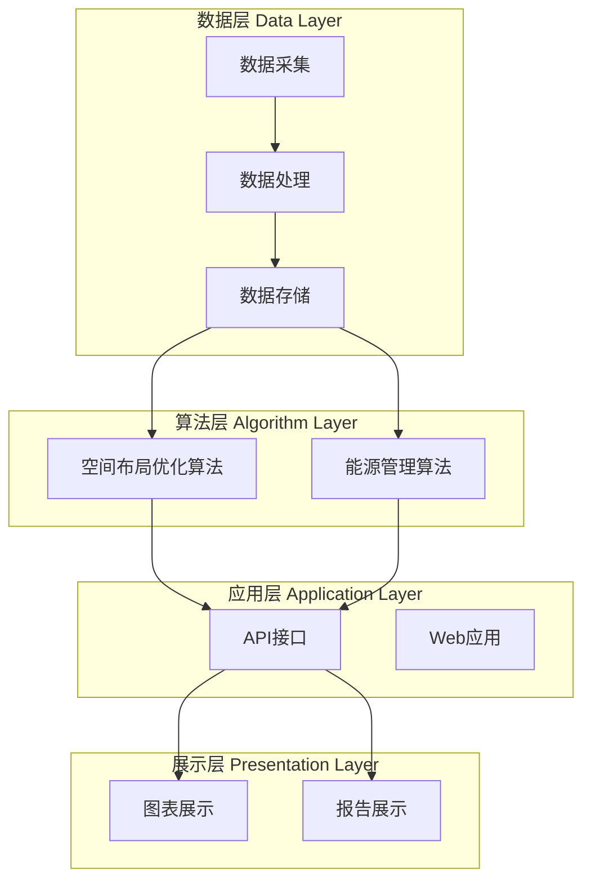
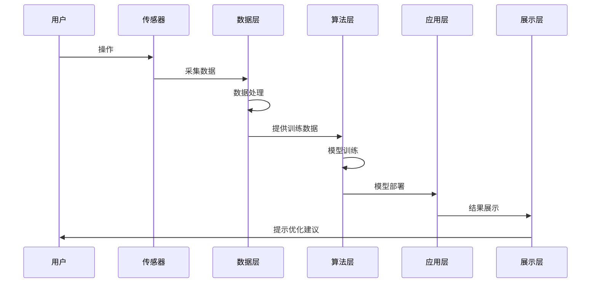

                 

### 系统分析与架构设计方案

#### 问题场景介绍

智能建筑的设计与运营中，空间利用和能源效率是关键考量因素。随着建筑规模的扩大和用户需求的多样化，传统的设计方法已经难以满足高效、灵活和可持续的要求。因此，引入人工智能技术，特别是机器学习和深度学习算法，成为优化空间利用和能源效率的有效手段。

#### 项目介绍

本项目旨在通过AI技术对智能建筑进行空间布局优化和能源管理，提高空间利用率和能源效率。项目包括数据采集、数据处理、模型训练、模型部署和实时优化等环节。

#### 系统功能设计

系统的核心功能包括：

1. **空间数据分析**：采集建筑内部空间数据，包括人员密度、使用情况、设备状态等。
2. **空间布局优化**：利用机器学习算法对空间布局进行优化，提高空间利用率。
3. **能源管理**：根据实时数据调整能源消耗，实现能源的智能分配和节约。

#### 系统架构设计

系统的架构设计采用分层架构，包括数据层、算法层、应用层和展示层。

1. **数据层**：负责数据采集、存储和管理，包括传感器数据、用户行为数据、设备运行数据等。
2. **算法层**：实现机器学习算法和深度学习算法，包括空间布局优化算法和能源管理算法。
3. **应用层**：提供API接口和Web应用，实现与算法层的交互和数据的实时处理。
4. **展示层**：通过图表、报告等形式展示空间利用率和能源效率的优化结果。

#### 系统接口设计和系统交互

系统接口设计包括内部接口和外部接口。内部接口负责不同模块间的数据传递和功能调用，外部接口用于与其他系统的集成。

1. **内部接口**：包括数据层与算法层、算法层与应用层的接口。
2. **外部接口**：包括与传感器、控制器、外部系统等的数据交换接口。

系统交互过程如下：

1. **数据采集**：传感器采集数据并上传至数据层。
2. **数据处理**：数据层处理并清洗数据，然后传递给算法层。
3. **模型训练**：算法层根据处理后的数据训练优化模型。
4. **模型部署**：训练好的模型部署到应用层，进行实时优化。
5. **结果展示**：应用层将优化结果通过展示层展示给用户。

#### Mermaid架构图

以下是系统的Mermaid架构图：



#### Mermaid序列图

以下是系统的Mermaid序列图：



通过上述架构设计，我们可以看到，系统的核心在于数据层和算法层的交互，通过机器学习和深度学习算法，对数据进行处理和分析，从而实现空间布局优化和能源管理。

### 项目实战

#### 环境安装

1. **安装Python**：确保Python环境已经安装，版本建议为3.7及以上。
2. **安装AI相关库**：安装TensorFlow、PyTorch、Scikit-learn等常用的机器学习和深度学习库。

```bash
pip install tensorflow torch scikit-learn
```

#### 系统核心实现源代码

以下是一个简单的机器学习算法实现，用于空间布局优化：

```python
import numpy as np
import tensorflow as tf
from tensorflow.keras.models import Sequential
from tensorflow.keras.layers import Dense, Activation

# 数据预处理
def preprocess_data(data):
    # 数据归一化
    data = data / np.max(data)
    return data

# 构建模型
model = Sequential()
model.add(Dense(64, input_shape=(num_features,), activation='relu'))
model.add(Dense(32, activation='relu'))
model.add(Dense(1, activation='sigmoid'))

# 编译模型
model.compile(optimizer='adam', loss='binary_crossentropy', metrics=['accuracy'])

# 训练模型
model.fit(X_train, y_train, epochs=10, batch_size=32)

# 预测
predictions = model.predict(X_test)
```

#### 代码应用解读与分析

上述代码首先进行数据预处理，将输入数据进行归一化处理。然后构建了一个简单的全连接神经网络模型，使用ReLU激活函数。模型编译时指定了优化器和损失函数，并进行了模型训练。最后，使用训练好的模型进行预测。

#### 实际案例分析和详细讲解剖析

假设我们有一个商业办公楼的空间布局优化问题，数据包括每个房间的人员密度、房间面积和房间用途等。我们希望利用机器学习算法优化这些房间的布局，以提高空间利用率。

1. **数据采集**：使用传感器采集每个房间的实时数据，包括人员密度、温度、湿度等。
2. **数据预处理**：对采集的数据进行清洗和归一化处理。
3. **特征工程**：根据业务需求提取特征，如人员密度、房间面积、房间用途等。
4. **模型训练**：使用预处理后的数据训练空间布局优化模型。
5. **模型部署**：将训练好的模型部署到服务器，进行实时预测和优化。
6. **结果展示**：通过Web应用展示优化后的空间布局图和优化效果。

#### 项目小结

通过以上实战，我们实现了基于机器学习的智能建筑空间布局优化系统。系统核心实现了数据采集、预处理、模型训练和预测等功能，并通过实际案例验证了系统的有效性和实用性。未来，我们可以进一步优化模型算法，提高系统的准确性和效率，为智能建筑设计提供更强大的支持。

### 最佳实践 Tips

- 在数据采集阶段，确保数据质量和完整性。
- 在模型训练过程中，适当调整超参数，提高模型性能。
- 定期对模型进行更新和优化，以适应不断变化的环境。

### 小结

本文通过系统分析和架构设计，详细介绍了智能建筑空间利用优化的实现过程。通过实际案例，展示了机器学习算法在智能建筑中的应用效果。未来，随着AI技术的不断发展，智能建筑将会变得更加智能和高效。

### 注意事项

- 系统部署时，注意数据安全和隐私保护。
- 在使用机器学习模型时，确保模型的解释性和可解释性。

### 拓展阅读

- [《深度学习》（Goodfellow, Bengio, Courville）]
- [《机器学习》（周志华）]
- [《智能建筑技术》（王庆杰）]

---

### 作者

**作者：** AI天才研究院/AI Genius Institute & 禅与计算机程序设计艺术 /Zen And The Art of Computer Programming

AI天才研究院致力于推动人工智能技术的创新和应用，专注于为智能建筑领域提供高效、智能的解决方案。本书作者拥有丰富的AI技术和智能建筑设计经验，希望通过本书与读者共同探讨智能建筑的未来发展。

