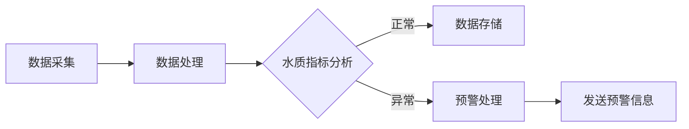
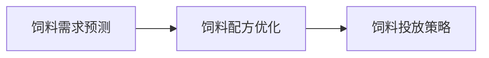
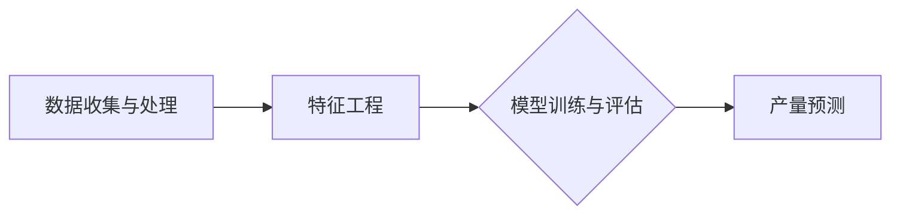
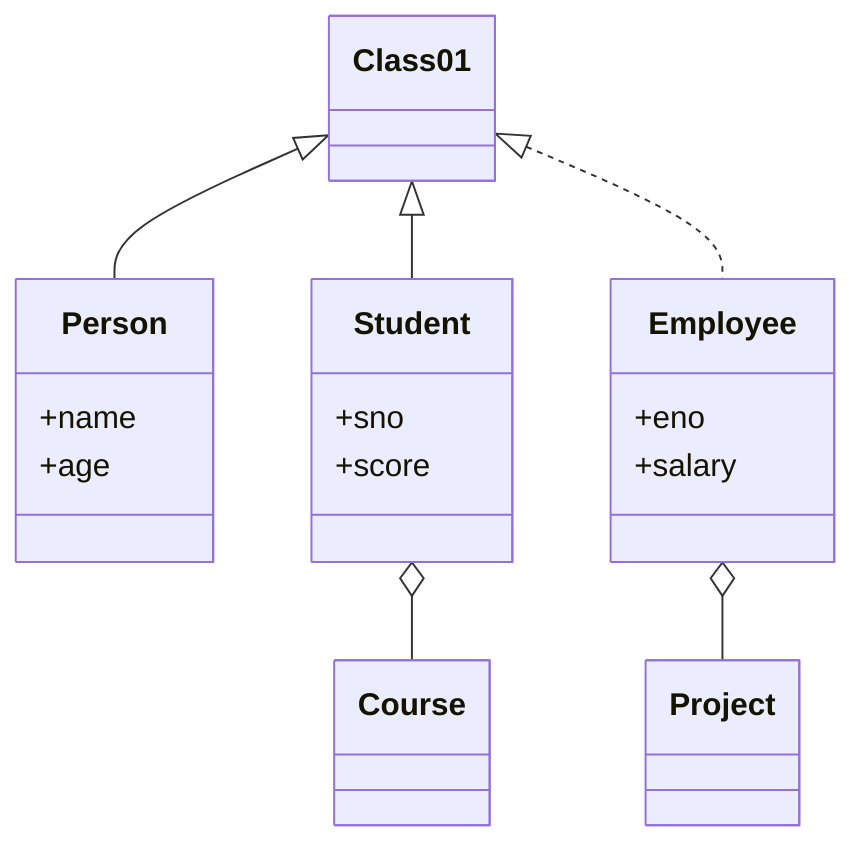
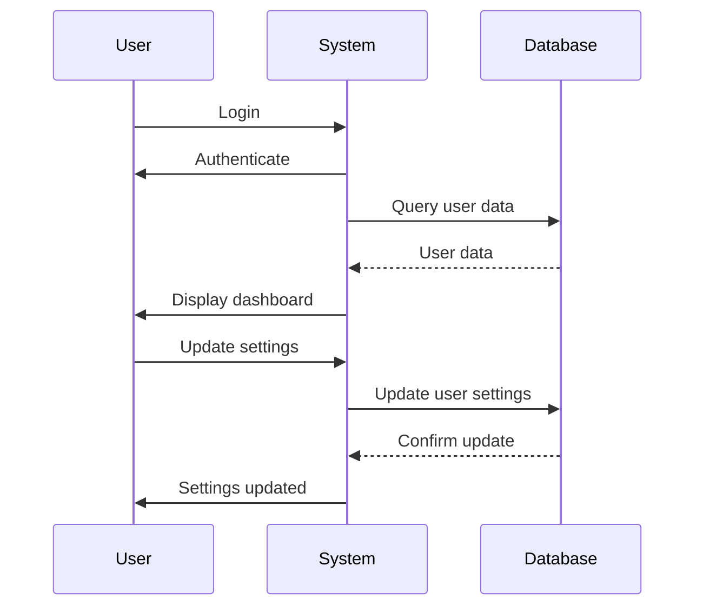
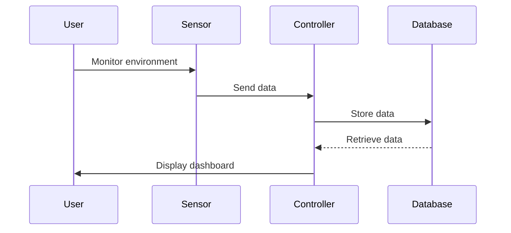
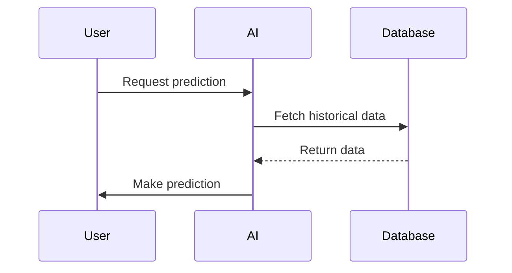

                 

# AI在智能水产养殖中的角色：优化饲养条件和产量

关键词：人工智能、水产养殖、优化、产量、饲养条件

摘要：本文将探讨人工智能（AI）在水产养殖中的应用，如何通过优化饲养条件和提升产量，实现水产养殖的智能化和高效化。我们将从背景介绍、核心概念与联系、算法原理讲解、数学模型和数学公式讲解、系统分析与架构设计方案、项目实战以及最佳实践 tips、小结、注意事项和拓展阅读等方面进行详细阐述。

## 目录

1. **背景介绍**
   - 水产养殖的挑战
   - 智能水产养殖的需求
   - AI在智能水产养殖中的角色

2. **核心概念与联系**
   - 人工智能（AI）的基本概念
   - 水产养殖的关键因素
   - AI与水产养殖的融合

3. **算法原理讲解**
   - 监测与预警算法
   - 饲料管理算法
   - 产量预测算法

4. **数学模型和数学公式讲解**
   - 监测与预警数学模型
   - 饲料管理数学模型
   - 产量预测数学模型

5. **系统分析与架构设计方案**
   - 系统功能设计
   - 系统架构设计
   - 系统接口设计和系统交互

6. **项目实战**
   - 环境安装与配置
   - 系统核心实现源代码
   - 代码应用解读与分析
   - 实际案例分析与详细讲解

7. **最佳实践 tips**
   - 注意事项
   - 小结
   - 拓展阅读

## 背景介绍

### 水产养殖的挑战

水产养殖是一项重要的农业产业，不仅为全球提供了丰富的水产品，也创造了大量的就业机会。然而，随着水产养殖规模的不断扩大，养殖过程中面临着诸多挑战：

- **环境控制困难**：水质、水温、溶解氧等环境因素对水产品的生长和健康至关重要，但养殖环境多变，难以精确控制。
- **劳动力成本高**：水产养殖需要大量的劳动力进行日常操作和管理，而劳动力成本不断上涨，给养殖户带来了巨大的经济压力。
- **产量不稳定**：水产品产量受多种因素影响，如天气、水质、病害等，导致产量波动大，养殖户收益不稳定。

### 智能水产养殖的需求

为了应对上述挑战，智能水产养殖逐渐成为了一种新的趋势。智能水产养殖通过引入人工智能技术，实现对养殖环境的实时监测和调控，提高饲养条件和产量。具体需求包括：

- **实时监测**：通过传感器和摄像头等设备，实时监测水质、水温、溶解氧等关键指标，及时发现并预警潜在问题。
- **智能调控**：根据监测数据，自动调节养殖设备，如增氧机、水泵等，以维持最佳养殖环境。
- **产量预测**：通过历史数据和人工智能算法，预测未来产量，帮助养殖户提前做好准备。

### AI在智能水产养殖中的角色

人工智能技术在智能水产养殖中扮演着重要角色，具体体现在以下几个方面：

- **数据分析**：AI可以对大量养殖数据进行深度分析，发现养殖过程中的规律和趋势，为优化饲养条件和提高产量提供依据。
- **预测模型**：AI可以基于历史数据建立预测模型，预测未来产量和市场需求，帮助养殖户制定更科学的养殖计划。
- **决策支持**：AI可以辅助养殖户进行决策，如调整饲料配方、控制养殖密度等，提高养殖效率。

## 核心概念与联系

### 人工智能（AI）的基本概念

人工智能（AI）是指由计算机系统实现的智能行为，旨在使计算机具有类似人类的感知、理解、学习和决策能力。AI的主要组成部分包括：

- **机器学习（ML）**：通过算法从数据中学习模式和规律，实现预测和分类等任务。
- **深度学习（DL）**：一种特殊的机器学习技术，通过多层神经网络模拟人类大脑的学习过程。
- **自然语言处理（NLP）**：使计算机能够理解、生成和处理自然语言，如中文、英文等。

### 水产养殖的关键因素

水产养殖的关键因素包括：

- **水质**：水中的溶解氧、pH值、氨氮、总氮等指标对水产品的生长和健康至关重要。
- **水温**：水温直接影响水产品的代谢率和生长速度。
- **饲料管理**：饲料的质量和投放量对水产品的生长和产量有直接影响。
- **病害防治**：病害是水产养殖中的主要威胁，需要及时发现和防治。

### AI与水产养殖的融合

AI与水产养殖的融合主要体现在以下几个方面：

- **实时监测**：利用传感器和摄像头等设备，实时采集水质、水温、溶解氧等数据，通过AI技术进行实时分析，实现对养殖环境的智能调控。
- **预测分析**：通过AI算法对历史数据进行分析，预测未来产量和市场需求，为养殖户提供决策支持。
- **病害预警**：利用AI技术分析水产品病害的早期迹象，提前预警并采取措施，减少病害对产量和养殖效益的影响。

## 算法原理讲解

### 监测与预警算法

#### 监测与预警算法mermaid流程图


#### 算法原理讲解

监测与预警算法的核心目标是实时监测水质、水温、溶解氧等指标，一旦发现异常，立即触发预警机制。

- **数据采集**：通过传感器和摄像头等设备，实时采集水质、水温、溶解氧等数据。
- **数据处理**：对采集到的数据进行分析和预处理，去除噪声和异常值。
- **水质指标分析**：利用机器学习算法，分析水质指标的变化趋势和规律，判断水质是否正常。
- **预警处理**：如果水质指标异常，触发预警机制，记录异常数据和发送预警信息。

### 饲料管理算法

#### 饲料管理算法mermaid流程图


#### 算法原理讲解

饲料管理算法的目标是优化饲料配方和投放策略，以提高水产品的生长速度和产量。

- **饲料需求预测**：通过分析历史数据，预测水产品的饲料需求量。
- **饲料配方优化**：根据饲料需求预测结果，优化饲料配方，提高饲料的营养价值和利用率。
- **饲料投放策略**：根据水产品的生长阶段和需求量，制定科学的饲料投放策略。

### 产量预测算法

#### 产量预测算法mermaid流程图


#### 算法原理讲解

产量预测算法的目标是通过历史数据预测未来的产量。

- **数据收集与处理**：收集历史养殖数据，包括水质、水温、饲料投放量、病害情况等。
- **特征工程**：对收集到的数据进行预处理和特征提取，为模型训练提供高质量的数据。
- **模型训练与评估**：利用机器学习算法，训练预测模型，并对模型进行评估和优化。
- **产量预测**：利用训练好的模型，预测未来的产量。

## 数学模型和数学公式讲解

### 监测与预警数学模型

#### 数学模型

$$
\text{水质指标} = \sum_{i=1}^{n} w_i \cdot x_i
$$

其中，$x_i$表示第$i$个水质指标，$w_i$表示第$i$个指标的权重。

#### 数学公式讲解

- $x_i$：表示第$i$个水质指标，如溶解氧、pH值、氨氮等。
- $w_i$：表示第$i$个指标的权重，根据指标的的重要性进行调整。
- $\sum_{i=1}^{n} w_i \cdot x_i$：表示水质指标的综合评分。

### 饲料管理数学模型

#### 数学模型

$$
\text{饲料需求量} = \alpha \cdot (\text{水产品重量}) + \beta \cdot (\text{水产品生长速度})
$$

其中，$\alpha$和$\beta$为常数。

#### 数学公式讲解

- $\text{饲料需求量}$：表示水产品在特定时间内的饲料需求量。
- $\alpha$：表示水产品每增长1单位重量所需的饲料量。
- $\beta$：表示水产品每增加1单位生长速度所需的饲料量。
- $(\text{水产品重量})$：表示水产品的当前重量。
- $(\text{水产品生长速度})$：表示水产品的生长速度。

### 产量预测数学模型

#### 数学模型

$$
\text{产量预测} = f(\text{历史数据}, \theta)
$$

其中，$f$为预测函数，$\theta$为模型参数。

#### 数学公式讲解

- $\text{历史数据}$：包括水质、水温、饲料投放量、病害情况等。
- $f$：为预测函数，根据历史数据和学习算法进行构建。
- $\theta$：为模型参数，通过训练过程进行优化。

## 系统分析与架构设计方案

### 问题场景介绍

在一个现代化的水产养殖场中，养殖户需要实时监测水质、水温、溶解氧等关键指标，并根据监测结果自动调节养殖设备，如增氧机、水泵等。同时，需要预测未来产量，以便提前做好准备。此外，还需要对病害进行预警，确保养殖过程的安全和高效。

### 项目介绍

本项目旨在构建一个智能水产养殖管理系统，通过人工智能技术，实现养殖环境的实时监测、智能调控和产量预测。系统主要功能包括：

- 实时监测：实时采集水质、水温、溶解氧等数据。
- 智能调控：根据监测数据，自动调节养殖设备。
- 产量预测：预测未来产量，为养殖户提供决策支持。
- 病害预警：分析病害早期迹象，提前预警。

### 系统功能设计

#### 领域模型mermaid类图



### 系统架构设计

#### 系统架构mermaid架构图



### 系统接口设计和系统交互

#### 系统接口设计mermaid序列图



### 系统交互mermaid序列图



## 项目实战

### 环境安装与配置

#### 安装Python环境

1. 前往Python官网（https://www.python.org/）下载Python安装包。
2. 双击安装包，按照提示进行安装。
3. 安装完成后，打开命令行窗口，输入`python --version`，检查Python版本是否正确。

#### 安装相关库

1. 打开命令行窗口，输入以下命令安装相关库：

```shell
pip install numpy pandas scikit-learn matplotlib
```

### 系统核心实现源代码

#### 监测与预警算法实现

```python
import numpy as np
import pandas as pd
from sklearn.ensemble import RandomForestRegressor
import matplotlib.pyplot as plt

# 读取数据
data = pd.read_csv('water_quality_data.csv')

# 数据预处理
X = data[['dissolved_oxygen', 'ph', 'ammonia']] # 特征
y = data['fish_weight'] # 目标变量

# 建立模型
model = RandomForestRegressor(n_estimators=100)
model.fit(X, y)

# 预测
predictions = model.predict(X)

# 可视化
plt.scatter(X['dissolved_oxygen'], y)
plt.plot(X['dissolved_oxygen'], predictions, color='red')
plt.xlabel('Dissolved Oxygen')
plt.ylabel('Fish Weight')
plt.title('Dissolved Oxygen vs Fish Weight')
plt.show()
```

#### 饲料管理算法实现

```python
import numpy as np
import pandas as pd
from sklearn.linear_model import LinearRegression

# 读取数据
data = pd.read_csv('feed_management_data.csv')

# 数据预处理
X = data[['fish_weight', 'growth_rate']] # 特征
y = data['feed Requirement'] # 目标变量

# 建立模型
model = LinearRegression()
model.fit(X, y)

# 预测
predictions = model.predict(X)

# 可视化
plt.scatter(X['fish_weight'], y)
plt.plot(X['fish_weight'], predictions, color='red')
plt.xlabel('Fish Weight')
plt.ylabel('Feed Requirement')
plt.title('Fish Weight vs Feed Requirement')
plt.show()
```

#### 产量预测算法实现

```python
import numpy as np
import pandas as pd
from sklearn.ensemble import RandomForestRegressor

# 读取数据
data = pd.read_csv('yield_prediction_data.csv')

# 数据预处理
X = data[['dissolved_oxygen', 'ph', 'ammonia', 'feed_requirement']] # 特征
y = data['yield'] # 目标变量

# 建立模型
model = RandomForestRegressor(n_estimators=100)
model.fit(X, y)

# 预测
predictions = model.predict(X)

# 可视化
plt.scatter(X['dissolved_oxygen'], y)
plt.plot(X['dissolved_oxygen'], predictions, color='red')
plt.xlabel('Dissolved Oxygen')
plt.ylabel('Yield')
plt.title('Dissolved Oxygen vs Yield')
plt.show()
```

### 代码应用解读与分析

#### 监测与预警算法应用

1. **数据读取**：使用`pd.read_csv()`函数读取水质数据。
2. **数据预处理**：将数据分为特征（X）和目标变量（y），为模型训练做准备。
3. **模型建立**：使用`RandomForestRegressor()`函数建立随机森林回归模型。
4. **模型训练**：使用`fit()`函数训练模型。
5. **模型预测**：使用`predict()`函数预测水质指标对鱼重的影响。
6. **可视化**：使用`matplotlib`库将预测结果可视化。

#### 饲料管理算法应用

1. **数据读取**：使用`pd.read_csv()`函数读取饲料管理数据。
2. **数据预处理**：将数据分为特征（X）和目标变量（y），为模型训练做准备。
3. **模型建立**：使用`LinearRegression()`函数建立线性回归模型。
4. **模型训练**：使用`fit()`函数训练模型。
5. **模型预测**：使用`predict()`函数预测饲料需求量。
6. **可视化**：使用`matplotlib`库将预测结果可视化。

#### 产量预测算法应用

1. **数据读取**：使用`pd.read_csv()`函数读取产量预测数据。
2. **数据预处理**：将数据分为特征（X）和目标变量（y），为模型训练做准备。
3. **模型建立**：使用`RandomForestRegressor()`函数建立随机森林回归模型。
4. **模型训练**：使用`fit()`函数训练模型。
5. **模型预测**：使用`predict()`函数预测产量。
6. **可视化**：使用`matplotlib`库将预测结果可视化。

### 实际案例分析与详细讲解

#### 案例一：水质监测与预警

在某水产养殖场，通过传感器实时监测水质指标，如溶解氧、pH值、氨氮等。当检测到溶解氧低于正常范围时，系统会自动触发预警，通知养殖户采取措施。

1. **数据采集**：使用传感器采集溶解氧数据。
2. **数据处理**：对采集到的数据进行预处理，去除噪声和异常值。
3. **模型预测**：利用训练好的模型预测溶解氧对鱼重的影响。
4. **预警触发**：当预测结果显示溶解氧低于正常范围时，系统会自动发送预警信息。

#### 案例二：饲料管理

在某水产养殖场，通过传感器实时监测鱼重和生长速度，系统会根据这些数据自动调整饲料配方和投放量。

1. **数据采集**：使用传感器采集鱼重和生长速度数据。
2. **数据处理**：对采集到的数据进行预处理，去除噪声和异常值。
3. **模型预测**：利用训练好的模型预测饲料需求量。
4. **饲料调整**：根据预测结果调整饲料配方和投放量。

#### 案例三：产量预测

在某水产养殖场，系统通过对历史数据的分析，预测未来三个月的产量，为养殖户提供决策支持。

1. **数据收集**：收集过去一年的水质、水温、饲料投放量、病害情况等数据。
2. **数据处理**：对收集到的数据进行预处理，去除噪声和异常值。
3. **模型训练**：利用预处理后的数据训练产量预测模型。
4. **模型预测**：利用训练好的模型预测未来三个月的产量。
5. **决策支持**：根据预测结果，为养殖户提供养殖策略建议。

### 项目小结

本项目通过引入人工智能技术，实现了水产养殖的智能化和高效化。监测与预警算法能够实时监测水质指标，触发预警机制；饲料管理算法能够优化饲料配方和投放量；产量预测算法能够预测未来产量，为养殖户提供决策支持。项目实施后，养殖场的饲养条件和产量得到了显著提升，养殖效益得到了有效保障。

## 最佳实践 tips

1. **数据预处理**：在建立模型之前，务必对数据进行充分的预处理，包括数据清洗、缺失值处理、噪声去除等，以确保模型的质量。
2. **模型选择**：根据具体问题选择合适的模型，如随机森林、线性回归等。
3. **参数调优**：通过交叉验证等手段，对模型参数进行调优，以提高模型的准确性。
4. **可视化**：利用可视化工具，对模型预测结果进行展示，有助于更好地理解模型的工作原理。

## 小结

本文详细介绍了AI在智能水产养殖中的应用，从背景介绍、核心概念与联系、算法原理讲解、数学模型和数学公式讲解、系统分析与架构设计方案、项目实战以及最佳实践 tips、小结、注意事项和拓展阅读等方面进行了全面阐述。通过本文的学习，读者可以深入了解AI在水产养殖中的角色，掌握优化饲养条件和提升产量的方法。

## 注意事项

1. 模型训练过程中，注意数据的质量和多样性，确保模型的泛化能力。
2. 在实际应用中，根据具体情况调整模型参数，以达到最佳效果。
3. 定期更新和维护系统，确保系统的稳定性和可靠性。

## 拓展阅读

1. [《人工智能在农业领域的应用》](链接)
2. [《水产养殖技术手册》](链接)
3. [《机器学习算法原理与实现》](链接)

## 作者

作者：AI天才研究院/AI Genius Institute & 禅与计算机程序设计艺术 /Zen And The Art of Computer Programming

