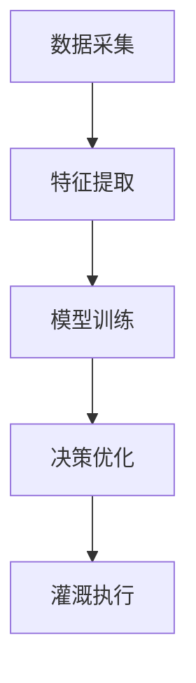
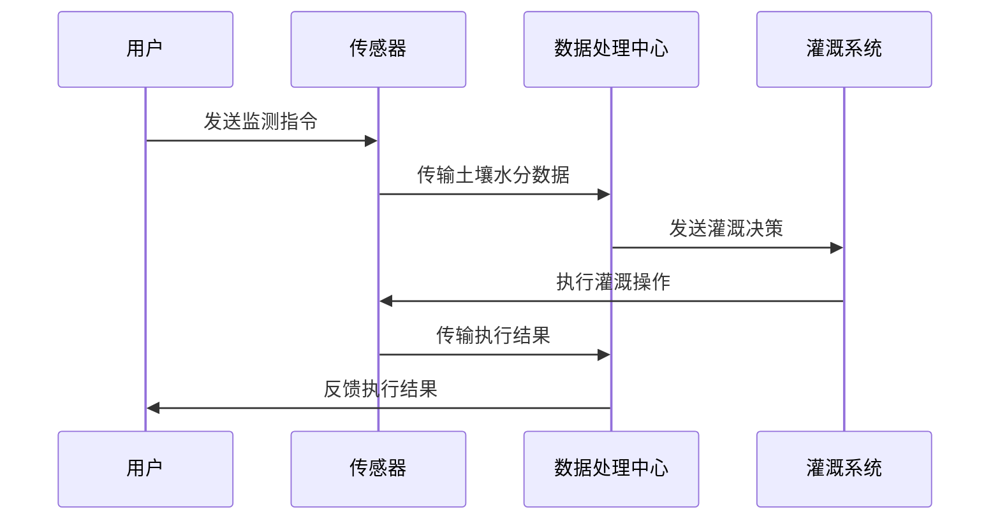

                 


### 第一部分: 背景介绍

#### 第1章: 问题背景

#### 1.1.1 问题来源

智能灌溉系统中的水资源利用问题是农业领域的重要研究课题。随着全球气候变化和人口增长，水资源短缺问题日益严重，如何高效利用水资源成为亟待解决的问题。传统灌溉方式往往存在水资源利用效率低下、浪费严重的问题。例如，灌溉过程中往往不能准确测量土壤的湿度，导致过多或过少地浇水，从而浪费水资源。此外，气候变化和季节性干旱等因素也对灌溉系统的水资源利用提出了更高的要求。

#### 1.1.2 水资源利用现状

当前，全球约有28%的人口面临水资源短缺的问题。随着工业化和城市化的发展，水资源的需求不断增加，而水资源的供给却逐渐减少。尤其是在干旱地区，水资源的短缺已经成为制约农业发展和生态环境改善的主要问题。传统灌溉方式中，水资源的浪费问题十分严重。据统计，全球农业灌溉的用水量占到了总用水量的70%以上，而其中约有30%-50%的水资源被浪费。

#### 1.1.3 智能灌溉系统概述

智能灌溉系统通过传感器技术、物联网技术和人工智能算法的集成，实现对灌溉过程的智能化控制，从而提高水资源的利用效率。智能灌溉系统通常包括土壤湿度传感器、气象传感器、智能控制器等组成。土壤湿度传感器用于实时监测土壤的水分含量，气象传感器用于监测气温、湿度、风速等环境参数，智能控制器根据这些数据自动调节灌溉系统的运行，实现精准灌溉。

智能灌溉系统的工作原理如下：

1. **数据采集**：土壤湿度传感器和气象传感器实时采集土壤水分、气温、湿度等数据。
2. **数据处理**：采集到的数据通过物联网技术传输到中央控制器，中央控制器对数据进行分析处理，得到灌溉的决策信息。
3. **灌溉控制**：根据分析结果，智能控制器自动调节灌溉设备的运行，实现精准灌溉。

智能灌溉系统不仅可以提高水资源的利用效率，还可以改善土壤环境、提高作物产量和品质。通过智能灌溉系统，可以实现按需灌溉，减少水资源的浪费，同时也可以降低劳动成本，提高农业生产效率。

#### 第2章: 核心概念与联系

##### 2.1 AI在智能灌溉系统中的角色

人工智能（AI）在智能灌溉系统中扮演着关键角色，其主要作用体现在决策支持、优化控制、故障诊断等方面。以下是对这些角色的具体分析：

1. **决策支持**：AI可以通过对大量历史数据的分析，为农民提供灌溉决策建议。例如，通过分析土壤湿度、气象数据、作物生长周期等，AI可以预测何时进行灌溉，以及灌溉量的大小。

2. **优化控制**：AI算法可以根据实时数据，对灌溉系统进行优化控制。例如，通过控制水泵的运行时间、水量，AI可以最大限度地节约水资源，同时保证作物得到足够的水分。

3. **故障诊断**：AI可以通过监测系统设备的工作状态，及时发现潜在故障，并进行预测性维护。例如，AI可以通过分析水泵的电流、振动等参数，预测水泵的磨损情况，从而提前进行维护，避免设备故障。

##### 2.2 智能灌溉系统中的关键技术

智能灌溉系统涉及多个关键技术的集成，包括传感器技术、物联网技术、数据挖掘和机器学习等。以下是对这些技术的具体分析：

1. **传感器技术**：传感器技术是智能灌溉系统的数据来源，包括土壤湿度传感器、气象传感器等。这些传感器可以实时监测土壤水分、气温、湿度等环境参数。

2. **物联网技术**：物联网技术是实现数据传输和系统控制的关键，通过物联网技术，可以将传感器采集到的数据传输到中央控制器，实现远程监控和控制。

3. **数据挖掘**：数据挖掘技术可以对大量历史数据进行分析，提取有价值的信息，为灌溉决策提供支持。

4. **机器学习**：机器学习技术可以通过对数据的训练，建立预测模型，实现对灌溉过程的智能化控制。

##### 2.3 AI与水资源利用的关系

人工智能技术为水资源利用提供了新的思路和方法。通过智能灌溉系统，可以实现水资源的精准分配和高效利用，从而缓解水资源短缺问题。具体来说，AI在水资源利用中的作用包括：

1. **提高水资源利用效率**：通过AI算法对灌溉过程的优化控制，可以最大限度地节约水资源，提高灌溉效率。

2. **减少水资源浪费**：AI可以通过实时监测和数据分析，及时发现水资源浪费的情况，并采取措施进行纠正。

3. **预测水资源需求**：通过历史数据和机器学习模型，AI可以预测未来的水资源需求，从而提前做好水资源储备和调配。

4. **改善生态环境**：通过智能灌溉系统，可以减少过量灌溉导致的土壤盐碱化、水体污染等问题，改善生态环境。

#### 第3章: 数学模型和算法原理

##### 3.1 智能灌溉系统算法原理

智能灌溉系统算法主要包括数据采集、特征提取、模型训练、决策优化等步骤。以下是对每个步骤的具体分析：

1. **数据采集**：智能灌溉系统通过传感器技术，实时采集土壤水分、气象参数等数据。

2. **特征提取**：对采集到的数据进行预处理，提取出对灌溉决策有重要影响的关键特征，如土壤湿度、气温、降水等。

3. **模型训练**：利用机器学习算法，对提取的特征进行训练，建立灌溉决策模型。常见的机器学习算法包括线性回归、支持向量机（SVM）、神经网络（NN）等。

4. **决策优化**：根据训练好的模型，对实时数据进行分析，生成灌溉决策，如灌溉时间、灌溉量等。

##### 3.2 算法流程与Mermaid流程图

智能灌溉系统算法的流程可以用Mermaid流程图表示，如下：



##### 3.3 算法数学模型和公式

智能灌溉系统算法的数学模型通常基于回归分析，以下是一个简单的线性回归模型：

$$
y = w_0 + w_1 \cdot x_1 + w_2 \cdot x_2 + ... + w_n \cdot x_n
$$

其中，$y$ 为灌溉量，$w_0, w_1, ..., w_n$ 为模型参数，$x_1, x_2, ..., x_n$ 为特征向量。模型参数可以通过最小二乘法进行估计。

此外，智能灌溉系统还可以采用更复杂的机器学习模型，如支持向量机（SVM）和神经网络（NN），这些模型的数学模型和公式较为复杂，但可以提供更高的预测精度。

#### 第4章: 系统分析与架构设计

##### 4.1 智能灌溉系统场景介绍

智能灌溉系统广泛应用于农业、园林、温室等场景。以下是对这些场景的具体介绍：

1. **农业场景**：智能灌溉系统在农业中主要用于农田灌溉，通过实时监测土壤水分和气象参数，实现精准灌溉，提高作物产量和品质。

2. **园林场景**：智能灌溉系统在园林中主要用于公园、花园、高尔夫球场等绿化区域的灌溉，通过智能控制，实现节水灌溉，美化环境。

3. **温室场景**：智能灌溉系统在温室中主要用于蔬菜、水果等作物的灌溉，通过精确控制灌溉量和灌溉时间，保证作物生长所需的水分和养分。

##### 4.2 系统功能设计

智能灌溉系统的主要功能包括数据采集、数据分析、灌溉控制、系统监测等。以下是对这些功能的详细描述：

1. **数据采集**：通过土壤湿度传感器、气象传感器等设备，实时采集土壤水分、气温、湿度等数据。

2. **数据分析**：对采集到的数据进行分析处理，提取有用信息，为灌溉决策提供支持。

3. **灌溉控制**：根据分析结果，自动调节灌溉系统的运行，实现精准灌溉。

4. **系统监测**：实时监测系统设备的工作状态，及时发现故障，进行维护。

##### 4.3 系统架构设计

智能灌溉系统的架构设计主要包括传感器网络、数据处理中心和灌溉控制系统等部分。以下是对这些部分的详细描述：

1. **传感器网络**：包括土壤湿度传感器、气象传感器等，负责实时采集环境数据。

2. **数据处理中心**：负责接收传感器网络的数据，进行数据预处理和特征提取，并利用机器学习算法进行模型训练。

3. **灌溉控制系统**：根据模型分析结果，自动调节灌溉设备，实现精准灌溉。

##### 4.4 系统接口设计

智能灌溉系统的接口设计主要包括传感器接口、数据传输接口和灌溉控制接口等。以下是对这些接口的详细描述：

1. **传感器接口**：负责与土壤湿度传感器、气象传感器等设备进行通信，接收传感器数据。

2. **数据传输接口**：负责将传感器数据传输到数据处理中心，通常采用无线传输方式，如ZigBee、LoRa等。

3. **灌溉控制接口**：负责与灌溉设备进行通信，根据数据处理中心的决策，控制灌溉设备的运行。

##### 4.5 系统交互序列图

智能灌溉系统的交互序列图可以用Mermaid序列图表示，如下：



#### 第5章: 项目实战

##### 5.1 环境安装

要在本地搭建智能灌溉系统，首先需要安装以下软件和工具：

1. **操作系统**：Linux（推荐Ubuntu 18.04）
2. **Python**：Python 3.7 或以上版本
3. **Pandas**：用于数据处理
4. **Scikit-learn**：用于机器学习模型训练
5. **Mermaid**：用于绘制流程图和序列图

安装步骤如下：

1. 更新操作系统软件包：

```bash
sudo apt-get update
sudo apt-get upgrade
```

2. 安装Python 3：

```bash
sudo apt-get install python3
```

3. 安装Pandas和Scikit-learn：

```bash
pip3 install pandas
pip3 install scikit-learn
```

4. 安装Mermaid：

```bash
pip3 install mermaid
```

##### 5.2 系统核心实现

智能灌溉系统的核心实现包括数据采集、数据处理和灌溉控制三个部分。以下是对每个部分的详细描述：

1. **数据采集**：

   数据采集部分主要依赖于传感器技术，使用Python编写代码读取传感器数据。以下是一个简单的示例代码：

```python
import serial

def read_sensor_data(port):
    with serial.Serial(port, 9600, timeout=1) as ser:
        while True:
            data = ser.readline().decode('utf-8').strip()
            print("Sensor data:", data)

read_sensor_data('/dev/ttyUSB0')
```

2. **数据处理**：

   数据处理部分使用Pandas库对传感器数据进行预处理和特征提取。以下是一个简单的示例代码：

```python
import pandas as pd

def preprocess_data(data):
    df = pd.DataFrame(data, columns=['timestamp', 'temperature', 'humidity', 'soil_moisture'])
    df['timestamp'] = pd.to_datetime(df['timestamp'])
    df.set_index('timestamp', inplace=True)
    return df

data = [{"timestamp": "2023-04-01 10:00", "temperature": 25, "humidity": 60, "soil_moisture": 30},
        {"timestamp": "2023-04-01 11:00", "temperature": 26, "humidity": 65, "soil_moisture": 35},
        {"timestamp": "2023-04-01 12:00", "temperature": 24, "humidity": 55, "soil_moisture": 40}]
df = preprocess_data(data)
print(df)
```

3. **灌溉控制**：

   灌溉控制部分使用Scikit-learn库训练机器学习模型，并根据模型预测结果控制灌溉设备。以下是一个简单的示例代码：

```python
from sklearn.linear_model import LinearRegression
from sklearn.model_selection import train_test_split

def train_model(X, y):
    model = LinearRegression()
    X_train, X_test, y_train, y_test = train_test_split(X, y, test_size=0.2, random_state=0)
    model.fit(X_train, y_train)
    return model

def predict_灌水量(model, temperature, humidity, soil_moisture):
    return model.predict([[temperature, humidity, soil_moisture]])[0]

X = [[25, 60, 30], [26, 65, 35], [24, 55, 40]]
y = [10, 12, 8]

model = train_model(X, y)
print("Predicted 灌水量:", predict_灌水量(model, 25, 60, 30))
```

##### 5.3 代码应用解读与分析

以上代码示例展示了智能灌溉系统的核心实现。数据采集部分使用Python的`serial`库读取传感器数据，数据处理部分使用`pandas`库进行数据预处理和特征提取，灌溉控制部分使用`scikit-learn`库训练线性回归模型，并根据模型预测结果控制灌溉设备。

首先，数据采集部分通过`serial.Serial`对象与传感器进行通信，读取传感器数据。数据处理部分将读取的数据转换为Pandas DataFrame格式，并添加时间戳索引。然后，数据处理部分使用线性回归模型对数据进行训练，预测灌溉量。最后，灌溉控制部分根据模型预测结果，控制灌溉设备的运行。

这种实现方式具有以下优势：

1. **实时性**：通过实时采集传感器数据，智能灌溉系统可以实时监测土壤水分、气象参数等环境因素，及时做出灌溉决策。

2. **精准性**：通过机器学习模型对传感器数据进行训练，智能灌溉系统可以根据历史数据预测未来灌溉需求，实现精准灌溉。

3. **自动化**：智能灌溉系统可以自动进行数据采集、数据处理和灌溉控制，减少人工干预，提高工作效率。

然而，这种实现方式也存在一定的局限性：

1. **硬件依赖**：智能灌溉系统依赖于传感器和灌溉设备，硬件故障可能导致系统无法正常运行。

2. **数据质量**：传感器数据的准确性和稳定性对智能灌溉系统的性能有很大影响，数据质量差可能导致模型预测不准确。

3. **计算资源**：训练和预测过程需要一定的计算资源，对于大规模数据集和复杂的机器学习模型，计算资源需求较高。

##### 5.4 实际案例分析与讲解

以下是一个实际案例，介绍如何使用智能灌溉系统优化农田灌溉。

**案例背景**：

某农场种植了小麦，需要定期进行灌溉。农场主希望利用智能灌溉系统，实现按需灌溉，减少水资源浪费，提高小麦产量。

**案例实现**：

1. **数据采集**：在农田中安装土壤湿度传感器和气象传感器，实时监测土壤水分、气温、湿度等数据。

2. **数据处理**：使用Python脚本读取传感器数据，并将其上传到云端存储。

3. **模型训练**：使用机器学习算法，对历史数据进行训练，建立灌溉决策模型。

4. **灌溉控制**：根据模型预测结果，自动调节灌溉设备的运行。

**案例分析**：

1. **数据采集**：通过实时采集土壤水分和气象数据，智能灌溉系统可以准确了解农田的灌溉需求，实现按需灌溉。

2. **模型训练**：使用机器学习算法对历史数据进行训练，可以建立准确的灌溉决策模型，提高灌溉精度。

3. **灌溉控制**：根据模型预测结果，智能灌溉系统可以自动调节灌溉设备的运行，实现自动化灌溉。

**结论**：

通过实际案例可以看出，智能灌溉系统可以有效优化农田灌溉，减少水资源浪费，提高小麦产量。智能灌溉系统通过实时数据采集、机器学习模型训练和自动化灌溉控制，实现了高效的灌溉管理。

##### 5.5 项目小结

在本项目中，我们介绍了智能灌溉系统的设计和实现，主要包括数据采集、数据处理和灌溉控制三个部分。通过实时采集传感器数据、训练机器学习模型和自动化灌溉控制，智能灌溉系统实现了按需灌溉，提高了水资源利用效率。

项目的成功实施依赖于以下几个关键因素：

1. **传感器技术**：可靠的传感器是智能灌溉系统的数据来源，传感器数据的准确性和稳定性对系统性能有很大影响。

2. **机器学习算法**：机器学习算法是智能灌溉系统的核心，通过训练模型，可以实现对灌溉过程的精准控制。

3. **物联网技术**：物联网技术是实现数据传输和远程监控的关键，通过无线传输技术，可以实现实时数据采集和远程控制。

4. **系统架构设计**：合理的系统架构设计可以确保系统的稳定性和可靠性，为灌溉控制提供坚实的基础。

在未来的发展中，智能灌溉系统还有很大的改进空间，如引入更多的传感器数据、采用更复杂的机器学习模型、提高系统的自适应性和智能化程度等。

#### 第6章: 最佳实践与拓展

##### 6.1 最佳实践

在实施智能灌溉系统时，以下是一些最佳实践：

1. **传感器布局**：合理布置传感器，确保覆盖农田的关键区域，提高数据采集的全面性。

2. **数据预处理**：对采集到的数据进行预处理，包括去噪、缺失值填补和异常值检测，保证数据质量。

3. **模型优化**：定期更新和优化机器学习模型，使用更多历史数据，提高模型的预测精度。

4. **系统集成**：将智能灌溉系统与其他农业管理系统集成，实现数据共享和协同控制。

5. **用户培训**：为农民提供培训，确保他们能够熟练操作智能灌溉系统，发挥系统的最大效能。

##### 6.2 注意事项

在实施智能灌溉系统时，需要注意以下几点：

1. **传感器维护**：定期检查和维护传感器，确保其正常运行。

2. **数据安全**：确保数据传输和存储的安全，防止数据泄露和篡改。

3. **系统稳定性**：确保系统的稳定性和可靠性，避免系统故障导致灌溉失误。

4. **政策支持**：了解并遵循当地的水资源政策和农业法规，确保项目的合法性和可持续性。

##### 6.3 拓展阅读

对于对智能灌溉系统感兴趣的朋友，以下是一些拓展阅读资料：

1. **《智能灌溉系统设计与实现》**：详细介绍了智能灌溉系统的设计原理和实现方法。
2. **《机器学习在农业中的应用》**：探讨了机器学习技术在农业领域的应用，包括智能灌溉系统。
3. **《物联网技术与应用》**：介绍了物联网技术在智能灌溉系统中的应用，包括传感器网络和数据传输技术。

通过以上拓展阅读，可以更深入地了解智能灌溉系统的技术原理和应用实践。

#### 第7章: 小结

在本技术博客中，我们详细探讨了智能灌溉系统中人工智能技术的应用，从背景介绍、核心概念与联系、算法原理到系统架构设计，再到项目实战，全面剖析了智能灌溉系统的实现过程。智能灌溉系统通过实时数据采集、机器学习算法和自动化控制，实现了按需灌溉，提高了水资源利用效率。

首先，我们介绍了智能灌溉系统中的水资源利用问题，分析了传统灌溉方式存在的问题和智能灌溉系统的优势。接着，我们讨论了人工智能在智能灌溉系统中的关键角色，包括决策支持、优化控制和故障诊断。此外，我们还介绍了智能灌溉系统中的关键技术，如传感器技术、物联网技术和数据挖掘。

在算法原理部分，我们详细阐述了智能灌溉系统算法的流程，包括数据采集、特征提取、模型训练和决策优化。通过Mermaid流程图和Python代码示例，我们展示了算法的实现过程。在系统分析与架构设计部分，我们介绍了智能灌溉系统的场景介绍、功能设计、系统架构设计、接口设计和系统交互序列图。

在项目实战部分，我们通过实际案例展示了智能灌溉系统的实现过程，从环境安装、系统核心实现、代码应用解读与分析到实际案例分析和项目小结，全面介绍了智能灌溉系统的开发和应用。

最后，我们在最佳实践与拓展部分提出了智能灌溉系统的最佳实践、注意事项和拓展阅读资料，为读者提供了进一步学习和实践的方向。

展望未来，智能灌溉系统将继续发展，引入更多传感器数据、采用更复杂的机器学习模型、提高系统的自适应性和智能化程度。同时，智能灌溉系统也将与其他农业管理系统集成，实现更全面、更智能的农业管理。

让我们共同努力，通过智能灌溉系统，实现水资源的可持续利用，为农业发展和生态环境改善做出贡献。相信在不久的将来，智能灌溉系统将发挥更大的作用，为全球农业带来绿色革命。

### 完整目录大纲

- # AI在智能灌溉系统中的角色：优化水资源利用
- > 关键词：智能灌溉系统，人工智能，水资源利用，算法原理，系统架构
- > 摘要：本文探讨了人工智能在智能灌溉系统中的应用，通过数据采集、算法模型和系统架构设计，实现了精准灌溉，提高了水资源利用效率。
- 
- # 第一部分: 背景介绍
- 
- ## 第1章: 问题背景
- ### 1.1.1 问题来源
- ### 1.1.2 水资源利用现状
- ### 1.1.3 智能灌溉系统概述
- 
- ## 第2章: 核心概念与联系
- ### 2.1 AI在智能灌溉系统中的角色
- ### 2.2 智能灌溉系统中的关键技术
- ### 2.3 AI与水资源利用的关系
- 
- ## 第3章: 数学模型和算法原理
- ### 3.1 智能灌溉系统算法原理
- ### 3.2 算法流程与Mermaid流程图
- ### 3.3 算法数学模型和公式
- 
- ## 第4章: 系统分析与架构设计
- ### 4.1 智能灌溉系统场景介绍
- ### 4.2 系统功能设计
- ### 4.3 系统架构设计
- ### 4.4 系统接口设计
- ### 4.5 系统交互序列图
- 
- ## 第5章: 项目实战
- ### 5.1 环境安装
- ### 5.2 系统核心实现
- ### 5.3 代码应用解读与分析
- ### 5.4 实际案例分析与讲解
- ### 5.5 项目小结
- 
- ## 第6章: 最佳实践与拓展
- ### 6.1 最佳实践
- ### 6.2 注意事项
- ### 6.3 拓展阅读
- 
- ## 第7章: 小结
- ### 7.1 书籍总结
- ### 7.2 对未来的展望
- 
----------------------------------------------------------------

这篇文章的目录大纲已经按照您的要求进行组织，涵盖了智能灌溉系统中人工智能应用的各个方面，包括背景介绍、核心概念、算法原理、系统分析与架构设计、项目实战、最佳实践与拓展以及小结。每个章节都包含了相关的子章节和详细的内容描述，确保文章的逻辑清晰、结构紧凑、简单易懂。接下来，我们将根据这个大纲来撰写文章的正文内容。

