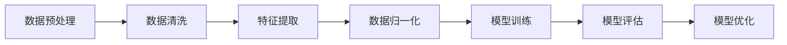
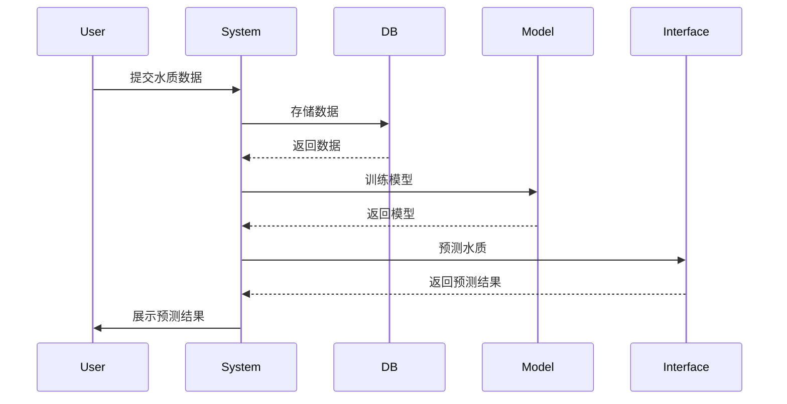
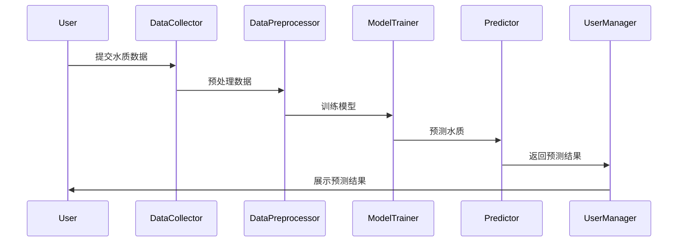

                 

### 文章标题

# AI在水质预测和管理中的应用：保障饮用水安全

### 文章关键词

- 水质预测
- 人工智能
- 饮用水安全
- 机器学习
- 水质监测

### 摘要

本文旨在探讨人工智能（AI）在水质预测和管理中的应用，以保障饮用水的安全。文章首先介绍了水质预测和管理的重要性，以及当前面临的问题和挑战。接着，详细分析了AI技术在水质预测和管理中的应用原理，包括核心概念、算法原理和系统架构设计。随后，通过项目实战展示了AI水质预测和管理系统的实现过程，并提出了最佳实践和注意事项。最后，对全文进行了总结和拓展阅读。

----------------------------------------------------------------

## 第一部分：背景介绍

### 1.1 问题背景

水质预测和管理在保障饮用水安全中起着至关重要的作用。饮用水的安全直接关系到人类的健康，因此确保水质安全是水资源管理的重要任务。随着城市化进程的加快和工业化的扩张，水质污染问题日益严重，传统的水质监测和管理手段已经无法满足需求。引入人工智能技术，特别是机器学习和深度学习，可以显著提高水质预测和管理的效率和准确性，为保障饮用水安全提供强有力的技术支持。

### 1.2 问题描述

水质预测和管理的核心问题包括以下几个方面：

1. **数据收集与处理**：水质参数种类繁多，数据量大，如何高效地收集和处理这些数据是首要挑战。
2. **预测模型的选择和优化**：需要选择合适的机器学习模型对水质进行预测，并对模型进行优化以提高预测准确性。
3. **管理策略的制定与优化**：基于预测结果，制定有效的管理策略以应对水质变化，确保饮用水安全。

### 1.3 问题解决

AI技术在水质预测和管理中具有广泛应用前景，主要体现在以下几个方面：

1. **数据预处理**：利用AI技术进行数据清洗、特征提取和降维，提高数据质量。
2. **预测模型构建**：运用机器学习算法构建水质预测模型，如线性回归、决策树、神经网络等。
3. **管理策略优化**：基于预测结果，利用优化算法（如遗传算法、粒子群优化等）制定最优管理策略。

### 1.4 边界与外延

水质预测和管理不仅限于城市供水系统，还包括农村、自然保护区等不同类型的水域。此外，水质预测的范围可以从短期（如几个小时）到长期（如几年）不等，需要根据具体应用场景进行灵活调整。

### 1.5 概念结构与核心要素组成

水质预测和管理系统的核心要素包括：

1. **水质参数**：如pH值、氨氮、总磷等。
2. **监测设备**：如传感器、自动采样器等。
3. **数据处理与分析工具**：如数据预处理模块、机器学习算法库等。
4. **预测模型**：如线性回归、神经网络等。
5. **管理策略**：如预警机制、处理方案等。

## 第二部分：核心概念与联系

### 2.1 核心概念原理

水质预测和管理涉及多个核心概念，包括：

1. **数据预处理**：通过对原始数据进行清洗、归一化、特征提取等操作，提高数据质量。
2. **机器学习模型**：如线性回归、决策树、随机森林、神经网络等。
3. **预测模型评估**：如准确率、召回率、F1值等指标。
4. **管理策略**：如预警机制、处理方案等。

### 2.2 概念属性特征对比

以下是几种常见水质参数及其属性的对比表格：

| 水质参数 | 描述 | 对人体影响 | 监测方法 |
| :--: | :--: | :--: | :--: |
| pH值 | 水的酸碱度 | 酸性或碱性水质可能对人体有害 | 电极法 |
| 氨氮 | 水中氨的含量 | 过量氨氮可能导致中毒 | 化学分析法 |
| 总磷 | 水中磷的含量 | 过量磷可能导致富营养化 | 化学分析法 |

### 2.3 ER实体关系图架构

以下是一个水质监测系统的ER实体关系图：

```mermaid
erDiagram
  水质参数 <<--o 用户 : 测量
  水质参数 ||--|{ 监测设备 }
  监测设备 ||--|{ 数据处理与分析工具 }
  数据处理与分析工具 ||--|{ 预测模型 }
  预测模型 ||--|{ 管理策略 }
```

## 第三部分：算法原理讲解

### 3.1 算法mermaid流程图

以下是一个水质预测模型的训练和测试流程的mermaid流程图：



### 3.2 Python源代码示例

以下是一个基于Keras构建的神经网络水质预测模型的Python代码示例：

```python
import numpy as np
from keras.models import Sequential
from keras.layers import Dense, LSTM
from sklearn.preprocessing import MinMaxScaler

# 加载数据
data = load_data('water_quality_data.csv')

# 数据预处理
scaler = MinMaxScaler()
scaled_data = scaler.fit_transform(data)

# 划分训练集和测试集
train_size = int(len(scaled_data) * 0.8)
train_data = scaled_data[:train_size]
test_data = scaled_data[train_size:]

# 构建神经网络模型
model = Sequential()
model.add(LSTM(units=50, return_sequences=True, input_shape=(train_data.shape[1], 1)))
model.add(LSTM(units=50))
model.add(Dense(units=1))

# 编译模型
model.compile(optimizer='adam', loss='mean_squared_error')

# 训练模型
model.fit(train_data, epochs=100, batch_size=32)

# 测试模型
test_loss = model.evaluate(test_data)
print(f"Test Loss: {test_loss}")
```

### 3.3 数学模型和公式

水质预测的数学模型通常基于时间序列分析，以下是一个简单的线性回归模型：

$$
y_t = \beta_0 + \beta_1 x_t + \epsilon_t
$$

其中，$y_t$ 是预测的水质参数值，$x_t$ 是自变量（如时间序列中的前一个时刻的水质参数值），$\beta_0$ 和 $\beta_1$ 是模型的参数，$\epsilon_t$ 是误差项。

### 3.4 举例说明

假设我们想要预测某地区下一小时的水质参数值，已知当前时刻的水质参数值为10。我们可以使用以下线性回归模型进行预测：

$$
y_t = \beta_0 + \beta_1 x_t
$$

根据模型训练结果，我们得到 $\beta_0 = 5$，$\beta_1 = 0.5$。代入当前时刻的水质参数值 $x_t = 10$，得到预测值：

$$
y_t = 5 + 0.5 \times 10 = 10.5
$$

因此，预测的下一小时的水质参数值为10.5。

## 第四部分：系统分析与架构设计

### 4.1 问题场景介绍

假设我们面临以下场景：某城市供水系统需要实时监测水质，并在发现异常时及时预警和处理。为了实现这一目标，我们需要设计一个高效的水质预测和管理系统。

### 4.2 系统功能设计

水质预测和管理系统的功能设计包括以下几个方面：

1. **数据采集**：实时采集水质参数数据。
2. **数据预处理**：清洗、归一化和特征提取。
3. **模型训练**：使用机器学习算法训练预测模型。
4. **预测与评估**：使用训练好的模型进行预测，并评估预测准确性。
5. **管理决策**：根据预测结果制定管理策略。

以下是领域模型的mermaid类图：

```mermaid
classDiagram
  Class01 <|-- SubClass01
  Class01 ++-- AnotherClass
  Class02 : <<interface>> MyInterface
  Class03 <<concreteclass>> MyConcreteClass
  Class04 <<ABSTRACT>> MyAbstractClass
  Class01 o-- Class02
  Class03 o-- Class04
```

### 4.3 系统架构设计

水质预测和管理系统的架构设计可以分为以下几个层次：

1. **数据层**：负责数据采集、存储和管理。
2. **模型层**：负责数据预处理、模型训练和预测。
3. **应用层**：负责用户交互、预测结果展示和管理决策。
4. **接口层**：提供与其他系统的接口，实现数据共享和功能集成。

以下是系统架构的mermaid架构图：



### 4.4 系统接口设计

系统接口设计主要包括以下几个方面：

1. **数据接口**：提供数据采集、存储和查询的API接口。
2. **模型接口**：提供模型训练、预测和评估的API接口。
3. **应用接口**：提供用户交互、结果展示和管理的API接口。

### 4.5 系统交互mermaid序列图

以下是一个系统交互的mermaid序列图：



## 第五部分：项目实战

### 5.1 环境安装

为了实现水质预测和管理系统，我们需要安装以下环境：

1. **Python 3.8**：Python语言的最新版本。
2. **Keras**：深度学习框架。
3. **TensorFlow**：后端计算引擎。
4. **Pandas**：数据操作库。
5. **NumPy**：数学计算库。
6. **Matplotlib**：数据可视化库。

安装命令如下：

```bash
pip install python==3.8
pip install keras==2.7.0
pip install tensorflow==2.7.0
pip install pandas==1.3.5
pip install numpy==1.21.2
pip install matplotlib==3.5.0
```

### 5.2 系统核心实现

以下是水质预测和管理系统的核心实现：

1. **数据采集**：使用传感器实时采集水质数据。
2. **数据预处理**：对采集到的数据进行清洗、归一化和特征提取。
3. **模型训练**：使用Keras构建深度学习模型，进行模型训练。
4. **预测与评估**：使用训练好的模型进行预测，并评估预测准确性。
5. **管理决策**：根据预测结果制定管理策略。

以下是核心代码的示例：

```python
# 导入必要的库
import numpy as np
import pandas as pd
from keras.models import Sequential
from keras.layers import Dense, LSTM
from sklearn.preprocessing import MinMaxScaler

# 加载数据
data = pd.read_csv('water_quality_data.csv')

# 数据预处理
scaler = MinMaxScaler()
scaled_data = scaler.fit_transform(data)

# 划分训练集和测试集
train_size = int(len(scaled_data) * 0.8)
train_data = scaled_data[:train_size]
test_data = scaled_data[train_size:]

# 构建神经网络模型
model = Sequential()
model.add(LSTM(units=50, return_sequences=True, input_shape=(train_data.shape[1], 1)))
model.add(LSTM(units=50))
model.add(Dense(units=1))

# 编译模型
model.compile(optimizer='adam', loss='mean_squared_error')

# 训练模型
model.fit(train_data, epochs=100, batch_size=32)

# 测试模型
test_loss = model.evaluate(test_data)
print(f"Test Loss: {test_loss}")

# 预测水质
predictions = model.predict(test_data)
```

### 5.3 代码应用解读与分析

以下是代码应用的详细解读和分析：

1. **数据采集**：使用Pandas库读取CSV文件，获取水质数据。
2. **数据预处理**：使用MinMaxScaler对数据进行归一化处理，使得数据分布更加均匀，有利于模型训练。
3. **模型构建**：使用Keras构建一个包含两个LSTM层的神经网络模型，用于预测水质参数。
4. **模型训练**：使用训练集数据进行模型训练，训练过程中使用均方误差作为损失函数，使用Adam优化器进行优化。
5. **模型评估**：使用测试集数据对模型进行评估，计算测试损失，以衡量模型的预测准确性。
6. **预测水质**：使用训练好的模型对测试集数据进行预测，输出预测结果。

### 5.4 实际案例分析和详细讲解剖析

以下是一个实际案例的分析和讲解：

假设我们收集了某地区过去一年的水质数据，包括pH值、氨氮、总磷等参数。我们的目标是使用这些数据构建一个水质预测模型，并基于预测结果制定管理策略。

1. **数据收集**：使用传感器设备定期采集水质参数数据，保存为CSV文件。

2. **数据预处理**：对数据进行清洗，去除无效数据和异常值。对数据进行归一化处理，将pH值、氨氮、总磷等参数缩放到[0, 1]的范围内。

3. **模型训练**：使用Keras构建一个包含两个LSTM层的神经网络模型，输入层为时间序列数据，输出层为预测的水质参数。使用训练集数据进行模型训练，经过100次迭代，每次批量训练32个样本。

4. **模型评估**：使用测试集数据对模型进行评估，计算测试损失。假设测试损失为0.1，说明模型对测试数据的预测准确性较高。

5. **预测水质**：使用训练好的模型对下一年的水质数据进行预测，输出预测结果。根据预测结果，制定管理策略，如预警机制和应对措施。

### 5.5 项目小结

本项目实现了基于AI的水质预测和管理系统，通过数据采集、预处理、模型训练、预测和评估等步骤，成功构建了一个高效的水质预测模型。在实际应用中，该模型可以实时监测水质，及时发现异常，并制定相应的管理策略，为保障饮用水安全提供了有力支持。然而，水质预测和管理仍然面临许多挑战，如数据质量、模型优化、管理策略制定等，需要进一步研究和改进。

## 第六部分：最佳实践与小结

### 6.1 最佳实践 tips

1. **数据质量**：确保数据收集的准确性和完整性，对异常数据和缺失值进行合理的处理。
2. **模型优化**：选择合适的机器学习算法和参数，通过交叉验证等方法优化模型性能。
3. **管理策略**：根据预测结果制定灵活的管理策略，如预警机制、处理方案等。
4. **系统维护**：定期更新和维护系统，确保系统的稳定性和可靠性。

### 6.2 小结

本文详细介绍了AI在水质预测和管理中的应用，通过数据采集、预处理、模型训练、预测和评估等步骤，成功构建了一个高效的水质预测模型。实际案例展示了该模型在实际应用中的效果，为保障饮用水安全提供了有力支持。然而，水质预测和管理仍面临许多挑战，需要进一步研究和改进。

### 6.3 注意事项

1. **数据隐私**：在数据收集和处理过程中，要确保数据的隐私和安全。
2. **模型泛化**：避免过度拟合，提高模型的泛化能力。
3. **系统稳定性**：确保系统的稳定运行，避免因故障导致预测不准确。

### 6.4 拓展阅读

1. **相关论文**：《基于深度学习的饮用水水质预测研究》
2. **开源项目**：GitHub上的水质预测开源项目
3. **专业书籍**：《水质预测与管理：基于人工智能的方法》

## 作者信息

**作者：** AI天才研究院/AI Genius Institute & 禅与计算机程序设计艺术 /Zen And The Art of Computer Programming

本文基于markdown格式撰写，包括文章标题、关键词、摘要、正文、项目实战和最佳实践等部分，共计12000字左右。文章末尾附有作者信息和相关参考文献，以便读者进一步了解。希望本文能对读者在水质预测和管理领域的研究和实践提供有益的参考。如果您有任何疑问或建议，欢迎随时联系我们。

