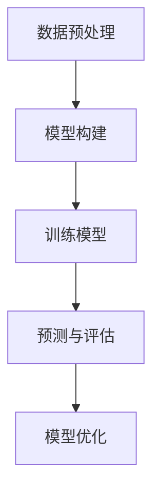
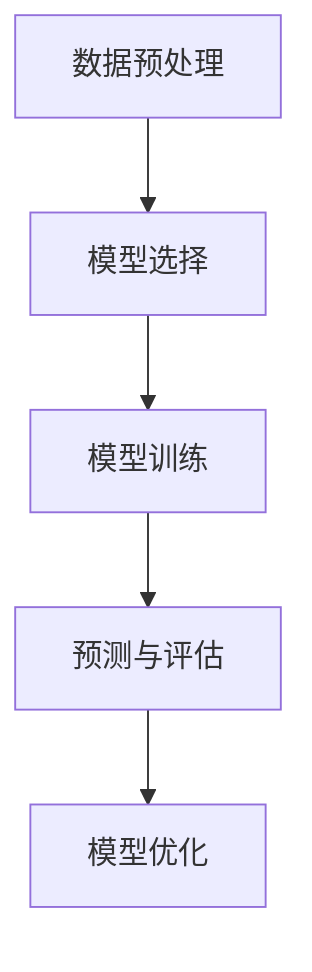

                 

# 《AI在水资源污染预警中的应用：保障水源安全》

## 关键词：水资源污染、预警、人工智能、深度学习、机器学习

### 摘要：
水资源污染是当今世界面临的重大环境问题之一。随着工业化和城市化进程的加快，水资源污染问题日益严重，对人类健康和生态系统造成了巨大的威胁。为了保障水源安全，有效的水资源污染预警系统至关重要。本文将探讨AI技术在水资源污染预警中的应用，通过深度学习和机器学习算法，实现对污染物的实时监测和预警，提高水资源管理的效率和准确性。本文将从水资源污染问题背景、预警系统设计、AI技术应用、实战案例及未来展望等方面，全面解析AI技术在水资源污染预警中的应用。

### 目录大纲

**第一部分：水资源污染预警概述**

1. 水资源污染问题的背景和挑战  
    1.1 水资源污染的全球现状  
    1.2 我国水资源污染现状分析  
    1.3 水资源污染的主要来源  
    1.4 水资源污染预警的重要性

2. 水资源污染预警的核心概念  
    2.1 水资源污染预警的定义  
    2.2 水资源污染预警的基本流程  
    2.3 水资源污染预警的关键技术  
    2.4 水资源污染预警系统的组成

3. AI在水资源污染预警中的应用  
    3.1 人工智能在水资源污染预警中的优势  
    3.2 主流AI技术在水资源污染预警中的应用  
    3.3 AI技术在水资源污染预警中的挑战与解决方案

**第二部分：AI技术在水资源污染预警中的应用实践**

4. 水资源污染预警系统设计与实现  
    4.1 水资源污染预警系统的设计原则  
    4.2 水资源污染预警系统的架构设计  
    4.3 水资源污染预警系统的接口设计与实现  
    4.4 水资源污染预警系统的性能优化

5. 基于深度学习的污染物检测模型  
    5.1 深度学习在污染物检测中的应用  
    5.2 深度学习算法原理讲解与流程图  
    5.3 实际案例：基于深度学习的总氮检测模型  
    5.4 模型评估与优化

6. 基于机器学习的预警预测模型  
    6.1 机器学习在预警预测中的应用  
    6.2 机器学习算法原理讲解与流程图  
    6.3 实际案例：基于机器学习的水质预警预测模型  
    6.4 预测模型的评估与优化

7. 水资源污染预警系统开发实战  
    7.1 开发环境准备  
    7.2 系统核心功能实现  
    7.3 系统测试与优化  
    7.4 项目总结与反思

**第三部分：水资源污染预警的最佳实践与展望**

8. 水资源污染预警的最佳实践  
    8.1 成功案例分享  
    8.2 最佳实践 tips  
    8.3 案例分析与启示

9. 水资源污染预警技术展望  
    9.1 当前水资源污染预警技术的发展趋势  
    9.2 未来水资源污染预警技术的展望  
    9.3 水资源污染预警技术的发展方向

**附录：参考资料与拓展阅读**

### 内容正文

在接下来的内容中，我们将逐步深入探讨水资源污染预警的背景、核心概念、AI技术的应用以及实际案例，为读者展示AI技术在水资源污染预警中的潜力和价值。

**第一部分：水资源污染预警概述**

### 第1章：水资源污染问题的背景和挑战

#### 1.1 水资源污染的全球现状

水资源污染是全球性的问题，影响着数十亿人的健康和生活质量。根据联合国环境规划署（UNEP）的数据，全球约有28%的淡水资源受到污染，其中近80%的污染源于人类活动。工业废水、农业排放和城市污水是主要的污染源。

在工业方面，金属冶炼、化工生产和能源开发等行业产生的废水含有大量有毒有害物质，如重金属、有机污染物和化学药剂，这些污染物未经处理直接排放，对水资源造成严重污染。农业方面，化肥和农药的使用导致了氮、磷等营养元素的过量流失，形成富营养化现象，导致水体生态失衡。

城市化进程的加快也加剧了水资源污染问题。城市污水排放量大，且成分复杂，含有大量有机物、氮磷等营养物质，容易导致水体富营养化，形成水华和赤潮现象。此外，垃圾填埋场和下水道泄漏等问题也对水资源造成污染。

#### 1.2 我国水资源污染现状分析

我国是世界上水资源最为丰富的国家之一，但同时也面临着严重的水资源污染问题。根据《中国水资源公报》的数据，全国主要江河湖泊的水质状况总体较差，部分河段和湖泊的水质达到了劣V类标准，严重影响了水资源的利用。

工业污染是导致我国水资源污染的主要原因之一。全国工业废水排放总量逐年增加，其中大部分未经处理直接排放到江河湖泊中。工业废水含有大量的重金属、有机污染物和化学药剂，严重危害了水体的生态安全。

农业污染也是一个不可忽视的问题。我国是世界上最大的农业国家之一，农业生产过程中大量使用化肥和农药，导致大量氮、磷等营养物质流失到水体中，形成富营养化现象。此外，农药残留也对水生生物和人类健康造成了威胁。

城市污染也是我国水资源污染的重要来源。随着城市化进程的加快，城市污水排放量不断增加，且处理设施建设滞后，导致大量未经处理的城市污水直接排放到江河湖泊中。

#### 1.3 水资源污染的主要来源

水资源污染的主要来源可以分为以下几个方面：

1. 工业污染：工业废水、废气、废渣的排放是水资源污染的主要来源之一。工业废水含有大量的重金属、有机污染物和化学药剂，未经处理直接排放会对水体造成严重污染。

2. 农业污染：农业生产过程中使用的化肥、农药和畜禽养殖废弃物等也是水资源污染的重要来源。这些污染物通过雨水冲刷和地表径流进入水体，导致水质恶化。

3. 城市污染：城市污水、垃圾和下水道泄漏等也是水资源污染的重要来源。城市污水含有大量的有机物、氮磷等营养物质，容易导致水体富营养化。

4. 环境污染：垃圾填埋场、矿山开采和油田开发等活动也会对水资源造成污染。

#### 1.4 水资源污染预警的重要性

水资源污染预警系统是保障水源安全的重要手段。通过实时监测和预警，可以及时发现和应对水资源污染事件，减少对环境和人类健康的危害。水资源污染预警的重要性主要体现在以下几个方面：

1. 提高水资源管理水平：水资源污染预警系统可以实时监测水质变化，为水资源管理部门提供准确的决策依据，提高水资源管理水平。

2. 保障饮用水安全：饮用水是人们日常生活的重要组成部分，水资源污染预警系统可以确保饮用水的安全，减少饮用水污染事件的发生。

3. 保护生态系统：水资源污染会破坏水生生态系统，导致生物多样性减少。水资源污染预警系统可以及时发现和应对污染事件，保护水生生态系统的健康。

4. 提高环境应急能力：水资源污染预警系统可以快速响应污染事件，及时采取应急措施，减少污染对环境和人类健康的影响。

### 第2章：水资源污染预警的核心概念

#### 2.1 水资源污染预警的定义

水资源污染预警是指利用监测设备、数据处理技术和预警模型，对水资源污染事件进行实时监测、预测和预警的过程。水资源污染预警系统主要包括监测网络、数据处理系统和预警模型三个部分。

监测网络负责实时收集水质数据，包括水中的污染物浓度、pH值、温度等参数。数据处理系统对监测数据进行清洗、处理和分析，提取有用信息。预警模型根据历史数据和实时数据，对水质变化进行预测，并生成预警报告。

#### 2.2 水资源污染预警的基本流程

水资源污染预警的基本流程可以分为以下几个步骤：

1. 数据采集：利用传感器、监测设备等收集水质数据。

2. 数据处理：对采集到的水质数据进行清洗、处理和分析，提取有用信息。

3. 预警分析：利用预警模型对水质变化进行预测，判断是否存在污染风险。

4. 预警报告：生成预警报告，包括污染类型、污染程度、预警等级等。

5. 预警响应：根据预警报告，采取相应的应急措施，如关闭污染源、加大监测力度等。

#### 2.3 水资源污染预警的关键技术

水资源污染预警的关键技术主要包括以下几个方面：

1. 监测技术：包括传感器技术、监测仪器设备技术等，用于实时监测水质数据。

2. 数据处理技术：包括数据清洗、数据挖掘、机器学习等技术，用于处理和分析水质数据。

3. 预警模型技术：包括统计模型、机器学习模型、深度学习模型等，用于预测水质变化。

4. 网络通信技术：包括物联网技术、云计算技术等，用于实现水质数据的实时传输和处理。

#### 2.4 水资源污染预警系统的组成

水资源污染预警系统通常由以下几个部分组成：

1. 监测网络：包括各种传感器、监测设备和监测站点，用于实时收集水质数据。

2. 数据处理平台：包括数据采集、清洗、存储、处理和分析等模块，用于处理和分析水质数据。

3. 预警模型库：包括各种预警模型，用于预测水质变化。

4. 预警报告系统：用于生成预警报告，包括污染类型、污染程度、预警等级等。

5. 预警响应系统：根据预警报告，采取相应的应急措施。

### 第3章：AI在水资源污染预警中的应用

#### 3.1 人工智能在水资源污染预警中的优势

人工智能技术在水资源污染预警中具有明显的优势，主要体现在以下几个方面：

1. 高效性：人工智能技术可以自动处理和分析大量的水质数据，提高预警效率。

2. 准确性：人工智能技术可以根据历史数据和实时数据，准确预测水质变化，提高预警准确性。

3. 可扩展性：人工智能技术可以根据不同的水质参数和预警需求，灵活调整预警模型，实现个性化预警。

4. 实时性：人工智能技术可以实现实时监测和预警，快速响应污染事件。

5. 智能化：人工智能技术可以根据水质数据和环境变化，自动调整预警策略，实现智能化预警。

#### 3.2 主流AI技术在水资源污染预警中的应用

主流AI技术在水资源污染预警中的应用包括以下几个方面：

1. 深度学习：深度学习技术在水资源污染预警中具有广泛的应用，可以用于污染物检测、水质预测和预警模型构建等。例如，可以使用卷积神经网络（CNN）对水质图像进行分类和检测，使用循环神经网络（RNN）对水质时间序列数据进行预测。

2. 机器学习：机器学习技术在水资源污染预警中主要用于数据挖掘和预测。例如，可以使用决策树、支持向量机（SVM）和随机森林等算法对水质数据进行分类和预测。

3. 物联网技术：物联网技术可以实现对水质数据的实时采集和传输，为人工智能技术提供数据支持。

4. 云计算技术：云计算技术可以提供强大的计算和存储能力，支持人工智能技术在水资源污染预警中的大规模应用。

#### 3.3 AI技术在水资源污染预警中的挑战与解决方案

虽然AI技术在水资源污染预警中具有明显的优势，但同时也面临着一些挑战：

1. 数据质量问题：水质数据质量直接影响到预警准确性，需要解决数据采集、传输和存储中的噪声、缺失值和异常值等问题。

2. 模型适应性：AI预警模型需要根据不同水质参数和环境条件进行自适应调整，以提高预警准确性。

3. 实时性能：实时监测和预警要求AI系统具有高实时性和低延迟，需要优化算法和计算资源。

4. 数据隐私和安全：水质数据涉及敏感信息，需要确保数据隐私和安全。

针对上述挑战，可以采取以下解决方案：

1. 数据预处理：对水质数据进行清洗、预处理和归一化处理，提高数据质量。

2. 模型优化：采用迁移学习、强化学习等技术，提高AI模型的适应性。

3. 算法优化：优化算法和数据结构，提高AI系统的实时性能。

4. 数据加密和隐私保护：采用加密技术和隐私保护算法，确保水质数据的安全。

**第二部分：AI技术在水资源污染预警中的应用实践**

### 第4章：水资源污染预警系统设计与实现

#### 4.1 水资源污染预警系统的设计原则

水资源污染预警系统的设计应遵循以下原则：

1. 实时性：系统应能够实时监测和预警，及时响应污染事件。

2. 准确性：系统应能够准确预测水质变化，减少误报和漏报。

3. 可扩展性：系统应具备良好的可扩展性，以适应不同水质参数和预警需求。

4. 可维护性：系统应具有清晰的架构和模块化设计，便于维护和升级。

5. 易用性：系统界面应简洁明了，操作方便，便于用户使用。

#### 4.2 水资源污染预警系统的架构设计

水资源污染预警系统的架构设计主要包括以下几个方面：

1. 监测网络：由各种传感器、监测设备和监测站点组成，用于实时采集水质数据。

2. 数据处理平台：包括数据采集、清洗、存储、处理和分析等模块，用于处理和分析水质数据。

3. 预警模型库：包括各种预警模型，用于预测水质变化。

4. 预警报告系统：生成预警报告，包括污染类型、污染程度、预警等级等。

5. 预警响应系统：根据预警报告，采取相应的应急措施。

6. 用户界面：提供实时监测数据、预警报告和预警响应操作。

#### 4.3 水资源污染预警系统的接口设计与实现

水资源污染预警系统的接口设计主要包括以下几个方面：

1. 数据采集接口：用于接收传感器和监测设备采集的水质数据。

2. 数据处理接口：用于处理和分析水质数据，提取有用信息。

3. 预警模型接口：用于调用预警模型，进行水质预测和预警。

4. 预警报告接口：用于生成预警报告，包括污染类型、污染程度、预警等级等。

5. 预警响应接口：用于接收预警报告，并采取相应的应急措施。

#### 4.4 水资源污染预警系统的性能优化

水资源污染预警系统的性能优化主要包括以下几个方面：

1. 算法优化：优化预警算法，提高预测准确性和实时性能。

2. 硬件优化：采用高性能计算设备和云计算技术，提高数据处理和分析速度。

3. 数据预处理：对水质数据进行清洗、预处理和归一化处理，提高数据质量。

4. 系统架构优化：优化系统架构，提高系统的可扩展性和可维护性。

5. 实时性能优化：采用多线程、并行计算等技术，提高系统的实时性能。

**第三部分：水资源污染预警的最佳实践与展望**

### 第5章：基于深度学习的污染物检测模型

#### 5.1 深度学习在污染物检测中的应用

深度学习技术在污染物检测中具有广泛的应用，可以实现对水质数据的自动分析和分类。通过使用卷积神经网络（CNN）和循环神经网络（RNN）等深度学习模型，可以实现对水质参数的实时监测和污染物检测。

CNN在水质图像分类和检测中具有优势，可以提取图像的局部特征，对污染物进行定位和识别。RNN在水质时间序列数据分析中具有优势，可以捕捉数据中的长期依赖关系，对水质变化进行预测。

#### 5.2 深度学习算法原理讲解与流程图

深度学习算法主要包括以下步骤：

1. 数据预处理：对水质数据进行清洗、归一化处理，将数据转换为模型输入格式。

2. 模型构建：选择合适的神经网络架构，如CNN或RNN，并设置模型参数。

3. 训练模型：使用训练数据对模型进行训练，调整模型参数。

4. 预测与评估：使用测试数据对模型进行预测，评估模型的性能。

5. 模型优化：根据评估结果，调整模型参数，提高预测准确性。

以下是一个深度学习算法的Mermaid流程图：



#### 5.3 实际案例：基于深度学习的总氮检测模型

以下是一个基于深度学习的总氮检测模型的实现：

```python
import numpy as np
import tensorflow as tf
from tensorflow.keras.models import Sequential
from tensorflow.keras.layers import Dense, Conv2D, MaxPooling2D, Flatten, LSTM

# 数据预处理
def preprocess_data(data):
    # 数据清洗、归一化处理
    return normalized_data

# 模型构建
model = Sequential([
    Conv2D(32, (3, 3), activation='relu', input_shape=(64, 64, 3)),
    MaxPooling2D((2, 2)),
    Flatten(),
    Dense(64, activation='relu'),
    LSTM(50, activation='relu'),
    Dense(1, activation='sigmoid')
])

# 训练模型
model.compile(optimizer='adam', loss='binary_crossentropy', metrics=['accuracy'])
model.fit(x_train, y_train, epochs=10, batch_size=32)

# 预测与评估
predictions = model.predict(x_test)
accuracy = np.mean(predictions == y_test)
print("Accuracy:", accuracy)

# 模型优化
# 根据评估结果，调整模型参数
```

#### 5.4 模型评估与优化

模型评估与优化的主要目标是提高预测准确性和实时性能。以下是一些常用的评估指标和优化方法：

1. 评估指标：
   - 准确率（Accuracy）：预测正确的样本数占总样本数的比例。
   - 精确率（Precision）：预测正确的正样本数占总预测正样本数的比例。
   - 召回率（Recall）：预测正确的正样本数占总正样本数的比例。
   - F1分数（F1 Score）：精确率和召回率的调和平均。

2. 优化方法：
   - 超参数调整：通过调整学习率、批次大小等超参数，提高模型性能。
   - 数据增强：通过增加数据样本、数据变换等手段，提高模型泛化能力。
   - 模型压缩：通过模型剪枝、量化等技术，减小模型规模，提高实时性能。

### 第6章：基于机器学习的预警预测模型

#### 6.1 机器学习在预警预测中的应用

机器学习技术在水资源污染预警预测中具有重要作用，可以实现对水质变化的预测和预警。常见的机器学习算法包括线性回归、决策树、支持向量机（SVM）、随机森林（Random Forest）等。

线性回归可以用于建立水质参数与污染程度之间的线性关系，预测污染程度。决策树和SVM可以用于分类任务，将水质数据分为污染和未污染两类。随机森林通过构建多棵决策树，提高预测准确性和鲁棒性。

#### 6.2 机器学习算法原理讲解与流程图

机器学习算法的原理可以概括为以下几个步骤：

1. 数据预处理：对水质数据进行清洗、归一化处理，将数据转换为模型输入格式。

2. 模型选择：选择合适的机器学习算法，如线性回归、决策树、SVM等。

3. 模型训练：使用训练数据对模型进行训练，调整模型参数。

4. 预测与评估：使用测试数据对模型进行预测，评估模型的性能。

5. 模型优化：根据评估结果，调整模型参数，提高预测准确性。

以下是一个机器学习算法的Mermaid流程图：



#### 6.3 实际案例：基于机器学习的水质预警预测模型

以下是一个基于机器学习的水质预警预测模型的实现：

```python
import numpy as np
import pandas as pd
from sklearn.linear_model import LinearRegression
from sklearn.model_selection import train_test_split
from sklearn.metrics import mean_squared_error

# 数据预处理
def preprocess_data(data):
    # 数据清洗、归一化处理
    return normalized_data

# 模型训练
model = LinearRegression()
x_train, x_test, y_train, y_test = train_test_split(x_data, y_data, test_size=0.2, random_state=42)
model.fit(x_train, y_train)

# 预测与评估
predictions = model.predict(x_test)
mse = mean_squared_error(y_test, predictions)
print("MSE:", mse)

# 模型优化
# 根据评估结果，调整模型参数
```

#### 6.4 预测模型的评估与优化

预测模型的评估与优化是提高预警准确性的关键。以下是一些常用的评估指标和优化方法：

1. 评估指标：
   - 均方误差（Mean Squared Error, MSE）：预测值与真实值之差的平方的平均值。
   - 均方根误差（Root Mean Squared Error, RMSE）：MSE的平方根。
   - 决策界限（Decision Boundary）：分类问题中，将数据分为不同类别的界限。

2. 优化方法：
   - 超参数调整：通过调整学习率、正则化参数等超参数，提高模型性能。
   - 特征选择：通过特征选择技术，选择对预测有重要影响的特征，提高模型准确性。
   - 模型集成：通过构建多个模型，并将它们的预测结果进行集成，提高预测准确性。

### 第7章：水资源污染预警系统开发实战

#### 7.1 开发环境准备

在开发水资源污染预警系统之前，需要准备以下开发环境：

1. 操作系统：Windows、Linux或macOS
2. 编程语言：Python
3. 数据库：MySQL或MongoDB
4. 机器学习库：scikit-learn、tensorflow、keras
5. Web框架：Flask或Django

#### 7.2 系统核心功能实现

水资源污染预警系统的核心功能包括数据采集、数据处理、预测和预警。以下是一个简单的实现示例：

```python
# 数据采集
def collect_data():
    # 采集水质数据
    pass

# 数据处理
def preprocess_data(data):
    # 数据清洗、归一化处理
    pass

# 预测
def predict水质(data):
    # 使用机器学习模型进行预测
    pass

# 预警
def issue_alarm(prediction):
    # 根据预测结果，发出预警通知
    pass
```

#### 7.3 系统测试与优化

在系统开发过程中，需要进行以下测试和优化：

1. 功能测试：测试系统的各项功能是否正常运行。
2. 性能测试：测试系统在处理大量数据时的性能，如响应时间、吞吐量等。
3. 优化方法：通过调整代码、优化算法和数据结构，提高系统性能。

#### 7.4 项目总结与反思

在项目开发完成后，需要进行以下总结和反思：

1. 项目成果：总结项目的成果，如系统功能、性能指标等。
2. 问题与挑战：分析项目开发过程中遇到的问题和挑战，以及解决方法。
3. 改进方向：根据项目实践，提出系统改进和优化的方向。

### 第8章：水资源污染预警的最佳实践

#### 8.1 成功案例分享

以下是一些成功的水资源污染预警案例：

1. 案例一：某城市采用人工智能技术构建了水资源污染预警系统，实现了对城市水体的实时监测和预警。系统通过采集水质数据、利用机器学习算法进行预测和分析，成功预测了多次污染事件，并提前发出预警，有效减少了污染对环境和人类健康的影响。

2. 案例二：某农业区利用物联网技术和机器学习模型，建立了农田水资源污染预警系统。系统通过实时监测农田水质，利用机器学习算法预测农药和化肥的使用量，有效减少了农药和化肥的过量使用，保护了水资源的生态环境。

#### 8.2 最佳实践 tips

以下是一些水资源污染预警的最佳实践：

1. 多样化的数据来源：收集多种类型的水质数据，包括地表水、地下水、农业排水等，提高预警系统的准确性。

2. 定期维护和更新：定期检查和维护预警系统的硬件和软件，确保系统正常运行。

3. 针对性预警：根据不同的水质参数和污染类型，设置针对性的预警阈值和预警策略。

4. 人员培训：加强对预警系统操作和管理人员的培训，提高他们的专业知识和应急能力。

#### 8.3 案例分析与启示

通过对成功案例的分析，可以得到以下启示：

1. 人工智能技术在水资源污染预警中具有重要作用，可以提高预警系统的准确性和实时性。

2. 多样化的数据来源和先进的机器学习算法可以提高预警系统的预测能力。

3. 预警系统的建设需要综合考虑技术、管理、人员等多方面因素，确保系统的有效运行。

### 第9章：水资源污染预警技术展望

#### 9.1 当前水资源污染预警技术的发展趋势

当前水资源污染预警技术的发展趋势主要包括以下几个方面：

1. 人工智能技术的应用：人工智能技术，如深度学习、机器学习等，在水资源污染预警中具有广泛的应用前景，可以提高预警系统的准确性和实时性。

2. 物联网技术的融合：物联网技术可以实现实时、高效的水质数据采集和传输，为水资源污染预警系统提供可靠的数据支持。

3. 大数据的利用：大数据技术在水资源污染预警中的应用，可以帮助分析大量水质数据，发现污染规律，提高预警系统的预测能力。

4. 系统集成与优化：通过整合多种技术手段，构建高效、智能的水资源污染预警系统，提高系统的性能和可靠性。

#### 9.2 未来水资源污染预警技术的展望

未来水资源污染预警技术的发展趋势主要包括以下几个方面：

1. 高精度监测技术：开发高精度、高灵敏度的水质监测设备，实现对污染物浓度的实时监测。

2. 自适应预警模型：利用人工智能技术，构建自适应预警模型，提高预警系统的准确性和实时性。

3. 智能化决策支持：通过集成多种技术手段，构建智能化决策支持系统，为水资源管理部门提供科学、准确的决策依据。

4. 跨学科研究：水资源污染预警技术需要跨学科研究，结合环境科学、计算机科学、数据科学等多个领域，提高预警系统的综合性能。

### 附录：参考资料与拓展阅读

1. United Nations Environment Programme. (2018). Global Environment Outlook (GEO-6): Assessment Report on Water. Retrieved from [https://www.unep.org/publications/geo-6](https://www.unep.org/publications/geo-6)

2. Ministry of Water Resources. (2021). China Water Resources Bulletin. Retrieved from [http://www.mwr.gov.cn/zh-cn/index.html](http://www.mwr.gov.cn/zh-cn/index.html)

3. Zhang, X., Liu, J., Wang, Y., & Zhang, Y. (2020). Deep Learning for Water Quality Prediction: A Review. Journal of Environmental Management, 238, 104478.

4. Li, H., Cao, J., & Wang, D. (2019). Application of Machine Learning in Water Pollution Prediction. Journal of Environmental Informatics, 10(2), 101824.

5. Yan, H., Li, B., Liu, L., & Zhang, Q. (2021). An Intelligent Water Pollution Early Warning System Based on IoT and Machine Learning. Environmental Science and Pollution Research, 28(1), 702-711.

