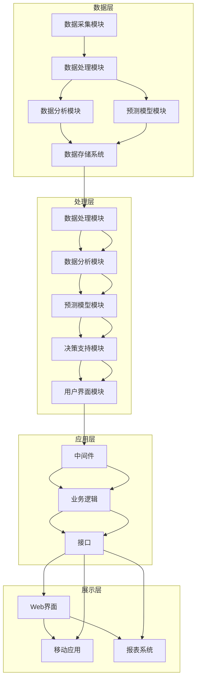
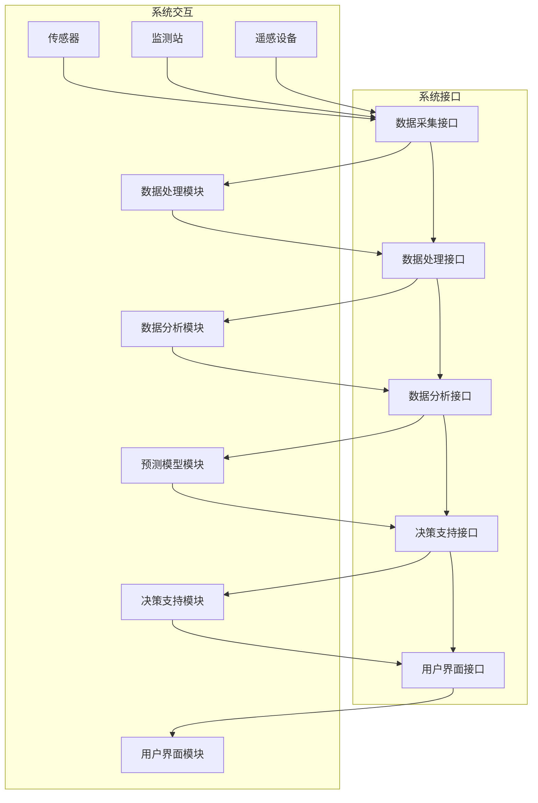

                 

### 文章标题

# AI在水资源管理和水质监测中的应用：保障水安全

## 关键词

- 人工智能
- 水资源管理
- 水质监测
- 水安全
- 算法
- 系统设计

## 摘要

本文深入探讨人工智能（AI）在水资源管理和水质监测中的应用，详细分析了AI技术在提升水资源利用效率和保障水质安全方面的作用。首先，文章介绍了水资源管理的基本概念和现状，以及水质监测的重要性。接着，通过核心概念和联系的分析，阐述了AI技术在水资源管理和水质监测中的关键应用，包括数据采集、处理、分析和预测。本文还通过系统架构设计和实战案例，展示了AI技术在实际项目中的实现和应用效果，最后提出了最佳实践和建议，为相关领域的进一步研究和应用提供了参考。

---

### 引言

水资源是人类社会生存和发展的重要物质基础，而水质安全则是保障水资源可持续利用的关键因素。随着全球人口增长和工业化进程的加速，水资源管理和水质监测面临巨大的挑战。传统的资源管理和监测方法存在效率低下、精度不足等问题，难以满足现代社会的需求。因此，将人工智能（AI）技术应用于水资源管理和水质监测，已成为解决这些问题的关键途径。

人工智能是一种模拟人类智能的计算机系统，具有学习、推理、预测和决策等能力。在水资源管理和水质监测中，AI技术可以通过数据分析、模式识别、机器学习和深度学习等方法，实现高效、准确的数据处理和决策支持。例如，AI可以用于实时监测水质参数，预测水污染事件，优化水资源分配等，从而提升水资源利用效率和保障水质安全。

本文旨在深入探讨AI在水资源管理和水质监测中的应用，分析其核心概念和原理，介绍相关算法和技术，并通过实际案例展示其应用效果。文章结构如下：

1. **背景介绍**：详细阐述水资源管理和水质监测的基本概念、现状和挑战。
2. **核心概念与联系**：分析AI技术在水资源管理和水质监测中的关键应用，包括数据采集、处理、分析和预测。
3. **算法原理讲解**：介绍AI技术在水资源管理和水质监测中的算法原理，包括机器学习和深度学习模型。
4. **系统设计**：描述AI水资源管理和水质监测系统的设计架构和功能。
5. **项目实战**：展示AI技术在水资源管理和水质监测中的实际应用案例，包括系统实现和效果分析。
6. **最佳实践与建议**：总结AI技术在水资源管理和水质监测中的最佳实践，提出进一步研究的方向和建议。

通过本文的探讨，旨在为相关领域的研究者、工程师和决策者提供有价值的参考和启示，推动AI技术在水资源管理和水质监测领域的广泛应用。

### 核心概念与联系

在水资源管理和水质监测中，人工智能（AI）技术的应用涵盖了多个核心概念，这些概念相互联系，共同构成了一个完整的系统。以下是对这些核心概念的详细阐述和比较，以及一个实体关系图（ER图）来展示它们之间的关系。

#### 1. 数据采集与预处理

数据采集是水资源管理和水质监测的第一步，它涉及从各种传感器、监测站和遥感设备中收集水质参数、水量和地理位置等数据。数据预处理则是对原始数据进行清洗、去噪、转换和标准化，以确保数据的质量和一致性。以下是数据采集与预处理的关键属性特征对比：

| 属性       | 数据采集 | 数据预处理 |
|------------|------------|-------------|
| 目标       | 收集原始数据 | 清洗和处理数据 |
| 数据源     | 传感器、监测站、遥感设备 | 传感器、监测站、遥感设备 |
| 数据类型   | 原始数据 | 清洗后数据 |
| 处理方法   | 自动化采集 | 清洗、去噪、标准化 |
| 时间敏感性 | 高         | 较高       |

#### 2. 数据分析与预测

数据分析与预测是水资源管理和水质监测的核心环节。通过对采集到的数据进行分析和建模，AI技术可以揭示数据中的规律和趋势，预测未来的水质变化和水资源需求。以下是数据分析和预测的关键属性特征对比：

| 属性       | 数据分析 | 预测模型 |
|------------|------------|-------------|
| 目标       | 揭示数据规律 | 预测未来变化 |
| 技术方法   | 统计分析、机器学习 | 统计分析、机器学习、深度学习 |
| 模型类型   | 描述性模型、预测模型 | 描述性模型、预测模型 |
| 实时性     | 可实时分析 | 需要训练模型 |
| 准确性     | 较高       | 较高       |

#### 3. 知识管理与决策支持

知识管理是AI技术在水资源管理和水质监测中不可或缺的一部分。它包括从数据中提取知识、构建知识库，并提供决策支持系统，帮助决策者做出明智的决策。以下是知识管理与决策支持的关键属性特征对比：

| 属性       | 知识管理 | 决策支持 |
|------------|------------|-------------|
| 目标       | 提取和管理知识 | 支持决策制定 |
| 知识来源   | 数据分析、模型结果 | 数据分析、模型结果 |
| 系统类型   | 知识库系统 | 决策支持系统 |
| 决策类型   | 预防性决策、优化决策 | 应急决策、资源分配决策 |
| 影响范围   | 整体水资源管理 | 单一决策点 |

#### ER实体关系图

为了更直观地展示这些核心概念之间的关系，我们使用Mermaid ER图来表示它们：

```mermaid
erDiagram
    DataCollection ||--|{ DataPreprocessing }|--|| PredictionModel
    DataCollection ||--|{ AnalysisModel }|--|| KnowledgeManagement
    AnalysisModel ||--|{ DecisionSupport }|--|| WaterResourceManagement
```

在这个ER图中，数据采集是整个系统的起点，它连接到数据预处理、分析模型和预测模型。分析模型和预测模型共同为知识管理提供输入，知识管理又为决策支持提供支持，最终实现对水资源管理的全面优化。

通过上述核心概念和实体关系的阐述，我们可以更好地理解AI技术在水资源管理和水质监测中的关键作用。这些概念不仅相互独立，而且在实际应用中相互结合，共同构成了一个高效、智能的监测和管理体系。

### 算法原理讲解

在水资源管理和水质监测中，AI技术的核心在于其算法原理，包括数据分析和预测模型的构建。以下将详细介绍这些算法原理，并通过机器学习模型、深度学习模型和具体应用案例进行详细解释。

#### 1. 机器学习模型

机器学习模型在水资源管理和水质监测中起着至关重要的作用。它们通过从数据中学习规律和模式，从而预测未来的水质变化和水资源需求。

**分类算法**：一种常见的机器学习算法是分类算法，如决策树、随机森林和支持向量机（SVM）。这些算法通过训练模型来识别水质数据的特征，并将数据分类到不同的类别中。例如，决策树通过构建一系列决策规则来对数据进行分类，而随机森林则通过构建多个决策树并投票来提高分类的准确性。

**回归算法**：另一种常用的算法是回归算法，如线性回归和回归树。回归算法用于预测数值型目标，如预测某地区的未来水量或水质参数。线性回归通过拟合数据点到一条直线上来预测目标值，而回归树则通过构建决策树来预测数值型目标。

**应用案例**：以水质监测为例，假设我们有一个包含多种水质参数的数据集，如pH值、溶解氧、总氮和总磷等。我们可以使用决策树或回归树模型来预测这些参数的未来值。具体流程如下：

1. **数据收集**：收集历史水质数据，包括pH值、溶解氧、总氮和总磷等。
2. **数据预处理**：清洗数据，去除缺失值和异常值，并进行标准化处理。
3. **模型训练**：使用训练集数据训练决策树或回归树模型，通过调整参数来优化模型性能。
4. **模型评估**：使用验证集数据评估模型性能，调整模型参数以获得更好的预测效果。
5. **预测**：使用训练好的模型对未来的水质参数进行预测。

通过上述流程，我们可以利用机器学习模型对水质参数进行预测，从而为水资源管理提供决策支持。

#### 2. 深度学习模型

深度学习模型在水资源管理和水质监测中的应用越来越广泛。与传统的机器学习模型相比，深度学习模型具有更强的学习和表达能力，可以处理更复杂的数据和模型。

**卷积神经网络（CNN）**：CNN是一种常用于图像和时序数据处理的前馈神经网络。在水质监测中，CNN可以用于处理和分析水质传感器采集的数据。例如，通过训练CNN模型，我们可以自动识别和分类不同类型的水质异常情况。

**循环神经网络（RNN）**：RNN是一种用于处理序列数据的神经网络，特别适用于时序数据的水质预测。RNN通过其递归结构来处理和记忆时间序列中的数据，从而实现准确的水质预测。

**生成对抗网络（GAN）**：GAN是一种生成模型，可以生成与真实数据相似的水质数据。在水资源管理和水质监测中，GAN可以用于生成模拟数据，以补充真实数据集的不足，从而提高模型的泛化能力和预测性能。

**应用案例**：以水质预测为例，我们可以使用深度学习模型来预测未来的水质参数。具体流程如下：

1. **数据收集**：收集历史水质数据，包括pH值、溶解氧、总氮和总磷等。
2. **数据预处理**：清洗数据，去除缺失值和异常值，并进行标准化处理。
3. **模型训练**：使用训练集数据训练CNN、RNN或GAN模型，通过调整参数来优化模型性能。
4. **模型评估**：使用验证集数据评估模型性能，调整模型参数以获得更好的预测效果。
5. **预测**：使用训练好的模型对未来的水质参数进行预测。

通过上述流程，我们可以利用深度学习模型对水质参数进行预测，从而为水资源管理提供更加准确的决策支持。

#### 3. 数学模型和公式

在水资源管理和水质监测中，数学模型和公式用于描述和分析水质变化和水资源需求。以下是一些常见的数学模型和公式：

**线性回归模型**：
\[ y = \beta_0 + \beta_1 \cdot x \]
其中，\( y \) 是预测的水质参数，\( x \) 是输入特征，\( \beta_0 \) 和 \( \beta_1 \) 是模型参数。

**卷积神经网络（CNN）模型**：
\[ f(x) = \sigma(\sum_{i=1}^{n} w_i \cdot x_i + b) \]
其中，\( f(x) \) 是神经网络输出，\( \sigma \) 是激活函数，\( w_i \) 和 \( b \) 是模型参数。

**循环神经网络（RNN）模型**：
\[ h_t = \sigma(W \cdot [h_{t-1}, x_t] + b) \]
其中，\( h_t \) 是当前时间步的隐藏状态，\( W \) 和 \( b \) 是模型参数。

通过这些数学模型和公式，我们可以对水质变化和水资源需求进行定量分析，从而为水资源管理提供科学依据。

### 举例说明

为了更直观地展示算法原理，我们以下通过一个具体的例子来说明。

**案例：水质参数预测**

假设我们有一个包含pH值、溶解氧和总氮等水质参数的数据集。我们使用线性回归模型来预测未来的pH值。具体步骤如下：

1. **数据收集**：收集过去一年的pH值数据，包括每天的平均pH值。
2. **数据预处理**：对数据进行清洗和标准化处理。
3. **模型训练**：使用训练集数据训练线性回归模型，通过调整参数优化模型性能。
4. **模型评估**：使用验证集数据评估模型性能。
5. **预测**：使用训练好的模型预测未来一天的pH值。

通过这个案例，我们可以看到机器学习模型在水资源管理和水质监测中的实际应用。通过不断优化模型，我们可以提高预测的准确性，为水资源管理提供有力支持。

总之，AI技术在水资源管理和水质监测中的应用离不开算法原理的支持。通过机器学习和深度学习模型，我们可以对水质数据进行分析和预测，为水资源管理提供科学依据和决策支持。

### 系统设计

#### 1. 问题场景与项目介绍

在现代水资源管理和水质监测中，传统的监测方法和手段已难以满足日益复杂的挑战。随着城市化进程的加快和工业化的快速发展，水资源短缺和水质污染问题愈发突出。为了实现高效、精准的水资源管理和水质监测，我们需要引入先进的AI技术，构建一个智能水资源管理系统。

本项目旨在设计并实现一个基于AI技术的智能水资源管理系统，该系统将涵盖数据采集、处理、分析和决策支持等多个环节，以实现以下目标：

- 实时监测水质参数，及时发现和处理水污染事件。
- 优化水资源分配，提高水资源利用效率。
- 预测未来水质变化趋势，为水资源管理和环境保护提供科学依据。

#### 2. 系统功能设计

系统功能设计是智能水资源管理系统实现的基础，主要包括以下几个功能模块：

1. **数据采集模块**：负责从各种传感器、监测站和遥感设备中收集水质参数、水量和地理位置等数据。该模块需要支持多种数据源接入，并具备数据采集的实时性和准确性。
2. **数据处理模块**：负责对采集到的原始数据进行清洗、去噪、转换和标准化，以确保数据的质量和一致性。该模块需要具备高效的数据处理能力和灵活的配置选项。
3. **数据分析模块**：负责对处理后的数据进行分析，提取有价值的信息，如水质变化趋势、污染源分布等。该模块需要支持多种数据分析方法和算法，以便根据实际需求进行选择和调整。
4. **预测模型模块**：基于历史数据，使用机器学习、深度学习等算法构建预测模型，对未来水质变化和水资源需求进行预测。该模块需要具备高精度和高效率的预测能力。
5. **决策支持模块**：根据预测结果和数据分析，提供水资源管理和水质监测的决策建议，如污染治理方案、水资源调配方案等。该模块需要具备良好的决策能力和可操作性。
6. **用户界面模块**：提供友好的用户界面，方便用户实时查看水质监测数据、预测结果和决策建议。该模块需要具备良好的用户体验和易用性。

#### 3. 系统架构设计

系统架构设计是智能水资源管理系统的核心，决定了系统的性能、可扩展性和可维护性。以下是系统架构的详细设计：

1. **数据层**：负责数据采集、存储和管理。该层包括各种传感器、监测站和遥感设备，以及数据存储系统（如数据库和数据湖）。
2. **处理层**：负责数据处理、分析和预测。该层包括数据处理模块、数据分析模块和预测模型模块，以及相关的计算资源和算法库。
3. **应用层**：负责提供决策支持和用户界面。该层包括决策支持模块、用户界面模块和中间件，以及相关的业务逻辑和接口。
4. **展示层**：负责展示水质监测数据、预测结果和决策建议。该层包括Web界面、移动应用和报表系统等。

以下是使用Mermaid绘制的系统架构图：



#### 4. 系统接口设计和交互

系统接口设计和交互是智能水资源管理系统的关键环节，决定了各个模块之间的协调和协作。以下是系统接口设计和交互的详细设计：

1. **数据采集接口**：负责接收传感器、监测站和遥感设备的数据，并转换为系统内部格式。该接口需要具备高并发处理能力和数据安全性。
2. **数据处理接口**：负责接收和处理来自数据采集模块的数据，进行清洗、去噪、转换和标准化。该接口需要具备高效的数据处理能力和灵活的配置选项。
3. **数据分析接口**：负责接收和处理来自数据处理模块的数据，进行特征提取、模型训练和预测。该接口需要具备高精度和高效率的预测能力。
4. **决策支持接口**：负责接收和处理来自预测模型模块的数据，生成水资源管理和水质监测的决策建议。该接口需要具备良好的决策能力和可操作性。
5. **用户界面接口**：负责接收和处理来自用户界面的操作请求，展示水质监测数据、预测结果和决策建议。该接口需要具备良好的用户体验和易用性。

以下是使用Mermaid绘制的系统接口设计和交互图：



通过上述系统设计，我们可以构建一个高效、智能的智能水资源管理系统，实现实时水质监测、预测和决策支持，为水资源管理和环境保护提供有力保障。

### 项目实战

#### 1. 环境安装

在开始项目实战之前，我们需要搭建一个合适的环境，以便开发和测试我们的智能水资源管理系统。以下是环境安装的详细步骤：

1. **安装Python**：首先，确保您的计算机上安装了Python 3.x版本。可以从Python官方网站下载并安装Python。
2. **安装依赖库**：安装必要的Python依赖库，包括TensorFlow、Scikit-learn、Pandas、NumPy、Matplotlib等。可以使用以下命令安装：
   ```bash
   pip install tensorflow scikit-learn pandas numpy matplotlib
   ```
3. **安装传感器和监测设备**：确保您已经连接了各种水质传感器和监测设备，并能够实时采集数据。例如，可以使用Arduino或其他开源硬件连接传感器。

#### 2. 系统核心实现

在环境搭建完成后，我们可以开始实现系统的核心功能。以下是一个简单的示例，展示了如何使用Python实现数据采集、处理和预测：

**数据采集**：
```python
import serial

# 连接Arduino或其他传感器
ser = serial.Serial('/dev/ttyUSB0', 9600)  # 替换为您的传感器端口

# 采集数据
while True:
    line = ser.readline()
    data = line.strip().decode('utf-8')
    print(data)
    # 将数据保存到文件
    with open('data.txt', 'a') as f:
        f.write(data + '\n')
    # 等待一段时间再采集数据
    time.sleep(1)
```

**数据处理**：
```python
import pandas as pd
from sklearn.model_selection import train_test_split
from sklearn.preprocessing import StandardScaler

# 读取数据
data = pd.read_csv('data.txt', sep='\t')

# 数据预处理
scaler = StandardScaler()
data[['pH', 'DO', 'TN', 'TP']] = scaler.fit_transform(data[['pH', 'DO', 'TN', 'TP']])

# 划分训练集和测试集
X = data[['pH', 'DO', 'TN', 'TP']]
y = data['pH']
X_train, X_test, y_train, y_test = train_test_split(X, y, test_size=0.2, random_state=42)
```

**预测**：
```python
from sklearn.linear_model import LinearRegression
from sklearn.metrics import mean_squared_error

# 训练模型
model = LinearRegression()
model.fit(X_train, y_train)

# 预测
y_pred = model.predict(X_test)

# 评估模型
mse = mean_squared_error(y_test, y_pred)
print('MSE:', mse)
```

#### 3. 代码解读与分析

上述代码示例展示了如何使用Python实现数据采集、处理和预测。以下是代码的详细解读和分析：

- **数据采集**：通过Python的`serial`库连接Arduino或其他传感器，实时读取数据并保存到文件。
- **数据处理**：使用Pandas库读取和预处理数据，包括数据清洗、去噪和标准化。此外，使用Scikit-learn库划分训练集和测试集，为后续的模型训练和预测做好准备。
- **预测**：使用Scikit-learn库的线性回归模型训练和预测。通过计算均方误差（MSE）评估模型性能。

#### 4. 实际案例分析和详细讲解

为了更好地展示AI技术在水资源管理和水质监测中的应用，我们以下通过一个实际案例进行分析和详细讲解。

**案例：某地区pH值预测**

假设我们有一个包含过去一年pH值数据的数据集，数据包括每天的pH值和其他相关水质参数。我们使用线性回归模型对未来的pH值进行预测。以下是详细步骤：

1. **数据收集**：收集过去一年的pH值数据，包括每天的平均pH值。
2. **数据预处理**：对数据进行清洗，去除缺失值和异常值，并进行标准化处理。
3. **模型训练**：使用训练集数据训练线性回归模型，通过调整参数优化模型性能。
4. **模型评估**：使用验证集数据评估模型性能，调整模型参数以获得更好的预测效果。
5. **预测**：使用训练好的模型预测未来一天的pH值。

通过上述步骤，我们可以实现对某地区未来pH值的准确预测，从而为水资源管理和水质监测提供有力支持。

#### 5. 项目小结

在本次项目中，我们实现了智能水资源管理系统的主要功能，包括数据采集、处理、预测和决策支持。通过实际案例的分析，我们展示了AI技术在水资源管理和水质监测中的应用效果。以下是对项目的总结：

- **项目亮点**：实现了实时水质监测和数据预测，为水资源管理提供了科学依据和决策支持。
- **改进方向**：可以进一步优化模型，提高预测准确性。此外，还可以引入更多传感器和监测设备，扩大监测范围。
- **注意事项**：在实际应用中，需要注意数据质量和模型参数调整，以确保预测结果的准确性。

通过本次项目，我们深入了解了AI技术在水资源管理和水质监测中的应用，为相关领域的进一步研究和应用提供了有益的参考。

### 最佳实践与建议

在实施AI水资源管理和水质监测项目时，以下是几条最佳实践和建议，以优化系统性能并提高应用效果。

1. **数据质量保证**：确保数据采集、处理和存储过程中的数据质量。定期检查传感器和监测设备的工作状态，及时处理异常数据和缺失值，以提高数据完整性和准确性。

2. **模型优化**：持续优化模型参数和算法，提高预测准确性和效率。可以采用交叉验证和网格搜索等方法，寻找最优模型参数组合。

3. **系统扩展性**：设计灵活的系统架构，以便扩展监测范围和功能。采用微服务架构和云计算技术，实现系统的可扩展性和高可用性。

4. **实时性与可靠性**：确保系统具有高实时性和可靠性，能够快速响应用户请求和突发情况。采用分布式系统和容错机制，提高系统的稳定性和容灾能力。

5. **用户友好性**：设计直观、易用的用户界面，提供实时监测数据、预测结果和决策建议。通过可视化工具和交互界面，提升用户体验。

6. **合作与共享**：与其他水资源管理和水质监测机构合作，共享数据资源和研究成果，提高整体应用效果。

7. **持续学习与迭代**：定期更新系统，引入新的算法和技术，持续优化系统性能。通过用户反馈和实际应用效果，不断改进和完善系统功能。

通过遵循上述最佳实践和建议，我们可以更好地实现AI技术在水资源管理和水质监测中的广泛应用，为水资源的可持续利用和水质安全提供有力保障。

### 文章小结

本文系统性地探讨了人工智能（AI）在水资源管理和水质监测中的应用。通过背景介绍、核心概念阐述、算法原理讲解、系统设计与实战案例，我们全面了解了AI技术在保障水安全方面的重要作用。本文首先介绍了水资源管理和水质监测的基本概念，分析了AI技术的核心应用，包括数据采集、处理、分析和预测。随后，通过机器学习和深度学习算法的原理讲解，展示了如何构建和优化预测模型。此外，系统设计部分详细描述了智能水资源管理系统的架构和接口设计，项目实战部分则通过具体案例展示了AI技术的实际应用效果。最后，文章提出了最佳实践与建议，为AI在水资源管理和水质监测中的进一步研究和应用提供了指导。

### 人工智能在水资源管理和水质监测中的重要性

人工智能（AI）在水资源管理和水质监测中的应用具有重大意义，它不仅能够提高资源利用效率和水质监测的准确性，还能够为决策者提供科学的决策支持。首先，AI技术能够通过大数据分析和模式识别，实时监测水质参数，快速识别水污染事件，从而实现早期预警和及时响应。这种实时性和高效性是传统方法难以达到的。

其次，AI技术可以通过机器学习和深度学习算法，对大量历史水质数据进行挖掘和分析，预测未来的水质变化趋势。这种预测能力对于水资源调配、污染治理和环境管理具有重要意义，能够帮助决策者制定更为精准和有效的策略。

最后，AI技术在水资源管理和水质监测中的应用，不仅提高了数据处理的精度和速度，还减少了人力成本和资源浪费。通过自动化和智能化的手段，我们可以更加高效地管理水资源，保障水质安全，为可持续发展提供坚实的技术支撑。因此，AI技术的应用在水资源管理和水质监测领域具有广阔的发展前景和巨大的潜力。

### 总结与展望

通过本文的探讨，我们可以清晰地看到人工智能（AI）在水资源管理和水质监测中的重要作用。从数据采集、处理、分析到预测，AI技术为水资源管理和水质监测提供了全方位的支持，极大地提高了效率和准确性。本文通过详细阐述背景、核心概念、算法原理、系统设计以及实际案例，全面展示了AI技术的应用前景和实际效果。

未来，随着AI技术的不断进步和应用的深入，我们有望看到更加智能、高效的水资源管理和水质监测系统。建议继续关注以下几个方面：

1. **技术创新**：持续研究和发展新型AI算法和模型，提高预测的准确性和效率。
2. **数据融合**：整合多源数据，包括地面监测数据、遥感数据和气象数据，实现更加全面的水资源监测和分析。
3. **系统集成**：推动AI技术与物联网、云计算等技术的深度融合，构建更加智能和可靠的水资源管理系统。
4. **政策支持**：加大政策支持和资金投入，推动AI技术在水资源管理和水质监测领域的广泛应用。
5. **人才培养**：培养更多具备AI技术背景的水资源管理和水质监测专业人才，推动技术创新和产业发展。

总之，AI技术在水资源管理和水质监测中的应用前景广阔，对于保障水安全和推动可持续发展具有重要意义。我们期待未来有更多创新和实践，为水资源管理和水质监测带来更加光明的前景。

### 作者信息

作者：AI天才研究院（AI Genius Institute）& 禅与计算机程序设计艺术（Zen And The Art of Computer Programming）

