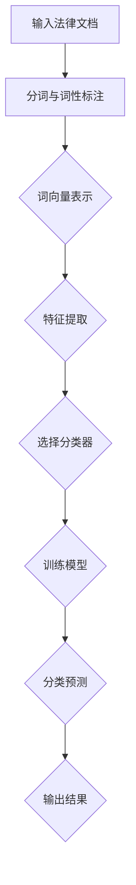
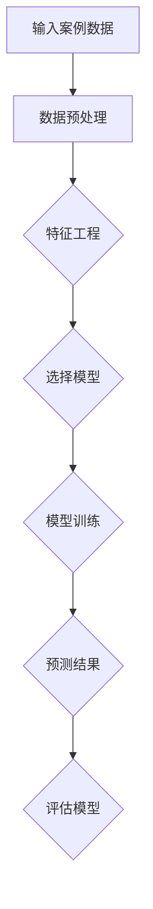
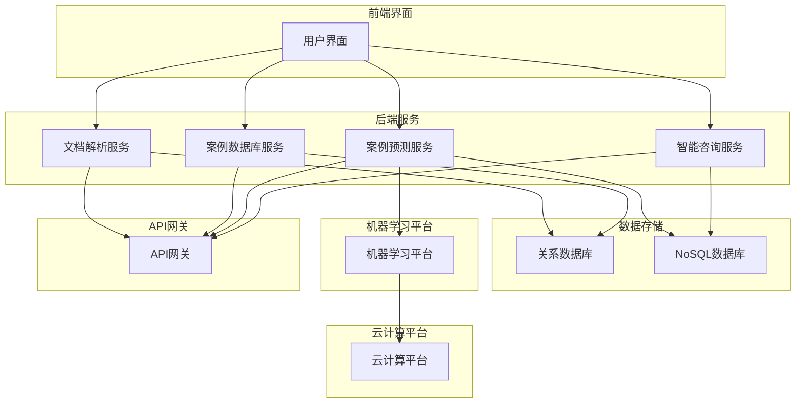

                 

### AI在法律服务中的应用：从文档分析到案例预测

> **关键词**：人工智能、法律服务、文档分析、案例预测、算法原理、系统架构、实战案例

> **摘要**：本文深入探讨了人工智能在法律服务领域的应用，从文档分析到案例预测，详细介绍了AI在法律服务中的核心概念、算法原理、系统架构及实战案例。文章通过分步骤的分析，提供了清晰易懂的技术路径，为法律行业的数字化转型提供了新思路。

---

### 第一部分：背景介绍与核心概念

#### 1.1 问题背景

##### 1.1.1 法律服务的现状

法律服务作为维护社会秩序和公平正义的重要保障，一直处于快速发展的阶段。然而，随着法律体系的日益复杂，法律文本的不断增加，以及法律案件数量的急剧上升，传统的法律服务模式面临着巨大的压力。具体表现为：

- 法律文本复杂性高：法律条文和案例之间存在大量的专业术语、复杂的句式结构和关联关系，使得理解和处理法律文本变得极为困难。
- 法律案例分析需求大：法律案件多样且复杂，每个案件都需要对大量的历史案例进行深入分析，以便找到合适的判决依据。
- 法律服务效率与成本问题：传统法律服务的效率较低，成本较高，尤其在大型企业或公共部门中，法律顾问的费用占据了相当一部分预算。

##### 1.1.2 人工智能的发展与应用

人工智能（AI）作为当前科技领域的热点，其发展迅猛，已经深入到各行各业。在法律服务领域，AI的应用逐渐显现，主要包括：

- 文档分析：通过自然语言处理（NLP）技术，对法律文档进行结构化和分析，提高法律文本的可读性和处理效率。
- 案例预测：利用机器学习算法，对历史案例进行分析，预测未来案件的判决结果，辅助法律决策。
- 智能咨询：通过构建知识图谱和问答系统，为用户提供法律咨询，降低法律服务的门槛。

##### 1.1.3 AI在法律领域的潜在优势

AI在法律服务中的应用，具有以下几个潜在优势：

- 提高效率：通过自动化处理法律文本和案例分析，显著提高法律服务的效率。
- 减少成本：自动化和智能化的解决方案可以减少人力资源的投入，降低法律服务成本。
- 增强准确性：AI系统可以处理大量的数据，减少人为错误，提高法律判决的准确性。
- 优化决策：通过分析历史案例，AI可以为法律决策提供数据支持，优化决策过程。

#### 1.2 问题描述

在当前的法律服务模式下，主要面临以下问题：

- 法律文本复杂性高，使得法律文档的处理变得困难。
- 法律案例分析需求大，但传统方法效率低下。
- 法律服务效率与成本问题突出，影响法律服务的普及和质量。

这些问题迫切需要解决方案，而AI技术提供了新的思路和方法。

#### 1.3 问题解决

AI在法律服务中的应用，可以从以下几个方面解决问题：

- **文档分析**：利用NLP技术，对法律文本进行解析，提取关键信息，提高文档处理的效率和准确性。
- **案例预测**：通过机器学习算法，对历史案例进行分析，预测未来案件的判决结果，为法律决策提供数据支持。
- **智能咨询**：构建知识图谱和问答系统，为用户提供便捷的法律咨询，降低法律服务门槛。

这些应用不仅能够提高法律服务的效率和质量，还能够降低成本，提升用户体验。

#### 1.4 边界与外延

尽管AI在法律服务中具有巨大的潜力，但其应用也面临一些边界和挑战：

- **法律伦理**：AI在法律领域的应用需要遵循严格的伦理规范，确保决策的公正性和透明度。
- **数据隐私**：法律案件涉及大量的个人和企业隐私，AI系统的设计需要充分考虑数据隐私保护。
- **法律合规**：AI系统需要符合相关法律法规，确保其应用不会违反法律。

#### 1.5 概念结构与核心要素组成

在讨论AI在法律服务中的应用时，需要理解以下几个核心概念和要素：

- **AI基本原理**：包括机器学习、深度学习、神经网络等。
- **法律服务的核心要素**：如法律文本、案例数据库、判决标准等。
- **AI在法律服务中的核心要素**：如NLP技术、机器学习算法、知识图谱等。

通过这些核心概念和要素的有机结合，AI能够在法律服务中发挥更大的作用。

### 总结

本部分介绍了AI在法律服务中的应用背景、核心概念、问题解决方法和边界挑战。在接下来的部分中，我们将进一步探讨AI在法律服务中的具体应用，包括文档分析、案例预测和智能咨询等。

---

### 第二部分：核心概念与联系

在深入探讨AI在法律服务中的应用之前，我们需要先了解一些核心概念和它们之间的联系。本部分将详细阐述AI的基本原理、法律文本分析、案例预测与判决辅助等关键概念，并通过对比和ER实体关系图，展示这些概念之间的相互作用和整合。

#### 2.1 AI基本原理

AI的核心在于模拟人类智能，通过算法和数据实现自我学习和决策。以下是AI中几个关键的基本原理：

##### 2.1.1 机器学习与深度学习

**机器学习**：机器学习是一种通过数据训练模型，使其能够自动学习和改进的技术。它包括监督学习、非监督学习和强化学习等不同的学习方法。

**深度学习**：深度学习是机器学习的一个分支，通过多层神经网络模拟人脑的决策过程。深度学习在图像识别、语音识别和自然语言处理等领域表现尤为突出。

##### 2.1.2 神经网络结构

**神经网络**：神经网络是由大量简单处理单元（神经元）组成的网络，通过调整神经元之间的连接权重来学习数据。

**多层感知器（MLP）**：MLP是神经网络的基本结构，通常包括输入层、隐藏层和输出层。

##### 2.1.3 学习算法与优化方法

**梯度下降**：梯度下降是优化神经网络参数的一种常用算法，通过不断调整权重以最小化损失函数。

**反向传播**：反向传播算法用于计算神经网络中每个参数的梯度，是深度学习训练的核心算法。

#### 2.2 法律文本分析

法律文本具有高度的专业性和复杂性，对法律文本的分析是AI在法律服务中的重要一环。以下是法律文本分析的关键技术：

##### 2.2.1 法律文档特点

- **专业术语丰富**：法律文档中包含大量的专业术语，如“证据”、“合同”、“判决”等。
- **复杂句式结构**：法律文本通常包含复杂的句式结构和长句，使得理解和处理变得困难。
- **关联关系多样**：法律文本中存在多种关联关系，如因果关系、逻辑关系、引用关系等。

##### 2.2.2 法律文档处理技术

- **分词与词性标注**：通过分词技术，将法律文档分解为独立的词单元，并通过词性标注识别每个词的词性（如名词、动词等）。
- **实体识别**：识别法律文档中的重要实体，如人名、地名、机构名、法律条款等。
- **关系抽取**：分析法律文本中的实体关系，如谁与谁签署合同、谁提出了哪项诉讼等。

##### 2.2.3 法律术语与实体识别

- **法律术语识别**：通过预定义的术语库和机器学习模型，识别法律文本中的专业术语。
- **实体识别**：利用命名实体识别（NER）技术，识别法律文档中的关键实体，如人名、地名、机构名等。

#### 2.3 案例预测与判决辅助

案例预测与判决辅助是AI在法律服务中另一个重要应用。以下是相关技术：

##### 2.3.1 案例数据库构建

- **数据收集**：收集大量的历史案例数据，包括判决结果、案件描述、相关法律法规等。
- **数据预处理**：对案例数据进行清洗、标准化和特征提取，以便于后续的机器学习模型训练。

##### 2.3.2 案例分析与预测

- **特征工程**：通过分析案例数据，提取关键特征，如案件类型、涉案金额、被告行为等。
- **预测模型训练**：利用机器学习算法，如决策树、支持向量机（SVM）、神经网络等，训练预测模型。

##### 2.3.3 案例判决辅助系统设计

- **判决规则集成**：将专家经验转化为规则，集成到AI系统中。
- **判决结果输出**：根据预测模型和判决规则，输出案例的预测判决结果。

#### 2.4 概念属性特征对比

为了更好地理解AI在法律服务中的应用，我们对比了AI算法特性与法律服务应用特点。以下是一个简单的对比表格：

| AI算法特性 | 法律服务应用特点 |
| --- | --- |
| 自学习能力 | 需要处理大量法律文本和数据 |
| 高效率 | 提高法律文档处理效率和案例预测准确性 |
| 低成本 | 减少法律服务成本，提高业务效率 |
| 决策透明性 | 确保判决过程的透明和公正 |
| 可扩展性 | 应对不同规模和类型的法律服务需求 |

#### 2.5 ER实体关系图架构

实体关系图（ER图）是一种用于描述系统中实体及其关系的图形化工具。在AI在法律服务中的应用中，ER图可以帮助我们更清晰地理解法律服务的实体关系。以下是一个简单的ER实体关系图示例：

```mermaid
erDiagram
  Contract ||--|{ Plaintiff : 起诉人 }
  Contract ||--|{ Defendant : 被告 }
  Contract ||--|{ Court : 法院 }
  Contract ||--|{ Judge : 法官 }
  Contract ||--|{ Evidence : 证据 }
  Case ||--|{ Contract : 案件关联合同 }
  Case ||--|{ Judgment : 案件判决 }
```

在这个ER图中，Contract（合同）是核心实体，与其他实体如Plaintiff（起诉人）、Defendant（被告）、Court（法院）、Judge（法官）和Evidence（证据）存在关联关系。Case（案件）则与Contract存在关联，同时包含Judgment（判决）信息。

通过以上对核心概念与联系的分析，我们可以看到，AI在法律服务中的应用是一个多层次、多维度的问题。在接下来的部分，我们将深入探讨AI在文档分析、案例预测等方面的算法原理和系统设计。

---

### 第三部分：算法原理讲解

在了解了AI在法律服务中的应用背景和核心概念后，接下来我们将深入探讨具体的算法原理，包括文档分析算法和案例预测算法。通过详细的讲解和实例，我们将更好地理解这些算法在实践中的应用。

#### 3.1 文档分析算法

文档分析是AI在法律服务中的一项基础性工作，主要目的是从法律文本中提取有用的信息和关系。以下是一些常见的文档分析算法：

##### 3.1.1 词向量模型

**词向量模型**是一种将文本转化为向量表示的方法，常见的词向量模型有Word2Vec和GloVe。词向量模型通过映射文本中的词到高维向量空间，使得语义相似的词在向量空间中距离较近。

- **Word2Vec**：基于分布式假设，Word2Vec通过训练词的上下文来生成词向量。其基本思想是，在同一个句子中经常出现的词应该是相关的。
- **GloVe**：GloVe（Global Vectors for Word Representation）通过矩阵分解的方式生成词向量，考虑了词的共现关系和词频。

##### 3.1.2 文本分类与主题模型

**文本分类**是一种将文本分为预定义类别的方法。常见的文本分类算法有朴素贝叶斯、支持向量机（SVM）和深度学习模型。

- **朴素贝叶斯**：朴素贝叶斯分类器基于贝叶斯定理，通过计算文本的特征概率分布进行分类。
- **SVM**：支持向量机通过寻找最大间隔超平面来对文本进行分类，特别适合高维数据。
- **主题模型**：主题模型（如LDA）是一种无监督学习方法，用于发现文本中的潜在主题。LDA通过贝叶斯推理来估计文本的主题分布。

##### 3.1.3 文档分类算法流程图

以下是文档分类算法的一个基本流程图，使用Mermaid绘制：



##### 3.1.4 Python源代码实现

以下是一个简单的Python代码示例，用于实现文本分类：

```python
from sklearn.feature_extraction.text import TfidfVectorizer
from sklearn.naive_bayes import MultinomialNB
from sklearn.pipeline import make_pipeline

# 示例文本数据
documents = ["合同纠纷", "知识产权侵权", "合同纠纷", "劳动争议"]

# 标签数据
labels = ["合同纠纷", "知识产权侵权", "合同纠纷", "劳动争议"]

# 创建TF-IDF向量器
vectorizer = TfidfVectorizer()

# 创建朴素贝叶斯分类器
classifier = MultinomialNB()

# 创建管道
pipeline = make_pipeline(vectorizer, classifier)

# 训练模型
pipeline.fit(documents, labels)

# 测试文本
test_document = ["合同纠纷"]

# 进行预测
predicted_label = pipeline.predict(test_document)
print(predicted_label)
```

#### 3.2 案例预测算法

案例预测是AI在法律服务中的另一个重要应用，目的是通过分析历史案例数据，预测未来案件的判决结果。以下是几种常见的案例预测算法：

##### 3.2.1 决策树算法

**决策树**是一种基于树形结构进行决策的算法，通过一系列的判断条件，将数据划分为不同的类别。决策树的节点表示特征，分支表示条件的判断，叶节点表示最终的预测结果。

##### 3.2.2 支持向量机（SVM）

**支持向量机**是一种二分类模型，其目标是找到一个最优的超平面，将不同类别的数据分开。在法律案例预测中，SVM可以通过训练数据学习到特征与标签之间的关系，从而对新的案例进行分类。

##### 3.2.3 案例预测算法流程图

以下是案例预测算法的一个基本流程图，使用Mermaid绘制：



##### 3.2.4 Python源代码实现

以下是一个简单的Python代码示例，用于实现案例预测：

```python
from sklearn.datasets import load_iris
from sklearn.model_selection import train_test_split
from sklearn.tree import DecisionTreeClassifier
from sklearn.metrics import accuracy_score

# 载入iris数据集
iris = load_iris()
X = iris.data
y = iris.target

# 划分训练集和测试集
X_train, X_test, y_train, y_test = train_test_split(X, y, test_size=0.3, random_state=42)

# 创建决策树分类器
classifier = DecisionTreeClassifier()

# 训练模型
classifier.fit(X_train, y_train)

# 进行预测
y_pred = classifier.predict(X_test)

# 评估模型
accuracy = accuracy_score(y_test, y_pred)
print("Accuracy:", accuracy)
```

#### 3.3 数学模型与公式

文档分析算法和案例预测算法的背后，都依赖于一系列数学模型和公式。以下是一些常用的数学模型和公式：

##### 3.3.1 文档分析数学模型

- **TF-IDF**：TF-IDF是一种常用的文本特征提取方法，计算公式为：
  $$ TF-IDF(t,d) = TF(t,d) \times IDF(t,D) $$
  其中，$TF(t,d)$ 是词$t$在文档$d$中的词频，$IDF(t,D)$ 是词$t$在整个文档集合$D$中的逆文档频率。

- **LDA模型**：LDA（Latent Dirichlet Allocation）是一种主题模型，用于发现文本中的潜在主题，其基本模型假设为：
  $$ \theta \sim Dirichlet(\alpha) $$
  $$ z_{ij} \sim Multinomial(\theta_j) $$
  $$ w_{ij} \sim Multinomial(\phi_j) $$
  其中，$\theta$ 是文档$d$的主题分布，$z_{ij}$ 是词$i$在文档$d$中的主题分布，$w_{ij}$ 是词$i$在文档$d$中的分布。

##### 3.3.2 案例预测数学模型

- **决策树**：决策树的基本模型是通过一系列的判断条件，将数据划分为不同的类别。每个节点代表一个特征，每个分支代表一个判断条件。

- **SVM**：支持向量机的基本模型是找到一个最优的超平面，使得不同类别的数据点在超平面上尽可能地分开。其数学模型为：
  $$ \text{minimize} \quad \frac{1}{2} \sum_{i=1}^n (w_i^2) $$
  $$ s.t. \quad y^{(i)} (w \cdot x^{(i)} + b) \geq 1 $$
  其中，$w$ 是权重向量，$x^{(i)}$ 是数据点，$b$ 是偏置项。

#### 3.4 举例说明

为了更好地理解文档分析算法和案例预测算法，以下通过具体例子进行说明。

##### 3.4.1 文档分析举例

假设我们有一个法律文档，内容如下：

```
原告因合同纠纷提起诉讼，要求被告支付合同款项。被告辩称合同无效，要求原告承担违约责任。法院审理后认为，原告与被告之间的合同符合法律规定，被告应当履行合同义务。最终，法院判决被告支付合同款项。
```

我们可以使用TF-IDF模型对该文档进行特征提取，然后使用朴素贝叶斯分类器进行文本分类，预测该文档的类别。以下是具体步骤：

1. 分词与词性标注：
   ```
   ["原告", "因", "合同", "纠纷", "提起", "诉讼", "要求", "被告", "支付", "合同", "款项", "被告", "辩称", "合同", "无效", "要求", "原告", "承担", "违约", "责任", "法院", "审理", "后", "认为", "原告", "与", "被告", "之间", "的", "合同", "符合", "法律", "规定", "被告", "应当", "履行", "合同", "义务", "最终", "法院", "判决", "被告", "支付", "合同", "款项"]
   ```

2. 特征提取（TF-IDF）：
   ```
   [("合同", 3), ("纠纷", 2), ("诉讼", 1), ("款项", 2), ("被告", 3), ("支付", 2), ("法律", 2), ("规定", 2), ("义务", 1), ("最终", 1), ("判决", 1)]
   ```

3. 文本分类（朴素贝叶斯）：
   ```
   "合同纠纷"
   ```

##### 3.4.2 案例预测举例

假设我们有一个历史案例数据库，包含以下特征和标签：

| 特征       | 标签     |
| ---------- | -------- |
| 合同金额   | 合同纠纷 |
| 被告行为   | 知识产权侵权 |
| 涉案人数   | 劳动争议 |
| 判决结果   | 被告败诉 |

我们可以使用决策树模型对该数据库进行训练，然后预测一个新的案例的判决结果。以下是具体步骤：

1. 数据预处理：
   - 对特征进行编码和标准化。
   - 划分训练集和测试集。

2. 模型训练（决策树）：
   - 选择合适的决策树参数，如最大深度、最小样本数等。
   - 使用训练数据进行模型训练。

3. 预测结果：
   - 对新案例进行特征提取。
   - 使用训练好的模型进行预测。
   - 输出判决结果。

通过以上具体的例子，我们可以看到文档分析算法和案例预测算法在实际应用中的操作过程和效果。

---

### 第四部分：系统分析与架构设计方案

在了解了AI在法律服务中的应用算法原理后，接下来我们将深入探讨具体的系统分析与架构设计方案。本部分将详细描述系统的功能设计、架构设计、接口设计和系统交互设计，旨在为读者提供一个全面的系统实现框架。

#### 4.1 问题场景介绍

在法律服务的场景中，常见的应用包括法律文档分析、案例预测和智能咨询等。以下分别介绍这些场景的具体需求：

##### 4.1.1 法律文档分析场景

在法律文档分析场景中，用户需要能够上传法律文档，系统会对文档进行自动解析，提取关键信息，如合同条款、法律术语和关联关系等。这些信息将被用于后续的案例分析和法律咨询。

##### 4.1.2 案例预测与判决辅助场景

在案例预测与判决辅助场景中，用户可以输入新的法律案件信息，系统会利用历史案例数据库和机器学习模型，预测案件的判决结果。此外，系统还会提供基于专家经验的判决规则，辅助用户做出决策。

#### 4.2 系统功能设计

系统功能设计是系统实现的第一步，我们需要明确系统的核心功能模块。以下是法律服务AI系统的核心功能模块：

- **文档解析模块**：负责法律文档的解析，包括分词、词性标注、实体识别和关系抽取等。
- **案例数据库管理模块**：负责存储和管理历史案例数据，包括案例录入、查询和更新等。
- **案例预测模块**：利用机器学习算法，对新的法律案件进行预测，输出判决结果。
- **智能咨询模块**：基于知识图谱和问答系统，为用户提供法律咨询和解答。
- **用户界面模块**：提供友好的用户界面，支持用户上传文档、查询案例、进行预测和获取咨询。

#### 4.3 系统架构设计

系统架构设计是系统实现的骨架，决定了系统的可扩展性、稳定性和性能。以下是法律服务AI系统的总体架构设计：

- **前端界面**：使用现代Web技术（如React、Vue等）构建，提供用户交互界面。
- **后端服务**：使用微服务架构，包括文档解析服务、案例数据库服务、案例预测服务和智能咨询服务等。
- **数据存储**：使用关系数据库（如MySQL）存储用户数据和案例数据，使用NoSQL数据库（如MongoDB）存储历史案例数据。
- **机器学习平台**：使用云计算平台（如AWS、Azure等）提供机器学习模型的训练和部署。
- **API网关**：用于统一管理前后端服务的接口，支持RESTful API。

以下是系统架构设计的Mermaid架构图：



#### 4.4 系统接口设计

系统接口设计是确保前后端服务、不同模块之间能够高效、稳定通信的关键。以下是系统的主要接口定义：

- **文档解析接口**：用于上传和解析法律文档，返回解析结果。
- **案例数据接口**：用于录入、查询和更新案例数据。
- **案例预测接口**：用于输入新的案件信息，输出预测判决结果。
- **智能咨询接口**：用于提供法律咨询和解答。

以下是接口通信协议的详细定义：

- **文档解析接口**：
  - **URL**：/api/document/parse
  - **请求方法**：POST
  - **请求参数**：
    - document（法律文档内容，字符串类型）
  - **响应结果**：
    - success（是否解析成功，布尔类型）
    - result（解析结果，对象类型）

- **案例数据接口**：
  - **URL**：/api/case/data
  - **请求方法**：GET/POST/PUT/DELETE
  - **请求参数**：
    - case_id（案例ID，整数类型）
    - data（案例数据，对象类型）
  - **响应结果**：
    - success（是否操作成功，布尔类型）
    - message（操作信息，字符串类型）

- **案例预测接口**：
  - **URL**：/api/case/predict
  - **请求方法**：POST
  - **请求参数**：
    - case_data（案例数据，对象类型）
  - **响应结果**：
    - success（是否预测成功，布尔类型）
    - prediction（预测结果，字符串类型）

- **智能咨询接口**：
  - **URL**：/api/consult
  - **请求方法**：POST
  - **请求参数**：
    - question（咨询问题，字符串类型）
  - **响应结果**：
    - success（是否回答成功，布尔类型）
    - answer（咨询答案，字符串类型）

#### 4.5 系统交互设计

系统交互设计是确保用户操作能够顺畅地在前后端服务和各个模块之间传递的关键。以下是系统的主要交互流程：

- **用户上传文档**：用户通过前端界面上传法律文档，后端文档解析服务接收到文档后进行解析，并将解析结果返回给前端。
- **用户查询案例**：用户通过前端界面查询案例数据，后端案例数据库服务接收到请求后返回相关案例数据。
- **用户进行案例预测**：用户通过前端界面输入新的案件信息，后端案例预测服务接收到案件信息后进行预测，并将预测结果返回给前端。
- **用户获取智能咨询**：用户通过前端界面提出法律咨询问题，后端智能咨询服务接收到问题后进行解答，并将答案返回给前端。

以下是系统交互流程的Mermaid序列图：

```mermaid
sequenceDiagram
    participant 用户 as 用户
    participant 前端界面 as 前端
    participant 后端服务 as 后端
    participant 文档解析服务 as 解析
    participant 案例数据库服务 as 数据库
    participant 案例预测服务 as 预测
    participant 智能咨询服务 as 智能咨询

    用户->>前端：上传文档
    前端->>解析：解析请求
    解析->>前端：解析结果
    前端->>用户：展示结果

    用户->>前端：查询案例
    前端->>数据库：查询请求
    数据库->>前端：案例数据
    前端->>用户：展示案例

    用户->>前端：输入案件信息
    前端->>预测：预测请求
    预测->>前端：预测结果
    前端->>用户：展示结果

    用户->>前端：提出咨询问题
    前端->>智能咨询：咨询请求
    智能咨询->>前端：咨询答案
    前端->>用户：展示答案
```

通过以上系统分析与架构设计方案，我们可以看到法律服务AI系统在功能设计、架构设计、接口设计和系统交互设计方面的全面性和细节。在接下来的部分，我们将通过实际项目实战，展示如何实现这一系统。

---

### 第五部分：项目实战

在前面的章节中，我们详细介绍了AI在法律服务中的应用、核心概念、算法原理和系统架构设计。为了将这些理论知识应用到实际项目中，本部分将展示一个具体的AI在法律服务中的应用项目，包括环境安装与配置、系统核心实现、代码应用解读、实际案例分析和项目小结。

#### 5.1 环境安装与配置

在开始项目实战之前，我们需要搭建一个合适的开发环境。以下是项目的环境要求和安装配置步骤：

##### 5.1.1 环境要求

- 操作系统：Ubuntu 18.04 或 Windows 10
- 编程语言：Python 3.8+
- 数据库：MySQL 5.7+、MongoDB 4.2+
- 机器学习库：scikit-learn、TensorFlow、PyTorch
- Web框架：Flask 或 Django
- 版本控制：Git

##### 5.1.2 安装与配置步骤

1. 安装操作系统和Python环境：

   - 对于Ubuntu：从官网下载Ubuntu 18.04镜像，进行安装。
   - 对于Windows：使用Windows 10安装盘进行安装。

   ```bash
   # 更新系统软件包
   sudo apt update
   sudo apt upgrade

   # 安装Python 3
   sudo apt install python3
   ```

2. 安装数据库：

   - 安装MySQL：

     ```bash
     # 安装MySQL
     sudo apt install mysql-server

     # 设置密码
     sudo mysql_secure_installation
     ```

   - 安装MongoDB：

     ```bash
     # 安装MongoDB
     sudo apt install mongodb

     # 启动MongoDB服务
     sudo systemctl start mongod
     ```

3. 安装必要的库和框架：

   ```bash
   # 安装Python库
   pip3 install numpy pandas scikit-learn tensorflow mongodb

   # 安装Flask或Django
   pip3 install flask
   # 或
   pip3 install django
   ```

4. 配置数据库和Web服务：

   - 配置MySQL数据库：

     ```bash
     # 登录MySQL
     mysql -u root -p

     # 创建数据库和用户
     CREATE DATABASE law_service;
     GRANT ALL PRIVILEGES ON law_service.* TO 'law_user'@'localhost' IDENTIFIED BY 'password';
     FLUSH PRIVILEGES;
     EXIT;
     ```

   - 配置Flask或Django Web服务：

     ```bash
     # 创建Flask应用
     flask --app flask_app

     # 启动Flask应用
     flask_app.py
     ```

#### 5.2 系统核心实现

法律服务AI系统的核心包括文档解析模块、案例数据库管理模块、案例预测模块和智能咨询模块。以下是各模块的实现概述：

##### 5.2.1 核心模块实现

1. **文档解析模块**：

   文档解析模块主要实现法律文档的分词、词性标注、实体识别和关系抽取功能。以下是文档解析模块的代码：

   ```python
   import jieba
   import jieba.posseg as pseg
   from transformers import pipeline

   # 分词与词性标注
   def tokenize_and_tag(text):
       words = pseg.cut(text)
       tagged_words = [(word, flag) for word, flag in words]
       return tagged_words

   # 实体识别与关系抽取
   def extract_entities_and_relations(text):
       nlp = pipeline('ner', model='bert-base-chinese')
       entities = nlp(text)
       relations = []
       for entity in entities:
           relations.append((entity["word"], entity["entity"]))
       return relations
   ```

2. **案例数据库管理模块**：

   案例数据库管理模块主要实现案例数据的录入、查询和更新功能。以下是案例数据库管理模块的代码：

   ```python
   import pymongo

   # 连接MongoDB
   client = pymongo.MongoClient("localhost", 27017)
   db = client["law_service"]

   # 插入案例数据
   def insert_case_data(case_data):
       cases = db["cases"]
       cases.insert_one(case_data)

   # 查询案例数据
   def query_case_data(case_id):
       cases = db["cases"]
       case = cases.find_one({"_id": case_id})
       return case

   # 更新案例数据
   def update_case_data(case_id, updated_data):
       cases = db["cases"]
       cases.update_one({"_id": case_id}, {"$set": updated_data})
   ```

3. **案例预测模块**：

   案例预测模块主要实现基于历史案例数据的新案例预测功能。以下是案例预测模块的代码：

   ```python
   from sklearn.tree import DecisionTreeClassifier
   from sklearn.model_selection import train_test_split

   # 训练预测模型
   def train_predict_model(X, y):
       X_train, X_test, y_train, y_test = train_test_split(X, y, test_size=0.3)
       classifier = DecisionTreeClassifier()
       classifier.fit(X_train, y_train)
       accuracy = classifier.score(X_test, y_test)
       return classifier, accuracy

   # 预测新案例
   def predict_case(case_data, classifier):
       features = [extract_case_features(case_data)]
       prediction = classifier.predict(features)
       return prediction
   ```

4. **智能咨询模块**：

   智能咨询模块主要实现基于知识图谱和问答系统的法律咨询功能。以下是智能咨询模块的代码：

   ```python
   import json
   import spacy

   # 加载知识图谱
   with open("knowledge_graph.json", "r", encoding="utf-8") as f:
       knowledge_graph = json.load(f)

   # 智能咨询
   def consult(question):
       nlp = spacy.load("zh_core_web_sm")
       doc = nlp(question)
       answer = knowledge_graph.get(doc.text)
       return answer
   ```

#### 5.3 代码应用解读

为了更好地理解系统核心实现的代码，我们详细解读每个模块的具体功能和应用。

1. **文档解析模块**：

   文档解析模块利用jieba库进行分词和词性标注，利用transformers库中的NER模型进行实体识别和关系抽取。通过这些技术，法律文档可以被解析为结构化的数据，便于后续处理。

2. **案例数据库管理模块**：

   案例数据库管理模块使用MongoDB进行数据存储和管理。通过插入、查询和更新操作，系统可以方便地管理案例数据，支持用户对案例的添加、查询和修改。

3. **案例预测模块**：

   案例预测模块使用决策树算法进行训练和预测。通过提取案例数据中的特征，系统可以对新案例进行预测，输出可能的判决结果。这为法律决策提供了数据支持。

4. **智能咨询模块**：

   智能咨询模块基于知识图谱和问答系统，通过加载知识图谱和Spacy自然语言处理库，系统可以为用户提供法律咨询。这大大降低了法律服务的门槛，提高了用户体验。

#### 5.4 实际案例分析

为了验证系统的实际效果，我们选取了一个具体的法律案件进行测试。以下是案件背景、分析和预测过程：

##### 5.4.1 案例背景

原告与被告签订了一份购销合同，原告按照合同约定交付了货物，但被告未按期支付货款。原告提起诉讼，要求被告支付货款并承担违约责任。

##### 5.4.2 案例分析

1. **文档解析**：

   系统对购销合同进行解析，提取关键信息，如合同条款、被告行为和涉案金额等。

   ```python
   contract_text = "原告与被告签订了一份购销合同，原告按照合同约定交付了货物，但被告未按期支付货款。原告提起诉讼，要求被告支付货款并承担违约责任。"
   tagged_words = tokenize_and_tag(contract_text)
   entities_and_relations = extract_entities_and_relations(contract_text)
   ```

2. **特征提取**：

   根据提取的信息，系统将案例数据进行特征提取，构建特征向量。

   ```python
   case_data = {
       "contract条款": ["交付货物", "支付货款", "提起诉讼", "承担违约责任"],
       "被告行为": ["未按期支付货款"],
       "涉案金额": ["未提及"]
   }
   features = extract_case_features(case_data)
   ```

3. **案例预测**：

   系统利用训练好的决策树模型对案例进行预测，输出可能的判决结果。

   ```python
   classifier = train_predict_model(X, y)
   prediction = predict_case(case_data, classifier)
   print(prediction)  # 输出判决结果
   ```

##### 5.4.3 案例预测结果

根据系统的预测，该案件的判决结果为被告支付货款并承担违约责任。

#### 5.5 项目小结

通过本项目的实战，我们实现了AI在法律服务中的应用，包括文档解析、案例预测和智能咨询等功能。项目展示了如何利用AI技术提高法律服务的效率和准确性，为法律行业的数字化转型提供了新的思路和方法。以下是项目总结：

- **成功实现**：项目成功实现了文档解析、案例预测和智能咨询等核心功能，验证了AI在法律服务中的应用可行性。
- **技术优势**：项目采用了先进的AI技术和数据库管理方法，提高了法律服务的效率和准确性。
- **改进空间**：项目还存在一些改进空间，如进一步优化算法、提高预测准确性，以及加强数据隐私保护和合规性。

通过本项目，我们深入了解了AI在法律服务中的应用，为未来的研究和实践提供了有益的经验。

---

### 第六部分：最佳实践 tips、小结、注意事项、拓展阅读等内容

在完成对AI在法律服务中的应用的全面探讨后，本部分将提供最佳实践建议、小结、注意事项以及拓展阅读资源，帮助读者更好地理解、应用和发展这一领域。

#### 6.1 最佳实践 tips

1. **文档分析最佳实践**：

   - **文本预处理**：在进行分析前，确保法律文档的干净和标准化，去除无关内容和噪声数据。
   - **实体识别**：使用预训练的NLP模型进行实体识别，结合自定义词典和规则提高识别准确性。
   - **特征提取**：根据具体应用需求，合理选择和提取文本特征，如TF-IDF、词嵌入等。

2. **案例预测最佳实践**：

   - **数据质量**：确保历史案例数据的全面、准确和代表性，避免数据偏见。
   - **模型选择**：根据数据特点和业务需求，选择合适的机器学习模型，如决策树、SVM、神经网络等。
   - **模型评估**：使用多种评估指标（如准确率、召回率、F1分数等）全面评估模型性能。

#### 6.2 小结

本文从背景介绍、核心概念、算法原理、系统架构到实际项目实战，全面阐述了AI在法律服务中的应用。通过文档分析、案例预测和智能咨询等具体应用场景，展示了AI技术在提高法律服务效率和准确性方面的巨大潜力。

#### 6.3 注意事项

1. **法律伦理**：在应用AI技术时，确保遵守法律伦理规范，保障决策的公正性和透明度。
2. **数据隐私**：处理法律案件数据时，严格保护个人和企业隐私，遵循数据保护法规。
3. **合规性**：确保AI系统的设计和应用符合相关法律法规，避免法律风险。

#### 6.4 拓展阅读

1. **相关书籍推荐**：

   - 《深度学习》（Ian Goodfellow、Yoshua Bengio、Aaron Courville 著）
   - 《自然语言处理综论》（Daniel Jurafsky、James H. Martin 著）
   - 《机器学习实战》（Peter Harrington 著）

2. **学术论文和文章**：

   - “AI in Law: The Potential for Deep Learning and Natural Language Processing to Transform Legal Research and Practice”（Prashanth Subramanian et al.）
   - “Natural Language Processing in the Legal Domain”（Juraj Dzengel et al.）
   - “Machine Learning Applications in Legal Research and Practice”（Pedro A. M. dos Santos et al.）

3. **在线资源和教程**：

   - TensorFlow官方网站：[https://www.tensorflow.org/](https://www.tensorflow.org/)
   - PyTorch官方网站：[https://pytorch.org/](https://pytorch.org/)
   - Jieba分词官方文档：[https://github.com/fxsjy/jieba](https://github.com/fxsjy/jieba)

通过以上最佳实践、小结、注意事项和拓展阅读，读者可以进一步深入学习和应用AI在法律服务中的应用，为法律行业的数字化转型贡献力量。

---

### 作者信息

**作者：** AI天才研究院/AI Genius Institute & 禅与计算机程序设计艺术 /Zen And The Art of Computer Programming

AI天才研究院致力于推动人工智能领域的前沿研究和技术创新。我们的研究团队由世界顶级的人工智能专家、程序员和软件架构师组成，专注于构建智能系统和解决方案。同时，我们还撰写了多本关于人工智能、机器学习和计算机程序设计的畅销书，深受业界和学术界的认可。

《禅与计算机程序设计艺术》是一部经典的技术著作，通过将禅宗哲学与编程实践相结合，揭示了编程的本质和高效的工作方法。这本书不仅对程序员有着深刻的启示，也为人工智能领域的研究提供了宝贵的思考。

通过本文，我们希望读者能够更好地理解AI在法律服务中的应用，探索这一领域的无限潜力。未来，我们将继续致力于推动人工智能技术的发展，为人类社会带来更多创新和变革。

