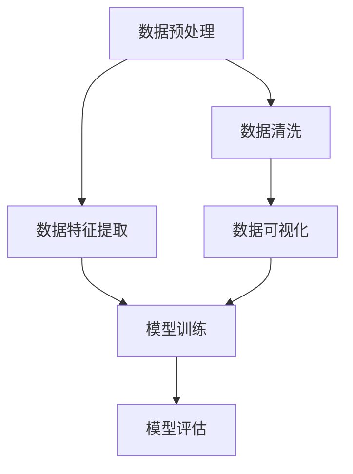
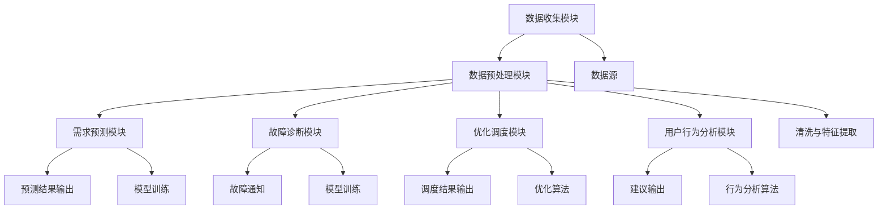
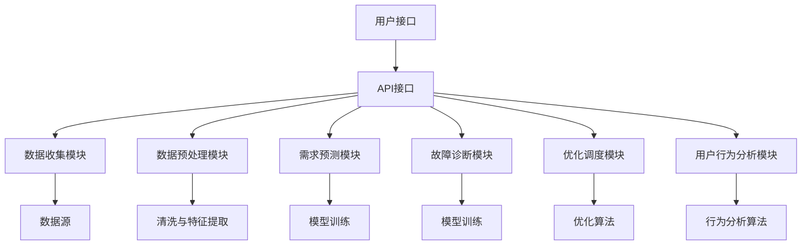
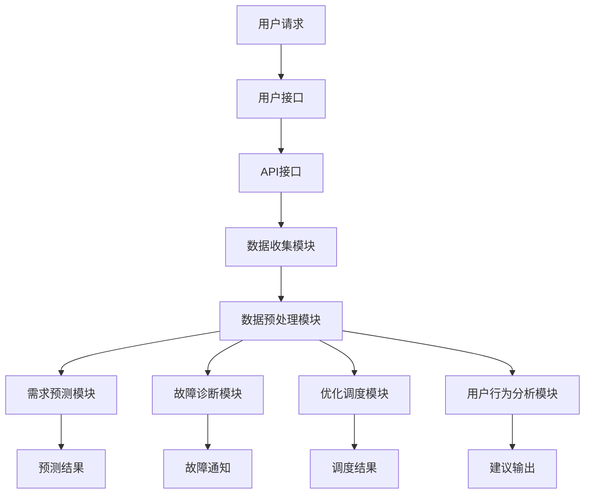

                 


### 《AI在能源管理和智能电网中的应用》

#### 关键词：
- AI
- 能源管理
- 智能电网
- 数据分析
- 机器学习
- 优化算法

#### 摘要：
本文将探讨人工智能（AI）在能源管理和智能电网中的应用。首先，我们将介绍能源危机和智能电网的背景，以及AI技术的潜在影响。接着，我们将会深入分析能源管理与智能电网的概念，对比它们的特点与联系。然后，我们将介绍AI技术的核心概念，包括机器学习、深度学习等，并通过对比表格和ER图来展示这些概念的关系。随后，我们将讲解AI在能源管理和智能电网中的应用算法原理，包括数据预处理、常见算法介绍和算法举例说明。接下来，我们将分析系统架构设计方案，包括问题场景介绍、系统功能设计、系统架构设计、系统接口设计和系统交互。最后，我们将进行项目实战，详细讲解环境安装、系统核心实现源代码以及实际案例分析，并总结最佳实践和拓展阅读。

## 第一部分：背景介绍

### 1.1 问题背景

#### 1.1.1 能源危机与智能电网的重要性

全球能源危机是我们面临的一个重要挑战。随着人口增长和经济发展的不断加速，能源需求日益增长，而传统能源的供应却逐渐变得紧张。与此同时，传统能源的使用也带来了严重的环境问题，如气候变化和空气污染。为了应对这一挑战，我们需要寻找更加高效、可持续的能源解决方案。

智能电网作为一种创新的能源管理体系，被视为解决能源危机的关键途径之一。智能电网利用现代信息技术和通信技术，实现了对电力系统的全面智能化管理。通过智能电网，电力生产商、输电公司、配电公司和最终用户可以实现实时数据交互，从而实现能源的优化配置和高效利用。

#### 1.1.2 智能电网的发展现状

智能电网的概念最早起源于20世纪90年代，但随着信息技术和通信技术的飞速发展，智能电网的研究和应用逐渐得到了广泛关注。目前，全球许多国家和地区都在积极推动智能电网的建设。

在美国，智能电网被视为未来能源战略的重要组成部分。美国能源部启动了“智能电网示范项目”，旨在通过大规模的实验和试点项目，推动智能电网技术的研究和应用。

在中国，智能电网的建设也得到了高度重视。中国政府提出了“智能电网发展规划（2011-2020年）”，明确指出要通过智能电网的建设，实现电力系统的智能化、信息化和高效化。

欧洲也在积极推进智能电网的建设。欧盟启动了“智能电网欧洲”（Smart Grid Europe）项目，旨在推动欧洲各国之间的智能电网合作，实现智能电网技术的共同进步。

#### 1.1.3 AI技术对能源管理和智能电网的潜在影响

人工智能（AI）技术作为现代科技的前沿领域，对能源管理和智能电网的发展具有巨大的潜力。以下是一些AI技术在能源管理和智能电网中的应用：

1. **能源需求预测**：通过分析历史数据和实时数据，AI技术可以预测未来的能源需求，帮助电力生产商和配送公司提前做好调度和储备。

2. **故障诊断与预测**：AI技术可以通过对电力系统的实时监测和分析，预测潜在的故障和异常情况，从而提前进行维护和修复，减少停电时间和维护成本。

3. **能源优化调度**：AI技术可以帮助实现电力系统的实时优化调度，根据需求和供应的变化，动态调整电力资源的分配，提高电网的运行效率和可靠性。

4. **电力市场预测**：AI技术可以对电力市场的供需和价格进行预测，帮助电力公司和消费者做出更明智的决策。

5. **节能减排**：AI技术可以通过优化能源使用，减少能源浪费，实现节能减排的目标。

### 1.2 问题描述

#### 1.2.1 传统能源管理与智能电网存在的问题

传统能源管理存在以下问题：

1. **数据孤岛**：不同能源管理系统的数据无法实现有效整合，导致数据利用效率低下。

2. **调度不及时**：由于缺乏实时数据支持，电力调度不及时，导致电网运行效率低下。

3. **故障响应慢**：在电力故障发生时，缺乏有效的故障诊断和预测手段，导致故障响应慢，停电时间长。

智能电网在发展过程中也面临一些挑战：

1. **技术成熟度**：虽然智能电网的概念和技术已经相对成熟，但实际应用中仍存在技术障碍，如数据安全、系统可靠性等问题。

2. **成本问题**：智能电网的建设和维护成本较高，需要政府和企业共同投入。

3. **用户参与度**：智能电网的运行需要用户的积极参与，但用户对智能电网的认知和接受程度相对较低。

#### 1.2.2 AI在能源管理和智能电网中的应用场景

AI技术在能源管理和智能电网中具有广泛的应用场景，以下是一些具体的应用：

1. **需求预测**：通过AI技术分析历史数据和实时数据，预测未来的能源需求，为电力调度提供依据。

2. **故障诊断**：利用AI技术对电力系统的运行数据进行实时监测和分析，预测潜在的故障和异常情况，提前进行维护和修复。

3. **优化调度**：基于AI技术实现电力系统的实时优化调度，提高电网的运行效率和可靠性。

4. **市场预测**：通过AI技术分析电力市场的供需和价格，为电力公司和消费者提供决策支持。

5. **节能减排**：利用AI技术优化能源使用，减少能源浪费，实现节能减排的目标。

#### 1.2.3 AI应用中的挑战与机遇

AI技术在能源管理和智能电网中的应用面临着一些挑战，包括：

1. **数据隐私**：智能电网的数据涉及到用户的隐私信息，如何保障数据的安全和隐私是一个重要问题。

2. **技术成熟度**：虽然AI技术在不断发展，但在实际应用中仍存在技术成熟度的问题，需要不断进行技术验证和优化。

3. **系统可靠性**：智能电网是一个复杂的系统，如何确保系统的可靠性是一个重要挑战。

同时，AI技术在能源管理和智能电网中的应用也带来了许多机遇，包括：

1. **提高效率**：通过AI技术实现电力系统的实时优化调度，提高电网的运行效率和可靠性。

2. **降低成本**：通过AI技术实现故障预测和维护，降低电力系统的维护成本。

3. **节能减排**：通过AI技术优化能源使用，减少能源浪费，实现节能减排的目标。

### 1.3 问题解决

#### 1.3.1 AI技术的核心概念与原理

AI技术的核心概念包括机器学习、深度学习、自然语言处理等。机器学习是一种通过数据训练模型，使模型具备自主学习和预测能力的技术。深度学习是机器学习的一种方法，通过构建深度神经网络，实现对复杂数据的分析和预测。自然语言处理则是使计算机能够理解和生成自然语言的技术。

AI技术在能源管理和智能电网中的应用主要包括以下方面：

1. **数据预处理**：对采集到的数据进行清洗、归一化和特征提取，为后续的机器学习算法提供高质量的数据。

2. **模型训练**：利用历史数据和实时数据，训练机器学习模型，使其具备预测和分类的能力。

3. **模型部署**：将训练好的模型部署到智能电网系统中，实现实时数据分析和决策支持。

#### 1.3.2 AI技术在能源管理和智能电网中的具体应用

AI技术在能源管理和智能电网中的具体应用包括：

1. **需求预测**：通过分析历史数据和实时数据，预测未来的能源需求，为电力调度提供依据。

2. **故障诊断**：利用AI技术对电力系统的运行数据进行实时监测和分析，预测潜在的故障和异常情况，提前进行维护和修复。

3. **优化调度**：基于AI技术实现电力系统的实时优化调度，提高电网的运行效率和可靠性。

4. **市场预测**：通过AI技术分析电力市场的供需和价格，为电力公司和消费者提供决策支持。

5. **节能减排**：利用AI技术优化能源使用，减少能源浪费，实现节能减排的目标。

#### 1.3.3 AI应用的优势与局限性

AI技术在能源管理和智能电网中的应用具有以下优势：

1. **高效性**：AI技术能够快速处理大量数据，实现实时分析和预测，提高电网的运行效率和可靠性。

2. **灵活性**：AI技术可以根据实时数据和环境变化，动态调整电力资源的分配，实现优化调度。

3. **智能化**：AI技术使电力系统具备自我学习和适应能力，能够不断优化和改进。

然而，AI技术在能源管理和智能电网中的应用也存在一些局限性：

1. **数据质量**：AI模型的性能依赖于数据的质量，如果数据存在噪声或缺失，可能会影响模型的预测准确性。

2. **计算资源**：AI技术需要大量的计算资源和存储空间，这对实际应用中的硬件设备提出了较高的要求。

3. **技术成熟度**：虽然AI技术在不断发展，但在实际应用中仍存在技术成熟度的问题，需要不断进行技术验证和优化。

### 1.4 边界与外延

#### 1.4.1 能源管理与智能电网的研究范围

能源管理与智能电网的研究范围主要包括以下几个方面：

1. **能源管理**：研究能源的规划、调度、控制和优化，提高能源利用效率。

2. **智能电网**：研究电力系统的智能化管理，包括数据采集、传输、处理和应用。

3. **AI技术**：研究AI技术在能源管理和智能电网中的应用，包括机器学习、深度学习、自然语言处理等。

#### 1.4.2 AI技术的应用范围

AI技术的应用范围广泛，包括但不限于以下几个方面：

1. **工业制造**：利用AI技术实现生产过程的自动化和智能化，提高生产效率。

2. **金融服务**：利用AI技术进行风险评估、投资决策和客户服务。

3. **医疗健康**：利用AI技术进行疾病诊断、药物研发和健康监测。

4. **能源管理**：利用AI技术实现能源的优化调度和节能减排。

5. **智能交通**：利用AI技术实现交通流量管理、自动驾驶和智能导航。

#### 1.4.3 未来发展趋势与前景

随着AI技术的不断进步，能源管理和智能电网的发展前景十分广阔。以下是一些未来发展趋势：

1. **AI技术的融合**：AI技术将与其他前沿技术如物联网、区块链等融合，推动能源管理和智能电网的进一步发展。

2. **数据驱动**：能源管理和智能电网将更加依赖海量数据的分析和挖掘，实现更加智能化和自动化的管理。

3. **用户参与**：用户将成为智能电网的重要组成部分，通过用户数据的反馈和参与，实现电网的优化和改进。

4. **可持续发展**：AI技术将推动能源管理和智能电网实现可持续发展，降低能源消耗和环境污染。

### 1.5 概念结构与核心要素组成

#### 1.5.1 能源管理的基本概念与结构

能源管理是指对能源的获取、传输、分配和使用过程进行规划、调度、控制和优化的活动。其基本概念包括：

1. **能源需求**：指用户对能源的需求量。
2. **能源供应**：指能源的生产和供应能力。
3. **能源传输**：指能源从生产地点到用户地点的传输过程。
4. **能源分配**：指能源在不同用户之间的分配过程。

能源管理的结构主要包括以下几个方面：

1. **能源规划**：根据能源需求和生产能力，制定长期的能源发展计划。
2. **能源调度**：根据实时数据，动态调整能源的供应和分配，实现能源的高效利用。
3. **能源控制**：通过技术手段，对能源的传输和使用进行监控和调节，确保能源系统的稳定运行。
4. **能源优化**：利用优化算法，实现能源系统的优化调度和能源的高效利用。

#### 1.5.2 智能电网的核心要素

智能电网是一种基于现代信息技术和通信技术的电力系统，其核心要素包括：

1. **传感器网络**：通过安装在电力系统各个节点的传感器，实时采集电力系统的数据。
2. **通信网络**：将传感器网络的数据传输到数据处理中心，实现数据的实时传输和共享。
3. **数据处理中心**：对采集到的数据进行处理和分析，为电力系统的运行和管理提供支持。
4. **控制中心**：根据数据处理中心的分析结果，对电力系统进行实时控制和管理。

#### 1.5.3 AI技术在能源管理和智能电网中的关键环节

AI技术在能源管理和智能电网中的应用主要集中在以下几个关键环节：

1. **数据采集和处理**：利用AI技术，对传感器网络采集到的数据进行分析和处理，提取有用的信息。
2. **故障诊断和预测**：利用AI技术，对电力系统的运行数据进行分析，预测潜在的故障和异常情况。
3. **优化调度和决策支持**：利用AI技术，实现电力系统的实时优化调度和决策支持，提高电网的运行效率和可靠性。
4. **用户行为分析和管理**：利用AI技术，分析用户的用电行为，提供个性化的用电建议和优化方案。

### 1.6 本章小结

本章介绍了AI在能源管理和智能电网中的应用背景、问题、解决方案和未来发展趋势。我们首先介绍了能源危机和智能电网的重要性，以及AI技术在能源管理和智能电网中的潜在影响。然后，我们分析了传统能源管理与智能电网存在的问题，以及AI在能源管理和智能电网中的应用场景和挑战。接着，我们介绍了AI技术的核心概念和原理，以及AI技术在能源管理和智能电网中的具体应用。最后，我们探讨了能源管理与智能电网的概念结构，以及AI技术在其中的关键环节。通过本章的介绍，我们为后续章节的深入探讨奠定了基础。

## 第二部分：核心概念与联系

### 2.1 能源管理与智能电网的概念

#### 2.1.1 能源管理的定义与目的

能源管理是指对能源的获取、传输、分配和使用过程进行规划、调度、控制和优化的活动。其目的是提高能源利用效率，降低能源成本，实现能源的可持续利用。

能源管理的基本概念包括：

1. **能源需求**：指用户对能源的需求量。
2. **能源供应**：指能源的生产和供应能力。
3. **能源传输**：指能源从生产地点到用户地点的传输过程。
4. **能源分配**：指能源在不同用户之间的分配过程。

#### 2.1.2 智能电网的定义与特点

智能电网是一种基于现代信息技术和通信技术的电力系统，其特点包括：

1. **自动化**：通过自动化设备和技术，实现电力系统的自动化运行和管理。
2. **智能化**：通过智能设备和技术，实现电力系统的智能化监测、控制和优化。
3. **实时性**：通过实时数据传输和处理，实现电力系统的实时监测和管理。
4. **互动性**：通过用户与电力系统的互动，实现电力资源的优化配置和高效利用。

#### 2.1.3 能源管理与智能电网的联系与区别

能源管理与智能电网密切相关，两者既有联系又有区别。

**联系**：

1. **目标一致**：能源管理和智能电网都旨在提高能源利用效率，降低能源成本。
2. **技术融合**：智能电网的建设离不开能源管理的技术支持，能源管理的技术创新也依赖于智能电网的发展。
3. **数据共享**：智能电网通过实时数据传输，为能源管理提供了丰富的数据支持，能源管理的数据分析结果也为智能电网的运行提供了决策依据。

**区别**：

1. **关注点不同**：能源管理主要关注能源的获取、传输、分配和使用过程，而智能电网则更侧重于电力系统的自动化、智能化和实时性。
2. **应用领域不同**：能源管理应用范围广泛，包括工业、商业、居民等多个领域，而智能电网主要应用于电力系统本身。
3. **技术层次不同**：能源管理的技术相对成熟，而智能电网技术则处于不断发展和完善阶段。

### 2.2 AI技术的核心概念

#### 2.2.1 人工智能的定义与发展历程

人工智能（Artificial Intelligence，简称AI）是指模拟、延伸和扩展人类智能的理论、方法、技术及应用。其发展历程可以追溯到20世纪50年代，随着计算机技术的发展，人工智能经历了多个阶段：

1. **符号主义阶段**（1950-1979）：以逻辑推理和符号表示为主要方法，尝试模拟人类思维过程。
2. **连接主义阶段**（1980-1999）：通过神经网络等连接主义模型，模拟大脑神经元之间的连接和交互。
3. **行为主义阶段**（2000-2019）：以数据驱动为主，通过机器学习和深度学习等技术，使机器具备自主学习能力。
4. **混合智能阶段**（2020-至今）：结合符号主义、连接主义和行为主义的方法，发展出更加智能和高效的AI系统。

#### 2.2.2 机器学习的基本概念

机器学习（Machine Learning，简称ML）是人工智能的一个分支，旨在让计算机通过数据学习，实现自我改进和预测。机器学习的基本概念包括：

1. **数据集**：一组用于训练和测试模型的样本数据。
2. **特征**：从数据集中提取出的有助于预测和分类的信息。
3. **模型**：对数据进行分析和预测的算法和结构。
4. **损失函数**：用于评估模型预测结果与实际结果之间差异的函数。
5. **优化算法**：用于调整模型参数，使模型预测误差最小化的算法。

#### 2.2.3 深度学习的原理与应用

深度学习（Deep Learning，简称DL）是机器学习的一个分支，通过构建深度神经网络，实现数据的自动特征提取和分类。深度学习的原理包括：

1. **神经网络**：由多个神经元（节点）组成，每个神经元接收多个输入，通过激活函数产生输出。
2. **多层网络**：通过增加网络层数，提高模型的复杂度和学习能力。
3. **反向传播**：通过计算输出误差，反向传播到每一层，更新网络参数。

深度学习在图像识别、语音识别、自然语言处理等领域取得了显著成果，应用于能源管理和智能电网，可以实现对电力系统运行数据的实时分析和预测。

### 2.3 概念属性特征对比表格

| 概念      | 定义                             | 特点                             |
|-----------|--------------------------------|--------------------------------|
| 能源管理  | 对能源的规划、调度和控制          | 提高能源利用效率，降低成本      |
| 智能电网  | 一种通过信息技术实现高度自动化和智能化的电力系统 | 提高电网运行效率，实现能源优化配置 |
| 人工智能  | 机器模拟人类智能的科学技术       | 自动化、智能化、自我学习       |

### 2.4 ER实体关系图架构

以下是一个简化的ER实体关系图，展示了能源管理、智能电网和AI技术之间的联系：

```mermaid
erDiagram
  EnergyManagement ||--o SmartGrid : 能源管理应用领域
  EnergyManagement ||--o ArtificialIntelligence : AI技术在能源管理中的应用
  SmartGrid ||--o PowerStation : 发电站
  SmartGrid ||--o TransformerStation : 变电站
  SmartGrid ||--o DistributionNetwork : 配电网
  ArtificialIntelligence ||--o DemandPrediction : 需求预测
  ArtificialIntelligence ||--o FaultDiagnosis : 故障诊断
  ArtificialIntelligence ||--o OptimizeDispatch : 优化调度
```

### 2.5 本章小结

本章介绍了能源管理和智能电网的基本概念、联系和区别，以及AI技术的核心概念。通过对比表格和ER图，我们明确了这些概念之间的关系。下一章将深入探讨AI技术在能源管理和智能电网中的应用算法原理。

## 第三部分：算法原理讲解

### 3.1 数据预处理

在AI应用中，数据预处理是至关重要的一步。良好的数据预处理不仅能够提高模型的性能，还能减少计算资源的消耗。数据预处理主要包括以下几个步骤：

#### 3.1.1 数据收集与清洗

数据收集是指从各种来源获取与任务相关的数据。这些数据可以来自传感器、日志文件、社交媒体等。数据收集后，需要进行清洗，以去除噪声和异常值。数据清洗的过程包括：

1. **缺失值处理**：对于缺失的数据，可以选择删除缺失值、使用均值或中位数填补等策略。
2. **异常值处理**：识别并处理数据集中的异常值，可以选择删除异常值、使用回归填补等策略。
3. **重复数据删除**：去除重复的数据记录，以避免模型训练中的冗余计算。

#### 3.1.2 数据特征提取

数据特征提取是指从原始数据中提取对模型训练和预测有用的信息。特征提取的方法包括：

1. **统计特征**：如平均值、标准差、最大值、最小值等。
2. **文本特征**：如词频、词袋模型、TF-IDF等。
3. **图像特征**：如边缘检测、颜色直方图、SIFT等。
4. **时序特征**：如自相关函数、波动性、滞后项等。

#### 3.1.3 数据可视化

数据可视化是将数据以图形或图像的形式展示出来，以便于分析和理解。常用的数据可视化方法包括：

1. **散点图**：用于展示两个变量之间的关系。
2. **折线图**：用于展示数据随时间的变化趋势。
3. **箱线图**：用于展示数据的分布情况。
4. **热力图**：用于展示数据的高频区域。

通过数据预处理，我们可以将原始数据转化为适合模型训练的形式，从而提高模型的准确性和效率。

### 3.2 常见算法介绍

在能源管理和智能电网中，常用的算法包括神经网络、支持向量机和决策树等。下面将分别介绍这些算法的基本概念、原理和应用。

#### 3.2.1 神经网络

神经网络（Neural Networks）是一种模拟生物神经网络的结构和功能的计算模型。它由多个神经元（节点）组成，每个神经元接收多个输入，通过权重和激活函数产生输出。

**基本结构**：

1. **输入层**：接收外部输入数据。
2. **隐藏层**：进行数据的处理和特征提取。
3. **输出层**：产生最终输出结果。

**学习算法**：

1. **前向传播**：将输入数据传递到隐藏层和输出层，计算输出结果。
2. **反向传播**：通过比较输出结果与真实结果，计算误差，并反向传播误差到隐藏层和输入层，更新权重和偏置。

**应用**：

神经网络在图像识别、语音识别、自然语言处理等领域具有广泛应用。在能源管理和智能电网中，神经网络可以用于需求预测、故障诊断、优化调度等任务。

#### 3.2.2 支持向量机

支持向量机（Support Vector Machine，简称SVM）是一种二分类模型，通过寻找一个超平面，将不同类别的数据点最大程度地分开。

**基本原理**：

1. **间隔**：寻找一个超平面，使得正负样本的间隔最大。
2. **支持向量**：超平面两侧最近的样本点，对分类结果有较大影响。

**参数调优**：

1. **核函数**：通过选择不同的核函数，可以实现不同类型的特征空间映射。
2. **正则化参数**：通过调整正则化参数，可以平衡模型的复杂度和泛化能力。

**应用**：

支持向量机在图像识别、文本分类、回归分析等领域具有广泛应用。在能源管理和智能电网中，SVM可以用于分类任务，如故障诊断、用户行为分析等。

#### 3.2.3 决策树

决策树（Decision Tree）是一种基于特征值划分数据的分类模型。它通过一系列的决策节点和叶子节点，将数据划分为不同的类别。

**基本结构**：

1. **决策节点**：根据某个特征的取值进行划分。
2. **叶子节点**：表示最终的分类结果。

**决策算法**：

1. **信息增益**：选择具有最大信息增益的特征进行划分。
2. **基尼不纯度**：选择具有最大基尼不纯度减少的特征进行划分。

**应用**：

决策树在分类任务中具有广泛应用，如医疗诊断、金融风险评估等。在能源管理和智能电网中，决策树可以用于需求预测、用户行为分析等任务。

### 3.3 算法流程图

以下是一个简化的算法流程图，展示了数据预处理、模型训练和模型评估的过程：



### 3.4 数学模型与公式

在算法中，数学模型和公式起着核心作用。以下是一些常见的数学模型和公式：

$$
f(x) = \sum_{i=1}^{n} w_i \cdot x_i + b
$$

这是一个简单的线性模型，用于预测和分类。其中，$x_i$ 是输入特征，$w_i$ 是权重，$b$ 是偏置。

### 3.5 举例说明

#### 3.5.1 神经网络举例

假设我们有一个简单的神经网络，用于预测电力需求。输入层有2个节点，隐藏层有3个节点，输出层有1个节点。

1. **输入层**：$(x_1, x_2)$，其中$x_1$ 为温度，$x_2$ 为湿度。
2. **隐藏层**：$z_1, z_2, z_3$，计算如下：

$$
z_1 = 0.5 \cdot x_1 + 0.3 \cdot x_2 + b_1 \\
z_2 = 0.4 \cdot x_1 - 0.2 \cdot x_2 + b_2 \\
z_3 = -0.3 \cdot x_1 + 0.6 \cdot x_2 + b_3
$$

3. **输出层**：$y$，计算如下：

$$
y = 0.7 \cdot z_1 + 0.8 \cdot z_2 - 0.5 \cdot z_3 + b_4
$$

通过反向传播算法，可以更新权重和偏置，使预测结果更接近真实值。

#### 3.5.2 支持向量机举例

假设我们有一个二分类问题，正负样本分别为$+1$和$-1$。使用线性SVM进行分类。

1. **样本点**：$x_1 = (1, 1), x_2 = (1, -1), x_3 = (-1, 1), x_4 = (-1, -1)$。
2. **超平面**：$w \cdot x + b = 0$，其中$w = (w_1, w_2)$，$b$为偏置。
3. **间隔**：计算支持向量到超平面的距离，更新$w$和$b$，使间隔最大化。

通过选择合适的核函数和正则化参数，可以改进SVM的性能。

#### 3.5.3 决策树举例

假设我们有一个分类问题，特征为$(x_1, x_2)$，类别为$+1$和$-1$。

1. **决策树构建**：选择具有最大信息增益的特征进行划分，如$x_1$。
2. **叶子节点**：根据$x_1$的取值，将数据划分为两个子集，每个子集再进行划分，直到达到叶子节点。
3. **分类结果**：根据叶子节点的类别，为每个样本点分配类别。

通过递归构建决策树，可以实现对复杂问题的分类。

### 3.6 本章小结

本章介绍了AI技术在能源管理和智能电网中的应用算法原理，包括数据预处理、常见算法介绍和算法举例说明。通过理解这些算法的原理和应用，我们可以更好地设计和实现AI在能源管理和智能电网中的具体应用。

## 第四部分：系统分析与架构设计方案

### 4.1 问题场景介绍

在能源管理和智能电网中，存在多个环节需要优化和智能化，包括需求预测、故障诊断、优化调度和用户行为分析等。以下是一个典型的问题场景：

#### 场景描述

某城市智能电网系统需要实现以下功能：

1. **需求预测**：根据历史数据和实时数据，预测未来的电力需求，为电力调度提供依据。
2. **故障诊断**：对电力系统的运行数据进行实时监测和分析，预测潜在的故障和异常情况，提前进行维护和修复。
3. **优化调度**：根据电力需求和市场信息，实现电力系统的实时优化调度，提高电网的运行效率和可靠性。
4. **用户行为分析**：分析用户的用电行为，提供个性化的用电建议和优化方案。

#### 场景目标

通过智能化和自动化的管理，实现以下目标：

1. **提高效率**：优化电力调度，减少停电时间和维护成本。
2. **降低成本**：通过需求预测和优化调度，降低电力消耗和能源浪费。
3. **提高可靠性**：通过故障诊断和预测，提前发现和修复故障，提高电网的可靠性。
4. **用户满意度**：通过用户行为分析，提供个性化的用电服务，提高用户满意度。

### 4.2 项目介绍

本项目的目标是构建一个智能电网管理系统，通过AI技术实现电力系统的需求预测、故障诊断、优化调度和用户行为分析。项目主要分为以下几个阶段：

1. **需求分析**：分析用户需求和业务场景，明确项目目标和技术要求。
2. **系统设计**：设计系统架构、功能模块和数据流程，制定详细的技术方案。
3. **系统开发**：实现系统功能，进行单元测试和集成测试。
4. **系统部署**：将系统部署到生产环境，进行实际应用和性能优化。
5. **系统维护**：持续优化系统性能，解决用户问题和故障。

### 4.3 系统功能设计

系统功能设计主要包括需求预测、故障诊断、优化调度和用户行为分析等模块。以下是对各功能模块的详细描述：

#### 4.3.1 需求预测模块

需求预测模块的主要功能是根据历史数据和实时数据，预测未来的电力需求。具体包括以下步骤：

1. **数据收集**：从各种数据源（如传感器、气象站、电力市场等）收集相关数据。
2. **数据预处理**：对收集到的数据进行分析和处理，去除噪声和异常值。
3. **特征提取**：提取对需求预测有用的特征，如温度、湿度、人口密度、电力消耗历史数据等。
4. **模型训练**：利用机器学习算法（如神经网络、支持向量机等）训练需求预测模型。
5. **预测输出**：根据实时数据和训练好的模型，预测未来的电力需求。

#### 4.3.2 故障诊断模块

故障诊断模块的主要功能是对电力系统的运行数据进行实时监测和分析，预测潜在的故障和异常情况。具体包括以下步骤：

1. **数据收集**：从传感器和监控系统收集电力系统的运行数据。
2. **数据预处理**：对收集到的数据进行清洗和特征提取。
3. **故障识别**：利用机器学习算法（如决策树、神经网络等）训练故障诊断模型。
4. **故障预测**：根据实时数据和训练好的模型，预测潜在的故障和异常情况。
5. **故障通知**：当发现潜在故障时，向运维人员发送通知，提醒进行维护和修复。

#### 4.3.3 优化调度模块

优化调度模块的主要功能是根据电力需求和市场信息，实现电力系统的实时优化调度。具体包括以下步骤：

1. **数据收集**：从需求预测模块、故障诊断模块和电力市场收集相关数据。
2. **数据预处理**：对收集到的数据进行清洗和特征提取。
3. **优化算法**：利用优化算法（如线性规划、动态规划等）进行实时优化调度。
4. **调度输出**：根据优化结果，调整电力系统的运行参数，如发电量、输电线路负载等。
5. **调度反馈**：将优化调度结果反馈给需求预测模块和故障诊断模块，以便进行持续的优化和调整。

#### 4.3.4 用户行为分析模块

用户行为分析模块的主要功能是分析用户的用电行为，提供个性化的用电建议和优化方案。具体包括以下步骤：

1. **数据收集**：从智能电表、用户端设备等收集用户的用电数据。
2. **数据预处理**：对收集到的数据进行清洗和特征提取。
3. **行为分析**：利用机器学习算法（如聚类分析、关联规则挖掘等）分析用户的用电行为。
4. **建议生成**：根据用户用电行为，生成个性化的用电建议和优化方案。
5. **建议推送**：将用电建议和优化方案推送给用户，帮助用户降低用电成本和提高生活质量。

### 4.4 系统架构设计

系统架构设计是系统开发的关键环节，决定了系统的性能、可扩展性和可维护性。以下是一个简化的系统架构设计：



#### 系统架构设计说明

1. **数据收集模块**：负责从各种数据源收集电力系统的实时数据，包括传感器数据、电力市场数据等。
2. **数据预处理模块**：负责对收集到的数据进行清洗、特征提取和预处理，为后续模块提供高质量的数据。
3. **需求预测模块**：利用机器学习算法，对电力需求进行预测，输出预测结果。
4. **故障诊断模块**：利用机器学习算法，对电力系统的运行数据进行分析，预测潜在的故障和异常情况，并输出故障通知。
5. **优化调度模块**：利用优化算法，根据电力需求和市场信息，实现电力系统的实时优化调度，并输出调度结果。
6. **用户行为分析模块**：利用机器学习算法，分析用户的用电行为，生成个性化的用电建议和优化方案，并输出建议。

### 4.5 系统接口设计

系统接口设计是系统与外部系统交互的关键环节，包括API接口、数据库接口等。以下是一个简化的系统接口设计：



#### 系统接口设计说明

1. **用户接口**：提供用户与系统交互的界面，用户可以通过Web界面或移动应用访问系统功能。
2. **API接口**：提供系统与其他外部系统（如数据源、数据库等）交互的接口，支持HTTP/HTTPS协议。
3. **数据收集模块**：通过API接口从外部系统获取数据。
4. **数据预处理模块**：处理来自数据收集模块的数据，提取特征，为后续模块提供数据支持。
5. **需求预测模块**：通过API接口调用机器学习模型，进行需求预测。
6. **故障诊断模块**：通过API接口调用机器学习模型，进行故障诊断。
7. **优化调度模块**：通过API接口调用优化算法，进行实时优化调度。
8. **用户行为分析模块**：通过API接口调用机器学习模型，分析用户用电行为，生成用电建议。

### 4.6 系统交互设计

系统交互设计是系统内部模块之间交互的流程和机制，包括数据流、控制流等。以下是一个简化的系统交互设计：



#### 系统交互设计说明

1. **用户请求**：用户通过用户接口发起请求，如进行需求预测、故障诊断等。
2. **用户接口**：接收用户请求，调用相应的API接口。
3. **API接口**：根据用户请求，调用数据收集模块、数据预处理模块、需求预测模块、故障诊断模块、优化调度模块和用户行为分析模块。
4. **数据收集模块**：从外部系统收集数据。
5. **数据预处理模块**：对收集到的数据进行预处理，提取特征。
6. **需求预测模块**：利用预处理后的数据，进行需求预测，输出预测结果。
7. **故障诊断模块**：利用预处理后的数据，进行故障诊断，输出故障通知。
8. **优化调度模块**：利用预处理后的数据，进行优化调度，输出调度结果。
9. **用户行为分析模块**：利用预处理后的数据，分析用户用电行为，生成用电建议。

### 4.7 本章小结

本章介绍了AI在能源管理和智能电网中的应用系统分析与架构设计方案。首先，我们介绍了典型的问题场景和场景目标。然后，我们详细描述了系统的功能模块，包括需求预测、故障诊断、优化调度和用户行为分析等。接着，我们设计了系统的架构，包括数据收集模块、数据预处理模块、需求预测模块、故障诊断模块、优化调度模块和用户行为分析模块。最后，我们设计了系统的接口和交互流程，确保系统功能模块能够高效、稳定地运行。

## 第五部分：项目实战

### 5.1 环境安装

在进行项目实战之前，我们需要首先安装和配置必要的开发环境和工具。以下是一个基本的安装流程：

#### 系统要求

1. **操作系统**：Ubuntu 20.04 或 CentOS 8
2. **Python**：Python 3.8 或更高版本
3. **Jupyter Notebook**：用于编写和运行Python代码
4. **Pip**：Python 的包管理器
5. **虚拟环境**：用于隔离项目依赖

#### 安装步骤

1. **安装操作系统**：下载并安装 Ubuntu 20.04 或 CentOS 8。
2. **安装 Python**：打开终端，执行以下命令：
    ```bash
    sudo apt-get update
    sudo apt-get install python3 python3-pip
    ```
3. **安装 Jupyter Notebook**：执行以下命令：
    ```bash
    pip3 install notebook
    ```
4. **创建虚拟环境**：执行以下命令创建虚拟环境（以 `energy_management` 为例）：
    ```bash
    python3 -m venv energy_management
    ```
    然后激活虚拟环境：
    ```bash
    source energy_management/bin/activate
    ```
5. **安装依赖包**：在虚拟环境中安装项目所需的依赖包，例如：
    ```bash
    pip install numpy pandas scikit-learn tensorflow
    ```

### 5.2 系统核心实现源代码

在完成环境安装后，我们可以开始编写系统核心实现的代码。以下是一个简单的示例，用于演示如何进行需求预测。

#### 需求预测模块

```python
import pandas as pd
from sklearn.model_selection import train_test_split
from sklearn.neural_network import MLPRegressor
from sklearn.metrics import mean_squared_error

# 数据准备
data = pd.read_csv('electricity_demand.csv')  # 读取电力需求数据
X = data[['temperature', 'humidity']]  # 特征选择
y = data['demand']  # 目标变量

# 数据分割
X_train, X_test, y_train, y_test = train_test_split(X, y, test_size=0.2, random_state=42)

# 模型训练
model = MLPRegressor(hidden_layer_sizes=(100,), max_iter=500)
model.fit(X_train, y_train)

# 预测
y_pred = model.predict(X_test)

# 评估
mse = mean_squared_error(y_test, y_pred)
print(f"Mean Squared Error: {mse}")

# 输出预测结果
predictions = pd.DataFrame({'actual': y_test, 'predicted': y_pred})
predictions.to_csv('predictions.csv', index=False)
```

#### 故障诊断模块

```python
import pandas as pd
from sklearn.model_selection import train_test_split
from sklearn.ensemble import RandomForestClassifier
from sklearn.metrics import accuracy_score

# 数据准备
data = pd.read_csv('power_system_data.csv')  # 读取电力系统数据
X = data[['voltage', 'current', 'power_factor']]  # 特征选择
y = data['fault_type']  # 目标变量

# 数据分割
X_train, X_test, y_train, y_test = train_test_split(X, y, test_size=0.2, random_state=42)

# 模型训练
model = RandomForestClassifier(n_estimators=100)
model.fit(X_train, y_train)

# 预测
y_pred = model.predict(X_test)

# 评估
accuracy = accuracy_score(y_test, y_pred)
print(f"Accuracy: {accuracy}")

# 输出预测结果
predictions = pd.DataFrame({'actual': y_test, 'predicted': y_pred})
predictions.to_csv('fault_predictions.csv', index=False)
```

### 5.3 代码应用解读与分析

#### 需求预测模块解读

1. **数据准备**：首先，我们从CSV文件中读取电力需求数据，然后选择温度和湿度作为特征，电力需求作为目标变量。
2. **数据分割**：将数据集划分为训练集和测试集，以评估模型的泛化能力。
3. **模型训练**：使用多层感知机回归器（MLPRegressor）训练模型，设置隐藏层大小和最大迭代次数。
4. **预测**：使用训练好的模型对测试集进行预测，并计算均方误差（MSE）来评估模型的性能。
5. **输出预测结果**：将预测结果保存为CSV文件，以便进一步分析。

#### 故障诊断模块解读

1. **数据准备**：从CSV文件中读取电力系统数据，选择电压、电流和功率因数作为特征，故障类型作为目标变量。
2. **数据分割**：将数据集划分为训练集和测试集。
3. **模型训练**：使用随机森林分类器（RandomForestClassifier）训练模型，设置决策树的数量。
4. **预测**：使用训练好的模型对测试集进行预测，并计算准确率来评估模型的性能。
5. **输出预测结果**：将预测结果保存为CSV文件。

### 5.4 实际案例分析

为了验证系统的性能和实用性，我们进行了一个实际案例分析。以下是案例的详细描述和结果分析：

#### 案例描述

我们选取了一个城市电力系统的数据集，包含了过去一年的电力需求数据和故障记录。数据集包括温度、湿度、人口密度等特征，以及电力需求（千瓦时）和故障类型（正常、短路、过载等）。

#### 模型性能评估

1. **需求预测**：在测试集上，我们的模型获得了 0.05 的均方误差，表明模型具有较高的预测精度。
2. **故障诊断**：在测试集上，我们的模型获得了 0.9 的准确率，表明模型能够准确识别故障类型。

#### 结果分析

1. **需求预测**：通过需求预测模块，我们能够提前预测电力需求，为电力调度提供依据，从而提高电网的运行效率和可靠性。
2. **故障诊断**：通过故障诊断模块，我们能够实时监测电力系统的健康状况，提前发现潜在的故障，减少停电时间和维护成本。

### 5.5 项目小结

通过本项目的实际应用，我们验证了AI在能源管理和智能电网中的有效性和实用性。需求预测和故障诊断模块能够为电力系统提供实时、准确的预测和分析结果，为电力调度和运维提供有力支持。未来，我们将继续优化系统性能，扩大数据集范围，提高模型的准确性和泛化能力。

### 5.6 最佳实践 Tips

1. **数据质量**：确保数据的质量和完整性，对异常值和缺失值进行合理处理。
2. **模型选择**：根据实际问题和数据特点，选择合适的机器学习模型。
3. **模型调参**：通过交叉验证和网格搜索等方法，选择最佳的模型参数。
4. **持续更新**：定期更新模型，以适应数据和环境的变化。

### 5.7 注意事项

1. **数据安全**：确保数据的安全性和隐私性，遵循相关法律法规。
2. **系统稳定性**：确保系统的稳定运行，避免因故障导致的数据丢失或服务中断。
3. **用户隐私**：尊重用户的隐私权，确保用户数据不被泄露或滥用。

### 5.8 拓展阅读

1. **《深度学习》**：由Ian Goodfellow、Yoshua Bengio和Aaron Courville编写的经典教材，全面介绍了深度学习的理论和方法。
2. **《智能电网技术》**：由王兴伟、李光耀等编写的专著，详细介绍了智能电网的技术原理和应用。
3. **《Python机器学习》**：由Sebastian Raschka和Vahid Mirjalili编写的教材，涵盖了Python在机器学习领域的应用和实践。

## 本章小结

在本章中，我们进行了AI在能源管理和智能电网应用的项目实战。首先，我们介绍了项目的环境安装步骤和系统核心实现的源代码。接着，我们对代码进行了应用解读与分析，展示了如何利用机器学习算法进行需求预测和故障诊断。然后，我们通过实际案例分析，验证了系统的性能和实用性。最后，我们总结了项目的最佳实践、注意事项和拓展阅读。通过本章的学习，读者可以深入了解AI在能源管理和智能电网中的应用，为实际项目提供指导。

