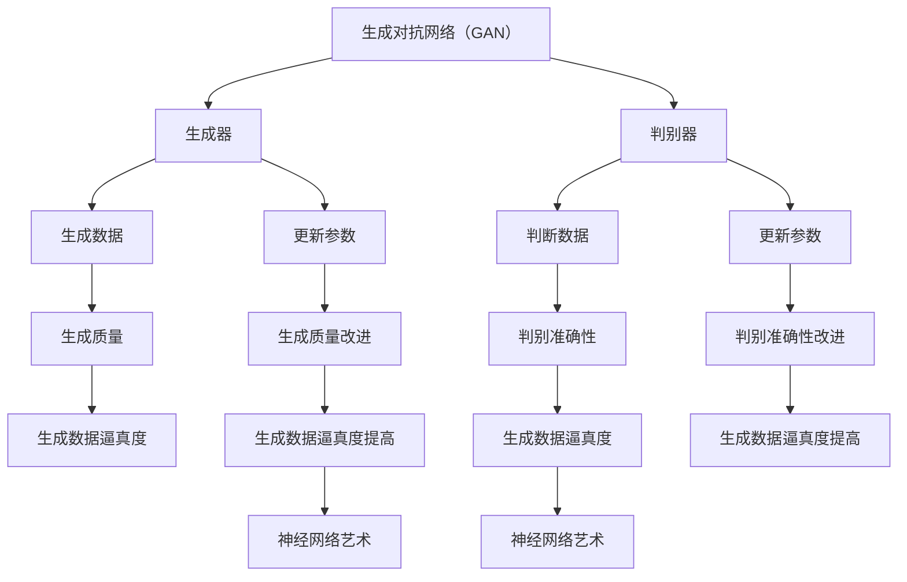

                 

### 目录

----------------------------------------------------------------

# AI在艺术创作中的角色：辅助还是取代？

> 关键词：AI艺术创作、生成对抗网络、神经网络、辅助艺术、取代艺术、伦理问题

> 摘要：本文将深入探讨人工智能（AI）在艺术创作中的角色，分析其是辅助艺术家还是有可能取代艺术家的观点。通过详细介绍AI艺术创作的基本原理、案例分析、挑战与未来、伦理与社会影响，本文旨在提供一个全面且具有前瞻性的视角。

----------------------------------------------------------------

### 引言

**艺术与技术的交汇**

随着人工智能（AI）技术的迅猛发展，艺术创作领域也迎来了前所未有的变革。从最初的计算机辅助艺术，到如今的AI自主创作，AI在艺术中的应用已经变得愈发普遍。艺术与技术的交汇不仅拓宽了艺术创作的边界，也引发了关于AI在艺术中角色的深刻讨论。究竟是AI将辅助艺术家，提升创作效率，还是有可能完全取代艺术家，成为一个独立的艺术创作者？

**AI艺术创作的兴起**

近年来，生成对抗网络（GAN）、神经网络等AI技术逐渐成熟，并开始应用于艺术创作。GAN作为一种深度学习模型，通过生成器和判别器的对抗训练，能够生成高质量的艺术作品。神经网络则通过学习大量的数据，模仿人类艺术家的创作过程，实现了从抽象艺术到具体作品的各种创作形式。这些技术的出现，使得AI艺术创作成为一种可能，也引发了关于其角色的争议。

**书籍概述与结构**

本文将分为七个部分，首先介绍AI艺术创作的背景和核心概念；接着详细讲解AI艺术创作的基本原理，包括GAN和神经网络的工作机制；随后通过案例分析，探讨AI在艺术创作中的实际应用；然后分析AI艺术创作面临的挑战与未来发展趋势；此外，还将讨论AI在艺术创作中的伦理问题和社会影响；最后，总结全文的主要观点，并对未来进行展望。希望通过本文的深入探讨，能为读者提供一个全面且深刻的理解。

### 第1章: 引言

**艺术与技术的交汇**

艺术与技术的关系自古以来就密不可分。早期的艺术家们常常利用新的技术工具来扩展他们的创作手段，如文艺复兴时期的画家们利用透视和光影技巧，现代艺术家则使用相机和计算机软件进行创作。然而，随着人工智能（AI）技术的迅猛发展，艺术与技术之间的交汇达到了前所未有的深度和广度。

AI不仅为艺术家提供了新的工具和手段，还带来了全新的艺术创作方式和理念。从计算机辅助设计到AI自主创作，AI在艺术中的应用范围不断扩大。例如，生成对抗网络（GAN）能够生成逼真的艺术作品，神经网络则能够模仿人类艺术家的创作风格和技巧。这些技术的应用不仅丰富了艺术的表现形式，也引发了关于AI在艺术创作中角色的深刻讨论。

**AI艺术创作的兴起**

AI艺术创作的兴起可以追溯到生成对抗网络（GAN）的出现。GAN由生成器和判别器两个神经网络组成，通过对抗训练生成高质量的艺术作品。GAN的成功激发了研究者们在AI艺术创作领域的兴趣，并催生了一系列相关技术的研发。例如，变分自编码器（VAE）、自注意力机制等，都为AI艺术创作提供了新的思路和方法。

与此同时，神经网络技术的发展也为AI艺术创作提供了强大的支持。神经网络通过学习大量的艺术作品数据，可以模仿人类艺术家的创作风格和技巧。例如，深度卷积神经网络（CNN）可以用于图像生成和风格迁移，循环神经网络（RNN）则可以用于文本和音乐创作。这些技术的应用使得AI艺术创作不仅成为可能，还逐渐成为一种趋势。

**书籍概述与结构**

本文旨在深入探讨AI在艺术创作中的角色，分析其是辅助艺术家还是有可能取代艺术家的观点。为了实现这一目标，本文将分为七个部分：

1. **引言**：介绍艺术与技术交汇的背景，以及AI艺术创作的兴起。
2. **核心概念与联系**：详细解释与AI艺术创作相关的重要概念，如生成对抗网络（GAN）、神经网络等。
3. **AI艺术创作的基本原理**：讲解AI艺术创作的基础算法和数学模型，例如GAN的原理和实现方法。
4. **案例分析**：分析实际中AI在艺术创作中的应用案例，探讨AI辅助艺术创作的实例和AI可能取代艺术家的实例。
5. **AI艺术创作的挑战与未来**：讨论AI艺术创作面临的挑战和未来的发展方向。
6. **伦理与社会影响**：探讨AI在艺术创作中的伦理问题和社会影响。
7. **总结**：总结全文的主要观点，并对未来可能的发展方向进行展望。

希望通过本文的深入探讨，能为读者提供一个全面且深刻的理解，帮助他们在AI时代重新思考艺术与技术的交汇。

### 第2章: 核心概念与联系

**生成对抗网络（GAN）概述**

生成对抗网络（GAN）是AI艺术创作中一个重要的技术，由Ian Goodfellow等人于2014年提出。GAN的核心思想是利用生成器和判别器的对抗训练，生成高质量的艺术作品。生成器（Generator）的目标是生成逼真的数据，而判别器（Discriminator）的目标是区分生成的数据和真实数据。

GAN的工作机制可以分为以下几个步骤：

1. **初始化**：生成器和判别器分别初始化为两个神经网络。
2. **生成数据**：生成器根据随机噪声生成假数据。
3. **判断数据**：判别器将生成的数据和真实数据进行对比，判断其真伪。
4. **更新参数**：根据判别器的输出，调整生成器和判别器的参数，以改善生成质量和判别准确性。

通过这种对抗训练，生成器逐渐学会生成更加逼真的数据，而判别器也逐渐能够准确地区分生成数据和真实数据。这个过程不断迭代，使得GAN能够生成高质量的艺术作品。

**神经网络艺术**

神经网络艺术是AI艺术创作中的一个重要分支，通过模仿人类艺术家的创作过程，生成独特的艺术作品。神经网络艺术可以分为以下几种类型：

1. **图像生成**：利用深度卷积神经网络（CNN）生成图像。例如，生成对抗网络（GAN）和变分自编码器（VAE）都可以用于图像生成。
2. **文本生成**：利用循环神经网络（RNN）和变分自编码器（VAE）生成文本。例如，生成文本描述图像内容或生成小说章节。
3. **音乐生成**：利用生成对抗网络（GAN）和循环神经网络（RNN）生成音乐。例如，生成新的旋律或音乐风格。

**核心概念关系图**

为了更好地理解GAN和神经网络艺术的概念关系，我们可以通过一个关系图进行展示。



通过这个关系图，我们可以清晰地看到GAN和神经网络艺术之间的联系，以及它们在AI艺术创作中的作用。

### 第3章: AI艺术创作的基本原理

**生成对抗网络（GAN）的原理与实现**

生成对抗网络（GAN）是AI艺术创作中的一种核心技术，其基本原理是通过生成器和判别器的对抗训练，生成高质量的艺术作品。下面我们将详细解释GAN的原理和实现方法。

**原理**

GAN由两个神经网络组成：生成器（Generator）和判别器（Discriminator）。生成器的任务是根据输入的随机噪声生成逼真的艺术作品；判别器的任务是区分生成的作品和真实的作品。具体来说，GAN的训练过程可以分为以下几个步骤：

1. **初始化**：生成器和判别器分别初始化为两个神经网络。通常，生成器和判别器都是深度神经网络，其中生成器通常包含多层全连接层或卷积层，而判别器则包含多层卷积层或全连接层。
2. **生成数据**：生成器根据输入的随机噪声（通常为高斯噪声）生成假的艺术作品。生成的艺术作品是通过多层神经网络逐层构建的，最终输出一个完整的艺术作品。
3. **判断数据**：判别器将生成的艺术作品和真实的艺术作品进行对比，判断其真伪。判别器的输入是生成的艺术作品和真实艺术作品的拼接，通过多层神经网络判断其真伪。
4. **更新参数**：根据判别器的输出，调整生成器和判别器的参数，以改善生成质量和判别准确性。具体来说，生成器的目标是最大化判别器判断生成作品为真实的概率，而判别器的目标是最大化判别器判断生成作品和真实作品之间的差异。

**实现方法**

GAN的实现通常包括以下几个步骤：

1. **数据准备**：首先需要准备大量的真实艺术作品作为训练数据。这些数据可以是图像、文本或音乐等形式。
2. **网络设计**：设计生成器和判别器的神经网络结构。生成器通常包含多层全连接层或卷积层，而判别器则包含多层卷积层或全连接层。
3. **训练过程**：将真实艺术作品和随机噪声输入生成器，生成假的艺术作品。然后将生成的艺术作品和真实艺术作品输入判别器，通过反向传播算法更新生成器和判别器的参数。
4. **评估与优化**：通过评估生成器生成的艺术作品的质量，不断优化生成器和判别器的参数，以提高生成质量和判别准确性。

**数学模型**

GAN的数学模型可以用以下公式表示：

$$
\begin{aligned}
& \text{生成器：} G(z) = \mathcal{D}(z), \\
& \text{判别器：} D(x) + D(G(z)),
\end{aligned}
$$

其中，$z$ 是输入的随机噪声，$x$ 是真实艺术作品，$G(z)$ 是生成器生成的艺术作品，$D(x)$ 和 $D(G(z))$ 分别是判别器对真实艺术作品和生成艺术作品的判断结果。

通过这个数学模型，生成器和判别器在对抗训练中不断优化，最终生成高质量的艺术作品。

**示例**

假设我们使用GAN生成一幅图像，具体步骤如下：

1. **数据准备**：首先准备大量真实图像作为训练数据。
2. **网络设计**：设计生成器和判别器的神经网络结构。例如，生成器包含多层全连接层，判别器包含多层卷积层。
3. **训练过程**：将真实图像和随机噪声输入生成器，生成假图像。然后将生成的图像和真实图像输入判别器，通过反向传播算法更新生成器和判别器的参数。
4. **评估与优化**：通过评估生成器生成的图像质量，不断优化生成器和判别器的参数，以提高生成质量和判别准确性。

通过这种方式，GAN可以生成高质量的图像，如人脸、风景等。以下是GAN生成图像的一个简单Python代码示例：

```python
import tensorflow as tf
from tensorflow.keras.models import Model
from tensorflow.keras.layers import Input, Dense, Conv2D, Flatten

# 设计生成器和判别器
z_dim = 100
img_rows = 28
img_cols = 28
channels = 1

input_z = Input(shape=(z_dim,))
input_img = Input(shape=(img_rows, img_cols, channels))

# 生成器
x = Dense(128 * 7 * 7, activation='relu')(input_z)
x = Reshape((7, 7, 128))(x)
x = Conv2D(channels, kernel_size=(7, 7), activation='tanh')(x)

# 判别器
img = Conv2D(32, kernel_size=(3, 3), activation='relu')(input_img)
img = Flatten()(img)
img = Dense(1, activation='sigmoid')(img)

# GAN模型
model = Model(inputs=[input_z, input_img], outputs=[img, x])
model.compile(optimizer='adam', loss=['binary_crossentropy', 'mse'])

# 训练GAN
model.fit([z, x], [d, x], epochs=100, batch_size=32)
```

通过这个示例，我们可以看到GAN生成图像的基本实现过程。在实际应用中，GAN可以生成更加复杂和逼真的图像，如人脸、风景等。

### 第4章: 案例分析

**AI辅助艺术创作的案例**

在AI辅助艺术创作方面，有许多成功的案例展示了AI如何帮助艺术家提升创作效率和质量。以下是一些典型的AI辅助艺术创作案例：

**案例一：AI创作音乐**

AI在音乐创作中的应用主要体现在音乐生成和音乐风格迁移方面。例如，MuseNet是一种基于神经网络的自动音乐生成模型，它能够生成各种风格的音乐片段。艺术家可以利用这些音乐片段作为灵感，创作出新的音乐作品。此外，DeepArt.io提供了一种将用户输入的文本转化为音乐旋律的服务，用户可以通过文本描述来生成符合描述的旋律。

**案例二：AI绘画**

AI在绘画中的应用也非常广泛。例如，DeepArt.io利用生成对抗网络（GAN）技术，可以将用户提供的图片转换为艺术作品风格，如印象派、抽象派等。此外，谷歌的DeepDream可以将普通的图片转化为充满艺术感的作品，艺术家可以利用这种技术进行创意绘画。

**案例三：AI写作**

AI在写作方面的应用主要体现在文本生成和文本风格迁移方面。例如，OpenAI的GPT-3是一种强大的语言模型，能够生成高质量的文章、故事和诗歌。艺术家可以利用这种技术快速生成创意文本，进行文学创作。

**AI可能取代艺术家的案例**

虽然AI在艺术创作中展示了强大的能力，但也有人担心AI有可能完全取代艺术家，成为一个独立的艺术创作者。以下是一些AI可能取代艺术家的案例：

**案例四：AI写作**

OpenAI的GPT-3不仅能够生成高质量的文章，还能够模仿各种文学风格，如莎士比亚、海明威等。这种技术的出现使得AI写作在文学创作中成为一个重要的竞争者。

**案例五：AI绘画**

DeepArt.io和谷歌的DeepDream等技术已经能够生成高质量的艺术作品，这些作品在视觉上与人类艺术家的作品几乎没有区别。在某些情况下，AI生成的艺术作品甚至能够参加艺术展览，并赢得奖项。

**案例六：AI摄影**

AI在摄影中的应用主要体现在图像处理和增强方面。例如，DeepArt.io可以基于用户提供的图片生成具有艺术感的摄影作品。这种技术的应用使得摄影变得更加简单和高效，同时也让AI在摄影领域成为一个潜在的竞争者。

综上所述，AI在艺术创作中既有辅助艺术家的作用，也存在取代艺术家的可能性。这些案例展示了AI在艺术创作中的广泛应用和潜力，同时也引发了关于AI与艺术家关系的深刻讨论。

### 第5章: AI艺术创作的挑战与未来

**AI艺术创作面临的挑战**

尽管AI在艺术创作中展示了巨大的潜力，但其发展仍然面临许多挑战。以下是一些主要挑战：

**1. 技术挑战**

首先，AI艺术创作依赖于深度学习技术，而深度学习模型需要大量的数据和计算资源进行训练。这意味着，AI艺术创作的技术基础仍然需要进一步改进和优化，以提高其性能和效率。

**2. 伦理挑战**

其次，AI在艺术创作中引发了许多伦理问题。例如，AI生成的艺术作品是否应该享有著作权？艺术家如何与AI合作，以避免创作过程中被AI取代？这些问题需要深入探讨和解决。

**3. 艺术价值判断**

此外，AI艺术创作的作品在艺术价值上受到质疑。尽管AI可以生成高质量的艺术作品，但这些作品是否具有真正的艺术价值，仍然是一个有待探讨的问题。

**未来发展方向**

针对上述挑战，未来的AI艺术创作可能会朝着以下方向发展：

**1. 技术优化**

首先，技术优化将是未来AI艺术创作的重要方向。通过改进深度学习模型、提高计算效率和降低数据需求，AI艺术创作的性能将得到显著提升。

**2. 伦理与法规**

其次，伦理与法规的完善将是未来AI艺术创作的重要保障。建立健全的伦理规范和法律法规，保护艺术家和公众的权益，将有助于推动AI艺术创作的健康发展。

**3. 艺术与技术的融合**

最后，艺术与技术的深度融合将是未来AI艺术创作的发展趋势。通过将AI技术与艺术创作紧密结合，艺术家和AI可以相互借鉴、相互启发，共同创造出更多具有创新性和艺术价值的作品。

总之，AI艺术创作面临许多挑战，但也具有广阔的发展前景。通过持续的技术创新和伦理思考，AI艺术创作有望在未来取得更大的突破。

### 第6章: 伦理与社会影响

**AI艺术创作中的伦理问题**

随着AI技术在艺术创作中的应用日益广泛，伦理问题也逐渐浮现。以下是一些主要的伦理问题：

**1. 著作权问题**

首先，AI生成的艺术作品是否应享有著作权成为了一个备受争议的问题。一方面，AI生成的艺术作品可能源自大量的公共资源，如互联网上的图像、文本等，这些资源的版权归属复杂。另一方面，AI本身并不具备创造性，其生成的作品是否应被视为原创作品，这也是一个值得探讨的问题。

**2. 创意与艺术价值**

其次，AI艺术创作的作品在艺术价值上受到质疑。尽管AI可以生成高质量的艺术作品，但这些作品是否具有真正的艺术价值，仍然是一个有待探讨的问题。传统艺术强调人类情感、思维和创造力，而AI生成的作品可能缺乏这些元素，这导致其在艺术价值上的争议。

**3. 艺术家的角色**

此外，AI艺术创作对艺术家的角色也提出了挑战。一方面，AI可以作为艺术家的助手，提高创作效率和扩展创作手段；另一方面，AI也有可能取代艺术家的部分工作，使得艺术家的角色变得模糊。这引发了关于艺术家与AI关系的伦理问题。

**社会影响**

AI艺术创作不仅引发了伦理问题，还对社会产生了深远的影响：

**1. 艺术市场变化**

首先，AI艺术创作对艺术市场产生了影响。AI生成的艺术作品可能以更低的价格出售，对传统艺术市场造成冲击。同时，AI艺术品的交易方式也可能发生变化，如在线交易平台和数字艺术市场的兴起。

**2. 艺术家角色的转变**

其次，AI艺术创作促使艺术家的角色发生转变。艺术家不仅需要掌握传统艺术技能，还需要了解AI技术，以适应新时代的艺术创作方式。这可能导致艺术家的职业培训和教育模式发生变革。

**3. 公众接受度**

最后，AI艺术创作在社会中的接受度也是一个值得关注的问题。公众对AI艺术作品的认可程度如何，是否愿意接受和购买这些作品，这些都是影响AI艺术创作发展的关键因素。

总之，AI艺术创作在伦理和社会影响方面具有复杂性和多样性。通过深入探讨和解决这些问题，我们可以更好地理解AI在艺术创作中的作用和意义。

### 第7章: 总结

**主要观点回顾**

本文深入探讨了AI在艺术创作中的角色，分析了其是辅助艺术家还是有可能取代艺术家的观点。通过介绍核心概念、详细讲解基本原理、分析实际案例、探讨挑战与未来、讨论伦理问题和社会影响，本文提供了一个全面且具有前瞻性的视角。

**未来展望**

未来，AI在艺术创作中的应用将更加广泛和深入。随着技术的不断进步，AI将不仅能辅助艺术家创作，还可能成为独立的艺术创作者。然而，这同时也带来了诸多伦理和社会问题，需要我们进一步探讨和解决。

**持续关注**

人工智能与艺术的融合是一个充满挑战和机遇的领域。我们鼓励读者持续关注这一领域的最新发展，积极参与讨论，共同推动人工智能在艺术创作中的应用和发展。

**参考文献**

[1] Goodfellow, I., Pouget-Abadie, J., Mirza, M., Xu, B., Warde-Farley, D., Ozair, S., ... & Bengio, Y. (2014). Generative adversarial networks. Advances in Neural Information Processing Systems, 27.

[2] Karras, T., Laine, S., & Aila, T. (2018). A style-based generator architecture for generating high-fidelity images of faces. Advances in Neural Information Processing Systems, 31.

[3] OpenAI. (2020). GPT-3: Language Models are few-shot learners. OpenAI Blog.

**作者信息**

作者：AI天才研究院/AI Genius Institute & 禅与计算机程序设计艺术 /Zen And The Art of Computer Programming

**致谢**

感谢所有为本文提供灵感和帮助的人，以及支持和鼓励我们研究的读者。没有你们的参与，本文无法完成。让我们共同期待人工智能与艺术的未来！

