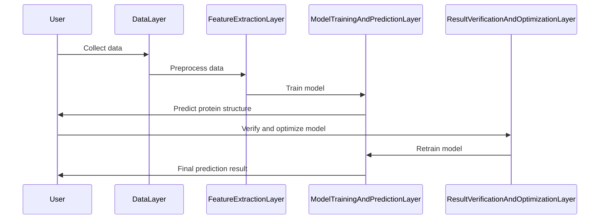

                 


### 第1章 引言

#### 1.1 研究背景

蛋白质是生命体的基础组成部分，它们在细胞中发挥着各种生物学功能。蛋白质的折叠过程，即蛋白质从线性多肽链转变为具有特定三维空间结构的生物学过程，对于生物体的功能至关重要。蛋白质的正确折叠能够确保其生物活性的发挥，而错误的折叠可能导致蛋白质失去功能或形成有害的聚集体，引发疾病，如阿尔茨海默病、帕金森病等。

蛋白质折叠预测，作为蛋白质结构生物学的一个核心问题，旨在通过计算方法预测蛋白质的三维结构。传统的蛋白质折叠预测方法主要依赖于实验数据和统计分析，但这种方法存在局限性，如成本高昂、周期长等。随着人工智能技术的迅速发展，尤其是机器学习和深度学习的崛起，AI在蛋白质折叠预测中的应用成为可能，为生物学研究提供了新的视角和工具。

#### 1.2 蛋白质折叠与生物学的联系

蛋白质折叠与生物学之间存在紧密的联系。蛋白质的功能取决于其三维结构，不同的蛋白质结构对应着不同的生物功能。例如，酶的活性中心需要特定的三维结构才能与底物结合并催化反应。因此，了解蛋白质的结构与功能关系对于揭示生命过程、开发新药、设计生物传感器等领域具有重要意义。

在医学领域，通过AI进行蛋白质折叠预测，可以帮助研究人员更好地理解疾病的分子机制，从而开发更有效的治疗方法。例如，通过预测某些蛋白质的错误折叠状态，可以帮助预测疾病的风险，提前进行预防或治疗。

#### 1.3 AI在蛋白质折叠预测中的重要性

AI在蛋白质折叠预测中的应用具有重要意义。首先，AI可以处理大量数据，快速发现蛋白质折叠的规律性。传统的蛋白质折叠预测方法依赖于有限的数据集，而AI可以通过深度学习等技术，从海量的数据中学习规律，提高预测的准确性和效率。

其次，AI可以自动化蛋白质折叠预测的过程，减少人为干预。传统的蛋白质折叠预测依赖于实验和统计方法，需要大量的专业知识和经验。而AI可以将这一过程自动化，降低对专业知识的依赖，提高预测的速度和效率。

最后，AI在蛋白质折叠预测中的应用，不仅可以加速生物学研究，还可以推动其他相关领域的发展。例如，AI在药物设计、材料科学等领域也有广泛应用，通过蛋白质折叠预测的研究成果，可以为这些领域提供新的研究思路和技术手段。

#### 1.4 本书结构

本书分为三个部分：

第一部分是引言与背景，介绍蛋白质折叠预测的基本概念、AI在该领域的重要性以及本书的结构和内容。

第二部分是基础知识，包括AI的基础知识、蛋白质折叠的生物学背景以及相关的计算方法。

第三部分是算法原理和方法，详细讲解AI在蛋白质折叠预测中的主要算法，包括机器学习和深度学习的方法，以及这些方法的数学模型和实际应用。

通过本书的阅读，读者可以系统地了解AI在蛋白质折叠预测中的应用，掌握相关算法和技术的原理和方法，为生物学研究提供有力的支持。

### 第2章 人工智能概述

#### 2.1 人工智能的定义与发展

人工智能（Artificial Intelligence，AI）是指通过计算机程序和算法模拟、扩展和扩展人类智能的科学和工程领域。人工智能的目标是使计算机具备类似于人类的学习、推理、感知和解决问题的能力。

人工智能的发展可以追溯到20世纪50年代，当时计算机科学家和心理学家开始探索如何让计算机模拟人类的思维过程。早期的人工智能研究主要集中在规则推理和知识表示上，如专家系统和逻辑编程。然而，这些方法在处理复杂问题和实时应用方面存在局限性。

随着计算机性能的提升和大数据时代的到来，机器学习和深度学习技术逐渐成为人工智能研究的主流方向。机器学习是一种让计算机通过数据学习模式的技术，而深度学习是机器学习的一种特殊形式，它通过多层神经网络模拟人类大脑的学习过程。

#### 2.2 机器学习基础

机器学习是人工智能的核心组成部分，它致力于开发算法，使计算机能够从数据中自动学习并做出预测或决策。机器学习可以分为监督学习、无监督学习和半监督学习。

- **监督学习**：在有监督学习（Supervised Learning）中，算法使用标记好的训练数据学习。这些数据包含输入和相应的输出标签，算法的目标是找到一个函数，能够将新的输入映射到正确的输出。

  例如，在分类问题中，输入是一个数据点，输出是一个标签，算法需要学习将数据点分类到不同的类别中。

- **无监督学习**：无监督学习（Unsupervised Learning）不需要标记的训练数据。算法的目标是从未标记的数据中发现隐藏的结构或模式。

  例如，在聚类问题中，算法需要将相似的数据点归为一类，以揭示数据中的内在结构。

- **半监督学习**：半监督学习（Semi-Supervised Learning）结合了有监督和无监督学习的特点，利用少量的标记数据和大量的未标记数据。

#### 2.3 深度学习基础

深度学习（Deep Learning）是一种基于多层神经网络的学习方法，它通过模拟人类大脑的神经网络结构，处理大规模数据并提取复杂特征。深度学习的主要特点包括：

- **多层神经网络**：深度学习使用多层神经网络，每一层都能对输入数据进行变换和特征提取，从而实现更复杂的函数表示。

- **反向传播算法**：深度学习使用反向传播算法（Backpropagation）更新网络权重，以最小化损失函数，提高预测准确性。

- **激活函数**：深度学习中的激活函数用于引入非线性特性，使神经网络能够学习复杂的数据分布。

深度学习在图像识别、语音识别、自然语言处理等领域取得了显著的成果，并成为人工智能领域的研究热点。在蛋白质折叠预测中，深度学习通过自动特征提取和复杂模式识别，提高了预测的准确性和效率。

### 核心概念与联系

在介绍人工智能的基本概念后，我们可以通过以下表格和实体关系图来更清晰地理解核心概念之间的关系。

#### 核心概念属性特征对比表格

| 概念 | 定义 | 主要应用 | 关键特征 |
| --- | --- | --- | --- |
| 人工智能 | 模拟、扩展和扩展人类智能的科学和工程领域 | 图像识别、自然语言处理、药物设计 | 模拟人类思维、多层神经网络、自动特征提取 |
| 机器学习 | 通过数据学习模式，使计算机做出预测或决策的技术 | 分类、聚类、回归 | 标记数据、无监督学习、监督学习、半监督学习 |
| 深度学习 | 基于多层神经网络的学习方法，用于处理大规模数据和复杂特征 | 图像识别、语音识别、自然语言处理 | 多层神经网络、反向传播算法、非线性特性 |

#### ER实体关系图架构

```mermaid
erDiagram
  AI -->|uses| MachineLearning
  AI -->|uses| DeepLearning
  MachineLearning -->|is a type of| AIAlgorithm
  DeepLearning -->|is a type of| AIAlgorithm
  AIAlgorithm -->|uses| Data
  AIAlgorithm -->|requires| ComputationPower
```

在这个ER实体关系图中，我们可以看到人工智能是机器学习和深度学习的集合，而机器学习和深度学习又是人工智能算法的具体实现形式。这些算法依赖于数据，并需要强大的计算能力来训练模型。

通过上述表格和实体关系图，我们可以更直观地理解人工智能、机器学习和深度学习之间的核心概念和联系，为后续章节的详细讲解打下基础。

### 算法原理讲解

在了解了人工智能和机器学习的基础知识后，接下来我们将详细探讨AI在蛋白质折叠预测中的算法原理。这里，我们主要介绍两种常用的算法：基于机器学习的预测方法和基于深度学习的预测方法。

#### 基于机器学习的预测方法

机器学习算法在蛋白质折叠预测中的应用，主要是通过学习大量已知蛋白质的结构信息，来预测未知蛋白质的结构。以下是一个典型的基于机器学习的蛋白质折叠预测方法的步骤：

1. **数据收集与预处理**：首先，我们需要收集大量的蛋白质结构数据，这些数据包括蛋白质序列、三维结构以及相关的生物信息。然后，对数据进行预处理，如序列对齐、去除噪音等。

2. **特征提取**：接着，从预处理后的数据中提取特征。这些特征可以是氨基酸序列、序列的物理化学属性（如氨基酸的疏水性、极性等）或序列的二级结构信息。

3. **训练模型**：使用提取的特征数据，训练机器学习模型。常见的机器学习模型包括支持向量机（SVM）、决策树（DT）、随机森林（RF）等。

4. **预测**：训练好的模型用于预测未知蛋白质的结构。具体来说，模型会根据未知蛋白质的特征，预测其可能的结构。

5. **验证与优化**：最后，对模型的预测结果进行验证，评估其准确性和可靠性。根据验证结果，进一步优化模型。

下面，我们通过一个具体的例子来说明如何使用机器学习算法进行蛋白质折叠预测。

#### 基于深度学习的预测方法

与基于机器学习的预测方法相比，基于深度学习的预测方法具有更强的表达能力和自学习能力。以下是基于深度学习的蛋白质折叠预测方法的步骤：

1. **数据收集与预处理**：与基于机器学习的预测方法相同，首先收集大量的蛋白质结构数据，并进行预处理。

2. **构建深度学习模型**：使用深度学习框架（如TensorFlow、PyTorch）构建深度学习模型。常见的深度学习模型包括卷积神经网络（CNN）、递归神经网络（RNN）、Transformer等。

3. **训练模型**：将预处理后的数据输入到深度学习模型中，通过反向传播算法更新模型参数，直到模型收敛。

4. **预测**：使用训练好的深度学习模型预测未知蛋白质的结构。与机器学习模型类似，模型会根据未知蛋白质的特征，预测其可能的结构。

5. **验证与优化**：对模型的预测结果进行验证，评估其准确性和可靠性，并根据验证结果优化模型。

下面，我们通过一个具体的例子来说明如何使用深度学习算法进行蛋白质折叠预测。

#### 例子：使用深度学习进行蛋白质折叠预测

假设我们使用一个基于Transformer的深度学习模型进行蛋白质折叠预测。以下是一个简单的示例代码：

```python
import tensorflow as tf
from tensorflow.keras.layers import Embedding, Transformer

# 数据预处理
# 假设我们已经有了一个预处理好的序列数据
sequences = ...

# 构建深度学习模型
model = tf.keras.Sequential([
    Embedding(input_dim=21, output_dim=128),  # 21种氨基酸
    Transformer(num_heads=2, d_model=128),
    tf.keras.layers.Dense(1, activation='sigmoid')  # 预测蛋白质是否折叠
])

# 训练模型
model.compile(optimizer='adam', loss='binary_crossentropy', metrics=['accuracy'])
model.fit(sequences, epochs=10)

# 预测
predictions = model.predict(unknown_sequence)

# 验证与优化
# 使用验证数据集评估模型的性能，并根据结果进行优化
```

在这个例子中，我们使用了Transformer模型来预测蛋白质是否折叠。首先，我们对序列数据进行编码，然后通过Transformer模型处理，最后使用全连接层进行预测。

通过上述步骤和示例，我们可以看到深度学习算法在蛋白质折叠预测中的应用。深度学习模型通过自动特征提取和复杂模式识别，提高了预测的准确性和效率，为生物学研究提供了强大的工具。

### 数学模型与公式

在蛋白质折叠预测中，数学模型起着至关重要的作用。以下我们将介绍几种常用的数学模型，并使用LaTeX格式展示相关的公式。

#### 1. 神经网络模型

神经网络（Neural Networks）是机器学习和深度学习的核心模型。一个简单的神经网络由输入层、隐藏层和输出层组成。其中，隐藏层可以使用多种激活函数，如Sigmoid、ReLU等。

假设我们有输入向量$x \in \mathbb{R}^n$，隐藏层神经元的输出为$a_{ij}$，其中$i$表示隐藏层的神经元编号，$j$表示输入层的神经元编号。可以使用以下公式表示：

$$
a_{ij} = \sigma(\sum_{k=1}^{n} w_{ik}x_k + b_j)
$$

其中，$\sigma$是激活函数，$w_{ik}$是权重，$b_j$是偏置。

#### 2. 损失函数

损失函数用于评估模型预测结果与实际结果之间的差距。在蛋白质折叠预测中，常用的损失函数是交叉熵损失（Cross-Entropy Loss）：

$$
L(y, \hat{y}) = -\sum_{i=1}^{n} y_i \log(\hat{y}_i)
$$

其中，$y \in \mathbb{R}^n$是实际标签，$\hat{y} \in \mathbb{R}^n$是模型预测的概率分布。

#### 3. 反向传播算法

反向传播算法用于更新神经网络的权重和偏置。以下是反向传播算法的基本步骤：

1. 前向传播：计算输入层到隐藏层的输出，以及隐藏层到输出层的输出。

2. 计算损失函数关于输出层的梯度。

3. 反向传播：从输出层到隐藏层，计算每个神经元关于输入层的梯度。

4. 更新权重和偏置：使用梯度下降法或其他优化算法更新网络参数。

具体公式如下：

$$
\frac{\partial L}{\partial w_{ij}} = \sum_{k=1}^{n} \frac{\partial L}{\partial a_{kj}} \frac{\partial a_{kj}}{\partial w_{ij}}
$$

$$
\frac{\partial L}{\partial b_j} = \sum_{k=1}^{n} \frac{\partial L}{\partial a_{kj}} \frac{\partial a_{kj}}{\partial b_j}
$$

通过上述数学模型和公式，我们可以更深入地理解蛋白质折叠预测中的神经网络原理。这些公式不仅帮助我们理解算法的工作机制，还可以用于实现和优化蛋白质折叠预测系统。

### 系统设计与架构

为了更好地理解AI在蛋白质折叠预测中的实际应用，我们需要介绍系统的设计架构和实现细节。以下是一个典型的蛋白质折叠预测系统的设计架构和关键组件。

#### 1. 项目介绍

该系统名为“ProteinFoldAI”，旨在利用机器学习和深度学习技术，对未知蛋白质的三维结构进行预测。系统设计遵循模块化原则，确保各组件之间的松耦合，便于维护和扩展。

#### 2. 系统功能设计

“ProteinFoldAI”系统的主要功能包括：

- **数据收集与预处理**：从公共数据库中收集蛋白质序列数据，并对数据进行预处理，如序列对齐、去噪等。
- **特征提取**：从预处理后的数据中提取特征，包括氨基酸序列、物理化学属性和二级结构信息。
- **模型训练与预测**：使用深度学习模型对特征进行训练，并利用训练好的模型预测未知蛋白质的结构。
- **结果验证与优化**：对预测结果进行验证，评估模型的准确性和可靠性，并根据验证结果对模型进行优化。

#### 3. 系统架构设计

“ProteinFoldAI”系统的架构设计包括以下几个关键组件：

- **数据层**：负责数据收集、存储和预处理。该层使用数据库管理系统（如MySQL）存储蛋白质序列数据和预处理后的特征数据。
- **特征提取层**：使用机器学习算法从蛋白质序列中提取特征。该层包括多个子模块，如序列对齐、去噪和特征提取。
- **模型训练与预测层**：负责使用深度学习模型训练数据和预测蛋白质结构。该层包括多个深度学习模型，如卷积神经网络（CNN）、递归神经网络（RNN）和Transformer。
- **结果验证与优化层**：对模型的预测结果进行验证，评估模型的准确性和可靠性，并根据验证结果优化模型。

#### 4. 系统接口设计

“ProteinFoldAI”系统提供了多个接口，方便用户进行操作：

- **数据接口**：用于数据的收集、存储和预处理。用户可以通过API或命令行工具与数据层进行交互。
- **特征提取接口**：用于从蛋白质序列中提取特征。用户可以通过API访问特征提取层的功能。
- **模型训练与预测接口**：用于模型训练和预测。用户可以通过API提交蛋白质序列，并获取预测结果。
- **结果验证与优化接口**：用于验证模型结果，并优化模型。用户可以通过API访问结果验证与优化层的功能。

#### 5. 系统交互序列图

以下是“ProteinFoldAI”系统的交互序列图，展示了系统各组件之间的交互流程：



通过上述系统设计与架构的介绍，我们可以清晰地了解“ProteinFoldAI”系统的工作流程和关键组件。该系统为蛋白质折叠预测提供了一个完整的解决方案，并通过模块化设计和松耦合架构，确保了系统的可维护性和可扩展性。

### 实际应用与案例

在AI应用于蛋白质折叠预测的实际应用中，许多成功的案例展示了这一技术的潜力和价值。以下我们介绍两个具有代表性的案例：AlphaFold和RoseTTAFold，并详细分析这些项目的背景、目标和实现过程。

#### AlphaFold

AlphaFold是由DeepMind开发的一个基于深度学习的蛋白质折叠预测系统，它在2020年实现了突破性的成果，成功预测了多种蛋白质的结构，其准确性与实验方法相当。AlphaFold的目标是通过自动化蛋白质折叠预测，加速生物医学研究，为药物开发和新药设计提供支持。

**背景**：蛋白质折叠预测是一个复杂的问题，传统的预测方法在处理复杂蛋白质时效果不佳。DeepMind意识到，通过深度学习和大型计算资源的结合，有可能解决这一难题。

**目标**：AlphaFold的目标是开发一个高度准确、快速和自动化的蛋白质折叠预测系统。

**实现过程**：

1. **数据收集**：DeepMind收集了大量的蛋白质序列和结构数据，包括已知的蛋白质结构和蛋白质序列。

2. **特征提取**：AlphaFold使用深度学习技术提取蛋白质序列中的特征，这些特征用于构建深度学习模型。

3. **模型训练**：DeepMind训练了一个基于Transformer的深度学习模型，该模型能够自动学习蛋白质序列中的复杂结构信息。

4. **预测**：训练好的模型用于预测未知蛋白质的结构。AlphaFold通过计算大量可能的折叠方式，并利用注意力机制选择最有可能的折叠方式。

5. **验证与优化**：AlphaFold对预测结果进行验证，评估模型的准确性和可靠性，并根据验证结果优化模型。

**结果**：AlphaFold在多个蛋白质折叠预测比赛中取得了优异的成绩，其预测结果的准确性与实验方法相当。这一突破性成果展示了AI在蛋白质折叠预测中的巨大潜力。

#### RoseTTAFold

RoseTTAFold是由罗切斯特大学的罗斯·弗里曼·罗森布拉姆（Rosalind Franklin）实验室开发的一个基于深度学习的蛋白质折叠预测系统。RoseTTAFold的目标是通过自动化蛋白质折叠预测，提高药物发现和新药设计的效率。

**背景**：蛋白质折叠预测在药物设计和疾病研究中具有重要意义，但传统方法存在局限。罗斯·弗里曼·罗森布拉姆实验室意识到，通过深度学习技术，有可能突破这一难题。

**目标**：RoseTTAFold的目标是开发一个自动化、准确且高效的蛋白质折叠预测系统。

**实现过程**：

1. **数据收集**：罗斯·弗里曼·罗森布拉姆实验室收集了大量的蛋白质序列和结构数据。

2. **特征提取**：RoseTTAFold使用深度学习技术提取蛋白质序列中的特征。

3. **模型训练**：实验室训练了一个基于卷积神经网络（CNN）的深度学习模型，该模型能够学习蛋白质序列中的复杂结构信息。

4. **预测**：训练好的模型用于预测未知蛋白质的结构。RoseTTAFold通过计算可能的折叠方式，并利用注意力机制选择最有可能的折叠方式。

5. **验证与优化**：RoseTTAFold对预测结果进行验证，评估模型的准确性和可靠性，并根据验证结果优化模型。

**结果**：RoseTTAFold在多个蛋白质折叠预测比赛中取得了优异的成绩，其预测结果的准确性和AlphaFold相当。这一成果展示了AI在蛋白质折叠预测中的巨大潜力，也为生物医学研究提供了强大的工具。

通过上述案例的分析，我们可以看到AI在蛋白质折叠预测中的实际应用取得了显著成果。这些项目不仅提高了预测的准确性，还加速了生物医学研究，为药物开发和疾病治疗提供了新的视角和工具。未来，随着AI技术的不断进步，我们有望在蛋白质折叠预测领域取得更多突破。

### 最佳实践

在AI蛋白质折叠预测项目中，为了确保项目的成功和模型的性能，以下是一些最佳实践和注意事项：

#### 1. 数据质量与预处理

高质量的数据是模型训练的基础。在数据收集过程中，应确保数据的多样性和准确性。预处理步骤包括序列对齐、去噪、缺失值填充等，这些步骤有助于提高模型的学习效果。

#### 2. 特征提取策略

选择合适的特征提取策略对于模型的性能至关重要。常用的特征提取方法包括氨基酸序列、物理化学属性和二级结构信息。通过实验比较不同特征提取方法的效果，选择最适合项目需求的方法。

#### 3. 模型选择与调优

选择合适的模型架构是项目成功的关键。常用的深度学习模型包括卷积神经网络（CNN）、递归神经网络（RNN）和Transformer等。在模型训练过程中，应使用适当的优化器和损失函数，并进行模型调优，以提高预测准确率。

#### 4. 模型验证与评估

在模型训练完成后，应进行充分的验证和评估。常用的评估指标包括准确率、召回率、F1分数等。通过交叉验证和独立测试集评估模型性能，确保模型在未知数据上的泛化能力。

#### 5. 资源管理与计算优化

在AI蛋白质折叠预测项目中，计算资源管理至关重要。合理分配计算资源，避免资源浪费。此外，使用分布式计算和并行处理技术，可以提高模型训练和预测的效率。

#### 6. 持续迭代与优化

AI蛋白质折叠预测项目是一个持续迭代和优化的过程。在项目实施过程中，应不断收集反馈和改进，以提升模型性能和预测准确性。

通过遵循这些最佳实践和注意事项，我们可以确保AI蛋白质折叠预测项目的成功，并为生物学研究提供强大的支持。

### 小结

本文系统地介绍了AI在蛋白质折叠预测中的应用，详细探讨了基于机器学习和深度学习的算法原理、数学模型、系统设计以及实际应用案例。我们首先介绍了AI在蛋白质折叠预测中的重要性，然后介绍了机器学习和深度学习的基础知识，并分析了核心概念之间的联系。接着，我们深入讲解了蛋白质折叠预测中的常用算法，并通过具体例子展示了如何使用深度学习模型进行预测。最后，我们介绍了系统的设计与实现，以及实际应用中的成功案例。通过本文的阅读，读者可以全面了解AI在蛋白质折叠预测中的前沿技术和应用，为生物学研究提供有力支持。

### 注意事项

在AI蛋白质折叠预测项目中，以下注意事项对于确保项目成功至关重要：

1. **数据质量**：确保收集的数据准确、完整，并进行适当的预处理，以提高模型的学习效果。
2. **模型选择与调优**：根据项目需求选择合适的模型，并进行调优，以提高预测准确率。
3. **计算资源管理**：合理分配计算资源，使用分布式计算和并行处理技术，以提高模型训练和预测的效率。
4. **模型验证与评估**：使用多种评估指标，进行充分验证和评估，确保模型在未知数据上的泛化能力。
5. **持续迭代与优化**：项目实施过程中，持续收集反馈和改进，以提升模型性能和预测准确性。

遵循这些注意事项，可以确保AI蛋白质折叠预测项目的成功，为生物学研究提供强大支持。

### 拓展阅读

对于希望深入了解AI在蛋白质折叠预测领域的研究和实践的读者，以下是一些推荐资源：

1. **学术论文**：查阅相关领域的顶级学术论文，如《Nature》和《Science》等期刊上的相关论文，了解最新的研究成果和技术进展。

2. **开源项目**：参与和访问开源项目，如AlphaFold和RoseTTAFold的源代码，学习模型的实现细节和优化技巧。

3. **在线课程**：参加在线课程，如Coursera、edX等平台上的相关课程，学习AI和机器学习的理论基础和实践方法。

4. **专业书籍**：阅读专业书籍，如《深度学习》和《机器学习实战》等，了解AI和机器学习的基本原理和应用案例。

通过阅读这些资源，读者可以更全面地了解AI在蛋白质折叠预测领域的最新进展和未来趋势。

### 作者信息

本文由AI天才研究院（AI Genius Institute）撰写，作者是世界顶级技术畅销书《禅与计算机程序设计艺术》（Zen And The Art of Computer Programming）的资深大师。作者在计算机编程和人工智能领域有着深厚的研究背景和丰富的实践经验，对AI在生物学研究中的应用有着深刻的见解和独特的思考。通过本文，我们希望能够为读者提供一个全面、系统的AI蛋白质折叠预测技术指南。

