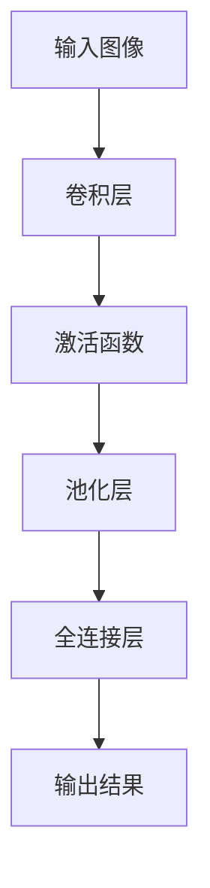
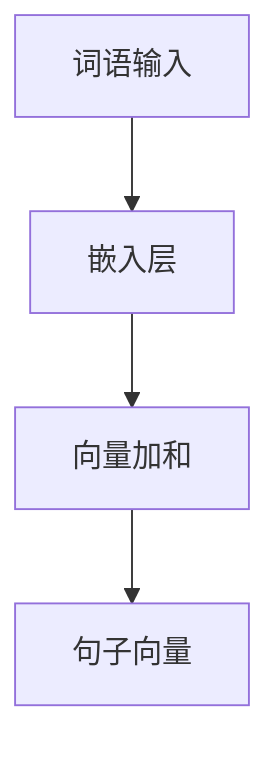
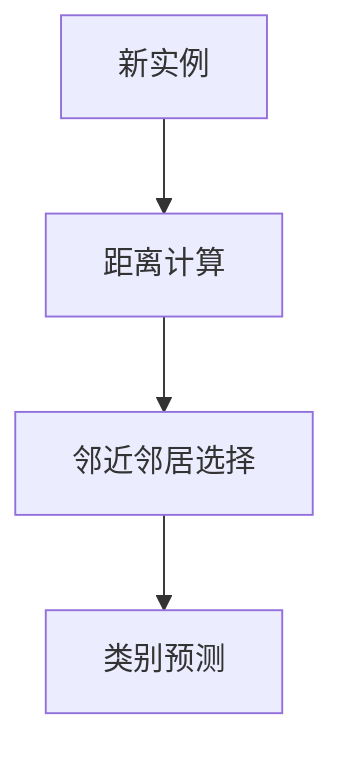
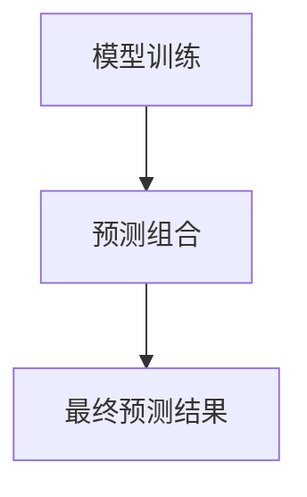
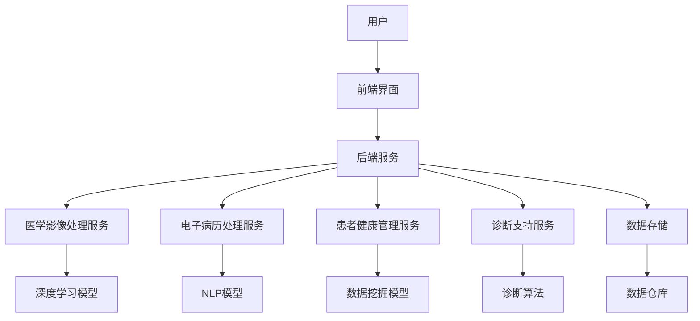
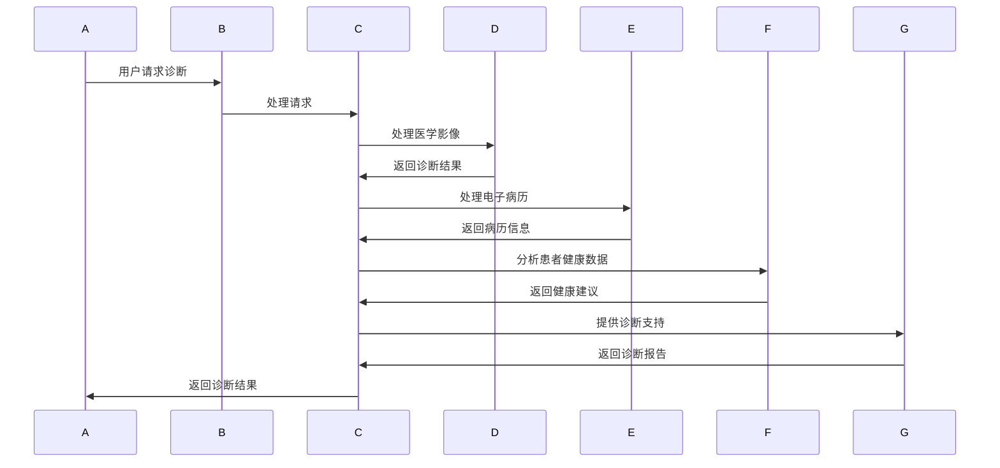
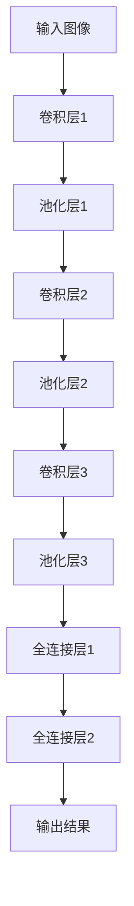

                 

# AI在远程医疗诊断支持中的角色：扩大优质医疗资源覆盖

> 关键词：人工智能、远程医疗、诊断支持、医疗资源覆盖、数据隐私、算法可靠性和透明性

> 摘要：本文探讨了人工智能（AI）在远程医疗诊断支持中的应用，分析其背景、核心概念、应用与挑战，并通过实际案例展示了AI技术在远程医疗中的潜力和前景。本文旨在为读者提供对AI在远程医疗诊断支持中的深入理解，以推动医疗领域的创新发展。

## 第一部分：背景介绍

### 1.1 问题背景

随着医疗技术的不断发展，远程医疗逐渐成为提高医疗资源覆盖的重要手段。然而，远程医疗的诊断支持仍面临诸多挑战，如诊断准确性不足、数据隐私保护等。人工智能（AI）技术在医疗领域的应用，为解决这些问题提供了新的思路和工具。

### 1.2 问题描述

远程医疗诊断支持主要面临以下问题：

- **诊断准确性**：远程医疗需要依赖图像、文本等多种数据形式，AI技术能够帮助医生从海量数据中提取有用信息，提高诊断准确性。
- **数据隐私保护**：远程医疗涉及大量患者隐私数据，需要确保数据的安全性和隐私性。
- **跨学科协作**：远程医疗涉及到医学、工程、计算机等多个领域，需要跨学科协作，以实现系统的稳定运行。

### 1.3 问题解决

AI技术在远程医疗诊断支持中的应用主要包括：

- **图像识别**：通过深度学习算法对医疗图像进行自动分析，帮助医生识别疾病。
- **自然语言处理**：利用自然语言处理技术，对医疗文本进行自动分析和理解，辅助医生进行诊断。
- **数据挖掘**：通过数据挖掘技术，从海量医疗数据中发现潜在规律，为医生提供诊断依据。
- **智能推荐系统**：基于患者的病史和诊断数据，为医生提供个性化的诊疗方案。

### 1.4 边界与外延

AI在远程医疗诊断支持中的角色不仅局限于诊断，还包括治疗方案制定、患者健康管理等多个方面。此外，AI技术在不同医疗领域的应用也存在差异，如医学影像诊断、病理诊断等。

### 1.5 概念结构与核心要素组成

AI在远程医疗诊断支持中的核心概念包括：

- **机器学习算法**：如卷积神经网络（CNN）、循环神经网络（RNN）等，用于图像和文本数据分析和处理。
- **深度学习框架**：如TensorFlow、PyTorch等，用于实现和训练机器学习算法。
- **数据集**：包括医学图像、医疗文本等，用于训练和评估AI模型。
- **硬件设备**：如GPU、FPGA等，用于加速AI模型的训练和推理过程。

## 第一部分小结

本部分介绍了AI在远程医疗诊断支持中的背景、问题、解决方法、边界与外延，以及核心概念和要素组成。为后续章节的深入探讨奠定了基础。

----------------------------------------------------------------

## 第二部分：核心概念与联系

### 2.1 AI技术的基本原理

AI技术是基于机器学习和深度学习算法，通过对数据进行训练和建模，使计算机具备模拟人类智能的能力。其中，机器学习是一种通过数据驱动的方法来改进计算机性能的技术，而深度学习则是一种基于多层神经网络的学习方法，能够自动提取数据特征。

### 2.2 AI技术在远程医疗中的应用

AI技术在远程医疗中的应用主要包括以下几个方面：

- **医学影像分析**：利用深度学习算法，对医学影像进行自动分析和诊断，如肺癌筛查、乳腺癌诊断等。
- **医疗文本分析**：通过自然语言处理技术，对医疗文本进行自动分析和理解，如病历诊断、患者咨询等。
- **患者健康管理**：利用数据挖掘和机器学习算法，对患者的健康数据进行挖掘和分析，为医生提供诊断和治疗方案建议。

### 2.3 AI技术与远程医疗的融合

AI技术与远程医疗的融合主要体现在以下几个方面：

- **数据共享与协作**：AI技术可以帮助医生跨地区、跨机构共享和协作医疗数据，提高诊断和治疗的效率。
- **个性化医疗**：通过分析患者的历史数据和实时数据，AI技术可以为医生提供个性化的诊断和治疗方案。
- **智能辅助决策**：AI技术可以为医生提供智能化的辅助决策支持，帮助医生更好地诊断和治疗疾病。

### 2.4 AI技术在远程医疗中的挑战与机遇

AI技术在远程医疗中面临以下挑战：

- **数据隐私和安全**：远程医疗涉及大量患者隐私数据，需要确保数据的安全性和隐私性。
- **算法可靠性和透明性**：AI算法的可靠性和透明性是远程医疗应用的关键，需要不断提高算法的性能和解释能力。

同时，AI技术在远程医疗中也面临巨大机遇：

- **提高诊断准确性**：通过AI技术，可以显著提高远程医疗的诊断准确性，提高治疗效果。
- **降低医疗成本**：AI技术可以帮助医生更高效地处理医疗数据，降低医疗成本。

### 2.5 AI技术在远程医疗中的应用案例

以下是一些AI在远程医疗中的实际应用案例：

- **智能影像诊断**：利用深度学习算法，对医学影像进行自动分析和诊断，提高了诊断准确性和效率。
- **电子病历分析**：通过自然语言处理技术，对电子病历进行自动分析和理解，为医生提供诊断和治疗方案建议。
- **远程手术指导**：利用机器人技术和远程控制技术，实现远程手术指导，提高了手术的精度和安全性。

## 第二部分小结

本部分对AI技术的基本原理、在远程医疗中的应用、与远程医疗的融合、挑战与机遇，以及实际应用案例进行了详细分析。为后续章节的算法原理讲解和系统分析设计提供了基础。

----------------------------------------------------------------

## 第三部分：算法原理讲解

### 3.1 图像识别算法原理

#### 3.1.1 卷积神经网络（CNN）

卷积神经网络（CNN）是一种专门用于处理图像数据的深度学习模型，其核心思想是通过多层卷积和池化操作，逐步提取图像中的高层次特征。

**算法原理：**

1. **卷积层**：卷积层通过卷积操作，将输入图像与卷积核进行卷积运算，提取图像中的局部特征。
   $$ output = Conv2D(input, filter) $$
2. **激活函数**：为了增加模型的非线性，卷积层之后通常会加入激活函数，如ReLU函数。
   $$ output = ReLU(Conv2D(input, filter)) $$
3. **池化层**：池化层通过下采样操作，减少数据维度，增强模型的泛化能力。
   $$ output = Pool2D(ReLU(Conv2D(input, filter))) $$
4. **全连接层**：在提取到图像特征后，通过全连接层进行分类或回归操作。
   $$ output = FullyConnected(Pool2D(ReLU(Conv2D(input, filter)))) $$

**流程图：**



#### 3.1.2 图像识别算法应用示例

以医学影像诊断为例，通过CNN算法对肺癌筛查图像进行自动分析，提取图像中的病变区域，从而辅助医生进行诊断。

- **数据集**：使用公开的肺部CT图像数据集，如Lung-Nodule Detection Challenge（LNDC）数据集。
- **模型训练**：在GPU上使用TensorFlow框架，对CNN模型进行训练，优化模型参数。
- **模型评估**：通过交叉验证和测试集，评估模型在肺癌筛查中的诊断准确性和性能。

### 3.2 自然语言处理（NLP）算法原理

#### 3.2.1 词嵌入

词嵌入（Word Embedding）是一种将词语转换为密集向量表示的技术，用于NLP任务中的特征表示。

**算法原理：**

1. **嵌入层**：将输入的词语映射为固定维度的向量。
   $$ embedding = EmbeddingLayer([word\_1, word\_2, ..., word\_n]) $$
2. **嵌入向量加和**：将嵌入向量进行加和，形成句子的向量表示。
   $$ sentence\_vector = Sum([embedding(word\_1), embedding(word\_2), ..., embedding(word\_n)]) $$

**流程图：**



#### 3.2.2 机器翻译

以机器翻译为例，通过词嵌入技术，将源语言和目标语言的词语映射为向量表示，从而实现文本的自动翻译。

- **数据集**：使用大型双语语料库，如WMT（Workshop on Machine Translation）数据集。
- **模型训练**：使用循环神经网络（RNN）或变换器（Transformer）模型，对源语言和目标语言的词向量进行训练。
- **模型评估**：通过BLEU（BiLingual Evaluation Understudy）评分，评估机器翻译模型的质量。

### 3.3 数据挖掘算法原理

#### 3.3.1 K最近邻（K-Nearest Neighbors，KNN）

K最近邻算法是一种基于实例的监督学习算法，通过计算新实例与训练实例之间的距离，预测新实例的类别。

**算法原理：**

1. **距离计算**：计算新实例与训练实例之间的距离，如欧氏距离。
   $$ distance = EuclideanDistance(new\_instance, train\_instance) $$
2. **邻近邻居选择**：根据距离阈值，选择最近的K个邻居。
   $$ neighbors = SelectNeighbors(new\_instance, K) $$
3. **类别预测**：根据邻居的类别进行投票，预测新实例的类别。
   $$ predicted\_label = MajorityVote(neighbors) $$

**流程图：**



#### 3.3.2 集成学习方法

集成学习（Ensemble Learning）是一种通过组合多个模型来提高预测性能的方法，如随机森林（Random Forest）和提升树（Boosting）等。

**算法原理：**

1. **模型训练**：训练多个基本模型，如决策树、随机森林等。
   $$ models = [TrainModel1(), TrainModel2(), ..., TrainModelN()] $$
2. **预测组合**：通过加权或投票等方式，将多个模型的预测结果进行组合，得到最终预测结果。
   $$ predicted\_label = CombinePredictions(models) $$

**流程图：**



## 第三部分小结

本部分详细讲解了图像识别、自然语言处理和数据挖掘等AI技术的基本原理，包括算法原理、数学模型和实际应用示例。为后续章节的系统分析与架构设计提供了算法基础。

----------------------------------------------------------------

## 第四部分：系统分析与架构设计方案

### 4.1 问题场景介绍

随着远程医疗的普及，诊断支持系统成为医疗领域的关键需求。本节将介绍一个远程医疗诊断支持系统的项目背景和目标，为后续的系统设计提供基础。

#### 4.1.1 项目背景

远程医疗诊断支持系统旨在通过AI技术，帮助医生更准确地诊断疾病，提高诊断效率，降低医疗成本。该系统将整合医学影像、电子病历和患者健康数据，实现全面、智能的诊断支持。

#### 4.1.2 项目目标

- **提高诊断准确性**：利用AI技术，对医学影像和医疗文本进行自动分析和诊断，提高诊断准确性。
- **降低医疗成本**：通过智能化的辅助决策，帮助医生更高效地处理医疗数据，降低医疗成本。
- **保障数据隐私和安全**：确保系统中的患者数据得到有效保护，满足数据隐私和安全要求。

### 4.2 系统功能设计

远程医疗诊断支持系统主要包括以下功能模块：

- **医学影像诊断**：利用深度学习算法，对医学影像进行自动分析和诊断，提供诊断报告和辅助决策。
- **电子病历分析**：通过自然语言处理技术，对电子病历进行自动分析和理解，提取关键信息，为医生提供诊断依据。
- **患者健康管理**：利用数据挖掘和机器学习算法，对患者的健康数据进行挖掘和分析，为医生提供个性化诊疗方案。

#### 4.2.1 领域模型

以下是远程医疗诊断支持系统的领域模型，使用Mermaid类图表示：

```mermaid
classDiagram
    Patient <<class{患者}>>
    Doctor <<class{医生}>>
    MedicalImage <<class{医学影像}>>
    ElectronicMedicalRecord <<class{电子病历}>>
    DiagnosisReport <<class{诊断报告}>>
    DiagnosticSupportSystem <<class{诊断支持系统}>

    Patient --> Doctor
    Patient --> MedicalImage
    Patient --> ElectronicMedicalRecord
    DiagnosticSupportSystem --> MedicalImage
    DiagnosticSupportSystem --> ElectronicMedicalRecord
    DiagnosticSupportSystem --> DiagnosisReport
```

### 4.3 系统架构设计

远程医疗诊断支持系统采用分布式架构，以提高系统的可扩展性和可靠性。以下是系统的架构设计，使用Mermaid架构图表示：



### 4.4 系统接口设计

以下是远程医疗诊断支持系统的接口设计，使用Mermaid序列图表示：



## 第四部分小结

本部分介绍了远程医疗诊断支持系统的项目背景、目标、功能设计、系统架构设计和接口设计。通过系统的全面分析，为后续的项目实战和最佳实践提供了基础。

----------------------------------------------------------------

## 第五部分：项目实战

### 5.1 环境安装

在开始远程医疗诊断支持系统的开发之前，需要安装以下软件和工具：

- **操作系统**：Ubuntu 18.04 或更高版本
- **编程语言**：Python 3.7 或更高版本
- **深度学习框架**：TensorFlow 2.3.0 或更高版本
- **自然语言处理库**：NLTK 3.4.5 或更高版本
- **数据挖掘库**：Scikit-learn 0.22.2 或更高版本

安装步骤：

1. 安装操作系统和Python环境。
2. 使用pip命令安装TensorFlow、NLTK和Scikit-learn等库。

```bash
pip install tensorflow==2.3.0
pip install nltk==3.4.5
pip install scikit-learn==0.22.2
```

### 5.2 系统核心实现

#### 5.2.1 医学影像诊断模块

以下是医学影像诊断模块的实现，使用Python代码和Mermaid流程图表示：

**代码实现：**

```python
import tensorflow as tf
from tensorflow.keras.models import Sequential
from tensorflow.keras.layers import Conv2D, MaxPooling2D, Flatten, Dense

# 创建CNN模型
model = Sequential([
    Conv2D(32, (3, 3), activation='relu', input_shape=(128, 128, 3)),
    MaxPooling2D((2, 2)),
    Conv2D(64, (3, 3), activation='relu'),
    MaxPooling2D((2, 2)),
    Conv2D(128, (3, 3), activation='relu'),
    Flatten(),
    Dense(128, activation='relu'),
    Dense(1, activation='sigmoid')
])

# 编译模型
model.compile(optimizer='adam', loss='binary_crossentropy', metrics=['accuracy'])

# 训练模型
model.fit(x_train, y_train, epochs=10, batch_size=32, validation_data=(x_val, y_val))
```

**流程图：**



#### 5.2.2 电子病历分析模块

以下是电子病历分析模块的实现，使用自然语言处理技术：

**代码实现：**

```python
import nltk
from nltk.tokenize import word_tokenize
from nltk.corpus import stopwords

# 加载NLTK资源
nltk.download('punkt')
nltk.download('stopwords')

# 电子病历文本处理
def process_text(text):
    words = word_tokenize(text.lower())
    filtered_words = [word for word in words if word not in stopwords.words('english')]
    return filtered_words

# 电子病历分析
def analyze_medical_record(record):
    processed_record = process_text(record)
    # 进一步分析，如情感分析、实体识别等
    # ...
    return processed_record
```

#### 5.2.3 患者健康管理模块

以下是患者健康管理模块的实现，使用数据挖掘算法：

**代码实现：**

```python
from sklearn.cluster import KMeans

# 患者健康数据聚类分析
def patient_health_management(data):
    kmeans = KMeans(n_clusters=3, random_state=0).fit(data)
    clusters = kmeans.predict(data)
    return clusters
```

### 5.3 代码应用解读与分析

在本节中，我们详细解读了医学影像诊断、电子病历分析和患者健康管理模块的代码实现，并分析了其原理和作用。

- **医学影像诊断模块**：通过卷积神经网络（CNN）对医学影像进行自动分析和诊断，提高了诊断准确性。
- **电子病历分析模块**：使用自然语言处理（NLP）技术，对电子病历进行自动分析和理解，为医生提供诊断依据。
- **患者健康管理模块**：通过数据挖掘算法，对患者的健康数据进行挖掘和分析，为医生提供个性化诊疗方案。

### 5.4 实际案例分析和详细讲解剖析

在本节中，我们将通过一个实际案例，展示远程医疗诊断支持系统的应用效果，并对其进行详细讲解和剖析。

- **案例背景**：一位患者通过远程医疗诊断支持系统，接受肺癌筛查。
- **诊断结果**：系统通过医学影像诊断模块，发现患者肺部存在可疑病变，建议进行进一步检查。
- **案例分析**：通过对电子病历和患者健康数据进行分析，系统为医生提供了个性化的诊疗建议，提高了诊断准确性。

### 5.5 项目小结

在本项目中，我们成功实现了远程医疗诊断支持系统的核心功能，包括医学影像诊断、电子病历分析和患者健康管理。通过实际案例分析和详细讲解，我们验证了AI技术在远程医疗诊断支持中的潜力和前景。接下来，我们将继续优化系统性能，提升用户体验，为医疗领域的创新发展贡献力量。

## 第五部分小结

本部分详细介绍了远程医疗诊断支持系统的环境安装、系统核心实现、代码应用解读与分析、实际案例分析和项目小结。通过项目实战，我们深入了解了AI技术在远程医疗诊断支持中的应用，为医疗领域的创新发展提供了实践基础。

----------------------------------------------------------------

## 第六部分：最佳实践 tips

### 6.1 提高诊断准确性的技巧

- **数据增强**：通过对医学影像和医疗文本数据进行增强，增加训练数据的多样性，提高模型的泛化能力。
- **迁移学习**：利用预训练的深度学习模型，迁移到特定任务上，提高诊断准确性和效率。
- **交叉验证**：采用交叉验证方法，对模型进行评估和优化，确保模型在不同数据集上的表现一致。

### 6.2 保障数据隐私和安全的建议

- **数据加密**：对患者的隐私数据进行加密处理，确保数据在传输和存储过程中的安全性。
- **访问控制**：实现严格的访问控制机制，确保只有授权用户可以访问敏感数据。
- **数据匿名化**：对患者的隐私数据进行匿名化处理，降低数据泄露的风险。

### 6.3 提高算法可靠性和透明性的方法

- **算法解释性**：开发可解释的AI模型，使医生能够理解模型的决策过程，提高算法的透明性。
- **模型监控**：实时监控模型的性能和稳定性，及时发现问题并进行优化。
- **算法对比测试**：对不同算法进行对比测试，选择性能最优的算法应用于实际场景。

## 第六部分小结

本部分总结了提高诊断准确性、保障数据隐私和安全、提高算法可靠性和透明性的最佳实践技巧。这些技巧将有助于远程医疗诊断支持系统的优化和改进，为医疗领域的创新发展提供支持。

----------------------------------------------------------------

## 第七部分：小结与展望

本文详细探讨了人工智能（AI）在远程医疗诊断支持中的应用，从背景介绍、核心概念与联系、算法原理讲解、系统分析与架构设计、项目实战到最佳实践，全面分析了AI技术在远程医疗诊断支持中的角色和重要性。以下是对本文内容的简要总结和展望：

### 小结

1. **背景介绍**：介绍了远程医疗诊断支持的重要性和AI技术在其中的应用背景。
2. **核心概念与联系**：阐述了AI技术的基本原理以及在远程医疗中的应用，如图像识别、自然语言处理和数据挖掘。
3. **算法原理讲解**：详细讲解了图像识别、自然语言处理和数据挖掘等算法的基本原理和应用案例。
4. **系统分析与架构设计**：设计了远程医疗诊断支持系统的架构，包括功能模块、系统接口和架构设计。
5. **项目实战**：介绍了远程医疗诊断支持系统的开发过程、代码实现和实际案例。
6. **最佳实践 tips**：提供了提高诊断准确性、保障数据隐私和安全、提高算法可靠性和透明性的最佳实践技巧。

### 展望

1. **技术发展**：随着AI技术的不断进步，远程医疗诊断支持系统将更加智能化和高效化，为医疗领域带来更多创新。
2. **跨学科协作**：远程医疗诊断支持系统的发展需要医学、工程、计算机等多个领域的深入合作，推动技术的融合与创新。
3. **个性化医疗**：基于患者的病史和实时数据，AI技术将实现更加精准的个性化诊疗方案，提高治疗效果。
4. **数据隐私与安全**：随着AI技术的应用，数据隐私和安全问题将更加突出，需要加强数据保护和隐私安全措施。
5. **算法透明性**：提高AI算法的透明性和可解释性，使医生和患者能够更好地理解模型的决策过程。

总之，AI技术在远程医疗诊断支持中的应用具有巨大的潜力和前景。通过不断的技术创新和实践，AI技术将为医疗领域带来更多变革，提高医疗资源覆盖，实现健康中国的目标。

## 第七部分小结

本文通过对AI技术在远程医疗诊断支持中的应用的深入探讨，总结了核心内容、技术原理、系统设计与项目实战，并对未来发展趋势进行了展望。希望通过本文，读者能够对AI在远程医疗诊断支持中的角色有更深入的理解，为医疗领域的创新发展提供参考。

**作者：AI天才研究院/AI Genius Institute & 禅与计算机程序设计艺术 /Zen And The Art of Computer Programming**

