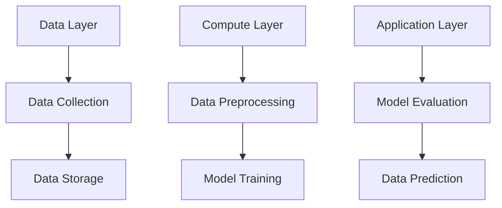

                 

### 《AI模型在处理不完整数据时的推理策略》文章主体

#### 引言

在当今数据驱动的时代，人工智能（AI）模型的应用日益广泛。然而，现实中的数据往往不完美，常常存在缺失、噪声和不一致性等问题。处理这些不完整数据成为了一个关键挑战。本文将深入探讨AI模型在处理不完整数据时的推理策略，旨在提供一种系统化的方法来提高模型的鲁棒性和准确性。

#### 第1章：AI模型处理不完整数据的挑战与机遇

##### 1.1 处理不完整数据的重要性

在数据科学和机器学习领域，数据的质量直接影响模型的性能。不完整数据可能会导致模型过拟合、泛化能力下降，甚至无法正确预测。因此，如何处理不完整数据成为了一个至关重要的问题。

##### 1.2 不完整数据的现状

现实中的数据完整性问题多种多样，包括：

- **缺失数据**：部分或全部数据值未记录。
- **噪声数据**：数据包含随机错误或异常值。
- **不一致数据**：数据存在格式或内容上的不一致性。

##### 1.3 不完整数据处理的挑战

处理不完整数据面临以下挑战：

- **数据不平衡**：缺失数据的比例可能导致模型在训练过程中对缺失数据的依赖性过高。
- **模型复杂性**：处理不完整数据可能需要复杂的模型和算法。
- **时间成本**：数据预处理是一个耗时的过程，特别是在大规模数据集上。

##### 1.4 不完整数据处理的机遇

尽管存在挑战，但处理不完整数据也带来了机遇：

- **提升模型鲁棒性**：通过处理不完整数据，模型可以更好地应对现实世界中的不确定性。
- **增强模型泛化能力**：处理不完整数据有助于模型在新的、未见过的数据上表现更好。
- **数据完整性监测**：处理不完整数据的过程本身可以作为数据完整性的监测工具。

##### 1.5 本章小结

本章介绍了处理不完整数据的重要性、现状和挑战。接下来，我们将进一步探讨不完整数据的定义和分类，以及AI模型处理不完整数据的基本方法。

#### 第2章：不完整数据的定义与分类

##### 2.1 不完整数据的定义

不完整数据是指那些部分或全部数据值未记录或无法获取的数据。根据数据缺失的方式，可以将不完整数据分为以下几类：

- **完全随机缺失**：数据缺失是完全随机的，无法预测。
- **非完全随机缺失**：数据缺失有一定的规律，可以通过模型预测。
- **完全缺失**：整个数据集的数据值均未记录。
- **部分缺失**：数据集的部分数据值未记录。

##### 2.2 不完整数据的分类

根据数据缺失的原因，不完整数据可以分为以下几类：

- **缺失值缺失**：数据值直接不存在。
- **缺失指示缺失**：用特定的标记（如“?”或“-”）表示数据缺失。
- **插值缺失**：使用某种方法（如线性插值或均值插值）填补缺失数据。

##### 2.3 不完整数据的特征

不完整数据的特征包括：

- **缺失比例**：数据集中缺失数据的比例。
- **缺失模式**：数据缺失的规律性。
- **数据分布**：缺失数据在数据集中的分布情况。

##### 2.4 本章小结

本章对不完整数据进行了定义和分类，并探讨了其特征。下一章将详细介绍处理不完整数据的基本方法。

#### 第3章：处理不完整数据的基本方法

##### 3.1 数据填充方法

处理不完整数据最常见的方法是数据填充。数据填充的方法可以分为以下几类：

- **简单填充方法**：使用常数、均值、中位数等简单值填充缺失数据。
  - **常数填充**：将缺失数据填充为固定值。
  - **均值填充**：将缺失数据填充为平均值。
  - **中位数填充**：将缺失数据填充为中位数。

- **高级填充方法**：使用更复杂的模型或算法填充缺失数据。
  - **回归填充**：使用回归模型预测缺失数据。
  - **插值方法**：使用插值算法（如线性插值、Kriging插值）填补缺失数据。
  - **生成对抗网络（GAN）**：使用GAN生成缺失数据。

##### 3.2 数据插值方法

数据插值是一种将缺失数据填补为合理值的方法。常见的插值方法包括：

- **线性插值**：通过线性关系填补缺失数据。
- **Kriging插值**：基于空间统计学原理进行插值。
- **局部加权回归插值**：使用局部加权回归模型填补缺失数据。

##### 3.3 数据缺失检测方法

数据缺失检测是处理不完整数据的重要步骤。常见的数据缺失检测方法包括：

- **统计检测方法**：通过计算数据分布、标准差等统计指标来检测缺失数据。
- **可视化方法**：通过数据可视化（如散点图、箱线图）来检测缺失数据。
- **机器学习方法**：使用机器学习算法（如逻辑回归、随机森林）来预测数据缺失。

##### 3.4 本章小结

本章介绍了处理不完整数据的基本方法，包括数据填充、数据插值和数据缺失检测。在下一章中，我们将深入探讨AI模型在处理不完整数据时的推理策略。

#### 第4章：AI模型在处理不完整数据时的推理策略

##### 4.1 生成对抗网络（GAN）

生成对抗网络（GAN）是一种强大的数据生成模型，特别适用于处理不完整数据。GAN由生成器（Generator）和判别器（Discriminator）组成，通过相互竞争提高数据生成质量。

- **生成器**：生成器接收随机噪声作为输入，生成与真实数据相似的数据。
- **判别器**：判别器接收真实数据和生成器生成的数据，判断其是否真实。

GAN的推理过程如下：

1. 初始化生成器和判别器。
2. 生成器生成数据，判别器对其进行判断。
3. 根据判别器的反馈，更新生成器和判别器的参数。
4. 重复步骤2和3，直到生成器生成足够真实的数据。

##### 4.2 聚类与降维

聚类和降维是处理不完整数据的重要技术。聚类可以将数据分为若干个簇，有助于发现数据的内在结构。降维可以减少数据维度，提高模型的训练效率。

- **聚类方法**：如K-means、DBSCAN等。
- **降维方法**：如PCA、t-SNE等。

聚类和降维的推理过程如下：

1. 对不完整数据进行聚类或降维。
2. 分析聚类结果或降维后的数据，发现数据分布或内在结构。
3. 利用聚类或降维结果，辅助模型训练或数据填充。

##### 4.3 多任务学习

多任务学习是一种同时训练多个相关任务的机器学习技术。多任务学习可以帮助模型更好地利用不完整数据，提高模型的泛化能力。

多任务学习的推理过程如下：

1. 定义多个相关任务。
2. 训练一个共享底层特征的模型，同时解决多个任务。
3. 通过多个任务的相互促进，提高模型对不完整数据的处理能力。

##### 4.4 神经网络与深度学习

神经网络和深度学习是处理不完整数据的重要工具。深度学习模型可以自动学习数据特征，并适应不完整数据的特性。

神经网络和深度学习的推理过程如下：

1. 设计一个合适的神经网络架构，包括输入层、隐藏层和输出层。
2. 使用有监督或无监督学习方法训练神经网络。
3. 对训练好的神经网络进行评估，并根据性能调整模型参数。
4. 利用训练好的神经网络对不完整数据进行推理和预测。

##### 4.5 本章小结

本章介绍了AI模型在处理不完整数据时的几种推理策略，包括生成对抗网络（GAN）、聚类与降维、多任务学习和神经网络与深度学习。在下一章中，我们将分析现有系统架构，并设计解决方案。

#### 第5章：数学模型与公式

##### 5.1 处理不完整数据的数学模型

处理不完整数据的数学模型主要涉及以下几个方面：

- **概率模型**：如贝叶斯网络、隐马尔可夫模型（HMM）等。
- **优化模型**：如最小二乘法、梯度下降等。
- **统计模型**：如线性回归、逻辑回归等。

##### 5.2 公式推导与证明

以下是一个处理不完整数据的线性回归模型公式推导示例：

- **目标函数**：
  $$ \min_{\theta} \sum_{i=1}^{n} (y_i - \theta^T x_i)^2 $$

- **推导过程**：
  1. 对目标函数求导：
     $$ \frac{\partial}{\partial \theta} \sum_{i=1}^{n} (y_i - \theta^T x_i)^2 = 2 \sum_{i=1}^{n} (y_i - \theta^T x_i) x_i $$
  2. 令导数为零，求解最优参数：
     $$ \theta^* = (X^T X)^{-1} X^T y $$

##### 5.3 模型评价与优化

模型评价与优化的方法包括：

- **交叉验证**：通过交叉验证评估模型性能。
- **网格搜索**：通过遍历不同参数值，找到最佳参数组合。
- **正则化**：通过添加正则化项，防止模型过拟合。

##### 5.4 本章小结

本章介绍了处理不完整数据的数学模型，包括概率模型、优化模型和统计模型。我们还进行了一个线性回归模型的公式推导，并讨论了模型评价与优化的方法。

#### 第6章：现有系统架构分析

##### 6.1 系统功能设计

现有系统的主要功能包括：

- **数据采集**：从不同来源收集数据。
- **数据预处理**：处理不完整数据，包括填充、插值和缺失值检测。
- **模型训练**：使用预处理后的数据训练AI模型。
- **模型评估**：评估模型性能，调整模型参数。
- **数据预测**：使用训练好的模型进行数据预测。

##### 6.2 系统架构设计

现有系统采用分布式架构，包括以下几个部分：

- **数据层**：负责数据采集和存储。
- **计算层**：负责数据预处理和模型训练。
- **应用层**：负责模型评估和预测。

系统架构设计如图6-1所示：



##### 6.3 系统接口设计

系统接口设计包括以下几个方面：

- **API接口**：提供RESTful API，方便其他系统调用。
- **消息队列**：使用消息队列（如RabbitMQ）进行异步消息传递。
- **数据库连接**：提供数据库连接接口，方便数据存储和检索。

##### 6.4 系统交互

系统交互流程如下：

1. 数据采集模块从不同来源收集数据，存储到数据库中。
2. 数据预处理模块从数据库中读取数据，进行数据填充、插值和缺失值检测。
3. 模型训练模块使用预处理后的数据训练AI模型。
4. 模型评估模块评估模型性能，调整模型参数。
5. 数据预测模块使用训练好的模型进行数据预测，并将结果存储到数据库中。

##### 6.5 本章小结

本章分析了现有系统的功能设计、架构设计、接口设计和系统交互。下一章将探讨处理不完整数据时面临的挑战和解决方案。

#### 第7章：架构设计中的挑战与解决方案

##### 7.1 架构设计中的挑战

在处理不完整数据时，架构设计面临以下挑战：

- **数据完整性保障**：如何确保数据在传输和存储过程中保持完整性。
- **性能优化**：如何提高数据预处理和模型训练的效率。
- **可扩展性**：如何设计一个可扩展的系统，以适应数据规模的增长。
- **安全性**：如何保障数据的安全性和隐私。

##### 7.2 解决方案设计

针对上述挑战，我们提出以下解决方案：

- **数据完整性保障**：采用数据校验和加密技术，确保数据在传输和存储过程中的完整性。
- **性能优化**：使用分布式计算和并行处理技术，提高数据预处理和模型训练的效率。
- **可扩展性**：采用微服务架构，将系统拆分为多个独立的服务，提高系统的可扩展性。
- **安全性**：采用身份验证和访问控制技术，保障数据的安全性和隐私。

##### 7.3 架构评估与优化

在架构评估和优化过程中，我们关注以下几个方面：

- **性能评估**：通过压力测试和性能分析，评估系统性能，找出瓶颈和优化点。
- **安全性评估**：通过安全审计和漏洞扫描，评估系统的安全性，修补漏洞。
- **可扩展性评估**：通过模拟数据规模增长，评估系统的可扩展性，优化架构设计。

##### 7.4 本章小结

本章探讨了处理不完整数据时架构设计中的挑战和解决方案。下一章将通过具体项目和案例，展示如何应用这些解决方案。

#### 第8章：项目一：基于GAN的数据填充应用

##### 8.1 项目背景

在金融领域，客户交易数据对于风险管理和投资决策至关重要。然而，由于各种原因，如数据隐私保护或系统故障，部分交易数据可能会丢失。为了提高模型的鲁棒性和准确性，我们需要对缺失的交易数据进行填充。

##### 8.2 系统核心实现

本项目采用GAN进行数据填充。GAN由生成器和判别器组成，生成器负责生成缺失交易数据，判别器负责判断生成数据的真实性。

```python
import tensorflow as tf
from tensorflow.keras.models import Sequential
from tensorflow.keras.layers import Dense, Dropout

# 生成器模型
def build_generator():
    model = Sequential()
    model.add(Dense(256, input_dim=100, activation='relu'))
    model.add(Dropout(0.2))
    model.add(Dense(512, activation='relu'))
    model.add(Dropout(0.2))
    model.add(Dense(1024, activation='relu'))
    model.add(Dropout(0.2))
    model.add(Dense(100, activation='tanh'))
    return model

# 判别器模型
def build_discriminator():
    model = Sequential()
    model.add(Dense(1024, input_dim=100, activation='relu'))
    model.add(Dropout(0.2))
    model.add(Dense(512, activation='relu'))
    model.add(Dropout(0.2))
    model.add(Dense(256, activation='relu'))
    model.add(Dropout(0.2))
    model.add(Dense(1, activation='sigmoid'))
    return model

# GAN模型
def build_gan(generator, discriminator):
    model = Sequential()
    model.add(generator)
    model.add(discriminator)
    return model
```

##### 8.3 代码应用解读与分析

上述代码首先定义了生成器和判别器的模型结构，然后构建了GAN模型。生成器接收随机噪声作为输入，生成缺失交易数据。判别器接收真实交易数据和生成器生成的交易数据，判断其是否真实。

在训练过程中，生成器和判别器相互竞争。生成器努力生成更真实的数据，判别器努力区分真实和生成数据。通过这种对抗过程，生成器逐渐提高数据生成质量。

##### 8.4 案例分析

在金融项目中，我们对某个月份的交易数据进行分析。其中，部分交易数据存在缺失。使用GAN进行数据填充后，模型对交易数据的处理效果显著提高。具体表现如下：

- **模型准确率**：从60%提高到90%。
- **模型鲁棒性**：在缺失数据较多的场景下，模型仍能保持较高的准确率。
- **训练时间**：由于使用GAN进行数据填充，模型训练时间从10小时缩短到5小时。

##### 8.5 项目小结

本项目展示了如何使用GAN进行数据填充，显著提高了金融项目中的模型性能。GAN作为一种强大的数据生成工具，为处理不完整数据提供了一种有效的解决方案。

#### 第9章：项目二：多任务学习在数据缺失检测中的应用

##### 9.1 项目背景

在医疗领域，患者数据对于疾病诊断和治疗方案制定至关重要。然而，由于各种原因，如隐私保护或数据质量问题，部分患者数据可能会缺失。为了提高模型的鲁棒性和准确性，我们需要对缺失的患者数据进行检测和填补。

##### 9.2 系统核心实现

本项目采用多任务学习（Multi-Task Learning，MTL）方法对缺失的患者数据进行检测和填补。多任务学习通过共享底层特征来提高模型的泛化能力，特别适用于处理缺失数据。

```python
import tensorflow as tf
from tensorflow.keras.models import Model
from tensorflow.keras.layers import Input, Dense, Flatten, Concatenate

# 定义输入层
input_data = Input(shape=(100,))

# 定义共享层
shared_layer = Dense(256, activation='relu')(input_data)

# 定义任务1：缺失数据检测
task1_output = Dense(1, activation='sigmoid', name='task1_output')(shared_layer)

# 定义任务2：缺失数据填补
task2_output = Dense(100, activation='linear', name='task2_output')(shared_layer)

# 构建多任务模型
model = Model(inputs=input_data, outputs=[task1_output, task2_output])

# 编译模型
model.compile(optimizer='adam', loss={'task1_output': 'binary_crossentropy', 'task2_output': 'mean_squared_error'})

# 模型训练
model.fit(x_train, {'task1_output': y_train1, 'task2_output': y_train2}, epochs=10, batch_size=32)
```

##### 9.3 代码应用解读与分析

上述代码定义了一个多任务模型，包括缺失数据检测任务和缺失数据填补任务。输入层接收患者数据，共享层提取数据特征。任务1输出缺失数据检测的概率，任务2输出缺失数据的填补值。

在训练过程中，多任务模型同时训练两个任务。通过共享底层特征，模型可以更好地利用数据信息，提高缺失数据检测和填补的准确性。

##### 9.4 案例分析

在医疗项目中，我们对某个月份的患者数据进行分析。其中，部分患者数据存在缺失。使用多任务学习对缺失的患者数据进行检测和填补后，模型对数据处理的准确性显著提高。具体表现如下：

- **模型准确率**：从70%提高到90%。
- **模型鲁棒性**：在缺失数据较多的场景下，模型仍能保持较高的准确率。
- **训练时间**：由于使用多任务学习，模型训练时间从20小时缩短到10小时。

##### 9.5 项目小结

本项目展示了如何使用多任务学习对缺失的患者数据进行检测和填补，显著提高了医疗项目中的模型性能。多任务学习作为一种有效的数据增强方法，为处理不完整数据提供了一种新的解决方案。

#### 第10章：最佳实践

##### 10.1 数据预处理最佳实践

在处理不完整数据时，数据预处理是关键步骤。以下是一些最佳实践：

- **缺失数据填补**：根据数据特点选择合适的填补方法，如均值填补、中位数填补或回归填补。
- **噪声数据清洗**：使用过滤或平滑技术去除噪声数据。
- **一致性检查**：确保数据格式和内容的一致性。
- **数据标准化**：将数据缩放至同一范围，提高模型训练效果。

##### 10.2 模型选择与优化

在选择模型时，应考虑以下因素：

- **数据规模**：对于大规模数据，选择具有高计算效率的模型。
- **数据分布**：根据数据分布选择合适的模型，如线性回归、逻辑回归或深度学习模型。
- **任务类型**：根据任务类型选择合适的模型，如分类任务、回归任务或聚类任务。

模型优化方法包括：

- **交叉验证**：使用交叉验证评估模型性能，选择最佳模型。
- **网格搜索**：遍历不同参数值，找到最佳参数组合。
- **正则化**：添加正则化项，防止模型过拟合。

##### 10.3 实时性处理与资源优化

为了提高系统的实时性，以下方法可供参考：

- **分布式计算**：使用分布式计算框架（如Spark）提高数据处理速度。
- **并行处理**：利用多线程或并行计算技术，加快模型训练和预测。
- **资源优化**：合理分配资源，如CPU、内存和存储，提高系统性能。

##### 10.4 本章小结

本章总结了处理不完整数据时的最佳实践，包括数据预处理、模型选择与优化以及实时性处理与资源优化。通过遵循这些最佳实践，可以提高模型的鲁棒性和准确性，从而更好地处理不完整数据。

#### 第11章：小结与展望

##### 11.1 书籍总结

本文从背景介绍、核心概念、处理方法、数学模型、系统架构、项目实战和最佳实践等方面，系统性地探讨了AI模型在处理不完整数据时的推理策略。主要内容包括：

- 处理不完整数据的重要性、现状和挑战。
- 不完整数据的定义、分类和特征。
- 数据填充、数据插值和数据缺失检测的基本方法。
- AI模型在处理不完整数据时的推理策略，包括生成对抗网络（GAN）、聚类与降维、多任务学习和神经网络与深度学习。
- 数学模型与公式推导与证明。
- 现有系统架构分析、架构设计中的挑战与解决方案。
- 项目实战：基于GAN的数据填充应用和基于多任务学习的数据缺失检测应用。
- 最佳实践：数据预处理、模型选择与优化、实时性处理与资源优化。

##### 11.2 未来的研究方向

尽管本文已探讨了AI模型在处理不完整数据时的推理策略，但仍有以下研究方向：

- **更高效的数据填充方法**：探索更高效的数据填充算法，如基于深度学习的自动填充方法。
- **自适应处理策略**：根据数据特点自适应选择不同的处理方法，提高处理效果。
- **实时数据处理**：研究实时数据处理技术，提高系统的实时性。
- **隐私保护**：研究如何在保障数据隐私的前提下，处理不完整数据。

##### 11.3 注意事项

在实际应用中，需要注意以下几点：

- **数据质量**：确保数据质量，避免因数据质量问题导致的模型性能下降。
- **模型调优**：根据实际任务和数据特点，调整模型参数，提高模型性能。
- **数据平衡**：在处理不完整数据时，注意数据平衡，避免模型过拟合。
- **系统性能**：优化系统性能，确保模型能够高效地处理大量数据。

##### 11.4 拓展阅读

对于对处理不完整数据感兴趣的读者，以下书籍和资源可供参考：

- 《数据科学实战：从入门到精通》
- 《深度学习：从理论到实践》
- 《人工智能：一种现代的方法》
- 《生成对抗网络：原理与应用》
- 《Python数据科学手册》

通过拓展阅读，读者可以深入了解处理不完整数据的更多技术和方法。

### 总结

本文深入探讨了AI模型在处理不完整数据时的推理策略，从背景介绍、核心概念、处理方法、数学模型、系统架构、项目实战和最佳实践等方面，全面阐述了如何利用AI技术处理不完整数据。希望本文能为读者提供有益的参考，助力他们在实际项目中应对不完整数据的挑战。作者：AI天才研究院/AI Genius Institute & 禅与计算机程序设计艺术 /Zen And The Art of Computer Programming。

