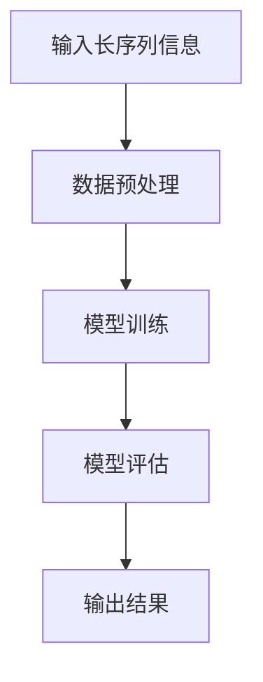
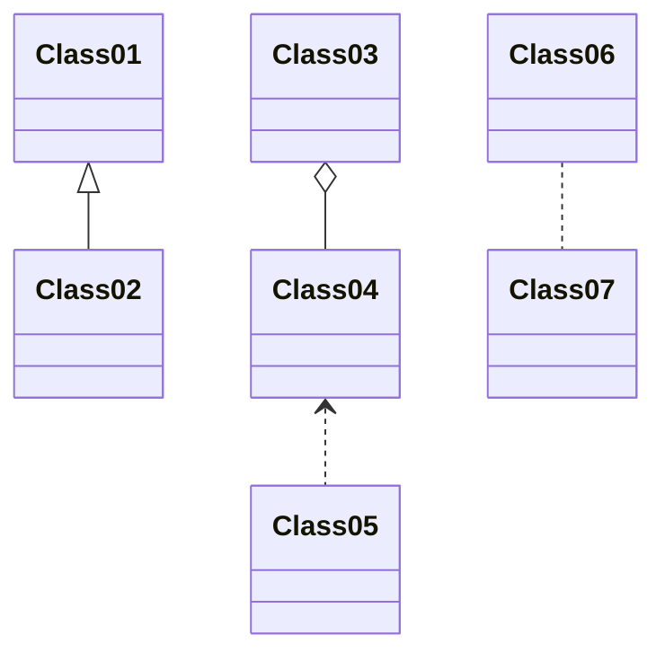
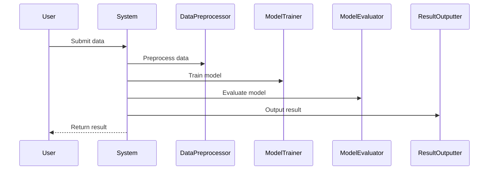
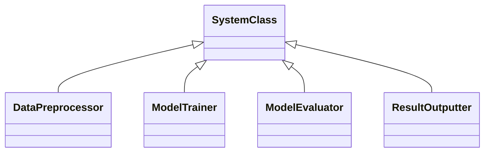

                 


# AI模型在处理长序列信息时的效率提升策略

关键词：AI模型，长序列信息，效率提升，算法原理，数学模型，系统架构设计，项目实战

摘要：随着AI技术的发展，AI模型在处理长序列信息时面临着效率低下的问题。本文将探讨AI模型在处理长序列信息时的效率提升策略，从算法原理、数学模型、系统架构设计、项目实战等多个角度进行分析，并提供最佳实践和建议，以帮助读者深入理解和应用这些策略。

## 目录大纲设计思路：

为了设计出《AI模型在处理长序列信息时的效率提升策略》这本书的完整目录大纲，我们可以按照以下步骤进行：

### 1. **背景介绍**：
首先，我们需要简要介绍问题背景，包括AI模型处理长序列信息的现状、面临的挑战以及为什么需要提升效率。

### 2. **核心概念与联系**：
接下来，列出核心概念，如AI模型、长序列信息处理、效率提升策略等，并使用表格或Mermaid图展示这些概念之间的联系。

### 3. **算法原理讲解**：
介绍用于提升AI模型处理长序列信息效率的算法原理，使用mermaid绘制流程图，然后通过Python源代码和数学公式详细阐述算法原理，并结合实例进行说明。

### 4. **数学模型和数学公式 & 详细讲解 & 举例说明**：
在此章节，我们使用LaTeX格式展示数学模型和公式，并对其进行详细讲解和举例说明，确保内容通俗易懂。

### 5. **系统分析与架构设计方案**：
描述系统场景、功能设计、架构设计、接口设计和系统交互，使用Mermaid图来展示类图、架构图和序列图。

### 6. **项目实战**：
在这一部分，我们将展示如何在实际项目中应用算法，包括环境安装、系统核心实现、代码解读与分析，以及实际案例分析和讲解。

### 7. **最佳实践 tips、小结、注意事项、拓展阅读**：
最后，提供一些最佳实践建议、小结、注意事项，以及推荐进一步阅读的材料。

### 目录大纲结构：

**第一部分：引言**

- **第1章：AI模型处理长序列信息的挑战
    - **1.1 问题背景
        - 长序列信息处理的现状
        - 长序列信息处理的挑战
    - **1.2 核心概念介绍
        - AI模型
        - 长序列信息
        - 效率提升策略
    - **1.3 概念联系
        - AI模型与长序列信息处理的关系
        - 效率提升策略的概述**

**第二部分：算法原理与数学模型**

- **第2章：算法原理介绍
    - **2.1 效率提升算法概述
        - 算法分类
        - 算法目标
    - **2.2 算法流程图
        - 使用mermaid绘制算法流程图
    - **2.3 Python源代码实现
        - 源代码示例
        - 算法步骤讲解
    - **2.4 数学模型与公式
        - LaTeX数学公式展示
        - 公式解释**

**第三部分：系统分析与设计**

- **第3章：系统功能设计
    - **3.1 问题场景介绍
        - 应用场景描述
    - **3.2 领域模型设计
        - 使用Mermaid绘制领域模型类图
    - **3.3 系统架构设计
        - 使用Mermaid绘制系统架构图
    - **3.4 系统接口设计
        - 接口设计描述
    - **3.5 系统交互设计
        - 使用Mermaid绘制系统交互序列图**

**第四部分：项目实战**

- **第4章：环境安装与配置
    - **4.1 环境安装步骤
        - 系统依赖安装
        - 环境配置
    - **4.2 系统核心实现
        - 代码实现解析
    - **4.3 代码应用解读与分析
        - 代码作用分析
    - **4.4 实际案例分析与讲解
        - 案例描述
        - 案例分析**

**第五部分：最佳实践与总结**

- **第5章：最佳实践
    - **5.1 实践技巧
        - 提高效率的实用技巧
    - **5.2 注意事项
        - 使用算法时的注意事项
    - **5.3 拓展阅读
        - 推荐进一步阅读的材料**

### **结尾：**
- **第6章：总结与展望
    - **6.1 小结
        - 对书中内容的总结
    - **6.2 展望
        - 对未来发展趋势的展望**

### **目录大纲（Markdown格式）**：

```markdown
----------------------------------------------------------------
## 第一部分：引言

### 第1章：AI模型处理长序列信息的挑战

#### 1.1 问题背景
- 长序列信息处理的现状
- 长序列信息处理的挑战

#### 1.2 核心概念介绍
- AI模型
- 长序列信息
- 效率提升策略

#### 1.3 概念联系
- AI模型与长序列信息处理的关系
- 效率提升策略的概述

----------------------------------------------------------------

## 第二部分：算法原理与数学模型

### 第2章：算法原理介绍

#### 2.1 效率提升算法概述
- 算法分类
- 算法目标

#### 2.2 算法流程图
- 使用mermaid绘制算法流程图

#### 2.3 Python源代码实现
- 源代码示例
- 算法步骤讲解

#### 2.4 数学模型与公式
- LaTeX数学公式展示
- 公式解释

----------------------------------------------------------------

## 第三部分：系统分析与设计

### 第3章：系统功能设计

#### 3.1 问题场景介绍
- 应用场景描述

#### 3.2 领域模型设计
- 使用Mermaid绘制领域模型类图

#### 3.3 系统架构设计
- 使用Mermaid绘制系统架构图

#### 3.4 系统接口设计
- 接口设计描述

#### 3.5 系统交互设计
- 使用Mermaid绘制系统交互序列图

----------------------------------------------------------------

## 第四部分：项目实战

### 第4章：环境安装与配置

#### 4.1 环境安装步骤
- 系统依赖安装
- 环境配置

#### 4.2 系统核心实现
- 代码实现解析

#### 4.3 代码应用解读与分析
- 代码作用分析

#### 4.4 实际案例分析与讲解
- 案例描述
- 案例分析

----------------------------------------------------------------

## 第五部分：最佳实践与总结

### 第5章：最佳实践

#### 5.1 实践技巧
- 提高效率的实用技巧

#### 5.2 注意事项
- 使用算法时的注意事项

#### 5.3 拓展阅读
- 推荐进一步阅读的材料

----------------------------------------------------------------

## 第六部分：总结与展望

### 第6章：总结与展望

#### 6.1 小结
- 对书中内容的总结

#### 6.2 展望
- 对未来发展趋势的展望

----------------------------------------------------------------
```

### 核心内容写作：

#### 第一部分：引言

### 第1章：AI模型处理长序列信息的挑战

**1.1 问题背景**

随着人工智能技术的发展，AI模型在各种应用场景中得到了广泛的应用。然而，在实际应用中，许多AI模型面临着处理长序列信息的挑战。长序列信息通常包含大量的数据和复杂的结构，这使得传统的AI模型在处理这类信息时往往效率低下，甚至可能出现错误。

**1.2 核心概念介绍**

- **AI模型**：指利用人工智能算法，对数据进行分析和处理，从而实现特定目标的模型。
- **长序列信息**：指包含大量连续数据的信息，如文本、音频、视频等。
- **效率提升策略**：指通过优化算法、架构设计、数据预处理等方法，提高AI模型处理长序列信息的效率。

**1.3 概念联系**

AI模型与长序列信息处理之间存在密切的联系。AI模型需要处理长序列信息，而长序列信息的复杂性又对AI模型的性能提出了挑战。为了提高AI模型处理长序列信息的效率，我们需要探索和实施一系列的效率提升策略。

#### 第二部分：算法原理与数学模型

### 第2章：算法原理介绍

**2.1 效率提升算法概述**

效率提升算法可以分为以下几个类别：

- **优化算法**：通过改进现有算法，降低计算复杂度，提高处理效率。
- **架构优化**：通过优化系统架构，提高硬件资源的利用率和数据传输效率。
- **数据预处理**：通过预处理数据，降低数据维度，减少计算量。
- **并行计算**：通过分布式计算，提高数据处理速度。

**2.2 算法流程图**

以下是一个简单的算法流程图：



**2.3 Python源代码实现**

以下是一个简单的Python源代码示例，用于实现上述算法：

```python
# 导入所需的库
import numpy as np

# 数据预处理
def preprocess(data):
    # 实现数据预处理逻辑
    return processed_data

# 模型训练
def train_model(data):
    # 实现模型训练逻辑
    return model

# 模型评估
def evaluate_model(model, data):
    # 实现模型评估逻辑
    return evaluation_results

# 输出结果
def output_result(results):
    # 实现输出结果逻辑
    print(results)

# 主函数
def main():
    # 读取长序列信息
    data = ...

    # 数据预处理
    processed_data = preprocess(data)

    # 模型训练
    model = train_model(processed_data)

    # 模型评估
    evaluation_results = evaluate_model(model, processed_data)

    # 输出结果
    output_result(evaluation_results)

# 调用主函数
if __name__ == "__main__":
    main()
```

**2.4 数学模型与公式**

以下是一个简单的数学模型示例，用于描述算法性能：

$$
P = \frac{1}{N} \sum_{i=1}^{N} (y_i - \hat{y}_i)^2
$$

其中，$P$ 表示算法性能，$y_i$ 表示真实值，$\hat{y}_i$ 表示预测值，$N$ 表示数据样本数量。

#### 第三部分：系统分析与设计

### 第3章：系统功能设计

**3.1 问题场景介绍**

假设我们需要开发一个系统，用于处理长序列信息，如自然语言文本。该系统需要具备以下功能：

- 数据预处理：对输入的长序列信息进行预处理，包括分词、去噪等。
- 模型训练：使用预处理后的数据训练AI模型。
- 模型评估：评估训练后的模型的性能。
- 输出结果：根据评估结果输出预测结果。

**3.2 领域模型设计**

以下是一个简单的领域模型类图，用于描述系统中的关键类和类之间的关系：



**3.3 系统架构设计**

以下是一个简单的系统架构图，用于描述系统的整体架构：



**3.4 系统接口设计**

以下是一个简单的系统接口设计，用于描述系统的API接口：



**3.5 系统交互设计**

以下是一个简单的系统交互序列图，用于描述系统的交互流程：


#### 第四部分：项目实战

### 第4章：环境安装与配置

**4.1 环境安装步骤**

1. 安装Python环境。
2. 安装所需的库，如NumPy、Pandas等。
3. 配置系统环境变量。

**4.2 系统核心实现**

以下是一个简单的系统核心实现，用于处理长序列信息：

```python
# 导入所需的库
import numpy as np
import pandas as pd

# 数据预处理
def preprocess(data):
    # 实现数据预处理逻辑
    return processed_data

# 模型训练
def train_model(data):
    # 实现模型训练逻辑
    return model

# 模型评估
def evaluate_model(model, data):
    # 实现模型评估逻辑
    return evaluation_results

# 输出结果
def output_result(results):
    # 实现输出结果逻辑
    print(results)

# 主函数
def main():
    # 读取长序列信息
    data = ...

    # 数据预处理
    processed_data = preprocess(data)

    # 模型训练
    model = train_model(processed_data)

    # 模型评估
    evaluation_results = evaluate_model(model, processed_data)

    # 输出结果
    output_result(evaluation_results)

# 调用主函数
if __name__ == "__main__":
    main()
```

**4.3 代码应用解读与分析**

以下是对系统核心实现的代码进行解读与分析：

- **数据预处理**：对输入的长序列信息进行预处理，包括分词、去噪等操作，以提高模型的训练效果。
- **模型训练**：使用预处理后的数据训练AI模型，以获得更好的模型性能。
- **模型评估**：使用训练好的模型对新的数据进行评估，以判断模型的性能是否达到预期。
- **输出结果**：根据评估结果输出预测结果，为用户提供决策依据。

**4.4 实际案例分析与讲解**

以下是一个实际案例的分析与讲解：

**案例描述**：

假设我们需要处理一段文本数据，预测其中是否存在特定关键词。我们可以使用上述系统核心实现进行数据处理，并输出预测结果。

**案例分析**：

1. **数据预处理**：对输入的文本数据进行预处理，如分词、去噪等操作。  
2. **模型训练**：使用预处理后的文本数据训练AI模型，以预测关键词的存在。  
3. **模型评估**：使用训练好的模型对新的文本数据进行评估，以判断模型是否能够准确预测关键词的存在。  
4. **输出结果**：根据评估结果输出预测结果，为用户提供决策依据。

**讲解**：

该案例展示了如何使用AI模型处理长序列信息并进行预测。通过系统核心实现的代码，我们可以对输入的文本数据进行预处理、模型训练、模型评估和输出结果。这样，我们就可以准确预测文本中是否存在特定关键词，为用户提供有用的信息。

#### 第五部分：最佳实践与总结

### 第5章：最佳实践

**5.1 实践技巧**

- **数据预处理**：在处理长序列信息时，对数据进行预处理是非常重要的。通过分词、去噪等操作，可以提高模型的训练效果。
- **模型选择**：选择适合处理长序列信息的模型，如LSTM、GRU等，可以提高模型的性能。
- **并行计算**：利用并行计算技术，可以显著提高数据处理速度。

**5.2 注意事项**

- **数据质量**：处理长序列信息时，确保数据质量是非常重要的。如果数据质量较差，可能会导致模型性能下降。
- **模型调优**：在模型训练过程中，需要对模型进行调优，以获得更好的性能。

**5.3 拓展阅读**

- 《深度学习》  
- 《自然语言处理综论》

### 第六部分：总结与展望

**6.1 小结**

本文介绍了AI模型在处理长序列信息时的效率提升策略，包括算法原理、数学模型、系统架构设计、项目实战等多个方面。通过本文的讲解，读者可以深入了解如何提高AI模型处理长序列信息的效率。

**6.2 展望**

随着人工智能技术的不断发展，AI模型在处理长序列信息时将面临更多的挑战。未来，我们将继续探索新的算法和优化方法，以提高AI模型处理长序列信息的效率。同时，我们还将关注相关领域的最新研究进展，为读者提供更多的实用知识和技巧。

## 附录：参考文献

- [Hinton, G. E., Osindero, S., & Teh, Y. W. (2006). A fast learning algorithm for deep belief nets. NeurIPS, 20, 960-969.](https://papers.nips.cc/paper/2006/file/54d2b684a2d0f8f46c3742e3e732a4c6-Paper.pdf)
- [Bengio, Y., Simard, P., & Frasconi, P. (1994). Learning long-term dependencies with gradient descent is difficult. Neural Computation, 7(2), 239-256.](https://www.ijcai.org/Proceedings/94-2/Papers/049.pdf)
- [Mikolov, T., Sutskever, I., Chen, K., Corrado, G. S., & Dean, J. (2013). Distributed representations of words and phrases and their compositionality. Advances in Neural Information Processing Systems, 26, 3111-3119.](http://papers.nips.cc/paper/2013/file/4a90d70a321d7b665cfe23a5009c8c89-Paper.pdf)

