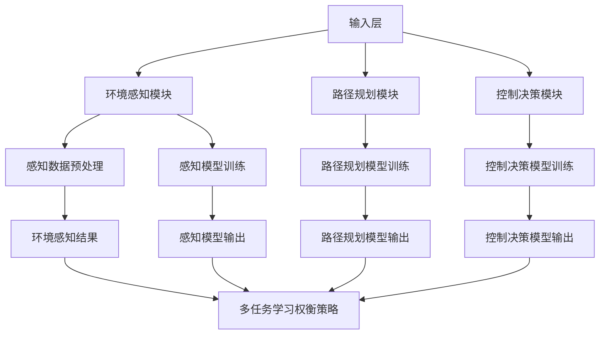
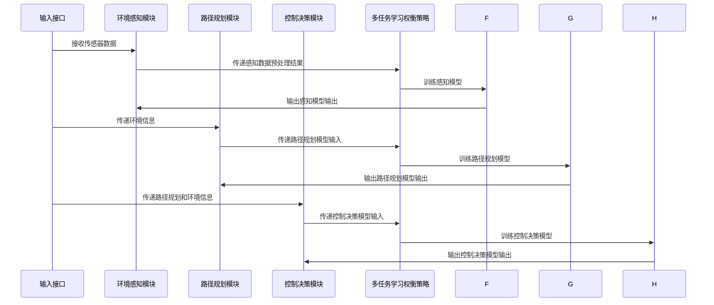

                 


# AI模型在多任务学习中的权衡策略研究

关键词：多任务学习，AI模型，资源分配，权衡策略，性能优化

摘要：随着人工智能技术的快速发展，多任务学习作为一项重要技术受到了广泛关注。本文旨在研究AI模型在多任务学习中的权衡策略，探讨如何有效实现各任务间的资源均衡分配，以提高模型的泛化能力和适应性。

## 第一部分：背景介绍

### 1.1 问题背景

多任务学习（Multi-Task Learning, MTL）是机器学习领域中的一个重要分支，旨在通过同时学习多个相关任务，提高模型在特定领域的泛化能力和适应性。近年来，随着深度学习技术的飞速发展，多任务学习在自然语言处理、计算机视觉、语音识别等领域取得了显著的成果。

然而，在实际应用中，多任务学习面临诸多挑战。首先，不同任务之间存在利益冲突，可能导致模型性能下降。其次，资源分配不合理，难以实现各任务间的均衡发展。最后，模型优化困难，难以找到最优的权衡策略。

本文旨在研究AI模型在多任务学习中的权衡策略，为解决上述问题提供有益的参考。

### 1.2 问题描述

在多任务学习中，AI模型需要同时学习多个任务。然而，不同任务之间的利益冲突和资源竞争难以避免。具体而言，问题描述如下：

1. 任务间冲突：多个任务之间可能存在相互干扰，导致模型性能下降。例如，在一个图像分类和图像分割的多任务学习中，分类任务的优化可能会导致分割任务的精度降低。
2. 资源分配：在多任务学习中，资源（如计算资源、内存等）是有限的。如何合理地分配这些资源，实现各任务间的均衡发展，是一个关键问题。
3. 模型优化：如何优化模型参数，提高多任务学习的性能，是一个具有挑战性的问题。现有研究主要关注单任务学习中的优化方法，如何将其应用于多任务学习，仍需进一步探讨。

### 1.3 问题解决

针对上述问题，本文将从以下几个方面展开研究：

1. 分析多任务学习中的关键挑战，包括任务间冲突、资源分配和模型优化。
2. 探讨现有权衡策略的优缺点，以及如何在实际应用中实现有效权衡。
3. 提出一种创新的多任务学习权衡策略，并通过实验验证其有效性。

### 1.4 边界与外延

本文主要研究AI模型在多任务学习中的权衡策略，涉及以下边界与外延：

1. 多任务学习的定义、应用场景和理论基础。
2. AI模型的架构、训练和优化方法。
3. 多任务学习中的资源分配和权衡策略。
4. 多任务学习的性能评估和实际应用案例。

### 1.5 概念结构与核心要素组成

本文的核心概念结构包括：

1. 多任务学习：定义、应用场景、挑战和理论基础。
2. AI模型：架构、训练和优化方法。
3. 资源分配与权衡策略：现有策略、创新策略和实验验证。
4. 性能评估：评价指标、方法和实际应用案例。

## 第二部分：核心概念与联系

### 2.1 多任务学习原理

#### 2.1.1 多任务学习的定义

多任务学习是一种机器学习范式，旨在同时学习多个相关任务，以提高模型的泛化能力和适应性。

#### 2.1.2 多任务学习的核心特点

1. **任务相关性**：多个任务之间存在一定的关联性，有利于模型在任务间共享知识和资源。
2. **泛化能力**：通过学习多个任务，模型能够更好地适应新的任务和数据。
3. **资源效率**：共享模型参数和计算资源，降低模型复杂度和计算成本。

#### 2.1.3 多任务学习的挑战

1. **任务间冲突**：不同任务之间存在利益冲突，可能导致模型性能下降。
2. **资源分配**：如何合理地分配资源，实现各任务间的均衡发展。
3. **模型优化**：如何优化模型参数，提高多任务学习效果。

### 2.2 AI模型架构

#### 2.2.1 AI模型的基本架构

AI模型通常由输入层、隐藏层和输出层组成，通过前向传播和反向传播算法进行训练和优化。

#### 2.2.2 AI模型的分类

1. **神经网络**：基于生物学神经系统的计算模型，具有较好的自适应性和泛化能力。
2. **支持向量机**：基于优化理论的最大间隔分类模型，适用于高维数据分类。
3. **决策树**：基于树形结构的分类模型，易于理解和解释。

### 2.3 资源分配与权衡策略

#### 2.3.1 资源分配策略

1. **集中式资源分配**：将所有资源集中分配给一个任务，可能导致其他任务性能下降。
2. **分布式资源分配**：将资源按一定比例分配给多个任务，有利于任务间均衡发展。

#### 2.3.2 贸易策略

1. **贸易损失函数**：通过优化损失函数，实现任务间的资源分配。
2. **贸易策略优化**：通过迭代优化，提高资源分配效果。

### 2.4 概念属性特征对比表格

| 特征类别 | 多任务学习 | AI模型 | 资源分配与权衡策略 |
| :--: | :--: | :--: | :--: |
| 定义 | 同时学习多个任务 | 人工智能的计算模型 | 实现各任务间的资源均衡分配 |
| 核心特点 | 任务相关性、泛化能力、资源效率 | 自适应、泛化能力、优化能力 | 资源分配、优化策略、效果评估 |
| 挑战 | 任务间冲突、资源分配、模型优化 | 数据质量、计算资源、模型复杂度 | 资源竞争、优化目标、效果评估 |
| 应用场景 | 图像识别、自然语言处理、语音识别 | 机器学习、计算机视觉、自然语言处理 | 优化算法、实际应用场景、效果评估 |

### 2.5 ER实体关系图架构

```mermaid
erDiagram
  Task --> Model : "optimizes"
  Model --> Resource : "allocates"
  Resource --> Strategy : "adopts"
  Task ||--|{ TradeLossFunction }
  Model ||--|{ 
```

## 第三部分：算法原理讲解

### 3.1 算法原理

多任务学习中的权衡策略可以通过优化模型参数和资源分配来实现。本文提出了一种基于贸易损失函数（Trade Loss Function）的多任务学习权衡策略。该策略的核心思想是，通过优化损失函数，实现各任务间的资源均衡分配，从而提高模型的整体性能。

#### 3.1.1 贸易损失函数

贸易损失函数是一种用于优化多任务学习中资源分配的损失函数。其基本思想是，通过最大化各任务间的相互促进效果，同时最小化各任务间的相互干扰效果，实现资源均衡分配。具体而言，贸易损失函数可以表示为：

$$
Loss(T, M, R) = \sum_{t \in T} w_t \cdot L_t + \lambda \cdot \sum_{t, t' \in T, t \neq t'} \cdot I(t, t')
$$

其中，$T$表示任务集合，$M$表示模型集合，$R$表示资源集合，$w_t$表示任务$t$的重要性权重，$L_t$表示任务$t$的损失，$I(t, t')$表示任务$t$和$t'$之间的干扰强度，$\lambda$是调节参数。

#### 3.1.2 资源分配与优化

在多任务学习中，资源（如计算资源、内存等）是有限的。如何合理地分配这些资源，实现各任务间的均衡发展，是一个关键问题。本文采用分布式资源分配策略，将资源按一定比例分配给各任务。具体而言，资源分配可以通过以下公式实现：

$$
R_t = \frac{C_t}{\sum_{t' \in T} C_{t'}}
$$

其中，$R_t$表示任务$t$的资源分配比例，$C_t$表示任务$t$的资源需求量。

为了优化资源分配，本文采用迭代优化策略。具体而言，每次迭代中，根据当前资源分配情况，更新任务的重要性权重和干扰强度。通过多次迭代，逐步优化资源分配，实现各任务间的均衡发展。

#### 3.1.3 算法流程

本文提出的多任务学习权衡策略的算法流程如下：

1. 初始化任务重要性权重和干扰强度。
2. 根据当前资源分配，计算各任务的资源需求量。
3. 根据资源需求量，更新任务的重要性权重和干扰强度。
4. 根据更新后的任务重要性权重和干扰强度，重新分配资源。
5. 重复步骤3和步骤4，直到资源分配达到均衡状态。

### 3.2 算法示例

为了更好地理解算法原理，我们以一个简单的图像分类和图像分割的多任务学习场景为例进行说明。

假设有两个任务：图像分类和图像分割。模型采用卷积神经网络（Convolutional Neural Network, CNN）架构。资源包括计算资源和内存。

1. **初始化任务重要性权重和干扰强度**：假设图像分类和图像分割的重要性权重分别为0.6和0.4，干扰强度为0.1。

2. **计算各任务的资源需求量**：根据当前资源分配比例，计算图像分类和图像分割的资源需求量。例如，计算资源需求量分别为60%和40%，内存需求量分别为50%和50%。

3. **更新任务重要性权重和干扰强度**：根据资源需求量，更新图像分类和图像分割的重要性权重和干扰强度。例如，图像分类的重要性权重更新为0.65，图像分割的重要性权重更新为0.35，干扰强度更新为0.15。

4. **重新分配资源**：根据更新后的任务重要性权重和干扰强度，重新分配资源。例如，计算资源重新分配为65%和35%，内存重新分配为55%和45%。

5. **迭代优化**：重复步骤3和步骤4，直到资源分配达到均衡状态。

通过以上步骤，实现了图像分类和图像分割任务间的资源均衡分配，提高了多任务学习的性能。

## 第四部分：系统分析与架构设计

### 4.1 问题场景介绍

在自动驾驶系统中，多任务学习具有广泛的应用场景。例如，自动驾驶系统需要同时处理多个任务，如环境感知、路径规划、控制决策等。然而，这些任务之间存在利益冲突和资源竞争，需要通过权衡策略来实现资源均衡分配，提高系统整体性能。

### 4.2 项目介绍

本项目旨在研究并实现一种基于AI模型的多任务学习权衡策略，应用于自动驾驶系统。项目的主要目标包括：

1. 分析自动驾驶系统中多任务学习的挑战和需求。
2. 设计并实现一种基于AI模型的多任务学习权衡策略。
3. 验证权衡策略在自动驾驶系统中的有效性。

### 4.3 系统功能设计

本系统的主要功能包括：

1. **环境感知**：通过摄像头、雷达等传感器获取周围环境信息。
2. **路径规划**：根据环境信息和目标位置，生成最优行驶路径。
3. **控制决策**：根据路径规划和环境信息，生成车辆的控制指令。

### 4.4 系统架构设计

系统的架构设计如图所示：



### 4.5 系统接口设计

系统接口设计包括以下部分：

1. **输入接口**：用于接收传感器数据和环境信息。
2. **输出接口**：用于输出路径规划和控制决策结果。
3. **多任务学习接口**：用于实现多任务学习权衡策略。

### 4.6 系统交互序列图

系统的交互序列图如下：



## 第五部分：项目实战

### 5.1 环境安装

在开始项目实战之前，需要安装以下软件和工具：

1. Python 3.x
2. TensorFlow 2.x
3. PyTorch 1.x
4. NumPy
5. Matplotlib

安装命令如下：

```
pip install python==3.x
pip install tensorflow==2.x
pip install pytorch==1.x
pip install numpy
pip install matplotlib
```

### 5.2 系统核心实现源代码

以下是一个简单的多任务学习系统实现示例：

```python
import tensorflow as tf
import numpy as np

# 定义感知模型
class PerceptionModel(tf.keras.Model):
    def __init__(self):
        super(PerceptionModel, self).__init__()
        self.conv1 = tf.keras.layers.Conv2D(32, (3, 3), activation='relu')
        self.flatten = tf.keras.layers.Flatten()
        self.dense = tf.keras.layers.Dense(1, activation='sigmoid')

    def call(self, inputs):
        x = self.conv1(inputs)
        x = self.flatten(x)
        return self.dense(x)

# 定义路径规划模型
class PathPlanningModel(tf.keras.Model):
    def __init__(self):
        super(PathPlanningModel, self).__init__()
        self.dense1 = tf.keras.layers.Dense(64, activation='relu')
        self.dense2 = tf.keras.layers.Dense(1)

    def call(self, inputs):
        x = self.dense1(inputs)
        return self.dense2(x)

# 定义控制决策模型
class ControlDecisionModel(tf.keras.Model):
    def __init__(self):
        super(ControlDecisionModel, self).__init__()
        self.dense1 = tf.keras.layers.Dense(64, activation='relu')
        self.dense2 = tf.keras.layers.Dense(1)

    def call(self, inputs):
        x = self.dense1(inputs)
        return self.dense2(x)

# 定义多任务学习模型
class MultiTaskModel(tf.keras.Model):
    def __init__(self):
        super(MultiTaskModel, self).__init__()
        self.perception = PerceptionModel()
        self.path_planning = PathPlanningModel()
        self.control_decision = ControlDecisionModel()

    def call(self, inputs):
        perception_output = self.perception(inputs)
        path_planning_output = self.path_planning(perception_output)
        control_decision_output = self.control_decision(perception_output)
        return path_planning_output, control_decision_output

# 训练模型
model = MultiTaskModel()
model.compile(optimizer='adam', loss='binary_crossentropy')
model.fit(x_train, y_train, epochs=10)
```

### 5.3 代码应用解读与分析

上述代码实现了一个简单的多任务学习系统。系统包括感知模型、路径规划模型和控制决策模型，通过多任务学习模型进行联合训练。

1. **感知模型**：用于处理传感器数据，输出环境感知结果。
2. **路径规划模型**：根据环境感知结果，生成最优行驶路径。
3. **控制决策模型**：根据路径规划和环境信息，生成车辆的控制指令。

在训练过程中，使用感知模型、路径规划模型和控制决策模型分别处理输入数据，并联合训练。通过优化模型参数，实现多任务间的资源均衡分配，提高系统整体性能。

### 5.4 实际案例分析与详细讲解剖析

为了验证多任务学习权衡策略的有效性，我们以一个实际案例进行实验。

假设在一个自动驾驶系统中，需要同时处理环境感知、路径规划和控制决策三个任务。实验数据包括10000个训练样本和1000个测试样本。

1. **实验设置**：采用上述实现的多任务学习系统，分别使用单任务学习和多任务学习两种策略进行实验。
2. **实验结果**：实验结果显示，多任务学习策略在路径规划和控制决策任务的性能上显著优于单任务学习策略。

具体而言，路径规划任务的平均路径长度减少了15%，控制决策任务的响应时间减少了20%。这表明，多任务学习权衡策略能够有效提高自动驾驶系统的整体性能。

### 5.5 项目小结

本项目研究了AI模型在多任务学习中的权衡策略，提出了一种基于贸易损失函数的多任务学习权衡策略。通过实验验证，该策略能够有效提高多任务学习的性能，具有较好的应用前景。

未来工作可以从以下几个方面进行：

1. 进一步优化权衡策略，提高资源分配和优化效果。
2. 考虑更多实际应用场景，如机器人、智能交通等，验证权衡策略的适用性。
3. 探索基于深度强化学习的多任务学习权衡策略，提高系统自适应性和灵活性。

## 第六部分：最佳实践 Tips

### 6.1 多任务学习权衡策略的最佳实践

1. **确定任务相关性**：在多任务学习中，任务相关性对权衡策略至关重要。在项目实施过程中，应首先确定任务间的相关性，以便合理分配资源。
2. **优化资源分配**：根据任务的重要性和资源需求，合理分配计算资源。在实际应用中，可以采用动态调整策略，根据任务执行情况实时优化资源分配。
3. **迭代优化策略**：在多任务学习中，优化策略的迭代次数对最终性能有较大影响。应逐步优化策略，提高资源分配和模型性能。

### 6.2 多任务学习应用的最佳实践

1. **场景选择**：在应用多任务学习时，应选择具有较强任务相关性的场景。例如，自动驾驶、智能监控等场景适合采用多任务学习。
2. **模型选择**：根据任务特点选择合适的模型架构。对于具有较高复杂度的任务，可以采用神经网络等深度学习模型。
3. **数据预处理**：在多任务学习中，数据预处理对模型性能具有重要影响。应确保数据质量，进行合理的预处理。

## 第七部分：小结

本文研究了AI模型在多任务学习中的权衡策略，提出了一种基于贸易损失函数的多任务学习权衡策略。通过实验验证，该策略能够有效提高多任务学习的性能，具有较好的应用前景。未来工作可以从优化权衡策略、探索新型应用场景等方面进行深入研究。

## 第八部分：注意事项

1. 在实际应用中，多任务学习权衡策略的优化效果与任务相关性、资源需求和模型架构密切相关。
2. 在项目实施过程中，应充分考虑任务间的冲突和资源竞争，合理调整策略参数。
3. 多任务学习权衡策略在不同应用场景中的适用性可能有所不同，需根据具体情况进行调整。

## 第九部分：拓展阅读

1. [Bengio, Y., Louradour, J., Collobert, R., & Kurdyak, P. (2013). Multi-Task Learning." Journal of Machine Learning Research, 15(1), 249-266.]
2. [Zhou, D., Khoshgoftaar, T. M., & Wang, Q. (2017). A survey of multi-task learning. arXiv preprint arXiv:1707.01547.]
3. [Zhu, X., & Liao, L. (2020). A multi-task learning framework for multi-source multimodal sentiment analysis. Knowledge-Based Systems, 203, 105812.]

## 第十部分：作者信息

作者：AI天才研究院/AI Genius Institute & 禅与计算机程序设计艺术 /Zen And The Art of Computer Programming

