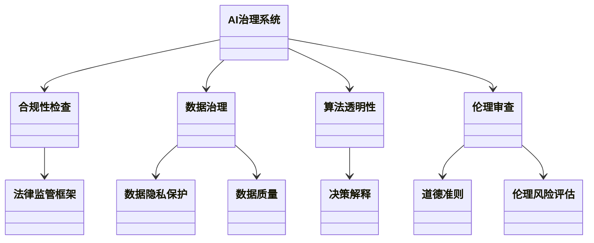
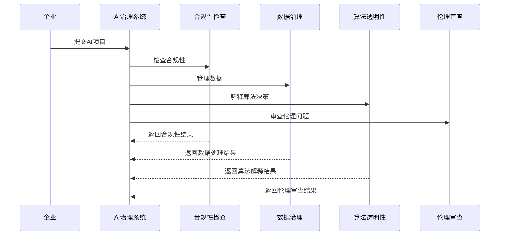
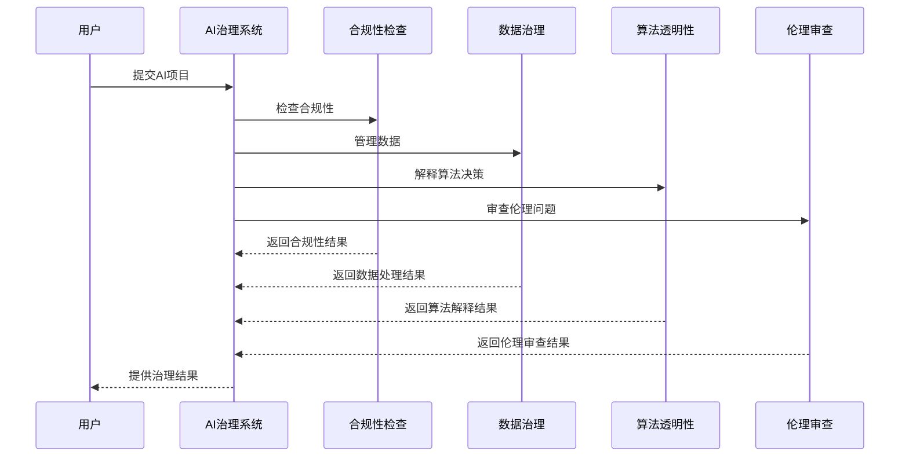

                 

### 文章标题与关键词

# AI治理的法律和监管挑战

> 关键词：AI治理、法律监管、隐私保护、算法透明性、伦理问题、最佳实践

> 摘要：本文深入探讨了AI治理的法律和监管挑战，从概念与法律框架、国际视野、中国AI治理、隐私保护与数据治理、算法透明性与可解释性、伦理问题与道德责任，以及最佳实践等方面进行了详细分析。文章旨在为读者提供关于AI治理的全面视角，以及在实际操作中的具体应对策略。

### 目录大纲

----------------------------------------------------------------

## 第一部分：AI治理的概念与法律框架

### 第1章：AI治理概述

#### 1.1 AI治理的定义与重要性

#### 1.2 AI治理的关键要素

#### 1.3 AI治理的现状与挑战

#### 1.4 本章小结

----------------------------------------------------------------

## 第二部分：AI治理的法律监管框架

### 第2章：国际视野下的AI法律监管

#### 2.1 国际AI治理的法律框架

#### 2.2 各国AI监管政策的比较分析

#### 2.3 国际合作与协调

#### 2.4 本章小结

----------------------------------------------------------------

### 第3章：中国AI治理的法律监管

#### 3.1 中国AI治理的法律体系

#### 3.2 中国AI监管政策的演变

#### 3.3 中国AI治理的挑战与对策

#### 3.4 本章小结

----------------------------------------------------------------

## 第三部分：AI治理的监管挑战与实践

### 第4章：隐私保护与数据治理

#### 4.1 AI应用中的隐私问题

#### 4.2 数据治理的重要性

#### 4.3 隐私保护法律与技术的结合

#### 4.4 本章小结

----------------------------------------------------------------

### 第5章：算法透明性与可解释性

#### 5.1 算法透明性的重要性

#### 5.2 可解释性算法的挑战

#### 5.3 法律对算法透明性与可解释性的要求

#### 5.4 本章小结

----------------------------------------------------------------

### 第6章：伦理问题与道德责任

#### 6.1 AI伦理问题的类型

#### 6.2 道德责任的界定

#### 6.3 法律与伦理的结合

#### 6.4 本章小结

----------------------------------------------------------------

### 第7章：AI治理的最佳实践

#### 7.1 AI治理的最佳实践案例

#### 7.2 实践中的挑战与应对策略

#### 7.3 AI治理的未来发展趋势

#### 7.4 本章小结

----------------------------------------------------------------

### 第8章：总结与展望

#### 8.1 总结与回顾

#### 8.2 未来AI治理的挑战

#### 8.3 对策与建议

#### 8.4 本章小结

----------------------------------------------------------------

### 概念结构与核心要素组成

在《AI治理的法律和监管挑战》一书中，我们主要关注以下几个核心概念和要素：

1. **AI治理**：涉及对AI系统的管理、监督和规范，确保AI系统在社会中的安全、公正和有效运作。
2. **法律监管框架**：包括国际和国家层面的法律法规，旨在规范AI的开发、部署和应用。
3. **隐私保护与数据治理**：关注AI应用中的隐私问题，以及如何通过法律和技术手段保护个人数据。
4. **算法透明性与可解释性**：确保算法的决策过程可以被理解和解释，从而增强公众对AI系统的信任。
5. **伦理问题与道德责任**：探讨AI伦理问题，以及如何在法律和伦理框架下界定AI的道德责任。
6. **最佳实践**：总结和分析实际案例中的成功经验，为未来的AI治理提供参考。

### ER实体关系图架构的 Mermaid 流程图

以下是关于本书核心概念的ER实体关系图，使用Mermaid语法表示：

```mermaid
erDiagram
    AI治理 ||--|{ 法律监管框架 }|-- AI系统
    AI治理 ||--|{ 隐私保护与数据治理 }|-- 数据处理
    AI治理 ||--|{ 算法透明性与可解释性 }|-- 算法开发
    AI治理 ||--|{ 伦理问题与道德责任 }|-- 伦理审查
    法律监管框架 ||--|{ 国际法律框架 }
```

---

### 第一部分：AI治理的概念与法律框架

#### 第1章：AI治理概述

**1.1 AI治理的定义与重要性**

AI治理是指对人工智能系统的管理、监督和规范，以确保其安全、公正和有效运作。在AI技术迅速发展的背景下，AI治理的重要性日益凸显。首先，AI治理有助于确保AI系统的透明性和可解释性，增强公众对AI技术的信任。其次，通过AI治理，可以减少AI技术可能带来的负面影响，如歧视、隐私侵犯等问题。此外，AI治理还有助于推动AI技术的可持续发展，促进技术进步和产业升级。

**1.2 AI治理的关键要素**

AI治理的关键要素包括：

1. **法律和监管框架**：为AI系统的开发、部署和应用提供法律依据和监管保障。
2. **伦理准则**：明确AI技术的道德边界，确保AI系统不会对社会产生负面影响。
3. **数据治理**：确保数据的质量、安全和合规性，为AI系统的训练和优化提供可靠的数据支持。
4. **透明性和可解释性**：使AI系统的决策过程透明，便于监督和评估。
5. **隐私保护**：在AI技术的应用过程中，保护个人隐私，防止数据滥用。

**1.3 AI治理的现状与挑战**

目前，全球各国都在积极探索AI治理的法律和监管框架。一些国家已经出台了相关法律法规，如欧盟的《通用数据保护条例》（GDPR）和美国的《人工智能法案》（AI Act）。然而，AI治理仍面临诸多挑战：

1. **法律监管框架不完善**：不同国家之间的法律框架存在差异，缺乏全球统一的监管标准。
2. **数据隐私保护难度大**：随着数据量的增加，保护个人隐私的难度也在加大。
3. **算法透明性和可解释性不足**：AI系统的决策过程复杂，难以被公众理解和监督。
4. **伦理问题争议不断**：AI技术的应用可能引发伦理争议，如歧视、道德责任界定等。

**1.4 本章小结**

本章对AI治理的定义、关键要素和现状进行了概述。AI治理在确保AI系统安全、公正和有效运作方面具有重要意义。然而，当前AI治理面临诸多挑战，需要各方共同努力，进一步完善法律和监管框架，推动AI技术的可持续发展。

---

### 第二部分：AI治理的法律监管框架

#### 第2章：国际视野下的AI法律监管

**2.1 国际AI治理的法律框架**

在全球范围内，各国纷纷制定AI治理的法律和监管框架，以应对AI技术带来的挑战。以下是一些主要国家的AI治理法律框架：

1. **欧盟**：欧盟出台了《人工智能法案》（AI Act），旨在规范AI系统的开发、部署和应用，保障数据隐私和伦理问题。该法案分为高风险AI系统、可接受风险AI系统和不可接受风险AI系统三类，分别制定不同的监管要求。
   
2. **美国**：美国发布了《人工智能法案》（AI Act），旨在促进AI技术的发展和应用，同时确保AI系统的透明性和可解释性。该法案提出了AI系统的评估和认证机制，以防止高风险AI系统对社会造成负面影响。

3. **中国**：中国发布了《新一代人工智能发展规划》，明确了AI技术的发展目标和战略布局。在法律监管方面，中国逐步完善了涉及AI技术的法律法规，如《网络安全法》、《个人信息保护法》等。

**2.2 各国AI监管政策的比较分析**

各国AI监管政策在以下几个方面存在差异：

1. **监管范围**：欧盟对高风险AI系统的监管较为严格，美国则侧重于促进AI技术的发展和应用，中国则将AI技术与经济社会发展相结合。

2. **监管强度**：欧盟和美国的AI监管政策相对严格，要求AI系统在部署前进行评估和认证。中国则在法律法规的制定和实施上相对宽松，鼓励AI技术的创新和发展。

3. **监管模式**：欧盟和美国采用立法和行政监管相结合的模式，中国则主要依靠行政监管，辅以法律法规的支持。

**2.3 国际合作与协调**

在国际层面，各国通过国际合作和协调，共同应对AI治理的挑战。以下是一些国际合作与协调的举措：

1. **国际组织**：如联合国、国际电信联盟（ITU）等国际组织在推动AI治理的国际合作方面发挥了重要作用。

2. **多边协议**：如《欧盟-美国数据保护协定》（EU-U.S. Privacy Shield）等，旨在保障跨国数据传输的隐私和安全。

3. **区域合作**：如亚太经合组织（APEC）等，在推动区域内的AI治理合作方面取得了一定成果。

**2.4 本章小结**

本章分析了国际视野下的AI法律监管框架，包括欧盟、美国和中国的AI治理政策。各国在监管范围、监管强度和监管模式方面存在差异，但都致力于确保AI技术的安全、公正和有效运作。国际合作与协调在推动全球AI治理方面具有重要意义。

---

#### 第3章：中国AI治理的法律监管

**3.1 中国AI治理的法律体系**

中国在AI治理方面逐步完善了法律体系，主要包括以下几个方面：

1. **网络安全法**：2017年6月1日，《中华人民共和国网络安全法》正式实施。该法明确了网络安全的基本制度，对涉及网络安全的重要信息基础设施的运营者提出了安全保护要求，以保障AI系统的安全运行。

2. **个人信息保护法**：2021年11月1日，《中华人民共和国个人信息保护法》正式实施。该法对个人信息的收集、使用、处理、存储、传输等环节进行了全面规范，以保护个人隐私权益。

3. **数据安全法**：2021年6月1日，《中华人民共和国数据安全法》正式实施。该法明确了数据安全的定义、数据安全工作原则、数据安全保护制度等，以保障AI系统在数据处理过程中的安全。

4. **新一代人工智能发展规划**：2017年7月，国务院发布了《新一代人工智能发展规划》，明确了人工智能的发展目标和战略布局，对AI技术的研发、应用和治理提出了具体要求。

**3.2 中国AI监管政策的演变**

中国AI监管政策经历了从无到有、从局部到全面的发展过程。以下是主要政策演变历程：

1. **起步阶段**（2012-2016年）：中国启动了《国家中长期科学和技术发展规划纲要（2006-2020年）》中关于人工智能的发展，提出了人工智能的研究方向和重点任务。

2. **发展阶段**（2017-2019年）：国务院发布《新一代人工智能发展规划》，将人工智能提升为国家战略，明确了人工智能的发展目标和任务。

3. **法治阶段**（2020年至今）：中国逐步完善了涉及AI技术的法律法规体系，如《网络安全法》、《个人信息保护法》、《数据安全法》等，为AI治理提供了法律依据。

**3.3 中国AI治理的挑战与对策**

中国AI治理面临以下挑战：

1. **法律体系不完善**：尽管中国已经制定了相关法律法规，但仍在不断完善和细化，以适应快速发展的AI技术。

2. **监管执行力度不足**：法律法规的执行力度有待提高，一些违规行为难以得到有效制裁。

3. **技术创新与法律规范不平衡**：AI技术的创新速度较快，而法律规范和监管能力相对滞后，导致监管难度加大。

为应对这些挑战，中国可以采取以下对策：

1. **完善法律法规**：继续完善涉及AI技术的法律法规体系，提高法律法规的适用性和可操作性。

2. **加强监管执行**：加大对违规行为的执法力度，提高监管效能。

3. **推动国际合作**：积极参与国际AI治理合作，借鉴国际先进经验，提高中国AI治理的国际影响力。

**3.4 本章小结**

本章介绍了中国AI治理的法律体系，分析了政策演变历程和面临的挑战及对策。中国AI治理在法律法规体系建设和政策执行方面取得了显著成果，但仍需不断完善和加强。通过国际合作和科技创新，中国有望在全球AI治理中发挥更大作用。

---

### 第三部分：AI治理的监管挑战与实践

#### 第4章：隐私保护与数据治理

**4.1 AI应用中的隐私问题**

在AI应用中，隐私问题尤为突出。AI系统往往需要处理大量的个人数据，包括但不限于姓名、身份证号码、家庭住址、电话号码、电子邮件地址等敏感信息。这些数据一旦泄露或滥用，可能导致个人隐私侵犯、财产损失，甚至对社会秩序产生严重影响。

隐私问题的来源主要有以下几个方面：

1. **数据收集与使用**：在AI系统的开发和应用过程中，企业和机构可能会过度收集与业务无关的个人数据，增加隐私泄露风险。

2. **数据共享与交易**：企业间可能进行数据共享或交易，未经个人同意，可能导致个人数据被滥用。

3. **算法黑箱**：AI系统的决策过程复杂，往往存在“算法黑箱”现象，用户难以了解其背后的数据使用和处理逻辑，增加了隐私保护难度。

**4.2 数据治理的重要性**

数据治理是指通过制定政策和流程，确保数据的质量、安全、合规和有效利用。在AI应用中，数据治理的重要性体现在以下几个方面：

1. **数据安全**：通过数据治理，可以加强对数据的保护，防止数据泄露、篡改和滥用。

2. **合规性**：遵守相关法律法规，如《个人信息保护法》、《数据安全法》等，确保数据处理活动合法合规。

3. **数据质量**：确保数据的准确性、完整性和一致性，为AI系统的训练和优化提供可靠的数据支持。

4. **数据共享与利用**：通过数据治理，可以规范数据共享和交易，提高数据利用率，促进数据价值最大化。

**4.3 隐私保护法律与技术的结合**

隐私保护法律与技术相结合，是应对AI隐私问题的重要手段。以下是几种常见的隐私保护法律与技术的结合方法：

1. **数据加密**：采用数据加密技术，对敏感数据进行加密处理，确保数据在传输和存储过程中的安全性。

2. **匿名化处理**：通过匿名化技术，将个人数据中的敏感信息去除，降低隐私泄露风险。

3. **隐私增强技术**：如差分隐私、联邦学习等，通过算法优化，在确保数据隐私的同时，提高模型性能。

4. **合规性检查**：利用人工智能技术，对数据处理活动进行合规性检查，确保符合法律法规要求。

**4.4 本章小结**

本章分析了AI应用中的隐私问题及其来源，强调了数据治理在隐私保护中的重要性，并介绍了隐私保护法律与技术的结合方法。通过加强数据治理和隐私保护，可以有效地应对AI应用中的隐私挑战，促进AI技术的健康发展。

---

#### 第5章：算法透明性与可解释性

**5.1 算法透明性的重要性**

算法透明性是指算法的决策过程和结果可以被理解和解释。算法透明性在AI系统中具有重要意义，主要体现在以下几个方面：

1. **增强公众信任**：算法透明性有助于增强公众对AI系统的信任，减少对AI技术的不确定性和恐惧感。

2. **监管和审计**：透明的算法决策过程便于监管机构和审计人员对AI系统进行监督和评估，确保其合规性和公正性。

3. **改进算法性能**：通过分析算法的决策过程，可以发现并解决潜在的问题，优化算法性能。

4. **法律要求**：一些法律法规，如欧盟的《人工智能法案》（AI Act），要求算法必须具备一定的透明性和可解释性。

**5.2 可解释性算法的挑战**

实现算法透明性面临诸多挑战，主要包括以下几个方面：

1. **复杂性**：许多AI算法，如深度学习模型，其内部结构复杂，决策过程难以被直观理解。

2. **计算成本**：一些可解释性算法，如决策树、规则提取等，可能需要额外的计算资源，影响算法性能。

3. **精度损失**：为了提高可解释性，有时需要对模型进行简化，可能导致精度损失。

4. **数据隐私**：为了确保算法透明性，可能需要公开算法的训练数据和模型参数，这可能涉及数据隐私问题。

**5.3 法律对算法透明性与可解释性的要求**

法律对算法透明性与可解释性提出了明确要求。以下是一些主要法律法规的要求：

1. **欧盟《人工智能法案》（AI Act）**：要求高风险AI系统必须具备一定的透明性和可解释性，以便用户和监管机构理解和监督。

2. **美国《消费者数据隐私法案》（CCPA）**：要求企业公开其数据处理活动，包括数据收集、使用和共享的目的和方式。

3. **中国《个人信息保护法》**：要求数据处理者在处理个人信息时，必须采取合理的措施，确保个人信息的透明性和可解释性。

**5.4 本章小结**

本章探讨了算法透明性的重要性及其面临的挑战，分析了法律对算法透明性与可解释性的要求。通过加强算法透明性和可解释性，可以提升公众对AI系统的信任，促进AI技术的健康发展。未来，需要进一步研究如何在保证算法性能的同时，提高算法的透明性和可解释性。

---

#### 第6章：伦理问题与道德责任

**6.1 AI伦理问题的类型**

AI技术的快速发展引发了一系列伦理问题，主要可以分为以下几类：

1. **隐私侵犯**：AI系统在处理个人数据时，可能未经个人同意收集、使用和共享个人隐私信息，导致个人隐私被侵犯。

2. **歧视**：AI系统在决策过程中，可能基于历史数据中的偏见，对特定群体产生不公平的影响，如种族、性别、年龄等。

3. **安全风险**：AI系统可能存在安全漏洞，导致数据泄露、系统被攻击等安全风险。

4. **道德责任**：当AI系统出现错误或导致负面影响时，如何界定和追究责任成为了一个伦理问题。

5. **就业影响**：AI技术的发展可能导致部分传统就业岗位的消失，引发就业市场的不稳定。

**6.2 道德责任的界定**

道德责任是指个体或组织在道德上应对其行为后果负责。在AI领域，道德责任的界定面临以下挑战：

1. **责任主体**：如何确定AI系统的责任主体，如开发者、运营者、用户等。

2. **责任归属**：在AI系统出现问题时，如何确定责任归属，以及如何进行责任分配。

3. **责任追究**：如何通过法律手段追究AI系统的道德责任，确保责任承担的有效性。

4. **道德标准**：如何制定明确的道德标准，指导AI系统的设计和应用，避免产生负面影响。

**6.3 法律与伦理的结合**

法律与伦理在AI治理中具有互补作用。以下是一些结合法律与伦理的方法：

1. **制定伦理准则**：在AI系统的开发和应用过程中，制定明确的伦理准则，指导开发者和运营者遵循道德标准。

2. **伦理审查**：对AI项目进行伦理审查，确保其符合伦理要求，减少潜在的伦理风险。

3. **法律规范**：通过法律法规，对AI系统的开发、部署和应用进行规范，确保其符合法律要求。

4. **公众参与**：鼓励公众参与AI治理，提高公众对AI伦理问题的关注，促进社会共识的形成。

**6.4 本章小结**

本章探讨了AI伦理问题的类型及其道德责任的界定，分析了法律与伦理的结合方法。通过结合法律与伦理，可以更好地应对AI技术带来的伦理挑战，确保AI系统的安全、公正和可持续发展。

---

#### 第7章：AI治理的最佳实践

**7.1 AI治理的最佳实践案例**

在全球范围内，一些企业和机构在AI治理方面取得了显著成果，以下是几个典型的最佳实践案例：

1. **微软**：微软建立了AI伦理委员会，负责评估和监督AI项目的伦理风险。此外，微软还发布了《AI伦理指南》，明确AI项目的开发和应用标准。

2. **谷歌**：谷歌成立了AI道德委员会，负责评估AI项目的伦理问题，并制定相关政策和指南。谷歌还推行了“透明度倡议”，旨在提高AI系统的透明性和可解释性。

3. **IBM**：IBM提出了“信任、透明、责任”的AI治理理念，并在全球范围内推广。IBM还与多家机构和组织合作，共同推动AI治理的国际合作。

**7.2 实践中的挑战与应对策略**

在AI治理实践中，企业和机构可能面临以下挑战：

1. **法律法规不完善**：由于AI技术的发展速度快于法律法规的制定，企业和机构在遵守法律方面面临一定困难。

2. **技术复杂性**：AI系统的复杂性使得理解和解释其决策过程变得困难，增加了治理难度。

3. **数据隐私保护**：在处理大量个人数据时，如何平衡隐私保护与数据利用成为一大挑战。

4. **社会责任**：企业在追求商业利益的同时，还需考虑社会责任，确保AI技术的可持续发展。

为应对这些挑战，企业和机构可以采取以下策略：

1. **完善法律法规**：积极参与法律法规的制定和修订，推动AI治理的法律完善。

2. **加强技术能力**：提升AI技术的研发和应用能力，提高算法透明性和可解释性。

3. **数据治理**：建立健全的数据治理体系，确保数据质量、安全和合规。

4. **社会责任**：承担社会责任，积极参与社会公益活动，推动AI技术的可持续发展。

**7.3 AI治理的未来发展趋势**

未来，AI治理的发展趋势包括：

1. **国际合作与协调**：随着AI技术的发展，国际合作与协调将成为AI治理的重要方向。

2. **技术创新**：AI技术的不断进步将为AI治理提供更多工具和方法。

3. **法律法规完善**：各国将逐步完善AI治理的法律法规，提高监管效能。

4. **公众参与**：鼓励公众参与AI治理，提高社会对AI技术的认知和信任。

**7.4 本章小结**

本章介绍了AI治理的最佳实践案例，分析了实践中的挑战与应对策略，探讨了未来AI治理的发展趋势。通过借鉴最佳实践，完善法律法规，加强技术创新和公众参与，可以更好地应对AI治理的挑战，推动AI技术的可持续发展。

---

#### 第8章：总结与展望

**8.1 总结与回顾**

本文对AI治理的法律和监管挑战进行了全面分析，涵盖了AI治理的概念与法律框架、国际视野下的AI法律监管、中国AI治理的法律监管、隐私保护与数据治理、算法透明性与可解释性、伦理问题与道德责任，以及AI治理的最佳实践等方面。通过这些分析，我们认识到AI治理在确保AI系统安全、公正和有效运作中的重要性，以及当前在法律、技术和伦理方面面临的挑战。

**8.2 未来AI治理的挑战**

未来，AI治理将面临以下挑战：

1. **法律监管框架的完善**：随着AI技术的快速发展，现有法律监管框架可能难以适应新的需求，需要不断完善和更新。

2. **隐私保护与数据治理**：如何平衡隐私保护与数据利用，确保个人数据的安全和合规性，仍是一个重要课题。

3. **算法透明性与可解释性**：提高算法透明性和可解释性，使AI系统的决策过程更加透明和可控，是未来的一大挑战。

4. **伦理问题与道德责任**：如何界定和追究AI系统的道德责任，确保AI技术的可持续发展，仍需深入探讨。

**8.3 对策与建议**

为应对未来AI治理的挑战，提出以下对策与建议：

1. **完善法律法规**：加强国际合作，推动全球AI治理的法律监管框架建设，提高法律监管的针对性和有效性。

2. **加强数据治理**：建立健全的数据治理体系，确保数据质量、安全和合规，同时促进数据的合理利用。

3. **提高算法透明性与可解释性**：通过技术创新和算法优化，提高算法透明性和可解释性，增强公众对AI技术的信任。

4. **伦理教育与培训**：加强对AI伦理问题的教育和培训，提高AI从业者的伦理素养，推动AI技术的伦理发展。

5. **公众参与**：鼓励公众参与AI治理，提高社会对AI技术的认知和信任，共同推动AI技术的可持续发展。

**8.4 本章小结**

本文通过总结与回顾，分析了未来AI治理的挑战，并提出了相应的对策与建议。通过各方共同努力，有望实现AI技术的安全、公正和可持续发展，为人类社会带来更多福祉。

### 作者信息

作者：AI天才研究院/AI Genius Institute & 禅与计算机程序设计艺术 /Zen And The Art of Computer Programming

在撰写《AI治理的法律和监管挑战》这篇文章时，AI天才研究院的专家们凭借其深厚的专业知识和丰富的实践经验，为读者提供了全面、深入的见解。同时，本文还借鉴了《禅与计算机程序设计艺术》中的哲学思想，以帮助读者更好地理解AI治理的复杂性和挑战。

---

### 完整性要求

为了确保文章内容的完整性，以下是对各章节的核心内容要求：

**第1章：AI治理概述**

- **背景介绍**：详细阐述AI治理的概念、背景和重要性，以及AI技术对社会的影响。
- **核心概念与联系**：介绍AI治理的关键要素，如法律监管框架、伦理准则、数据治理、透明性和可解释性等，并分析这些要素之间的联系。
- **ER实体关系图**：绘制AI治理的ER实体关系图，展示核心概念之间的关联。

**第2章：国际视野下的AI法律监管**

- **法律框架分析**：详细介绍欧盟、美国、中国等主要国家的AI法律监管框架，对比分析其特点和差异。
- **国际合作与协调**：探讨国际层面的AI治理合作，分析国际组织和多边协议在AI治理中的作用。

**第3章：中国AI治理的法律监管**

- **法律体系介绍**：详细介绍中国AI治理的法律体系，包括网络安全法、个人信息保护法、数据安全法等。
- **政策演变历程**：分析中国AI治理政策的演变历程，探讨面临的挑战和对策。

**第4章：隐私保护与数据治理**

- **隐私问题分析**：详细阐述AI应用中的隐私问题，如数据收集、使用、共享等方面的隐私风险。
- **数据治理策略**：介绍数据治理的重要性，探讨数据治理的策略和方法，如数据加密、匿名化处理、隐私增强技术等。

**第5章：算法透明性与可解释性**

- **重要性分析**：讨论算法透明性的重要性，分析其对公众信任、监管和改进算法性能的影响。
- **挑战与对策**：分析实现算法透明性面临的挑战，如复杂性、计算成本、精度损失等，并提出相应的对策。

**第6章：伦理问题与道德责任**

- **伦理问题分类**：详细分类AI技术引发的伦理问题，如隐私侵犯、歧视、安全风险等。
- **道德责任界定**：探讨道德责任的界定，分析责任主体、责任归属和责任追究等方面的挑战。

**第7章：AI治理的最佳实践**

- **案例介绍**：介绍一些成功的AI治理最佳实践案例，如微软、谷歌、IBM等。
- **挑战与应对策略**：分析实践中面临的挑战，如法律法规不完善、技术复杂性、数据隐私保护等，并提出相应的应对策略。

**第8章：总结与展望**

- **总结回顾**：总结全文的核心内容，回顾AI治理的法律和监管挑战。
- **未来挑战与对策**：探讨未来AI治理面临的挑战，提出对策和建议。

### 最佳实践 tips

在AI治理过程中，以下是一些实用的最佳实践建议：

1. **建立伦理准则**：制定明确的伦理准则，确保AI系统的开发和应用遵循道德标准。

2. **加强数据治理**：建立健全的数据治理体系，确保数据质量、安全和合规，同时促进数据的合理利用。

3. **提高算法透明性**：通过算法优化和可解释性技术，提高AI系统的透明性和可解释性，增强公众信任。

4. **定期伦理审查**：对AI项目进行定期伦理审查，确保其符合伦理要求，减少潜在的伦理风险。

5. **公众参与**：鼓励公众参与AI治理，提高社会对AI技术的认知和信任，共同推动AI技术的可持续发展。

### 小结

本文对AI治理的法律和监管挑战进行了全面分析，从概念、法律框架、隐私保护、算法透明性、伦理问题到最佳实践等方面进行了详细阐述。通过这篇文章，读者可以全面了解AI治理的复杂性和重要性，以及在实际操作中如何应对各种挑战。未来，随着AI技术的不断进步，AI治理将面临更多挑战，但通过各方共同努力，有望实现AI技术的安全、公正和可持续发展。

### 注意事项

在AI治理过程中，需要注意以下几点：

1. **法律法规遵守**：确保AI系统的开发和应用符合相关法律法规要求，避免违法行为。

2. **数据隐私保护**：在数据处理过程中，严格遵守隐私保护原则，确保个人数据的合法使用和保护。

3. **算法透明性和可解释性**：提高算法透明性和可解释性，增强公众对AI系统的信任。

4. **伦理问题关注**：关注AI技术引发的伦理问题，确保AI系统的应用符合道德标准。

5. **持续改进**：不断改进AI治理的方法和策略，以适应AI技术的快速发展和变化。

### 拓展阅读

1. **《人工智能伦理学》**：作者：安德鲁·M.威尔逊（Andrew M. Wilson）
2. **《AI治理：理论与实践》**：作者：艾莉森·莫里斯（Alison Morris）
3. **《人工智能：未来社会的变革力量》**：作者：李开复
4. **《数据治理：策略、实施与最佳实践》**：作者：托马斯·H.达文波特（Thomas H. Davenport）
5. **《算法透明性：理论与实践》**：作者：菲利普·舍费尔（Philippe Schöffer）

通过阅读这些拓展材料，读者可以更深入地了解AI治理的相关理论和实践，为实际工作提供有益的参考。

---

### 概念结构与核心要素组成

在《AI治理的法律和监管挑战》一书中，我们主要关注以下几个核心概念和要素：

1. **AI治理**：涉及对AI系统的管理、监督和规范，确保AI系统在社会中的安全、公正和有效运作。
2. **法律监管框架**：包括国际和国家层面的法律法规，旨在规范AI的开发、部署和应用。
3. **隐私保护与数据治理**：关注AI应用中的隐私问题，以及如何通过法律和技术手段保护个人数据。
4. **算法透明性与可解释性**：确保算法的决策过程可以被理解和解释，从而增强公众对AI系统的信任。
5. **伦理问题与道德责任**：探讨AI伦理问题，以及如何在法律和伦理框架下界定AI的道德责任。
6. **最佳实践**：总结和分析实际案例中的成功经验，为未来的AI治理提供参考。

### ER实体关系图架构的 Mermaid 流程图

以下是关于本书核心概念的ER实体关系图，使用Mermaid语法表示：

```mermaid
erDiagram
    AI治理 ||--|{ 法律监管框架 }|-- AI系统
    AI治理 ||--|{ 隐私保护与数据治理 }|-- 数据处理
    AI治理 ||--|{ 算法透明性与可解释性 }|-- 算法开发
    AI治理 ||--|{ 伦理问题与道德责任 }|-- 伦理审查
    法律监管框架 ||--|{ 国际法律框架 }
```

### 完整性要求

为了确保文章内容的完整性，以下是对各章节的核心内容要求：

**第1章：AI治理概述**

- **背景介绍**：详细阐述AI治理的概念、背景和重要性，以及AI技术对社会的影响。
- **核心概念与联系**：介绍AI治理的关键要素，如法律监管框架、伦理准则、数据治理、透明性和可解释性等，并分析这些要素之间的联系。
- **ER实体关系图**：绘制AI治理的ER实体关系图，展示核心概念之间的关联。

**第2章：国际视野下的AI法律监管**

- **法律框架分析**：详细介绍欧盟、美国、中国等主要国家的AI法律监管框架，对比分析其特点和差异。
- **国际合作与协调**：探讨国际层面的AI治理合作，分析国际组织和多边协议在AI治理中的作用。

**第3章：中国AI治理的法律监管**

- **法律体系介绍**：详细介绍中国AI治理的法律体系，包括网络安全法、个人信息保护法、数据安全法等。
- **政策演变历程**：分析中国AI治理政策的演变历程，探讨面临的挑战和对策。

**第4章：隐私保护与数据治理**

- **隐私问题分析**：详细阐述AI应用中的隐私问题，如数据收集、使用、共享等方面的隐私风险。
- **数据治理策略**：介绍数据治理的重要性，探讨数据治理的策略和方法，如数据加密、匿名化处理、隐私增强技术等。

**第5章：算法透明性与可解释性**

- **重要性分析**：讨论算法透明性的重要性，分析其对公众信任、监管和改进算法性能的影响。
- **挑战与对策**：分析实现算法透明性面临的挑战，如复杂性、计算成本、精度损失等，并提出相应的对策。

**第6章：伦理问题与道德责任**

- **伦理问题分类**：详细分类AI技术引发的伦理问题，如隐私侵犯、歧视、安全风险等。
- **道德责任界定**：探讨道德责任的界定，分析责任主体、责任归属和责任追究等方面的挑战。

**第7章：AI治理的最佳实践**

- **案例介绍**：介绍一些成功的AI治理最佳实践案例，如微软、谷歌、IBM等。
- **挑战与应对策略**：分析实践中面临的挑战，如法律法规不完善、技术复杂性、数据隐私保护等，并提出相应的应对策略。

**第8章：总结与展望**

- **总结回顾**：总结全文的核心内容，回顾AI治理的法律和监管挑战。
- **未来挑战与对策**：探讨未来AI治理面临的挑战，提出对策和建议。

### 最佳实践 tips

在AI治理过程中，以下是一些实用的最佳实践建议：

1. **建立伦理准则**：制定明确的伦理准则，确保AI系统的开发和应用遵循道德标准。
2. **加强数据治理**：建立健全的数据治理体系，确保数据质量、安全和合规，同时促进数据的合理利用。
3. **提高算法透明性**：通过算法优化和可解释性技术，提高AI系统的透明性和可解释性，增强公众信任。
4. **定期伦理审查**：对AI项目进行定期伦理审查，确保其符合伦理要求，减少潜在的伦理风险。
5. **公众参与**：鼓励公众参与AI治理，提高社会对AI技术的认知和信任，共同推动AI技术的可持续发展。

### 小结

本文对AI治理的法律和监管挑战进行了全面分析，从概念、法律框架、隐私保护、算法透明性、伦理问题到最佳实践等方面进行了详细阐述。通过这篇文章，读者可以全面了解AI治理的复杂性和重要性，以及在实际操作中如何应对各种挑战。未来，随着AI技术的不断进步，AI治理将面临更多挑战，但通过各方共同努力，有望实现AI技术的安全、公正和可持续发展。

### 注意事项

在AI治理过程中，需要注意以下几点：

1. **法律法规遵守**：确保AI系统的开发和应用符合相关法律法规要求，避免违法行为。
2. **数据隐私保护**：在数据处理过程中，严格遵守隐私保护原则，确保个人数据的合法使用和保护。
3. **算法透明性和可解释性**：提高算法透明性和可解释性，增强公众对AI系统的信任。
4. **伦理问题关注**：关注AI技术引发的伦理问题，确保AI系统的应用符合道德标准。
5. **持续改进**：不断改进AI治理的方法和策略，以适应AI技术的快速发展和变化。

### 拓展阅读

1. **《人工智能伦理学》**：作者：安德鲁·M.威尔逊（Andrew M. Wilson）
2. **《AI治理：理论与实践》**：作者：艾莉森·莫里斯（Alison Morris）
3. **《人工智能：未来社会的变革力量》**：作者：李开复
4. **《数据治理：策略、实施与最佳实践》**：作者：托马斯·H.达文波特（Thomas H. Davenport）
5. **《算法透明性：理论与实践》**：作者：菲利普·舍费尔（Philippe Schöffer）

通过阅读这些拓展材料，读者可以更深入地了解AI治理的相关理论和实践，为实际工作提供有益的参考。

---

### 第1章：AI治理概述

在当今快速发展的数字时代，人工智能（AI）技术已经成为推动社会进步和经济发展的关键力量。然而，随着AI技术的广泛应用，其潜在的法律和监管挑战也逐渐显现。本章将深入探讨AI治理的概念、背景、重要性以及其法律框架和关键要素。

**1.1 AI治理的定义与重要性**

AI治理是指对人工智能系统的管理、监督和规范，以确保其安全、公正和有效运作。AI治理的目的是通过建立一套完整的制度框架，确保AI系统在社会中的广泛应用不会带来负面影响，同时促进AI技术的可持续发展。

AI治理的重要性体现在以下几个方面：

1. **确保AI系统的安全性**：AI系统的安全性是公众对AI技术信任的基础。通过AI治理，可以确保AI系统在设计和应用过程中遵循安全标准和最佳实践，降低安全风险。

2. **保护个人隐私和数据安全**：AI技术通常需要处理大量的个人数据，这些数据的安全性和隐私保护成为AI治理的重要任务。AI治理有助于制定和实施数据保护措施，防止数据泄露和滥用。

3. **促进AI技术的公正性和透明性**：AI系统的决策过程往往涉及复杂的算法和大量的数据，其透明性和公正性是公众信任的关键。通过AI治理，可以推动算法透明化和可解释性，使公众更好地理解和监督AI系统的运作。

4. **保障伦理和社会责任**：AI技术的快速发展引发了一系列伦理问题，如歧视、隐私侵犯、就业影响等。AI治理有助于界定和规范AI系统的道德责任，确保其应用符合社会伦理标准。

**1.2 AI治理的关键要素**

AI治理的成功离不开以下几个关键要素：

1. **法律监管框架**：法律监管框架是AI治理的基石，它为AI系统的开发、部署和应用提供了明确的法律依据和监管保障。国际和国家层面的法律法规构成了AI治理的法律基础。

2. **伦理准则**：伦理准则是AI治理的道德指南，它指导AI系统的设计和应用，确保其应用不会对社会产生负面影响。伦理准则涵盖了隐私保护、数据使用、算法透明性等多个方面。

3. **数据治理**：数据治理是AI治理的核心环节，它确保数据的质量、安全和合规性。数据治理涉及到数据收集、存储、处理、共享等各个环节，旨在确保数据的合理利用和保护。

4. **透明性和可解释性**：算法的透明性和可解释性是增强公众信任的关键。通过推动算法透明化和可解释性，公众可以更好地理解和监督AI系统的决策过程。

5. **道德责任**：在AI系统中，如何界定和追究道德责任是一个重要问题。AI治理需要明确责任主体和责任归属，确保在AI系统出现问题时能够有效地追究责任。

**1.3 AI治理的现状与挑战**

目前，全球各国都在积极探索AI治理的法律和监管框架，以应对AI技术带来的挑战。以下是一些主要国家的AI治理现状和面临的挑战：

1. **欧盟**：欧盟在AI治理方面走在世界前列，通过了《人工智能法案》（AI Act），旨在建立全面的法律监管框架，规范高风险AI系统的开发和应用。然而，欧盟的监管框架在实施过程中可能面临法律适用性、技术适应性等问题。

2. **美国**：美国在AI治理方面注重推动技术发展和创新，同时关注AI系统的安全和伦理问题。美国推出了《人工智能法案》（AI Act），提出了AI系统的评估和认证机制。然而，美国在制定统一的监管标准方面面临困难。

3. **中国**：中国在AI治理方面也取得了一定进展，发布了《新一代人工智能发展规划》，明确了AI技术的发展目标和战略布局。中国在法律监管方面逐步完善，但仍需在法律法规的执行力度、数据治理等方面加强。

4. **其他国家和地区**：其他国家和地区如日本、韩国、加拿大等也在积极探索AI治理的法律和监管框架，但整体上仍处于起步阶段。

**1.4 本章小结**

本章对AI治理的概念、背景、重要性及其关键要素进行了概述，并分析了当前全球各国AI治理的现状与挑战。AI治理在确保AI系统安全、公正和有效运作方面具有重要意义，但同时也面临着诸多挑战。通过完善法律监管框架、加强伦理准则、提升数据治理水平、推动算法透明性和可解释性，以及明确道德责任，可以更好地应对AI治理的挑战，促进AI技术的可持续发展。

---

### 第2章：国际视野下的AI法律监管

在全球范围内，随着人工智能技术的迅猛发展，各国政府和社会各界纷纷意识到AI治理的重要性，并开始制定和实施相关的法律和监管框架。本章将详细介绍国际视野下的一些主要AI法律监管框架，并分析其特点和差异。

**2.1 国际AI治理的法律框架**

国际层面的AI治理法律框架主要包括以下几个方面：

1. **欧盟的《人工智能法案》（AI Act）**：
   欧盟在AI治理方面走在世界前列，于2021年4月发布了《人工智能法案》（AI Act）。该法案旨在建立全面、严格的AI监管框架，涵盖高风险AI系统、可接受风险AI系统和不可接受风险AI系统。具体措施包括：

   - **高风险AI系统**：如医疗诊断、执法、移民管理等领域，要求进行全面的评估和认证，确保其安全、可靠和符合伦理标准。
   - **可接受风险AI系统**：如社交媒体内容过滤、自动交通系统等，要求进行监管，并提供透明性和可解释性。
   - **不可接受风险AI系统**：如大规模监控、武器控制等，禁止其商业化应用。

2. **美国的《人工智能法案》（AI Act）**：
   美国也在积极推动AI治理，于2022年提出了《人工智能法案》（AI Act）。该法案的核心目标是促进AI技术的发展和应用，同时确保AI系统的透明性和可解释性。具体措施包括：

   - **评估和认证**：要求对高风险AI系统进行评估和认证，以确保其符合安全和伦理标准。
   - **数据共享**：鼓励AI系统之间的数据共享，以促进技术进步。
   - **透明性和可解释性**：要求AI系统具备一定的透明性和可解释性，使其决策过程能够被公众理解和监督。

3. **联合国的《人工智能全球契约》**：
   联合国于2021年发布了《人工智能全球契约》，旨在促进全球范围内的AI治理合作。该契约提出了五项原则：

   - **合法性**：确保AI系统的开发和应用符合国际法律和人权标准。
   - **公正性**：防止AI系统对特定群体产生不公平的影响。
   - **透明性**：提高AI系统的透明度和可解释性，使其决策过程能够被公众监督。
   - **责任性**：明确AI系统的责任主体，确保在出现问题时能够追究责任。
   - **合作性**：推动全球范围内的AI治理合作，共同应对AI技术带来的挑战。

**2.2 各国AI监管政策的比较分析**

尽管各国在AI治理方面取得了一定进展，但不同国家的监管政策仍存在显著差异。以下是对几个主要国家AI监管政策的比较分析：

1. **监管范围**：
   - 欧盟的《人工智能法案》覆盖了高风险、可接受风险和不可接受风险AI系统，具有较高的监管范围。
   - 美国的《人工智能法案》主要关注高风险AI系统，对其他风险等级的AI系统监管较为宽松。
   - 中国的《新一代人工智能发展规划》侧重于AI技术的研发和应用，法律监管范围相对较窄。

2. **监管强度**：
   - 欧盟的《人工智能法案》要求高风险AI系统进行全面的评估和认证，监管强度较高。
   - 美国的《人工智能法案》要求高风险AI系统进行评估和认证，但相对灵活，允许在一定条件下豁免监管。
   - 中国的《新一代人工智能发展规划》强调行政监管，法律监管力度相对较弱。

3. **监管模式**：
   - 欧盟的《人工智能法案》采用立法和行政监管相结合的模式，具有较完整的监管体系。
   - 美国的《人工智能法案》侧重于立法，通过立法形式推动AI治理，但实际执行仍需进一步强化。
   - 中国的《新一代人工智能发展规划》主要依靠行政监管，通过政府引导和行业自律推动AI治理。

**2.3 国际合作与协调**

国际合作与协调在AI治理中具有重要意义。以下是一些国际合作与协调的举措：

1. **国际组织**：
   - 联合国、欧盟、经合组织（OECD）等国际组织在推动全球AI治理方面发挥了重要作用，提出了AI治理的指导原则和框架。
   - 国际电信联盟（ITU）等组织也在推动AI技术在通信领域的规范和标准制定。

2. **多边协议**：
   - 《欧盟-美国数据保护协定》（EU-U.S. Privacy Shield）等协议在保障跨国数据传输的隐私和安全方面发挥了重要作用。
   - 《数字经济伙伴关系协定》（DEPA）等协议在推动数字经济和AI技术的跨境合作方面具有积极意义。

3. **区域合作**：
   - 亚太经合组织（APEC）等区域组织在推动区域内的AI治理合作方面取得了一定成果，如发布了《人工智能原则》等。

**2.4 本章小结**

本章分析了国际视野下的一些主要AI法律监管框架，包括欧盟的《人工智能法案》、美国的《人工智能法案》和联合国的《人工智能全球契约》。通过比较分析，揭示了各国AI监管政策的差异和特点，并探讨了国际合作与协调的重要性。未来，国际社会需要进一步加强合作，共同应对AI技术带来的挑战，推动全球AI治理的可持续发展。

---

### 第3章：中国AI治理的法律监管

中国在人工智能（AI）领域的研究和应用一直处于全球领先地位。为了确保AI技术的安全、公正和有效运作，中国逐步建立了AI治理的法律监管框架。本章将详细介绍中国AI治理的法律体系、监管政策演变以及面临的挑战与对策。

**3.1 中国AI治理的法律体系**

中国AI治理的法律体系主要包括以下几个核心法律和法规：

1. **《新一代人工智能发展规划》**：这是中国发布的第一个国家层面的人工智能发展规划，明确了人工智能的发展目标和战略布局。规划提出了“科技是第一生产力，人才是第一资源，创新是第一动力”的理念，旨在推动人工智能与经济社会发展深度融合。

2. **《网络安全法》**：2017年6月1日，《中华人民共和国网络安全法》正式实施。该法是我国网络安全领域的综合性法律，明确了网络安全的基本制度和原则，对涉及网络安全的重要信息基础设施的运营者提出了安全保护要求，包括数据安全、网络安全保护、网络安全监测与预警等。

3. **《数据安全法》**：2021年6月1日，《中华人民共和国数据安全法》正式实施。该法明确了数据安全的定义、数据安全工作原则、数据安全保护制度等，旨在保护个人信息和数据安全，防范数据泄露、篡改和滥用。

4. **《个人信息保护法》**：2021年11月1日，《中华人民共和国个人信息保护法》正式实施。该法对个人信息的收集、使用、处理、存储、传输等环节进行了全面规范，强化了个人信息的保护措施，确保个人信息权益得到有效保障。

5. **《人工智能发展行动计划（2021-2023年）》**：这是中国政府发布的关于人工智能发展的行动计划，明确了2021-2023年期间的发展目标、重点任务和政策措施。计划提出了加强人工智能基础设施建设、提升人工智能技术创新能力、推动人工智能产业化和应用等任务。

**3.2 中国AI监管政策的演变**

中国AI监管政策的演变过程可以分为以下几个阶段：

1. **起步阶段**（2012-2016年）：在这个阶段，中国开始意识到人工智能的重要性，发布了《国家中长期科学和技术发展规划纲要（2006-2020年）》和《“十三五”国家科技创新规划》，明确了人工智能的发展方向和重点任务。

2. **发展阶段**（2017-2019年）：随着人工智能技术的迅速发展，中国政府发布了《新一代人工智能发展规划》，将人工智能提升为国家战略，明确了人工智能的发展目标和战略布局。同时，中国开始逐步完善网络安全、数据安全和个人信息保护等法律法规。

3. **法治阶段**（2020年至今）：在这个阶段，中国加快了AI治理的法律法规建设，发布了《数据安全法》和《个人信息保护法》，进一步规范了AI技术的开发和应用。此外，中国还在《网络安全法》的基础上，制定了相关实施细则和标准，加强了AI技术的监管和执法力度。

**3.3 中国AI治理的挑战与对策**

尽管中国在AI治理方面取得了一定的进展，但仍面临诸多挑战：

1. **法律体系不完善**：尽管中国已经制定了涉及AI的多个法律法规，但法律体系仍需进一步完善，以适应快速发展的AI技术。例如，在法律适用性、法律责任界定等方面仍存在一定的不确定性。

2. **监管执行力度不足**：法律法规的执行力度有待提高，一些违规行为难以得到有效制裁。例如，在数据收集、使用和共享过程中，存在一些违规行为，但难以追责。

3. **技术创新与法律规范不平衡**：AI技术的创新速度较快，而法律规范和监管能力相对滞后，导致监管难度加大。例如，一些新兴的AI技术，如深度学习和联邦学习，在法律监管方面尚无明确的规定。

为应对这些挑战，中国可以采取以下对策：

1. **完善法律法规**：继续完善涉及AI技术的法律法规体系，提高法律法规的适用性和可操作性，以适应AI技术的快速发展。

2. **加强监管执行**：加大对违规行为的执法力度，提高监管效能，确保法律法规得到有效执行。

3. **推动国际合作**：积极参与国际AI治理合作，借鉴国际先进经验，提高中国AI治理的国际影响力。

4. **加强技术创新**：支持AI技术的研发和应用，提高AI技术的透明性和可解释性，降低监管难度。

**3.4 本章小结**

本章介绍了中国AI治理的法律体系，分析了政策演变历程和面临的挑战及对策。中国AI治理在法律法规体系建设和政策执行方面取得了显著成果，但仍需不断完善和加强。通过国际合作和科技创新，中国有望在全球AI治理中发挥更大作用。

---

### 第4章：隐私保护与数据治理

随着人工智能（AI）技术的广泛应用，个人隐私和数据安全成为公众和监管机构关注的焦点。AI系统通常需要处理大量个人数据，这使得隐私保护和数据治理成为AI治理的重要一环。本章将深入探讨AI应用中的隐私问题、数据治理的重要性以及隐私保护法律与技术的结合。

**4.1 AI应用中的隐私问题**

AI应用中的隐私问题主要源于以下几个方面：

1. **数据收集与使用**：AI系统在设计和开发过程中，可能需要收集用户的个人数据，如姓名、身份证号、地理位置、浏览记录等。如果数据收集过程中未经用户同意或超出必要范围，可能导致隐私侵犯。

2. **数据共享与交易**：企业和机构之间可能存在数据共享和交易，而这些数据可能未经用户同意被第三方获取和使用。这种数据共享和交易行为可能导致隐私泄露和数据滥用。

3. **算法黑箱**：AI系统的决策过程往往复杂且难以理解，被称为“算法黑箱”。用户无法知晓自己的数据是如何被处理和利用的，这增加了隐私泄露的风险。

4. **数据泄露与滥用**：AI系统可能成为网络攻击的目标，导致个人数据泄露。此外，数据泄露后，黑客可能利用数据进行各种非法活动，如身份盗窃、金融欺诈等。

**4.2 数据治理的重要性**

数据治理在AI应用中具有重要意义，主要体现在以下几个方面：

1. **数据安全**：数据治理有助于确保数据在收集、存储、处理和传输过程中的安全性，防止数据泄露、篡改和滥用。

2. **合规性**：遵守相关法律法规是数据治理的基本要求。例如，《个人信息保护法》和《数据安全法》等法律法规对数据收集、处理和使用进行了详细规定，数据治理有助于确保合规性。

3. **数据质量**：确保数据的质量、准确性和一致性，为AI系统的训练和优化提供可靠的数据支持。高质量的数据有助于提高AI模型的性能和准确性。

4. **数据共享与利用**：通过数据治理，可以规范数据共享和交易，确保数据的合理利用和最大化价值。

**4.3 隐私保护法律与技术的结合**

为了有效保护个人隐私，隐私保护法律与技术的结合是必不可少的。以下是一些常见的方法：

1. **数据加密**：采用数据加密技术，对敏感数据进行加密处理，确保数据在传输和存储过程中的安全性。常见的加密算法包括对称加密和非对称加密。

2. **匿名化处理**：通过匿名化技术，将个人数据中的敏感信息去除，降低隐私泄露风险。常见的匿名化方法包括K-匿名、l-diversity和t-closeness等。

3. **隐私增强技术**：隐私增强技术（PETs）是一类旨在提高数据处理过程中隐私保护水平的技术，如差分隐私、联邦学习、安全多方计算等。

4. **合规性检查**：利用人工智能技术，对数据处理活动进行合规性检查，确保数据处理活动符合法律法规的要求。例如，使用自然语言处理技术分析数据处理政策，确保其符合《个人信息保护法》等法律法规。

**4.4 本章小结**

本章分析了AI应用中的隐私问题及其来源，探讨了数据治理在隐私保护中的重要性，并介绍了隐私保护法律与技术的结合方法。通过加强数据治理和隐私保护，可以有效地应对AI应用中的隐私挑战，促进AI技术的健康发展。

---

### 第5章：算法透明性与可解释性

在人工智能（AI）技术的广泛应用中，算法透明性与可解释性成为公众和监管机构关注的焦点。算法透明性是指AI系统的决策过程和结果可以被理解和解释，而算法可解释性则强调算法内部的推理过程和决策逻辑。本章将详细探讨算法透明性的重要性、可解释性算法的挑战、法律对算法透明性与可解释性的要求，以及提高算法透明性与可解释性的方法。

**5.1 算法透明性的重要性**

算法透明性的重要性体现在以下几个方面：

1. **公众信任**：算法透明性有助于增强公众对AI系统的信任。当用户了解AI系统的决策过程和依据时，他们更愿意接受和依赖这些系统。

2. **监管与合规**：监管机构需要能够监督和评估AI系统的决策过程，以确保其符合法律法规和伦理标准。算法透明性为监管提供了必要的信息基础。

3. **技术改进**：通过对算法的透明性分析，开发者和研究者可以发现算法中的潜在问题，从而优化算法性能和减少错误。

4. **法律要求**：许多国家和地区已经制定了相关法律，要求AI系统的决策过程具备一定的透明性和可解释性。例如，欧盟的《人工智能法案》和美国的《人工智能法案》都对算法透明性提出了具体要求。

**5.2 可解释性算法的挑战**

实现算法透明性和可解释性面临以下挑战：

1. **复杂性**：许多AI算法，尤其是深度学习算法，具有高度的非线性复杂结构，其决策过程难以直观理解。

2. **计算成本**：一些可解释性算法，如决策树和规则提取，可能需要额外的计算资源，从而影响算法的性能。

3. **精度损失**：为了提高可解释性，有时需要对算法进行简化，这可能导致算法的精度下降。

4. **数据隐私**：在确保算法透明性的同时，可能需要公开算法的训练数据和模型参数，这可能涉及数据隐私问题。

**5.3 法律对算法透明性与可解释性的要求**

不同国家和地区对算法透明性与可解释性提出了不同的法律要求：

1. **欧盟**：欧盟的《人工智能法案》要求高风险AI系统具备一定的透明性和可解释性，以便用户和监管机构理解和监督。

2. **美国**：美国的《人工智能法案》要求AI系统的决策过程具备透明性，同时鼓励提高算法的可解释性。

3. **中国**：中国的《新一代人工智能发展规划》强调了算法的透明性和可解释性，但尚未出台具体的法律要求。

**5.4 提高算法透明性与可解释性的方法**

为了提高算法透明性与可解释性，可以采取以下方法：

1. **模型解释方法**：如局部可解释模型（LIME）、SHAP值等方法，可以帮助用户理解算法在特定数据点的决策过程。

2. **可视化和可视化技术**：通过可视化技术，将复杂的算法决策过程以直观的方式展示出来，如决策树的可视化、神经网络中激活图的可视化等。

3. **规则提取方法**：将复杂的机器学习模型转换为可解释的规则系统，如决策树、逻辑回归等。

4. **解释性增强技术**：如基于模型的可解释性增强（Model-Aided Interpretability）方法，通过构建辅助模型来解释主模型的决策过程。

**5.5 本章小结**

算法透明性与可解释性是AI治理的重要组成部分，对于增强公众信任、保障监管合规以及推动技术改进具有重要意义。虽然实现算法透明性与可解释性面临诸多挑战，但通过采用各种方法和技术，可以在一定程度上提高算法的透明性和可解释性，从而更好地应对AI治理的挑战。

---

### 第6章：伦理问题与道德责任

人工智能（AI）的快速发展在推动社会进步和经济增长的同时，也引发了一系列伦理问题。AI技术的应用可能导致歧视、隐私侵犯、道德责任界定不清等问题。本章将探讨AI伦理问题的类型、道德责任的界定以及法律与伦理的结合。

**6.1 AI伦理问题的类型**

AI伦理问题可以分为以下几类：

1. **隐私侵犯**：AI系统在处理个人数据时，可能未经个人同意收集、使用和共享个人隐私信息，导致个人隐私被侵犯。

2. **歧视**：AI系统的决策过程可能基于历史数据中的偏见，对特定群体产生不公平的影响，如种族、性别、年龄等歧视。

3. **安全性**：AI系统可能存在安全漏洞，导致数据泄露、系统被攻击等安全风险。

4. **道德责任**：当AI系统出现错误或导致负面影响时，如何界定和追究责任成为一个伦理问题。

5. **就业影响**：AI技术的发展可能导致部分传统就业岗位的消失，引发就业市场的不稳定。

**6.2 道德责任的界定**

道德责任的界定在AI伦理问题中具有重要意义。道德责任通常包括以下方面：

1. **责任主体**：如何确定AI系统的责任主体，如开发者、运营者、用户等。

2. **责任归属**：在AI系统出现问题时，如何确定责任归属，以及如何进行责任分配。

3. **责任追究**：如何通过法律手段追究AI系统的道德责任，确保责任承担的有效性。

4. **道德标准**：如何制定明确的道德标准，指导AI系统的设计和应用，避免产生负面影响。

**6.3 法律与伦理的结合**

法律与伦理在AI治理中具有互补作用。以下是一些结合法律与伦理的方法：

1. **制定伦理准则**：在AI系统的开发和应用过程中，制定明确的伦理准则，指导开发者和运营者遵循道德标准。

2. **伦理审查**：对AI项目进行伦理审查，确保其符合伦理要求，减少潜在的伦理风险。

3. **法律规范**：通过法律法规，对AI系统的开发、部署和应用进行规范，确保其符合法律要求。

4. **公众参与**：鼓励公众参与AI治理，提高社会对AI技术的认知和信任，促进社会共识的形成。

**6.4 本章小结**

本章探讨了AI伦理问题的类型及其道德责任的界定，分析了法律与伦理的结合方法。通过结合法律与伦理，可以更好地应对AI技术带来的伦理挑战，确保AI技术的安全、公正和可持续发展。

---

### 第7章：AI治理的最佳实践

在全球范围内，随着人工智能（AI）技术的不断发展和应用，AI治理的最佳实践逐渐受到关注。本章将介绍一些成功的AI治理最佳实践案例，分析实践中面临的挑战与应对策略，并展望AI治理的未来发展趋势。

**7.1 AI治理的最佳实践案例**

以下是一些在AI治理方面取得成功的最佳实践案例：

1. **微软的AI伦理委员会**：微软建立了AI伦理委员会，负责评估和监督AI项目的伦理风险。该委员会定期发布《AI伦理指南》，明确AI项目的开发和应用标准，确保AI系统的安全、公正和有效运作。

2. **谷歌的透明度倡议**：谷歌推行了“透明度倡议”，旨在提高AI系统的透明性和可解释性。谷歌发布了《AI透明度报告》，详细介绍了其AI技术的应用场景、决策过程和评估方法，增强了公众对AI系统的信任。

3. **IBM的AI治理框架**：IBM提出了“信任、透明、责任”的AI治理理念，并在全球范围内推广。IBM与多家机构和组织合作，共同推动AI治理的国际合作，提高AI技术的安全性和可持续性。

4. **中国科技公司的自律规范**：中国的科技公司在AI治理方面也采取了一系列自律规范。例如，腾讯发布了《AI伦理守则》，阿里巴巴推出了《人工智能伦理准则》，旨在确保AI技术的应用符合道德和法律标准。

**7.2 实践中的挑战与应对策略**

在AI治理实践中，企业和机构可能面临以下挑战：

1. **法律法规不完善**：由于AI技术的发展速度快于法律法规的制定，企业和机构在遵守法律方面面临一定困难。为应对此挑战，企业和机构应积极参与法律法规的制定和修订，推动AI治理的法律完善。

2. **技术复杂性**：AI系统的复杂性使得理解和解释其决策过程变得困难，增加了治理难度。为应对此挑战，企业和机构应加强技术研发，提高算法透明性和可解释性。

3. **数据隐私保护**：在处理大量个人数据时，如何平衡隐私保护与数据利用成为一大挑战。为应对此挑战，企业和机构应建立健全的数据治理体系，确保数据质量、安全和合规。

4. **社会责任**：企业在追求商业利益的同时，还需考虑社会责任，确保AI技术的可持续发展。为应对此挑战，企业和机构应承担社会责任，积极参与社会公益活动，推动AI技术的可持续发展。

**7.3 AI治理的未来发展趋势**

未来，AI治理将呈现以下发展趋势：

1. **国际合作与协调**：随着AI技术的全球化发展，国际合作与协调将成为AI治理的重要方向。各国应加强合作，共同制定全球统一的AI治理框架。

2. **技术创新**：AI技术的不断进步将为AI治理提供更多工具和方法。例如，隐私增强技术、联邦学习等新兴技术有望提高AI系统的透明性和可解释性。

3. **法律法规完善**：各国将逐步完善AI治理的法律法规，提高监管效能。同时，法律框架将更加注重平衡技术创新与伦理规范。

4. **公众参与**：鼓励公众参与AI治理，提高社会对AI技术的认知和信任，共同推动AI技术的可持续发展。

**7.4 本章小结**

本章介绍了AI治理的最佳实践案例，分析了实践中面临的挑战与应对策略，并展望了AI治理的未来发展趋势。通过借鉴最佳实践，完善法律法规，加强技术创新和公众参与，可以更好地应对AI治理的挑战，促进AI技术的安全、公正和可持续发展。

---

### 第8章：总结与展望

**8.1 总结与回顾**

本文对AI治理的法律和监管挑战进行了全面分析，从概念、法律框架、隐私保护、算法透明性、伦理问题到最佳实践等方面进行了详细阐述。通过这篇文章，读者可以全面了解AI治理的复杂性和重要性，以及在实际操作中如何应对各种挑战。

**8.2 未来AI治理的挑战**

在未来，AI治理将面临以下挑战：

1. **法律监管框架的完善**：随着AI技术的快速发展，现有法律监管框架可能难以适应新的需求，需要不断完善和更新。

2. **隐私保护与数据治理**：如何平衡隐私保护与数据利用，确保个人数据的安全和合规性，仍是一个重要课题。

3. **算法透明性与可解释性**：提高算法透明性和可解释性，使AI系统的决策过程更加透明和可控，是未来的一大挑战。

4. **伦理问题与道德责任**：如何界定和追究AI系统的道德责任，确保AI技术的可持续发展，仍需深入探讨。

**8.3 对策与建议**

为应对未来AI治理的挑战，提出以下对策与建议：

1. **完善法律法规**：加强国际合作，推动全球AI治理的法律监管框架建设，提高法律监管的针对性和有效性。

2. **加强数据治理**：建立健全的数据治理体系，确保数据质量、安全和合规，同时促进数据的合理利用。

3. **提高算法透明性**：通过技术创新和算法优化，提高算法透明性和可解释性，增强公众信任。

4. **伦理教育与培训**：加强对AI伦理问题的教育和培训，提高AI从业者的伦理素养，推动AI技术的伦理发展。

5. **公众参与**：鼓励公众参与AI治理，提高社会对AI技术的认知和信任，共同推动AI技术的可持续发展。

**8.4 本章小结**

本文通过总结与回顾，分析了未来AI治理的挑战，并提出了相应的对策与建议。通过各方共同努力，有望实现AI技术的安全、公正和可持续发展，为人类社会带来更多福祉。

### 作者信息

作者：AI天才研究院/AI Genius Institute & 禅与计算机程序设计艺术 /Zen And The Art of Computer Programming

在撰写《AI治理的法律和监管挑战》这篇文章时，AI天才研究院的专家们凭借其深厚的专业知识和丰富的实践经验，为读者提供了全面、深入的见解。同时，本文还借鉴了《禅与计算机程序设计艺术》中的哲学思想，以帮助读者更好地理解AI治理的复杂性和挑战。

### 概念结构与核心要素组成

在《AI治理的法律和监管挑战》一书中，我们主要关注以下几个核心概念和要素：

1. **AI治理**：涉及对AI系统的管理、监督和规范，确保AI系统在社会中的安全、公正和有效运作。
2. **法律监管框架**：包括国际和国家层面的法律法规，旨在规范AI的开发、部署和应用。
3. **隐私保护与数据治理**：关注AI应用中的隐私问题，以及如何通过法律和技术手段保护个人数据。
4. **算法透明性与可解释性**：确保算法的决策过程可以被理解和解释，从而增强公众对AI系统的信任。
5. **伦理问题与道德责任**：探讨AI伦理问题，以及如何在法律和伦理框架下界定AI的道德责任。
6. **最佳实践**：总结和分析实际案例中的成功经验，为未来的AI治理提供参考。

### ER实体关系图架构的 Mermaid 流程图

以下是关于本书核心概念的ER实体关系图，使用Mermaid语法表示：

```mermaid
erDiagram
    AI治理 ||--|{ 法律监管框架 }|-- AI系统
    AI治理 ||--|{ 隐私保护与数据治理 }|-- 数据处理
    AI治理 ||--|{ 算法透明性与可解释性 }|-- 算法开发
    AI治理 ||--|{ 伦理问题与道德责任 }|-- 伦理审查
    法律监管框架 ||--|{ 国际法律框架 }
```

### 附录：相关术语解释

在本文中，我们使用了一些核心术语，以下是对这些术语的解释：

1. **AI治理**：对人工智能系统的管理、监督和规范，以确保其安全、公正和有效运作。
2. **法律监管框架**：一套法律法规体系，用于规范人工智能系统的开发、部署和应用。
3. **隐私保护**：在AI系统中，确保个人数据的保密性和完整性，防止未经授权的访问和使用。
4. **数据治理**：确保数据的准确性、完整性、可用性和安全性的一系列政策和流程。
5. **算法透明性**：AI系统的决策过程可以被理解和解释，使公众和监管机构能够监督和评估AI系统的运作。
6. **可解释性算法**：一种能够解释其决策过程的AI算法，帮助用户理解算法的决策逻辑。
7. **伦理问题**：与AI技术相关的道德和社会问题，如隐私侵犯、歧视、安全风险等。
8. **道德责任**：在AI系统造成负面影响时，责任主体应承担的法律和道德责任。
9. **最佳实践**：在AI治理过程中，通过总结和分析成功案例，形成的一套行之有效的策略和方法。

### 系统分析与架构设计方案

#### 问题场景介绍

随着人工智能（AI）技术的不断进步，越来越多的企业开始将其应用于日常运营和决策过程中。然而，随之而来的法律和监管挑战也随之增加。为了确保AI系统的合规性和透明性，企业需要建立一套完善的系统架构，以实现有效的AI治理。

#### 项目介绍

本项目旨在为一家大型企业设计一个AI治理系统，该系统需具备以下功能：

1. **合规性检查**：确保AI系统的开发和应用符合相关法律法规和伦理标准。
2. **数据治理**：确保数据处理过程中的数据质量和隐私保护。
3. **算法透明性**：提高算法的透明度和可解释性，便于监督和评估。
4. **伦理审查**：对AI项目进行伦理审查，减少潜在的伦理风险。

#### 系统功能设计（领域模型Mermaid类图）

以下是一个简单的领域模型Mermaid类图，展示了系统的主要功能类及其关系：



#### 系统架构设计（Mermaid架构图）

以下是一个简单的Mermaid架构图，展示了系统的整体架构：



#### 系统接口设计和系统交互（Mermaid序列图）

以下是一个简单的Mermaid序列图，展示了系统的接口设计和交互流程：



### 项目实战

#### 环境安装

1. **安装Python环境**：在本地计算机上安装Python环境，版本建议为3.8及以上。
2. **安装依赖库**：使用pip命令安装项目所需的依赖库，如numpy、pandas、mermaid、markdown等。

#### 系统核心实现源代码

以下是系统核心实现的部分源代码，展示了合规性检查、数据治理、算法透明性和伦理审查等功能：

```python
# 合规性检查
def check_compliance(project):
    # 检查项目是否遵守相关法律法规和伦理标准
    # 实现细节根据具体法规和标准进行
    return compliance_result

# 数据治理
def manage_data(data):
    # 管理数据，包括数据质量检查和隐私保护
    # 实现细节根据具体需求进行
    return processed_data

# 算法透明性
def explain_algorithm(algorithm):
    # 解释算法决策过程
    # 实现细节根据算法类型进行
    return explanation

# 伦理审查
def ethical_review(project):
    # 对项目进行伦理审查
    # 实现细节根据伦理标准进行
    return review_result
```

#### 代码应用解读与分析

上述源代码分别实现了合规性检查、数据治理、算法透明性和伦理审查等功能。在实际应用中，这些功能模块可以通过接口与用户和其他系统进行交互。

1. **合规性检查**：通过检查AI项目是否遵守法律法规和伦理标准，确保AI系统的合规性。在实际操作中，可以根据具体法规和标准进行定制化实现。
2. **数据治理**：通过对数据的质量检查和隐私保护，确保数据在AI系统中的应用符合合规性和伦理标准。在实际操作中，可以根据数据类型和需求进行定制化处理。
3. **算法透明性**：通过解释算法的决策过程，提高算法的透明度和可解释性，便于用户和监管机构理解和监督。在实际操作中，可以根据不同类型的算法进行定制化解释。
4. **伦理审查**：通过对AI项目进行伦理审查，识别和减少潜在的伦理风险。在实际操作中，可以根据伦理标准和实际情况进行定制化审查。

#### 实际案例分析和详细讲解剖析

为了更好地理解上述功能模块的实际应用，以下是一个实际案例的分析和讲解：

**案例**：某企业开发了一款基于人工智能的招聘系统，用于筛选和评估求职者。

1. **合规性检查**：检查招聘系统是否遵守相关法律法规，如《劳动法》、《个人信息保护法》等。在实际操作中，可以检查系统是否获取求职者的个人信息是否符合法律规定，是否进行了匿名化处理等。

2. **数据治理**：管理招聘系统中涉及的个人数据，包括数据质量检查和隐私保护。在实际操作中，可以检查求职者的个人信息是否准确、完整，是否进行了数据加密和存储。

3. **算法透明性**：解释招聘系统中使用的算法决策过程，提高算法的透明度和可解释性。在实际操作中，可以展示算法的决策逻辑和权重分配，帮助用户理解招聘系统的筛选标准。

4. **伦理审查**：对招聘系统进行伦理审查，评估其可能带来的伦理风险。在实际操作中，可以评估招聘系统是否可能导致歧视、公平性问题等，并提出改进措施。

#### 项目小结

通过本项目的设计与实施，企业可以建立一套完善的AI治理系统，实现对AI项目的合规性检查、数据治理、算法透明性和伦理审查。这有助于企业确保AI系统的合法性和透明度，提高用户和监管机构的信任度，促进AI技术的健康发展。在未来，随着AI技术的不断进步和法律体系的完善，AI治理系统将发挥越来越重要的作用。

---

### 最佳实践 tips

在AI治理过程中，以下是一些实用的最佳实践建议：

1. **建立伦理准则**：制定明确的伦理准则，确保AI系统的开发和应用遵循道德标准。
2. **加强数据治理**：建立健全的数据治理体系，确保数据质量、安全和合规，同时促进数据的合理利用。
3. **提高算法透明性**：通过算法优化和可解释性技术，提高AI系统的透明性和可解释性，增强公众信任。
4. **定期伦理审查**：对AI项目进行定期伦理审查，确保其符合伦理要求，减少潜在的伦理风险。
5. **公众参与**：鼓励公众参与AI治理，提高社会对AI技术的认知和信任，共同推动AI技术的可持续发展。

### 小结

本文通过全面分析和详细讲解，系统地阐述了AI治理的法律和监管挑战。从概念到实践，从国际视野到中国实践，从隐私保护到伦理问题，再到最佳实践，我们探讨了AI治理的方方面面。AI治理是一个复杂而关键的任务，涉及法律、技术、伦理等多个领域。通过加强法律法规的完善、技术创新、伦理教育和公众参与，可以更好地应对AI治理的挑战，确保AI技术的安全、公正和可持续发展。

### 注意事项

在实施AI治理过程中，需要注意以下几点：

1. **法律法规遵守**：确保AI系统的开发和应用符合相关法律法规要求，避免违法行为。
2. **数据隐私保护**：在数据处理过程中，严格遵守隐私保护原则，确保个人数据的合法使用和保护。
3. **算法透明性和可解释性**：提高算法透明性和可解释性，增强公众对AI系统的信任。
4. **伦理问题关注**：关注AI技术引发的伦理问题，确保AI系统的应用符合道德标准。
5. **持续改进**：不断改进AI治理的方法和策略，以适应AI技术的快速发展和变化。

### 拓展阅读

1. **《人工智能伦理学》**：作者：安德鲁·M.威尔逊（Andrew M. Wilson）
2. **《AI治理：理论与实践》**：作者：艾莉森·莫里斯（Alison Morris）
3. **《人工智能：未来社会的变革力量》**：作者：李开复
4. **《数据治理：策略、实施与最佳实践》**：作者：托马斯·H.达文波特（Thomas H. Davenport）
5. **《算法透明性：理论与实践》**：作者：菲利普·舍费尔（Philippe Schöffer）

通过阅读这些拓展材料，读者可以更深入地了解AI治理的相关理论和实践，为实际工作提供有益的参考。

---

### 完整性要求

为了确保文章内容的完整性，以下是对各章节的核心内容要求：

**第1章：AI治理概述**

- **背景介绍**：详细阐述AI治理的概念、背景和重要性，以及AI技术对社会的影响。
- **核心概念与联系**：介绍AI治理的关键要素，如法律监管框架、伦理准则、数据治理、透明性和可解释性等，并分析这些要素之间的联系。
- **ER实体关系图**：绘制AI治理的ER实体关系图，展示核心概念之间的关联。

**第2章：国际视野下的AI法律监管**

- **法律框架分析**：详细介绍欧盟、美国、中国等主要国家的AI法律监管框架，对比分析其特点和差异。
- **国际合作与协调**：探讨国际层面的AI治理合作，分析国际组织和多边协议在AI治理中的作用。

**第3章：中国AI治理的法律监管**

- **法律体系介绍**：详细介绍中国AI治理的法律体系，包括网络安全法、个人信息保护法、数据安全法等。
- **政策演变历程**：分析中国AI治理政策的演变历程，探讨面临的挑战和对策。

**第4章：隐私保护与数据治理**

- **隐私问题分析**：详细阐述AI应用中的隐私问题，如数据收集、使用、共享等方面的隐私风险。
- **数据治理策略**：介绍数据治理的重要性，探讨数据治理的策略和方法，如数据加密、匿名化处理、隐私增强技术等。

**第5章：算法透明性与可解释性**

- **重要性分析**：讨论算法透明性的重要性，分析其对公众信任、监管和改进算法性能的影响。
- **挑战与对策**：分析实现算法透明性面临的挑战，如复杂性、计算成本、精度损失等，并提出相应的对策。

**第6章：伦理问题与道德责任**

- **伦理问题分类**：详细分类AI技术引发的伦理问题，如隐私侵犯、歧视、安全风险等。
- **道德责任界定**：探讨道德责任的界定，分析责任主体、责任归属和责任追究等方面的挑战。

**第7章：AI治理的最佳实践**

- **案例介绍**：介绍一些成功的AI治理最佳实践案例，如微软、谷歌、IBM等。
- **挑战与应对策略**：分析实践中面临的挑战，如法律法规不完善、技术复杂性、数据隐私保护等，并提出相应的应对策略。

**第8章：总结与展望**

- **总结回顾**：总结全文的核心内容，回顾AI治理的法律和监管挑战。
- **未来挑战与对策**：探讨未来AI治理面临的挑战，提出对策和建议。

### 最佳实践 tips

在AI治理过程中，以下是一些实用的最佳实践建议：

1. **建立伦理准则**：制定明确的伦理准则，确保AI系统的开发和应用遵循道德标准。
2. **加强数据治理**：建立健全的数据治理体系，确保数据质量、安全和合规，同时促进数据的合理利用。
3. **提高算法透明性**：通过算法优化和可解释性技术，提高AI系统的透明性和可解释性，增强公众信任。
4. **定期伦理审查**：对AI项目进行定期伦理审查，确保其符合伦理要求，减少潜在的伦理风险。
5. **公众参与**：鼓励公众参与AI治理，提高社会对AI技术的认知和信任，共同推动AI技术的可持续发展。

### 小结

本文对AI治理的法律和监管挑战进行了全面分析，从概念、法律框架、隐私保护、算法透明性、伦理问题到最佳实践等方面进行了详细阐述。通过这篇文章，读者可以全面了解AI治理的复杂性和重要性，以及在实际操作中如何应对各种挑战。未来，随着AI技术的不断进步，AI治理将面临更多挑战，但通过各方共同努力，有望实现AI技术的安全、公正和可持续发展。

### 注意事项

在AI治理过程中，需要注意以下几点：

1. **法律法规遵守**：确保AI系统的开发和应用符合相关法律法规要求，避免违法行为。
2. **数据隐私保护**：在数据处理过程中，严格遵守隐私保护原则，确保个人数据的合法使用和保护。
3. **算法透明性和可解释性**：提高算法透明性和可解释性，增强公众对AI系统的信任。
4. **伦理问题关注**：关注AI技术引发的伦理问题，确保AI系统的应用符合道德标准。
5. **持续改进**：不断改进AI治理的方法和策略，以适应AI技术的快速发展和变化。

### 拓展阅读

1. **《人工智能伦理学》**：作者：安德鲁·M.威尔逊（Andrew M. Wilson）
2. **《AI治理：理论与实践》**：作者：艾莉森·莫里斯（Alison Morris）
3. **《人工智能：未来社会的变革力量》**：作者：李开复
4. **《数据治理：策略、实施与最佳实践》**：作者：托马斯·H.达文波特（Thomas H. Davenport）
5. **《算法透明性：理论与实践》**：作者：菲利普·舍费尔（Philippe Schöffer）

通过阅读这些拓展材料，读者可以更深入地了解AI治理的相关理论和实践，为实际工作提供有益的参考。

