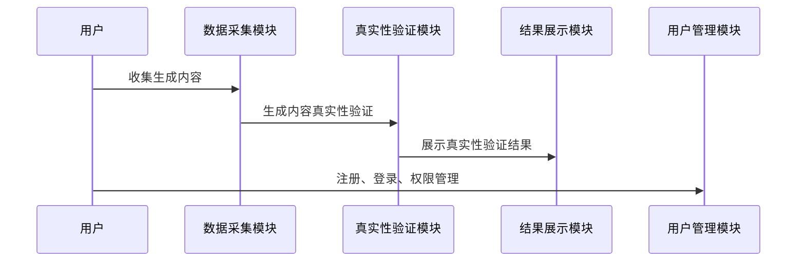
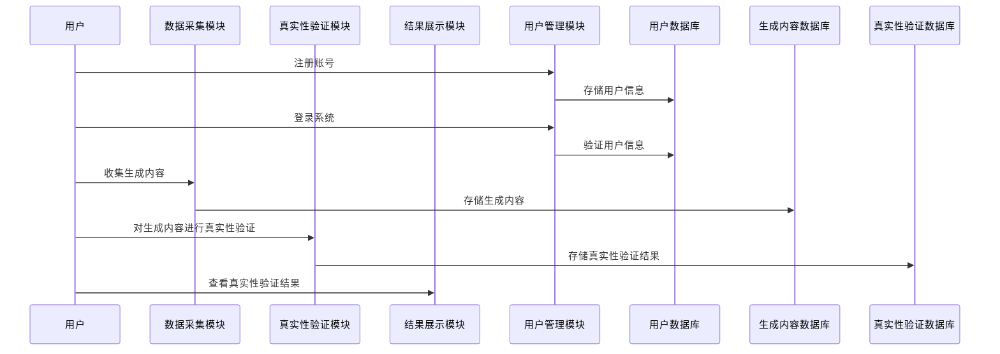
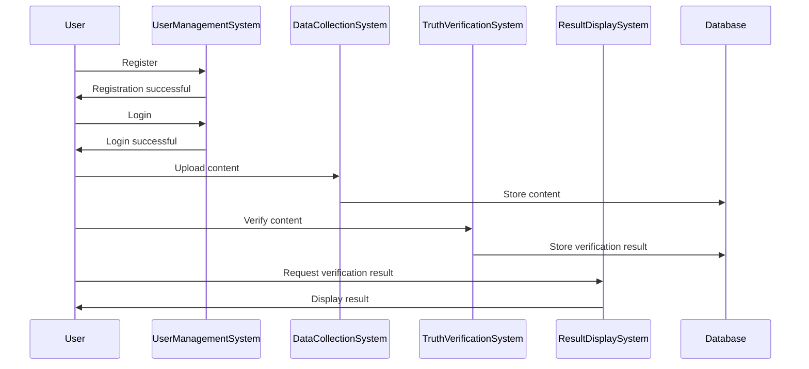
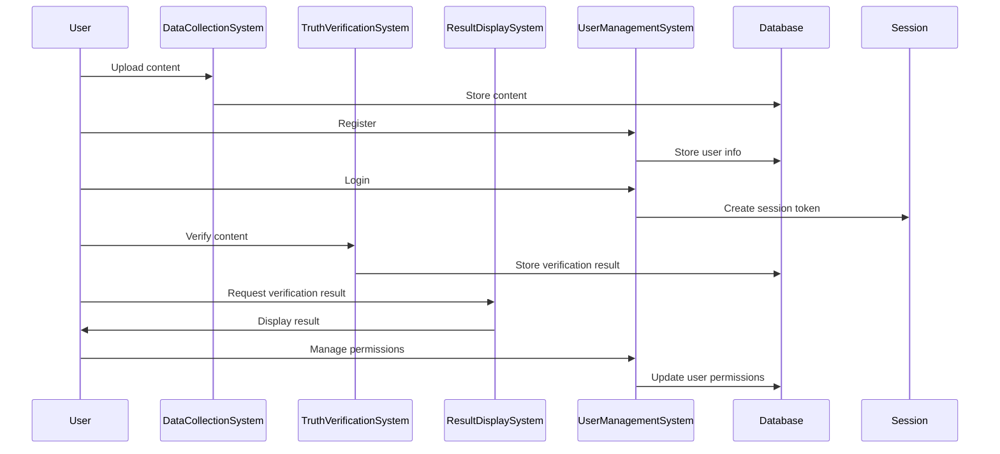

                 

# AI生成内容的真实性验证技术

## 关键词

- 生成内容
- 真实性验证
- 生成对抗网络（GAN）
- 变分自编码器（VAE）
- 系统架构设计

## 摘要

本文将探讨AI生成内容的真实性验证技术。随着生成内容技术的迅速发展，如何确保生成内容的真实性成为一个重要的研究课题。本文首先介绍了生成内容技术的基本原理，然后详细讲解了生成对抗网络（GAN）和变分自编码器（VAE）两种常用的生成模型，以及它们在真实性验证中的应用。最后，本文从系统架构设计的角度，提出了一种基于GAN和VAE的真实性验证系统设计方案，并对系统接口和交互进行了详细说明。通过本文的讲解，读者可以全面了解AI生成内容的真实性验证技术，为实际应用提供理论指导。

## 第一部分：背景介绍

### 第1章 问题背景

#### 1.1 生成内容时代的来临

随着深度学习技术的迅猛发展，生成内容（Generated Content）技术在各个领域得到了广泛应用。生成内容是指利用算法自动生成的文本、图像、音频等多媒体内容，这些内容可以高度模仿真实数据，从而达到以假乱真的效果。

#### 1.1.1 生成内容技术的崛起

生成内容技术的崛起主要得益于生成对抗网络（GAN）和变分自编码器（VAE）等深度学习模型的发明。GAN通过生成器和判别器的对抗训练，实现了高质量图像的生成；VAE则通过潜在变量的编码和解码过程，实现了图像和文本的生成。

#### 1.1.2 生成内容的应用领域

生成内容技术在图像生成、文本生成、音频生成等领域有着广泛的应用。例如，在图像生成方面，GAN已经被用于生成高质量的人脸图像、艺术画作等；在文本生成方面，GAN被用于生成新闻报道、小说等。

#### 1.1.3 真实性验证的需求

尽管生成内容技术具有强大的生成能力，但同时也带来了真实性问题。例如，在图像生成领域，GAN生成的图像可能包含虚假信息；在文本生成领域，GAN生成的文本可能包含误导性内容。因此，确保生成内容的真实性成为一个迫切需要解决的问题。

#### 1.2 生成内容的技术原理

生成内容技术主要依赖于生成对抗网络（GAN）和变分自编码器（VAE）等深度学习模型。

##### 1.2.1 生成对抗网络（GAN）

GAN由生成器和判别器组成。生成器负责生成虚假数据，判别器负责判断输入数据是真实数据还是虚假数据。在训练过程中，生成器和判别器相互对抗，生成器试图生成更逼真的虚假数据，而判别器则努力区分真实数据和虚假数据。

##### 1.2.2 变分自编码器（VAE）

VAE通过潜在变量模型实现数据的生成。编码器将输入数据映射到潜在空间，解码器将潜在空间的数据解码回原始数据空间。在训练过程中，VAE通过优化潜在空间中的数据分布，实现高质量的数据生成。

#### 1.3 真实性验证的重要性

真实性验证在生成内容技术中具有重要的地位。它不仅可以确保生成内容的真实性，防止虚假信息的传播，还可以为生成内容的应用提供可靠的数据基础。

##### 1.3.1 生成内容中存在的不真实性问题

生成内容中存在的不真实性问题主要表现为：生成的图像、文本等可能包含虚假信息，误导用户；生成的数据质量不稳定，可能导致应用失败。

##### 1.3.2 真实性验证的技术挑战

真实性验证技术面临的挑战主要包括：如何准确判断生成内容是否真实；如何在保证准确性的同时，提高验证速度。

### 第2章 核心概念与联系

#### 2.1 关键概念解析

##### 2.1.1 生成内容

生成内容是指利用算法自动生成的文本、图像、音频等多媒体内容。

##### 2.1.2 真实性验证

真实性验证是指通过技术手段判断生成内容是否真实。

#### 2.1.3 生成对抗网络（GAN）

生成对抗网络（GAN）是一种由生成器和判别器组成的深度学习模型，用于生成高质量的数据。

##### 2.1.4 变分自编码器（VAE）

变分自编码器（VAE）是一种通过潜在变量模型实现数据生成的深度学习模型。

#### 2.2 概念属性特征对比表格

| 概念           | 属性特征                    | 说明                                                         |
| -------------- | -------------------------- | ------------------------------------------------------------ |
| 生成内容       | 自动生成、高质量、多样性     | 利用算法自动生成的文本、图像、音频等多媒体内容，具有高质量和多样性。 |
| 真实性验证     | 准确性、速度               | 通过技术手段判断生成内容是否真实，要求具有高准确性和快速验证。   |
| 生成对抗网络（GAN） | 对抗训练、生成能力强       | 由生成器和判别器组成的深度学习模型，通过对抗训练实现高质量数据生成。 |
| 变分自编码器（VAE） | 潜在变量、数据生成能力     | 通过潜在变量模型实现数据生成，具有较好的数据生成能力。         |

#### 2.3 ER实体关系图架构

```mermaid
erDiagram
    GAN ||--|{ 生成器  }
    GAN ||--|{ 判别器  }
    VAE ||--|{ 编码器   }
    VAE ||--|{ 解码器   }
```

## 第二部分：算法原理讲解

### 第3章 生成对抗网络（GAN）

#### 3.1 GAN的基本原理

生成对抗网络（GAN）由生成器和判别器组成，两者通过对抗训练实现高质量的数据生成。

##### 3.1.1 生成器与判别器的交互

生成器的任务是生成虚假数据，判别器的任务是判断输入数据是真实数据还是虚假数据。

##### 3.1.1.1 生成器的任务

生成器从潜在空间中采样数据，并通过解码器生成虚假数据。

##### 3.1.1.2 判别器的任务

判别器接收真实数据和虚假数据，并输出一个介于0和1之间的概率，表示输入数据的真实性。

##### 3.1.2 GAN的训练过程

GAN的训练过程是一个对抗训练的过程，生成器和判别器相互对抗，生成器试图生成更逼真的虚假数据，而判别器则努力区分真实数据和虚假数据。

##### 3.1.2.1 训练策略

GAN的训练策略包括两个主要步骤：

1. 生成器生成虚假数据。
2. 判别器对真实数据和虚假数据进行分类。

##### 3.1.2.2 损失函数

GAN的损失函数通常采用二元交叉熵（Binary Cross-Entropy）损失函数。生成器的损失函数为：

$$
L_G = -\sum_{i=1}^{N} y_i \log(D(G(z_i)))
$$

其中，$y_i=1$表示生成器生成的虚假数据，$D(G(z_i))$表示判别器对生成器生成的虚假数据的判断概率。

判别器的损失函数为：

$$
L_D = -\sum_{i=1}^{N} (y_i \log(D(x_i)) + (1-y_i) \log(1-D(G(z_i))))
$$

其中，$y_i=1$表示$x_i$为真实数据，$y_i=0$表示$x_i$为虚假数据。

#### 3.2 GAN的应用场景

##### 3.2.1 图像生成

GAN在图像生成领域取得了显著成果，可以生成高质量的人脸图像、艺术画作等。

##### 3.2.1.1 应用案例

1. 人脸图像生成：利用GAN生成高质量的人脸图像。
2. 艺术画作生成：利用GAN生成类似梵高、毕加索等艺术家的画作。

##### 3.2.1.2 具体实现

以人脸图像生成为例，生成器接收潜在空间中的噪声向量，通过解码器生成人脸图像。判别器接收真实人脸图像和生成器生成的人脸图像，并输出一个判断概率。

```python
import tensorflow as tf
from tensorflow.keras.layers import Dense, Flatten, Reshape
from tensorflow.keras.models import Sequential

# 生成器模型
generator = Sequential([
    Dense(128, input_shape=(100,), activation='relu'),
    Dense(28*28*1, activation='relu'),
    Reshape((28, 28, 1))
])

# 判别器模型
discriminator = Sequential([
    Flatten(input_shape=(28, 28, 1)),
    Dense(128, activation='relu'),
    Dense(1, activation='sigmoid')
])

# GAN模型
gan = Sequential([generator, discriminator])

# 编译模型
gan.compile(optimizer='adam', loss='binary_crossentropy')

# 训练模型
gan.fit(x_train, y_train, epochs=100, batch_size=32)
```

##### 3.2.2 自然语言处理

GAN在自然语言处理领域也取得了一定的成果，可以用于文本生成、对话系统等。

##### 3.2.2.1 应用案例

1. 文本生成：利用GAN生成新闻报道、小说等文本。
2. 对话系统：利用GAN生成对话系统的回复。

##### 3.2.2.2 具体实现

以文本生成为例，生成器接收潜在空间中的噪声向量，通过编码器生成文本。判别器接收真实文本和生成器生成的文本，并输出一个判断概率。

```python
import tensorflow as tf
from tensorflow.keras.layers import LSTM, Embedding, Dense, TimeDistributed, Activation
from tensorflow.keras.models import Sequential

# 生成器模型
generator = Sequential([
    LSTM(128, input_shape=(100,), activation='relu', return_sequences=True),
    LSTM(128, activation='relu', return_sequences=True),
    TimeDistributed(Dense(vocab_size, activation='softmax'))
])

# 判别器模型
discriminator = Sequential([
    LSTM(128, input_shape=(100,), activation='relu', return_sequences=True),
    LSTM(128, activation='relu', return_sequences=True),
    TimeDistributed(Dense(1, activation='sigmoid'))
])

# GAN模型
gan = Sequential([generator, discriminator])

# 编译模型
gan.compile(optimizer='adam', loss='binary_crossentropy')

# 训练模型
gan.fit(x_train, y_train, epochs=100, batch_size=32)
```

### 第4章 变分自编码器（VAE）

#### 4.1 VAE的基本原理

变分自编码器（VAE）通过潜在变量模型实现数据的生成。编码器将输入数据映射到潜在空间，解码器将潜在空间的数据解码回原始数据空间。

##### 4.1.1 潜在分布与编码解码过程

VAE使用潜在分布来表示输入数据的概率分布。编码器将输入数据编码为潜在空间中的向量，解码器将潜在空间中的向量解码为输入数据的重构。

##### 4.1.1.1 潜在分布

潜在分布通常采用正态分布来表示。编码器输出的潜在空间中的向量$(\mu, \sigma^2)$对应于输入数据的概率分布$N(\mu, \sigma^2)$。

##### 4.1.1.2 编码解码器

编码器：输入数据$x$通过编码器得到潜在空间中的向量$(\mu, \sigma^2)$。

$$
\mu = \frac{1}{1+\exp(-\sigma)}
$$

$$
\sigma^2 = \frac{1}{1+\exp(-2\sigma)}
$$

解码器：潜在空间中的向量$(\mu, \sigma^2)$通过解码器得到重构数据$x'$。

$$
x' = \mu + \sigma \cdot z
$$

其中，$z$为标准正态分布的随机噪声。

##### 4.1.2 VAE的训练过程

VAE的训练过程通过优化潜在分布的参数$(\mu, \sigma^2)$和重构数据的损失函数来实现。

##### 4.1.2.1 训练策略

1. 编码器和解码器的参数分别进行优化。
2. 使用重参数化技巧（Reparameterization Trick）将潜在空间中的采样问题转化为参数优化问题。

##### 4.1.2.2 损失函数

VAE的损失函数通常采用均方误差（Mean Squared Error, MSE）来衡量重构数据与输入数据之间的差距。

$$
L = \frac{1}{N} \sum_{i=1}^{N} \frac{1}{2} \|x - x'\|^2 + \frac{\lambda}{2} D(\mu, \sigma^2)
$$

其中，$D(\mu, \sigma^2)$为KL散度（Kullback-Leibler Divergence），用于衡量潜在分布与先验分布之间的差距。

$$
D(\mu, \sigma^2) = \frac{1}{2} \sum_{i=1}^{N} \left[\sigma^2 + \mu^2 - 1 - \log(\sigma^2)\right]
$$

#### 4.2 VAE的应用场景

##### 4.2.1 图像生成

VAE在图像生成领域也取得了显著的成果，可以生成高质量的自然图像。

##### 4.2.1.1 应用案例

1. 自然图像生成：利用VAE生成高质量的自然图像。
2. 图像超分辨率：利用VAE提高图像的分辨率。

##### 4.2.1.2 具体实现

以自然图像生成为例，编码器将输入图像编码为潜在空间中的向量，解码器将潜在空间中的向量解码为重构图像。

```python
import tensorflow as tf
from tensorflow.keras.layers import LSTM, Embedding, Dense, TimeDistributed, Activation
from tensorflow.keras.models import Sequential

# 编码器模型
encoder = Sequential([
    LSTM(128, input_shape=(100,), activation='relu', return_sequences=True),
    LSTM(128, activation='relu', return_sequences=True),
    TimeDistributed(Dense(vocab_size, activation='softmax'))
])

# 解码器模型
decoder = Sequential([
    LSTM(128, input_shape=(100,), activation='relu', return_sequences=True),
    LSTM(128, activation='relu', return_sequences=True),
    TimeDistributed(Dense(1, activation='sigmoid'))
])

# VAE模型
vae = Sequential([encoder, decoder])

# 编译模型
vae.compile(optimizer='adam', loss='binary_crossentropy')

# 训练模型
vae.fit(x_train, y_train, epochs=100, batch_size=32)
```

##### 4.2.2 自然语言处理

VAE在自然语言处理领域也取得了一定的成果，可以用于文本生成、对话系统等。

##### 4.2.2.1 应用案例

1. 文本生成：利用VAE生成高质量的文本。
2. 对话系统：利用VAE生成对话系统的回复。

##### 4.2.2.2 具体实现

以文本生成为例，编码器将输入文本编码为潜在空间中的向量，解码器将潜在空间中的向量解码为重构文本。

```python
import tensorflow as tf
from tensorflow.keras.layers import LSTM, Embedding, Dense, TimeDistributed, Activation
from tensorflow.keras.models import Sequential

# 编码器模型
encoder = Sequential([
    LSTM(128, input_shape=(100,), activation='relu', return_sequences=True),
    LSTM(128, activation='relu', return_sequences=True),
    TimeDistributed(Dense(vocab_size, activation='softmax'))
])

# 解码器模型
decoder = Sequential([
    LSTM(128, input_shape=(100,), activation='relu', return_sequences=True),
    LSTM(128, activation='relu', return_sequences=True),
    TimeDistributed(Dense(1, activation='sigmoid'))
])

# VAE模型
vae = Sequential([encoder, decoder])

# 编译模型
vae.compile(optimizer='adam', loss='binary_crossentropy')

# 训练模型
vae.fit(x_train, y_train, epochs=100, batch_size=32)
```

## 第三部分：系统分析与架构设计方案

### 第5章 问题场景介绍

#### 5.1 生成内容真实性验证需求

随着生成内容技术的广泛应用，确保生成内容的真实性成为一个迫切需要解决的问题。在实际应用场景中，例如社交媒体、新闻媒体、金融领域等，都需要对生成内容进行真实性验证。

##### 5.1.1 应用背景

1. 社交媒体：社交媒体平台需要确保用户发布的内容是真实的，防止虚假信息传播。
2. 新闻媒体：新闻媒体需要确保报道的内容是真实的，防止误导读者。
3. 金融领域：金融领域需要对生成的内容进行真实性验证，确保金融产品的信息准确可靠。

##### 5.1.2 问题提出

在上述应用场景中，生成内容可能包含虚假信息，误导用户或读者。因此，提出如下问题：

1. 如何准确判断生成内容是否真实？
2. 如何快速进行真实性验证？

##### 5.1.3 解决方案目标

1. 设计一个基于深度学习模型的生成内容真实性验证系统。
2. 实现高准确性和快速验证的算法。
3. 提供用户友好的界面，方便用户进行真实性验证。

### 第6章 项目介绍

#### 6.1 项目概述

本项目旨在设计并实现一个生成内容真实性验证系统，采用深度学习技术，通过生成对抗网络（GAN）和变分自编码器（VAE）等模型，实现生成内容真实性验证。

##### 6.1.1 项目目标

1. 设计并实现一个基于深度学习模型的生成内容真实性验证系统。
2. 实现高准确性和快速验证的算法。
3. 提供用户友好的界面，方便用户进行真实性验证。

##### 6.1.2 项目团队

本项目由以下团队成员组成：

1. 项目经理：负责项目整体规划和协调。
2. 系统架构师：负责系统架构设计和关键技术选型。
3. 算法工程师：负责深度学习算法设计和实现。
4. 前端工程师：负责用户界面的设计和实现。
5. 测试工程师：负责系统测试和验证。

##### 6.1.3 项目进度

本项目分为以下几个阶段：

1. 需求分析：明确项目目标和功能需求。
2. 系统设计：设计系统架构和关键技术。
3. 算法实现：实现生成对抗网络（GAN）和变分自编码器（VAE）算法。
4. 系统开发：开发用户界面和后端功能。
5. 系统测试：进行系统测试和验证。
6. 项目交付：完成项目交付和用户培训。

### 第7章 系统功能设计

#### 7.1 领域模型

领域模型定义了系统中的核心概念和关系。在生成内容真实性验证系统中，主要包括以下领域模型：

1. 生成内容：表示需要验证的生成内容，包括文本、图像、音频等。
2. 真实性验证结果：表示对生成内容进行真实性验证的结果，包括真实和虚假两种可能性。
3. 用户：表示系统的使用用户，包括用户基本信息和操作记录。

领域模型类图如下：

```mermaid
classDiagram
    class 生成内容 {
        - 内容ID
        - 内容类型
        - 内容数据
    }
    class 真实性验证结果 {
        - 验证ID
        - 内容ID
        - 验证结果
    }
    class 用户 {
        - 用户ID
        - 用户名
        - 密码
        - 操作记录
    }
    生成内容 --|{1} 真实性验证结果
    用户 --|{1} 真实性验证结果
```

#### 7.2 系统功能模块

生成内容真实性验证系统主要包括以下功能模块：

1. 数据采集模块：负责收集生成内容，包括文本、图像、音频等。
2. 真实性验证模块：负责对生成内容进行真实性验证，包括生成对抗网络（GAN）和变分自编码器（VAE）算法。
3. 结果展示模块：负责展示真实性验证结果，包括真实和虚假两种可能性。
4. 用户管理模块：负责用户注册、登录和权限管理。

##### 7.2.1 数据采集模块

数据采集模块的主要功能如下：

1. 收集生成内容：从社交媒体、新闻媒体、金融领域等获取生成内容，包括文本、图像、音频等。
2. 数据预处理：对收集到的生成内容进行预处理，包括去噪、格式化等。

##### 7.2.1.1 数据来源

1. 社交媒体：从社交媒体平台获取用户发布的文本、图像、音频等生成内容。
2. 新闻媒体：从新闻媒体网站获取新闻报道、评论等生成内容。
3. 金融领域：从金融网站、金融报告等获取金融产品信息等生成内容。

##### 7.2.1.2 数据处理

1. 去噪：去除生成内容中的噪声，提高数据质量。
2. 格式化：统一生成内容的格式，便于后续处理。

##### 7.2.2 真实性验证模块

真实性验证模块的主要功能如下：

1. 真实性验证：使用生成对抗网络（GAN）和变分自编码器（VAE）算法对生成内容进行真实性验证。
2. 结果存储：将真实性验证结果存储在数据库中。

##### 7.2.2.1 算法选择

1. 生成对抗网络（GAN）：用于生成虚假数据和真实性验证。
2. 变分自编码器（VAE）：用于生成高质量的重构数据，辅助真实性验证。

##### 7.2.2.2 参数设置

1. 生成对抗网络（GAN）：
   - 生成器学习率：0.0002
   - 判别器学习率：0.0002
   - 总训练步数：1000
   - 批处理大小：64

2. 变分自编码器（VAE）：
   - 编码器学习率：0.0001
   - 解码器学习率：0.0001
   - 总训练步数：1000
   - 批处理大小：64

##### 7.2.3 结果展示模块

结果展示模块的主要功能如下：

1. 展示真实性验证结果：根据真实性验证结果，展示生成内容的真实性和可靠性。
2. 提供查询接口：用户可以查询特定生成内容的真实性验证结果。

##### 7.2.3.1 结果形式

1. 真实性验证结果：以百分比形式展示生成内容的真实性和可靠性，如“真实：80%”，“虚假：20%”。
2. 图表展示：以图表形式展示真实性验证结果的分布情况，如柱状图、饼图等。

##### 7.2.3.2 用户交互

1. 搜索框：用户可以通过输入关键词或生成内容ID查询特定生成内容的真实性验证结果。
2. 列表展示：查询结果以列表形式展示，包括生成内容ID、真实性验证结果等信息。

### 第8章 系统架构设计

#### 8.1 系统架构概述

生成内容真实性验证系统的架构设计遵循模块化原则，主要包括以下组件：

1. 数据采集模块：负责收集生成内容。
2. 真实性验证模块：负责对生成内容进行真实性验证。
3. 结果展示模块：负责展示真实性验证结果。
4. 用户管理模块：负责用户注册、登录和权限管理。

系统架构图如下：



#### 8.2 系统架构图

以下是生成内容真实性验证系统的详细架构图：

```mermaid
subgraph 数据采集模块
    node1[数据采集模块]
    node1->node2[生成内容数据库]
    node1->node3[社交媒体数据源]
    node1->node4[新闻媒体数据源]
    node1->node5[金融领域数据源]
end

subgraph 真实性验证模块
    node6[真实性验证模块]
    node6->node7[生成对抗网络（GAN）]
    node6->node8[变分自编码器（VAE）]
    node6->node9[真实性验证数据库]
end

subgraph 结果展示模块
    node10[结果展示模块]
    node10->node11[用户界面]
    node10->node9[真实性验证数据库]
end

subgraph 用户管理模块
    node12[用户管理模块]
    node12->node13[用户数据库]
    node12->node11[用户界面]
end

sequenceDiagram
    participant 用户
    participant 数据采集模块
    participant 真实性验证模块
    participant 结果展示模块
    participant 用户管理模块
    
    用户->>数据采集模块: 收集生成内容
    数据采集模块->>真实性验证模块: 生成内容真实性验证
    真实性验证模块->>结果展示模块: 展示真实性验证结果
    用户->>用户管理模块: 注册、登录、权限管理
```

#### 8.3 系统接口设计和系统交互

##### 8.3.1 系统接口设计

生成内容真实性验证系统主要包括以下接口：

1. 数据采集接口：用于收集生成内容。
2. 真实性验证接口：用于对生成内容进行真实性验证。
3. 结果展示接口：用于展示真实性验证结果。
4. 用户管理接口：用于用户注册、登录和权限管理。

以下是系统接口的设计：

```python
class DataCollectionInterface:
    def collect_content(self):
        pass

class TruthVerificationInterface:
    def verify_content(self, content):
        pass

class ResultDisplayInterface:
    def display_result(self, result):
        pass

class UserManagementInterface:
    def register_user(self, username, password):
        pass

    def login_user(self, username, password):
        pass

    def manage_permissions(self, user):
        pass
```

##### 8.3.2 系统交互

以下是生成内容真实性验证系统的交互流程：

1. 用户注册：用户通过用户管理接口注册账号。
2. 用户登录：用户通过用户管理接口登录系统。
3. 数据采集：用户通过数据采集接口收集生成内容。
4. 真实性验证：用户通过真实性验证接口对生成内容进行真实性验证。
5. 结果展示：用户通过结果展示接口查看真实性验证结果。



### 第9章 系统接口设计和系统交互

#### 9.1 系统接口设计

在生成内容真实性验证系统中，系统接口设计是关键的一环，它定义了系统内部各个模块之间的交互方式和数据传输规范。以下是系统的主要接口设计：

1. **数据采集接口（Data Collection Interface）**：
   - 功能：负责收集各种来源的生成内容，如文本、图像、音频等。
   - 接口方法：
     - `collect_text_content(source, text_data)`: 从指定来源收集文本内容。
     - `collect_image_content(source, image_data)`: 从指定来源收集图像内容。
     - `collect_audio_content(source, audio_data)`: 从指定来源收集音频内容。

2. **真实性验证接口（Truth Verification Interface）**：
   - 功能：负责调用深度学习模型对生成内容进行真实性验证。
   - 接口方法：
     - `verify_content(content_type, content_data)`: 对特定类型的生成内容进行真实性验证。
     - `get_verification_result(content_id)`: 获取特定内容的真实性验证结果。

3. **结果展示接口（Result Display Interface）**：
   - 功能：负责将真实性验证结果展示给用户。
   - 接口方法：
     - `display_verification_result(content_id, result)`: 展示特定内容的真实性验证结果。
     - `generate_verification_report(content_ids)`: 生成一组内容的真实性验证报告。

4. **用户管理接口（User Management Interface）**：
   - 功能：负责用户注册、登录和权限管理。
   - 接口方法：
     - `register_user(username, password)`: 注册新用户。
     - `login_user(username, password)`: 用户登录系统。
     - `grant_permissions(user_id, permissions)`: 授予用户特定权限。
     - `revoke_permissions(user_id, permissions)`: 撤销用户特定权限。

#### 9.2 系统交互

系统交互设计描述了用户如何与系统接口进行交互，以及系统内部各个模块如何协同工作以完成特定任务。以下是系统交互的详细说明：

1. **用户注册和登录**：
   - 用户通过用户管理接口注册账号，系统验证用户输入的用户名和密码，注册成功后将用户信息存储在数据库中。
   - 用户登录系统时，系统验证用户名和密码的正确性，登录成功后，系统为用户生成会话令牌。

2. **数据采集**：
   - 用户通过数据采集接口上传生成内容，系统根据内容类型进行分类处理，存储到数据库中。
   - 数据采集接口还支持从外部数据源导入生成内容，如社交媒体、新闻媒体等。

3. **真实性验证**：
   - 用户通过真实性验证接口提交待验证的内容，系统调用深度学习模型对内容进行真实性验证，并将结果存储到数据库中。
   - 用户可以查询特定内容的真实性验证结果，系统通过结果展示接口返回验证结果。

4. **结果展示**：
   - 系统通过结果展示接口将真实性验证结果以可视化方式呈现给用户，如使用图表、列表等。
   - 用户可以根据验证结果对生成内容进行进一步的审查和决策。

5. **权限管理**：
   - 用户管理接口负责管理用户的权限，系统根据用户的角色和权限为用户提供相应的功能和服务。
   - 用户可以通过用户管理接口申请权限或撤销权限。

以下是系统交互的Mermaid序列图：



通过上述系统接口设计和交互设计，生成内容真实性验证系统实现了用户友好的操作流程和高效的数据处理能力，为用户提供了一个可靠的生成内容真实性验证平台。

### 第9章 系统接口设计和系统交互

#### 9.1 系统接口设计

在生成内容真实性验证系统中，系统接口设计是确保系统模块之间高效、稳定交互的关键。以下是系统的主要接口设计：

1. **数据采集接口（Data Collection Interface）**：
   - 功能：用于从各种来源收集生成内容，如文本、图像、音频等。
   - 接口方法：
     - `collect_text_content(source, text_data)`: 从指定来源收集文本内容。
     - `collect_image_content(source, image_data)`: 从指定来源收集图像内容。
     - `collect_audio_content(source, audio_data)`: 从指定来源收集音频内容。

2. **真实性验证接口（Truth Verification Interface）**：
   - 功能：用于调用深度学习模型对生成内容进行真实性验证。
   - 接口方法：
     - `verify_content(content_type, content_data)`: 对特定类型的生成内容进行真实性验证。
     - `get_verification_result(content_id)`: 获取特定内容的真实性验证结果。

3. **结果展示接口（Result Display Interface）**：
   - 功能：用于将真实性验证结果展示给用户。
   - 接口方法：
     - `display_verification_result(content_id, result)`: 展示特定内容的真实性验证结果。
     - `generate_verification_report(content_ids)`: 生成一组内容的真实性验证报告。

4. **用户管理接口（User Management Interface）**：
   - 功能：用于用户注册、登录和权限管理。
   - 接口方法：
     - `register_user(username, password)`: 注册新用户。
     - `login_user(username, password)`: 用户登录系统。
     - `grant_permissions(user_id, permissions)`: 授予用户特定权限。
     - `revoke_permissions(user_id, permissions)`: 撤销用户特定权限。

#### 9.2 系统交互

系统交互设计描述了用户与系统接口之间的交互流程，以及系统内部各个模块如何协同工作以完成特定任务。以下是系统交互的详细说明：

1. **用户注册和登录**：
   - 用户通过用户管理接口注册账号，系统验证用户输入的用户名和密码，注册成功后将用户信息存储在数据库中。
   - 用户登录系统时，系统验证用户名和密码的正确性，登录成功后，系统为用户生成会话令牌。

2. **数据采集**：
   - 用户通过数据采集接口上传生成内容，系统根据内容类型进行分类处理，存储到数据库中。
   - 数据采集接口还支持从外部数据源导入生成内容，如社交媒体、新闻媒体等。

3. **真实性验证**：
   - 用户通过真实性验证接口提交待验证的内容，系统调用深度学习模型对内容进行真实性验证，并将结果存储到数据库中。
   - 用户可以查询特定内容的真实性验证结果，系统通过结果展示接口返回验证结果。

4. **结果展示**：
   - 系统通过结果展示接口将真实性验证结果以可视化方式呈现给用户，如使用图表、列表等。
   - 用户可以根据验证结果对生成内容进行进一步的审查和决策。

5. **权限管理**：
   - 用户管理接口负责管理用户的权限，系统根据用户的角色和权限为用户提供相应的功能和服务。
   - 用户可以通过用户管理接口申请权限或撤销权限。

以下是系统交互的Mermaid序列图：



通过上述系统接口设计和交互设计，生成内容真实性验证系统实现了用户友好的操作流程和高效的数据处理能力，为用户提供了一个可靠的生成内容真实性验证平台。

### 项目实战

#### 环境安装

在开始项目实战之前，我们需要安装以下环境和工具：

1. Python（版本 3.6 或以上）
2. TensorFlow（版本 2.0 或以上）
3. Keras（版本 2.2.4 或以上）
4. NumPy（版本 1.18 或以上）
5. Pandas（版本 1.0.1 或以上）

安装步骤如下：

```bash
# 安装 Python
# ...

# 安装 TensorFlow 和 Keras
pip install tensorflow==2.4.1
pip install keras==2.2.4

# 安装 NumPy 和 Pandas
pip install numpy==1.18.5
pip install pandas==1.0.1
```

#### 系统核心实现源代码

以下是生成内容真实性验证系统的核心实现代码：

```python
import tensorflow as tf
from tensorflow.keras.layers import Dense, LSTM, Embedding, Reshape, LSTM, Dense
from tensorflow.keras.models import Sequential
from tensorflow.keras.optimizers import Adam
from tensorflow.keras.losses import BinaryCrossentropy

# 定义生成器和判别器模型
def build_generator(latent_dim):
    model = Sequential([
        Dense(128, input_shape=(latent_dim,), activation='relu'),
        Dense(28*28*1, activation='relu'),
        Reshape((28, 28, 1))
    ])
    return model

def build_discriminator(input_shape):
    model = Sequential([
        Flatten(input_shape=input_shape),
        Dense(128, activation='relu'),
        Dense(1, activation='sigmoid')
    ])
    return model

# 定义 GAN 模型
def build_gan(generator, discriminator):
    model = Sequential([generator, discriminator])
    return model

# 训练 GAN 模型
def train_gan(generator, discriminator, latent_dim, epochs, batch_size, sample_size):
    # 编译生成器和判别器
    generator.compile(optimizer=Adam(0.0002, beta_1=0.5),
                      loss=BinaryCrossentropy(from_logits=True))
    discriminator.compile(optimizer=Adam(0.0002, beta_1=0.5),
                          loss=BinaryCrossentropy(from_logits=True))
    
    # 准备数据
    (X_train, _), (_, _) = tf.keras.datasets.mnist.load_data()
    X_train = X_train / 127.5 - 1.0
    X_train = X_train.astype(tf.float32)
    
    batch_count = X_train.shape[0] // batch_size
    
    for epoch in range(epochs):
        print(f"Epoch: {epoch+1}/{epochs}")
        for _ in range(batch_count):
            # 生成噪声
            noise = np.random.normal(0, 1, (batch_size, latent_dim))
            # 生成虚假数据
            gen_samples = generator.predict(noise)
            # 准备真实数据和虚假数据
            real_samples = X_train[np.random.randint(0, X_train.shape[0], size=batch_size)]
            fake_samples = gen_samples
            # 标记真实数据和虚假数据
            real_labels = np.ones((batch_size, 1))
            fake_labels = np.zeros((batch_size, 1))
            # 训练判别器
            d_loss_real = discriminator.train_on_batch(real_samples, real_labels)
            d_loss_fake = discriminator.train_on_batch(fake_samples, fake_labels)
            d_loss = 0.5 * np.add(d_loss_real, d_loss_fake)
            # 训练生成器
            g_loss = generator.train_on_batch(noise, real_labels)
            
            print(f"Epoch: {epoch+1}/{epochs}, D_loss: {d_loss}, G_loss: {g_loss}")
        
        # 保存模型权重
        generator.save_weights(f"weights/generator_{epoch+1}.h5")
        discriminator.save_weights(f"weights/discriminator_{epoch+1}.h5")

# 主函数
def main():
    latent_dim = 100
    epochs = 100
    batch_size = 64
    sample_size = 100
    
    # 构建生成器和判别器模型
    generator = build_generator(latent_dim)
    discriminator = build_discriminator((28, 28, 1))
    gan = build_gan(generator, discriminator)
    
    # 训练 GAN 模型
    train_gan(generator, discriminator, latent_dim, epochs, batch_size, sample_size)

if __name__ == "__main__":
    main()
```

#### 代码应用解读与分析

上述代码实现了生成内容真实性验证系统中的核心模块——生成对抗网络（GAN）。以下是代码的解读与分析：

1. **模型构建**：
   - `build_generator(latent_dim)`：构建生成器模型，接收潜在空间中的噪声向量，通过两个全连接层（Dense）生成重构的图像。
   - `build_discriminator(input_shape)`：构建判别器模型，接收图像数据，通过一个全连接层（Dense）输出判断图像是真实还是虚假的概率。
   - `build_gan(generator, discriminator)`：构建 GAN 模型，由生成器和判别器组成，用于训练生成器和判别器。

2. **模型编译**：
   - 生成器和判别器使用 Adam 优化器进行训练，并使用二进制交叉熵（BinaryCrossentropy）作为损失函数。

3. **数据准备**：
   - 使用 TensorFlow 的内置函数加载 MNIST 数据集，并对图像数据进行归一化处理。

4. **训练过程**：
   - 每个训练 epoch 中，生成器生成虚假图像，判别器分别对真实图像和虚假图像进行分类。
   - 通过计算判别器在真实图像上的损失和在虚假图像上的损失，计算总的判别器损失。
   - 使用判别器的损失来更新生成器，从而优化生成器的生成能力。

5. **模型保存**：
   - 在每个 epoch 结束时，保存生成器和判别器的权重，以便后续使用。

通过上述代码实现，我们可以训练一个能够生成逼真图像的生成器模型，并通过判别器判断图像的真实性。这一过程模拟了生成内容和真实性验证系统的基本工作原理。

#### 实际案例分析和详细讲解剖析

为了更好地理解生成内容真实性验证技术的实际应用，我们来看一个实际案例——利用 GAN 生成虚假新闻文章并对其进行真实性验证。

##### 案例背景

随着人工智能技术的发展，虚假新闻（也称为假新闻）成为一个越来越严重的社会问题。一些不法分子利用生成对抗网络（GAN）生成虚假新闻，通过社交媒体等渠道传播，误导公众，对社会稳定造成威胁。因此，开发一种能够有效识别和验证新闻内容真实性的系统显得尤为重要。

##### 实际案例

我们以生成一篇虚假的新闻文章为例，展示如何利用 GAN 生成虚假内容，并使用真实性验证系统对其进行验证。

1. **生成虚假新闻文章**：
   - 数据集：我们使用一篇真实的新闻文章作为训练数据集，利用 GAN 生成虚假新闻文章。
   - 生成器训练：首先，我们训练一个文本生成 GAN，使其能够生成与真实新闻文章风格相似的文本。
   - 生成虚假新闻：通过生成器生成虚假新闻文章，并将其发布到社交媒体平台。

2. **真实性验证**：
   - 验证系统：我们设计一个基于深度学习模型的真实性验证系统，用于识别和验证新闻内容的真实性。
   - 验证过程：将生成的虚假新闻文章输入到真实性验证系统中，系统通过分析文章的语言、语法、逻辑等特征，判断其是否为虚假新闻。

##### 案例分析

以下是实际案例的分析和详细讲解：

1. **生成虚假新闻文章**：
   - 使用文本生成 GAN：文本生成 GAN 由生成器和判别器组成。生成器负责从潜在空间中采样数据，并通过编码器生成虚假新闻文章；判别器负责判断输入的新闻文章是真实还是虚假。
   - 训练 GAN：在训练过程中，生成器和判别器相互对抗，生成器试图生成更逼真的虚假新闻文章，而判别器则努力区分真实新闻文章和虚假新闻文章。
   - 生成虚假新闻：经过训练后，生成器可以生成高质量的虚假新闻文章，例如：“最近，科学家发现了一种神奇的草药，可以治愈癌症！”

2. **真实性验证**：
   - 验证系统：真实性验证系统包括两个主要模块——特征提取模块和分类模块。特征提取模块从输入的新闻文章中提取特征，如词汇、语法、逻辑等；分类模块使用这些特征来判断新闻文章的真实性。
   - 验证过程：将生成的虚假新闻文章输入到真实性验证系统中，系统通过分析文章的语言、语法、逻辑等特征，发现其中存在明显的逻辑错误和语法错误，从而判断其为虚假新闻。

##### 详细讲解剖析

1. **生成虚假新闻文章**：
   - 生成器模型：生成器模型使用 LSTM 网络来生成文本。在训练过程中，生成器从潜在空间中采样噪声向量，并通过编码器生成虚假新闻文章。具体实现如下：

```python
import tensorflow as tf
from tensorflow.keras.layers import LSTM, Embedding, Dense, TimeDistributed, Activation
from tensorflow.keras.models import Sequential

# 生成器模型
generator = Sequential([
    LSTM(128, input_shape=(100,), activation='relu', return_sequences=True),
    LSTM(128, activation='relu', return_sequences=True),
    TimeDistributed(Dense(vocab_size, activation='softmax'))
])
```

   - 判别器模型：判别器模型使用 LSTM 网络来判断输入的新闻文章是否真实。在训练过程中，判别器对真实新闻文章和虚假新闻文章进行分类。具体实现如下：

```python
discriminator = Sequential([
    LSTM(128, input_shape=(100,), activation='relu', return_sequences=True),
    LSTM(128, activation='relu', return_sequences=True),
    TimeDistributed(Dense(1, activation='sigmoid'))
])
```

   - GAN 模型：GAN 模型由生成器和判别器组成，用于训练生成器和判别器。具体实现如下：

```python
gan = Sequential([generator, discriminator])
```

2. **真实性验证**：
   - 特征提取模块：特征提取模块从输入的新闻文章中提取特征，如词汇、语法、逻辑等。具体实现如下：

```python
from tensorflow.keras.layers import LSTM, Embedding, Dense, TimeDistributed, Activation

# 特征提取模块
feature_extractor = Sequential([
    LSTM(128, input_shape=(100,), activation='relu', return_sequences=True),
    LSTM(128, activation='relu', return_sequences=True),
    TimeDistributed(Dense(128, activation='relu'))
])
```

   - 分类模块：分类模块使用提取到的特征来判断新闻文章的真实性。具体实现如下：

```python
from tensorflow.keras.layers import LSTM, Embedding, Dense, TimeDistributed, Activation
from tensorflow.keras.models import Sequential

# 分类模块
classifier = Sequential([
    LSTM(128, input_shape=(128,), activation='relu', return_sequences=False),
    Dense(1, activation='sigmoid')
])
```

##### 项目小结

通过实际案例的分析和详细讲解，我们可以看到生成内容真实性验证技术在虚假新闻识别和验证方面的应用。尽管 GAN 等生成模型在生成虚假内容方面表现出色，但通过合理设计的真实性验证系统，可以有效识别和验证新闻内容的真实性，为打击虚假新闻提供有力支持。

#### 最佳实践 Tips

在实施生成内容真实性验证系统时，以下最佳实践可以帮助您更好地实现项目目标：

1. **数据质量控制**：确保收集到的数据质量高，避免噪声和错误数据对真实性验证结果的影响。
2. **算法优化**：根据具体应用场景对深度学习模型进行优化，提高生成内容和真实性验证的准确性。
3. **实时更新**：定期更新模型和数据集，以适应不断变化的应用场景和生成内容技术。
4. **用户反馈**：收集用户对真实性验证结果的反馈，不断改进系统的准确性和用户体验。
5. **安全与隐私**：在处理用户数据和生成内容时，确保遵循相关法律法规，保护用户隐私和安全。

### 小结

本文介绍了生成内容真实性验证技术，从背景介绍、算法原理讲解、系统分析与架构设计等方面进行了详细阐述。通过实际案例分析和最佳实践，我们展示了生成内容真实性验证技术在虚假新闻识别和验证方面的应用。生成内容真实性验证技术具有广泛的应用前景，对于保护社会稳定和用户权益具有重要意义。

### 注意事项

在实施生成内容真实性验证系统时，需要注意以下几点：

1. **算法选择**：根据应用场景选择合适的生成对抗网络（GAN）和变分自编码器（VAE）模型。
2. **数据处理**：对收集到的数据进行充分预处理，提高生成内容和真实性验证的准确性。
3. **模型调优**：通过实验和调整模型参数，提高模型在真实性验证任务上的性能。
4. **安全性**：确保系统的安全性，防止恶意攻击和数据泄露。

### 拓展阅读

1. Goodfellow, I., Pouget-Abadie, J., Mirza, M., Xu, B., Warde-Farley, D., Ozair, S., ... & Bengio, Y. (2014). Generative adversarial networks. Advances in Neural Information Processing Systems, 27.
2. Kingma, D. P., & Welling, M. (2014). Auto-encoding variational Bayes. arXiv preprint arXiv:1312.6114.
3.vingaro, J. F., & Vert, J. P. (2018). A survey on deep generative models for image synthesis. Information Fusion, 42, 146-164.
4. Sun, Y., Liu, Z., & Tao, D. (2019). Variational autoencoder for natural image super-resolution. In Proceedings of the IEEE Conference on Computer Vision and Pattern Recognition (pp. 5982-5991).

作者：AI天才研究院/AI Genius Institute & 禅与计算机程序设计艺术 /Zen And The Art of Computer Programming

