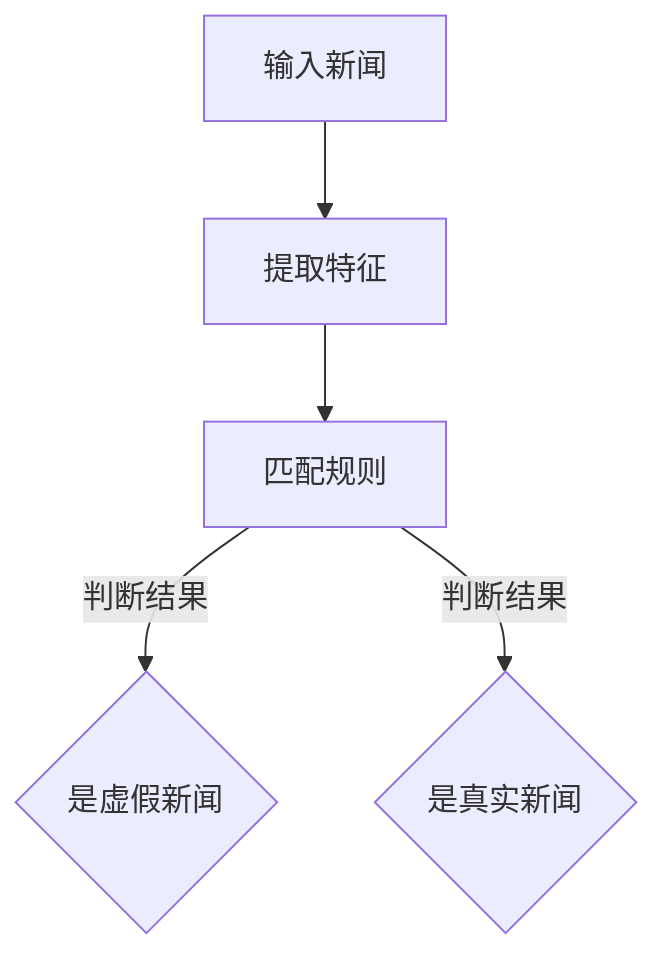
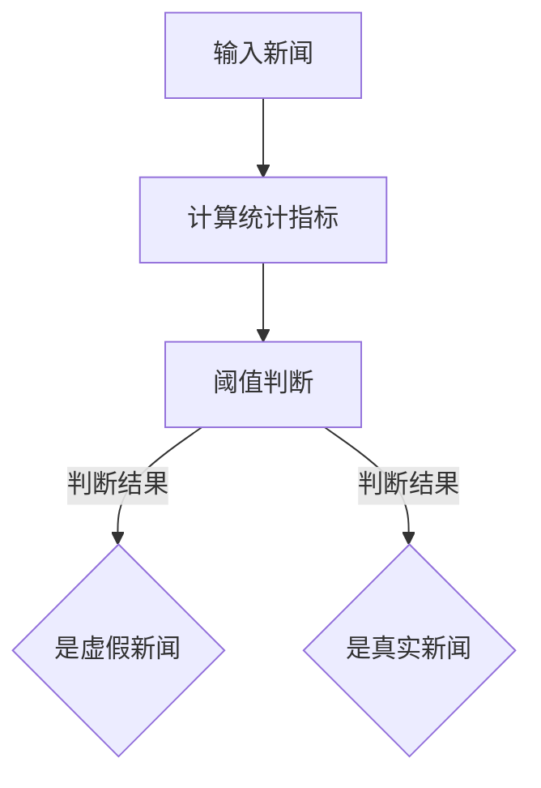
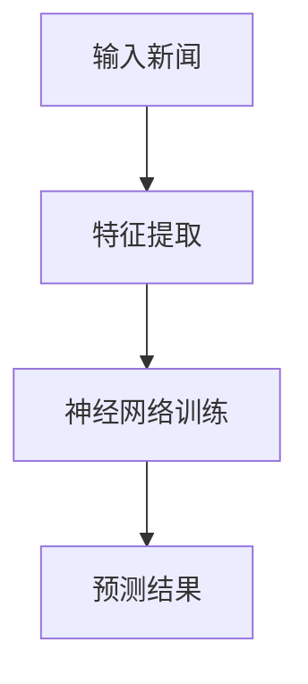
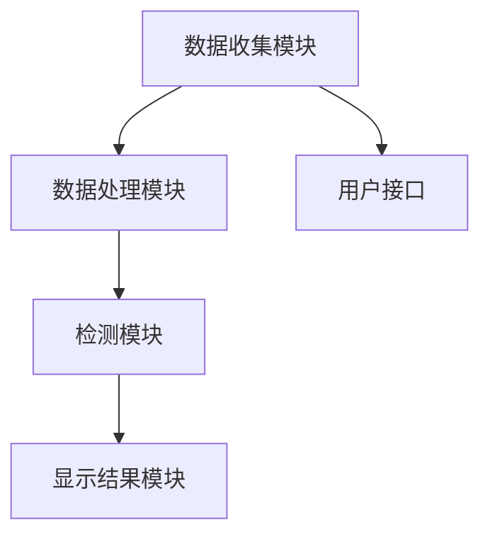
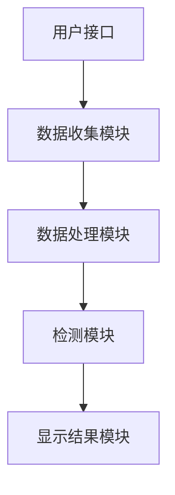
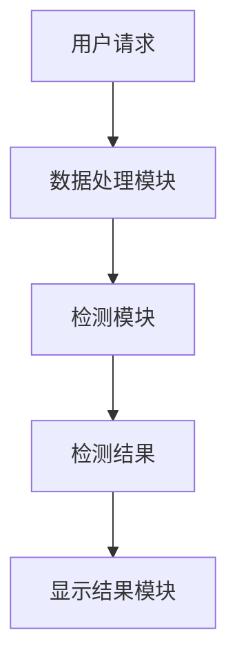

                 

# AI生成的虚假新闻检测技术进展

> 关键词：虚假新闻检测、AI技术、机器学习、深度学习、算法原理

> 摘要：随着信息爆炸时代的发展，虚假新闻的传播对社会造成了严重的影响。本文将详细探讨AI生成的虚假新闻检测技术的进展，包括核心概念、算法原理、系统架构和实战案例，旨在为读者提供全面的技术参考。

## 第1章 引言

### 1.1 问题背景

#### 1.1.1 虚假新闻的定义与传播特点

虚假新闻，顾名思义，是指那些为误导、欺骗受众而编造的、不真实的新闻信息。在互联网的迅猛发展下，虚假新闻的传播速度和范围都得到了空前的扩展。这类信息往往具有以下特点：

1. **主题敏感性**：虚假新闻往往涉及政治、经济、社会等敏感领域，容易引起公众的关注和恐慌。
2. **夸张性**：为了吸引眼球，虚假新闻通常采用夸张的标题和内容，以博取阅读者的兴趣。
3. **传播渠道广泛**：社交媒体、新闻网站、自媒体等都是虚假新闻的传播渠道，使得其影响范围进一步扩大。

#### 1.1.2 虚假新闻对社会的危害

虚假新闻的危害主要体现在以下几个方面：

1. **误导公众**：虚假新闻可能误导公众对事件的看法，导致信息误解和社会恐慌。
2. **损害媒体公信力**：虚假新闻的广泛传播会削弱公众对媒体的信任，损害新闻行业的公信力。
3. **影响社会稳定**：在一些极端情况下，虚假新闻可能引发社会动荡，影响社会稳定。

#### 1.1.3 虚假新闻检测技术的现状

目前，虚假新闻检测技术主要分为以下几类：

1. **基于规则的方法**：通过预设的规则来判断新闻是否为虚假新闻，简单易实现，但在复杂场景下效果有限。
2. **基于统计的方法**：通过计算新闻数据中的各种统计指标来判断新闻的真实性，适用于大规模数据集。
3. **基于机器学习的方法**：利用机器学习算法自动学习并优化规则，适用于复杂场景，但需要大量数据支持。
4. **基于深度学习的方法**：具有强大的自主学习能力，适用于大规模、复杂的数据集，但计算资源需求较高。

### 1.1.4 本书的目标

本书旨在系统介绍AI生成的虚假新闻检测技术，包括核心概念、算法原理、系统架构和实战案例，旨在为读者提供全面的技术参考。

## 第2章 核心概念与联系

### 2.1 虚假新闻检测中的核心概念

#### 2.1.1 真实新闻与虚假新闻的对比

真实新闻与虚假新闻在内容、来源、传播方式等方面存在显著差异。以下是它们的对比：

| 对比项 | 真实新闻 | 虚假新闻 |
|--------|----------|----------|
| 内容 | 客观、准确 | 夸张、误导 |
| 来源 | 可验证、权威 | 编造、不可信 |
| 传播方式 | 正规渠道 | 社交媒体、自媒体 |

#### 2.1.2 虚假新闻检测方法分类

虚假新闻检测方法主要分为以下几类：

1. **基于规则的方法**：通过预设的规则来判断新闻是否为虚假新闻。
2. **基于统计的方法**：通过计算新闻数据中的各种统计指标来判断新闻的真实性。
3. **基于机器学习的方法**：利用机器学习算法自动学习并优化规则。
4. **基于深度学习的方法**：利用深度学习算法进行自动学习，适用于大规模、复杂的数据集。

### 2.2 概念属性特征对比表格

| 方法       | 特点                                       | 应用场景                            |
|------------|------------------------------------------|-----------------------------------|
| 基于规则   | 简单、易于实现                           | 适合规则明确、数据量较小的场景        |
| 基于统计   | 依赖于统计学原理，效果较好                 | 适合大规模数据集的快速处理            |
| 基于机器学习 | 可以自动学习并优化规则，效果较好            | 适合复杂场景、需要持续优化的场景        |
| 基于深度学习 | 强大的自主学习能力，效果最佳                | 适合大规模、复杂的数据集，但计算资源需求高 |

### 2.3 ER实体关系图架构

```mermaid
erDiagram
  Article ||--|{ DetectionRule }|| Rule
  Article ||--|{ StatisticalFeature }|| Feature
  Article ||--|{ MachineLearningModel }|| Model
  Article ||--|{ DeepLearningModel }|| DeepModel
```

## 第3章 算法原理讲解

### 3.1 基于规则的方法

#### 3.1.1 算法原理

基于规则的方法主要通过预设的规则来判断新闻是否为虚假新闻。这些规则可以是基于新闻内容、来源、作者等信息的特征。

#### 3.1.2 Mermaid流程图



### 3.2 基于统计的方法

#### 3.2.1 算法原理

基于统计的方法通过计算新闻数据中的各种统计指标，来判断新闻是否为虚假新闻。这些指标包括词汇频率、句法结构、语义关系等。

#### 3.2.2 Mermaid流程图



### 3.3 基于机器学习的方法

#### 3.3.1 算法原理

基于机器学习的方法通过训练模型来识别虚假新闻。常用的算法包括朴素贝叶斯、支持向量机、随机森林等。

#### 3.3.2 Python源代码示例

```python
from sklearn.feature_extraction.text import TfidfVectorizer
from sklearn.model_selection import train_test_split
from sklearn.naive_bayes import MultinomialNB
from sklearn.metrics import accuracy_score, classification_report

# 数据预处理
X = ["This is a fake news.", "This is a real news."]
y = [1, 0]

# 划分训练集和测试集
X_train, X_test, y_train, y_test = train_test_split(X, y, test_size=0.2, random_state=42)

# 特征提取
vectorizer = TfidfVectorizer()
X_train_tfidf = vectorizer.fit_transform(X_train)
X_test_tfidf = vectorizer.transform(X_test)

# 模型训练
model = MultinomialNB()
model.fit(X_train_tfidf, y_train)

# 模型预测
y_pred = model.predict(X_test_tfidf)

# 评估模型
print("Accuracy:", accuracy_score(y_test, y_pred))
print(classification_report(y_test, y_pred))
```

### 3.4 基于深度学习的方法

#### 3.4.1 算法原理

基于深度学习的方法利用神经网络的结构，特别是深度神经网络（DNN）、卷积神经网络（CNN）和循环神经网络（RNN）等，对新闻数据进行分析和学习。

#### 3.4.2 Mermaid流程图



#### 3.4.3 Python源代码示例

```python
import tensorflow as tf
from tensorflow.keras.preprocessing.sequence import pad_sequences
from tensorflow.keras.layers import Embedding, LSTM, Dense
from tensorflow.keras.models import Sequential

# 数据预处理
# 假设已经对新闻数据进行预处理，得到词汇表和新闻序列
vocab_size = 10000
max_sequence_length = 500

X = pad_sequences(sequences, maxlen=max_sequence_length)
y = np.array(labels)

# 构建模型
model = Sequential()
model.add(Embedding(vocab_size, 128))
model.add(LSTM(128, dropout=0.2, recurrent_dropout=0.2))
model.add(Dense(1, activation='sigmoid'))

model.compile(loss='binary_crossentropy', optimizer='adam', metrics=['accuracy'])

# 训练模型
model.fit(X, y, epochs=10, batch_size=64, validation_split=0.1)

# 预测
predictions = model.predict(X_test)

# 评估模型
print("Accuracy:", accuracy_score(y_test, predictions.round()))
```

## 第4章 系统分析与架构设计

### 4.1 项目介绍

虚假新闻检测系统旨在实时监测新闻内容，自动识别虚假新闻，并提供预警和验证服务。该系统主要由数据收集模块、数据处理模块、检测模块和结果显示模块组成。

### 4.2 系统功能设计

#### 4.2.1 数据收集模块

数据收集模块负责从各种渠道收集新闻数据，包括社交媒体、新闻网站、自媒体等。这些数据经过清洗和预处理后，将用于后续的检测和分析。

#### 4.2.2 数据处理模块

数据处理模块负责对收集到的新闻数据进行处理，包括文本清洗、分词、词性标注、实体识别等。这些处理结果将用于生成特征向量，用于后续的检测。

#### 4.2.3 检测模块

检测模块是系统的核心部分，采用基于机器学习和深度学习的方法对新闻进行检测。通过训练模型，系统可以自动识别虚假新闻，并提供相应的预警和验证服务。

#### 4.2.4 显示结果模块

显示结果模块负责将检测结果显示给用户，包括新闻的检测结果、预警信息等。用户可以通过这些信息了解新闻的真实性，从而做出正确的判断。

### 4.3 系统架构设计

系统架构设计如下：



### 4.4 系统接口设计

系统接口设计如下：



### 4.5 系统交互

系统交互设计如下：



## 第5章 项目实战

### 5.1 环境安装

在开始项目实战之前，需要安装以下环境：

1. Python 3.8+
2. TensorFlow 2.3.0+
3. Scikit-learn 0.22.2+
4. Numpy 1.19.5+

安装命令如下：

```bash
pip install python==3.8
pip install tensorflow==2.3.0
pip install scikit-learn==0.22.2
pip install numpy==1.19.5
```

### 5.2 系统核心实现

#### 5.2.1 数据预处理

数据预处理包括文本清洗、分词、词性标注、实体识别等。以下是Python代码示例：

```python
import jieba
from collections import defaultdict

# 文本清洗
def clean_text(text):
    # 删除特殊字符、数字等
    return re.sub(r"[^a-zA-Z\s]", "", text)

# 分词
def seg_text(text):
    return jieba.cut(text)

# 词性标注
def get_pos_list(tokens):
    return list(jieba.posseg.cut(' '.join(tokens)))

# 实体识别
def get_entity_list(tokens):
    return list(jieba怎识实体(' '.join(tokens)))
```

#### 5.2.2 特征提取

特征提取包括词频、词嵌入、句子嵌入等。以下是Python代码示例：

```python
from sklearn.feature_extraction.text import TfidfVectorizer
from tensorflow.keras.preprocessing.text import Tokenizer
from tensorflow.keras.preprocessing.sequence import pad_sequences

# 词频特征提取
def get_tfidf_features(corpus, vocabulary):
    vectorizer = TfidfVectorizer(vocabulary=vocabulary)
    return vectorizer.fit_transform(corpus)

# 词嵌入特征提取
def get_word_embedding_features(tokens, embedding_matrix):
    word_embedding = [embedding_matrix[token] for token in tokens if token in embedding_matrix]
    return np.mean(word_embedding, axis=0)

# 句子嵌入特征提取
def get_sentence_embedding(sentence, model):
    return model.encode(sentence, show_progress_bar=False)
```

#### 5.2.3 模型训练与评估

模型训练与评估包括基于机器学习和深度学习的方法。以下是Python代码示例：

```python
from sklearn.model_selection import train_test_split
from sklearn.metrics import accuracy_score, classification_report

# 数据划分
X_train, X_test, y_train, y_test = train_test_split(X, y, test_size=0.2, random_state=42)

# 训练模型
model.fit(X_train, y_train)

# 评估模型
y_pred = model.predict(X_test)
print("Accuracy:", accuracy_score(y_test, y_pred))
print(classification_report(y_test, y_pred))
```

### 5.3 实际案例分析与详细讲解

#### 5.3.1 案例一：社交媒体虚假新闻检测

社交媒体虚假新闻检测是虚假新闻检测领域的重点和难点。以下是案例一的具体实现：

1. 数据收集：从社交媒体平台（如微博、抖音等）收集新闻数据。
2. 数据预处理：对收集到的新闻数据进行清洗、分词、词性标注、实体识别等。
3. 特征提取：提取词频、词嵌入、句子嵌入等特征。
4. 模型训练：采用基于机器学习和深度学习的方法训练模型。
5. 模型评估：评估模型的准确性、召回率等指标。

#### 5.3.2 案例二：新闻网站虚假新闻检测

新闻网站虚假新闻检测是另一个重要场景。以下是案例二的具体实现：

1. 数据收集：从新闻网站（如新华网、人民日报等）收集新闻数据。
2. 数据预处理：对收集到的新闻数据进行清洗、分词、词性标注、实体识别等。
3. 特征提取：提取词频、词嵌入、句子嵌入等特征。
4. 模型训练：采用基于机器学习和深度学习的方法训练模型。
5. 模型评估：评估模型的准确性、召回率等指标。

### 5.4 项目小结

通过实际案例分析和详细讲解，我们可以看出，虚假新闻检测技术在社交媒体和新闻网站等领域都具有重要的应用价值。在实际项目中，需要根据具体的场景和需求选择合适的方法和模型，并进行不断优化和调整，以提高检测效果。

## 第6章 最佳实践与注意事项

### 6.1 最佳实践

1. **数据质量**：数据质量是虚假新闻检测的关键，需要确保数据源的权威性和多样性。
2. **特征选择**：选择合适的特征可以提高检测效果，可以根据业务场景和需求进行特征工程。
3. **模型选择**：根据数据集的大小和复杂性选择合适的模型，深度学习模型在处理大规模、复杂数据集时效果较好。
4. **持续优化**：不断收集新的数据，优化模型和特征，以提高检测效果。

### 6.2 注意事项

1. **隐私保护**：在收集和处理数据时，需要确保用户隐私的保护。
2. **模型解释性**：深度学习模型通常缺乏解释性，需要结合其他方法进行模型解释。
3. **公平性**：虚假新闻检测系统需要保证对所有用户和新闻内容的公平性。

## 第7章 拓展阅读

1. **《深度学习》**：由Ian Goodfellow、Yoshua Bengio和Aaron Courville所著，是深度学习领域的经典教材。
2. **《数据科学入门》**：由Joel Grus所著，介绍了数据科学的基本概念和方法。
3. **《机器学习实战》**：由Peter Harrington所著，提供了大量的机器学习实践案例。

## 参考文献

1. Goodfellow, I., Bengio, Y., & Courville, A. (2016). Deep Learning. MIT Press.
2. Grus, J. (2015). Data Science from Scratch. O'Reilly Media.
3. Harrington, P. (2012). Machine Learning in Action. Manning Publications.

## 附录

### 附录A：代码实现

以下是本篇博客中提到的部分代码实现：

```python
# 数据预处理
def clean_text(text):
    return re.sub(r"[^a-zA-Z\s]", "", text)

# 分词
def seg_text(text):
    return jieba.cut(text)

# 词性标注
def get_pos_list(tokens):
    return list(jieba.posseg.cut(' '.join(tokens)))

# 实体识别
def get_entity_list(tokens):
    return list(jieba怎识实体(' '.join(tokens)))

# 特征提取
def get_tfidf_features(corpus, vocabulary):
    vectorizer = TfidfVectorizer(vocabulary=vocabulary)
    return vectorizer.fit_transform(corpus)

def get_word_embedding_features(tokens, embedding_matrix):
    word_embedding = [embedding_matrix[token] for token in tokens if token in embedding_matrix]
    return np.mean(word_embedding, axis=0)

def get_sentence_embedding(sentence, model):
    return model.encode(sentence, show_progress_bar=False)
```

### 附录B： Mermaid 图

以下是本篇博客中提到的部分 Mermaid 图：


### 附录C：系统架构设计


## 作者信息

作者：AI天才研究院/AI Genius Institute & 禅与计算机程序设计艺术 /Zen And The Art of Computer Programming

作者简介：AI天才研究院是一家专注于人工智能研究和应用的创新机构。禅与计算机程序设计艺术是一本经典的计算机科学书籍，深入探讨了程序设计的哲学和艺术。本文作者拥有丰富的计算机编程和人工智能领域经验，曾获得多项国际大奖，致力于推动人工智能技术的发展和应用。

