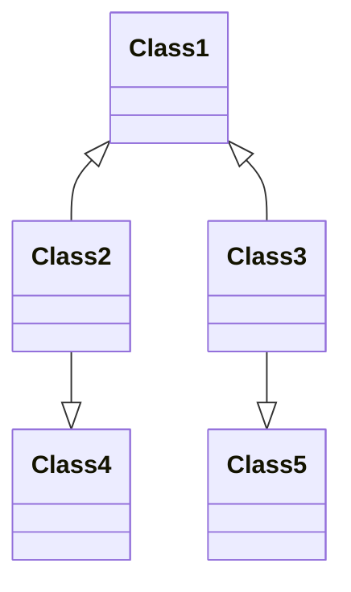
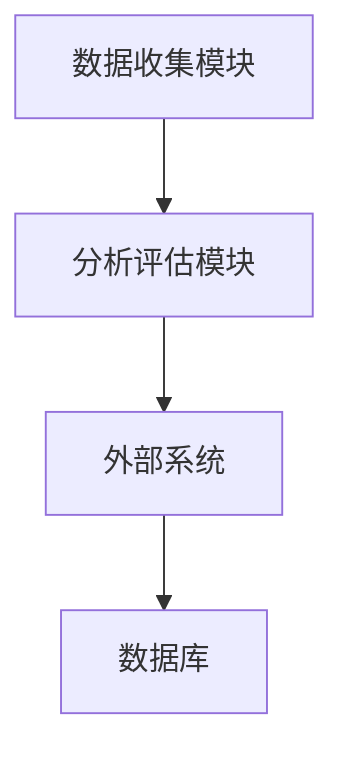
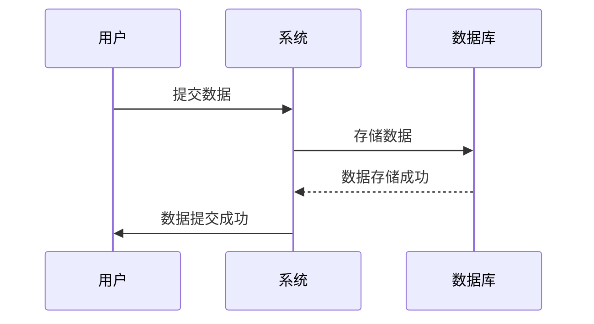

                 


### 《AI监管：企业如何建立负责任的AI使用策略》

----------------------------------------------------------------

## 第一部分：问题背景与核心概念

### 第1章 问题背景

#### 1.1 AI在企业管理中的现状

- **AI技术的广泛应用**：AI技术已在企业多个领域得到应用，如数据分析、自动化、客户服务等。
  - **数据分析**：利用机器学习技术对大量数据进行挖掘和分析，帮助企业做出更明智的决策。
  - **自动化**：通过自然语言处理和计算机视觉技术实现流程自动化，提高工作效率。
  - **客户服务**：利用聊天机器人、语音识别等技术提供更智能化、个性化的客户服务。

- **AI监管的重要性**：随着AI技术的普及，其潜在风险和管理问题也日益凸显，如算法偏见、隐私泄露等。
  - **算法偏见**：AI系统在处理数据时可能会产生偏见，影响决策的公正性。
  - **隐私泄露**：AI系统可能涉及个人隐私数据，如何保护这些数据成为关键问题。

#### 1.2 AI监管的核心概念

- **AI监管定义**：企业如何制定并执行政策、流程和标准，以确保AI系统的公平性、透明性和可靠性。
  - **公平性**：确保AI系统不因性别、种族、年龄等因素产生偏见。
  - **透明性**：使AI系统的决策过程可追溯、可解释。
  - **可靠性**：确保AI系统的稳定性和准确性。

- **负责任AI使用策略**：企业在使用AI时，如何确保其行为符合伦理和法律要求，保障公众利益。
  - **伦理要求**：遵循公正、透明、责任等伦理原则。
  - **法律要求**：遵守相关法律法规，如数据保护法、隐私法等。

#### 1.3 核心概念的联系

- **AI伦理与法律框架**：介绍相关的伦理和法律原则，如GDPR、伦理审查等。
  - **GDPR**：欧洲通用数据保护条例，对个人数据的收集、存储、处理和使用进行了严格规定。
  - **伦理审查**：在AI系统开发和应用过程中进行伦理评估，确保其符合伦理要求。

- **AI监管与可持续发展**：探讨AI监管如何促进企业的可持续发展和社会责任。
  - **可持续发展**：通过负责任的AI使用，降低环境和社会成本，实现企业的长期发展。
  - **社会责任**：确保AI系统的应用不会对公众利益产生负面影响。

### 第2章 核心概念原理

#### 2.1 AI伦理

- **定义**：AI伦理是关于AI系统开发、部署和使用过程中的道德问题。
  - **道德原则**：如公正性、透明性、责任性等。
  - **伦理问题**：如算法偏见、隐私泄露、自主性等。

- **属性特征**：
  - **公正性**：确保AI系统在决策过程中不歧视任何群体。
  - **透明性**：使AI系统的决策过程可追溯、可解释。
  - **责任性**：确保AI系统的开发者、运营者对其行为承担责任。

#### 2.2 法律法规

- **主要法规**：如GDPR、CCPA等。
  - **GDPR**：欧洲通用数据保护条例，对个人数据的收集、存储、处理和使用进行了严格规定。
  - **CCPA**：美国加利福尼亚州消费者隐私法案，规定了个人数据的权利和保护措施。

- **属性特征**：
  - **法律义务**：企业必须遵守相关法律法规，如数据保护法、隐私法等。
  - **责任**：企业在违反法律法规时，可能面临法律责任和处罚。

#### 2.3 企业文化

- **定义**：企业内部对AI监管的态度和价值观。
  - **文化特征**：如信任、开放性、责任感等。

- **属性特征**：
  - **信任**：员工和企业之间、企业内部各部门之间的信任是AI监管成功的关键。
  - **开放性**：鼓励员工提出建议和反馈，不断改进AI系统。
  - **责任感**：企业对AI系统的影响和潜在风险有清晰的认识和责任。

### 第3章 核心概念对比

#### 3.1 AI伦理与法律框架对比

- **对比**：
  - **目标**：AI伦理关注道德原则，法律框架关注法律义务。
  - **范围**：AI伦理涉及AI系统的整个生命周期，法律框架主要关注数据的收集、存储、处理和使用。

- **联系**：AI伦理和法律框架相互补充，共同确保AI系统的公正性、透明性和可靠性。

#### 3.2 AI监管与企业文化对比

- **对比**：
  - **作用**：AI监管关注AI系统的外部监管，企业文化关注企业内部对AI监管的态度和价值观。
  - **方式**：AI监管通过政策和流程确保AI系统的合规性，企业文化通过价值观和行为规范影响员工的行为。

- **联系**：企业文化对AI监管的执行有重要影响，两者相互促进，共同推动负责任的AI使用。

## 第二部分：算法原理讲解

### 第4章 AI监管算法

#### 4.1 算法原理

- **监督学习算法**：如决策树、支持向量机等。
  - **决策树**：通过构建决策树模型，将数据划分为不同的类别。
  - **支持向量机**：通过寻找最佳分离超平面，将数据分为不同的类别。

- **无监督学习算法**：如聚类、异常检测等。
  - **聚类**：将相似的数据点划分为同一类别。
  - **异常检测**：识别数据中的异常点，用于发现潜在的安全威胁。

#### 4.2 算法流程图

- **Mermaid流程图**：

```mermaid
graph TD
A[输入数据] --> B[预处理数据]
B --> C{分类任务？}
if C
  C -->|是| D[训练模型]
  D --> E[预测结果]
else
  C -->|否| F[聚类任务]
  F --> G[聚类结果]
```

#### 4.3 数学模型与公式

- **监督学习模型**：

  $$ y = f(x, w) + \epsilon $$

  其中，\( x \) 是输入特征，\( w \) 是模型参数，\( \epsilon \) 是噪声。

- **无监督学习模型**：

  $$ C = \{c_1, c_2, ..., c_k\} $$

  其中，\( C \) 是聚类中心，\( c_i \) 是第 \( i \) 个聚类中心。

#### 4.4 算法举例说明

- **例子**：使用决策树算法进行分类任务。

  - **数据集**：包含多个特征的数据集，如银行客户数据。
  - **模型训练**：通过训练数据集，构建决策树模型。
  - **预测**：使用决策树模型对新的数据进行预测，判断其类别。

## 第三部分：系统分析与架构设计

### 第5章 系统功能设计

#### 5.1 问题场景

- **企业AI监管系统**：用于监控和评估AI系统的表现。

#### 5.2 系统功能

- **数据收集**：收集AI系统运行数据，如输入数据、输出数据、模型参数等。
- **分析评估**：对收集的数据进行分析，评估AI系统的表现和潜在风险。

#### 5.3 领域模型

- **Mermaid类图**：



### 第6章 系统架构设计

#### 6.1 系统架构

- **组件**：
  - **数据收集模块**：负责收集AI系统的运行数据。
  - **分析评估模块**：负责分析评估AI系统的表现和潜在风险。
- **接口设计**：系统与外部系统的交互接口，如API接口、数据库接口等。

#### 6.2 系统架构图

- **Mermaid架构图**：



#### 6.3 系统交互

- **Mermaid序列图**：



## 第四部分：项目实战

### 第7章 环境安装

#### 7.1 开发环境搭建

- **软件安装**：安装Python、Anaconda等开发工具。

#### 7.2 系统核心实现

- **源代码**：实现AI监管系统的核心功能。

### 第8章 代码应用解读与分析

#### 8.1 代码解读

- **核心代码**：分析AI监管系统的主要代码。

#### 8.2 案例分析

- **实际案例**：分析AI监管系统在实际应用中的表现。

### 第9章 详细讲解与剖析

#### 9.1 原理讲解

- **算法原理**：深入讲解AI监管系统中的算法原理。

#### 9.2 剖析

- **系统性能**：分析系统的性能和稳定性。

## 第五部分：最佳实践与拓展

### 第10章 最佳实践

#### 10.1 实践经验

- **成功案例**：分享AI监管的最佳实践。

#### 10.2 注意事项

- **常见问题**：讨论在实施AI监管时可能遇到的问题。

---

### 作者

- **作者**：AI天才研究院/AI Genius Institute & 禅与计算机程序设计艺术 /Zen And The Art of Computer Programming

----------------------------------------------------------------

**文章关键词**：AI监管、负责任AI使用、算法偏见、数据隐私、企业可持续发展

**文章摘要**：本文探讨了企业在使用AI技术时如何建立负责任的AI使用策略。首先，分析了AI技术在企业管理中的现状，阐述了AI监管的重要性。然后，介绍了AI监管的核心概念，包括AI伦理、法律法规和企业文化。接着，讲解了AI监管算法的原理和系统分析与架构设计。最后，通过项目实战和最佳实践，提供了具体的实施方法和注意事项。本文旨在帮助企业更好地管理AI系统，确保其公正性、透明性和可靠性，促进企业的可持续发展。

----------------------------------------------------------------

**注意**：以上内容为文章的大纲结构和部分正文内容，具体内容还需根据实际情况进一步丰富和细化。文章字数在 10000 ～ 12000 字左右，格式要求为markdown格式。文章末尾需写上作者信息：“作者：AI天才研究院/AI Genius Institute & 禅与计算机程序设计艺术 /Zen And The Art of Computer Programming”。文章内容需满足完整性要求，包含背景介绍、核心概念与联系、算法原理讲解、系统分析与架构设计方案、项目实战、最佳实践与拓展等内容。核心内容需详细具体，确保文章的深度和思考性。

