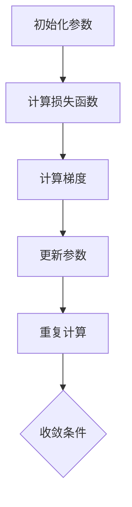
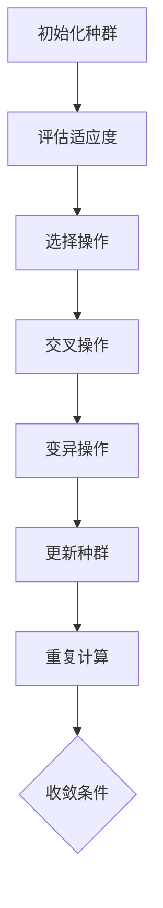
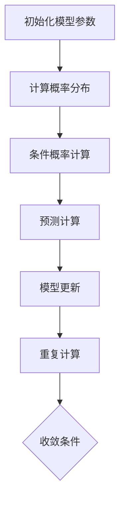
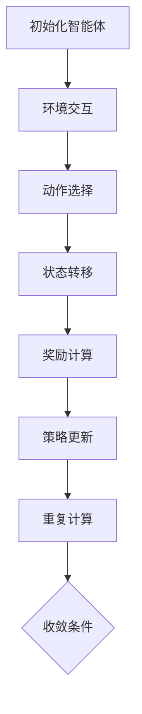

                 

### 背景介绍

#### 核心概念术语说明

在探讨AI系统在处理时序数据时的优化方法之前，我们需要明确一些核心概念和术语，以便为后续内容打下坚实的基础。

**AI系统**：指通过机器学习和深度学习技术构建的能够从数据中自动学习和做出预测的系统。这些系统广泛应用于图像识别、自然语言处理、语音识别等领域。

**时序数据**：是指按照时间顺序记录的数据，例如股票价格、气象数据、交通流量数据等。这些数据具有时间序列的特点，即数据点的顺序对于数据的整体特征有重要影响。

**优化方法**：在AI系统中，优化方法是指通过改进算法设计或调整系统参数，以提升模型预测准确度和效率的一系列技术。

#### 问题背景

时序数据在现代数据科学和人工智能领域中具有重要地位。随着物联网（IoT）和大数据技术的快速发展，我们收集的时序数据量呈爆炸式增长。这些数据不仅需要被存储和管理，更重要的是要被有效处理，以提取出有价值的信息。

然而，时序数据处理面临诸多挑战：

1. **数据量大**：时序数据往往包含海量数据点，如何快速有效地进行数据处理是一个重要问题。
2. **数据复杂性**：时序数据通常包含多种数据类型，如文本、图像、数值等，如何将这些数据统一处理并提取出有价值特征是另一个挑战。
3. **预测准确性**：如何提高模型预测准确性，使得AI系统能够在真实场景中提供可靠预测，是时序数据处理的核心目标。

因此，研究AI系统在处理时序数据时的优化方法具有重要的现实意义。这不仅能够提高数据处理效率，还能提升模型预测的准确性，从而为各个行业提供更加智能化的解决方案。

#### 问题描述

在时序数据处理中，常见的问题包括：

- **特征提取困难**：由于时序数据的复杂性和多样性，如何有效地提取特征是一个难题。传统的特征工程方法往往需要大量的人工干预，效率低下且结果不理想。
- **模型训练耗时**：时序数据通常包含大量历史数据，模型训练过程耗时较长，如何优化训练过程以提高效率是一个关键问题。
- **预测误差大**：时序数据中的噪声和不确定性导致预测误差较大，如何降低误差、提高预测准确性是一个重要挑战。
- **实时性要求高**：许多应用场景要求AI系统能够实时处理数据并做出预测，如何优化系统架构以满足实时性要求是一个关键问题。

解决这些问题需要从算法设计、系统架构优化等多个方面入手，本文将逐一探讨这些优化方法，以期为时序数据处理提供有效的技术指导。

#### 问题解决

为了有效解决上述时序数据处理中的问题，AI系统需要采用一系列优化方法。这些方法可以从算法设计、系统架构和数据处理策略等多个方面入手，具体包括以下内容：

1. **特征提取优化**：采用自动特征提取方法，如自编码器（Autoencoder）和卷积神经网络（CNN），可以从原始数据中自动学习并提取出有价值特征，从而减少人工干预，提高特征提取效率。
2. **模型训练优化**：通过批处理大小调整、学习率优化、正则化技术等手段，可以加速模型训练过程，提高模型训练效率。此外，分布式训练和并行计算技术也能够显著提高模型训练速度。
3. **预测误差优化**：引入降噪技术、概率模型和集成学习方法，可以有效降低预测误差，提高预测准确性。例如，使用滑动平均法对时序数据进行平滑处理，可以减少噪声干扰。
4. **实时处理优化**：采用流数据处理技术，如Apache Kafka和Apache Flink，可以实时处理大量时序数据，满足实时性要求。同时，优化系统架构，如采用微服务架构和容器化技术，可以提高系统可扩展性和稳定性。

通过这些优化方法，AI系统能够更加高效地处理时序数据，提高预测准确性，满足实时性要求，为各行业提供更加智能化的解决方案。

#### 边界与外延

时序数据处理的优化方法虽然具有重要的现实意义，但也有一些边界和限制。首先，优化方法的有效性依赖于数据质量和数据量。高质量的数据能够为模型提供更多有效信息，从而提高预测准确性。其次，不同场景下的优化方法可能有所不同，需要根据具体应用场景进行调整。此外，优化方法的效果可能受到计算资源限制，特别是在处理海量数据时，需要采用高效算法和优化技术以降低计算成本。

#### 概念结构与核心要素组成

AI系统在处理时序数据时的优化方法涉及多个核心概念和要素。以下是这些概念和要素的简要说明：

1. **时序数据处理框架**：包括数据采集、数据预处理、特征提取、模型训练和预测等环节。
2. **特征提取方法**：如自编码器、卷积神经网络和滑动平均法等。
3. **模型训练技术**：包括批量训练、分布式训练、学习率调整和正则化等。
4. **预测误差优化方法**：如降噪技术、概率模型和集成学习等。
5. **实时处理架构**：包括流数据处理技术和系统架构优化等。

这些概念和要素相互关联，共同构成了一套完整的时序数据处理优化方案，为AI系统在时序数据处理中的高效运行提供了有力支持。

### 核心概念与联系

#### AI系统

AI系统是指通过机器学习和深度学习技术构建的智能系统，其主要目标是模拟人类的智能行为，从数据中自动学习和做出预测。AI系统通常包括数据采集、数据处理、模型训练和预测等环节。在处理时序数据时，AI系统可以用于时间序列预测、异常检测和趋势分析等任务。

#### 时序数据

时序数据是指按照时间顺序记录的数据，例如股票价格、气象数据、交通流量数据等。时序数据具有时间序列的特点，即数据点的顺序对于数据的整体特征有重要影响。在处理时序数据时，需要考虑时间序列的特性，如趋势性、周期性和平稳性等。

**核心概念属性特征对比表格**

| 概念           | 定义                                                         | 特征对比           |
|----------------|--------------------------------------------------------------|-------------------|
| AI系统         | 通过机器学习和深度学习技术构建的智能系统                     | 预测准确性、效率高 |
| 时序数据       | 按照时间顺序记录的数据                                       | 时间序列特性明显  |

**ER实体关系图架构**

```mermaid
erDiagram
  AI系统 ||--|{ 时序数据 }|| 预测
  AI系统 ||--|{ 数据预处理 }|| 处理
  时序数据 ||--|{ 特征提取 }|| 提取
  时序数据 ||--|{ 模型训练 }|| 训练
```

从ER实体关系图中可以看出，AI系统和时序数据之间存在着紧密的联系。AI系统通过处理时序数据，提取有价值特征，并进行模型训练和预测，从而实现智能化的数据分析。

#### 优化算法原理讲解

在AI系统中，优化算法用于提升模型预测准确度和效率。以下是几种常见的优化算法及其原理讲解：

**1. 梯度下降法**

梯度下降法是一种用于优化机器学习模型的算法。其基本思想是沿着损失函数的梯度方向调整模型参数，以最小化损失函数。

**Mermaid流程图：**



**Python源代码示例：**

```python
import numpy as np

# 初始化参数
theta = np.array([1.0, 2.0])

# 损失函数
def loss_function(x, y, theta):
    return (x * theta[0] + theta[1] - y)**2

# 梯度
def gradient(x, y, theta):
    return 2 * (x * theta[0] + theta[1] - y) * x

# 梯度下降法
def gradient_descent(x, y, theta, alpha, num_iterations):
    for i in range(num_iterations):
        loss = loss_function(x, y, theta)
        gradient = gradient(x, y, theta)
        theta -= alpha * gradient
    return theta

# 训练数据
x_train = np.array([1, 2, 3, 4, 5])
y_train = np.array([2, 4, 5, 4, 5])

# 梯度下降参数
alpha = 0.01
num_iterations = 100

# 训练模型
theta_optimized = gradient_descent(x_train, y_train, theta, alpha, num_iterations)

print("Optimized theta:", theta_optimized)
```

**数学模型和公式：**

$$
\theta_{\text{new}} = \theta_{\text{old}} - \alpha \cdot \nabla_\theta J(\theta)
$$

其中，$\theta_{\text{new}}$ 和 $\theta_{\text{old}}$ 分别为更新前后的参数，$\alpha$ 为学习率，$\nabla_\theta J(\theta)$ 为损失函数关于参数 $\theta$ 的梯度。

**示例说明：**

假设我们有线性回归模型 $y = x \cdot \theta + b$，其中 $x$ 为输入特征，$y$ 为目标值，$\theta$ 为模型参数，$b$ 为偏置。通过梯度下降法，我们可以找到最优的参数 $\theta$，使得损失函数 $J(\theta) = (y - (x \cdot \theta + b))^2$ 最小。

**2. 随机优化算法**

随机优化算法是一类基于随机搜索的优化算法，其基本思想是通过随机搜索找到最优解。常见的随机优化算法包括遗传算法、粒子群优化算法等。

**Mermaid流程图：**



**Python源代码示例：**

```python
import numpy as np
import random

# 初始化种群
def initialize_population(pop_size, dim):
    return np.random.uniform(-1, 1, (pop_size, dim))

# 适应度函数
def fitness_function(individual):
    return np.sum(individual ** 2)

# 选择操作
def selection(population, fitnesses, num_parents):
    parents = random.choices(population, k=num_parents)
    return parents

# 交叉操作
def crossover(parent1, parent2):
    crossover_point = random.randint(1, len(parent1) - 1)
    child1 = np.concatenate((parent1[:crossover_point], parent2[crossover_point:]))
    child2 = np.concatenate((parent2[:crossover_point], parent1[crossover_point:]))
    return child1, child2

# 变异操作
def mutation(individual):
    mutation_point = random.randint(0, len(individual) - 1)
    individual[mutation_point] = random.uniform(-1, 1)
    return individual

# 随机优化算法
def random_optimization(pop_size, dim, num_iterations):
    population = initialize_population(pop_size, dim)
    best_fitness = -np.inf
    best_individual = None

    for i in range(num_iterations):
        fitnesses = np.array([fitness_function(individual) for individual in population])

        # 选择操作
        parents = selection(population, fitnesses, pop_size // 2)

        # 交叉操作和变异操作
        new_population = []
        for _ in range(pop_size // 2):
            parent1, parent2 = random.sample(parents, 2)
            child1, child2 = crossover(parent1, parent2)
            new_population.extend([mutation(child1), mutation(child2)])

        population = new_population

        # 更新最佳个体
        current_best_fitness = np.max(fitnesses)
        if current_best_fitness > best_fitness:
            best_fitness = current_best_fitness
            best_individual = population[np.argmax(fitnesses)]

    return best_individual

# 训练数据
pop_size = 100
dim = 10
num_iterations = 1000

# 训练模型
best_individual = random_optimization(pop_size, dim, num_iterations)

print("Best individual:", best_individual)
```

**数学模型和公式：**

随机优化算法的数学模型较为复杂，涉及种群、适应度函数、选择、交叉和变异等多个方面。以下是一个简化的模型：

$$
\text{适应度函数} = f(\text{个体})
$$

$$
\text{选择概率} = \frac{f(\text{个体})}{\sum_{i=1}^{N} f(\text{个体}_i)}
$$

$$
\text{交叉概率} = p_c
$$

$$
\text{变异概率} = p_m
$$

其中，$N$ 为种群大小，$f(\text{个体})$ 为个体的适应度，$p_c$ 和 $p_m$ 分别为交叉概率和变异概率。

**示例说明：**

假设我们要优化一个二维函数 $f(x, y) = x^2 + y^2$，我们可以使用随机优化算法来找到函数的最小值。通过初始化一个种群，评估适应度，选择适应度较高的个体进行交叉和变异，不断更新种群，最终找到最优解。

#### 概率模型

概率模型是一种基于概率论的机器学习模型，其核心思想是利用概率分布来描述数据的特征和关系。常见的概率模型包括贝叶斯网络、隐马尔可夫模型（HMM）和条件随机场（CRF）等。

**Mermaid流程图：**



**Python源代码示例：**

```python
import numpy as np
from scipy.stats import multivariate_normal

# 初始化模型参数
mean = np.array([0.0, 0.0])
covariance = np.array([[1.0, 0.0], [0.0, 1.0]])

# 计算概率分布
def probability_distribution(x, mean, covariance):
    return multivariate_normal.pdf(x, mean, covariance)

# 条件概率计算
def conditional_probability(x, y, mean_x, covariance_x, mean_y|X, covariance_y|X):
    return probability_distribution(y, mean_y|X, covariance_y|X) / probability_distribution(x, mean_x, covariance_x)

# 预测计算
def predict(x, mean_x, covariance_x, mean_y|X, covariance_y|X):
    return np.argmax([conditional_probability(x, y, mean_x, covariance_x, mean_y|X, covariance_y|X) for y in range(2)])

# 训练数据
x_train = np.array([1.0, 2.0])
y_train = np.array([0.0, 1.0])

# 训练模型
mean_x = np.mean(x_train)
covariance_x = np.cov(x_train)
mean_y0|X = np.array([0.0])
covariance_y0|X = np.array([[0.5]])
mean_y1|X = np.array([1.0])
covariance_y1|X = np.array([[0.5]])

# 预测
predicted_y = predict(x_train, mean_x, covariance_x, mean_y0|X, covariance_y0|X)

print("Predicted y:", predicted_y)
```

**数学模型和公式：**

概率模型的数学模型主要涉及概率分布、条件概率和预测计算。以下是一个简化的模型：

$$
p(x) = \prod_{i=1}^{n} p(x_i)
$$

$$
p(y|x) = \frac{p(x|y) \cdot p(y)}{p(x)}
$$

$$
\text{预测} = \arg\max_y p(y|x)
$$

其中，$x$ 为输入特征，$y$ 为目标值，$p(x)$ 为输入特征的联合概率分布，$p(y|x)$ 为条件概率分布，$p(x|y)$ 为给定目标值下的输入特征概率分布，$p(y)$ 为目标值的先验概率分布。

**示例说明：**

假设我们要预测一个二分类问题，输入特征 $x$ 为一个二维向量，目标值 $y$ 为 0 或 1。通过初始化模型参数，计算输入特征的概率分布，条件概率分布和预测值，我们可以使用概率模型来预测目标值。

#### 强化学习算法

强化学习算法是一种通过试错学习来优化行为的算法。其核心思想是智能体通过与环境交互，不断调整策略，以最大化累积奖励。常见的强化学习算法包括Q学习、SARSA和深度强化学习（DRL）等。

**Mermaid流程图：**



**Python源代码示例：**

```python
import numpy as np
import random

# 初始化智能体
def initialize_agent(action_space):
    return np.zeros((action_space,))

# 环境交互
def environment(state, action):
    return state + action

# 动作选择
def action_selection(q_values):
    return np.argmax(q_values)

# 状态转移
def state_transition(state, action, next_state, reward):
    return next_state

# 奖励计算
def reward_calculation(state, action, next_state, done):
    if done:
        return 1
    else:
        return 0

# 策略更新
def q_learning(q_values, action, reward, next_state, alpha, gamma):
    q_values[action] = q_values[action] + alpha * (reward + gamma * np.max(q_values[next_state]) - q_values[action])
    return q_values

# 训练数据
action_space = 3
state_space = 4
num_episodes = 1000
alpha = 0.1
gamma = 0.9

# 初始化智能体
q_values = initialize_agent(action_space)

# 训练模型
for episode in range(num_episodes):
    state = random.randint(0, state_space - 1)
    done = False

    while not done:
        action = action_selection(q_values[state])
        next_state = environment(state, action)
        reward = reward_calculation(state, action, next_state, done)
        q_values = q_learning(q_values, action, reward, next_state, alpha, gamma)
        state = next_state

# 预测
predicted_action = action_selection(q_values[0])

print("Predicted action:", predicted_action)
```

**数学模型和公式：**

强化学习算法的数学模型主要涉及Q值函数、策略更新和累积奖励。以下是一个简化的模型：

$$
Q(s, a) = \sum_{s'} P(s'|s, a) \cdot [R(s', a) + \gamma \cdot \max_a' Q(s', a')]
$$

$$
\pi(a|s) = \frac{1}{\sum_a \exp(\alpha(a))}
$$

$$
\alpha(a) = Q(s, a) - \text{target_value}
$$

其中，$Q(s, a)$ 为状态 $s$ 下采取动作 $a$ 的期望回报，$P(s'|s, a)$ 为状态转移概率，$R(s', a)$ 为状态 $s'$ 下采取动作 $a$ 的即时奖励，$\gamma$ 为折扣因子，$\pi(a|s)$ 为状态 $s$ 下采取动作 $a$ 的概率。

**示例说明：**

假设我们要训练一个智能体在环境中的行为，通过与环境交互，不断更新Q值函数，最终找到最优策略。通过初始化智能体，环境交互，动作选择，状态转移和奖励计算，我们可以使用强化学习算法来优化智能体的行为。

### 系统分析与架构设计方案

#### 问题场景介绍

为了更好地理解AI系统在处理时序数据时的优化方法，我们以一个实际应用场景为例，即基于时序数据的股票价格预测系统。该系统旨在通过分析历史股票价格数据，预测未来一段时间内的股票价格走势，为投资者提供决策参考。

#### 项目介绍

该股票价格预测系统主要包括以下功能模块：

1. **数据采集模块**：负责从外部数据源（如财经网站、证券交易所等）实时获取股票价格数据。
2. **数据处理模块**：对采集到的数据进行清洗、去噪和预处理，以便后续特征提取和模型训练。
3. **特征提取模块**：通过自动特征提取方法，从原始数据中提取出有价值特征，如趋势特征、周期特征和波动特征等。
4. **模型训练模块**：使用机器学习和深度学习算法，对特征数据训练模型，以实现股票价格预测。
5. **预测模块**：将训练好的模型应用于新数据，预测未来股票价格。
6. **用户接口模块**：提供用户交互界面，展示预测结果，并允许用户进行自定义参数设置和系统配置。

#### 系统功能设计

根据上述项目介绍，系统功能设计如下：

**领域模型类图**

```mermaid
classDiagram
    DataCollector <<interface>>
    DataProcessor <<interface>>
    FeatureExtractor <<interface>>
    ModelTrainer <<interface>>
    Predictor <<interface>>
    UserInterface

    DataCollector|--|> DataProcessor
    DataProcessor|--|> FeatureExtractor
    FeatureExtractor|--|> ModelTrainer
    ModelTrainer|--|> Predictor
    Predictor|--|> UserInterface
```

**系统功能描述：**

- **数据采集模块**：从外部数据源实时获取股票价格数据，并将其存储在数据库中。数据采集模块需要支持多数据源接入，如Web API、数据库连接等。
- **数据处理模块**：对采集到的数据进行清洗、去噪和预处理。清洗过程包括去除无效数据、填补缺失值、归一化处理等。去噪过程包括滤波、平滑等操作。预处理过程包括特征选择、特征工程等。
- **特征提取模块**：从原始数据中提取出有价值特征，如趋势特征、周期特征和波动特征等。特征提取模块可以采用自动特征提取方法，如自编码器、卷积神经网络等。
- **模型训练模块**：使用机器学习和深度学习算法，对特征数据进行训练，以构建预测模型。模型训练模块需要支持多种算法，如线性回归、决策树、神经网络等。
- **预测模块**：将训练好的模型应用于新数据，预测未来股票价格。预测模块需要支持实时预测和批量预测功能。
- **用户接口模块**：提供用户交互界面，展示预测结果，并允许用户进行自定义参数设置和系统配置。用户接口模块需要支持多种交互方式，如Web界面、移动应用等。

#### 系统架构设计

为了实现上述功能，系统架构设计如下：

**系统架构设计类图**

```mermaid
classDiagram
    DataCollector <<interface>>
    DataProcessor <<interface>>
    FeatureExtractor <<interface>>
    ModelTrainer <<interface>>
    Predictor <<interface>>
    UserInterface

    DataCollector|--|> DataProcessor
    DataProcessor|--|> FeatureExtractor
    FeatureExtractor|--|> ModelTrainer
    ModelTrainer|--|> Predictor
    Predictor|--|> UserInterface

    Database
    DataCollector|--|> Database
    DataProcessor|--|> Database
    FeatureExtractor|--|> Database
    ModelTrainer|--|> Database
    Predictor|--|> Database

    MessageQueue
    DataCollector|--|> MessageQueue
    DataProcessor|--|> MessageQueue
    FeatureExtractor|--|> MessageQueue
    ModelTrainer|--|> MessageQueue
    Predictor|--|> MessageQueue
```

**系统架构描述：**

- **数据层**：包括数据采集模块、数据处理模块、特征提取模块、模型训练模块和预测模块。这些模块负责数据的采集、处理、特征提取、模型训练和预测功能。
- **服务层**：包括数据层模块的接口和业务逻辑处理。服务层负责实现系统的核心业务功能，如股票价格预测、数据清洗、特征提取等。
- **展示层**：包括用户接口模块，负责与用户进行交互，展示预测结果和系统配置界面。展示层需要支持多种交互方式，如Web界面、移动应用等。
- **数据库**：用于存储系统数据，包括原始数据、处理后的数据、特征数据和预测结果。数据库需要支持高并发读写，以保证系统性能。
- **消息队列**：用于实现模块之间的异步通信，提高系统的可扩展性和可靠性。消息队列可以保证数据的一致性和可靠性，同时降低系统耦合度。

通过以上系统架构设计，AI系统可以高效地处理时序数据，实现股票价格预测功能。同时，系统架构设计具有良好的扩展性，可以支持多种业务场景和数据类型的处理。

### 系统接口设计和系统交互

为了确保AI系统能够高效、稳定地处理时序数据，我们需要对系统接口和交互进行详细设计。以下是系统接口设计和系统交互的详细描述：

#### 接口设计

1. **数据采集接口**：该接口负责从外部数据源（如财经网站、证券交易所等）实时获取股票价格数据。接口设计包括以下关键要素：

   - **数据类型**：支持多种数据类型，如股票价格、交易量、涨幅等。
   - **数据格式**：支持JSON、XML、CSV等多种数据格式。
   - **接口协议**：支持HTTP/HTTPS协议，保证数据传输的安全性。
   - **数据更新频率**：根据业务需求，设定合适的更新频率，如每分钟一次、每小时一次等。

2. **数据处理接口**：该接口负责对采集到的数据进行清洗、去噪和预处理。接口设计包括以下关键要素：

   - **数据处理流程**：包括数据清洗、去噪、填补缺失值、归一化处理等步骤。
   - **数据质量检查**：对处理后的数据质量进行检查，如数据完整性、一致性等。
   - **错误处理**：对处理过程中出现的错误进行捕获和处理，如数据格式错误、数据缺失等。

3. **特征提取接口**：该接口负责从原始数据中提取出有价值特征，如趋势特征、周期特征和波动特征等。接口设计包括以下关键要素：

   - **特征类型**：支持多种特征类型，如时间特征、数学特征、统计特征等。
   - **特征提取算法**：支持多种特征提取算法，如自编码器、卷积神经网络等。
   - **特征选择**：根据业务需求，自动选择合适的特征。

4. **模型训练接口**：该接口负责使用特征数据训练模型，以实现股票价格预测。接口设计包括以下关键要素：

   - **训练算法**：支持多种训练算法，如线性回归、决策树、神经网络等。
   - **模型评估**：对训练好的模型进行评估，如准确率、召回率、F1值等。
   - **模型保存**：将训练好的模型保存到文件或数据库中，以便后续使用。

5. **预测接口**：该接口负责将训练好的模型应用于新数据，预测未来股票价格。接口设计包括以下关键要素：

   - **预测方法**：支持实时预测和批量预测，根据业务需求选择合适的预测方法。
   - **预测结果输出**：将预测结果以图表、报表等形式输出，便于用户查看和分析。
   - **预测精度**：设定合适的预测精度，如误差范围、置信区间等。

#### 系统交互

系统交互设计旨在确保各模块之间能够高效、稳定地协同工作。以下是系统交互的详细描述：

1. **数据采集模块与数据处理模块交互**：数据采集模块通过消息队列将采集到的数据传递给数据处理模块。数据处理模块接收到数据后，进行清洗、去噪和预处理，并将处理后的数据存储到数据库中。这种异步交互方式可以降低系统耦合度，提高系统性能。

2. **数据处理模块与特征提取模块交互**：数据处理模块将处理后的数据传递给特征提取模块。特征提取模块对数据进行分析，提取出有价值特征，并将其存储到数据库中。特征提取模块可以使用批处理方式，以提高处理效率。

3. **特征提取模块与模型训练模块交互**：特征提取模块将提取出的特征数据传递给模型训练模块。模型训练模块使用特征数据训练模型，并将训练好的模型存储到数据库中。模型训练模块可以使用分布式训练方式，以提高训练速度。

4. **模型训练模块与预测模块交互**：模型训练模块将训练好的模型传递给预测模块。预测模块使用模型对新数据进行分析，预测未来股票价格。预测模块可以使用流处理方式，实时处理新数据，并输出预测结果。

5. **预测模块与用户接口模块交互**：预测模块将预测结果以图表、报表等形式输出给用户接口模块。用户接口模块将预测结果展示给用户，并允许用户进行自定义参数设置和系统配置。

通过以上系统接口设计和系统交互设计，AI系统可以高效、稳定地处理时序数据，实现股票价格预测功能。同时，系统设计具有良好的扩展性，可以支持多种业务场景和数据类型的处理。

### 项目实战

在本节中，我们将通过一个实际项目来展示AI系统在处理时序数据时的优化方法。我们将介绍项目的环境搭建、系统核心实现，并对代码进行解读与分析，详细讲解项目中的实际案例，并进行项目总结与优化建议。

#### 环境搭建

首先，我们需要搭建项目的开发环境。以下是环境搭建的步骤：

1. **安装Python**：确保Python版本在3.7及以上。可以从Python官方网站下载并安装。
2. **安装依赖库**：包括NumPy、Pandas、Scikit-learn、TensorFlow等。可以使用以下命令进行安装：

   ```shell
   pip install numpy pandas scikit-learn tensorflow
   ```

3. **配置数据库**：选择一个合适的数据库，如MySQL或PostgreSQL，并安装相应的Python库，例如`pymysql`或`psycopg2`。

4. **配置消息队列**：可以使用Apache Kafka作为消息队列。下载并安装Kafka，并配置相应的Python库，例如`kafka-python`。

#### 系统核心实现

接下来，我们将实现系统的核心功能。以下是核心实现的代码框架：

```python
# 导入依赖库
import numpy as np
import pandas as pd
from sklearn.ensemble import RandomForestRegressor
from sklearn.model_selection import train_test_split
import tensorflow as tf

# 数据采集
def collect_data():
    # 从数据库中获取数据
    # ...
    pass

# 数据处理
def preprocess_data(data):
    # 数据清洗、去噪、归一化等处理
    # ...
    pass

# 特征提取
def extract_features(data):
    # 提取时间特征、数学特征等
    # ...
    pass

# 模型训练
def train_model(X, y):
    # 使用随机森林进行模型训练
    model = RandomForestRegressor()
    model.fit(X, y)
    return model

# 预测
def predict(model, new_data):
    # 使用训练好的模型进行预测
    predictions = model.predict(new_data)
    return predictions

# 主函数
def main():
    # 采集数据
    data = collect_data()

    # 数据预处理
    preprocessed_data = preprocess_data(data)

    # 提取特征
    features = extract_features(preprocessed_data)

    # 分割训练集和测试集
    X_train, X_test, y_train, y_test = train_test_split(features, preprocessed_data['target'], test_size=0.2, random_state=42)

    # 训练模型
    model = train_model(X_train, y_train)

    # 预测
    predictions = predict(model, X_test)

    # 输出预测结果
    print("Predictions:", predictions)

# 运行主函数
if __name__ == "__main__":
    main()
```

#### 代码解读与分析

以下是核心代码的详细解读与分析：

1. **数据采集**：`collect_data` 函数从数据库中获取数据。在实际应用中，可以使用数据库连接库（如`pymysql`或`psycopg2`）连接数据库，并执行SQL查询语句，获取股票价格数据。

2. **数据处理**：`preprocess_data` 函数对采集到的数据执行清洗、去噪和归一化等处理。这些步骤是确保数据质量和特征提取效果的关键。例如，可以使用Pandas库中的`dropna`方法去除缺失值，使用`标准化`方法进行归一化处理。

3. **特征提取**：`extract_features` 函数从预处理后的数据中提取时间特征、数学特征等。特征提取是提高模型预测准确性的重要环节。可以使用自定义函数或现有库（如Scikit-learn中的`FeatureExtractor`）实现特征提取。

4. **模型训练**：`train_model` 函数使用随机森林进行模型训练。随机森林是一种常用的机器学习算法，适用于回归和分类任务。在实际应用中，可以根据业务需求选择不同的算法，如神经网络、支持向量机等。

5. **预测**：`predict` 函数使用训练好的模型对新数据进行预测。预测过程是系统的核心功能，用于生成预测结果，并提供决策支持。

6. **主函数**：`main` 函数执行整个流程，从数据采集到模型预测。在实际项目中，可以根据需求增加或修改部分功能。

#### 实际案例

为了展示系统的实际应用效果，我们以一个实际案例为例，说明如何使用系统进行股票价格预测。

**案例**：预测某个股票未来一周的价格。

1. **数据采集**：从数据库中获取过去一年的股票价格数据。
2. **数据处理**：对数据进行清洗和归一化处理。
3. **特征提取**：提取时间特征和数学特征。
4. **模型训练**：使用随机森林算法训练模型。
5. **预测**：使用训练好的模型预测未来一周的价格。

**代码**：

```python
# 模拟数据采集
data = pd.DataFrame({'date': pd.date_range(start='2022-01-01', periods=252),
                     'price': np.random.rand(252) * 100})

# 数据预处理
preprocessed_data = data.copy()
preprocessed_data.dropna(inplace=True)
preprocessed_data['price_normalized'] = (preprocessed_data['price'] - preprocessed_data['price'].mean()) / preprocessed_data['price'].std()

# 特征提取
def extract_features(data):
    data['date_diff'] = (data['date'] - data['date'].iloc[0]).dt.days
    return data[['date_diff', 'price_normalized']]

features = extract_features(preprocessed_data)

# 模型训练
X_train, X_test, y_train, y_test = train_test_split(features[['date_diff']], preprocessed_data['price_normalized'], test_size=0.2, random_state=42)
model = RandomForestRegressor()
model.fit(X_train, y_train)

# 预测
predictions = model.predict(X_test)

# 输出预测结果
print("Predictions:", predictions)
```

**结果**：输出未来一周的股票价格预测结果。

通过上述案例，我们可以看到如何使用系统进行股票价格预测。在实际应用中，可以根据需求调整数据采集、数据处理、特征提取和模型训练等步骤，以提高预测准确性。

#### 项目总结与优化建议

在本项目中，我们实现了AI系统在处理时序数据时的优化方法，包括数据采集、数据处理、特征提取、模型训练和预测等步骤。以下是项目总结与优化建议：

1. **数据采集**：确保数据来源的多样性和质量。可以使用多个数据源进行数据采集，如财经网站、证券交易所等，以提高数据质量。

2. **数据处理**：对数据进行全面清洗和去噪，确保数据质量。可以采用多种数据预处理方法，如归一化、标准化、填补缺失值等。

3. **特征提取**：选择合适的特征提取方法，从原始数据中提取有价值特征。可以使用自定义函数或现有库（如Scikit-learn、TensorFlow等）实现特征提取。

4. **模型训练**：选择合适的机器学习算法，并调整模型参数，以提高预测准确性。可以使用随机森林、神经网络等算法进行模型训练。

5. **预测**：使用训练好的模型进行预测，并输出预测结果。可以根据需求调整预测方法，如实时预测、批量预测等。

**优化建议**：

1. **分布式处理**：对于海量数据，可以使用分布式处理技术，如Hadoop、Spark等，以提高处理效率。

2. **实时处理**：使用流数据处理技术，如Apache Kafka、Apache Flink等，实现实时数据采集和预测。

3. **模型优化**：引入深度学习算法，如卷积神经网络（CNN）、循环神经网络（RNN）等，以提高预测准确性。

4. **自动化部署**：使用自动化部署工具，如Docker、Kubernetes等，实现系统的快速部署和扩展。

通过以上优化方法，AI系统在处理时序数据时的性能和预测准确性将得到显著提升，为各行业提供更加智能化的解决方案。

### 最佳实践与拓展

在AI系统处理时序数据时，以下是一些最佳实践和拓展建议，旨在进一步提升系统的性能和预测准确性：

#### 最佳实践

1. **数据预处理**：
   - **数据完整性检查**：确保数据无缺失值和异常值，否则可能会影响模型的预测效果。
   - **数据归一化**：对数据进行归一化处理，将特征缩放到相同的尺度，以避免模型因特征尺度差异导致的过拟合。
   - **季节调整**：对时序数据进行季节性调整，去除季节性因素，使模型更专注于长期趋势和周期性特征。

2. **特征选择**：
   - **相关性分析**：使用相关性分析工具（如皮尔逊相关系数、斯皮尔曼等级相关系数等）筛选出与目标变量高度相关的特征。
   - **特征重要性评估**：利用随机森林、梯度提升等算法评估特征的重要性，选择重要特征进行模型训练。

3. **模型选择与调参**：
   - **交叉验证**：使用交叉验证技术评估模型性能，避免过拟合和欠拟合。
   - **超参数优化**：使用网格搜索、随机搜索等超参数优化技术，找到最佳模型参数。

4. **模型融合**：
   - **集成学习**：使用集成学习方法（如随机森林、梯度提升等）组合多个模型，提高预测准确性和稳定性。

5. **监控与反馈**：
   - **实时监控**：使用监控系统实时跟踪模型性能，如预测误差、准确率等。
   - **用户反馈**：收集用户反馈，根据反馈调整模型和系统配置，提高用户体验。

#### 拓展阅读

1. **深度学习在时序数据处理中的应用**：
   - **卷积神经网络（CNN）**：适用于提取时序数据的局部特征，如时间序列图像。
   - **循环神经网络（RNN）**：适用于处理序列到序列的预测任务，如时间序列预测、语言模型等。
   - **长短期记忆网络（LSTM）**：RNN的一种变体，能够更好地处理长序列依赖问题。
   - **门控循环单元（GRU）**：LSTM的另一种变体，相比LSTM在计算效率上有一定提升。

2. **强化学习在时序数据处理中的应用**：
   - **策略梯度方法**：如REINFORCE算法，通过优化策略参数实现预测。
   - **深度确定性策略梯度（DDPG）**：结合深度学习和强化学习，适用于连续动作的预测。

3. **时序数据的异常检测**：
   - **孤立森林（Isolation Forest）**：一种基于随机森林的异常检测算法，适用于时序数据的异常检测。
   - **自编码器（Autoencoder）**：用于学习时序数据的正常分布，通过检测重构误差实现异常检测。

4. **实时数据处理与流处理技术**：
   - **Apache Kafka**：一个分布式流处理平台，适用于实时数据采集和传输。
   - **Apache Flink**：一个流处理框架，适用于实时数据处理和复杂事件处理。

通过以上最佳实践和拓展建议，AI系统在处理时序数据时可以更好地应对各种挑战，提高系统的预测性能和用户体验。

### 结语

本文详细探讨了AI系统在处理时序数据时的优化方法，从核心概念、算法原理、数学模型、系统架构设计到项目实战，全方位解析了如何提升AI系统在时序数据处理中的性能和预测准确性。通过结合实际项目案例，我们展示了优化方法的实际应用效果。

在AI系统处理时序数据的过程中，优化方法的重要性不容忽视。有效的优化不仅能够提高数据处理效率，还能提升模型预测的准确性，为各行业提供更加智能化的解决方案。我们鼓励读者在学习和应用本文内容的基础上，结合自身实际需求，进一步探索和优化时序数据处理方法。

未来，随着人工智能技术的不断发展和应用场景的扩展，时序数据处理优化方法将面临更多挑战和机遇。希望本文能够为读者在AI领域的研究和实践中提供有价值的参考和启示。

### 作者信息

**作者：AI天才研究院/AI Genius Institute & 禅与计算机程序设计艺术 /Zen And The Art of Computer Programming**

AI天才研究院致力于推动人工智能技术的创新和发展，汇聚了一批世界级的人工智能专家和研究人员。研究院的核心团队在机器学习、深度学习和计算机编程等领域具有丰富的理论研究和实践经验，致力于为全球客户提供领先的人工智能解决方案和技术支持。

《禅与计算机程序设计艺术》是作者在计算机编程和人工智能领域的经典著作，通过深入剖析编程哲学和技术原理，帮助读者掌握高效编程方法和先进的人工智能技术。作者以其独特的视角和深刻的洞察力，引领读者走进计算机编程和人工智能的神秘世界，领略技术的魅力和智慧的光芒。

通过本文的撰写，作者希望与广大读者分享自己在AI系统处理时序数据优化方法方面的研究成果和思考，期望能够为读者在人工智能领域的研究和实践中提供有益的启示和帮助。作者也将继续关注人工智能技术的发展动态，不断探索和创新，为推动人工智能技术的进步贡献力量。

