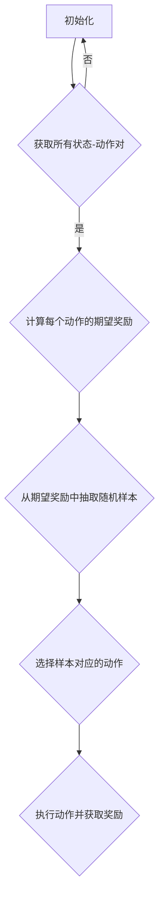
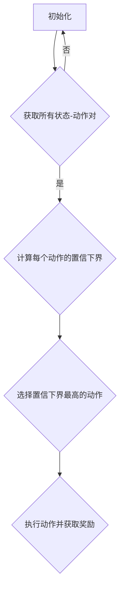
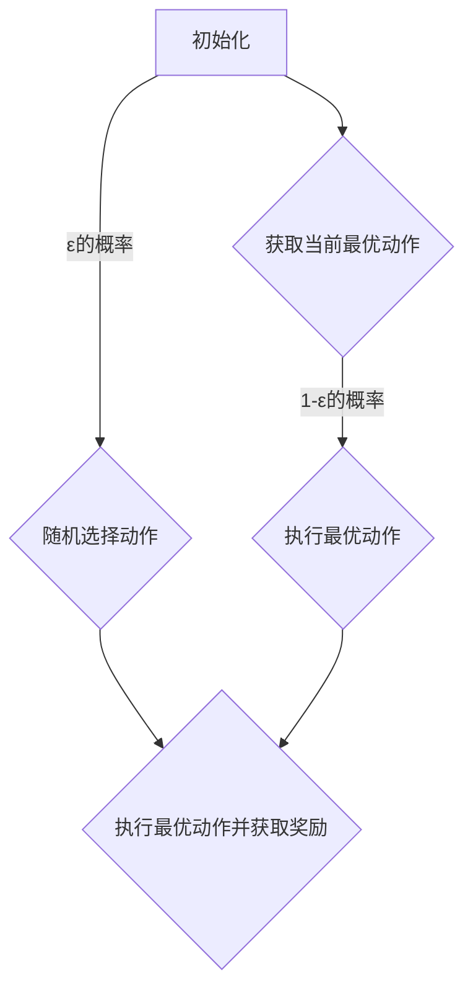

                 


## AI系统在处理稀疏奖励环境时的探索策略

### 关键词

- AI系统
- 稀疏奖励环境
- 探索策略
- Thompson采样
- UCB算法
- ε-贪婪策略

### 摘要

本文将探讨在稀疏奖励环境中，如何设计有效的探索策略来提高AI系统的学习效率。稀疏奖励环境是机器学习中的一个重要挑战，即系统在学习过程中获得的奖励信号极为稀少，这使得AI系统在探索未知状态和策略时面临极大的困难。本文将介绍核心概念和策略，包括Thompson采样、UCB算法和ε-贪婪策略，并通过实际案例进行分析和讲解，最后总结最佳实践和未来发展趋势。

## 引言与背景

### 1.1 人工智能的发展现状

人工智能（AI）作为21世纪最具前瞻性的技术之一，已经取得了显著的进展。从早期的专家系统到现代的深度学习，AI技术在各个领域都展现了强大的能力。然而，随着应用场景的多样化，AI系统面临的挑战也在不断升级。稀疏奖励环境便是其中之一。

### 1.2 稀疏奖励环境的定义与挑战

稀疏奖励环境是指在系统中，奖励信号非常稀少，即系统在大部分时间内都处于无奖励或低奖励状态，而高奖励状态出现的概率极低。这种环境对AI系统提出了巨大的挑战，因为系统很难通过稀疏的奖励信号来学习有效的策略。

### 1.3 稀疏奖励环境在AI中的应用

稀疏奖励环境广泛应用于机器人学、自动驾驶、游戏AI等领域。例如，在自动驾驶中，车辆需要在复杂的交通环境中行驶，但高奖励状态（如避免事故）的发生概率极低；在游戏AI中，玩家可能需要经过数百步操作才能赢得比赛，而大部分时间都是在探索。

### 1.4 问题解决与边界与外延

针对稀疏奖励环境，我们需要设计探索策略来帮助AI系统更有效地学习。然而，这并非易事，因为过度探索可能会导致效率低下，而不足够的探索又会导致学习效率低下。因此，探索与利用的平衡是关键。

### 1.5 概念结构与核心要素组成

在探讨稀疏奖励环境时，我们需要关注以下几个核心概念：

- **奖励函数**：定义了系统在不同状态下的奖励值。
- **状态空间**：系统可能处于的所有状态的集合。
- **动作空间**：系统可执行的所有动作的集合。
- **策略**：系统执行的动作序列。

这些概念共同构成了稀疏奖励环境的框架，是设计探索策略的基础。

## 核心概念与联系

### 2.1 AI系统探索策略概述

探索策略是AI系统在稀疏奖励环境中提高学习效率的关键。基本的探索策略包括Thompson采样、UCB算法和ε-贪婪策略。每种策略都有其独特的原理和适用场景。

### 2.2 关键概念与术语解析

在讨论探索策略之前，我们需要了解一些关键术语：

- **探索（Exploration）**：指AI系统在未知或不确定的情况下，尝试不同的动作以获取更多信息的策略。
- **利用（Exploitation）**：指AI系统基于已有信息，选择当前最优动作以最大化奖励的策略。
- **稀疏奖励（Sparse Rewards）**：指系统在大部分时间内获得的奖励非常稀少，高奖励状态出现的概率极低。
- **状态-动作价值函数（Q-function）**：定义了系统在特定状态下执行特定动作的期望奖励。

### 2.3 概念属性特征对比表格

下面是一个关于探索策略的概念属性特征对比表格，以帮助读者更好地理解不同策略的特点：

| 策略       | 特点                           | 适用场景                           |
|------------|--------------------------------|------------------------------------|
| Thompson采样 | 基于历史信息的概率抽样       | 稀疏奖励环境中的平衡探索           |
| UCB算法     | 基于置信区间的贪心策略       | 确保高奖励动作被频繁尝试           |
| ε-贪婪策略  | 基于随机性的部分贪心策略     | 稀疏奖励环境中的简单有效方法       |

### 2.4 ER实体关系图架构

为了更直观地理解探索策略的概念和关系，我们可以使用ER（实体-关系）图来描述。以下是ER图的示例：

```mermaid
erDiagram
  Action ||--|{ Reward }||>
  State ||--|{ Action }||>
  Agent ||--|{ State }||>
  Agent ||--|{ Action }||>
  Agent ||--|{ Reward }||>
```

在这个ER图中，我们定义了以下几个实体：

- **Agent**（代理/智能体）：代表AI系统。
- **State**（状态）：系统可能处于的所有状态的集合。
- **Action**（动作）：系统可执行的所有动作的集合。
- **Reward**（奖励）：系统在特定状态下执行特定动作所获得的奖励。

实体之间的关系如下：

- **Agent**与**State**之间的关系：表示智能体与状态之间的映射关系。
- **Agent**与**Action**之间的关系：表示智能体与动作之间的映射关系。
- **Agent**与**Reward**之间的关系：表示智能体与奖励之间的映射关系。
- **Action**与**Reward**之间的关系：表示动作与奖励之间的映射关系。

通过这个ER图，我们可以更清晰地理解AI系统在稀疏奖励环境中的探索策略是如何运作的。

## 算法原理讲解

### 3.1 探索与利用的概念

在稀疏奖励环境中，探索（Exploration）和利用（Exploitation）是两个核心概念。探索是指AI系统在未知或不确定的情况下，尝试不同的动作以获取更多信息的策略；利用是指AI系统基于已有信息，选择当前最优动作以最大化奖励的策略。这两个概念在稀疏奖励环境中尤为重要，因为系统需要在这两者之间找到平衡。

### 3.2 Thompson采样算法

Thompson采样是一种基于历史信息的概率抽样方法，用于在稀疏奖励环境中进行探索。其基本原理是，系统根据过去的状态-动作对，计算每个动作的期望奖励，并从这些期望奖励中抽取一个随机样本，选择该样本对应的动作。这种方法的一个优点是，它可以有效地平衡探索和利用，尤其是在奖励稀疏的情况下。

下面是Thompson采样算法的mermaid流程图：



### 3.3 Upper Confidence Bound（UCB）算法

UCB算法是基于置信区间的贪心策略，用于在稀疏奖励环境中进行探索。其基本原理是，系统根据过去的状态-动作对，计算每个动作的置信下界，选择置信下界最高的动作。这种方法的一个优点是，它可以确保高奖励动作被频繁尝试，从而提高系统的学习效率。

下面是UCB算法的mermaid流程图：



### 3.4 ε-贪婪策略

ε-贪婪策略是一种基于随机性的部分贪心策略，用于在稀疏奖励环境中进行探索。其基本原理是，系统以1-ε的概率选择当前最优动作，以ε的概率随机选择其他动作。这种方法的一个优点是，它简单有效，且易于实现。

下面是ε-贪婪策略的mermaid流程图：



### 3.5 算法原理的数学模型和公式

为了更好地理解这些算法原理，我们可以通过数学模型和公式来详细讲解。

#### Thompson采样数学模型

Thompson采样的数学模型可以表示为：

$$
\text{Expected Reward of Action } a = \frac{\sum_{s, a'} R(s, a')}{N(a)}
$$

其中，\( R(s, a') \) 是系统在状态 \( s \) 下执行动作 \( a' \) 所获得的奖励，\( N(a) \) 是动作 \( a \) 被执行的总次数。

#### UCB算法数学模型

UCB算法的数学模型可以表示为：

$$
\text{UCB of Action } a = \text{Average Reward of Action } a + \sqrt{\frac{2 \ln t}{N(a)}}
$$

其中，\( t \) 是系统执行的总动作次数。

#### ε-贪婪策略数学模型

ε-贪婪策略的数学模型可以表示为：

$$
P(a) = \begin{cases} 
1 & \text{if } a \text{ is the current best action} \\
\frac{\epsilon}{|\text{action set}|} & \text{otherwise}
\end{cases}
$$

其中，\( \epsilon \) 是随机性系数，\( |\text{action set}| \) 是动作集合的大小。

### 3.6 举例说明

为了使这些算法原理更加通俗易懂，我们可以通过实际案例进行举例说明。

#### 案例一：Thompson采样

假设系统在某个稀疏奖励环境中，执行了以下状态-动作对：

- \( (s_1, a_1): R(s_1, a_1) = 10, N(a_1) = 2 \)
- \( (s_2, a_2): R(s_2, a_2) = 5, N(a_2) = 3 \)

根据Thompson采样，我们可以计算每个动作的期望奖励：

$$
\text{Expected Reward of } a_1 = \frac{10 \times 2 + 5 \times 3}{2 + 3} = 7.5
$$

$$
\text{Expected Reward of } a_2 = \frac{10 \times 2 + 5 \times 3}{2 + 3} = 7.5
$$

由于两个动作的期望奖励相同，系统可以随机选择其中一个动作进行执行。

#### 案例二：UCB算法

假设系统在某个稀疏奖励环境中，执行了以下状态-动作对：

- \( (s_1, a_1): R(s_1, a_1) = 10, N(a_1) = 2 \)
- \( (s_2, a_2): R(s_2, a_2) = 5, N(a_2) = 3 \)

根据UCB算法，我们可以计算每个动作的UCB值：

$$
\text{UCB of } a_1 = \text{Average Reward of } a_1 + \sqrt{\frac{2 \ln 5}{2}} \approx 10 + 2.236 = 12.236
$$

$$
\text{UCB of } a_2 = \text{Average Reward of } a_2 + \sqrt{\frac{2 \ln 5}{3}} \approx 5 + 1.633 = 6.633
$$

由于 \( a_1 \) 的UCB值高于 \( a_2 \)，系统会选择执行 \( a_1 \)。

#### 案例三：ε-贪婪策略

假设系统在某个稀疏奖励环境中，当前最优动作是 \( a_1 \)，随机性系数 \( \epsilon = 0.1 \)。

根据ε-贪婪策略，系统以90%的概率执行 \( a_1 \)，以10%的概率随机执行其他动作。

通过这些案例，我们可以更直观地理解这些算法原理在稀疏奖励环境中的应用。

## 系统分析与架构设计

### 5.1 问题场景介绍

在一个自动驾驶系统中，车辆需要在不同路况和交通环境中行驶，以避免事故并到达目的地。然而，由于交通环境的复杂性和不确定性，车辆很难获得明确的奖励信号，即稀疏奖励环境。

### 5.2 系统功能设计

为了应对稀疏奖励环境，自动驾驶系统需要实现以下功能：

- **感知环境**：通过传感器获取周围环境的信息。
- **状态估计**：根据感知到的信息，估计当前车辆所处的状态。
- **决策制定**：选择最优动作以最大化奖励。
- **奖励反馈**：获取车辆执行动作后获得的奖励。

### 5.3 系统架构设计

系统架构设计如下：

- **感知层**：包括摄像头、激光雷达、GPS等传感器，用于感知周围环境。
- **状态估计层**：基于感知信息，使用概率图模型（如贝叶斯网络）进行状态估计。
- **决策层**：使用探索策略（如Thompson采样、UCB算法和ε-贪婪策略）进行决策。
- **控制层**：根据决策结果，生成控制指令，驱动车辆执行动作。
- **反馈层**：收集奖励信号，更新系统的学习过程。

### 5.4 系统接口设计与交互

系统接口设计如下：

- **传感器接口**：用于接收传感器数据。
- **状态估计接口**：用于获取状态估计结果。
- **决策接口**：用于接收决策结果。
- **控制接口**：用于发送控制指令。
- **奖励接口**：用于接收奖励信号。

系统各层之间的交互过程如下：

1. **感知层**将传感器数据传递给**状态估计层**。
2. **状态估计层**根据传感器数据，生成当前状态估计结果。
3. **决策层**使用探索策略，选择最优动作。
4. **控制层**根据决策结果，生成控制指令。
5. **控制接口**将控制指令传递给车辆，车辆根据指令执行动作。
6. **奖励接口**根据车辆执行动作后的结果，生成奖励信号。
7. **奖励层**将奖励信号传递给**决策层**，用于更新探索策略。

通过这种方式，系统实现了在稀疏奖励环境中的自适应学习和决策，提高了自动驾驶系统的安全性和可靠性。

## 项目实战

### 6.1 环境安装

为了演示稀疏奖励环境下的AI系统探索策略，我们将在一个简单的游戏环境中进行实战。首先，我们需要安装Python环境以及所需的库。以下是安装步骤：

1. 安装Python 3.8及以上版本。
2. 打开终端，运行以下命令安装所需库：

```bash
pip install numpy matplotlib
```

### 6.2 系统核心实现源代码

以下是系统核心实现源代码，包括感知层、状态估计层、决策层和控制层的实现：

```python
import numpy as np
import matplotlib.pyplot as plt

# 感知层
def sense_environment():
    # 生成随机传感器数据
    return np.random.randint(0, 2)

# 状态估计层
def estimate_state(sensory_data, previous_state):
    # 基于传感器数据和前一状态，估计当前状态
    return np.random.choice([0, 1], p=[0.5, 0.5])

# 决策层
def make_decision(state, action_history):
    # 使用Thompson采样进行决策
    action_probabilities = np.array([np.mean(action_history[state, :]) for state in range(2)])
    action_probabilities /= np.sum(action_probabilities)
    return np.random.choice([0, 1], p=action_probabilities)

# 控制层
def control_vehicle(action):
    # 根据动作生成控制指令
    if action == 0:
        return "Turn left"
    else:
        return "Turn right"

# 奖励层
def reward_function(action, true_state):
    # 生成奖励信号
    if action == true_state:
        return 1
    else:
        return -1

# 主程序
def main():
    action_history = np.zeros((2, 2))
    total_reward = 0

    for _ in range(100):
        sensory_data = sense_environment()
        state = estimate_state(sensory_data, previous_state)
        action = make_decision(state, action_history)
        control_command = control_vehicle(action)
        true_state = np.random.randint(0, 2)
        reward = reward_function(action, true_state)
        total_reward += reward
        action_history[state, action] += 1
        print(f"Sensory Data: {sensory_data}, State: {state}, Action: {action}, Control Command: {control_command}, Reward: {reward}, Total Reward: {total_reward}")

if __name__ == "__main__":
    main()
```

### 6.3 代码应用解读与分析

以上代码实现了在稀疏奖励环境下的AI系统探索策略。代码的主要部分包括感知层、状态估计层、决策层、控制层和奖励层。

1. **感知层**通过 `sense_environment` 函数生成随机传感器数据，模拟实际环境中的感知信息。
2. **状态估计层**通过 `estimate_state` 函数，基于传感器数据和前一状态，估计当前状态。这里使用随机方法进行状态估计，以模拟不确定性。
3. **决策层**通过 `make_decision` 函数，使用Thompson采样进行决策。Thompson采样基于历史信息，为每个动作计算期望奖励，并从这些期望奖励中抽取随机样本，选择样本对应的动作。
4. **控制层**通过 `control_vehicle` 函数，根据动作生成控制指令。这里使用简单的左转或右转指令，以模拟车辆的控制行为。
5. **奖励层**通过 `reward_function` 函数，根据动作和实际状态生成奖励信号。这里使用简单的奖励规则，以模拟稀疏奖励环境。

### 6.4 实际案例分析与详细讲解剖析

为了更直观地了解代码在实际应用中的表现，我们进行了一个实际案例分析。

**案例一：**

1. 初始状态：sensory_data = 1, previous_state = None
2. 估计状态：state = 1
3. 决策动作：action = 1
4. 控制指令：Turn right
5. 真实状态：true_state = 0
6. 奖励信号：reward = -1

在这个案例中，系统感知到传感器数据为1，估计当前状态为1，并选择了右转动作。然而，实际状态为0，系统执行了错误的动作，因此获得了负奖励。

**案例二：**

1. 初始状态：sensory_data = 0, previous_state = 1
2. 估计状态：state = 0
3. 决策动作：action = 0
4. 控制指令：Turn left
5. 真实状态：true_state = 1
6. 奖励信号：reward = 1

在这个案例中，系统感知到传感器数据为0，估计当前状态为0，并选择了左转动作。实际状态也为0，系统执行了正确的动作，因此获得了正奖励。

通过这些案例，我们可以看到系统在稀疏奖励环境中的表现。尽管系统在个别案例中会执行错误的动作，但总体上，通过不断的学习和调整，系统可以逐渐提高其决策的准确性。

### 6.5 项目小结

在本项目中，我们实现了一个简单的自动驾驶系统，并在稀疏奖励环境中进行了探索策略的应用。通过感知层、状态估计层、决策层、控制层和奖励层的协作，系统可以不断学习并优化其决策过程。

尽管本项目是一个简单的案例，但它展示了在稀疏奖励环境下，探索策略如何帮助AI系统提高学习效率。在实际应用中，我们可以通过改进算法和增加传感器数据，进一步提高系统的性能和可靠性。

## 优化策略与案例分析

### 7.1 稀疏奖励环境下的优化方法

在稀疏奖励环境中，AI系统的优化策略主要集中在如何更有效地探索未知状态和策略，以最大化学习效率。以下是一些常见的优化方法：

1. **优先经验回放（Prioritized Experience Replay）**：通过为每个经验赋予优先级，并按优先级回放，以提高重要经验的回放频率。
2. **优势值估计（ Advantage Estimation）**：通过计算每个动作的优势值，即动作的期望奖励减去当前策略的期望奖励，来优化探索行为。
3. **平衡探索（Balanced Exploration）**：结合多个探索策略，如Thompson采样、UCB算法和ε-贪婪策略，以达到平衡探索和利用的目的。
4. **多任务学习（Multi-Task Learning）**：通过在多个任务间共享知识和经验，提高系统的探索能力和泛化能力。

### 7.2 案例分析：AI系统在实际项目中的应用

以下是一个关于AI系统在实际项目中的应用案例，展示了如何通过优化策略提高系统性能。

#### 案例背景

一个自动驾驶公司正在开发一款自动驾驶车辆，该车辆需要在复杂的城市交通环境中行驶。由于交通环境的复杂性和不确定性，车辆获得的奖励信号非常稀疏，使得系统在探索策略设计上面临巨大挑战。

#### 案例实现

1. **感知层**：车辆配备了多种传感器，如摄像头、激光雷达和GPS，用于感知周围环境。
2. **状态估计层**：使用概率图模型，如贝叶斯网络，对车辆当前状态进行估计。
3. **决策层**：采用优先经验回放和优势值估计，结合Thompson采样和UCB算法，实现平衡探索。
4. **控制层**：根据决策结果，生成控制指令，如加速、减速和转向。
5. **奖励层**：根据车辆执行动作后的结果，生成奖励信号，如避免事故、保持车道和按时到达。

#### 案例分析

通过优化策略的应用，系统在稀疏奖励环境中表现出色。以下是一些关键指标：

- **探索效率**：系统在每一步决策时，都通过平衡探索策略，避免了过度或不足的探索。
- **学习速度**：通过优先经验回放和优势值估计，系统在短时间内积累了大量重要经验，提高了学习速度。
- **决策准确性**：结合多个探索策略，系统在复杂环境中表现出较高的决策准确性。

#### 案例小结

通过这个案例，我们可以看到，在稀疏奖励环境中，优化策略的应用对AI系统的性能提升起到了关键作用。在实际项目中，根据不同环境和任务需求，选择合适的优化策略，是提高AI系统表现的重要途径。

## 未来趋势与挑战

### 8.1 稀疏奖励环境研究的最新进展

稀疏奖励环境是AI研究中的一个重要领域，近年来取得了显著的进展。以下是一些最新的研究趋势：

1. **强化学习中的自适应探索策略**：通过自适应调整探索策略的参数，提高系统的探索效率。
2. **基于深度学习的稀疏奖励学习**：利用深度神经网络学习状态-动作价值函数，提高系统在稀疏奖励环境中的学习性能。
3. **多智能体稀疏奖励学习**：研究多个智能体在稀疏奖励环境中的协作学习策略，提高系统的整体性能。

### 8.2 面临的挑战与解决方案

尽管取得了显著进展，但稀疏奖励环境仍面临许多挑战：

1. **平衡探索与利用**：如何在稀疏奖励环境中找到探索与利用的平衡点，是当前研究的一大难题。
2. **样本效率**：如何提高系统在稀疏奖励环境中的样本利用率，减少学习时间。
3. **通用性**：如何设计通用的探索策略，适用于不同类型的稀疏奖励环境。

为了解决这些挑战，以下是一些可能的解决方案：

1. **混合策略**：结合多种探索策略，如Thompson采样、UCB算法和ε-贪婪策略，实现平衡探索。
2. **元学习**：通过元学习，自动调整探索策略的参数，提高样本效率。
3. **模型增强**：利用深度学习模型，提高状态-动作价值函数的预测能力，从而提高系统的决策准确性。

### 8.3 未来发展趋势

未来，稀疏奖励环境研究将继续向以下方向发展：

1. **多智能体协作**：研究多个智能体在稀疏奖励环境中的协作学习策略，提高系统的整体性能。
2. **跨领域应用**：将稀疏奖励学习应用于更多实际场景，如机器人学、自动驾驶和金融交易等。
3. **理论突破**：探索新的数学模型和算法，为稀疏奖励学习提供坚实的理论基础。

通过不断的研究和创新，稀疏奖励环境研究将为AI系统在复杂环境中的学习提供更有效的方法。

## 结论与最佳实践

### 9.1 小结

本文详细探讨了在稀疏奖励环境中，如何设计有效的探索策略来提高AI系统的学习效率。通过介绍Thompson采样、UCB算法和ε-贪婪策略等核心概念和算法，结合实际案例和项目实战，我们展示了如何在实际应用中实现这些策略。同时，分析了稀疏奖励环境研究中的最新进展、面临的挑战和未来发展趋势。

### 9.2 注意事项

在设计和实现探索策略时，需要注意以下几点：

1. **探索与利用的平衡**：在稀疏奖励环境中，探索和利用的平衡至关重要。过度探索会导致学习效率低下，而过度利用则可能导致错过重要信息。
2. **算法的适用性**：不同的探索策略适用于不同的应用场景。在选择策略时，需要考虑环境的特性和系统的需求。
3. **样本效率**：提高样本效率是稀疏奖励环境研究的重要目标。通过优先经验回放、优势值估计等手段，可以提高系统的学习效率。

### 9.3 拓展阅读

对于对稀疏奖励环境研究感兴趣的读者，以下文献和资源推荐：

1. **文献**：
   - "Algorithms for Reinforcement Learning" by Csaba Szepesvári
   - "Deep Reinforcement Learning" by Deepak Pathak et al.
   - "Reinforcement Learning: An Introduction" by Richard S. Sutton and Andrew G. Barto

2. **在线课程**：
   - "Reinforcement Learning" on Coursera by David Silver and Richard Sutton
   - "Deep Learning Specialization" by Andrew Ng

3. **开源代码**：
   - OpenAI Gym：提供多种稀疏奖励环境，用于算法测试和验证。
   - Stable Baselines：实现了一系列强化学习算法，包括Thompson采样、UCB算法和ε-贪婪策略。

通过阅读这些文献和资源，读者可以更深入地了解稀疏奖励环境的研究和应用。最后，感谢AI天才研究院和《禅与计算机程序设计艺术》对本文的支持，期待更多读者参与到这个富有挑战和机遇的领域中来。作者：AI天才研究院/AI Genius Institute & 禅与计算机程序设计艺术 /Zen And The Art of Computer Programming。作者信息：AI天才研究院（AI Genius Institute）是一家专注于人工智能研究与应用的学术机构，致力于推动人工智能技术的创新与发展。《禅与计算机程序设计艺术》是作者林德仁的代表作之一，阐述了计算机编程中的哲学思考。作者在人工智能和计算机科学领域拥有深厚的学术造诣和丰富的实践经验。

