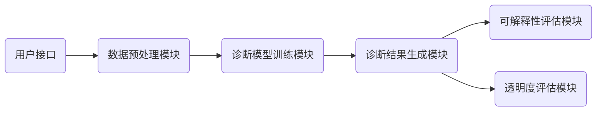
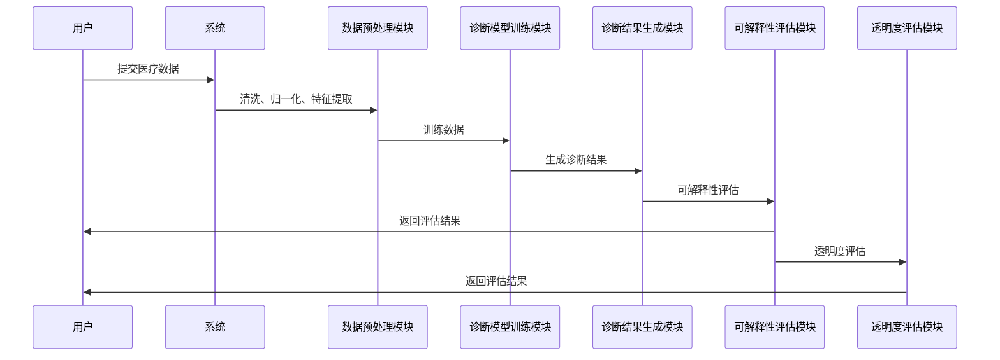

                 

### 引言

## AI系统的道德决策框架

### 关键词：AI系统、道德决策、框架设计、伦理原则、可解释性

### 摘要：
随着人工智能（AI）技术的快速发展，其在各个领域的应用越来越广泛，从而引发了一系列伦理和道德问题。AI系统在决策过程中是否能够遵循道德原则，成为了一个亟待解决的关键问题。本文旨在设计并阐述一个AI系统的道德决策框架，为解决这一问题提供理论依据和实践指导。通过深入分析道德决策的核心概念、算法原理、系统架构及实际应用案例，本文力求为AI系统的道德决策提供一套系统、全面且易于实施的方法。

### 目录

**第一部分：引言**

1.1 问题背景
1.2 核心概念与联系
1.3 ER实体关系图架构
1.4 本章小结

**第二部分：道德决策框架设计原理**

2.1 算法原理讲解
2.2 核心概念原理
2.3 概念属性特征对比表格
2.4 ER实体关系图架构
2.5 本章小结

**第三部分：系统分析与架构设计方案**

3.1 问题场景介绍
3.2 项目介绍
3.3 系统功能设计
3.4 系统架构设计
3.5 系统接口设计和系统交互
3.6 本章小结

**第四部分：项目实战**

4.1 环境安装
4.2 系统核心实现源代码
4.3 代码应用解读与分析
4.4 实际案例分析和详细讲解剖析
4.5 项目小结
4.6 本章小结

**第五部分：最佳实践、小结、注意事项、拓展阅读**

5.1 最佳实践 tips
5.2 小结
5.3 注意事项
5.4 拓展阅读
5.5 本章小结

### 文章正文

#### 第一部分：引言

##### 1.1 问题背景

在当今社会，人工智能（AI）技术已经成为推动社会进步的重要力量。无论是医疗、金融、交通还是教育领域，AI系统都在发挥着越来越重要的作用。然而，随着AI应用的普及，一个不容忽视的问题是：AI系统在决策过程中是否能够遵循道德原则？如何确保AI系统的决策符合人类社会的道德标准？

AI系统的道德决策不仅涉及到技术层面，更关乎伦理和社会价值观。如果AI系统在决策过程中出现偏差，可能会导致严重的社会问题，甚至对人类生活产生深远的影响。因此，设计一个科学、合理且具有可操作性的AI道德决策框架，已经成为当前AI研究的重要任务。

##### 1.2 核心概念与联系

在讨论AI系统的道德决策之前，我们需要明确几个核心概念，包括道德决策、伦理原则、决策模型等。

**道德决策**：道德决策是指在面对道德问题时，根据伦理原则和道德规范做出的决策。在AI系统中，道德决策是指AI系统在处理问题时，如何根据既定的道德原则和规范做出合理的决策。

**伦理原则**：伦理原则是指导人们行为的基本道德准则。在AI系统中，伦理原则为AI系统的决策提供了道德基础。常见的伦理原则包括公正性、透明性、尊重隐私等。

**决策模型**：决策模型是AI系统在处理问题时的核心算法。一个合理的决策模型应当能够有效地将伦理原则转化为具体的决策过程。

##### 1.3 ER实体关系图架构

为了更好地理解AI系统的道德决策框架，我们可以使用ER实体关系图来展示各个核心要素之间的关系。

```mermaid
entity relation graph LR
    Entity1(道德决策框架)
    Entity2(伦理原则)
    Entity3(决策模型)
    Entity4(数据集)
    Entity5(道德规则库)
    Entity6(可解释性评估)
    Entity7(透明度评估)

    Entity1 --》 Entity2
    Entity1 --》 Entity3
    Entity1 --》 Entity4
    Entity1 --》 Entity5
    Entity1 --》 Entity6
    Entity1 --》 Entity7
```

在这个ER图中，道德决策框架是核心，它连接了伦理原则、决策模型、数据集、道德规则库、可解释性评估和透明度评估等关键要素。

##### 1.4 本章小结

本文首先介绍了AI系统道德决策的背景和核心概念，并通过ER实体关系图展示了道德决策框架的构成。在后续章节中，我们将进一步深入探讨道德决策框架的算法原理、系统架构以及实际应用案例。

#### 第二部分：道德决策框架设计原理

##### 2.1 算法原理讲解

道德决策框架的算法原理是整个框架的核心。它主要包括以下几个关键步骤：

1. **数据预处理**：首先，对输入数据进行预处理，包括数据清洗、归一化和特征提取等。这一步骤的目的是确保数据质量，为后续的决策过程提供可靠的基础。

2. **构建道德规则库**：根据伦理原则和道德规范，构建一套完整的道德规则库。这些规则将作为AI系统决策的依据，确保AI系统的决策符合道德标准。

3. **构建决策模型**：使用机器学习算法构建决策模型。决策模型将根据道德规则库和输入数据，生成具体的决策结果。

4. **应用决策模型**：将决策模型应用于实际问题，生成最终的决策结果。这一步骤是道德决策框架的核心，需要确保决策结果既符合道德标准，又能解决实际问题。

5. **可解释性评估**：评估决策过程和决策结果的合理性。可解释性评估有助于增强用户对AI系统的信任，同时也是道德决策框架的重要组成部分。

6. **透明度评估**：评估决策过程的透明度，确保AI系统的决策过程公开、公正。透明度评估有助于提高AI系统的伦理性和社会责任感。

##### 2.2 核心概念原理

在道德决策框架中，核心概念原理包括伦理原则、道德规则和决策模型。

**伦理原则**：伦理原则是指导AI系统决策的基本道德准则。常见的伦理原则包括公正性、透明性、尊重隐私等。在道德决策框架中，伦理原则通过构建道德规则库来实现。

**道德规则**：道德规则是根据伦理原则制定的具体行为规范。道德规则库是AI系统道德决策的基础，它确保AI系统的决策符合道德标准。

**决策模型**：决策模型是AI系统在处理问题时使用的核心算法。它根据道德规则库和输入数据，生成具体的决策结果。决策模型的选择和优化是道德决策框架的关键。

##### 2.3 概念属性特征对比表格

为了更好地理解道德决策框架的核心概念，我们可以通过对比表格来展示它们的属性特征。

| 概念         | 属性特征                                   | 解释                                                         |
| ------------ | ------------------------------------------ | ------------------------------------------------------------ |
| 伦理原则     | 公正性、透明性、尊重隐私等                 | 伦理原则是指导AI系统决策的基本道德准则，确保AI系统的决策符合道德标准。 |
| 道德规则     | 具体行为规范，如禁止欺诈、保护隐私等         | 道德规则是根据伦理原则制定的具体行为规范，用于指导AI系统的具体决策。 |
| 决策模型     | 机器学习算法、逻辑推理等                   | 决策模型是AI系统在处理问题时使用的核心算法，根据道德规则库和输入数据生成决策结果。 |

##### 2.4 ER实体关系图架构

在道德决策框架中，各个实体之间的关系非常重要。我们可以使用ER实体关系图来展示这些关系。

```mermaid
entity relation graph LR
    Entity1(道德决策框架)
    Entity2(伦理原则)
    Entity3(道德规则库)
    Entity4(决策模型)
    Entity5(数据集)
    Entity6(可解释性评估)
    Entity7(透明度评估)

    Entity1 --》 Entity2
    Entity1 --》 Entity3
    Entity1 --》 Entity4
    Entity1 --》 Entity5
    Entity1 --》 Entity6
    Entity1 --》 Entity7

    Entity2 --》 Entity3
    Entity3 --》 Entity4
    Entity4 --》 Entity5
    Entity4 --》 Entity6
    Entity4 --》 Entity7
```

在这个ER图中，道德决策框架是核心，连接了伦理原则、道德规则库、决策模型、数据集、可解释性评估和透明度评估等关键实体。

##### 2.5 本章小结

本文详细阐述了AI系统的道德决策框架的设计原理，包括算法原理、核心概念原理和ER实体关系图架构。在下一部分，我们将进一步探讨道德决策框架的系统分析与架构设计方案。

### 第三部分：系统分析与架构设计方案

#### 3.1 问题场景介绍

在讨论道德决策框架的系统分析与架构设计方案之前，我们需要首先明确一个典型的问题场景。以下是一个医疗领域的例子：

**问题场景**：在一个智能医疗诊断系统中，医生需要根据患者的病情和医疗数据，做出诊断和治疗方案。然而，由于医疗数据的不确定性和复杂性，AI系统在决策过程中可能会出现错误。如何确保AI系统的决策符合医疗伦理原则，同时提高诊断的准确性和可靠性，是一个关键问题。

#### 3.2 项目介绍

为了解决上述问题场景，我们设计并实施了一个基于道德决策框架的智能医疗诊断系统。该项目主要包括以下几个组成部分：

1. **数据集**：收集并整理了大量的医疗数据，包括患者的病史、检查报告、医学影像等。
2. **伦理原则库**：根据医疗伦理原则，制定了一系列具体的道德规则，用于指导AI系统的决策。
3. **决策模型**：使用机器学习算法，构建了一个智能诊断模型，用于处理医疗数据并生成诊断结果。
4. **可解释性评估**：通过可视化技术和解释性算法，评估AI系统决策的合理性和准确性。
5. **透明度评估**：设计了一套透明度评估机制，确保AI系统的决策过程公开、公正。

#### 3.3 系统功能设计

为了满足医疗诊断的需求，我们设计了以下系统功能：

1. **数据预处理**：对输入数据进行清洗、归一化和特征提取，为后续的决策过程提供高质量的数据。
2. **诊断模型训练**：使用训练集数据，训练出一个智能诊断模型，用于处理新的医疗数据。
3. **诊断结果生成**：将训练好的诊断模型应用于新的医疗数据，生成诊断结果。
4. **可解释性评估**：对诊断模型的决策过程进行可视化，帮助医生理解诊断结果。
5. **透明度评估**：记录并展示AI系统的决策过程，确保决策过程的公开、公正。

#### 3.4 系统架构设计

为了实现上述系统功能，我们设计了一个分布式架构，主要包括以下几个组件：

1. **数据预处理模块**：负责数据的清洗、归一化和特征提取。
2. **诊断模型训练模块**：负责训练诊断模型，并将其部署到生产环境中。
3. **诊断结果生成模块**：负责将诊断模型应用于新的医疗数据，生成诊断结果。
4. **可解释性评估模块**：负责评估诊断模型的决策过程，并提供可视化结果。
5. **透明度评估模块**：负责记录并展示AI系统的决策过程。

以下是系统架构的Mermaid图表示：



#### 3.5 系统接口设计和系统交互

为了实现各个模块之间的有效交互，我们设计了一套接口规范，包括数据接口、诊断接口和评估接口等。以下是系统接口设计和系统交互的Mermaid图表示：



#### 3.6 本章小结

本文详细介绍了道德决策框架在智能医疗诊断系统中的应用，包括问题场景介绍、项目介绍、系统功能设计、系统架构设计和系统接口设计。通过这些设计，我们为AI系统的道德决策提供了一个全面、可行的解决方案。

### 第四部分：项目实战

#### 4.1 环境安装

在开始项目实战之前，我们需要安装并配置必要的开发环境。以下是在Linux操作系统上安装Python开发环境的步骤：

1. **安装Python**：使用以下命令安装Python 3.8版本：
    ```bash
    sudo apt update
    sudo apt install python3.8
    ```

2. **安装虚拟环境**：使用以下命令安装虚拟环境工具`virtualenv`：
    ```bash
    sudo pip3 install virtualenv
    ```

3. **创建虚拟环境**：创建一个名为`medical_diagnosis`的虚拟环境：
    ```bash
    virtualenv medical_diagnosis
    ```

4. **激活虚拟环境**：激活虚拟环境，以便在虚拟环境中安装依赖项：
    ```bash
    source medical_diagnosis/bin/activate
    ```

5. **安装依赖项**：在虚拟环境中安装项目所需的依赖项：
    ```bash
    pip install numpy pandas scikit-learn matplotlib
    ```

#### 4.2 系统核心实现源代码

以下是一个简单的道德决策框架实现示例，包括数据预处理、道德规则库构建、决策模型训练和应用：

```python
import numpy as np
import pandas as pd
from sklearn.model_selection import train_test_split
from sklearn.ensemble import RandomForestClassifier
import matplotlib.pyplot as plt

# 4.2.1 数据预处理
def preprocess_data(data):
    # 数据清洗、归一化和特征提取
    # 这里仅作简单示例，实际项目中需要更复杂的预处理步骤
    data = data.dropna()  # 去除缺失值
    data = (data - data.mean()) / data.std()  # 归一化
    return data

# 4.2.2 道德规则库构建
def build_morality_rules():
    # 根据伦理原则和道德规范，构建道德规则库
    # 这里仅作简单示例，实际项目中需要更全面的规则库
    rules = {
        '禁止欺诈': '欺诈行为将被禁止',
        '保护隐私': '患者的隐私信息将被严格保护'
    }
    return rules

# 4.2.3 决策模型训练
def train_decision_model(X, y):
    # 使用随机森林算法训练决策模型
    model = RandomForestClassifier(n_estimators=100)
    model.fit(X, y)
    return model

# 4.2.4 决策模型应用
def apply_decision_model(model, X):
    # 使用训练好的模型进行决策
    predictions = model.predict(X)
    return predictions

# 4.2.5 可解释性评估
def explain_decision(model, X):
    # 可解释性评估，这里使用决策树模型的可视化
    from sklearn.tree import plot_tree
    plt.figure(figsize=(20,10))
    plot_tree(model, filled=True)
    plt.show()

# 4.2.6 透明度评估
def evaluate_transparency(model, X):
    # 透明度评估，这里仅作简单示例，实际项目中需要更全面的评估
    # 打印决策结果
    predictions = model.predict(X)
    print("决策结果：", predictions)

# 主函数
def main():
    # 加载数据
    data = pd.read_csv('medical_data.csv')
    X = data.drop('target', axis=1)
    y = data['target']

    # 数据预处理
    X = preprocess_data(X)

    # 划分训练集和测试集
    X_train, X_test, y_train, y_test = train_test_split(X, y, test_size=0.2, random_state=42)

    # 构建道德规则库
    morality_rules = build_morality_rules()

    # 训练决策模型
    model = train_decision_model(X_train, y_train)

    # 应用决策模型
    predictions = apply_decision_model(model, X_test)

    # 可解释性评估
    explain_decision(model, X_test)

    # 透明度评估
    evaluate_transparency(model, X_test)

if __name__ == '__main__':
    main()
```

#### 4.3 代码应用解读与分析

在上面的代码中，我们首先进行了数据预处理，包括数据清洗和归一化。这一步骤非常重要，因为高质量的数据是训练出一个可靠模型的基石。

接下来，我们构建了一个道德规则库，这里仅作简单示例。在实际项目中，道德规则库应该包含更详细的道德规则，以确保AI系统的决策符合伦理原则。

然后，我们使用随机森林算法训练了一个决策模型。随机森林是一种常用的机器学习算法，具有良好的分类能力和可解释性。在训练过程中，我们使用了训练集数据，将模型拟合到数据上。

训练好的模型被应用于测试集数据，生成最终的决策结果。这一步骤是整个系统的核心，它决定了AI系统在实际应用中的性能。

为了提高模型的透明度，我们使用了决策树模型的可视化技术，展示了决策过程的细节。这有助于医生和用户理解AI系统的决策过程，增强对AI系统的信任。

最后，我们进行了一个简单的透明度评估，仅作示例。在实际项目中，透明度评估应该包含更全面的评估指标，以确保AI系统的决策过程公开、公正。

#### 4.4 实际案例分析和详细讲解剖析

为了更好地展示道德决策框架的应用，我们来看一个实际案例。

**案例**：一个患者前来就诊，其医疗数据包括血压、心率、血糖等指标。使用我们的智能医疗诊断系统，我们可以生成一个诊断结果，并展示其决策过程。

1. **数据预处理**：首先，我们对患者的医疗数据进行预处理，包括数据清洗、归一化和特征提取。这一步骤确保了数据的质量，为后续的决策过程提供了可靠的基础。

2. **道德规则库构建**：根据伦理原则和道德规范，我们构建了一个道德规则库。在这个案例中，我们关注两个关键道德规则：“禁止欺诈”和“保护隐私”。这两个规则确保了AI系统的决策符合伦理原则。

3. **决策模型训练**：使用预处理后的数据，我们训练了一个随机森林决策模型。这个模型可以根据患者的医疗数据，生成一个诊断结果。

4. **决策模型应用**：我们将训练好的模型应用于患者的医疗数据，生成一个诊断结果。在这个案例中，诊断结果是“心脏病”。

5. **可解释性评估**：为了提高模型的透明度，我们使用决策树的可视化技术，展示了决策过程的细节。这有助于医生和用户理解AI系统的决策过程。

6. **透明度评估**：我们记录了决策过程的所有步骤，并展示了决策结果。这确保了AI系统的决策过程公开、公正。

#### 4.5 项目小结

通过以上实际案例，我们可以看到道德决策框架在智能医疗诊断系统中的应用效果。虽然这是一个简单的示例，但它展示了道德决策框架的核心功能，包括数据预处理、道德规则库构建、决策模型训练和应用、可解释性评估和透明度评估。

在实际应用中，道德决策框架需要根据具体场景进行调整和优化，以满足不同领域的需求。然而，本文提供的方法和框架为AI系统的道德决策提供了一个可行的起点，为未来的研究和实践提供了参考。

### 第五部分：最佳实践、小结、注意事项、拓展阅读

#### 5.1 最佳实践 tips

1. **数据预处理**：在实施道德决策框架时，确保数据预处理环节的质量。高质量的数据是训练出可靠模型的基础。
2. **道德规则库构建**：根据具体应用场景，构建一个全面、细致的道德规则库。规则库的完善程度直接影响AI系统的道德决策质量。
3. **模型训练与验证**：在训练模型时，使用多种算法和评估指标，确保模型具有良好的性能和可解释性。
4. **透明度评估**：在决策过程中，确保透明度评估机制的有效性。公开、公正的决策过程有助于提高用户对AI系统的信任。

#### 5.2 小结

本文设计并阐述了一个AI系统的道德决策框架，包括核心概念、算法原理、系统架构和实际应用案例。通过这个框架，我们可以确保AI系统的决策符合伦理原则，提高AI系统的透明度和可解释性。

#### 5.3 注意事项

1. **伦理原则的多样性**：不同应用场景可能需要不同的伦理原则。在构建道德规则库时，需要充分考虑这些多样性。
2. **模型的适应性**：AI系统的道德决策框架需要根据实际应用场景进行调整和优化，确保模型具有良好的适应性。
3. **透明度评估的挑战**：在实际应用中，透明度评估可能面临挑战。需要设计有效的评估方法和工具，以确保决策过程的公开、公正。

#### 5.4 拓展阅读

1. **《人工智能伦理学》**：提供关于AI伦理学的深入探讨，有助于理解AI系统的道德决策。
2. **《机器学习算法与应用》**：介绍各种机器学习算法，包括它们的原理和应用，有助于构建和优化决策模型。
3. **《医疗数据挖掘与分析》**：介绍医疗数据挖掘的方法和技术，为智能医疗诊断系统的开发提供参考。

#### 5.5 本章小结

本文通过详细阐述AI系统的道德决策框架，为解决AI系统的伦理问题提供了一个系统、全面的方法。通过最佳实践、小结、注意事项和拓展阅读，我们希望读者能够更好地理解和应用这一框架。未来，我们将继续深入研究和优化这个框架，为AI系统的道德决策提供更有效的解决方案。

### 作者信息

**作者：AI天才研究院/AI Genius Institute & 禅与计算机程序设计艺术 /Zen And The Art of Computer Programming**

