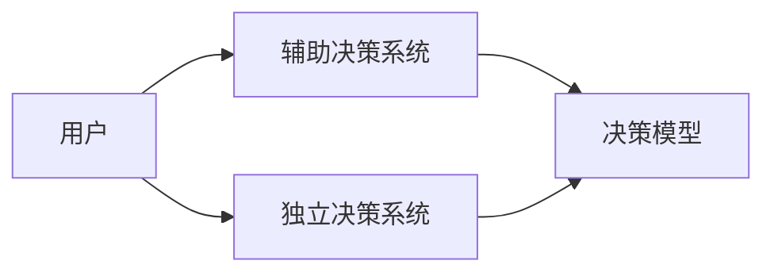
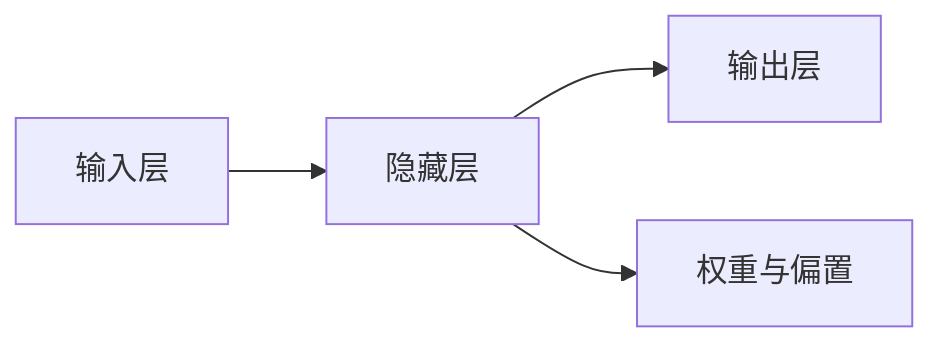
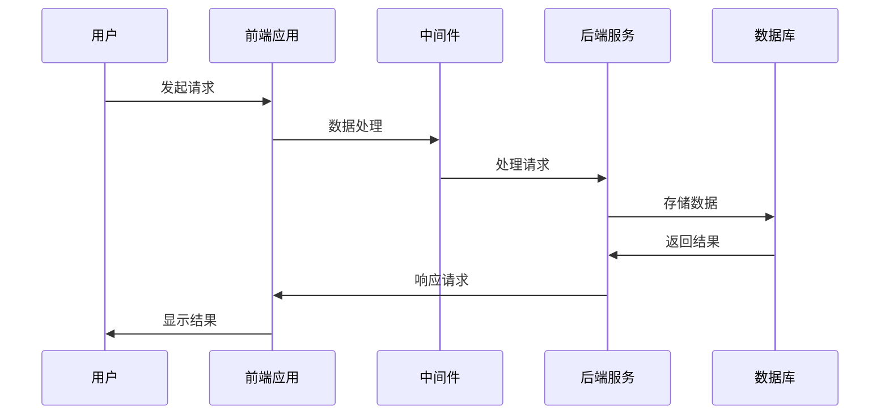

                 

### 《AI自主性：从辅助决策到独立决策的演进》

**关键词：** AI自主性、辅助决策、独立决策、算法原理、系统架构设计、项目实战

**摘要：** 本文深入探讨了人工智能自主性的发展过程，从辅助决策到独立决策的演变。通过分析核心概念、算法原理、系统架构设计及项目实战，本文揭示了AI自主性提升的关键技术路径及其在各领域的应用前景。

## 第一部分：背景介绍

### 1.1 问题背景

人工智能（AI）作为一种模拟人类智能的技术，自诞生以来，已经经历了多个发展阶段。从早期的规则推理和知识表示，到近年来的机器学习和深度学习，人工智能在各个领域都取得了显著的进展。然而，在大多数应用场景中，人工智能仍然处于辅助决策的角色，需要人类专家的干预和指导。

AI自主性，是指人工智能系统能够在不依赖人类干预的情况下，独立地完成决策任务。随着技术的发展，AI自主性正逐渐从辅助决策向独立决策转变。这种转变不仅提升了AI系统的效率和准确性，也为各行各业带来了新的机遇和挑战。

### 1.2 问题描述

#### 辅助决策与独立决策的定义与区别

**辅助决策：** 辅助决策是指人工智能系统在人类的指导和监督下，参与决策过程并提供辅助建议。这种模式下，人类专家仍然承担最终决策责任。

**独立决策：** 独立决策是指人工智能系统无需人类干预，自主地完成决策任务。在这种模式下，AI系统具备完全的决策自主权。

#### 现有技术面临的挑战与瓶颈

1. **数据依赖性：** 现有AI系统大多依赖于大规模数据训练，数据质量和数量直接影响决策效果。
2. **解释性不足：** AI系统的决策过程往往缺乏透明性，难以被人类理解和信任。
3. **适应性差：** 面对动态环境，AI系统的适应能力和鲁棒性不足，容易受到外部干扰。

### 1.3 问题解决

#### AI自主性的重要性

1. **提升效率：** 独立决策的AI系统可以减少人类干预时间，提高决策效率。
2. **增强准确性：** 通过自我学习和优化，AI系统可以不断提高决策准确性。
3. **拓展应用场景：** 独立决策的AI系统可以应用于更多复杂和动态的决策场景。

#### 演进路径与关键技术

1. **算法优化：** 通过改进机器学习、深度学习和强化学习算法，提高AI系统的决策能力。
2. **数据增强：** 通过数据预处理和增强技术，提升AI系统的数据质量和适应性。
3. **解释性增强：** 通过开发可解释的AI模型，提高人类对AI决策过程的信任度。
4. **多模态融合：** 通过融合不同类型的数据源，提升AI系统的全面感知能力。

### 1.4 边界与外延

#### AI自主性在各个领域的应用

1. **工业自动化：** AI自主性在工业自动化领域得到了广泛应用，如自动化生产线、机器人控制等。
2. **金融行业：** AI自主性在金融领域的投资决策、风险管理等方面发挥着重要作用。
3. **医疗领域：** AI自主性在医疗诊断、治疗方案推荐等方面展现了巨大潜力。

#### 道德、法律和社会影响

1. **伦理问题：** AI自主性可能导致一些道德和伦理问题，如隐私保护、责任归属等。
2. **法律挑战：** AI自主性的发展需要相应的法律法规来规范和保障。
3. **社会影响：** AI自主性可能会改变就业结构、社会分工等方面，对社会产生深远影响。

### 1.5 概念结构与核心要素组成

#### 自主性级别划分

1. **被动响应：** AI系统根据预设规则被动响应环境变化。
2. **主动学习：** AI系统通过自我学习不断优化决策能力。
3. **独立决策：** AI系统具备完全的决策自主权，无需人类干预。

#### 关键技术解析

1. **机器学习：** 通过数据训练和模型优化，提高AI系统的决策能力。
2. **深度学习：** 通过多层神经网络，实现复杂特征的自动提取和决策。
3. **强化学习：** 通过与环境交互，不断优化决策策略。

## 第二部分：核心概念与联系

### 2.1 核心概念原理

#### 机器学习、深度学习与强化学习

**机器学习（ML）：** 机器学习是一种通过数据训练，使计算机具备自动学习和改进能力的技术。其基本原理是通过从数据中学习规律，从而实现预测和分类等任务。

**深度学习（DL）：** 深度学习是机器学习的一种方法，通过多层神经网络，实现复杂特征的自动提取和决策。深度学习在图像识别、语音识别等领域取得了显著成果。

**强化学习（RL）：** 强化学习是一种通过与环境交互，不断优化决策策略的机器学习方法。其基本原理是通过奖励机制，引导AI系统不断改进决策。

#### 决策树、神经网络与进化算法

**决策树（DT）：** 决策树是一种基于规则的方法，通过树形结构对数据进行分类或回归。决策树易于理解，性能稳定，适用于数据量较小、特征明显的场景。

**神经网络（NN）：** 神经网络是一种通过模拟人脑神经元连接结构，实现复杂非线性映射的方法。神经网络具有自适应性强、泛化能力强等特点，适用于大规模数据处理。

**进化算法（EA）：** 进化算法是一种基于生物进化原理的优化算法，通过遗传操作和选择机制，不断优化个体特征。进化算法适用于复杂优化问题，如函数优化、组合优化等。

### 2.2 概念属性特征对比表格

| 算法       | 特点                                         | 适用场景               |
| ---------- | -------------------------------------------- | ---------------------- |
| 决策树     | 易于理解，性能稳定                           | 数据量较小，特征明显   |
| 神经网络   | 自适应性强，泛化能力强                       | 大规模数据处理         |
| 强化学习   | 自主性强，适应动态环境                       | 控制问题、游戏AI       |
| 进化算法   | 基于生物进化原理，适用于复杂优化问题         | 函数优化、组合优化等   |

### 2.3 ER实体关系图架构



## 第三部分：算法原理讲解

### 3.1 算法原理

#### 3.1.1 神经网络算法

**神经网络算法** 是一种基于人脑神经元连接结构的信息处理模型，通过多层神经网络实现复杂特征的自动提取和决策。

**神经网络结构：**



**神经网络算法原理：**

神经网络通过多层非线性变换，将输入数据映射到输出结果。其中，每个节点（神经元）代表一个非线性函数，节点之间的连接（权重和偏置）代表输入特征的重要性。

#### 3.1.2 数学模型和公式

**激活函数：** 激活函数用于将神经元的线性组合转换为非线性输出。常用的激活函数有：

$$
\sigma(x) = \frac{1}{1 + e^{-x}}
$$

**前向传播：** 前向传播是将输入数据通过神经网络逐层传播，最终得到输出结果的过程。前向传播的数学模型为：

$$
Z = \sigma(W \cdot X + b)
$$

其中，\(W\) 为权重，\(b\) 为偏置，\(X\) 为输入数据，\(Z\) 为输出结果。

**反向传播：** 反向传播是一种基于梯度下降的优化算法，用于更新权重和偏置，以降低输出误差。反向传播的数学模型为：

$$
\frac{\partial J}{\partial W} = X \odot (\sigma'(Z) \odot \frac{\partial J}{\partial Z})
$$

$$
\frac{\partial J}{\partial b} = \sigma'(Z) \odot \frac{\partial J}{\partial Z}
$$

其中，\(J\) 为损失函数，\(\sigma'\) 为激活函数的导数。

#### 3.1.3 举例说明

**输入数据：** [1, 2]

**权重与偏置：** \(W = [0.5, 0.3], b = [0.2, 0.1]\)

**计算过程：**

1. **前向传播：**

$$
Z = \sigma(0.5 \cdot 1 + 0.3 \cdot 2 + 0.2) = \sigma(1.1) \approx 0.656
$$

2. **反向传播：**

$$
\frac{\partial J}{\partial W} = [1, 2] \odot (\sigma'(0.656) \odot \frac{\partial J}{\partial Z})
$$

$$
\frac{\partial J}{\partial b} = \sigma'(0.656) \odot \frac{\partial J}{\partial Z}
$$

通过反向传播计算得到的梯度，用于更新权重和偏置，以降低输出误差。

## 第四部分：系统分析与架构设计方案

### 4.1 问题场景介绍

在智能交通系统、智能家居等领域，AI自主性具有重要意义。以下以智能交通系统为例，介绍相关问题场景。

**智能交通系统：** 智能交通系统利用人工智能技术，实现交通信号灯的智能控制、车辆路径规划、交通流量监测等功能，以提高交通效率、降低交通事故发生率。

### 4.2 系统功能设计

#### 4.2.1 领域模型

**领域模型：** 智能交通系统涉及多个实体和关系，如用户、传感器、控制器和执行器。


#### 4.2.2 系统架构设计

**系统架构设计：** 智能交通系统采用分层架构，包括前端应用、中间件、后端服务和数据库。


#### 4.2.3 系统接口设计

**系统接口设计：** 智能交通系统通过一系列接口实现不同模块之间的数据传输和功能调用。



## 第五部分：项目实战

### 5.1 环境安装

**硬件配置：** 为了确保AI系统运行效率，需要配置高性能的CPU和GPU。

**软件安装：** 安装操作系统、深度学习框架（如TensorFlow、PyTorch）和相关依赖库。

### 5.2 系统核心实现源代码

**示例代码：** 以下是一个简单的神经网络模型实现。

```python
import tensorflow as tf

model = tf.keras.Sequential([
    tf.keras.layers.Dense(128, activation='relu', input_shape=[784]),
    tf.keras.layers.Dense(10, activation='softmax')
])

model.compile(optimizer='adam', loss='categorical_crossentropy', metrics=['accuracy'])

# 训练模型
model.fit(x_train, y_train, epochs=5)
```

### 5.3 代码应用解读与分析

**模型构建、编译、训练和评估的详细解读：** 模型构建通过定义神经网络结构实现；编译通过指定优化器和损失函数实现；训练通过输入数据和标签实现；评估通过测试集实现。

**数据预处理和模型调优的方法：** 数据预处理包括数据清洗、归一化和数据增强等；模型调优包括选择合适的学习率、批量大小和正则化策略等。

### 5.4 实际案例分析和详细讲解剖析

**交通信号灯控制案例：** 通过AI自主性实现交通信号灯的智能控制，提高交通效率和安全性。

**智能家居场景下的决策：** 通过AI自主性实现智能家居设备间的智能协同和自主控制，提升用户生活质量。

### 5.5 项目小结

**总结实践经验：** 项目实战过程中，积累了丰富的经验和教训，为后续项目提供了参考。

**提出改进建议：** 针对项目中存在的问题，提出改进建议，以提升AI自主性的应用效果。

## 第六部分：最佳实践与拓展阅读

### 最佳实践 Tips

1. **数据质量：** 确保数据质量，包括数据清洗、归一化和数据增强等。
2. **模型优化：** 选择合适的模型结构和超参数，进行模型优化。
3. **安全性：** 加强AI系统的安全性，包括数据加密、权限控制等。

### 小结

本文详细介绍了AI自主性的概念、算法原理、系统架构设计和项目实战。通过分析AI自主性的发展历程，揭示了从辅助决策到独立决策的演变路径。未来，随着技术的不断进步，AI自主性将在更多领域发挥重要作用。

### 注意事项

1. **数据隐私：** 在使用AI系统时，应重视数据隐私保护，确保用户数据的安全。
2. **伦理规范：** 制定相应的伦理规范，确保AI系统的应用符合社会价值观。

### 拓展阅读

1. **《深度学习》（Goodfellow, Bengio, Courville）：** 本书详细介绍了深度学习的基本原理和应用。
2. **《强化学习》（Sutton, Barto）：** 本书系统地介绍了强化学习的基本理论和算法。
3. **《人工智能：一种现代的方法》（Russell, Norvig）：** 本书全面介绍了人工智能的基本概念和技术。

