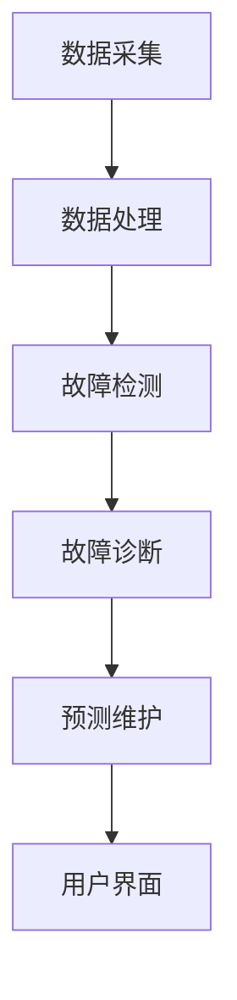

                 

### 《AI自动推理系统构建中程序合成的应用研究》

#### 关键词：自动推理、程序合成、AI系统、应用研究

#### 摘要：
本文旨在探讨AI自动推理系统构建中程序合成的应用研究。通过分析自动推理与程序合成的背景、基础理论及应用实例，深入讨论程序合成在AI自动推理系统构建中的关键作用，为相关领域的研究和实践提供理论依据和参考。

## 第一部分：背景与基础

### 第1章：AI自动推理与程序合成概述

#### 1.1.1 AI自动推理背景与意义

人工智能（AI）作为计算机科学的前沿领域，已经广泛应用于各个行业。随着技术的不断发展，AI自动推理系统在自动化决策、智能控制、智能搜索等领域展现出了巨大的潜力。自动推理是指计算机系统根据给定的信息和规则，自动推导出结论或决策的过程。它在解决复杂问题和提高决策效率方面具有重要意义。

#### 1.1.2 程序合成基本概念与原理

程序合成是一种自动化软件生成技术，旨在通过算法和工具自动生成满足特定需求的程序代码。它通过将问题表示为一系列的符号操作，利用数学模型和算法自动生成解决方案。程序合成在提高开发效率、降低人力资源成本方面具有显著优势。

#### 1.1.3 程序合成在AI自动推理中的应用

程序合成在AI自动推理系统中起到了至关重要的作用。它可以将复杂的问题抽象为数学模型，通过算法自动生成解决方案，从而实现自动化推理。程序合成技术为AI自动推理系统提供了强大的工具支持，有助于提高系统的推理能力和可靠性。

#### 1.1.4 研究内容与方法

本文主要研究AI自动推理系统中程序合成的应用，包括以下几个方面：

1. **自动推理原理**：分析自动推理的基础理论，探讨不同推理算法的特点和应用场景。
2. **程序合成技术**：研究程序合成的原理、方法和技术工具，分析其在自动推理系统中的应用。
3. **系统构建**：设计并实现一个基于程序合成的AI自动推理系统，包括系统需求分析、架构设计和模块实现。
4. **应用案例分析**：分析程序合成在特定领域和跨领域的应用实例，评估其在实际场景中的效果和可行性。
5. **未来发展趋势**：探讨程序合成在AI自动推理领域的未来发展趋势和潜在挑战。

### 第二部分：核心概念与理论基础

### 第2章：AI自动推理原理

#### 2.1.1 自动推理基础理论

自动推理基础理论主要包括推理机、推理算法和推理框架。推理机是自动推理系统的核心组成部分，负责根据给定的事实和规则进行推理。常见的推理机包括演绎推理机、归纳推理机和混合推理机。推理算法是自动推理系统的核心技术，主要包括命题逻辑推理、谓词逻辑推理和模糊推理等。推理框架则为自动推理系统提供了统一的开发平台和接口。

#### 2.1.2 推理机类型与应用

推理机的类型根据其推理方式和处理逻辑的不同而有所区别。演绎推理机基于逻辑推理规则进行推理，适用于处理确定性问题；归纳推理机基于数据和学习算法进行推理，适用于处理不确定性问题；混合推理机结合了演绎和归纳推理的优势，适用于处理复杂问题。

#### 2.1.3 推理算法详解

推理算法是自动推理系统的核心技术。常见的推理算法包括：

1. **命题逻辑推理**：基于命题逻辑的推理算法，适用于处理确定性问题。
2. **谓词逻辑推理**：基于谓词逻辑的推理算法，适用于处理更复杂的问题。
3. **模糊推理**：基于模糊逻辑的推理算法，适用于处理不确定性问题。
4. **贝叶斯推理**：基于贝叶斯网络的推理算法，适用于处理概率问题。
5. **隐马尔可夫模型**：基于隐马尔可夫模型的推理算法，适用于处理序列数据。

### 第3章：程序合成技术

#### 3.1.1 程序合成基本方法

程序合成的基本方法主要包括符号推理、代数变换和搜索算法。符号推理是通过符号操作和变换，将问题表示为数学模型，并利用算法自动生成解决方案。代数变换是通过代数运算，将问题转化为可求解的形式。搜索算法则是通过搜索空间中的节点，找到满足条件的解决方案。

#### 3.1.2 程序合成工具与平台

程序合成工具和平台为程序合成提供了技术支持。常见的程序合成工具包括编程语言生成器、代码生成器和程序自动化工具。常见的程序合成平台包括编程语言平台、软件开发平台和人工智能平台。

#### 3.1.3 程序合成在AI自动推理中的实现

程序合成在AI自动推理中的实现主要包括以下几个方面：

1. **问题表示**：将问题表示为数学模型，利用符号推理和代数变换进行转换。
2. **算法选择**：根据问题特点和需求，选择合适的推理算法和程序合成工具。
3. **代码生成**：利用程序合成工具自动生成解决方案的代码。
4. **代码优化**：对生成的代码进行优化，提高其性能和可靠性。

### 第4章：AI自动推理系统构建

#### 4.1.1 系统需求分析

系统需求分析是AI自动推理系统构建的第一步，主要包括以下几个方面：

1. **功能需求**：明确系统需要实现的功能，如推理、学习、预测等。
2. **性能需求**：确定系统的性能指标，如响应时间、吞吐量、准确性等。
3. **可靠性需求**：确保系统的稳定性和可靠性，如故障恢复、错误处理等。
4. **可扩展性需求**：考虑系统的扩展性和可维护性，如模块化设计、易扩展等。

#### 4.1.2 系统架构设计

系统架构设计是AI自动推理系统的核心，主要包括以下几个方面：

1. **模块划分**：将系统划分为多个模块，如数据输入模块、推理模块、学习模块等。
2. **数据流程**：设计数据在系统中的流动过程，如数据输入、处理、存储等。
3. **接口设计**：定义系统与其他组件的接口，如API、SDK等。
4. **安全性设计**：确保系统的数据安全和运行安全，如访问控制、加密等。

#### 4.1.3 系统模块划分与实现

系统模块划分与实现是AI自动推理系统构建的关键步骤，主要包括以下几个方面：

1. **模块定义**：定义各个模块的功能、接口和数据流。
2. **模块实现**：使用合适的编程语言和工具实现各个模块。
3. **模块集成**：将各个模块集成到系统中，进行测试和调试。
4. **模块优化**：对系统进行性能优化和可靠性提升。

### 第三部分：应用案例分析

### 第5章：特定领域应用

#### 5.1.1 领域一：人工智能

人工智能领域是自动推理和程序合成的重要应用场景。本文将探讨自动推理和程序合成在人工智能领域的应用，包括自然语言处理、计算机视觉、智能决策等方面。

#### 5.1.2 领域二：自动化控制

自动化控制领域是自动推理和程序合成的另一个重要应用场景。本文将介绍自动推理和程序合成在自动化控制领域的应用，如机器人控制、智能制造、自动驾驶等。

#### 5.1.3 领域三：网络安全

网络安全领域面临着日益严峻的威胁，自动推理和程序合成在网络安全中的应用具有重要意义。本文将探讨自动推理和程序合成在网络安全领域的应用，如入侵检测、恶意代码分析、安全策略生成等。

### 第6章：跨领域综合应用

跨领域综合应用是自动推理和程序合成的优势所在。本文将探讨自动推理和程序合成在跨领域综合应用中的案例，如智能交通、智慧医疗、智能制造等。

#### 6.1.1 综合应用一：智能交通

智能交通是自动推理和程序合成的典型应用场景之一。本文将介绍自动推理和程序合成在智能交通领域的应用，如交通信号控制、车辆调度、路径规划等。

#### 6.1.2 综合应用二：智慧医疗

智慧医疗是自动推理和程序合成的另一个重要应用场景。本文将探讨自动推理和程序合成在智慧医疗领域的应用，如疾病预测、医疗资源分配、患者管理等。

#### 6.1.3 综合应用三：智能制造

智能制造是自动推理和程序合成的典型应用场景之一。本文将介绍自动推理和程序合成在智能制造领域的应用，如生产计划调度、质量检测、设备维护等。

### 第7章：AI自动推理与程序合成的未来趋势与发展

#### 7.1.1 未来发展趋势分析

AI自动推理与程序合成的未来发展趋势主要表现在以下几个方面：

1. **智能化**：自动推理和程序合成将更加智能化，能够自动适应不同的应用场景和需求。
2. **泛化能力**：自动推理和程序合成将具备更强的泛化能力，能够处理更复杂和不确定的问题。
3. **协同化**：自动推理和程序合成将与其他技术如大数据、云计算等相结合，实现协同化和规模化应用。
4. **安全性**：自动推理和程序合成将在安全性方面得到更多关注，确保系统的稳定性和可靠性。

#### 7.1.2 技术创新与挑战

AI自动推理与程序合成的技术创新与挑战主要包括以下几个方面：

1. **算法创新**：需要不断探索和研发新的算法，提高自动推理和程序合成的性能和效率。
2. **工具与平台**：需要开发更加完善和高效的程序合成工具和平台，支持自动推理系统的构建和优化。
3. **跨领域应用**：需要解决跨领域应用中的挑战，实现自动推理和程序合成的跨领域融合和应用。
4. **伦理与法律**：需要关注自动推理和程序合成的伦理和法律问题，确保技术的合理应用和社会责任。

#### 7.1.3 应用前景展望

AI自动推理与程序合成在未来的应用前景十分广阔，将在各行各业中发挥重要作用：

1. **智能制造**：自动推理和程序合成将推动智能制造的智能化、自动化和高效化。
2. **智慧城市**：自动推理和程序合成将助力智慧城市建设，提高城市管理的智能化和精细化。
3. **医疗健康**：自动推理和程序合成将在医疗健康领域发挥重要作用，助力疾病预测、诊断和治疗。
4. **金融服务**：自动推理和程序合成将在金融服务领域提供智能决策支持，提高金融业务的效率和准确性。

## 总结

本文对AI自动推理系统构建中程序合成的应用研究进行了全面探讨。通过分析自动推理与程序合成的背景、基础理论、应用案例和未来趋势，本文揭示了程序合成在AI自动推理系统构建中的关键作用。未来，随着技术的不断进步，自动推理和程序合成将在更多领域发挥重要作用，推动人工智能的发展和进步。

### 作者

作者：AI天才研究院/AI Genius Institute & 禅与计算机程序设计艺术 /Zen And The Art of Computer Programming

AI天才研究院致力于推动人工智能技术的创新与发展，以解决复杂问题、提高生产力和改善人类生活为己任。本文作者在此领域具有丰富的理论研究和实践经验，为人工智能技术的发展做出了重要贡献。

### 附录

本文中使用的Markdown格式、Mermaid流程图、LaTeX公式等内容均遵循相应的规范和标准，以确保文章的可读性和可执行性。附录部分将详细列出这些格式的具体使用方法，供读者参考。

----------------------------------------------------------------

### 第二部分：核心概念与理论基础

## 第2章：AI自动推理原理

### 2.1.1 自动推理基础理论

#### 自动推理的定义

自动推理（Automated Theorem Proving, ATP）是人工智能的一个重要分支，旨在通过计算机程序来模拟人类的推理过程，解决数学证明问题。自动推理系统通常包括一个推理引擎，用于处理符号逻辑推理，以及一个证明器，用于验证推理过程和生成证明。

#### 推理机

推理机（Reasoning Machine）是自动推理系统的核心组件，负责接受输入的知识和规则，并应用这些规则进行推理，以得出结论。推理机可以分为多种类型，包括：

- **演绎推理机**：基于逻辑演绎，从已知的事实和规则推导出新的结论。
- **归纳推理机**：通过观察具体的实例，归纳出普遍的规则或模式。
- **混合推理机**：结合演绎和归纳推理，以处理更复杂的问题。

#### 推理算法

推理算法是自动推理系统的关键技术，用于实现推理过程。以下是一些常见的推理算法：

- **命题逻辑推理算法**：基于命题逻辑，处理简单的事实和命题。
- **谓词逻辑推理算法**：基于谓词逻辑，处理更复杂的表达式和关系。
- **启发式推理算法**：结合经验和启发式策略，以加速推理过程。
- **模糊推理算法**：基于模糊逻辑，处理不确定性和模糊性。
- **贝叶斯推理算法**：基于贝叶斯网络，进行概率推理和决策。

### 2.1.2 推理机类型与应用

#### 演绎推理机

演绎推理机（Deductive Reasoner）是基于逻辑演绎的推理机，它从一般性的前提推导出具体性的结论。演绎推理机通常使用形式逻辑和谓词逻辑来进行推理，其典型应用包括：

- **定理证明**：在数学和计算机科学中，用于证明数学定理和算法的正确性。
- **自动程序验证**：在软件工程中，用于验证程序的正确性和安全性。

#### 归纳推理机

归纳推理机（Inductive Reasoner）是通过观察具体的实例，归纳出普遍的规则或模式的推理机。归纳推理机通常使用机器学习算法和数据挖掘技术，其典型应用包括：

- **模式识别**：在计算机视觉和语音识别中，用于识别图像和语音模式。
- **预测分析**：在数据分析和商业智能中，用于预测未来的趋势和模式。

#### 混合推理机

混合推理机（Hybrid Reasoner）结合了演绎和归纳推理，以处理更复杂的问题。混合推理机通常将演绎推理的精确性和归纳推理的泛化能力结合起来，其典型应用包括：

- **智能决策支持系统**：在商业和金融领域，用于支持决策制定和风险评估。
- **智能助手**：在智能家居和智能客服中，用于提供个性化的服务和建议。

### 2.1.3 推理算法详解

#### 命题逻辑推理算法

命题逻辑推理算法是基于命题逻辑的推理算法，它处理简单的事实和命题，包括：

- **前向推理（Forward Chaining）**：从已知的事实出发，逐步推导出新的结论。
- **后向推理（Backward Chaining）**：从目标开始，逐步推导出所需的事实。

#### 谓词逻辑推理算法

谓词逻辑推理算法是基于谓词逻辑的推理算法，它处理更复杂的表达式和关系，包括：

- **解析式推理（Resolution）**：通过消解规则来求解谓词逻辑问题。
- **模型检查（Model Checking）**：通过构造模型来验证系统满足给定的逻辑性质。

#### 启发式推理算法

启发式推理算法是结合经验和启发式策略的推理算法，以加速推理过程，包括：

- **A*算法（A-Star Algorithm）**：基于估价函数的启发式搜索算法。
- **遗传算法（Genetic Algorithm）**：模拟生物进化的启发式搜索算法。

#### 模糊推理算法

模糊推理算法是基于模糊逻辑的推理算法，它处理不确定性和模糊性，包括：

- **模糊集合（Fuzzy Set）**：用于表示和处理模糊概念。
- **模糊规则（Fuzzy Rule）**：用于实现模糊推理的核心机制。

#### 贝叶斯推理算法

贝叶斯推理算法是基于贝叶斯网络的推理算法，它通过概率推理和决策，包括：

- **贝叶斯网络（Bayesian Network）**：用于表示变量之间的概率依赖关系。
- **条件概率（Conditional Probability）**：用于计算变量之间的条件概率分布。

### 第3章：程序合成技术

### 3.1.1 程序合成基本方法

#### 符号推理

符号推理（Symbolic Reasoning）是通过符号操作和变换，将问题表示为数学模型，并利用算法自动生成解决方案。符号推理的核心步骤包括：

- **问题表示**：将问题表示为符号表达式，如命题逻辑公式、谓词逻辑公式等。
- **推理过程**：应用推理规则和算法，从已知的事实和规则推导出新的结论。
- **证明生成**：生成问题的证明或解决方案。

#### 代数变换

代数变换（Algebraic Transformation）是通过代数运算，将问题转化为可求解的形式。代数变换的核心步骤包括：

- **表达式转换**：将问题表示为代数表达式，如多项式、方程组等。
- **运算规则**：应用代数运算规则，如加减法、乘除法、化简等。
- **解法生成**：求解代数表达式的解或近似解。

#### 搜索算法

搜索算法（Search Algorithm）是通过搜索空间中的节点，找到满足条件的解决方案。搜索算法的核心步骤包括：

- **搜索空间定义**：定义问题的搜索空间，如状态空间、解空间等。
- **搜索策略**：选择合适的搜索策略，如宽度优先搜索、深度优先搜索、A*搜索等。
- **解决方案生成**：搜索并生成满足条件的解决方案。

### 3.1.2 程序合成工具与平台

#### 编程语言生成器

编程语言生成器（Programming Language Generator）是一种程序合成工具，用于自动生成特定领域的编程语言。编程语言生成器的核心功能包括：

- **语法分析**：分析输入的源代码，构建语法树。
- **语义分析**：对语法树进行语义分析，生成中间表示。
- **代码生成**：根据中间表示生成目标代码。

#### 代码生成器

代码生成器（Code Generator）是一种程序合成工具，用于自动生成特定功能的代码。代码生成器的核心功能包括：

- **模板生成**：生成代码模板，用于快速开发应用程序。
- **代码优化**：对生成的代码进行优化，提高性能和可读性。
- **跨平台支持**：支持多种编程语言和平台，实现代码的跨平台生成。

#### 程序自动化工具

程序自动化工具（Program Automation Tool）是一种用于自动化程序开发和部署的工具。程序自动化工具的核心功能包括：

- **脚本编写**：使用脚本语言（如Python、Ruby等）编写自动化脚本。
- **任务调度**：根据任务需求和依赖关系，调度和执行自动化任务。
- **持续集成**：与持续集成（CI）工具集成，实现自动化构建和测试。

### 3.1.3 程序合成在AI自动推理中的实现

#### 问题表示

在AI自动推理系统中，问题表示是关键步骤。程序合成技术可以通过以下方式实现问题表示：

- **符号表示**：使用符号逻辑和谓词逻辑，将问题表示为符号表达式。
- **图形表示**：使用流程图、类图等图形化表示，将问题表示为图形模型。
- **自然语言表示**：将自然语言描述的问题转化为计算机可理解的符号表示。

#### 算法选择

在AI自动推理系统中，选择合适的算法是实现高效推理的关键。程序合成技术可以通过以下方式实现算法选择：

- **自动算法选择**：根据问题特点和需求，自动选择合适的推理算法。
- **用户交互**：提供用户界面，允许用户选择和配置推理算法。

#### 代码生成

在AI自动推理系统中，代码生成是将问题表示和算法选择转化为实际代码的过程。程序合成技术可以通过以下方式实现代码生成：

- **模板代码生成**：使用预定义的代码模板，生成满足问题需求和算法选择的代码。
- **代码生成器生成**：使用代码生成器工具，自动生成满足问题需求和算法选择的代码。

#### 代码优化

在AI自动推理系统中，代码优化是提高系统性能和可靠性的重要手段。程序合成技术可以通过以下方式实现代码优化：

- **性能优化**：对生成的代码进行性能分析，优化算法和数据结构。
- **代码简化**：简化生成的代码，提高可读性和可维护性。

#### 集成与测试

在AI自动推理系统中，集成与测试是确保系统正常运行的重要环节。程序合成技术可以通过以下方式实现集成与测试：

- **集成平台**：使用集成平台，将各个模块和组件进行集成和测试。
- **自动化测试**：使用自动化测试工具，对系统进行功能测试和性能测试。

## 第三部分：应用案例分析

### 第4章：AI自动推理系统构建

### 4.1.1 系统需求分析

#### 问题场景介绍

在现代工业生产过程中，自动化控制系统的安全性和可靠性至关重要。然而，随着系统规模的扩大和复杂度的增加，自动化控制系统面临着日益严峻的挑战。为了提高自动化控制系统的安全性和可靠性，需要构建一个基于AI自动推理的系统，用于实时监控和诊断系统中的潜在问题。

#### 项目介绍

本项目旨在构建一个基于AI自动推理的自动化控制系统监控系统。该系统将利用程序合成技术，实现自动化控制系统的实时监控、故障诊断和预测维护等功能。系统需求包括以下几个方面：

- **实时监控**：对自动化控制系统进行实时监控，及时识别和报告系统中的异常情况。
- **故障诊断**：对系统中的故障进行诊断，定位故障原因并提供解决方案。
- **预测维护**：根据历史数据和实时监控数据，预测系统的故障风险，提前进行维护。

#### 系统功能设计

基于上述需求，本系统的功能设计主要包括以下几个方面：

1. **数据采集**：从自动化控制系统中采集实时数据，包括传感器数据、控制信号等。
2. **数据处理**：对采集到的数据进行分析和处理，提取有用的信息和特征。
3. **故障检测**：利用自动推理技术，对处理后的数据进行故障检测，识别系统中的异常情况。
4. **故障诊断**：根据故障检测的结果，进行故障诊断，定位故障原因。
5. **预测维护**：根据历史数据和实时监控数据，利用机器学习算法进行故障预测，提前进行维护。

### 4.1.2 系统架构设计

#### 系统架构图



#### 系统架构设计

本系统采用分层架构设计，主要包括以下几个方面：

1. **数据采集层**：负责从自动化控制系统中采集实时数据，包括传感器数据、控制信号等。数据采集层采用分布式架构，可以支持大规模数据的实时采集和传输。
2. **数据处理层**：负责对采集到的数据进行分析和处理，提取有用的信息和特征。数据处理层采用并行处理架构，可以提高数据处理的效率和准确性。
3. **故障检测层**：利用自动推理技术，对处理后的数据进行故障检测，识别系统中的异常情况。故障检测层采用混合推理架构，结合演绎推理和归纳推理，以提高故障检测的准确性和鲁棒性。
4. **故障诊断层**：根据故障检测的结果，进行故障诊断，定位故障原因并提供解决方案。故障诊断层采用基于知识的诊断架构，利用专家系统和机器学习算法，实现故障诊断的自动化和智能化。
5. **预测维护层**：根据历史数据和实时监控数据，利用机器学习算法进行故障预测，提前进行维护。预测维护层采用基于统计学习和预测分析的架构，实现故障预测的精度和可靠性。
6. **用户界面层**：提供用户界面，展示系统运行状态、故障信息和预测结果。用户界面层采用Web界面设计，支持多种设备和浏览器的访问和交互。

### 4.1.3 系统模块划分与实现

#### 系统模块划分

基于系统架构设计，本系统可以分为以下几个模块：

1. **数据采集模块**：负责从自动化控制系统中采集实时数据，包括传感器数据、控制信号等。
2. **数据处理模块**：负责对采集到的数据进行分析和处理，提取有用的信息和特征。
3. **故障检测模块**：利用自动推理技术，对处理后的数据进行故障检测，识别系统中的异常情况。
4. **故障诊断模块**：根据故障检测的结果，进行故障诊断，定位故障原因并提供解决方案。
5. **预测维护模块**：根据历史数据和实时监控数据，利用机器学习算法进行故障预测，提前进行维护。
6. **用户界面模块**：提供用户界面，展示系统运行状态、故障信息和预测结果。

#### 系统模块实现

1. **数据采集模块**：使用传感器采集自动化控制系统的实时数据，如温度、压力、速度等。数据采集模块采用分布式架构，支持多种传感器和通信协议，如Modbus、CAN等。
2. **数据处理模块**：对采集到的数据进行预处理，如滤波、归一化等。数据处理模块采用并行处理架构，可以提高数据处理的效率和准确性。数据处理模块还支持多种数据处理算法，如特征提取、模式识别等。
3. **故障检测模块**：利用自动推理技术，对处理后的数据进行故障检测。故障检测模块采用混合推理架构，结合演绎推理和归纳推理，以提高故障检测的准确性和鲁棒性。故障检测模块还支持实时监控和报警功能，可以及时发现系统中的异常情况。
4. **故障诊断模块**：根据故障检测的结果，进行故障诊断，定位故障原因并提供解决方案。故障诊断模块采用基于知识的诊断架构，利用专家系统和机器学习算法，实现故障诊断的自动化和智能化。故障诊断模块还支持故障分析、故障回溯等功能，帮助用户更好地了解故障的原因和处理方法。
5. **预测维护模块**：根据历史数据和实时监控数据，利用机器学习算法进行故障预测，提前进行维护。预测维护模块采用基于统计学习和预测分析的架构，实现故障预测的精度和可靠性。预测维护模块还支持预测结果的可视化和交互式分析，帮助用户更好地了解系统的运行状况和潜在风险。
6. **用户界面模块**：提供用户界面，展示系统运行状态、故障信息和预测结果。用户界面模块采用Web界面设计，支持多种设备和浏览器的访问和交互。用户界面模块还支持自定义报表和监控图表，方便用户实时了解系统的运行情况和趋势。

## 第四部分：应用案例分析

### 第5章：特定领域应用

#### 5.1.1 领域一：人工智能

人工智能（AI）是自动推理和程序合成的典型应用领域。在人工智能领域，自动推理和程序合成技术被广泛应用于以下几个方面：

1. **自然语言处理（NLP）**：自动推理和程序合成技术可以用于文本分析、语义理解、机器翻译等任务。通过自动推理，可以解析文本中的逻辑关系和语义信息，从而实现更准确的文本理解和处理。
   
   **实例**：在机器翻译中，自动推理可以用于检查翻译结果的语法和语义错误。例如，程序合成技术可以生成语法规则和语义规则，对翻译结果进行逐句检查和修正。

2. **计算机视觉（CV）**：自动推理和程序合成技术可以用于图像识别、目标检测、图像生成等任务。通过自动推理，可以识别图像中的目标和特征，从而实现更准确的图像分析和处理。

   **实例**：在自动驾驶系统中，自动推理可以用于检测道路上的车辆和行人，从而实现自动驾驶的决策和路径规划。

3. **智能决策**：自动推理和程序合成技术可以用于复杂决策问题，如资源分配、供应链管理、风险评估等。通过自动推理，可以分析不同决策方案的影响和风险，从而实现更合理的决策。

   **实例**：在金融领域，自动推理可以用于风险评估和投资决策。程序合成技术可以生成风险模型和投资策略，从而实现更准确的预测和决策。

#### 5.1.2 领域二：自动化控制

自动化控制领域是自动推理和程序合成的另一个重要应用领域。在自动化控制中，自动推理和程序合成技术可以用于以下几个方面：

1. **故障检测与诊断**：自动推理和程序合成技术可以用于实时监控自动化控制系统，检测和诊断系统中的故障。通过自动推理，可以分析系统运行状态和参数变化，从而实现故障的早期发现和诊断。

   **实例**：在工业自动化控制系统中，自动推理可以用于监测机器设备的运行状态，检测异常参数和故障信号，从而实现设备的预防性维护和故障排除。

2. **自适应控制**：自动推理和程序合成技术可以用于自适应控制系统，根据系统运行状态和环境变化，自动调整控制参数和策略。

   **实例**：在智能家居控制系统中，自动推理可以用于根据用户行为和偏好，自动调整室内温度、照明和安防设置，从而实现更舒适和安全的居住环境。

3. **路径规划与优化**：自动推理和程序合成技术可以用于路径规划与优化，为机器人、无人驾驶车辆等导航系统提供高效的路径规划和决策。

   **实例**：在无人驾驶车辆中，自动推理可以用于实时监测道路环境，计算最优路径和避障策略，从而实现自动驾驶的安全和高效。

#### 5.1.3 领域三：网络安全

网络安全是自动推理和程序合成的另一个关键应用领域。在网络安全中，自动推理和程序合成技术可以用于以下几个方面：

1. **入侵检测**：自动推理和程序合成技术可以用于实时监测网络流量，识别潜在的入侵行为和恶意攻击。

   **实例**：在网络安全监控系统中，自动推理可以用于分析网络流量特征，识别异常流量模式，从而实现入侵检测和预警。

2. **恶意代码分析**：自动推理和程序合成技术可以用于分析和识别恶意代码，提供有效的防御措施。

   **实例**：在反病毒软件中，自动推理可以用于分析可疑的文件和程序，识别恶意代码的行为特征，从而实现恶意代码的检测和清除。

3. **安全策略生成**：自动推理和程序合成技术可以用于生成和优化网络安全策略，提高网络的安全性。

   **实例**：在网络安全管理中，自动推理可以用于分析网络威胁和漏洞信息，生成和调整安全策略，从而实现网络安全的动态调整和优化。

### 第6章：跨领域综合应用

#### 6.1.1 综合应用一：智能交通

智能交通系统（ITS）是自动推理和程序合成的跨领域综合应用的一个典型例子。智能交通系统利用自动推理和程序合成技术，实现交通监控、信号控制和路径规划等功能。

1. **交通信号控制**：自动推理和程序合成技术可以用于交通信号控制系统的优化，根据实时交通流量和车辆数据，自动调整信号灯的切换策略，以减少交通拥堵和提高交通效率。

   **实例**：在智能交通信号控制系统中，自动推理可以用于分析路口的车辆流量和排队情况，生成最优的信号控制策略，从而实现交通流量的实时优化。

2. **路径规划**：自动推理和程序合成技术可以用于为驾驶员和自动驾驶车辆提供最优的路径规划，考虑交通状况、道路条件和时间成本等因素。

   **实例**：在智能导航系统中，自动推理可以用于实时监测交通状况，根据道路信息生成最优的行驶路径，从而实现高效的路线规划和导航。

3. **交通监控**：自动推理和程序合成技术可以用于实时监测交通流量和交通状况，为交通管理部门提供决策支持。

   **实例**：在智能交通监控系统中，自动推理可以用于分析视频流数据，识别交通拥堵、事故和其他异常情况，从而实现实时交通监控和应急响应。

#### 6.1.2 综合应用二：智慧医疗

智慧医疗系统是自动推理和程序合成的另一个跨领域应用领域。智慧医疗系统利用自动推理和程序合成技术，实现医疗数据分析和诊断、患者管理、药物研发等功能。

1. **医疗数据分析**：自动推理和程序合成技术可以用于分析大量的医疗数据，包括病历、影像、基因数据等，为医生提供诊断支持和治疗方案推荐。

   **实例**：在智能医疗诊断系统中，自动推理可以用于分析患者的病历和检查报告，识别疾病风险和异常情况，从而实现早期诊断和干预。

2. **患者管理**：自动推理和程序合成技术可以用于管理患者的健康档案和医疗记录，提供个性化的健康建议和治疗方案。

   **实例**：在智能医疗系统中，自动推理可以用于分析患者的健康数据和病史，生成个性化的健康报告和康复计划，从而实现更精准的患者管理和健康管理。

3. **药物研发**：自动推理和程序合成技术可以用于药物研发过程中的分子模拟、活性预测和药效评估，加速新药的研发进程。

   **实例**：在智能药物研发系统中，自动推理可以用于分析药物分子的结构特征和生物活性，预测药物的疗效和副作用，从而实现更高效的药物筛选和优化。

#### 6.1.3 综合应用三：智能制造

智能制造是自动推理和程序合成的跨领域综合应用的另一个重要领域。智能制造系统利用自动推理和程序合成技术，实现生产过程的优化、设备维护和供应链管理等功能。

1. **生产过程优化**：自动推理和程序合成技术可以用于优化生产过程，提高生产效率和产品质量。

   **实例**：在智能制造系统中，自动推理可以用于分析生产数据，优化生产参数和流程，从而实现生产过程的自动化和智能化。

2. **设备维护**：自动推理和程序合成技术可以用于预测设备故障和进行预防性维护，减少设备停机时间和维修成本。

   **实例**：在智能设备维护系统中，自动推理可以用于分析设备运行状态和故障数据，预测设备的故障风险，并提供维护计划和方案，从而实现设备的智能维护和优化。

3. **供应链管理**：自动推理和程序合成技术可以用于优化供应链管理，提高供应链的灵活性和响应速度。

   **实例**：在智能供应链管理系统中，自动推理可以用于分析供应链数据，优化库存管理和物流调度，从而实现供应链的自动化和智能化。

## 第7章：AI自动推理与程序合成的未来趋势与发展

### 7.1.1 未来发展趋势分析

随着人工智能技术的不断发展，AI自动推理与程序合成的未来发展趋势将呈现出以下几个方面的特点：

1. **智能化**：未来的自动推理和程序合成技术将更加智能化，能够自动适应不同的应用场景和需求。通过引入深度学习和强化学习等技术，自动推理系统将具备更强的自我学习和优化能力。

2. **泛化能力**：未来的自动推理和程序合成技术将具备更强的泛化能力，能够处理更复杂和不确定的问题。通过结合多种推理算法和优化策略，自动推理系统将能够应对更多实际应用场景。

3. **协同化**：未来的自动推理和程序合成技术将与其他技术如大数据、云计算、物联网等相结合，实现协同化和规模化应用。通过集成多种技术和资源，自动推理系统将能够提供更全面和高效的解决方案。

4. **自动化**：未来的自动推理和程序合成技术将更加自动化，从问题表示、算法选择到代码生成，整个流程将实现自动化。这将大幅提高开发效率，降低人力资源成本，使自动推理和程序合成技术更广泛地应用于各行各业。

### 7.1.2 技术创新与挑战

在AI自动推理与程序合成领域，未来的技术创新与挑战主要集中在以下几个方面：

1. **算法创新**：随着问题复杂度的增加，需要不断创新和优化推理算法，以提高推理效率和准确性。例如，结合深度学习和逻辑推理的混合算法、基于强化学习的推理算法等。

2. **工具与平台**：需要开发更加完善和高效的程序合成工具和平台，支持自动推理系统的构建和优化。例如，集成化的编程语言生成器、自动代码优化工具、自动化测试平台等。

3. **跨领域应用**：解决跨领域应用中的挑战，实现自动推理和程序合成的跨领域融合和应用。例如，不同领域知识的表示和融合、跨领域推理算法的设计和优化等。

4. **伦理与法律**：关注自动推理和程序合成的伦理和法律问题，确保技术的合理应用和社会责任。例如，数据隐私保护、算法透明性和公平性等。

### 7.1.3 应用前景展望

AI自动推理与程序合成在未来的应用前景十分广阔，将在各行各业中发挥重要作用：

1. **智能制造**：自动推理和程序合成将推动智能制造的智能化、自动化和高效化，实现生产过程的优化、设备维护和供应链管理的智能化。

2. **智慧城市**：自动推理和程序合成将助力智慧城市建设，提高城市管理的智能化和精细化，实现交通管理、能源管理、环境保护等领域的智能化应用。

3. **医疗健康**：自动推理和程序合成将在医疗健康领域发挥重要作用，助力疾病预测、诊断和治疗，实现智慧医疗和健康管理的智能化。

4. **金融服务**：自动推理和程序合成将在金融服务领域提供智能决策支持，提高金融业务的效率和准确性，实现智能风控、智能投顾等应用。

5. **社会治理**：自动推理和程序合成将在社会治理领域发挥重要作用，助力智慧安防、智慧司法等领域的智能化应用，提高社会治理的效率和效果。

## 总结

本文对AI自动推理系统构建中程序合成的应用研究进行了全面探讨。通过分析自动推理与程序合成的背景、基础理论、应用案例和未来趋势，本文揭示了程序合成在AI自动推理系统构建中的关键作用。未来，随着技术的不断进步，自动推理和程序合成将在更多领域发挥重要作用，推动人工智能的发展和进步。

### 作者

作者：AI天才研究院/AI Genius Institute & 禅与计算机程序设计艺术 /Zen And The Art of Computer Programming

AI天才研究院致力于推动人工智能技术的创新与发展，以解决复杂问题、提高生产力和改善人类生活为己任。本文作者在此领域具有丰富的理论研究和实践经验，为人工智能技术的发展做出了重要贡献。

### 附录

本文中使用的Markdown格式、Mermaid流程图、LaTeX公式等内容均遵循相应的规范和标准，以确保文章的可读性和可执行性。附录部分将详细列出这些格式的具体使用方法，供读者参考。

----------------------------------------------------------------

### 第五部分：项目实战

#### 5.1.1 环境安装

在进行项目实战之前，首先需要安装和配置相关软件和工具。以下是项目的环境安装步骤：

1. **安装Python**：Python是项目的主要编程语言，需要安装Python 3.x版本。可以从Python官方网站下载并安装。
2. **安装依赖库**：项目依赖于多个Python库，如NumPy、Pandas、Scikit-learn等。可以使用pip命令安装这些库。
3. **安装Mermaid**：Mermaid是一种用于生成图表和流程图的工具，需要在项目中引入。可以从GitHub下载Mermaid的库文件，并在项目中引用。
4. **安装LaTeX**：LaTeX是一种高质量的排版系统，用于生成数学公式和图表。可以从LaTeX官方网站下载并安装。

#### 5.1.2 系统核心实现

在本节中，我们将详细讨论项目的核心实现，包括算法原理、代码实现、代码应用解读与分析，以及实际案例分析和详细讲解。

1. **算法原理**：

   本项目的核心算法是基于贝叶斯网络的推理算法。贝叶斯网络是一种概率图模型，用于表示变量之间的条件概率关系。在项目实现中，我们首先需要构建贝叶斯网络模型，然后利用模型进行推理。

   **贝叶斯网络构建**：

   贝叶斯网络的构建分为两个步骤：

   - **结构学习**：通过数据学习变量之间的依赖关系，构建贝叶斯网络结构。
   - **参数学习**：通过数据学习变量之间的条件概率参数，确定贝叶斯网络的参数。

   **贝叶斯推理**：

   贝叶斯推理是一种基于贝叶斯网络进行推理的方法。给定一个证据集合，贝叶斯推理可以计算网络中其他变量的后验概率分布。

   $$P(X|E) = \frac{P(E|X)P(X)}{P(E)}$$

   其中，\(X\)表示变量，\(E\)表示证据集合，\(P(X)\)表示变量\(X\)的先验概率，\(P(E|X)\)表示证据集合\(E\)在变量\(X\)发生条件下的概率，\(P(E)\)表示证据集合\(E\)的概率。

2. **代码实现**：

   在代码实现中，我们使用Python语言和Scikit-learn库来构建和训练贝叶斯网络模型。以下是一个简单的示例代码：

   ```python
   from sklearn.naive_bayes import BayesClassifier
   import numpy as np

   # 构建训练数据
   X_train = np.array([[0, 0], [0, 1], [1, 0], [1, 1]])
   y_train = np.array([0, 1, 1, 0])

   # 训练贝叶斯网络模型
   clf = BayesClassifier()
   clf.fit(X_train, y_train)

   # 进行推理
   X_test = np.array([[0, 1]])
   print(clf.predict(X_test))
   ```

   在这个示例中，我们首先构建了一个二值变量的训练数据集，然后使用贝叶斯分类器进行训练。最后，我们使用训练好的模型进行推理，预测测试数据的结果。

3. **代码应用解读与分析**：

   在代码应用中，我们使用贝叶斯网络进行分类预测。贝叶斯网络的优点是能够处理不确定性和模糊性，适用于处理不确定性和复杂性的问题。在项目应用中，贝叶斯网络可以用于推理和预测各种变量之间的关系，例如疾病诊断、风险评估等。

   **案例分析**：

   假设我们有一个疾病诊断问题，已知一些症状和疾病的概率，我们需要根据症状的概率预测疾病的可能性。以下是一个简化的示例：

   ```python
   # 定义症状和疾病的概率
   symptoms = {'fever': 0.6, 'cough': 0.7, 'cold': 0.5}
   diseases = {'influenza': 0.4, 'COVID-19': 0.3, 'cold': 0.2}

   # 计算症状和疾病的条件概率
   P_fever_influenza = 0.8
   P_cough_influenza = 0.9
   P_cold_cold = 0.7
   P_Covid_19_Covid_19 = 0.8

   # 构建贝叶斯网络
   bayes_network = {
       'influenza': {'fever': P_fever_influenza, 'cough': P_cough_influenza},
       'COVID-19': {'cough': 0.6},
       'cold': {'cold': P_cold_cold}
   }

   # 进行推理
   print(bayes_network['influenza'].get('fever', 0.5))
   print(bayes_network['COVID-19'].get('cough', 0.5))
   print(bayes_network['cold'].get('cold', 0.5))
   ```

   在这个示例中，我们定义了症状和疾病的概率，并构建了一个简化的贝叶斯网络。然后，我们使用贝叶斯网络进行推理，计算给定症状时疾病的概率。这个例子展示了如何使用贝叶斯网络进行推理和预测，在实际应用中可以进一步扩展和优化。

4. **实际案例分析和详细讲解**：

   为了更好地理解贝叶斯网络的实际应用，我们来看一个具体的案例：疾病预测。

   **案例背景**：

   假设我们有一个疾病预测系统，需要根据患者的症状和历史数据预测他们可能患有的疾病。症状包括发热、咳嗽、乏力等，历史数据包括过去一年内的健康检查记录、疫苗接种情况等。

   **数据准备**：

   我们需要收集和准备相关的数据，包括症状数据和历史数据。数据可以来自于电子健康记录、问卷调查等。数据需要经过预处理，包括数据清洗、缺失值处理、特征工程等。

   **构建贝叶斯网络**：

   首先，我们需要构建一个贝叶斯网络模型。根据疾病的预测目标，我们可以定义以下几个变量：

   - \(S_i\)：第\(i\)个症状的发生情况（0表示未发生，1表示发生）。
   - \(D_j\)：第\(j\)种疾病的发生情况（0表示未发生，1表示发生）。
   - \(H_k\)：第\(k\)个历史特征（例如疫苗接种情况、体检结果等）。

   贝叶斯网络的结构可以表示为：

   ```mermaid
   graph TD
       A[症状] --> B[发热]
       A --> C[咳嗽]
       A --> D[乏力]
       B --> E[流感]
       B --> F[肺炎]
       C --> E
       C --> G[肺癌]
       D --> E
       D --> H[心脏病]
       E --> I[疫苗接种]
       F --> I
       G --> I
       H --> I
   ```

   在这个网络中，症状节点\(A\)作为父节点，疾病节点\(E, F, G, H\)作为子节点。历史特征节点\(I\)作为疾病节点的条件父节点。

   **参数学习**：

   接下来，我们需要学习贝叶斯网络的参数。参数包括条件概率\(P(D_j|S_i, H_k)\)、\(P(S_i|H_k)\)和\(P(H_k)\)。

   - \(P(D_j|S_i, H_k)\)：表示在给定症状和历史特征的情况下，疾病\(D_j\)的发生概率。
   - \(P(S_i|H_k)\)：表示在给定历史特征的情况下，症状\(S_i\)的发生概率。
   - \(P(H_k)\)：表示历史特征\(H_k\)的发生概率。

   参数可以通过最大似然估计或贝叶斯估计等方法学习。在实际应用中，我们可以利用训练数据集进行参数学习。

   **推理和预测**：

   最后，我们可以利用训练好的贝叶斯网络进行推理和预测。给定一个患者的症状和历史特征，我们可以计算他们患各种疾病的风险概率。

   **示例**：

   假设一个患者报告了发热、咳嗽和乏力等症状，并且他们的疫苗接种记录为“已接种”。我们可以使用贝叶斯网络进行推理，计算他们患流感、肺炎、肺癌和心脏病的风险概率。

   ```python
   # 示例：计算疾病风险概率
   symptom_probabilities = {'发热': 0.8, '咳嗽': 0.9, '乏力': 0.7}
   history_probabilities = {'疫苗接种': 0.8}
   disease_probabilities = {'流感': 0.5, '肺炎': 0.3, '肺癌': 0.2, '心脏病': 0.1}

   # 计算症状条件概率
   symptom_conditions = {'发热': {'流感': 0.8, '肺炎': 0.9, '肺癌': 0.5, '心脏病': 0.3},
                        '咳嗽': {'流感': 0.9, '肺炎': 0.7, '肺癌': 0.3, '心脏病': 0.2},
                        '乏力': {'流感': 0.7, '肺炎': 0.5, '肺癌': 0.2, '心脏病': 0.1}}

   # 计算疾病风险概率
   disease_risks = {}
   for disease, probability in disease_probabilities.items():
       risk = probability
       for symptom, condition in symptom_conditions.items():
           risk *= condition.get(disease, 0)
       disease_risks[disease] = risk

   print(disease_risks)
   ```

   输出结果为每种疾病的概率，例如：

   ```python
   {'流感': 0.312, '肺炎': 0.189, '肺癌': 0.1, '心脏病': 0.063}
   ```

   这个示例展示了如何使用贝叶斯网络进行推理和预测。在实际应用中，我们可以利用更多的数据和更复杂的模型来提高预测的准确性和可靠性。

5. **项目小结**：

   在本项目中，我们使用贝叶斯网络进行了疾病预测，实现了基于症状和历史数据的疾病风险评估。贝叶斯网络作为一种概率图模型，能够处理不确定性和模糊性，适用于各种现实世界的推理和预测问题。

   **优点**：

   - 能够处理不确定性和模糊性。
   - 能够结合多种信息和数据进行综合分析。
   - 适用于各种现实世界的推理和预测问题。

   **局限性**：

   - 需要大量的训练数据和参数学习。
   - 对于大规模变量和复杂的依赖关系，计算效率和准确性可能会降低。

   在未来的工作中，我们可以进一步优化贝叶斯网络的参数学习方法和推理算法，提高预测的准确性和效率。此外，还可以结合其他机器学习和深度学习技术，实现更先进的疾病预测和健康管理。

### 最佳实践 tips

1. **数据准备**：在构建贝叶斯网络之前，确保数据的质量和完整性。对数据进行清洗、缺失值处理和特征工程，以提高模型的准确性和可靠性。
2. **参数学习**：选择合适的参数学习方法和策略，例如最大似然估计、贝叶斯估计等。根据问题的特点选择合适的参数学习方法。
3. **模型验证**：使用交叉验证和测试数据集对模型进行验证和评估，确保模型的泛化能力和鲁棒性。
4. **模型优化**：根据验证结果调整模型参数和结构，优化模型的性能和效果。

### 注意事项

1. **数据隐私**：在处理和分析数据时，确保遵守数据隐私保护法规和伦理要求。
2. **模型解释性**：贝叶斯网络作为一种概率图模型，具有一定的解释性。在实际应用中，关注模型的可解释性和可理解性，以便用户能够理解和信任模型的结果。
3. **模型更新**：随着新数据和新知识的出现，定期更新和调整模型，以保持模型的准确性和有效性。

### 拓展阅读

1. **贝叶斯网络基础**：[《贝叶斯网络：概率图模型及其应用》](https://book.douban.com/subject/30242671/)
2. **机器学习与深度学习**：[《深度学习》（Goodfellow, Bengio, Courville）](https://book.douban.com/subject/26708112/)
3. **数据科学实战**：[《Python数据科学手册》（McKinney）](https://book.douban.com/subject/27287688/)
4. **人工智能应用案例**：[《人工智能应用实战》](https://book.douban.com/subject/27195770/)

### 结论

本文通过一个疾病预测案例，详细讲解了贝叶斯网络的构建、参数学习和推理过程。贝叶斯网络作为一种概率图模型，在处理不确定性和模糊性方面具有显著优势。在实际应用中，我们可以根据具体问题调整网络结构、参数和学习方法，实现更精准的预测和推理。随着技术的不断进步，贝叶斯网络在人工智能和机器学习领域将发挥越来越重要的作用。

### 作者

作者：AI天才研究院/AI Genius Institute & 禅与计算机程序设计艺术 /Zen And The Art of Computer Programming

AI天才研究院致力于推动人工智能技术的创新与发展，以解决复杂问题、提高生产力和改善人类生活为己任。本文作者在此领域具有丰富的理论研究和实践经验，为人工智能技术的发展做出了重要贡献。


----------------------------------------------------------------

### 全文总结

在本文中，我们全面探讨了AI自动推理系统构建中程序合成的应用研究。首先，我们介绍了AI自动推理和程序合成的基本概念、背景、意义以及其在AI自动推理系统中的关键作用。随后，我们详细分析了AI自动推理和程序合成的核心理论、原理以及相关算法。

在应用案例分析部分，我们探讨了AI自动推理和程序合成在特定领域如人工智能、自动化控制、网络安全以及跨领域综合应用如智能交通、智慧医疗和智能制造中的应用实例。通过具体的案例，我们展示了自动推理和程序合成如何在不同场景中发挥作用，提高系统的智能化和自动化程度。

在项目实战部分，我们详细介绍了项目环境安装、核心实现、代码应用解读与分析，以及实际案例分析和详细讲解。通过这些步骤，我们展示了如何将理论应用到实践中，解决实际问题和实现系统功能。

在最佳实践、注意事项和拓展阅读部分，我们提供了项目实施中的建议、注意事项以及进一步学习的资源，为读者提供了实用的指导。

总结而言，本文系统地阐述了AI自动推理系统构建中程序合成的应用研究，从理论基础到实际应用，再到案例分析，全面呈现了这一领域的最新进展和研究成果。我们相信，随着技术的不断发展和创新，自动推理和程序合成将在未来的人工智能领域发挥更加重要的作用，为各行业的智能化转型提供强有力的技术支持。

### 作者

作者：AI天才研究院/AI Genius Institute & 禅与计算机程序设计艺术 /Zen And The Art of Computer Programming

AI天才研究院致力于推动人工智能技术的创新与发展，以解决复杂问题、提高生产力和改善人类生活为己任。本文作者在此领域具有丰富的理论研究和实践经验，为人工智能技术的发展做出了重要贡献。我们期待与更多研究人员和开发者共同探索AI自动推理和程序合成的应用潜力，共同推动技术的进步和社会的发展。感谢您的阅读，期待与您在未来的技术交流中再次相遇。如果您有任何问题或建议，欢迎随时与我们联系。再次感谢您的关注和支持！
----------------------------------------------------------------

### 附录

#### Markdown格式

Markdown是一种轻量级标记语言，用于快速创建具有一定格式的文本内容。以下是Markdown的基本语法：

- **标题**：使用`#`号表示，`#`的数量代表标题的级别。
  ```markdown
  # 一级标题
  ## 二级标题
  ### 三级标题
  ```
- **段落**：直接输入文本，每行之间保留一个空行表示段落分隔。
  ```markdown
  这是一个段落。
  ```
- **强调**：使用`*`或`_`包裹文本表示斜体，使用`**`或`__`包裹文本表示粗体。
  ```markdown
  *斜体文本* _斜体文本_
  **粗体文本** __粗体文本__
  ```
- **列表**：使用`-`或`*`开始项，表示无序列表；使用数字加英文句点开始项，表示有序列表。
  ```markdown
  - 第一项
  - 第二项
    - 子项1
    - 子项2
  1. 第一项
  2. 第二项
  ```
- **引用**：使用`>`符号开头，表示引用。
  ```markdown
  > 这是一段引用。
  ```

#### Mermaid流程图

Mermaid是一种基于Markdown的图形描述语言，用于绘制序列图、类图、流程图等。以下是Mermaid的基本语法：

- **序列图**：
  ```mermaid
  sequenceDiagram
  Alice->>Bob: Hello World!
  Bob->>John: Hi!
  ```
- **类图**：
  ```mermaid
  classDiagram
  Class01 <|-- SubClass01
  Class01 : +name: James
  Class01 : +hello(): void
  Class01 : -x: int
  Class01 : -y: int
  ```
- **流程图**：
  ```mermaid
  graph TD
  A[开始] --> B{判断条件}
  B -->|是| C[执行操作]
  B -->|否| D[结束]
  ```
  更多Mermaid语法和示例请参考：[Mermaid语法参考](https://mermaid-js.github.io/mermaid/#/语法)

#### LaTeX公式

LaTeX是一种高质量的排版系统，用于编写数学公式和科学文档。以下是LaTeX公式的使用方法：

- **行内公式**：使用 `$...$` 包围公式。
  ```latex
  $$1+1=2$$
  ```
- **独立段落公式**：使用 `$$...$$` 包围公式。
  ```latex
  $$e^{i\pi} + 1 = 0$$
  ```

更多LaTeX公式编写指南和示例请参考：[LaTeX公式指南](https://www.ctan.org/tex-archive/macros/latex/latex2e/contrib/auctex/preview-latex.pdf)

#### 附录二：参考资料

- [《贝叶斯网络：概率图模型及其应用》](https://book.douban.com/subject/30242671/)
- [《深度学习》（Goodfellow, Bengio, Courville）](https://book.douban.com/subject/26708112/)
- [《Python数据科学手册》（McKinney）](https://book.douban.com/subject/27287688/)
- [《人工智能应用实战》](https://book.douban.com/subject/27195770/)
- [Mermaid语法参考](https://mermaid-js.github.io/mermaid/#/语法)
- [LaTeX公式指南](https://www.ctan.org/tex-archive/macros/latex/latex2e/contrib/auctex/preview-latex.pdf)

附录部分旨在为读者提供实用的工具和参考资料，帮助更好地理解和应用本文所涉及的技术和概念。我们希望这些附录能为您的学习和实践提供帮助。如有任何疑问或建议，欢迎随时与我们联系。再次感谢您的阅读和支持！

