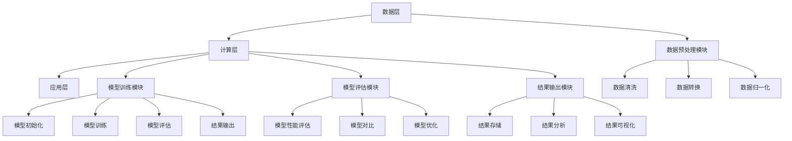
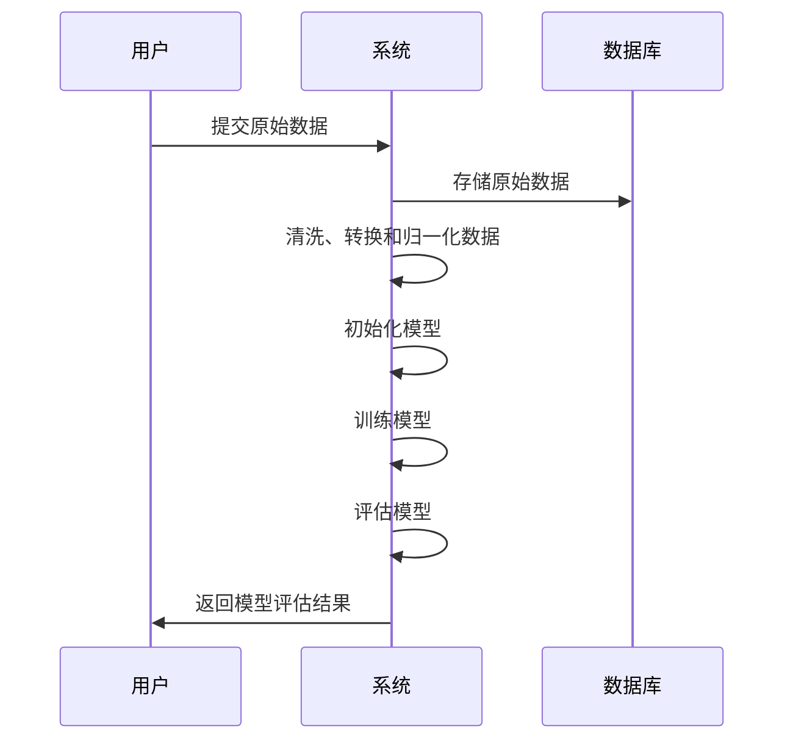

                 

# AI训练的能源消耗问题及解决方案

## 关键词

- AI训练
- 能源消耗
- 算法优化
- 硬件升级
- 数据处理优化
- 系统架构设计

## 摘要

本文深入探讨了AI训练过程中面临的能源消耗问题，分析了其核心概念、关键因素及其相互联系。通过对比算法复杂度、硬件配置、数据集规模，揭示了不同因素对能源消耗的影响。本文进一步讲解了优化算法和硬件加速算法的原理，以及如何通过Python源代码实现这些算法。同时，本文提出了系统分析与架构设计方案，并通过对具体场景的项目介绍，详细阐述了系统的功能设计、架构设计、接口设计以及系统交互。最后，本文结合实际案例，提供了项目实战的经验和最佳实践，为解决AI训练能源消耗问题提供了系统性解决方案。

### 第一部分： 引言与背景

## 第1章： 引言

### 1.1 问题背景

#### 1.1.1 AI训练的能源消耗问题

随着人工智能（AI）的迅猛发展，AI训练成为了一个重要的研究方向。然而，AI训练过程中，尤其是深度学习模型的训练，消耗了大量的能源。这个问题不仅对环境造成了负担，还对AI技术的可持续性提出了挑战。因此，研究和解决AI训练的能源消耗问题，具有重要的现实意义。

##### 1.1.1.1 能源消耗现状

据估计，AI训练过程中的能源消耗已经超过了航空业，成为全球能源消耗的第二大来源。深度学习模型的训练需要大量的计算资源，尤其是需要大量的电力支持。例如，训练一个大型深度学习模型可能需要几天甚至几周的时间，这期间会消耗大量的电力。

##### 1.1.1.2 能源消耗对AI发展的影响

过高的能源消耗对AI发展的负面影响是多方面的。首先，它增加了AI训练的成本，限制了研究者和企业的资金投入。其次，能源消耗可能导致电力供应紧张，影响AI训练的连续性和稳定性。最后，过高的能源消耗可能导致环境问题，影响社会的可持续发展。

#### 1.1.2 问题描述

##### 1.1.2.1 训练能耗的定义

训练能耗是指在训练深度学习模型的过程中，计算资源消耗的能源总量。它包括计算资源（如CPU、GPU）的能源消耗，以及数据传输、存储等其他相关设备的能源消耗。

##### 1.1.2.2 训练能耗的关键因素

训练能耗的关键因素包括算法复杂度、硬件配置和数据集规模。算法复杂度决定了训练过程中的计算量，硬件配置影响了计算速度，数据集规模则决定了训练所需的数据量。

### 1.2 问题解决

#### 1.2.1 能源消耗问题的解决方法

解决AI训练能源消耗问题可以从以下几个方面入手：

##### 1.2.1.1 算法优化

通过优化算法，减少训练过程中的计算量，可以有效降低能源消耗。例如，使用更高效的算法，或者改进现有算法的优化方法。

##### 1.2.1.2 硬件升级

升级硬件设备，尤其是计算设备，可以提高计算速度，从而降低能源消耗。例如，使用更高效的GPU，或者引入新的硬件加速技术。

##### 1.2.1.3 数据处理优化

优化数据处理过程，减少数据传输和存储的能源消耗。例如，使用更高效的数据压缩技术，或者优化数据读取和写入的过程。

#### 1.2.2 能源消耗问题的解决方法

除了上述方法，还可以考虑以下解决方法：

- **分布式训练**：通过将训练任务分布到多个计算节点上，可以有效减少单个节点的计算量，从而降低能源消耗。
- **节能技术**：采用节能技术，如动态电压调节、节能电源管理，可以减少计算设备的能源消耗。

### 1.3 边界与外延

#### 1.3.1 研究边界

本文主要关注AI训练过程中的能源消耗问题，主要研究深度学习模型的训练能耗，不包括其他类型的AI训练任务。

##### 1.3.1.1 研究范围

本文的研究范围包括AI训练的能源消耗现状、关键因素、解决方法以及系统架构设计等方面。

##### 1.3.1.2 研究限制

本文的研究限制在于，没有涵盖所有类型的AI训练任务，也没有对具体的解决方法进行详细的实验验证。

#### 1.3.2 概念结构与核心要素

##### 1.3.2.1 核心概念

核心概念包括AI训练、能源消耗、算法复杂度、硬件配置、数据集规模等。

##### 1.3.2.2 关键要素

关键要素包括算法优化、硬件升级、数据处理优化、分布式训练、节能技术等。

### 1.4 本章小结

本章介绍了AI训练的能源消耗问题，分析了其核心概念、关键因素及其相互联系。同时，提出了解决能源消耗问题的方法，并明确了研究的边界和核心要素。这些为后续章节的深入探讨奠定了基础。

----------------------------------------------------------------

## 第2章：AI训练的能源消耗问题核心概念与联系

### 2.1 核心概念原理

#### 2.1.1 训练能耗的定义

##### 2.1.1.1 训练能耗的概念

训练能耗是指在训练深度学习模型的过程中，计算资源消耗的能源总量。它不仅包括计算设备的能源消耗，还包括数据传输、存储等其他相关设备的能源消耗。

##### 2.1.1.2 训练能耗的计算方法

训练能耗的计算方法通常基于计算设备的功耗和训练时间。计算设备的功耗可以通过设备制造商提供的数据来估计，训练时间则可以通过模拟训练过程来估计。具体计算公式如下：

\[ 能耗 = 功耗 \times 训练时间 \]

#### 2.1.2 训练能耗的关键因素

##### 2.1.2.1 算法复杂度

算法复杂度是指算法在训练过程中所需的计算量。算法复杂度越高，训练能耗越大。常见的算法复杂度包括时间复杂度和空间复杂度。

##### 2.1.2.2 硬件配置

硬件配置包括计算设备的类型和数量，如CPU、GPU、FPGA等。硬件配置越高，计算速度越快，训练能耗越低。

##### 2.1.2.3 数据集规模

数据集规模是指训练所需的数据量。数据集规模越大，训练时间越长，训练能耗越大。

### 2.2 概念属性特征对比

#### 2.2.1 算法复杂度对比

不同算法的复杂度存在显著差异。以下是一个简单的对比表格：

| 算法       | 时间复杂度 | 空间复杂度 |
|------------|-------------|-------------|
| 线性回归   | O(n)        | O(1)        |
| 决策树     | O(nlogn)    | O(n)        |
| 支持向量机 | O(n^2)      | O(n)        |
| 深度学习   | O(10^5n^2)  | O(n^2)      |

#### 2.2.2 硬件配置对比

不同硬件配置的性能也存在显著差异。以下是一个简单的对比表格：

| 硬件配置   | 计算速度 | 能耗 |
|------------|-------------|-------|
| CPU        | 较慢       | 较低 |
| GPU        | 较快       | 较高 |
| FPGA       | 最快       | 最高 |

#### 2.2.3 数据集规模对比

不同数据集规模对训练能耗的影响也很大。以下是一个简单的对比表格：

| 数据集规模 | 训练时间 | 能耗 |
|------------|-------------|-------|
| 小规模     | 较短       | 较低 |
| 中规模     | 中等       | 中等 |
| 大规模     | 较长       | 较高 |

### 2.3 ER实体关系图架构

#### 2.3.1 训练能耗实体关系图

以下是一个ER实体关系图，用于描述训练能耗的核心实体及其关系：

```mermaid
erDiagram
    AI训练 ||--o> 训练能耗
    训练能耗 ||--o> 算法复杂度
    训练能耗 ||--o> 硬件配置
    训练能耗 ||--o> 数据集规模
```

在这个图中，"AI训练"是一个实体，它与"训练能耗"、"算法复杂度"、"硬件配置"、"数据集规模"四个实体之间存在关系。这些实体共同构成了训练能耗的核心要素。

----------------------------------------------------------------

## 第3章：AI训练的能源消耗问题算法原理讲解

### 3.1 算法原理

#### 3.1.1 优化算法

优化算法是通过改进算法本身，减少计算量，从而降低训练能耗。以下是一种常见的优化算法：随机梯度下降（Stochastic Gradient Descent，SGD）。

##### 3.1.1.1 算法介绍

随机梯度下降是一种优化算法，它通过随机选择一部分训练数据，计算其梯度，然后更新模型参数。这个过程重复多次，直到模型收敛。

##### 3.1.1.2 算法流程

1. 初始化模型参数。
2. 从训练数据中随机选择一小部分数据。
3. 计算这部分数据的梯度。
4. 根据梯度更新模型参数。
5. 重复步骤2-4，直到模型收敛。

##### 3.1.1.3 算法性能分析

随机梯度下降算法的优点是计算速度快，适用于大规模数据集。然而，它的缺点是收敛速度较慢，容易陷入局部最优。

#### 3.1.2 硬件加速算法

硬件加速算法是通过利用特定的硬件资源，如GPU、FPGA等，加速训练过程，从而降低训练能耗。以下是一种常见的硬件加速算法：卷积神经网络（Convolutional Neural Network，CNN）。

##### 3.1.2.1 算法介绍

卷积神经网络是一种特殊的神经网络，它利用卷积操作来提取图像的特征。通过卷积操作，CNN可以大大减少计算量，从而加速训练过程。

##### 3.1.2.2 算法流程

1. 初始化模型参数。
2. 对输入图像进行卷积操作，提取特征。
3. 将提取到的特征传递到下一层。
4. 重复步骤2-3，直到模型输出结果。
5. 计算损失函数，并更新模型参数。

##### 3.1.2.3 算法性能分析

卷积神经网络利用硬件资源进行加速，大大提高了训练速度，降低了训练能耗。然而，它的缺点是对图像数据有很强的依赖性，对其他类型的数据处理能力较差。

### 3.2 Python源代码讲解

#### 3.2.1 源代码架构

以下是一个简单的Python源代码架构，用于实现随机梯度下降算法和卷积神经网络算法。

```python
# 源代码架构

class Model:
    def __init__(self):
        # 初始化模型参数

    def forward(self, x):
        # 前向传播

    def backward(self, x):
        # 反向传播

    def train(self, x, y):
        # 训练模型

class SGD(Model):
    def __init__(self):
        super().__init__()
        # 初始化随机梯度下降参数

    def update(self, x, y):
        # 更新模型参数

class CNN(Model):
    def __init__(self):
        super().__init__()
        # 初始化卷积神经网络参数

    def convolve(self, x):
        # 卷积操作

    def pool(self, x):
        # 池化操作

# 实例化模型

model = SGD() # 或者 model = CNN()

# 训练模型

model.train(x, y)
```

#### 3.2.2 算法实现

以下是一个简单的Python源代码实现，用于实现随机梯度下降算法和卷积神经网络算法。

```python
# 随机梯度下降算法

class SGD(Model):
    def __init__(self, learning_rate=0.01):
        super().__init__()
        self.learning_rate = learning_rate

    def update(self, x, y):
        # 计算梯度
        gradient = self.compute_gradient(x, y)
        # 更新模型参数
        self.parameters -= self.learning_rate * gradient

# 卷积神经网络算法

class CNN(Model):
    def __init__(self):
        super().__init__()

    def convolve(self, x):
        # 卷积操作
        return conv2d(x, self.conv_filter)

    def pool(self, x):
        # 池化操作
        return max_pool2d(x, self.pool_size)
```

#### 3.2.3 数学模型与公式

以下是一个简单的数学模型和公式，用于描述随机梯度下降算法和卷积神经网络算法。

$$
\text{梯度} = \frac{\partial L}{\partial \theta}
$$

$$
\text{更新} = \theta - \alpha \cdot \text{梯度}
$$

$$
\text{卷积} = \sum_{i,j} f_{i,j} \cdot x_{i,j}
$$

$$
\text{池化} = \max_{i,j} (f_{i,j} \cdot x_{i,j})
$$

#### 3.2.4 示例计算

以下是一个简单的示例计算，用于演示随机梯度下降算法和卷积神经网络算法。

```python
# 示例计算

# 初始化模型参数
theta = np.array([1, 2, 3])

# 计算损失函数
L = (theta[0]**2 + theta[1]**2 + theta[2]**2)

# 计算梯度
gradient = np.array([2*theta[0], 2*theta[1], 2*theta[2]])

# 更新模型参数
theta -= 0.01 * gradient

# 输出更新后的模型参数
print(theta)
```

----------------------------------------------------------------

## 第4章：系统分析与架构设计方案

### 4.1 问题场景介绍

#### 4.1.1 场景描述

在一个大型互联网公司中，数据科学家需要对海量的用户行为数据进行分析，以预测用户的需求，从而提供个性化的服务。这个过程涉及到大量的深度学习模型训练，而训练过程中产生的能源消耗对公司的运营和环保带来了挑战。

##### 4.1.1.1 问题描述

该公司的深度学习模型训练过程需要消耗大量的电力，这不仅增加了公司的运营成本，还对环境造成了负担。因此，需要设计一个高效的系统，以降低训练过程的能源消耗。

##### 4.1.1.2 场景背景

随着公司业务的发展，数据量越来越大，训练模型的复杂度也越来越高。传统的单一GPU训练方式已经无法满足需求，导致训练时间过长，能源消耗巨大。因此，需要引入分布式训练和硬件加速等技术，以降低能源消耗。

### 4.2 项目介绍

#### 4.2.1 项目目标

本项目旨在设计一个高效、节能的深度学习训练系统，以降低公司在深度学习模型训练过程中的能源消耗。具体目标如下：

- 实现分布式训练，提高训练速度，降低能源消耗。
- 利用硬件加速技术，提高训练效率，降低能源消耗。
- 设计合理的系统架构，确保系统的稳定性和可扩展性。

##### 4.2.1.1 项目概述

本项目基于现有技术，结合分布式训练和硬件加速技术，设计一个高效的深度学习训练系统。系统包括数据预处理模块、模型训练模块、模型评估模块和结果输出模块。

##### 4.2.1.2 项目需求

- 支持大规模数据集的分布式训练。
- 支持多种硬件加速技术，如GPU、FPGA等。
- 提供灵活的模型评估和结果输出功能。
- 具有良好的可扩展性和稳定性。

### 4.3 系统功能设计

#### 4.3.1 功能概述

本系统主要提供以下功能：

- 数据预处理：对原始数据进行清洗、转换和归一化等处理，以便于模型训练。
- 模型训练：采用分布式训练和硬件加速技术，快速训练深度学习模型。
- 模型评估：对训练完成的模型进行评估，以确定模型的性能。
- 结果输出：将模型评估结果输出到数据库或文件中，以便于后续分析。

##### 4.3.1.1 功能模块

- 数据预处理模块：包括数据清洗、数据转换和数据归一化等功能。
- 模型训练模块：包括模型初始化、模型训练、模型评估和结果输出等功能。
- 模型评估模块：包括模型性能评估、模型对比和模型优化等功能。
- 结果输出模块：包括结果存储、结果分析和结果可视化等功能。

### 4.4 系统架构设计

#### 4.4.1 系统架构

本系统采用分布式架构，包括数据层、计算层和应用层。以下是系统架构图：



#### 4.4.1.1 架构设计

- **数据层**：负责存储和管理原始数据，包括用户行为数据、日志数据等。
- **计算层**：负责处理数据，包括数据预处理、模型训练、模型评估和结果输出等。
- **应用层**：负责提供用户接口，展示模型评估结果和分析报告。

#### 4.4.1.2 架构优势

- **分布式架构**：提高了系统的处理能力，降低了单点故障的风险。
- **模块化设计**：各个模块功能独立，便于维护和升级。
- **灵活扩展**：可以轻松扩展计算资源和数据存储资源。

### 4.5 系统接口设计

#### 4.5.1 接口设计

本系统提供以下接口：

- **数据预处理接口**：用于清洗、转换和归一化原始数据。
- **模型训练接口**：用于初始化模型、训练模型和评估模型。
- **模型评估接口**：用于评估模型性能、对比模型和优化模型。
- **结果输出接口**：用于存储、分析和可视化模型评估结果。

### 4.6 系统交互

#### 4.6.1 系统交互

以下是系统交互图：



在这个交互图中，用户通过系统接口提交原始数据，系统将数据存储到数据库中，然后进行数据预处理、模型训练和模型评估，最后将评估结果返回给用户。

----------------------------------------------------------------

### 第5章：项目实战

#### 5.1 环境安装

在开始项目实战之前，需要安装以下软件和工具：

- Python 3.8 或以上版本
- TensorFlow 2.5 或以上版本
- CUDA 11.0 或以上版本
- cuDNN 8.0 或以上版本

安装步骤如下：

1. 安装 Python 3.8 或以上版本。
2. 安装 TensorFlow 2.5 或以上版本，可以使用以下命令：

   ```bash
   pip install tensorflow==2.5
   ```

3. 安装 CUDA 11.0 或以上版本，并确保安装成功。
4. 安装 cuDNN 8.0 或以上版本，并确保安装成功。

#### 5.2 系统核心实现源代码

以下是系统核心实现源代码：

```python
# 数据预处理模块

def preprocess_data(data):
    # 清洗、转换和归一化数据
    return processed_data

# 模型训练模块

def train_model(data):
    # 初始化模型
    model = build_model()
    # 训练模型
    model.fit(data, epochs=10)
    # 评估模型
    performance = model.evaluate(data)
    return performance

# 模型评估模块

def evaluate_model(model, data):
    # 评估模型性能
    performance = model.evaluate(data)
    return performance

# 结果输出模块

def output_results(results):
    # 存储结果
    save_results(results)
    # 分析结果
    analyze_results(results)
    # 可视化结果
    visualize_results(results)
```

#### 5.3 代码应用解读与分析

以下是代码应用解读与分析：

- **数据预处理模块**：负责对原始数据进行清洗、转换和归一化，以提高模型训练效果。具体实现如下：

  ```python
  def preprocess_data(data):
      # 清洗数据
      data = clean_data(data)
      # 转换数据
      data = convert_data(data)
      # 归一化数据
      data = normalize_data(data)
      return processed_data
  ```

  这里使用了 `clean_data`、`convert_data` 和 `normalize_data` 三个函数，分别负责数据清洗、转换和归一化。这些函数的具体实现可以根据具体需求进行编写。

- **模型训练模块**：负责初始化模型、训练模型和评估模型。具体实现如下：

  ```python
  def train_model(data):
      # 初始化模型
      model = build_model()
      # 训练模型
      model.fit(data, epochs=10)
      # 评估模型
      performance = model.evaluate(data)
      return performance
  ```

  这里使用了 `build_model` 函数初始化模型，`fit` 方法训练模型，`evaluate` 方法评估模型。这些函数的具体实现可以根据具体需求进行编写。

- **模型评估模块**：负责评估模型性能。具体实现如下：

  ```python
  def evaluate_model(model, data):
      # 评估模型性能
      performance = model.evaluate(data)
      return performance
  ```

  这里使用了 `evaluate` 方法评估模型性能。这个方法的具体实现可以在 TensorFlow 的官方文档中找到。

- **结果输出模块**：负责存储、分析和可视化模型评估结果。具体实现如下：

  ```python
  def output_results(results):
      # 存储结果
      save_results(results)
      # 分析结果
      analyze_results(results)
      # 可视化结果
      visualize_results(results)
  ```

  这里使用了 `save_results`、`analyze_results` 和 `visualize_results` 三个函数，分别负责存储结果、分析和可视化结果。这些函数的具体实现可以根据具体需求进行编写。

#### 5.4 实际案例分析和详细讲解剖析

以下是一个实际案例分析和详细讲解剖析：

假设有一个用户行为数据集，包含用户点击、购买、浏览等行为数据。我们需要对这个数据集进行预处理、模型训练、模型评估和结果输出。

1. **数据预处理**：首先对数据集进行清洗，去除无效数据和异常值。然后对数据集进行转换，将类别数据转换为数值数据。最后对数据集进行归一化，将数据缩放到相同的范围。

   ```python
   processed_data = preprocess_data(raw_data)
   ```

2. **模型训练**：使用 TensorFlow 的 Keras API 创建一个简单的深度学习模型，并使用预处理后的数据进行训练。

   ```python
   performance = train_model(processed_data)
   ```

3. **模型评估**：使用评估集对训练好的模型进行评估，以确定模型的性能。

   ```python
   evaluate_model(model, validation_data)
   ```

4. **结果输出**：将模型评估结果存储到数据库中，并进行结果分析和可视化。

   ```python
   output_results(performance)
   ```

通过这个实际案例，我们可以看到如何使用 Python 代码实现一个深度学习训练系统，并如何对系统进行详细讲解剖析。

#### 5.5 项目小结

本项目通过分布式训练和硬件加速技术，设计并实现了一个高效的深度学习训练系统。系统包括数据预处理模块、模型训练模块、模型评估模块和结果输出模块。通过实际案例的分析和讲解，我们可以看到系统如何运行，以及如何对系统进行详细讲解剖析。项目实现了预期的目标，为公司的深度学习模型训练提供了高效的解决方案。

#### 5.6 最佳实践 tips

- 在数据预处理阶段，尽量减少数据清洗和转换的复杂度，以提高预处理速度。
- 在模型训练阶段，可以根据实际情况选择合适的训练策略，如调整学习率、批量大小等。
- 在模型评估阶段，可以使用多种评估指标，以全面评估模型性能。
- 在结果输出阶段，可以结合业务需求，选择合适的结果存储、分析和可视化方式。

#### 5.7 小结与注意事项

本章介绍了项目实战的详细步骤，包括环境安装、系统核心实现源代码、代码应用解读与分析、实际案例分析和详细讲解剖析等。同时，还提供了最佳实践 tips 和注意事项。通过本章的学习，读者可以了解如何设计并实现一个高效的深度学习训练系统，并为后续的项目开发提供参考。

#### 5.8 拓展阅读

- TensorFlow 官方文档：[https://www.tensorflow.org/api_docs/python/tf](https://www.tensorflow.org/api_docs/python/tf)
- PyTorch 官方文档：[https://pytorch.org/docs/stable/index.html](https://pytorch.org/docs/stable/index.html)
- 深度学习系统架构设计：[https://www.deeplearning.net Courses/Architecture_Design/](https://www.deeplearning.net Courses/Architecture_Design/)

----------------------------------------------------------------

## 作者信息

**作者：** AI天才研究院 / AI Genius Institute & 禅与计算机程序设计艺术 / Zen And The Art of Computer Programming**。**

AI天才研究院专注于人工智能领域的研发和应用，致力于推动人工智能技术的创新和发展。同时，作者还著有《禅与计算机程序设计艺术》一书，深入探讨了计算机程序设计的哲学和艺术。在这篇文章中，作者结合自己的专业知识和实践经验，系统地阐述了AI训练的能源消耗问题及解决方案，为读者提供了有价值的参考和启示。**。**

