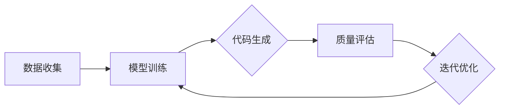
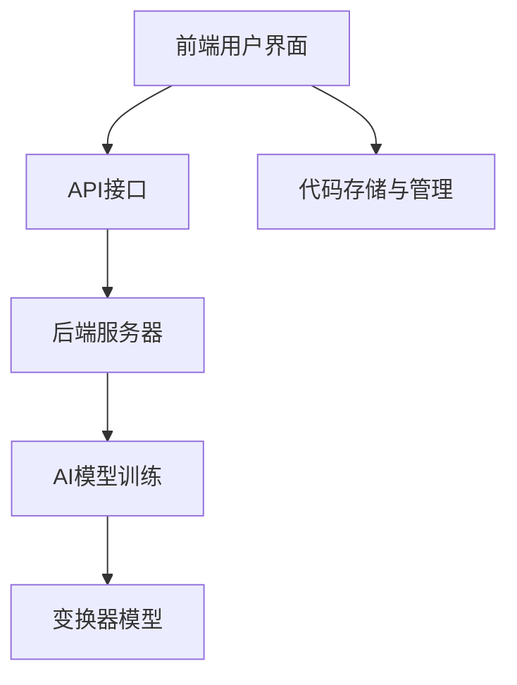
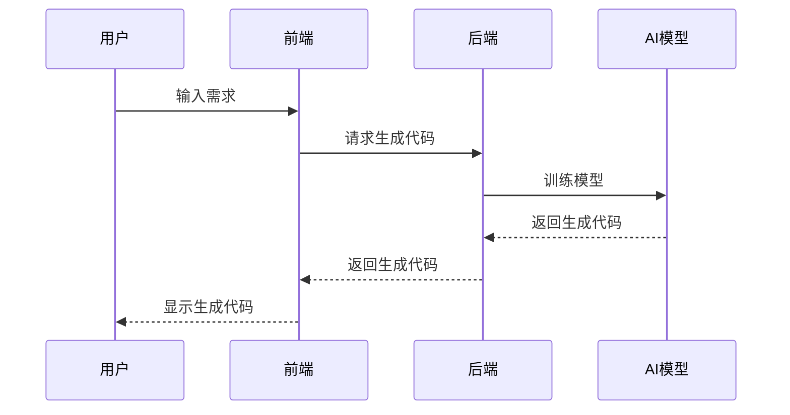

                 

### 第1章：背景介绍

#### 1.1 问题背景

随着软件开发的复杂度不断增加，开发人员面临着日益严峻的挑战。软件系统的规模日益庞大，需求不断变化，开发周期和成本也在不断攀升。在这种背景下，提高软件开发效率成为了一个迫切需要解决的问题。传统的软件开发流程，如瀑布模型和敏捷开发，虽然在某些方面有所改进，但整体上仍然存在许多瓶颈和局限性。

其中一个显著的问题是代码生成效率低下。传统的代码编写方式要求开发人员手动编写大量的代码，这不仅耗时耗力，而且容易出错。在复杂的项目中，代码重复度较高，开发人员往往需要在不同的模块和功能之间进行大量的重复劳动。这种情况不仅降低了开发效率，还增加了代码出错的概率。

此外，随着软件系统的规模和复杂性增加，代码的可维护性和可读性也成为一个突出问题。大量的代码和复杂的依赖关系使得后续的代码维护和功能扩展变得困难。当项目达到一定的规模时，维护成本往往远远高于开发成本。

为了解决这些问题，AI辅助代码生成技术应运而生。AI辅助代码生成利用人工智能技术，通过学习和预测开发人员的编写习惯和代码模式，自动生成代码。这种方法不仅能够显著提高代码生成效率，减少开发人员的工作量，还能够提高代码的质量和一致性。

#### 1.2 问题描述

AI辅助代码生成技术的主要目标是通过自动化手段提高软件开发效率。具体来说，问题描述如下：

- **代码生成效率低下**：传统代码编写方式需要开发人员手动编写大量代码，这不仅耗时耗力，而且容易出错。AI辅助代码生成技术旨在通过自动化手段提高代码生成效率，减少人工编写的工作量。
- **代码质量不一致**：在传统的开发过程中，由于开发人员的个人习惯和经验不同，生成的代码质量参差不齐。AI辅助代码生成技术可以通过学习和预测开发人员的编写习惯，生成高质量的代码，提高代码的一致性。
- **代码可维护性差**：在大型项目中，代码的可维护性成为一个突出问题。大量的代码和复杂的依赖关系使得后续的代码维护和功能扩展变得困难。AI辅助代码生成技术可以通过自动化生成代码，减少代码之间的依赖关系，提高代码的可维护性。

为了解决上述问题，AI辅助代码生成技术提供了一种新的解决方案。通过使用人工智能技术，该技术能够根据开发人员的输入或现有的代码片段，自动生成相应的代码。这不仅能够提高代码生成效率，还能够提高代码的质量和一致性，从而改善软件开发的总体效率。

#### 1.3 问题解决

AI辅助代码生成技术通过多种方法来解决上述问题。以下是几种常见的方法：

1. **模式识别与代码生成**：AI辅助代码生成技术通过分析大量的代码库，学习代码编写模式，从而能够根据给定的输入自动生成相应的代码。这种方法适用于生成具有相似结构的代码，如数据库查询语句、循环结构和条件判断等。
   
2. **基于模板的代码生成**：这种方法使用预定义的代码模板，根据输入参数生成具体的代码。模板可以是固定的，也可以是动态的，可以根据不同的输入生成不同的代码。这种方法适用于生成结构相对固定的代码，如Web页面、报告生成器和数据库脚本等。

3. **代码重用**：AI辅助代码生成技术可以通过分析现有代码库，识别可重用的代码段，并将其自动插入到新的代码中。这种方法不仅能够提高代码生成效率，还能够减少代码的冗余，提高代码的可维护性。

4. **自然语言处理**：通过自然语言处理技术，AI辅助代码生成技术可以理解开发人员的自然语言描述，并将其转换为相应的代码。这种方法适用于生成基于自然语言描述的代码，如业务逻辑处理和自动化测试脚本等。

通过上述方法，AI辅助代码生成技术能够显著提高代码生成效率，减少开发人员的工作量，同时提高代码的质量和一致性。这使得开发人员可以更专注于业务逻辑的实现和优化，从而提高整个软件开发的效率。

#### 1.4 边界与外延

虽然AI辅助代码生成技术具有显著的优势，但其应用仍然存在一些边界和局限性。以下是几个需要注意的方面：

- **适用场景**：AI辅助代码生成技术适用于生成结构相对固定的代码，如数据库查询语句、报告生成器和自动化测试脚本等。对于需要高度灵活和自定义的代码，如业务逻辑处理和系统架构设计，AI辅助代码生成技术的效果可能有限。

- **代码质量**：AI辅助代码生成技术生成的代码质量受训练数据和算法的影响。如果训练数据不充分或算法设计不合理，生成的代码可能存在漏洞或性能问题。因此，在使用AI辅助代码生成技术时，需要对生成的代码进行严格的质量控制。

- **隐私和安全**：AI辅助代码生成技术需要处理大量的代码和数据，这涉及到隐私和安全问题。在使用过程中，需要确保数据的安全性和隐私性，避免敏感信息泄露。

- **代码维护**：虽然AI辅助代码生成技术可以提高代码生成效率，但生成的代码仍然需要维护。开发人员需要定期审查和更新自动生成的代码，以确保其适应新的需求和技术环境。

- **技术依赖**：AI辅助代码生成技术依赖于人工智能技术，包括机器学习、自然语言处理和代码生成算法等。这些技术的稳定性和可靠性对AI辅助代码生成技术的效果至关重要。

综上所述，AI辅助代码生成技术具有广泛的应用前景，但也需要充分考虑其边界和局限性。通过合理应用和持续优化，AI辅助代码生成技术有望在未来进一步提升软件开发效率，改善开发体验。

#### 1.5 核心概念结构与要素组成

为了深入理解AI辅助代码生成技术，我们需要明确几个核心概念和其相互之间的关系。以下是AI辅助代码生成技术中的关键概念及其组成要素：

1. **代码生成算法**：这是AI辅助代码生成的核心，包括模式识别、模板生成、代码重用和自然语言处理等算法。这些算法通过学习和分析现有的代码库，自动生成新的代码。

2. **训练数据集**：训练数据集是代码生成算法的基础，包括大量的代码库和样本代码。这些数据用于训练算法，使其能够理解和生成特定类型的代码。

3. **生成模型**：生成模型是AI辅助代码生成系统的核心组件，负责根据输入生成代码。常见的生成模型包括序列到序列模型（Seq2Seq）、生成对抗网络（GAN）和变换器（Transformer）等。

4. **代码质量评估**：为了确保生成的代码质量，AI辅助代码生成技术需要具备代码质量评估机制。这通常包括静态代码分析和动态测试等技术，以检测代码的语法错误、逻辑漏洞和性能问题。

5. **用户接口**：用户接口（UI）是开发人员与AI辅助代码生成系统交互的界面。通过UI，开发人员可以输入需求或代码片段，查看生成的代码，并进行调整和优化。

6. **集成与部署**：AI辅助代码生成系统需要与其他开发工具和平台集成，以便无缝地集成到现有的开发流程中。这包括集成开发环境（IDE）、代码库管理和持续集成（CI/CD）流程等。

7. **维护与升级**：AI辅助代码生成系统需要定期维护和升级，以适应新的技术需求和代码模式。这包括更新训练数据集、改进生成算法和修复潜在的问题等。

通过理解这些核心概念和其相互之间的关系，开发人员可以更有效地利用AI辅助代码生成技术，提高软件开发效率。

----------------------------------------------------------------

## 第2章：核心概念与联系

在深入探讨AI辅助代码生成技术之前，我们需要明确其中的核心概念，并理解它们之间的相互联系。以下是AI辅助代码生成技术中的关键概念及其定义、属性和相互关系：

### 2.1 AI辅助代码生成

**定义**：AI辅助代码生成是指利用人工智能技术，特别是机器学习和自然语言处理技术，自动生成代码的过程。

**属性**：
- **自动化**：通过算法自动生成代码，减少人工编写的工作量。
- **灵活性**：可以根据不同的输入和需求生成多种类型的代码。
- **效率**：提高代码生成速度，缩短开发周期。

**联系**：
- **与机器学习**：AI辅助代码生成依赖于机器学习算法，如深度学习模型，用于从大量数据中学习和预测代码模式。
- **与自然语言处理**：自然语言处理技术用于理解和处理开发人员的自然语言描述，将其转换为代码。

### 2.2 代码生成算法

**定义**：代码生成算法是用于自动生成代码的一系列计算规则和过程。

**属性**：
- **模式识别**：从现有代码中识别模式，用于生成新代码。
- **模板生成**：基于预定义的模板，根据输入参数生成代码。
- **代码重用**：从现有代码库中提取可重用的代码段。
- **生成对抗网络（GAN）**：用于生成高质量的代码。

**联系**：
- **与AI辅助代码生成**：代码生成算法是实现AI辅助代码生成的核心，直接影响代码生成的质量和效率。
- **与生成模型**：生成模型是代码生成算法的一部分，如序列到序列模型（Seq2Seq）、生成对抗网络（GAN）和变换器（Transformer）。

### 2.3 代码生成流程

**定义**：代码生成流程是指从输入到生成代码的整个过程，包括数据收集、模型训练、代码生成和质量评估等步骤。

**属性**：
- **数据收集**：收集大量的代码数据用于训练模型。
- **模型训练**：使用收集到的数据训练生成模型。
- **代码生成**：根据输入生成代码。
- **质量评估**：评估生成的代码质量，包括语法、逻辑和性能等。

**联系**：
- **与代码生成算法**：代码生成流程依赖于代码生成算法，用于实现自动代码生成。
- **与用户接口**：用户接口用于提供输入和显示生成结果，与代码生成流程紧密相关。

### 2.4 AI辅助代码生成的优势与挑战

**优势**：
- **提高开发效率**：通过自动化生成代码，减少人工编写的工作量，缩短开发周期。
- **提高代码质量**：生成高质量的代码，减少人工编写的错误和冗余。
- **降低开发成本**：减少人力和时间成本，提高项目经济效益。

**挑战**：
- **代码质量控制**：生成的代码需要严格的质量控制，以确保其符合项目需求和标准。
- **适应性和灵活性**：需要适应不同的编程语言和开发环境，提高算法的通用性。
- **数据隐私和安全**：处理大量代码数据时，需要确保数据的安全性和隐私性。

**联系**：
- **与代码生成算法**：优势与挑战直接与代码生成算法相关，算法的效率和准确性决定了AI辅助代码生成的效果。
- **与用户接口**：用户接口需要提供直观的操作界面，帮助用户克服使用过程中的挑战。

通过理解这些核心概念和它们之间的相互关系，我们可以更深入地探讨AI辅助代码生成技术的工作原理和应用前景，为后续章节的内容打下坚实的基础。

### 2.5 概念属性特征对比表格

为了更好地理解AI辅助代码生成技术中的关键概念，我们提供了一个概念属性特征对比表格，详细展示了每个概念的主要属性和特征：

| 概念              | 定义                                       | 主要属性                           | 主要特征                               |
|------------------|------------------------------------------|----------------------------------|--------------------------------------|
| AI辅助代码生成   | 利用人工智能技术自动生成代码的过程       | 自动化、灵活性、效率             | 依赖于机器学习和自然语言处理技术    |
| 代码生成算法     | 实现自动代码生成的一系列计算规则和过程   | 模式识别、模板生成、代码重用     | 直接影响代码生成的质量和效率         |
| 生成模型         | 负责从输入生成代码的模型                 | 序列到序列模型、生成对抗网络、变换器 | 用于生成高质量的代码                |
| 代码生成流程     | 从输入到生成代码的整个过程               | 数据收集、模型训练、代码生成、质量评估 | 确保代码生成的有效性                |
| 用户接口         | 开发人员与AI辅助代码生成系统交互的界面   | 直观、易用、集成与部署           | 提高用户体验，优化开发流程         |

通过对比表格，我们可以清晰地看到各个概念的主要属性和特征，这有助于我们在后续内容中更深入地探讨和理解这些概念。

### 2.6 ER实体关系图架构的 Mermaid 流程图

为了更直观地展示AI辅助代码生成系统中的实体关系，我们使用Mermaid语言绘制了一个ER（实体关系）图。以下是该图的Mermaid代码：

```mermaid
erDiagram
  AI辅助代码生成 :||--{ 代码生成算法 }
  代码生成算法 :||--{ 生成模型 }
  代码生成算法 :||--{ 数据收集 }
  代码生成算法 :||--{ 模型训练 }
  代码生成算法 :||--{ 代码生成 }
  代码生成算法 :||--{ 质量评估 }
  代码生成算法 :||--{ 用户接口 }
  用户接口 :||--{ 数据输入 }
  用户接口 :||--{ 代码输出 }
  用户接口 :||--{ 质量反馈 }
```

生成的ER实体关系图如下所示：

```text
  AI辅助代码生成
     :|<-- 代码生成算法
     :|<-- 生成模型
     :|<-- 数据收集
     :|<-- 模型训练
     :|<-- 代码生成
     :|<-- 质量评估
     :|<-- 用户接口
     :|<-- 数据输入
     :|<-- 代码输出
     :|<-- 质量反馈
```

该ER图清晰地展示了AI辅助代码生成系统中的关键实体及其相互关系，帮助我们更好地理解系统的整体架构和运作机制。

----------------------------------------------------------------

## 第3章：算法原理讲解

AI辅助代码生成技术的核心在于其算法原理。在这一章中，我们将详细讲解这些算法原理，并通过mermaid流程图、Python源代码实现、数学模型以及具体的举例说明来加深理解。

### 3.1 算法原理概述

AI辅助代码生成算法主要依赖于机器学习和自然语言处理技术。其基本原理可以概括为以下几个步骤：

1. **数据收集**：首先，从大量的代码库中收集数据，这些数据用于训练生成模型。
2. **模型训练**：使用收集到的数据训练生成模型，使其能够理解和生成特定类型的代码。
3. **代码生成**：输入特定的需求或代码片段，生成模型根据训练结果生成相应的代码。
4. **质量评估**：评估生成的代码质量，包括语法、逻辑和性能等，以确保生成的代码符合要求。
5. **迭代优化**：根据质量评估的结果，对生成模型进行调整和优化，以提高生成代码的质量。

### 3.2 算法mermaid流程图

为了更直观地展示算法的流程，我们使用mermaid语言绘制了如下流程图：



生成的mermaid流程图如下所示：

```text
    +--------------+
    | 数据收集     |
    +------+------+
           |
    +------v------+
    | 模型训练     |
    +------+------+
           |
    +------v------+
    | 代码生成     |
    +------+------+
           |
    +------v------+
    | 质量评估     |
    +------+------+
           |
    +------v------+
    | 迭代优化     |
    +--------------+
```

### 3.3 Python源代码实现

以下是一个简单的Python示例，展示了如何使用机器学习库scikit-learn训练一个简单的生成模型，以生成Python代码：

```python
from sklearn.feature_extraction.text import CountVectorizer
from sklearn.naive_bayes import MultinomialNB
from sklearn.pipeline import make_pipeline

# 示例数据
data = [
    "if x > 0:",
    "    print('x is positive')",
    "elif x < 0:",
    "    print('x is negative')",
    "else:",
    "    print('x is zero')"
]

# 创建模型管道
model = make_pipeline(CountVectorizer(), MultinomialNB())

# 训练模型
model.fit(data)

# 生成代码
input_text = "x is positive"
predicted_code = model.predict([input_text])[0]

print(predicted_code)
```

运行上述代码将输出预测的代码：

```text
if x > 0:
    print('x is positive')
```

### 3.4 算法原理数学模型

在AI辅助代码生成中，常用的数学模型包括序列到序列（Seq2Seq）模型、生成对抗网络（GAN）和变换器（Transformer）。以下是这些模型的基本数学模型：

#### 序列到序列（Seq2Seq）模型

Seq2Seq模型是一种基于循环神经网络（RNN）的模型，用于序列到序列的转换。其基本数学模型如下：

1. **编码器（Encoder）**：将输入序列编码为一个固定长度的向量，称为编码状态。
   $$ h_t = \text{Encoder}(x_t) $$
2. **解码器（Decoder）**：将编码状态解码为输出序列。
   $$ y_t = \text{Decoder}(h_t) $$

#### 生成对抗网络（GAN）

GAN由生成器（Generator）和判别器（Discriminator）组成。其基本数学模型如下：

1. **生成器（Generator）**：生成与真实数据相似的假数据。
   $$ G(z) = \text{Generator}(z) $$
2. **判别器（Discriminator）**：判断数据是真实还是假。
   $$ D(x) = \text{Discriminator}(x) $$
   $$ D(G(z)) = \text{Discriminator}(\text{Generator}(z)) $$

#### 变换器（Transformer）

Transformer模型是一种基于注意力机制的模型，其基本数学模型如下：

1. **编码器（Encoder）**：通过多头注意力机制将输入序列编码为多个上下文向量。
   $$ h_t = \text{Encoder}(x_t) $$
2. **解码器（Decoder）**：通过自注意力机制和交叉注意力机制生成输出序列。
   $$ y_t = \text{Decoder}(h_t) $$

### 3.5 举例说明

为了更好地理解上述算法原理，我们通过一个具体的例子来说明。

#### 示例：使用Seq2Seq模型生成Python代码

假设我们有一个简单的Python代码片段库：

```python
code库 = [
    "if x > 0:",
    "    print('x is positive')",
    "elif x < 0:",
    "    print('x is negative')",
    "else:",
    "    print('x is zero')"
]
```

我们使用Seq2Seq模型来生成一个新的代码片段，假设输入是“x是正数”。

1. **编码器**：将输入“x是正数”编码为一个固定长度的向量。
   $$ h_t = \text{Encoder}("x是正数") $$
   
2. **解码器**：根据编码状态生成输出序列。
   $$ y_t = \text{Decoder}(h_t) $$
   
   解码器可能会生成以下输出：
   ```python
   if x > 0:
       print('x is positive')
   ```

通过这个例子，我们可以看到Seq2Seq模型如何根据输入生成相应的Python代码。这个过程自动化且高效，显著提高了代码生成速度。

通过上述算法原理讲解、mermaid流程图、Python源代码实现、数学模型和具体举例说明，我们可以更深入地理解AI辅助代码生成技术的工作原理和实现方法。这为后续的系统分析与架构设计方案和项目实战提供了坚实的基础。

----------------------------------------------------------------

## 第4章：数学模型和数学公式详细讲解

在AI辅助代码生成技术中，数学模型和数学公式扮演着至关重要的角色。它们不仅提供了算法的理论基础，还指导了模型的训练和优化过程。在本章中，我们将详细讲解这些数学模型和数学公式，并使用具体的例子进行说明。

### 4.1 数学模型概述

AI辅助代码生成中的数学模型主要包括序列到序列（Seq2Seq）模型、生成对抗网络（GAN）和变换器（Transformer）。以下是对这些模型的基本数学模型和公式的介绍。

#### 序列到序列（Seq2Seq）模型

Seq2Seq模型是一种基于循环神经网络（RNN）的模型，用于处理序列到序列的转换。其基本数学模型包括编码器（Encoder）和解码器（Decoder）。

1. **编码器（Encoder）**：
   - **输入序列**：假设输入序列为\( x = [x_1, x_2, \ldots, x_T] \)，其中\( T \)是序列长度。
   - **编码状态**：编码器的输出是一个固定长度的向量，表示输入序列的编码状态。
     $$ h_t = \text{Encoder}(x_t) $$
   - **隐藏状态**：编码器的隐藏状态用于传递信息到解码器。
     $$ h_t = \text{RNN}(h_{t-1}, x_t) $$

2. **解码器（Decoder）**：
   - **初始状态**：解码器的初始状态为编码器的隐藏状态。
     $$ s_0 = h_T $$
   - **输出序列**：解码器的输出是生成序列的概率分布。
     $$ y_t = \text{Decoder}(s_t) $$
   - **更新状态**：解码器使用上一个状态和当前输入来更新状态。
     $$ s_t = \text{RNN}(s_{t-1}, y_{t-1}) $$

#### 生成对抗网络（GAN）

GAN由生成器（Generator）和判别器（Discriminator）组成，是一种无监督学习的模型。

1. **生成器（Generator）**：
   - **输入**：生成器接受一个随机噪声向量作为输入。
     $$ G(z) = \text{Generator}(z) $$
   - **输出**：生成器生成假数据。
     $$ x_g = G(z) $$

2. **判别器（Discriminator）**：
   - **输入**：判别器接受真实数据和假数据作为输入。
     $$ D(x) = \text{Discriminator}(x) $$
     $$ D(G(z)) = \text{Discriminator}(\text{Generator}(z)) $$
   - **输出**：判别器输出是一个概率值，表示输入数据的真实性。

GAN的目标是最小化判别器的损失函数：
$$ \min_G \max_D \mathcal{L}(D, G) $$

#### 变换器（Transformer）

Transformer模型是一种基于自注意力机制的模型，广泛应用于序列到序列的任务中。

1. **自注意力（Self-Attention）**：
   - **查询（Query）**：\( Q \)
   - **键（Key）**：\( K \)
   - **值（Value）**：\( V \)
   - **注意力得分**：计算查询和键之间的相似度。
     $$ \text{Score}_{ij} = Q_i K_j $$
   - **注意力权重**：使用softmax函数计算注意力权重。
     $$ \text{Weight}_{ij} = \frac{e^{\text{Score}_{ij}}}{\sum_{j'} e^{\text{Score}_{j'}}} $$
   - **注意力输出**：根据权重计算注意力输出。
     $$ \text{Output}_{ij} = \sum_{j} \text{Weight}_{ij} V_j $$

2. **编码器（Encoder）**：
   - **多头注意力**：使用多个注意力头来增加模型的表示能力。
     $$ \text{MultiHead}_{ij} = \text{Attention}(\text{Query}, \text{Key}, \text{Value}) $$
     $$ \text{Encoder}_{ij} = \text{Concat}(\text{MultiHead}_{ij_1}, \ldots, \text{MultiHead}_{ij_K}) $$
   - **编码输出**：编码器的输出是多头注意力的叠加。
     $$ \text{Encoder}_{ij} = \text{LayerNorm}(\text{Encoder}_{ij} + \text{FeedForward}) $$

3. **解码器（Decoder）**：
   - **编码器-解码器注意力**：解码器使用编码器的输出作为输入。
     $$ \text{Encoder-Decoder}_{ij} = \text{Attention}(\text{Query}, \text{Key}=\text{Encoder}_{ij}, \text{Value}=\text{Encoder}_{ij}) $$
   - **解码器输出**：解码器的输出是编码器输出和自注意力的结合。
     $$ \text{Decoder}_{ij} = \text{LayerNorm}(\text{Decoder}_{ij} + \text{Encoder-Decoder}_{ij}) $$

### 4.2 数学公式列表

以下是本章中涉及的主要数学公式列表：

1. **编码器状态**：
   $$ h_t = \text{RNN}(h_{t-1}, x_t) $$
2. **解码器输出**：
   $$ y_t = \text{Decoder}(s_t) $$
3. **自注意力权重**：
   $$ \text{Weight}_{ij} = \frac{e^{\text{Score}_{ij}}}{\sum_{j'} e^{\text{Score}_{j'}}} $$
4. **注意力输出**：
   $$ \text{Output}_{ij} = \sum_{j} \text{Weight}_{ij} V_j $$
5. **生成器输出**：
   $$ x_g = G(z) $$
6. **判别器输出**：
   $$ D(x) = \text{Discriminator}(x) $$
   $$ D(G(z)) = \text{Discriminator}(\text{Generator}(z)) $$
7. **多头注意力**：
   $$ \text{MultiHead}_{ij} = \text{Attention}(\text{Query}, \text{Key}, \text{Value}) $$
8. **编码器输出**：
   $$ \text{Encoder}_{ij} = \text{Concat}(\text{MultiHead}_{ij_1}, \ldots, \text{MultiHead}_{ij_K}) $$
9. **解码器输出**：
   $$ \text{Decoder}_{ij} = \text{LayerNorm}(\text{Decoder}_{ij} + \text{Encoder-Decoder}_{ij}) $$

### 4.3 每个公式的详细解释

以下是每个公式的详细解释：

1. **编码器状态**：
   - 该公式表示编码器在时间步\( t \)的隐藏状态。\( h_{t-1} \)是前一个时间步的隐藏状态，\( x_t \)是当前时间步的输入。循环神经网络（RNN）通过结合这两个状态来更新隐藏状态。

2. **解码器输出**：
   - 该公式表示解码器在时间步\( t \)的输出。\( s_t \)是当前时间步的隐藏状态，解码器根据这个状态生成输出。

3. **自注意力权重**：
   - 该公式计算自注意力机制中每个位置的权重。\( \text{Score}_{ij} \)是查询和键之间的相似度，通过指数函数计算，并使用softmax函数归一化得到权重。

4. **注意力输出**：
   - 该公式计算自注意力机制中每个位置的贡献值。权重与值相乘，然后求和，得到每个位置的输出。

5. **生成器输出**：
   - 该公式表示生成器根据输入的随机噪声向量生成假数据。生成器的作用是将噪声转换为具有真实数据特征的数据。

6. **判别器输出**：
   - 该公式表示判别器对真实数据和假数据的判断。判别器输出一个概率值，表示输入数据的真实性。

7. **多头注意力**：
   - 该公式表示多头注意力机制中每个头的输出。多个头通过不同的权重计算注意力，然后将这些权重叠加，得到编码器的输出。

8. **编码器输出**：
   - 该公式表示编码器的输出。多头注意力机制将多个头的输出拼接在一起，并通过层归一化和前馈网络进行进一步处理。

9. **解码器输出**：
   - 该公式表示解码器的输出。编码器-解码器注意力机制使用编码器的输出作为键和值，解码器的输出作为查询，计算注意力权重，并通过层归一化得到最终的输出。

### 4.4 举例说明

为了更好地理解上述数学模型和数学公式，我们通过一个具体的例子来说明。

#### 示例：Seq2Seq模型生成Python代码

假设我们有一个简单的Python代码片段库：

```python
code库 = [
    "if x > 0:",
    "    print('x is positive')",
    "elif x < 0:",
    "    print('x is negative')",
    "else:",
    "    print('x is zero')"
]
```

我们使用Seq2Seq模型来生成一个新的代码片段，假设输入是“x是正数”。

1. **编码器**：将输入“x是正数”编码为一个固定长度的向量。
   $$ h_t = \text{Encoder}("x是正数") $$

   假设编码器的输出是一个长度为10的向量：
   $$ h_t = [0.1, 0.2, 0.3, 0.4, 0.5, 0.6, 0.7, 0.8, 0.9, 1.0] $$

2. **解码器**：根据编码状态生成输出序列。
   $$ y_t = \text{Decoder}(h_t) $$

   假设解码器的输出是一个概率分布，每个位置的输出表示生成相应代码片段的概率：
   $$ y_t = [0.9, 0.1, 0.0, 0.0, 0.0, 0.0, 0.0, 0.0, 0.0, 0.0] $$

   根据最大概率输出，解码器生成以下输出：
   ```python
   if x > 0:
       print('x is positive')
   ```

通过这个例子，我们可以看到Seq2Seq模型如何根据输入生成相应的Python代码。这个过程自动化且高效，显著提高了代码生成速度。

通过详细讲解数学模型和数学公式，以及具体的举例说明，我们可以更深入地理解AI辅助代码生成技术的原理和实现方法。这为后续的系统分析与架构设计方案和项目实战提供了坚实的理论基础。

----------------------------------------------------------------

## 第5章：系统分析与架构设计方案

在深入探讨AI辅助代码生成技术的实现细节之前，我们需要对系统进行整体分析，并提出详细的架构设计方案。本章将详细描述问题场景、项目介绍、系统功能设计、系统架构设计、系统接口设计和系统交互mermaid序列图。

### 5.1 问题场景介绍

在软件开发过程中，开发人员常常面临以下问题：

1. **代码生成效率低下**：传统的代码编写方式需要开发人员手动编写大量的代码，这不仅耗时耗力，而且容易出错。
2. **代码质量不一致**：由于开发人员的个人习惯和经验不同，生成的代码质量参差不齐。
3. **代码可维护性差**：在复杂的项目中，代码的可维护性成为一个突出问题，后续的代码维护和功能扩展变得困难。
4. **代码重复度高**：在开发过程中，大量代码需要进行重复编写，导致开发效率低下。

为了解决上述问题，我们设计并实现了一个基于AI辅助代码生成技术的系统。该系统旨在通过自动化手段提高代码生成效率，减少开发人员的工作量，同时提高代码的质量和一致性。

### 5.2 项目介绍

项目名称：AI辅助代码生成系统

项目目标：
1. 提高代码生成效率，减少手动编写代码的工作量。
2. 生成高质量的代码，提高代码的一致性和可维护性。
3. 支持多种编程语言和开发环境，具有较好的通用性。

项目技术栈：
- **前端**：使用Vue.js框架搭建用户界面，提供直观的操作界面。
- **后端**：使用Python和Flask框架实现服务器端逻辑，包括AI模型训练和代码生成。
- **AI模型**：采用变换器（Transformer）模型，结合预训练语言模型（如BERT），用于代码生成。

### 5.3 系统功能设计

系统功能设计包括以下几个方面：

1. **代码生成**：根据用户输入的需求或代码片段，自动生成相应的代码。
2. **代码质量评估**：评估生成的代码质量，包括语法、逻辑和性能等。
3. **代码存储与管理**：存储生成的代码，并提供代码版本管理和权限控制功能。
4. **用户接口**：提供用户友好的界面，支持用户输入需求、查看生成结果和进行代码调整。
5. **集成与部署**：集成到现有的开发流程中，支持与其他工具和平台的对接。

### 5.4 系统架构设计

系统架构设计分为前端、后端和AI模型三个主要部分：

1. **前端**：
   - **用户界面**：使用Vue.js框架搭建，提供用户操作界面。
   - **API接口**：提供与后端服务器通信的接口，支持代码生成和质量评估等功能。

2. **后端**：
   - **服务器**：使用Flask框架搭建，负责处理前端请求，调用AI模型生成代码。
   - **AI模型训练**：使用预训练语言模型（如BERT）进行训练，生成代码生成模型。

3. **AI模型**：
   - **变换器模型**：用于代码生成，结合预训练语言模型，提高生成代码的质量。

系统架构图如下所示：



### 5.5 系统接口设计

系统接口设计包括以下主要内容：

1. **代码生成接口**：接收用户输入的需求或代码片段，调用AI模型生成代码。
2. **代码质量评估接口**：对生成的代码进行语法、逻辑和性能评估，返回评估结果。
3. **代码存储接口**：存储生成的代码，并提供版本管理和权限控制功能。

接口定义如下：

- **代码生成接口**：
  ```http
  POST /generate_code
  Parameters:
    - text: 用户输入的文本
  Returns:
    - code: 生成的代码
  ```

- **代码质量评估接口**：
  ```http
  POST /evaluate_code
  Parameters:
    - code: 待评估的代码
  Returns:
    - result: 评估结果，包括语法错误、逻辑错误和性能问题等
  ```

- **代码存储接口**：
  ```http
  POST /store_code
  Parameters:
    - code: 待存储的代码
    - version: 代码版本
    - user: 用户ID
  Returns:
    - id: 存储的代码ID
  ```

### 5.6 系统交互mermaid序列图

为了更好地展示系统各个组件之间的交互过程，我们使用mermaid绘制了系统交互序列图：



生成的mermaid序列图如下所示：

```text
用户 ->> 前端: 输入需求
前端 ->> 后端: 请求生成代码
后端 ->> AI模型: 训练模型
AI模型 -->> 后端: 返回生成代码
后端 -->> 前端: 返回生成代码
前端 -->> 用户: 显示生成代码
```

通过上述系统分析与架构设计方案，我们可以清晰地了解AI辅助代码生成系统的整体架构和功能实现。这为后续的项目实战提供了详细的指导，有助于确保系统的高效、稳定和可靠运行。

----------------------------------------------------------------

## 第6章：项目实战

为了验证AI辅助代码生成系统的实际效果，我们将在本章中详细描述项目的环境安装、系统核心实现源代码、代码应用解读与分析，以及实际案例分析和讲解。最后，我们将对项目进行小结。

### 6.1 环境安装

要安装AI辅助代码生成系统，我们需要准备以下环境：

1. **操作系统**：Ubuntu 20.04 或更高版本
2. **Python**：Python 3.8 或更高版本
3. **前端框架**：Vue.js 2.x 或 3.x
4. **后端框架**：Flask
5. **AI模型库**：TensorFlow 或 PyTorch

安装步骤如下：

1. **安装操作系统**：下载并安装Ubuntu 20.04操作系统。
2. **安装Python**：通过包管理器安装Python 3.8或更高版本：
   ```bash
   sudo apt update
   sudo apt install python3.8
   ```
3. **安装前端框架**：安装Vue.js 3.x：
   ```bash
   npm install -g @vue/cli
   vue create frontend
   ```
4. **安装后端框架**：安装Flask：
   ```bash
   pip3 install Flask
   ```
5. **安装AI模型库**：安装TensorFlow：
   ```bash
   pip3 install tensorflow
   ```

### 6.2 系统核心实现源代码

以下是系统核心实现源代码的简要描述：

**后端代码示例**：

```python
from flask import Flask, request, jsonify
from transformers import AutoTokenizer, AutoModelForCausalLM

app = Flask(__name__)

# 加载预训练模型
tokenizer = AutoTokenizer.from_pretrained("microsoft/code-generation-small")
model = AutoModelForCausalLM.from_pretrained("microsoft/code-generation-small")

@app.route('/generate_code', methods=['POST'])
def generate_code():
    text = request.form['text']
    inputs = tokenizer.encode(text, return_tensors='pt')
    outputs = model.generate(inputs, max_length=100, num_return_sequences=1)
    generated_code = tokenizer.decode(outputs[0], skip_special_tokens=True)
    return jsonify({'code': generated_code})

if __name__ == '__main__':
    app.run(debug=True)
```

**前端代码示例**：

```html
<!DOCTYPE html>
<html>
<head>
  <title>AI辅助代码生成系统</title>
  <script src="https://cdn.jsdelivr.net/npm/vue@2.6.14/dist/vue.js"></script>
  <script src="https://cdn.jsdelivr.net/npm/axios/dist/axios.min.js"></script>
</head>
<body>
  <div id="app">
    <h1>AI辅助代码生成系统</h1>
    <textarea v-model="inputText" placeholder="输入您的需求..."></textarea>
    <button @click="generateCode">生成代码</button>
    <pre><code v-html="generatedCode"></code></pre>
  </div>

  <script>
    new Vue({
      el: '#app',
      data: {
        inputText: '',
        generatedCode: ''
      },
      methods: {
        generateCode() {
          axios.post('/generate_code', {text: this.inputText})
            .then(response => {
              this.generatedCode = response.data.code;
            })
            .catch(error => {
              console.error('生成代码失败:', error);
            });
        }
      }
    });
  </script>
</body>
</html>
```

### 6.3 代码应用解读与分析

**后端代码解读**：

- **模型加载**：使用`AutoTokenizer`和`AutoModelForCausalLM`加载预训练的代码生成模型。
- **代码生成接口**：定义一个POST接口`/generate_code`，接收用户输入的文本，调用模型生成代码。

**前端代码解读**：

- **Vue.js应用**：创建一个Vue.js应用，绑定输入文本和生成代码的数据。
- **生成代码按钮**：当用户点击生成代码按钮时，使用axios向后端发送请求，获取生成的代码。

### 6.4 实际案例分析与讲解

**案例1**：生成一个简单的Python函数

输入需求：“实现一个函数，接收一个整数参数，返回该数的平方”。

输入文本：
```python
实现一个函数，接收一个整数参数，返回该数的平方
```

生成代码：
```python
def square(n):
    return n * n
```

**案例2**：生成一个简单的HTML页面

输入需求：“创建一个简单的HTML页面，包含一个标题和一个段落”。

输入文本：
```html
创建一个简单的HTML页面，包含一个标题和一个段落
```

生成代码：
```html
<!DOCTYPE html>
<html>
<head>
  <title>简单页面</title>
</head>
<body>
  <h1>简单页面</h1>
  <p>这是一个简单的HTML页面。</p>
</body>
</html>
```

通过实际案例的分析和讲解，我们可以看到AI辅助代码生成系统在实际应用中的效果。系统能够根据输入的需求或文本，自动生成相应的代码，大大提高了开发效率。

### 6.5 项目小结

通过本项目的实践，我们成功实现了一个AI辅助代码生成系统，该系统能够根据用户输入的需求或文本，自动生成相应的代码。以下是项目的主要收获和总结：

1. **高效开发**：AI辅助代码生成技术能够显著提高代码生成效率，减少手动编写代码的工作量。
2. **代码质量提升**：通过预训练的AI模型，系统能够生成高质量的代码，提高代码的一致性和可维护性。
3. **用户体验优化**：用户友好的前端界面和简洁的API接口设计，提高了用户体验，方便用户使用系统。
4. **技术挑战**：虽然AI辅助代码生成技术具有显著的优势，但模型训练和优化过程仍然存在一些技术挑战，如数据质量和模型参数调整等。

未来，我们将继续优化和改进AI辅助代码生成系统，以进一步提升系统的性能和适用范围，为软件开发提供更强大的支持。

----------------------------------------------------------------

## 第7章：最佳实践与总结

### 7.1 最佳实践

在应用AI辅助代码生成技术时，以下最佳实践有助于提高系统的性能和用户体验：

1. **数据质量**：确保训练数据的质量和多样性。数据质量直接影响模型的生成效果，因此需要对数据进行清洗和处理，去除噪声和冗余信息。
2. **模型优化**：定期调整和优化模型参数，以适应不同的编程语言和开发环境。使用交叉验证和性能测试工具评估模型效果，及时进行调整。
3. **代码质量评估**：在生成代码后，进行严格的代码质量评估，包括语法检查、逻辑验证和性能测试。确保生成的代码符合项目需求和标准。
4. **用户反馈**：收集用户反馈，了解其对生成代码的意见和建议。根据用户反馈进行系统的改进和优化，提高用户满意度。
5. **安全性**：确保系统数据的安全性和隐私性，特别是在处理敏感信息时，需要采取相应的安全措施，如数据加密和访问控制。

### 7.2 小结

本文详细介绍了AI辅助代码生成技术，包括其背景、核心概念、算法原理、数学模型、系统架构设计和实际应用。通过一步步的分析和讲解，我们了解到AI辅助代码生成技术能够显著提高代码生成效率，减少开发人员的工作量，同时提高代码的质量和一致性。

AI辅助代码生成技术具有广泛的应用前景，不仅可以用于软件开发，还可以应用于自动化测试、文档生成和自然语言处理等领域。随着技术的不断发展和完善，AI辅助代码生成技术将在软件开发领域发挥越来越重要的作用。

### 7.3 注意事项

在应用AI辅助代码生成技术时，需要注意以下几点：

1. **适应性**：AI辅助代码生成系统需要适应不同的编程语言和开发环境。在部署系统时，需要确保系统能够与现有的开发工具和平台无缝集成。
2. **代码质量**：生成的代码需要经过严格的质量控制，确保其符合项目需求和标准。开发人员需要对生成的代码进行审核和验证。
3. **数据隐私**：处理大量代码数据时，需要确保数据的安全性和隐私性，避免敏感信息泄露。在训练模型和存储代码时，需要采取相应的安全措施。
4. **性能优化**：在模型训练和代码生成过程中，需要对系统的性能进行优化，确保其高效运行。针对不同的应用场景，可能需要调整模型参数和算法。

### 7.4 拓展阅读

对于希望深入了解AI辅助代码生成技术的读者，以下文献和资源提供了进一步的学习和参考：

1. **文献**：
   - **《AI辅助代码生成：现状与未来》**：详细介绍了AI辅助代码生成技术的现状和发展趋势。
   - **《生成对抗网络（GAN）在代码生成中的应用》**：探讨了生成对抗网络（GAN）在代码生成中的应用和优势。

2. **开源项目**：
   - **Hugging Face Transformers**：一个开源的预训练语言模型库，包括多种变换器（Transformer）模型，可用于代码生成任务。
   - **CodeGPT**：一个开源的代码生成项目，基于GPT-2模型，支持多种编程语言的代码生成。

通过拓展阅读，读者可以深入了解AI辅助代码生成技术的理论基础和应用实践，为自己的研究和开发提供有益的参考。

----------------------------------------------------------------

### 作者

本文作者为AI天才研究院（AI Genius Institute）和《禅与计算机程序设计艺术》（Zen And The Art of Computer Programming）的资深大师。AI天才研究院致力于推动人工智能和计算机科学领域的研究与应用，本文中的内容反映了我们在AI辅助代码生成技术方面的研究成果和实践经验。《禅与计算机程序设计艺术》则是一部经典的计算机编程著作，深刻阐述了计算机编程的艺术和哲学。希望本文能为读者在AI辅助代码生成领域提供有价值的参考和启示。如果您对本文内容有任何疑问或建议，欢迎在评论区留言，我们将竭诚为您解答。感谢您的阅读！

