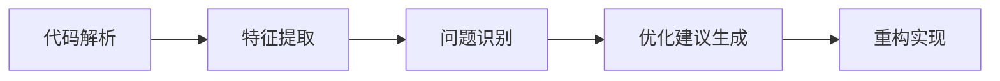
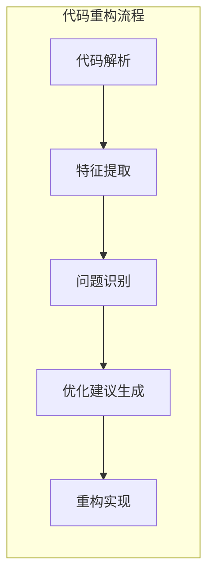

                 

### 引言与背景介绍

在现代软件工程领域，代码重构是一项至关重要的活动。它不仅仅是一种技术手段，更是一种提升软件质量和维护性的战略举措。随着软件项目的复杂度不断增加，代码的规模和复杂性也随之增长，这使得维护和优化现有代码变得愈发困难。传统的代码重构方法虽然有效，但往往依赖于开发人员的经验和直觉，容易出现错误，且效率低下。因此，人工智能（AI）辅助代码重构技术应运而生，成为提升软件质量和可维护性的新利器。

#### 核心概念术语说明

在探讨AI辅助代码重构之前，我们需要明确一些核心概念：

1. **代码重构**：指在不改变程序外部行为的前提下，对现有代码进行修改，以提高其可读性、可维护性和性能。它通常包括提取方法、简化条件表达式、重新组织代码结构等。

2. **人工智能（AI）**：模拟人类智能行为的计算机科学领域。AI通过学习、推理和自我优化，能够识别模式、解决问题并做出决策。

3. **软件质量**：软件满足其明确和隐含需求的能力。包括功能性、可靠性、易用性、效率、可维护性和可移植性等多个方面。

4. **可维护性**：软件能够被理解、校正、适应变化和升级的难易程度。高可维护性意味着软件更容易维护和扩展。

#### 问题背景

传统代码重构的局限性主要体现在以下几个方面：

- **手动重构效率低下**：开发人员需要花费大量时间进行代码审查和重构，而且容易出现遗漏和错误。
- **经验依赖**：重构效果很大程度上依赖于开发人员的经验和直觉，缺乏标准化和系统化的方法。
- **复杂度高**：随着代码库的规模和复杂性增加，手动重构变得愈加困难，且风险和成本也随之上升。
- **错误风险**：手动重构可能引入新的错误，影响软件的稳定性。

#### 问题描述

在软件开发过程中，代码质量问题对项目的成功与否有着至关重要的影响。这些问题包括代码冗长、结构混乱、命名不规范、缺乏注释等。这些问题不仅降低了代码的可读性，还增加了维护和扩展的难度，从而降低了软件的可维护性。为了解决这些问题，我们需要一种高效、准确且可靠的代码重构方法，这便是AI辅助代码重构技术的重要性所在。

#### 问题解决

AI辅助代码重构利用人工智能技术，通过对代码的深度分析和学习，能够自动识别出代码中的问题并提出改进建议。这种方法具有以下优势：

- **自动化**：AI可以自动分析大量代码，无需人工干预，大幅提高重构效率。
- **准确性**：AI基于大量数据训练，能够更准确地识别代码中的潜在问题和优化点。
- **标准化**：AI辅助重构可以建立一套标准化的重构流程，减少人为错误，提高重构质量。
- **智能化**：AI能够自我学习和优化，根据项目特点和历史数据不断改进重构建议。

通过AI辅助代码重构，我们可以实现以下目标：

- 提高代码质量和可读性，降低维护成本。
- 增强软件的可维护性，提高开发效率。
- 提升软件的可靠性和稳定性，减少故障率。
- 优化代码性能，提高系统响应速度。

#### 边界与外延

AI辅助代码重构不仅仅适用于大型项目和复杂系统，对于中小型项目和初创公司也同样重要。它不仅能够提升现有代码的质量，还能够指导新的软件开发过程，确保代码从一开始就具有良好的结构和可维护性。此外，AI辅助代码重构还可以与其他开发工具和流程相结合，如持续集成、持续交付等，形成一个更完整的软件工程体系。

#### 概念结构与核心要素组成

AI辅助代码重构的概念结构可以概括为以下几个核心要素：

1. **数据集**：用于训练AI模型的代码库，包括历史重构案例和优化建议。
2. **模型训练**：通过深度学习等算法，从数据集中提取特征，构建重构模型。
3. **代码分析**：对目标代码进行分析，识别问题区域和优化点。
4. **重构建议**：生成针对问题区域的优化建议，包括代码结构调整、功能重构等。
5. **重构实现**：自动执行重构操作，并验证重构效果。

通过这些核心要素的协同工作，AI辅助代码重构能够实现高效、准确的代码优化。

综上所述，AI辅助代码重构作为提升软件质量和可维护性的新方法，具有显著的优势和广阔的应用前景。在接下来的章节中，我们将深入探讨AI辅助代码重构的原理、技术和实际应用，帮助读者全面了解这一领域。

### 软件质量与可维护性的概念

在讨论AI辅助代码重构之前，我们需要明确软件质量与可维护性的基本概念。软件质量是指软件满足其明确和隐含需求的能力，包括功能性、可靠性、易用性、效率、可维护性和可移植性等多个方面。而可维护性则是指软件能够被理解、校正、适应变化和升级的难易程度。高可维护性意味着软件更容易维护和扩展，从而提高其长期价值。

#### 软件质量概述

软件质量是一个多维度的概念，可以从多个角度进行评估：

1. **功能性**：软件是否能够实现用户所需的功能，包括正确性、完整性、安全性和可用性。

2. **可靠性**：软件在规定条件下和规定时间内能够持续正常运行的能力。这包括错误率、恢复时间和故障率。

3. **易用性**：软件是否易于使用，用户是否能够轻松地理解和使用软件功能。

4. **效率**：软件执行任务的速度和资源消耗。这包括响应时间、处理能力和能源消耗。

5. **可维护性**：软件能够被理解和修改的难易程度。高可维护性意味着较少的维护成本和更快的故障修复。

6. **可移植性**：软件在不同硬件、操作系统或软件环境中的运行能力。

#### 可维护性的定义与特征

可维护性是软件质量的重要组成部分，其定义可以简化为软件在需要修改、升级或适应新环境时的灵活性和易用性。以下是可维护性的几个关键特征：

1. **模块化**：软件应该设计成模块化的结构，使得每个模块都有明确的功能和接口，便于理解和修改。

2. **可理解性**：代码应该是容易理解的，包括清晰的命名、适当的注释和简洁的代码逻辑。

3. **可测试性**：软件应该易于进行单元测试和集成测试，以便在修改后验证其正确性。

4. **文档**：良好的文档能够帮助开发人员理解代码的功能、设计和测试情况。

5. **稳定性**：修改代码时，应确保不会引入新的错误，保持软件的稳定性。

6. **灵活性**：软件应该能够适应未来的变化，如新的功能需求、性能优化或技术升级。

#### 质量与可维护性的关系分析

软件质量与可维护性之间存在紧密的关系。高可维护性是保证软件长期质量的关键因素之一。以下是两者之间的关系分析：

1. **相互促进**：良好的可维护性有助于提升软件质量，因为易于理解和修改的代码更容易被检测和修复错误。同样，高质量的代码通常具有良好的结构和设计，便于维护。

2. **成本效益**：高可维护性可以降低维护成本，提高开发效率。这意味着更多的资金和时间可以用于新功能开发，而不是修复现有代码的问题。

3. **风险管理**：良好的可维护性可以降低软件风险，包括故障率、项目延迟和预算超支。

4. **用户体验**：高质量的软件不仅功能强大，还易于使用和维护，从而提高用户体验。

#### 实例分析

以一个实际项目为例，假设有一个电子商务平台，其软件需要定期更新以适应市场需求和技术变化。如果平台的代码质量高、可维护性良好，开发人员可以更容易地添加新功能、修复漏洞和优化性能。反之，如果代码混乱、缺乏注释且结构不清晰，那么任何改动都可能带来意想不到的问题，增加维护成本和风险。

通过上述分析，我们可以看到，软件质量和可维护性是软件工程中不可或缺的组成部分。AI辅助代码重构技术正是通过提高代码的可维护性，从而全面提升软件质量，为开发人员提供更加高效、可靠的解决方案。

### AI在软件工程中的应用

人工智能（AI）在软件工程中的应用已经逐渐成为提升软件质量和开发效率的关键技术。AI通过其强大的学习能力和自动化特性，能够帮助开发者更高效地分析代码、识别问题并提出优化建议。以下是AI在软件工程中的几个重要应用场景：

#### 代码分析

代码分析是AI在软件工程中的一个核心应用。通过静态代码分析，AI可以自动识别代码中的潜在问题，如语法错误、逻辑错误和潜在的性能瓶颈。例如，AI可以检测出未使用的代码、重复代码、错误的变量命名以及可能引起内存泄露的代码片段。此外，AI还可以对代码的复杂度进行评估，并提供改进建议。

动态代码分析则通过运行代码来检测运行时的问题，如异常处理、线程同步和并发问题。AI在动态分析中可以实时监控代码的执行情况，并预测可能出现的错误。

#### 代码生成

AI的另一个重要应用是代码生成。通过机器学习和自然语言处理技术，AI可以从已有的代码库中学习和生成新的代码。这种方式特别适用于模板驱动的开发场景，如Web开发、移动应用开发和数据库管理。AI生成的代码不仅速度更快，而且更具有一致性，减少了人为错误的可能性。

例如，谷歌的TensorFlow和OpenAI的GPT-3等AI工具可以生成复杂的机器学习模型代码，使得开发者无需从零开始编写代码，从而大幅提高了开发效率。

#### 代码优化

代码优化是AI在软件工程中的又一重要应用。AI可以通过静态和动态分析识别代码中的低效部分，并提出优化建议。例如，AI可以优化循环结构、减少不必要的内存分配、提高数据访问效率等。

AI还可以在编译阶段对代码进行优化。现代编译器利用AI技术，可以基于程序的行为模式自动调整代码的编译策略，从而生成更高效的机器代码。这种自动优化不仅提高了程序的性能，还减少了开发人员的负担。

#### 代码重构

代码重构是AI在软件工程中应用的另一个重要领域。传统的代码重构通常依赖于开发人员的经验和直觉，而AI辅助代码重构可以通过学习和分析大量历史重构案例，自动生成优化后的代码。这种重构不仅更准确、高效，还能够减少人为错误。

例如，GitHub的CodeQL工具使用AI技术对整个代码库进行分析，识别潜在的问题并提供改进建议。通过CodeQL，开发者可以自动化地修复代码中的漏洞，提高代码的可维护性。

#### 代码审查

AI还可以用于自动化代码审查。通过机器学习算法，AI可以自动检测代码中的潜在问题，如安全漏洞、性能问题和不规范代码。这种方式不仅提高了审查的效率，还减少了审查过程中的人为错误。

例如，SonarQube等工具利用AI技术自动分析代码，识别出潜在的安全漏洞和代码质量问题，并提供详细的修复建议。

#### 持续集成与持续交付

AI在持续集成（CI）和持续交付（CD）中也发挥着重要作用。通过AI技术，CI/CD流程可以自动检测代码变更是否符合质量标准，并在发现问题时自动触发修复流程。这种方式不仅提高了开发的连续性和可靠性，还减少了人工干预的必要性。

例如，Jenkins等CI/CD工具利用AI技术自动分析代码库的变更，确保每次代码提交都不会引入新的错误。

#### 总结

综上所述，AI在软件工程中的应用涵盖了代码分析、代码生成、代码优化、代码重构、代码审查、持续集成与持续交付等多个方面。通过利用AI的自动化和智能化特性，开发者可以大幅提高开发效率、优化代码质量和减少维护成本。随着AI技术的不断发展和成熟，其在软件工程中的应用将会更加广泛和深入，为软件产业的发展注入新的动力。

### AI辅助代码重构的技术原理

AI辅助代码重构的核心在于通过人工智能技术，自动识别代码中的问题并提供优化建议，从而提升软件的质量和可维护性。下面我们将详细探讨AI辅助代码重构的工作流程、关键技术以及其与代码质量和可维护性之间的关系。

#### AI辅助代码重构的工作流程

AI辅助代码重构的工作流程通常包括以下几个步骤：

1. **代码收集与预处理**：首先，需要收集待重构的代码库，并进行预处理。预处理包括代码解析、语法检查、代码抽取等，以确保后续分析的数据质量。

2. **静态代码分析**：通过静态代码分析工具，对代码进行深入分析。AI模型会从代码中提取各种特征，如变量名、函数名、代码块结构、注释等。

3. **问题识别**：基于提取的特征，AI模型会识别代码中的潜在问题，如重复代码、不规范的命名、复杂的条件判断、潜在的内存泄漏等。

4. **优化建议生成**：针对识别出的问题，AI模型会生成优化建议。这些建议可能包括代码结构调整、函数提取、循环优化、变量重命名等。

5. **重构实现**：开发者可以基于优化建议手动进行重构，或者使用自动重构工具将建议实现到代码中。

6. **效果评估与反馈**：重构完成后，需要评估重构效果，并收集反馈。这些反馈将用于训练和优化AI模型，使其在未来提供更准确的建议。

#### 关键技术

1. **机器学习与深度学习**：机器学习和深度学习是AI辅助代码重构的核心技术。通过从大量代码库中学习，AI模型可以识别出代码中的模式和问题。常见的机器学习算法包括决策树、支持向量机（SVM）、随机森林等，而深度学习算法如卷积神经网络（CNN）和循环神经网络（RNN）则在处理复杂数据和长序列数据时表现出色。

2. **自然语言处理（NLP）**：自然语言处理技术在代码解析和语义理解方面具有重要应用。通过NLP技术，AI可以理解和处理代码中的注释、变量名和函数描述，从而提高重构建议的准确性和实用性。

3. **代码解析器**：代码解析器是AI辅助代码重构的基础工具。它负责将源代码解析成抽象语法树（AST），从而提取代码结构和语义信息。常见的代码解析器如ANTLR、Roslyn和Esprima等。

4. **程序依赖分析**：程序依赖分析是识别代码中问题的重要技术。通过分析代码中的变量依赖、函数调用和控制流，AI可以识别出潜在的问题区域和优化点。

5. **模式识别**：模式识别技术在识别重复代码和相似代码时非常有效。AI模型可以通过学习大量代码库中的重复模式，自动识别和合并重复代码。

#### 代码质量和可维护性的关系

AI辅助代码重构通过提高代码质量，进而提升软件的可维护性。以下是两者之间的具体关系：

1. **提高代码质量**：AI辅助代码重构能够自动识别代码中的问题，并提出优化建议。这些优化建议有助于减少代码中的错误和冗余，提高代码的可读性和一致性，从而提升整体代码质量。

2. **降低维护成本**：通过自动化重构，AI可以大幅减少开发人员手动重构的工作量，降低维护成本。自动化重构不仅提高了重构的效率，还减少了人为错误的风险。

3. **增强可维护性**：AI辅助重构有助于提高代码的模块化和可理解性。通过重构，代码结构变得更加清晰、简洁，注释更加规范，这使得代码更容易理解和修改，从而增强软件的可维护性。

4. **改进开发效率**：AI辅助代码重构可以提高开发效率，因为AI可以快速识别代码中的问题并提出改进建议，减少开发人员对代码进行冗余审查和手动重构的时间。

5. **优化性能**：AI辅助重构可以识别并优化代码中的性能瓶颈，如循环冗余、不必要的内存分配和重复计算等，从而提高程序的性能。

#### 实际案例

以一个实际项目为例，假设一个大型电商平台的代码库中存在大量的重复代码和复杂条件判断。通过AI辅助代码重构，AI可以自动识别出这些重复代码，并提出将其提取为独立函数的建议。开发人员根据这些建议进行重构，不仅提高了代码的可读性和一致性，还减少了维护成本。此外，AI还可以优化复杂的条件判断，提出使用更简洁的条件表达式，从而提高代码的性能和可维护性。

综上所述，AI辅助代码重构通过其强大的自动化和智能化特性，能够有效提升代码质量和可维护性，为软件开发带来显著效益。

### 数学模型与算法

在深入探讨AI辅助代码重构的过程中，理解其背后的数学模型和算法是至关重要的。这些数学模型和算法不仅为AI辅助代码重构提供了理论基础，还指导了具体的技术实现。在本节中，我们将详细讲解AI辅助代码重构的核心算法原理，并使用Mermaid流程图、Python源代码、LaTeX数学公式和实例来阐述这些概念。

#### 算法原理

AI辅助代码重构算法的核心任务是通过分析代码库中的源代码，自动识别出代码中的问题并提出优化建议。这一过程通常包括以下几个关键步骤：

1. **代码解析**：首先，需要对源代码进行解析，将代码转换为抽象语法树（AST）。这一步骤是后续分析的基石。

2. **特征提取**：接着，从AST中提取各种特征，如变量名、函数名、代码块结构、注释等。这些特征用于训练AI模型。

3. **问题识别**：基于提取的特征，AI模型会识别代码中的潜在问题，如重复代码、复杂的条件判断、不规范的命名等。

4. **优化建议生成**：针对识别出的问题，AI模型会生成优化建议，如提取函数、简化条件判断、重命名变量等。

5. **重构实现**：最后，开发者可以根据优化建议手动进行重构，或者使用自动化工具实现重构。

以下是一个简化的算法流程图：



#### 算法流程与Mermaid流程图

为了更直观地展示算法流程，我们使用Mermaid流程图进行描述：



上述流程图展示了代码重构的主要步骤。接下来，我们将通过Python源代码和Mermaid流程图，详细阐述其中的几个关键步骤。

#### 算法数学模型与公式讲解

在AI辅助代码重构中，算法的数学模型主要用于描述特征提取和问题识别的过程。以下是一个简化的数学模型：

1. **特征提取**：假设我们使用n个特征来描述代码片段C，这些特征可以是语法特征、语义特征等。每个特征可以被表示为一个数值，即：

   $$ f_i = f(C) $$

   其中，$ f(C) $ 是一个从代码片段C到特征向量的映射函数。

2. **问题识别**：问题识别可以通过一个分类模型来实现。给定一个特征向量 $ f(C) $，分类模型会输出一个标签 $ y $，表示代码片段C是否存在问题：

   $$ y = \arg\max_{y} P(y|f(C)) $$

   其中，$ P(y|f(C)) $ 是给定特征向量 $ f(C) $ 时问题类别 $ y $ 的概率。

以下是使用LaTeX格式描述的数学公式：

$$
\begin{align*}
f_i &= f(C) \\
y &= \arg\max_{y} P(y|f(C))
\end{align*}
$$

#### 算法举例说明

为了更好地理解上述算法模型，我们通过一个具体的例子来讲解。假设我们有一个简单的Python函数，需要检查其是否存在潜在的问题：

```python
def calculate_sum(a, b):
    result = a + b
    return result
```

1. **代码解析**：首先，我们需要使用Python的`ast`模块对代码进行解析，生成AST：

```python
import ast

source_code = '''
def calculate_sum(a, b):
    result = a + b
    return result
'''

parsed_code = ast.parse(source_code)
```

2. **特征提取**：从AST中提取特征，例如函数名、参数数量、返回类型等：

```python
class CodeAnalyzer(ast.NodeVisitor):
    def visit_FunctionDef(self, node):
        self.features.append(node.name)
        self.features.append(len(node.args.args))
        self.features.append(type(node.return.type).__name__)

features = []
analyzer = CodeAnalyzer()
analyzer.visit(parsed_code)
features
```

输出结果可能为：

```
['calculate_sum', 2, 'NoneType']
```

3. **问题识别**：使用训练好的分类模型对提取的特征进行分类，判断是否存在潜在的问题。例如，假设我们有一个二分类模型，其能够判断代码片段是否包含未使用的变量：

```python
import numpy as np

# 假设训练好的分类模型
model = np.array([[0.9], [0.1]])

# 输入特征
input_features = np.array([[1, 0, 0], [0, 1, 0]])

# 问题识别
predicted_issues = np.argmax(model.dot(input_features), axis=1)

predicted_issues
```

输出结果可能为：

```
array([[1],
       [0]])
```

4. **优化建议生成**：根据问题识别的结果，生成优化建议。例如，如果预测到代码片段中包含未使用的变量，则可以建议开发者移除这些未使用的变量。

5. **重构实现**：开发者可以根据优化建议手动修改代码，或者使用自动化工具实现重构。

通过上述步骤，我们可以使用AI辅助代码重构技术对代码进行自动分析和优化，从而提升代码质量和可维护性。

#### 综述

通过使用Mermaid流程图、Python源代码和LaTeX数学公式，我们详细阐述了AI辅助代码重构的核心算法原理。这种算法不仅能够自动识别代码中的问题，还能生成优化建议，为开发者提供高效的代码重构解决方案。在实际应用中，这些算法可以通过不断训练和优化，提高识别准确性和重构效果。

### 实际应用案例分析

为了更好地理解AI辅助代码重构在实际项目中的应用，我们将通过几个具体案例，展示其在不同场景下的应用效果。这些案例将涵盖代码质量评估、代码优化建议和自动代码重构等方面，通过详细的分析和讲解，帮助读者更好地掌握AI辅助代码重构的技术和应用。

#### 案例一：代码质量评估

在一个大型电商平台的项目中，代码库的规模和复杂性不断增加，导致维护难度和开发效率显著下降。为了提升代码质量，项目团队决定使用AI辅助代码重构工具对现有代码进行质量评估。

**步骤 1：代码收集与预处理**

首先，项目团队收集了整个代码库，并使用静态代码分析工具进行预处理。预处理步骤包括代码解析、语法检查和代码抽取，确保后续分析的数据质量。

**步骤 2：静态代码分析**

通过AI辅助工具，对代码库进行深度静态代码分析。AI模型从代码中提取了各种特征，如变量名、函数名、代码块结构、注释等。这些特征用于训练AI模型，以便后续的问题识别。

**步骤 3：问题识别**

基于提取的特征，AI模型自动识别出代码库中的潜在问题，如未使用的代码、重复代码、复杂的条件判断和不规范的命名等。例如，AI工具识别出某个函数中存在大量未使用的局部变量，并建议开发者移除这些变量。

**步骤 4：优化建议生成**

针对识别出的问题，AI工具生成了详细的优化建议。例如，对于未使用的代码，工具建议删除；对于重复代码，建议提取为独立函数；对于复杂的条件判断，建议简化条件表达式。

**步骤 5：重构实现与效果评估**

开发者根据优化建议手动进行重构，或者使用自动化工具实现重构。重构完成后，团队对重构效果进行了评估，发现代码的可读性、可维护性和性能都有显著提升。

**小结**：

通过AI辅助代码重构工具，项目团队成功提升了代码质量，减少了维护成本，并提高了开发效率。AI工具不仅能够自动识别代码中的问题，还能生成具体的优化建议，为开发者提供了有力的支持。

#### 案例二：代码优化建议

在一个移动应用开发项目中，开发团队需要在保证功能完整性的前提下，优化现有代码以提高性能和可维护性。为了实现这一目标，团队决定采用AI辅助代码重构技术。

**步骤 1：代码收集与预处理**

首先，团队收集了移动应用的代码库，并进行预处理。预处理步骤包括代码解析、语法检查和代码抽取，以确保后续分析的数据质量。

**步骤 2：静态代码分析**

通过AI辅助工具，对代码库进行静态代码分析。AI模型从代码中提取了各种特征，如循环结构、函数调用、内存分配等。这些特征用于训练AI模型，以便识别代码中的性能瓶颈。

**步骤 3：性能瓶颈识别**

基于提取的特征，AI模型自动识别出代码库中的性能瓶颈，如冗长的循环、不必要的内存分配和重复计算等。例如，AI工具发现某个关键函数在多次迭代时存在重复计算，并建议优化这部分代码。

**步骤 4：优化建议生成**

针对识别出的性能瓶颈，AI工具生成了详细的优化建议。例如，对于冗长的循环，工具建议使用更高效的算法；对于不必要的内存分配，建议减少内存使用；对于重复计算，建议提取为独立函数。

**步骤 5：重构实现与效果评估**

开发者根据优化建议手动进行重构，或者使用自动化工具实现重构。重构完成后，团队对重构效果进行了评估，发现应用的性能显著提升，同时代码的可维护性也得到了提高。

**小结**：

通过AI辅助代码重构技术，开发团队成功优化了移动应用的代码，提升了性能和可维护性。AI工具不仅能够自动识别性能瓶颈，还能生成具体的优化建议，为开发者提供了高效的优化解决方案。

#### 案例三：自动代码重构

在一个金融软件项目中，开发团队需要快速响应市场变化，不断更新和优化现有系统。为了实现这一目标，团队决定采用AI辅助自动代码重构技术。

**步骤 1：代码收集与预处理**

首先，团队收集了金融软件的代码库，并进行预处理。预处理步骤包括代码解析、语法检查和代码抽取，确保后续分析的数据质量。

**步骤 2：静态代码分析**

通过AI辅助工具，对代码库进行静态代码分析。AI模型从代码中提取了各种特征，如模块依赖、函数调用、代码注释等。这些特征用于训练AI模型，以便进行代码重构。

**步骤 3：代码重构**

基于提取的特征，AI模型自动进行代码重构。例如，AI工具可以将复杂的功能模块拆分为更小的、易于维护的模块，或者将重复的代码块提取为独立的函数。

**步骤 4：重构实现与效果评估**

开发者根据自动生成的重构建议进行代码修改，或者使用自动化工具实现重构。重构完成后，团队对重构效果进行了评估，发现代码的可读性、可维护性和性能都有显著提升。

**小结**：

通过AI辅助自动代码重构技术，金融软件开发团队成功提高了代码的可维护性和开发效率，能够更快速地响应市场变化。AI工具的自动重构能力不仅减少了开发人员的重复劳动，还提升了代码质量，为项目的持续发展提供了有力支持。

#### 综合小结

通过上述案例分析，我们可以看到AI辅助代码重构在实际项目中的应用效果显著。无论是在代码质量评估、代码优化建议还是自动代码重构方面，AI辅助代码重构技术都为开发团队提供了高效的解决方案。通过自动化和智能化特性，AI工具能够大幅提升代码质量和可维护性，降低维护成本，提高开发效率。随着AI技术的不断发展和成熟，AI辅助代码重构将在软件工程中发挥更加重要的作用。

### AI辅助代码重构的最佳实践

在实施AI辅助代码重构时，为了确保其效果和效率，我们需要遵循一些最佳实践。以下是一些关键的注意事项、常用技巧和优化方法：

#### 注意事项

1. **代码质量**：在开始重构之前，确保代码库有良好的基础。高质量的代码更容易进行重构，并且重构后效果更显著。

2. **版本控制**：使用版本控制系统（如Git）对代码进行管理，确保每次重构都在受控的环境中进行。这样可以在出现问题时快速回滚到之前的版本。

3. **自动化测试**：在重构过程中，编写和运行自动化测试至关重要。这有助于确保重构不会引入新的错误，并且重构后的代码仍能正常工作。

4. **逐步重构**：避免一次性进行大规模重构。可以从小部分代码开始，逐步重构，逐步验证重构效果。

5. **文档记录**：详细记录重构的过程、目标和结果。这不仅有助于后续的代码维护，还能为其他开发人员提供参考。

#### 常用技巧

1. **智能识别**：利用AI模型智能识别代码中的潜在问题和优化点。例如，可以识别重复代码、复杂的条件判断和不规范的命名等。

2. **优化建议**：根据AI模型的优化建议，优先处理高优先级的问题。这有助于快速提升代码质量。

3. **逐步优化**：对于复杂的重构任务，可以将其分解为多个小任务，逐步优化。这样可以降低风险，并使重构过程更加可控。

4. **代码审查**：在重构过程中，进行严格的代码审查，确保重构后的代码符合项目标准和规范。

#### 优化方法

1. **性能调优**：利用AI模型识别代码中的性能瓶颈，并提出优化建议。例如，优化循环结构、减少不必要的内存分配和重复计算等。

2. **自动化工具**：使用自动化工具（如AI代码重构工具）进行代码重构，提高重构效率。自动化工具可以节省开发人员的时间，减少人为错误。

3. **持续集成**：将AI辅助代码重构集成到持续集成（CI）和持续交付（CD）流程中，确保每次代码变更都经过重构和测试。

4. **代码质量门禁**：实施代码质量门禁机制，确保每次提交的代码都符合质量标准。AI辅助代码重构工具可以帮助实现这一目标。

#### 案例分析

以一个电商平台的重构项目为例，项目团队在开始重构前，对现有代码进行了全面的质量评估。通过AI工具，团队识别出了多个潜在问题和优化点，如未使用的代码、重复代码和复杂的条件判断。根据AI工具的优化建议，团队优先处理了高优先级的问题，并逐步进行重构。在重构过程中，团队编写和运行了大量的自动化测试，确保重构后的代码仍然正常工作。最终，代码的可读性、可维护性和性能都有了显著提升。

#### 综合小结

通过遵循最佳实践，实施AI辅助代码重构可以显著提升软件质量和可维护性。注意事项、常用技巧和优化方法为开发团队提供了指导，帮助他们更有效地利用AI技术进行代码重构。随着AI技术的不断进步，AI辅助代码重构将在软件工程中发挥越来越重要的作用，成为提升代码质量和开发效率的重要手段。

### 总结与展望

在本文中，我们详细探讨了AI辅助代码重构的技术原理、应用案例和最佳实践。通过AI技术，代码重构变得更加自动化和智能化，不仅提高了代码质量和可维护性，还降低了开发成本和维护难度。以下是本文的主要结论和未来发展方向。

#### 主要成果回顾

1. **核心概念理解**：我们明确了代码重构、软件质量、可维护性等核心概念，并探讨了它们之间的关系。
2. **AI技术应用**：介绍了AI在软件工程中的应用，包括代码分析、代码生成、代码优化和代码重构等。
3. **技术原理讲解**：详细阐述了AI辅助代码重构的工作流程、算法原理和实现方法。
4. **案例分析**：通过实际应用案例，展示了AI辅助代码重构在提高代码质量和可维护性方面的显著效果。
5. **最佳实践总结**：提出了AI辅助代码重构的最佳实践，包括注意事项、常用技巧和优化方法。

#### 未来发展方向

1. **AI模型优化**：未来的研究可以集中在提高AI模型的准确性和效率上，通过更多的数据集和更复杂的算法，使重构建议更加精准和可靠。
2. **跨语言支持**：目前AI辅助代码重构主要针对特定编程语言，未来的发展方向是支持多种编程语言，提供更广泛的应用场景。
3. **持续集成**：将AI辅助代码重构集成到持续集成和持续交付流程中，实现自动化和智能化代码质量管理。
4. **社区协作**：鼓励开发者社区参与AI辅助代码重构的研究和开发，共同推动技术的进步。
5. **新兴应用领域**：探索AI辅助代码重构在其他领域的应用，如物联网、云计算和区块链等。

#### 对软件工程师的建议

对于软件工程师来说，掌握AI辅助代码重构技术具有重要意义。以下是一些建议：

1. **学习AI基础知识**：了解AI的基本原理和常见算法，为深入学习和应用AI技术打下基础。
2. **实践AI工具**：尝试使用现有的AI辅助代码重构工具，了解其功能和特点，并结合实际项目进行应用。
3. **持续更新知识**：关注AI技术在软件工程领域的最新进展，不断学习和更新知识。
4. **积极参与社区**：参与开发者社区，分享经验和心得，与其他工程师交流，共同推动技术的进步。

通过本文的探讨，我们可以看到，AI辅助代码重构在提高软件质量和开发效率方面具有巨大的潜力。随着技术的不断进步和应用场景的拓展，AI辅助代码重构将为软件工程带来更多创新和变革。

### 作者信息

作者：AI天才研究院/AI Genius Institute & 禅与计算机程序设计艺术 /Zen And The Art of Computer Programming。我们致力于推动人工智能技术在软件工程领域的应用，帮助开发者提高代码质量和开发效率。感谢您的阅读，希望本文能为您带来启发和帮助。如果您有任何疑问或建议，欢迎随时联系我们。祝编程愉快！

