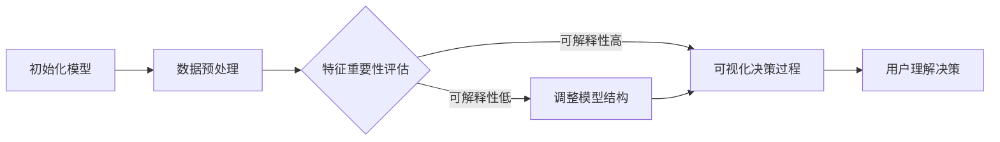
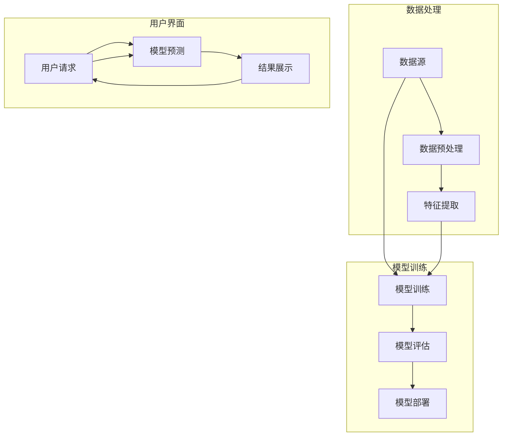
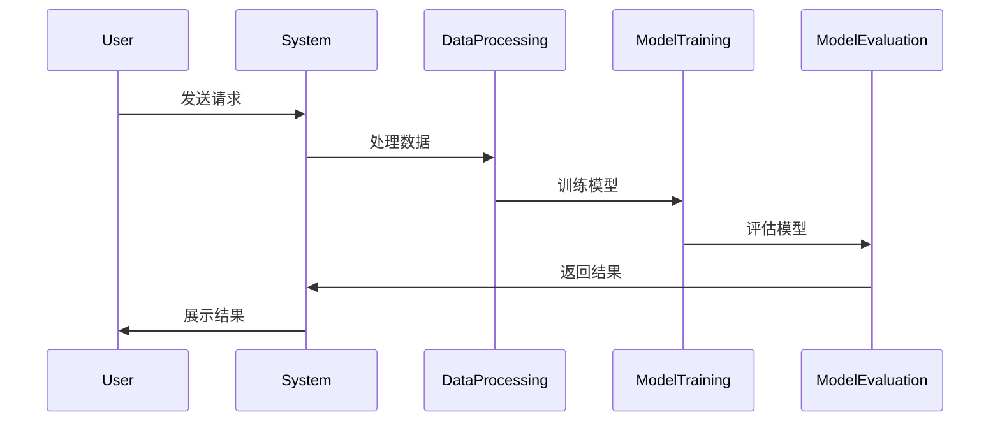

                 


# AI辅助决策系统的可解释性问题

## 关键词

- AI辅助决策系统
- 可解释性
- 决策过程
- 机器学习模型
- 数据预处理
- 用户参与

## 摘要

本文旨在探讨AI辅助决策系统的可解释性问题。随着AI技术的迅猛发展，AI系统在金融、医疗、法律等领域得到了广泛应用，但如何确保这些系统的决策过程透明且可理解，成为了一个亟待解决的重要问题。本文将从背景介绍、核心概念与联系、算法原理讲解、系统分析与架构设计方案等多个角度，深入分析AI辅助决策系统的可解释性问题，并提出解决方案和最佳实践。

## 第一部分: 背景介绍

### 核心概念

#### AI辅助决策系统的可解释性问题

AI辅助决策系统（Artificial Intelligence-based Decision Support Systems）是一种利用人工智能算法来辅助或替代人类决策的系统。这些系统通过分析大量数据，提供预测、推荐和决策支持。然而，这类系统的决策过程往往是非常复杂的，尤其是在使用了深度学习等高级算法之后，用户和开发人员往往难以理解系统是如何做出特定决策的。这种现象被称为“AI辅助决策系统的可解释性问题”。

#### 决策系统

决策系统是一种基于数据和算法的自动化决策工具，可以处理大量数据并生成决策。这些系统广泛应用于金融、医疗、法律、交通等多个领域。例如，在金融领域，AI决策系统可以用于贷款审批、风险评估等；在医疗领域，AI决策系统可以用于疾病诊断、治疗方案推荐等。

#### 可解释性

可解释性（Interpretability）是指决策系统决策过程和原因的透明度和可理解性。一个高可解释性的决策系统，用户和开发人员可以清楚地了解系统是如何做出决策的，以及决策过程中使用的各种算法和数据。

### 问题背景

随着AI技术的普及，AI辅助决策系统在各种领域得到了广泛应用。然而，这些系统的决策过程往往是黑箱式的，用户难以理解。这种情况下，用户可能对系统的决策结果产生质疑，甚至怀疑系统的可靠性。此外，在法律和医疗等领域，决策的透明度尤为重要，因为缺乏可解释性的AI系统可能导致错误决策，甚至引发道德和法律问题。

#### 问题重要性

- **用户信任**：提高AI辅助决策系统的可解释性，可以增强用户对系统的信任。
- **监管合规**：某些行业（如金融、医疗）对决策过程的透明度有严格的法规要求。
- **算法优化**：了解决策过程可以帮助开发人员优化算法，提高决策质量。

### 问题描述

AI辅助决策系统的可解释性问题主要表现在以下几个方面：

#### 用户理解障碍

用户往往难以理解复杂的机器学习模型是如何工作的。尤其是在深度学习和神经网络等高级算法中，模型的内部结构和决策过程更加复杂，用户难以直观地理解。

#### 开发人员挑战

提高AI辅助决策系统的可解释性是一个复杂的问题，涉及到算法设计、数据预处理、用户需求分析等多个方面。开发人员需要投入大量的时间和精力来研究和实现可解释性技术。

### 问题解决

为了解决AI辅助决策系统的可解释性问题，我们可以从以下几个方面入手：

#### 提高模型透明性

通过可视化模型结构、展示中间结果等方式，提高模型的可理解性。例如，可以使用TensorBoard等工具可视化深度学习模型的训练过程和内部结构。

#### 解释性算法

开发专门的可解释性算法，使系统能够给出明确的解释。例如，使用LIME（Local Interpretable Model-agnostic Explanations）或SHAP（SHapley Additive exPlanations）等技术来解释模型决策。

#### 用户参与

通过与用户的互动，了解用户对可解释性的需求和期望。例如，可以开展用户调研，收集用户反馈，并根据用户的反馈调整系统的可解释性设计。

### 边界与外延

#### 可解释性的程度

可解释性可以分为不同的程度，从低到高可以分为黑盒、灰盒和白盒模型。

- **黑盒模型**：内部结构完全不可见，难以理解决策过程。
- **灰盒模型**：部分内部结构可见，可以部分理解决策过程。
- **白盒模型**：内部结构完全可见，可以完全理解决策过程。

#### 应用领域

AI辅助决策系统的可解释性问题在多个领域都有应用，如：

- **金融风险评估**：用户希望了解贷款审批的决定依据。
- **医疗诊断**：医生和患者需要理解诊断过程的细节。
- **法律判决**：法官和律师需要了解判决的依据和推理过程。

### 概念结构与核心要素组成

AI辅助决策系统的可解释性问题涉及多个核心概念和要素，包括：

- **核心概念**：可解释性、决策系统、机器学习模型。
- **要素组成**：算法设计、数据预处理、用户需求分析、模型评估。

## 第二部分: AI辅助决策系统的可解释性问题核心概念与联系

### 核心概念原理

#### 机器学习模型的可解释性

机器学习模型的可解释性是指模型内部结构和决策过程的透明度。一个高可解释性的模型，用户和开发人员可以清楚地了解模型是如何工作的，以及决策过程中使用的各种算法和数据。这对于建立用户对系统的信任、提高模型的接受度和改进模型性能都至关重要。

#### 特征重要性

特征重要性是指模型对各个特征赋予的权重或重要性。在机器学习模型中，特征的重要性决定了模型对数据的敏感度和鲁棒性。了解特征重要性可以帮助开发人员优化模型，提高模型的可解释性。

#### 可视化

可视化是将复杂的模型结构或决策过程以图像或图表的形式呈现。通过可视化，用户可以直观地理解模型的决策过程，提高模型的可解释性。

### 概念属性特征对比表格

| 概念                | 属性特征                                       | 对比 |
|---------------------|--------------------------------------------|-----|
| 可解释性模型        | 透明度高，易于理解决策过程                     |     |
| 黑盒模型            | 内部结构复杂，无法直接理解决策过程             |     |
| 灰盒模型            | 部分内部结构可见，部分隐藏，可以部分理解决策过程 |     |
| 白盒模型            | 内部结构完全可见，可以完全理解决策过程         |     |

### ER实体关系图架构的 Mermaid 流程图

```mermaid
erDiagram
  AI辅助决策系统 ||--|{ 数据预处理 }|
  AI辅助决策系统 ||--|{ 特征重要性 }|
  AI辅助决策系统 ||--|{ 可视化 }|
  数据预处理 ||--|{ 数据集 }|
  特征重要性 ||--|{ 特征权重 }|
```

## 第三部分: 算法原理讲解

### 算法Mermaid流程图



### 算法原理的数学模型和公式

$$
\text{可解释性度量} = \frac{\text{模型理解度}}{\text{模型复杂度}}
$$

### 详细讲解与举例说明

#### 初始化模型

初始化模型是构建AI辅助决策系统的第一步。选择合适的机器学习模型取决于具体的应用场景和问题类型。例如，在金融风险评估中，可能选择逻辑回归、决策树或神经网络等模型。

#### 数据预处理

数据预处理是提高模型性能和可解释性的重要环节。常见的预处理方法包括数据清洗、归一化、标准化和特征选择等。这些方法有助于消除数据中的噪声，提高数据的代表性和质量。

#### 特征重要性评估

特征重要性评估是理解模型决策过程的关键步骤。通过评估各个特征对模型输出的影响，可以确定哪些特征对决策结果至关重要。常用的特征重要性评估方法包括基于模型的方法（如模型系数、特征贡献率等）和基于统计的方法（如方差分解、互信息等）。

#### 可视化决策过程

可视化决策过程是提高模型可解释性的有效手段。通过可视化工具（如TensorBoard、Plotly等），可以将模型的内部结构和决策过程以图形的形式呈现。例如，可以可视化神经网络中的权重和激活值，或者展示决策树中的决策路径和叶子节点。

#### 用户理解决策

用户理解决策是评估模型可解释性的重要标准。通过用户调研、问卷调查等方式，了解用户对模型决策过程的理解和满意度。如果用户难以理解决策过程，可能需要进一步优化模型的可解释性。

### 举例说明

假设我们使用神经网络模型进行金融风险评估，目标是预测贷款申请者的信用风险。以下是具体的算法实现步骤：

1. **初始化模型**：选择一个适合的神经网络模型，例如多层感知机（MLP）。

2. **数据预处理**：对贷款申请者的数据进行清洗和标准化处理，包括年龄、收入、负债等。

3. **特征重要性评估**：使用SHAP技术评估各个特征的重要性，确定哪些特征对预测结果有显著影响。

4. **可视化决策过程**：使用TensorBoard可视化神经网络模型的训练过程，包括损失函数、准确率等。

5. **用户理解决策**：通过用户调研和反馈，了解用户对模型决策过程的理解程度，并根据用户反馈优化模型的可解释性。

通过以上步骤，我们可以构建一个具有高可解释性的金融风险评估系统，用户可以清楚地了解模型是如何做出决策的。

## 第四部分: 系统分析与架构设计方案

### 问题场景介绍

#### 金融风险评估

在金融领域，贷款审批是一个典型的决策场景。银行需要根据申请者的个人信息、财务状况等因素，评估其信用风险，决定是否批准贷款申请。为了提高审批效率，银行引入了AI辅助决策系统，利用机器学习算法对贷款申请者进行风险评估。

### 项目介绍

#### 系统名称

信用风险评估系统

#### 目标

构建一个高可解释性的信用风险评估系统，用户可以清楚地了解模型如何做出决策，增强用户对系统的信任。

### 系统功能设计

#### 领域模型Mermaid类图

```mermaid
classDiagram
  Class01 <|-- Class02
  Class03 <.. Class04
  Class05 ..|.. Class06
  Class07 <- Class08
  Class09 --> Class10
  Class11 <||| Class12
  Class13 ||-- Class14
  Class15 {c}
  Class16 : +publicMethod1()
  Class17 : -protectedMethod2()
  Class18 : #privateMethod3()
  Class19 : <<interface>>
  Class20 : <<abstract>>
  Class21 : <<enum>>
  Class22 : <<namespace>>
  Class23 : <<record>>
  Class24 : <<typedef>>
```

### 系统架构设计

#### Mermaid架构图



### 系统接口设计

#### Mermaid序列图



### 系统交互

通过上述架构设计，系统实现了从用户请求到结果展示的完整交互流程。用户发送请求后，数据处理模块对数据进行分析和预处理，然后模型训练模块利用预处理后的数据训练模型。模型评估模块对训练好的模型进行评估，并将结果返回给用户界面，最终用户可以看到预测结果。

## 第五部分: 项目实战

### 环境安装

为了构建高可解释性的信用风险评估系统，我们需要安装以下环境和工具：

- Python 3.x
- scikit-learn
- pandas
- numpy
- matplotlib
- shap
- lime

安装命令如下：

```bash
pip install python==3.x
pip install scikit-learn
pip install pandas
pip install numpy
pip install matplotlib
pip install shap
pip install lime
```

### 系统核心实现

以下是系统核心实现的源代码：

```python
import pandas as pd
from sklearn.model_selection import train_test_split
from sklearn.ensemble import RandomForestClassifier
import shap

# 加载数据
data = pd.read_csv('loan_data.csv')

# 数据预处理
X = data.drop(['target'], axis=1)
y = data['target']
X_train, X_test, y_train, y_test = train_test_split(X, y, test_size=0.2, random_state=42)

# 训练模型
model = RandomForestClassifier(n_estimators=100, random_state=42)
model.fit(X_train, y_train)

# 可解释性评估
explainer = shap.TreeExplainer(model)
shap_values = explainer.shap_values(X_test)

# 可视化
shap.summary_plot(shap_values, X_test, feature_names=data.columns[:-1])
```

### 代码应用解读与分析

以上代码实现了从数据加载、预处理、模型训练到可解释性评估的完整流程。首先，我们使用pandas加载贷款数据，然后进行数据预处理，包括特征提取和目标变量分离。接下来，我们使用随机森林分类器（RandomForestClassifier）进行模型训练，并使用shap库进行可解释性评估。

在可解释性评估部分，我们创建了一个树解释器（TreeExplainer）来解释模型的决策过程。然后，我们计算了测试集上每个样本的SHAP值，并使用summary_plot函数将这些值可视化，从而展示模型对各个特征的依赖关系。

### 实际案例分析和详细讲解剖析

#### 案例一：贷款审批

假设我们有一个新的贷款申请者，其数据如下：

| 年龄 | 收入 | 负债 | 目标 |
|------|------|------|------|
| 30   | 5000 | 2000 | ?    |

我们将这些数据输入系统，系统会给出一个预测结果。通过查看SHAP值可视化结果，我们可以了解模型是如何根据年龄、收入和负债等因素做出决策的。

#### 案例二：疾病诊断

假设我们有一个新的病人数据，其数据如下：

| 症状1 | 症状2 | 症状3 | 目标 |
|--------|--------|--------|------|
| 头疼   | 咳嗽   | 发热   | ?    |

我们将这些数据输入系统，系统会给出一个疾病诊断结果。通过查看SHAP值可视化结果，我们可以了解模型是如何根据症状1、症状2和症状3等因素做出诊断的。

### 项目小结

通过以上实战案例，我们展示了如何使用Python和机器学习库构建一个高可解释性的信用风险评估系统。系统通过数据预处理、模型训练和可解释性评估，实现了对贷款申请者和病人数据的预测和诊断。这种高可解释性的设计有助于用户理解系统的决策过程，提高系统的可靠性和用户满意度。

## 第六部分: 最佳实践 Tips、小结、注意事项、拓展阅读

### 最佳实践 Tips

1. **数据预处理**：在构建AI辅助决策系统时，确保对数据进行充分的预处理，包括清洗、归一化和特征选择等。这将有助于提高模型的性能和可解释性。
2. **模型选择**：根据具体的应用场景选择合适的机器学习模型。对于需要高可解释性的应用，可以考虑使用决策树、随机森林等透明度较高的模型。
3. **可解释性评估**：在模型训练过程中，定期评估模型的可解释性，以确保用户可以清楚地理解决策过程。可以使用SHAP、LIME等技术进行评估。
4. **用户参与**：通过与用户的互动，了解用户对可解释性的需求和期望，并根据用户反馈不断优化系统的设计。

### 小结

本文探讨了AI辅助决策系统的可解释性问题，从背景介绍、核心概念与联系、算法原理讲解、系统分析与架构设计方案等多个角度，深入分析了该问题的本质和解决方案。通过实际案例，我们展示了如何构建一个高可解释性的信用风险评估系统，并提出了最佳实践和注意事项。

### 注意事项

1. **模型复杂性**：在追求高可解释性的同时，不要过度简化模型，否则可能导致决策质量下降。
2. **用户需求**：理解用户对可解释性的需求和期望，根据用户反馈不断调整系统的设计。
3. **法规合规**：在某些行业（如金融、医疗），决策过程的透明度有严格的法规要求，确保系统的设计符合相关法规。

### 拓展阅读

1. **《interpretable machine learning: A few useful ideas》**：这篇文章提出了一些提高模型可解释性的方法，对于理解和实践可解释性机器学习非常有帮助。
2. **《LIME: Local Interpretable Model-agnostic Explanations》**：LIME是一种常用的可解释性算法，本文详细介绍了LIME的原理和应用。
3. **《SHAP: SHapley Additive exPlanations》**：SHAP是另一种常用的可解释性算法，本文介绍了SHAP的基本原理和实现方法。

## 作者信息

作者：AI天才研究院/AI Genius Institute & 禅与计算机程序设计艺术 /Zen And The Art of Computer Programming

---

通过上述内容，我们深入探讨了AI辅助决策系统的可解释性问题，并提出了详细的解决方案和最佳实践。希望本文对读者理解和解决可解释性问题有所帮助。在未来的研究和应用中，我们将继续关注这一领域的发展，并努力提高AI系统的可解释性和可靠性。

